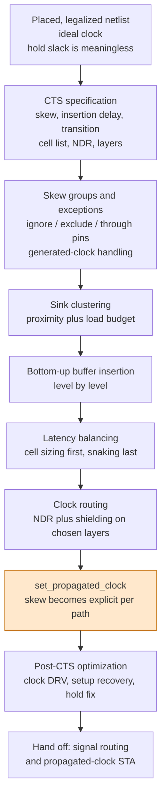
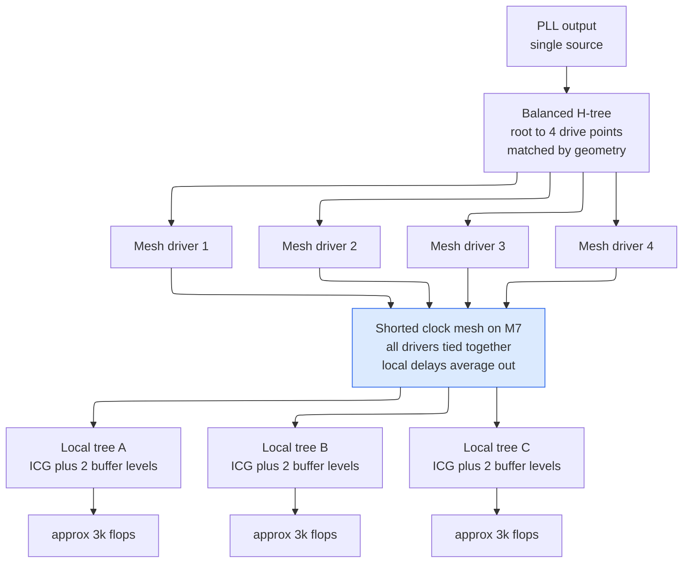

# Clock Tree Synthesis — manufacturing the timing reference the whole design is measured against

> **Prerequisites:** [Placement_Legalization_and_Optimization](04_Placement_Legalization_and_Optimization.md) (the legalized flop locations CTS clusters over, and why register clustering decides whether a low-skew tree is buildable), [PLL_DLL_and_Clock_Distribution](../03_Frontend_RTL_and_Verification/05_PLL_DLL_and_Clock_Distribution.md) (where the clock comes from, its jitter, and the H-tree/spine/mesh menu), [STA](../06_Signoff/01_STA.md) (setup/hold inequalities, signed skew, uncertainty, CPPR — used here, not re-derived).
> **Hands off to:** [Routing_and_Parasitic_Extraction](06_Routing_and_Parasitic_Extraction.md) (clock nets route first, with non-default rules and shields, then become extracted RC), [STA](../06_Signoff/01_STA.md) (the propagated clock network and per-path skew signoff measures every path against), [Signoff_Orchestration_ECO_and_Tapeout_Readiness](../06_Signoff/04_Signoff_Orchestration_ECO_and_Tapeout_Readiness.md) (the hold ECO stream that begins here).

---

## 0. Why this page exists

Every timing number the flow has produced so far rests on a fiction: the **clock is ideal**. Synthesis, floorplanning, and placement all assume a net reaching a few hundred thousand flip-flop clock pins at the same instant, with zero delay, zero transition time, and zero power. No such net exists — the clock-pin capacitance alone on a 200,000-flop block is a couple of hundred picofarads.

**Clock tree synthesis (CTS)** replaces that fiction with a physical network of buffers, inverters, and wires, then tells static timing analysis (STA) the truth about it. Three things change at once. Skew stops being a lump of guessed margin and becomes an explicit, signed, per-path quantity. **Hold timing becomes real for the first time** — before CTS, hold slack is computed against a skew of zero that nobody believes, so fixing it is guaranteed waste. And a network that did not exist a minute ago becomes the largest single consumer of dynamic power on the die.

Treating CTS as "run the tool, check the skew number" ships three defects downstream: an over-deep tree costing every path 20–40 ps of on-chip-variation pessimism; tens of thousands of hold violations arriving at routing as an area and congestion problem; and a clock burning 45 % of block dynamic power — ten points past the top of the normal 20–35 % band of §11 — because the gating sits at the leaves instead of the trunk. This page owns the *implementation*. Topology selection is derived in [PLL_DLL_and_Clock_Distribution](../03_Frontend_RTL_and_Verification/05_PLL_DLL_and_Clock_Distribution.md) §7, the zero-skew merge geometry in [Physical_Design](01_Physical_Design.md) §4.2, the slack algebra and CPPR in [STA](../06_Signoff/01_STA.md) §3–§4.



The contract: everything before `PROP` operates on a *model* of clock arrival, everything after on measured arrival. Trace one flip-flop — arrival 0 ps before `SPEC`, a member of a 20-sink cluster after `CLU`, modeled arrival 486 ps after `BAL`, measured 503 ps after `RTE` and extraction because the real route ran longer. The trade-off: everything expensive — buffers, power, metal — is committed *before* the step that reveals whether it was right, which is why the specification in §2 does so much of the work.

---

## 1. Ideal to propagated: exactly what changes in the inequalities

Before CTS the clock is three constraint lines and nothing physical (semantics in [Constraints_SDC](../04_Synthesis/02_Constraints_SDC.md)):

```tcl
create_clock -name CLK -period 0.800 [get_ports clk_in]
set_clock_latency        0.450 [get_clocks CLK]     ;# flat guess, same for every sink
set_clock_uncertainty -setup 0.150 [get_clocks CLK] ;# jitter + GUESSED skew + margin
set_clock_uncertainty -hold  0.050 [get_clocks CLK] ;# a bet on skew you have not built
```

`set_clock_latency` applies the same number to every sink, so it cancels out of every register-to-register path and does work only on I/O paths. The load-bearing line is `set_clock_uncertainty`: one scalar standing in for a quantity that differs for every pair of flops. After CTS you assert `set_propagated_clock [all_clocks]`, the tool walks the real buffer chain to each clock pin, and uncertainty shrinks to jitter plus a thin margin. From [STA](../06_Signoff/01_STA.md) §3, with $t_{skew} \equiv t_{ci,C} - t_{ci,L}$ (capture insertion minus launch insertion):

$$
s_{setup} = T + t_{skew} - t_{cq}^{\max} - t_{comb}^{\max} - t_{su} - t_{unc,s},
\qquad
s_{hold} = t_{cq}^{\min} + t_{comb}^{\min} - t_{skew} - t_{h} - t_{unc,h}.
$$

Under an ideal clock $t_{skew} \equiv 0$ *identically, for every path* — the entire content of "ideal". Post-CTS it is a per-path number, and because setup pits the *late* launch clock against the *early* capture clock while hold does the reverse, **the setup skew and the hold skew of the same path are different numbers**.

Worked problem 1 runs one path through both regimes at $T = 800$ ps: setup improves 92 ps, hold swings 53 ps from $+35$ to $-18$ ps. So **pre-CTS slack is not conservative, merely different** — one check got better, the other worse, and "closed pre-CTS" carries a ±100 ps error bar in both directions. The 51 ps gap between that path's setup skew ($+22$ ps) and hold skew ($+73$ ps) is the min/max spread of the *divergent* clock path, exactly what CPPR (§8) shrinks. And **hold fixing is a post-CTS activity by construction** (§9), because pre-CTS you cannot know the sign of what you would be fixing.

---

## 2. The clock-tree specification: every constraint has a physical reason

CTS does close to exactly what you tell it, so the specification *is* the design.

```tcl
set_clock_tree_options -target_skew 0.030            ;# 30 ps global, 3.75% of T
set_max_transition  0.060 [get_clocks CLK]           ;# 60 ps = 7.5% of T, clock-only
set_max_capacitance 0.080 [get_clocks CLK]           ;# 80 fF per driver
set_max_fanout      24    [get_clocks CLK]
set_lib_cell_purpose -include cts [get_lib_cells */CLKINV_X{4,8,12,16}]
set_lib_cell_purpose -exclude cts [get_lib_cells */*ULVT*]        ;# leakage
create_routing_rule CLK_2W2S -widths {M5 0.056 M6 0.056} \
                             -spacings {M5 0.056 M6 0.056} -shields VSS
set_clock_routing_rules -rule CLK_2W2S -min_routing_layer M5 -max_routing_layer M7
```

**Global vs. local skew.** Global skew is $\max_i t_i - \min_i t_i$ over all sinks: the number in the report, and almost never the number that matters, because two flops that never exchange data can differ by 200 ps at zero cost. **Local skew** is the arrival difference between flops joined by an actual timing path — the quantity that lands in slack. A tree at 45 ps global / 8 ps local beats one at 25 ps global / 20 ps local. Constrain global skew because it is cheap and bounds local skew above; constrain local skew through **skew groups** (§6). Typical at 1–2 GHz: global 3–5 % of period, local 10–25 ps; below ~10 ps you fight your own delay-cell quantization.

**Maximum insertion delay** bounds a quantity that cancels out of register-to-register timing, for three reasons: on-chip-variation derating scales with the *divergent* path length (§8), so at a 4 % derate every extra 100 ps of unshared clock costs ~8 ps of pessimistic skew; I/O paths do not cancel, so insertion delay lands whole against `set_input_delay`; and levels cost power and area. Typical target 300–800 ps for 100k–300k flops. Hitting 300 ps on 300k flops demands wide fanout per level, which fights the transition target — that tension is the core of the spec.

**Maximum transition** is bounded far tighter for clocks (5–10 % of period) than for data (15–20 %), for four physical reasons. *Delay sensitivity*: cell delay is a 2-D function of input slew and load with a steep $\partial(\text{delay})/\partial(\text{slew})$ slope in the slow-slew region, so branches with 90 ps and 40 ps input slews track each other badly across corners even when they match nominally — slow clock slews **convert process variation into skew**. *Short-circuit power*: while the clock input sits between $V_{th,n}$ and $V_{DD}-|V_{th,p}|$ both devices of the receiving inverter conduct, and every flop pays that crowbar current every cycle. *Duty-cycle distortion*, which accumulates faster with slow edges — a clock drifted to 44/56 halves the margin of every half-cycle or dual-edge structure. *Noise immunity*: a slow edge lingers where a crosstalk pulse can push it across the switching threshold.

**Why inverters, and why *these* inverters.** A logic inverter is sized for logical effort, not equal $t_{plh}$ and $t_{phl}$; a *clock* inverter has its PMOS/NMOS ratio tuned so rise and fall match within a few percent, because unequal rise/fall stretches the high phase a few ps *per stage* and ten levels of that is tens of ps of duty-cycle error ([Standard_Cell_Libraries_and_Characterization](../04_Synthesis/03_Standard_Cell_Libraries_and_Characterization.md)). Inverters beat buffers on three counts: finer delay granularity, tuned per stage rather than per fixed internal pair; **first-order rise/fall cancellation**, since an edge stretched by stage $n$'s slow fall is squeezed by stage $n{+}1$'s slow rise, so an even-length inverter chain self-corrects duty cycle while pre-paired buffers cannot; and less area and delay, since a buffer always pays two stages. The cost is polarity bookkeeping — an even inversion count must reach every sink. Ultra-low-$V_{th}$ (ULVT) cells are excluded, the tree being the one structure instantiated thousands of times and never switched off; high-$V_{th}$ (HVT) clock cells are sometimes allowed deliberately, as slow delay elements for balancing (§4).

### 2.1 Non-default routing rules, quantified

Clock nets get a **non-default rule (NDR)**: double width, double spacing, sometimes grounded **shields**. The object being modeled is a driven distributed-RC line:

```tikz
\begin{document}
\begin{circuitikz}[scale=0.9]
  \node[not port] (inv) at (0,0) {};
  \draw (inv.in) -- ++(-1.2,0) node[left]{CLK};
  \draw (inv.out) to[R, l=$rL/2$] (3.4,0) to[R, l=$rL/2$] (6.8,0);
  \draw (3.4,0) to[C, l_=$cL$] (3.4,-1.8) node[ground]{};
  \draw (6.8,0) to[C, l_=$C_L$] (6.8,-1.8) node[ground]{};
\end{circuitikz}
\end{document}
```

The contract: the driver's output resistance sits in series with the wire's distributed $rL$ and $cL$, terminated in sink load $C_L$, and wire delay is $\approx\tfrac{1}{2}RC$ (Elmore). Trace a 150 µm M6 branch at a 7 nm-class node, $r = 16\ \Omega/\mu\text{m}$, $c = 0.20\ \text{fF}/\mu\text{m}$ (the 2× intermediate tier of [Routing_and_Parasitic_Extraction](06_Routing_and_Parasitic_Extraction.md) §1.2): $R = 2.4\ \text{k}\Omega$, $C = 30$ fF, $\tau_{1W} = 36$ ps. Double the width and $r$ halves while $c$ rises only to $\approx 0.26\ \text{fF}/\mu\text{m}$ (parallel-plate scales with width, fringe does not): $R = 1.2\ \text{k}\Omega$, $C = 39$ fF, $\tau_{2W} = 23.4$ ps — a 35 % cut, and the ratio $0.5\times1.3 = 0.65$ is width-independent, so 2W always buys exactly this. But the trade-off the figure really illustrates is variance: etch bias and line-edge roughness perturb width by a fixed *absolute* amount, so a $2W$ wire suffers half the fractional width error, and since $r \propto 1/w$, doubling width roughly halves the RC spread between two nominally identical branches.

**Double spacing** cuts coupling capacitance 45–55 %, which for a clock shows up not as delay but as **induced jitter**, $\Delta t \approx \frac{C_c}{C_c+C_g}\times(\text{aggressor slew})$; **shielding** removes it almost entirely at three tracks per clock wire. Clocks go on intermediate/thick metals (M5–M7), where $r$ per length is five to six times below M1–M2 (16 $\Omega/\mu$m against 90), and off the top ultra-thick layers reserved for the power grid ([Floorplanning_and_Power_Planning](03_Floorplanning_and_Power_Planning.md)). NDR plus shields costs 3–5× the routing resource of an ordinary net — the largest single resource CTS spends, and why clock routing runs *before* signal routing.

---

## 3. Structures, and when each one is right

| Structure | Global skew | OCV-driven skew | Clock power | Tracks | Where it is right |
|---|---|---|---|---|---|
| Single buffered tree | 40–120 ps | high | 1.00× | low | blocks under ~30k flops, < 800 MHz |
| Balanced H-tree | 25–60 ps | high | 1.05–1.15× | medium | top-level distribution to block clock pins |
| Spine / fishbone | 30–80 ps | medium-high | 1.00–1.10× | medium | the ASIC workhorse; long thin blocks |
| Mesh / grid | 5–15 ps | **low** | 1.6–2.5× | very high | top-bin CPU/GPU cores |
| Mesh over local trees | 10–25 ps | low-medium | 1.2–1.5× | high | large high-frequency blocks, 100k+ flops |
| Local clock buffers, 8–32 flops | < 10 ps in cluster | n/a (leaf) | +2–5 % | low | the leaf level of *any* of the above |



The contract: the mesh is a **short circuit**, not a tree. Trace an edge — it crosses the H-tree to four drivers with ~15 ps of geometric skew, and each driver pushes it onto the *same* metal, so the mesh node's arrival is a weighted average; if driver 2 sits in a droop and is 20 ps slow, the other three pull the node back and the sink sees ~5 ps. That is a *variance* argument, which is why an H-tree with equally good nominal matching still loses. The trade-off is the bill: the M7 grid is continuous and switches every cycle, so essentially all the 1.6–2.5× excess is that grid. At 4 GHz, 15 ps of skew is 6 % of the cycle and worth the watts; at 600 MHz it is 0.9 % and a spine costs nothing. **Local clock buffers** belong in every structure — making the leaf level explicit gives leaf gating a home (§5), per-cluster delay tuning a unit (§4), and the flop-pin transition a bounded load.

---

## 4. Clustering and balancing

**Clustering: the constraint is load, not distance.** CTS starts at the sinks and works up, partitioning them into clusters of one leaf buffer each. The objective reads "group nearby flops", but the *binding* constraint is the driver's load budget: with `max_capacitance = 80` fF, flop pin cap 1.2 fF, and ~0.20 fF/µm of leaf wire, a cluster of $n$ flops over $\ell$ µm is legal when $1.2n + 0.20\ell \le 80$ fF. Twenty-four flops in a tight 150 µm cluster use 58.8 fF and pass; the same 24 scattered over 300 µm use 88.8 fF and fail, so the tool splits them — adding a buffer and, worse, a *branch point that must then be balanced*. **Placement quality propagates directly into clock-tree quality**, which is why register clustering is a placement objective ([Placement_Legalization_and_Optimization](04_Placement_Legalization_and_Optimization.md)) and not only a CTS one.

**Construction and the balancing move set.** Each cluster driver becomes a new sink; repeat level by level until one driver covers everything, equalizing children's arrivals at every merge. The optimal geometric construction — **deferred merge embedding (DME)**, placing the merge point at the fraction $\alpha$ along the connecting segment where subtree delays are equal — is derived in [Physical_Design](01_Physical_Design.md) §4.2. When $\alpha$ falls outside $[0,1]$ the loads are too unbalanced for geometry alone, and the tool reaches for one of four moves:

| Move | Delay granularity | Cost | When |
|---|---|---|---|
| Resize the branch driver, X16 → X8 | 10–40 ps | small area/power change | first choice; effectively free |
| Swap $V_{th}$ flavor, LVT → SVT → HVT | 10–30 ps | leakage change | second choice |
| Insert a delay cell or extra buffer level | 20–60 ps | +1 cell, +power, +OCV depth | when resizing is exhausted |
| Snake the wire (detour routing) | **0.3–1.0 ps/µm**, load- and length-dependent | routing resource, added load, corner de-correlation | tens of ps, and only after cells |

The snaking rate is routinely mis-stated, in both directions, so derive it. The usual quotation keeps only the term in which the *driver* charges the new capacitance, $\partial d/\partial L \approx 0.69\,R_d c_w = 0.69(400\,\Omega)(0.20\ \text{fF}/\mu\text{m}) = 0.055$ ps/µm — which would make snaking useless. That drops the two terms carried by the wire's *own* resistance. Differentiate the whole Elmore expression for a branch of length $L$ into sink load $C_L$, $d = 0.69\big[R_d(c L + C_L) + rL(\tfrac{cL}{2}+C_L)\big]$:

$$
\frac{\partial d}{\partial L} \;\approx\; 0.69\big(\underbrace{R_d c}_{\text{driver}} \;+\; \underbrace{r\,c\,L}_{\text{new }R\text{ on old }C} \;+\; \underbrace{r\,C_L}_{\text{new }R\text{ on the sinks}}\big).
$$

Only the first term is a property of the driver alone; the other two grow with the branch. On branch A of worked problem 2 — M6 at $r=16\ \Omega/\mu$m, $c = 0.20$ fF/µm, $L = 150$ µm, $C_L = 43$ fF of flop pins, $R_d = 400\ \Omega$ — the three terms are 0.08, 0.48 and 0.69 ps/µm, so $\partial d/\partial L \approx \mathbf{0.86\ ps/\mu m}$ and the driver-only figure is under a tenth of the truth. Buying 44 ps therefore takes **~50 µm** of detour, not 810.

So snaking *works* at the tens-of-picoseconds scale — and that is exactly why it is still the last resort. Its cost is not resource but composition: every micrometre of snake makes the branch more wire-dominated, and §10 shows that two branches with different cell-to-wire ratios track each other badly across corners. **Cells buy delay that varies like the rest of the tree; wire buys delay that does not.** Snake for the last few picoseconds, after resizing and $V_{th}$ swaps are exhausted, and never as the primary lever. So the **local-skew floor is set by the delay granularity of the clock cell library** — with cells quantized at ~15 ps, no tool effort gets local skew below roughly ±7 ps before OCV. A mesh, which shorts rather than balances, sidesteps the floor entirely.

**Three branches, and the unbalanceable sinks.** Worked problem 2 balances a node feeding 24 flops at 150 µm ($d_A = 40.0$ ps), an integrated clock-gating cell (ICG) plus 20 flops ($d_B = 84.5$ ps), and an SRAM macro whose CK pin sits at 33.6 ps but whose *internal* clock latency to the array flops is a further 195 ps. Balancing to the macro's **CK pin** costs two cells and lands at 84.5 ps of insertion; balancing to its **internal flops** costs nine extra buffer levels and 228.6 ps, because that latency is already inside the setup/hold arcs characterized at the macro's D and CK pins and compensating externally double-counts. The three canonical hard cases:

- **Macros with large internal clock latency** — exclude it, balance to the CK pin. If the macro genuinely exposes an internal generated clock that *other* logic consumes, give it its own skew group and let STA see the inter-group skew as an explicit, budgeted number.
- **ICG cells** — the 62 ps CK→GCLK delay is *inside* the tree and cannot be removed, so every ungated sibling must be padded by ~62 ps. Hence: put all ICGs at the **same level**, or every level absorbs a different pad.
- **Divided and generated clocks** — §6, where the failure is a *reference* problem rather than a balancing one.

A fourth case is **sinks the tree should not reach at all**: a clock arriving at a flop's D pin (a clock sampled as data, [Async_Design_and_CDC](../03_Frontend_RTL_and_Verification/06_Async_Design_and_CDC.md)), a test-only port, an output port. These become `ignore` or `exclude` pins (§6), not balance targets.

---

## 5. Clock gating in the tree

The power argument for gating and the RTL that infers it belong to [Power_Reduction_Techniques](../02_Power_and_Low_Power/04_Power_Reduction_Techniques.md) §2. What belongs here is the *placement* of the gate in the tree — a CTS decision with timing consequences the RTL author never sees.

A branch serving 4,000 flops at 1.5 GHz, 0.75 V decomposes as 4.8 pF of flop clock pins, 2.3 pF of wire (~9 mm at 0.26 fF/µm), and 1.8 pF of buffers, so $C_{branch} = 8.9$ pF and, with $\alpha = 1$ (the clock toggles every cycle by definition), $P = \alpha C V_{DD}^2 f = 7.5$ mW. At 60 % average idle, **root gating** (one ICG at the branch root) stops everything downstream, $0.60 \times 8.9 = 5.34$ pF → **save 4.5 mW**; **leaf gating** (167 ICGs, one per 24-flop cluster) stops the flop pins and last-level wire but not the trunk, $0.60(4.8+0.9) - 0.67 = 2.75$ pF after subtracting the new ICG clock pins → **save 2.3 mW**. Root gating saves **95 % more**, yet leaf gating is extremely common, because of four costs.

1. **Balancing.** The ICG's 62 ps CK→GCLK delay must be padded onto every branch *not* behind it. At the root that is the whole block: ~62 ps of insertion delay chip-wide.
2. **Skew.** ICG delay varies more across PVT than a plain inverter's — the cell contains a latch and an AND — so a branch behind an ICG and one behind a buffer do not track across corners (§10), and root gating puts that mismatch where it affects the most paths.
3. **The enable path gets harder — the non-obvious one.** The enable is launched by an ordinary flop with clock insertion $t_{ci,L}$ and captured at the ICG's own clock pin with insertion $t_{ci,ICG}$:

$$
\text{setup: } t_{ci,L} + t_{cq} + t_{comb} + t_{su,E} \le T + t_{ci,ICG},
\qquad
\text{hold: } t_{ci,L} + t_{cq}^{\min} + t_{comb}^{\min} \ge t_{ci,ICG} + t_{h,E}.
$$

A **root** ICG has a *small* $t_{ci,ICG}$ — it sits near the source, so its clock arrives early — while the flop generating the enable sits in the logic with a *large* $t_{ci,L}$. The enable's effective budget is $T - (t_{ci,L} - t_{ci,ICG})$; with $t_{ci,L} = 480$ ps and a root ICG at 60 ps it loses **420 ps of a 667 ps cycle** before the first gate, which routinely makes it the block's critical path. Leaf gating has $t_{ci,ICG} \approx t_{ci,L}$ and the term vanishes — but then hold on the enable binds instead.
4. **Instantaneous $di/dt$.** Turning a 4,000-flop branch on in one cycle steps block current by hundreds of mA, a droop event that must be budgeted ([Power_Analysis_and_Signoff](../02_Power_and_Low_Power/06_Power_Analysis_and_Signoff.md)); designs stagger multi-branch enables through a shift register to spread it.

The usual resolution is **two-level gating**: a coarse ICG per functional unit catching the big idle windows and most of the trunk capacitance, plus fine leaf ICGs for per-register idleness, with all coarse ICGs at the same tree level so the §4 pad is uniform.

**The clock-gating check in STA** is separate from the enable's setup/hold: a structural check that the gating signal never changes while the clock is in its *active* phase, since that would chop the pulse and emit a glitch or runt to thousands of flops. STA reports it as `clock_gating_setup` / `clock_gating_hold` arcs. An ICG makes this *structurally* safe by latching EN during the clock's low phase — precisely why it exists instead of a bare AND gate — but the check still applies to the latch's transparency window, which is why hand-written `assign gclk = clk & en;` is a bug rather than an optimization. **Minimum pulse width** must also be clean at every ICG output: a marginal enable can produce a GCLK pulse shorter than the flops' minimum, a silent, vector-dependent failure.

---

## 6. Skew groups and exceptions

A **skew group** is the set of sinks the tool balances *against each other*. The default — every sink of a clock — is wrong in two directions at once: flops in different power domains, modes, or physical corners may have no timing path between them, and forcing them to match buys insertion delay for nothing; while flops in different clock domains crossing through a synchronizer must *not* be balanced. The rule that generates the right answer: **a skew group should approximate the connected components of the register-to-register timing graph.** The tool derives most of this automatically; you override it for mode-dependent paths, false-pathed domain crossings, and blocks constrained by budgeted I/O delay.

| Exception | Effect on tracing | Effect on balancing | Canonical use |
|---|---|---|---|
| **ignore pin** | stop tracing; below it is not the clock | not a sink | a clock reaching a flop's D pin; a test-only port |
| **exclude pin** | keep tracing; the pin *is* a sink | latency **not** constrained | a macro CK pin you refuse to balance against; an output port |
| **non-stop pin** | force tracing *through* a pin where the tool would stop | downstream pins become sinks | a clock through a mux data pin, a divider Q, a custom cell |
| **through pin** | require the tree to pass through this point | topology constraint | forcing a trunk tap or a hand-placed driver |
| **float pin / delay assertion** | sink with an asserted extra latency | balanced *including* the assertion | a macro whose internal latency you *do* want compensated |

The `ignore` / `exclude` distinction is the one people get wrong. `ignore` says *this is not the clock*: the tool will not buffer beyond it and will not check design-rule violations (DRV) on it. `exclude` says *this is the clock, drive it properly, but do not match its arrival to anyone*. Using `ignore` where you meant `exclude` produces a real, unbuffered, slow-transition clock net that never appears in any clock report — a defect that survives to silicon because every clock check skipped it.

**The classic divided-clock failure.** A divider's output is a new clock declared with `create_generated_clock`; the tree below it is a separate tree, and the question is what it is balanced *to*. A `/2` divider flop's clock pin arrives at 380 ps and its CK→Q delay is 85 ps, so `clk_div2` first exists at 465 ps, while the undivided `clk` sinks are balanced at 480 ps. If CTS balances the `clk_div2` subtree **to its own root** — a normal tree with its own 300 ps of insertion — the div2 sinks land at 765 ps, and any path from a `clk` flop into a `clk_div2` flop has $t_{skew} = 765 - 480 = +285$ ps. Setup gets a 285 ps gift; hold gets a 285 ps bill: on a path with $t_{cq}^{\min}+t_{comb}^{\min} = 115$ ps and $t_h = 30$ ps, $s_{hold} = 115 - 285 - 30 = -200$ ps — **17 delay cells at 12 ps each on a single path**, with the same offset on *every* crossing path.

The fix has two parts. **Put the divider's sinks and the source clock's sinks in the same skew group** so the tool balances the union: it will try to build the div2 subtree with $480 - 465 = 15$ ps of insertion, find that impossible for thousands of sinks, and instead lengthen the `clk` branches toward 765 ps for everyone — correct, but expensive. Therefore, second: **place the divider as close to the clock root as possible.** With its clock pin at 60 ps, `clk_div2` exists at 145 ps and has 335 ps of budget for a real tree, and nothing else moves. So **dividers, clock muxes, and root gates belong at the top of the tree, near the clock entry point** — a floorplan decision made long before CTS runs ([Clock_Division_and_Switching](../03_Frontend_RTL_and_Verification/04_Clock_Division_and_Switching.md)). Every element *between* root and sinks consumes insertion budget the tree below it no longer has.

---

## 7. Useful skew, taken seriously

§1 treated skew as an error to minimize. It is better understood as a **resource to schedule**. Label each flop $i$ with clock arrival $a_i$; for stage $i \to j$ with data delays $d_{ij}^{\max}, d_{ij}^{\min}$ the two checks become constraints on the *difference*:

$$
\underbrace{a_j - a_i \;\ge\; t_{cq}^{\max} + d_{ij}^{\max} + t_{su} - T}_{\text{setup: lower bound}},
\qquad
\underbrace{a_j - a_i \;\le\; t_{cq}^{\min} + d_{ij}^{\min} - t_{h}}_{\text{hold: upper bound}}.
$$

Every stage contributes one interval. This is a **system of difference constraints**, solved by shortest paths on a constraint graph — the formulation Fishburn used in 1990 to pose clock-skew scheduling as a linear program. Two facts follow at once. **Setup is helped and hold is hurt by the same move, on the same stage**: widening $a_j - a_i$ to buy setup eats that stage's hold interval, so useful skew is bounded above by hold, always. And **around a loop, skew can only average, never remove** — for any cycle $\mathcal{C}$ the arrivals telescope, $\sum_{\mathcal{C}}(a_j-a_i) = 0$, so summing the setup lower bounds around it:

$$
0 \;=\; \sum_{\mathcal{C}}(a_j - a_i) \;\ge\; \sum_{\mathcal{C}}\!\left(t_{cq}^{\max} + d_{ij}^{\max} + t_{su} - T\right)
\;\;\Longrightarrow\;\;
\boxed{\;T \;\ge\; \frac{1}{|\mathcal{C}|}\sum_{\mathcal{C}}\!\left(t_{cq}^{\max} + d_{ij}^{\max} + t_{su}\right)\;}
$$

**The minimum period of a feedback loop is its average stage delay, and no skew schedule beats it.** Useful skew converts the *worst* stage into the *average* stage along an open chain, and a loop into its own average; it cannot create time. That inequality separates where useful skew helps enormously (a long pipeline with one bad stage) from where it does nothing (a tight accumulator loop already at its average).

Worked problem 3 runs the two-stage case in full: a stage needing 755 ps in a 700 ps period is rescued by delaying its capture clock, the feasible window is $\delta \in [55, 120]$ ps with the **upper bound set by hold, not setup**, and the best achievable period is the average of the two stages' requirements, $\tfrac{1}{2}(755+565) = 660$ ps — a 14 % gain with no logic changed. Shorten the min-delay path and the hold bound tightens, so **hold is the binding constraint on useful skew, and hold buffers are how you buy more of it.**

**Concurrent clock and data (CCD)** optimization — Synopsys CCD, Cadence CCOpt — does this at scale *during* tree construction rather than after, because moving one flop's arrival afterwards means restructuring a built branch. It solves the difference constraints over the real timing graph while simultaneously sizing and restructuring the *data* paths, so "spend a picosecond on a clock delay cell or on a data buffer" is decided once with both options visible; typical result 5–15 % on frequency. Three costs: **deliberate skew is deliberate hold risk**, with CCD hold-buffer counts routinely 1.5–2× a zero-skew run; **skew scheduled at one corner is not scheduled at another** (§10), so CCD must run multi-corner; and **ECO fragility**, since touching one stage invalidates the interval solution around it, which is why many teams cap useful skew at 10–15 % of the period.

---

## 8. CTS and on-chip variation: why depth is a tax

STA does not trust that two nominally identical buffers have identical delay. It derates the launch clock late and the capture clock early for setup, and the reverse for hold ([STA](../06_Signoff/01_STA.md) §5), so on a clock path of latency $t_{ci}$ with derate $\pm\delta$ the two paths spread apart by $2\delta\,t_{ci}$, entering slack as pure pessimism. But launch and capture share a **common path** from the root to their divergence point, and that chain is one physical set of buffers: it cannot be simultaneously slow (as launch) and fast (as capture). **Common-path pessimism removal (CPPR/CRPR)** credits it back, with credit $= t_{common}^{late} - t_{common}^{early}$ ([STA](../06_Signoff/01_STA.md) §4.3). What CTS controls is not the credit formula but **where the divergence point sits**. Take $t_{ci} = 500$ ps and a 4 % derate:

| Divergence point | Common path | Divergent path | OCV-induced skew $=2\delta\,t_{div}$ |
|---|---|---|---|
| Near the root, 24 % common | 120 ps | 380 ps | $2(0.04)(380) = 30.4$ ps |
| Mid-tree, 50 % common | 250 ps | 250 ps | 20.0 ps |
| Near the sinks, 84 % common | 420 ps | 80 ps | **6.4 ps** |

Moving the divergence point from 24 % to 84 % recovers **24 ps on every path in the group at zero power cost** — at 1.5 GHz, 3.6 % of the cycle, larger than the nominal skew the whole tree was tuned to achieve. Hence the rule: **keep the divergence point close to the sinks.** Flops that talk to each other must share a subtree as deep as possible, so they must be *physically near each other*, because CTS clusters by proximity — which puts the responsibility on placement. A block whose communicating registers are scattered pays 20–30 ps of unrecoverable pessimism on every critical path no matter how well CTS balances. Two corollaries: **shallow trees are doubly good** (less $t_{ci}$ to derate, fewer levels at which divergence can occur early); and this is the rigorous version of the mesh's advantage from §3, since a mesh has essentially *zero* divergent path and therefore near-zero OCV skew even before CPPR.

---

## 9. Post-CTS optimization: order of operations

§1 showed a path whose hold slack moved 53 ps between ideal and propagated clock, with the *sign* of the change set entirely by a tree that did not yet exist. Fixing hold before CTS therefore means wasted cells (buffering paths the real skew would have fixed, missing paths it breaks), damaged setup (every hold buffer is load and delay on a path that also has a setup check), and doubly consumed placement space. The one exception is *structural* hold fixing at synthesis: lockup latches between scan-chain segments crossing clock domains, correct regardless of skew ([DFT_and_ATPG](../06_Signoff/02_DFT_and_ATPG.md)).

1. **Fix clock DRV first.** A clock net violating max-transition or max-capacitance makes every downstream delay number wrong; optimizing against wrong delays is worse than not optimizing.
2. **Recover setup second** — resize, restructure, re-buffer long data nets — *before* hold, because setup fixes shorten paths and can create new hold violations, whereas the reverse order forces a second hold pass.
3. **Fix hold third**, with delay cells in the data path.
4. **Re-check setup fourth.** Hold cells add load; where a hold fix sits on a net that also feeds a critical path you can lose 3–10 ps, so any path within ~15 ps of zero must be re-examined.
5. **Legalize and re-time.** New cells displace neighbors, displacement changes wirelength, wirelength changes delay.

**Never fix hold by touching the clock tree after CTS.** Adding a buffer to a clock branch to delay a capture edge appears to solve one path and silently changes the skew of every path through that branch. If the clock must move, it moves through the CCD engine (§7) with the whole timing graph in view.

**Cost.** $N_{hold\ cells} \approx 1\text{–}5\ \%$ of instance count, above 10 % with aggressive useful skew, heavy scan, or a marginal floorplan. A 1.2 M-instance block reporting 12,000 failing hold endpoints at an average 45 ps violation needs 3 cells per endpoint at 15 ps each, but endpoints share data-path segments, so the effective count is ~1.8 per endpoint: $N \approx 21{,}600$ cells $= 1.8\ \%$ of instances. At 0.28 µm² each that is ~6,050 µm² on a 2 mm² block — **0.30 % area** — and at 15 % activity, $0.15\times43\ \text{pF}\times0.5625\times1.5\ \text{GHz} \approx 5.4$ mW, ~0.5 % of a 1.1 W block. The real cost is **schedule**: every round perturbs setup, and hold ECOs keep arriving after routing when extraction changes the min-delay numbers.

---

## 10. Multi-corner CTS: a tree balanced at one corner is unbalanced at another

Two branches with the same nominal delay need not have the same *composition*. Cell delay swings ±35–45 % across the corner set; wire RC delay only ±8–12 %, since metal resistance has a modest temperature coefficient but no threshold-voltage dependence. A mostly-cell branch and a mostly-wire branch therefore **diverge as you move off the balancing corner**. Two branches balanced at typical, with scale factors cells ×0.65 / ×1.45 and wires ×0.92 / ×1.08 (fast / slow):

| | Cell (typ) | Wire (typ) | Total typ | Fast | Slow |
|---|---|---|---|---|---|
| Branch A | 40 ps | 10 ps | 50 ps | $26.0 + 9.2 = 35.2$ | $58.0 + 10.8 = 68.8$ |
| Branch B | 20 ps | 30 ps | 50 ps | $13.0 + 27.6 = 40.6$ | $29.0 + 32.4 = 61.4$ |
| **Skew** | | | **0** | **+5.4 ps** | **−7.4 ps** |

Perfect at typical, ±7 ps elsewhere, **and the sign flips**. On a real ten-level tree this produces 30–80 ps of corner-induced skew.

**Balancing only at the slow corner makes the fast corner worse.** The instinct is to balance where setup is checked. To make $B_{slow} = A_{slow} = 68.8$ ps you add cell delay to B, so B's typical cell delay becomes $x$ with $1.45x + 32.4 = 68.8 \Rightarrow x = 25.1$ ps. At the fast corner, where hold is checked,

$$B_{fast} = 0.65(25.1) + 27.6 = 43.9\ \text{ps},\quad A_{fast} = 35.2\ \text{ps} \;\Rightarrow\; \text{skew} = +8.7\ \text{ps},$$

worse than the 5.4 ps you started with, because the slow-corner fix made B *more* cell-heavy and therefore *more* divergent from A at the other extreme. Hold is then checked with 8.7 ps on paths that had 20 ps of margin.

The repair is a balance objective over a corner *set* — minimally the setup and hold corners, often plus typical and a low-voltage corner where the cell/wire ratio shifts most — minimizing $\max_{c\in\mathcal{C}}\ \text{skew}_c(\text{tree})$ subject to DRV at all $c$. Runtime scales roughly linearly with corner count, and the tree is **slightly worse at every individual corner** than a single-corner-optimal one, giving up perhaps 3–5 ps at slow to gain 15 ps at fast; that trade is always worth taking. The deeper rule is structural, and it is why H-trees remain attractive despite their inefficiency: **matched structure tracks across corners; matched numbers do not.** Two branches with the same level count, cell types, and cell-to-wire ratio move together everywhere because they are the same circuit, so a spec constraining level-count uniformity and a small, similar cell list buys corner robustness no per-corner optimization replicates.

---

## 11. Clock-tree power

The clock is the only net with activity factor $\alpha = 1$ by definition, and its dynamic power is $P = \alpha C_{clk}V_{DD}^2 f$ ([Power_Fundamentals](../02_Power_and_Low_Power/01_Power_Fundamentals.md)). Two numbers are commonly confused: **clock network power** — buffers, clock wire, flop clock-pin capacitance — is **20–35 %** of block dynamic power (mesh designs at the top); **clock-related power**, adding the internal clock inverters inside every flip-flop, is **35–50 %**. For a 180k-flop, 1.5 GHz, 0.75 V block (worked problem 4 computes it end to end):

| Component | Capacitance | Share |
|---|---|---|
| Flop clock pins, 180k × 1.2 fF | 216 pF | 55 % |
| Clock wire, 380 mm × 0.26 fF/µm (NDR) | 98.8 pF | 25 % |
| Clock buffers, 9,840 × 8 fF effective | 78.7 pF | 20 % |
| **Total $C_{clk}$ → 332 mW** | **393.5 pF** | |

The buffer count is not a free parameter: at `max_fanout = 24` a 180k-flop block needs at least $180{,}000/24 = 7{,}500$ leaf drivers before a single trunk stage exists, so ~9,800 clock cells is the floor, not an aggressive number. Even so the *buffers* — the thing everyone tries to reduce — are 20 %, the smallest of the three terms and the only one CTS controls directly. Flop pin capacitance is irreducible for a given flop count, and wire is set by how far the tree must reach, which is set by the floorplan. Clock power is fundamentally an RTL and floorplanning problem and only secondarily a CTS one.

**Transition versus power.** Tightening `max_transition` forces more and larger buffers; loosening it saves buffer power but raises receiver short-circuit power and degrades delay predictability (§2). The two effects cross, and the minimum sits broadly at 5–10 % of the period — exactly where the standard target is set. Relative to a 60 ps baseline at 9,840 buffers, a 40 ps limit needs ~13,100 buffers (buffer and wire power, 45 % of the total, ×1.32; crowbar on the 55 % sink-pin term ×0.90; net +9 %) while a 90 ps limit needs ~7,300 (×0.82 and ×1.28, net +7 % *and* worse OCV). Below the knee you buy nothing; above it you pay twice, in crowbar current and in the variation-to-skew conversion of §2.

| Lever | Effect on $P_{clk}$ | Cost |
|---|---|---|
| Root-level gating vs. none | **−25 to −40 %** | insertion pad, enable criticality, $di/dt$ (§5) |
| Leaf-only gating vs. none | −12 to −20 % | ICG count, area, enable hold pressure (§5) |
| Remove one buffer level | −3 to −5 % per level | fanout per level rises → transition, skew (§2) |
| Mesh instead of tree | **+60 to +150 %** | a cost, paid for OCV immunity (§3) |
| Relax NDR from 2W to 1.5W | −8 to −12 % | RC variation up → skew up (§2.1) |
| Multi-bit register banking | −8 to −15 % | one clock pin per 2–4 bits; placement rigidity |
| Fewer flops in RTL | proportional | design effort; the largest lever of all |

Banking attacks the 55 % term directly: four 1-bit flops replaced by one 4-bit banked flop replaces four clock pins and four leaf stubs with one of each, cutting those registers' leaf capacitance 30–40 %, at the cost of placement rigidity.

---

## 12. Verification and review

```text
Clock: CLK   (propagated)   Period: 800 ps   Corners: {ss0p675v125c, ff0p825vm40c}
  Sinks              184,312   (flops 180,004 / macros 46 / excluded 4,262)
  Clock cells          9,840   (CLKINV_X8 6,980 / CLKINV_X16 2,210 / CLKBUF_X16 650)
  ICG cells            1,146   (trunk level 6: 42 / leaf level 11: 1,104)
  Levels             min 9  max 13  avg 11.4
  Insertion delay    min 463 ps  max 492 ps  avg 478 ps
  Global skew                  29 ps
  Local skew (worst group)     19 ps   [group: dp_core]
  Max clock transition         58 ps  (limit 60)  violations: 0
  Max clock capacitance        76 fF  (limit 80)  violations: 0
  Clock net length          381.4 mm  (NDR CLK_2W2S 100 %, shielded 34 %)
  Clock network power         332 mW  (buffers 66 / wire 84 / sink pins 182)
  Common-path fraction, worst 10 % of paths ......... 0.71
```

Read it in this order. **Sinks** — 4,262 excluded pins is a lot, and an unexplained excluded pin is a clock net nobody is checking. **Clock cells 9,840** against 180,004 flops is a leaf fanout of ~24, which is the specified limit: a report showing far *fewer* cells than $N_{flops}/\text{max\_fanout}$ means the fanout constraint is not actually being enforced, usually because part of the tree was traced as data. **Levels 9–13** — a four-level spread means some branch needed four extra stages to balance, ~160 ps of insertion bought to fix one imbalance, and that is a floorplan smell. **Insertion spread** 463–492 ps is 29 ps, which must equal global skew, and does. **Local skew 19 ps** is the number that lands in slack; global 29 ps meets the 30 ps target of §2 and is otherwise decoration unless the groups are wrong. **Common-path fraction 0.71** is §8's metric; below ~0.6 you give away OCV margin. **Power 332 mW** against a 1.1 W block is 30 %, inside the 20–35 % band but near its top — consistent with a tree that is 100 % NDR and a third shielded.

**The CTS quality checklist.** Skew within target *at every CTS corner* (§10). Insertion delay within target and consistent across sibling blocks, since 400 ps and 700 ps blocks cannot talk without 300 ps of interface skew. Zero clock DRV violations — hard gates, because one invalidates all downstream delay. Level-count spread ≤ 2–3. **Only clock cells in the clock path**: a logic buffer means unbalanced rise/fall and an uncharacterized cell in the most delay-sensitive network on the die, and it arrives through ECOs, so check explicitly. ICGs at their intended levels with sane fanouts. NDR at 100 % with shields where specified — partial NDR is a common silent failure when routing resources run out. No long unshielded runs beside aggressors ([Signal_Integrity_Reliability](02_Signal_Integrity_Reliability.md)). Skew groups matching the real communication graph. Clock-gating and minimum-pulse-width checks clean at every ICG and divider output (§5). No unexpected sinks. Duty cycle in spec at the leaves if any half-cycle or dual-edge logic exists.

**Signals that mean "go back and re-floorplan."** *Insertion delay far above target with no DRV violations* — the sinks are far apart, and no CTS setting fixes distance. *Level spread of 4 or more* — a cluster of flops is stranded, usually on the far side of a macro. *Clock DRV unfixable for lack of legal placement sites* — a buffer is needed in a macro channel with no standard-cell rows ([Floorplanning_and_Power_Planning](03_Floorplanning_and_Power_Planning.md)). *Clock buffer density above ~15–20 % in a region* — cells that switch every cycle, a guaranteed IR-drop and thermal hotspot. *Common-path fraction below ~0.6* — communicating registers are not clustered; fix it in placement. *A divider, mux, or root ICG deep in the tree* (§6) — move it up by hand. *Two skew groups that must be balanced but sit at opposite corners of the die* — unbuildable at low skew, so budget the skew explicitly or move the blocks.

### 12.1 What the tree delivers, cycle by cycle

```wavedrom
{ "signal": [
  { "name": "clk_root",    "wave": "1.......0.......1.......0......." },
  { "name": "clk_launch",  "wave": "0........1.......0.......1......",
                           "node":  ".........a...............c......" },
  { "name": "clk_capture", "wave": "0..........1.......0.......1....",
                           "node":  "...........b...............d...." },
  {},
  { "name": "D long path", "wave": "2....................3..........",
                           "data": ["previous value", "new value"],
                           "node":  ".....................e.........." },
  { "name": "setup/hold aperture", "wave": "0.........................1..0.." },
  {},
  { "name": "D short path", "wave": "4..........5....................",
                            "data": ["previous value", "new value"] },
  { "name": "hold window, 1st edge", "wave": "0.........1.0..................." }
 ],
 "edge": ["a~>b skew +100 ps", "e~>d setup margin"],
 "head": {"text": "one grid step = 50 ps; T = 800 ps; launch insertion 450 ps, capture insertion 550 ps"}
}
```

The contract: `clk_root` is the reference the SDC declares, while `clk_launch` and `clk_capture` are what the *built tree* delivers to two flop clock pins — every gap between those rows is skew. Trace the long path: the launch edge fires at grid 9 (450 ps), data settles at grid 21 (1050 ps), and its capture edge is `clk_capture`'s second rise at grid 27 with the aperture opening one step earlier, leaving 250 ps of setup margin — 100 ps of which exists *only because* the capture clock is 100 ps later. Now the short path: the same launch edge drives a path with almost no logic whose new value appears at grid 11, but `clk_capture`'s *first* rise is also at grid 11 and its hold window extends past it, so the new value lands inside the window of the edge meant to capture the *previous* value. Aligned clocks would have put that edge at grid 9, giving two steps of margin. The trade-off: sliding `clk_capture` right buys setup on the long path and spends hold on the short path, one picosecond for one, and §7's feasible interval is exactly where both rows stay legal.

---

## Numbers to memorize

| Quantity | Value | Why it matters |
|---|---|---|
| Global skew target, 1–2 GHz block | 3–5 % of period (20–50 ps) | the headline CTS number; bounds local skew (§2) |
| Local skew target, within a skew group | 10–25 ps | the number that actually lands in slack (§2, §6) |
| Max clock transition | 5–10 % of period (30–80 ps) | slow slew → delay variability + crowbar power (§2, §11) |
| Insertion delay target, 100–300k flops | 300–800 ps | sets the OCV-derated divergent path (§2, §8) |
| Clock buffer fanout per level | 8–24 sinks | set by max-cap and max-transition (§4) |
| Tree levels, 200k-flop block | 8–14, spread ≤ 3 | each level ≈ 3–5 % of clock power (§11, §12) |
| Clock cell count | $\ge N_{flops}/\text{max\_fanout}$, ~9,800 for 180k flops | far fewer means the tree is not fully traced (§11, §12) |
| Clock cell delay per level | 30–60 ps | granularity of every balancing move (§4) |
| Wire-snaking delay rate | **0.3–1.0 ps/µm**; $0.69(R_dc + rcL + rC_L)$ | the driver-only formula understates it ~10× (§4) |
| Achievable local-skew floor | ±7–15 ps | set by delay-cell quantization (§4) |
| Clock NDR | 2× width, 2× space; 3–5× tracks | halves $R$ and RC spread, cuts coupling jitter (§2.1) |
| Post-CTS clock uncertainty | 30–80 ps setup / 20–40 ps hold | replaces the pre-CTS skew guess (§1) |
| ICG CK→GCLK delay | 50–90 ps | padded onto every ungated sibling branch (§4, §5) |
| Macro internal clock latency | 100–300 ps | balance to the CK pin, not the internal flop (§4) |
| Common-path fraction target | **> 0.7** | 0.24 → 0.84 recovers ~24 ps of OCV skew (§8) |
| Useful-skew gain / loop bound | 10–20 % freq; $T \ge$ average stage delay | bounded by **hold**; skew averages, never creates time (§7) |
| Corner-induced skew, balanced tree | 30–80 ps, **sign can flip** | why multi-corner CTS exists (§10) |
| Post-CTS hold cells | 1–5 % of instances (10 %+ with CCD/scan) | area 0.3–1.5 %, power 0.5–3 % (§9) |
| Clock network dynamic power | 20–35 % of block dynamic | 35–50 % including flop-internal clock (§11) |
| Clock power split | ~55 % sink pins / 25 % wire / 20 % buffers | flop count, not buffer count, is the lever (§11) |

---

## Worked problems

**1 — Ideal to propagated on one path.** $T = 800$ ps; $t_{cq}^{\max}=90$, $t_{cq}^{\min}=55$, $t_{comb}^{\max}=500$, $t_{comb}^{\min}=60$, $t_{su}=45$, $t_h=30$ ps. Pre-CTS: ideal clock, $t_{unc,s}=150$, $t_{unc,h}=50$ ps. Post-CTS: launch latency 452 / 428 ps (late / early), capture latency 501 / 474 ps, uncertainty 80 / 30 ps. Compute both slacks in both regimes and size the hold fix.

*Solution.* Pre-CTS $t_{skew}=0$ identically, so $s_{setup}=800+0-90-500-45-150=+15$ ps and $s_{hold}=55+60-0-30-50=+35$ ps — both pass, and the block looks closed. Post-CTS, setup takes max launch against min capture, $t_{skew}^{setup}=474-452=+22$ ps:
$$s_{setup}=800+22-90-500-45-80=+107\ \text{ps}.$$
Hold takes min launch against max capture, $t_{skew}^{hold}=501-428=+73$ ps:
$$s_{hold}=55+60-73-30-30=-18\ \text{ps}\quad\textbf{(fail)}.$$
Setup improved 92 ps, 70 ps of it purely from uncertainty shrinking; hold swung 53 ps into violation. Fix: two 12 ps delay cells give $t_{comb}^{\min}=84$ ps and $s_{hold}=55+84-73-30-30=+6$ ps. Those cells load the shared driver, costing ~3 ps of $t_{comb}^{\max}$, so $s_{setup}\to+104$ ps. The sign of the pre-CTS error was unknowable, which is exactly why hold fixing is a post-CTS activity.

**2 — Three-branch balance with a macro and an ICG.** Buffer model $d = 18 + 0.30\,C_L$ ps ($C_L$ in fF); $c_w = 0.20$ fF/µm; flop clock pin 1.8 fF. Branch A: 24 flops 150 µm away. Branch B: an ICG (pin cap 3.0 fF) 60 µm away gating 20 flops 40 µm beyond it, ICG CK→GCLK 62 ps at its load. Branch C: an SRAM 200 µm away, CK pin 12 fF, internal clock latency 195 ps. Balance the node, and quantify the cost of getting the macro wrong.

*Solution.* $C_A = 24(1.8)+150(0.2)=73.2$ fF → $d_A = 18+21.96 = 40.0$ ps.
$C_{B1} = 3.0+60(0.2)=15.0$ fF → 22.5 ps; ICG load $= 20(1.8)+40(0.2)=44$ fF → 62 ps; $d_B = 84.5$ ps.
$C_C = 12+200(0.2)=52$ fF → $d_{C,\text{pin}} = 33.6$ ps; internal $= 33.6+195 = 228.6$ ps.
Balance to the macro's **CK pin** — correct, because its internal latency is already inside the setup/hold arcs characterized at its D and CK pins, so compensating externally double-counts. Target $=\max(40.0, 84.5, 33.6) = 84.5$ ps, set by the ICG, which cannot be shortened. Required: $+44.5$ ps on A, $+50.9$ ps on C. Downsizing A's driver X16→X8 ($t_0:18\to26$, $k:0.30\to0.52$) gives $26+0.52(73.2)=64.1$ ps, plus one 20 ps HVT delay cell → 84.1 ps. C takes one 45 ps cell → 78.6 ps, plus ~10 µm of snake — branch C's rate is $0.69(R_dc + rcL + rC_L) = 0.69(0.08+0.64+0.19) = 0.63$ ps/µm at $L=200$ µm, $C_L = 12$ fF — → 84.9 ps. **Local skew 0.8 ps, two cells added, insertion 84.5 ps.**
Balancing to the macro's **internal flops** instead makes the target 228.6 ps: A needs $+188.6$ and B $+144.1$ ps, roughly 5 and 4 extra buffer levels to serve 44 flops, and insertion rises 144 ps block-wide. At a 4 % derate that is $2(0.04)(144)=11.5$ ps of extra OCV skew on every divergent path, plus the power of nine extra levels, forever.

**3 — Useful skew with the hold bound.** FF1 → FF2 → FF3 at $T = 700$ ps. $t_{cq}^{\max}=90$, $t_{cq}^{\min}=55$, $t_{su}=45$, $t_h=30$ ps. Stage 1: $d^{\max}=620$, $d^{\min}=95$. Stage 2: $d^{\max}=430$, $d^{\min}=60$. Find the feasible skew window, the best achievable period, and what happens if stage 1's short path is only 35 ps.

*Solution.* At zero skew, stage 1 needs $90+620+45=755$ ps and **fails by 55 ps**; stage 2 needs 565 ps and has 135 ps of slack. Delay FF2's clock by $\delta$, so $a_2-a_1=+\delta$ and $a_3-a_2=-\delta$.
Setup: $\delta \ge 755-700 = 55$ ps; and $565+\delta \le 700 \Rightarrow \delta \le 135$ ps.
Hold, stage 1: $\delta \le d_1^{\min}+t_{cq}^{\min}-t_h = 95+55-30 = 120$ ps.
Hold, stage 2: $-\delta \le 60+55-30 = 85 \Rightarrow \delta \ge -85$ ps, non-binding.
**Feasible window $\delta\in[55,120]$ ps, upper bound set by hold, not setup.** At $\delta = 88$ ps: $s_{setup,1}=+33$, $s_{setup,2}=+47$, $s_{hold,1}=+32$, $s_{hold,2}=+173$ ps — all four positive, from a design that was 55 ps short, with no logic changed.
Minimum period: equalize the setup slacks, $755-\delta = 565+\delta \Rightarrow \delta = 95$ ps and
$$T_{\min} = \tfrac{1}{2}(755+565) = 660\ \text{ps},$$
the averaging theorem of §7 — 1.515 GHz versus 1.325 GHz, a **14 % gain**, and $95 \le 120$ so hold permits it.
With $d_1^{\min}=35$ ps (adjacent flops, or a scan-shift path): $\delta \le 60$ ps and $T_{\min}=755-60=695$ ps, recovering 60 ps instead of the full 95 — hold has capped the schedule short of the averaging bound, and the stage-2 setup constraint is no longer what binds. Two 12 ps delay cells on that short path restore $d_1^{\min}=59$ ps, so $\delta \le 84$ and $T_{\min}=671$ ps: **two cells bought 24 ps of period**, a 3.5 % frequency gain. Useful skew and hold fixing must be co-optimized — which is what CCD does.

**4 — Clock power from capacitance and toggle.** A 180,000-flop block at 1.5 GHz, 0.75 V. Flop clock-pin cap 1.2 fF. Total clock route length 380 mm on a 2W NDR at 0.26 fF/µm. `max_fanout = 24`. Compute the buffer count the fanout limit forces, the clock network power, its share of a 1.1 W block, the saving from 55 % gating efficiency applied to 70 % of the tree capacitance, and the marginal cost of one more buffer level.

*Solution.* The buffer count is not an input — it follows. At 24 sinks per leaf driver the tree needs $180{,}000/24 = 7{,}500$ leaf buffers, and the levels above them at a trunk fanout of ~4 add $7{,}500(\tfrac14+\tfrac1{16}+\cdots) \approx 2{,}300$, so $N_{buf} \approx 9{,}840$. At ~8 fF of effective switched capacitance each:
$$C_{pins} = 180{,}000 \times 1.2\ \text{fF} = 216\ \text{pF},\qquad C_{wire} = 380{,}000\ \mu\text{m} \times 0.26\ \text{fF}/\mu\text{m} = 98.8\ \text{pF},$$
$$C_{buf} = 9{,}840 \times 8\ \text{fF} = 78.7\ \text{pF} \;\Longrightarrow\; C_{clk} = 393.5\ \text{pF}.$$
The clock's activity factor is $\alpha = 1$ — one full charge/discharge per period, by definition:
$$P_{clk} = 1 \times 393.5\times10^{-12} \times (0.75)^2 \times 1.5\times10^{9} = 0.332\ \text{W} = \mathbf{332\ mW},$$
which is **30.2 %** of a 1.1 W block, consistent with the 20–35 % rule. Gating: $0.55 \times 0.70 \times 332 = 128$ mW saved → 204 mW, **61 % of ungated**. Marginal level: at a fanout of ~4 per level near the trunk, one more level on a 7,500-leaf tree adds ~1,900 buffers, $1{,}900 \times 8\ \text{fF} = 15.2$ pF, so $\Delta P = 15.2\times10^{-12}\times0.5625\times1.5\times10^{9} = 12.8$ mW — **3.9 % of clock power per level**. Two lessons: buffers are 20 % of the total and their count is pinned by the fanout limit, so buffer-count optimization has a low ceiling; and the 216 pF of flop pins says the largest available lever is *fewer flops* (RTL) or *fewer clock pins per bit* (multi-bit banking), neither of which is a CTS setting.

---

## Cross-references

- **Down the stack (what this consumes):** [Placement_Legalization_and_Optimization](04_Placement_Legalization_and_Optimization.md) (flop locations and register clustering, §4, §8), [Floorplanning_and_Power_Planning](03_Floorplanning_and_Power_Planning.md) (macro placement, buffer channels, NDR layer budget), [Standard_Cell_Libraries_and_Characterization](../04_Synthesis/03_Standard_Cell_Libraries_and_Characterization.md) (clock-cell characterization, §2), [Constraints_SDC](../04_Synthesis/02_Constraints_SDC.md) (clock, generated-clock, latency/uncertainty semantics, §1, §6), [PLL_DLL_and_Clock_Distribution](../03_Frontend_RTL_and_Verification/05_PLL_DLL_and_Clock_Distribution.md) (source, jitter, topology menu, §3), [Physical_Design](01_Physical_Design.md) (the DME merge, §4).
- **Up the stack (what consumes this):** [Routing_and_Parasitic_Extraction](06_Routing_and_Parasitic_Extraction.md) (clock nets route first; extraction replaces the model with measured RC), [STA](../06_Signoff/01_STA.md) (propagated-clock analysis, per-path skew, CPPR, gating checks), [Signoff_Orchestration_ECO_and_Tapeout_Readiness](../06_Signoff/04_Signoff_Orchestration_ECO_and_Tapeout_Readiness.md) (the §9 hold ECO stream), [Power_Analysis_and_Signoff](../02_Power_and_Low_Power/06_Power_Analysis_and_Signoff.md) (§11 power and §5 gating $di/dt$ as IR-drop inputs).
- **Adjacent:** [Power_Reduction_Techniques](../02_Power_and_Low_Power/04_Power_Reduction_Techniques.md) (§5), [Clock_Division_and_Switching](../03_Frontend_RTL_and_Verification/04_Clock_Division_and_Switching.md) (§6), [DFT_and_ATPG](../06_Signoff/02_DFT_and_ATPG.md) (§9), [Signal_Integrity_Reliability](02_Signal_Integrity_Reliability.md) (§2.1), [Power_Fundamentals](../02_Power_and_Low_Power/01_Power_Fundamentals.md) (§11), [Async_Design_and_CDC](../03_Frontend_RTL_and_Verification/06_Async_Design_and_CDC.md) (§4), [Glossary](../Glossary.md).
- **Section index:** [00_Index](00_Index.md).

---

## References

1. Tsay, R.-S., "An exact zero-skew clock routing algorithm," *IEEE Transactions on Computer-Aided Design*, 12(2), 1993. The exact-zero-skew merge §4 approximates.
2. Chao, T.-H., Hsu, Y.-C., Ho, J.-M., and Kahng, A.B., "Zero skew clock routing with minimum wirelength," *IEEE Transactions on Circuits and Systems II*, 39(11), 1992. Deferred merge embedding.
3. Fishburn, J.P., "Clock skew optimization," *IEEE Transactions on Computers*, 39(7), 1990. The difference-constraint formulation and loop bound of §7.
4. Friedman, E.G., "Clock distribution networks in synchronous digital integrated circuits," *Proceedings of the IEEE*, 89(5), 2001. Survey behind §3.
5. Restle, P.J. et al., "A clock distribution network for microprocessors," *IEEE Journal of Solid-State Circuits*, 36(5), 2001. The tree-driven grid and its variation averaging.
6. Kahng, A.B., Lienig, J., Markov, I.L., and Hu, J., *VLSI Physical Design: From Graph Partitioning to Timing Closure*, 2nd ed., Springer, 2022. Clustering and buffer insertion.
7. Bhasker, J. and Chadha, R., *Static Timing Analysis for Nanometer Designs: A Practical Approach*, Springer, 2009. Clock-gating checks, minimum pulse width, CPPR.
8. Rabaey, J.M., Chandrakasan, A., and Nikolic, B., *Digital Integrated Circuits: A Design Perspective*, 2nd ed., Prentice Hall, 2003. Clock distribution and the $\alpha CV^2f$ model.
9. Elmore, W.C., "The transient response of damped linear networks with particular regard to wideband amplifiers," *Journal of Applied Physics*, 19(1), 1948. The distributed-RC estimate of §2.1 and §4.
10. Synopsys, *IC Compiler II / Fusion Compiler User Guide*, and Cadence, *Innovus Implementation System User Guide*. Vendor semantics for CTS specs, skew groups, pin exceptions, multi-corner CTS, and CCD.

---

⬅ prev [04 · Placement, Legalization, and Optimization](04_Placement_Legalization_and_Optimization.md) · [Section Index](00_Index.md) · [Root Index](../Index.md) · next ➡ [06 · Routing and Parasitic Extraction](06_Routing_and_Parasitic_Extraction.md)
