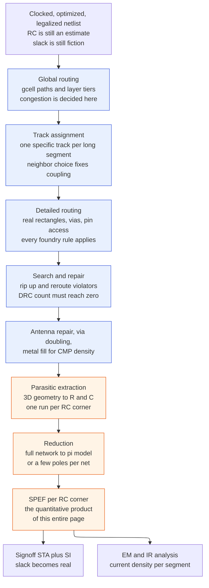
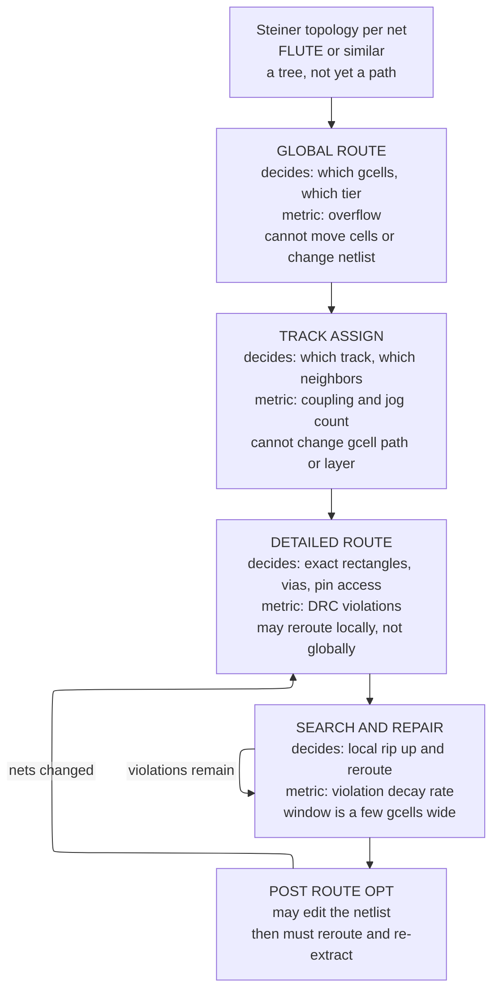
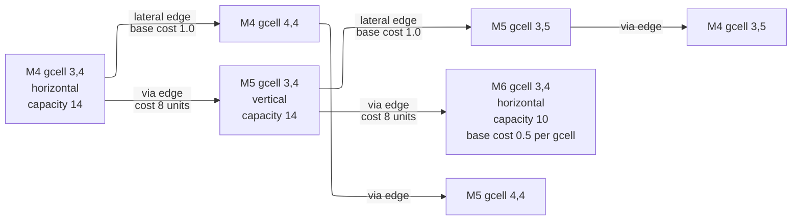
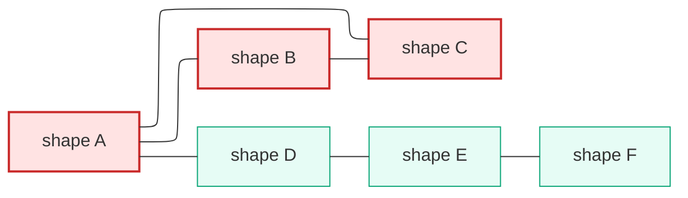
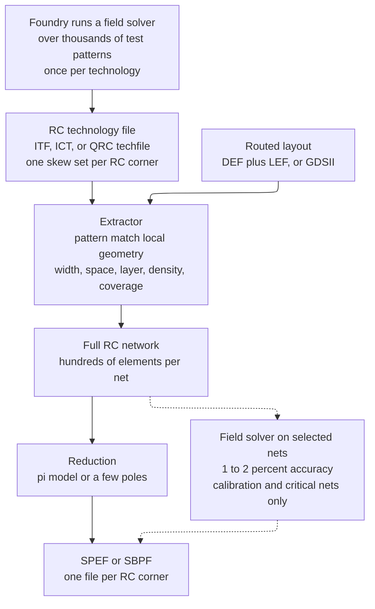

# Routing and Parasitic Extraction — committing the wires, then measuring what they cost

> **Prerequisites:** [Clock_Tree_Synthesis](05_Clock_Tree_Synthesis.md) (the clock network whose nets route first, under the non-default rules specified there, and whose skew becomes real only once its wires are extracted), [Physical_Design](01_Physical_Design.md) (§1.1 for $\tau \propto L^2$, §5 for routing as a negotiated-congestion graph search — **used here, not re-derived**).
> **Hands off to:** [STA](../06_Signoff/01_STA.md) (consumes the SPEF this page produces; every signoff slack number is computed from it), [Signal_Integrity_Reliability](02_Signal_Integrity_Reliability.md) (owns the crosstalk and electromigration *consequences* of the coupling capacitance and current density extracted here), [Physical_Verification_DRC_LVS](../06_Signoff/03_Physical_Verification_DRC_LVS.md) (re-checks every geometric rule the router claimed to satisfy, against the foundry deck rather than the tool's internal model).

---

## 0. Why this page exists

Every number the flow has produced so far is an estimate of something that does not exist yet. Synthesis used a wire-load model — a statistical guess keyed on fanout. Placement used half-perimeter wirelength, a proxy for a route nobody had drawn. Clock tree synthesis (CTS) balanced an Elmore model of trees whose metal was still hypothetical. **Routing is the step that ends the estimation.** It assigns every net specific rectangles on specific layers joined by specific vias, and once that geometry exists, a parasitic extractor can compute the actual resistance $R$ and capacitance $C$ of every net and hand static timing analysis (STA) the truth.

That makes this page two things bolted together, and they are bolted together for a reason. The first half is *commitment*: a constrained graph search over a finite, tiered metal resource, under a design-rule deck that at advanced nodes contains thousands of rules, most of which did not exist ten years ago. The second half is *measurement*: turning three-dimensional copper-and-dielectric geometry into a lumped RC network, then compressing that network by two orders of magnitude so a timer can use it, then doing the whole thing four or five times because the process varies. You cannot reason about the second half without the first — the reason there are four RC corners is that the router's choices interact with process skew differently on a 400 µm net than on a 4 µm net.

An engineer who treats routing as "press the button and check the DRC count" ships three predictable defects. First, a block that routes clean but times 200 ps worse than the post-CTS estimate, because the router put critical nets on the cheapest layer instead of the fastest one and nobody looked at layer histograms. Second, a yield and lifetime problem — single vias on high-current nets, an antenna violation found at signoff instead of during routing, and a redundant-via rate of 60 % when the foundry expects 95 %. Third, and most expensive, a timing signoff that disagrees with the implementation tool by 80 ps because the in-tool extraction and the signoff extraction were configured differently and nobody correlated them until three weeks before tape-out.

Afterwards you should be able to: read a metal stack table and say which tier a given net belongs on and why; compute the Elmore delay of an RC ladder by hand and state its error bar; estimate a wire's ground and coupling capacitance from geometry; read a SPEF file field by field and check its internal arithmetic; explain why four RC corners exist and which one is worst for a given path; and state the criteria that release a routed database to signoff.



The contract of the figure: everything in blue *changes the die*, everything in orange only *describes* it. That distinction matters operationally, because the blue steps are re-runnable and the orange steps are not — you cannot fix a timing problem by re-extracting, only by re-routing. Trace one net through it: a 300 µm datapath net enters as a two-pin connection with an estimated 40 fF; global routing decides it crosses eleven gcells on the M6/M7 tier; track assignment puts it on track 4,182 of M6 with a quiet neighbor on one side and a bus on the other; detailed routing draws it, adds nine vias, and jogs twice around a macro pin; extraction reports 58 fF total, of which 22 fF is coupled to that bus. The trade-off the figure illustrates is the whole page: the blue steps spend routing resource to reduce what the orange steps will report, and routing resource is finite.

---

## 1. The metal stack as a resource

### 1.1 Why the stack is tiered at all

Start with the simplest thing that could work: one metal layer, uniform width and thickness, for every wire on the chip. It fails immediately for connectivity reasons (you cannot cross two wires on one layer without shorting), so add a second layer for the orthogonal direction. Now you can route anything. The question is whether you can route anything *fast*.

Take the local metal geometry of an advanced node — a wire 20 nm wide and 36 nm thick — and compute what it costs per micron. Resistance per unit length is

$$
r \;=\; \frac{\rho_{\text{eff}}}{W \cdot T}
$$

where $\rho_{\text{eff}}$ is the *effective* resistivity. Bulk copper is $1.7\ \mu\Omega\cdot\text{cm}$, but a 20 nm wire is narrower than the electron mean free path in copper (~39 nm at room temperature), so electrons scatter off the sidewalls and the grain boundaries far more than in bulk. Effective resistivity rises to $5$–$7\ \mu\Omega\cdot\text{cm}$ — a factor of three to four penalty that appears *only* at small dimensions and is the single most important fact about advanced-node interconnect. Worse, the damascene process lines every trench with a diffusion barrier (TaN/Ta, or a Co/Ru liner) that is 1.5–2 nm thick and effectively non-conducting; a 20 nm drawn wire with 2 nm of barrier per sidewall has 16 nm of copper, a further $20/16 = 1.25\times$ on resistance.

With $\rho_{\text{eff}} = 6.5\ \mu\Omega\cdot\text{cm} = 6.5\times10^{-8}\ \Omega\cdot\text{m}$:

$$
r = \frac{6.5\times10^{-8}}{(20\times10^{-9})(36\times10^{-9})} = \frac{6.5\times10^{-8}}{7.2\times10^{-16}} = 9.0\times10^{7}\ \Omega/\text{m} = 90\ \Omega/\mu\text{m}
$$

Capacitance per unit length is roughly $0.18\ \text{fF}/\mu\text{m}$ (derived in §8). Now the failure. A distributed RC line of length $L$ has an Elmore delay of $\tfrac{1}{2}rcL^2$ and a 50 % propagation delay of approximately $0.38\,rcL^2$ (Bakoglu). The $L^2$ is the whole story: **halving the length quarters the delay, and doubling it quadruples the delay.** Run the numbers on 1 mm of this local metal:

$$
R = 90\times1000 = 90{,}000\ \Omega, \qquad C = 0.18\times1000 = 180\ \text{fF}
$$
$$
t_{50\%} \approx 0.38 \times 90{,}000 \times 180\times10^{-15} = 6.16\times10^{-9}\ \text{s} = 6.16\ \text{ns}
$$

Six nanoseconds to cross one millimeter. At a 2 GHz clock that is twelve cycles, on a wire. The baseline is dead.

The derived repair has two parts and they are complementary, not alternative. The first is **repeater insertion** — break the wire into $k$ segments with buffers, so total delay becomes $k \cdot 0.38\,rc(L/k)^2 + k\,t_{\text{buf}}$, which is linear in $L$ instead of quadratic. That mechanism is derived with its optimum in [Placement_Legalization_and_Optimization](04_Placement_Legalization_and_Optimization.md) §6 and is not repeated here. The second is **tiering the stack**: build the upper layers wider and thicker. A wire four times wider and four times thicker has $16\times$ less resistance per micron and only modestly more capacitance, so $rc$ falls by more than an order of magnitude per tier.

Compare 1 mm on the top signal tier of the same technology ($r = 0.17\ \Omega/\mu\text{m}$, $c = 0.22\ \text{fF}/\mu\text{m}$):

$$
R = 170\ \Omega, \quad C = 220\ \text{fF}, \quad t_{50\%} \approx 0.38 \times 170 \times 220\times10^{-15} = 14.2\ \text{ps}
$$

**$6.16\ \text{ns}$ versus $14.2\ \text{ps}$ — a factor of 434 for the same millimeter of the same die.** That number is why an advanced node ships thirteen to eighteen metal layers instead of two. Not connectivity: connectivity needs maybe six. The rest of the stack exists to make $rc$ small enough that long wires are usable.

The cost of tiering is silicon area in the third dimension (each layer pair is two mask sets, two depositions, two CMP steps, and roughly 3–6 % of wafer cost), plus the vias needed to reach the upper tiers (§4), plus the fact that upper-tier tracks are scarce: a 160 nm-pitch layer has one quarter the tracks per micron of a 40 nm-pitch layer. Which brings the selection boundary. Local metal is not obsolete — it is *correct* for short nets. On 10 µm of that same 90 $\Omega/\mu$m metal, $t_{50\%} \approx 0.38 \times 900 \times 1.8\times10^{-15} = 0.6\ \text{ps}$, utterly negligible. The rule that falls out of $L^2$: **use the cheapest tier whose delay is negligible at your length, and no better.** Roughly, local metal is fine below ~20–30 µm, intermediate to ~150 µm, semi-global to ~1 mm, and global above that.

### 1.2 A realistic 15-layer stack

The following is a representative 5 nm-class back-end-of-line (BEOL — everything above the transistors) stack. Foundries do not publish these tables, but the values are consistent with published IRDS targets, the geometry, and the resistivity model of §1.1: every $r$ in the table is $\rho_{\text{eff}}/(W\!\cdot\!T)$ with the stated $\rho_{\text{eff}}$, so you can check any row.

| Layer | Tier | Pitch (nm) | $W$ (nm) | $T$ (nm) | $T/W$ | $\rho_{\text{eff}}$ ($\mu\Omega\cdot$cm) | $r$ ($\Omega/\mu$m) | $c$ (fF/$\mu$m) | Preferred dir | Typical use |
|---|---|---|---|---|---|---|---|---|---|---|
| M0 | 1× local | 40 | 20 | 36 | 1.8 | 6.5 | 90 | 0.17 | H | intra-cell wiring, pin shapes |
| M1 | 1× local | 40 | 20 | 36 | 1.8 | 6.5 | 90 | 0.17 | V | pin access, cell-to-cell stubs |
| M2 | 1× local | 40 | 20 | 36 | 1.8 | 6.5 | 90 | 0.18 | H | short intra-block nets |
| M3 | 1× local | 44 | 22 | 40 | 1.8 | 6.0 | 68 | 0.18 | V | short intra-block nets |
| M4 | 1.5× intermediate | 60 | 30 | 55 | 1.8 | 5.5 | 33 | 0.18 | H | block-level signal, workhorse |
| M5 | 1.5× intermediate | 60 | 30 | 55 | 1.8 | 5.5 | 33 | 0.18 | V | block-level signal, workhorse |
| M6 | 2× intermediate | 80 | 40 | 76 | 1.9 | 5.0 | 16 | 0.19 | H | long block nets, clock trunk |
| M7 | 2× intermediate | 80 | 40 | 76 | 1.9 | 5.0 | 16 | 0.19 | V | long block nets, clock trunk |
| M8 | 4× semi-global | 160 | 80 | 160 | 2.0 | 3.0 | 2.3 | 0.20 | H | block boundary, clock spine |
| M9 | 4× semi-global | 160 | 80 | 160 | 2.0 | 3.0 | 2.3 | 0.20 | V | block boundary, clock spine |
| M10 | 6× semi-global | 240 | 120 | 260 | 2.2 | 2.4 | 0.77 | 0.21 | H | top-level buses, power |
| M11 | 6× semi-global | 240 | 120 | 260 | 2.2 | 2.4 | 0.77 | 0.21 | V | top-level buses, power |
| M12 | 12× global | 480 | 240 | 520 | 2.2 | 2.1 | 0.17 | 0.22 | H | power straps, global clock |
| M13 | 12× global | 480 | 240 | 520 | 2.2 | 2.1 | 0.17 | 0.22 | V | power straps, global clock |
| AP | thick / RDL | 4000 | 2000 | 3000 | 1.5 | 1.9 | 0.0032 | 0.25 | H+V | top power mesh, bump landing, IO |

Four things in this table are worth more than the individual numbers.

**Resistance spans four and a half orders of magnitude; capacitance spans 1.5×.** From M0 to AP, $r$ falls from 90 to 0.0032 $\Omega/\mu$m — a factor of 28,000 — while $c$ rises only from 0.17 to 0.25 fF/µm. This asymmetry is the reason tiering works at all. Capacitance per unit length is nearly invariant because the geometry scales roughly self-similarly: a wire twice as wide over a dielectric twice as thick has the same plate capacitance per micron, and the fringing and lateral terms behave similarly. This is the famous result that **wire capacitance is about 0.2 fF/µm on essentially every layer of essentially every CMOS node since 250 nm.** Memorize 0.2 fF/µm and you can estimate any net's capacitance to within 25 % from its length alone.

**Effective resistivity is not a constant.** It climbs from 1.9 to 6.5 $\mu\Omega\cdot$cm as the wire narrows. This is why the *ratio* between tiers is even larger than the geometric ratio: M0 to M4 is $(30\times55)/(20\times36) = 2.29\times$ in area but $90/33 = 2.7\times$ in resistance.

**Aspect ratio $T/W$ sits between 1.8 and 2.2 everywhere.** Fabrication cannot go much taller — trench filling and mechanical stability fail — and going shorter would raise $r$ further. But a tall, narrow wire has a large sidewall area facing its neighbors and a small footprint facing the planes above and below, which is precisely the geometry that makes lateral coupling dominate (§8). The aspect ratio the process needs for resistance is the aspect ratio that creates the crosstalk problem.

**The tiers come in same-pitch pairs.** M4/M5, M6/M7, M8/M9 and so on share a pitch and differ only in direction. That is not aesthetic: a net traveling diagonally alternates between the two layers of a pair, and if their pitches differed, every turn would land off-grid on one of them.

### 1.3 Preferred direction, and what it costs

Each layer has a **preferred routing direction**, alternating horizontal and vertical up the stack. The mechanism is straightforward: two wires on the same layer running in the same direction can be packed at minimum pitch and never intersect; two wires on the same layer running in different directions must either intersect (a short) or be spaced apart at every crossing, which destroys density. Alternating directions means every crossing is resolved by a via, and via positions are a discrete, gridded, checkable resource.

The cost is that **every turn costs a via**, and at advanced nodes (§6.1) the preference becomes a hard rule. Consider a net that must travel 40 µm east and 40 µm north. On a bidirectional layer it is one L-shaped wire with zero vias. On a unidirectional stack it is a 40 µm M4 segment, a via to M5, and a 40 µm M5 segment — one via if it turns once, but a real route that jogs around obstacles five times pays ten vias. On the local tier at 20 $\Omega$ per via cut, ten vias is 200 $\Omega$, which is 2.2 µm of M2-equivalent resistance — usually negligible for delay but never negligible for *area*, because each via blocks routing tracks on both layers it connects.

A secondary consequence, easy to miss: **preferred direction determines which nets can be neighbors.** Two horizontal nets on M4 that run alongside each other for 200 µm are coupled for 200 µm. A horizontal M4 net and a vertical M5 net cross once and couple over roughly one wire-width. This is why bus routing — many parallel nets, same layer, same direction, minimum pitch, long distance — is the worst crosstalk structure a design can contain, and why the mitigations of §5 target buses first.

---

## 2. Routing as a multi-phase flow

Routing a modern block is a search over roughly $10^{6}$ nets and $10^{10}$ candidate grid points, under $10^{3}$–$10^{4}$ design rules. Solving it as one optimization is not merely slow, it is not formulable — the objective (timing, after extraction) is not computable until the answer exists. So the flow does what placement does: relax, solve coarsely, then refine under the coarse solution as a constraint.



**Global routing** overlays a coarse grid of **gcells** (global routing cells) and decides, per net, which gcells its wires pass through and on which layer tier. A gcell is typically 8–20 routing pitches on a side — 0.5 to 2 µm at an advanced node — so a 1 mm × 1 mm block has $10^5$ to $10^6$ of them. Each gcell boundary is a graph edge with a **capacity**: the number of tracks of that layer that cross it, minus tracks consumed by power straps, macro blockages, and pre-routes.

Concretely, for a 1.0 µm-square gcell on the stack of §1.2, the horizontal capacity of one vertical boundary is:

| Layer | Pitch (nm) | Raw tracks | Blocked by pins, power, pre-route | Usable |
|---|---|---|---|---|
| M0/M2 (H) | 40 | 25 | ~60 % (cell internals and pins) | 10 |
| M4 (H) | 60 | 16 | ~12 % | 14 |
| M6 (H) | 80 | 12 | ~20 % (power straps) | 10 |
| M8 (H) | 160 | 6 | ~35 % (power straps) | 4 |
| M10 (H) | 240 | 4 | ~50 % (power) | 2 |
| **total horizontal** | | **63** | | **40** |

**Demand** is the number of nets whose global route crosses that boundary, weighted by the track multiplier of their routing rule (1 for a default net, 3 for a double-width/double-space net, 5 for a shielded net — see §5). **Overflow** is $\max(0, \text{demand} - \text{capacity})$, and the sum of overflow over all edges is the single number that says whether detailed routing will succeed. A block with zero global overflow can still fail detailed routing, but a block with 5 % overflow always does.

Global routing may not move cells, may not change the netlist, and may not change gcell capacities. It has exactly one lever: which gcells each net uses. That is why congestion is fundamentally a *placement* problem discovered at routing time — by the time you see the map, the only fix inside routing is detouring, and detours cost wirelength and delay.

**Track assignment** takes each net's global route and commits its long straight segments to specific tracks, layer by layer, panel by panel (a panel is one row or column of gcells on one layer). Long segments go first, because a long segment has the fewest legal placements and the largest coupling consequence. This is the phase where **which net is your neighbor** is decided, and therefore where coupling capacitance is largely determined — a fact that matters enormously and is invisible in most descriptions of routing. A timing-critical net placed between two quiet nets has half the coupling of the same net placed inside a 64-bit bus. Track assignment may not change the gcell path or the layer; it works within the global plan.

**Detailed routing** produces the final geometry: real rectangles with real widths, real vias with real enclosures, jogs around obstacles, and the short connections from a track down to a cell pin. It is the only phase that applies the full design-rule deck, and it is the phase that consumes 50–80 % of total routing runtime. It is parallelized by dividing the die into windows a few gcells wide and routing windows concurrently, with boundary nets stitched afterward — which is why detailed routing results are not always bit-identical between runs with different thread counts.

**Search and repair** is the iteration loop. Detailed routing leaves violations — a via that will not fit, a spacing rule broken by an unfortunate jog, a pin that cannot be accessed given what the neighbors did. Search and repair rips up the offending nets in a small window and reroutes them with the violated rule given a large cost penalty. The number of open violations should fall geometrically; §12 explains how to read that curve and when to stop.

Finally, **post-route optimization** may edit the netlist — resize a driver, insert a buffer, swap a threshold voltage — but every such edit invalidates the routing of the affected net and the extraction of its neighbors. This is the single most common source of schedule loss in backend: an ECO that fixes 12 ps of setup and requires re-routing, re-extraction, and re-signoff of a whole block. The discipline is to batch edits and re-route once.

---

## 3. The routing graph and the cost function

### 3.1 The graph

Global routing runs on a three-dimensional grid graph. A vertex is (gcell $x$, gcell $y$, layer $\ell$). There are two edge types:

- **Lateral edges** connect adjacent gcells on the same layer, but *only in that layer's preferred direction*. Capacity is the usable track count computed above.
- **Via edges** connect the same gcell on adjacent layers. Capacity is the number of legal via sites, which is large but not infinite — a gcell fully occupied by wires on both layers has nowhere to put a via, and this is a real failure mode inside dense macro channels.



The contract: a route is a path in this graph, and its cost is the sum of edge costs. Trace a net going three gcells east and two north: cheapest on M4/M5 is three M4 lateral edges plus two M5 lateral edges plus at least two via edges (M4→M5→M4 if it turns twice), giving $3(1.0) + 2(1.0) + 2(8) = 21$ units. The same trip promoted to M6/M7 costs $3(0.5) + 2(0.5) + 2(8) + 4(8) = 50.5$ units — the two extra via-edge pairs to climb from M4 to M6 and back dominate. The trade-off the figure illustrates is exactly this: **promotion to a faster tier is paid for in vias, and via cost is a fixed toll independent of distance.** Short nets can never amortize it; long nets always can. §4 puts real numbers on the toll.

Note what the graph does *not* contain: individual tracks, individual rectangles, or any design rule. Those live in detailed routing. Global routing is deliberately a coarse abstraction, and every gap between the abstraction and reality shows up later as a DRC violation that the global route did not predict.

### 3.2 Negotiated congestion

Now the interesting part. Route each net independently by shortest path and you get a solution that is per-net optimal and globally illegal: every net takes the same straight line, and the edges along it are 3× over capacity. Route them one at a time, blocking full edges as you go, and the answer depends entirely on net order — the first net gets the direct path and the last net detours halfway across the die. Neither works.

The repair is **negotiated congestion**, the PathFinder algorithm (McMurchie and Ebeling, 1995), and it is the algorithmic heart of routing. Nets are allowed to overuse edges, iteratively, while the price of overuse rises until the overuse disappears. The cost of edge $e$ is

$$
\text{cost}(e) \;=\; \big(b_e + h_e\big)\cdot p_e
$$

with three distinct terms:

- $b_e$ — **base cost**, the intrinsic price of using this resource. For a lateral edge this is proportional to the delay or wirelength it contributes, so upper-tier edges are intrinsically *cheaper per micron traversed*; for a via edge it is the fixed via toll.
- $p_e$ — **present congestion penalty**, a function of current occupancy:
$$
p_e \;=\; 1 + \lambda^{(i)} \cdot \max\!\big(0,\ \text{occ}_e + 1 - \text{cap}_e\big)
$$
  where $\lambda^{(i)}$ ramps geometrically over iterations, typically $\lambda^{(i)} = \lambda_0\gamma^i$ with $\gamma \approx 1.5$–$2$.
- $h_e$ — **history cost**, updated at the end of each iteration:
$$
h_e^{(i)} \;=\; h_e^{(i-1)} + \eta \cdot \max\!\big(0,\ \text{occ}_e - \text{cap}_e\big)
$$

Why three terms and not two? Because with only $b_e$ and $p_e$ the router **oscillates**. Consider an edge at capacity 12 wanted by 15 nets. Iteration 1: 15 nets take it, price spikes, all 15 see a high price on iteration 2 and all 15 detour, so occupancy drops to 0, price falls to 1, and on iteration 3 all 15 come back. The system has no memory, so it cycles forever. History is the memory: $h_e$ only ever increases, so an edge that has been contested *stays* expensive even when it is momentarily empty, and the nets that left it do not come back.

Trace the equilibrium with numbers. Two routes from S to T: path $P_1$ crosses four gcells including the contested edge $e$; path $P_2$ detours through six. Base cost 1.0 per lateral edge, $\eta = 0.3$, $\lambda_0 = 0.5$.

- **Iteration 0** ($h_e = 0$, $p_e = 1$): $\text{cost}(P_1) = 4$, $\text{cost}(P_2) = 6$. All 15 nets choose $P_1$. Occupancy 15, capacity 12, overflow 3.
- **Update**: $h_e = 0 + 0.3(3) = 0.9$.
- **Iteration 1**: each net is ripped up and rerouted in turn, so it sees the other 14 on $e$: $p_e = 1 + 0.5(14 + 1 - 12) = 2.5$, and $\text{cost}(e) = (1 + 0.9)(2.5) = 4.75$. So $\text{cost}(P_1) = 3 + 4.75 = 7.75 > 6 = \text{cost}(P_2)$. Nets begin migrating to $P_2$.
- **Equilibrium**: migration stops when the two paths tie, $3 + 1.9\,p_e = 6 \Rightarrow p_e = 1.579 \Rightarrow \text{occ}_e \approx 12$. Overflow is gone, three nets detour, and the *right* three detour — the ones for which the detour was cheapest, not the ones that happened to be routed last.

The cost is runtime: each iteration reroutes a large fraction of the nets, and a hard block needs 15–40 iterations. The selection boundary: on an uncongested block, negotiated congestion converges in two or three iterations and is nearly free; its expense is proportional to how badly the floorplan and placement failed.

### 3.3 How timing enters the search

The cost function above optimizes routability, not speed. Timing enters by three mechanisms, and it is worth being precise about which is a *cost* and which is a *constraint*, because they behave completely differently.

**Net weighting.** Each net gets a criticality derived from its slack, normalized against the worst slack in the design:

$$
\text{crit}_n = \max\!\left(0,\ \frac{-s_n}{|s_{\text{worst}}|}\right)\in[0,1], \qquad w_n = 1 + \kappa\,\text{crit}_n
$$

with $\kappa$ typically 2–5. The weight multiplies the base cost of every edge the net uses, so a critical net is willing to pay more to win a contested edge and prefers the shortest path more strongly. This is a *soft preference* and it is negotiable: a critical net with $w_n = 5$ competing against forty non-critical nets on the same edge will still lose once $h_e$ has grown.

**Layer promotion directives.** A hard constraint on the layer range a net may use — `-min_layer M8` restricts the search to the semi-global tier and above. This is *not* negotiable, and that is precisely why it exists. The top few hundred critical nets must not lose the negotiation. Costs must be used for the bulk of the design (they degrade gracefully) and constraints for the few nets where degradation is unacceptable (they degrade catastrophically, so you apply them only where you are certain).

**Non-default rules.** Wider wire, wider spacing, or a shield, applied per net. These change both the delay and the track multiplier used in the congestion arithmetic. §5.

There is a fourth, subtler mechanism: **timing-driven track assignment**. Given a net's layer and gcell path, the choice of *which* track determines its neighbors and therefore its coupling capacitance. A criticality-ordered track assignment gives critical nets the tracks adjacent to quiet or same-direction nets. This costs nothing in area and can be worth 5–15 % of a critical net's capacitance, which makes it one of the highest-leverage settings in the whole flow and one of the least used.

```tcl
# Names are Innovus/ICC2-flavored pseudocode. The semantics, not the spelling,
# is the point; every tool has an equivalent for each of these.

# --- what the router may use ------------------------------------------------
set_routing_layers -signal M2:M9 -clock M6:M11

# --- soft: criticality-weighted cost ----------------------------------------
set_route_opt_config -timing_driven true -criticality_exponent 2.0

# --- hard: the top critical nets are not allowed on the local tier -----------
foreach net [get_nets -filter "slack < -0.030"] {
  set_net_routing_layer_constraint $net -min_layer M6 -max_layer M9
}

# --- neighbor choice for the nets that care ---------------------------------
set_track_assignment_options -coupling_aware true -order_by criticality
```

---

## 4. Vias: the toll on every layer change

A **via** is a vertical conductive plug connecting two adjacent metal layers. It is small — at the local tier, a square hole roughly 20 nm on a side and 40 nm tall — and its resistance follows from those dimensions. A cylinder of effective resistivity $\rho$ with cross-section $A$ and height $H$ has $R = \rho H/A$; with $\rho_{\text{eff}} \approx 20\ \mu\Omega\cdot$cm for a barrier-lined tungsten or copper plug at that scale, $H = 40$ nm, $A = 400\ \text{nm}^2$:

$$
R_{\text{via}} = \frac{2\times10^{-7}\times 40\times10^{-9}}{4\times10^{-16}} = 20\ \Omega
$$

Twenty ohms for a hole 20 nm wide — the same as 0.22 µm of the M2 wire it connects to. Vias scale with the tier: their cross-section grows as the square of the pitch multiplier while their height grows linearly, so resistance falls roughly as the pitch multiplier.

| Via | Connects | Cut size (nm) | $R$ per cut ($\Omega$) | Notes |
|---|---|---|---|---|
| V0 | M0–M1 | 20 | 25 | highest-resistance via in the stack |
| V1 | M1–M2 | 20 | 22 | |
| V2 | M2–M3 | 20 | 18 | |
| V3 | M3–M4 | 24 | 12 | tier transition |
| V4 | M4–M5 | 30 | 8 | |
| V5 | M5–M6 | 30 | 6 | tier transition |
| V6 | M6–M7 | 40 | 3.5 | |
| V7 | M7–M8 | 40 | 2.5 | tier transition |
| V8 | M8–M9 | 80 | 1.2 | |
| V9 | M9–M10 | 80 | 0.8 | tier transition |
| V10 | M10–M11 | 120 | 0.35 | |
| V11 | M11–M12 | 120 | 0.25 | tier transition |
| V12 | M12–M13 | 240 | 0.12 | |
| V13 | M13–AP | 800 | 0.05 | |

The immediate consequence: **climbing from M4 to M8 costs $8 + 6 + 3.5 + 2.5 = 20\ \Omega$ per stack**, and a promoted net pays two stacks (up at the driver, down at the receiver) for 40 $\Omega$. Compare that toll against what it buys — M4 at 33 $\Omega/\mu$m versus M8 at 2.3 $\Omega/\mu$m saves 30.7 $\Omega$ per micron — and the break-even is $40/30.7 = 1.3\ \mu$m. On resistance alone, promotion pays for itself almost immediately. Worked problem 3 shows why the real limit is resource, not resistance.

### Redundant vias are not an optimization

A single via cut is a single point of failure in a way a wire is not. A wire that is 5 % narrow than drawn still conducts; a via that fails to open during etch, or that voids during fill, or that lifts under thermal stress, is an open circuit and the die is dead. Foundries quote single-via open rates in the $10^{-9}$ to $10^{-10}$ per-via range. That sounds negligible until you count vias: a large SoC has $10^8$ of them. At $p = 10^{-9}$, the expected number of via opens per die is $10^8 \times 10^{-9} = 0.1$, giving a yield of $e^{-0.1} = 90.5\ \%$ from this mechanism alone. At $p = 10^{-8}$ — a mature but not perfect process — yield is $e^{-1} = 37\ \%$. Via yield is a first-order product economics question.

The repair is the **double via** (also called a redundant via or multi-cut via): place two cuts in parallel wherever geometry permits. Two independent cuts both failing has probability $p^2$, and even with the strong correlation of real defect mechanisms — a particle large enough to block one cut often blocks its neighbor — measured improvement is one to two orders of magnitude, not eight. That is the honest number: **via doubling does not make via failure impossible, it makes it a second-order yield term instead of a first-order one.**

Doubling buys two more things for free:

- **Resistance halves.** Two 20 $\Omega$ cuts in parallel are 10 $\Omega$. On a net with fifteen vias, that is 150 $\Omega$ saved, which on a 60 fF net is $150 \times 60\times10^{-15} = 9$ ps of Elmore delay.
- **Electromigration headroom doubles.** A via's cross-section is smaller than the wire it feeds, so the via, not the wire, usually sets the current-density limit. Doubling halves the current per cut. The EM physics and Black's equation live in [Signal_Integrity_Reliability](02_Signal_Integrity_Reliability.md) §3; the point here is that the router is the tool that must satisfy it.

The cost is area: a double via occupies roughly twice the footprint on both layers, which blocks adjacent tracks. In an uncongested region that is free. In a congested region the router must choose, which is why via-doubling is expressed as a *target* — "convert every via that can be converted without creating a violation" — and reported as a **coverage percentage**. Production targets are above 95 % on signal nets and effectively 100 % on clock and power. A block reporting 70 % coverage has a congestion problem it has not admitted to.

**Via pillars** are the extreme case: an array of 4, 6, or 9 cuts between the same layer pair, used on clock tree roots, high-drive buffer outputs, and power taps where both resistance and current density matter. A 3×3 pillar at V4 is 8/9 = 0.9 $\Omega$ instead of 8 $\Omega$. It blocks a large rectangle on both layers, so pillars are placed deliberately, on tens of nets, not by a global setting.

### The via-count-versus-delay trade

Every routing decision that reduces wire delay tends to increase via count, and vice versa. A net that stays on M4 has few vias and high $r$; the same net promoted to M8/M9 has low $r$ and four vias per end plus a via at every turn. Because unidirectional routing (§6.1) forces a via at every turn, a heavily jogged route on the upper tiers can accumulate 30–60 vias. At the *local* tier that would matter — 60 × 20 $\Omega$ = 1.2 k$\Omega$ — but at the semi-global tier 60 × 1.2 $\Omega$ = 72 $\Omega$ is noise against the driver resistance. The rule that falls out: **via count matters for delay on the lower tiers and for area on the upper tiers.**

---

## 5. Non-default rules and shielding

The router's default is minimum width at minimum spacing, because that is what maximizes the number of nets that fit. Two classes of net need something else.

A **non-default rule (NDR)** overrides width and/or spacing for named nets. The two common forms:

- **Double width (2W)** halves $r$ on the affected segments. On a 400 µm M4 net this takes $R$ from 13.2 k$\Omega$ to 6.6 k$\Omega$, which on a 72 fF net removes roughly $6600 \times 39\times10^{-15} = 257$ ps of Elmore delay. It slightly *raises* capacitance (more sidewall and plate area), so it is a win only when the net is resistance-dominated — long.
- **Double spacing (2S)** reduces coupling capacitance. Lateral coupling scales roughly as $1/S$ (§8), so doubling the space to each neighbor roughly halves the coupling term. It does nothing for resistance.

Combined **2W2S** is the standard critical-net rule. Now quantify the resource cost, because this is where engineers get it wrong. On a track grid with pitch $P = W + S$, a default net occupies exactly one track. A 2W2S net occupies $2W$ of metal plus $2S$ of clearance on each side; measured in default tracks, it consumes

$$
\frac{2W + 2\cdot 2S}{W+S} \;\approx\; 3\ \text{tracks when } W \approx S
$$

**A 2W2S net costs three tracks.** A shielded net costs more still. **Shielding** means running a wire tied to ground (or occasionally to the supply) immediately alongside the victim on one or both sides. Its mechanism is not subtle: a grounded neighbor cannot switch, so it injects nothing, and it terminates the victim's field lines that would otherwise have reached a switching net. Two-sided shielding on a track grid consumes: one signal track, one gap on each side, one shield track on each side — **five tracks**.

Shielding has a cost that is routinely misstated, so state it exactly: **shielding does not reduce a net's total capacitance. It converts coupling capacitance into ground capacitance.** The victim's field lines still terminate somewhere; they now terminate on a quiet conductor instead of an active one. The consequences:

- The victim's *nominal* delay stays roughly the same or rises slightly (the shield is closer than the original neighbor would have been on average).
- The victim's *delay variation* collapses. The Miller swing of §8 — an effective load varying from $C_g$ to $C_g + 2C_c$ — disappears, because $C_c$ to a switching net is now near zero.
- The victim's *noise* immunity improves for the same reason: no aggressor, no injected glitch.
- The shield also provides a clean current return path, which matters for inductive effects on the longest global nets.

That is why shielding is applied to clocks (where jitter and skew variation are the whole point) and to a handful of analog-sensitive or high-speed nets, and not to critical *timing* nets in general — a critical timing net usually wants 2W2S, which is cheaper and helps its nominal delay too.

Now the budget arithmetic, because "apply NDRs to critical nets" is only actionable with numbers. Take an 800 µm × 800 µm block on the stack of §1.2. Track-length supply per layer is (block area) × (1 track per pitch), derated for blockages:

| Layer(s) | Pitch (nm) | Raw track-length (m) | Derate | Usable (m) |
|---|---|---|---|---|
| M2 | 40 | 16.0 | 0.40 | 6.4 |
| M3 | 44 | 14.5 | 0.60 | 8.7 |
| M4, M5 | 60 | 10.7 each | 0.85 | 9.1 each |
| M6, M7 | 80 | 8.0 each | 0.80 | 6.4 each |
| M8, M9 | 160 | 4.0 each | 0.60 | 2.4 each |
| **Total** | | | | **51.3 m** |

A block with 3.0 M instances and an average net length of 15 µm needs about $3.3\times10^6 \times 15\ \mu\text{m} = 49.5$ m of track — 96 % of supply, which is why real blocks run at 65–80 % utilization rather than 90 %. Against that budget:

- **Shield the clock.** 3,200 clock segments averaging 120 µm is 0.38 m of clock wire, which at 5× costs 1.92 m instead of 0.38 m. Globally that is +1.5 m on 51.3 m, under 3 %. But clock routes on M6–M9, where the budget is only $6.4+6.4+2.4+2.4 = 17.6$ m — so the clock consumes 11 % of the tier it actually uses. That is affordable, and it is why clock shielding is standard practice.
- **2W2S the top 2,000 critical signal nets** averaging 90 µm: 0.18 m at 3× costs 0.54 m instead of 0.18 m. +0.36 m. Trivial.
- **Shield all 2,000 critical signal nets** instead: 0.18 m at 5× = 0.90 m, +0.72 m. Still small globally — but these nets are also promoted to M6/M7, and combined with the clock the M6/M7 budget goes from roughly 78 % to 93 % utilized, which is where local overflow starts.

The selection boundary in one sentence: **NDRs are cheap because they are applied to a tiny fraction of nets that happen to be short; shielding is affordable only because clocks are few; neither survives being applied broadly.** The quantitative gate is the one stated in [Signal_Integrity_Reliability](02_Signal_Integrity_Reliability.md) §1.6 — apply the rule only where the predicted delta-delay or glitch exceeds the net's budget.

---

## 6. The advanced-node rules that dominate

Below roughly 20 nm the design rule deck stops being a checklist and becomes the dominant constraint on routing. Rule counts go from about 500 at 65 nm to 3,000–5,000 at N5 and beyond 10,000 at N3. Five families account for most of the difficulty.

### 6.1 Unidirectional routing and cut metal

At pitches below about 80 nm, a single lithographic exposure cannot print an arbitrary two-dimensional pattern with acceptable fidelity. What it *can* print is a dense grating — parallel lines of uniform pitch in one direction — because a grating is a periodic structure that the optics handle well and that self-aligned patterning (§6.3) produces naturally. So each layer becomes a **sea of unidirectional lines** on a fixed grid, and preferred direction becomes a hard rule rather than a strong preference.

The line must then be broken where a net ends. This is done by a separate **cut mask** (cut metal, CM): the grating is printed, then a second exposure removes short sections, leaving the line segments each net needs. Cuts have their own rules — a minimum cut width, a minimum spacing between cuts on the same track, and a minimum spacing between cuts on *adjacent* tracks. That last one is the vicious one: it means you cannot end two neighboring wires at the same $x$-coordinate, so wire ends must be staggered.

The consequences for routing:

- **No L-shaped wire on a layer.** Every turn is a via. Via count per net rises 2–3× versus a bidirectional node.
- **You cannot end a wire wherever you like.** A route that reaches its pin at exactly the wrong coordinate must be extended past it and cut later, or shifted a track.
- **Off-grid routing is impossible.** Everything snaps to the track grid, including pin access.

### 6.2 Minimum area, minimum length, end-of-line spacing

Three rules that individually sound trivial and collectively cause a large share of detailed-routing violations.

**Minimum area.** Every polygon on a layer must have at least some area — on the order of 0.005 µm² at an intermediate layer. A wire 30 nm wide must therefore be at least $0.005/0.030 = 0.167\ \mu\text{m} = 167$ nm long. The failure mode: a net that comes up from M3 and immediately goes up to M5 leaves an M4 stub only as long as a via enclosure, perhaps 60 nm — a minimum-area violation. The router must extend the stub, and if there is no room to extend it, it must reroute so the two vias are further apart. This is why via *stacks* (via directly above via) are restricted or forbidden on the lower layers at advanced nodes.

**Minimum length / minimum cut spacing** rules extend the same idea: some processes forbid segments below a length even if they meet minimum area, because short segments print unreliably.

**End-of-line (EOL) spacing.** The *tip* of a wire needs more clearance than its side — typically 1.5–2× the normal spacing, applied within a window of a wire-width or so around the tip. Physically this is because a line end rounds off during lithography and etch, so the printed tip is closer to its neighbor than the drawn tip. The routing consequence: a wire that jogs one track over and then ends creates an EOL condition against the wire it jogged away from. EOL violations are the single most common category in a first detailed-route pass and are usually fixed by a small extension or a one-track shift.

### 6.3 Multi-patterning and odd cycles

When the required pitch is below what one exposure can print, the layer is **decomposed** across multiple masks.

**LELE** (litho-etch-litho-etch) prints half the shapes with mask A, etches, then prints the other half with mask B and etches again. Shapes closer together than the single-exposure minimum must land on *different* masks. Build a **conflict graph**: one vertex per shape, an edge between any two shapes closer than the single-exposure limit. Decomposition is exactly a **2-coloring** of this graph — and a graph is 2-colorable if and only if it contains no odd cycle.



The contract of this figure: an edge means "these two shapes are too close to print on the same mask." Trace the right-hand chain A–D–E–F: color A red, D blue, E red, F blue — legal, four shapes on two masks. Now trace the triangle A–B–C: color A red, B must be blue, C must differ from both B and A, and there is no third color. The cycle has length 3, which is odd, so it is uncolorable. The trade-off it illustrates: the router cannot simply place shapes where the path-finding wants them, because a locally reasonable choice can create a global coloring conflict several shapes away. The fixes are to jog one shape further from its neighbor (breaking an edge), to move a shape to another layer, or to insert a **stitch** — split one shape across both masks at an overlap region, which is legal but costs overlay margin and is therefore restricted.

**SADP** (self-aligned double patterning) works differently and is more restrictive. A **mandrel** pattern is printed at relaxed pitch, a conformal spacer is deposited on its sidewalls, the mandrel is removed, and the spacers become the etch mask. The result is a grating at half the mandrel pitch in which colors *strictly alternate by position* — track $n$ is mandrel, track $n+1$ is non-mandrel, and so on. Color is therefore not a free variable the router can assign; it is determined by which track you chose. SAQP repeats the trick for quarter pitch. This is precisely why advanced-node routing is on-grid and unidirectional: the process, not the tool, dictates where lines can be.

EUV (extreme ultraviolet, 13.5 nm wavelength) lithography relaxes some of this by printing finer pitches single-exposure, which is why N7 EUV and beyond reduced the number of multi-patterned layers. It does not eliminate the problem — the finest layers at N3 use EUV double patterning.

### 6.4 Pin access on a short cell

Consider a standard cell six routing tracks tall at N5 — a common height for a high-density library. Its input pin is a single M0 rectangle perhaps 40 nm long, sitting on one track. To connect to it, the router must place a V0 via on that pin, then an M1 wire, then V1, then M2. Under unidirectional routing with a 40 nm M1 pitch, the number of legal M1 tracks that overlap a 40 nm pin is **one or two**. That is the entire access set.

Now place two such cells adjacent. If cell X's pin needs M1 track $k$ and cell Y's pin also needs track $k$ (because their pin positions happen to align), one of them cannot be accessed — and neither the router nor the placer created the problem; the *combination* of two legal placements did. This is why:

- Cell libraries are characterized for **pin accessibility** and ship with legal "hit point" patterns.
- Placement legality at advanced nodes includes **cell-to-cell pin-access rules** — certain pairs of cells may not abut, or must abut with a specific offset.
- **Routability-driven placement** is not a refinement; it is mandatory. See [Placement_Legalization_and_Optimization](04_Placement_Legalization_and_Optimization.md) §3.3.

The failure signature is unmistakable: a detailed route that leaves a few hundred violations, all of them within one or two tracks of a cell pin, that no amount of search and repair reduces. The fix is upstream — spread the cells, pad the offending cell types, or swap to a variant with a different pin position.

### 6.5 Why routing, not placement, binds at N7 and below

Here is the scaling argument in one calculation. Per node:

- Standard cell area scales by roughly $0.55\times$.
- Minimum metal pitch scales by roughly $0.75\times$ (metal pitch has scaled far more slowly than transistor dimensions since 28 nm, because lithography and copper resistivity both resist it).

Routing track-length *supply* per unit die area is proportional to $1/\text{pitch}$. Track-length supply *per cell* is therefore proportional to $A_{\text{cell}}/\text{pitch}$, which scales as

$$
\frac{0.55}{0.75} = 0.73\times \text{ per node}
$$

Meanwhile the *demand* per cell is roughly constant — a cell still has three or four pins, and nets still connect two to four cells. So each generation gives every cell **27 % fewer tracks to work with**. Over three generations, $0.73^3 = 0.39$ — a 2.6× shortfall. The industry has paid for it by adding metal layers (8 to 15) and by inventing the pitch-multiple tier structure of §1.2, and it is still not enough, which is why achievable utilization has fallen from 85 % at 65 nm to 60–70 % at N5 on routing-limited blocks.

Layer that on top of the rule explosion — 500 rules to 5,000, with the new rules being *conditional* (this spacing applies only if the neighbor is wider than $X$ and the run length exceeds $Y$ and the parallel edge is within $Z$) — and detailed-routing runtime grows 2–3× per node while the fraction of legal moves at any grid point shrinks. The practical result: at 65 nm, a block that placed legally at 85 % utilization routed. At N5, the *placer* will happily produce a legal 85 % placement that is physically unroutable, and the only way to know is to route it. That inversion is the defining backend fact of the advanced-node era.

---

## 7. Antenna violations: damage written into the die at birth

Every other failure on this page is about the finished chip. This one is about the chip *while it is being built*, and it is the reason routing has a repair step that has nothing to do with timing or connectivity.

**The mechanism.** The die is fabricated bottom-up: transistors, then M0, then V0, then M1, and so on. Several of those steps use plasma — reactive ion etch, ashing, ion implantation — and plasma is a bath of charged particles. Any exposed conductor immersed in it collects charge. Now consider a long M2 wire that is connected, through V1 and M1 and V0 and M0, to a transistor gate, and *not yet* connected to anything else, because the far end of the net reaches its driver's drain diffusion only via M3, which does not exist yet. That wire is an antenna. The charge it collects has exactly one path to ground: through the gate oxide, which at an advanced node is roughly 1 nm of equivalent oxide thickness. The current is Fowler-Nordheim tunneling, and it degrades or ruptures the oxide. The transistor is damaged **before the chip has ever been powered on**, and no electrical test at wafer sort may catch it — it may simply show up as early-life failure.

**The rule.** The metric is the **antenna ratio**:

$$
AR_{\text{ant}} \;=\; \frac{A_{\text{metal}}\ \text{connected to the gate at this fabrication step}}{A_{\text{gate oxide}}\ \text{it must discharge through}}
$$

Foundry limits are typically 50:1 to 500:1 for metal area, tighter (10:1 to 30:1) for *via* area, and there is usually a separate, tighter perimeter-based rule for the lower layers where sidewall collection dominates. Crucially the check is **cumulative and per-step**: the extractor walks the net layer by layer, computing at each step what metal is attached to each gate, so a net can be legal at M4 and illegal at M2.

**The three fixes**, each with its cost:

1. **Layer jumping ("bridging up").** Break the long lower-layer run: go up to a higher layer for the middle of the route and come back down. This works because of build order — when M2 is being etched, M4 does not exist, so a route that is M2-stub → V2 → M3 → V3 → M4 → long run → back down never has a long M2 segment attached to the gate. Note the asymmetry: **you must jump *up*, never down.** Jumping down does not help, because the lower layer already exists when the upper one is etched. Cost: two extra via stacks (typically 4–8 cuts), a few ohms, and upper-tier routing resource. This is the router's preferred fix and it is free of area.
2. **Antenna diode insertion.** Place a reverse-biased diode (an N+ implant in the P-well, or the dedicated antenna-diode cell the library provides) connected to the net near the gate. Under normal operation it is reverse-biased and does nothing; under plasma charging it breaks down harmlessly and bleeds the charge to the substrate. Cost: one or two placement sites of area — usually absorbed into existing filler cells so the area is genuinely free — plus 10–100 pA of junction leakage each (50,000 diodes is 0.5–5 µA, negligible against a chip's milliamps of leakage but not zero), plus 1–2 fF of added capacitance on the net. That last one is why diodes are the *second* choice: on a critical net, 2 fF added right at the receiver is 2–5 ps you did not budget.
3. **Buffer insertion.** Split the net with a buffer. The buffer's output diffusion is a discharge path, and each half of the net is shorter. Cost: real area, real delay, real power. This is chosen only when the net was going to need a repeater anyway, in which case it is free.

The ordering in production is: jump first (free), diode second (nearly free, small capacitance), buffer last. Fixes are applied during routing — `route_eco -fix_antenna` — because a fix applied later requires re-routing and re-extraction. The *rule deck and the signoff check* belong to [Physical_Verification_DRC_LVS](../06_Signoff/03_Physical_Verification_DRC_LVS.md); the plasma physics belongs to [Fabrication_Process](../07_Manufacturing_and_Bringup/01_Fabrication_Process.md); [Signal_Integrity_Reliability](02_Signal_Integrity_Reliability.md) §5 frames it as a reliability mechanism. The point here is operational: **antenna is a routing-time repair, and finding it at signoff costs a re-route.**

---

## 8. Parasitic extraction, part 1 — the physics

The router has committed geometry. Extraction converts that geometry into $R$ and $C$. Resistance is the easy half: $R = \rho_{\text{eff}} L/(WT)$ per segment, with corrections for barrier thickness, temperature, and via plugs. Capacitance is the hard half, and it is where the interesting physics lives.

### 8.1 The three components

A wire's capacitance is the sum of every field line leaving it, sorted by where they terminate.

```tikz
\begin{document}
\begin{circuitikz}[scale=0.85]
  \draw[thick] (1.5,4) -- (6.5,4);
  \draw[thick] (1.5,0) -- (6.5,0);
  \draw (4,2) to[C=$C_{g,up}$] (4,4);
  \draw (4,2) to[C=$C_{g,dn}$] (4,0);
  \draw (4,2) to[C=$C_{c,L}$] (1,2);
  \draw (4,2) to[C=$C_{c,R}$] (7,2);
  \draw (0.7,2) node[left]{$A_1$};
  \draw (7.3,2) node[right]{$A_2$};
  \draw (4.1,1.6) node[right]{$V$};
  \draw (6.6,4) node[right]{layer above};
  \draw (6.6,0) node[right]{layer below};
\end{circuitikz}
\end{document}
```

The contract: node $V$ is the victim wire; $A_1$ and $A_2$ are its coplanar neighbors on the same layer, one track away; the two plates are the orthogonal wiring on the layers above and below, which acts approximately as a ground plane. Trace one field line: it leaves the victim's top surface and lands on the layer above, contributing to $C_{g,up}$; another leaves the victim's sidewall and lands on $A_2$, contributing to $C_{c,R}$. The trade-off the figure illustrates: **the geometry that minimizes resistance — tall, narrow wires — maximizes sidewall area and therefore maximizes exactly the $C_c$ terms that cause crosstalk.** You cannot have low $r$ and low $C_c$ from the same cross-section.

Three physical components:

- **Parallel-plate (area) capacitance** to the planes above and below, $\propto \varepsilon W L / H$. This is the term that vanishes as wires get narrow.
- **Fringing capacitance** from the wire's sidewalls and corners curving around to the planes. Weakly dependent on $W$, strongly dependent on $T/H$. At advanced nodes fringing *exceeds* the parallel-plate term because $W$ is tiny and $T$ is not.
- **Lateral (coupling) capacitance** to the coplanar neighbors, roughly $\varepsilon T L / S$ for the plate part plus fringing. This is the term that grows as pitch shrinks.

### 8.2 A usable closed form, and a worked estimate

Sakurai and Tamaru (1983) fitted a compact model to numerical solutions for a wire of width $W$, thickness $T$, at height $H$ above a plane, with coplanar neighbors at spacing $S$. Per unit length, with $\varepsilon = \varepsilon_r\varepsilon_0$:

$$
\frac{C_{g}}{\varepsilon} \;=\; 1.15\left(\frac{W}{H}\right) + 2.80\left(\frac{T}{H}\right)^{0.222}
$$

$$
\frac{C_{c}}{\varepsilon} \;=\; \left[\,0.03\frac{W}{H} + 0.83\frac{T}{H} - 0.07\left(\frac{T}{H}\right)^{0.222}\right]\left(\frac{S}{H}\right)^{-1.34}
$$

The first term of $C_g$ is the parallel plate; the second, larger one is fringing. The $(S/H)^{-1.34}$ factor is the coupling's near-inverse dependence on spacing.

**Worked estimate**, M4 tier from §1.2: $W = 30$ nm, $S = 30$ nm (minimum pitch), $T = 55$ nm, $H = 60$ nm to the plane below, low-k dielectric $\varepsilon_r = 2.7$.

$$
\varepsilon = 2.7 \times 8.854\times10^{-12} = 2.39\times10^{-11}\ \text{F/m} = 0.0239\ \text{fF}/\mu\text{m}
$$

Ratios: $W/H = 0.500$, $T/H = 0.917$, $S/H = 0.500$. And $(0.917)^{0.222} = e^{0.222\ln 0.917} = e^{-0.0193} = 0.981$.

$$
\frac{C_g}{\varepsilon} = 1.15(0.500) + 2.80(0.981) = 0.575 + 2.746 = 3.321 \;\Rightarrow\; C_g = 0.0794\ \text{fF}/\mu\text{m per plane}
$$

$$
\frac{C_c}{\varepsilon} = \big[0.03(0.500) + 0.83(0.917) - 0.07(0.981)\big](0.500)^{-1.34} = (0.7072)(2.531) = 1.790
$$
$$
\Rightarrow\; C_c = 0.0428\ \text{fF}/\mu\text{m per side}
$$

Counting both planes and both neighbors (the standard symmetric treatment): $C_{g,\text{tot}} = 0.159$, $C_{c,\text{tot}} = 0.086$, total $0.245\ \text{fF}/\mu\text{m}$, of which coupling is **35 %**.

Two honest caveats, both instructive. First, the Sakurai fit was calibrated at aspect ratios near 1 and underestimates coupling at the $T/W \approx 1.8$ of a real advanced-node wire; field-solver extraction of a minimum-pitch wire in a dense bus gives **50–65 %** coupling. Second, the "plane above and below" is not a solid plane — it is a sparse grating of orthogonal wires, which *reduces* $C_g$ and pushes the coupling fraction higher still. And note that 0.245 fF/µm exceeds the 0.18 fF/µm in the §1.2 table, because the table lists a typical extracted value for a wire in a ~50 %-occupied neighborhood, whereas this calculation assumes neighbors on both sides for the full length. **Wire capacitance depends on what is next to it, which is why it cannot be known before routing and why RC corners exist.**

### 8.3 The Miller factor: why $C_c$ is not one number

Ground capacitance is a fixed load. Coupling capacitance is not, because the voltage across it depends on what the neighbor is doing. The charge the driver must supply through $C_c$ is $Q = C_c \Delta V_{\text{across}}$, and:

| Aggressor behavior | $\Delta V$ across $C_c$ | Effective load | Miller factor |
|---|---|---|---|
| Quiet, held at a rail | $V_{DD}$ (victim swings alone) | $C_c$ | 1 |
| Switching the same direction, same slew | $0$ | $0$ | 0 |
| Switching the opposite direction, same slew | $2V_{DD}$ | $2C_c$ | 2 |
| Switching opposite, faster than the victim | $>2V_{DD}$ effectively | up to $3C_c$ | 2–3 |

```wavedrom
{ "signal": [
  { "name": "clk",            "wave": "p......." },
  { "name": "victim driver",  "wave": "0.1.....", "node": "..a....." },
  { "name": "aggr same dir",  "wave": "0.1....." },
  { "name": "victim rx MF=0", "wave": "0..1....", "node": "...c...." },
  { "name": "aggr quiet",     "wave": "0......." },
  { "name": "victim rx MF=1", "wave": "0...1...", "node": "....b..." },
  { "name": "aggr opposite",  "wave": "1.0....." },
  { "name": "victim rx MF=2", "wave": "0....1..", "node": ".....d.." }
 ],
 "edge": ["a~>c 60 ps", "a~>b 90 ps", "a~>d 119 ps"],
 "head": {"text": "One victim, one driver, three neighbor behaviors: effective load swings 2x"}
}
```

The contract: all four rows share the same driver, the same wire, and the same extracted $C_g$ and $C_c$. Only the neighbors differ. Trace the numbers, which come from worked problem 2: the same 250 µm net presents 43.7 fF when its neighbors switch with it, 65.1 fF when they are quiet, and 86.5 fF when they switch against it — a **1.98× swing in load, and 59 ps of delay spread on a 90 ps nominal stage**. The trade-off it illustrates is why extraction and timing cannot be separated: the extractor writes one number for $C_c$, and something downstream must decide which multiplier to apply to it. Two mechanisms do that — the **RC corner** applies a blunt, per-net-blind multiplier (§11), and **SI-aware STA** computes switching windows per arc and applies the right one. The full crosstalk delay and noise analysis is owned by [Signal_Integrity_Reliability](02_Signal_Integrity_Reliability.md) §1; extraction's job is to hand it a *coupled* network with $C_c$ kept as an explicit two-terminal element rather than lumped to ground.

---

## 9. Parasitic extraction, part 2 — the tools and the file

### 9.1 Rule-based versus field-solver extraction

Solving for capacitance exactly means solving Laplace's equation $\nabla^2\phi = 0$ on the real three-dimensional geometry with the real dielectric stack. Two families of solver do it:

- **Boundary element methods (BEM)** discretize conductor surfaces into panels and solve for surface charge. FastCap (Nabors and White, 1991) made this practical with a multipole acceleration.
- **Floating random walk (FRW)** (Le Coz and Iverson, 1992) estimates capacitance stochastically by random walks from the conductor surface, trading a controllable statistical error for near-linear scaling and trivial parallelism. This is what modern signoff tools use for their field-solver mode.

Accuracy is 1–2 % against silicon. Runtime is the problem: a field solve of one net takes seconds to minutes, and a block has $10^6$ nets. Full-chip field solving is not on the table.



**Rule-based (pattern-matched) extraction** is what actually runs. The foundry has already run the field solver, offline, over a large library of representative configurations — this width, that spacing, this many neighbors, that much metal density on the layer above — and reduced the results to a multi-dimensional lookup table with interpolation. The extractor scans the layout, classifies each wire segment's local environment, looks up the coefficients, and multiplies by length. Full-chip runtime falls to hours. Accuracy is 5 % on structures resembling the calibration patterns and degrades on unusual geometry: dense via arrays, odd-shaped power straps, wires over macro boundaries, and anything near an analog block.

The production compromise is **hybrid extraction**: rules everywhere, field solver on a designated list of nets — clock trees, a few hundred critical signals, anything the designer flags. The trade is explicit and worth stating as a table:

| Method | Accuracy vs silicon | Full-block runtime | Where used |
|---|---|---|---|
| Wire-load model | 50–200 % error | seconds | pre-placement synthesis only |
| Global-route estimate | 20–30 % | minutes | inside placement and CTS loops |
| Rule-based, in-tool | 8–12 % | tens of minutes | inside routing optimization |
| Rule-based, signoff | 3–5 % | 1–6 hours | timing and SI signoff |
| Field solver | 1–2 % | days for a block | calibration, critical nets, memory bit cells |

Two advanced-node complications deserve naming. **Metal fill** — the dummy metal shapes inserted after routing to meet CMP density rules — adds 2–8 % to capacitance and must either be extracted for real or modeled by a density-based derate; forgetting it is a classic 5 % timing surprise. And **multi-patterning overlay**: with LELE, mask A and mask B can be misaligned by a few nanometers, so the actual spacing between a mask-A wire and its mask-B neighbor differs from drawn. Modern decks include a colour-aware, overlay-shifted RC corner for exactly this.

### 9.2 SPEF, field by field

**SPEF** (Standard Parasitic Exchange Format, standardized in IEEE Std 1481) is the interchange file every timing tool reads. Here is a small, complete, internally consistent net.

```text
*SPEF "IEEE 1481-1999"
*DESIGN "alu_core"
*DATE "Fri Jul 17 09:12:44 2026"
*VENDOR "StarRC"
*PROGRAM "StarRC"
*VERSION "U-2025.06"
*DESIGN_FLOW "PIN_CAP NONE" "NAME_SCOPE LOCAL" "ROUTING_CONFIDENCE 100"
*DIVIDER /
*DELIMITER :
*BUS_DELIMITER [ ]
*T_UNIT 1 PS
*C_UNIT 1 FF
*R_UNIT 1 OHM
*L_UNIT 1 HENRY

*NAME_MAP
*1 u_alu/u_add/n_carry7
*2 u_alu/u_add/U231
*3 u_alu/u_add/U418
*4 u_alu/u_add/U419
*5 u_alu/u_add/n_carry6
*6 u_alu/u_shift/n_sh2

*D_NET *1 7.0060

*CONN
*I *2:Z O *C 118.4400 63.2800 *D INVX4
*I *3:A I *C 131.9000 68.7200 *L 1.9800
*I *4:A I *C 127.1600 55.0400 *L 2.0400

*CAP
1 *1:1 0.8241
2 *1:2 1.1032
3 *1:3 0.9518
4 *1:4 0.7743
5 *1:2 *5:3 1.9420
6 *1:3 *6:7 1.4106

*RES
1 *2:Z  *1:1  12.4000
2 *1:1  *1:2 486.2000
3 *1:2  *1:3 291.7000
4 *1:3  *3:A  61.4000
5 *1:2  *1:4 344.8000
6 *1:4  *4:A  58.9000

*END
```

Field by field:

- **`*T_UNIT` / `*C_UNIT` / `*R_UNIT`** — the units for every number in the file. Getting these wrong by $10^3$ is a real and spectacular failure mode; always check them before believing a delay.
- **`*DESIGN_FLOW`** — semantics switches. `PIN_CAP NONE` says the `*D_NET` total *excludes* receiver pin capacitance, so the timer must add the library's pin cap itself; `PIN_CAP INPUT_OUTPUT` would say it is already included, and a tool reading it under the wrong assumption double-counts or drops it. `ROUTING_CONFIDENCE` runs from 10 (statistical wire-load estimate) to 100 (parasitics from final detailed routing with signoff extraction); a confidence-30 SPEF arriving at signoff is a process error, not a rounding error.
- **`*NAME_MAP`** — integer aliases for hierarchical names, which is what makes SPEF compact. `*1` is the net, `*2`–`*4` are instances, `*5`–`*6` are the two aggressor nets.
- **`*D_NET *1 7.0060`** — a *detailed* net (as opposed to `*R_NET`, a reduced one) with total capacitance 7.0060 fF. **Check the arithmetic:** the grounded caps sum to $0.8241+1.1032+0.9518+0.7743 = 3.6534$ and the coupling caps to $1.9420+1.4106 = 3.3526$; together $7.0060$. If your `*D_NET` value does not equal the sum of the `*CAP` section, you and the extractor disagree about pin caps or about whether coupling is counted — and every net delay you compute will be wrong by that difference.
- **`*CONN`** — connectivity. `*I` is an instance pin (`*P` would be a top-level port). Direction is `O` (drives the net), `I` (receives), or `B`. `*C x y` is the pin coordinate in microns. `*D INVX4` names the driving cell on the output pin; `*L 1.9800` is the receiver pin capacitance in fF on an input pin.
- **`*CAP`** — two forms. Three fields (`id node value`) is a capacitor from that node to ground. Four fields (`id node1 node2 value`) is a **coupling capacitor between two nets**: entry 5 couples internal node 2 of our net to node 3 of net `*5`. This is what makes the SPEF a *coupled* SPEF. An extraction run in `-grounded` mode lumps all coupling to ground, halving the file size — and making SI-aware STA impossible, because the aggressor relationship has been erased. Always extract coupled for signoff.
- **`*RES`** — resistors, `id node1 node2 value` in ohms. The nodes form the net's RC topology: the driver pin `*2:Z` connects through 12.4 $\Omega$ to internal node 1, which runs 486.2 $\Omega$ to node 2, where the net branches to the two receivers.

**Check the physics too.** Total resistance from driver to receiver `*3:A` is $12.4+486.2+291.7+61.4 = 851.7\ \Omega$. At the M4 value of 33 $\Omega/\mu$m from §1.2, that is 25.8 µm of wire. Total wire over both branches is about 38 µm, and $7.006\ \text{fF}/38\ \mu\text{m} = 0.184\ \text{fF}/\mu\text{m}$ — exactly the M4 row of the table. The pin coordinates give a bounding box of $13.46 \times 13.68$ µm, so half-perimeter is 27.1 µm and the routed 38 µm is $1.4\times$ HPWL, a normal Steiner-plus-detour ratio for a three-pin net. **A SPEF you can sanity-check by hand is a SPEF you can trust**; the first thing to do with an unfamiliar one is exactly this arithmetic on one net.

The reduced form, for nets where the tool did not keep the full network:

```text
*R_NET *1 7.0060
*DRIVER *2:Z
*CELL INVX4
*C2_R1_C1 4.9100 268.0000 2.0960
```

The keyword names its three fields in order — a $\pi$ (pi) network of one capacitor, one series resistor, and a second capacitor. This is the format's minimum viable model of a net and is what a two-moment reduction (§10) produces.

**Alternatives.** **DSPF** (Detailed Standard Parasitic Format) writes the same information as SPICE subcircuits with named R and C elements — directly simulatable, and 3–10× larger than the equivalent SPEF. **SBPF** (Synopsys Binary Parasitic Format) is a binary encoding of SPEF content, typically 5–10× smaller and far faster to load; it is tool-specific, which is the trade. **RSPF** is the older reduced-only format, effectively superseded. Size matters more than it sounds: a full-chip coupled SPEF at N5 runs 5–50 GB per corner in ASCII, and a signoff campaign holds four or five corners, so parasitic file handling is a genuine infrastructure problem — see [Design_Methodology_and_EDA_Infrastructure](../08_Cross_Cutting_Engineering/03_Design_Methodology_and_EDA_Infrastructure.md).

---

## 10. Reduction: from a full RC network to something a timer can use

### 10.1 Why the full network is unusable

A 300 µm net crossing thirty gcells, with a via at every turn and a node at every geometry change, extracts to 150–400 resistors and a similar number of capacitors, plus a coupling capacitor for every neighbor it passes. A block with 800,000 nets therefore holds on the order of $2\times10^8$ circuit elements. Computing the delay to each receiver means solving a linear system per net; doing it once is expensive, and STA does it **per corner, per mode, and again after every ECO**. Reduction is not an optimization, it is what makes timing analysis exist.

### 10.2 Elmore delay, derived on a ladder

The cheapest useful metric is the **Elmore delay**, and it has a clean interpretation: it is the first moment of the network's impulse response,

$$
T_D \;=\; \int_0^\infty t\,h(t)\,dt \;=\; -\frac{dH(s)}{ds}\bigg|_{s=0}
$$

which for an RC *tree* (no loops — true of every routed net) collapses to a sum with no matrix solve at all:

$$
T_i \;=\; \sum_k R_{ki}\,C_k
$$

where $R_{ki}$ is the resistance of the portion of the source-to-node-$i$ path that is **shared** with the source-to-node-$k$ path. In a single ladder every downstream capacitor is charged through every upstream resistor, so the shared resistance is the running sum.

```tikz
\begin{document}
\begin{circuitikz}[scale=0.9]
  \draw (0,0) node[ground]{} to[V=$V_s$] (0,3);
  \draw (0,3) to[R=$R_d$] (2,3) to[R=$R_1$] (4,3) to[R=$R_2$] (6,3) to[R=$R_3$] (8,3);
  \draw (4,3) to[C=$C_1$] (4,0) node[ground]{};
  \draw (6,3) to[C=$C_2$] (6,0) node[ground]{};
  \draw (8,3) to[C=$C_3$] (8,0) node[ground]{};
  \draw (4,3.5) node{$n_1$};
  \draw (6,3.5) node{$n_2$};
  \draw (8,3.5) node{$n_3$};
\end{circuitikz}
\end{document}
```

The contract: $R_d$ is the driver's output resistance, $R_1$–$R_3$ are three equal segments of a 150 µm M4 net, and $C_1$–$C_3$ are the segments' capacitances with the receiver's pin capacitance folded into $C_3$. Per 50 µm segment, from §1.2: $R = 33 \times 50 = 1650\ \Omega$ and $C = 0.18 \times 50 = 9$ fF. Take $R_d = 2000\ \Omega$ and a 2 fF receiver, so $C_3 = 11$ fF.

$$
T_{n_3} = (R_d{+}R_1)C_1 + (R_d{+}R_1{+}R_2)C_2 + (R_d{+}R_1{+}R_2{+}R_3)C_3
$$
$$
= (3650)(9\,\text{fF}) + (5300)(9\,\text{fF}) + (6950)(11\,\text{fF}) = 32.85 + 47.70 + 76.45 = \mathbf{157.0\ ps}
$$

Compare against the two models a student reaches for first:

- **Ignore wire resistance** ($R_d \times C_{\text{tot}}$): $2000 \times 29\ \text{fF} = 58$ ps. **2.7× optimistic.** This is the wire-load model, and it is why pre-layout timing lies.
- **Fully lumped** ($(R_d + R_{\text{wire}}) \times C_{\text{tot}}$): $6950 \times 29\ \text{fF} = 201.6$ ps. **1.28× pessimistic**, because it charges every capacitor through every resistor including ones downstream of it.

Elmore sits between them, and it is *cheap* — one pass over the tree, no matrix.

Now a subtlety worth the paragraph, because it explains a design choice inside every extractor. The ladder above put each segment's whole capacitance at the segment's **far** end, which is itself pessimistic. Split each segment's capacitance in half between its two ends — a **$\pi$-section** — and the same calculation gives

$$
T = R_d(C_w{+}C_L) + R_w\!\left(\tfrac{C_w}{2} + C_L\right) = 2000(29\,\text{fF}) + 4950(15.5\,\text{fF}) = 58.0 + 76.7 = \mathbf{134.7\ ps}
$$

which is exactly the continuum answer for a distributed line. **The $\pi$-section discretization is exact where the far-end lump carries a 17 % error**, which is why extractors emit $\pi$ networks and why `*C2_R1_C1` exists in SPEF.

Finally, how wrong is Elmore itself? For this line, Bakoglu's 50 % delay expression gives

$$
t_{50\%} = 0.69R_d(C_w{+}C_L) + 0.38R_wC_w + 0.69R_wC_L = 40.0 + 50.8 + 6.8 = 97.6\ \text{ps}
$$

So Elmore's 134.7 ps is **1.38× the true 50 % point**. It is a provable upper bound for RC trees under a broad class of inputs (Gupta, Tutuianu, Pileggi, 1997), which is why it is safe inside an optimizer: it never lets you ship an optimistic estimate. But 38 % pessimism is far too much for signoff, and that is the boundary — **Elmore is for optimization loops, never for signoff.**

### 10.3 Model order reduction

The proper fix is to match more than one moment. **AWE** (asymptotic waveform evaluation; Pillage and Rohrer, 1990) computes the first $2q$ moments of the transfer function and fits a $q$-pole rational approximation, capturing not just the delay but the waveform shape. Elmore is exactly the $q$ = 1, one-moment case. AWE's weakness is numerical: computing high-order moments explicitly is ill-conditioned, so it becomes unreliable much above $q = 5$, and the fitted poles can land in the right half plane, producing a reduced model that *oscillates* where the real network is passive. **PRIMA** (Odabasioglu, Celik, Pileggi, 1998) fixed this by building the reduced model from a Krylov subspace via a congruence transform, which provably preserves passivity and stability while matching the same moments. That guarantee — the reduced model is a network that could physically exist — is why PRIMA and its descendants are what production extractors ship. In practice each net is reduced to a $\pi$ model or a two-to-four-pole macromodel, a compression of 10–100×, reproducing receiver delay and slew to within a few picoseconds.

One more piece completes the picture. A driver does not see $C_{\text{total}}$, because the wire's own resistance shields the far capacitance from it during the transition. Delay tables are indexed by a single load number, so the timer computes an **effective capacitance** $C_{\text{eff}} < C_{\text{total}}$ by iterating: guess $C_{\text{eff}}$, get a driver waveform from the library table, drive the reduced network with it, match the charge delivered, update $C_{\text{eff}}$, repeat until it converges (typically three or four iterations). On a strongly resistive net $C_{\text{eff}}$ can be half of $C_{\text{total}}$. The library side of this is in [Standard_Cell_Libraries_and_Characterization](../04_Synthesis/03_Standard_Cell_Libraries_and_Characterization.md); the timing side in [STA](../06_Signoff/01_STA.md).

---

## 11. RC corners, PVT corners, and the MCMM explosion

### 11.1 Why RC corners are a separate axis

A **PVT corner** (process, voltage, temperature) captures how *transistors* vary. It does not capture how *wires* vary, because wires are made by entirely different process steps: metal etch sets width, CMP sets thickness, and dielectric deposition sets the inter-layer distance. Those three knobs are independent of the transistor's channel length, and each has its own $\pm 10$ %-ish tolerance. So interconnect needs its own corner axis.

Here is the whole RC corner set, derived from just those three knobs. Take $r \propto 1/(W\!\cdot\!T)$ and let $C$ rise when metal is wider (more plate and sidewall area) or the dielectric is thinner.

| RC corner | Etch bias ($W$) | Thickness ($T$) | ILD thickness | $R/R_{\text{nom}}$ | $C/C_{\text{nom}}$ | $RC/RC_{\text{nom}}$ |
|---|---|---|---|---|---|---|
| **typical** | nominal | nominal | nominal | 1.00 | 1.00 | 1.00 |
| **cworst** | $+10\%$ | $+10\%$ | $-10\%$ | 0.83 | **1.20** | 1.00 |
| **cbest** | $-10\%$ | $-10\%$ | $+10\%$ | 1.24 | **0.83** | 1.03 |
| **rcworst** | $-10\%$ | $-10\%$ | $-10\%$ | 1.24 | 1.00 | **1.24** |
| **rcbest** | $+10\%$ | $+10\%$ | $+10\%$ | 0.83 | 0.90 | **0.75** |

Read the last three columns and the reason for four corners falls out: **no single corner maximizes both $C$ and $RC$.** `cworst` gives maximum capacitance but *below-nominal* resistance, so its $RC$ product is merely nominal. `rcworst` gives maximum $RC$ but only nominal capacitance. A gate driving a short, capacitive net is slowest at `cworst`; a long, resistive net is slowest at `rcworst`. Both exist in every block, so both corners must run. `cbest` and `rcbest` are the mirror images, and they matter for hold.

Two refinements you will meet in real decks. First, `cworst` and `rcworst` as defined by the foundry are not literally the table above — because width pushes $R$ and $C$ in *opposite* directions, the foundry defines each corner as the specific skew combination that maximizes the target metric on a reference structure, which is usually resistance-dominated. Second, at 16 nm and below the decks split further into `cworst_CCworst`, `cworst_CCbest`, `cbest_CCworst`, `cbest_CCbest`, because the skew that maximizes *total* capacitance is not the skew that maximizes *coupling* capacitance — the `CC` suffix selects the coupling extreme independently, which is what SI-aware analysis needs.

### 11.2 Temperature: wires and transistors want opposite things

Metal resistance rises with temperature. Copper's bulk temperature coefficient is about $3.9\times10^{-3}\ \text{K}^{-1}$ (somewhat lower for thin films with heavy surface scattering), so

$$
R(125^\circ\text{C}) = R(25^\circ\text{C})\big[1 + 0.0039(100)\big] = 1.39\,R(25^\circ\text{C}), \qquad R(-40^\circ\text{C}) = 0.75\,R(25^\circ\text{C})
$$

**Wire resistance at 125 °C is 39 % higher than at 25 °C and 85 % higher than at −40 °C.** Meanwhile FinFET transistors at low supply voltage exhibit **temperature inversion**: they are *slower cold* than hot, because threshold voltage rises with cooling and that effect outweighs the mobility improvement. So the slowest corner for a gate-dominated path can be $-40\ ^\circ$C while the slowest corner for a wire-dominated path is unambiguously $+125\ ^\circ$C. This is precisely why modern signoff runs both temperature extremes at the slow process corner, and why "the hot corner is the slow corner" is folklore that stopped being true around 28 nm. The device-side mechanism belongs to [STA](../06_Signoff/01_STA.md); what belongs here is the wire-side number, and it is 1.39.

### 11.3 The scenario explosion and how it is pruned

A **scenario** in multi-corner multi-mode (MCMM) analysis is a (mode, corner) pair, where corner bundles PVT, library set, RC corner, and derates. Count naively:

$$
3\ \text{modes} \times 5\ \text{PVT} \times 5\ \text{RC} \times 2\ \text{checks} = 150\ \text{analyses}
$$

Each one needs its own SPEF read, its own delay calculation, and its own parasitic memory footprint. A 2 M-instance block at sixteen active scenarios can need 300–800 GB of RAM in a single implementation tool session. One hundred fifty is not affordable; the list must be pruned, and it is pruned by argument, not by guessing:

- **Dominance.** If corner A's libraries are uniformly slower than B's *and* A's RC is uniformly worse, B is dominated for setup and can be dropped. This is safe only when "uniformly" is actually true — with temperature inversion it often is not, which is why the naive pruning of the 2010s stopped working.
- **Check applicability.** Setup runs at slow PVT with `rcworst` and `cworst`. Hold must run at **every** corner, because (as worked problem 4 shows) the RC corner that is worst for hold depends on whether the clock arm or the data path is the longer wire.
- **Mode applicability.** Scan-shift mode runs at a low frequency, so its setup check is trivial and can be run at one corner; its *hold* check is the hard one and needs the full set.
- **Analysis versus optimization.** Tools distinguish *active* scenarios (the optimizer works on them, expensive) from *analysis-only* scenarios (checked but not optimized). A typical block optimizes on 4–6 and analyzes 12–20, then signs off on the full set in the STA tool where memory can be spent per-corner across a compute farm.

The list itself is a design artifact: it is reviewed, versioned, and owned, and the most common signoff disaster is a corner that was pruned early on an argument that stopped being true after the floorplan changed. Constraint and mode definition are in [Constraints_SDC](../04_Synthesis/02_Constraints_SDC.md); the analysis machinery is in [STA](../06_Signoff/01_STA.md).

---

## 12. Routing quality review and the hand-off

Routing is done when four independent things are simultaneously true, and none of them is "the tool said it finished."

**1. DRC violations reach zero, and the *way* they reach zero matters.** Read the decay curve, not just the final number:

| Search-and-repair iteration | Open violations | Ratio to previous | Read |
|---|---|---|---|
| initial detailed route | 128,400 | — | normal for a dense block |
| 1 | 9,100 | 14.1× | healthy |
| 2 | 1,240 | 7.3× | healthy |
| 3 | 310 | 4.0× | healthy |
| 4 | 96 | 3.2× | healthy |
| 5 | 41 | 2.3× | approaching the floor |
| 6 | 38 | 1.08× | **stop — this is structural** |

A ratio above ~3 means local rip-up-and-reroute is finding room. A ratio near 1 means the remaining violations are not solvable locally: pin access (§6.4), a macro pin on a layer the router cannot reach, a coloring conflict, or an NDR that does not fit in the space available. Adding iterations wastes hours. Sort the residual violations by rule type and by location — they will cluster — and fix the cause upstream.

**2. Via quality.** Report total via count, double-via coverage by layer, and via count per net. Targets: >95 % double-via on signal nets, ~100 % on clock and on any net flagged for electromigration. Coverage below 85 % localized to one region is a congestion report in disguise.

**3. Wirelength and layer usage versus estimate.** Post-route total wirelength should land within 5–15 % of the post-CTS global-route estimate. A 30 % overshoot means detailed routing detoured heavily and the timing you closed pre-route is not the timing you have. Equally important is the **layer histogram**: if the critical-net set is sitting on M2–M3, the timing-driven layer promotion did not take effect, and that is a ten-minute fix worth tens of picoseconds.

**4. Congestion residuals.** Global overflow must be zero, but zero overflow is necessary and not sufficient. Look at per-layer utilization: a block at 62 % on M2 and 89 % on M7 has a *tier* imbalance that will bite on the next ECO, because the ECO's new buffers will need exactly the tier that is full.

Then the signoff extraction run, which is a distinct step from the in-tool extraction the router has been using:

```text
#--- in-tool vs signoff extraction correlation, alu_core, rcworst ----------
  metric                              in-tool    signoff    delta
  total net capacitance (nF)            41.82      43.19    +3.3%
  total net resistance (MOhm)            9.14       9.31    +1.9%
  mean net delay (ps)                    18.4       19.1    +3.8%
  worst-path arrival (ns)               1.9840     2.0121  +28.1 ps
  WNS (ps)                               -12        -40     -28 ps
  paths crossing zero slack                 0         37
```

The gate: **delta on mean net delay under 5 %, worst-path arrival within 20–30 ps.** The example above passes the percentage checks and still moves 37 paths across zero, which is the lesson — correlation is judged on slack, not on capacitance. The usual causes of a large delta are a metal-fill setting that differs between the two runs, a different coupling mode (grounded versus coupled), a different temperature, or the in-tool extractor using a coarser rule table than the signoff one. All four are configuration, all four are findable in an afternoon, and all four are catastrophic if found in the last week.

### The hand-off checklist

| Item | Criterion | Consumer |
|---|---|---|
| Routed database (DEF or native) | zero DRC, zero opens, zero shorts, LVS-clean connectivity | [Physical_Verification_DRC_LVS](../06_Signoff/03_Physical_Verification_DRC_LVS.md) |
| Antenna | zero violations in the router's own check | [Physical_Verification_DRC_LVS](../06_Signoff/03_Physical_Verification_DRC_LVS.md) |
| Metal fill | inserted, density rules met, and **extracted or derated** | extraction, [STA](../06_Signoff/01_STA.md) |
| Double-via coverage | >95 % signal, 100 % clock and EM-flagged | [Signal_Integrity_Reliability](02_Signal_Integrity_Reliability.md) |
| SPEF set | one per RC corner, **coupled**, routing confidence 100, units checked | [STA](../06_Signoff/01_STA.md) |
| Corner-to-SPEF mapping | an explicit table, version-controlled, no defaults | [STA](../06_Signoff/01_STA.md) |
| Extraction correlation report | in-tool vs signoff within the gates above | signoff owner |
| Layer histogram of critical nets | promotion actually applied | timing owner |
| Congestion and via reports | archived with the database | next ECO round |
| Netlist | matches the routed database exactly, post-all-ECO | [Physical_Verification_DRC_LVS](../06_Signoff/03_Physical_Verification_DRC_LVS.md), [DFT_and_ATPG](../06_Signoff/02_DFT_and_ATPG.md) |

The last row is the one that fails most often. Post-route optimization edits the netlist; if the netlist written for LVS is not byte-for-byte the netlist the SPEF was extracted from, every downstream tool is analyzing a different chip. The orchestration that polices this — and the ECO loop that follows — is [Signoff_Orchestration_ECO_and_Tapeout_Readiness](../06_Signoff/04_Signoff_Orchestration_ECO_and_Tapeout_Readiness.md).

---

## Numbers to memorize

| Quantity | Value | Why it matters |
|---|---|---|
| Copper effective resistivity, 20 nm wire | 5–7 $\mu\Omega\cdot$cm vs 1.7 bulk | surface and grain-boundary scattering; sets all local-layer $R$ (§1.1) |
| Barrier penalty on a 20 nm wire | $\times1.25$ on $R$ | 2 nm of non-conducting liner per sidewall (§1.1) |
| Local metal resistance (M0–M2 class) | 80–100 $\Omega/\mu$m | 1 mm of it is 90 k$\Omega$ (§1.2) |
| Global metal resistance (12× tier) | 0.15–0.20 $\Omega/\mu$m | ~500× lower; the entire reason for tiering (§1.2) |
| Wire capacitance, **any** tier, any node | 0.15–0.25 fF/$\mu$m | the one interconnect constant; estimate any net from length (§1.2) |
| 1 mm delay, local vs global tier | 6.16 ns vs 14.2 ps | $434\times$ — the tiering argument in one number (§1.1) |
| Distributed-RC 50 % delay | $0.38\,rcL^2$ | Elmore's $0.5\,rcL^2$ is ~1.3× pessimistic (§1.1, §10.2) |
| Useful length per tier | ~30 / 150 / 1000 $\mu$m for local / intermediate / semi-global | the layer-selection rule (§1.1) |
| Coupling share of total $C$ at min pitch | 35 % by compact model, 50–65 % by field solver | dominates delay *variation* (§8.2) |
| Miller factor range | 0 to 2, up to 3 for a fast aggressor | effective load swings ~2× on the same net (§8.3) |
| Local via resistance (V0–V2) | 18–25 $\Omega$ per cut | one via ≈ 0.22 $\mu$m of M2 (§4) |
| M4→M8 promotion toll | 20 $\Omega$ per stack, 40 $\Omega$ per net | break-even at 1.3 $\mu$m on resistance alone (§4) |
| Double-via coverage target | >95 % signal, ~100 % clock | 1–2 orders of magnitude of via-yield loss (§4) |
| 2W2S NDR / two-sided shield cost | ~3 tracks / ~5 tracks per net | the reason neither can be applied broadly (§5) |
| DRC rule count | ~500 at 65 nm, 3–5 k at N5, >10 k at N3 | why routing binds, not placement (§6) |
| Routing tracks per cell, per node shrink | $\times0.73$ | cells shrink 0.55×, pitch only 0.75× (§6.5) |
| Antenna ratio limits | 50–500:1 metal, 10–30:1 via | checked per fabrication step, cumulative (§7) |
| Antenna diode cost | 10–100 pA leakage, 1–2 fF | why layer jumping is tried first (§7) |
| Rule-based vs field-solver accuracy | 3–5 % vs 1–2 % | at $10^2$–$10^4\times$ the runtime (§9.1) |
| Copper temperature coefficient | $\approx 3.9\times10^{-3}\ \text{K}^{-1}$ | $R$ is 39 % higher at 125 °C than 25 °C (§11.2) |
| RC corner spread | $R\ \pm24\%$, $C\ \pm20\%$, $RC$ 0.75–1.24× | no single corner is worst for both (§11.1) |
| Post-route wirelength vs global estimate | within 5–15 % | QA gate; 30 % means heavy detour (§12) |
| In-tool vs signoff extraction delta | <5 % net delay, <20–30 ps worst arrival | the hand-off gate (§12) |

---

## Worked problems

**1 — Elmore delay of a branched three-segment RC net, and what a branch costs its sibling.**

*Problem.* A driver with $R_d = 1.8\ \text{k}\Omega$ feeds a 60 µm M4 trunk that splits into two branches: branch A is 40 µm to receiver A, branch B is 100 µm to receiver B. Each receiver has a 2.5 fF pin capacitance. M4 is 33 $\Omega/\mu$m and 0.18 fF/$\mu$m. Find the Elmore delay at each receiver, and determine how much of receiver A's delay is caused by branch B.

*Solution.* Segment values first:

$$
R_t = 60(33) = 1980\ \Omega,\quad R_A = 40(33) = 1320\ \Omega,\quad R_B = 100(33) = 3300\ \Omega
$$
$$
C_t = 60(0.18) = 10.8\ \text{fF},\quad C_A = 7.2\ \text{fF},\quad C_B = 18.0\ \text{fF}
$$

Use $\pi$-sections (§10.2 showed this is the exact discretization): half of each segment's capacitance goes to each of its endpoints. With node 0 at the driver output, node 1 at the branch point:

$$
C_0 = \tfrac{C_t}{2} = 5.4,\quad C_1 = \tfrac{C_t}{2}+\tfrac{C_A}{2}+\tfrac{C_B}{2} = 18.0,\quad C_A^{\text{node}} = \tfrac{C_A}{2}+2.5 = 6.1,\quad C_B^{\text{node}} = \tfrac{C_B}{2}+2.5 = 11.5\ \text{fF}
$$

(Total 41.0 fF, which checks against $36.0$ fF of wire plus two 2.5 fF pins.) Now apply $T_i = \sum_k R_{ki}C_k$, where $R_{ki}$ is the **shared** source-path resistance. For receiver B:

| Capacitor | Value (fF) | Shared resistance with path to B ($\Omega$) | Product (fs) |
|---|---|---|---|
| $C_0$ | 5.4 | $R_d = 1800$ | 9,720 |
| $C_1$ | 18.0 | $R_d{+}R_t = 3780$ | 68,040 |
| $C_A^{\text{node}}$ | 6.1 | $R_d{+}R_t = 3780$ (branch A shares only the trunk) | 23,058 |
| $C_B^{\text{node}}$ | 11.5 | $R_d{+}R_t{+}R_B = 7080$ | 81,420 |
| | | | **$T_B = 182.2$ ps** |

For receiver A, only the last two rows change: $C_A^{\text{node}}$ now sees $R_d{+}R_t{+}R_A = 5100\ \Omega$, and $C_B^{\text{node}}$ shares only the trunk, 3780 $\Omega$:

$$
T_A = 9{,}720 + 68{,}040 + 5100(6.1) + 3780(11.5) = 9{,}720 + 68{,}040 + 31{,}110 + 43{,}470 = 152.3\ \text{ps}
$$

Now delete branch B entirely and recompute A. Node 1's capacitance drops to $5.4 + 3.6 = 9.0$ fF and the branch-B row disappears:

$$
T_A' = 1800(5.4) + 3780(9.0) + 5100(6.1) = 9{,}720 + 34{,}020 + 31{,}110 = 74.9\ \text{ps}
$$

**Branch B costs receiver A 77.4 ps — it more than doubles A's delay**, even though A and B share only 60 µm of trunk. That is the load-sharing effect that the shared-resistance rule makes visible, and it is why buffer insertion algorithms decouple long branches from short ones and why a router that lets a critical receiver share a trunk with a long, heavily loaded sibling has already lost the timing.

---

**2 — Wire capacitance with coupling, and the Miller swing.**

*Problem.* A 250 µm net on the M4 tier of §1.2 runs at minimum pitch with a neighbor on each side for its full length. Using the geometry of §8.2 ($C_{g} = 0.1588$ fF/µm counting both planes, $C_{c} = 0.0856$ fF/µm counting both neighbors), a 4 fF receiver pin, and a driver output resistance of 2 k$\Omega$, find the effective load and the stage delay for the three neighbor behaviors. Then compare against what a fixed-multiplier RC corner would predict.

*Solution.* Static extracted values:

$$
C_g = 250(0.1588) = 39.7\ \text{fF},\qquad C_c = 250(0.0856) = 21.4\ \text{fF},\qquad C_{\text{pin}} = 4\ \text{fF}
$$

The effective load is $C_g + \text{MF}\cdot C_c + C_{\text{pin}}$, and delay is $0.69R_dC_{\text{eff}}$:

| Neighbor behavior | MF | $C_{\text{eff}}$ (fF) | Delay (ps) |
|---|---|---|---|
| Both switch with the victim | 0 | $39.7 + 0 + 4 = 43.7$ | 60.3 |
| Both quiet | 1 | $39.7 + 21.4 + 4 = 65.1$ | 89.8 |
| Both switch against the victim | 2 | $39.7 + 42.8 + 4 = 86.5$ | 119.4 |

The load swings by $86.5/43.7 = 1.98\times$ and the delay by **59.1 ps on a 89.8 ps nominal stage** — $\pm 33\ \%$, from geometry that is *identical* in all three rows. Nothing about the wire changed; only the neighbors' activity did.

Now the corner comparison. An RC corner applies a blind multiplier — suppose `cworst` raises total $C$ by 20 % and uses an effective coupling factor of 1.5:

$$
C_{\text{corner}} = 39.7 + 1.5(21.4) + 4 = 75.8\ \text{fF} \;\Rightarrow\; 104.6\ \text{ps}
$$

That is 14.8 ps **optimistic** against the true opposite-switching case. The corner cannot know which nets actually toggle against each other, so it either under-covers (as here) or, if set to MF = 2 everywhere, over-covers by assuming every aggressor on the die switches against its victim simultaneously — which would cost far more area in fixes than the real problem justifies. This is the exact gap that SI-aware STA fills by computing switching windows per timing arc; see [Signal_Integrity_Reliability](02_Signal_Integrity_Reliability.md) §1.4 and [STA](../06_Signoff/01_STA.md).

---

**3 — Does layer promotion pay? Via resistance on a long net and on a short one.**

*Problem.* A 400 µm point-to-point net is driven by a buffer with $R_d = 1.5\ \text{k}\Omega$ into a 3 fF receiver. Option A routes it entirely on M4 (33 $\Omega/\mu$m, 0.18 fF/µm). Option B routes 10 µm of M4 at each end to reach the pins and the middle 380 µm on M8 (2.3 $\Omega/\mu$m, 0.20 fF/µm), paying an M4→M8 via stack at each end. Compare. Then repeat for a 15 µm net.

*Solution.* Via stack cost from §4: V4 + V5 + V6 + V7 = $8+6+3.5+2.5 = 20\ \Omega$ per stack, two stacks = 40 $\Omega$. Use $T = R_d(C_w{+}C_L) + R_w(\tfrac{C_w}{2}{+}C_L)$.

**Option A, 400 µm on M4:**

$$
R_w = 400(33) = 13{,}200\ \Omega, \qquad C_w = 400(0.18) = 72\ \text{fF}
$$
$$
T_A = 1500(75\,\text{fF}) + 13{,}200(36{+}3\,\text{fF}) = 112.5 + 514.8 = 627.3\ \text{ps}
$$

**Option B, promoted:**

$$
R_w = 10(33) + 380(2.3) + 10(33) + 40_{\text{vias}} = 330 + 874 + 330 + 40 = 1574\ \Omega
$$
$$
C_w = 1.8 + 76.0 + 1.8 = 79.6\ \text{fF}\ \ (\text{slightly } \textit{more}\ C\text{ — upper metal is wider})
$$
$$
T_B = 1500(82.6\,\text{fF}) + 1574(39.8{+}3\,\text{fF}) = 123.9 + 67.4 = 191.3\ \text{ps}
$$

**Promotion saves 436 ps, a factor of 3.3.** And the vias' own contribution: the near-end stack's 20 $\Omega$ sees the whole 82.6 fF (1.65 ps) and the far-end stack's 20 $\Omega$ sees only $C_L$ (0.06 ps) — **the vias cost 1.7 ps to save 436 ps.** On a long net, via resistance is not a consideration.

**Now the 15 µm net**, same driver and receiver:

$$
T_A = 1500(2.7{+}3) + 495(1.35{+}3) = 8.55 + 2.15 = 10.70\ \text{ps}
$$
$$
T_B = 1500(2.92{+}3) + 197.3(1.46{+}3) = 8.88 + 0.88 = 9.76\ \text{ps}
$$

**Promotion saves 0.94 ps — 8.8 %.** For that, it spends eight via cuts (sixteen once doubled), blocks tracks on five layers, and consumes 11 µm of an M8 track whose pitch is $160/60 = 2.7\times$ coarser than M4's, so it is $2.7\times$ scarcer per unit area.

*The lesson.* The break-even on **resistance** is around 1.3 µm, so promotion essentially always helps delay. The real constraint is **resource**, and the correct policy follows from a distributional fact: in a typical block 3–5 % of nets carry 30–50 % of total wirelength. Promoting the long tail costs a manageable share of the upper tiers and captures nearly all the available delay; promoting broadly exhausts them and produces overflow that costs more in detours than promotion ever gained.

---

**4 — Which RC corner is worst? A long-wire setup path versus a short-wire hold path.**

*Problem.* Using the RC skew table of §11.1 on the M6 tier (nominal 16 $\Omega/\mu$m, 0.19 fF/µm) and the M2 tier (90 $\Omega/\mu$m, 0.18 fF/µm):

- **Path A (setup):** a 300 µm M6 net, driver $R_d = 1.2\ \text{k}\Omega$, receiver 5 fF.
- **Path B (hold):** two flops whose clock trees diverge close to them — the launch flop's clock arm is 5 µm of M6, the capture flop's is 40 µm of M6, driven by clock buffers with $R_d = 800\ \Omega$ into 2 fF clock pins. The data path is two gates plus 6 µm of M2 into a 2 fF pin, with $t_{cq} = 22$ ps, $t_{comb} = 18$ ps, $t_{hold} = 12$ ps.

Which RC corner is worst for each, and why are they different?

*Solution, Path A.* At $+125\ ^\circ$C copper resistance is $1.39\times$ its 25 °C value. Applying the skew factors:

| Corner (at 125 °C) | $r$ ($\Omega/\mu$m) | $R$ ($\Omega$) | $c$ (fF/µm) | $C$ (fF) | $T = R_d(C{+}C_L) + R(\tfrac{C}{2}{+}C_L)$ |
|---|---|---|---|---|---|
| typical | 22.2 | 6,670 | 0.190 | 57.0 | $74.4 + 223.4 = 298$ ps |
| cworst ($R\!\times\!0.83$, $C\!\times\!1.20$) | 18.5 | 5,540 | 0.228 | 68.4 | $88.1 + 217.2 = 305$ ps |
| **rcworst** ($R\!\times\!1.24$, $C\!\times\!1.00$) | 27.6 | 8,270 | 0.190 | 57.0 | $74.4 + 277.0 = \mathbf{351}$ ps |
| rcworst at $-40\ ^\circ$C | 14.9 | 4,464 | 0.190 | 57.0 | $74.4 + 149.5 = 224$ ps |

**rcworst at the hot corner wins by 46 ps over cworst and by 127 ps over rcworst cold.** Two mechanisms explain it. First, on a long net most of the delay is the $R\!\cdot\!C_w/2$ term, so the corner that maximizes $R$ beats the one that maximizes $C$ — `cworst`'s extra capacitance is partly cancelled by its *lower* resistance. Second, wire resistance is monotonic in temperature while FinFET gates at low voltage are slower cold, so a wire-dominated path and a gate-dominated path disagree about which temperature is worst. You must run both.

*Solution, Path B.* Here the intuition "hold is worst when everything is fast" fails. Compute the clock arms at $-40\ ^\circ$C ($R\times0.746$), at both RC extremes, with $T = R_d(C_w{+}C_{\text{pin}}) + R(\tfrac{C_w}{2}{+}C_{\text{pin}})$:

| Corner | arm | $R$ ($\Omega$) | $C_w$ (fF) | arm delay |
|---|---|---|---|---|
| rcbest ($r$ = 9.91, $c$ = 0.171) | FF1, 5 µm | 49.6 | 0.86 | 2.40 ps |
| rcbest | FF2, 40 µm | 396 | 6.84 | 9.22 ps |
| rcworst ($r$ = 14.80, $c$ = 0.190) | FF1, 5 µm | 74.0 | 0.95 | 2.54 ps |
| rcworst | FF2, 40 µm | 592 | 7.60 | 11.11 ps |

Skew (capture minus launch) is $9.22 - 2.40 = 6.82$ ps at rcbest and $11.11 - 2.54 = 8.57$ ps at rcworst — **rcworst adds 1.75 ps of skew, which directly consumes hold margin.** Meanwhile the 6 µm M2 data route goes from 3.21 ps (rcbest) to 3.73 ps (rcworst), returning only 0.52 ps. Hold slack $= t_{cq} + t_{comb} + t_{wire} - t_{skew} - t_{hold}$:

$$
\text{rcbest: } 22 + 18 + 3.21 - 6.82 - 12 = 24.39\ \text{ps}
$$
$$
\text{rcworst: } 22 + 18 + 3.73 - 8.57 - 12 = 23.16\ \text{ps}
$$

**The slow-RC corner is 1.23 ps worse for hold.** The mechanism is asymmetry of wire length: the differential clock route is 40 µm and the data route is 6 µm, so slowing the wires hurts the clock nearly seven times more than it helps the data. The general rule: **hold is worst at the fast *PVT* corner (gates dominate the data path) combined with whichever *RC* corner maximizes the clock-arm imbalance** — which is the slow-RC corner whenever the differential clock route is longer than the data route, and the fast-RC corner when the reverse holds. Since both situations exist in every block, hold must be checked at every RC corner. That is not tool conservatism; it is arithmetic.

---

## Cross-references

- **Down the stack (what this consumes):** [Clock_Tree_Synthesis](05_Clock_Tree_Synthesis.md) (the clock network routed first, with the NDRs and shields of §5), [Placement_Legalization_and_Optimization](04_Placement_Legalization_and_Optimization.md) (the placement whose congestion this page discovers, §2; buffer-insertion theory used in §1.1; pin-access-driven legality, §6.4), [Floorplanning_and_Power_Planning](03_Floorplanning_and_Power_Planning.md) (the power straps that consume the track capacity of §2 and §5), [Physical_Design](01_Physical_Design.md) (§1.1 $L^2$, §5 negotiated congestion — the frame this page fills in), [Standard_Cell_Libraries_and_Characterization](../04_Synthesis/03_Standard_Cell_Libraries_and_Characterization.md) (the $C_{\text{eff}}$-indexed delay tables of §10.3 and the pin capacitances in `*CONN`), [Physical_Synthesis_and_Design_Planning](../04_Synthesis/05_Physical_Synthesis_and_Design_Planning.md) (the global-route estimates §12 correlates against).
- **Up the stack (what consumes this):** [STA](../06_Signoff/01_STA.md) (reads the SPEF; every signoff slack derives from §8–§11), [Signal_Integrity_Reliability](02_Signal_Integrity_Reliability.md) (owns crosstalk delay and noise from the coupled $C_c$ of §8, and electromigration from the per-segment current density of §4), [Physical_Verification_DRC_LVS](../06_Signoff/03_Physical_Verification_DRC_LVS.md) (re-runs §6's geometry rules and §7's antenna check against the foundry deck), [Signoff_Orchestration_ECO_and_Tapeout_Readiness](../06_Signoff/04_Signoff_Orchestration_ECO_and_Tapeout_Readiness.md) (the ECO loop that must re-route and re-extract, §12), [Power_Analysis_and_Signoff](../02_Power_and_Low_Power/06_Power_Analysis_and_Signoff.md) (uses the same extracted network for IR and dynamic power).
- **Adjacent:** [Constraints_SDC](../04_Synthesis/02_Constraints_SDC.md) (mode and corner definition behind §11.3), [Fabrication_Process](../07_Manufacturing_and_Bringup/01_Fabrication_Process.md) (damascene, CMP, multi-patterning, and the plasma steps behind §6 and §7), [Design_Methodology_and_EDA_Infrastructure](../08_Cross_Cutting_Engineering/03_Design_Methodology_and_EDA_Infrastructure.md) (managing tens of gigabytes of parasitics per corner, §9.2), [CMOS_Fundamentals](../00_Fundamentals/01_CMOS_Fundamentals.md) (the RC and switching physics under §8 and §10), [Glossary](../Glossary.md).
- **Section index:** [00_Index](00_Index.md).

---

## References

1. McMurchie, L. and Ebeling, C., "PathFinder: A Negotiation-Based Performance-Driven Router for FPGAs," *Proc. ACM/SIGDA International Symposium on FPGAs*, 1995. The base-plus-history-times-present cost function derived and traced in §3.2.
2. Kahng, A.B., Lienig, J., Markov, I.L., and Hu, J., *VLSI Physical Design: From Graph Partitioning to Timing Closure*, 2nd ed., Springer, 2022. Global and detailed routing algorithms, gcell capacity models, and the phase structure of §2.
3. Chu, C. and Wong, Y.-C., "FLUTE: Fast Lookup Table Based Rectilinear Steiner Minimal Tree Algorithm for VLSI Design," *IEEE Transactions on Computer-Aided Design*, 27(1), 2008. The Steiner topology global routing starts from (§2).
4. Kahng, A.B., Wang, L., and Xu, B., "TritonRoute: The Open-Source Detailed Router," *IEEE Transactions on Computer-Aided Design*, 40(3), 2021. A fully documented treatment of the advanced-node detailed-routing rule set of §6 — end-of-line, minimum area, cut spacing, pin access.
5. Bakoglu, H.B., *Circuits, Interconnections, and Packaging for VLSI*, Addison-Wesley, 1990. The distributed-RC line, the $0.38\,rcL^2$ result, repeater theory, and the 50 % delay expression used in §1.1 and §10.2.
6. Elmore, W.C., "The transient response of damped linear networks with particular regard to wideband amplifiers," *Journal of Applied Physics*, 19(1), 1948. The first-moment delay metric of §10.2.
7. Gupta, R., Tutuianu, B., and Pileggi, L.T., "The Elmore delay as a bound for RC trees with generalized input signals," *IEEE Transactions on Computer-Aided Design*, 16(1), 1997. Establishes that Elmore is an upper bound, which is why it is safe inside optimization (§10.2).
8. Pillage, L.T. and Rohrer, R.A., "Asymptotic waveform evaluation for timing analysis," *IEEE Transactions on Computer-Aided Design*, 9(4), 1990. AWE and moment matching (§10.3).
9. Odabasioglu, A., Celik, M., and Pileggi, L.T., "PRIMA: passive reduced-order interconnect macromodeling algorithm," *IEEE Transactions on Computer-Aided Design*, 17(8), 1998. The passivity-preserving reduction that production extractors use (§10.3).
10. Sakurai, T. and Tamaru, K., "Simple formulas for two- and three-dimensional capacitances," *IEEE Transactions on Electron Devices*, 30(2), 1983. The closed-form ground and coupling capacitance model worked through in §8.2.
11. Nabors, K. and White, J., "FastCap: A multipole accelerated 3-D capacitance extraction program," *IEEE Transactions on Computer-Aided Design*, 10(11), 1991; and Le Coz, Y.L. and Iverson, R.B., "A stochastic algorithm for high speed capacitance extraction in integrated circuits," *Solid-State Electronics*, 35(7), 1992. The boundary-element and floating-random-walk field solvers of §9.1.
12. IEEE Std 1481, *IEEE Standard for Integrated Circuit (IC) Delay and Power Calculation System*. Defines SPEF, including the `*D_NET`, `*CONN`, `*CAP`, `*RES`, and `*DESIGN_FLOW` semantics dissected in §9.2.
13. Synopsys, *StarRC User Guide* and *IC Compiler II Implementation User Guide*; Cadence, *Quantus Extraction Solution User Guide* and *Innovus Implementation System User Guide*. Vendor semantics for RC corner naming, extraction modes, NDR and shield syntax, via optimization, and search-and-repair controls.

---

⬅ prev [05 · Clock Tree Synthesis](05_Clock_Tree_Synthesis.md) · [Section Index](00_Index.md) · [Root Index](../Index.md) · next ➡ [06 · Signoff](../06_Signoff/00_Index.md)
