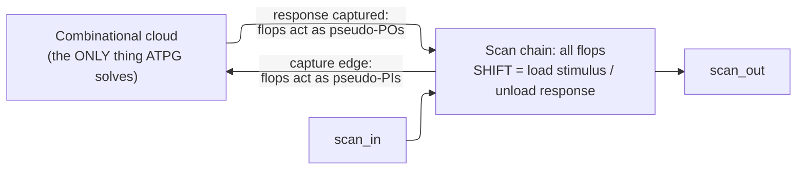
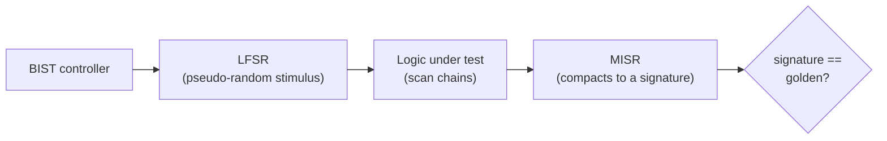
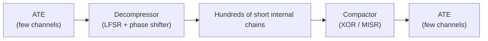

# Design for Test (DFT) and ATPG — Making an Opaque Chip Testable

> **Prerequisites:** [Fabrication_Process](../07_Manufacturing_and_Bringup/01_Fabrication_Process.md) (why yield is below 100% and defects are inevitable), [RTL_Design_Methodology](../03_Frontend_RTL_and_Verification/01_RTL_Design_Methodology.md) (flip-flops and combinational clouds), [CMOS_Fundamentals](../00_Fundamentals/01_CMOS_Fundamentals.md) (what a physical defect *is*).
> **Hands off to:** [STA](01_STA.md) (at-speed test validates the same paths STA signs off), [Gate_Level_Sim_and_Emulation](../03_Frontend_RTL_and_Verification/13_Gate_Level_Sim_and_Emulation.md) (scan patterns are validated in GLS before tapeout), [Tapeout_and_Post_Silicon_Bringup](../07_Manufacturing_and_Bringup/03_Tapeout_and_Post_Silicon_Bringup.md) (where these patterns run on the ATE).

---

## 0. Why this page exists

Fabrication is a statistical process, so **some fraction of every wafer is born defective** — a particle bridges two wires, a via etches open, a thin oxide leaks. You cannot ship those dies, so every single die must be *tested*. But a finished chip is almost perfectly opaque: it has a few hundred pins and a few hundred *million* internal nodes, and the state machine that connects them buries any given node dozens of clock cycles deep. Proving that node #40,000,000 is defect-free by driving the pins is not merely expensive — for a large sequential design it is computationally hopeless.

Two things follow, and they are the whole subject. First, we must **add hardware whose only job is to make internal state controllable and observable** — that is *design for test* (DFT), and its central instance, *scan*, is the most valuable structure on this page. Second, once the inside is reachable, we must **compute the input patterns that expose defects** — that is *automatic test pattern generation* (ATPG), which works not against real defects (unbounded, unknowable) but against a small **fault model** that stands in for them.

This page derives that machinery from the problem it solves. Every section asks *why must this exist*: why functional test collapses with sequential depth, why stitching flops into a shift register converts an impossible sequential search into a tractable combinational one, why we test a *proxy* defect instead of the real thing, why ATPG is a Boolean search with two obligations, why self-test and boundary scan and compression each become unavoidable at scale, and what each buys against what it costs. The reference material — the exact TAP state names, the LFSR bit-by-bit trace, the STIL field layout — is compressed to the idea; the reasoning is expanded. By the end you should be able to explain, from first principles, why a chip has scan at all, write the defect-level equation from memory, and reason quantitatively about the coverage-versus-cost knee that every real test program lives on.

---

## 1. The test problem: defects are certain, and pins cannot reach inside

Start with the two facts that force the entire field.

**Defects are inevitable — this is a yield statement.** The Poisson yield model (derived on the [Fabrication_Process](../07_Manufacturing_and_Bringup/01_Fabrication_Process.md) page) gives the fraction of dies with *no* killer defect as

$$
Y \;=\; e^{-A\,D}
$$

where $A$ = die area (cm²) and $D$ = defect density (defects/cm²). A modest $D = 0.1\ \text{cm}^{-2}$ on a $2\ \text{cm}^2$ die gives $Y = e^{-0.2} \approx 0.82$ — roughly **one die in five is born bad**. Test does not improve yield; its job is to *sort*: pass the good, reject the bad, and — the metric that matters — let as few defective parts *escape* to the customer as possible. Escapes are counted in **defective parts per million (DPPM)**, and the link between test quality and DPPM is the central equation of §3.5.

**Testing a node requires controlling it and observing it.** To prove a given internal node is fault-free you must do two things: **control** it — drive it from the primary inputs to a known value (and, for many faults, to *both* values) — and **observe** it — arrange for its value to propagate to a primary output where the tester can see it. Controllability and observability are the two currencies of all testing, and both are cheap at the pins and ruinously expensive deep inside.

**Sequential depth makes both collapse.** Consider controlling one flip-flop $d$ logic-and-register stages from the inputs. From the pins you cannot *write* it directly; you must find an *input sequence* that walks the state machine into a state where that flop holds the value you want — a search through the reachable-state graph, which is exponential in the number of flops. Observing it is the mirror image: you must propagate its value forward through more cycles to an output. A useful way to see how fast control decays is signal probability: the output of a $k$-input AND is 1 only for $2^{-k}$ of random inputs, and these probabilities compound through depth, driving buried nodes toward near-constant values that a random stimulus almost never flips. Formally:

- **Combinational ATPG is NP-complete** (Ibarra–Sahni; it reduces from Boolean SAT) — hard, but solved daily by good heuristics.
- **Sequential ATPG** on a machine with no reset and unknown initial state is dramatically worse: the standard method *unrolls* the circuit into $k$ time-frames and solves the combinational equivalent, but the worst-case $k$ is the sequential depth of the state space — up to $2^{N_{ff}}$ for $N_{ff}$ flops. Nobody runs functional sequential ATPG on a large design for manufacturing.

So the problem statement crystallizes into one question: *can we make every flip-flop directly controllable and observable, so the sequential search vanishes?* Section 2 is the answer, and it is worth more than everything after it.

---

## 2. Scan: converting a sequential test problem into a combinational one

The defect that kills sequential ATPG is that flop state is only reachable *through time*. Remove that and the problem changes character entirely. **Scan** does exactly this by giving every flop a second personality.

### 2.1 The idea, derived

Add to each flip-flop a mode select: in **functional mode** it captures its normal combinational input $D$; in **shift mode** it instead captures the output of the *previous* flop. Wire the flops so that in shift mode they form one long **shift register** — the *scan chain* — running from a `scan_in` pin to a `scan_out` pin. That single change buys both currencies at once:

- **Controllability → total.** Shift any bit pattern you like into the chain; now *every* flop holds exactly the value you chose. The flops have become directly-writable **pseudo-primary inputs**.
- **Observability → total.** After the circuit computes, capture the result into the same flops and shift it out. The flops have become directly-readable **pseudo-primary outputs**.

The essential added state is minimal — there is no port table to memorize, only a consequence of the two-mode requirement:

1. a **data-source select** on each flop (functional $D$ vs. scan input $SI$),
2. a **scan-enable** $SE$ that drives that select for every flop at once ($SE{=}1$ shift, $SE{=}0$ capture), and
3. a **chain order** making each flop's $Q$ the next flop's $SI$.

In gate terms the added mux is just $D_{\text{ff}} = (SI \wedge SE) \vee (D \wedge \overline{SE})$; in a modern library it is absorbed into a single **scan flop (SDFF)** standard cell so the area and delay penalty is paid once, cleanly.

### 2.2 Why this is the whole game: the combinational reduction

With every flop a pseudo-PI and pseudo-PO, a test is exactly three steps: **shift in** a stimulus (many slow clocks), apply **one capture clock**, **shift out** the response (overlapped with shifting in the next stimulus). Between the flops there is now only the **combinational logic cloud** — and *that cloud is the only thing ATPG has to solve*.

This is the single most important idea in DFT: **scan replaces a search over the state space with a search over one time-frame.** The intractable sequential problem of §1 is gone *by construction*, not by cleverness — the price is the scan hardware, and the industry has judged that price obviously worth paying for four decades.

### 2.3 What scan costs — the overhead trade-offs

Scan is not free, and the design point is a coverage-versus-overhead balance:

- **Area.** The mux adds ~15–20% to a bare flop; folded into an SDFF cell and amortized over the whole design the net penalty is a few percent of logic area. Essentially universal because the alternative — untestable silicon — is worthless.
- **Timing.** The mux sits in the flop's data path, costing a small setup penalty; the far larger physical-design task is the **scan-enable tree**, which fans out to *every* flop in the design (the largest net in the chip) and must be balanced so $SE$ is stable before capture.
- **Chain count — test time vs. pins vs. power.** With $N$ scan flops split into $C$ chains, each chain is $L = N/C$ deep, and since capture is one cycle, test time is dominated by shifting:

$$
T_{\text{test}} \;\approx\; \frac{P \cdot L}{f_{\text{shift}}} \;=\; \frac{P \cdot N}{C \cdot f_{\text{shift}}}
$$

where $P$ = pattern count, $f_{\text{shift}}$ = shift-clock frequency. More chains (larger $C$) cut test time linearly but demand more scan I/O pins and raise **shift power** (more flops toggling in parallel). Pin count is capped by the package and the ATE channel budget — which is exactly the wall that **test compression** (§7) is built to break, by decoupling *internal* chain count from *external* pin count.
- **Shift power.** During shift, up to ~50% of flops toggle every cycle — far more switching than functional operation ever produces. The resulting IR-drop can corrupt the capture, and the peak current stresses the grid. Mitigations: **low-power ATPG fill** (fill the don't-care bits to minimize toggling, 30–50% less shift power), reduced shift voltage, and staggered chain activation.

One implementation wrinkle worth keeping: when a chain crosses from one clock domain to another, the launch and capture edges can nearly coincide and race during shift. A **lockup latch** (a transparent latch clocked by the source domain) inserts a half-cycle of margin, converting a near-zero-slack race into a safe hand-off. DFT tools insert these automatically; the concept — a half-cycle buffer between domains in the chain — is all you need.

---

## 3. Fault models: a finite proxy for unbounded physical defects

Scan makes the inside reachable; now, *what do we test for?* You cannot enumerate physical defects — they are unbounded, layout- and process-dependent, and mostly invisible at the logic level. ATPG needs a **fault model**: a finite, technology-independent abstraction that (a) can be enumerated and targeted, and (b) *correlates* with real defects well enough that catching the model catches the silicon. The models form a hierarchy, each catching what the previous misses at rising pattern cost.

### 3.1 Stuck-at: the workhorse

Model every signal line as possibly **stuck-at-0 (SA0)** or **stuck-at-1 (SA1)**, independent of the gate. For $N$ lines there are exactly $2N$ single stuck-at faults — a *linear*, enumerable list. Its power is that this one crude abstraction catches a large fraction of gross defects (many opens and shorts manifest as a line held at a constant), and detecting a stuck-at fault forces the good machinery of §4 (drive the opposite value, propagate it out).

**Fault collapsing** shrinks the list before ATPG ever runs. Two faults are **equivalent** if they produce identical faulty behavior for *every* input (e.g., on an AND gate, `a`-SA0, `b`-SA0, and output-SA0 are one class — any input that would expose one exposes all). Fault $f_1$ **dominates** $f_2$ if every test for $f_2$ also detects $f_1$, so $f_2$ can be dropped. The **checkpoint theorem** caps the work: testing all stuck-at faults on *primary inputs and fan-out branches* covers all faults in a combinational circuit. Together these collapse the $2N$ list by ~50–70%, to roughly $0.3\text{–}0.5N$ — the reason ATPG is even affordable.

### 3.2 Transition and path-delay: catching timing defects — the STA link

A chip can pass every stuck-at test and still fail in the customer's system, because a gate produces the *correct* value but *too late*. Stuck-at is a static model; **delay defects** need a dynamic one. The **transition-delay fault (TDF)** marks each line **slow-to-rise** or **slow-to-fall** ($2N$ faults again), and detecting it needs a **two-vector at-speed test**: $V_1$ initializes the line, $V_2$ launches the transition, and the response is captured *one functional clock period later* (§5). If the gate is slow, the transition arrives after the capture edge and reads as the old value.

This is where test meets **timing signoff**. Transition and **path-delay** ATPG launch transitions down the very paths that [STA](01_STA.md) declared critical — at-speed test is the *silicon confirmation* of the STA timing model, catching the slow gates STA's library abstraction could not predict (a resistive via, a mis-modeled coupling). Path-delay faults model the *cumulative* delay along one sensitized path, which is stronger but explodes combinatorially — a design with reconvergent structure has up to $2^{\text{(stages)}}$ paths, so path-delay test is applied only to a hand-picked set of the most timing-critical paths, not exhaustively.

### 3.3 Bridging, cell-aware, and the death of IDDQ

- **Bridging faults** model an unintended short between two lines, behaving as a wired-AND or wired-OR; detection needs a pattern that drives the two lines to *opposite* values, so the short shows up.
- **Cell-aware** models (standard below ~16 nm) target defects *inside* a standard cell — an open on an internal transistor drain, a resistive internal via — that pin-level stuck-at/TDF cannot represent. The library vendor SPICE-characterizes each cell's internal defects; ATPG targets them, adding ~5–15% more patterns to catch a few percent more defective parts. Supported across Synopsys TetraMAX, Cadence Modus, and Siemens Tessent.
- **IDDQ** testing measures *quiescent* supply current: a defect-free CMOS circuit draws only leakage, while a bridge or gate-oxide short creates a DC path from VDD to GND. It was superb at older nodes (180 nm: ~nA/gate leakage, defects stood out) and is **effectively dead below ~28 nm**, because per-gate leakage rose to µA and swamped any defect signal. A clean example of a technique killed by scaling, not by a better idea.

### 3.4 Coverage: fault coverage vs. test coverage

Coverage is the metric that governs everything. Two definitions, and the distinction matters:

$$
\text{Fault Coverage} = \frac{\text{detected}}{\text{total} - \text{untestable}}, \qquad
\text{Test Coverage} = \frac{\text{detected}}{\text{total}}
$$

Test coverage is the more honest (it does not forgive untestable faults). **Untestable** faults are real and instructive: an **ATPG-redundant** fault is one whose line is *logically redundant* — removable without changing the function — so ATPG doubles as a redundancy/DFT-quality check (§4.3). Typical production targets: **>99% stuck-at**, **>90–95% transition**, with automotive/safety parts pushing higher.

### 3.5 Defect level: why the *last* percent of coverage is the expensive one

The payoff equation ties coverage to shipped quality. The Williams–Brown model gives the **defect level** — the fraction of *shipped* parts that are actually bad (the test escapes):

$$
\boxed{\,DL \;=\; 1 - Y^{\,1-T}\,}
$$

where $Y$ = process yield (fraction of dies with no defect) and $T$ = fault coverage (as a fraction). The endpoints sanity-check it: at $T = 1$, $DL = 1 - Y^0 = 0$ (a perfect test ships nothing bad); at $T = 0$, $DL = 1 - Y$ (no test, so you ship every defective die). In between, the escapes are worked numbers you should be able to reproduce:

- $Y = 0.80,\ T = 0.98 \Rightarrow DL = 1 - 0.80^{0.02} \approx 4{,}450\ \text{DPPM} \approx 0.45\%$.
- $Y = 0.90,\ T = 0.99 \Rightarrow DL \approx 1{,}050\ \text{DPPM}$.
- $Y = 0.90,\ T = 0.999 \Rightarrow DL \approx 105\ \text{DPPM}$.

The lesson is stark: even 99% coverage at 90% yield ships ~1000 bad parts per million. Each additional *nine* of coverage cuts escapes ~10×, which is exactly why automotive **ASIL-D** (<1 DPPM) demands >99.9% coverage across multiple fault models *plus* burn-in — and why the last fraction of a percent, not the first 98%, is where the pattern count and engineering cost pile up.

---

## 4. ATPG: a Boolean search with two obligations

Given a fault model, ATPG must find, for each fault, an input pattern that makes the fault *visible* at an output. Every ATPG algorithm — from 1966 to today's tools — is a search satisfying two obligations.

### 4.1 Activate, then propagate

To detect a fault you must:

1. **Activate** it — drive the fault site to the *opposite* of its stuck value, so the good and faulty circuits *differ* there. The classic bookkeeping uses the symbol $D$ = "1 in the good circuit, 0 in the faulty" (and $D'$ for the reverse), so activation creates a $D$ at the site.
2. **Propagate (sensitize)** — choose a path from the site to an observable output and set every *side input* along it to its **non-controlling value** (0 for an OR, 1 for an AND), so the $D$ passes through unblocked and reaches a pseudo-PO.
3. **Justify** — work backward from all the required internal values to a consistent assignment of the primary/pseudo-primary inputs.

That is the entire problem, and it is **NP-complete** — it reduces from SAT, because "does an input assignment exist that makes this output differ" is a satisfiability question. The two work-lists that organize the search are the **D-frontier** (gates poised to propagate the fault effect forward) and the **J-frontier** (assigned values not yet justified backward).

### 4.2 The algorithmic ladder: D-algorithm → PODEM → FAN

The history is a story of *shrinking the decision space*:

- **D-algorithm** (Roth, 1966) — the first complete algorithm. It makes decisions on *internal* signal lines. The flaw: an internal choice can conflict with the circuit's logic far from where it was made, so it backtracks a lot.
- **PODEM** (Goel, 1981) — the key insight: **only ever decide values at primary inputs**, then *forward-imply* to see what happens. Since every state is a real, consistent input assignment by construction, whole classes of internal conflicts cannot arise, and the decision space is exactly the input space rather than the (much larger) space of all internal-line assignments. It *backtraces* an objective to a PI, sets it, simulates, and checks.
- **FAN** (Fujiwara–Shimono, 1983) — accelerates PODEM with **multiple backtrace** (justify several objectives at once), **headlines** (fan-out-free regions solved directly), and unique-sensitization shortcuts. Modern tools are enhanced FAN plus static learning and massive parallelism.

The intuition to keep is *PODEM's*: decide at the inputs, imply forward, never paint yourself into a corner with an unjustifiable internal guess.

### 4.3 Redundancy is a free by-product

When ATPG *exhaustively* fails to find any activating-and-propagating pattern, the fault is **redundant** — proof that the faulted line cannot affect any output for *any* input, i.e. the logic is **logically redundant** and could be removed. So ATPG is not only a test generator but a redundancy detector and a DFT-quality auditor: unexpectedly many untestable faults usually means a controllability/observability blind spot the designer should fix (with a test point, §6.1) rather than accept.

---

## 5. At-speed test and on-chip clocking

Delay faults (§3.2) only appear at functional speed, and detecting one needs the two-vector launch-capture separated by *exactly one functional clock period*. Two schemes place that pair, trading ATPG difficulty against clocking difficulty:

- **Launch-off-capture (LOC / broadside).** Shift in $V_1$, drop $SE$ with relaxed timing, then apply a launch clock and a capture clock one functional period apart. Here $V_2 = f(V_1)$ is whatever the *combinational logic* produces from $V_1$ — so ATPG is ordinary combinational generation, but you cannot freely choose $V_2$, which slightly *lowers* achievable coverage.
- **Launch-off-shift (LOS / skewed-load).** The last *shift* clock launches the transition, so $V_2$ is $V_1$ shifted by one bit — high controllability and **higher coverage**, but $SE$ must switch from shift to capture within one at-speed period, an extremely tight constraint on the highest-fan-out net in the chip.

The remaining problem is *generating* a precise GHz launch-capture pair. An ATE cannot place edges 1 ns apart with the <10 ps accuracy needed — tester skew and jitter make external at-speed clocking unreliable above a few hundred MHz. So the chip generates the pair itself: an **on-chip clock controller (OCC)** takes the slow shift clock from the ATE, and during capture muxes in exactly one launch and one capture pulse from the locked on-die **PLL**, then gates the clock off to prevent extra captures. The ATE supplies only slow shift and a "go" handshake; the precise timing is manufactured on-chip. This is the direct silicon check on the timing that [STA](01_STA.md) signed off.

---

## 6. BIST: bringing the tester on-chip

External scan + ATE handles most random logic, but it has three limits: the ATE caps out below functional speed, some blocks (dense memories, analog) are unreachable by logic ATPG, and there is no test *in the field*. **Built-in self-test (BIST)** answers all three by embedding a pattern generator and a response checker in the silicon — enabling at-speed test, test of otherwise-unreachable blocks, cheaper ATE, and *periodic in-system self-test* (a hard requirement for functional-safety parts under ISO 26262, which run LBIST/MBIST at power-on and during operation).

### 6.1 Logic BIST: pseudo-random stimulus, signature response

The cheapest on-chip pattern source is a **linear-feedback shift register (LFSR)**: a shift register with XOR feedback whose taps form a **primitive polynomial**, which guarantees a **maximal-length** sequence cycling through all $2^n - 1$ nonzero states — a deterministic stream that *looks* random. The response side is a **multiple-input signature register (MISR)**, an LFSR fed by the circuit outputs that compacts an entire test session into one $n$-bit **signature**, compared against a precomputed golden value. Compaction is lossy — a faulty circuit can alias to the good signature — but only with probability $2^{-n}$, so a 32-bit MISR makes aliasing (≈0.23 ppb) negligible.

The catch is **random-pattern-resistant (RPR) faults**: some faults need a specific input that pseudo-random patterns almost never produce. A 20-input AND needs all 20 inputs high — probability $2^{-20} \approx 10^{-6}$, so 10,000 LFSR patterns detect it ~1% of the time. This is the *same* signal-probability collapse from §1, and it caps pure-LBIST coverage at a disappointing **80–90%**. The fix is **test-point insertion**: add controllable **control points** (force a hard-to-set node) and observable **observation points** (expose a hard-to-see node) — the direct antidote to the controllability/observability deficits ATPG's redundancy analysis flags. About **2–5%** area buys the jump to **>95%** LBIST coverage.

### 6.2 Memory BIST: memories need their own test

Memories are the largest, densest, most defect-prone part of a modern die, and logic ATPG cannot test them — an SRAM array is not a net of standard cells but a regular grid with its own failure physics (cell stuck-at, transition, **coupling** between neighbors, **address-decoder** faults, pattern-sensitivity). So a dedicated **MBIST** engine applies **March algorithms**: sequences of read/write operations swept in ascending and descending address order. The canonical **March C-** is:

$$
\{\,\Updownarrow(w0);\ \Uparrow(r0,w1);\ \Uparrow(r1,w0);\ \Downarrow(r0,w1);\ \Downarrow(r1,w0);\ \Updownarrow(r0)\,\}
$$

Its **10N** operations (for $N$ words) detect all stuck-at and transition faults, address faults, and most coupling faults: the *ascending* passes catch coupling from a lower-addressed aggressor, the *descending* passes catch the reverse, so together they cover every ordered pair. Richer algorithms (March SS at 22N) add neighborhood-pattern-sensitive coverage at more test time.

Because memory dominates both area and defect count, MBIST pairs with **built-in self-repair (BISR)**: the engine logs failing addresses, a repair-analysis step allocates **spare rows/columns**, and the remap is burned into fuses at test — recovering otherwise-scrapped dies and directly lifting the $Y$ in the defect-level equation.

---

## 7. Boundary scan and test compression: reaching the pins, and surviving the data volume

### 7.1 Boundary scan (JTAG / IEEE 1149.1): board-level access

Scan solves *inside-the-chip* access; once chips are soldered onto a board, a *new* access problem appears — the nets *between* packages are inaccessible to a bed-of-nails probe on a dense modern PCB. **Boundary scan** puts a scan cell at *every chip I/O*, chained into a **boundary register** reachable over a standard 4-wire **Test Access Port (TAP)**: `TCK`, `TMS`, `TDI`, `TDO`. The `EXTEST` instruction drives known values out of one chip's output cells and captures them at the neighbor's input cells, so a broken or shorted board trace shows up as a mismatch — testing *interconnect*, not logic. The mandatory instruction set is tiny (`BYPASS`, `EXTEST`, `SAMPLE/PRELOAD`); the TAP is a small FSM navigated by `TMS`, whose 16 states you can look up when you need them.

The same serial port has become the universal on-chip debug and instrument backbone. When an SoC grows to hundreds of embedded instruments (MBIST controllers, PLLs, sensors, monitors), a single fixed instruction-register-selected data register does not scale, so **IJTAG (IEEE 1687)** replaces it with a **reconfigurable scan network**: **segment-insertion bits (SIBs)** dynamically splice only the instruments you are accessing into the chain, so access time scales with what you *use*, not with the total instrument count.

### 7.2 Test compression: breaking the pattern-volume wall

Full scan produces enormous test data. Uncompressed, the volume is (scan cells) × (patterns) × 2, which for a 2M-flop design and tens of thousands of patterns runs to *gigabits* — beyond ATE memory — while test time scales with chain length (§2.3). Both costs must come down together, and one observation makes it possible: **test cubes are almost entirely don't-cares.** ATPG typically specifies only **1–5%** of scan cells per pattern; the rest can be filled freely.

So a few tester channels drive a **decompressor** (an LFSR + phase shifter) that expands them into *hundreds* of short internal chains, and the responses are squeezed back through an XOR/MISR **compactor** to a few output channels. This decouples internal chain count from pin count — the very constraint of §2.3 — cutting both data volume and test time by the compression ratio, typically **10–100×**.

The ratio is not unbounded, and the limit is theoretical, not a tool weakness. With $c$ input channels shifting for $L$ cycles, the ATE supplies $c \cdot L$ **free variables**; a pattern with $s$ specified care bits imposes $s$ linear equations on those variables, solvable with high probability only when $c \cdot L \gtrsim s$ (with ~20 bits of margin). Hence

$$
\text{compression ratio} \;\approx\; \frac{N_{\text{scan}}}{s} \quad\text{is bounded by the care-bit density } \frac{s}{N_{\text{scan}}}\text{, not by cleverness.}
$$

On the response side, compaction has its own cost: an unknown ($X$) value from an uninitialized flop or a bus corrupts the compactor and can mask good bits, so real designs spend effort on **X-masking / X-tolerant compactors** and on eliminating X-sources. Compression trades a little observability (through aggregation) and some silicon (the codecs) for a large drop in ATE time and data — almost always a winning trade, which is why every large SoC ships with it.

---

## 8. Scaling and economics: hierarchical DFT and the cost/quality trade

**Flat DFT does not scale.** Stitching a 50M-gate SoC into top-level chains and running one ATPG job blows up on every axis: 100K-deep chains push test time past budget, full-chip pattern counts hit hundreds of thousands, ATPG runtime runs to days on >100 GB of RAM, and third-party IP must be re-characterized at every integration. The fix mirrors how the chip was *designed* — **hierarchically**. Each block is wrapped (IEEE 1500, a boundary register for an embedded core) so it can be tested in **isolation**; the IP provider generates and *verifies* its block patterns once, and the SoC integrator **retargets** them through the top-level compression network, adding only a small interconnect-test pattern set. Blocks close DFT in parallel, patterns are optimal per block, and diagnosis localizes to a block.

**And the whole field is one economic trade-off.** Every mechanism on this page buys test *quality* with some mix of *area*, *design effort*, and *test time*:

| Lever | Buys | Costs |
|---|---|---|
| Scan (§2) | the entire combinational reduction; controllability/observability | ~a few % area, SE routing, shift power |
| At-speed / TDF (§5) | delay-defect coverage; STA silicon validation | OCC hardware, more patterns, tighter timing |
| Cell-aware (§3.3) | intra-cell defects, a few % more escapes caught | +5–15% patterns |
| Test points (§6.1) | LBIST 80–90% → >95% | +2–5% area |
| Compression (§7.2) | 10–100× less test time and data | codec area, some X-handling, slight coverage loss |
| BISR (§6.2) | recovers defective memory dies (raises $Y$) | spare arrays, repair logic, fuses |

The governing equation is still $DL = 1 - Y^{1-T}$ from §3.5: a consumer SoC lives happily at ~99% stuck-at plus at-speed and calls it done; an ASIL-D automotive part spends heavily to reach >99.9% across stuck-at, transition, and cell-aware — plus burn-in — to get under 1 DPPM. The same yield arithmetic dominates **3D / chiplet** stacks, where the die must be proven **Known-Good (KGD)** *before* assembly because stack yield multiplies:

$$
Y_{\text{stack}} \;=\; \prod_{i} Y_{\text{KGD},i}, \qquad \text{e.g. an 8-die stack at } 0.995 \text{ each} \Rightarrow 0.995^8 \approx 0.96
$$

so a per-die escape that would be a nuisance in a monolith becomes a scrapped *stack* of eight good dies — which is why 3D parts demand full scan + MBIST + TSV/interconnect test to <10 DPM per die *before* they are ever bonded.

---

## 9. Numbers to memorize

| Parameter | Typical | Why this value (section) |
|---|---|---|
| Stuck-at faults for $N$ lines | $2N$, collapse to $0.3\text{–}0.5N$ | linear model + equivalence/dominance (§3.1) |
| Stuck-at coverage target | >99% | defect level vs. DPPM (§3.4–3.5) |
| Transition coverage target | 90–95% (higher for auto) | at-speed delay defects (§3.2) |
| Defect level | $DL = 1 - Y^{1-T}$ | the payoff equation (§3.5) |
| Automotive ASIL-D target | <1 DPPM | needs >99.9% + burn-in (§3.5, §8) |
| Scan mux / SDFF area | 15–20% per flop, few % net | scan overhead (§2.3) |
| Scan chain length | 1K–10K flops/chain | test time vs. pins (§2.3) |
| Shift-clock frequency | 10–50 MHz | limit shift power (§2.3) |
| At-speed capture | functional freq (to 5 GHz+), via OCC | delay test needs functional period (§5) |
| Test compression ratio | 10–100× | bounded by care-bit density (§7.2) |
| Care-bit density per pattern | 1–5% | what makes compression work (§7.2) |
| LFSR max sequence | $2^n - 1$ (primitive poly) | maximal-length stimulus (§6.1) |
| MISR aliasing | $2^{-n}$ (32-bit ≈ 0.23 ppb) | signature compaction (§6.1) |
| LBIST coverage w/o test points | 80–90% | random-pattern-resistant faults (§6.1) |
| LBIST coverage w/ test points | >95% (+2–5% area) | controllability/observability aids (§6.1) |
| March C- complexity | 10N ops | SAF + TF + coupling + address (§6.2) |
| JTAG TAP wires | 4 (TCK/TMS/TDI/TDO) | board-level serial access (§7.1) |
| Mandatory JTAG instructions | BYPASS, EXTEST, SAMPLE/PRELOAD | minimal boundary-scan set (§7.1) |
| SoC test-time budget | 1–3 s on ATE | ATE cost ≈ \$0.01–0.10 / s / site (§8) |

---

## 10. Worked problems

**1 — Defect level from coverage (Williams–Brown).** A consumer part has yield $Y = 0.85$ and stuck-at coverage $T = 0.99$. Escapes: $DL = 1 - 0.85^{0.01} = 1 - e^{0.01\ln 0.85} = 1 - e^{-0.001625} \approx 0.001624 \approx 1{,}620\ \text{DPPM}$. To reach the automotive **<1 DPPM** at the same yield you need $Y^{1-T} > 1 - 10^{-6}$, i.e. $(1-T)\,|\ln Y| < 10^{-6}$, giving $T > 1 - 6.2\times10^{-6} \approx 99.9994\%$ — unreachable by ATPG alone, which is *why* safety flows add cell-aware faults, at-speed test, and burn-in rather than chasing coverage forever.

**2 — Scan test time and the case for compression.** $N = 2{,}000{,}000$ flops, $P = 15{,}000$ patterns, $f_{\text{shift}} = 20$ MHz. With $C = 200$ chains, $L = 10{,}000$, and $T_{\text{test}} \approx PL/f = 15{,}000 \times 10{,}000 / (20\times10^6) = 7.5\ \text{s}$ — over the 1–3 s budget. Push to $C = 2{,}000$ *internal* chains via a decompressor driven by, say, 20 ATE channels (a 100× compression): $L = 1{,}000$, $T_{\text{test}} \approx 0.75\ \text{s}$, without needing 2,000 physical scan pins. This is exactly the pin-count decoupling of §7.2.

**3 — Why memory gets BISR but random logic does not.** Memory is regular, so a defective bit can be swapped for a spare with a fuse remap (BISR, §6.2) — cheap, and it lifts $Y$ directly. Random logic is irregular: there is no "spare gate" to remap to, so its only yield lever is *design* (redundancy is expensive and rare). Hence the asymmetry across every SoC: repair the arrays, test-and-sort the logic.

---

## Cross-references

- **Down the stack (what test is built on):** [Fabrication_Process](../07_Manufacturing_and_Bringup/01_Fabrication_Process.md) (the $Y = e^{-AD}$ yield and defect taxonomy that make test necessary), [CMOS_Fundamentals](../00_Fundamentals/01_CMOS_Fundamentals.md) (what a physical defect is at the device level), [RTL_Design_Methodology](../03_Frontend_RTL_and_Verification/01_RTL_Design_Methodology.md) (the flops and combinational clouds scan operates on).
- **Adjacent (signoff siblings):** [STA](01_STA.md) (at-speed / transition test validates in silicon the very paths STA signs off; shares the OCC and clock model), [Physical_Verification_DRC_LVS](03_Physical_Verification_DRC_LVS.md) (the other half of "is the manufactured layout correct").
- **Up the stack (where test patterns go):** [Gate_Level_Sim_and_Emulation](../03_Frontend_RTL_and_Verification/13_Gate_Level_Sim_and_Emulation.md) (scan patterns are validated against the gate-level netlist before tapeout), [Tapeout_and_Post_Silicon_Bringup](../07_Manufacturing_and_Bringup/03_Tapeout_and_Post_Silicon_Bringup.md) (wafer sort and final test, where these patterns run on the ATE and the DPPM is finally measured).

---

## References

1. Bushnell, M.L. and Agrawal, V.D., *Essentials of Electronic Testing for Digital, Memory and Mixed-Signal VLSI Circuits*, Springer, 2000. The standard graduate text; controllability/observability, ATPG, BIST.
2. Abramovici, M., Breuer, M.A., and Friedman, A.D., *Digital Systems Testing and Testable Design*, IEEE Press, 1990. Fault models, fault collapsing, the D-calculus.
3. Roth, J.P., "Diagnosis of Automata Failures: A Calculus and a Method," *IBM J. Res. Dev.*, 10(4), 1966. The D-algorithm.
4. Goel, P., "An Implicit Enumeration Algorithm to Generate Tests for Combinational Logic Circuits" (PODEM), *IEEE Trans. Computers*, C-30(3), 1981.
5. Fujiwara, H. and Shimono, T., "On the Acceleration of Test Generation Algorithms" (FAN), *IEEE Trans. Computers*, C-32(12), 1983.
6. Williams, T.W. and Brown, N.C., "Defect Level as a Function of Fault Coverage," *IEEE Trans. Computers*, C-30(12), 1981. The $DL = 1 - Y^{1-T}$ model.
7. van de Goor, A.J., *Testing Semiconductor Memories: Theory and Practice*, Wiley, 1991. March algorithms and memory fault models.
8. Rajski, J. et al., "Embedded Deterministic Test," *IEEE Trans. CAD*, 23(5), 2004. The LFSR-based compression of §7.2.
9. IEEE Std 1149.1 (JTAG boundary scan), 1500 (embedded-core wrapper), 1687 (IJTAG). The access-standard family of §7.
