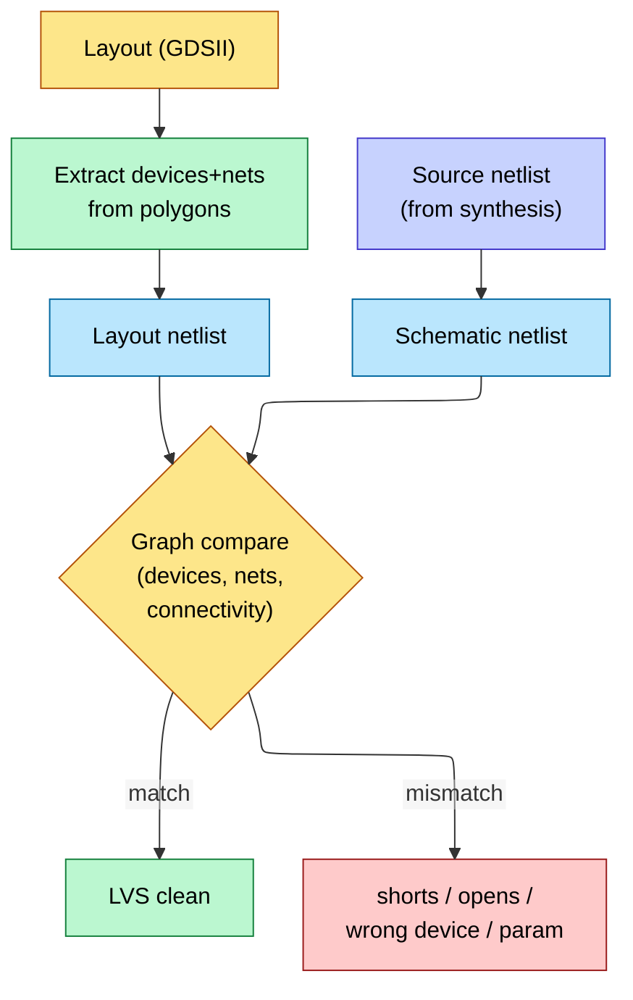
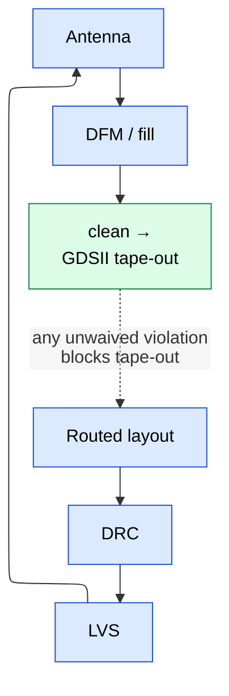

# Physical Verification — DRC, LVS, Antenna, and DFM Signoff

> **Stage:** 06 · Signoff. The checks that prove the *layout* is manufacturable and matches the netlist — the last gate before [GDSII hand-off](../07_Manufacturing_and_Bringup/03_Tapeout_and_Post_Silicon_Bringup.md).
> **Prerequisites:** [Physical_Design](../05_Backend_Physical_Design/01_Physical_Design.md), [Fabrication_Process](../07_Manufacturing_and_Bringup/01_Fabrication_Process.md) (the rules come from the process). **Hands off to:** tape-out.

---

## 0. Why this page exists

Timing signoff ([STA](01_STA.md)) proves the chip is *fast enough*; physical verification proves it can actually be *built and will be the circuit you designed*. The foundry will not accept a GDSII that violates its design rules, and a layout that passes DRC but doesn't match the schematic is a guaranteed dead chip. These checks — DRC (rules), LVS (layout = schematic), antenna, and DFM — are a hard, foundry-defined gate. Each catches a class of failure invisible to every earlier check. (The *physics* of why the rules exist is in [Fabrication_Process](../07_Manufacturing_and_Bringup/01_Fabrication_Process.md); this page is the *signoff*.)

---

## 1. DRC — Design Rule Check

DRC verifies the layout obeys the **foundry's geometric rules**, which encode what the [lithography + etch process](../07_Manufacturing_and_Bringup/01_Fabrication_Process.md) can actually print.

| Rule class | Example | Why the process needs it |
|---|---|---|
| **Width** | min metal width | thinner can't be patterned / opens |
| **Spacing** | min space between same-layer shapes | closer shorts / can't resolve |
| **Enclosure** | via must be enclosed by metal by X | mis-alignment margin |
| **Area / density** | min/max metal density per window | **CMP** planarity (dishing/erosion) |
| **Antenna** | max gate-area-to-metal ratio | plasma charge damage (see §3) |
| **Min-area / notch / corner** | no slivers | manufacturability |

At advanced nodes there are **thousands** of rules, plus **DPT/MPT coloring** rules (multi-patterning: shapes must be 2-colorable for double-patterning, or odd-cycle conflicts are flagged) and **DRC+ / equation-based** rules. DRC runs on the full GDSII and must reach **zero violations or justified waivers** — the foundry rejects anything else.

### 1.1 DRC in Practice — Rule Categories, Runsets, Debug (from the PnR view)

**Fundamental DRC rules:**

```ascii-graph
  Minimum width:    |<- w ->|     w >= w_min (e.g., 36nm for M1 at 7nm)
                    |=======|
  
  Minimum spacing:  |===| gap |===|    gap >= s_min (e.g., 36nm for M1)
  
  Minimum enclosure (via in metal):
                    +----------+
                    |  +----+  |
                    |  | via|  |    enclosure >= e_min on all sides
                    |  +----+  |
                    +----------+
  
  Minimum area:     Metal rectangle must have area >= A_min
  
  End-of-line (EOL) spacing:
                    |===|
                         ↕ EOL space (larger than regular spacing)
                    |===|
                    
  (The end of a wire needs more spacing due to lithography effects)
```

**Advanced Node DRC (7nm and below):**

- **LELE double patterning**: features on one layer split into two masks (colors)
```ascii-graph
  Original M2:    |A| |B| |C| |D|
  
  Mask 1 (blue):  |A|     |C|      (every other wire)
  Mask 2 (green):     |B|     |D|
  
  Coloring constraint: adjacent wires must be on different masks.
  If 3 mutually adjacent wires → coloring conflict → DRC error!
```

- **SADP (Self-Aligned Double Patterning)**: mandrel+spacer technique, creates very specific design rules
  - Tip-to-tip spacing rules (different for same-color vs different-color)
  - Cut-based rules for creating line ends

- **Via pillar rules**: vias must land on specific grid locations


---

## 2. LVS — Layout Versus Schematic

LVS proves the **layout implements the intended netlist** — that the polygons, when extracted into devices and nets, are *electrically identical* to the schematic/netlist.



The tool **extracts** devices and connectivity from the layout, then does a **graph isomorphism** comparison against the source netlist. Mismatches it catches:
- **Shorts** — two nets that should be separate are connected (the classic killer).
- **Opens** — one net that should be connected is split.
- **Wrong/missing device**, wrong transistor W/L, wrong connectivity.
- **Property mismatches** — device parameters off.

LVS clean is non-negotiable: a short between power and ground, or a swapped connection, makes the chip dead regardless of perfect timing. Paired with LVS, **ERC** (Electrical Rule Check) flags floating gates, missing well/substrate ties, etc.

### 2.1 LVS in Practice — Extraction, Comparison, Classic Mismatches

```ascii-graph
  LVS Flow:
  
  Layout (GDSII)                    Schematic (Netlist from synthesis)
       |                                      |
       v                                      v
  Device Extraction                     Read Netlist
  (identify transistors,                      |
   resistors, caps)                           |
       |                                      |
       v                                      v
  Connectivity Extraction              +-----------+
  (trace metal connections)    ------> |  COMPARE  |
       |                               +-----------+
       v                                      |
  Extracted Netlist                           v
                                      PASS or FAIL
                                      (with error report)
```

**Common LVS errors:**

| Error Type       | Cause                                        | Fix                              |
|------------------|----------------------------------------------|----------------------------------|
| Short            | Two nets connected that shouldn't be         | Fix routing overlap              |
| Open             | Net has disconnected segments                | Add missing via or wire          |
| Device mismatch  | Extra/missing transistor in layout           | Check well/diffusion regions     |
| Floating net     | Net connected to nothing                     | Connect or remove                |
| Parameter mismatch | Transistor W/L differs from schematic      | Fix device sizing                |
| Missing connection | Pin not properly connected to net          | Fix pin geometry                 |

### 2.2 ERC (Electrical Rule Check)

- **Floating gate**: gate terminal not connected to any driver → undefined state, excessive leakage
- **Antenna violation**: antenna ratio exceeds limit (see Section 5.5)
- **Well connectivity**: N-well must be connected to VDD, P-well to VSS (or body bias supply)
- **ESD path check**: all IO pads have proper ESD protection path to VDD/VSS


---

## 3. Antenna check — a process-damage rule worth its own section

During fabrication, a long metal wire connected to a thin transistor gate but **not yet** connected to a diffusion can collect charge from the plasma etch/deposition. If the accumulated charge-to-gate-area ratio (**antenna ratio**) exceeds the process limit, the voltage damages the thin gate oxide (Fowler-Nordheim tunneling → Vt shift / [TDDB](../05_Backend_Physical_Design/02_Signal_Integrity_Reliability.md)). Fixes the tool/router applies:
- **Antenna (jumper) diodes** to bleed charge to substrate, or
- **Layer jumping** — break the long wire and route a piece on a higher layer so no single-layer antenna is too large.

It's a DRC-class rule but distinct because the failure is **reliability/yield**, not a geometric short, and it depends on the *order* metals are deposited.

---

## 4. DFM — Design for Manufacturability (beyond pass/fail)

DFM goes past binary rule-checking to *improve yield*:
- **CMP / density fill** — add dummy metal/poly to equalize density so [CMP](../07_Manufacturing_and_Bringup/01_Fabrication_Process.md) doesn't dish or erode.
- **Litho hotspot / OPC-awareness** — flag patterns that print marginally even if DRC-legal; recommend wire spreading, via doubling.
- **Redundant vias** — replace single vias with double vias where space allows (a single via is a yield/EM risk).
- **Critical-area analysis** — estimate random-defect-limited yield from the layout's susceptibility to particle defects.

DFM is "DRC-clean but better" — the gap between *manufacturable* and *high-yielding*.

### 4.1 Metal Density Checks and Dummy Fill

```ascii-graph
  CMP (Chemical Mechanical Polishing) during fabrication:
  
  Without fill:                    With fill:
  
  |==|         |==|               |==| |F| |F| |==| |F|
  +---substrate----+              +---substrate---------+
  
  Low density area polishes          Uniform density → uniform
  differently → dishing, erosion     polishing → flat surface
  
  Foundry requirement: metal density per layer must be 20-80% in any window.
  Fill insertion adds dummy metal shapes to meet density targets.
  
  Timing impact: fill adds parasitic capacitance to nearby signal wires!
  Timing-aware fill: avoid placing fill too close to timing-critical nets.
```


---

## 5. Where PV sits — the signoff gate



Physical verification is run on the **full-chip merged GDSII** (including IP, memories, analog) and must be **clean or fully waived** before the [tape-out](../07_Manufacturing_and_Bringup/03_Tapeout_and_Post_Silicon_Bringup.md) hand-off. It's typically the last thing standing between "design done" and "send to fab."

---

## 6. Numbers / facts to memorize

| Fact | Value/why |
|---|---|
| DRC rule count (advanced node) | thousands (+ multi-patterning coloring) |
| DRC gate | zero unwaived violations — foundry rejects otherwise |
| LVS method | extract → **graph isomorphism** vs source netlist |
| LVS top killers | power/ground short, swapped net, wrong device |
| Antenna failure | gate-oxide damage from plasma charge (Fowler-Nordheim) |
| Antenna fixes | jumper diode, layer jumping |
| DFM levers | density fill, double vias, hotspot fixes |
| Runs on | full merged GDSII (incl. IP/memory/analog) |

---

## Cross-references

- The in-practice subsections (1.1, 2.1, 2.2, 4.1) were moved here from [Physical_Design](../05_Backend_Physical_Design/01_Physical_Design.md) §6; PD keeps the hand-off summary.
- Upstream layout: [Physical_Design](../05_Backend_Physical_Design/01_Physical_Design.md). SI/reliability: [Signal_Integrity_Reliability](../05_Backend_Physical_Design/02_Signal_Integrity_Reliability.md).
- Rule physics: [Fabrication_Process](../07_Manufacturing_and_Bringup/01_Fabrication_Process.md). Hand-off: [Tapeout_and_Post_Silicon_Bringup](../07_Manufacturing_and_Bringup/03_Tapeout_and_Post_Silicon_Bringup.md).
- Other signoffs: [STA](01_STA.md), [Power_Analysis_and_Signoff](../02_Power_and_Low_Power/05_Power_Analysis_and_Signoff.md), [DFT_and_ATPG](02_DFT_and_ATPG.md).
