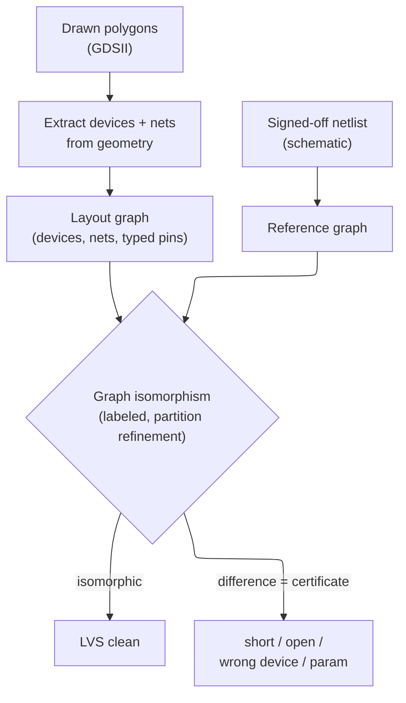
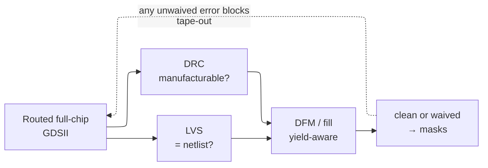

# Physical Verification — proving a layout is manufacturable and is the circuit you signed off

> **Stage:** 06 · Signoff — the last gate before mask-making.
> **Prerequisites:** [Physical_Design](../05_Backend_Physical_Design/01_Physical_Design.md) (the placed-and-routed polygons that must obey the rules), [Fabrication_Process](../07_Manufacturing_and_Bringup/01_Fabrication_Process.md) (the litho / etch / CMP physics the rules encode).
> **Hands off to:** [Tapeout_and_Post_Silicon_Bringup](../07_Manufacturing_and_Bringup/03_Tapeout_and_Post_Silicon_Bringup.md) (GDSII → masks → silicon).

---

## 0. Why this page exists

A finished layout is nothing but a stack of **polygons on named layers**, and its entire future is to be turned into a set of **photomasks**. Hold that reframing and the whole page follows: once the layout is *polygons destined for masks*, exactly two things can be wrong with it, and they are **independent**.

1. The geometry may be **unmanufacturable** — it asks the process to print or etch something outside its physical window, so the pattern comes out distorted (or not at all) and the die does not yield.
2. The polygons may **not implement the intended circuit** — extracted into devices and nets, they connect up to *something other than* the netlist that passed timing, power, and functional signoff. One stray overlap ties two nets together and the chip is dead.

Physical verification is the two independent **proofs** that neither is true. **DRC** proves manufacturability — the polygons obey the foundry's rule deck. **LVS** proves the polygons *are* the signed-off circuit — they extract to a netlist equivalent to the schematic. Everything else here (antenna, ERC, DFM) hangs off one of those two.

The reason this is a hard, foundry-defined gate and not one more lint step is **finality**: after tape-out the polygons become chrome-on-glass and then silicon, and *nothing downstream re-derives the circuit from the geometry or re-checks the geometry against the process.* There is no simulation of "did the mask print" or "does the metal connect what I think." A DRC escape becomes silent yield loss found — if ever — at wafer sort; an LVS escape becomes a dead first silicon found at bring-up, after a mask set costing millions and months. DRC and LVS are the last place these two classes of bug can be caught at all.

---

## 1. Two proofs, because there are two ways to be wrong

The two failure modes are orthogonal, so neither proof subsumes the other. Read the table as *the failure comes first, the proof is whatever catches it*:

| What is actually wrong | Failure mode | Proof that catches it | Why nothing else can |
|---|---|---|---|
| A feature sits outside the process window (too thin, too close, under-enclosed, wrong density) | **Unmanufacturable** — poor print/etch, dishing, or plasma damage → yield loss | **DRC** (§2) | no downstream step re-checks geometry against the process; STA/power/DFT never see polygons |
| The polygons connect up to a different circuit than the netlist | **Wrong circuit** — a short, open, or swapped device → dead chip | **LVS** (§3) | no downstream step reconstructs connectivity from geometry; the netlist that passed every other check is *assumed*, not verified against the drawing |

A layout can be perfectly rule-clean and still implement the wrong circuit (a mis-routed but legal wire), or implement the right circuit and still be unmanufacturable (a correctly-connected route that violates spacing). You need **both**, and each is blind to the other's failure.

Both proofs rest on one enabling primitive: **extracting meaning from raw polygons.** DRC *measures geometric relationships* among polygons; LVS *reconstructs devices and connectivity* from the same polygons. The rest of the page is (a) what DRC must measure and why, and (b) what LVS must reconstruct and compare against.

---

## 2. DRC — proving the geometry is manufacturable

### 2.1 Where the rules come from: the process window is the real constraint

The foundry's yield guarantee is **conditional**. The fab qualifies a process — a *distribution* of litho dose and focus, etch bias, mask overlay, CMP removal — and promises a defect density $D_0$ and a systematic yield **only for layouts every feature of which sits inside that qualified window.** The rule deck is the machine-checkable projection of that window onto geometry. So a design rule is never arbitrary; each is a physical margin, and you can derive the whole taxonomy from the failure it prevents:

- **width** — below a minimum, a line necks and *opens*: line-edge roughness and etch bias remove a roughly fixed number of nanometres from each edge, so a too-thin line is eaten through.
- **spacing** — below a minimum, two features are not optically *resolved* (they merge) or bridge in etch. The minimum space **is** the single-exposure resolution limit (§2.3).
- **enclosure** (metal must cover a via by $X$) — margin against **overlay**: the via mask and the metal mask register imperfectly, so a mis-aligned via must still land fully on metal.
- **min-area / notch / corner** — sub-resolution nubs and slivers do not print faithfully; corner rounding erases them, so the layout must not depend on them.
- **density** (min/max metal in a moving window) — **CMP** removes material at a rate that depends on local pattern density; too sparse *dishes*, too dense *erodes*, so planarity requires bounded density. This is exactly what dummy fill (§4) exists to satisfy.
- **antenna** — not geometric in its *failure* at all: a large metal-to-gate area collects plasma charge during etch and can rupture the gate oxide before power-on (§2.6).

The physics behind each margin — Rayleigh resolution, etch loading, the overlay budget, CMP dishing/erosion — is developed in [Fabrication_Process](../07_Manufacturing_and_Bringup/01_Fabrication_Process.md) (§3 litho, §4 etch, §7 CMP). What matters here is the **inversion**: DRC is that physics compiled into geometric predicates a tool can check exhaustively over billions of polygons.

### 2.2 DRC as geometric constraint checking (the theory)

A rule deck is best understood as a **program in a geometric algebra over layer polygons**. Its primitives are few:

- **Boolean layer ops** — `AND`/`OR`/`NOT`/`XOR` between layers (e.g. $\text{GATE} = \text{POLY} \cap \text{DIFF}$ derives the transistor-channel region that other rules then measure).
- **sizing** — grow/shrink a layer by $d$: the morphological dilation/erosion that expresses "enclosure" and "area-after-shrink" checks.
- **edge / spacing measurement** — the signed perpendicular distance between edges. **Width**, **spacing**, **enclosure**, **extension**, and **end-of-line** are all *one operator* with different operands and a $\ge$ or $\le$ bound.
- **connectivity-aware ops** — same-net shapes may touch, different-net may not, so net-aware spacing needs a connectivity pass first.
- **density** — the polygon-area fraction inside a moving window: a convolution reduced to a threshold.

Every rule is then a **universally-quantified geometric predicate**: *for all* edge pairs / polygons / windows, some measured quantity satisfies a bound. DRC is the evaluation of the large **conjunction** of these predicates, and a violation is a *witness* — a specific pair of edges — that falsifies one. Two properties make this tractable at full-chip scale. The predicates are **local**: a min-spacing violation lives within $s_{max}$ of both edges, so a **scanline sweep with a spatial index** finds candidate pairs in $O(P\log P)$ rather than the naive $O(P^2)$, where $P$ = polygon count. And they are **decidable and vector-exact** — no sampling, unlike a simulation, which is why a "clean" DRC is a proof and not a spot check. That locality is exactly what the hierarchy and runtime story (§2.6) exploits.

### 2.3 Why advanced nodes explode the rule count

A mature node runs a few hundred rules; N3 runs **5000+**. The blow-up is not bureaucratic — it is the resolution wall. The smallest printable half-pitch is Rayleigh-limited:

$$ hp_{min} = k_1\,\frac{\lambda}{NA}, \qquad k_1 \gtrsim 0.25 $$

where $\lambda$ = exposure wavelength, $NA$ = numerical aperture, and $k_1$ = process factor with a hard physical floor near $0.25$. For 193 nm immersion ($NA\approx1.35$) that is a half-pitch near 40 nm — a printable **pitch of ~80 nm**. Drawn pitches below it **cannot be printed in one exposure at all**, and the two escapes each multiply the deck:

- **Multi-patterning (LELE / SADP / SAQP)** — split one drawn layer across 2–4 masks so each *printed* mask stays above the single-exposure pitch. This adds an entire class of **coloring / decomposition rules** (§2.4) on top of the ordinary width and spacing rules, plus mask-overlay and stitch rules.
- **Restricted rules + context sensitivity** — the residual window is so tight that legality becomes *context-dependent*: end-of-line spacing differs from mid-line spacing, spacing depends on the neighbour's width and parallel-run length, certain pitches are forbidden outright. Each context is another rule.

The litho detail (DUV/EUV, OPC, PSM, SMO) lives in [Fabrication_Process](../07_Manufacturing_and_Bringup/01_Fabrication_Process.md) §3.2–3.4; the routing-side view of decomposition is [Physical_Design](../05_Backend_Physical_Design/01_Physical_Design.md) §5.2. Here we take the piece that is fundamentally a *checking* problem: coloring.

### 2.4 Multi-patterning as graph coloring

Layout decomposition is a **graph-coloring** problem, and saying so is what makes "native conflict" rigorous rather than folkloric. On one multiply-patterned layer, build the **conflict graph** $G=(V,E)$:

$$ V = \{\text{polygons}\}, \qquad (u,v)\in E \iff \text{spacing}(u,v) < s_{single} $$

where $s_{single}$ = the minimum spacing a single exposure can resolve. An edge means the two shapes **must go on different masks** — one exposure cannot resolve them. A legal decomposition onto $k$ masks is then *exactly* a **proper $k$-coloring** of $G$.

For **double patterning** ($k=2$) the theory is sharp:

$$ G\ \text{is 2-colorable} \iff G\ \text{is bipartite} \iff G\ \text{contains no odd cycle.} $$

So the one decomposition error a designer cannot fix by re-assigning masks is an **odd cycle** in the conflict graph — the canonical case being three *pairwise*-too-close shapes (a triangle $K_3$), though any odd cycle qualifies: any 2-coloring forces two mutually-close shapes onto the same mask. This is a **native conflict** — not a mask-assignment mistake but a geometric impossibility — so the only fixes change geometry: **spread** one shape to delete an edge, or **stitch** (split one polygon across both masks so its two pieces satisfy conflicting neighbours, at the cost of an overlay-sensitive seam). Tools minimize stitches and report an un-stitchable odd cycle as a hard DRC error.

For $k\ge3$ (triple patterning, SAQP-class) decomposition is **NP-hard** in general — deciding 3-colorability is NP-complete — so tools lean on the *restricted structure* of real conflict graphs (low degree, near-planar) plus stitching heuristics. (Intuition for why quad-patterning rarely hits a fundamental wall: a planar conflict graph is 4-colorable by the four-color theorem, whereas the $k=2$ odd-cycle obstruction is unavoidable.)

**Trade-off — coloring constraints vs routing freedom.** Every conflict edge the router must keep 2-colorable is a track it *cannot* freely use: laying a wire where it would close an odd cycle is illegal even though its spacing to each neighbour *individually* is fine. Multi-patterning is therefore a **routability tax** paid in lost adjacency — which is why advanced-node routing is forced onto regular, unidirectional, fixed-pitch grids (PD §5.2): regularity keeps the conflict graph bipartite *by construction*, trading layout freedom for guaranteed colorability.

### 2.5 The design-rule tax: restrictiveness vs density

Restricted design rules (RDR) — single orientation per layer, fixed pitch, a short menu of widths, uniform gate pitch — shrink the rule window enough to guarantee printability, and in doing so **forbid denser but marginal layouts** that an older, looser node would have printed. That is the **design-rule tax**: area and density surrendered to buy yield and printability. Real designs pay it because the ROI is asymmetric — at the leading edge the *unrestricted* layout prints at zero yield, so any tax has effectively infinite return, while at a mature node where the window is comfortable the deck stays permissive because the area is worth more than the (already high) yield. This is why cell area at a new node shrinks *less* than the raw lithographic scaling promises: some of the scaling is eaten by the tax.

### 2.6 Signoff runtime vs full-chip scale: hierarchical checking

A full-chip merged GDSII is $10^{10}$–$10^{12}$ polygons; even the $O(P\log P)$ scanline of §2.2 is days if run flat. The escape is **hierarchy**: a standard cell placed a million times is checked **once** internally, and only the **interactions across placement boundaries** (plus top-level routing) are checked in context. Speedup scales with the reuse factor of the hierarchy. The limiter is **context sensitivity** — abutted cells, overlapping wells, and density windows straddle boundaries and break pure hierarchy — so tools **flatten locally** in halo regions and stay hierarchical elsewhere (hybrid). That is the runtime-vs-scale knee: more flattening buys accuracy on boundary interactions at superlinear runtime; more hierarchy is faster but risks missing a boundary-context violation. Massively-parallel and cloud DRC push the same knee by throwing cores at the flat regions.

---

## 3. LVS — proving the polygons implement the intended circuit

### 3.1 Why an independent re-derivation is necessary

DRC never asks *what circuit* the polygons form; a rule-clean layout can be the wrong netlist. And the layout is a **fresh artifact**, produced and edited by place-and-route, ECO scripts, analog draftsmen, and last-minute hand-fixes — none of which is *guaranteed* to preserve connectivity. A nudged wire bridges two nets; a dropped via opens one; a flipped device swaps source and drain. No upstream check re-reads the geometry, so the connectivity can **silently diverge** from the netlist that passed every other signoff. LVS is the only step that **reconstructs the circuit from the drawn polygons and compares it to the intended one.** Extraction is the *inverse* of layout, and the comparison is the proof that the inversion round-trips.

### 3.2 Extraction: recovering devices and nets from polygons

Two derivations, from geometry alone. **Devices** come from layer *intersections*: $\text{POLY}\cap\text{DIFF}$ is a MOSFET channel whose $W$ and $L$ read straight off the overlap geometry, with well and implant layers setting the type and special layers marking resistors, caps, and diodes. **Nets** come from *connectivity*: metal and via polygons that touch form one electrical node, so a flood/scan labels each maximal connected conductor as a net, and pin shapes and text attach names. The output is an **extracted netlist** — typed devices, wired by nets, carrying whatever **names** survived in layout text. (The very same extraction, run *with* parasitic $R$ and $C$, feeds [STA](01_STA.md); LVS uses only its device-and-connectivity skeleton.)

### 3.3 LVS as graph isomorphism

The extracted circuit and the reference netlist are each a **labeled graph**: nodes are devices and nets, edges are terminal connections **typed** by pin role (gate/source/drain/bulk), and nodes carry labels (device type, net/instance name). LVS is deciding whether these two graphs are **isomorphic**. That is the correct formalism because circuit equivalence *is* "the same devices wired the same way" — precisely a structure-preserving bijection of nodes and edges — and nothing weaker (a geometric diff, a checksum) can express it.

General graph isomorphism has no known polynomial algorithm (the best general bound is quasi-polynomial), which sounds alarming for a billion-node graph. It is not, for two reasons — and both are worth understanding because they explain *why LVS is fast and why its error reports are actionable*:

- **Labels seed the bijection.** Devices come typed, and most nets and instances carry names that survive from RTL through to layout. Identical labels on both sides pin down most of the mapping immediately, turning an isomorphism *search* into a *verification*.
- **Colour refinement finishes it.** LVS runs iterative **partition refinement** — the Gemini algorithm, equivalently 1-dimensional Weisfeiler–Leman. Colour each node by a local invariant (a device by type + degree, a net by the multiset of device-terminals on it), then repeatedly recolour each node by the *multiset of its neighbours' colours* until the partition is stable, in $O((n{+}m)\log n)$ for $n$ nodes and $m$ edges. When every colour class is a singleton on both graphs, the matching is forced and unique; a colour class that differs between the two graphs is a **certificate of non-isomorphism localized to specific nodes** — which is exactly the LVS error report.

From *what the comparison can and cannot equate*, the classic mismatches fall out as **concepts**, not a lookup table: a **short** merges two named nets into one node (the top killer — power-to-ground, or a signal bridge); an **open** splits one net into two; a **wrong/missing device** or **swapped terminal** changes a node's type or an edge's pin-role; a **parameter mismatch** is an otherwise-equal graph carrying unequal $W/L$ labels. Each is a distinguishable difference in the labeled graph — which is *why* graph matching, not geometry, is the right engine.

Two practical levers mirror §2.6. **Hierarchy**: match a cell master once, then treat each placement as a single typed node at the top — near-linear again, and the reason a mismatch can be reported as "inside instance `U73/mux`." **Symmetry is the one genuinely hard case**: colour refinement is incomplete on regular, symmetric subgraphs (two identical parallel fingers, a cross-coupled pair), where names or explicit symmetry handling must break the tie — which is why analog LVS leans so heavily on labeled nets.

### 3.4 ERC: the checks LVS does not phrase as a comparison

LVS proves *equal to the netlist*; some things are wrong **regardless** of the netlist, and **ERC** (Electrical Rule Check) catches those directly from the extracted graph: a **floating gate** (a gate node with no driver → undefined level and leakage), a **missing well/substrate tie** (an un-biased body → latch-up risk), an **antenna** violation (§2.6), a **missing ESD path** from an I/O pad to the rails. These are *one-sided* predicates on the extracted circuit — there is no schematic to compare against — which is why they ride alongside LVS but are logically separate from it.

---

## 4. DFM / DFY — from legal to high-yielding

DRC and LVS are **binary**: legal or not, equal or not. But two rule-clean, LVS-clean layouts can yield very differently, because legality guarantees a feature is *inside* the process window, not *centred* in it. DFM (Design for Manufacturability) / DFY (…for Yield) is the set of **non-binary** moves that push yield up without changing legality — the gap between *manufacturable* and *high-yielding*.

The target is the **random-defect-limited yield.** Model defects as a Poisson process of density $D_0$ over the layout's **critical area** $A_c$ — the area where a defect of a given size actually causes a fault:

$$ Y = e^{-A_c D_0}, \qquad A_c = \int_0^\infty A_c(x)\,D(x)\,dx $$

where $A_c(x)$ = layout area sensitive to a defect of diameter $x$, and $D(x)$ = defect-size distribution. (Fabs apply the clustered negative-binomial correction $Y = (1 + A_c D_0/\alpha)^{-\alpha}$, but the *lever* is identical.) Every DFM move either reduces $A_c$ or pushes a marginal feature toward the window centre:

- **Wire spreading** — where space allows, open spacing beyond the minimum; a bridging defect now needs a larger particle, shrinking short-critical-area.
- **Redundant (double) vias** — a single via is a single point of *open* failure; doubling drops its open probability from order $10^{-6}$ to $10^{-12}$ and cuts EM stress. Pure $A_c$ reduction on the open side.
- **Litho-hotspot / OPC-aware checks** — flag patterns that are DRC-legal yet print *marginally* across the dose/focus window (pinching, bridging) and fix them by local spreading or via doubling: the systematic-yield analog of critical area.
- **CMP density fill** — add dummy metal/poly so local density lands in the planarizable band (§2.1). This satisfies a *hard* density rule **and** improves planarity margin, at the cost of parasitic capacitance on nearby nets — hence **timing-aware fill** that keeps dummies off critical nets.

### 4.1 The waiver economics

There are **two** kinds of "allowed violation," and conflating them is a common error:

- A **hard-DRC justified waiver** is a *false or blessed* geometric flag — a rule that does not apply to a given qualified IP, or an intentional construct the foundry signs off. It is documented and approved; the geometry still yields. This does **not** relax the §0 gate — the foundry, not the designer, blesses it.
- A **DFM recommended rule** is *soft by construction*: following it raises yield, waiving it is legal and ships. So each recommended rule is an **economic** decision, not a correctness one — fix where the marginal yield gain beats the marginal cost:

$$ \text{fix if}\quad \Delta Y \cdot V \cdot M \;>\; \Delta(\text{area, effort, schedule}) $$

where $V$ = lifetime volume and $M$ = per-die margin. High-volume parts chase every recommended rule (yield $\times$ volume dominates); low-volume or area-critical ASICs waive aggressively (area and schedule dominate a small $V$). It is why the *same* DFM deck is applied at very different intensities on a mobile SoC versus a one-off accelerator.

---

## 5. Where PV sits — the last gate before masks

Physical verification runs on the **full-chip merged GDSII** — standard-cell blocks, hard IP, memories, analog, I/O, seal ring, all flattened together — because the killer interactions live at *boundaries* no block-level run ever saw: a memory abutting logic, an analog block's wells near digital fill, top-level routing crossing IP. It must return **clean or fully waived**; an unwaived DRC or LVS error blocks the [tape-out](../07_Manufacturing_and_Bringup/03_Tapeout_and_Post_Silicon_Bringup.md) hand-off, full stop.

Its place among the signoffs is defined by what it *uniquely* owns. [STA](01_STA.md) proves fast-enough, [Power_Analysis_and_Signoff](../02_Power_and_Low_Power/05_Power_Analysis_and_Signoff.md) proves the grid holds, [DFT_and_ATPG](02_DFT_and_ATPG.md) proves testability — all reasoning over an *abstracted* model (a timing graph, a netlist, a fault list). Only PV reasons over the **actual polygons that become masks**, and only PV can catch the two failure modes of §0. That is why it is almost always the last thing standing between "design done" and "send to fab."

---

## Numbers to memorize

| Fact | Value / why |
|---|---|
| DRC rule count | ~hundreds (mature) → **5000+** (N3); multi-patterning coloring on top |
| DRC gate | **zero unwaived violations** — foundry rejects otherwise |
| Single-exposure limit | $hp=k_1\lambda/NA$, $k_1\gtrsim0.25$; ~80 nm pitch for 193i → below it, multi-pattern |
| Double-patterning colorability | 2-colorable ⇔ bipartite ⇔ **no odd cycle**; odd cycle = native conflict |
| $k\ge3$ decomposition | NP-hard (3-coloring NP-complete); solved via restricted structure + stitching |
| LVS method | extract → **graph isomorphism**, partition refinement (Gemini / 1-WL), $O((n{+}m)\log n)$ with labels |
| LVS top killers | power/ground short, swapped net, wrong/missing device, $W/L$ mismatch |
| Antenna rule | metal-to-gate area ratio; failure = gate-oxide rupture from plasma charge |
| Antenna ratio limit | tens–hundreds : 1, tighter on lower metals |
| DFM yield model | $Y=e^{-A_cD_0}$; every lever cuts critical area $A_c$ |
| CMP density window | ~20–80 % metal per window; met by dummy fill |
| Double-via open prob | ~$10^{-6}$ → ~$10^{-12}$ |
| Runs on | full merged GDSII (IP + memory + analog + seal ring) |

---

## Cross-references

- **Down the stack (what PV checks, and where the rules come from):** [Physical_Design](../05_Backend_Physical_Design/01_Physical_Design.md) (the placed-and-routed polygons that must obey the deck; §5.2 gives multi-patterning/coloring from the routing side), [Fabrication_Process](../07_Manufacturing_and_Bringup/01_Fabrication_Process.md) (litho §3 / etch §4 / CMP §7 — the physics each rule encodes), [Signal_Integrity_Reliability](../05_Backend_Physical_Design/02_Signal_Integrity_Reliability.md) §5 (the antenna *mechanism* whose *check* this page owns).
- **Up the stack (what depends on a clean PV):** [Tapeout_and_Post_Silicon_Bringup](../07_Manufacturing_and_Bringup/03_Tapeout_and_Post_Silicon_Bringup.md) (GDSII → masks → silicon; the finality that makes PV the last gate).
- **Sibling signoffs (the other proofs, over abstracted models):** [STA](01_STA.md) (timing), [Power_Analysis_and_Signoff](../02_Power_and_Low_Power/05_Power_Analysis_and_Signoff.md) (IR / EM / grid), [DFT_and_ATPG](02_DFT_and_ATPG.md) (testability).

---

## References

1. Mead, C. and Conway, L., *Introduction to VLSI Systems*, Addison-Wesley, 1980. The $\lambda$-based design-rule methodology — rules as scaled process margins.
2. Ebeling, C., "GeminiII: A Second Generation Layout Validation Program," *ICCAD*, 1988. Netlist comparison as graph isomorphism by iterative partition refinement.
3. Kahng, A.B., Lienig, J., Markov, I.L., and Hu, J., *VLSI Physical Design: From Graph Partitioning to Timing Closure*, Springer, 2011. Multi-patterning layout decomposition and conflict-graph coloring.
4. Stapper, C.H., "Modeling of Integrated Circuit Defect Sensitivities," *IBM J. Res. Dev.*, 27(6), 1983. Critical-area / defect-density yield modeling.
5. König, D., *Theorie der endlichen und unendlichen Graphen*, 1936. A graph is bipartite (2-colorable) iff it has no odd cycle.
