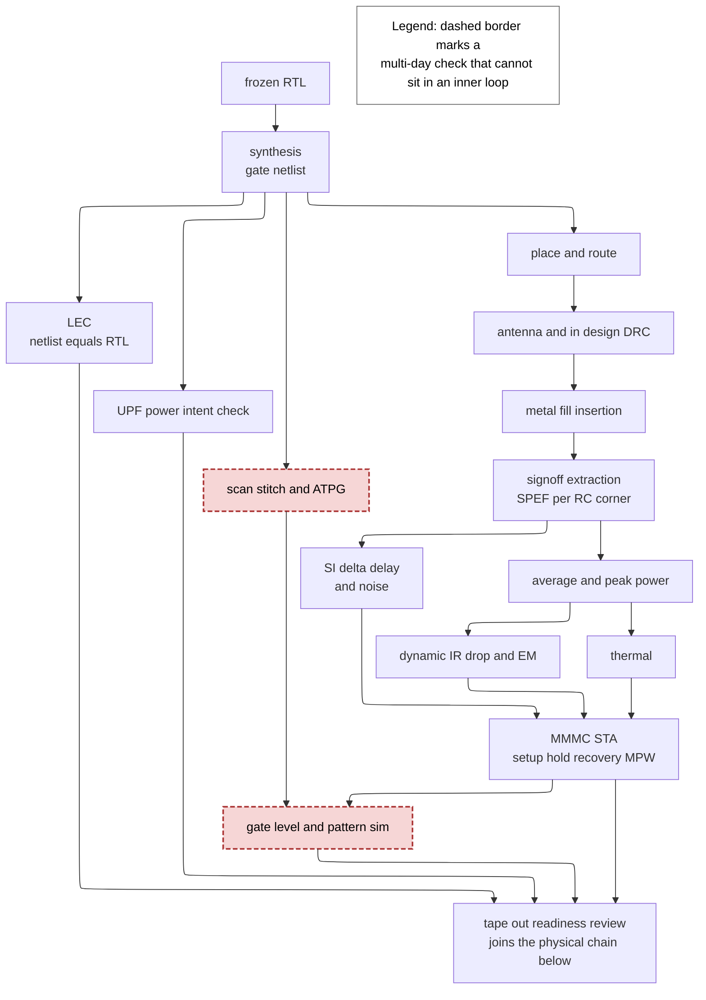
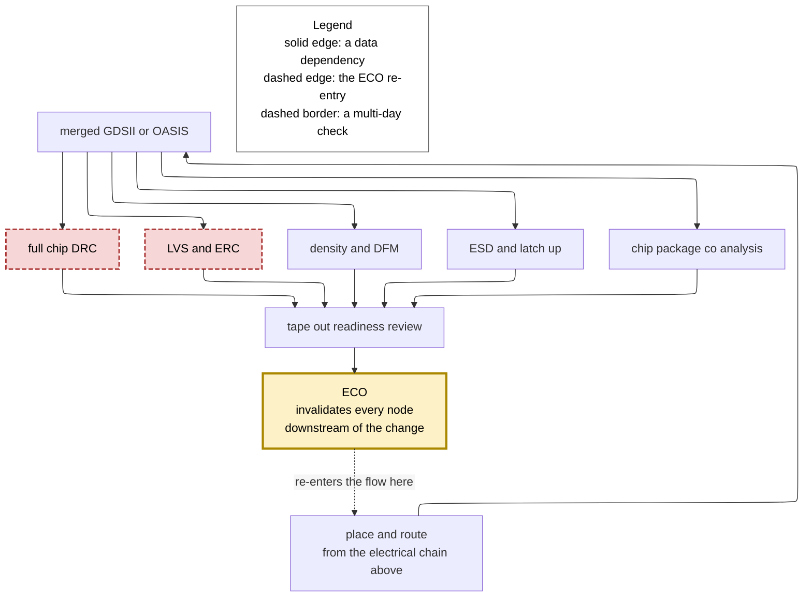
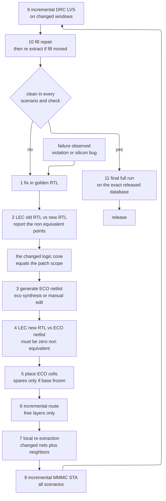
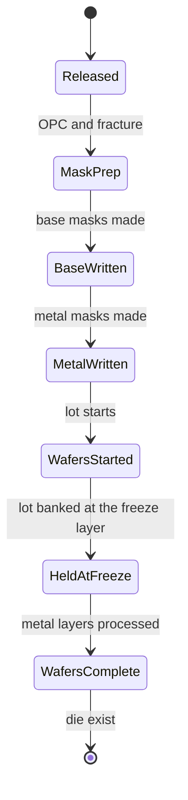

# Signoff Orchestration, ECOs, and Tape-out Readiness — converting a pile of checks into a decision

> **Prerequisites:** [STA](01_STA.md) (what a slack number means, MMMC/OCV, and why a timing report is a statement about a *model*), [Routing_and_Parasitic_Extraction](../05_Backend_Physical_Design/06_Routing_and_Parasitic_Extraction.md) (where SPEF comes from, and why extraction accuracy is a signoff variable rather than a detail).
> **Hands off to:** [Tapeout_and_Post_Silicon_Bringup](../07_Manufacturing_and_Bringup/03_Tapeout_and_Post_Silicon_Bringup.md) (takes the released database, the mask set, and the errata list this page produces, and finds out what the proof missed).

---

## 0. Why this page exists

Every other page in this section teaches you one check. [STA](01_STA.md) teaches you to read a slack. [Physical_Verification_DRC_LVS](03_Physical_Verification_DRC_LVS.md) teaches you what a spacing violation is. [DFT_and_ATPG](02_DFT_and_ATPG.md) teaches you what test coverage measures. Each of those pages leaves you with a tool that answers a yes/no question about one property of one database.

A real chip runs about **twenty distinct signoff checks**, owned by five to eight different teams, consuming six or seven different views of the same design, on runtimes that range from twenty minutes to five days. They are not independent: the metal fill you insert to satisfy density changes the coupling capacitance, which changes extraction, which changes timing; the ECO (engineering change order) you apply to fix that timing changes the routing, which changes the fill. The checks form a **dependency graph with a feedback edge**, and the feedback edge is what makes signoff hard. Nothing in a single-check page prepares you for the fact that a $-3\,\text{ps}$ setup violation found at 11 p.m. two days before tape-out invalidates a 40-hour DRC run.

So this page owns the part nobody teaches: **orchestration**. How the checks are scheduled so that they converge instead of chasing each other; how a failure is converted into the smallest legal change (an ECO), classified by which masks it touches, and priced; what a waiver legitimately is and how illegitimate ones kill tape-outs; how a violation-count burn-down predicts — and mispredicts — a schedule; and finally what the checklist looks like that a named human signs, because "the tool reported zero" and "the chip is signed off" are different statements and the gap between them is where projects die.

After this page you should be able to lay out a signoff schedule for a block, count and prune an MMMC scenario list with the dominance argument written down, tell a timing ECO from a metal-only ECO and price both, judge a waiver, and read a tape-out checklist as a risk-coverage argument rather than a bureaucratic form.

---

## 1. Why signoff is a scheduling problem, not a check

### 1.1 The full inventory

Here is what a ~$400$ M-instance, 7 nm-class SoC actually runs before release. Runtimes assume a large compute farm and a hierarchical (block + top) methodology; a flat run of any of these is one to two orders of magnitude worse.

| # | Check | What it consumes | What it proves | Typical full-chip runtime | Owner |
|---|---|---|---|---|---|
| 1 | **Timing (STA)** — static timing analysis | gate netlist, SDC, `.lib` timing models, SPEF parasitics | no setup/hold/recovery/removal/min-pulse-width violation in any signed-off mode-corner | 2–6 h per scenario; 30–100 scenarios | STA / timing |
| 2 | **SI timing** — signal-integrity delta-delay | + coupling capacitance, aggressor switching windows, noise-aware cell models | crosstalk-induced delay push-out and pull-in are bounded and included in slack | $1.5$–$3\times$ the nominal STA cost | STA / SI |
| 3 | **Noise / glitch** | coupling, cell noise-immunity models, driver strengths | no aggressor-induced glitch is large enough to propagate or be latched | similar to SI STA | SI |
| 4 | **Power — average and peak** | netlist, `.lib` power tables, switching activity from VCD/FSDB or SAIF | the part fits its thermal and battery budget at the specified workload | 2–12 h per workload | power |
| 5 | **IR drop / EM** — voltage drop and electromigration | power-grid layout, PG parasitics, per-instance current waveforms | the grid holds supply within the droop budget; metal survives to end-of-life | 8–48 h for dynamic vectorless | power integrity |
| 6 | **DRC** — design rule check | merged GDSII/OASIS, foundry rule deck | the geometry is manufacturable in this process | 12–72 h on hundreds of cores | physical verification |
| 7 | **LVS** — layout vs schematic | merged layout + reference netlist | the polygons implement exactly the netlist that was signed off | 8–48 h | PV |
| 8 | **ERC** — electrical rule check | layout + netlist | no floating gate, no power/ground short, wells and substrate correctly tied | folded into the LVS run | PV |
| 9 | **Antenna** | routing geometry, per-layer metal-to-gate area | plasma-charge ratios are under the limit; no gate-oxide rupture during etch | 4–12 h, usually with DRC | PV |
| 10 | **DFM / density** — design for manufacturability | GDS + fill, DFM decks, critical-area model | printability and CMP planarity; recommended-rule yield levers taken | 6–24 h | PV / DFM |
| 11 | **Metal fill insertion** | routed database, density windows | every window is inside the foundry's metal-density band | 4–12 h to insert, then forces re-extraction | PD / PV |
| 12 | **ATPG coverage** — automatic test pattern generation | scan netlist, fault list, DFT constraints | stuck-at and transition coverage meet target; patterns fit tester time | 1–5 days | DFT |
| 13 | **LEC** — logical equivalence check | golden RTL, final netlist, constraint files | the netlist is functionally identical to the RTL that verification signed off | 2–24 h, hierarchical | synthesis / formal |
| 14 | **UPF / power intent** | UPF (IEEE 1801) file, netlist, layout | isolation cells, level shifters, retention, always-on routing are present and correct | 2–8 h | low power |
| 15 | **Connectivity** | full-chip netlist + layout | every pad, bump, PG rail, and clamp is connected as the spec says | 1–6 h | integration |
| 16 | **X-prop / GLS** — gate-level simulation | gate netlist + SDF back-annotation | reset brings the design to a defined state; no X-optimism masks a real bug | days per test suite | DV / GLS |
| 17 | **Reliability / aging** | aged `.lib` variants, activity and temperature profile | timing still closes after BTI/HCI degradation at end-of-life | one extra corner family | reliability |
| 18 | **ESD / latch-up** | layout, IO ring, cross-domain nets | HBM/CDM survivability; no forward-biased latch-up path | 1–3 days including manual review | IO / ESD |
| 19 | **Chip-package co-analysis** | die power model, package model, board model | power delivery and signal integrity hold across die, package, and board | 1–5 days | packaging / PI |
| 20 | **Thermal** | full-chip power map, package thermal model | junction temperature stays inside the range the STA corners assumed | hours to 1 day | thermal |

Two structural facts fall out of the table immediately.

**The runtimes are not comparable.** A timing scenario is hours; a full-chip DRC is days. That asymmetry alone dictates the schedule: you cannot put DRC in an inner loop. Every hour you spend fixing timing must be spent *before* the last DRC run starts, because restarting it costs two days you do not have.

**The owners are not one team.** Twenty checks, six owners, each with their own tool, license pool, and definition of "done". A check with no named owner does not get run — and the checks most often orphaned are exactly the boring integration ones (#15, #18), which is why "the ESD clamp on the new IO was never connected" is a real and recurring silicon failure.

### 1.2 The dependency graph

The graph forks at the merged layout database. Everything upstream of that fork is **electrical** — it asks whether the chip meets timing, power, and thermal limits. Everything downstream is **physical** — it asks whether the shapes are manufacturable and match the netlist. The two halves share only their start (place-and-route) and their end (the readiness review), so they are drawn separately; superimposing them puts nine edges into one node and makes every path untraceable.

**The electrical chain.**



**Contract of the figure.** Every edge is a *data* dependency: the target consumes an artifact the source produces, so running the target on a stale source is not a check, it is a lie. Note that the fan-out from `EXT` is genuine parallelism — SI, power, IR, and thermal all read the same parasitics — but they re-converge on `STA`, so the slowest of them sets when timing can close.

**One concrete trace.** Suppose STA reports a $-4$ ps setup violation. The fix is a VT (threshold-voltage) swap on one cell — the cheapest change in the flow, because the flavors share a footprint and pin geometry so nothing moves and nothing re-routes (§4.1). It still invalidates, in order: the fill in the window around it (the cell's own implant and density signature changed), the extraction of every net within a coupling neighborhood, the SI windows of every aggressor that touches those nets, all 36 timing scenarios, the local power and IR numbers, and the DRC/LVS status of the merged GDS in the next figure. If you re-run only STA and declare victory, you have signed off a database that no longer matches the one that passed DRC.

**The physical-verification fan-out, and the ECO loop.**



**Contract of the second figure.** The five checks hanging off `GDS` are mutually independent — no one of them consumes another's output — so they are the only part of signoff that parallelises perfectly given licenses. The single dashed edge is what makes signoff a scheduling problem rather than a checklist: an ECO re-enters at place-and-route and invalidates the entire subtree below it, including everything in the electrical chain above.

**Trace one ECO through this half.** The VT swap of the previous trace changes the cell's implant layer, so the merged GDS changes; `DRC`, `LVS`, `DFM` and `ESD` all become stale even though no wire moved. `DRC` and `LVS` are the two multi-day checks, and both are downstream of the change. That is the whole reason the readiness review gates on a *final full run*: the four fast checks can be re-run overnight, and the two slow ones cannot.

**The trade-off the pair illustrates.** The electrical chain is long and serial, so it rewards incremental re-analysis; the physical fan-out is wide and parallel, so it rewards license capacity. Optimising one does nothing for the other, which is why a schedule that budgets only "signoff time" as a single number always misses.

**The scheduling consequence.** You could re-run everything after every ECO — perfectly sound, and it takes four days per turn, so you get maybe six turns before tape-out. Or you can run *incremental* checks over the changed window only, which takes two hours and gets you forty turns, at the cost of trusting the tool's notion of "changed window". Real flows do both: incremental during the burn-down (§8), one **final full run on the exact released database** as the gate. The single most common tape-out disaster is skipping that final full run because "only one cell changed".

---

## 2. MMMC: the scenario explosion and how to survive it

### 2.1 Where the product comes from

STA answers "is this path safe?" for **one** operating condition. A chip has many. Four independent axes multiply:

- **Mode** — a set of SDC (Synopsys Design Constraints) constraints describing one way the chip is driven: mission mode at max frequency, mission mode at a low DVFS (dynamic voltage and frequency scaling) point, scan **shift**, at-speed scan **capture**, memory BIST (built-in self-test), retention/idle, boot/bypass. Modes differ in clock definitions, exceptions, and case analysis.
- **PVT corner** — process (SS, TT, FF, and the skewed SF/FS corners), voltage (nominal, low, over-voltage), temperature ($-40$, $25$, $125$ °C). See [STA §5](01_STA.md).
- **RC corner** — the interconnect extraction corner: `cworst`, `cbest`, `rcworst`, `rcbest`, `typical`. Metal thickness and dielectric constant vary independently of transistor process, so this is a genuinely separate axis (see [Routing_and_Parasitic_Extraction](../05_Backend_Physical_Design/06_Routing_and_Parasitic_Extraction.md)).
- **Analysis type** — max-delay (setup) and min-delay (hold), plus the SI on/off distinction.

A **scenario** (Synopsys) or **view** (Cadence) is one point in this product: one mode paired with one corner paired with one RC set paired with one analysis type. It is the unit of STA work, of license consumption, and of ECO validation.

### 2.2 A worked scenario count

Take a realistic mobile-class SoC block:

- 6 modes: `FUNC_MAX`, `FUNC_NOM`, `FUNC_LP`, `SHIFT`, `CAPTURE`, `MBIST`.
- 3 process corners: SS, TT, FF.
- 3 voltages per mode's DVFS point plus over-voltage: 3.
- 3 temperatures: $-40$, $25$, $125$ °C.
- 4 RC corners: `cworst`, `cbest`, `rcworst`, `rcbest`.
- 2 analysis types: setup, hold.

The naive cross product is

$$ N_{\text{naive}} = 6 \times 3 \times 3 \times 3 \times 4 \times 2 = 1296 \text{ scenarios.}$$

At 3 hours each that is 3888 CPU-hours per timing turn *per block*, and with 14 blocks, $54{,}400$ CPU-hours — about six days of a 400-slot farm doing nothing else. It is not affordable, and most of it is redundant. Real flows prune to 30–100.

**Prune 1 — only foundry-qualified PVT combinations exist.** The `.lib` files that exist are the ones the foundry characterized. You do not get SS at $0.90$ V; you get the named combinations. This alone collapses (process × voltage × temperature) from 27 to typically 5–7 named corners.

**Prune 2 — dominance by analysis type.** Setup is worst when everything is slow: slow process, low voltage, and — at planar nodes — high temperature. Hold is worst when everything is fast. So setup only needs the SS family, hold only the FF family, plus one TT sanity view.

**Prune 3 — RC corner pairing.** Setup pairs with `cworst`/`rcworst` (maximum capacitance or maximum resistance); hold pairs with `cbest`/`rcbest`. Which of `cworst` and `rcworst` dominates depends on whether the path is wire-dominated or cell-dominated, so you keep both for setup.

**Prune 4 — mode-specific voltage.** `FUNC_LP` only ever runs at $0.675$ V, so its corners are only the $0.675$ V family. Modes and voltages are *correlated*, not independent; the naive product treated them as independent and that is where most of the factor-of-36 lives.

**Prune 5 — frequency-based mode reduction.** `SHIFT` runs at 50 MHz. A 20 ns period against paths built for 830 ps cannot fail setup, so one setup view is kept as a sanity check and the rest dropped. Hold in shift mode is kept in *full* — shift is a giant hold-critical clock-to-clock structure and is a classic silicon-failure mode.

After pruning:

| Mode | Setup views | Hold views | Total |
|---|---|---|---|
| `FUNC_MAX` @ 0.825 V, 1.2 GHz | 3 | 4 | 7 |
| `FUNC_NOM` @ 0.750 V, 0.9 GHz | 3 | 4 | 7 |
| `FUNC_LP` @ 0.675 V, 0.4 GHz | 3 | 4 | 7 |
| `SHIFT` @ 50 MHz | 1 | 4 | 5 |
| `CAPTURE` at-speed | 3 | 4 | 7 |
| `MBIST` | 1 | 2 | 3 |
| **Total** | **14** | **22** | **36** |

$1296 \to 36$ is a $36\times$ reduction, and it is entirely made of *claims*. Each claim is a dominance argument, and every one of them can be wrong.

### 2.3 What each prune risks

| Prune | The claim | How it fails in silicon |
|---|---|---|
| Named PVT only | the foundry characterized the worst case | a *system* corner the foundry did not model — e.g. supply droop stacking on a low-V corner — sits between two characterized points |
| Setup only at slow | slow is monotonically worse for max-delay | **temperature inversion** ([Standard_Cell_Libraries §6.2](../04_Synthesis/03_Standard_Cell_Libraries_and_Characterization.md) derives the crossover): inside the inverted region the cold corner is a setup corner too, so dropping $-40$ °C from setup is a silicon bug |
| RC pairing | `cworst` dominates for setup | for a resistance-dominated long net, `rcworst` is worse; for a mixed block neither dominates, so you must keep both — and there are blocks where a *middle* corner is worst |
| SI on the "fast" corner is benign | crosstalk hurts most where the victim is slow | delta-delay depends on *window overlap*, not on absolute speed. A faster corner can shift an aggressor's window *into* the victim's transition and make a path worse. SI breaks monotonicity, so SI-aware dominance arguments must be re-derived, not inherited |
| Shift-mode setup dropped | 50 MHz cannot fail setup | true for logic paths, false for **min-pulse-width** and clock-gating checks, which are frequency-independent. Keep those checks in every mode |
| One mode's corners bound another's | modes share physics | modes differ in *which* clocks are active, so a path that is a false path in `FUNC` may be a real path in `CAPTURE`. Dropping the mode drops the check |

The methodological rule: **a pruned scenario is a documented waiver against a check you did not run** (§7). Write the dominance argument down in the MMMC setup file as a comment, name its owner, and re-derive it when the library, the node, or the mode list changes. Inherited MMMC files from the previous project are a standard source of escapes.

### 2.4 The compute and license bill

Scenario count is not an abstract number; it is a purchase order.

- **Memory.** Flat STA needs roughly $1.5$–$3$ GB per million instances with parasitics and SI loaded. A 20 M-instance block is 40–60 GB per scenario; a flat 400 M-instance top would need 600–1200 GB, which is why full-chip signoff is hierarchical, using ETMs (extracted timing models) or block-level abstracts at the top level.
- **Wall time per turn.** $36$ scenarios $\times$ 3 h $= 108$ scenario-hours per block. With 12 scenarios running concurrently that is 9 h; across 14 blocks with a 200-slot allocation, one **timing turn is roughly 12–24 hours including queueing**. That number, not the ECO tool's speed, sets how many closure iterations you get. If tape-out is 21 days away you have at most 20 turns, and you should plan the burn-down (§8) around 20, not around 200.
- **Licenses.** Distributed multi-scenario timing runs a master plus $N$ workers, each consuming a signoff-timer license. The license pool, not the CPU pool, is usually the binding constraint: a team with 40 signoff-STA licenses can run 40 scenarios concurrently regardless of how many machines it owns. Signoff-timer licenses are five-figure-per-seat annual items and a mid-size team's pool is a seven-figure line. **Every scenario you fail to prune is a recurring annual cost**, which is why the pruning argument gets management attention.
- **Disk.** A gzipped SPEF for a 20 M-instance block is 3–8 GB. Four RC corners $\times$ 14 blocks $\approx$ 300 GB *per netlist revision*, and you keep several revisions because you must be able to reproduce any signoff run. Signoff storage for a large chip is tens of terabytes.

---

## 3. Timing signoff beyond the STA page

[STA](01_STA.md) derives the slack equation and the corner machinery. This section covers what changes when the analysis has to be *believed* rather than merely used for optimization.

### 3.1 Signoff-quality extraction

The place-and-route tool extracts parasitics constantly — after every optimization move — so its extractor must be fast, which means **pattern-matched rule-based extraction**: precomputed capacitance tables indexed by geometric configuration (width, spacing, layer, neighbor presence), interpolated. Typical accuracy versus a 3-D field solver is $10$–$20\%$ on individual net capacitance.

Signoff extraction uses a **hybrid or full field-solver** flow: rule-based for regular geometry, a boundary-element or random-walk solver for irregular configurations (dense crossings, via stacks, IP boundaries). Accuracy target is $2$–$5\%$ against silicon-correlated reference, at $5$–$50\times$ the runtime. See [Routing_and_Parasitic_Extraction](../05_Backend_Physical_Design/06_Routing_and_Parasitic_Extraction.md) for the mechanism.

The consequence: **the numbers change when you switch extractors**, systematically and per-net. A block that is timing-clean in the PnR tool routinely opens 50–500 violations when re-timed on signoff SPEF. This is not a bug; it is the point.

### 3.2 Why the two timers disagree

Even given identical parasitics, the PnR tool's internal timer and the signoff timer produce different slacks. The differences are structural:

| Source | PnR timer | Signoff timer | Typical impact |
|---|---|---|---|
| Delay model | interpolated NLDM (non-linear delay model) tables, sometimes only a subset of arcs | CCS (composite current source) or ECSM (effective current source model) — a current-source driver model solving the nonlinear RC load | 3–10 % on stage delay, worst on high-resistance nets |
| Net reduction | Elmore or single-pole reduction of the RC tree | moment-matching / model-order reduction to a multi-pole equivalent | 5–15 % on long, resistive nets |
| Waveform effects | fixed effective-capacitance heuristic | iterative $C_{\text{eff}}$ solution with waveform propagation | up to 10 % on slew-sensitive paths |
| SI | often approximate or off during optimization | full timing-window iteration | the whole delta-delay term |
| Derating | may apply a simplified OCV | full AOCV/POCV with CPPR (clock path pessimism removal) | tens of ps on deep clock trees |
| Library views | may use a reduced corner set for speed | all signed-off corners | corner-dependent |

Add these up and a $\pm 30$–$80$ ps disagreement on a 830 ps path is normal.

### 3.3 The correlation loop

You cannot close timing against a timer you do not trust, and you cannot optimize with the slow one. The standard resolution is an explicit **correlation loop**:

1. Run signoff STA on the current database and dump per-endpoint slack.
2. Dump the same endpoints from the PnR timer.
3. Scatter-plot signoff slack against PnR slack. Fit it. Report three numbers: the **mean offset** $\mu$ (systematic pessimism/optimism), the **standard deviation** $\sigma$ (random disagreement), and $R^2$.
4. Accept only if $R^2 > 0.95$ and $|\mu| < 20$–$30$ ps. If $R^2$ is low, the two tools disagree *unpredictably* and no margin can fix it — you must find the modeling difference (usually a missing library view or an SI setting).
5. If $R^2$ is good but $\mu \ne 0$, close the loop with a **margin**: push $\mu + \sigma$ of extra pessimism into the PnR tool via clock uncertainty or a timing derate, so that a design the PnR tool believes is clean is genuinely clean at signoff.

That margin has a direct cost: over-margining by 40 ps on a 830 ps cycle is a $4.8\%$ frequency tax paid in area, power, and buffer count across the whole block. Under-margining costs you turns. The correlation loop is the mechanism that makes the trade explicit instead of accidental.

The end state of this loop is the **signoff ECO** (§6): let the *signoff* timer, not the PnR timer, compute the fix list, and let the PnR tool merely implement it. The correlation gap then cannot bite, because the tool that decides is the tool that judges.

### 3.4 Timing-window convergence for crosstalk

Crosstalk delta-delay is circular. The delay added to a victim depends on whether its aggressors switch during the victim's transition; when the aggressors switch depends on *their* delays; their delays depend on *their* aggressors — including the victim. It is a fixed point.

```wavedrom
{ "signal": [
  { "name": "victim in",   "wave": "0.1.....", "node": "..a....." },
  { "name": "victim out",  "wave": "0...1...", "node": "....c..." },
  { "name": "aggressor A", "wave": "0..1....", "node": "...b...." },
  { "name": "aggressor B", "wave": "0.....1.", "node": "......d." }
 ],
 "edge": ["a~>c nominal stage delay", "b~>c A switches inside the victim window: delta delay applies", "c~>d B switches after the window: no coupling"],
 "head": {"text": "Delta-delay applies only where the aggressor switching window overlaps the victim transition"}
}
```

**Contract.** The victim's stage delay is charged extra only for aggressors whose *switching window* — the interval $[\text{earliest arrival}, \text{latest arrival}]$ at the aggressor net — overlaps the victim's transition. Aggressor A does; aggressor B does not.

**One trace.** Iteration 0 has no window information, so the tool assumes every aggressor can switch at any time — infinite windows, all coupling charged. On a net with three aggressors and $C_c = 4$ fF against $C_{\text{gnd}} = 6$ fF, the worst-case switching-factor model charges $C_{\text{gnd}} + 2C_c = 14$ fF where the quiet-aggressor value is $C_{\text{gnd}}+C_c = 10$ fF — **1.4× the effective capacitance**, and roughly that much again on stage delay, i.e. $30$–$60\%$ once the three aggressors' worst alignment is stacked. Iteration 1 computes real windows from those (pessimistic) delays and finds aggressor B never overlaps; the delta shrinks. Iteration 2 re-computes windows from the smaller delays; windows move slightly. Iteration 3 changes almost nothing. **Two to three iterations is the practical convergence point**, and tools cap it.

**The failure it illustrates.** The iteration is not guaranteed to converge — it can oscillate, where shrinking the victim's delay moves its window off an aggressor, which shrinks it further, which moves it back on. Tools break oscillation by *damping* (accepting only part of each update) or by taking the pessimistic **union** of the windows seen across iterations. Both are safe-by-construction and both leave pessimism on the table. When a path's slack changes by tens of ps between SI iterations, that path is window-sensitive and should be fixed structurally (shielding, spacing, driver upsizing — see [Signal_Integrity_Reliability](../05_Backend_Physical_Design/02_Signal_Integrity_Reliability.md)) rather than trimmed to exactly zero slack, because its slack is not a stable number.

---

## 4. The ECO taxonomy

An **ECO — engineering change order** — is a *localized, incremental* modification to a design that is already implemented. The word covers four very different operations that differ by three orders of magnitude in cost, and conflating them is the single most expensive vocabulary error in this field.

The classifying question is: **what does the change touch?** Function or not; base layers or not.

### 4.1 Timing ECO — no logic change

The netlist's Boolean function is untouched. Permitted moves:

- **Resize** a cell (`NAND2X2` $\to$ `NAND2X4`): more drive, more input capacitance, more area, more leakage.
- **Insert a buffer or inverter pair** to break a long net or fix a slew.
- **Swap VT** (`_LVT` $\leftrightarrow$ `_RVT` $\leftrightarrow$ `_HVT`): the single most valuable ECO lever, because at most nodes the three VT flavors share an identical footprint and pin geometry. An LVT swap buys $15$–$30\%$ delay for $3$–$10\times$ leakage on that cell; an HVT swap does the reverse. **Footprint-compatible means no placement change and no re-route** — the cheapest possible ECO.
- **Insert delay cells** on a hold-violating path.
- **Clone** a highly loaded driver, or **swap commutative pins** to put the late-arriving signal on the faster input.

LEC passes trivially because the function is identical. This is the workhorse of the last three weeks before tape-out.

### 4.2 Functional ECO — logic change

The Boolean function changes: a bug fix, a spec change, a missing reset. The netlist gains or loses gates. Pre-tape-out this is merely expensive (re-place, re-route, re-verify, re-run everything); post-tape-out it is the case that decides which mask set you buy.

### 4.3 Metal-only ECO — base layers frozen

The **freeze line** is a layer boundary negotiated with the foundry: everything below it (transistors, local interconnect, and typically the first metal or two) is already committed to masks that exist; everything above it can be re-masked. A metal-only ECO implements a *functional* change using only re-routing above the freeze line, which means it can create no new transistors. It must therefore build the new logic out of transistors that are already there and unused: **spare cells** (§5).

The argument for its existence is purely economic. A full mask set at 7 nm is roughly $\$8$–$12$ M and 4–6 weeks to build; the metal subset above the freeze line is 15–20 masks out of 70-plus and costs $20$–$35\%$ of that. Better, the base-layer wafers can be **banked**: partially processed wafers held in the fab at the freeze layer, so a metal-only respin starts from work-in-progress and reaches finished wafers in 4–5 weeks of back-end processing instead of the 12–14 a full flow takes.

### 4.4 Full-layer ECO — everything re-masked

Every mask is regenerated. You get complete freedom: re-floorplan, re-place, re-synthesize, fix everything at once, and often raise the frequency. You pay the entire mask NRE and the entire fab cycle.

### 4.5 The comparison

| | Timing ECO | Functional ECO, pre-TO | Metal-only ECO | Full-layer ECO |
|---|---|---|---|---|
| Logic function changes | no | yes | yes | yes |
| New cells created | no | yes | **no — spares only** | yes |
| Base masks touched | n/a (pre-mask) | n/a (pre-mask) | **none** | all |
| Masks regenerated | 0 | 0 | ~15–20 of 70+ | all |
| Mask cost, 7 nm class | 0 | 0 | $\$2$–$3.5$ M | $\$8$–$12$ M |
| Mask cost, 28 nm class | 0 | 0 | $\$0.3$–$0.6$ M | $\$1.5$–$2$ M |
| Engineering time | hours to 2 days per turn | 1–3 weeks | 2–4 weeks | 5–10 weeks |
| Mask build | — | — | 2–3 weeks | 4–6 weeks |
| Wafers to finished die | — | — | 4–5 weeks from bank | 12–14 weeks |
| **Total to new silicon** | — | — | **8–12 weeks** | **21–30 weeks** |
| LEC obligation | trivial pass | vs modified RTL | vs modified RTL, with spares tied off | vs modified RTL |
| Main risk | churn: each fix creates new violations | schedule | **the fix may not be constructible from available spares, or the ECO path may not meet timing** | schedule and market window |
| When it is right | closure, always | any pre-tape-out bug | post-silicon bug that fits the spare budget | bug too large for spares, or several bugs plus a performance uplift |

There is a fifth, rarer class worth knowing: the **via-only ECO**, in which the changeable set is one or two via masks over a via-configurable gate-array fabric. It is the cheapest possible respin (single-digit percent of a mask set) and the most constrained; structured-ASIC products are built around it, and a few high-volume ASICs reserve a via-configurable region specifically as respin insurance.

**Selection boundary.** If the bug can be worked around in software, firmware, or fuses, none of these is the right answer — ship and document. If the fix needs more than a few tens of gates or any significant state, spares will not carry it and the metal-only option is an illusion; go full-layer rather than spend eight weeks discovering that. The quantitative version of that decision is Worked Problem 3.

---

## 5. Metal-only ECO mechanics

### 5.1 Spare cells: what to sprinkle and how much

A **spare cell** is a functional standard cell placed in the design, connected to power and ground, with its inputs tied to a fixed level and its output unconnected. It costs area and a little leakage on *every die you ever ship*, and buys the option to implement post-silicon logic without new transistors.

**Which types.** $\{\text{NAND}, \text{INV}\}$ is functionally complete, so in principle a NAND2 and an inverter are enough. In practice you seed a mix, because building everything from NAND2 costs depth and each level of depth costs an ECO route:

| Spare type | Why it is in the kit |
|---|---|
| NAND2, NAND3, NOR2, NOR3 | functional completeness; the base of any combinational patch |
| INV at several drive strengths | inversion, and the drive needed to cross a long ECO route |
| BUF at high drive (X4, X8) | ECO nets are long; without these, every fix is slew-limited |
| MUX2 | the most common shape of a real fix — "select the corrected value when a condition holds" |
| AOI21 / OAI21 | one-cell implementation of common two-level patches, saving a stage of depth |
| DFF with reset | **state**. Any fix that must remember something needs one, and they are the spare you always run out of |
| TIE-high / TIE-low | to tie unused spare inputs legally |

**How many and where.** The controlling constraint is not count but **reach**: a spare 200 µm away is unusable because the wire delay and the routing detour make the ECO path fail timing. So the budget is set geometrically. Choose a reach radius $r$ (typically 20–50 µm), tile the block with a grid of pitch $\approx r$, and place one cluster per tile.

For a 7 nm block of $800$ k instances at $0.15$ mm² ($387 \times 387$ µm) with a 30 µm grid: $13 \times 13 = 169$ clusters. With 16 cells per cluster that is $2704$ spare cells, or $0.34\%$ of instances. At an average spare area of $0.18$ µm² (flops dominate) the area cost is $2704 \times 0.18 = 487$ µm² $= 0.32\%$ of the block. Build the spares from HVT cells, whose leakage is $\sim 0.15\times$ nominal, and the leakage cost is about $0.05\%$ of block leakage. **Half a percent of area for the option to avoid an $\$8$ M respin** is why every high-volume chip carries spares.

**Gate-array ECO filler at advanced nodes.** At FinFET nodes the technique changes. Instead of pre-instantiated logic cells, the filler placed in empty space is a **gate-array (ECO) filler cell**: a generic array of fins and gates with no personalizing metal. Its function is defined entirely by the metal above it. This is strictly better than classic spares in three ways: it does not commit you to a cell type in advance, it satisfies the density and poly-uniformity rules that advanced nodes require of filler anyway (so much of it is free), and it makes the whole empty area of the die into potential ECO logic. It requires that at least one metal level in the changeable set can reach the cell's internal nodes — which is exactly the constraint that sets the freeze line.

### 5.2 Building a function from spares: a worked example

You need $y = a \wedge b$ inserted between an existing driver and an existing sink, post-freeze. There is no spare AND2 in the kit. There is a spare NAND2 and a spare INV, in a cluster 40 µm away.

$$ y = a \wedge b = \overline{\overline{a \wedge b}} = \text{INV}\big(\text{NAND2}(a,b)\big) $$

Two stages instead of one, and — much more importantly — three ECO routes: $a$ and $b$ from their sources to the spare cluster, and $y$ from the cluster back to the sink.

```tikz
\begin{document}
\begin{circuitikz}[scale=1.0]
  \draw (0,0) to[R=$R_{d}$] (2,0) to[R=$R_{w}$] (4,0) -- (5.2,0);
  \draw (2,0) to[C=$C_{w}/2$] (2,-1.6) node[ground]{};
  \draw (4,0) to[C=$C_{w}/2$] (4,-1.6) node[ground]{};
  \draw (5.2,0) to[C=$C_{in}$] (5.2,-1.6) node[ground]{};
  \draw (0,0) -- (-1.0,0) node[left]{driver};
  \draw (5.2,0) -- (6.2,0) node[right]{spare pin};
\end{circuitikz}
\end{document}
```

**Contract of the figure.** The ECO route is modeled as the driver's effective output resistance $R_d$ in series with a $\pi$-model of the wire ($R_w$, $C_w$ split at both ends) loading the spare cell's input capacitance $C_{in}$. The delay of this stage is what an inline fix would not have paid.

**The arithmetic.** Take a 7 nm-class intermediate metal at $R_w \approx 5\ \Omega/\mu\text{m}$ and $C_w \approx 0.18\ \text{fF}/\mu\text{m}$ (the values derived in [Physical_Synthesis §1](../04_Synthesis/05_Physical_Synthesis_and_Design_Planning.md)), with $\text{FO4} \approx 13$ ps as the delay yardstick.

- Wire: 40 µm gives $R_w = 200\ \Omega$, $C_w = 7.2$ fF.
- Wire's own Elmore term: $R_w C_w / 2 = 200 \times 7.2\,\text{f} / 2 \approx 0.7$ ps — negligible. **At these lengths the wire is a capacitor, not a transmission line**; the ECO cost is the *charging* of $C_w$, not the wire's own $RC$.
- Driver: an X2 cell with effective output resistance $\approx 3\ \text{k}\Omega$ (an X1 is $\approx 6.5\ \text{k}\Omega$, back-solved from $\text{FO4} = 0.69 R_d C_{\text{fo4}}$ at $C_{\text{fo4}} = 2.8$ fF) driving $7.2$ fF gives $0.69 R_d C \approx 0.69 \times 3000 \times 7.2\times10^{-15} \approx 15$ ps.
- Logic: NAND2 $\approx 13$ ps, INV $\approx 9$ ps.
- Total ECO path $\approx 15 + 13 + 9 \approx 37$ ps out to the spare, plus a second route back to the sink of similar order — call it $\approx 55$ ps end to end.

An inline AND2 placed where it was needed would have cost $\approx 15$ ps. **The metal-only implementation of the same logic is roughly $2.5$–$4\times$ slower**, and that penalty is the reason a metal-only ECO can be functionally correct and still fail timing. Mitigations: place the fix on a path with slack, use a high-drive spare buffer at the source of each ECO route, and — the real lever — set the spare grid pitch small enough that $C_w$ stays under a few fF.

### 5.3 The routing constraint and the freeze line

Only layers above the freeze line may change. Three consequences follow, and they are not obvious:

1. **You must be able to reach the spare cell's pins.** Pin shapes live on M0/M1. If the freeze line were "M4 and above", no changeable layer could touch a pin and the whole scheme collapses. This is why the freeze line is set low — commonly at M1 or M2 — and why a "metal-only" respin is 15–20 masks, not 2.
2. **You are routing in a used channel.** The existing routes on M4 and above must be ripped up and re-routed around the new ECO nets, without disturbing anything below the line. In a block at $85\%$ routing utilization, this is where metal-only ECOs actually fail: not for lack of spares, but for lack of *track*. Blocks intended to be ECO-friendly are routed to a lower upper-layer utilization on purpose.
3. **Detours are long.** With only upper layers available, an ECO net that would have taken 40 µm point-to-point may take 90 µm of actual routing, more than doubling $C_w$ and the 15 ps driver term above with it. Always cost a metal-only ECO with the *routed* length, never the Manhattan distance.

### 5.4 LVS and LEC implications

**LVS.** The layout now contains 2704 spare cells that the original RTL knows nothing about. LVS compares layout against a *netlist*, so the netlist must contain them too, with the same tie-offs. Two disciplines follow: the spare cells must appear in the netlist from the moment they are placed (not added later "for LVS"), and every unused spare input must be **tied through a tie cell** whose connection is in the base layers. Tying directly to a rail is tempting and is an antenna and ESD hazard; a floating spare input is an immediate ERC violation and, in silicon, a leakage path and an oscillation risk.

**LEC.** After the ECO, equivalence is checked against the **modified** RTL — the RTL with the bug fixed — not the original. That is the entire point: the ECO netlist and the fixed RTL must be the same function. The spare cells appear as logic whose outputs go nowhere; a correct LEC setup declares those outputs as unconstrained/don't-care points and *asserts that they drive nothing*. The lazy alternative — telling LEC to ignore unmapped points wholesale — will also silently ignore a real dangling output that you created by mistake, which is exactly the class of ECO bug that reaches silicon.

---

## 6. The ECO flow, step by step

### 6.1 The procedure



**Contract.** Step 2 is the step people skip and should not. Running LEC between the *old* and *new* RTL tells you precisely which logic cones changed — which is the minimal legal scope of the netlist patch. Without it you are guessing at the blast radius, and the classic failure is a fix that changes a shared sub-expression used in four other places, three of which you did not patch.

**One trace.** A reset was missing on a 6-bit counter. Step 2 reports 6 non-equivalent points (the counter's flop outputs) and, crucially, 2 more you did not expect: a downstream parity flop whose value depended on the un-reset state. Scope is 8 points, not 6. Step 3 builds the patch; step 4 proves it; steps 5–10 implement and re-verify; step 11 runs everything on the final database.

**The trade-off.** Steps 7–9 are *incremental* — that is what makes a 12-hour turn possible. Incremental analysis is sound only if the tool's changed-window model is complete, and coupling makes "changed" non-local: a re-routed net changes the parasitics of neighbors it never touched. Step 11 exists because incremental analysis is a schedule optimization, not a proof.

### 6.2 A realistic ECO script

Commands below are PrimeTime/ICC2-flavored; Cadence and Siemens equivalents differ in spelling, not in structure.

```tcl
##############################################################################
# eco_r13_setup.tcl -- signoff-timer ECO, iteration 13, base layers FROZEN.
# Rule in force: no new instance may be created; only pre-placed spare cells
# may be claimed, and only footprint-compatible sizing is legal.
##############################################################################

# ---- 1. Rebuild the exact view the violation was reported in ---------------
set_app_var si_enable_analysis true          ;# the one PT variable that turns SI on

read_verilog   ./rel/r12/top_r12.routed.v
current_design top
link_design

read_parasitics -format spef ./rel/r12/spef/top.ss_0p675v_m40c_cworst.spef.gz
read_sdc        ./rel/r12/sdc/func_max.sdc
set_operating_conditions -analysis_type on_chip_variation
update_timing -full

report_constraint -all_violators -significant_digits 4 \
                  > ./rpt/r12.func_max.ss_m40c_cworst.viol

# ---- 2. Constrain the ECO engine to what the mask freeze allows ------------
#   Base layers are frozen, so NO existing cell may change: a different drive
#   strength is a different transistor layout, which is a base-layer mask.
#   Freeze everything, then selectively unfreeze the spare cells -- they are
#   the only transistors the freeze already paid for. Doing it in this order is
#   deliberate: a cell type added to the library tomorrow is frozen by default
#   rather than silently usable.
set_dont_touch [get_cells -hierarchical -filter "is_hierarchical == false"] true
set_dont_touch [get_cells -hierarchical -filter "ref_name =~ *SPARE*"]     false
set_dont_use   [get_lib_cells */*_LVT*]        ;# leakage budget is closed

set_eco_options -physical_mode occupied_site \
                -honor_dont_touch true \
                -honor_dont_use   true \
                -log_file ./log/eco_r13.log

# ---- 3. Ask for the smallest legal repair, worst endpoints first -----------
#   -physical_mode occupied_site: the engine may only claim a site that already
#   holds a (spare) cell. open_site would let it invent an instance in filler --
#   correct BEFORE base freeze, illegal after it, and the difference between a
#   metal-only respin and a full one.
#   -slack_greater_than filters out the hopeless: a -400 ps endpoint is not an
#   ECO, it is a re-implementation, and letting the engine chase it burns the
#   spare budget on a fix that will not work.
fix_eco_timing -type setup \
               -methods {insert_buffer} \
               -buffer_list {BUFX4_HVT BUFX8_HVT} \
               -slack_lesser_than  0.000 \
               -slack_greater_than -0.150 \
               -physical_mode occupied_site

fix_eco_timing -type hold \
               -methods {insert_buffer} \
               -buffer_list {DLYX1_HVT DLYX2_HVT} \
               -slack_lesser_than 0.000 \
               -physical_mode occupied_site

# ---- 4. Emit the change list for the implementation tool ------------------
write_changes -format icc2tcl -output ./eco/eco_r13.tcl
report_eco_options                     > ./rpt/eco_r13.summary
```

Before the base freeze the same script reads differently in exactly two places, and they are the two worth memorizing: `-methods {size_cell insert_buffer}` instead of `insert_buffer` alone, and `-physical_mode open_site` instead of `occupied_site`. Resizing and creating instances are the workhorse pre-freeze moves of §4.1 and are precisely what the freeze removes.

Implementation side:

```tcl
# ---- 5. Apply, legalize, and route only above the freeze line -------------
open_lib ./lib/top.dlib ; open_block top_r12_routed
copy_block -to_block top_r13_eco ; current_block top_r13_eco

source ./eco/eco_r13.tcl                     ;# the change list, verbatim
place_eco_cells -eco_changed_cells -legalize_only
check_legality  -verbose                      ;# must be 0 violations

# Freeze line is at M1: M1 belongs to the base set and is untouchable, so the
# lowest CHANGEABLE layer is M2 -- which is what makes spare pins reachable at
# all (5.3). Bar the router from M1 and let it have M2 upward.
set_ignored_layers -min_routing_layer M2
route_eco -reroute modified_nets_first_then_others

# ---- 6. Fill repair FIRST: fill was destroyed where ECO routes landed ----
remove_fill  -region [get_eco_change_regions]
create_fill  -region [get_eco_change_regions] -mode density_driven

# ---- 7. ...and only then extract, because fill IS coupling capacitance ---
extract_parasitics -coupled -mode incremental
write_parasitics -format spef -output ./rel/r13/spef/top.ss_0p675v_m40c_cworst.spef.gz
# Hand back to the signoff timer. Reverse steps 6 and 7 and you sign off timing
# against parasitics that do not describe the shipped database -- and no check
# in the flow will catch it for you.
```

Three things in that script are the real lesson. First, **freeze-by-default then selectively unfreeze**, and let `-physical_mode` carry the freeze into the engine rather than trusting a comment. Second, **the freeze line is one layer below the lowest routable layer, not the same layer** — get that off by one and either the router touches a committed mask or it cannot reach a spare pin. Third, **fill precedes extraction precedes timing**: that is the loop from §1.2 written as six lines of TCL, and the ordering is not optional.

### 6.3 Freeze silicon and ECO windows

"Freeze" is not a single event; it is a ladder, and each rung closes a class of change:

| Freeze | What it closes | Typical timing | What is still open |
|---|---|---|---|
| **RTL freeze** | no functional change without change-control-board approval | ~6–10 weeks before tape-out | all implementation work |
| **Netlist freeze** | no re-synthesis; the netlist is the reference for LVS and LEC | ~4 weeks before | ECOs against the frozen netlist |
| **Base-layer release** (split tape-out) | FEOL and lower metal masks go to the mask shop | 2–4 weeks before metal release | metal-only ECOs |
| **Metal release / full tape-out** | the database is final | day zero | nothing in the database |
| **Fab point of no return** | wafers pass the layer in question | during processing | only a next lot |

The **split (base-first) tape-out** deserves emphasis because it is a genuine schedule lever. Critical base-layer masks — especially EUV masks at advanced nodes — take the longest to build. Releasing them 2–4 weeks early starts that clock while the metal-layer database is still being ECO'd. The price is that from base release onward *every* fix must be metal-only, which is precisely the constraint §5 describes. Teams that plan a split tape-out seed their spare-cell budget accordingly, because the constraint arrives weeks earlier than it otherwise would.

---

## 7. Waivers

### 7.1 What a waiver is, and what it is not

Every signoff check has a gate of the form "zero violations". Real chips are released with non-zero raw violation counts and zero *unwaived* violations. A **waiver** is a recorded, reviewed, scoped claim that a specific reported violation is not a real defect.

That definition has teeth. A legitimate waiver is a statement that **the design provably does not violate the rule's intent in this context** — the checker is reporting something that, for a reason the checker cannot see, is not a failure. An illegitimate waiver is a statement that **the violation is real but inconvenient**. The difference is whether there exists an argument that would survive being read aloud six months later during a silicon post-mortem.

### 7.2 Legitimate waivers

1. **Foundry IP internal geometry.** A full-chip DRC reports 1240 instances of a min-spacing rule, all inside a foundry SRAM compiler instance. The compiler's release notes list that rule as internally exempt because the cell is qualified as a unit. *Evidence:* the IP vendor's official exclude file; the count goes to zero and the excluded regions coincide exactly with the macro boundaries.
2. **Deck-version lag on a protected net.** An antenna violation is reported on a net that carries a protection diode the deck version in use does not recognize. *Evidence:* extract the net, show the diode, obtain the foundry's confirmation for this deck version.
3. **Frame and seal-ring regions.** Density violations in the scribe/seal region, where the frame specification prohibits fill. The frame spec supersedes the general density rule. *Evidence:* the foundry frame document, plus a check that no violation lies outside the frame.
4. **Recommended (non-hard) rules.** A via-enclosure *recommendation* violated at 8400 sites. These rules are yield levers, not correctness constraints. *Evidence:* the DFM model's per-site yield impact, multiplied out and accepted as a business decision (Worked Problem 4).
5. **Analog blocks with reviewed exceptions.** An ERC check flags a deliberately floating node in a bias network. *Evidence:* the analog owner's schematic annotation plus a simulation showing the node is driven in all operating states.

The common structure: **someone outside the tool has information the tool lacks, and that information is written down and checkable.**

### 7.3 Illegitimate waivers, and how each one bites

1. *"It's only $-3$ ps."* A negative slack is a modeled failure at a corner you chose because you believed it. Three ps at 40 000 endpoints is not one small number; it is a distribution whose tail you have not looked at. If you genuinely believe the model is over-pessimistic, the correct action is to change the derate policy **chip-wide and re-run**, so the change is uniform and visible — not to waive one path.
2. *"We've never seen an antenna failure."* Antenna damage is process- and tool-dependent. You have never seen it *at the fab and litho tool you used last time*. It shows up on the second source or after a tool upgrade, as a yield cliff with no signature in the design database.
3. *"It's only in the dummy fill."* Dummy metal that violates spacing to a signal is a short, and it shorts in exactly the same way real metal does. "Dummy" describes intent, not physics.
4. *"The same violation was waived last tape-out and that chip worked."* Precedent is not proof. The prior chip may have shipped at lower volume, a different corner, a different package, or may have had a field-return rate nobody attributed to this.
5. *"The LEC mismatch is in a block we don't use."* Unused by whom? Unused blocks are reachable in test mode, in scan shift, and during power-up. This is a favorite because it is so nearly reasonable.
6. *"Approved at 2 a.m. by the person who created it."* A process failure independent of technical merit. A waiver approved by its author has no second opinion in it; the review *is* the mechanism.

### 7.4 The waiver database and its discipline

Waivers live in a **versioned file under revision control**, not in email. The minimum schema:

| Field | Why it exists |
|---|---|
| Rule name and deck version | a rule's meaning changes between deck versions; a waiver is only valid against the version it was argued for |
| **Scope: geometry, cell, or hierarchical instance** | see below — this is the critical field |
| Justification, one paragraph | the argument that must survive being read aloud |
| Evidence link | the vendor document, the simulation, the foundry email |
| Author, reviewer, approver | never the same person twice |
| Expiry | tape-out identifier or date; waivers do not inherit silently |

**Scoping is the field that causes silicon failures.** A waiver written as "waive rule `M2.S.4`" silences that rule everywhere, including the genuine new violation your ECO created last night. A waiver must be scoped to a bounded region — a cell name, a hierarchical instance path, or a bounding box — so that a new violation of the same rule outside that scope still reports.

Even scoped waivers fail in a specific way worth memorizing: **coordinate-based waivers do not survive ECOs.** A waiver written against a bounding box at $(x_0, y_0)$ will, after cells shift, either stop covering the object it was written for (harmless — you get a new violation and re-review) or, worse, cover a *different* object that moved into the box. Prefer cell-name or instance-path scoping over coordinates for exactly this reason, and re-validate the whole waiver file against the final database as an explicit checklist item (§9).

The review itself: PV owner, design lead, and — for any foundry rule — the foundry. A foundry-rule waiver that the foundry has not acknowledged in writing is not a waiver; it is a wafer the fab may refuse to run, or may run while declining any yield responsibility.

---

## 8. Convergence management

### 8.1 The burn-down chart

Every domain plots the same thing daily: violation count versus date, on a log axis, one line per check. It is the only artifact that converts "we are working hard" into "we will be done on the 14th".

### 8.2 The naive model, and why it lies

Fit an exponential $V(t) = V_0 e^{-t/\tau}$ to the last three weeks and extrapolate: the time to fall to the last violation is $\approx \tau \ln V_0$, carrying whatever unit $\tau$ is measured in. With $V_0 = 5000$ and $\tau = 4$ days, that gives 34 days — about 4.9 weeks.

The extrapolation is **systematically optimistic**, and the reason is structural: violations are not one population. There are at least two:

$$ V(t) = V_{\text{easy}} e^{-t/\tau_1} + V_{\text{hard}} e^{-t/\tau_2}, \qquad \tau_1 \sim \text{1 day}, \quad \tau_2 \sim \text{2–4 weeks} $$

Early on, the aggregate slope is dominated by $\tau_1$ — the violations a tool fixes automatically. Extrapolating that slope predicts zero long before the $\tau_2$ population, which contains every violation that needs a floorplan change, a constraint argument, or a human, has moved at all. The curve flattens exactly when the schedule says it should be hitting zero. **Fit the tail, not the average**, and report the two populations separately: "1200 open, of which 60 are hand-fix class."

### 8.3 The churn ratio: the number that actually predicts

A more honest metric comes from the feedback edge in §1.2. Each ECO turn removes violations and *creates* new ones — an upsized cell loads its driver, an inserted buffer creates a hold violation, a re-route moves a neighbor's coupling. Define the **churn factor**

$$ \alpha = \frac{V_{n+1}}{V_n} $$

measured turn-over-turn on the actual data, not on the fix count. Then turns-to-closure from $V$ violations is

$$ n = \frac{\ln V}{\ln(1/\alpha)} $$

Three regimes, and they are qualitatively different problems:

| Measured $\alpha$ | From $V = 5000$ | At 1.5 days/turn | Interpretation |
|---|---|---|---|
| $0.30$ | $n = 8.5/1.20 = 7.1$ turns | ~11 days | healthy; the flow is converging |
| $0.70$ | $n = 8.5/0.357 = 23.8$ turns | ~36 days | converging but too slowly to make the date — reduce churn, do not add engineers |
| $\ge 1.0$ | never | never | **not a closure problem.** Each fix creates as much as it removes: the design is over-constrained, the floorplan is wrong, or the constraints are. More ECO turns cannot fix this and will consume the schedule while appearing busy |

The $\alpha \ge 1$ diagnosis is the one worth internalizing, because the symptom — a flat burn-down with enormous daily activity — is usually misread as "we need more turns". The correct response is to stop and change something structural: relax a clock, re-floorplan a congested region, fix the constraint that made 400 paths critical at once, or move the boundary of the block.

### 8.4 Deciding to stop

At some point continuing to optimize is worse than freezing. The argument is expected-value, and it inverts as the schedule advances.

Late hand-ECOs inject defects at an empirically meaningful rate — call it $p_{\text{break}} \approx 2$–$5\%$ per hand-crafted ECO, higher under time pressure and at night. So an ECO that removes a $-2$ ps violation, where the $-2$ ps has maybe a $10\%$ chance of being a real silicon failure given the pessimism already stacked into the corner, has expected value

$$ E = \underbrace{0.10 \times C_{\text{fail}}}_{\text{benefit}} \;-\; \underbrace{0.03 \times C_{\text{fail}}}_{\text{risk of a new bug}} $$

which is positive but only by a factor of three — and it becomes *negative* the moment the violation is more marginal or the ECO is more complicated than a VT swap. Hence the standard late-stage policy, which is worth stating as a rule:

> **After base-layer freeze, an ECO must fix a violation that would otherwise fail silicon. "Improvement" ECOs are refused.**

The corollary is the freeze order itself: freeze the checks with the longest runtime first (DRC, LVS, ATPG), because they cannot absorb a late turn; keep timing open longest, because a VT swap is the cheapest change in the flow and the one most likely to still be needed.

---

## 9. The tape-out readiness checklist

This is the artifact the whole page builds toward. Each row is an item, the artifact that proves it, and the owner who signs it. The *artifact* column is the point: an item with no artifact is an opinion.

**A — Database and version control**

| # | Item | Proving artifact | Owner |
|---|---|---|---|
| 1 | Final netlist tagged in revision control; hash recorded | release manifest with per-file SHA-256 and the VCS tag | integration |
| 2 | GDS/OASIS merged from *exactly* the netlist that timing signed off | merge log plus LVS run on the merged database | PV |
| 3 | All hard IP at released versions; no engineering drops | IP manifest with vendor version and release notes | integration |
| 4 | Tool, PDK, `.lib`, and rule-deck versions frozen and recorded | flow manifest capturing every version used | CAD / methodology |
| 5 | Release directory made read-only and archived | filesystem permissions plus archive receipt | integration |

**B — Function**

| # | Item | Proving artifact | Owner |
|---|---|---|---|
| 6 | Full RTL regression passes on the frozen RTL | regression dashboard, zero fails, run on the tagged RTL | DV |
| 7 | Functional and code coverage closed; every exclusion reviewed | coverage report plus a signed exclusion file | DV |
| 8 | LEC: RTL equals final netlist, all points mapped | LEC log with 0 non-equivalent, 0 unmapped, 0 aborted | formal |
| 9 | Gate-level sim of reset, boot, and each mode with SDF | GLS logs; explicit X-propagation report | DV |
| 10 | CDC and RDC clean or waived with review | CDC/RDC report plus reviewed waiver file | RTL |

**C — Timing**

| # | Item | Proving artifact | Owner |
|---|---|---|---|
| 11 | Every MMMC scenario closed: setup, hold, recovery, removal, min pulse width, clock-gating checks | per-scenario slack summary, all $\ge 0$ | STA |
| 12 | The MMMC scenario list itself is reviewed, with the dominance argument for each prune | MMMC setup file plus the pruning rationale document | STA |
| 13 | Signoff extraction and signoff timer used, SI enabled | report headers naming the SPEF, `.lib`, and SI settings | STA |
| 14 | No unconstrained, unclocked, or unanalyzed endpoints | `check_timing` and analysis-coverage report, zero untested | STA |
| 15 | Every timing exception audited; no false path hiding a real path | exception audit report with justification per exception | STA |
| 16 | IO timing meets the interface spec including package parasitics | IO timing report with package RLC annotated | STA / packaging |
| 17 | Aged / end-of-life corner closed | STA summary against aged libraries | reliability |
| 18 | PnR-to-signoff timing correlation within policy | correlation scatter with $R^2$ and mean offset | STA |

**D — Power and power integrity**

| # | Item | Proving artifact | Owner |
|---|---|---|---|
| 19 | Average and peak power within budget for the specified workloads | power report versus budget, with the activity source named | power |
| 20 | Static and dynamic IR drop within the droop budget | IR maps plus worst-instance table | power integrity |
| 21 | Timing re-run with IR-derived voltage annotation | STA run with voltage-drop annotation, all scenarios | STA / PI |
| 22 | EM clean on signal, clock, and PG for the target lifetime | EM report with current-density margin per layer | PI |
| 23 | PG grid connectivity and decap placement verified | PG connectivity report, zero opens or shorts | PD |

**E — Physical verification**

| # | Item | Proving artifact | Owner |
|---|---|---|---|
| 24 | DRC zero **unwaived** on the merged database | full-chip DRC report plus the waiver file | PV |
| 25 | LVS clean at top level including IO, analog, and memories | LVS log, zero discrepancies | PV |
| 26 | ERC clean: no floating gates, no PG shorts, wells and substrate tied | ERC log | PV |
| 27 | Antenna clean | antenna report | PV |
| 28 | Fill inserted, density checked, and **extraction re-run after fill** | fill log, plus SPEF timestamp later than fill timestamp | PV / PD |
| 29 | Every waiver re-validated against the **final** database and re-scoped after ECOs | waiver-validation run on the released GDS | PV |
| 30 | Seal ring, scribe frame, alignment marks, and die ID present and correct | frame checklist plus visual layout review | PV / integration |

**F — Test**

| # | Item | Proving artifact | Owner |
|---|---|---|---|
| 31 | Stuck-at and transition coverage at or above target | ATPG coverage report | DFT |
| 32 | Pattern count fits the tester time and memory budget | pattern-count and tester-time estimate versus budget | DFT / product eng |
| 33 | Patterns pass gate-level simulation with SDF at the test corner | pattern-sim log, zero mismatches | DFT |
| 34 | Memory BIST and repair present; fuse plan documented | MBIST insertion report plus repair-map specification | DFT |
| 35 | JTAG chain verified; BSDL published | BSDL file plus chain-integrity simulation | DFT |
| 36 | Shift and capture mode STA clean | test-mode STA reports | STA / DFT |

**G — Low power, reliability, and system**

| # | Item | Proving artifact | Owner |
|---|---|---|---|
| 37 | UPF verified: isolation, level shifters, retention, always-on routing | power-intent verification report | low power |
| 38 | Power-up and power-down sequences simulated at gate level | sequence simulation logs | low power |
| 39 | ESD and latch-up rules checked; clamps and rails reviewed | ESD checker report plus IO ring review minutes | IO / ESD |
| 40 | Bump/pad map matches the package substrate; chip-package co-analysis clean | bump-map diff plus CPS report | packaging |
| 41 | Thermal: junction temperature within the range the STA corners assumed | thermal simulation report cross-checked against corner list | thermal |
| 42 | Signoff review held; every domain owner signed; every waiver approved | signed signoff minutes with named approvers | tape-out manager |

Two properties make this list usable rather than decorative. First, **every item names an artifact that can be produced on demand** — if you cannot produce it, the item is not done, regardless of anyone's confidence. Second, **item 2 and item 28 are the two that catch the most real disasters**: signing off timing on a netlist that is not the one in the GDS, and signing off timing on parasitics extracted before fill. Both are silent failures — every individual check reports green.

---

## 10. The release package to the fab

Tape-out is a *shipment*. What ships is more than a layout file.

**GDSII or OASIS.** GDSII (Graphic Data System II) is the 1970s stream format: a hierarchical, record-based binary encoding of cells, boundaries, paths, and SREF/AREF instance references. Its limits are now binding — 32-bit coordinates, layer numbers 0–255, no compression — and a full-chip advanced-node database in GDSII runs to hundreds of gigabytes. **OASIS** (SEMI P39, Open Artwork System Interchange Standard) replaced it with compression, explicit repetition records for arrays and fill, and unrestricted layer numbering, typically $10$–$50\times$ smaller for the same content. Advanced nodes generally require OASIS; the fill layers alone make GDSII impractical.

**Layer map.** The file that maps GDS layer/datatype pairs to process layer names and thence to masks. It must match the PDK's map exactly. The characteristic failure is a **datatype** error: the same layer number with a different datatype can mean "drawing" versus "dummy" versus "label", and a mis-mapped datatype can silently turn real routing into fill or a fill shape into a signal. Nothing in DRC catches this, because DRC reads the same wrong map.

**Fill.** Either shipped inside the database or handled by the foundry, per the process. Whichever it is must be stated explicitly in the tape-out form, because "we thought they were doing it" produces a CMP disaster and "both did it" produces density violations. See [Physical_Verification_DRC_LVS §4](03_Physical_Verification_DRC_LVS.md) for the density mechanism.

**Seal ring.** A continuous stack of metal and via rings around the die perimeter that blocks moisture ingress and stops dicing-induced cracks from propagating into circuitry. It must be geometrically continuous, DRC-clean under its own special rules, and separated from active circuitry by a keep-out. A broken seal ring is a reliability failure that appears months later as field returns.

**Alignment marks and overlay targets.** Layer-to-layer registration structures. Most come from the foundry frame; some designs add their own. They live in the scribe line, outside the die boundary.

**Die-level test structures.** The scribe line and dedicated kerf sites carry **PCM (process control monitor)** structures — transistor arrays, ring oscillators, contact/via chains, SRAM bit-cell arrays — measured at e-test on every wafer to characterize the process independent of your design. Many designs additionally embed on-die process monitors (ring oscillators readable through JTAG) so that silicon speed can be correlated to the corner model during bring-up.

**Documentation.** The tape-out form: mask set name, layer list with mask grade per layer, critical versus non-critical layers, die size and orientation, top cell name, shuttle versus dedicated reticle, chip-finishing instructions, the DRC/LVS waiver list with foundry acknowledgments, and the fill agreement.

**Checksum and versioning discipline.** Every file in the release carries a SHA-256; the manifest carries all of them plus the tool, PDK, and deck versions; the release directory is made read-only and archived. Two independent reasons, both non-negotiable. First, **the foundry must be able to prove the file it processed is the file you sent** — a corrupted transfer of a 200 GB OASIS is not hypothetical. Second, **eighteen months later, during a field-failure investigation, you must be able to state exactly what was in the silicon** — which netlist, which waivers, which deck. A team that cannot reproduce its own tape-out cannot debug its own product.

Everything downstream of this shipment — mask data prep, OPC (optical proximity correction), mask writing, wafer processing, first silicon, and the bring-up lab — is covered in [Tapeout_and_Post_Silicon_Bringup](../07_Manufacturing_and_Bringup/03_Tapeout_and_Post_Silicon_Bringup.md), which also owns the respin economics that Worked Problem 3 applies.

---

## 11. Post-tape-out: what keeps running, and how a late bug is triaged

### 11.1 The work does not stop at release

Tape-out ends the *database* work. Several streams continue, and a team that demobilizes at tape-out arrives at first silicon unprepared:

- **Regression keeps running** on the frozen RTL. Bugs found now cannot change the silicon, but they populate the errata list, the software workaround list, and the next-spin ECO plan. Finding a bug three weeks after tape-out and four weeks before silicon is enormously valuable: it means bring-up knows where to look.
- **Emulation of the full software boot** continues, because it is the only pre-silicon environment fast enough to reach the states first silicon will reach in the first hour.
- **Scenarios that did not fit the schedule** get run: extra RC corners, extra modes, extra aged corners. This "post-tape-out signoff" converts unknown risk into known risk before the lab needs it.
- **ATPG pattern generation continues.** Patterns are needed at wafer test, six to ten weeks out — not at tape-out. It is normal and correct for pattern generation to still be running when the database ships.
- **Test program, load board, and ATE setup** are built. So is the bring-up plan: which registers to read first, which clocks to bring up in what order, which debug hooks exist.

### 11.2 Triage against mask status

A bug found after release is triaged against **where the mask set and the wafers physically are**. The status ladder determines what is still cheap.



| Status when the bug is found | Cheapest fix available | Cost |
|---|---|---|
| Released, mask prep not started | re-release the database | engineering only |
| Base masks written, metal not | metal-only ECO, metal masks not yet wasted | metal mask NRE only |
| All masks written, wafers not started | metal-only ECO, discard the metal masks | metal mask NRE, rewritten |
| Wafers banked at the freeze layer | metal-only ECO on banked wafers — **the best case for a post-release bug** | metal NRE plus ~4–5 weeks |
| Wafers past the freeze layer | this lot is spent; next lot on new metal masks | metal NRE plus a full lot |
| Die exist and the bug needs base layers | full-layer respin | full NRE plus 21–30 weeks |

The banked-wafer row is why fabs are asked to hold lots at the freeze layer during the first weeks after tape-out. It is not free — held wafers are inventory and there is a queue-time limit before they must be scrapped or run — but it converts the most likely post-release discovery into the cheapest possible repair.

### 11.3 The triage procedure

1. **Reproduce and root-cause.** A bug you cannot reproduce cannot be fixed and cannot be waived; it must be characterized before any mask decision.
2. **Classify severity.** Does it block boot? Does it violate a customer-visible spec? Is it a corner case, a performance loss, or cosmetic?
3. **Look for a non-silicon workaround first.** Firmware, driver, fuse setting, or a documented erratum. This option is free and instantaneous and is often rejected too quickly for reasons of engineering pride.
4. **Look for a screening workaround.** If the bug only appears above a frequency or below a voltage, the part can be binned to a narrower spec and sold. See [Tapeout_and_Post_Silicon_Bringup §6](../07_Manufacturing_and_Bringup/03_Tapeout_and_Post_Silicon_Bringup.md).
5. **Determine the minimal mask set** that fixes it: via-only, metal-only, or full. Then apply the expected-cost arithmetic of Worked Problem 3, including the probability that the constrained fix does not work.
6. **Decide against the market window,** not against engineering elegance. A perfect fix that arrives after the design win is lost has negative value.

---

## 12. Organizational reality

### 12.1 "Clean" is not "signed off"

These are different claims and the difference is not pedantic:

> **Clean** = a tool reported zero violations on some database at some time.
>
> **Signed off** = the check was run *on the final released database*, with the *released decks and libraries*, with *every waiver reviewed and approved*, by a *named owner who signed*, with the *artifact archived and reproducible*.

Almost every tape-out disaster lives in that gap. A clean run on a database that has since received four ECOs is not signoff. A clean run using a rule deck one version behind the one the foundry will use is not signoff. A clean run whose log nobody can find is not signoff. The checklist in §9 exists to force each of the five qualifiers to be individually true and individually evidenced.

### 12.2 Owners, reviews, and the escalation path

**Named owners.** Every check has exactly one signing owner. Not a team — a person. The signature means: "I ran this check with the released database, these are the waivers I approve, and here is where the artifact lives." Diffusing this across a team reliably produces the orphaned-check failure from §1.1.

**Review cadence.** Weekly during closure, daily in the last two weeks, twice daily in the last three days. Every domain presents the same three things, and the third is the one that matters:

1. Current violation count.
2. The trend, with the churn factor $\alpha$ (§8.3).
3. **What has not been run yet.** Domains are strongly biased toward reporting the status of checks they have run. The unrun check is the actual risk, and asking for it explicitly is the single highest-value habit in the meeting.

**Escalation.** engineer $\to$ domain lead $\to$ tape-out manager $\to$ change control board $\to$ program leadership. Four categories escalate automatically rather than at the engineer's discretion: (a) a check that cannot be made clean, (b) a waiver the foundry declines, (c) a fix that would break an established freeze, (d) a schedule slip in a long-runtime check. The reason these are automatic is that all four are exactly the situations where an individual engineer's incentive is to keep working quietly and hope, and where the organization needs to know a week earlier than it otherwise would.

**Two process rules worth stating flatly.** No one approves their own waiver — the review *is* the mechanism, so a self-approved waiver is an unreviewed one. And the checklist is agreed **before** the pressure arrives: the entire value of a pre-agreed gate is that the argument about what "done" means happens in a calm week rather than at 2 a.m. on the day of release, when the person arguing for an extra day is arguing against everyone's bonus. Signoff culture is largely the practice of making the expensive-to-say-out-loud thing cheap to say.

---

## Numbers to memorize

| Quantity | Value | Why it matters |
|---|---|---|
| Distinct signoff checks a real chip runs | ~20, across 5–8 owning teams | orphaned checks are a real failure mode (§1.1) |
| Full-chip DRC / LVS runtime | 12–72 h / 8–48 h | too slow for an inner loop; sets the freeze order (§1.1, §8.4) |
| MMMC naive scenario product | $10^3$–$10^4$ | why pruning is mandatory (§2.2) |
| MMMC after pruning | 30–100 scenarios | the real signoff workload (§2.2) |
| STA memory per million instances | $1.5$–$3$ GB with SI and parasitics | why full-chip signoff is hierarchical (§2.4) |
| One timing turn, large SoC | 12–24 h including queueing | sets the number of closure iterations available (§2.4) |
| Signoff extraction accuracy | $2$–$5\%$; in-tool PnR extraction $10$–$20\%$ | why clean in PnR reopens at signoff (§3.1) |
| PnR vs signoff timer correlation target | $R^2 > 0.95$, mean offset $< 20$–$30$ ps | below this, no margin can rescue the loop (§3.3) |
| Crosstalk delta-delay magnitude | $10$–$30\%$ of stage delay; iteration-0 charges $C_{\text{gnd}}+2C_c$, ~1.4× the quiet value | why SI breaks corner dominance (§2.3, §3.4) |
| SI timing-window iterations | 2–3 to converge; damped or unioned if oscillating | window-sensitive paths need structural fixes (§3.4) |
| Full mask set cost | $\$1.5$–$2$ M at 28 nm; $\$8$–$12$ M at 7 nm | the denominator of every ECO decision (§4.5) |
| Metal-only mask subset | $20$–$35\%$ of the full set; 15–20 of 70+ masks | the freeze line must be low enough to reach cell pins (§4.5, §5.3) |
| Metal-only vs full respin turnaround | 8–12 weeks vs 21–30 weeks | usually the dominant term, not the mask cost (§4.5) |
| Spare-cell budget | $0.3$–$2\%$ of instances, $\approx0.3$–$1\%$ of area, HVT | half a percent of area buys respin insurance (§5.1) |
| Spare-cell reach radius | 20–50 µm grid pitch | reach, not count, is the binding constraint (§5.1) |
| Metal-only fix delay penalty | $2.5$–$4\times$ an inline gate, dominated by ECO-route capacitance | a correct metal-only fix can still fail timing (§5.2) |
| ECO churn factor $\alpha$ | $\le 0.3$ healthy; $0.7$ too slow; $\ge 1.0$ structural problem | the honest schedule predictor (§8.3) |
| Late hand-ECO defect injection | $\sim2$–$5\%$ per ECO | why improvement ECOs are refused after freeze (§8.4) |
| OASIS vs GDSII size | $10$–$50\times$ smaller | mandatory at advanced nodes (§10) |
| Tape-out checklist size | 40-ish items, each with a named artifact and owner | an item without an artifact is an opinion (§9) |

---

## Worked problems

### 1 — Applying the §2.2 prune to a different mode list

**Problem.** §2.2 pruned a 6-mode block from 1296 scenarios to 36. Re-run *that same argument*, unchanged, on a block with a different mode list: `FUNC_HI` (1.4 GHz @ 0.85 V), `FUNC_LO` (0.5 GHz @ 0.65 V), `SHIFT` (40 MHz), `CAPTURE` (at-speed), `MBIST` (200 MHz) — 5 modes, otherwise the same 3 process corners, 3 voltages, 3 temperatures, 4 RC corners, setup and hold. (a) Naive count. (b) Final count, showing only where this block's answer *differs* from §2.2's. (c) The block is at a 7 nm FinFET node. Identify one prune that would be a silicon bug here, and say why.

**Solution.**

**(a)** $5 \times 3 \times 3 \times 3 \times 4 \times 2 = 1080$ scenarios.

**(b)** Prunes 1–3 of §2.2 are properties of the library and the physics, not of the mode list, so they apply verbatim: the 27 PVT combinations collapse to 6 named corners ($5\times6\times4\times2 = 240$); analysis-type dominance splits those 6 into 3 setup (SS family) and 3 hold (FF family plus a TT sanity view), giving $5\times6\times4 = 120$; RC pairing takes 2 RC corners per analysis type instead of 4, giving 60.

Only §2.2's prunes 4 and 5 — mode-voltage correlation and mode-frequency reduction — depend on the mode list, so only they need re-deriving. `FUNC_LO` exists only at 0.65 V, so its setup corners collapse to the 2 SS corners at that voltage; `FUNC_HI` at 0.85 V uses the 1 SS corner there. `SHIFT` at 40 MHz (25 ns) cannot fail logic setup, so 1 setup view survives as a sanity check while hold is kept in full, shift being hold-critical. `MBIST` at 200 MHz keeps 2 setup views.

| Mode | Setup views | Hold views | Total |
|---|---|---|---|
| `FUNC_HI` @ 0.85 V | $1 \times 2 = 2$ | $3 \times 2 = 6$ | 8 |
| `FUNC_LO` @ 0.65 V | $2 \times 2 = 4$ | $3 \times 2 = 6$ | 10 |
| `SHIFT` | 1 | 6 | 7 |
| `CAPTURE` | 4 | 6 | 10 |
| `MBIST` | 2 | 4 | 6 |
| **Total** | **13** | **28** | **41** |

$1080 \to 41$, a $26\times$ reduction, at a runtime of $41 \times 3\,\text{h} = 123$ scenario-hours per turn — the same order as §2.2's 36 and inside the 30–100 band a real signoff runs. The count moved by five scenarios for a whole different mode list, which is the point: the prune's leverage lives in prunes 1–3, and those are not yours to choose.

**(c)** The dangerous prune is the analysis-type step's implicit assumption that setup is worst at high temperature within the SS family. **Temperature inversion** ([Standard_Cell_Libraries §6.2](../04_Synthesis/03_Standard_Cell_Libraries_and_Characterization.md) derives it and places the crossover at $V_{DD} \approx 0.6$–$0.9$ V) inverts that below the crossover. `FUNC_LO` runs at 0.65 V — inside the inverted region — so its worst setup corner is SS/0.65 V/$-40$ °C, not SS/0.65 V/125 °C. In the table above both were kept for `FUNC_LO`, which is correct; a team that pruned "cold setup" by the classical rule would have dropped exactly the binding corner for the low-voltage mode and shipped a part that fails at cold boot. The lesson generalizes: **corner dominance arguments must be re-derived at each node**, because they encode device physics that scaling changes.

---

### 2 — Spare-cell budget for a block

**Problem.** A 7 nm block has 800 000 instances, area 0.15 mm² (about $387 \times 387$ µm), average standard-cell area 0.12 µm². Post-silicon experience says a typical control-logic bug fix costs 12 gates, of which 2 are flops. You want any point in the block to be able to source a 12-gate fix without routing more than 60 µm. Size the spare-cell budget and cost it. Then state a fix this budget cannot buy.

**Solution.**

*Grid.* Reach radius 30 µm means a 30 µm grid; $387/30 \approx 13$, so $13 \times 13 = 169$ tiles. Any point is within 30 µm of its own tile's cluster and within ~60 µm of the four neighbors, so the resource pool available to any fix is 5 clusters.

*Cluster contents.* Size the cluster so that 5 clusters comfortably cover a 12-gate fix with 2 flops, with headroom for a second fix in the same region:

| Cell | Per cluster | Available within 60 µm (5 clusters) |
|---|---|---|
| NAND2 | 4 | 20 |
| NAND3 | 2 | 10 |
| NOR2 | 2 | 10 |
| INV (X1/X2/X4/X8) | 4 | 20 |
| BUFX8 | 1 | 5 |
| MUX2 | 1 | 5 |
| AOI21 | 1 | 5 |
| DFF with reset | **1** | **5** |
| **Total** | **16** | **80** |

*Count and area.* $169 \times 16 = 2704$ spare cells $= 2704/800\,000 = 0.34\%$ of instances. Average spare area is above the block average because of the flops; take 0.18 µm². Spare area $= 2704 \times 0.18 = 487\ \mu\text{m}^2$, against a block area of $150\,000\ \mu\text{m}^2$, i.e. $\mathbf{0.32\%}$ of block area. In utilization terms, cell area rises from $800\,000 \times 0.12 = 96\,000\ \mu\text{m}^2$ to $96\,487\ \mu\text{m}^2$, moving utilization from $64.0\%$ to $64.3\%$ — invisible.

*Leakage.* Build the spares from HVT cells with leakage $\approx 0.15\times$ the block-average cell. Spare leakage share $= 0.0034 \times 0.15 \approx 0.05\%$ of block leakage. Negligible.

*Adequacy check.* The binding resource is flops: 5 available within 60 µm against 2 needed. That is a $2.5\times$ margin for one fix and no margin for two fixes in the same region — and flop-bearing fixes cluster in control logic, not uniformly. **Recommendation:** put 2 DFFs per cluster in the control-dominated third of the block, taking the cluster to 17 cells there. Cost rises to about $0.36\%$ of area. This is the right trade because a flop shortage is the failure that converts a metal-only ECO into a full respin.

*What this budget cannot buy.* Anything datapath-shaped. Widening a 64-bit adder by one bit, adding a pipeline stage to a 128-bit bus (128 flops plus rebalancing), or fixing a memory's aspect ratio needs hundreds to thousands of cells in one place — an order of magnitude past 80 within reach, and the ECO routes would be hundreds of µm. **Spares buy control-logic fixes only.** A design whose likely bugs are datapath-shaped should spend its insurance budget differently: on a configurable bypass path, a fuse-selectable alternate mode, or a firmware-visible disable — mechanisms that make the fix a *configuration* rather than an ECO.

---

### 3 — Metal-only versus full-layer ECO, with numbers

**Problem.** First silicon at 7 nm has a functional bug requiring roughly 40 gates including 6 flops in one block. A full mask set costs $\$10$ M and 22 weeks to new silicon; a metal-only respin costs $\$2.5$ M and 12 weeks, running on banked wafers. The product ships 2 M units at $\$40$ contribution margin ($\$80$ M lifetime), and each week of delay past the window costs $3\%$ of lifetime revenue. Engineering judges a $25\%$ chance that the metal-only fix will not work — spare reach, flop shortage, or ECO-path timing. If metal-only fails, you pay for it and then do the full respin anyway. (a) Compare expected cost and expected schedule. (b) Find the failure probability at which the two are equal. (c) State what you would do to move that probability.

**Solution.**

**(a)** Let $p = 0.25$ be the probability the metal-only attempt fails.

*Metal-only path.* Mask spend is $\$2.5$ M always, plus $\$10$ M with probability $p$:
$$E[\text{cost}] = 2.5 + 0.25 \times 10 = 2.5 + 2.5 = \$5.0\ \text{M}$$
Schedule is 12 weeks if it works, and $12 + 22 = 34$ weeks if it does not (the full respin starts only after the metal attempt is evaluated):
$$E[\text{schedule}] = 0.75 \times 12 + 0.25 \times 34 = 9.0 + 8.5 = 17.5\ \text{weeks}$$

*Full-layer path.* $\$10$ M and 22 weeks, deterministically.

*Schedule cost in money.* At $3\%$ of $\$80$ M $= \$2.4$ M per week:

| | Expected mask cost | Expected weeks | Schedule cost | **Total expected** |
|---|---|---|---|---|
| Metal-only first | $\$5.0$ M | 17.5 | $\$42.0$ M | $\mathbf{\$47.0\ M}$ |
| Full-layer directly | $\$10.0$ M | 22 | $\$52.8$ M | $\mathbf{\$62.8\ M}$ |

Metal-only wins by $\$15.8$ M, and note where the win comes from: $\$5$ M of it is masks and $\$10.8$ M is schedule. **The mask cost is the smaller term.** Teams that argue this decision on mask price alone are optimizing the minority of the number.

**(b)** Set expected schedules equal (schedule dominates, so solve on weeks):
$$12(1-p) + 34p = 22 \;\Longrightarrow\; 12 + 22p = 22 \;\Longrightarrow\; p^\ast = \frac{10}{22} = 0.455$$
Including masks moves it the other way, because metal-only is the cheaper mask spend: $31.3 + 62.8p = 62.8$ gives $p^\ast = 0.502$. So: **if the metal-only fix has better than roughly a $50\%$ chance of working, attempt it; below that, go straight to full-layer.** The result is robust and worth carrying around, because the intuition "always try the cheap fix first" is wrong — a metal-only attempt with a $60\%$ failure probability is strictly worse than going direct, since it buys a small chance of saving 10 weeks at the cost of a large chance of losing 12.

**(c)** $p$ is not a fact about the universe; it is a fact about your design and your homework. Three levers, in order of value:

1. **Prototype the ECO before committing masks.** Actually build the netlist patch, actually claim the spares, actually route it, actually re-time it across all scenarios. This converts $p$ from a guess into a near-certainty in *both* directions — two weeks of engineering that either drives $p$ toward 0.05 or reveals early that it should be 0.9. This is almost always the correct first action, and it costs no mask money.
2. **Check the flop budget first,** since Worked Problem 2 showed flops are the binding spare resource and this fix needs 6. If fewer than 6 DFFs are reachable, $p$ is already high and the prototype will confirm it in days.
3. **Bundle.** If you are going full-layer anyway, fix the other known errata and take the frequency uplift — the marginal cost of additional fixes on a respin you have already decided to buy is engineering time only. That does not change $p$, but it changes the value of the full-layer branch, and in a close call it is what tips it.

---

### 4 — A waiver judgment call

**Problem.** Forty-eight hours before release, the following land on your desk. Rule on each: waive, fix, or escalate — and state the evidence you require.

(a) 1240 DRC violations of `M2.SP.4` (min spacing), all inside instances of a foundry SRAM compiler macro.
(b) 3 antenna violations inside a third-party SerDes PHY. The vendor says "known; our qualification report v2.1 documents the protection diodes."
(c) 1 LVS property error: an ESD clamp resistor is $W = 2.02$ µm in layout, $2.00$ µm in the schematic netlist.
(d) 17 setup violations between $-1$ and $-4$ ps in `FUNC_LO` / SS / $-40$ °C / `cworst`, appearing only after post-fill re-extraction.
(e) 8400 sites violating a *recommended* (non-hard) via-enclosure rule; the DFM deck gives a per-site failure probability of $10^{-7}$.

**Solution.**

**(a) Waive, with a specific verification.** This is the canonical legitimate waiver — the macro is qualified as a unit and its internals are exempt by construction. But do not waive by rule name. Require: the compiler's official exclude/waiver file for *this* compiler version, re-run DRC with it, and confirm two things — the count goes to zero, **and** the excluded regions coincide exactly with the macro boundaries. If applying the exclude file also silences violations outside those boundaries, the waiver is over-scoped and would hide your own errors in the same rule. That check takes twenty minutes and is the whole difference between a waiver and a blindfold.

**(b) Escalate, then probably waive.** The vendor's claim is plausible and probably true, but three conditions must hold and only you can check them. First, the qualification report must be against a rule-deck version compatible with the one you are running; a deck revision can change what the antenna rule means. Second, verify independently: extract the flagged nets and confirm the diodes are physically present, rather than accepting a statement. Third, **the foundry must acknowledge it in writing**, because it is a foundry rule and a waiver the fab has not accepted is not a waiver. Escalate to the tape-out manager to get the foundry acknowledgment inside 48 hours — that is precisely what the escalation path exists for, and it will not happen by itself.

**(c) Fix — this is not a waiver at all.** LVS compares two representations of the same thing. A discrepancy between them means one of them is wrong, and waiving it means declaring "I do not know which of my two golden references is correct, and I am shipping anyway." Electrically, $1\%$ on an ESD clamp resistor is nothing. Structurally, it is unacceptable. Determine the direction: if the layout is intended and the schematic was rounded, correct the schematic in the golden source, re-run LVS, and re-run LEC because the netlist changed. If the layout drifted, fix the layout. Either way the fix is hours. **The principle to carry: never waive a mismatch between the two things you are comparing — repair the source of truth.**

**(d) Fix. Not waivable.** Every part of the framing is a temptation and each is wrong. "Only 4 ps" — a negative slack is a modeled failure at a corner you selected because you believed it; 4 ps is not inside anyone's noise floor when the model resolution is sub-picosecond. "It appeared only after fill" — that is not an argument against the violation, it is evidence that the *pre-fill* signoff was the wrong one, and it confirms the ordering discipline of §6.2. "$-40$ °C is over-pessimistic at low voltage" — at 7 nm and 0.65 V, temperature inversion makes cold the *binding* setup corner for `FUNC_LO` (Worked Problem 1c); this is the corner most likely to be real, not least. Seventeen endpoints at $-4$ ps is a routine VT-swap or upsize ECO: fix, re-extract, re-run all scenarios, and if that does not fit in 48 hours, **slip 24 hours**. If you genuinely believe the derate policy is over-pessimistic, change it chip-wide through the margin policy and re-run everything, so the change is uniform, visible, and reviewed — never by waiving one path at a time.

**(e) Waive, with the arithmetic recorded.** Recommended rules are yield levers, not correctness constraints; violating them produces a working chip with a slightly lower yield. Quantify rather than assert:
$$E[\text{sites failing}] = 8400 \times 10^{-7} = 8.4\times10^{-4} \;\Rightarrow\; \Delta Y \approx 0.084\%$$
Under a tenth of a percent of yield is well inside the noise of a yield ramp and is worth far less than a schedule slip. Waive, record the arithmetic and the deck version in the waiver database, and file a fix for the next revision. The judgment is quantitative and flips: at a per-site probability of $10^{-5}$ the same 8400 sites cost $8.4\%$ yield, which on 2 M units is millions of dollars and is not waivable. **The waiver is legitimate because of the number, not because the rule is labeled "recommended".**

---

## Cross-references

- **Down the stack (what this consumes):** [STA](01_STA.md) (slack, MMMC, OCV/AOCV and CPPR — the per-scenario check this page schedules), [Routing_and_Parasitic_Extraction](../05_Backend_Physical_Design/06_Routing_and_Parasitic_Extraction.md) (SPEF and extraction accuracy, the input whose fidelity §3.1 turns into a signoff variable), [Physical_Verification_DRC_LVS](03_Physical_Verification_DRC_LVS.md) (the DRC/LVS/ERC/antenna/density checks whose *runtimes* set the freeze order and whose *waivers* §7 governs), [DFT_and_ATPG](02_DFT_and_ATPG.md) (coverage and pattern deliverables in the §9 checklist), [Power_Analysis_and_Signoff](../02_Power_and_Low_Power/06_Power_Analysis_and_Signoff.md) (IR/EM/power checks and the voltage annotation fed back into STA), [UPF_and_CPF_Power_Intent](../02_Power_and_Low_Power/05_UPF_and_CPF_Power_Intent.md) (the power-intent check in §1.1 and item 37), [Signal_Integrity_Reliability](../05_Backend_Physical_Design/02_Signal_Integrity_Reliability.md) (the crosstalk mechanism behind the timing-window iteration of §3.4), [Constraints_SDC](../04_Synthesis/02_Constraints_SDC.md) (the mode definitions that form one axis of the MMMC product), [Formal_Verification](../03_Frontend_RTL_and_Verification/12_Formal_Verification.md) (the LEC engine used to scope and prove every ECO), [Gate_Level_Sim_and_Emulation](../03_Frontend_RTL_and_Verification/13_Gate_Level_Sim_and_Emulation.md) (GLS and pattern simulation, checklist items 9 and 33), [Clock_Tree_Synthesis](../05_Backend_Physical_Design/05_Clock_Tree_Synthesis.md) (why late clock-tree ECOs are the most dangerous class), [Standard_Cell_Libraries_and_Characterization](../04_Synthesis/03_Standard_Cell_Libraries_and_Characterization.md) (VT flavors and footprint compatibility, the basis of the cheapest ECO).
- **Up the stack (what consumes this):** [Tapeout_and_Post_Silicon_Bringup](../07_Manufacturing_and_Bringup/03_Tapeout_and_Post_Silicon_Bringup.md) (takes the released package, the errata list, and the spare-cell budget; owns respin economics and lab bring-up), [Fabrication_Process](../07_Manufacturing_and_Bringup/01_Fabrication_Process.md) (mask data prep, OPC, and the layer stack the freeze line partitions), [IC_Packaging](../07_Manufacturing_and_Bringup/02_IC_Packaging.md) (the package model consumed by chip-package co-analysis and IO timing), [Design_Methodology_and_EDA_Infrastructure](../08_Cross_Cutting_Engineering/03_Design_Methodology_and_EDA_Infrastructure.md) (the release manifest, version pinning, and reproducibility discipline of §10), [Functional_Safety_and_Reliability_Engineering](../08_Cross_Cutting_Engineering/02_Functional_Safety_and_Reliability_Engineering.md) (safety-mechanism evidence required by checklist item 37 in regulated products).
- **Orientation:** [Chip_Design_Flow_Overview](../Chip_Design_Flow_Overview.md), [Glossary](../Glossary.md).
- **Section index:** [00_Index](00_Index.md).

---

## References

1. Bhasker, J. and Chadha, R., *Static Timing Analysis for Nanometer Designs: A Practical Approach*, Springer, 2009. Multi-mode multi-corner setup, SI-aware timing, and the extraction/timer inputs that §2 and §3 schedule.
2. Kahng, A. B., Lienig, J., Markov, I. L., and Hu, J., *VLSI Physical Design: From Graph Partitioning to Timing Closure*, Springer, 2011. Incremental ECO placement and routing, and the timing-closure loop underlying §6 and §8.
3. Chinnery, D. and Keutzer, K., *Closing the Gap Between ASIC and Custom: Tools and Techniques for High-Performance ASIC Design*, Kluwer, 2002. Timing-closure methodology and the sources of tool-to-tool delay disagreement discussed in §3.2.
4. Rabaey, J. M., Chandrakasan, A., and Nikolić, B., *Digital Integrated Circuits: A Design Perspective*, 2nd ed., Prentice Hall, 2003. The RC delay and effective-drive-resistance models used in the spare-cell ECO arithmetic of §5.2.
5. Nassif, S. R., "Design for Variability in DSM Technologies," *Proc. IEEE International Symposium on Quality Electronic Design (ISQED)*, 2000. The variability basis for corner selection and for the dominance arguments §2.3 questions.
6. Kundu, S. and Sreedhar, A., *Nanoscale CMOS VLSI Circuits: Design for Manufacturability*, McGraw-Hill, 2010. Recommended-rule and critical-area yield modeling, used for the quantitative waiver judgment in Worked Problem 4(e).
7. Wang, L.-T., Wu, C.-W., and Wen, X., *VLSI Test Principles and Architectures: Design for Testability*, Morgan Kaufmann, 2006. Pattern-volume, coverage, and tester-time deliverables in the §9 test checklist.
8. SEMI P39, *Specification for OASIS — Open Artwork System Interchange Standard*, SEMI. The layout stream format and its repetition/compression records described in §10.
9. IEEE Std 1801, *IEEE Standard for Design and Verification of Low-Power, Energy-Aware Electronic Systems* (UPF). The power-intent description whose verification is check 14 and checklist item 37.
10. IEEE Std 1497, *IEEE Standard for Standard Delay Format (SDF) for the Electronic Design Process*. The back-annotation format used for gate-level and pattern simulation in checklist items 9 and 33.
11. IEEE Std 1149.1, *IEEE Standard Test Access Port and Boundary-Scan Architecture*. The boundary-scan architecture and BSDL deliverable in checklist item 35.

---

⬅ prev [03 · Physical Verification (DRC/LVS)](03_Physical_Verification_DRC_LVS.md) · [Section Index](00_Index.md) · [Root Index](../Index.md) · next ➡ [07 · Manufacturing and Bring-up](../07_Manufacturing_and_Bringup/00_Index.md)
