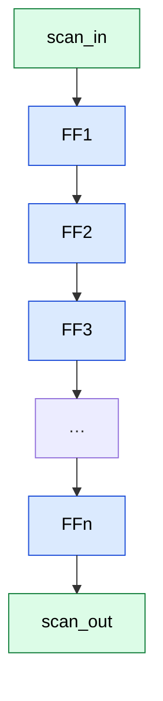
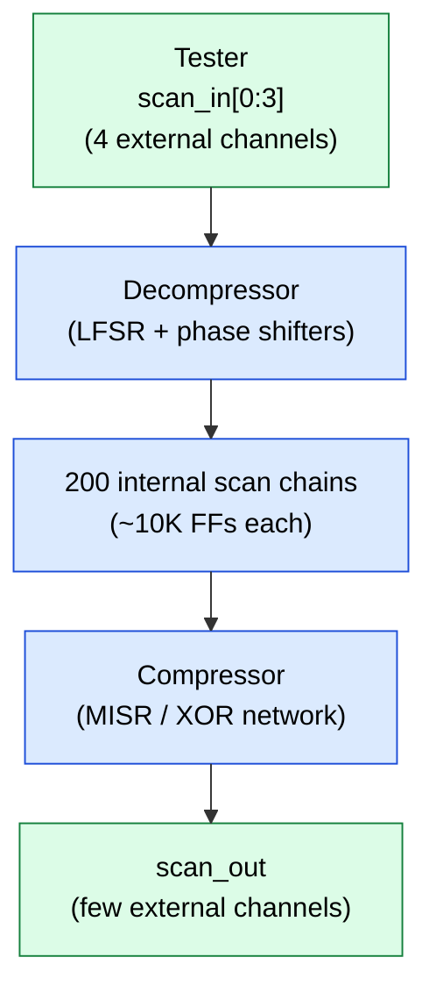
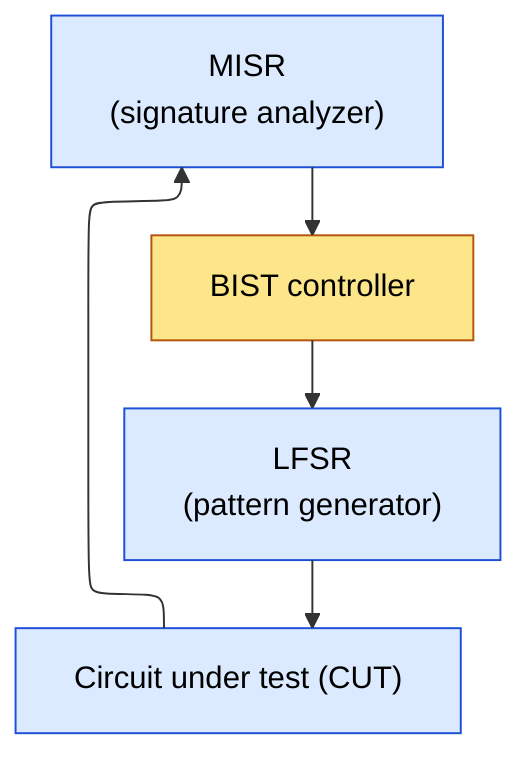
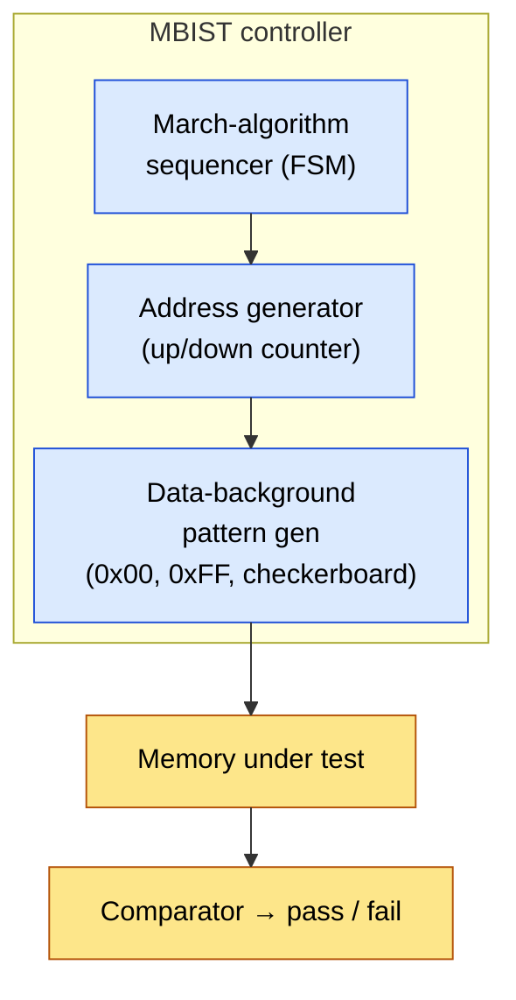
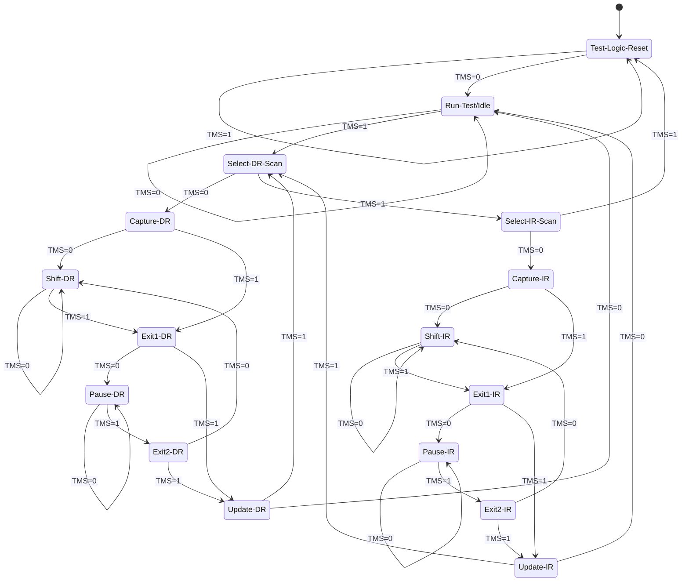
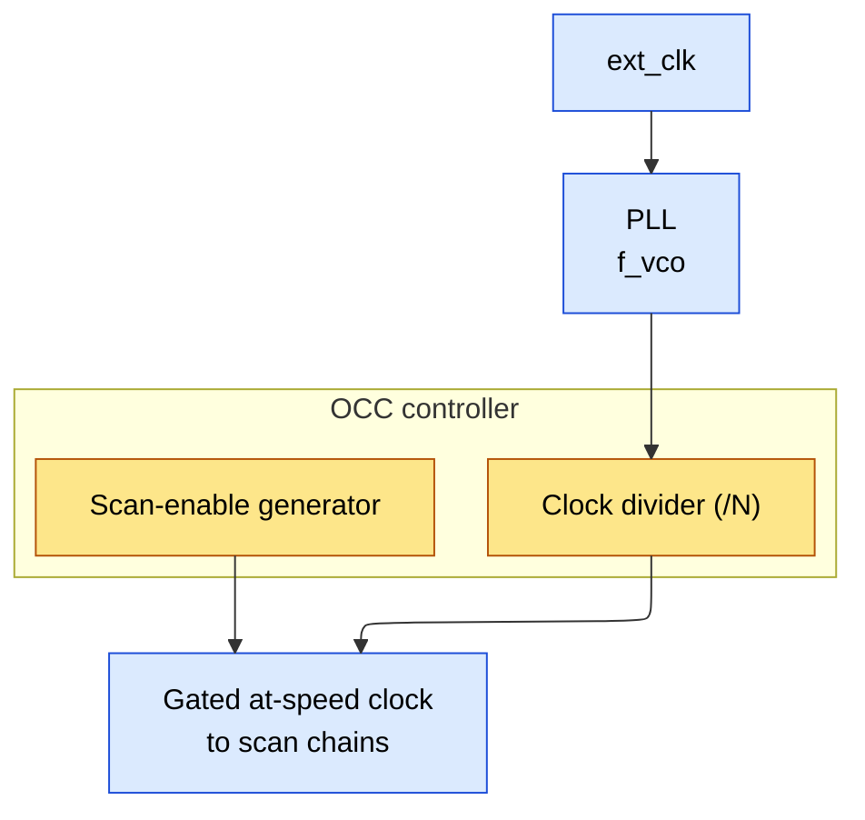
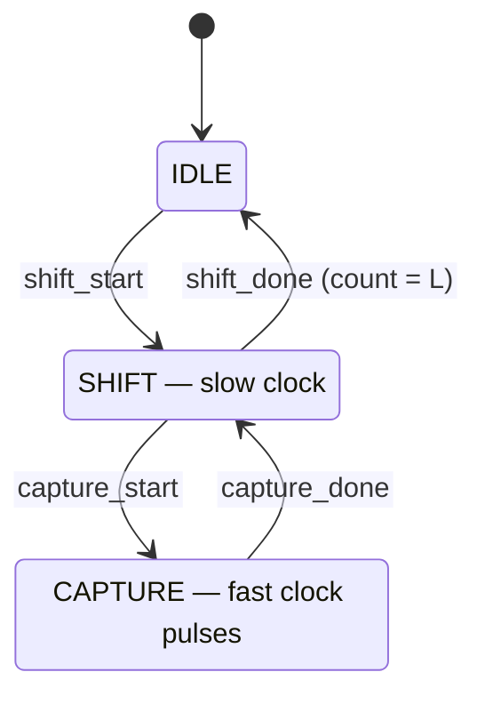
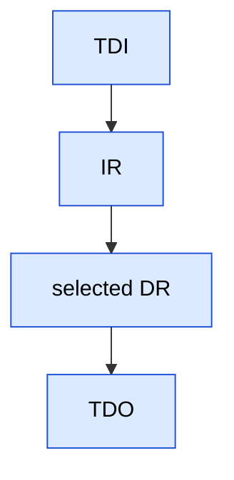
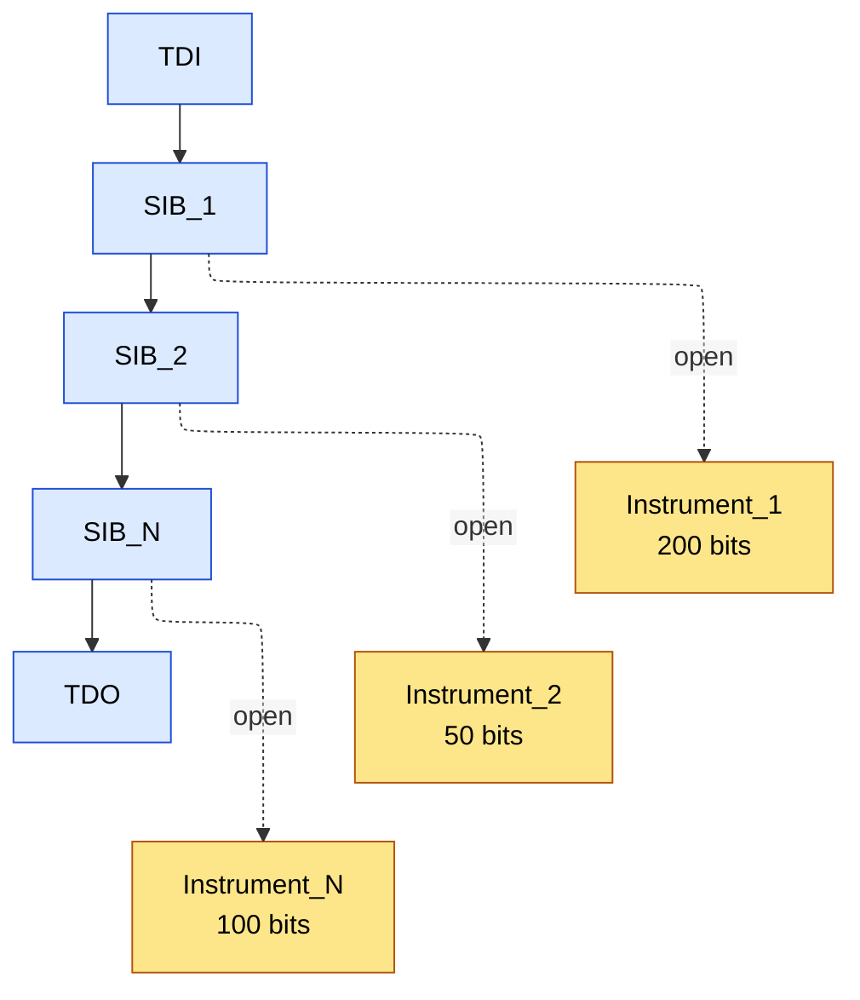

# Design for Testability (DFT) and ATPG -- Senior Engineer Deep Dive

> Target audience: Engineers preparing for senior-level IC design interviews at
> Apple, NVIDIA, AMD, Intel, Qualcomm, Broadcom, MediaTek, etc.

---

## Table of Contents

1. [Scan Chain Architecture](#1-scan-chain-architecture)
2. [Fault Models](#2-fault-models)
3. [ATPG Algorithms](#3-atpg-algorithms)
4. [At-Speed Testing](#4-at-speed-testing)
5. [Test Compression](#5-test-compression)
6. [Logic BIST](#6-logic-bist)
7. [Memory BIST](#7-memory-bist)
8. [JTAG / Boundary Scan (IEEE 1149.1)](#8-jtag--boundary-scan-ieee-11491)
9. [On-Chip Clocking (OCC)](#9-on-chip-clocking-occ)
10. [IJTAG (IEEE 1687)](#10-ijtag-ieee-1687)
11. [Hierarchical DFT](#11-hierarchical-dft)
12. [DFT in Low-Power Designs](#12-dft-in-low-power-designs)
13. [Numbers to Memorize](#13-numbers-to-memorize)
14. [Interview Q&A](#14-interview-qa)

---

## 1. Scan Chain Architecture

### 1.1 Mux-D Scan Flip-Flop

The fundamental DFT building block replaces every functional flip-flop with a
scan-capable version. A 2:1 multiplexer is added in front of the D input.

```ascii-graph
                 Mux-D Scan Flip-Flop
                 =====================

        SI ──────┐
                 │  ┌─────┐
                 ├──┤ 0   │
                 │  │ MUX ├──── D ──┬──┐  ┌─────────┐
        D  ──────┤──┤ 1   │        │  └──┤ D     Q ├──── Q (functional output)
                 │  └──┬──┘        │     │         │      = SO (scan out)
                 │     │           │     │  D-FF   │
        SE ──────┘     │           │  ┌──┤ CLK   QB├──── QB
                  (select)         │  │  └─────────┘
                                   │  │
                              (to next   CLK
                               stage)

  Pin Definitions:
  ─────────────────────────────────────────────────
  SI  = Scan Input  (from previous FF in scan chain)
  SO  = Scan Output (= Q output, to next FF in chain)
  SE  = Scan Enable (1 = shift mode, 0 = capture/functional mode)
  D   = Functional data input
  Q   = Functional data output / scan data output
  CLK = Clock
```

**When SE = 1 (Shift Mode):** The mux selects SI. The flip-flop acts as a
shift register element -- data flows from SI to Q on each clock edge.

**When SE = 0 (Capture/Functional Mode):** The mux selects D. The flip-flop
captures the combinational logic output, behaving as a normal functional FF.

**Gate-level implementation of the MUX:**

```ascii-graph
  SI ────┐
         ├── AND ──┐
  SE ────┘         │
                   ├── OR ──── to D pin of FF
  D  ────┐         │
         ├── AND ──┘
  SE_b ──┘

  SE_b = NOT(SE)

  Equation: D_ff = (SI & SE) | (D & ~SE)
```

Area overhead: typically 15-20% over a standard D flip-flop. In advanced nodes
(7nm, 5nm), the scan mux is integrated into the standard cell library as a
unified cell (SDFF -- Scan D Flip-Flop) to minimize area and timing penalty.

### 1.2 Scan Chain Stitching

All scan flip-flops in a design are connected in one or more serial chains.



During **shift** (SE=1) data flows scan_in → FF1 → … → FFn → scan_out. During **capture** (SE=0) each flop captures its own functional D input independently.

**Stitching Ordering Strategies:**

| Strategy | Description | Pros | Cons |
|---|---|---|---|
| Physical proximity | FFs close together are chained | Shorter scan routing wires | May cross clock domains |
| Clock-domain based | All FFs in same domain in one chain | Clean clock domain separation | Longer wires possible |
| Hierarchical | Each module has its own sub-chain | Modular, easy debug | Sub-optimal chain balance |
| Tool-optimized | EDA tool minimizes wire length | Best routing QoR | Less predictable ordering |
| Random | No particular order | Simple to implement | Worst routing congestion |

**Modern practice (Synopsys DFT Compiler / Cadence Modus):** The tool
automatically stitches chains considering physical placement, clock domains,
and power domains to minimize wire length and timing violations.

### 1.3 Shift Mode vs Capture Mode -- Timing Diagrams

```wavedrom
{ "signal": [
  { "name": "CLK",      "wave": "p......" },
  { "name": "SE",       "wave": "1......" },
  { "name": "scan_in",  "wave": "x=====.", "data": ["b0","b1","b2","b3","b4"] },
  { "name": "scan_out", "wave": "x.=====", "data": ["r0","r1","r2","r3","r4"] }
], "head": { "text": "Shift mode (SE=1): stimulus b0..b4 shifted in while response r0..r4 (from the previous capture) shifts out" } }
```

**Critical timing constraint during shift:** SE must be stable (HIGH) before
the setup time of every scan FF with respect to the shift clock edge. The
scan_enable signal has enormous fanout (every scan FF in the design), so
buffering the SE tree is a major physical design task.

### 1.4 Scan Chain Length Trade-offs

If a design has N scan flip-flops and C scan chains:

```text
  Chain length L = N / C  (assuming balanced chains)

  Shift cycles per pattern = L
  Total test time for P patterns = P x (L + capture_cycles)
                                 ≈ P x L  (since capture << shift)

  Example:
    N = 2,000,000 FFs (2M-gate design)
    C = 200 chains
    L = 2,000,000 / 200 = 10,000 FFs per chain
    P = 5,000 patterns
    Shift clock = 20 MHz (50 ns period)

    Shift time per pattern = 10,000 x 50 ns = 500 us
    Total shift time = 5,000 x 500 us = 2,500 s ≈ 42 min

  If C = 1000 chains:
    L = 2,000 FFs per chain
    Shift time per pattern = 2,000 x 50 ns = 100 us
    Total shift time = 5,000 x 100 us = 500 s ≈ 8.3 min
```

**Trade-off Summary:**

| More chains (larger C) | Fewer chains (smaller C) |
|---|---|
| Shorter shift time per pattern | Longer shift time |
| More scan I/O pins needed | Fewer pins |
| More complex routing | Simpler routing |
| Better test time on ATE | Less ATE channel usage |
| Higher shift power (more FFs toggle in parallel) | Lower shift power |

**Practical constraint:** Number of chains is limited by available ATE (tester)
channels and chip I/O pins. With test compression (Section 5), we decouple
internal chain count from external pin count.

### 1.5 Lockup Latch

**Problem:** When a scan chain crosses from a positive-edge triggered clock
domain to a negative-edge triggered domain (or between two asynchronous
domains), timing violations can occur during shift.

```wavedrom
{ "signal": [
  { "name": "CLK_A (posedge)", "wave": "01010101" },
  { "name": "CLK_B (negedge)", "wave": "10101010" },
  { "name": "FF_A out",        "wave": "x=.=.=.=", "data": ["d0","d1","d2","d3"] }
], "head": { "text": "No lockup latch: FF_A changes on CLK_A posedge but FF_B samples on CLK_B negedge -- if the edges are close, setup/hold is violated" } }
```

**Solution:** Insert a transparent latch (lockup latch) between the two domains.

```wavedrom
{ "signal": [
  { "name": "CLK_A",     "wave": "01010101" },
  { "name": "FF_A out",  "wave": "x=.=.=.=", "data": ["d0","d1","d2","d3"] },
  { "name": "Latch out", "wave": "x..=.=.=", "data": ["d0","d1","d2"] },
  { "name": "CLK_B",     "wave": "10101010" }
], "head": { "text": "Lockup latch (transparent while CLK_A high, latches on its negedge) delays FF_A's change by a half cycle, giving FF_B full setup/hold margin" } }
```

The lockup latch converts a race condition (near-zero timing margin) into a
comfortable half-cycle margin. It is transparent when its enable is HIGH and
latches on the falling edge of its enable.

**Key rules:**
- Lockup latch uses the **source** domain clock as its enable
- It is only active during scan shift; functionally it is bypassed (or its
  effect is don't-care since the path is async anyway)
- Modern DFT tools insert lockup latches automatically

---

## 2. Fault Models

### 2.1 Stuck-At Fault Model (SA0 / SA1)

**Definition:** A stuck-at fault models a signal line permanently tied to logic
0 (SA0) or logic 1 (SA1), regardless of the intended logic value.

For a circuit with N signal lines: total possible single stuck-at faults = 2N.

**Example -- 2-input AND gate:**

```ascii-graph
     a ──┐
         ├── AND ── z
     b ──┘

  Signal lines: a, b, z
  Possible faults: a/SA0, a/SA1, b/SA0, b/SA1, z/SA0, z/SA1
  Total: 6 single stuck-at faults
```

#### Fault Equivalence

Two faults are **equivalent** if they produce identical faulty behavior for ALL
possible input combinations.

**Proof for AND gate:**

| a | b | z (good) | z (a/SA0) | z (b/SA0) | z (z/SA0) |
|---|---|---|---|---|---|
| 0 | 0 | 0 | 0 | 0 | 0 |
| 0 | 1 | 0 | 0 | 0 | 0 |
| 1 | 0 | 0 | 0 | 0 | 0 |
| 1 | 1 | 1 | 0 | 0 | 0 |

`a/SA0 ≡ b/SA0 ≡ z/SA0` — all three faults produce identical faulty outputs, so they form one fault-equivalence class.

Similarly: a/SA1 ≡ z/SA1 for an OR gate (output SA1 = input SA1 on any input).

#### Fault Dominance

Fault f1 **dominates** fault f2 if every test that detects f2 also detects f1
(but not necessarily vice versa). If f1 dominates f2, we can remove f2 from
the fault list without losing coverage.

**Formal:** f1 dominates f2 iff T(f2) is a subset of T(f1), where T(f) is the
set of tests detecting fault f.

#### Fault Collapsing and Checkpoint Theorem

**Checkpoint Theorem:** In a combinational circuit, testing all faults at
**checkpoints** (primary inputs and fanout branches) is sufficient to test all
faults in the circuit.

```text
  Before collapsing: 2N faults (N = number of signal lines)
  After equivalence collapsing: typically reduced by 50-60%
  After dominance collapsing: further 10-20% reduction

  Example: A circuit with 100,000 signal lines
    Uncollapsed: 200,000 faults
    After collapsing: ~60,000-80,000 faults
```

### 2.2 Transition Delay Fault (TDF)

**Why stuck-at is insufficient:** A chip can pass all stuck-at tests yet fail
at speed because a gate is "slow" -- it produces the correct value, but too
late. This is a **delay defect**.

**TDF model:** Each signal line can have:
- **Slow-to-rise (STR):** The line is slow to transition from 0 to 1
- **Slow-to-fall (STF):** The line is slow to transition from 1 to 0

Total TDF faults = 2N (same count as stuck-at, different model).

**Two-pattern test requirement:**

```text
  Pattern V1 (initialization): Sets the target line to the INITIAL value
  Pattern V2 (launch/capture):  Causes the transition and captures result

  To detect STR on line L:
    V1 must set L = 0  (initialization)
    V2 must cause L to transition 0 -> 1
    Capture at speed to see if transition arrived in time

  To detect STF on line L:
    V1 must set L = 1
    V2 must cause L to transition 1 -> 0
```

How V1 and V2 are applied depends on the at-speed test method (LOS vs LOC,
see Section 4).

### 2.3 Path Delay Fault

Models the cumulative delay along an entire sensitizable path from PI to PO
(or FF to FF).

**Problem:** Number of paths can be **exponential** in circuit size.

```ascii-graph
  Example: A circuit with N stages, each with 2 reconverging paths:

       ┌── gate_a1 ──┐     ┌── gate_a2 ──┐
  IN ──┤              ├──>──┤              ├──> ... ──> OUT
       └── gate_b1 ──┘     └── gate_b2 ──┘

  Paths through N stages = 2^N

  For N = 40 stages: 2^40 ≈ 10^12 paths -- UNTESTABLE exhaustively
```

**Robustness classification:**
- **Robust test:** Detects the path delay fault regardless of other path delays
- **Non-robust test:** May not detect if other paths also have delays
- **Validatable non-robust:** Can be validated with additional conditions

In practice, path delay testing is applied selectively to critical timing paths.

### 2.4 Bridging Faults

Models unintended shorts between two signal lines.

```ascii-graph
  AND-bridge: shorted lines behave as if ANDed
    line_a ──┬── effective value = a AND b
    line_b ──┘

  OR-bridge: shorted lines behave as if ORed
    line_a ──┬── effective value = a OR b
    line_b ──┘

  Dominant-bridge: one line forces its value on the other
    (depends on driver strengths)
```

Detection requires input combinations where the two lines have different
intended values: one must be 0, the other must be 1.

### 2.5 IDDQ Testing

**Concept:** In CMOS, a defect-free circuit has near-zero static current
(only leakage). A defect (bridge, gate oxide short, stuck-open) creates a
DC path from VDD to GND, causing elevated quiescent supply current.

- **Defect-free** — IDDQ ≈ nA to uA range (leakage only)
- **Defective** — IDDQ ≈ uA to mA range (defect current + leakage)

Test procedure:
1. Apply input vector
2. Wait for circuit to settle
3. Measure IDD (supply current)
4. Compare against threshold
5. Repeat for multiple vectors

**Practical limitations at advanced nodes (< 28nm):**
- Leakage current increases exponentially with each node
  - 180nm: ~1 nA/gate → IDDQ works great
  - 45nm:  ~100 nA/gate → IDDQ marginal
  - 7nm:   ~1-10 uA/gate → IDDQ nearly impossible for large designs
- Defect current becomes indistinguishable from normal leakage
- Statistical methods (delta-IDDQ) partially compensate but add complexity

### 2.6 Cell-Aware Fault Models

**Why needed below 28nm:** Traditional stuck-at and TDF models assume faults
at cell boundaries (inputs/outputs). But at advanced nodes, **intra-cell
defects** (opens/shorts within the transistor-level layout) can cause failures
not modeled by pin-level faults.

```ascii-graph
  Standard cell internal view (simplified NAND2):

    VDD ──┬── PMOS_A ──┬── PMOS_B ──┬── OUT
          │            │            │
          └────────────┴────────────┘
                                    │
    GND ──── NMOS_A ──── NMOS_B ────┘

  Intra-cell defects:
    - Open on PMOS_A drain (not modeled by SA on inputs/output)
    - Short between NMOS_A gate and drain
    - Resistive via on internal metal connection
```

**Cell-aware test flow:**
1. Library provider characterizes each cell for internal defects using SPICE
2. Defect list (shorts, opens within layout) is generated per cell
3. ATPG tool uses this defect list instead of simple SA/TDF models
4. Typically adds 5-15% more patterns beyond TDF tests
5. Catches 2-5% additional defective parts in silicon

**Industry adoption:** Cell-aware testing is now standard at 16nm and below.
Synopsys TetraMAX, Cadence Modus, and Siemens Tessent all support it.

### 2.7 Fault Coverage Calculation

```ascii-graph
  Fault Coverage (FC) = (Detected Faults) / (Total Faults - Untestable Faults)

  Where:
    Detected Faults = faults proven detected by test patterns
    Untestable Faults = ATPG-untestable (tied, blocked, redundant)

  Test Coverage (TC) = (Detected Faults) / (Total Faults)
    -- more conservative, does not exclude untestable

  Typical Industry Targets:
  ─────────────────────────────────────────────
  Fault Model         │ Target FC
  ─────────────────────────────────────────────
  Stuck-at             │ > 98% (often > 99%)
  Transition (TDF)     │ > 95% (> 97% for auto/safety)
  Cell-aware           │ > 92%
  Path delay           │ Selective paths only
  Bridging             │ > 90%
  ─────────────────────────────────────────────

  Defect Coverage Metrics (used for automotive ISO 26262):
    DPPM = Defective Parts Per Million
    Target: < 1 DPPM for ASIL-D automotive ICs
```

---

## 3. ATPG Algorithms

### 3.1 D-Algorithm

The **D-algorithm** (Roth, 1966) was the first complete ATPG algorithm. It uses
a **5-valued logic system**: {0, 1, D, D', X}.

```text
  D  = 1 in good circuit, 0 in faulty circuit (fault effect)
  D' = 0 in good circuit, 1 in faulty circuit (complement of D)
  X  = unknown / unassigned
```

**Core concepts:**

- **D-frontier:** Set of gates whose output is X but at least one input carries
  D or D'. These are candidate gates for **propagating** the fault effect
  toward an output.

- **J-frontier:** Set of gates whose output is justified (assigned 0 or 1) but
  whose inputs have not yet been determined. These need **backward
  justification**.

**Algorithm steps:**
1. **Activate the fault:** Force the faulty line to the opposite of its stuck
   value. This creates D or D' at the fault site.
2. **Propagate (D-drive):** Push D/D' through gates toward a primary output
   (using D-frontier).
3. **Justify (backtrack):** Assign values to primary inputs to justify all
   internal line values (using J-frontier).
4. **Backtrack:** If a conflict arises, undo the last decision and try
   alternatives.

#### Worked Example: 3-Gate Circuit (Successful Detection)

```ascii-graph
  Circuit:

    a ──┐
        ├── G1 (AND) ── d ──┐
    b ──┘                   ├── G2 (OR) ── e ──┐
                            │                   ├── G3 (AND) ── Z (PO)
              c ────────────┘                   │
                                                │
              f ────────────────────────────────┘

  Gates:
    G1 = AND(a, b)       → d = ab
    G2 = OR(d, c)        → e = d + c = ab + c
    G3 = AND(e, f)       → Z = ef = (ab + c)f

  Fault target: d/SA0 (output of G1 stuck-at-0)
  This means: in good circuit d = 1, in faulty circuit d = 0
  So we want d = D (good=1, faulty=0)

  ──────────────────────────────────────────────────
  Step 1: ACTIVATE the fault
  ──────────────────────────────────────────────────
  To create D at d (d must be 1 in good circuit):
    G1 = AND(a, b) = 1  →  a = 1, b = 1
    d = D  (good: 1, faulty: 0)   ← D-frontier = {G2}

  ──────────────────────────────────────────────────
  Step 2: PROPAGATE (D-drive) through G2
  ──────────────────────────────────────────────────
  G2 = OR(d, c) = OR(D, c)
  To propagate D through an OR gate: set all other inputs to 0
    → c = 0  (non-controlling value for OR)
  Now: e = D  (good: 1, faulty: 0)   ← D-frontier = {G3}

  IMPLICATION (forward propagate all assignments):
    a=1, b=1, c=0 → d = 1·1 = 1 → d = D
    d=D, c=0 → e = D + 0 = D → e = D
  No conflicts so far.

  ──────────────────────────────────────────────────
  Step 3: PROPAGATE through G3 to PO
  ──────────────────────────────────────────────────
  G3 = AND(e, f) = AND(D, f)
  To propagate D through an AND gate: set all other inputs to 1
    → f = 1  (non-controlling value for AND)
  Now: Z = D·1 = D  ← D reached a PO!

  IMPLICATION:
    a=1, b=1, c=0, f=1 → Z = D
  All assignments consistent. No J-frontier entries.

  ──────────────────────────────────────────────────
  Step 4: JUSTIFY (backtrace to PIs)
  ──────────────────────────────────────────────────
  All values are already justified at PIs:
    a = 1, b = 1, c = 0, f = 1

  TEST VECTOR: (a, b, c, f) = (1, 1, 0, 1)

  ──────────────────────────────────────────────────
  VERIFICATION
  ──────────────────────────────────────────────────
  Good circuit:   d=1, e=1+0=1, Z=1·1=1
  Faulty circuit: d=0, e=0+0=0, Z=0·1=0
  Z_good=1 ≠ Z_faulty=0 → fault DETECTED. ✓

  D-algorithm result: d/SA0 is detected by input vector (1,1,0,1).
```

#### Worked Example: Backtracking (Redundant Fault Identification)

```ascii-graph
  Circuit (same topology, different fault target):

    a ──┐
        ├── G1 (AND) ── d ──┐
    b ──┘                   ├── G2 (OR) ── e ──┐
                            │                   ├── G3 (AND) ── Z (PO)
              c ────────────┘                   │
                                                │
              f ────────────────────────────────┘

  Fault target: e/SA1 (output of G2 stuck-at-1)
  To activate: e must be 0 in good circuit → e = D' (good=0, faulty=1)

  ──────────────────────────────────────────────────
  Step 1: ACTIVATE
  ──────────────────────────────────────────────────
  e = 0 in good circuit → G2 = OR(d, c) = 0 → d = 0 AND c = 0
  d = 0 → G1 = AND(a, b) = 0 → at least one of a, b = 0

  Assign: c = 0.  Now e = D'.

  ──────────────────────────────────────────────────
  Step 2: PROPAGATE D' through G3
  ──────────────────────────────────────────────────
  G3 = AND(e, f) = AND(D', f)
  To propagate D' through AND: need f = 1
  Now Z = D'·1 = D' ← D' reached PO!

  IMPLICATION: a = ?, b = ?, c = 0, f = 1
  d = AND(a, b) = 0 (since e=0 requires d=0)
  At least one of {a, b} must be 0.

  ──────────────────────────────────────────────────
  Step 3: JUSTIFY
  ──────────────────────────────────────────────────
  Pick a = 0, b = 0 (satisfies d=0).
  All consistent: a=0, b=0, c=0, f=1 → d=0, e=D', Z=D'

  TEST VECTOR: (a, b, c, f) = (0, 0, 0, 1)

  VERIFICATION:
    Good circuit:   d=0, e=0+0=0, Z=0·1=0
    Faulty circuit: d=0, e=1 (stuck), Z=1·1=1
    Z_good=0 ≠ Z_faulty=1 → fault DETECTED. ✓

  No backtracking was needed for this fault.
```

#### Worked Example: Backtracking Required

```ascii-graph
  Circuit:

    a ──┐
        ├── G1 (AND) ── d ──┐
    b ──┘                   ├── G2 (OR) ── e ──┐
                            │                   ├── G3 (AND) ── Z (PO)
              c ────────────┘                   │
                                                │
              b ─────────────────── NOT ── g ───┘

  G1 = AND(a, b) → d = ab
  G2 = OR(d, c)  → e = d + c
  G4 = NOT(b)    → g = b'
  G3 = AND(e, g) → Z = e · g = (ab + c) · b'

  Fault target: d/SA0

  ──────────────────────────────────────────────────
  Step 1: ACTIVATE
  ──────────────────────────────────────────────────
  d = D → a = 1, b = 1

  ──────────────────────────────────────────────────
  Step 2: PROPAGATE through G2
  ──────────────────────────────────────────────────
  G2 = OR(d, c): propagate D → c = 0 → e = D
  So far: a=1, b=1, c=0, e=D

  ──────────────────────────────────────────────────
  Step 3: PROPAGATE through G3
  ──────────────────────────────────────────────────
  G3 = AND(e, g) = AND(D, g): propagate D → need g = 1
  g = NOT(b) = b' = 1 → b = 0

  ── BACKTRACK ── CONFLICT DETECTED!
    b = 1 (from Step 1, fault activation) AND b = 0 (from Step 3)
    → Cannot satisfy both simultaneously.

  Backtrack to Step 3: no alternative propagation path from G3.
  Backtrack to Step 2: no alternative gate to propagate D from G2
    (G2's only fanout is G3).
  Backtrack to Step 1: d/SA0 requires a=1, b=1 -- no alternative.

  Exhaustive search complete: d/SA0 is REDUNDANT.

  Algebraic verification:
    Z = (ab + c) · b'
    With b=1: Z = (a + c) · 0 = 0   (always 0!)
    With b=0: d = a·0 = 0, so d/SA0 makes d=0 in both good and faulty.
    Fault has NO effect on Z in any input combination → REDUNDANT.

  The D-algorithm correctly proves redundancy through exhaustive backtracking.
  This also reveals that gate G1 is logically redundant (Z never depends on a
  when b=1, and d=0 when b=0).
```

### 3.2 PODEM (Path-Oriented Decision Making)

**Key improvement over D-algorithm:** PODEM makes decisions ONLY at primary
inputs, never at internal lines. This drastically reduces the search space.

```ascii-graph
  PODEM Algorithm:
  ================
  1. Determine an objective (line value needed for activation/propagation)
  2. BACKTRACE: Map the objective to a primary input assignment
  3. IMPLY: Forward simulate from PIs to determine all internal values
  4. Check: fault detected? → SUCCESS
            fault undetectable? → BACKTRACK (flip PI assignment)
            neither? → set new objective, goto 1

  Advantage: No internal line decisions → no inconsistencies from
             conflicting internal assignments. Backtracking is simpler.

  D-algorithm decides: "internal line X should be 1" (may conflict later)
  PODEM decides: "PI a should be 1" (always consistent with itself)
```

### 3.3 FAN Algorithm

FAN (Fanout-Oriented Test Generation) enhances PODEM with:

1. **Multiple backtrace:** When an objective requires a gate input = 1 and the
   gate has multiple fanout-free inputs, FAN traces ALL of them simultaneously
   rather than picking one.

2. **Headline:** A unique-D-driven gate whose output MUST carry D/D' for fault
   propagation. FAN identifies these mandatory assignments early, avoiding
   unnecessary backtracking.

3. **Stop lines:** Fanout points where backtrace stops and direct implications
   are made, reducing the search space.

**Performance comparison:**

Typical ATPG speed (patterns/second on industrial circuits):

- **D-Algorithm** — ~100-1,000 (rarely used today)
- **PODEM** — ~10,000-50,000
- **FAN** — ~50,000-200,000
- **Modern tools** — ~1,000,000+ (use enhanced FAN + learning + parallelism)

### 3.4 ATPG Fault Classifications

After ATPG runs, every fault is classified:

```ascii-graph
  ┌─────────────────────────────────────────────────────────┐
  │                    Total Faults                         │
  ├──────────────────┬──────────────────────────────────────┤
  │    Detected      │          Not Detected                │
  │  (test exists)   ├──────────────┬───────────────────────┤
  │                  │  Undetected  │   ATPG Untestable     │
  │                  │ (effort      │                       │
  │                  │  limit hit)  ├─────────┬─────────────┤
  │                  │              │ ATPG    │ Not          │
  │                  │              │ proved  │ analyzed     │
  │                  │              │ untestable│            │
  └──────────────────┴──────────────┴─────────┴─────────────┘

  ATPG Untestable sub-categories:
  ─────────────────────────────────────────────
  TIED:       Line is tied to constant (e.g., unused input tied to VDD)
  BLOCKED:    Fault effect cannot propagate to any observable point
  REDUNDANT:  Fault doesn't change circuit function (as shown in example above)
  UNUSED:     Line drives nothing observable
```

---

## 4. At-Speed Testing

### 4.1 Launch-Off-Shift (LOS)

Also called "skewed-load" or "launch-from-shift."

```wavedrom
{ "signal": [
  { "name": "CLK (shift → capture)", "wave": "01010.1010" },
  { "name": "SE",                     "wave": "1....0...." }
], "head": { "text": "LOS (Launch-Off-Shift): the last shift clock launches; capture is one at-speed T_func later; SE must drop between launch and capture (tight)" } }
```

Sequence: shift N-1 bits with `SE=1` (slow clock) → `SE` goes LOW → launch (last shift edge) → capture at-speed.

**V1 pattern** = state after N-1 shift clocks
**V2 pattern** = state after the last (Nth) shift clock = V1 shifted by one position

**Critical SE timing:** SE must transition from HIGH to LOW between the last
shift clock and the capture clock, within ONE functional clock period. This is
the tightest timing constraint in LOS.

### 4.2 Launch-Off-Capture (LOC / Broadside)

```wavedrom
{ "signal": [
  { "name": "CLK (shift → launch/capture)", "wave": "01010..1010" },
  { "name": "SE",                            "wave": "1.0........" }
], "head": { "text": "LOC (Launch-Off-Capture): SE goes LOW well before the launch clock (relaxed); launch then capture one T_func later" } }
```

Sequence: shift all N bits with `SE=1` → `SE` goes LOW (no tight constraint) → launch clock → capture clock one T_func later.

**V1 pattern** = directly loaded via scan shift
**V2 pattern** = functional response to V1 (what the combinational logic
produces from V1)

### 4.3 LOS vs LOC Comparison

| Attribute | LOS | LOC |
|---|---|---|
| V1–V2 relationship | V2 = V1 shifted by 1 bit | V2 = func(V1) |
| V1 controllability | full (shift any value) | full (shift any value) |
| V2 controllability | constrained (1-bit shift of V1) | low (depends on circuit function) |
| Clock speed | fast scan enable needed | only functional clock at-speed |
| Test generation | harder (correlated V1/V2) | easier (combinational ATPG) |
| Coverage | higher | slightly lower |

### 4.4 At-Speed Test Setup

```ascii-graph
  On-chip at-speed test infrastructure:
  ======================================

  ┌────────────────────────────────────────────────┐
  │                    Chip                         │
  │                                                │
  │   ┌─────────┐    ┌──────────┐    ┌──────────┐ │
  │   │ PLL     │    │ Clock    │    │  Scan    │ │
  │   │ (bypass │───>│ Mux/Ctrl │───>│  Chains  │ │
  │   │  mode)  │    │          │    │          │ │
  │   └─────────┘    └──────────┘    └──────────┘ │
  │        │              ^                        │
  │        │         test_mode                     │
  │   ext_clk             scan_en                  │
  └────────┼──────────────┼────────────────────────┘
           │              │
        Tester         Tester

  Key requirements:
  1. PLL bypass mode: During scan shift, use external slow clock from tester.
     During capture, either:
     (a) Use PLL-generated at-speed clock (PLL must lock during shift), OR
     (b) Use on-chip oscillator / DFT clock controller
  
  2. OCC (On-Chip Clock Controller): Generates precise launch-capture
     clock pairs while rest of the time free-running clock is gated.

  3. scan_enable timing: 
     - LOC: Must be stable LOW at least setup time before launch clock
     - LOS: Must transition HIGH→LOW between last shift and capture
             (within one functional period -- often < 1 ns at GHz speeds)
```

---

## 5. Test Compression

### 5.1 The Problem

```ascii-graph
  Without compression:
    Scan cells: 2,000,000
    Patterns:   5,000 (stuck-at) + 10,000 (TDF)
    Bits per pattern: 2 x 2,000,000 = 4,000,000 (stimulus + response)
    Total test data: 15,000 x 4,000,000 = 60 Gbits = 7.5 GB

  ATE memory: typically 256 Mbit - 4 Gbit per channel
  → Cannot store all patterns! Need compression.
```

### 5.2 EDT / DFTMAX Architecture



A few tester channels drive a decompressor that fans out to hundreds of short internal chains; the responses are compacted back to a few channels — this is what makes scan test feasible despite limited tester pins.

**Decompressor (LFSR + Phase Shifters):**

The decompressor expands a small number of external scan channels into many
internal chains. It uses a Linear Feedback Shift Register (LFSR) seeded by
external data, with phase shifter logic (XOR taps) to create pseudo-random
but deterministic patterns for each internal chain.

Key insight: Most scan cell values are don't-care (X) for any given pattern.
ATPG only needs to specify ~1-5% of scan cells. The LFSR naturally fills the
rest with pseudo-random values.

**Compactor (XOR network / space compactor):**

The compactor compresses responses from 200 internal chains down to 4 external
channels using an XOR tree network.

```ascii-graph
  Example: 8 internal chains → 2 external outputs

  chain[0] ──┐
  chain[1] ──┼── XOR ──┐
  chain[2] ──┼── XOR ──┼── XOR ── out[0]
  chain[3] ──┘         │
                        │
  chain[4] ──┐         │
  chain[5] ──┼── XOR ──┘
  chain[6] ──┼── XOR ──┐
  chain[7] ──┘         └──────── out[1]
```

### 5.3 X-Masking and X-Tolerance

**Problem:** Unknown (X) values in scan chain responses corrupt the compactor
output. One X can mask multiple good bits.

```text
  Without X-masking:
    chain[0] response: 1 0 1 1 0  (good)
    chain[1] response: X 1 0 1 X  (two unknowns)
    XOR output:        X 1 1 0 X  ← two bits lost!

  Sources of X:
    - Uninitialized FFs (bus state machines, counters)
    - Tri-state buses captured during scan
    - Analog block outputs
    - Multi-clock domain FFs during capture
```

**X-masking techniques:**
1. **X-bounding:** Replace X-sources with mux + scan-controllable value
2. **X-blocking:** Mask specific chain outputs during compaction per-pattern
3. **X-tolerant compactors:** Use time-domain compaction (MISR with
   selective masking) to tolerate some X values
4. **X-chain:** Route X-heavy FFs into dedicated chains excluded from compactor

Reducing X-values is a critical design-for-test task. Every X costs test
quality.

---

## 6. Logic BIST

### 6.1 Architecture



### 6.2 LFSR Theory

An LFSR is a shift register with feedback through XOR gates defined by a
**characteristic polynomial**.

```ascii-graph
  4-bit LFSR with polynomial x^4 + x + 1  (primitive)
  =====================================================

    ┌──────────────────────────────────────┐
    │                                      │ (XOR feedback)
    │   ┌────┐   ┌────┐   ┌────┐   ┌────┐ │
    └──>│ Q3 ├──>│ Q2 ├──>│ Q1 ├──>│ Q0 ├─┘
        └────┘   └────┘   └────┘   └────┘
           │                  │        │
           │                  └── XOR ─┘
           │                      │
           └── (feedback to Q3 input is XOR of Q1 and Q0)

  Actually, for x^4 + x + 1:
  Feedback: Q3_next = Q0 XOR Q1  (taps at positions 0 and 1)
  
  Or equivalently (external XOR form):
  
        ┌───────────────────────────── XOR <── feedback
        │                               ^
        v                               │
    ┌────┐   ┌────┐   ┌────┐   ┌────┐  │
    │ Q3 ├──>│ Q2 ├──>│ Q1 ├──>│ Q0 ├──┘
    └────┘   └────┘   └────┘   └────┘

  Sequence (seed = 1000):
  ────────────────────────
  Step  Q3 Q2 Q1 Q0
    0    1  0  0  0
    1    0  1  0  0
    2    0  0  1  0
    3    1  0  0  1
    4    1  1  0  0
    5    0  1  1  0
    6    1  0  1  1
    7    1  1  0  1
    8    1  1  1  0
    9    0  1  1  1
   10    1  0  1  1  ← wait, let me recompute properly

  For x^4 + x + 1, the feedback is: new_bit = Q0 XOR Q1

  Step  [Q3 Q2 Q1 Q0]  new_bit = Q0 XOR Q1
    0    1  0  0  0     0 XOR 0 = 0
    1    0  1  0  0     0 XOR 0 = 0
    2    0  0  1  0     0 XOR 1 = 1
    3    1  0  0  1     1 XOR 0 = 1
    4    1  1  0  0     0 XOR 0 = 0
    5    0  1  1  0     0 XOR 1 = 1
    6    1  0  1  1     1 XOR 1 = 0
    7    0  1  0  1     1 XOR 0 = 1
    8    1  0  1  0     0 XOR 1 = 1
    9    1  1  0  1     1 XOR 0 = 1
   10    1  1  1  0     0 XOR 1 = 1
   11    1  1  1  1     1 XOR 1 = 0
   12    0  1  1  1     1 XOR 1 = 0
   13    0  0  1  1     1 XOR 1 = 0
   14    0  0  0  1     1 XOR 0 = 1
   15    1  0  0  0     ← back to initial state!

  Maximum length sequence: 2^4 - 1 = 15 states (all nonzero states)
```

**Primitive polynomial** guarantees maximum-length sequence of 2^n - 1 states.

Common primitive polynomials:

```ascii-graph
  Bits  Polynomial            Taps
  ────  ──────────────────    ──────
   4    x^4 + x + 1          [4,1]
   8    x^8 + x^6 + x^5 + x^4 + 1  [8,6,5,4]
  16    x^16 + x^15 + x^13 + x^4 + 1  [16,15,13,4]
  32    x^32 + x^22 + x^2 + x + 1  [32,22,2,1]
```

**RTL for 4-bit LFSR:**

```verilog
module lfsr_4bit (
    input  wire       clk, rst_n, enable,
    output reg  [3:0] q
);
    // Polynomial: x^4 + x + 1
    // Feedback: q[0] XOR q[1]
    always @(posedge clk or negedge rst_n) begin
        if (!rst_n)
            q <= 4'b1000;  // seed (must be nonzero)
        else if (enable)
            q <= {q[0] ^ q[1], q[3], q[2], q[1]};
    end
endmodule
```

### 6.3 Random Pattern Resistant Faults

**Problem:** LFSR generates pseudo-random patterns. Some faults require very
specific input combinations that have extremely low probability of occurrence
in random patterns.

```text
  Example: An AND gate with 20 inputs
    To detect SA0 on the output, ALL 20 inputs must be 1.
    Probability with random patterns: (1/2)^20 = 1 in 1,048,576
    Need ~1M patterns just for this ONE fault!

  With 10,000 LFSR patterns: probability of detection ≈ 1%
  These are "random pattern resistant" (RPR) faults.
```

**Typical LBIST coverage without help:** 80-90% (insufficient for production)

### 6.4 Test Point Insertion

To reach >95% LBIST coverage, **test points** are inserted into the logic.

```ascii-graph
  Control Point (AND-type):
  ─────────────────────────
  Before: signal_a ──────────────> (to logic)

  After:  signal_a ──┐
                     ├── AND ──> (to logic)
  ctrl_FF (scan) ────┘

  During BIST: ctrl_FF can force signal_a to 0 with 50% probability
  During function: ctrl_FF = 1 (transparent)


  Control Point (OR-type):
  ────────────────────────
  Before: signal_a ──────────────> (to logic)

  After:  signal_a ──┐
                     ├── OR ──> (to logic)
  ctrl_FF (scan) ────┘

  During BIST: ctrl_FF can force signal_a to 1 with 50% probability
  During function: ctrl_FF = 0 (transparent)


  Observation Point:
  ──────────────────
  Hard-to-observe signal ──> obs_FF (scan flip-flop)
                              (added to scan chain, observed during shift)
```

Area overhead: 2-5% for test points to reach 95%+ LBIST coverage.

### 6.5 Signature Analysis (MISR)

**Multiple-Input Signature Register (MISR):** An LFSR-like structure that
compresses all CUT responses into a single signature.

```ascii-graph
  k-bit MISR with m inputs:
  
  response[0] ──> XOR ─┐
                       v
                  ┌────────┐
                  │  LFSR  │ (with feedback polynomial)
                  │  stage │
                  └────────┘
  response[1] ──> XOR ─┐
                       v
                  ┌────────┐
                  │  LFSR  │
                  │  stage │
                  └────────┘
        ...         ...

  After all P patterns applied:
    MISR contains k-bit SIGNATURE

  Compare signature with pre-computed GOLDEN signature:
    Match    → PASS
    Mismatch → FAIL
```

**Aliasing probability:**

If the MISR has n bits, the probability that a faulty circuit produces the
same signature as the good circuit (aliasing) is:

```ascii-graph
  P(alias) = 2^(-n)

  For n = 32: P(alias) = 2^(-32) ≈ 2.3 x 10^(-10) ≈ 0.23 ppb
  For n = 16: P(alias) = 2^(-16) ≈ 1.5 x 10^(-5) ≈ 15 ppm

  Industry standard: 32-bit MISR → aliasing is negligible
```

---

## 7. Memory BIST

### 7.1 March Algorithm Family

March algorithms test memory by writing and reading patterns in specific
address orders. A March **element** is a sequence of operations applied to
every address.

**Notation:**

```text
  ↕  = address order doesn't matter (ascending or descending)
  ↑  = ascending address order (0, 1, 2, ..., N-1)
  ↓  = descending address order (N-1, N-2, ..., 1, 0)
  w0 = write 0
  w1 = write 1
  r0 = read 0 (expect 0)
  r1 = read 1 (expect 1)
```

### 7.2 March C- Algorithm

```text
  March C- = {↕(w0); ↑(r0,w1); ↑(r1,w0); ↓(r0,w1); ↓(r1,w0); ↕(r0)}

  Element 0: ↕(w0)       -- Initialize all cells to 0
  Element 1: ↑(r0, w1)   -- Read 0, write 1, ascending
  Element 2: ↑(r1, w0)   -- Read 1, write 0, ascending
  Element 3: ↓(r0, w1)   -- Read 0, write 1, descending
  Element 4: ↓(r1, w0)   -- Read 1, write 0, descending
  Element 5: ↕(r0)       -- Read all 0s (final check)

  Complexity: 10N operations (where N = number of memory words)
    Element 0: 1N, Element 1: 2N, Element 2: 2N,
    Element 3: 2N, Element 4: 2N, Element 5: 1N
    Total = 1+2+2+2+2+1 = 10N
```

**Execution trace for 4-word memory:**

```ascii-graph
  Address:    0    1    2    3    Operation
  ─────────────────────────────────────────
  E0 ↕w0:    w0   w0   w0   w0   Initialize
  
  E1 ↑r0w1:  r0   .    .    .    Read addr 0, expect 0
             w1   .    .    .    Write addr 0 with 1
              .   r0   .    .    Read addr 1, expect 0
              .   w1   .    .    Write addr 1 with 1
              .    .   r0   .    ...
              .    .   w1   .
              .    .    .   r0
              .    .    .   w1

  (Memory state after E1: all 1s)

  E2 ↑r1w0:  r1   .    .    .    Read addr 0, expect 1
             w0   .    .    .    Write addr 0 with 0
              ... (ascending through all addresses)

  (Memory state after E2: all 0s)

  E3 ↓r0w1:  .    .    .   r0   Read addr 3, expect 0
              .    .    .   w1   Write addr 3 with 1
              .    .   r0   .    Read addr 2, expect 0
              ... (descending)

  (Memory state after E3: all 1s)

  E4 ↓r1w0:  descending, read 1, write 0
  E5 ↕r0:    final read-all-zeros verification
```

### 7.3 Fault Coverage Table

```ascii-graph
  ┌───────────────────┬─────────┬──────────┬──────────┬──────────┐
  │ Fault Type        │March C- │ March SS │ March B  │ MATS+    │
  ├───────────────────┼─────────┼──────────┼──────────┼──────────┤
  │ SAF (Stuck-at)    │   Yes   │   Yes    │   Yes    │   Yes    │
  ├───────────────────┼─────────┼──────────┼──────────┼──────────┤
  │ TF (Transition)   │   Yes   │   Yes    │   Yes    │   No     │
  ├───────────────────┼─────────┼──────────┼──────────┼──────────┤
  │ CF (Coupling)     │  Most   │   Yes    │   Yes    │   No     │
  │  - CFin           │   Yes   │   Yes    │   Yes    │   No     │
  │  - CFid           │   Yes   │   Yes    │   Yes    │   No     │
  │  - CFst           │   No    │   Yes    │   No     │   No     │
  ├───────────────────┼─────────┼──────────┼──────────┼──────────┤
  │ AF (Address        │   Yes   │   Yes    │   Yes    │   Yes    │
  │    decoder)       │         │          │          │          │
  ├───────────────────┼─────────┼──────────┼──────────┼──────────┤
  │ NPSF (Neighborhd  │   No    │   Yes    │   No     │   No     │
  │  Pattern Sensitive)│         │          │          │          │
  ├───────────────────┼─────────┼──────────┼──────────┼──────────┤
  │ Complexity        │  10N    │   22N    │  17N     │   5N     │
  └───────────────────┴─────────┴──────────┴──────────┴──────────┘

  CF subtypes:
    CFin  = inversion coupling (write to cell A inverts cell B)
    CFid  = idempotent coupling (write to A forces B to 0 or 1)
    CFst  = state coupling (state of A forces B to 0 or 1)
```

### 7.4 MBIST Controller FSM



**Data background patterns:** Testing with a single data pattern (all 0s/1s) is
insufficient. Multiple backgrounds are needed:

```ascii-graph
  Pattern    Value      Purpose
  ─────────────────────────────────────────
  Solid 0    0x0000...  Basic stuck-at
  Solid 1    0xFFFF...  Basic stuck-at
  Checker    0xAAAA...  Adjacent bit coupling
  Inv-Check  0x5555...  Adjacent bit coupling
  Column     0x00FF...  Column-adjacent faults
```

### 7.5 Memory Repair (BISR)

```ascii-graph
  BISR (Built-In Self-Repair) Flow
  =================================

  1. MBIST runs and logs failing addresses
  2. Repair Analysis Unit determines if memory is repairable
  3. Redundant rows/columns are allocated to replace failing ones
  4. Repair configuration stored in non-volatile memory (fuses/anti-fuses)
  5. On power-up, fuse values configure muxes to reroute failing addresses

  Memory with Redundancy:
  ┌──────────────────────────────────┐
  │  Normal Array     │ Redundant   │
  │                   │ Columns     │
  │  Row 0  [.......] │ [..]       │
  │  Row 1  [.......] │ [..]       │
  │  ...              │             │
  │  Row N  [.......] │ [..]       │
  │─────────────────────────────────│
  │  Redundant Rows   │             │
  │  RR0   [.......] │ [..]       │
  │  RR1   [.......] │ [..]       │
  └──────────────────────────────────┘

  Repair decision:
    - Failing cells in same row → replace row with redundant row
    - Failing cells in same column → replace column with redundant column
    - Scattered failures → may need combination
    - Too many failures → UNREPAIRABLE → chip rejected

  Fuse Programming:
    ┌────────┐     ┌──────────┐     ┌────────┐
    │ MBIST  │────>│ Repair   │────>│ Fuse   │
    │ fail   │     │ Analysis │     │ Blow   │
    │ log    │     │ (on-chip │     │ Logic  │
    └────────┘     │  or ATE) │     └────────┘
                   └──────────┘
```

---

## 8. JTAG / Boundary Scan (IEEE 1149.1)

### 8.1 TAP Controller FSM

The **Test Access Port (TAP)** controller is a 16-state FSM driven by TCK
(clock) and TMS (mode select).



The 16-state TAP FSM is navigated purely by TMS on the rising edge of TCK. The DR and IR columns are structurally identical; from any state, holding TMS=1 for five cycles returns to Test-Logic-Reset.

All 16 states:

```text
  1.  Test-Logic-Reset    9.  Exit1-DR
  2.  Run-Test/Idle      10.  Pause-DR
  3.  Select-DR-Scan     11.  Exit2-DR
  4.  Capture-DR         12.  Update-DR
  5.  Shift-DR           13.  Select-IR-Scan
  6.  Exit1-DR           14.  Capture-IR
  7.  Pause-DR           15.  Shift-IR
  8.  Exit2-DR           16.  Update-IR
                          (Exit1/2 and Pause appear in both DR and IR paths)
```

### 8.2 TAP Signals

```ascii-graph
  Signal  Direction   Description
  ─────── ─────────── ───────────────────────────────────────
  TCK     Input       Test Clock (independent from system clock)
  TMS     Input       Test Mode Select (drives TAP FSM transitions)
  TDI     Input       Test Data In (serial data into IR or DR)
  TDO     Output      Test Data Out (serial data from IR or DR)
  TRST*   Input       Test Reset (optional, asynchronous reset of TAP)
  
  * TRST is optional in IEEE 1149.1. If not present, TAP can be
    reset by holding TMS=1 for 5+ TCK cycles.
```

### 8.3 Standard JTAG Instructions

```ascii-graph
  ┌──────────────────┬──────────┬──────────────────────────────────┐
  │ Instruction      │ Required │ Description                       │
  ├──────────────────┼──────────┼──────────────────────────────────┤
  │ BYPASS           │ Yes      │ 1-bit DR, passes TDI to TDO      │
  │                  │          │ with 1 cycle delay. Used to       │
  │                  │          │ shorten chain in multi-chip scan. │
  ├──────────────────┼──────────┼──────────────────────────────────┤
  │ EXTEST           │ Yes      │ Drives boundary scan outputs,    │
  │                  │          │ captures boundary scan inputs.    │
  │                  │          │ Tests INTER-chip connections.     │
  ├──────────────────┼──────────┼──────────────────────────────────┤
  │ SAMPLE/PRELOAD   │ Yes      │ Captures IO values without       │
  │                  │          │ affecting function. Preloads      │
  │                  │          │ boundary cells before EXTEST.     │
  ├──────────────────┼──────────┼──────────────────────────────────┤
  │ IDCODE           │ Optional │ Reads 32-bit device ID register  │
  │                  │          │ (manufacturer, part#, version).   │
  ├──────────────────┼──────────┼──────────────────────────────────┤
  │ INTEST           │ Optional │ Tests INTERNAL logic via          │
  │                  │          │ boundary scan cells as stimulus/  │
  │                  │          │ response points.                  │
  ├──────────────────┼──────────┼──────────────────────────────────┤
  │ USERCODE         │ Optional │ User-programmable 32-bit code.   │
  ├──────────────────┼──────────┼──────────────────────────────────┤
  │ CLAMP            │ Optional │ Drives predetermined values on   │
  │                  │          │ outputs while bypassing.          │
  └──────────────────┴──────────┴──────────────────────────────────┘
```

### 8.4 Boundary Scan Cell

```ascii-graph
  Boundary Scan Cell (BSC)
  ========================

                          To next BSC
                               ^
  From previous BSC            │
       │              ┌────────┴──────┐
       │    Shift-DR  │   Update FF   │──── Mode MUX ───> To pad/core
       │       │      │   (holds      │         ^
       v       v      │    output)    │         │
  ┌──────────────┐    └───────────────┘    Instruction
  │  Capture FF  │──────────────^              (EXTEST
  │  (shift reg  │              │               selects
  │   element)   │         Clock-DR             BSC output)
  └──────┬───────┘
         ^
    ┌────┴────┐
    │  MUX    │
    │ 0     1 │
    └─┬─────┬─┘
      │     │
  From pad  Shift path
  or core   (TDI chain)
      
  Capture-DR: MUX selects pad/core input → loaded into Capture FF
  Shift-DR:   MUX selects shift path → serial shift TDI→TDO
  Update-DR:  Capture FF value transferred to Update FF
  EXTEST mode: Update FF drives pad output (instead of core logic)
```

### 8.5 Board-Level Testing

```ascii-graph
  Board with 3 JTAG-compliant ICs:
  =================================

  TDI ──> [Chip A BSR] ──> [Chip B BSR] ──> [Chip C BSR] ──> TDO
           TCK, TMS (shared bus to all chips)

  Inter-chip connectivity test:
    1. Load EXTEST instruction into all chips
    2. Preload known values into Chip A output BSCs
    3. Capture values at Chip B input BSCs
    4. Shift out and compare
    5. Detects open, short, stuck-at faults on PCB traces

  Trace: Chip A pin 42 ──────── Chip B pin 17
         (BSC drives 1)   PCB   (BSC captures 1?)
                          trace
         If BSC captures 0 → open or short fault on trace!
```

---

## 9. On-Chip Clocking (OCC)

### 9.1 Why OCC Is Needed

At-speed transition and path-delay testing requires that launch and capture
clock edges be separated by exactly one functional clock period (e.g., 1 ns at
1 GHz). The ATE cannot deliver such precise high-frequency clock pairs directly:
tester channel skew, jitter, and limited frequency range make external at-speed
clocking unreliable above ~200 MHz. The **On-Chip Clock Controller (OCC)**
solves this by generating precise, fast clock pulses on-chip while the ATE
supplies only a slow shift clock.

```ascii-graph
  Without OCC:
    ATE must deliver fast launch-capture pair at GHz frequencies
    → Skew and jitter on tester channels make timing unpredictable
    → Cannot test at true functional speed

  With OCC:
    ATE delivers slow shift clock (10-50 MHz)
    OCC generates fast launch-capture pair internally using PLL
    → Precise at-speed clock edges with <10 ps skew
    → True functional-speed testing
```

### 9.2 OCC Architecture



**Key components:**

| Component | Function |
|-----------|----------|
| PLL | Generates VCO-frequency clock (e.g., 2-4 GHz); must be locked before capture |
| Clock Divider | Divides PLL output to functional frequency (e.g., /2, /4) |
| Clock MUX/Gate | Selects between slow shift clock and fast functional clock |
| Scan Enable Generator | Produces SE signal: HIGH during shift, LOW before launch edge |
| OCC Controller FSM | Sequences shift/capture phases; handshakes with ATE via control signals |

### 9.3 OCC Timing for At-Speed Testing

```ascii-graph
  OCC Timing: LOC (Launch-Off-Capture) Mode
  ==========================================

  Phase 1: SHIFT (slow clock, SE=1)
           ┌──┐  ┌──┐  ┌──┐  ┌──┐  ┌──┐  ┌──┐
  CLK_s   ┘  └──┘  └──┘  └──┘  └──┘  └──┘  └──
  SE      ──────────────────────────────────── (HIGH)

  Phase 2: CAPTURE (fast clock, SE=0)
                                          ┌─┐    ┌─┐
  CLK_f                                  ┘ └────┘ └──
                                          ^      ^
                                       launch  capture
                                      <── T_func ──>
                                      (e.g., 1 ns at 1 GHz)

  SE      ──────────────────────────── ──────────── (LOW)

  Phase 3: SHIFT-OUT (slow clock, SE=1)
                                                       ┌──┐  ┌──┐
  CLK_s                                                ┘  └──┘  └──
  SE      ─────────────────────────────────────────── (HIGH)

  Timing annotation:
    - SE must be LOW before launch edge (met by OCC, not by ATE)
    - Launch-to-capture = exactly 1 functional clock period
    - Only 2 fast clock pulses issued (launch + capture)
    - Clock gated after capture to prevent additional captures
```

```wavedrom
{ "signal": [
  { "name": "CLK_shift", "wave": "0101010000" },
  { "name": "CLK_fast",  "wave": "0000000101", "node": ".......a.b" },
  { "name": "SE",        "wave": "1.....0..." }
], "edge": ["a~b at-speed"], "head": { "text": "OCC LOS: slow shift clocks with SE=1, then SE drops and the OCC muxes in a fast launch+capture pair from the PLL" } }
```

### 9.4 OCC Controller FSM and ATE Handshaking



### 9.5 OCC in Production ATPG Flow

```text
  Production Flow Integration:
  ============================

  1. ATPG tool (TetraMAX/Modus/Tessent) generates patterns in STIL/WGL format
  2. Patterns include OCC control fields:
     - shift_cycle_count (chain length)
     - capture_pulse_count (2 for LOC, 1 for LOS)
     - clock_domain_select (which PLL domain)
  3. ATE program interprets OCC fields and sequences handshake signals
  4. OCC ensures:
     - Only targeted clock domain receives fast pulses
     - Cross-domain capture is avoided (or explicitly managed)
     - Multiple clock domains can be tested sequentially or in parallel
       with per-domain OCC instances

  Multi-Domain OCC:
    SoC has 4 clock domains (CPU, GPU, DDR, PCIe)
    Each domain has its own PLL and OCC instance
    ATPG pattern targets one domain at a time
    Non-targeted domains: clock gated off during capture
    OCC controller for each domain independent
```

### 9.6 OCC Design Considerations

```ascii-graph
  Key design points:
  ─────────────────
  1. PLL lock time: PLL must be locked before capture phase.
     If shift phase is long (>100 us), PLL has time to lock.
     For short chains, a pre-lock phase may be needed.

  2. Clock glitch prevention: MUX switching between slow and fast
     clocks must be glitch-free. Use a clock-gating cell with
     enable synchronized to the clock domain.

  3. SE generation: OCC must assert SE=0 before the first fast
     clock edge. SE timing relative to launch clock is critical.
     OCC generates SE internally, avoiding ATE skew.

  4. Multiple capture pairs: For multi-cycle at-speed tests,
     OCC can issue >2 fast pulses (launch, intermediate, capture).

  5. Power: Fast clock pulses cause significant switching.
     OCC can issue a single capture pair per pattern to limit
     peak power during at-speed testing.
```

---

## 10. IJTAG (IEEE 1687) / IEEE 1149.1-2013

### 10.1 Why JTAG (1149.1) Is Not Enough

Classic IEEE 1149.1 JTAG provides a single serial scan chain (TDI-TDO) with
an instruction register (IR) that selects which data register (DR) is connected.
For a modern SoC with hundreds of embedded instruments (MBIST controllers, PLLs,
temperature sensors, voltage monitors, PVT monitors, debug trace blocks), this
architecture breaks down:



With classic JTAG only one DR is in the chain at a time. Accessing the MBIST controller (200-bit DR) costs 8-bit IR + 200-bit DR = 208 bits; PLL config (50-bit DR) costs 58 bits. Switching instruments requires an IR reload every time — with 50 instruments this is very slow.

### 10.2 IJTAG Architecture

IJTAG (IEEE 1687) replaces the fixed IR-selected DR model with a
**reconfigurable scan network**. Instruments are connected via
**Segment Insertion Bits (SIBs)** that dynamically include or exclude
scan segments from the serial chain.



Each SIB (Segment Insertion Bit) gates its instrument into the scan path. When SIB_1 is open (bit = 1) the chain becomes TDI → SIB_1 → Instrument_1 → SIB_2 → … → TDO, so the active chain length grows only by the instruments you actually select.

### 10.3 SIB (Segment Insertion Bit) Operation

A SIB is a 1-bit scan element that acts as a dynamic multiplexer in the scan
path. When the SIB is **closed** (default), the instrument segment is removed
from the chain. When **opened**, the segment is inserted.

```ascii-graph
  SIB Internal Structure
  ======================

                   To next SIB in network
                        ^
                        │
  From previous SIB     │     ┌─────────────────────┐
       │                │     │  Segment (instrument)│
       │    ┌───────┐   │     │  [scan cells ...]    │
       ├───>│  SIB  ├───┤<──>│                      │
       │    │  MUX  │   │     │                      │
       │    └───┬───┘   │     └─────────────────────┘
       │        │       │
       └────────┘       │
       (when closed:    │
        bypass segment) │
                        v
                     To next SIB

  SIB state bit stored in a capture-update FF pair:
    Update-DR: if SIB_bit = 1 → open → insert segment into chain
    Update-DR: if SIB_bit = 0 → closed → segment bypassed

  Opening a SIB (2-pass operation):
    Pass 1: Shift 1 into SIB position, update → segment now in chain
    Pass 2: Shift through the newly inserted segment to access instrument

  Closing a SIB (1-pass operation):
    Shift 0 into SIB position, update → segment removed from chain
```

**SIB chaining example:**

```ascii-graph
  Opening SIB_1, SIB_2, accessing both instruments:

  Initial state (all SIBs closed):
    TDI → [SIB_1:0] → [SIB_2:0] → TDO    (2-bit chain)

  Pass 1: Open SIB_1
    Shift: TDI → 1 → 0 → TDO    (shift '1' into SIB_1, '0' into SIB_2)
    Update: SIB_1 opens, Instrument_1 inserted
    Chain: TDI → [SIB_1] → [Inst_1: 200 bits] → [SIB_2:0] → TDO  (202 bits)

  Pass 2: Access Instrument_1 AND open SIB_2
    Shift: 202 bits through chain
      - SIB_1 position: don't care (keep open → shift 1)
      - Instrument_1 positions: command/data for instrument
      - SIB_2 position: 1 (to open SIB_2)
    Update: Instrument_1 loaded, SIB_2 opens
    Chain: TDI → [SIB_1] → [Inst_1: 200] → [SIB_2] → [Inst_2: 50] → TDO
           (252 bits)

  Pass 3: Access both instruments simultaneously
    Shift: 252 bits (200 for Inst_1 + 50 for Inst_2 + 2 SIB bits)
```

### 10.4 Network Description Language (NCL)

IJTAG defines a **Network Description Language** (NCL, also called ICL --
Instrument Connectivity Language) and **Procedure Language** (Procedural
Description Language, PDL) to describe instrument connectivity and access
sequences in a vendor-neutral format.

```text
  ICL (Instrument Connectivity Language):
    - Describes the scan network topology
    - Defines instruments, SIBs, and their bit widths
    - Maps signal names to scan segment positions
    - Hierarchical: a sub-network can be instantiated multiple times

  PDL (Procedural Description Language):
    - Describes the SEQUENCE of operations to access instruments
    - Defines procedures: iReset, iScan, iWrite, iRead
    - Includes pre/post conditions (e.g., "PLL must be locked before read")
    - Portable across EDA tools and ATE platforms

  Example PDL pseudocode:
    Procedure configure_pll:
      iWrite pll_sib 1          // open PLL SIB
      iWrite pll_config 0x1A3F  // write configuration
      iWrite pll_ctrl.enable 1  // enable PLL
      iWait 100us               // wait for lock
      iRead pll_status.locked   // verify lock
```

### 10.5 JTAG vs IJTAG Comparison

```ascii-graph
  ┌────────────────────────┬──────────────────────┬──────────────────────────┐
  │ Feature                │ JTAG (1149.1)        │ IJTAG (1687)             │
  ├────────────────────────┼──────────────────────┼──────────────────────────┤
  │ Instrument selection   │ IR opcode (fixed)    │ SIB-based (dynamic)      │
  │                        │                      │                          │
  │ Max instruments        │ Limited by IR width  │ Unlimited (SIB nesting)  │
  │                        │ (typically <32)      │                          │
  │                        │                      │                          │
  │ Access granularity     │ Entire DR only       │ Per-instrument or subset │
  │                        │                      │                          │
  │ Network reconfig.      │ No (fixed topology)  │ Yes (SIBs open/close)    │
  │                        │                      │                          │
  │ Scan chain length      │ Fixed (longest DR)   │ Variable (only open SIBs)│
  │                        │                      │                          │
  │ Access latency         │ Always shift full DR │ Shift only active segs   │
  │                        │                      │                          │
  │ Instrument reuse       │ Manual integration   │ NCL/ICL portability      │
  │                        │                      │                          │
  │ Vendor neutrality      │ Limited              │ Standardized description │
  │                        │                      │ (ICL + PDL)             │
  │                        │                      │                          │
  │ Hierarchy support      │ Flat                 │ Hierarchical (nested SIB)│
  │                        │                      │                          │
  │ Backward compat.       │ N/A                  │ Compatible with 1149.1   │
  │                        │                      │ TAP (uses same TDI/TDO)  │
  │                        │                      │                          │
  │ Standard               │ IEEE 1149.1-2001/    │ IEEE 1687-2014 /         │
  │                        │ 1149.1-2013          │ 1149.1-2013 (merged)     │
  └────────────────────────┴──────────────────────┴──────────────────────────┘
```

### 10.6 IJTAG Use Cases

1. MBIST Access:
   - Open MBIST controller SIB
   - Load march algorithm configuration
   - Start MBIST, read pass/fail status
   - Read failing address and data for debug
   - Close SIB (MBIST runs autonomously)

2. PLL Configuration:
   - Open PLL SIB, write divider ratio and enable
   - Read lock status via SIB
   - Multiple PLLs: each has its own SIB, access independently

3. Sensor Readout:
   - Temperature sensors, voltage monitors, PVT monitors
   - Open sensor SIB, trigger measurement, read result
   - Periodic monitoring during production test

4. Debug Trace:
   - Open trace buffer SIB, read captured trace data
   - Configure trace triggers via SIB-accessible registers

5. Fuse/OTP Access:
   - Read fuse values for trim, calibration, security keys
   - Write fuse values during production programming

---

## 11. Hierarchical DFT

### 11.1 Why Flat DFT Doesn't Scale

In a flat (top-level) DFT flow, all scan flip-flops across the entire SoC are
stitched into chains and ATPG is run on the full flattened netlist. This approach
breaks down for large designs:

```ascii-graph
  Flat DFT Problems (50M-gate SoC example):
  ──────────────────────────────────────────
  1. Chain length: 50M FFs / 500 chains = 100K FFs per chain
     → Shift time per pattern: 100K / 20MHz = 5 ms
     → 10K patterns x 5 ms = 50 seconds just for shift
     → Exceeds test time budget (1-3 sec target)

  2. Pattern count explosion:
     Flat ATPG sees all faults in all blocks simultaneously
     → Pattern interaction between unrelated blocks wastes patterns
     → 500K+ patterns for full-chip stuck-at (vs 10K per block)

  3. ATPG runtime:
     Flat ATPG on 50M-gate netlist: days to weeks on a single machine
     Memory: netlist + fault list can exceed 100 GB RAM

  4. No IP reuse:
     Third-party IP (CPU core, DDR PHY, PCIe controller) must be
     re-characterized at top level every time it's instantiated
     → Wasted effort, IP provider can't pre-verify test quality

  5. Design concurrency:
     Block-level teams cannot finalize DFT until full-chip integration
     → Schedule bottleneck
```

### 11.2 Hierarchical Test Approach: IEEE 1500 Wrappers

The hierarchical approach wraps each IP block with a **test wrapper** (IEEE
1500 for embedded cores, conceptually similar to 1149.1 boundary scan but for
internal blocks). The wrapper isolates the block for individual testing and
provides controlled access to its internal scan chains.

```ascii-graph
  IEEE 1500 Wrapper Around an IP Block
  =====================================

                    Wrapper Boundary
                  ┌─────────────────────────────────────┐
                  │                                     │
  functional_in ──>│ WBR_in    ┌──────────────┐  WBR_out │──> functional_out
                  │──────────>│              │──────────│
                  │  WIR      │  IP Core     │  WBY     │
  WSC ──────────>│(Wrapper   │  (internal   │(Bypass   │
  (Wrapper       │ Instr.    │   scan       │ register │
   Serial        │ Register) │   chains)    │ 1-bit)   │
   Control)      │           │              │          │
                  │  WSP      │              │          │
  WSI ──────────>│(Wrapper   │              │          │──> WSO
  (Wrapper       │ Serial    │              │          │    (Wrapper
   Serial        │ Port)     │              │          │     Serial
   In)           │           │              │          │     Out)
                  └─────────────────────────────────────┘

  Key Components:
    WBR = Wrapper Boundary Register (boundary cells at block ports)
    WIR = Wrapper Instruction Register (selects test mode)
    WBY = Wrapper Bypass Register (1-bit, like JTAG BYPASS)
    WSC = Wrapper Serial Control (clock, control signals)
    WSI/WSO = Wrapper Serial In/Out (scan data port)
```

### 11.3 Wrapper Cell Types

```ascii-graph
  IEEE 1500 defines several wrapper cell types:

  Type 0 (observe-only):
    Functional_out ──> [Capture FF] ──> WSO (observe during test)
    No drive capability (input-only observation)

  Type 1 (basic wrapper cell -- most common):
    Functional_in ──> [MUX] ──> To core     (functional or test data)
                       ^
                  WSI / WSO (shift path)
    Can both drive and observe

  Type 2 (bidirectional):
    Supports bidirectional pins with direction control
    Functional I/O + test drive + test observe

  Type 3-6: Variants with different functional/scan muxing for
  specialized I/O configurations (differential, tri-state, etc.)

  Wrapper Cell = boundary scan cell equivalent for embedded cores
```

### 11.4 Test Modes in Hierarchical DFT

```ascii-graph
  ┌─────────────────────────────────────────────────────────────┐
  │                    Hierarchical Test Modes                   │
  ├──────────────────┬──────────────────────────────────────────┤
  │ Mode             │ Description                              │
  ├──────────────────┼──────────────────────────────────────────┤
  │ Internal Test    │ Test block in isolation:                 │
  │ (intra-block)    │  - Wrapper isolates block from top-level │
  │                  │  - Stimulus enters via wrapper cells     │
  │                  │  - Response exits via wrapper cells      │
  │                  │  - Internal scan chains active           │
  │                  │  - Tests: stuck-at, TDF, path delay      │
  │                  │  within the block                        │
  ├──────────────────┼──────────────────────────────────────────┤
  │ External Test    │ Test inter-block wiring:                 │
  │ (inter-block)    │  - Drive from one block's wrapper output │
  │                  │  - Capture at adjacent block's wrapper   │
  │                  │    input                                 │
  │                  │  - Tests: opens, shorts, bridges on      │
  │                  │    interconnect between blocks           │
  ├──────────────────┼──────────────────────────────────────────┤
  │ Functional Test  │ Normal operation mode:                   │
  │                  │  - Wrappers transparent                  │
  │                  │  - Functional signals pass through       │
  │                  │  - No test overhead in functional path   │
  ├──────────────────┼──────────────────────────────────────────┤
  │ Bypass Mode      │ Skip block entirely:                     │
  │                  │  - WBY (1-bit bypass) active             │
  │                  │  - Block scan chain not in path          │
  │                  │  - Used when accessing other blocks      │
  └──────────────────┴──────────────────────────────────────────┘

  Example: Testing a 4-block SoC
  ───────────────────────────────

  Block A (CPU)     Block B (GPU)     Block C (DDR)     Block D (PCIe)
  [wrapper]         [wrapper]         [wrapper]         [wrapper]
     │                  │                  │                  │
     └──── interconnect ─┘── interconnect ─┘── interconnect ─┘

  Step 1: Internal test Block A (bypass B, C, D)
  Step 2: Internal test Block B (bypass A, C, D)
  Step 3: Internal test Block C (bypass A, B, D)
  Step 4: Internal test Block D (bypass A, B, C)
  Step 5: External test A↔B interconnect
  Step 6: External test B↔C interconnect
  Step 7: External test C↔D interconnect
```

### 11.5 Test Compression at Block Level vs Top Level

```ascii-graph
  Block-Level Compression (Preferred):
  ────────────────────────────────────
  ┌────────────────────────────────────┐
  │  Block A (e.g., CPU core)         │
  │                                    │
  │  [Decompressor] → [internal       │ → [Compactor]
  │                   scan chains]    │
  │                                    │
  │  Block-level test data:            │
  │    - Patterns generated for Block A│
  │    - Only Block A faults targeted  │
  │    - Compression ratio: 50-100x    │
  │    - Pattern count: 5K-20K         │
  │    - ATPG time: minutes            │
  └────────────────────────────────────┘

  Benefits:
    1. Block-level ATPG is fast (smaller fault list)
    2. Patterns are optimal for the block (no interference)
    3. IP provider generates and verifies patterns
    4. Patterns can be retargeted to top level

  Top-Level Compression:
  ──────────────────────
  After block-level patterns are generated, they are retargeted
  to the top-level compression infrastructure:

  Top-level decompressor → Block A wrapper → Block A chains
                         → Block B wrapper → Block B chains
                         → Block C wrapper → Block C chains
                         → Block D wrapper → Block D chains
                                            → Top-level compactor

  The retargeting process:
    1. Block patterns specify internal chain values
    2. Top-level wrapper configurations are prepended
    3. Top-level decompressor/compactor equations are solved
    4. Result: compact external test data for ATE

  Additional top-level patterns for external test (interconnect)
  are generated on the full chip netlist but only target wiring
  faults between blocks -- much smaller fault list.
```

### 11.6 Hierarchical ATPG Flow Benefits

```ascii-graph
  ┌────────────────────────┬───────────────────────┬───────────────────────┐
  │ Attribute              │ Flat ATPG              │ Hierarchical ATPG     │
  ├────────────────────────┼───────────────────────┼───────────────────────┤
  │ ATPG runtime           │ O(n^3) on full netlist │ O(n_b^3) per block    │
  │                        │ (days)                 │ (minutes per block)   │
  ├────────────────────────┼───────────────────────┼───────────────────────┤
  │ Pattern count          │ 500K+ (full chip)      │ 10-20K per block,     │
  │                        │                        │ ~100K total           │
  ├────────────────────────┼───────────────────────┼───────────────────────┤
  │ Parallelism            │ Single monolithic run  │ Each block generated  │
  │                        │                       │ independently, in     │
  │                        │                        │ parallel              │
  ├────────────────────────┼───────────────────────┼───────────────────────┤
  │ IP reuse               │ None (re-run each     │ IP provider ships     │
  │                        │ integration)           │ patterns + models     │
  ├────────────────────────┼───────────────────────┼───────────────────────┤
  │ Design schedule        │ Block DFT blocked by   │ Block teams work      │
  │                        │ top-level integration  │ independently         │
  ├────────────────────────┼───────────────────────┼───────────────────────┤
  │ Memory requirement     │ 100+ GB RAM            │ 4-16 GB per block     │
  ├────────────────────────┼───────────────────────┼───────────────────────┤
  │ Debug                  │ Full-chip diagnosis    │ Block-level isolation │
  │                        │ (complex)              │ (simpler)             │
  ├────────────────────────┼───────────────────────┼───────────────────────┤
  │ Test quality           │ Pattern interaction    │ Optimal per-block     │
  │                        │ may reduce coverage    │ coverage              │
  └────────────────────────┴───────────────────────┴───────────────────────┘

  Production Flow:
    1. IP provider: generates block-level patterns (stuck-at, TDF)
    2. SoC integrator: instantiates wrapped blocks
    3. SoC integrator: generates interconnect patterns (external test)
    4. EDA tool: retargets block patterns through top-level compression
    5. EDA tool: merges all patterns into final ATE program
    6. Total test time: sum of block test times + interconnect time
       (with parallel block testing, this can be overlapped)
```

---

## 12. DFT in Low-Power Designs

### 12.1 Power Gating and Scan

```ascii-graph
  Problem: Power-gated domain is OFF during certain test modes
  
  ┌─────────────────────────┐     ┌─────────────────────┐
  │  Always-ON Domain       │     │  Power-Gated Domain  │
  │                         │     │  (can be OFF)        │
  │  [FF1] ──> [FF2] ──>   │ ──> │  [FF3] ──> [FF4]    │
  │                         │     │                     │
  │  Scan chain continues..│     │  ...into gated domain│
  └─────────────────────────┘     └─────────────────────┘

  Issues:
  1. Scan chain broken when power domain is OFF
  2. Scan shift through OFF domain → unpredictable values (X)
  3. Cannot test gated logic when it's OFF

  Solutions:
  a) Force all power domains ON during scan test
     - Simple but defeats purpose of power gating for test power
     - Standard approach for stuck-at testing
  
  b) Isolation cells on scan chain at domain boundaries
     - Clamp scan output to known value when domain is OFF
     - Allows partial-chain testing

  c) Separate scan chains per power domain
     - Each domain has independent scan_in/scan_out
     - Test each domain when it's ON
     - More complex DFT insertion
```

### 12.2 Multi-Voltage Scan

```ascii-graph
  Scan chain crossing voltage domains:
  
  VDD_high (1.0V)          VDD_low (0.75V)
  ┌───────────────┐        ┌───────────────┐
  │  [FF_A] ──────┼── LS ──┼──> [FF_B]     │
  │               │  (level │               │
  │               │  shifter│               │
  └───────────────┘   )     └───────────────┘

  Level shifter (LS) required in scan path:
    - High-to-low: may work without LS (0.75V can interpret 1.0V signals)
    - Low-to-high: MUST have LS (1.0V domain cannot reliably interpret 
      0.75V as logic HIGH)
    
  DFT tool must ensure:
    1. Level shifters are present on all scan connections crossing domains
    2. Level shifters meet scan shift timing requirements
    3. Scan enable (SE) tree is properly level-shifted per domain
```

### 12.3 Scan Shift Power Reduction

During scan shift, up to 50% of FFs toggle every cycle (random data pattern).
This can cause:
- IR drop → functional failure during capture
- Excessive peak current → damage to power grid
- Thermal issues

**Mitigation techniques:**

1. Lower voltage during shift:
   - Shift at reduced VDD (e.g., 0.8V instead of 1.0V)
   - Slower but lower power
   - Capture at nominal VDD for at-speed testing

2. Clock gating scan chains:
   - Only shift a subset of chains at a time
   - Reduces simultaneous switching
   - Increases test time (more shift cycles needed)

3. Scan chain partitioning:
   - Alternate active/inactive chains per shift cycle
   - "Staggered shift clocking"

4. Low-power scan fill:
   - ATPG fills don't-care bits to MINIMIZE transitions
   - Adjacent-fill: fill X with same value as neighbor
   - Reduces shift power by 30-50% vs random fill

5. On-chip power management during test:
   - DFT controller manages power switches
   - Daisy-chain power-up sequence for power domains

---

## 13. Numbers to Memorize

Key DFT constants and typical values that come up in interviews and production
planning.

```ascii-graph
  ┌──────────────────────────────────────┬──────────────────────────────────────┐
  │ Parameter                            │ Typical Value                        │
  ├──────────────────────────────────────┼──────────────────────────────────────┤
  │ Scan chain length                    │ 1,000 – 10,000 flops per chain       │
  │                                      │ (longer = more test time, shorter    │
  │                                      │  = more I/O pins needed)             │
  ├──────────────────────────────────────┼──────────────────────────────────────┤
  │ Test compression ratio               │ 10x – 100x (modern tools: 100x+)    │
  │                                      │ (internal chains / external channels)│
  ├──────────────────────────────────────┼──────────────────────────────────────┤
  │ Stuck-at fault coverage target       │ ≥ 98% (production), ≥ 99% (auto)    │
  ├──────────────────────────────────────┼──────────────────────────────────────┤
  │ Transition delay fault coverage      │ ≥ 90% (production), ≥ 95% (auto)    │
  ├──────────────────────────────────────┼──────────────────────────────────────┤
  │ Stuck-at pattern count               │ 1,000s – 10,000s                     │
  ├──────────────────────────────────────┼──────────────────────────────────────┤
  │ Transition delay pattern count       │ 10,000s – 100,000s                   │
  ├──────────────────────────────────────┼──────────────────────────────────────┤
  │ Path delay pattern count             │ 100,000s+ (only critical paths)     │
  ├──────────────────────────────────────┼──────────────────────────────────────┤
  │ ATPG runtime scaling (worst case)    │ O(n^3) where n = circuit size        │
  │                                      │ (practical: much better with FAN +   │
  │                                      │  learning + parallelism)             │
  ├──────────────────────────────────────┼──────────────────────────────────────┤
  │ JTAG TCK frequency (typical)         │ 10 – 50 MHz                          │
  │                                      │ (limited by board-level signal       │
  │                                      │  integrity and cable length)         │
  ├──────────────────────────────────────┼──────────────────────────────────────┤
  │ IEEE 1149.1 instruction register     │ Minimum 2 bits (3 mandatory opcodes  │
  │ length                               │ needed: BYPASS, EXTEST, SAMPLE;      │
  │                                      │ 2 bits can encode 4)                 │
  ├──────────────────────────────────────┼──────────────────────────────────────┤
  │ IEEE 1149.1 mandatory instructions   │ BYPASS, EXTEST, SAMPLE/PRELOAD       │
  ├──────────────────────────────────────┼──────────────────────────────────────┤
  │ IEEE 1500 wrapper cell types         │ Type 0: observe-only                 │
  │                                      │ Type 1: basic drive + observe        │
  │                                      │ Type 2: bidirectional                │
  │                                      │ Types 3-6: specialized I/O           │
  ├──────────────────────────────────────┼──────────────────────────────────────┤
  │ Typical SoC test time budget         │ 1 – 3 seconds on ATE                 │
  │                                      │ (cost driver: ATE time ≈ $0.01-0.10  │
  │                                      │  per second per site)                │
  ├──────────────────────────────────────┼──────────────────────────────────────┤
  │ Scan shift clock frequency           │ 10 – 50 MHz (slow to limit power)   │
  ├──────────────────────────────────────┼──────────────────────────────────────┤
  │ At-speed capture clock               │ Functional frequency (100 MHz –      │
  │                                      │ 5 GHz+, generated by OCC/PLL)        │
  ├──────────────────────────────────────┼──────────────────────────────────────┤
  │ Scan mux area overhead               │ 15 – 20% per flip-flop               │
  ├──────────────────────────────────────┼──────────────────────────────────────┤
  │ Test point insertion area overhead   │ 2 – 5% of total logic area           │
  ├──────────────────────────────────────┼──────────────────────────────────────┤
  │ MISR aliasing probability            │ 2^(-n) for n-bit MISR                │
  │                                      │ 32-bit: ≈ 0.23 ppb (negligible)      │
  ├──────────────────────────────────────┼──────────────────────────────────────┤
  │ Fault collapsing reduction           │ 50 – 70% (from 2N to ~0.3N-0.5N)    │
  ├──────────────────────────────────────┼──────────────────────────────────────┤
  │ LFSR max sequence length             │ 2^n - 1 (with primitive polynomial)  │
  ├──────────────────────────────────────┼──────────────────────────────────────┤
  │ DPPM target (automotive ASIL-D)      │ < 1 DPPM                             │
  ├──────────────────────────────────────┼──────────────────────────────────────┤
  │ LBIST coverage without test points   │ 80 – 90%                             │
  ├──────────────────────────────────────┼──────────────────────────────────────┤
  │ LBIST coverage with test points      │ ≥ 95%                                │
  ├──────────────────────────────────────┼──────────────────────────────────────┤
  │ IDDQ threshold (180nm)               │ ~1 nA/gate (practical)               │
  ├──────────────────────────────────────┼──────────────────────────────────────┤
  │ IDDQ threshold (7nm)                 │ ~1-10 uA/gate (impractical)          │
  ├──────────────────────────────────────┼──────────────────────────────────────┤
  │ Scan enable fanout                    │ Every scan FF in design              │
  │                                      │ (largest fanout net in chip)         │
  └──────────────────────────────────────┴──────────────────────────────────────┘
```

---

## 14. Interview Q&A

### Q1: What is the purpose of a lockup latch in a scan chain?

**A:** A lockup latch is inserted between scan flip-flops that are in different
clock domains (or different edges of the same clock) within a scan chain. During
shift mode, data must flow reliably from one FF to the next on every clock edge.
If two adjacent FFs in the scan chain are clocked on different edges (e.g.,
posedge and negedge), the data launched by the first FF may not meet the
setup/hold requirements of the second FF because the time between the active
edges is too short (nearly zero in worst case). The lockup latch (a transparent
latch clocked by the source domain's clock) adds a half-cycle buffer, ensuring
the downstream FF always has adequate setup time. The latch is transparent
during the active phase of the source clock and holds the value during the
inactive phase, effectively time-shifting the data.

### Q2: Why can't stuck-at testing alone guarantee a working chip at speed?

**A:** Stuck-at faults model logical correctness but not timing. A gate with a
resistive defect (e.g., partial via open, weak transistor) may produce the
correct logic value but too slowly. The chip passes stuck-at tests (which are
applied at slow tester speed) but fails at the operational frequency because
the signal doesn't arrive before the clock edge. Transition delay fault (TDF)
testing addresses this by using two-pattern tests applied at functional speed,
detecting gates that are "slow-to-rise" or "slow-to-fall."

### Q3: Explain the difference between LOS and LOC at-speed testing.

**A:** In **Launch-Off-Shift (LOS)**, the last shift clock serves as the launch
clock. The test requires scan_enable to transition from HIGH to LOW between the
launch and capture clocks -- within one functional clock period. This gives
ATPG more control over the V2 pattern (it's V1 shifted by one position) and
typically yields higher TDF coverage. However, the tight SE timing requirement
is challenging for high-frequency designs.

In **Launch-Off-Capture (LOC/Broadside)**, after shifting completes and SE goes
LOW (with ample time margin), two at-speed functional clock pulses are applied.
The first pulse launches the transition (its response becomes V2), and the
second captures the result. SE timing is relaxed, but V2 is determined by the
circuit's functional response to V1, limiting ATPG's controllability. LOC is
more commonly used in industry due to its simpler SE timing requirement.

### Q4: What is fault collapsing and why is it important?

**A:** Fault collapsing reduces the fault list by removing equivalent and
dominated faults. Two faults are equivalent if no test can distinguish them
(they produce identical faulty behavior for all inputs). A fault f1 dominates
f2 if every test for f2 also detects f1. By the checkpoint theorem, we only
need to test faults at primary inputs and fanout branches to cover all faults.
Collapsing typically reduces the fault list by 50-70%, dramatically reducing
ATPG runtime and pattern count.

### Q5: How does test compression work and what is a typical compression ratio?

**A:** Test compression uses an on-chip decompressor (typically LFSR + phase
shifters) to expand a few external tester channels into hundreds of internal
scan chains, and a compactor (XOR network) to compress hundreds of chain
outputs back to a few tester channels. This works because for any given test
pattern, only 1-5% of scan cells need specific values; the rest are don't-care.
The LFSR-based decompressor fills don't-cares with pseudo-random values while
precisely controlling the specified bits. Typical compression ratios are
100x-200x, reducing test data from gigabytes to megabytes.

### Q6: What are random pattern resistant faults and how are they addressed in LBIST?

**A:** Random pattern resistant (RPR) faults require specific input combinations
that have very low probability in pseudo-random sequences. For example, an
N-input AND gate's output SA0 fault requires all N inputs = 1, with probability
2^(-N). For N=20, you'd need ~1M random patterns just for this one fault.

Solutions: (1) Test point insertion -- adding control points (AND/OR gates with
scan FFs) that bias hard-to-control signals, and observation points (extra scan
FFs) on hard-to-observe signals. (2) Weighted random patterns -- biasing LFSR
outputs toward required values. (3) Deterministic BIST -- storing a small set
of deterministic seed values that the LFSR expands into targeted patterns for
RPR faults.

### Q7: Explain March C- algorithm and its fault coverage.

**A:** March C- consists of 6 elements with 10N total operations. It detects
stuck-at faults, transition faults, address decoder faults, and most coupling
faults (CFin, CFid) but not state coupling faults (CFst) or neighborhood
pattern sensitive faults (NPSF). The ascending and descending address orders
in elements 1-4 ensure that coupling between any two cells is tested in both
directions. The 10N complexity makes it practical for large memories while
providing good fault coverage. For more comprehensive testing, March SS (22N)
adds CFst and NPSF detection.

### Q8: What is the aliasing problem in MISR-based signature analysis?

**A:** Aliasing occurs when a faulty circuit accidentally produces the same MISR
signature as the fault-free circuit. Since the MISR compresses a large amount of
response data into an n-bit signature, information is lost. The probability of
aliasing is 2^(-n). For a 32-bit MISR, this is approximately 2.3 x 10^(-10),
or about 0.23 parts per billion -- negligibly small for practical purposes.

### Q9: How does cell-aware testing differ from traditional fault models?

**A:** Traditional stuck-at and TDF models only consider faults at cell
input/output pins. Cell-aware testing models defects INSIDE standard cells
(transistor-level opens, shorts, resistive connections) using SPICE-based
characterization of each library cell's physical layout. At nodes below 28nm,
intra-cell defects become a significant contributor to test escapes. Cell-aware
tests typically add 5-15% more patterns beyond TDF and catch 2-5% additional
silicon defects.

### Q10: Describe the JTAG TAP controller and its key states.

**A:** The TAP controller is a 16-state FSM driven by TMS and TCK. Key states:
Test-Logic-Reset (all test logic disabled), Run-Test/Idle (idle between
operations), Select-DR/IR-Scan (choose data or instruction register path),
Capture-DR/IR (load parallel data into shift register), Shift-DR/IR (serial
shift through TDI→TDO), Update-DR/IR (transfer shift register to output
register). The state machine is deterministic -- from any state, TMS=0 and
TMS=1 each lead to exactly one next state. Holding TMS=1 for 5 cycles from
any state guarantees return to Test-Logic-Reset.

### Q11: What are X values in scan testing and why are they problematic?

**A:** X (unknown) values in scan chain responses come from uninitialized
registers, tri-state buses, multi-clock domain captures, and analog interfaces.
In compressed testing, X values are especially problematic because they corrupt
the compactor (XOR network) output -- a single X can mask multiple good
response bits, reducing fault coverage. Mitigation: X-bounding (clamping X
sources via muxes), X-blocking (selectively masking chains per pattern),
X-tolerant compactors, and routing X-heavy FFs to dedicated non-compressed
chains.

### Q12: How do you handle scan testing in a multi-power-domain design?

**A:** Key challenges: (1) Power-gated domains may be OFF during test, breaking
scan chains. (2) Level shifters are needed where scan chains cross voltage
domains. (3) Isolation cells must clamp scan outputs from OFF domains.
Approaches: Force all domains ON for full-chip stuck-at testing; use separate
scan chains per power domain for flexibility; ensure proper isolation and
retention during shift; sequence power domain wake-up through DFT controller.
For at-speed testing, the power management unit must be in a known state.

### Q13: What is the difference between fault coverage and test coverage?

**A:** Fault coverage = detected faults / (total faults - untestable faults).
Test coverage = detected faults / total faults. Fault coverage excludes
proven-untestable faults (tied, blocked, redundant) from the denominator,
giving a more meaningful measure of ATPG effectiveness. Test coverage is more
conservative. Example: 95,000 detected out of 100,000 total, with 2,000
untestable. FC = 95,000/98,000 = 96.9%. TC = 95,000/100,000 = 95.0%.

### Q14: Why is IDDQ testing impractical at advanced nodes?

**A:** At advanced nodes (< 28nm), transistor leakage current increases
exponentially due to thinner gate oxides and shorter channels. At 7nm, normal
leakage can be several uA per gate. For a chip with millions of gates, the
background IDDQ is milliamps to amps, making the additional current from a
single defect (also uA range) undetectable against the noise floor. Delta-IDDQ
(comparing current between vectors) partially helps but adds test time and
requires expensive current-sensing ATE hardware.

### Q15: Explain the PODEM algorithm's advantage over the D-algorithm.

**A:** PODEM restricts all decisions to primary inputs only. When it needs an
internal line to have a certain value, it backtraces to a PI and assigns that
PI. It then forward-simulates (implies) to determine all internal values. This
eliminates the possibility of internal conflicts that plague the D-algorithm
(which makes decisions at internal lines and may discover conflicts only after
extensive computation). PODEM's search space is 2^(number of PIs), while the
D-algorithm's search space includes all internal lines. PODEM is typically
10-50x faster than the D-algorithm on practical circuits.

### Q16: What is the checkpoint theorem?

**A:** The checkpoint theorem states that in a combinational circuit, it is
sufficient to test all faults at **checkpoints** -- which are primary inputs
and fanout branch points -- to guarantee detection of all detectable single
stuck-at faults. Faults on internal single-fanout stems are dominated by
faults at their driving checkpoints. This provides a systematic basis for
fault collapsing: instead of 2N faults (N = lines), we only need to consider
faults at checkpoint locations, typically reducing the fault list by 50%+.

### Q17: How does boundary scan enable board-level testing?

**A:** IEEE 1149.1 boundary scan places shift-register cells (BSCs) at every
I/O pin. Multiple JTAG-compliant chips on a PCB are daisy-chained via
TDI→TDO. Using EXTEST, we can drive known values from one chip's output BSCs
and capture them at another chip's input BSCs, testing every PCB trace for
opens, shorts, and stuck-at faults without physical probe access. This is
especially critical for BGA packages where pins are not probe-accessible.
SAMPLE/PRELOAD allows observing functional I/O values non-intrusively.

### Q18: What determines the number of scan chains in a design?

**A:** The number of scan chains is determined by: (1) Available tester channels
(ATE pins allocated for scan). (2) With compression, internal chain count is
decoupled from pin count -- typically 100-1000 internal chains mapped to 4-16
external channels. (3) Test time budget: more chains = shorter shift time.
(4) Shift power: more chains = more parallel toggling = higher shift power.
(5) Routing congestion: more chains need more scan routing resources.
(6) Chain length balancing: all chains should be within 1 FF of each other
in length for efficient compression.

### Q19: What is the purpose of the BYPASS instruction in JTAG?

**A:** BYPASS loads a single-bit (1-bit) shift register between TDI and TDO.
In a multi-chip JTAG chain, if you only need to access one chip, other chips
are put in BYPASS mode. This shortens the total chain length dramatically.
Without BYPASS, shifting through all chips' boundary scan registers (possibly
thousands of bits each) would be prohibitively slow. With BYPASS, non-targeted
chips add only 1 bit each to the chain, plus 1 clock cycle of latency.

### Q20: How do you reduce test power during scan shift?

**A:** (1) Low-power scan fill: ATPG fills don't-care bits to minimize
adjacent-bit transitions, reducing toggle rate from ~50% to ~10-20%.
(2) Reduce shift frequency or voltage during shift (capture still at speed).
(3) Clock-gating subsets of scan chains so not all toggle simultaneously.
(4) Staggered shift clocking: alternate which chains shift on each cycle.
(5) On-chip power analysis: DFT tools estimate per-pattern power and split
high-power patterns into multiple lower-power patterns if needed.

### Q21: What is retargeting in the context of test compression?

**A:** Retargeting is the process where ATPG determines the external test data
(bits sent from the tester through the decompressor) needed to produce a
specific internal scan chain pattern. Since the decompressor is a deterministic
mapping from external bits to internal chain bits, the ATPG tool must solve
this mapping (typically a system of linear equations over GF(2)) for each
pattern. If a required internal pattern cannot be produced by any external
input (over-constrained), the pattern is split or dropped.

### Q22: Explain the difference between physically exclusive and logically exclusive clock groups.

**A:** In set_clock_groups:
- **Physically exclusive** (-physically_exclusive): Clocks that can NEVER
  coexist on silicon -- e.g., two mux-selected clocks where only one
  propagates at a time. The tool assumes no interaction at all.
- **Logically exclusive** (-logically_exclusive): Clocks that coexist on
  silicon but are functionally mutually exclusive (e.g., test clock vs
  functional clock). The tool allows them to share physical resources but
  doesn't time paths between them.
- **Asynchronous** (-asynchronous): Both clocks exist simultaneously but
  have no phase relationship. The tool doesn't time crossing paths but
  recognizes that both clock trees must be built and may interact physically.

The distinction matters for CTS and power analysis: physically exclusive
clocks can share clock tree resources; the others cannot.

---

## 15. AI Accelerator DFT

### 15.1 Tensor Core Testing

```ascii-graph
Tensor core / systolic array DFT challenges:

  A modern AI accelerator tensor core:
    - 4-8 systolic arrays, each 128×128 MAC units
    - Per MAC: 8-bit multiply + 32-bit accumulate
    - Total MAC units: 65,000-130,000
    - Pipeline depth: 4-8 stages through the array

  Testing approaches:

  1. Systolic array BIST (SA-BIST):
     - Built-in pattern generator feeds known matrices
     - On-chip comparator checks against golden results
     - Tests: all-zeros, all-ones, walking-1, random matrices
     - Coverage: stuck-at, transition, bridging in MAC units

     ┌──────────┐    ┌───────────────────┐    ┌──────────┐
     │ Pattern  │───>│  Systolic Array   │───>│ Response │
     │ Generator│    │  (MAC units)      │    │ Checker  │
     └──────────┘    └───────────────────┘    └──────────┘
                           ↑
                     BIST Controller

  2. MAC unit scan testing:
     - Insert scan chains through MAC pipeline registers
     - ATPG targets: multiplier stuck-at, accumulator stuck-at
     - Challenge: massive sequential depth through pipeline
       → pattern count can be very high
     - Solution: pipeline-isolated scan segments with
       capture points between stages

  3. Accumulator overflow/underflow testing:
     - Test wrap-around behavior at max/min values
     - Verify saturation logic (if implemented)
     - Test precision reduction (FP32 → FP16 → INT8)

  DFT overhead for tensor core:
    - Area: 3-5% (BIST controller + scan registers)
    - Test time: ~2-5 seconds for SA-BIST
    - Additional scan patterns: 5,000-20,000 for full ATPG coverage
```

### 15.2 HBM Stack Testing

```ascii-graph
HBM testing hierarchy:

  Level 1: Known Good Die (KGD) testing
    - Each DRAM die tested on wafer before stacking
    - Memory BIST on wafer probe: March C- or March SS
    - Redundancy repair analysis at wafer level
    - KGD yield requirement: >99.5% per die
      (8-die stack: 0.995^8 = 96% stack yield minimum)

  Level 2: HBM interface testing (post-assembly)
    - Boundary scan on HBM interface signals:
      IEEE 1149.1 BSCs on all data, address, command pins
      → Tests interconnect between GPU and HBM

    - HBM BIST (built into HBM base logic die):
      Read/write patterns to each DRAM die in stack
      Tests TSV integrity between DRAM layers
      Pattern: checkerboard, walking-1, March C-

    - HBM PHY training and compliance:
      Per-bit deskew calibration
      Write leveling across 1024-bit interface
      Read/write eye margin testing at speed

  Level 3: System-level HBM test:
    - Functional test: run AI workload, verify data integrity
    - Margin testing: vary VDD and frequency to find operating limits
    - Retention test: write pattern, wait, read back
    - Temperature-accelerated stress test

  HBM DFT architecture:
    ┌─────────────────────────────────────────┐
    │              GPU Die                     │
    │  ┌──────────┐      ┌────────────────┐   │
    │  │ HBM PHY  │──────│ HBM BIST Ctrl  │   │
    │  │ (1024b)  │      │ (on GPU die)   │   │
    │  └────┬─────┘      └───────┬────────┘   │
    └───────┼────────────────────┼─────────────┘
            │ μbumps             │
    ════════╧════════════════════╧═══════════════
            │ Interposer         │
    ┌───────┼────────────────────┼─────────────┐
    │       │    HBM Stack       │             │
    │  ┌────┴──────┐    ┌────────┴──────────┐  │
    │  │ HBM PHY   │    │ HBM Base Logic    │  │
    │  │ (1024b)   │    │ (BIST, Repair,    │  │
    │  │           │    │  TSV testing)     │  │
    │  └───────────┘    └───────────────────┘  │
    │         ┌──────────────────┐              │
    │         │  DRAM Die Stack  │              │
    │         │  (8-12 layers)   │              │
    │         └──────────────────┘              │
    └──────────────────────────────────────────┘
```

### 15.3 Die-to-Die Link Testing

```ascii-graph
UCIe / die-to-die link testing:

  1. Loopback testing:
     - TX sends known pattern → through interposer → RX receives
     - Compare received vs expected at speed
     - Pattern types: PRBS, walking-1, clock pattern (101010...)
     - Tests: bit error rate (BER), eye margin, jitter tolerance

     Die A TX ──→ Interposer ──→ Die A RX (loopback)
                                 (on-chip compare)

  2. UCIe compliance testing:
     - Link training verification: verify handshake sequence
     - Retrain testing: force link down, verify recovery
     - CRC error injection: verify retry mechanism
     - Power state transitions: verify link enters/exits low-power

  3. NVLink compliance testing:
     - 200+ GB/s per link, PAM-4 signaling
     - TX eye diagram: verify eye height/width margin
     - RX equalization: verify CTLE/DFE adaptation
     - Link training: verify negotiation and lane deskew

  4. Die-to-die boundary scan:
     - IEEE 1149.1 extended for inter-die connections
     - EXTEST mode: drive from die A, capture at die B
     - Tests interposer routing, μbump integrity
     - IEEE 1838 (3D test access): standardized for chiplet testing

  DFT infrastructure per die-to-die link:
    - Loopback mux at TX and RX
    - Pattern generator / checker (PRBS-based)
    - Error counter and status registers
    - JTAG access for configuration and readback
```

### 15.4 3D IC Test: TSV and KGD

```ascii-graph
TSV testing:

  Pre-bond TSV test (via-middle or via-last):
    - Probe TSV from wafer backside
    - Measure DC resistance: R < 50 mΩ (pass)
    - Measure capacitance: C < 200 fF (pass)
    - Open detection: R > 1 kΩ → defective TSV
    - Short detection: C > 500 fF → likely shorted to substrate

  Post-bond TSV test:
    - Use boundary scan through TSV chain
    - At-speed test: data pattern through TSV, check integrity
    - TSV redundancy: spare TSVs can replace defective ones
      via laser fuse or eFuse programming

  Known Good Die (KGD) requirements for 3D:
    ┌─────────────────────────────────────────────────┐
    │ KGD test flow for 3D stacking:                  │
    │                                                 │
    │  Wafer test → Sort → Known Good Die selection   │
    │  - Full scan ATPG (stuck-at + TDF)              │
    │  - Memory BIST (all embedded SRAMs)             │
    │  - IO test (boundary scan + at-speed IO)        │
    │  - TSV test (if via-middle)                     │
    │  - Speed binning (at-speed functional test)      │
    │                                                 │
    │  Target: <10 DPM (defective parts per million)  │
    │  Reason: 2-die stack yield = KGD1 × KGD2        │
    │    If KGD = 99.99%: stack yield = 99.98%        │
    │    If KGD = 99.9%:  stack yield = 99.8%         │
    │    If KGD = 99%:    stack yield = 98.01%        │
    └─────────────────────────────────────────────────┘
```

### 15.5 Power-Aware Test Scheduling for 1000W+ Designs

```ascii-graph
Challenge: Testing a 1000W+ AI accelerator on ATE

  ATE power limitations:
    - Typical ATE per-pin current: 200-500 mA
    - ATE total power delivery: 200-500W per test head
    - Device may require 1000W+ during functional test

  Power-aware test scheduling:
    1. Partition test into power segments:
       - Scan test (shift): ~100-200W (shift clock slow, moderate toggling)
       - Scan test (capture): ~300-500W (at-speed burst, one clock cycle)
       - IO test: ~50-100W (limited toggling)
       - Memory BIST: ~200-400W (one SRAM at a time)
       - Functional test: ~700-1000W (full power)

    2. Test ordering for power management:
       a. Low-power tests first (scan stuck-at, shift slow)
       b. Medium-power tests (TDF, memory BIST per block)
       c. High-power tests last (at-speed functional, link training)
       d. Thermal soak between high-power segments

    3. Power gating during test:
       - Disable unused chiplets / tensor cores during block-level test
       - Only power the block under test
       - Sequence power domains: avoid simultaneous power-on surge
       - Monitor on-die thermal sensors during test

    4. Test insertion for power management:
       - On-chip power management unit (PMU) accessible via JTAG
       - PMU controls power switches, voltage regulators
       - DFT controller coordinates with PMU during test
       - Emergency shutdown if die temperature exceeds threshold

  Shift power reduction for large designs:
    - 2M+ FFs shifting simultaneously → 100-300W shift power alone
    - Low-power fill: reduce toggle rate from ~50% to ~10-15%
    - Staggered chain activation: only shift subset of chains at once
    - Reduced VDD for shift: 0.6V instead of 0.75V (50% power savings)
    - Split capture: limit simultaneous switching during capture pulses
```

### 15.6 High-Speed I/O Testing

```ascii-graph
PCIe 6.0 / CXL link testing:

  PCIe 6.0 (PAM-4 signaling):
    - Data rate: 64 GT/s per lane (x16 = 1024 Gbps)
    - PAM-4: 4-level signaling (2 bits per symbol)
    - Signal-to-noise ratio: ~10 dB lower than NRZ at same rate
    - TX equalization: 3-tap pre-emphasis + 1-tap de-emphasis
    - RX equalization: CTLE + 1-tap DFE

  Test requirements:
    1. Transmitter eye margin:
       - Measure eye height and width at 1e-12 BER
       - Target: >30% eye opening
       - Jitter decomposition: RJ + DJ + ISI

    2. Receiver sensitivity:
       - Inject calibrated jitter (SJ, RJ)
       - Find minimum detectable signal level
       - Stress test: run at 64 GT/s with injected errors

    3. Link training verification:
       - PCIe link training sequence (TS1/TS2 ordered sets)
       - Speed negotiation: 2.5 → 5.0 → 8.0 → 16.0 → 32.0 → 64.0 GT/s
       - Equalization negotiation (preset/coeff exchange)
       - CXL mode entry (if supported): verify mode switch

    4. PAM-4 specific tests:
       - Level separation: verify 4 voltage levels are distinct
       - Non-linearity: check level spacing uniformity
       - Crosstalk: measure coupling between adjacent lanes
       - Forward error correction (FEC): verify CRC + retry

  CXL link training:
    - CXL.cache, CXL.mem, CXL.io protocol verification
    - Link training at PCIe rate, then switch to CXL mode
    - Flit-based testing: verify 256-byte flit integrity
    - Latency measurement: round-trip latency < 150 ns target
```

### 15.7 Analog/Mixed-Signal BIST (AMBIST)

```ascii-graph
AMBIST: Built-In Self-Test for analog/mixed-signal blocks

  Targets: PLLs, SerDes PHYs, ADCs, DACs, voltage regulators

  1. PLL BIST:
     - Frequency lock detection: verify PLL locks to target frequency
     - Jitter measurement: on-chip jitter measurement circuit
       (self-referenced or reference-based)
     - Lock time: measure cycles from reset to lock
     - Test flow:
       a. Enable PLL, wait for lock
       b. Measure output frequency (counter-based)
       c. Measure jitter (self-referenced ring oscillator)
       d. Compare against pass/fail thresholds

  2. SerDes PHY BIST:
     - Loopback: internal (near-end), external (far-end)
     - PRBS pattern generator → SerDes TX → loopback → SerDes RX → checker
     - Eye monitor: on-chip eye diagram measurement
     - Calibration verification: verify impedance, equalization settings

     ┌────────┐  PRBS  ┌────────┐  analog  ┌────────┐
     │ Pattern│───────>│  TX    │────────>│ (loop) │
     │ Gen    │        │  PHY   │         │        │
     └────────┘        └────────┘         └────────┘
                                             │
     ┌────────┐  result ┌────────┐          │
     │Checker │<────────│  RX    │<─────────┘
     │        │         │  PHY   │  analog
     └────────┘         └────────┘

  3. ADC/DAC BIST:
     - DAC: generate known digital pattern → analog output →
       compare against reference (on-chip comparator or ADC loopback)
     - ADC: apply known analog voltage (resistor ladder DAC) →
       digital output → compare expected code
     - INL/DNL testing: ramp input, check linearity
     - Histogram-based testing: statistical analysis of output codes

  4. Voltage regulator BIST:
     - Output voltage accuracy: ±2-5% of target
     - Load regulation: vary load current, measure voltage change
     - Line regulation: vary input voltage, measure output stability
     - Transient response: step load, measure settling time

  AMBIST area overhead: 5-10% of analog block area
  Test time per analog block: 10-100 ms
  Industry trend: More analog BIST at advanced nodes to reduce
  ATE cost and enable system-level self-test
```

---

*End of DFT and ATPG Deep Dive*
