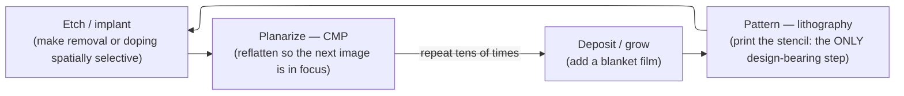

# Semiconductor Fabrication — Concept-First Deep Dive

> **Prerequisites:** [CMOS_Fundamentals](../00_Fundamentals/01_CMOS_Fundamentals.md) (the transistor this process builds and the electrostatics that drive its shape), plus first-year optics (diffraction) and probability (Poisson, Gaussian).
> **Hands off to:** [Physical_Verification_DRC_LVS](../06_Signoff/03_Physical_Verification_DRC_LVS.md) (the design rules this process dictates), [STA](../06_Signoff/01_STA.md) (where process variation becomes timing corners), [IC_Packaging](02_IC_Packaging.md) (what happens to the wafer after fab), [Tapeout_and_Post_Silicon_Bringup](03_Tapeout_and_Post_Silicon_Bringup.md) (mask, first silicon, and lab bring-up).

---

## 0. Why this page exists

A chip is not carved out of silicon; it is **printed onto it, one patterned layer at a time.** Almost every fact a designer must respect about a process — its feature size, its cadence, its cost, why every transistor is slightly different, why the design-rule deck looks the way it does — falls out of just **two hard problems**:

1. **Lithography** — printing ever-smaller features with light. Diffraction sets a hard floor on how small a feature you can image, and the whole apparatus of immersion, EUV, and multi-patterning exists to push that floor down. Litho is the *only* step that carries the design onto the wafer, so it dominates both cost and cadence.
2. **Yield** — doing the patterning loop billions of times per die without a single killer defect. This is pure statistics, and it dictates die size, cost per transistor, and why a new node costs billions and yields poorly at first.

This page derives the field from those two. We build the **layer-building loop** from first principles (§1), show why **lithography is the limiter** (§2) and what you do when one exposure is not enough (§3), then follow the two consequences: **variation** — why the process makes every device a *distribution* that STA must sign off at corners (§4) — and **yield** — the defect statistics that set die size and node economics (§5–6). Only then do we look at *how* the transistor (§7) and its wiring (§8) are actually built, kept deliberately concept-level, and close on how all of this reappears to the designer as a **rule deck** (§9). The goal is that you can reason about a process quantitatively — size a die from a yield model, explain why EUV displaced triple-patterning, predict where matching variation blows up — rather than recite a process recipe.

---

## 1. The core idea: a chip is printed layer by layer

Start from what a fab tool can physically *do*. Every tool acts on the **whole wafer at once** and offers only a few primitives:

- **Add** a uniform (blanket) layer — grow an oxide, deposit a metal or dielectric.
- **Remove** material — etch.
- **Change electrical type** locally — implant/dope.
- **Flatten** — polish.

Not one of these is spatially selective on its own. A blanket deposition coats everything; a blanket etch removes everything. The single primitive that carries *spatial information* — the design — onto the wafer is **lithography**, which transfers a 2-D image into a thin resist stencil. Every feature on the chip is therefore the **intersection of a blanket process and a printed mask**: you lay down a uniform layer, print a stencil on it, and use the stencil to make *one* otherwise-blanket primitive selective (etch through its openings, or implant through them), then strip the stencil and reflatten.

That is the whole process, as a loop:

Read each primitive as a *consequence* of building a 3-D structure with 2-D tools, not a menu item:

- **Deposition / growth** puts the material there in the first place — you cannot pattern what does not exist. (Thermal oxidation is the same idea run in reverse: it *consumes* silicon to grow SiO₂, and because oxidant must diffuse through the film already grown, thick-oxide growth is diffusion-limited and slows as $\sqrt{t}$ — the classic Deal–Grove kinetics. The lesson that matters here is that every film-forming step is physically rate-limited and self-terminating in some regime, which is what makes sub-nanometre thickness control possible.)
- **Lithography** is the only information-bearing step. Everything else is blanket. This is why litho, and litho alone, is the limiter of the whole field (§2).
- **Etch** makes *removal* selective through the resist. Its key property is **anisotropy** — vertical sidewalls — because a tight 2-D pattern must be transferred *downward* without smearing sideways. That single requirement is why directional plasma/RIE etching replaced isotropic wet etching for patterning: wet etch undercuts the mask and caps resolution near a micron.
- **Implant / dope** makes *electrical type* selective, painting the n- and p-regions that a transistor is made of. The dopants land electrically inert and lattice-damaging, so a fast anneal follows to activate them and repair the crystal — and the tension between activating dopants and *not letting them diffuse* is why anneals shrank from furnace-minutes to laser-milliseconds as junctions got shallower.
- **CMP (planarize)** exists because each patterned layer leaves topography, and the *next* litho step must image onto a flat surface or it will be out of focus (the depth-of-focus limit of §2). Chemical-mechanical polishing re-flattens the wafer between layers. Without it, you could not stack many patterned layers at all — planarization is the enabler of the whole multi-layer stack.

**FEOL and BEOL.** The loop runs 50–100 times and splits into two halves. **Front-end-of-line (FEOL)** builds the *transistors* in and on the silicon — isolation, wells, gate stack, source/drain (§7). **Back-end-of-line (BEOL)** stacks 10–20 layers of metal *wiring* on top to connect them (§8). A modern logic process is ~1000 individual steps and **60–100 mask layers**, and — the fact that ties everything together — **the number of masks is essentially the number of distinct patterned layers, which is essentially the cost.** Hold that: cost, cadence, and complexity all scale with how many times you go around this loop and how hard each patterning step is.

---

## 2. Lithography: the one hard problem the whole field orbits

Lithography is an **imaging** problem: project the mask pattern onto resist finely enough to resolve the target feature. Because it uses light, **diffraction** sets a hard floor on the smallest feature the projected image can resolve — and that floor governs the entire industry.

The floor is the **Rayleigh resolution limit**:

$$
CD \;=\; k_1\,\frac{\lambda}{NA}, \qquad\qquad DOF \;=\; k_2\,\frac{\lambda}{NA^{2}}
$$

where $CD$ = minimum printable critical dimension (half-pitch), $\lambda$ = exposure wavelength, $NA = n\sin\theta$ = numerical aperture of the projection optics ($n$ = refractive index of the medium, $\theta$ = max ray half-angle), $k_1$ = process factor (physical floor $0.25$ for a single exposure; $\sim0.28$–$0.4$ in practice), $k_2$ = a similar process factor for depth of focus, and $DOF$ = the vertical range over which the image stays in focus. There are exactly **three knobs**, each with a physical ceiling — and the history of lithography is the story of running each one into its ceiling:

- **Lower $\lambda$.** Shorter light prints finer. DUV marched 436 → 365 → 248 → **193 nm** (ArF) and then *stopped* — there is no practical transmissive lens material or bright source in the deep-vacuum-UV between 193 nm and the next usable line, **13.5 nm (EUV)**. EUV is a factor-of-14 jump, but 13.5 nm light is absorbed by *everything*, so it forces all-reflective optics, reflective masks, and a vacuum beam path — a wholesale tool change, not a knob turn (§3).
- **Raise $NA$.** Better lenses raise $\theta$; **immersion** raises $n$. Putting water ($n = 1.44$) between the final lens and the wafer lifts the effective $NA$ from ~0.93 to **1.35**, because $NA = n\sin\theta$ can now exceed 1. The ceiling: $NA < n$, and — critically — $DOF \propto 1/NA^2$ **collapses** as $NA$ rises. Every gain in resolution costs you focus budget, which is exactly why CMP planarization (§1) and wafer flatness become non-negotiable at high $NA$.
- **Lower $k_1$.** Toward the single-exposure floor of $0.25$. **Resolution-enhancement techniques (RET)** — optical proximity correction, phase-shift masks, source-mask optimization — reshape the mask and the illumination to pre-compensate for diffraction, clawing $k_1$ from ~0.4 down toward ~0.28. But $k_1 = 0.25$ is a wall no single exposure can pass: it corresponds to capturing just one diffracted order pair.

**Worked floor (193i).** ArF immersion at $NA = 1.35$: $CD = 0.28 \times 193 / 1.35 \approx 40$ nm half-pitch in production ($\approx 36$ nm at the $k_1 = 0.25$ limit). **EUV** at $\lambda = 13.5$ nm, $NA = 0.33$, $k_1 = 0.3$: $CD \approx 0.3 \times 13.5 / 0.33 \approx 12$ nm — a single EUV exposure resolves what took 193i several interleaved exposures.

**Why litho dominates cost and cadence.** It is the only step whose content *is* the design (the masks), so it is the only step that must be redone for every new chip — a per-design NRE. It is the slowest (a scanner does ~100–200 wafers/hour, and it is run 20–40 times per wafer, once per critical layer), so scanner throughput gates the fab's output. And it is by far the most expensive tool (an EUV scanner is ~150–200 M USD; High-NA ~350–400 M USD). Put together: **fab cadence is scanner cadence, and node cost is mostly lithography cost.** When the target $CD$ drops below what even $k_1 = 0.25$ can print at the available $\lambda$ and $NA$, a single exposure physically *cannot* do it — and the field splits into the two escapes of §3.

---

## 3. When one exposure is not enough: multi-patterning vs EUV

Once the required pitch falls below the 193i single-exposure floor (~40 nm half-pitch), there are only two ways forward, and the choice between them is *the* defining process trade-off of the last fifteen years. Both print a pitch the tool cannot resolve in one shot; they pay for it in opposite currencies.

**Multi-patterning — spend more exposures, keep the cheap tool.** Decompose one dense layer into two or four sparser patterns, each within the 193i limit, and interleave them on the wafer:

- **LELE** (litho-etch × 2): print half the lines, etch, print the other half offset between them. Doubles density. Its Achilles' heel is **overlay**: the second exposure must align to the first within a **~2–3 nm** budget, and any misalignment becomes pitch-walking and $CD$ variation that flows straight into device variation (§4). Assigning features to mask A or mask B is a graph **2-coloring** problem; layouts with odd-length conflict cycles are *uncolorable* and must be forbidden — a design-rule restriction (§9).
- **SADP / SAQP** (self-aligned double/quadruple patterning): deposit a conformal spacer on the sidewalls of a sacrificial "mandrel," then remove the mandrel — the *spacers* become the pattern at half (or, repeated, quarter) the mandrel pitch. This has **no overlay error** (spacers are self-aligned), which is why it is used for the tightest, most regular layers (fins, M1), but it can only make **1-D gratings**, forcing unidirectional, gridded routing.

The cost model is blunt: **N-patterning a layer costs roughly N× the mask + litho + etch of that layer**, plus tighter overlay control and restricted design rules, plus longer cycle time. At 10/7 nm some layers needed SAQP (4×) plus cut masks — the exposure count, and with it cost and defectivity, exploded.

**EUV — change the light, restore one mask per layer.** Dropping $\lambda$ to 13.5 nm collapses the Rayleigh limit (§2), so a *single* EUV exposure prints what took double or quadruple 193i patterning. That directly reverses the exposure-count explosion. What it costs instead:

- **Capital.** ~150–200 M USD per tool (ASML is the sole supplier), and a fab needs many.
- **Source power / throughput.** EUV is made by vaporizing tin droplets with a laser ~50,000 times a second; getting to ~250 W (≈ enough for ~100–150 wph) was the decade-long bottleneck.
- **Masks.** Reflective Mo/Si multilayer mirrors that must be defect-free — hard to make and inspect.
- **Stochastics.** At 13.5 nm each feature is exposed by comparatively *few* photons, so **shot noise** (Poisson fluctuation in photon count per feature) creates a new random-defect mode — stochastic missing/merged contacts — that feeds both variation (§4) and yield (§5).

**The crossover.** EUV wins a layer once the number of DUV exposures it replaces — times their mask, etch, and cycle-time cost — exceeds EUV's amortized per-wafer tool cost. That threshold sits around **"replaces triple-patterning or worse,"** which is exactly the observed adoption curve: 7 nm used EUV on only a handful of the tightest layers (TSMC N7+ ≈ 4–5 EUV layers), N5 expanded it (~14 layers), N3 further (~20+), each as more layers crossed the economic knee.

**High-NA EUV** ($NA = 0.55$, anamorphic optics, ~350–400 M USD) pushes single-exposure resolution to ~8 nm half-pitch, deferring the point at which even *EUV* needs multi-patterning at 2 nm / 1.4 nm. Its own trade: an even higher tool cost and a **halved field size** (429 vs 858 mm² reticle area), so large dies must be stitched from multiple exposures. Intel is first to deploy it (18A/14A, 2025–26); TSMC and Samsung follow at A16/A10.

**Masks vs cost, quantified.** Every added mask layer is ~1–2 M USD (an advanced-node reticle) *plus* its per-wafer litho/etch/cycle-time. A modern node is 60–100 masks and a full mask set runs **~15–25 M USD** — a per-design NRE that only high-volume parts can amortize (§6). This is the direct link between "how many times you go around the loop" and "what the chip costs."

| Approach | Tool cost | Per-layer process cost | Overlay / new failure mode | Where it wins |
|---|---|---|---|---|
| 193i single | low | 1× | none new | ≥ ~40 nm half-pitch |
| 193i LELE / LE³ | low | 2–3× masks+etch | tight overlay → CD variation | fill the gap 40→20 nm |
| 193i SADP / SAQP | low | 2–4× etch, 1-D only | none (self-aligned), but gridded rules | fins, M1, regular gratings |
| EUV (0.33 NA) | very high | 1× | stochastic shot-noise defects | replaces ≥ triple patterning |
| High-NA EUV (0.55) | extreme | 1×, half field | stitching for large dies | 2 nm and below |

---

## 4. Variation: why every printed device is a distribution

Two facts from the sections above guarantee that **no two transistors on a wafer are identical**: the image is diffraction-limited (so its edges are fuzzy and dose/focus-sensitive), and the device is built from a *countable* number of atoms (so discreteness shows up as noise). The process therefore does not produce a *value*; it produces a **distribution**, and the designer must sign off the whole distribution — which is precisely why STA characterizes libraries at **corners** with **on-chip-variation (OCV) derates** rather than at a single nominal delay ([STA](../06_Signoff/01_STA.md)).

**Where the spread comes from.** Group the sources by whether they are *systematic* (predictable from context) or *random* (irreducible):

- **Lithography and etch — mostly systematic, partly random.** Dose, focus, and overlay errors shift $CD$; **line-edge roughness (LER)** — and at EUV, photon shot noise — jitters feature edges. Much of this is *layout-dependent*: a line prints differently dense vs isolated, or in the vertical vs horizontal orientation. That systematic, context-dependent part is why DFM and litho-friendly rules exist (§9).
- **CMP — systematic, layout-dependent.** Soft copper polishes faster than the surrounding dielectric, so wide lines **dish** and dense arrays **erode**, leaving metal thickness (hence resistance) a function of local pattern density. This is the origin of density windows and dummy-fill rules (§9).
- **Random dopant fluctuation (RDF) — irreducibly random, and the deep one.** A transistor's threshold is set by the dopant charge in the channel depletion region — but that region now contains only *tens to a few hundred* discrete dopant atoms, and their number and placement are random.

**Pelgrom's law, derived.** Let $\bar N$ be the mean number of dopant atoms in the channel depletion volume, $\bar N \propto N_A\,W L\,W_{dep}$ (doping × gate area × depletion depth). Because the atoms are placed independently, their count is **Poisson**, so its standard deviation is

$$
\sigma_N \;=\; \sqrt{\bar N} \;\propto\; \sqrt{W L}.
$$

A fluctuation $\delta N$ in that charge shifts the threshold by $\Delta V_{th} \approx q\,\delta N /(C_{ox} W L)$, so the threshold's standard deviation is

$$
\sigma_{V_{th}} \;=\; \frac{q\,\sigma_N}{C_{ox}\,W L} \;\propto\; \frac{\sqrt{W L}}{W L} \;=\; \frac{1}{\sqrt{W L}} \qquad\Longrightarrow\qquad \boxed{\;\sigma_{V_{th}} \;=\; \frac{A_{VT}}{\sqrt{W L}}\;}
$$

where $A_{VT}$ = the Pelgrom matching coefficient (mV·µm, a per-process constant), $W,L$ = device width and length, $C_{ox}$ = gate-oxide capacitance per area, $q$ = electron charge. The consequence is sharp: **the smallest devices vary the most.** Minimum-size logic and, above all, the six-transistor **SRAM bitcell** sit at the tail of this distribution, which is why SRAM $V_{min}$ and matched analog pairs dominate the variation budget — and why FinFET and GAA channels are deliberately **undoped/lightly doped**, taking their electrostatic control from *geometry* instead of channel dopants to kill RDF at the source (§7, [CMOS_Fundamentals](../00_Fundamentals/01_CMOS_Fundamentals.md)).

**Variation over time (aging).** The device is also a distribution in *time*: **NBTI** drifts PMOS threshold as $\Delta V_{th} \propto t^{\,n}$ ($n \approx 0.16$–$0.25$), **HCI** degrades devices via hot carriers injected near the drain, and **TDDB** wears the gate dielectric toward breakdown (keeping the oxide field below ~3–4 MV/cm buys a 10-year life — a constraint that gets tighter every node and is a chief reason high-k dielectrics exist, §7). None of these is captured by a single delay number.

**Why this reappears in signoff.** Systematic spread (wafer/die gradients, layout context) is bounded by **process corners** (SS/TT/FF and their like); irreducible within-die random spread is bounded by **OCV/AOCV/POCV derates**; aging is bounded by a lifetime **guardband**. All three are how STA turns "the process makes a distribution" into a provable timing margin — the direct forward link to [STA](../06_Signoff/01_STA.md).

---

## 5. Yield: the statistics of building billions of things right

A processed wafer holds hundreds of dies, and a *single* killer defect anywhere in a die's critical area kills that die. Building billions of features per die makes the central question statistical: **what fraction of dies escape every killer defect?**

**The Poisson yield model, derived.** Model killer defects as scattered randomly and independently over the wafer with mean **defect density** $D_0$ (defects/cm²). A die of critical area $A$ then catches a number of killer defects $k$ that is **Poisson** with mean $\lambda = A D_0$. The die is good iff it catches *none*:

$$
Y \;=\; P(k = 0) \;=\; e^{-\lambda} \;=\; \boxed{\,e^{-A D_0}\,}
$$

where $Y$ = fraction of good dies, $A$ = die critical area (cm²), $D_0$ = defect density (cm⁻²). This is the whole idea in one line: **yield decays exponentially in area.**

**The clustering refinement.** Real defects are *not* independent — particles arrive in showers, and edge and process effects concentrate them — so the true die-to-die variation is larger than Poisson, and Poisson *under*-predicts yield for large $A D_0$. Model the *local* defect density as itself a random variable (Gamma-distributed) and average the Poisson yield over it; the mixture is a **negative binomial**:

$$
Y \;=\; \left(1 + \frac{A D_0}{\alpha}\right)^{-\alpha}
$$

where $\alpha$ = the **clustering parameter** ($\alpha \to \infty$ recovers the Poisson $e^{-AD_0}$; small $\alpha$ = heavy clustering = *higher* yield than Poisson predicts, because defects bunch onto fewer dies). Total die yield further factors as $Y = Y_0 \cdot Y_{\text{random}}$, separating a **systematic** gross yield $Y_0$ (design- and process-limited, e.g. a whole-wafer edge ring) from the random-defect term above.

**The big-die penalty, quantified.** Because $Y$ falls exponentially in $A$, die area is the single most powerful yield lever:

| Die | $A$ | $Y$ at $D_0=0.1$ (mature) | $Y$ at $D_0=0.5$ (immature) |
|---|---|---|---|
| Mobile SoC / small block | 0.5 cm² | 95% | 78% |
| Desktop CPU | 1.0 cm² | 90% | 61% |
| Large GPU / accelerator | 6.0 cm² | 55% | 5% |

Two conclusions fall straight out. **New processes ship small dies first** — SRAM test chips and mobile SoCs — because at the high $D_0$ of an immature process only a small $A$ yields at all. And **huge designs must be partitioned into chiplets**: cutting one 6 cm² die into six 1 cm² dies moves each from the exponential's tail back to its head, turning a 55% monolithic yield into ~90% per tile (the direct economic engine behind [IC_Packaging](02_IC_Packaging.md)).

**The learning curve.** $D_0$ is not fixed — it falls roughly exponentially as engineers hunt down defect sources, so yield climbs over a node's first 1–2 years. That time-dependence is the hinge of the whole business (§6): entering a node early means living on the steep, low-yield part of the curve.

---

## 6. The economic engine: why a node costs billions

Yield and die size combine into cost. Start with how many dies a wafer even holds — the gross count, area divided by die area minus an edge-loss term for the round wafer:

$$
N_{gross} \;\approx\; \frac{\pi (D/2)^2}{A} \;-\; \frac{\pi D}{\sqrt{2A}}
$$

where $D$ = wafer diameter (300 mm mainstream), $A$ = die area. Good dies are $N_{gross}\,Y$, so the cost of a *working* die is

$$
C_{die} \;=\; \frac{C_{wafer}}{N_{gross}\,Y} \;+\; \frac{C_{mask}}{V}
$$

where $C_{wafer}$ = processed-wafer cost (~15–17 k USD at 5 nm), $C_{mask}$ = mask-set NRE (~15–25 M USD, §3), and $V$ = the volume it is amortized over. Since good dies per wafer scale as $\tfrac{1}{A}e^{-A D_0}$, **cost per good die rises super-linearly with area** — the die-size vs yield vs cost trade compressed into one expression, and a second, quantitative argument for chiplets and for staying inside the reticle limit.

**Why a node costs billions.** Each node roughly doubles transistor density, but buying that density now requires new lithography (EUV/High-NA at 150–400 M USD per tool, dozens per fab), new materials and structures (high-k, FinFET→GAA, §7), and a fresh 60–100-mask process — a total R&D + fab bill of **~15–20 B USD** for a leading node. Historically the payoff was **cost per transistor falling every node**: density doubled faster than wafer cost rose (Moore's *economic* law, the real one). At advanced nodes, multi-patterning and EUV have made wafer cost climb so fast that **cost per transistor has flattened, and for some designs risen** — which is precisely why the industry now pursues density through *packaging* (chiplets, 3D) and *design-technology co-optimization* rather than lithography alone.

**Maturity vs time-to-market.** The $D_0$ learning curve (§5) makes node entry a business knee, not a technical one:

- **Enter early:** first-mover product advantage, but low yield (high $D_0$), high cost per die, and immature design rules. Only high-margin, leadership parts — flagship mobile SoCs, GPUs, CPUs — can absorb that early-yield tax.
- **Wait for maturity:** better yield and cost, stable rules, but a lost market window. Cost-sensitive and long-lived parts (microcontrollers, automotive, analog) rationally sit on older, fully-depreciated nodes where cost per *good* die is lowest.

There is no globally right answer; the right node is the one where your margin can pay for your position on the learning curve.

---

## 7. Building the transistor (FEOL): planar → FinFET → GAA → CFET

The device physics — why a shorter channel leaks, what DIBL and subthreshold slope are — lives in [CMOS_Fundamentals](../00_Fundamentals/01_CMOS_Fundamentals.md). Here the concept is narrower and it explains the *process*: **every structural change to the transistor is the same fight — keeping the gate in electrostatic control of an ever-shorter channel — and each answer buys control and density at a steep, super-linear jump in process complexity.** That complexity is a chief driver of the node cost of §6.

- **Planar + high-k/metal gate (HKMG, ~45 nm).** As the channel shrank, the SiO₂ gate thinned to ~1 nm and electrons **tunneled** through it. The fix is a physically *thicker* **high-k** dielectric (HfO₂, $k\approx 20$) that gives the same capacitance — the same electrical control — at far less tunneling, plus a **metal gate** to remove poly-depletion. Because high-k cannot survive the ~1050 °C source/drain anneal, it is built **gate-last (replacement metal gate)**: a dummy poly gate takes the heat, is then carved out, and the real high-k/metal stack is inlaid — extra dummy-gate, CMP, and refill steps bought purely to protect the dielectric.
- **FinFET (~22 nm).** Stand the channel up as a thin **fin** and wrap the gate over three sides. Three-sided control drastically cuts short-channel leakage at a given $L$, and because the fin is thin and **undoped**, it also **kills RDF** (§4) — geometry replaces channel doping as the control mechanism. Process cost: fins need SADP/SAQP patterning (§3), high-aspect-ratio etch, conformal (ALD) gate wrap, and epitaxially grown, strained source/drain (SiGe for PMOS, Si:P for NMOS) for mobility. A large complexity step.
- **GAA nanosheet (3 / 2 nm).** Wrap the gate on **all four** sides of stacked horizontal sheets — the electrostatic endgame. Unlike a fin (whose width is quantized by fin count), a nanosheet's width is set by lithography, so drive strength is *tunable per cell*. Process cost is another jump: grow a Si/SiGe superlattice, then **selectively etch the SiGe away to release suspended Si channels** (needing SiGe:Si etch selectivity > 100:1), and form inner spacers to cut gate-to-S/D capacitance — all for roughly a **15–30% power/performance** gain over FinFET (Samsung 3 nm MBCFET in production 2022; TSMC N2 and Intel 18A RibbonFET 2025).
- **CFET (beyond 2 nm).** **Stack** an NMOS and a PMOS device vertically to roughly **halve** the cell footprint. The payoff is density; the cost is a thermal-budget and 3-D-alignment nightmare (two device types, different optimal temperatures, stacked and interconnected). Research-stage, ~2030+.

The single sentence to keep: **each generation trades a super-linear rise in mask count, new materials, and new etch chemistry for better electrostatic control and density** — which is why nodes cost more (§6) and why the industry simultaneously turned to backside power and packaging to keep scaling *system* density when transistor scaling got this expensive.

---

## 8. Wiring the transistors (BEOL): when interconnect becomes the limiter

A transistor computes nothing until it is wired to others, and a modern chip needs **10–20 layers of copper** to connect billions of them. Wiring is its own scaling problem, and at advanced nodes it is the one that bites: **interconnect RC delay, not gate delay, increasingly limits performance.**

The reason is a scaling asymmetry. Gate delay falls as the transistor shrinks, but a wire's resistance *rises* as it gets thinner ($R \propto 1/\text{cross-section}$) while its capacitance to ever-closer neighbors stays high, so wire delay $\propto RC$ grows exactly where gate delay shrinks. The BEOL exists to fight both terms:

- **Copper, and why it forces a different loop.** Cu has lower resistivity than Al and ~100× better electromigration resistance — but Cu **cannot be plasma-etched** into lines. So BEOL inverts the FEOL loop into **damascene**: etch trenches (and vias) *into the dielectric*, then fill them with Cu by bottom-up **electroplating**, then CMP the excess flush. "Dual damascene" forms via and trench in one fill. This is why the wiring loop looks different from the transistor loop — it is inlay, not subtractive etch.
- **Low-k dielectric, to cut $C$.** Replace SiO₂ ($k = 3.9$) with carbon-doped, then *porous*, SiCOH ($k \approx 2.2$–3.0). The trade is mechanical: lower-$k$ films are more porous, hence weaker and more vulnerable to CMP and etch damage and moisture — a reliability cost paid for lower delay, crosstalk, and power.
- **A pitch hierarchy.** Local layers run at minimum pitch (multi-patterned or EUV, §3) for density; global layers are thick and wide for low resistance to carry power and clock. Roughly 12–15 layers at 7 nm, pitch doubling every few layers.
- **Electromigration sets a hard current-density rule.** Current-carrying electrons transfer momentum to metal atoms, voiding wires open over time — **Black's equation** $\mathrm{MTTF} = A_{EM}\,J^{-n}\exp(E_a/kT)$ (with current density $J$, $n\approx 1$–2, $E_a \approx 0.5$–0.7 eV for Cu) — so the router must keep $J$ below ~1–3 mA/µm for a 10-year life. That is a design rule the process hands up to physical design and EM signoff.
- **Backside power (2 nm).** Move the VDD/VSS grid to the *back* of the thinned wafer (Intel PowerVia, TSMC's super-power-rail), freeing frontside metal for signals and cutting IR drop — a structural change to where the BEOL even lives.

---

## 9. Where the process becomes design rules

Everything above — the Rayleigh limit, multi-patterning coloring, overlay budget, CMP density sensitivity, RDF matching, via defectivity, EM current limits — is invisible to a chip designer *except* through one artifact: the **rule deck**. A design rule is a **physical limit of the process encoded as a geometric constraint the layout must obey.** That encoding is the entire interface between this page and signoff: [DRC](../06_Signoff/03_Physical_Verification_DRC_LVS.md) checks that the layout satisfies the rules (a chip that violates them will not print or will not survive), and the variation the rules cannot remove flows onward to [STA](../06_Signoff/01_STA.md) as corners and derates.

Read every rule as the fingerprint of a physics from the sections above:

| Design rule | Physical origin |
|---|---|
| min width / space / pitch | Rayleigh resolution + multi-patterning floor (§2–3) |
| mask-coloring / conflict rules | LELE two-color decomposition; odd cycles unroutable (§3) |
| unidirectional, gridded routing on tight layers | SADP/SAQP can only make 1-D gratings (§3) |
| density windows + dummy fill + wide-metal slotting | CMP dishing and erosion (§4) |
| redundant (double) vias, min-area | defect yield — single-via fail rate (§5) |
| current-density / EM rules | Black's equation, 10-year MTTF (§8) |
| antenna rules | plasma-etch charge accumulation damaging thin gates |

**DFM** (design for manufacturability) is the layer *above* minimum DRC: *recommended* rules that trade a little area for yield and variation robustness — prefer wider metals, add redundant vias, keep pattern density uniform. Minimum-rule-legal is merely *printable*; DFM-clean is *economically* printable at volume. The through-line of the whole page: the process's two hard problems, lithography and yield, are ultimately delivered to the designer as this deck — obey it (DRC), and sign off the residual variation it leaves behind (STA).

---

## Numbers to memorize

| Parameter | Value | Why it matters (section) |
|---|---|---|
| Rayleigh limit | $CD = k_1\lambda/NA$ | the master equation of lithography (§2) |
| $k_1$ single-exposure floor | 0.25 (practical ~0.28–0.4) | the wall RET and multi-patterning fight (§2–3) |
| DUV wavelength (ArF immersion) | 193 nm | DUV endpoint; needs immersion + multi-patterning (§2) |
| NA (ArF immersion / EUV / High-NA) | 1.35 / 0.33 / 0.55 | the second Rayleigh knob and its ceilings (§2–3) |
| EUV wavelength | 13.5 nm | 14× jump; all-reflective, vacuum (§3) |
| EUV single-exposure resolution | ~12–13 nm HP | replaces triple+ patterning (§3) |
| Reticle area (std EUV / High-NA) | 858 / 429 mm² | High-NA halves the field → stitching (§3) |
| Masks per advanced node | 60–100 | ≈ patterned layers ≈ cost (§1, §3) |
| Mask set cost (5 nm) | ~15–25 M USD | per-design NRE, needs volume (§3, §6) |
| EUV / High-NA tool cost | ~150–200 / ~350–400 M USD | why litho dominates capex (§2–3) |
| Processed 300 mm wafer (5 nm) | ~15–17 k USD | numerator of cost/die (§6) |
| Poisson yield | $Y = e^{-A D_0}$ | exponential in die area (§5) |
| Negative-binomial yield | $Y = (1 + A D_0/\alpha)^{-\alpha}$ | clustering refinement (§5) |
| Defect density $D_0$ (mature / new) | ~0.05–0.1 / ~0.5–2.0 cm⁻² | drives the yield learning curve (§5–6) |
| Pelgrom matching | $\sigma_{V_{th}} = A_{VT}/\sqrt{WL}$ | small devices vary most → SRAM $V_{min}$ (§4) |
| Gate-oxide field limit (TDDB, 10 yr) | ~3–4 MV/cm | why high-k exists (§4, §7) |
| EM current limit (Cu, 10 yr) | ~1–3 mA/µm | a routing design rule (§8) |
| SiO₂ / HfO₂ / low-k SiCOH $k$ | 3.9 / ~20 / ~2.2–3.0 | high-k gate, low-k wiring (§7–8) |
| Metal layers at 7 nm | 12–15 | BEOL wiring stack (§8) |
| GAA vs FinFET gain | ~15–30% power/perf | the payoff for the complexity jump (§7) |

---

## Cross-references

- **Down the stack (what this process builds and the physics under it):** [CMOS_Fundamentals](../00_Fundamentals/01_CMOS_Fundamentals.md) — the transistor electrostatics (DIBL, subthreshold slope, tunneling) that *drive* the planar → FinFET → GAA → CFET progression of §7 and the high-k/EOT argument of §4/§7.
- **Up the stack (what consumes this process):** [Physical_Verification_DRC_LVS](../06_Signoff/03_Physical_Verification_DRC_LVS.md) — the rule deck of §9 is what DRC checks; [STA](../06_Signoff/01_STA.md) — the variation of §4 becomes timing corners, OCV derates, and aging guardband.
- **Forward in the flow (after the wafer):** [IC_Packaging](02_IC_Packaging.md) — dicing, bumping, and the chiplet partitioning that the die-size/yield economics of §5–6 force; [Tapeout_and_Post_Silicon_Bringup](03_Tapeout_and_Post_Silicon_Bringup.md) — GDSII hand-off, mask making, first silicon, and the yield/defect learning curve of §5 observed in the lab.

---

## References

1. Plummer, J.D., Deal, M.D., and Griffin, P.B., *Silicon VLSI Technology: Fundamentals, Practice and Modeling*, Prentice Hall, 2000. Oxidation kinetics, implantation, diffusion, and the process loop of §1.
2. Mack, C.A., *Fundamental Principles of Optical Lithography*, Wiley, 2007. The Rayleigh limit, RET, and process windows of §2.
3. Wong, B. et al., *Nano-CMOS Design for Manufacturability*, Wiley, 2008. Variation, DFM, and the rule origins of §4 and §9.
4. Pelgrom, M.J.M., Duinmaijer, A.C.J., and Welbers, A.P.G., "Matching Properties of MOS Transistors," *IEEE JSSC*, 24(5), 1989. The $1/\sqrt{WL}$ matching law of §4.
5. Stapper, C.H., "Modeling of Integrated Circuit Defect Sensitivities," *IBM J. Res. Dev.*, 27(6), 1983. Negative-binomial (clustered) yield of §5.
6. Cutress, I. and industry disclosures (TSMC, Intel, Samsung, ASML) at IEDM / ISSCC / VLSI Symposium, 2019–2025. EUV adoption, High-NA, GAA/RibbonFET, and backside power of §3, §7, §8.
7. IEEE, *International Roadmap for Devices and Systems (IRDS)*, 2023 edition. Node-scaling, interconnect, and lithography roadmaps underlying §6–8.
