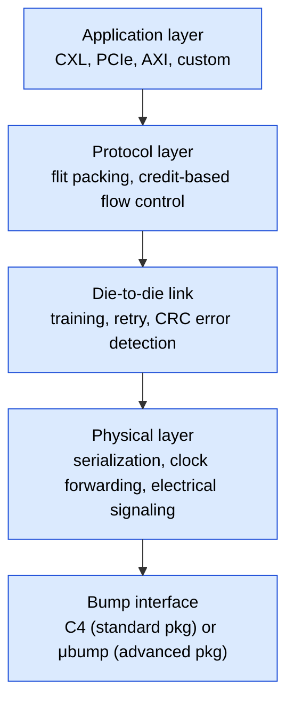

# IC Packaging and Advanced Packaging — Senior Engineer Deep Dive

## Table of Contents
1. Packaging Fundamentals
2. Wire Bonding
3. Flip Chip
4. Wafer-Level Packaging
5. 2.5D Integration (Interposer)
6. 3D IC Stacking
7. Chiplet Architecture
8. HBM (High Bandwidth Memory)
9. Die-to-Die Interfaces (UCIe, BoW)
10. Thermal and Power Delivery Challenges
11. Assembly Flow
12. Reliability Testing
13. Warpage
14. Numbers to Memorize

---

## 1. Packaging Fundamentals

### 1.1 Why Packaging Matters

```ascii-graph
The chip (die) is a fragile piece of silicon (~0.1-0.8mm thick).
Packaging provides:
  1. Mechanical protection (encapsulation)
  2. Electrical connections (die → PCB)
  3. Heat dissipation path (die → heat sink)
  4. Signal integrity (controlled impedance, low inductance)
  5. Power delivery (low-resistance supply connections)
  6. Standardized form factor (BGA, QFP, etc.)
```

### 1.2 Package Types

```text
Through-hole (legacy):
  DIP (Dual In-line Package): Through-hole pins
  PGA (Pin Grid Array): 2D array of pins on bottom

Surface mount:
  QFP (Quad Flat Package): Leads on four sides, fine pitch ~0.5mm
  BGA (Ball Grid Array): Solder balls on bottom in 2D array
    - Pitch: 0.4-1.27mm
    - More I/O than QFP for same footprint
    - Better thermal/electrical performance

Advanced:
  FCBGA (Flip Chip BGA): Die face-down on substrate, BGA to PCB
  PoP (Package on Package): Stack packages vertically (mobile)
  WLCSP (Wafer-Level CSP): Package = die size, solder bumps directly on die
  SiP (System in Package): Multiple dies in one package
  CoWoS, InFO, EMIB: Advanced multi-die packaging (see sections below)
```

### 1.3 Package Substrate

```ascii-graph
Package substrate: Multi-layer PCB between die and solder balls

  Die bumps → RDL → package substrate → BGA balls → PCB

  Substrate layers: 4-20 layers (advanced packages)
  Core: organic (most common) or coreless (thinner, better SI)
  
  Routing:
    L/S = 8/8 μm (advanced organic substrate, 2024)
    L/S = 2/2 μm (silicon interposer RDL)
  
  Via types:
    Through-via: connects all layers (legacy)
    Micro-via: blind/buried vias, laser-drilled (~25-50 μm diameter)
    Via-in-pad: via directly under bump → higher density
```

---

## 2. Wire Bonding

### 2.1 Process

```ascii-graph
Wire bonding: Thin metal wire connects die pad to package lead frame

  Die pad (Al or Cu) → Gold or Cu wire (20-25 μm Ø) → Lead frame

  Bond types:
    Ball bond: Formed at die pad (first bond)
      - Wire tip melted into ball by electric flame-off (EFO)
      - Ball pressed onto pad with heat + ultrasonic energy
    
    Stitch bond (wedge bond): Formed at lead frame (second bond)
      - Wire pressed and welded to lead frame

  Process: Ball-stitch bonding (most common)
    1. EFO forms ball at wire tip
    2. Capillary presses ball onto die pad (thermosonic: heat + US + force)
    3. Capillary lifts, pays out wire in loop
    4. Capillary presses wire onto lead frame (stitch bond)
    5. Wire clamped and broken
    6. Repeat for next pad
```

### 2.2 Wire Bond Characteristics

**Materials:**
   - Gold wire:   Best bondability, most expensive, ~25μm Ø
   - Copper wire:  95% cheaper than Au, harder to bond, requires forming gas
   - Aluminum wire: Wedge bonding only, for power devices

**Performance:**
   - Wire length:   1-5 mm typical
   - Inductance:    ~1 nH/mm → significant at GHz frequencies!
   - Resistance:    ~40-100 mΩ per wire
   - Current:       ~100-300 mA per wire
   - Frequency:     Limited to ~500 MHz-1 GHz (inductance bottleneck)

**Limitations:**
   - Peripheral I/O only (pads at die edge)
   - High inductance → poor SI (signal integrity) for high-speed signals
   - Limited I/O count (perimeter-limited)
   - Sequential process → slow for high pin-count

Still used for: Low-cost packages, power devices, memory (HBM is exception)

---

## 3. Flip Chip

### 3.1 C4 (Controlled Collapse Chip Connection)

```ascii-graph
Flip chip: Die flipped face-down, solder bumps connect directly to substrate

  Traditional C4 bumps:
    Material:  SnPb or Pb-free (SnAg, SnAgCu)
    Diameter:  80-100 μm
    Pitch:     150-200 μm
    I/O count: ~3,000-10,000 (area array)

  Process:
    1. Under-Bump Metallurgy (UBM) deposited on die pads
    2. Solder bumps formed (evaporation, electroplating, or stencil)
    3. Die flipped and aligned to substrate
    4. Reflow solder (peak ~250°C)
    5. Underfill (epoxy) injected between die and substrate
       - Distributes thermal stress → prevents bump fatigue

Advantages over wire bond:
  - Area array I/O (not just periphery) → much higher I/O count
  - Lower inductance (~0.1 nH per bump vs ~1 nH per wire)
  - Better thermal path (die face-down → heat conducts through bumps + substrate)
  - Higher frequency operation (lower parasitic L and R)
  - Shorter connections → less delay
```

### 3.2 Micro-Bumps

```text
Micro-bumps (μbumps): For 2.5D/3D integration

  Diameter:  20-40 μm (vs C4: 80-100 μm)
  Pitch:     40-55 μm (vs C4: 150-200 μm)
  Material:  SnAg cap on Cu pillar
  I/O count: 10,000-100,000+

  Used for:
    Die-to-interposer (2.5D: CoWoS)
    Die-to-die (3D stacking)
    HBM-to-interposer

  Process:
    1. Cu pillar electroplated on die pad (~30-50 μm tall)
    2. SnAg solder cap on top (~10 μm)
    3. Bonding: thermocompression (TC) or mass reflow
    4. Underfill (capillary or pre-applied)

  Challenge: At < 40μm pitch, bridging risk increases
             Need very accurate alignment (±1-2 μm)
```

### 3.3 Copper Pillar Bumps

```ascii-graph
Cu pillar: Replaces traditional solder bump at fine pitch

  Structure: Cu pillar (tall, narrow) + thin solder cap

    ┌──────────┐
    │  Solder  │  ~10μm
    ├──────────┤
    │          │
    │ Cu pillar│  ~30-50μm
    │          │
    ├──────────┤
    │   UBM    │
    └──────────┘
       Die pad

  Advantages:
    - Cu has higher melting point → better EM resistance
    - Finer pitch possible (Cu doesn't spread like solder)
    - Better current handling
    - More compliant (taller pillar absorbs stress)

  Used: Standard for flip chip at 28nm and below
```

---

## 4. Wafer-Level Packaging

### 4.1 Fan-In WLP (WLCSP)

```ascii-graph
Fan-in: Package size = die size (or very close)

  Die with redistribution layer (RDL):
    RDL reroutes die pads from periphery to area array

  Solder balls placed directly on RDL → ready for PCB mounting

  ┌─────────────────────────────┐
  │         Die                 │
  │  ┌───┐  ┌───┐  ┌───┐      │
  │  │pad│→→│RDL│→→│ ● │ball  │
  │  └───┘  └───┘  └───┘      │
  └─────────────────────────────┘

  Advantages: Smallest form factor, lowest cost for small dies
  Limitation: I/O limited by die area (can't exceed die perimeter pitch)
  Used: Baseband, PMIC, RF front-end (mobile)
```

### 4.2 Fan-Out WLP (FOWLP)

```ascii-graph
Fan-out: Package larger than die → more I/O possible

  Process (eWLB):
    1. Known-good dies placed on carrier face-down
    2. Molding compound fills gaps between dies
    3. RDL fabricated on molded surface → extends beyond die boundary
    4. Solder balls placed on RDL (area array larger than die)

  Advantages:
    - More I/O than fan-in (extends beyond die edge)
    - No package substrate needed → thinner
    - Good thermal and electrical performance
    - Can integrate passives (inductors, caps) in RDL

  TSMC InFO (Integrated Fan-Out):
    - Used in Apple A-series (starting A10)
    - InFO-WLP: single die fan-out
    - InFO-PoP: fan-out with package-on-package (DRAM on top)
    - InFO-L (large): multi-die fan-out (emerging for chiplets)
```

---

## 5. 2.5D Integration (Interposer)

### 5.1 Silicon Interposer

```ascii-graph
2.5D: Multiple dies mounted side-by-side on a silicon interposer

                    ┌──────┐  ┌──────┐  ┌──────┐
                    │ Die A│  │ Die B│  │ HBM  │
                    └──┬───┘  └──┬───┘  └──┬───┘
                       │μbumps  │         │
  ═══════════════════╤═╧═══════╧═════════╧══════╤════
  │              Silicon Interposer              │
  │     RDL (fine-pitch wiring between dies)     │
  │              TSVs (through interposer)       │
  ═══════════════════╧══════════════════════════╧════
                       │C4 bumps
                  ┌────┴──────────────┐
                  │  Package Substrate │
                  └────┬──────────────┘
                       │BGA balls
                     PCB
```

```text
Key features:
  RDL pitch:       0.4-2 μm L/S (much finer than organic substrate)
  TSV diameter:    5-10 μm
  TSV pitch:       40-50 μm
  Inter-die wiring: 10,000+ connections between adjacent dies
  Bandwidth:       Several TB/s between dies

TSMC CoWoS (Chip-on-Wafer-on-Substrate):
  - First: Xilinx Virtex-7 2000T (2011)
  - Used: NVIDIA H100/B100 (GPU + HBM), AMD MI300X
  - Interposer size: up to 2-3× reticle limit (CoWoS-L uses RDL bridge)

  CoWoS variants:
    CoWoS-S: Standard silicon interposer (≤ 1 reticle)
    CoWoS-R: RDL-only interposer (organic, no TSV)
    CoWoS-L: Large interposer (2+ reticles, uses local Si bridges)
```

### 5.2 Through-Silicon Via (TSV)

```ascii-graph
TSV: Vertical electrical connection through a silicon wafer/die

  Fabrication:
    1. Deep Reactive Ion Etch (DRIE) → high-aspect-ratio hole
    2. Insulating liner (SiO2, ~100nm) → prevents Cu-Si contact
    3. Barrier/seed layer (TaN/Cu by PVD)
    4. Cu fill by electroplating (ECD)
    5. CMP to planarize

  TSV types by insertion point:
    Via-first:  TSV formed before FEOL (transistors)
    Via-middle: TSV formed between FEOL and BEOL (most common for interposers)
    Via-last:   TSV formed after BEOL (allows standard wafer processing)

  TSV dimensions:
    Interposer TSV: diameter 5-10 μm, depth 50-100 μm
    3D IC TSV:      diameter 1-5 μm, depth 5-50 μm
    Aspect ratio:   typically 5:1 to 20:1

  Electrical properties:
    Resistance:   ~10-50 mΩ per TSV
    Capacitance:  ~10-50 fF per TSV
    Inductance:   ~10-50 pH per TSV
    Far superior to wire bonds (R: ~100 mΩ, L: ~1 nH)

  TSV challenges:
    - Keep-out zone: No active devices near TSV (stress, Cu contamination)
    - Thermo-mechanical stress: Cu and Si have different CTE
      Cu: 17 ppm/°C, Si: 2.6 ppm/°C → stress during thermal cycling
    - Wafer thinning required for via-last (200-50 μm)
    - Cost: Si interposer adds $100-500+ per unit
```

### 5.3 Organic Interposer and Bridge

```ascii-graph
Alternatives to expensive silicon interposer:

Intel EMIB (Embedded Multi-die Interconnect Bridge):
  - Small silicon bridge embedded in organic substrate
  - Only where die-to-die connection is needed (not full interposer)
  - Bridge: ~4-8mm × 4-8mm, provides fine-pitch routing
  - Rest of substrate is standard organic (cheap)
  - Used in: Intel Ponte Vecchio, Sapphire Rapids

  ┌──────┐    ┌──────┐
  │ Die A│    │ Die B│
  └──┬───┘    └──┬───┘
     │            │
  ═══╧════════════╧═══════════  Organic substrate
       ┌──────────┐
       │  Si EMIB │              Embedded bridge
       │  bridge  │              (fine-pitch routing)
       └──────────┘
  ═══════════════════════════
         BGA balls

Advantages: Lower cost than full Si interposer
Disadvantages: Limited bridge area, fewer die-to-die connections
```

---

## 6. 3D IC Stacking

### 6.1 Die-to-Die Stacking

```ascii-graph
3D IC: Dies stacked vertically, connected by TSVs or hybrid bonding

  ┌──────────────┐
  │   Top Die    │  (e.g., SRAM cache, memory)
  │    TSVs ↕↕↕  │
  └──────┬───────┘
  ┌──────┴───────┐
  │  Bottom Die  │  (e.g., logic, processor)
  │              │
  └──────┬───────┘
         │μbumps
    ═════╧═══════  Package substrate

Benefits:
  - Shortest connections between dies → lowest power, highest bandwidth
  - Heterogeneous integration (logic + memory, analog + digital)
  - Smaller footprint than side-by-side
  - Memory-on-logic: processor accesses wide memory bus (1024+ bits)

Challenges:
  - Thermal: Top die has poor heat path (through bottom die)
  - Known-Good-Die (KGD): Must test each die before stacking
  - Yield: If any die in stack is bad → entire stack is wasted
  - Design complexity: Thermal, power delivery, signal integrity in 3D
```

### 6.2 Hybrid Bonding

```ascii-graph
Hybrid bonding: Cu-Cu direct bonding (no solder, no bumps)

  Process:
    1. CMP die surface (Cu pads + dielectric perfectly flat)
    2. Align and bond at room temperature (dielectric-dielectric bond)
    3. Anneal at 200-300°C → Cu pads expand and fuse (Cu-Cu bond)

  Pitch: 1-10 μm (vs μbumps: 40-55 μm) → 100× more connections!
  Density: > 1 million bonds per mm²

  Revolutionary because:
    - Eliminates solder bumps → much finer pitch possible
    - Lower resistance (Cu-Cu vs Cu-SnAg-Cu)
    - Higher bandwidth per mm² of interface

  Used in:
    - AMD V-Cache (3D stacked SRAM on top of CCD)
    - Image sensors (Sony: pixel + logic stacking)
    - Future: logic-on-logic stacking for chiplets

  Variants:
    Wafer-to-Wafer (W2W): Both wafers bonded, then diced
      - Highest alignment accuracy (< 200nm)
      - Both wafers must have same size dies (wasteful)
    
    Die-to-Wafer (D2W): Tested dies bonded to wafer
      - Allows mixed die sizes
      - KGD selection improves effective yield
      - Alignment slightly worse (~1 μm)
```

---

## 7. Chiplet Architecture

### 7.1 Why Chiplets

```ascii-graph
Monolithic large die problems:
  1. Yield: Y = exp(-D*A) → large die = low yield = expensive
  2. Design cost: Full-chip reticle ~$100M+ at 3nm
  3. Reticle limit: Maximum die size ~800mm² (limited by lithography field)
  4. Inflexibility: Can't mix process nodes (logic: 3nm, I/O: 7nm, analog: 28nm)

Chiplet solution:
  Break SoC into smaller dies ("chiplets"), each optimized separately,
  then connect them in an advanced package.

  Benefits:
    - Higher effective yield (small dies yield better)
    - Mix process nodes (logic on 3nm, SerDes on 5nm, HBM on DRAM process)
    - Design reuse (same I/O chiplet across product family)
    - Modular scaling (more compute chiplets = more performance)
    - Smaller NRE per chiplet

  Examples:
    AMD EPYC (Zen): 8 CCD chiplets (5nm) + 1 IOD (6nm)
    Intel Ponte Vecchio: 47 tiles across 5 process nodes
    Apple M1 Ultra: 2 × M1 Max connected via UltraFusion
```

### 7.2 Chiplet Interconnect Standards

```ascii-graph
UCIe (Universal Chiplet Interconnect Express):
  - Open standard (1.0: March 2022, 1.1: August 2023, 2.0: 2025)
  - Defines physical layer, die-to-die link layer, protocol layer
  
  UCIe Standard Package (organic substrate):
    Bump pitch: 100-130 μm
    Data rate:  4-32 GT/s per lane
    Bandwidth:  28-224 Gbps per mm of die edge
    Latency:    ~2-5 ns (link layer)

  UCIe Advanced Package (silicon bridge/interposer):
    Bump pitch: 25-55 μm
    Data rate:  4-32 GT/s per lane
    Bandwidth:  165-1317 Gbps per mm of die edge
    Latency:    ~2 ns

  Protocol adapters: CXL, PCIe, AXI → protocol-agnostic transport

BoW (Bunch of Wires):
  - Simpler: parallel bus, no encoding/decoding
  - Lower latency (~1 ns)
  - Higher bandwidth density but shorter reach
  - Used for memory-to-logic interfaces

Comparison:
  | Feature       | UCIe     | BoW      | HBM PHY   |
  |---------------|----------|----------|-----------|
  | Standardized  | Yes      | Limited  | JEDEC     |
  | Latency       | 2-5 ns   | ~1 ns    | ~5-10 ns  |
  | BW density    | High     | Highest  | High      |
  | Reach         | 5-25 mm  | < 5 mm   | < 5 mm    |
  | Protocol      | Any      | Raw      | Memory    |
```

---

## 8. HBM (High Bandwidth Memory)

### 8.1 HBM Architecture

```ascii-graph
HBM: DRAM dies stacked on top of each other, connected via TSVs

  Stack:
    ┌──────────────┐
    │   DRAM die 7 │  (HBM3: 8-12 dies)
    │   TSVs ↕↕↕   │
    ├──────────────┤
    │   DRAM die 6 │
    │   TSVs ↕↕↕   │
    ├──────────────┤
    │     ...      │
    ├──────────────┤
    │   DRAM die 0 │
    │   TSVs ↕↕↕   │
    ├──────────────┤
    │  Base Logic  │  (test, repair, interface logic)
    └──────┬───────┘
           │ μbumps
      Si Interposer → connected to SoC/GPU die

  Interface width: 1024 bits (per stack!)
  Compare: DDR5 = 64 bits, GDDR6 = 32 bits

  HBM generations:
    | Gen  | Year | BW/stack | Capacity | Layers | Data rate |
    |------|------|----------|----------|--------|-----------|
    | HBM  | 2013 | 128 GB/s | 1 GB     | 4      | 1 Gbps    |
    | HBM2 | 2016 | 256 GB/s | 8 GB     | 4-8    | 2 Gbps    |
    | HBM2E| 2018 | 460 GB/s | 16 GB    | 8      | 3.6 Gbps  |
    | HBM3 | 2022 | 819 GB/s | 24 GB    | 8-12   | 6.4 Gbps  |
    | HBM3E| 2024 | 1.2 TB/s | 36 GB    | 8-12   | 9.6 Gbps  |
    | HBM4 | 2025 | 1.6 TB/s | 48 GB    | 12-16  | 6.4 Gbps* |

  * HBM4: wider interface (2048 bits) rather than faster data rate
```

### 8.2 HBM Integration

```ascii-graph
HBM is ALWAYS mounted on an interposer (2.5D):

  ┌──────┐  ┌──────┐  ┌──────┐  ┌──────┐  ┌──────┐
  │ HBM  │  │ HBM  │  │ GPU  │  │ HBM  │  │ HBM  │
  │stack1│  │stack2│  │ SoC  │  │stack3│  │stack4│
  └──┬───┘  └──┬───┘  └──┬───┘  └──┬───┘  └──┬───┘
     │         │         │         │         │
  ═══╧═════════╧═════════╧═════════╧═════════╧═══
  │              Silicon Interposer              │
  ═══════════════════════════════════════════════

  NVIDIA H100: 1 GPU die + 6 HBM3 stacks on CoWoS
  Total HBM bandwidth: ~5 TB/s
  Interposer size: ~2500 mm² (larger than the GPU die itself!)
```

---

## 9. Die-to-Die Interfaces

### 9.1 UCIe Protocol Stack



Physical-layer details: source-synchronous (forwarded) clocking; single-ended signaling (not differential — saves bumps); a module is 16 data lanes + 2 clock lanes + sideband, occupying ~200 μm of die edge; multiple modules run per link.

### 9.2 Power and Signal Integrity in Die-to-Die

**Die-to-die signaling challenges:**
   1. Low voltage swing: ~0.4V (saves power) → noise-sensitive
2. Crosstalk: dense bump array → significant coupling
3. Impedance matching: bump + trace must match PHY (physical layer) impedance
4. Power delivery: each die needs its own power bumps
5. Clock distribution: forwarded clock must have low jitter

**Power consumption:**
   - UCIe (Universal Chiplet Interconnect Express): ~0.5 pJ/bit (advanced package)
   - Compare: PCIe (Peripheral Component Interconnect Express) Gen5: ~5 pJ/bit, DDR5: ~8 pJ/bit
   - Die-to-die is 10-20× more energy-efficient than board-level I/O

---

## 10. Thermal and Power Delivery Challenges

### 10.1 Thermal in Multi-Die Packages

```ascii-graph
2.5D thermal challenge:
  - Multiple high-power dies on one interposer
  - Total power can exceed 1000W (GPU + HBMs)
  - Heat flux: 50-100 W/cm² per die
  - Interposer acts as thermal spreader (Si has good conductivity)

3D thermal challenge (much worse):
  - Top die is thermally insulated by bottom die
  - Heat must conduct through silicon, bonding interface, TSVs
  - TSVs help: Cu has 400 W/m·K (Si: 150 W/m·K)
  - But TSV density is limited → thermal resistance between dies

  Thermal resistance stack (3D):
    T_top_die = T_ambient + P_total × (Θ_top + Θ_bonding + Θ_bottom + Θ_package)
    
    Θ_bonding: 0.01-0.1 °C·mm²/W (hybrid bonding < μbumps < underfill)

Solutions:
  - Microfluidic cooling (liquid between die layers — research stage)
  - Thermal TSVs (dummy TSVs for heat conduction)
  - Power-aware floorplanning (spread hotspots across layers)
  - Active cooling (thermoelectric coolers)
```

### 10.2 Power Delivery in Multi-Die

```ascii-graph
Challenge: Deliver clean power to each die through package/interposer

  Power path: VRM → PCB → BGA → Substrate → Interposer → Die
  
  Each stage adds resistance and inductance:
    PCB plane:    ~1 mΩ
    BGA balls:    ~5-10 mΩ (hundreds in parallel)
    Substrate:    ~1-5 mΩ
    C4 bumps:     ~10-20 mΩ (hundreds in parallel)
    Interposer:   ~1-5 mΩ
    μbumps:       ~5-10 mΩ

  Total PDN impedance: must be < target_impedance
    Z_target = ΔV_allowed / I_max
    
    Example: ΔV = 35 mV, I_max = 200A
    Z_target = 0.175 mΩ (extremely low!)
    
    Requires massive parallelism in bumps and vias

Decoupling strategy (multi-level):
  Level    | Location       | Effective frequency range
  ---------|----------------|-------------------------
  On-die   | MOS caps       | > 1 GHz
  On-pkg   | MIM/MOS cap    | 100 MHz - 1 GHz
  On-board | MLCC caps      | 1 MHz - 100 MHz
  On-board | Bulk caps      | < 1 MHz
```

---

## 11. Assembly Flow

### 11.1 Standard Wire-Bond / Molded Package Assembly

```verilog
Step-by-step from wafer to finished package:

1. Wafer Probe / Test
   - Electrical test at wafer level using probe card
   - Identifies known-good dies (KGD) before packaging
   - Wafer map generated: pass/fail per die
   - Test coverage limited (no full-speed tests; probe parasitics limit accuracy)

2. Die Singulation (Wafer Dicing)
   - Diamond blade dicing or laser dicing
   - Street width: 40-80 μm (lost area between dies)
   - Laser dicing: narrower streets, less mechanical damage
   - Dies sorted by bin (speed binning at probe)

3. Die Attach
   - Epoxy die attach: conductive or non-conductive epoxy, cured at 150-175°C
     - Epoxy thickness: 10-25 μm
     - Thermal conductivity: 0.5-5 W/m·K (silver-filled epoxy)
   - Eutectic die attach: Au-Si eutectic (363°C), used for high-power/high-reliability
     - Better thermal conductivity than epoxy (~50 W/m·K at interface)
     - Used in RF, automotive, aerospace
   - Die attach controls: bond line thickness (BLT), void-free attach, fillet coverage

4. Wire Bonding (or Flip-Chip Bumping — see alternate flows below)
   - Thermosonic ball-stitch bonding (Au, Cu wire)
   - 10-50 ms per wire; high pin-count packages can have 1000+ wires
   - Wire sweep concern during molding (wires deformed by compound flow)

5. Encapsulation (Transfer Molding)
   - Epoxy molding compound (EMC) transferred under pressure and heat
   - Mold temperature: 175°C, transfer pressure: 50-100 kg/cm²
   - Curing: post-mold cure at 175°C for 2-8 hours
   - Provides mechanical protection, environmental sealing, flame retardancy

6. Marking
   - Laser marking or ink stamping on package surface
   - Part number, lot code, date code, pin-1 indicator

7. Singulation (for lead-frame / strip-molded packages)
   - Punch or saw individual packages from the molded strip/panel

8. Final Test
   - Full electrical test at package level (at-speed functional + parametric)
   - Burn-in: powered operation at elevated temperature (125°C, 24-168h) to screen infant mortality
   - Outgoing quality: AQL (Acceptable Quality Level) sampling
```

### 11.2 Flip-Chip Assembly Flow

1. Wafer-level bumping
   - UBM (Under-Bump Metallurgy) sputtered/evaporated on die pads
   - C4 solder bumps: evaporation or electroplating (SnAgCu, 130-200 μm pitch)
   - Cu pillar bumps: electroplated Cu + SnAg cap (40-130 μm pitch)

2. Die singulation (flip-chip dies)

3. Die placement and reflow
   - Die flipped face-down onto substrate
   - Aligned (±5-10 μm for C4, ±1-2 μm for Cu pillar)
   - Reflow oven: peak ~250°C (Pb-free SnAgCu)
   - Surface tension self-aligns die (C4 only; Cu pillar has limited self-alignment)

4. Flux clean (if applicable)

5. Underfill dispensing
   - Capillary underfill: epoxy flows between die and substrate by capillary action
   - Cure: 150-165°C for 30-60 minutes
   - Thickness: 20-50 μm (gap between die and substrate)
   - Critical for solder joint reliability: distributes CTE (coefficient of thermal expansion)-mismatch stress

6. Lid attach / heat spreader (for FCBGA)
   - Thermal interface material (TIM): solder, thermal paste, or indium foil
   - Lid: Cu, Al, or Cu-W (CTE-matched)
   - Lid attaches to substrate with adhesive seal

7. BGA (ball grid array) ball attach (if not pre-mounted on substrate)

8. Marking and final test

### 11.3 WLCSP (Wafer-Level Chip-Scale Package) Assembly Flow

1. RDL (Redistribution Layer) formation on wafer
   - Dielectric (polyimide or BCB) + Cu RDL patterning
   - Reroutes peripheral pads to area-array bumps

2. Solder ball placement (ball drop or screen print)

3. Reflow to form solder balls on RDL pads

4. Wafer-level test (full electrical at wafer level)

5. Singulation (dicing to individual packaged dies)
   - Package size ≈ die size — no post-die-attach steps

---

## 12. Reliability Testing

### 12.1 JEDEC Standards Framework

```ascii-graph
Key JEDEC standards for IC package reliability:

JESD22:     General reliability test methods (umbrella standard)
J-STD-020:  Moisture/Reflow Sensitivity Classification (MSL)
JESD22-A104: Temperature Cycling
JESD22-A108: High Temperature Operating Life (HTOL)
JESD22-A110: Highly Accelerated Stress Test (HAST)
JESD22-A101: Steady State Temperature Humidity Bias (THB)
JESD22-B111: Drop Test (for handheld products)
JESD22-A114: Electrostatic Discharge (ESD) — Human Body Model
JESD22-A115: Electrostatic Discharge — Machine Model

J-STD-020 MSL Classification:
  Determines the floor life of a package after opening moisture-sealed bag.
  MSL levels define max time before reflow without bake:

  Level 1:  Unlimited floor life at ≤30°C/85%RH
  Level 2:  1 year at ≤30°C/60%RH
  Level 3:  168 hours at ≤30°C/60%RH   (most common for BGA)
  Level 4:  72 hours at ≤30°C/60%RH
  Level 5:  48 hours at ≤30°C/60%RH
  Level 6:  Mandatory bake before use (zero floor life)

  If floor life exceeded → bake at 125°C for 5-48 hours (per J-STD-033)
  then re-seal or use within new floor life window.
```

### 12.2 Key Reliability Tests

```verilog
Temperature Cycling (TC / JESD22-A104):
  Conditions: -65°C to +150°C (extreme), or -40°C to +125°C (standard)
  Dwell time: 10-15 min at each extreme
  Ramp rate: 10-15°C/min (air chamber)
  Duration:   500-1000 cycles
  Purpose:    Tests CTE mismatch fatigue at die/package interfaces
  Failures:   Solder joint cracking, wire bond lift, delamination, die cracking

HTOL — High Temperature Operating Life (JESD22-A108):
  Conditions: 125°C ambient, VDD = max rated, dynamic or static bias
  Duration:   1000 hours (standard), 2000 hours (automotive/high-rel)
  Purpose:    Accelerates transistor-level failure mechanisms (electromigration,
              oxide breakdown, hot carrier injection)
  Sample size: 77-116 units (LTPD-based sampling)

HAST — Highly Accelerated Stress Test (JESD22-A110):
  Conditions: 130°C / 85% RH / VDD biased (no condensation, pressurized chamber)
  Duration:   96-264 hours
  Acceleration factor: 100-500× over THB
  Purpose:    Accelerates moisture-induced failures (corrosion, delamination,
              popcorn cracking)
  Note:       Must not exceed dew point (no liquid water on sample)

THB — Temperature Humidity Bias (JESD22-A101):
  Conditions: 85°C / 85% RH / VDD biased (unpressurized)
  Duration:   1000 hours
  Purpose:    Same mechanisms as HAST, but lower acceleration
  Used when:  HAST is too aggressive for the package/material system
```

### 12.3 Failure Mechanisms

```ascii-graph
Delamination:
  - Interface separation between die and mold compound, or mold compound and substrate
  - Caused by: moisture absorption → vapor expansion during reflow ("popcorn cracking")
  - Mitigated by: MSL control (J-STD-020), adhesion promoters (silane coupling agents)

Die / Package Cracking:
  - Mechanical overstress from CTE mismatch during thermal cycling
  - Die cracking: exacerbated by thin dies (<100 μm) and large die area
  - Package cracking: from reflow moisture expansion (popcorn effect)

Intermetallic Growth:
  - Au-Al wire bonds: AuAl₂ (purple plague), Au₅Al₂ (white plague)
  - Growth rate doubles every ~10°C above 150°C
  - Increases wire bond resistance → eventual open circuit
  - Cu-Al bonds: Cu₉Al₄ intermetallic, slower growth than Au-Al
  - Why Cu wire bonding is preferred for high-temperature applications

Moisture Ingress:
  - Absorbed by mold compound and substrate (hygroscopic)
  - Vaporizes during solder reflow (>200°C) → internal pressure → cracking
  - Controlled by MSL classification and handling procedures

Electromigration in Bumps:
  - High current density in solder bumps/Cu pillars causes atomic migration
  - Forms voids at bump contact → increased resistance → open circuit
  - Accelerated by temperature and current density
  - Cu pillar has better EM resistance than SnAgCu solder (Cu melting point: 1085°C vs Sn: 232°C)
  - Design rule: max current per bump typically 0.2-0.5 A
```

### 12.4 FIT Rate and MTBF

**FIT (Failures In Time):**
   - Number of failures per 10^9 device-hours

**MTBF (Mean Time Between Failures):**
   - For constant failure rate (exponential distribution):
   - MTBF = 1 / λ
   - FIT = λ × 10^9 = 10^9 / MTBF_hours

**Example:**
   - If MTBF = 10,000,000 hours (1 million hours):
   - FIT = 10^9 / 10^7 = 100 FIT

**Typical FIT rates:**
   - Consumer IC:           10-100 FIT
   - Automotive (AEC-Q100): 1-10 FIT per component
   - Telecom infrastructure: 1-5 FIT

**FIT accumulation for a system:**
   - FIT_system = Σ FIT_i for all components
   - MTBF_system = 10^9 / FIT_system

Example: Board with 20 ICs at 50 FIT each
FIT_system = 1000 FIT
MTBF_system = 10^6 hours ≈ 114 years

### 12.5 AEC-Q100 Automotive Qualification

```text
AEC-Q100 defines qualification requirements for automotive-grade ICs.

Grade 0: -40°C to +150°C ambient (engine compartment, transmission)
Grade 1: -40°C to +125°C ambient (under-hood, power train)
Grade 2: -40°C to +105°C ambient (passenger compartment, near heat sources)
Grade 3: -40°C to +85°C ambient  (passenger compartment, general)

Additional automotive requirements beyond JEDEC:
  - Extended HTOL duration (often 2000h)
  - Extended temperature cycling (1000+ cycles at wider range)
  - HAST at 130°C/85%RH with bias
  - EMC (electromagnetic compatibility) testing
  - Zero-defect philosophy: stricter outgoing inspection and screening
  - Production Part Approval Process (PPAP) documentation
  - Change notification requirements (any process/material change)
```

---

## 13. Warpage

### 13.1 Root Cause: CTE Mismatch

```ascii-graph
Warpage = out-of-plane deformation of the package during thermal excursions.

Cause: Different materials expand at different rates (CTE mismatch).
  Silicon:       2.6 ppm/°C
  Mold compound: 8-12 ppm/°C
  Cu substrate:  17 ppm/°C
  Organic substrate: 15-17 ppm/°C
  Underfill:     20-40 ppm/°C (below Tg), drops above Tg

When the molded package cools from molding temperature (175°C) to room
temperature, the mold compound shrinks more than the die but less than the
substrate, creating a bimetallic-strip effect.

Common warpage shapes:
  "Smiley face" (concave up): center rises, corners curl down
    → caused by mold compound shrinkage exceeding die shrinkage
  "Frown face" (convex up): center drops, corners rise
    → caused by substrate shrinkage exceeding top-side shrinkage

Warpage magnitude:
  Typical FCBGA: 50-200 μm (acceptable < 100 μm for most applications)
  Thin packages (e.g., mobile PoP): 30-80 μm
  After reflow: warpage can change sign due to solder solidification stress
```

### 13.2 Warpage Measurement

**Shadow Moiré:**
   - Projects a reference grating pattern onto the sample surface
   - Deformation of the grating (fringe pattern) = surface height map
   - Resolution: ~1-5 μm height, full-field measurement
   - Performed in temperature-controlled chamber (ramp -40°C to +250°C)
   - Industry standard for package warpage characterization

**Digital Image Correlation (DIC):**
   - Speckle pattern on sample surface, tracked by dual cameras
   - Full 3D displacement field (in-plane and out-of-plane)
   - Higher spatial resolution than shadow moiré
   - Can measure during reflow (infrared heating, real-time)

**Interferometry (laser):**
   - Highest precision (~0.1 μm)
   - Limited to small area and reflective surfaces
   - Used for die-level warpage studies

### 13.3 Impact on Assembly and Reliability

```ascii-graph
Solder joint reliability:
  - Warpage causes non-planar BGA ball array → uneven solder joint height
  - Corner/edge balls under tension or compression
  - Opens (stretched joints) or shorts (compressed joints)
  - JEDEC specifies max coplanarity: typically < 100-150 μm for BGA

Die cracking:
  - Bending stress from warpage concentrates at die edges
  - Thin dies (<100 μm) especially susceptible
  - Cracks propagate from edge defects or handling damage
  - Design rule: die stress < fracture strength (Si: ~300 MPa theoretical,
    practical limit ~100-200 MPa with surface defects)

Non-uniform underfill:
  - Warped die-substrate gap is thinner at center, wider at edges (or vice versa)
  - Underfill flow rate varies → voids in thin regions
  - Incomplete underfill → reduced solder joint life
```

### 13.4 Warpage Mitigation

```ascii-graph
Die overcoat / die coat:
  - Thin polymer layer (parylene, polyimide) over die surface
  - Reduces stress concentration at die edges
  - Adds compliance between die and mold compound

Mold compound optimization:
  - Lower CTE mold compound (filler loading: silica 70-90% by weight)
  - Higher Tg (glass transition temperature): 150-200°C
  - Lower modulus below Tg (more compliant → less stress)
  - Optimized curing profile (multi-step cure reduces residual stress)

Embedded die (eWLB/FOWLP approach):
  - Die embedded in mold compound → symmetrical structure
  - Top and bottom surfaces have matched CTE
  - Much lower warpage than asymmetric die-on-substrate

Substrate design:
  - Coreless substrate (thinner, more flexible → can conform)
  - Balanced metal density on top and bottom substrate layers
  - Thicker substrate (stiffer, resists bending)

Process control:
  - Post-mold cure optimization (slow cool vs fast cool)
  - Warpage-aware reflow profile (controlled heating/cooling rates)
  - Vacuum reflow for flip-chip (reduces void-induced non-uniformity)
```

---

## 14. Numbers to Memorize — IC Packaging Quick Reference

| Quantity | Value | Why It Matters |
|----------|-------|----------------|
| Si CTE | ~2.6 ppm/°C | Baseline; mismatch with organic substrate (~15-17 ppm/°C) drives warpage |
| Organic substrate CTE | ~15-17 ppm/°C | 6× higher than Si → significant thermal stress |
| Cu CTE | ~17 ppm/°C | Matches substrate, but mismatch with Si causes TSV stress |
| Mold compound CTE | ~8-12 ppm/°C | Between Si and substrate; filler loading tunes it |
| Typical wire bond diameter | 25 μm (1 mil) | Au or Cu; sets inductance (~1 nH/mm) and current capacity (~0.2 A) |
| Cu pillar bump pitch | 40-130 μm | Standard for flip-chip at 28nm and below |
| C4 bump pitch | 130-200 μm | Traditional solder bump; self-aligning during reflow |
| TSV diameter | 5-10 μm | Interposer TSV; determines keep-out zone area |
| TSV depth | 50-100 μm | Interposer TSV; sets aspect ratio (5:1 to 20:1) |
| Microbump pitch | 20-40 μm | Die-to-die in 2.5D/3D stacks; alignment tolerance ±1-2 μm |
| Flip-chip underfill thickness | 20-50 μm | Gap between die and substrate; filled by capillary epoxy |
| HBM stack height (8-high) | ~775 μm | DRAM stack + logic base; drives warpage and thermal challenge |
| Reticle limit | ~830 mm² (26 × 33 mm) | Max single-die area from lithography scanner field |
| JEDEC MSL levels | 1 through 6 | Floor life after moisture bag opening; Level 3 = 168h most common |
| HTOL duration | 1000 hours | Standard operating life test; automotive may require 2000h |
| Temperature cycling | 500-1000 cycles | Standard TC test; -65°C to +150°C or -40°C to +125°C |
| FIT = 1 failure per | 10^9 device-hours | FIT = 10^9 / MTBF; used for reliability budgeting |
| AEC-Q100 Grade 0 temp range | -40°C to +150°C | Harshest automotive grade; engine compartment |

---

## 15. UCIe 3.0 and Advanced Die-to-Die Interfaces

### 16.1 UCIe Specification Evolution

```ascii-graph
UCIe specification timeline:
  UCIe 1.0 (March 2022): Initial release
    - Standard package: 4-32 GT/s, 100-130 μm bump pitch
    - Advanced package: 4-32 GT/s, 25-55 μm bump pitch
  UCIe 1.1 (August 2023): Enhanced diagnostics
  UCIe 2.0 (2024): 64 GT/s mode, improved RAS
  UCIe 3.0 (2025-2026, projected): 32-64 GT/s standard, up to 128 GT/s advanced

UCIe 3.0 key features:
  - Data rates: 32 GT/s (standard), 64 GT/s (advanced)
  - Bandwidth per mm die edge:
    Standard package (130 μm pitch): ~250-500 Gbps/mm
    Advanced package (25 μm pitch):  ~2000-4000 Gbps/mm
  - Latency: <2 ns (link layer), <5 ns end-to-end
  - Energy efficiency: 0.25-0.5 pJ/bit (advanced package)
  - Protocol support: CXL 3.x, PCIe 6.x, AXI, streaming

UCIe vs standard packaging vs advanced packaging:
  ┌──────────────────┬──────────────────┬──────────────────┐
  │ Feature           │ Standard Package  │ Advanced Package  │
  ├──────────────────┼──────────────────┼──────────────────┤
  │ Bump pitch        │ 100-130 μm       │ 25-55 μm         │
  │ Substrate         │ Organic          │ Si bridge/interp. │
  │ Reach             │ 5-25 mm          │ < 5 mm            │
  │ Max data rate     │ 32 GT/s          │ 64+ GT/s          │
  │ BW per mm edge    │ 250-500 Gbps     │ 2000-4000 Gbps    │
  │ Energy/bit        │ 0.5-1.0 pJ       │ 0.25-0.5 pJ       │
  │ Cost              │ Lower            │ Higher            │
  │ Example use case  │ AMD EPYC IOD-CCD │ NVIDIA H100 GPU-HBM│
  └──────────────────┴──────────────────┴──────────────────┘
```

---

## 16. TSMC SoIC (System on Integrated Chips)

```ascii-graph
TSMC SoIC: 3D stacking using hybrid bonding

  SoIC variants:

  SoIC-CoW (Chip on Wafer):
    - Known-good dies bonded to a base wafer
    - Hybrid bonding (Cu-Cu, face-to-face)
    - Bonding pitch: 1-9 μm
    - Used for: SRAM-on-logic, logic-on-logic
    - Example: AMD V-Cache (64MB SRAM on Zen CCD)

    ┌──────────────┐
    │  SRAM Cache  │  (top die, thinned to ~30 μm)
    │    TSVs ↕↕   │
    └──────┬───────┘
    ┌──────┴───────┐
    │   CPU Die    │  (bottom die, active side up)
    │              │
    └──────────────┘

  SoIC-WoW (Wafer on Wafer):
    - Entire wafers bonded, then diced
    - Best alignment accuracy (< 200 nm)
    - Both wafers must have same die size
    - Higher throughput (batch process)
    - Used for: image sensors, memory stacks

  SoIC face-to-face:
    - Both dies face the bonding interface
    - No TSVs needed for signal (shortest path)
    - Power TSVs still needed (through backside of one die)
    - Bonding pitch: as fine as 1 μm

    ┌──────────────┐
    │   Top Die    │  (face down)
    │   ──Cu-Cu──  │  ← bonding interface (1-9 μm pitch)
    │  Bottom Die  │  (face up)
    └──────────────┘
    │  Power TSVs  │  (through bottom die backside)
    └──────────────┘

  Design considerations:
    - Die matching: thermal expansion must be compatible
    - Alignment: affects yield at sub-5 μm pitch
    - Test: full KGD testing before bonding (no rework possible)
    - Thermal: power budget limited by bottom die thermal resistance
    - ESD: handling thin dies (30-50 μm) requires special precautions
```

---

## 17. Intel Foveros and Samsung X-Cube

### 18.1 Intel Foveros

```ascii-graph
Intel Foveros Direct (Hybrid Bonding):
  - Cu-Cu hybrid bonding, face-to-face
  - Pitch: 1-10 μm (current), targeting sub-1 μm
  - Used in: Intel Meteor Lake (compute tile + SoC tile)
  - Bond density: > 10,000 connections/mm²

  Foveros Direct 3D:
    ┌──────────────┐
    │  Compute Die │  (top, face-down)
    │   ──Cu-Cu──  │  ← hybrid bonding
    │  Base Die    │  (bottom, face-up, with TSVs)
    └──────┬───────┘
           │TSVs
    ┌──────┴───────┐
    │ Package      │
    │ Substrate    │
    └──────────────┘

  Foveros Omni (Die-to-Die):
    - Dies connected via embedded silicon bridge
    - Similar concept to EMIB but for 3D configurations
    - Supports mixed die sizes and technologies
    - Used for: heterogeneous chiplet integration

Foveros vs TSMC SoIC comparison:
  ┌──────────────┬──────────────┬──────────────┐
  │ Feature       │ Foveros Direct│ TSMC SoIC    │
  ├──────────────┼──────────────┼──────────────┤
  │ Bonding       │ Hybrid Cu-Cu │ Hybrid Cu-Cu │
  │ Pitch         │ 1-10 μm      │ 1-9 μm       │
  │ Face config   │ Face-to-face │ Face-to-face  │
  │ TSV            │ In base die  │ In one die    │
  │ Platform       │ Intel process│ TSMC process  │
  │ Key product    │ Meteor Lake  │ AMD V-Cache   │
  └──────────────┴──────────────┴──────────────┘
```

### 18.2 Samsung X-Cube 3D IC

```verilog
Samsung X-Cube:
  - 3D IC stacking using TSVs
  - EUV-based 3D packaging technology
  - Supports heterogeneous integration:
    logic + SRAM, logic + analog, logic + eMRAM

  Key specifications:
    TSV diameter: 2-6 μm
    TSV pitch: 20-50 μm
    Bonding: Cu-Cu direct or hybrid bonding
    Stacking: 2-4 layers

  Samsung advanced packaging portfolio:
    I-Cube4: 2.5D (4 dies on silicon interposer)
    X-Cube:  3D (vertical stacking with TSVs)
    H-Cube:  Heterogeneous (2.5D + 3D combined)

  Applications:
    - Mobile SoCs (SRAM cache stacked on CPU)
    - HBM (Samsung is a major HBM manufacturer)
    - Custom AI accelerators
```

---

## 18. Glass Substrates

```ascii-graph
Glass core substrates: next-generation packaging substrate material

  Why glass:
    - Lower dielectric loss: Df ~ 0.001 (vs 0.02 for organic)
      → better signal integrity for high-speed I/O
    - Coefficient of thermal expansion (CTE): ~3 ppm/°C
      → matches silicon (2.6 ppm/°C) much better than organic (15-17 ppm/°C)
      → reduces warpage, enables larger packages
    - Dimensional stability: no moisture absorption
    - Can support finer L/S: 1-2 μm (vs 8-10 μm organic)
    - Higher package sizes possible: 100×100 mm+ (vs ~75×75 mm organic limit)

  Glass interposer vs silicon interposer:
    ┌──────────────┬──────────────┬──────────────┬──────────────┐
    │ Feature       │ Glass Core   │ Silicon Inter │ Organic Sub  │
    ├──────────────┼──────────────┼──────────────┼──────────────┤
    │ L/S           │ 1-2 μm       │ 0.4-2 μm     │ 8-10 μm      │
    │ CTE           │ 3-4 ppm/°C   │ 2.6 ppm/°C   │ 15-17 ppm/°C │
    │ Dielectric loss│ Very low    │ Low           │ Moderate     │
    │ Max size      │ 100+ mm      │ ~50 mm (reticle) │ 75 mm     │
    │ TSV equivalent │ TGV (Through │ TSV           │ Through-via  │
    │               │ Glass Via)   │               │              │
    │ Cost          │ Medium       │ High          │ Low          │
    │ Maturity      │ R&D / early  │ Production    │ Production   │
    │               │ production   │               │              │
    └──────────────┴──────────────┴──────────────┴──────────────┘

  Through-Glass Via (TGV):
    - Diameter: 10-30 μm (comparable to TSV)
    - Formation: laser drilling or photolithographic etching
    - Fill: Cu electroplating (same as TSV)
    - Pitch: 30-100 μm
    - Electrical: R ~10-30 mΩ, C ~10-30 fF (similar to TSV)

  Industry status (2025-2026):
    - Intel: glass substrate research for next-gen server CPUs
    - TSMC: exploring glass core interposers for advanced packaging
    - Samsung: glass substrate development for HBM integration
    - Absolics (Intel spin-off): glass substrate prototypes
    - Target production: 2027-2028 for high-volume applications
```

---

## 19. Blackwell Case Study

```ascii-graph
NVIDIA Blackwell (B200 / GB200) Packaging:

  Package configuration:
    - GPU die: GB100, ~1600 mm² (dual-reticle, stitched)
    - HBM: 6× HBM3e stacks (each 36 GB, 1.2 TB/s)
    - Package: TSMC CoWoS-L (large format)
    - Total memory: 192 GB HBM3e
    - Total memory bandwidth: ~7.2 TB/s
    - TDP: 1000W (B200)

  CoWoS-L floorplan:
    ┌─────────────────────────────────────────────────────┐
    │  ┌────┐ ┌────┐  ┌────────────────────┐  ┌────┐ ┌────┐ ┌────┐ │
    │  │HBM0│ │HBM1│  │                    │  │HBM2│ │HBM3│ │HBM4│ │
    │  │    │ │    │  │    GB100 GPU Die   │  │    │ │    │ │    │ │
    │  │    │ │    │  │    (~1600 mm²)     │  │    │ │    │ │    │ │
    │  └──┬─┘ └──┬─┘  │                    │  └──┬─┘ └──┬─┘ └──┬─┘ │
    │     │      │    │   (dual-reticle    │     │      │      │    │
    │     │      │    │    stitched die)   │     │      │      │    │
    │     │      │    └────────────────────┘     │      │      │    │
    │═════╧══════╧════════════════════════════════╧══════╧══════╧════│
    │                   CoWoS-L Interposer                        │
    │   (local silicon bridges under GPU-HBM interfaces)          │
    └─────────────────────────────────────────────────────────────┘

  Key packaging challenges solved:
    1. Die stitching: dual-reticle GPU requires mask alignment
       at the stitch boundary with < 5 nm accuracy
    2. 6 HBM interfaces: 6 × 1024-bit data + control/clock
       → massive routing on interposer (> 6000 signal wires)
    3. Power delivery: 1000W at 0.75V = 1333A
       → 5000+ power bumps, heavy power grid
    4. Thermal: 1000W concentrated in ~1600 mm²
       → direct liquid cooling (cold plate) required
    5. Warpage: large interposer + multiple dies
       → CoWoS-L bridges reduce full silicon interposer size

  GB200 (Grace + Blackwell superchip):
    - 2× B200 GPU + 1× Grace CPU on same board
    - NVLink interconnect: 900 GB/s between GPUs
    - Total package power: ~2000W (including Grace CPU)
    - Liquid-to-air cooling or direct liquid cooling mandatory

  Manufacturing yield considerations:
    - GPU die: ~50-60% yield (near reticle limit, N5/N4)
    - HBM stack: ~96-98% (after KGD selection + repair)
    - CoWoS-L assembly: ~90-95% (die placement + bonding)
    - Total package yield: ~45-55% (dominated by GPU die yield)
    - CoWoS capacity: major bottleneck (TSMC expanding aggressively)
```

---

## 20. Advanced Packaging Roadmap

```ascii-graph
Advanced packaging technology roadmap (2025-2030):

  Die-to-die bandwidth scaling:
  ┌──────────┬──────────────┬──────────────┬──────────────┐
  │ Year      │ 2024         │ 2026         │ 2028-2030    │
  ├──────────┼──────────────┼──────────────┼──────────────┤
  │ UCIe rate │ 32 GT/s      │ 64 GT/s      │ 128 GT/s     │
  │ BW per mm │ 1.3 Tbps     │ 2.6 Tbps     │ 5+ Tbps      │
  │ Bond pitch│ 25-40 μm     │ 10-25 μm     │ 1-10 μm      │
  │ Bond type │ μbump        │ hybrid bond  │ hybrid bond  │
  └──────────┴──────────────┴──────────────┴──────────────┘

  Chiplet ecosystem evolution:
    2024: UCIe 1.1 — first chiplet products shipping (AMD, Intel)
    2025: UCIe 2.0 — broader adoption, 64 GT/s support
    2026: UCIe 3.0 — standardized 64+ GT/s, multi-protocol
    2028: Mature chiplet ecosystem — third-party chiplets, BoW+UCIe
    2030: Full chiplet marketplace — plug-and-play chiplet integration

  Key technology inflections:
    1. Hybrid bonding mainstream (2025-2026):
       - Sub-10 μm pitch in high volume
       - Enables logic-on-logic 3D stacking
       - AMD V-Cache → broader adoption

    2. Glass substrates (2027-2028):
       - Replace organic for large packages
       - Enable >100 mm × 100 mm packages
       - Critical for next-gen AI accelerators

    3. Chiplet standardization (2026-2028):
       - UCIe as universal die-to-die interface
       - Standardized test interfaces (IEEE 1838)
       - Thermal and power delivery standards

    4. 3D logic-on-logic (2028-2030):
       - Active logic on both top and bottom die
       - Not just cache-on-logic (current state)
       - Requires thermal breakthroughs (microfluidics?)
       - Potential: 3D-stacked GPU with SRAM cache layer

  Challenges remaining:
    - Thermal: 3D stacking traps heat
    - Testing: Known Good Die at <1 DPM for 3D
    - Standardization: die-to-die interface fragmentation
    - EDA: unified 3D design tools still maturing
    - Cost: advanced packaging is $200-1000+ per unit
```
