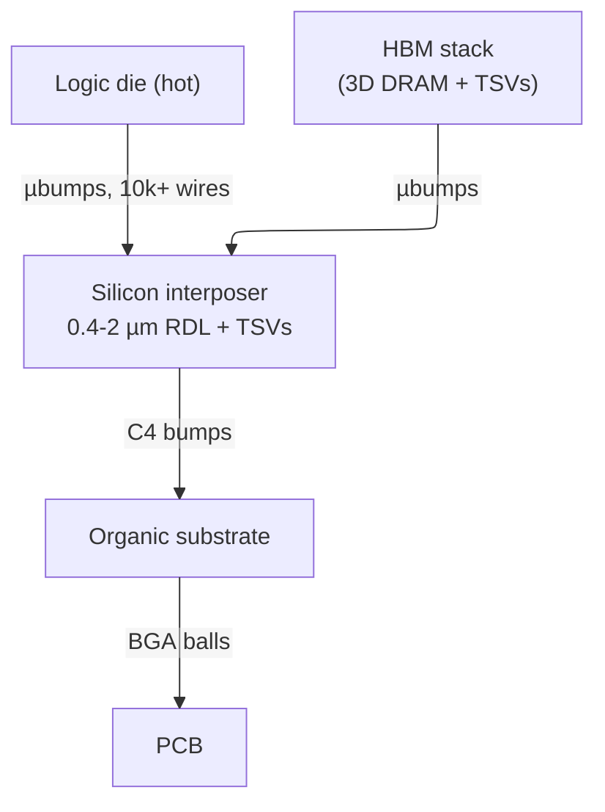

# IC Packaging — The Four Jobs, and Why Advanced Packaging Became a Performance Lever

> **Prerequisites:** [Fabrication_Process](01_Fabrication_Process.md) (the wafer this operates on, the reticle limit, and the Poisson yield law $Y=e^{-AD_0}$ this page turns into a packaging argument), [Signal_Integrity_Reliability](../05_Backend_Physical_Design/02_Signal_Integrity_Reliability.md) (RLC parasitics, IR/EM, the PnR-side power grid), [Power_Analysis_and_Signoff](../02_Power_and_Low_Power/05_Power_Analysis_and_Signoff.md) (target impedance and PDN pass/fail — this page owns the *package half* of that network).
> **Hands off to:** [Tapeout_and_Post_Silicon_Bringup](03_Tapeout_and_Post_Silicon_Bringup.md) (the assembled part becomes a validated product), [Memory](../01_Architecture_and_PPA/09_Memory.md) (the HBM stacks this page places beside logic, and why bandwidth is the AI-infra wall), [Network_on_Chip](../01_Architecture_and_PPA/13_Network_on_Chip.md) (the on-chip fabric that UCIe extends across the package).

---

## 0. Why this page exists

A die fresh off the wafer is a slab of silicon a few hundred microns thick with a grid of copper pads a few microns wide. It can *compute* — but it cannot do any of the four things that would let it compute usefully. It cannot draw hundreds of amps of clean power through pads too small to solder. It cannot exchange signals with the world at a rate its own transistors can sustain. It cannot shed the heat those transistors make before they cook. And it cannot survive a socket, a reflow oven, or a decade of thermal cycling without cracking. **Packaging is the discipline of supplying those four missing functions** — power in, signals out, heat away, mechanical and environmental survival — to a device that has none of them on its own.

For most of the industry's history that was the whole story, and packaging was a back-end afterthought: cheaper was better, and the package's only job was to stay out of the die's way. Two curves ended that era. The **reticle limit** caps a single die at $\approx 830\ \text{mm}^2$, and **yield falls exponentially in die area** ($Y=e^{-AD_0}$, [Fabrication_Process](01_Fabrication_Process.md) §5), so the largest and most valuable chips — server CPUs, AI GPUs — can no longer be built as one monolithic die at any acceptable cost. The only way to build a "bigger" chip is to build several smaller ones and **join them in the package**. At that moment packaging stops being protection and becomes a *first-class performance lever*: the interposer, the die-to-die link, and the in-package memory stack are now where bandwidth, energy-per-bit, and cost-per-transistor are won or lost.

This page derives the field from those facts. Sections 1–4 build the four jobs and show how each forces concrete package features — and why **flip-chip** beats **wire-bond** on three of the four at once. Sections 5–8 take the inflection: why the reticle-and-yield squeeze forces **chiplets**, why bandwidth economics put **HBM on a silicon interposer**, what **3D stacking** buys and what it costs in heat, and where real designs (EPYC, V-Cache, Blackwell) land. The goal is that you can *reason* about a package — size its PDN from a target impedance, its cooling from a thermal-resistance chain, its chiplet split from a yield curve — not recite a catalogue of package acronyms.

---

## 1. The four jobs — and why a bare die has none of them

Every feature of every package traces to one of four obligations. Read each as a *deficiency of the bare die* the package must cover:

1. **Power delivery.** The die wants hundreds of amps at sub-volt supply with a tens-of-millivolt noise budget, and it wants them to arrive without drooping when its current demand swings on nanosecond timescales. The path from a board regulator is centimetres of copper with real resistance and inductance; the package must fan a few fat board connections into thousands of tiny, low-impedance ones at the die (§3).
2. **Signal I/O.** A modern die has $10^3$–$10^4$ signals to move off-chip at multi-Gb/s each. The rate it can sustain is set by *how many* connections the package can attach and *how good* each one is electrically (§2, §9).
3. **Heat removal.** Hundreds of watts in $\sim\!1\ \text{cm}^2$ is a heat flux of 50–100 W/cm², and silicon degrades fast above $\sim\!125\,°\text{C}$ junction. The package must present a low-thermal-resistance path from the transistors to a heatsink (§4).
4. **Mechanical and environmental protection.** The die must survive handling, socket force, moisture, and — the dominant one — the stress of every material expanding at a different rate each time the part heats and cools. The package must hold the die and its connections intact for $\sim\!10^5$ hours across $\sim\!10^3$ thermal cycles (§1.2).

| Job (what the bare die lacks) | Governing physics | Package feature it forces |
|---|---|---|
| Power **in** | IR drop $IR$, droop $L\,di/dt$, target impedance | area-array power bumps, on-package decap, planes/TSVs |
| Signals **out** | I/O count $\propto$ area not perimeter; parasitic $R,L,C$ | flip-chip bumps, interposer/RDL, die-to-die PHYs |
| Heat **out** | $T_j = T_a + P\,\theta_{ja}$ | exposed backside, lid + TIM, heatsink, thermal TSVs |
| **Survive** | CTE mismatch $\to$ warpage + fatigue | underfill, CTE-matched lid, mold, coplanarity limits |

Jobs 1–3 are the ones that turn into *performance levers* at the leading edge (bandwidth, IR budget, coolable power all become design variables). Job 4 is the perennial *constraint* — it never becomes a feature, but it silently gates every advanced-packaging move, so it is worth pinning down once, here, before the rest of the page fights it.

### 1.1 The physical path is nothing but pitch-and-impedance translation

The die reaches the world through a stack whose only purpose is to translate from micron-scale die pads to millimetre-scale board pads while keeping resistance and inductance low the whole way:

$$
\text{die pad }(\mu\text{m}) \;\to\; \text{bump} \;\to\; [\text{interposer / RDL}] \;\to\; \text{substrate (mm)} \;\to\; \text{BGA ball} \;\to\; \text{PCB}
$$

Two numbers drive everything downstream: **pitch** (how tightly connections pack — sets how *many* you get) and **parasitics** ($R,L,C$ per connection — set how *good* each is). Advanced packaging is, mechanically, nothing but the pursuit of finer pitch and lower parasitics than an organic substrate can provide (§5–7).

### 1.2 The perennial job: surviving CTE mismatch

The other three jobs are about performance; this one is about not falling apart, and it constrains every advanced-packaging decision. The root cause is that adjoining materials expand at different rates. The shear stress at an interface scales as

$$
\sigma \;\sim\; E\,\Delta\alpha\,\Delta T
$$

where $E$ = elastic modulus, $\Delta\alpha$ = CTE difference across the interface, $\Delta T$ = temperature swing. Silicon is $2.6\ \text{ppm}/°\text{C}$; organic substrate 15–17; solder and copper $\sim\!17$; mold compound 8–12. Every heat/cool cycle these slide against one another, and the connections between them (wires, bumps, solder joints) live in the shear. Three consequences and their responses:

- **Warpage** — the whole package bows as it cools from assembly temperature (a bimetallic-strip effect), driving corner connections into tension or compression. It is held below coplanarity limits ($\sim\!100$–$150\ \mu\text{m}$ for BGA) by CTE-matched lids, balanced substrate metal, and — the big one — by *matching the interposer's CTE to silicon*. This is why silicon interposers and glass substrates matter **mechanically**, not just electrically: a large organic interposer would warp itself off the board.
- **Fatigue** — bumps and solder joints crack after enough cycles. **Underfill** (epoxy wicked under a flip-chip die) glues die and substrate so they move together, cutting bump shear strain roughly $10\times$ and turning a few-hundred-cycle life into a few-thousand.
- **Qualification** — survival is *proven* by accelerated stress: thermal cycling ($-40$ to $+125\,°\text{C}$, 500–1000 cycles), moisture-sensitivity levels (MSL — absorbed water flashes to steam at reflow and "popcorns" the package), and HTOL for the transistors. These are pass/fail gates, and their existence is the constraint: you cannot ship a package geometry that fails them, however good its bandwidth.

Keep this as the tax on every density gain below: 3D stacks warp more, large interposers warp more, and finer bumps fatigue faster.

---

## 2. Getting signals off the die: wire-bond vs flip-chip

The signal-I/O job hides one hard scaling problem. Compute grows with die **area** (transistors $\propto A$), but if you only attach connections along the die's **edge**, your I/O grows with its perimeter. For a die of side $L$ and pad pitch $p$:

$$
\frac{\text{edge I/O supply}}{\text{compute demand}} \;\sim\; \frac{4L/p}{L^2} \;=\; \frac{4}{pL} \;\propto\; \frac{1}{L}
$$

The ratio *falls* as the die grows — the **beachfront (I/O) wall**. Edge connections cannot keep up with area compute. Two escapes define the two packaging philosophies:

- **Wire bonding** attaches thin wires from pads on the die *edge* to a lead frame. It is peripheral, so I/O $\propto$ perimeter — permanently on the wrong side of the wall. Each wire is long (1–5 mm) and inductive ($\sim\!1\ \text{nH/mm}$), which also caps signal rate ($\sim\!1\ \text{GHz}$) and makes it a poor power conductor ($\sim\!40$–$100\ \text{m}\Omega$, $\sim\!0.2\ \text{A}$ per wire). It is simple and cheap, so it survives for low-pin-count and low-cost parts, but it cannot feed a modern high-I/O die.
- **Flip chip** flips the die face-down and connects through an *area array* of solder bumps over the whole die face. Now I/O $\propto$ **area** — on the right side of the wall. A 20 mm die at 150 µm bump pitch offers $\sim\!17{,}000$ connections where its edge could hold only $\sim\!500$.

Flip-chip does not merely win the I/O count; the single move of flipping the die wins **three of the four jobs at once**, which is why it is mandatory above a few hundred pins:

| | Wire-bond (peripheral) | Flip-chip (area-array) | Why flip-chip wins |
|---|---|---|---|
| **I/O count** | $\propto$ perimeter, $10^2$–$10^3$ | $\propto$ area, $10^3$–$10^4$ | beats the beachfront wall |
| **Power** | few long wires, $\sim\!1\ \text{nH}$, $\sim\!50\ \text{m}\Omega$ | 100s of short bumps, $\sim\!0.1\ \text{nH}$, $\sim\!10\ \text{m}\Omega$ in parallel | sub-m$\Omega$ PDN, low $L\,di/dt$ (§3) |
| **Heat** | die face-up $\to$ heat exits *down* through attach + substrate | die face-down $\to$ **inactive backside faces up**, bare Si to the cooler | short $\theta_{jc}$ (§4) |
| **Signal** | $\sim\!1\ \text{nH/mm}$ wire $\to \sim\!1\ \text{GHz}$ ceiling | $\sim\!0.1\ \text{nH}$ bump, short $\to$ multi-GHz | $10\times$ lower parasitic $L$ |

Flipping the die so its active face bonds through short vertical bumps simultaneously spreads I/O over the whole area, shortens every power path, and frees the backside for cooling. That is why flip-chip is the substrate of all high-performance packaging — and why the rest of this page is one story: making that vertical connection ever finer.

**The bump-pitch ladder (the one process fact worth keeping).** Every density gain in packaging is a finer vertical connection: **C4 solder bumps** ($\sim\!100\ \mu\text{m}$, 150–200 µm pitch, $10^3$–$10^4$ I/O) $\to$ **copper-pillar micro-bumps** (20–40 µm pitch, $10^4$–$10^5$ I/O — the workhorse of 2.5D/3D) $\to$ **hybrid bonding** (Cu–Cu direct, no solder, 1–10 µm pitch, $>\!10^6$ bonds/mm²). Finer pitch = more connections per unit die edge or area = more bandwidth, bought with tighter alignment ($\pm 1$–2 µm for µbumps, $<\!200\ \text{nm}$ for hybrid) and, for hybrid bonding, atomically flat CMP'd surfaces. Hold this ladder — §5–7 are just it applied at package, interposer, and die-stack scale.

---

## 3. Power delivery: the die as a hundred-amp load with nanosecond edges

Deliver a stable voltage to a die drawing 200–1000 A at $\sim\!0.75\ \text{V}$ while it switches that current on nanosecond timescales. Two failure modes, two terms.

**Static — IR drop.** DC current through the finite resistance of the power-delivery network (PDN) drops voltage:

$$
\Delta V_{IR} = I\cdot R_{PDN}
$$

A 200 A load with a 35 mV budget demands $R_{PDN} < 0.175\ \text{m}\Omega$ — a hundred times smaller than a single bump. The only route there is **massive parallelism**: hundreds to thousands of area-array power bumps ($\sim\!10\ \text{m}\Omega$ each) and, in stacks, power TSVs in parallel. This is a second, independent reason flip-chip wins power delivery — peripheral wires cannot be paralleled enough.

**Dynamic — $L\,di/dt$ droop.** When current demand jumps (a clock ungates, a wide vector op fires), inductance in the supply path opposes the change and the rail droops:

$$
\Delta V_L = L\frac{di}{dt}, \qquad \frac{di}{dt} \sim 10^{9}\text{–}10^{11}\ \text{A/s}
$$

Even nanohenries of package inductance then cause tens of millivolts of droop. Since the path cannot be made zero-inductance, the transient current is supplied *locally* from **decoupling capacitors**, staged by how fast each can respond (set by its own loop inductance):

| Decap tier | Serves frequencies | Why it must be there |
|---|---|---|
| On-die (MOS/MIM) | $>\!\sim\!100\ \text{MHz–GHz}$ | package inductance blocks board caps here; only on-die $C$ is close enough |
| On-package | $\sim\!1$–100 MHz | fast bulk charge between die and board |
| On-board (MLCC, bulk) | $<\!\sim\!1\ \text{MHz}$ | cheap capacity for slow swings |

The unifying spec is **target impedance** — the PDN must stay below

$$
Z_{target} = \frac{\Delta V_{allowed}}{I_{max}}
$$

*across the whole band* from DC to the die's switching frequency, with each decap tier holding down its octave range. Sizing and pass/fail for all of this live in [Power_Analysis_and_Signoff](../02_Power_and_Low_Power/05_Power_Analysis_and_Signoff.md), and the PnR-side grid/decap/EM mechanisms in [Signal_Integrity_Reliability](../05_Backend_Physical_Design/02_Signal_Integrity_Reliability.md). The **packaging** point is that the bump / TSV / plane network *is* the low-frequency half of that PDN, and its $R$ and $L$ are fixed by how many parallel connections the package geometry allows — another reason area-array beats peripheral.

---

## 4. Heat removal: the thermal-resistance stack

The transistors dissipate power $P$ as heat; the junction temperature $T_j$ must stay below a reliability limit ($\sim\!100$–$125\,°\text{C}$). Between junction and ambient air is a chain of materials, each a thermal resistance, and the temperature rise is power times total resistance — Ohm's law for heat:

$$
T_j = T_a + P\cdot\theta_{ja}, \qquad \theta_{ja} = \theta_{jc} + \theta_{cs} + \theta_{sa}
$$

where $T_a$ = ambient, and the $\theta$ terms ($°\text{C/W}$) are junction-to-case, case-to-sink (the thermal interface material), and sink-to-ambient. Read as a budget, the coolable power is $P_{max} = (T_{j,max}-T_a)/\theta_{ja}$ — **every $°\text{C/W}$ in the stack costs watts**. This is where flip-chip pays off a third time and where 3D stacking pays its bill:

- **Flip-chip's thermal win.** Face-down mounting leaves the die's **inactive backside** — bare, high-conductivity silicon ($k \approx 150\ \text{W/m·K}$) — facing up to the lid and heatsink, so $\theta_{jc}$ is just die thickness plus a TIM: the shortest possible path. A face-up wire-bond die must dump heat *downward* through die-attach and organic substrate (poor conductors), a much larger $\theta_{jc}$. Backside cooling is the single biggest lever, which is why high-power parts thin the die and bolt on direct-liquid cold plates.
- **3D stacking's thermal penalty.** Stack die B on die A and B's heat can only reach the cooler *through A*:

$$
T_{j,B} = T_a + P\big(\theta_{B} + \theta_{bond} + \theta_{A} + \theta_{pkg}\big)
$$

The buried die sees the *sum* of its own and its neighbours' resistances, runs hottest, and must be throttled. This is exactly why today's 3D is **cache-on-logic** (SRAM dissipates little — AMD V-Cache) and not **logic-on-logic** (two hot dies would cook the lower one). The thermal chain — not the bonding technology — gates 3D to low-power upper dies until microfluidic or backside-power cooling changes the $\theta$ stack. That is the 2.5D-vs-3D trade in physical form, developed in §7.

---

## 5. The inflection: reticle limit + yield collapse $\Rightarrow$ chiplets

Everything so far made a *single* die work in a package. The rest of the page is about why you stop building single dies at all. Two independent walls force it.

**Wall 1 — the reticle limit.** A lithography scanner exposes at most one reticle field per shot: $\approx 26 \times 33\ \text{mm} = 830\ \text{mm}^2$ (halved to $\approx 429\ \text{mm}^2$ by High-NA EUV, [Fabrication_Process](01_Fabrication_Process.md) §3). A die cannot exceed it without *stitching* two exposures — exotic and expensive (Blackwell does it, §8). A hard ceiling on monolithic die area.

**Wall 2 — yield collapse.** Even below the reticle limit, cost per good die rises *super-linearly* with area. Start from the Poisson yield law ([Fabrication_Process](01_Fabrication_Process.md) §5), $Y = e^{-AD_0}$, and count cost:

$$
C_{good\ die} = \frac{C_{wafer}}{\text{good dies per wafer}} \;\approx\; \frac{C_{wafer}}{A_{wafer}}\cdot A\,e^{A D_0}
$$

where $A$ = die area, $D_0$ = defect density, $C_{wafer}$ = processed-wafer cost. The $A\,e^{AD_0}$ factor means doubling die area **more than doubles** cost per good die once $AD_0$ is not small — the exponential tail the fab page warns about.

**Why splitting the die wins.** Cut one die of area $A$ into $n$ chiplets of area $A/n$. Total silicon cost becomes

$$
C_{n\ chiplets} \;\propto\; n\cdot\frac{A}{n}\,e^{(A/n)D_0} \;=\; A\,e^{(A/n)D_0}
$$

Same total area, but the exponential factor collapses from $e^{AD_0}$ to $e^{(A/n)D_0}$. Splitting an 800 mm² die into four moves each tile from the deep tail back to the head of the yield curve — the [Fabrication_Process](01_Fabrication_Process.md) §5 "55% monolithic $\to$ ~90% per tile" result. Cost per good transistor drops even though you have *added* silicon for the interfaces.

Three more benefits fall out, and one is not about yield at all:

- **Node heterogeneity.** Logic loves the leading node; SRAM and analog scale poorly and I/O/SerDes gain nothing from it. Chiplets let each function sit on its *economical* node — AMD EPYC builds compute on N5 and the I/O die on N6, instead of paying 3 nm prices for analog that would not improve.
- **Reuse / NRE amortization.** One I/O die reused across a product family amortizes its mask NRE ($\sim\!15$–25 M USD/node) over more volume.
- **Modular scale past the reticle.** More compute = add more identical chiplets, crossing a ceiling a monolith never could (EPYC to 12 compute dies).

**The counter-costs — why not split everything.** A die-to-die crossing is far worse than an on-die wire:

| | On-die wire | Die-to-die (in package) | Board-level (DDR/PCIe) |
|---|---|---|---|
| Energy | $\sim\!\text{fJ/bit}$ | $\sim\!0.25$–0.5 pJ/bit | $\sim\!5$–10 pJ/bit |
| Latency | sub-ns | $\sim\!2$–10 ns | 10s of ns |

Crossing a chiplet boundary costs $\sim\!100$–$1000\times$ the energy and $\sim\!10\times$ the latency of staying on-die, plus **beachfront area** for the PHYs (§6) and **packaging cost + assembly yield**. Splitting also multiplies a new risk: assemble $n$ dies and if any one is bad the whole package is scrap. Assemble $n$ *untested* dies each good with probability $y$ and package yield is $y^n$ — catastrophic for large $n$. The fix is **known-good-die (KGD)**: fully test each die at wafer level and assemble only good ones, so package yield $\approx Y_{asm}$ (assembly yield alone), independent of die yield. KGD is what makes chiplets and 3D *economically* possible; without it, stacking is a yield massacre.

**Where the knee lands.** Chiplets win when the yield/cost saving from smaller dies plus the node-heterogeneity saving exceed the added interconnect energy/latency and packaging cost. That favours **large, high-value, high-core-count parts** (server CPUs, GPUs, accelerators — deep in the yield tail, near or past the reticle) and disfavours **small, cost-sensitive, latency-critical parts** (a phone SoC yields fine monolithically and cannot spare the D2D energy in its power budget). This is exactly why AMD ships EPYC as chiplets while Apple ships the base M-series as a monolith — the same shape of trade the OoO page makes for window size, here made for die size.

---

## 6. 2.5D: buying bandwidth density with an interposer

Once you have multiple dies, how do you connect them with enough bandwidth? Back to the beachfront wall (§2), now *between* dies. The bandwidth across a boundary is its shared edge length times the bandwidth per unit edge:

$$
BW \;\approx\; (\text{beachfront length})\times \underbrace{\frac{n_{lanes}}{\text{mm}}}_{\propto\,1/\text{pitch}}\times (\text{rate per lane})
$$

Beachfront is fixed by floorplan and rate/lane is capped by power and signal integrity, so the free variable is **lanes per mm — which is one over the bump pitch**. To push more bandwidth across a boundary you need *finer pitch*, and an organic substrate ($\sim\!8\ \mu\text{m}$ L/S, 100–130 µm bumps) simply cannot get there. That is the entire reason the silicon interposer exists.

**The silicon interposer** is a slab of silicon carrying only fine wiring (0.4–2 µm RDL) and TSVs, on which dies sit side-by-side. Being silicon patterned with back-end-of-line lithography, it reaches pitches an organic substrate never can — 10,000+ wires between adjacent dies, TB/s of bandwidth. Dies bump to it with micro-bumps (§2 ladder), it bumps to the substrate with C4s, and TSVs carry power and off-package I/O straight through it.

**Why HBM lives here.** High-bandwidth memory is the canonical customer. HBM presents a **1024-bit** interface per stack (HBM4: 2048-bit) — two orders of magnitude wider than DDR5's 64 bits — run at a *deliberately low* per-pin rate. Why wide-and-slow instead of narrow-and-fast? Energy. Bandwidth $= W\times f$, and interconnect energy scales with $f$ and with reach, so for a target bandwidth the *wide, slow, short* bus wins on pJ/bit — but only if you can physically route 1024+ signals into the memory, which needs interposer-class pitch. HBM-beside-logic-on-an-interposer is "wide, slow, short" made physical: NVIDIA's H100 places a GPU die and its HBM3 stacks on a $\sim\!2500\ \text{mm}^2$ CoWoS interposer for $\sim\!5\ \text{TB/s}$. The memory-side view — why *bandwidth*, not capacity, is the AI-infrastructure wall — is [Memory](../01_Architecture_and_PPA/09_Memory.md).

**The cost trade: don't buy silicon you don't need.** A full silicon interposer is expensive (adds ~100–500 USD/unit) and, being large, warps (§1.2). So the field offers a ladder of "fine pitch only where you need it":

- **Silicon interposer** (TSMC CoWoS-S): full fine-pitch slab; highest bandwidth, highest cost, reticle-limited (CoWoS-L stitches local silicon bridges to exceed it).
- **Silicon bridge** (Intel EMIB): a small silicon chip embedded in an otherwise-organic substrate, *only under the die-to-die interface*. You pay for silicon fine-pitch on the few mm² that need it and cheap organic everywhere else.
- **RDL / fan-out** (TSMC InFO): polymer redistribution layers, no silicon interposer at all — cheaper and lower-loss than organic, used where the required pitch is moderate (Apple A-series in-package DRAM via InFO-PoP).

The design move is invariant: locate the fine-pitch resource *exactly* on the beachfront that needs the bandwidth, and use cheap organic for the rest.

---

## 7. 3D: the shortest wire, paid for in heat

2.5D put dies side-by-side; a connection still runs *out to the die edge, across the interposer, and back in*. 3D stacking puts one die directly atop another and connects them vertically — the shortest possible wire. That does two things the beachfront argument loves:

- **Bandwidth density explodes.** A vertical connection uses *area*, not edge. Hybrid bonding at 1–10 µm pitch gives $>\!10^6$ bonds/mm² — the whole *face* of the die becomes I/O, not just its shoreline. Memory-on-logic can then run a 1000+-bit bus over sub-millimetre wires.
- **Energy and latency drop.** Shorter wire = less capacitance = fewer fJ/bit and less delay than even a 2.5D hop.

The mechanism is the §2 ladder at its limit: **µbumps + TSVs** (stack dies, drill through-silicon vias for vertical signal and power) $\to$ **hybrid bonding** (Cu–Cu direct, no bump, $\sim\!100\times$ the density). TSVs cost a keep-out zone (no transistors near the via, stress and contamination) and wafer thinning; hybrid bonding costs atomic-flatness CMP and $<\!200\ \text{nm}$ alignment.

**The 2.5D-vs-3D trade.** Everything 3D wins in wire length it risks in the other three jobs:

| | 2.5D (side-by-side) | 3D (stacked) |
|---|---|---|
| Bandwidth density | high (interposer RDL) | **highest** (whole-face, hybrid bond) |
| Footprint | large (dies + interposer) | **smallest** (vertical) |
| Thermal | each die keeps its own backside $\to$ coolable | **buried die cannot reach the cooler** (§4) |
| Power delivery | through the interposer | must feed the upper die through TSVs in the lower one |
| Assembly / yield | KGD dies on interposer | KGD + stack-yield; one bad die scraps the stack |

The deciding term is **thermal** (§4): 3D's buried-die $\theta$ chain forces the upper die to be low-power, which is why 3D today means **cache- or memory-on-logic** (V-Cache SRAM; HBM's own DRAM stack is internally 3D) and 2.5D is where you place *two hot dies* (logic + logic, logic + HBM). Reach for 3D when you need the density/energy and the upper die is cool; reach for 2.5D when both dies are hot. **Heterogeneous integration** — mixing logic, memory, analog, and photonics from different nodes in one package, the "More than Moore" thesis — uses both: 2.5D to place them, 3D to stack the ones that can take the heat.

---

## 8. Real packages: where the trades land

The trade-offs above explain every mainstream advanced package. Three make the point.

**AMD EPYC / Ryzen — chiplet economics (§5).** Up to twelve small **compute dies** ($\sim\!70\ \text{mm}^2$) on N5 plus one **I/O die** on N6, on an organic substrate. The compute dies are deliberately small so each sits on the *head* of the yield curve; the I/O die stays on a cheaper node because SerDes and DRAM PHYs gain nothing from N5 (§5 node heterogeneity). The die-to-die energy ($\sim\!1$–2 pJ/bit across organic) is affordable in a socket with a large power budget — the opposite of a phone, which is why phones stay monolithic.

**AMD 3D V-Cache — 3D density vs the thermal stack (§4, §7).** 64 MB of L3 SRAM **hybrid-bonded** onto the compute die at $\sim\!9\ \mu\text{m}$ pitch ($>\!200\times$ µbump density), giving the cache a vast, short, low-energy bus. It is *cache*-on-logic precisely because §4 forbids logic-on-logic — SRAM dissipates little. The generational twist is a live §4 lesson: the **first** generation stacked the cache *on top* of the hot cores, inserting $\theta$ between them and the cooler and forcing lower clocks; a **later** generation moved the cache *underneath*, restoring the compute die's bare backside to the lid and recovering the clock. Same bond technology, opposite side of the thermal stack.

**NVIDIA Blackwell (B200) — the capstone, all four jobs at once.** Two reticle-limited dies joined by a $\sim\!10\ \text{TB/s}$ die-to-die link and presented as one GPU (§5 modular scale past the reticle, §2's finest bumps); 192 GB of HBM3e on a **CoWoS-L** interposer at $\sim\!8\ \text{TB/s}$ (§6 bandwidth density); $\sim\!1000\ \text{W}$ dissipated (§4 $\to$ mandatory direct-liquid cold plate); and $1000\ \text{W} / 0.75\ \text{V} \approx 1300\ \text{A}$ delivered through thousands of power bumps and a heavy grid (§3). Every section of this page is one constraint on this one package, and the reason it exists at all is that a single monolithic die of equal capability is impossible (reticle) and unaffordable (yield). Blackwell *is* the inflection — packaging as the product.

---

## 9. Die-to-die interfaces, briefly

Once chiplets exist, the die-to-die link is the new "pin," and it needs a standard so third-party chiplets interoperate. The metric that matters is **bandwidth density (Gb/s per mm of beachfront) at a given energy (pJ/bit)** — §6's argument in interface form.

- **UCIe** — the emerging standard (physical + link + protocol layers, tunnelling PCIe/CXL/AXI). Two flavours mirror §6's cost ladder: a **standard package** variant (organic, 100–130 µm pitch, $\sim\!250$–500 Gb/s per mm of edge) and an **advanced package** variant (silicon bridge/interposer, 25–55 µm pitch, $\sim\!2$–4 Tb/s per mm) at $\sim\!0.25$–0.5 pJ/bit — 10–20$\times$ more efficient than board-level PCIe/DDR ($\sim\!5$–8 pJ/bit) because the link is short and stays in-package.
- **BoW** (raw parallel bus, lowest latency, memory-to-logic) and HBM's **JEDEC PHY** (the standardized memory interface) are the other two points on the same trade surface.

The link layer (training, CRC/retry, credit-based flow control) rides on the same principles as any on-chip network — see [Network_on_Chip](../01_Architecture_and_PPA/13_Network_on_Chip.md), which owns the routing/flow-control view and treats UCIe as its package-scale extension.

---

## 10. Numbers to memorize

| Quantity | Value | Why it matters (section) |
|---|---|---|
| Reticle limit | $\approx 830\ \text{mm}^2$ (26×33); $\approx 429$ High-NA | caps monolithic die $\to$ chiplets (§5) |
| Yield / cost-per-good-die | $Y = e^{-AD_0}$; $C \propto A\,e^{AD_0}$ | the chiplet economic engine (§5) |
| Chiplet split gain | $e^{AD_0} \to e^{(A/n)D_0}$ | why $n$ small dies beat one big die (§5) |
| Wire-bond inductance | $\sim\!1\ \text{nH/mm}$ | caps wire-bond to $\sim\!1\ \text{GHz}$ (§2) |
| Flip-chip bump inductance | $\sim\!0.1\ \text{nH/bump}$ | $10\times$ better SI + power (§2, §3) |
| C4 bump pitch | 130–200 µm | peripheral $\to$ area-array I/O (§2) |
| Micro-bump pitch | 20–40 µm | 2.5D/3D workhorse (§2, §6, §7) |
| Hybrid-bond pitch | 1–10 µm ($>\!10^6$/mm²) | the 3D density leap (§7) |
| Interposer RDL L/S | 0.4–2 µm | the fine pitch organic cannot reach (§6) |
| Interposer TSV | Ø5–10 µm, 50–100 µm deep; $R\!\sim\!10$–50 mΩ, $C\!\sim\!10$–50 fF | vertical signal/power (§6, §7) |
| HBM interface width | 1024-bit (HBM4: 2048) | wide-slow-short bandwidth (§6) |
| Energy/bit tiers | on-die $\sim\!$fJ · D2D $\sim\!0.5$ pJ · board $\sim\!5$–10 pJ | the chiplet crossing cost (§5, §9) |
| D2D bandwidth density | $\sim\!0.25$–0.5 (std) / 2–4 (adv) Tb/s per mm | beachfront metric (§6, §9) |
| Target impedance | $Z_{target} = \Delta V/I_{max}$, sub-mΩ | PDN sizing (§3) |
| Thermal stack | $T_j = T_a + P\,\theta_{ja}$ | coolable-power budget (§4) |
| Si / organic CTE | 2.6 / 15–17 ppm/°C | mismatch $\to$ warpage + fatigue (§1.2) |
| BGA coplanarity limit | $<\!100$–150 µm | gates package size via warpage (§1.2) |
| Reliability qual | 500–1000 thermal cycles; MSL 1–6 | pass/fail gates on any geometry (§1.2) |

**The through-line:** interconnect energy grows with *reach* and *frequency*, and I/O supply grows with *area* not perimeter. Those two facts, plus the reticle-and-yield ceiling, generate the whole of §2–§9 — flip-chip, the interposer, HBM-beside-logic, 3D stacking, and chiplets are all the same argument at different scales.

---

## Cross-references

- **Down the stack (what packaging is built on):** [Fabrication_Process](01_Fabrication_Process.md) (the wafer, the reticle limit, and the Poisson yield law $Y=e^{-AD_0}$ whose exponential tail §5 turns into the chiplet argument), [Signal_Integrity_Reliability](../05_Backend_Physical_Design/02_Signal_Integrity_Reliability.md) (the RLC parasitics, EM, and PnR-side power grid the bump/TSV network extends), [Power_Analysis_and_Signoff](../02_Power_and_Low_Power/05_Power_Analysis_and_Signoff.md) (target impedance and PDN signoff — §3 is the package half of that network).
- **Up the stack (what builds on it):** [Tapeout_and_Post_Silicon_Bringup](03_Tapeout_and_Post_Silicon_Bringup.md) (the assembled part enters lab bring-up), [Memory](../01_Architecture_and_PPA/09_Memory.md) (the HBM this page places on an interposer, and why bandwidth is the AI-infra wall), [Network_on_Chip](../01_Architecture_and_PPA/13_Network_on_Chip.md) (the fabric UCIe extends across the package, §9).

---

## References

1. Lau, J.H., *Semiconductor Advanced Packaging*, Springer, 2021. Flip-chip, 2.5D/3D, fan-out, and hybrid bonding.
2. Tummala, R.R., *Fundamentals of Microsystems Packaging*, McGraw-Hill, 2001. Substrates, thermal and power delivery, reliability.
3. Naffziger, S. et al., "Pioneering Chiplet Technology and Design for the AMD EPYC and Ryzen Processor Families," *ISCA*, 2021. The chiplet yield/cost economics of §5.
4. Black, B. et al., "Die Stacking (3D) Microarchitecture," *MICRO*, 2006. The 3D-stacking bandwidth/thermal trade of §7.
5. UCIe Consortium, *Universal Chiplet Interconnect Express (UCIe) Specification*, Rev. 1.1 / 2.0, 2023–2024. The die-to-die interface of §9.
6. JEDEC, *JESD22* test-method family and *J-STD-020* (moisture/reflow sensitivity). The reliability qualification gates of §1.2.
