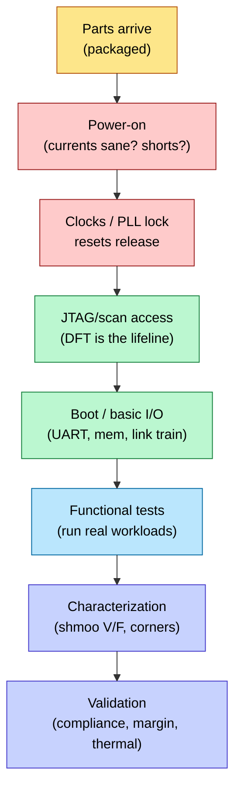

# Tapeout and Post-Silicon Bring-up

> **Stage:** 07 · Manufacturing & Bring-up — the end of the flow: GDSII (Graphic Data System II) hand-off, mask, first silicon, and the lab work that turns a die into a validated product.
> **Prerequisites:** all signoff ([STA](../06_Signoff/01_STA.md), [Physical_Verification_DRC_LVS](../06_Signoff/03_Physical_Verification_DRC_LVS.md), [DFT_and_ATPG](../06_Signoff/02_DFT_and_ATPG.md)), [Fabrication_Process](01_Fabrication_Process.md), [IC_Packaging](02_IC_Packaging.md). **Hands off to:** production / next-spin.

---

## 0. Why this page exists

Every prior stage exists to make this moment work: **tape-out** (releasing GDSII to the foundry) and **bring-up** (the first time real silicon runs in a lab). A mask set at a leading node costs tens of millions of dollars and a respin costs months, so tape-out is a heavyweight, checklist-gated event — and when first silicon arrives, a disciplined bring-up process is what finds the inevitable bugs in days instead of months. This is the stage most RTL (register-transfer level)/PD (physical design) engineers never see, and the one that decides whether a project ships.

---

## 1. Tape-out — the GDSII hand-off

"Tape-out" (from the era of mag tapes) = releasing the final, merged, signed-off **GDSII/OASIS** layout to the foundry for mask making. The gate before the button is pressed:

| Signoff item | Owner | Must be |
|---|---|---|
| Timing ([STA](../06_Signoff/01_STA.md), MCMM) | STA | clean across all corners/modes |
| Power ([Power_Analysis_and_Signoff](../02_Power_and_Low_Power/05_Power_Analysis_and_Signoff.md)) | power | IR/EM/avg/peak within budget |
| Physical ([DRC/LVS](../06_Signoff/03_Physical_Verification_DRC_LVS.md)) | PV | DRC/LVS/antenna clean |
| Function (verification) | DV | coverage closed, regression green |
| Test ([DFT/ATPG](../06_Signoff/02_DFT_and_ATPG.md)) | DFT | patterns generated, target coverage |
| Reliability (EM/aging) | reliability | lifetime margin met |

After release: the foundry does **mask data prep** — fracturing, **OPC** (optical proximity correction), and **mask writing**; multi-patterning means a layer may become several masks. Then wafers run the [process flow](01_Fabrication_Process.md) (weeks), and parts are [packaged](02_IC_Packaging.md).

---

## 2. The respin economics that govern everything

```text
Outcome of first silicon        cost / schedule
  Works (maybe metal-ECO fixes)  best case — ship / minor fix
  Metal-layer respin (ECO)       ~weeks, ~$1–5M (re-mask few layers)
  Full base-layer respin         ~months, ~$10–40M (all masks)
```

This curve is *why* the whole flow obsesses over signoff: a bug caught in [RTL sim](../03_Frontend_RTL_and_Verification/11_Verification_Planning_and_Coverage_Closure.md) costs 1×; the same bug in silicon costs a respin. It's also why chips are designed with **spare cells** and **ECO (engineering change order)-friendly** floorplans — so a logic fix can be done by changing only metal masks (cheap) instead of base layers (expensive).

---

## 3. Bring-up — first silicon in the lab



1. **Power-on.** The scariest moment: apply power and watch the current. Dead-short current = an [LVS](../06_Signoff/03_Physical_Verification_DRC_LVS.md)/power bug. Sane standby current = alive.
2. **Clocks & reset.** PLL (phase-locked loop) locks? Reset releases cleanly? (This is where [reset-architecture](../03_Frontend_RTL_and_Verification/01_RTL_Design_Methodology.md) bugs surface.)
3. **Scan/JTAG access** is the **lifeline** — DFT (design for test) isn't just for production test; it's how you *observe* a chip that won't boot. You scan out state to see where execution died. A chip with poor [DFT](../06_Signoff/02_DFT_and_ATPG.md) is nearly un-debuggable.
4. **Boot / basic I/O** — bring up UART (universal asynchronous receiver/transmitter), memory interface, high-speed links (PCIe (Peripheral Component Interconnect Express)/SerDes (serializer/deserializer) link-training).
5. **Functional** — run real software/workloads; reproduce any escaped bug.
6. **Characterization** — **shmoo plots**: sweep voltage × frequency (and temperature) to map the working region and find the real fmax/Vmin, comparing to [STA](../06_Signoff/01_STA.md) predictions.
7. **Validation** — protocol compliance, margin, thermal, reliability stress.

---

## 4. Post-silicon debug — finding the bug in a black box

Silicon has almost **no internal visibility** (you can't probe a node on a 3nm die), so debug relies on **design-for-debug** infrastructure built in beforehand:
- **Scan dump** — freeze the clock, scan out all flop state to reconstruct what happened ([DFT](../06_Signoff/02_DFT_and_ATPG.md)).
- **On-chip logic analyzers / trace buffers** — capture internal signals to an on-die buffer, read out via JTAG.
- **Performance counters & monitors** — the [activity/telemetry](../02_Power_and_Low_Power/02_Block_Activity_and_Power.md) hooks double as debug.
- **Clock control** — single-step, frequency stepping to localize speed-path vs functional bugs.
- **FIB (Focused Ion Beam)** — physically cut/reconnect wires on a die to test a fix hypothesis before committing a respin.

Classic bug taxonomy: **functional** (logic wrong — needs RTL ECO/respin), **electrical/speed-path** (fails only at high f/low V — characterize and maybe screen/bin around it), and **timing-marginal** (an STA (static timing analysis) corner or [SI](../05_Backend_Physical_Design/02_Signal_Integrity_Reliability.md) effect that signoff under-modeled).

---

## 5. Yield ramp and production

Once functional, the product moves to volume: **yield ramp** (driving defect density down via [DFM](../06_Signoff/03_Physical_Verification_DRC_LVS.md) feedback and process tuning), **binning** (sorting parts by achievable V/F — the same die ships as different SKUs), **production test** (ATPG (automatic test pattern generation) patterns on ATE (automated test equipment), plus burn-in for early-life failures), and **field reliability** monitoring. The [fabrication yield model](01_Fabrication_Process.md) sets the economic ceiling here.

---

## 6. Numbers to memorize

| Quantity | Value | Why |
|---|---|---|
| Leading-node mask set | ~$10–40M | first silicon must work |
| Tape-out → first silicon | ~8–14 weeks | fab + package turnaround |
| Metal ECO respin | ~weeks, few masks | why spare cells exist |
| Base-layer respin | ~months, all masks | the outcome to avoid |
| First thing at power-on | check current draw | short vs alive |
| Debug lifeline | scan/JTAG + trace | silicon has no internal probes |
| Characterization tool | **shmoo** (V×F×T sweep) | maps real working region |
| Binning | sort die by V/F → SKUs | monetize the distribution |

---

## Cross-references
- Signoff feeding tape-out: [STA](../06_Signoff/01_STA.md), [Physical_Verification_DRC_LVS](../06_Signoff/03_Physical_Verification_DRC_LVS.md), [DFT_and_ATPG](../06_Signoff/02_DFT_and_ATPG.md), [Power_Analysis_and_Signoff](../02_Power_and_Low_Power/05_Power_Analysis_and_Signoff.md).
- Manufacturing: [Fabrication_Process](01_Fabrication_Process.md), [IC_Packaging](02_IC_Packaging.md).
- The flow map: [Chip_Design_Flow_Overview](../Chip_Design_Flow_Overview.md).
