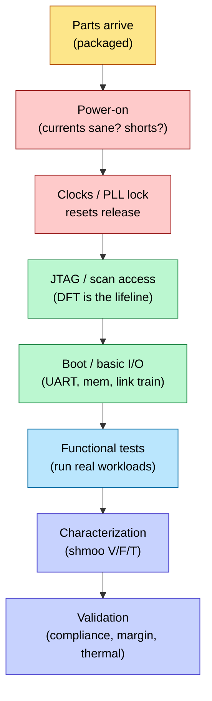

# Tape-out and Post-Silicon Bring-up — when an incomplete proof meets reality

> **Stage:** 07 · Manufacturing & Bring-up — the end of the flow: GDSII (Graphic Data System II) hand-off, mask making, first silicon, and the lab work that turns a die into a validated product.
> **Prerequisites:** all of signoff ([STA](../06_Signoff/01_STA.md), [Physical_Verification_DRC_LVS](../06_Signoff/03_Physical_Verification_DRC_LVS.md), [DFT_and_ATPG](../06_Signoff/02_DFT_and_ATPG.md), [Power_Analysis_and_Signoff](../02_Power_and_Low_Power/05_Power_Analysis_and_Signoff.md)), [Fabrication_Process](01_Fabrication_Process.md), [IC_Packaging](02_IC_Packaging.md).
> **Hands off to:** production ramp / next-spin ECO.

---

## 0. Why this page exists

Every prior stage of the flow exists to earn one decision: *press the tape-out button*. Doing so commits tens of millions of dollars and two to three months of calendar time to a set of photomasks — on the strength of **signoff**, which is a *proof that the chip works*. The uncomfortable truth that governs this entire stage is that the proof is **necessarily incomplete**. Verification sampled an astronomically large state space; STA, SI, and power signoff checked the design against *models* of physics, not physics itself; and the deepest bugs hide in states no pre-silicon tool was fast enough to reach. Tape-out is therefore not "we proved it works" but "we bet the residual gap between our models and reality is small enough to be worth the mask cost."

**Bring-up** is what happens when that bet is settled. Two facts shape everything the lab does. First, the **escape gap**: because the pre-silicon proof has holes, some bugs *always* reach silicon — the only questions are how many, how severe, and how fast you can find them. Second, the **observability collapse**: a running chip exposes almost none of its billion internal nodes, so finding an escaped bug is a search under a visibility budget seven or eight orders of magnitude smaller than a simulator's. Respin economics, spare cells, scan dump, trace buffers, and shmoo plots are all responses to these two facts. This is the stage most RTL (register-transfer level) and PD (physical-design) engineers never see, and the one that decides whether a project ships.

---

## 1. Tape-out — committing masks to an incomplete proof

"Tape-out" (from the era when layout shipped on magnetic tape) is the release of the final, merged, signed-off **GDSII/OASIS** database to the foundry. Pressing the button is gated by a signoff checklist, because each item bounds one way the chip can be wrong:

| Signoff item | Owner | Must be | Bounds the risk that… |
|---|---|---|---|
| Timing ([STA](../06_Signoff/01_STA.md), MCMM) | STA | clean across all corners/modes | a path is too slow/fast in some PVT corner |
| Power ([Power_Analysis](../02_Power_and_Low_Power/05_Power_Analysis_and_Signoff.md)) | power | IR/EM/avg/peak within budget | the grid droops or wears out under load |
| Physical ([DRC/LVS](../06_Signoff/03_Physical_Verification_DRC_LVS.md)) | PV | DRC/LVS/antenna clean | the layout is unmanufacturable or ≠ the netlist |
| Function (verification) | DV | coverage closed, regression green | the logic itself is wrong |
| Test ([DFT/ATPG](../06_Signoff/02_DFT_and_ATPG.md)) | DFT | patterns generated, coverage met | defective dies can't be screened — *or debugged* |
| Reliability (EM/aging) | reliability | lifetime margin met | the part degrades before end-of-life |

After release the foundry runs **mask data prep** — fracturing the polygons, applying **OPC** (optical proximity correction) to pre-distort them for the litho system, and mask writing; at advanced nodes [multi-patterning](01_Fabrication_Process.md) means one design layer becomes several masks. Wafers then run the [process flow](01_Fabrication_Process.md) (weeks) and parts are [packaged](02_IC_Packaging.md).

The conceptual point beneath the checklist: **every green check is a statement about a model.** "Timing clean" means clean against the extracted-parasitic + library-delay + OCV model. Signoff bounds the *modeled* failure modes; it is silent about un-modeled ones. That silence is the escape gap.

---

## 2. Why bugs escape — the pre-silicon / post-silicon gap

If verification and signoff were exhaustive, first silicon would always work and this page would end at §1. They are not, and the reasons are structural, not sloppiness. Escapes arrive through three channels:

1. **Coverage / state-space limits.** A design's reachable state space is exponential in its flop count; constrained-random verification (see [Verification_Planning_and_Coverage_Closure](../03_Frontend_RTL_and_Verification/11_Verification_Planning_and_Coverage_Closure.md)) *samples* it. If a functional-coverage model has $C$ bins and closure exercised all of them, escapes still live in the space *between* the bins — the interactions no one thought to bin. The residual-bug count falls with verification effort but has a long tail: the last bugs sit in rare corners whose discovery time grows like the coupon-collector tail $\sim C\ln C$, so there is always a horizon past which more simulation is uneconomic and you tape out with known residual risk.

2. **Un-modeled or under-modeled physics.** STA signs off against a delay model; real silicon has a specific cross-coupling, a supply droop under one pathological switching pattern, a temperature-inversion corner, or an analog non-ideality the digital abstraction flattened. These pass signoff because the *model* was optimistic, not because the design was checked and found safe. This is the class [SI](../05_Backend_Physical_Design/02_Signal_Integrity_Reliability.md) and [power-integrity](../02_Power_and_Low_Power/05_Power_Analysis_and_Signoff.md) work hardest to shrink.

3. **Real-workload-only states.** Some states are reachable only after billions of cycles, or only when real software / real analog inputs / real link partners are present. Software simulation runs at $\sim10$–$10^3$ cycles/s; a bug that first appears at $10^{11}$ cycles is unreachable there. **Emulation and FPGA prototyping** (see [Gate_Level_Sim_and_Emulation](../03_Frontend_RTL_and_Verification/13_Gate_Level_Sim_and_Emulation.md)) exist precisely to buy $10^6\times$ more cycles and close much of this channel before tape-out — but even they miss the analog and full-system-integration corners, which is why bring-up exists.

The practical model of bring-up is a **bug-discovery curve**: escapes are found at a rate that starts high (the easy, always-hit bugs surface in hours) and decays toward an asymptote. A project is shippable not when the curve hits zero — it may never — but when the discovery rate and the severity of what's still being found both fall below a bar, and the remaining escapes can be screened or documented.

---

## 3. The respin decision — an economics of incompleteness

Because escapes are certain, the governing question is not "will there be a bug?" but "**what will fixing it cost?**" The cost ladder spans two orders of magnitude:

```text
Outcome of first silicon           cost / schedule
  Works, or metal-ECO-fixable      best case — ship, or a cheap fix
  Metal-layer respin (ECO)         ~weeks,  ~$1–5M   (re-mask a few upper layers)
  Full base-layer respin           ~months, ~$10–40M (re-mask everything)
  Bin / screen around it           $0 masks — sell a narrower spec (a business call)
```

Two design consequences fall straight out of this ladder. First, it is *why the whole flow obsesses over signoff*: the same bug costs $1\times$ to fix in [RTL sim](../03_Frontend_RTL_and_Verification/11_Verification_Planning_and_Coverage_Closure.md) and a respin in silicon — the classic order-of-magnitude-per-stage escalation. Expected respin cost

$$ E[\text{fix}] \;=\; \sum_i P(\text{bug reachable only in class } i)\; C_i, \qquad C_{\text{metal}} \ll C_{\text{base}} $$

is dominated by the base-layer term, so any design practice that *moves a fix from the base-layer class to the metal-only class* has enormous option value. That is the second consequence: chips are deliberately built **ECO-friendly** — seeded with **spare cells** and gate-array filler, and floor-planned so a logic change can be implemented by rewiring only metal masks. The trade is explicit: spare cells cost standing area and leakage on *every* die shipped, bought as insurance against a respin that *might* happen. High-volume parts at expensive nodes carry more spare-cell insurance than low-volume ones, exactly as the expected-cost model predicts. The **bin-around-it** option is the escape hatch when a bug only bites at a corner: ship the die at a spec that avoids the failing region and monetize the rest of the distribution (§6).

---

## 4. Bring-up — first silicon in the lab

When parts arrive, bring-up walks a fixed sequence. The order is not arbitrary: each step is a **precondition for observing the next**, so the flow is forced by an observability dependency chain — you cannot debug function before clocks run, cannot read internal state without scan access, cannot run a workload before the chip boots.



1. **Power-on.** The tensest minute in the lab: apply the rails and watch the current. A dead short is an [LVS](../06_Signoff/03_Physical_Verification_DRC_LVS.md) or power-grid escape; a sane standby current means the die is alive and worth debugging.
2. **Clocks & reset.** Does the [PLL](../03_Frontend_RTL_and_Verification/05_PLL_DLL_and_Clock_Distribution.md) lock? Does reset release cleanly across domains? Reset-sequencing and [CDC](../03_Frontend_RTL_and_Verification/06_Async_Design_and_CDC.md) escapes surface here.
3. **Scan / JTAG access — the lifeline.** [DFT](../06_Signoff/02_DFT_and_ATPG.md) is not only a production-test feature: it is how you *see inside* a chip that will not boot. Freeze the clock, scan out the flop state, and reconstruct where execution died. A chip with weak DFT is nearly un-debuggable — the single most expensive lesson a first-time tape-out team learns.
4. **Boot / basic I/O.** Bring up the UART, the memory interface, and the high-speed links ([PCIe](../01_Architecture_and_PPA/04_SoC_and_Chiplet_Architecture/03_Transaction_Protocols/01_AHB_AXI_APB.md)/SerDes link-training).
5. **Functional.** Run real software and workloads; reproduce any escaped bug on demand so it can be localized.
6. **Characterization.** Shmoo the operating region (§6).
7. **Validation.** Protocol compliance, margins, thermal, and reliability stress before production.

---

## 5. Post-silicon debug — searching under an observability collapse

The reason silicon debug is a discipline of its own is a hard information asymmetry. In simulation you can print any of the design's $N_{\text{FF}}\sim10^{8}$–$10^{9}$ state nodes at every one of $T$ cycles — full visibility. Silicon exposes only what DFT deliberately built out, and even that at a throttled rate:

$$ \text{visibility ratio}\;\sim\;\frac{\text{node-cycles observable in silicon}}{\text{node-cycles in a sim run}}\;=\;\frac{D\cdot N_{\text{trace}}}{N_{\text{FF}}\cdot T}\;\lll\;1 $$

where $D$ is on-chip trace-buffer depth (kilobits) and $N_{\text{trace}}$ the handful of signals it can watch. Debug is the art of localizing a root cause from that needle of data. Each tool is a targeted response to the collapse:

- **Scan dump** — freeze the clock and shift out *all* flop state through the scan chains ([DFT](../06_Signoff/02_DFT_and_ATPG.md)). Full spatial visibility, but only a single frozen *snapshot* — you see the whole board, but for one instant.
- **On-chip trace buffers / embedded logic analyzers** — capture a few selected signals into an on-die RAM every cycle and read it out over JTAG. The opposite trade: deep in *time* but only a few signals wide.
- **Clock control** — single-step or step the frequency to separate a *functional* failure (fails at all speeds) from a *speed-path* failure (fails only fast), collapsing the search space by cause.
- **FIB (focused ion beam)** — physically cut and re-route metal on an actual die to test a fix hypothesis *before* paying for a respin — a way to buy a little more controllability, destructively.

The recurring lesson is that **observability is a pre-silicon decision that only pays off in the lab.** You cannot add a trace buffer to a die that has returned; the DFT/DFD (design-for-debug) budget spent months earlier is exactly what bounds the visibility ratio above. The classic escape taxonomy sorts by fix path: **functional** (logic wrong → RTL ECO, often a base respin), **electrical / speed-path** (fails only at high $f$ / low $V$ → characterize and maybe screen), and **timing-marginal** (an STA corner or [SI](../05_Backend_Physical_Design/02_Signal_Integrity_Reliability.md) effect signoff under-modeled → recalibrate margins for the next spin).

---

## 6. Characterization — reading the silicon's limits, and the shmoo as a diagnostic

Characterization sweeps voltage against frequency (and temperature) and plots pass/fail — a **shmoo plot**. Its value is that the *shape of the boundary* names the failure mechanism, turning a two-axis sweep into a diagnosis:

- A **diagonal $V$–$f$ boundary** is a **setup / speed path**: max frequency tracks gate delay, which improves with voltage, so the pass edge follows the delay–voltage curve $f_{\max}(V)\propto \dfrac{(V-V_{\text{th}})^{\alpha}}{V}$ (with $\alpha\approx1.3$; see [Power_Reduction_Techniques](../02_Power_and_Low_Power/03_Power_Reduction_Techniques.md) and [CMOS_Fundamentals](../00_Fundamentals/01_CMOS_Fundamentals.md)). Raising $V$ buys speed.
- A **vertical wall independent of $f$** is a **functional $V_{\min}$** limit — usually SRAM read/write or retention margin — where more voltage helps but more time does not.
- A **failure region that worsens at high $V$ or low $f$** points at a **hold / min-delay** problem, since hold has no clock-period term and is aggravated by fast (high-$V$) data.

Characterization is thus the ultimate audit of the timing models: the measured working region versus the STA-predicted one either validates the guardband or reveals the un-modeled physics of §2, feeding OCV/AOCV recalibration for the next spin. It also produces the **bin map** — the $V/f$ capability varies die-to-die because of process variation ([Fabrication_Process §4](01_Fabrication_Process.md)), so the same design ships as multiple SKUs sorted by achievable speed and power. **Binning monetizes the variation distribution** rather than fighting it, and is the mechanism behind the "bin around it" respin-avoidance option of §3.

---

## 7. Yield ramp and production

Once silicon is functional and characterized, the product moves to volume, where the concern shifts from *does it work* to *what fraction works, cheaply screened*. **Yield ramp** drives defect density down through [DFM/DFY](../06_Signoff/03_Physical_Verification_DRC_LVS.md) feedback and process tuning; the [fabrication yield model](01_Fabrication_Process.md) sets the economic ceiling. **Production test** runs the [ATPG](../06_Signoff/02_DFT_and_ATPG.md) patterns on ATE (automated test equipment) — the same scan infrastructure that was the debug lifeline is now the screen — plus **burn-in** to precipitate infant-mortality (early-life) failures before shipment. **Field reliability** monitoring closes the loop, catching aging and wear-out mechanisms that only appear over the product's life.

---

## 8. Numbers to memorize

| Quantity | Value | Why it matters |
|---|---|---|
| Leading-node mask set | ~$10–40M | first silicon must work; sets the respin stakes |
| Tape-out → first silicon | ~8–14 weeks | fab + package turnaround (the schedule hit of a respin) |
| Metal-ECO respin | ~weeks, few masks | why spare cells and ECO-friendly floorplans exist |
| Base-layer respin | ~months, all masks | the outcome the entire flow is built to avoid |
| Sim throughput | ~$10$–$10^3$ cyc/s | why deep/real-workload bugs escape to silicon |
| Emulation throughput | ~$10^6$–$10^7\times$ sim | how the escape gap is shrunk pre-silicon |
| First check at power-on | current draw | dead short (LVS/PDN bug) vs alive |
| Debug lifeline | scan / JTAG + trace | silicon has no internal probes — observability is pre-committed |
| Characterization tool | **shmoo** ($V\times f\times T$) | boundary *shape* diagnoses the failure mechanism |
| Binning | sort dies by $V/f$ → SKUs | monetize the process-variation distribution |

---

## Cross-references

- **Up the stack (what tape-out gates on):** [STA](../06_Signoff/01_STA.md), [Physical_Verification_DRC_LVS](../06_Signoff/03_Physical_Verification_DRC_LVS.md), [DFT_and_ATPG](../06_Signoff/02_DFT_and_ATPG.md), [Power_Analysis_and_Signoff](../02_Power_and_Low_Power/05_Power_Analysis_and_Signoff.md).
- **The escape gap (what lets bugs through):** [Verification_Planning_and_Coverage_Closure](../03_Frontend_RTL_and_Verification/11_Verification_Planning_and_Coverage_Closure.md), [Gate_Level_Sim_and_Emulation](../03_Frontend_RTL_and_Verification/13_Gate_Level_Sim_and_Emulation.md), [Signal_Integrity_Reliability](../05_Backend_Physical_Design/02_Signal_Integrity_Reliability.md).
- **The physics the lab measures:** [Fabrication_Process](01_Fabrication_Process.md) (variation, yield), [CMOS_Fundamentals](../00_Fundamentals/01_CMOS_Fundamentals.md) (the $V$–$f$ curve), [IC_Packaging](02_IC_Packaging.md) (thermal/power delivery).
- **The flow map:** [Chip_Design_Flow_Overview](../Chip_Design_Flow_Overview.md).

---

## References

1. Josephson, D. and Gottlieb, B., "The Crazy Mixed-Up World of Silicon Debug," *IEEE CICC*, 2004. The observability-collapse problem and design-for-debug.
2. Mitra, S., Seshia, S.A., and Nicolici, N., "Post-Silicon Validation Opportunities, Challenges and Recent Advances," *DAC*, 2010. The escape gap and trace/scan-based localization.
3. Abramovici, M., Breuer, M.A., and Friedman, A.D., *Digital Systems Testing and Testable Design*, IEEE Press, 1990. Scan, ATPG, and production test.
4. Baker, K. and van Beers, J., "Shmoo Plotting: The Black Art of IC Testing," *IEEE Design & Test*, 1997. Reading failure mechanisms from shmoo shape.
