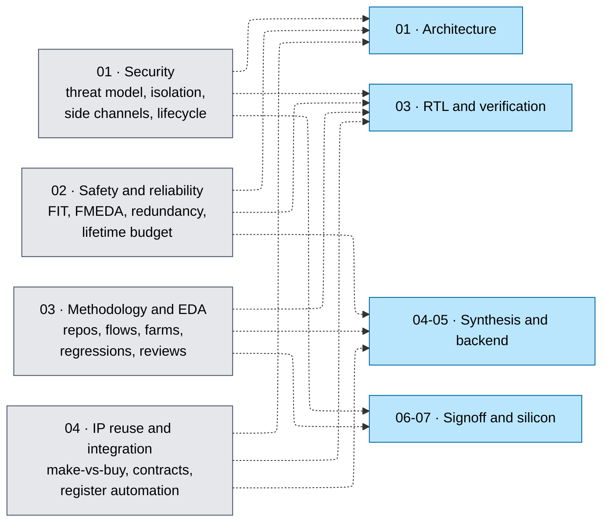

# 08 · Cross-Cutting Engineering — Folder Index

*The second cross-cutting track. Like [02 · Power](../02_Power_and_Low_Power/00_Index.md), nothing here is a stage in the flow — every page is a constraint or a practice that rides alongside architecture, RTL, implementation, and signoff at the same time.*

Folders `00 → 07` answer *how a chip is built*. This folder answers four questions that the flow order cannot express, because each of them applies at every stage at once:

- **What must the design resist?** — an adversary who owns the device (01).
- **How must it fail?** — survivably, with a measured metric (02).
- **How does a team of dozens build it reproducibly?** — repositories, flows, farms, regressions, reviews (03).
- **How is it assembled rather than written?** — 70–90% of an SoC's gates are IP the team did not author (04).

Each dotted arrow is a decision the flow stage cannot make for itself. A floorplan cannot decide whether two redundant channels need physical separation — the safety analysis decides that, and the floorplan obeys. RTL cannot decide whether a key register must be write-only — the threat model decides. This is exactly the relationship power has to the flow, which is why the two tracks are numbered as tracks.

## Pages

| # | Page | Coverage | Read it when |
|---|------|----------|---|
| 01 | [Hardware Security Architecture](01_Hardware_Security_Architecture.md) | Threat modeling as a design input; root of trust and the boot chain; key management in RTL; isolation, MPU/MMU/IOMMU and bus filtering; power/EM and timing/microarchitectural side channels with honest countermeasure costs; fault-injection resistance; PUFs and tamper response; debug and lifecycle gating; supply chain; verifying security with formal information-flow properties; CC/FIPS/SESIP evidence | Your design holds a key, enforces a boundary, or ships to a user who owns the hardware |
| 02 | [Functional Safety and Reliability Engineering](02_Functional_Safety_and_Reliability_Engineering.md) | Fault/error/failure vocabulary; FIT and MTBF; soft-error rate and derating; ISO 26262 ASIL, IEC 61508 SIL, DO-254 DAL and the metrics each demands; a worked FMEDA computing SPFM and LFM; the safety-mechanism catalogue with diagnostic coverage; redundancy math and where TMR loses; freedom from interference; safety-aware synthesis; aging as a lifetime budget; DPPM and the field-return loop | Your silicon goes into a car, a factory, an aircraft, or a body — or anywhere a failure is not merely annoying |
| 03 | [Design Methodology and EDA Infrastructure](03_Design_Methodology_and_EDA_Infrastructure.md) | Team roles and the milestone ladder; repository layout and what must never be committed; version control and the release manifest; TCL for engineers; build systems and flow DAGs; compute farms, licenses, and farm-sizing arithmetic; regression systems and triage; CI tiers for hardware; the metrics that actually run a project; design reviews; tool and PDK version discipline; **and a complete open-source toolchain a reader with no EDA licenses can install and run end to end** | You are about to work on, or start, a project bigger than one person and one file |
| 04 | [IP Reuse, Integration, and Register Automation](04_IP_Reuse_Integration_and_Register_Automation.md) | Make-vs-buy-vs-reuse with the hidden costs; hard/soft/firm IP; the IP delivery acceptance checklist; the six-surface integration contract; address maps as a first-class artifact; SystemRDL and IP-XACT with every generated artifact shown side by side; register design patterns done right; fabric and top-level generation; verifying an integration rather than a block; the integration-bug catalogue; delivering IP to someone else | You are integrating anything you did not write — which, on a real SoC, is most of it |

## Reading routes

- **"I write RTL and want the cross-cutting habits":** 04 §§4–7 (integration contract and register automation) → 01 §§3–4 (key registers, isolation) → 02 §§6, 9 (mechanisms and the synthesis channel-merging hazard) → 03 §§2–4, 8 (repo, TCL, CI).
- **"I am joining a real project and have never seen one":** 03 in full, then 04 §§1–4. These two pages are the shortest route from student practice to team practice.
- **"My chip has a security requirement":** 01 §§1–4 → 01 §9 (debug is the biggest hole) → 01 §11 (how you prove it) → 02 §6 for the redundancy that fault resistance borrows.
- **"My chip has a safety requirement":** 02 §§1–5 first — the vocabulary and FMEDA are non-negotiable — then §§6–8 for the architecture, then §9 for what changes in the flow.
- **"I want to actually run tools and have no licenses":** 03 §13, then the build projects in [Start Here §§3–5](../Start_Here_Learning_Path.md).

## Where these pages plug into the flow

| This folder | Constrains | Because |
|---|---|---|
| 01 · Security | [RTL Methodology](../03_Frontend_RTL_and_Verification/01_RTL_Design_Methodology.md), [Transaction Protocols](../01_Architecture_and_PPA/04_SoC_and_Chiplet_Architecture/03_Transaction_Protocols/01_AHB_AXI_APB.md), [DFT](../06_Signoff/02_DFT_and_ATPG.md), [Formal](../03_Frontend_RTL_and_Verification/12_Formal_Verification.md) | Isolation is a bus-level and RTL-level property; scan is a confidentiality hole; isolation proofs are formal |
| 02 · Safety | [Memory Circuits](../00_Fundamentals/06_Memory_Circuits_and_Technologies.md), [Floorplanning](../05_Backend_Physical_Design/03_Floorplanning_and_Power_Planning.md), [Synthesis Flow](../04_Synthesis/04_Synthesis_Flow_and_QoR_Closure.md), [Signal Integrity](../05_Backend_Physical_Design/02_Signal_Integrity_Reliability.md) | ECC lives in arrays; separation lives in the floorplan; redundant channels must not be merged by synthesis; aging is a lifetime budget |
| 03 · Methodology | [Synthesis Flow](../04_Synthesis/04_Synthesis_Flow_and_QoR_Closure.md), [Verification Planning](../03_Frontend_RTL_and_Verification/11_Verification_Planning_and_Coverage_Closure.md), [Signoff Orchestration](../06_Signoff/04_Signoff_Orchestration_ECO_and_Tapeout_Readiness.md) | Every run must be reproducible from a manifest, or none of its evidence counts |
| 04 · IP reuse | [SoC Implementation Blueprints](../01_Architecture_and_PPA/04_SoC_and_Chiplet_Architecture/08_Implementation_Blueprints/01_Address_Map_Protocols_and_Memory_Integration_Blueprint.md), [Arithmetic and Memory RTL](../03_Frontend_RTL_and_Verification/16_Arithmetic_and_Memory_RTL.md), [Chiplets](../01_Architecture_and_PPA/04_SoC_and_Chiplet_Architecture/05_IO_and_Chiplets/02_Chiplets_CXL_and_Die_to_Die.md) | The address map drives the fabric; CSRs should be generated; a chiplet is the integration contract made physical |

---

⬅ prev [07 · Manufacturing and Bring-up](../07_Manufacturing_and_Bringup/00_Index.md) · [Root Index](../Index.md) · [Flow Overview](../Chip_Design_Flow_Overview.md) · [Start Here](../Start_Here_Learning_Path.md) · next ➡ [Interview Prep](../interview_prep/00_Index.md)
