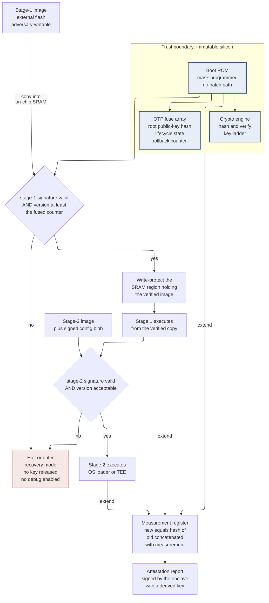
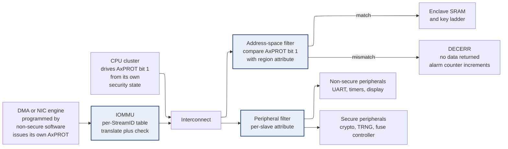
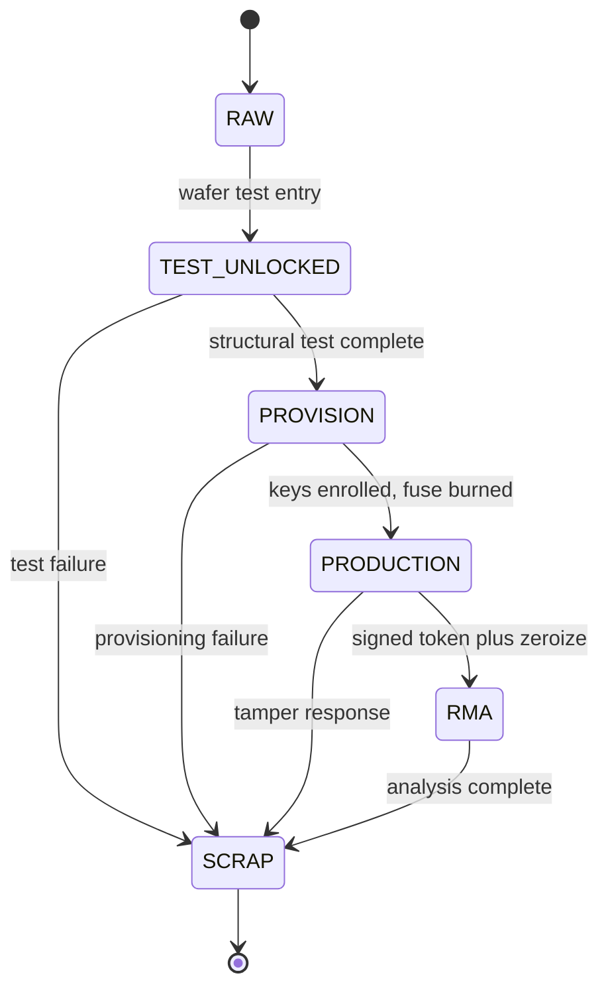

# Hardware Security Architecture — designing for an adversary who owns the device

> **Prerequisites:** [AHB, AXI, APB](../01_Architecture_and_PPA/04_SoC_and_Chiplet_Architecture/03_Transaction_Protocols/01_AHB_AXI_APB.md) — you need the idea that a bus transaction carries *sideband attributes* alongside address and data, and that a slave can terminate a transaction with an error response; the whole isolation architecture of §4 is built on one of those attribute bits. [DFT and ATPG](../06_Signoff/02_DFT_and_ATPG.md) — you need to know that design-for-test stitches flip-flops into scan chains that give full shift-in/shift-out control and observation of state; §9 is about what that does to a secret.
> **Hands off to:** [Functional Safety and Reliability Engineering](02_Functional_Safety_and_Reliability_Engineering.md) — it supplies the redundancy and diagnostic-coverage mathematics that §7 uses for fault-injection countermeasures, and it handles the *random* fault case that this page's *deliberate* fault case is a subset of. [IP Reuse, Integration and Register Automation](04_IP_Reuse_Integration_and_Register_Automation.md) — it owns the register-generation flow that must emit the access-control attributes §3 and §9 depend on.

---

## 0. Why this page exists

Folder `08` is a **cross-cutting track**, in the same sense that `02_Power_and_Low_Power` is. It is not a stage of the flow that happens between synthesis and place-and-route. Security, safety, and design methodology are *properties of the whole flow*: a security requirement is born in the architecture spec, constrains the RTL, changes the floorplan, adds signoff checks, survives into the test program, and is still being argued about during certification two years after tape-out. If you try to add security at one point in the flow — the usual attempt is "we will bolt on a crypto accelerator during integration" — you will discover that the expensive parts of the problem are all somewhere else: in the boot ROM you cannot change after mask, in the scan chains DFT inserted, in the fuse array, and in the address map.

The specific thing this page owns is the **shift in assumption**. Every other page in this notebook assumes the environment is *indifferent*: the clock is roughly periodic, the supply is roughly $V_{DD}$, memory returns what was written, and the only reason a value is wrong is a manufacturing defect or a design bug. Hardware security assumes the environment is *hostile and intelligent*: the supply is whatever the adversary applies to the board, the clock is whatever they generate, the flash contains whatever they programmed, and the device is sitting on their bench with its lid off. The adversary is not a random process; they read your datasheet, they have your errata, and they will find the one path you did not think about. Designing under that assumption is a different discipline, and it produces different RTL.

This page is a **defensive design reference**. It describes attack mechanisms only to the depth an architect needs to *choose and size a countermeasure* — the physics that makes a leak or a fault possible, and the design weakness that turns that physics into a compromise. Every mechanism is paired with its mitigation and the cost of that mitigation, because a countermeasure you cannot afford is not a countermeasure. It is not a manual for attacking anything; there are no procedures, no tooling, and no recipes here, and none are needed to make the design decisions.

After this page you should be able to: write a threat model that produces *testable* requirements rather than adjectives; draw a boot chain and say precisely which link, if made mutable, collapses the whole thing; explain to a physical-design lead why a crypto block has floorplan constraints; choose a masking order and defend the number; build a device lifecycle state machine in fuses; write assertions that express isolation as a formal property; and read a certification scheme's evidence list without panic.

---

## 1. The threat model as a design input

### 1.1 The four things a threat model must name

A threat model that says "the device shall be secure" is a wish. A threat model that produces RTL names four things, and every one of them is a *decision* that costs money if you get it wrong in either direction.

**The asset.** What, specifically, is worth stealing or breaking? Not "the chip" — a concrete piece of state: a 256-bit device root key, the confidentiality of a firmware binary, the authenticity of a sensor reading, the integrity of a billing counter, the availability of a brake-actuation path. Assets are enumerable; if your list has fewer than five entries you have not finished, and if it has fifty you have listed features, not assets.

**The adversary capability tier.** This is the single most consequential line in the document, because cost scales roughly geometrically with tier and each tier is defeated by a different family of mechanism.

| Tier | What the adversary can do | Typical cost to mount | Defeated by |
|---|---|---|---|
| **T0 — remote software** | Send messages over network, USB, radio; supply files, images, updates | Effectively zero, and scales to every device at once | Authenticated boot, signed updates, memory safety, protocol hardening |
| **T1 — local software** | Execute code on the device, possibly at OS privilege; read/write any address the hardware permits; time their own instructions | Low, once one device is rooted; scales by publication | Privilege levels, MPU/MMU/IOMMU, bus filtering, microarchitectural isolation (§4, §6) |
| **T2 — board-level physical** | Own the board: probe and drive pins, desolder and reflash memories, control the supply and the clock, put a probe over the package, attach to the debug header | Hundreds to a few thousand dollars of bench equipment; does not scale — one device at a time | On-die sensors, fault-tolerant control flow, side-channel countermeasures, lifecycle-gated debug (§5, §7, §9) |
| **T3 — invasive / laboratory** | Decapsulate, image the die, edit or probe metal layers, apply focused optical or electromagnetic stimulus to a chosen coordinate | Tens of thousands to millions of dollars, plus specialist expertise and months | Shields and meshes, sensors, scrambled and encrypted on-die storage, PUF-derived keys, tamper response (§8) |

The tiers are cumulative — a T3 adversary can also do everything in T0 through T2 — and the correct engineering question is never "are we secure?" but **"at which tier do we intend to lose, and is that acceptable to the business?"** A smart meter that resists T2 for the ten-year deployment life is a success even though a national laboratory could open it, because the utility's loss model is fraud by consumers with bench equipment, not by nation-states. A payment secure element that loses at T2 is a catastrophe. Writing the intended break-even tier into the specification is what makes the rest of the design decidable.

Certification schemes formalize this as **attack potential**, which is what turns a qualitative tier into a number. The Common Criteria supporting document for smartcards scores an attack along five axes — elapsed time, expertise, knowledge of the design, window of opportunity, and equipment — separately for *identifying* the attack and for *exploiting* it, and sums the points. Roughly, a total under about 16 is rated "Basic", 16–20 "Enhanced-Basic", 21–24 "Moderate", 25–30 "High", and 31 or more "Beyond High"; the top hardware assurance component, `AVA_VAN.5`, demands resistance to "High". The value of the scheme is not the exact arithmetic, it is that it makes "we raised the bar" auditable: a countermeasure that adds two weeks of elapsed time to an attack moves a specific number.

**The attack surface.** Every place an untrusted input crosses into a trusted region: external memory buses, the debug port, radio and network interfaces, the update channel, every register a lower-privilege agent can write, every shared microarchitectural structure, the supply and clock pins, and the package surface. The discipline is to enumerate them *from the physical implementation*, not from the block diagram — the block diagram does not show that the "internal" test bus was routed to a probe pad, and that pad is attack surface.

**The security objective.** For each asset, which of these must hold: **confidentiality** (the value is not learnable), **integrity** (the value is not modifiable undetected), **availability** (the function keeps working), **authenticity** (the origin is verifiable), and, often forgotten, **freshness** (this is the *current* value, not a replayed old one). Availability is the objective most often dropped from hardware threat models and the one that matters most in automotive and industrial parts, where a denial-of-service on a shared interconnect is a safety event, not an inconvenience.

### 1.2 A worked threat model for an SoC with a secure enclave

Consider a realistic part: an applications SoC with four general-purpose cores running a rich OS, a DMA-capable network engine, a display controller, a shared last-level cache, and a **secure enclave** — a small always-on subsystem with its own CPU, its own SRAM, a crypto engine, a true random number generator, and an OTP fuse array. The enclave provisions and holds device keys and performs signing on behalf of the rich OS. The intended break-even is **resist T2 completely, resist T3 long enough that a single extracted key is not economically worth the effort.**

| # | Asset | Tier in scope | Attack surface | Objective at risk | Design requirement it produces | Where it lands | Evidence that closes it |
|---|---|---|---|---|---|---|---|
| 1 | Device root key | T3 | Fuse array, probe pads, enclave SRAM | Confidentiality | Root key never crosses any path readable by software or scan; fuse array and key ladder placed under the power grid inside the enclave's floorplan region | RTL + floorplan | Formal non-interference proof (§11.2); layout review sign-off; scan-exclusion report |
| 2 | Firmware authenticity | T0 | OTA update channel, external flash | Authenticity, integrity, freshness | ROM-anchored signature verification of every stage; monotonic anti-rollback counter in OTP | RTL (boot ROM, OTP controller) | Boot-chain assertions; negative tests with corrupted, downgraded, and truncated images |
| 3 | Enclave SRAM contents | T1 | DMA masters, MMIO aperture, LLC | Confidentiality, integrity | Enclave address range unreachable by any transaction whose security attribute is non-secure; every DMA master behind an IOMMU; DMA inherits the security attribute of the agent that programmed it | RTL (interconnect, IOMMU, DMA) | SVA bound at SoC top (§11.3); address-map completeness proof |
| 4 | Signing key during use | T2 | Supply pin, EM field over the package | Confidentiality | First-order masked crypto datapath with a PRNG reseeded from the TRNG; crypto block placed away from the die edge and under dense metal | RTL + floorplan + backend | Leakage assessment to $10^6$ traces; routing-density check over the crypto region |
| 5 | Secure boot decision | T2 | Supply and clock pins, reset pin | Integrity | On-die droop, clock-period, and temperature monitors with a hardwired alarm; every security decision double-checked and encoded with large Hamming distance; glitch-filtered reset | RTL + analog IP | Fault-injection simulation campaign with a stated detection fraction (§11.4) |
| 6 | Attestation identity | T1, T2 | JTAG header, scan chains | Authenticity | Debug access gated by fuse-backed lifecycle state and a signed, device-bound token; entry to any test mode unconditionally zeroizes secrets | RTL (lifecycle controller, DFT wrapper) | Lifecycle truth-table review; SVA on debug enable; ATPG coverage waiver justification |
| 7 | Availability of the safety path | T0, T1 | Shared LLC, NoC, memory controller | Availability | Reserved interconnect bandwidth and cache ways for the safety domain, not best-effort QoS | RTL (QoS, cache partitioning) | Worst-case latency measured under adversarial traffic, not average |

Read the table left to right and notice what has happened: the right-hand columns are no longer security language. "Enclave address range unreachable by a non-secure transaction" is a *bus decode* requirement that an integrator can implement and a formal tool can prove. "Crypto placed away from the die edge and under dense metal" is a *floorplan* constraint that goes in the same constraint file as macro placement blockages. "Every security decision double-checked with large Hamming distance" is an *encoding* rule that a linter can check. This translation is the entire job of §1, and a threat model that does not produce that right-hand column has not been finished.

Two structural lessons fall out of the table. First, rows 1, 4, and 6 have floorplan or DFT consequences, which means **security requirements must exist before floorplanning and before DFT insertion**, not after RTL freeze. Discovering row 6 after scan insertion means re-running DFT, re-closing timing on the scan paths, and re-running ATPG. Second, row 3's requirement mentions the *IOMMU* and the *DMA* and the *interconnect* — three teams. Security requirements are disproportionately **integration** requirements, which is why they are disproportionately missed: every individual block is correct and the composition is not.

---

## 2. Root of trust and the boot chain

### 2.1 Deriving the chain from the simplest broken thing

**Baseline.** The CPU comes out of reset fetching from address zero, which is mapped to an external flash device holding the firmware. This is how most non-secure embedded parts boot, and it works.

**Failure.** A T2 adversary desolders the flash, writes their own image, and resolders it. The CPU executes it with full privilege. Every asset in §1.2 is gone. Note that this is not a subtle failure: it defeats *all seven rows at once*, because whoever controls the first instruction controls everything after it.

**Derived repair, attempt one.** Have the firmware verify itself: prepend a digital signature, and have the code at address zero check that signature before jumping to the main body. This is circular and useless — the verifier is in the same flash the adversary rewrote, so they delete the check. The lesson generalizes into the invariant that governs everything below: **a verifier must be less mutable than the thing it verifies.**

**Derived repair, attempt two.** Put the verifier in on-die **mask ROM** — logic literally patterned into a mask layer, containing the first instructions the CPU fetches. Now the verifier cannot be rewritten by anyone below tier T3, and rewriting it at T3 means editing a metal layer on a die you must first decapsulate. But the verifier needs a public key to check the signature against, and if that key lives in flash the adversary substitutes their own key with their own signature. So the *key* must also be immutable. On-die **one-time-programmable (OTP)** storage — eFuse or antifuse — is the standard answer, because it is written once during manufacturing and physically cannot be rewritten. See [Memory Circuits and Technologies](../00_Fundamentals/06_Memory_Circuits_and_Technologies.md) for the cell-level physics of how a fuse is programmed and why an antifuse is harder to read optically than a blown metal fuse.

**A cost optimization that is also a security decision.** Fuses are expensive: an OTP bit occupies far more area than a ROM bit or an SRAM bit, and the programming circuitry needs charge pumps and a separate high-voltage domain. An RSA-3072 public key is 3072 bits; an ECDSA P-256 public key is 512 bits. Instead of storing the key, store its **hash** — 256 bits — in fuses, and keep the key itself in the (mutable, external) image. The ROM hashes the supplied key, compares against the fuse value, and only then uses it to check the signature. You have compressed the immutable root to 256 bits, and you have gained the ability to rotate the key across product variants by changing only the fused hash.

### 2.2 The chain and its invariant



**Contract of the figure.** Everything inside the shaded boundary is fixed at manufacture and cannot be changed by any adversary below T3. Everything outside it is assumed to be adversary-controlled. Each arrow crossing *into* the boundary is a place where untrusted data enters and must be checked; each arrow crossing *out* is a place where trust is extended and must be earned.

**One concrete trace.** Power-on: the CPU fetches from ROM. The ROM reads the fused lifecycle state (§9) and the root key hash. It DMAs the 512 KB stage-1 image from flash into on-chip SRAM. It hashes the supplied public key and compares against the fuse — if it differs, it takes the `no` branch immediately, without ever touching the image. It hashes the image with the on-die SHA-256 engine and verifies the ECDSA-P256 signature. It compares the image's version field against the fused monotonic counter. If both pass, it sets the SRAM region's write-protection bit, extends the measurement register with the image hash, and jumps into the SRAM copy. Timing arithmetic: a hardware SHA-256 core processing one byte per cycle at 200 MHz hashes 512 KB in $524288 / 2\times10^{8} = 2.6$ ms; a hardware ECDSA-P256 verification is roughly $10^5$ cycles, or 0.5 ms. Total boot-chain cryptographic cost for this stage is about 3 ms — which matters, because automotive requirements such as "rear camera image displayed within two seconds of ignition" are boot-time budgets that secure boot must fit inside. A 4 MB stage-2 image at the same rate costs 21 ms, and a *software* ECDSA verification on a small core at $10^6$–$10^7$ cycles would cost 5–50 ms per signature. This arithmetic is why a hash accelerator is not optional in a part with a boot-time requirement.

**The failure the figure illustrates.** Follow the arrow labelled "copy into on-chip SRAM" and then the one labelled "write-protect". If you delete the write-protect step, or if you verify the flash copy in place and then execute *from flash*, you have a **time-of-check-to-time-of-use** hole: the verification passed on the bytes that were present during hashing, but the CPU fetches instructions later, from a memory the adversary can still drive. At T2, an adversary who controls the flash chip's data lines can answer one way during the hash and another way during the fetch. The mitigation is structural: **verify what you execute, execute what you verified, and make it immutable in between.** Copy to on-chip SRAM, verify in place, lock the region, then jump.

### 2.3 The chain-of-trust invariant, stated precisely

> For every $i$, stage $i$ transfers control to stage $i+1$ only after verifying stage $i+1$ against a key rooted in immutable storage, **and** the memory holding stage $i+1$ is not writable by any agent less trusted than stage $i$ from the moment of verification until control transfer, **and** stage $i$ does not increase the privilege available to stage $i+1$ beyond what stage $i$ held.

Three clauses, and each one is a real bug class when dropped:

- **Drop the verification clause on any single link** and the chain is worth exactly as much as its shortest verified prefix. This is why "we verify the bootloader but the kernel is loaded by the bootloader without a check" is not a partial win; it is a total loss for every asset the kernel can reach.
- **Drop the immutability clause** and you get the TOCTOU hole above. This clause is also what forbids a common and tempting design: verifying an image while a DMA-capable peripheral is still enabled and could rewrite the buffer.
- **Drop the monotonic-privilege clause** and you get the classic escalation where the ROM runs in the highest privilege mode, verifies a stage that is *supposed* to drop to a lower mode, but leaves the mode-change to the verified code itself. Any fault (§7) that skips that instruction leaves untrusted-tier code at ROM privilege. The fix is to make the privilege drop a side effect of the control transfer in hardware, not an instruction the next stage executes.

### 2.4 Anti-rollback, and why it must be unary

Signature verification stops the adversary from running *their* code. It does not stop them from running *your old, vulnerable* code, correctly signed by you, from three firmware releases ago. That downgrade re-opens every bug you have patched since.

The repair is a **monotonic counter**: the image carries a security version number, the device holds the minimum acceptable version, and boot fails if the image's version is lower. The counter's storage is the entire problem. In rewritable flash, the adversary rewrites it. In an SRAM-backed register, it dies at power-off. It must be in OTP, and — this is the part people get wrong — it must be stored in **unary (thermometer) encoding**: version $n$ is represented by $n$ burned fuses, not by the binary value $n$. The reason is arithmetic on a write-once medium. Fuses go from 0 to 1 and never back. In binary, incrementing 3 (`0011`) to 4 (`0100`) requires clearing two bits — physically impossible. In unary, incrementing means burning one more fuse, always legal, and *decrementing is physically impossible*, which is exactly the security property you want enforced by physics rather than by logic. The cost is fuse area: 32 fuses buy 32 lifetime security-version increments. That is a real product constraint — it means you can issue at most 32 *security-critical* firmware revisions over the device's life, so you burn a fuse only when a release fixes an exploitable bug, not on every release.

### 2.5 Verified boot and measured boot are different mechanisms

They are routinely conflated, and they answer different questions.

**Verified boot** enforces a *local policy*: this device refuses to run code that is not signed by an accepted key. It fails closed. It is what protects assets on the device itself.

**Measured boot** produces *remote evidence*: each stage hashes the next stage and extends a measurement register before executing it, where "extend" means $\mathrm{PCR} \leftarrow H(\mathrm{PCR} \,\|\, \text{measurement})$. Because the register can only be extended, never written, the final value is a commitment to the *entire ordered sequence* of what ran. The device later signs that value with a key that only the enclave can use, and a remote party checks the resulting **attestation report** against a list of known-good measurements.

You want both, and for different reasons. Verified boot cannot tell a remote server which firmware version is running; measured boot cannot stop the device from running bad firmware. A payment backend that will only release a token to a device whose measurement matches an approved build needs measurement; the device that must not boot an attacker's kernel needs verification. In hardware terms, measurement costs a small extendable register bank plus a hash engine you already have, and the far more expensive piece is the *key* used to sign the report — which brings us to key management.

---

## 3. Key management in hardware

### 3.1 The hierarchy, and why it is a hierarchy

**Baseline.** Store one key in fuses; use it for everything: disk encryption, attestation, secure-channel establishment, debug unlock.

**Failure.** Three separate ones, and each is fatal in a different way. (a) Any single protocol weakness anywhere leaks *the* key, and the device is unrecoverable — there is no rotation path in a write-once medium. (b) Cryptographic hygiene forbids using one key for both encryption and signing; cross-protocol interactions between them are a well-known source of breaks. (c) The key must be *usable* by several subsystems, so it must be routed to several places, and every extra consumer is another path that must be proven not to leak it.

**Derived repair: a key ladder.** Fuses (or a PUF, §8) hold a single **device root key** $K_{root}$ that is used for exactly one operation: as the input to a key derivation function (KDF). Every key the system actually uses is derived:

$$
K_{i} = \mathrm{KDF}\!\left(K_{i-1},\; \text{label}_i \,\|\, \text{context}_i\right)
$$

where the KDF is typically an HMAC or a block-cipher-based construction — one-way, so knowing $K_i$ gives no information about $K_{i-1}$. The "ladder" name comes from the fact that this is implemented as a small hardware state machine that walks down levels, with $K_{root}$ available only as the *first* input and never as an output. Concretely, a three-rung ladder on our enclave might produce:

| Rung | Derivation input | Resulting key | Consumer |
|---|---|---|---|
| 0 | $K_{root}$ from fuses or PUF | — | key ladder only; no other net in the design |
| 1 | $\mathrm{label} = $ lifecycle state, chip ID | $K_{dev}$ | rung 2 only |
| 2 | $\mathrm{label} = $ "storage", boot measurement | $K_{storage}$ | inline memory encryption engine |
| 2 | $\mathrm{label} = $ "attest", boot measurement | $K_{attest}$ | signing engine |
| 2 | $\mathrm{label} = $ "unlock" | $K_{unlock}$ | debug authentication check |

Two of these labels are doing security work that is worth stating explicitly. Binding the **boot measurement** into the derivation means that if different firmware boots, different keys come out — data sealed by the approved firmware is cryptographically inaccessible to any other firmware, without any access-control logic being involved. Binding the **lifecycle state** means that a device whose debug port has been opened derives a *different* $K_{storage}$ than a production device, so enabling debug does not expose production-encrypted data; it renders it permanently unreadable. That is a much stronger property than "debug is disabled when secrets are present," because it survives a mistake in the debug gating logic.

**Cost.** The ladder is a modest hardware block — a KDF core (which is the hash or block cipher you already have), a small sequencer, a few 256-bit registers, and the access-control logic around them. Call it 15–30 kGE. The real cost is architectural: every consumer of a key must be redesigned to accept a key *pushed to it over a private port* rather than fetched from memory, and there must be no software-visible path in between.

### 3.2 Why keys must never be software-readable

The argument is about the size of the trusted computing base. Firmware and OS code on a modern SoC is measured in millions of lines. The probability that all of it is free of memory-disclosure bugs is, empirically, zero. If a key is *readable by software*, then every one of those millions of lines is part of the key's protection boundary, and one out-of-bounds read anywhere in that surface extracts it.

If the key is instead delivered on a dedicated wire from the ladder to the crypto datapath, with no path to any bus read-data mux, then the property "software cannot read the key" is enforced by the *absence of a circuit* rather than by the correctness of code. Absence of a circuit is a property a formal tool can prove exhaustively (§11.2). This is the general shape of the best hardware security arguments: **replace a policy that must be correctly enforced with a structure that makes the violation unrepresentable.**

### 3.3 The write-only register pattern

```systemverilog
// Key register with a one-way path to the crypto datapath, a sticky lock,
// and asynchronous zeroization on a latched tamper alarm.
//
// Contract:
//   - software MAY write key words while the lock is clear
//   - software may NEVER read key data: the read mux returns status bits only
//   - once the lock is set it cannot be cleared except by power-on reset
//   - a tamper alarm clears the key without requiring a running clock
module key_register #(
  parameter int unsigned KEY_BITS = 256,
  parameter int unsigned WORDS    = KEY_BITS / 32
) (
  input  logic                     clk,
  input  logic                     rst_n,      // power-on reset, active low
  input  logic                     tamper_n,   // LATCHED, filtered alarm, active low
  // write port, already address-decoded by the register block
  input  logic                     wr_en,
  input  logic [$clog2(WORDS)-1:0] wr_idx,
  input  logic [31:0]              wr_data,
  input  logic                     lock_set,   // write-1-to-set, no clear term
  // read-back port: status only
  output logic [31:0]              rd_status,
  // private port to the crypto datapath -- the ONLY consumer of key_q
  output logic [KEY_BITS-1:0]      key_o,
  output logic                     key_valid_o
);

  logic [KEY_BITS-1:0] key_q;
  logic                lock_q;
  logic                loaded_q;
  logic                clr_n;

  // Power-on reset and tamper are merged into one asynchronous clear so the
  // register maps onto an ordinary async-reset flop from any standard library.
  // tamper_n must already be latched and glitch-filtered: an asynchronous
  // clear driven by combinational logic that can glitch is a reliability bug.
  assign clr_n = rst_n & tamper_n;

  always_ff @(posedge clk or negedge clr_n) begin
    if (!clr_n) begin
      key_q    <= '0;
      loaded_q <= 1'b0;
    end else if (wr_en && !lock_q) begin
      key_q[wr_idx * 32 +: 32] <= wr_data;
      loaded_q                 <= 1'b1;
    end
  end

  // Set-only: there is deliberately no assignment that drives lock_q low.
  always_ff @(posedge clk or negedge rst_n) begin
    if (!rst_n)        lock_q <= 1'b0;
    else if (lock_set) lock_q <= 1'b1;
  end

  // No net in this block carries key_q into rd_status. That absence is the
  // security property, and it is what the formal check in section 11.2 proves.
  always_comb begin
    rd_status    = 32'b0;
    rd_status[0] = lock_q;
    rd_status[1] = loaded_q;
    rd_status[2] = ~tamper_n;
  end

  assign key_o       = key_q;
  assign key_valid_o = loaded_q & lock_q;

endmodule
```

**What each construct is buying.** `lock_q` has no clearing term in its `always_ff`, so synthesis produces a flop whose only path back to zero is the asynchronous reset — a *sticky* bit by construction, which is stronger than a bit that software is merely not supposed to clear. `rd_status` is built by an `always_comb` that assigns a default of all-zeros first and then sets three bits, so there is no latch and no accidental key path; note that the security argument here is not "we wrote the code carefully," it is "the synthesized cone of logic feeding `rd_status` provably does not contain `key_q`," which §11.2 checks mechanically. The merged asynchronous clear is the interesting one: zeroization on tamper must work when the adversary has stopped the clock, which is precisely the condition a T2 adversary can create, so a synchronous clear would be defeated by simply not supplying edges. The comment about `tamper_n` being latched and filtered is not cosmetic — an asynchronous reset driven by a combinational sensor output will fire on noise and can violate reset recovery/removal timing; see [Async Design and CDC](../03_Frontend_RTL_and_Verification/06_Async_Design_and_CDC.md) for why the deassertion edge must be synchronized even when the assertion is not.

**What this block does not solve.** It protects the key at rest inside the register. It says nothing about the key while it is in flight through the crypto datapath, which is where §5's side channels live, and nothing about scan (§9), which can shift `key_q` out through a path this module cannot see. Both are integration-level problems, and both are why a "secure key register" delivered as standalone IP is not a security solution by itself.

### 3.4 Zeroization and the debug interaction

**Zeroization** is the deliberate destruction of key material, and it is a certification requirement, not an optional nicety. Two design rules make it real. First, it must be reachable from hardware alarms directly, as above, so it does not depend on firmware that a fault may have derailed. Second, it must be *complete*: the key exists not only in `key_q` but in pipeline registers inside the crypto datapath, in any buffer it was loaded through, and possibly in a cache line if it was ever in memory. A zeroize that clears the key register and leaves a copy in a round-key expansion register has accomplished nothing. The practical technique is to give every register that can hold key-derived material a common `zeroize` input, and to *verify* the completeness by formal reachability: prove that every flop in the security region is in the fan-out of the zeroize signal.

The **debug interaction** is the subtle part. The obvious rule — "when debug is enabled, zeroize" — is correct but brittle, because it depends on the debug-enable logic being right. The robust design layers the key-ladder diversification of §3.1 on top: the lifecycle state is a KDF input, so a device in a debug-enabled state simply *derives different keys*. Even if a fault or a logic bug enables debug while secrets are live, the secrets that get exposed are not the production secrets. Defense in depth here is cheap — it costs one extra input to a derivation you were doing anyway.

---

## 4. Isolation architecture

### 4.1 The ladder of isolation mechanisms

Isolation exists because one piece of silicon must run code and hold data belonging to mutually distrusting parties. The mechanisms form a ladder, each rung added because the one below it failed against a specific adversary.

**Privilege levels.** The oldest mechanism: the CPU has a mode bit (or two or three bits), certain instructions and certain control registers are legal only in the higher mode, and the transition upward happens only through a controlled entry point — a trap or exception vector. RISC-V names its levels M (machine), S (supervisor), and U (user), with an optional H extension for hypervisor; Arm names them EL3 through EL0. *What breaks without it:* application code writes the page-table base register and maps whatever it likes. *Cost:* a few bits of state and a check on every privileged access, essentially free.

**Memory protection unit (MPU) versus MMU.** A privilege level partitions *instructions*; you also need to partition *addresses*. An MPU holds a small number — typically 8 to 16 — of base/limit region descriptors with permission bits, compares every access against all of them in parallel, and faults on a mismatch. There is no translation and no table walk, so latency is fixed and small, which is why MPUs dominate hard-real-time and safety parts. An MMU instead translates through in-memory page tables with a TLB in front, giving per-4 KB granularity, sparse address spaces, and the ability to give each process an identical virtual layout — at the cost of a page-table walk on a TLB miss, which is a variable and occasionally long latency. *Selection boundary:* if you need determinism and have fewer than a dozen protection regions, an MPU is the right answer and an MMU is over-engineering; if you need to isolate dozens of dynamically created contexts, only an MMU scales. See [TLB and Virtual Memory](../01_Architecture_and_PPA/01_CPU_Architecture/05_Virtual_Memory/01_TLB_and_Virtual_Memory.md) for the translation machinery itself.

**Secure and non-secure worlds.** Privilege levels are a *totally ordered* hierarchy, and that ordering is wrong for the enclave problem: you want a small, highly trusted piece of code that the *most* privileged rich-OS code — the hypervisor — still cannot inspect. You cannot express "trusted but orthogonal" on a single axis. The repair is a second, orthogonal axis: a **security state** (Arm's TrustZone secure/non-secure worlds; equivalently a physical memory-attribute domain), so the state space is (privilege level) × (security state), and a non-secure hypervisor and a secure application are simply incomparable. *Cost:* the security state must be carried and checked everywhere, which is the next rung.

### 4.2 The security attribute rides on the transaction

This is the mechanism that makes everything above enforceable outside the CPU, and it is why [AHB, AXI, APB](../01_Architecture_and_PPA/04_SoC_and_Chiplet_Architecture/03_Transaction_Protocols/01_AHB_AXI_APB.md) is a prerequisite. On AXI, every read and write address channel carries a three-bit protection attribute, `ARPROT` / `AWPROT`:

| Bit | Meaning when 0 | Meaning when 1 |
|---|---|---|
| `AxPROT[0]` | unprivileged access | privileged access |
| `AxPROT[1]` | **secure** access | **non-secure** access |
| `AxPROT[2]` | data access | instruction access |

The bit that matters here is `AxPROT[1]`, and note its polarity: **1 means non-secure**. A master drives these bits from its own current state — a CPU drives `AxPROT[1]` from the security state it is currently executing in, and the hardware does not let software forge it. The attribute travels with the transaction across the interconnect, and any point along the path can inspect it.

That gives the enforcement point: an **address-space filter** placed in front of each protected slave, holding a table of regions and their required security state, comparing `AxPROT[1]` against the region's setting, and terminating a mismatched transaction with a `DECERR` response (`RRESP` / `BRESP` = `2'b11`) *without forwarding it*. A **peripheral protection controller** does the same job for the APB peripherals behind a bridge, at whole-peripheral granularity, which is enough because a peripheral is the natural ownership unit.



**Contract.** Every path from any master to the enclave passes through exactly one shaded checking block, and no path bypasses one. **Trace:** the rich OS, running non-secure, issues a load from the enclave SRAM base address. The CPU drives `ARPROT[1] = 1`. The filter looks the address up, finds the region marked secure-only, does not forward the transaction, returns `RRESP = 2'b11` with zeroed read data, and increments an alarm counter that firmware can poll — because a *single* such access is a bug but a *stream* of them is an adversary probing the map, and the counter is what makes that visible. **The trade-off it illustrates:** the filter sits in the address path of every access to that slave, so it costs a comparison stage. Put it combinationally in the path and it eats timing margin on the critical interconnect path; register it and it costs a cycle of latency on every access. Most designs register it, because one cycle to the enclave is irrelevant while a timing failure on the main interconnect is not.

```wavedrom
{ "signal": [
  { "name": "aclk",       "wave": "p........." },
  { "name": "arvalid",    "wave": "01.0.1.0.." },
  { "name": "araddr",     "wave": "x3.x.3.x..", "data": ["enclave base", "enclave base"] },
  { "name": "arprot[1]",  "wave": "x4.x.5.x..", "data": ["1 = non-secure", "0 = secure"] },
  { "name": "region_sec", "wave": "01.......0" },
  { "name": "rvalid",     "wave": "0..1.0..1." },
  { "name": "rresp",      "wave": "x..6.x..7.", "data": ["DECERR", "OKAY"] },
  { "name": "rdata",      "wave": "x..8.x..9.", "data": ["0x00000000", "enclave data"] }
 ],
 "head": {"text": "identical address, two AxPROT values: the filter is the entire difference"}
}
```

The waveform makes the point that the address is *not* the access control. The same `araddr` appears twice; the only difference is `arprot[1]`, and the filter converts that one bit into either a `DECERR` with zeroed data or a normal `OKAY` with real data. It also shows the response discipline that matters for the assertion in §11.3: on the rejected access, `rdata` is driven to zero rather than to whatever the slave happened to have on its bus. Returning *stale* or *unrelated* data on an error response is a real leak — the read data bus is shared, and an errored access that returns the previous beat's data hands the requester a sample of someone else's traffic.

### 4.3 The confused deputy a DMA engine creates

**The failure.** A DMA engine is a bus master that acts on behalf of whoever programmed it. Non-secure software writes the DMA's source register, destination register, and length, then starts it. The DMA issues transactions on the interconnect — and here is the hole: *whose security attribute does it drive?* If the DMA is used by both worlds and drives `AxPROT[1] = 0` (secure) because the secure world also needs it, then non-secure software has just obtained a secure read or write by proxy. The DMA is the **confused deputy**: it holds authority (secure attribute) and it accepts instructions (addresses) from a party that does not hold that authority, and it has no way to notice the mismatch.

Hard-wiring the DMA to non-secure is not a fix either; it just makes the DMA useless to the secure world, and the pressure to "temporarily" add a secure mode returns in the next project.

**Two repairs, and they compose.**

*Repair one — attribute inheritance.* The DMA latches, per channel, the security attribute of the transaction that *configured* that channel. If a non-secure write programmed channel 3, then channel 3's outbound transactions carry `AxPROT[1] = 1` forever after, and the filter of §4.2 rejects them at the enclave. This is cheap — one bit per channel plus the capture logic — and it is the minimum acceptable design for any shared master. The rule generalizes: **a master's outbound security attribute must be derived from the attribute of the agent that gave it its instructions, never from a static property of the master.**

*Repair two — an IOMMU.* Attribute inheritance handles the secure/non-secure axis but not the finer problem: two mutually distrusting non-secure clients (two virtual machines, or a VM and a driver) both using the same DMA engine, where one programs a destination address inside the other's memory. Here the security attribute is identical and inheritance buys nothing. The repair is to put the DMA's addresses through **translation**: the IOMMU (Arm calls it an SMMU) tags every transaction with a **StreamID** identifying the originating device and channel, looks up a translation context for that StreamID, and walks page tables that are owned by the domain the device was assigned to. The device can then only reach memory that its owner mapped, and it addresses that memory through the owner's *virtual* addresses, so a forged physical address is not even expressible. [Page Walkers, IOMMUs and Virtualization](../01_Architecture_and_PPA/01_CPU_Architecture/05_Virtual_Memory/02_Page_Walkers_IOMMUs_and_Virtualization.md) covers the translation machinery in depth.

**Cost, honestly stated.** An IOMMU adds a translation lookaside buffer and a page-table walker to the device path. On a TLB hit the cost is one lookup, pipelined, typically invisible. On a miss with two-stage translation (device virtual → guest physical → host physical) over four-level tables, the worst case is about **24 memory accesses** for a single translation, because each of the five stage-1 walk steps itself needs a stage-2 walk. For a DMA engine streaming sequentially this is amortized over a whole page; for a scatter-gather descriptor chain hopping randomly it is not, and the throughput hit is real. Mitigations are the usual ones — large-page mappings for device buffers, a device-side TLB, and pinning translations for long-lived DMA regions.

### 4.4 The failure mode that survives all of the above: address-map holes

Every mechanism in this section is a *check at a point*. The composition is only as good as the claim that **every** path passes through a check, and that claim is about the address map, not about any block. Three recurring holes:

- **Aliasing.** The same physical memory is decodable at two address ranges — commonly a "low" mirror for legacy compatibility, or a debug aperture — and only one range is behind the filter. The check is present and the check is bypassable.
- **Incomplete decode.** An address range is not assigned to any slave, and the interconnect's default behavior for unmapped addresses is to forward to a "default slave" that happens to be a real memory rather than an error terminator.
- **Configuration ordering.** The filter's region table is programmed by firmware at boot. Between reset deassertion and the moment that table is written, the filter is wide open, and any master that is out of reset in that window can walk through it. The fix is that the *reset value* of every filter must be maximally restrictive, so the boot sequence opens things up rather than locking them down.

The remedy for all three is not review; it is a mechanical proof of **address-map completeness and non-overlap**, generated from the same single source of truth that generates the decoders and the register maps. This is one of the strongest arguments for automated address-map and register generation, which is the subject of [IP Reuse, Integration and Register Automation](04_IP_Reuse_Integration_and_Register_Automation.md).

---

## 5. Side channels — power and electromagnetic

### 5.1 The physics: switching power is data-dependent by construction

Every other page in this notebook treats dynamic power as an aggregate quantity to be minimized. Here it is a *signal*. Recall the switching-power expression from [Power Fundamentals](../02_Power_and_Low_Power/01_Power_Fundamentals.md):

$$
P_{sw} = \alpha \, C \, V_{DD}^2 \, f
$$

The term $\alpha$ is the activity factor — the average number of charging transitions per node per cycle. In a data-processing block, $\alpha$ is *not* a constant. It is a function of the data. A register that goes from `0x00` to `0xFF` charges eight node capacitances in one clock edge; a register that goes from `0x00` to `0x01` charges one. Since that charge is drawn through the power delivery network's finite resistance and inductance, the instantaneous supply current — and therefore the voltage on the supply pin and the magnetic field around the die — carries a component proportional to the **Hamming distance** between consecutive values of the data. If that data is a function of a secret and a known input, the supply current is a function of the secret.

This is not a bug that can be fixed. It is a direct consequence of using charge to represent information. The only question is how much of the secret leaks and how expensive it is to suppress.

**Quantify it.** Take an 8-bit intermediate register in a cipher datapath, with about 20 fF of capacitance per bit (flop input, local routing, and the load it drives) at $V_{DD} = 0.8$ V and 1 GHz. Energy drawn from the supply for a single $0 \rightarrow 1$ transition is $C V_{DD}^2 = 20\,\mathrm{fF} \times 0.64\,\mathrm{V^2} = 12.8$ fJ. The difference between a cycle where all eight bits flip and one where none do is $8 \times 12.8 = 102$ fJ, delivered in one nanosecond — an average power difference of about **102 µW**. Against a chip drawing 500 mW that is a relative modulation of $2 \times 10^{-4}$.

That number by itself is misleading, because what defeats measurement is not the *mean* power but the *variance* of everything else switching in that same nanosecond. Model the measurement as

$$
\ell = a \cdot \mathrm{HD}(\text{secret-dependent value}) + n
$$

with $n$ the algorithmic and electrical noise. The quantity that governs the attack is the correlation coefficient $\rho$ between the leakage and the predicted Hamming distance. For a correlation-based distinguisher, the number of measurements needed scales as

$$
N \;\approx\; \frac{c}{\rho^{2}}, \qquad c \approx 28 \text{ for high confidence}
$$

So $\rho = 10^{-2}$ needs about $2.8 \times 10^{5}$ measurements, and $\rho = 10^{-3}$ needs about $2.8 \times 10^{7}$. **This inverse-square law is the single most important fact for a defender**, because it tells you what a countermeasure has to achieve. Halving $\rho$ only quadruples $N$. A countermeasure that adds noise, hides the signal, or randomizes timing attacks the *constant* — it buys a factor, and factors are cheap for an adversary to buy back with more measurements or a better probe.

The defender's metric that follows is **traces to disclosure**, and the standard way to measure it without mounting an attack is a **leakage assessment** (commonly TVLA, test vector leakage assessment): run the device on two carefully chosen input sets, take a Welch's t-test of the two power-trace populations at every time sample, and check whether $|t|$ exceeds about 4.5 anywhere. This detects *the existence* of data-dependent leakage without needing to model it, which makes it a practical signoff gate: "no first-order leakage detected at $10^6$ traces" is a requirement you can put in a specification and test on silicon.

### 5.2 Electromagnetic leakage is the same physics with a spatial coordinate

A changing current produces a changing magnetic field; a small loop probe positioned above the package picks it up. The engineering difference from power analysis is **spatial selectivity**: a probe over the crypto block sees mostly the crypto block, so the "noise" contributed by the rest of a busy 100 mm² SoC is attenuated rather than averaged. Practically this means a design that survives power analysis because it is buried in a noisy SoC may not survive EM analysis, and the defense is partly a *floorplan* decision.

The floorplan levers, which must be given to the physical design team as constraints and not as suggestions (see [Floorplanning and Power Planning](../05_Backend_Physical_Design/03_Floorplanning_and_Power_Planning.md)): keep the crypto region away from the die edge and away from any low-density region where the field is unobstructed; place dense power-grid metal over it; do not place the crypto block directly under a package region that will be thinned or exposed; and do not let the crypto block have its own dedicated, cleanly separable supply domain unless you have thought carefully about it, because a separate supply rail is a *cleaner* measurement point, not a safer one.

### 5.3 Countermeasure families, with costs and an honest deployment assessment

**Family 1 — constant-power logic styles.** If the leak comes from a data-dependent number of transitions, make the number of transitions constant. **Dual-rail precharge logic** represents every signal as a complementary pair $(a, \bar a)$ and inserts a precharge phase each cycle in which both rails go to a known value; in the evaluate phase exactly one rail of each pair rises, regardless of data. **WDDL** (wave dynamic differential logic) is a well-known realization that builds this from ordinary standard cells, so it can go through a normal synthesis flow.

*Cost:* roughly **3–4× area** and **2–3× power**, since you are computing both polarities and toggling every cycle whether or not the data changed. And a cost that is easy to miss and fatal in practice: the two rails must have *matched load capacitance*, or the imbalance re-introduces exactly the data-dependent current you removed. Standard place-and-route does not balance complementary pairs; achieving it requires differential routing constraints, and it is the reason many DPL designs measure far worse than their theory. *Deployment:* used in dedicated secure elements and smartcard crypto cores, essentially never in a general-purpose SoC, because a 4× area penalty on a large accelerator is unaffordable and the routing discipline does not survive a normal backend flow.

**Family 2 — masking (secret sharing).** Split every secret-dependent intermediate $s$ into $d+1$ shares with $s = s_0 \oplus s_1 \oplus \cdots \oplus s_d$, where any $d$ of the shares are jointly independent of $s$, and perform the entire computation on shares. An adversary observing leakage from any $d$ points learns nothing; to learn anything they must combine $d+1$ points, which requires estimating a $(d+1)$-th order statistical moment. **This is the only countermeasure family whose cost to the adversary grows exponentially rather than by a constant factor**: the trace count grows roughly as $\sigma^{2d}$ in the noise standard deviation $\sigma$. That is why masking is the countermeasure that is actually deployed in modern crypto IP.

*Cost:* linear operations are nearly free (apply them share-wise), but nonlinear operations are not. The standard construction for a masked AND at order $d$ requires $(d+1)^2$ AND gates, $d(d+1)$ XORs, and — the binding constraint — $d(d+1)/2$ **fresh random bits** per masked AND. §Worked problem 2 works through what that does to a real S-box.

*The implementation trap:* **glitches**. A masked circuit is only secure if no gate ever computes a function of more than $d$ shares. In a combinational cloud, a gate can transiently see share values arriving at different times and momentarily evaluate a function of *all* of them, producing a glitch whose energy depends on the unmasked secret. First-order masking that is provably secure on paper has repeatedly measured as leaky in silicon for exactly this reason. The repair is **threshold implementations**, which impose a *non-completeness* property — each output share is computed by a function that is independent of at least one input share — and register between stages so glitches cannot propagate across the share boundary. This costs more shares (typically $d+1$ or $td+1$ for degree $t$) and a pipeline register per nonlinear layer, which lengthens the cipher's latency.

*The other implementation trap:* **your synthesis tool**. Logic optimization sees $s_0 \oplus s_1$ recombined downstream and cheerfully simplifies the expression, deleting your masking. Masked and dual-rail structures require `dont_touch` / `size_only` attributes and structural verification of the netlist after synthesis, not just after RTL; see [Synthesis and Optimization](../04_Synthesis/01_Synthesis_and_Optimization.md) for the optimization behaviors involved. Checking that the *gate-level netlist* still has the property is a mandatory step.

**Family 3 — noise injection and dummy operations.** Add switching activity uncorrelated with the secret — a noise generator, or randomly inserted dummy rounds. *Cost:* modest area, real power (you are burning energy to make noise), and no verification difficulty. *Honest assessment:* it reduces $\rho$, so by the inverse-square law it multiplies $N$ by a constant. Useful as a supplement that pushes an attack from a day to a month; useless as a primary defense, and dangerous if it lets a team believe the problem is solved.

**Family 4 — randomized clocking and shuffling.** Jitter the clock, or randomize the order in which independent operations (e.g. the 16 parallel S-box evaluations of an AES round) are performed. Misalignment breaks the averaging that all statistical attacks depend on. *Cost:* shuffling over $n$ operations multiplies $N$ by roughly $n$ to $n^2$ for a cost of a permutation network and a random source — a good ratio. Randomized clocking is more expensive than it looks: a non-periodic clock complicates clock tree synthesis and static timing analysis, because you must close timing at the *shortest* period the randomizer can produce, which costs performance everywhere, all the time. *Honest assessment:* shuffling is widely used and worth it; aggressive clock randomization is used in smartcards and is generally rejected in performance-sensitive SoCs.

**The composite answer that industry actually ships:** first- or second-order masking (as a threshold implementation) on the nonlinear parts of the cipher, plus shuffling, plus a modest noise contribution from the surrounding system, plus floorplan hygiene — validated by leakage assessment on real silicon rather than by argument. Constant-power logic is reserved for the smallest, highest-assurance cores.

---

## 6. Side channels — timing and microarchitectural

### 6.1 Sharing is the mechanism

The leaks in §5 are physical. The leaks here are *architectural*, and they follow from a single fact: **any resource shared between two security domains, whose state one domain can modify and the other can observe, is a communication channel.** The observation is usually made through timing, because timing is universally available — even without a cycle counter, a thread that increments a variable in a loop is a clock.

The canonical case is a shared cache. Recall from [Cache Microarchitecture](../01_Architecture_and_PPA/01_CPU_Architecture/04_Cache_Hierarchy/01_Cache_Microarchitecture.md) that a set-associative cache maps an address to a set by its index bits and evicts a victim within that set. Two consequences follow immediately. First, cache *occupancy* is state that both domains can affect. Second, the latency difference between a hit and a miss is enormous and trivially measurable:

| Level | Typical latency | Difference from L1 |
|---|---|---|
| L1 data cache hit | 4 cycles | — |
| L2 hit | 12–14 cycles | ~10 cycles |
| Last-level cache hit | 35–50 cycles | ~40 cycles |
| DRAM | 200–300 cycles | ~250 cycles |

A 250-cycle difference is not a marginal signal requiring statistics; it is a single-shot measurement. So if a victim's memory access pattern depends on a secret — a table lookup indexed by a key byte, a branch whose target depends on a secret — then the resulting cache footprint is an image of the secret, and an attacker sharing that cache can read it by measuring their *own* access latencies. Nothing about this is a bug in the RTL; the cache is behaving exactly as specified. It is a consequence of the decision to share.

The same argument applies to every shared predictive or buffering structure: branch target buffers and direction predictors, TLBs, prefetcher training tables, memory-dependence predictors, and DRAM row buffers. The design question for each is the same: *does one domain's use of this structure change another domain's observable timing?*

### 6.2 Transient execution: state that is not architecturally visible is still observable

Modern cores execute speculatively — see [Speculative Execution](../01_Architecture_and_PPA/01_CPU_Architecture/02_Frontend_and_Prediction/03_Speculative_Execution.md). The architectural contract is that when a speculation is wrong, the machine is restored precisely: registers, memory, and the program counter are as if the speculated instructions never ran. That contract is about **architectural state**.

The security hole is the gap between "architectural state is restored" and "no state changed." A speculatively executed load misses in the cache, allocates a line, and is then squashed. The register write is rolled back. **The cache line is not**, because the cache is not architectural state and the recovery machinery has no reason to touch it. Nor is the branch predictor update, the TLB fill, or the prefetcher training. So a computation that never officially happened has left a durable, measurable footprint. Combine that with the fact that speculation deliberately runs *ahead of* permission and bounds checks — that is the entire point of speculation — and the consequence is that data the architecture would never have let the program see can be transiently loaded and encoded into microarchitectural state, then read back through the timing channel of §6.1.

Two design lessons, stated at the level an architect needs:

1. **Any microarchitectural structure updated by speculative execution and not rolled back on squash is a potential channel.** This is a checklist item for a new core: enumerate every structure a speculative instruction can modify, and for each one say whether it is rolled back, and if not, whether it is shared across domains.
2. **A permission check that is "eventually" enforced at commit is not sufficient** if the checked operation can produce observable effects before commit. Enforcement must either precede the effect or the effect must be deferred.

### 6.3 Mitigation families and their real costs

**Partitioning / way-locking.** Assign each domain a disjoint subset of cache ways (or sets, or NoC virtual channels, or memory-controller bank groups). The channel disappears because the state is no longer shared. *Cost:* effective capacity per domain shrinks. Cache miss rate follows approximately a square-root law, $m \propto C^{-0.5}$, so splitting a 16-way cache into two 8-way partitions raises each domain's miss rate by about $\sqrt{2} = 1.41\times$. Concretely: a workload at 5 misses per thousand instructions goes to about 7.1, an increase of 2.1 MPKI; at a 200-cycle penalty that is $2.1 \times 200 / 1000 = 0.42$ cycles per instruction of additional stall before memory-level parallelism hides any of it, and typically a **3–10 % end-to-end slowdown** after overlap. *Selection boundary:* excellent when the number of domains is small and static (a secure enclave versus everything else); poor when domains are numerous and dynamic, because partitioning $n$ ways among more than $n$ domains is impossible. The QoS machinery this builds on is covered in [Prefetching, Replacement and QoS](../01_Architecture_and_PPA/01_CPU_Architecture/04_Cache_Hierarchy/02_Prefetching_Replacement_and_QoS.md).

**Randomized indexing.** Replace the direct index-bits mapping with a keyed function of the full address, and change the key periodically. The channel is not removed — two addresses still contend — but the adversary can no longer *predict* which addresses collide, so constructing a set of addresses that evicts a chosen line becomes a search problem that must be redone after every rekey. *Cost:* the index function sits directly in the address decode path, so it must be a very cheap keyed permutation, and even a single extra gate delay there is expensive on an L1. Rekeying requires invalidating or remapping, which costs a burst of misses. *Honest assessment:* it raises attack cost by orders of magnitude without a capacity penalty, which is a much better trade than partitioning for large shared caches; it is a mitigation, not an elimination, and published schemes have been iteratively strengthened as analysis improved.

**Flushing on domain switch.** Invalidate the shared structure whenever crossing a security boundary. Complete, simple, and its cost depends entirely on the size of what you flush:

| Structure | Size | Refill bandwidth | Flush cost | Cost per 1 ms quantum |
|---|---|---|---|---|
| L1 data cache | 32 KB | ~100 GB/s from L2 | ~0.3 µs | 0.03 % |
| L2 | 512 KB | ~50 GB/s | ~10 µs | 1 % |
| Last-level cache | 8 MB | ~25 GB/s from DRAM | ~320 µs | **32 %** |

The table contains the whole design rule: **flush the small structures, partition or randomize the large ones.** Flushing L1 and the branch predictors on a world switch is nearly free and is standard practice; flushing a shared LLC on every context switch is not a design, it is a way of turning off the LLC.

**Speculation barriers and speculative-execution restrictions.** A barrier instruction prevents speculative execution past a point, so the bounds check completes before the guarded load issues. *Cost:* a barrier is effectively a pipeline drain, **15–30 cycles** on a deep out-of-order core. If a compiler inserts one on every bounds-checked array access in a hot loop, the loop is destroyed. This is why barrier-based mitigation is applied surgically, at a small number of identified gadget sites, and why the resulting security depends on having found them all — a software property, not a hardware guarantee. Hardware alternatives push the fix into the microarchitecture: delay the *visible effects* of a speculative load (do not allocate, or allocate into a shadow buffer that is committed only when the load becomes non-speculative) rather than delaying the load itself. *Cost:* extra buffering and complexity on the load path, and some performance loss on cache-miss-heavy code — but paid once in hardware rather than everywhere in software.

**Context-tagging predictors.** Tag branch-prediction and prefetcher-training entries with a domain identifier so entries trained in one domain cannot be *used* by another. *Cost:* a few tag bits per entry, plus reduced effective capacity per domain, plus a cold predictor after every switch. This is cheaper than flushing and strictly better than nothing, and it is now common.

**The honest summary.** Every mitigation in this section costs performance, and the aggregate cost of the mitigations deployed since transient-execution attacks became public has been measured in the single-digit to low-tens of percent depending on workload — worst for system-call-heavy and context-switch-heavy workloads, mildest for long-running compute kernels. There is no free fix, because the leak is not a defect; it is the price of the sharing and the speculation that make the machine fast. The architectural decision is which sharing you are willing to give up, for which domains, and the correct answer differs between a cloud server (many mutually distrusting tenants, willing to pay) and a phone (one user, a small number of domains, unwilling to pay).

---

## 7. Fault injection resistance

### 7.1 The mechanisms, at the level of "what physical disturbance breaks what"

Sections 5 and 6 were about *observing*. This section is about *disturbing*. A T2 or T3 adversary who controls the device's physical environment can push a transistor or a storage node outside its guaranteed operating region for a short interval, and the design's job is to notice.

Four disturbance classes, described here only to the depth needed to size a sensor and a redundancy scheme:

**Supply disturbance.** Gate delay depends on supply voltage — the alpha-power law from [CMOS Fundamentals](../00_Fundamentals/01_CMOS_Fundamentals.md) gives roughly $t_{pd} \propto \dfrac{C V_{DD}}{(V_{DD} - V_{th})^{\alpha}}$ with $\alpha \approx 1.3$ in modern nodes. A brief undershoot on the core rail therefore stretches every path delay for the duration of the dip. If a path's stretched delay exceeds the clock period for one cycle, the capturing flip-flop samples the wrong value or goes metastable. The *effect* is a single wrong bit, in whichever path happened to be closest to critical at that moment.

**Clock disturbance.** A single shortened clock period produces the same outcome by the other route: the path delay is unchanged but the available time is not. It requires no access to the supply, only to the clock input — which is why a design that accepts an external clock has a much larger attack surface than one that generates its own from an internal oscillator and monitors the external reference.

**Optical disturbance.** Photons with energy above silicon's 1.12 eV bandgap generate electron-hole pairs; in the depletion region of a reverse-biased junction the resulting photocurrent can charge or discharge a storage node or momentarily bias a transistor into conduction. Two design-relevant facts: silicon is substantially transparent at wavelengths near 1064 nm (photon energy ~1.17 eV, only just above the bandgap), so the **backside of the die is an optical path**, which means backside thinning is not a protective measure; and the effect can be spatially localized to a small number of cells, so it is a *targeted* bit flip rather than a global timing failure.

**Electromagnetic disturbance.** A rapidly changing local magnetic field induces currents in on-die conductive loops, producing a localized supply/ground bounce. The effect resembles a spatially selective voltage glitch, achievable through the package without decapsulation.

### 7.2 What these turn into, at the architectural level

The physics produces exactly three architectural effects, and enumerating them is what makes the countermeasures derivable:

1. **A skipped or corrupted instruction.** The fetched opcode, or the program counter update, or the flag written by a compare, is wrong for one cycle. The security consequence is that a branch guarding a security decision takes the wrong direction — the check "did the signature verify?" returns the wrong answer, or is not executed at all.
2. **A flipped bit in state.** A configuration register, a protection-region descriptor, a lifecycle state, or a key byte changes value.
3. **A corrupted computation.** A cryptographic operation produces a faulty output. This one deserves emphasis: for several standard algorithms, an adversary holding both a correct output and a faulty output of the same computation can solve for key material directly. **This is why a crypto engine must verify its own output before releasing it** — for a signature, by verifying the signature it just produced; for a block cipher, by recomputing or by decrypting the result and comparing. The check costs roughly a doubling of latency on the affected operation and it is not optional in any part that must resist T2.

### 7.3 Countermeasures

**Detect the disturbance itself: on-die sensors.** Put the environment under measurement.

```tikz
\begin{document}
\begin{circuitikz}[scale=1.0]
  \draw (0,4) node[above]{$V_{DD}$} to[R=$R_1$] (0,2.4) to[R=$R_2$] (0,0.6) node[ground]{};
  \draw (0,2.4) -- (1.4,2.4);
  \draw (1.4,2.4) to[C=$C_f$] (1.4,0.6) node[ground]{};
  \draw (4.2,2.1) node[op amp] (cmp) {};
  \draw (1.4,2.4) -- (cmp.+);
  \draw (2.0,1.75) node[left]{$V_{ref}$} to[short] (cmp.-);
  \draw (cmp.out) to[short] (6.4,2.1) node[right]{droop alarm};
\end{circuitikz}
\end{document}
```

**Contract of the circuit.** $R_1$ and $R_2$ divide the monitored supply down to the comparator's input range; $C_f$ sets a small time constant so that thermal noise and normal $L\,di/dt$ ringing do not trip the alarm; $V_{ref}$ comes from a bandgap reference, which is deliberately chosen because a bandgap is first-order independent of supply and temperature — a reference derived from $V_{DD}$ would move with the very quantity it is measuring and detect nothing.

**Concrete trace and the trade-off.** Suppose the design is guaranteed correct down to 0.72 V, normal droop under a load step reaches 0.76 V, and the divider ratio is $R_2/(R_1{+}R_2) = 0.5$ so the comparator sees 0.4 V nominal against a 0.37 V reference — a trip point of 0.74 V at the rail. Now the tension: raise the trip point and normal load steps cause false alarms, which in a car means spurious resets, which is a safety and warranty problem; lower it and a disturbance can stretch path delays enough to cause a fault before the alarm fires. And $C_f$ makes it worse in one direction: increasing it to reject noise also *slows the alarm*, and the alarm must assert faster than the fault can propagate into a security decision. There is no setting that is both perfectly sensitive and perfectly immune; the resolution is to combine a *fast, coarse* detector (which triggers reset) with *redundancy in the logic* (§7.3, next) so that the design survives disturbances the sensor misses.

The same reasoning gives the rest of the sensor set: a **clock-period monitor** that compares the incoming clock against a free-running on-die ring oscillator and alarms on a period shorter than the design's minimum; a **temperature sensor** to catch operation outside the qualified range, since cold and hot both shift timing and cold is a common way to make memory retain state longer than designed; a **light sensor** (a photodiode structure distributed across the protected region) to catch optical stimulus; and a **delay-line canary** — a deliberately-slower-than-critical path whose failure is checked every cycle, so any global timing degradation, from whatever cause, is detected in the canary before it reaches real logic. The canary's calibration is its cost: it must be slower than the true critical path across all PVT corners *and* not so slow that it false-alarms, which is a genuinely hard characterization problem.

**Assume the disturbance succeeded: redundancy.** Sensors are a probabilistic filter, so the logic must also tolerate a fault that gets through.

- **Spatial redundancy** — instantiate the check twice and compare (dual modular redundancy detects; triple with a voter corrects). Cost is $2\times$ or $3\times$ area on the replicated block plus the comparator.
- **Temporal redundancy** — perform the operation twice in sequence and compare. Cost is latency instead of area, but it has a specific weakness: an adversary who can produce one glitch can often produce two at a fixed interval, and a fixed interval is exactly what naive temporal redundancy provides. The repair is to vary the interval randomly and to use *different encodings* for the two computations (for example, compute once normally and once on complemented data), so a single repeated disturbance cannot produce the same wrong answer twice.
- The diagnostic-coverage arithmetic for both — what fraction of faults a given redundancy scheme detects, and how to compute the residual — is the domain of [Functional Safety and Reliability Engineering](02_Functional_Safety_and_Reliability_Engineering.md), and it is the same mathematics whether the fault came from a cosmic ray or from an adversary. The difference is only in the fault *distribution*: random faults are uniform, deliberate faults are aimed at the one flop that matters, so a security argument cannot rely on a coverage figure computed under a uniform fault assumption.

**Make a skipped instruction detectable: control-flow integrity signatures.** Maintain a running signature register that is updated at every basic block with a compile-time constant chosen so that the signature at a given merge point has one correct value only if the path taken was one of the legal paths. Check it at security-critical points. A skipped block, an out-of-order block, or a branch to the middle of a routine leaves the signature wrong. Cost is a register, an update instruction (or a hardware update) per block, and toolchain support.

**Make a flipped bit detectable: error-detecting state encodings.** *Never encode a security-critical binary decision in one bit.* A one-bit `secure_mode` flag is one fault away from its opposite. Instead encode security states as codewords with a large minimum Hamming distance, and treat every non-codeword as an alarm. With two 32-bit codewords at Hamming distance 32, any fault flipping between 1 and 31 bits is detected, and the probability that a *random* corruption lands exactly on the other codeword is $2^{-32} \approx 2.3 \times 10^{-10}$. The cost is 31 extra flops per decision — trivial for the handful of decisions that matter, and the reason you apply it only to those.

**Double-check the decision.** Evaluate the security condition twice, with structurally different logic, separated in time, and require both to agree before releasing anything. A single-shot disturbance hits one evaluation, not both, and the disagreement itself is an alarm. Combined with a high-distance encoding, this turns "skip one instruction and boot unsigned code" into "produce two independent, correctly-valued faults at two specific times" — an enormous increase in required attack potential for a few hundred gates.

**Glitch-tolerant reset.** Reset is the safe state, so it is also a target: an adversary who can produce a *partial* reset, where some registers clear and others do not, may reach a state the FSM was never designed for — for example, a cleared lock bit alongside a still-loaded key. The requirements are: filter the external reset input so that assertions shorter than a defined minimum width are ignored; synchronize reset *deassertion* to the clock in every domain so no flop comes out of reset in a different cycle than its neighbors; and make sure the reset that clears secrets is the *same* reset that clears the logic that guards them, so no fault can separate them.

---

## 8. Physical and invasive resistance, and PUFs

### 8.1 Raising the cost of opening the device

Against T3 the goal is never "impossible"; it is "so expensive, slow, and low-yield that a single extracted key is not worth it." Each measure below is honestly a *cost multiplier*, and the design decision is how many multipliers the product's value justifies.

**Active mesh (shield).** A serpentine of fine top-metal wires covering the protected region, carrying a continuously changing pseudorandom pattern that a checker compares at the far end. Cutting a wire to make room for a probe, or shorting wires to bypass a segment, breaks the pattern and raises an alarm. *Cost, and it is real:* the mesh consumes top-metal routing resource over the entire protected area, competing directly with the power grid — see [Physical Design](../05_Backend_Physical_Design/01_Physical_Design.md) for what that does to IR drop. It must also be *powered and checked while the device is nominally off*, or an adversary simply works on an unpowered die; that means an always-on domain, which means a battery or a coin cell in the product, which is a bill-of-materials and a mechanical decision that must be made years before tape-out.

**Scrambled and non-standard layout.** Randomizing cell placement, using non-standard cell shapes, and burying critical nets under other layers raises the effort of reconstructing a netlist from die images. *Honest assessment:* this is obscurity. It multiplies reverse-engineering time, it does not create a barrier, and it costs area and timing closure difficulty. Worth doing for the key ladder and lifecycle logic; not worth doing chip-wide.

**Anti-probing measures.** Fine-pitch shielding directly above sensitive nets so that a probe cannot reach them without cutting the shield; and, more effective, **removing the value from the wire in the first place**: scramble bus data with a per-boot random permutation, and encrypt off-chip memory so a probe on the external DRAM bus sees ciphertext. An inline memory encryption engine in front of the memory controller (see [DDR Controller](../01_Architecture_and_PPA/04_SoC_and_Chiplet_Architecture/02_Shared_Memory/01_DDR_Controller.md)) costs latency — typically a few cycles for a counter-mode design where the keystream can be precomputed in parallel with the DRAM access — and it converts an external-bus probing problem into an on-die key-protection problem, which is where you have defenses.

**Tamper detection and graduated response.** Detection without a response policy is a logging feature. The response must be *proportionate*, and the design should support a graduated ladder: increment a counter and log; reset; zeroize keys; and, at the extreme, burn a fuse and permanently brick the part. The last one deserves a warning that belongs in the architecture spec: **an irreversible response driven by a false positive is a field-return and, in a safety-relevant product, a hazard.** A tamper policy that bricks a car's gateway because of an ESD event on a cold morning is a worse outcome than the attack it prevents. Pick the response per asset, and make the irreversible ones require corroboration from more than one sensor.

### 8.2 Physical unclonable functions

**The problem a PUF solves.** Every measure above protects a key that is *stored*. A stored key exists in a physical structure that a sufficiently determined T3 adversary can eventually read — a blown eFuse is often optically distinguishable from an unblown one, so an imaged fuse array can leak its contents even without electrical access (see [Memory Circuits and Technologies](../00_Fundamentals/06_Memory_Circuits_and_Technologies.md) for the cell structures and why antifuse types are harder to read than metal-fuse types). The idea of a PUF is to not store the key at all: derive it, on demand, from **uncontrolled manufacturing variation** that is unique to this die and vanishes when the die is de-powered.

**Entropy sources.** An **SRAM PUF** uses the power-up state of a 6T cell: which of the cross-coupled inverters wins the race is decided by the random $V_{th}$ mismatch between nominally identical transistors, so a given cell reliably powers up to the same value on the same die and a different value on another die. A **ring-oscillator PUF** compares the frequencies of two nominally identical oscillators; whichever is faster is decided by variation. An **arbiter PUF** races two nominally identical delay paths and latches which arrived first.

**The reliability problem, which is the whole engineering difficulty.** A PUF response is a *measurement*, and measurements are noisy. The same SRAM cell that is 90 % biased toward 0 at 25 °C and nominal supply may flip more often at −40 °C or +125 °C or at a 10 % lower rail, and aging shifts it further. Typical **raw bit error rates are 5–15 %** across a full industrial temperature and voltage range. A key with a 10 % chance of being wrong in each bit is not a key; a 128-bit key must reconstruct *exactly*, with a failure probability on the order of $10^{-6}$ or better, or the device bricks in the field.

**Helper data and fuzzy extractors.** The repair is error correction, with a twist: the correction data must be storable in ordinary, publicly readable non-volatile memory without leaking the key. The **code-offset construction** does this. At *enrollment*, read the raw response $r$, pick a random codeword $c$ from an error-correcting code, and store the public helper data $w = c \oplus r$. At *reconstruction*, read a noisy response $r'$ and compute $w \oplus r' = c \oplus (r \oplus r') = c \oplus e$, where $e$ is the bit-error pattern. Decode to recover $c$, then recover $r = c \oplus w$. Because $c$ is chosen uniformly at random, $w$ by itself reveals nothing about $r$ beyond what the code's structure implies; the residual leakage is removed by hashing $r$ (privacy amplification) to produce the final key. This whole construction — noisy source in, uniform stable key out, public helper data — is a **fuzzy extractor**.

**The sizing arithmetic, which is what a designer actually needs.** Two independent budgets:

- *Entropy budget.* An SRAM PUF yields roughly **0.7–0.95 bits of min-entropy per cell** (less than 1 because cells are biased and slightly correlated). For a 128-bit key you need at least $128 / 0.8 \approx 160$ cells for entropy alone.
- *Reliability budget.* This dominates. With a 15 % raw BER and a target failure rate of $10^{-6}$, a practical concatenated scheme — a repetition code to knock the error rate down, then a BCH code to finish — needs on the order of **1000–2000 raw bits** to produce a stable 128-bit key. So reliability, not entropy, sets the array size, typically by a factor of ~10.

**Cost, stated plainly.** A PUF is not free storage. You pay: the entropy array itself; the fuzzy-extractor hardware (a decoder plus a hash, a few tens of kGE); non-volatile storage for the helper data; a *characterization and qualification campaign* across temperature, voltage, and aging that fuses do not require, because you must prove the reconstruction failure rate; and an enrollment step in the test flow. Against that, you gain the elimination of a stored secret at rest.

**What a PUF is and is not good for.** *Is:* generating and regenerating a device-unique key that never exists in non-volatile form, so an adversary who images the die finds no secret to read; providing a device identity established without a key-injection facility. *Is not:* a source of high-rate randomness — that is a TRNG's job, and the two are different circuits with different requirements; a key you can escrow, back up, or inject, so a PUF-rooted device that loses its helper data is unrecoverable by design; and, importantly, *not* a safe basis for challenge-response authentication using the delay-based "strong PUF" families, because their response is a well-behaved function of a small number of delay parameters, and machine-learning models built from observed challenge-response pairs predict unseen responses accurately. The sound engineering position is: **use PUFs as weak PUFs — as key storage — and put the resulting key into a standard cryptographic protocol.** Do not build the protocol out of the PUF.

**PUF versus fuses, honestly.** Fuses are cheaper, simpler, need no error correction or characterization, and can be programmed with a key generated off-die if the business needs escrow. They are readable by a T3 adversary with imaging. PUFs remove the at-rest secret and add ECC hardware, helper-data storage, and qualification burden. Many real designs use both: fuses for lifecycle state, the root public-key hash, and the rollback counter (all *public* values where integrity, not confidentiality, is the requirement), and a PUF for the one value that must be secret.

---

## 9. Debug and test: the biggest hole

### 9.1 Why scan is the problem

[DFT and ATPG](../06_Signoff/02_DFT_and_ATPG.md) explains why every flip-flop in a design is stitched into a scan chain: without controllability and observability of internal state, test coverage of a multi-million-gate design is hopeless, and untested silicon ships defects. The security consequence is immediate and severe. Scan gives an external agent the ability to **shift an arbitrary value into every flop and shift out every flop's contents**. That is not "a debug feature with some risk"; it is a complete violation of the confidentiality and integrity of all state, delivered through a documented interface.

Concretely, the `key_register` of §3.3 is meticulous about never exposing `key_q` on the read-data bus — and every bit of `key_q` is a flop, and DFT insertion will happily stitch all 256 of them into a chain unless told otherwise. Worse, even if you exclude the key register itself, its **fan-out** may not be excluded: the round-key registers inside the cipher, the pipeline stages of the key ladder, and any buffer the key passed through are all flops holding key-derived material.

The related hole is the debug port itself. JTAG or a serial-wire debug port on a modern SoC provides halt, single-step, register read/write, and memory read/write at high privilege — the full capability set of a T1 adversary, handed to a T2 adversary through two pins.

### 9.2 The mitigations, in increasing order of what they cost you

**Exclude security-critical registers from scan.** The most direct fix. *Cost:* those flops become untestable by ATPG, so structural coverage drops, and in a safety- or quality-critical part you must justify the drop — usually by wrapping the excluded block in a self-test (a BIST) that exercises it functionally and reports pass/fail without exposing contents. This is real work and it must be planned before DFT insertion.

**Zeroize on test-mode entry.** The measure with the best cost-to-benefit ratio in this whole page: make *any* transition into a test or scan mode assert the hardware zeroization of every secret register, unconditionally, in hardware, with no firmware involvement and no way to disable it. It costs a handful of gates. It means that even if a secret register was left in a chain, the value shifted out is zero. It composes with everything else. There is no reason not to do it.

**Debug authentication.** Do not make debug a binary that is either on or off; make it a *credential check*. The device presents a challenge (including its unique ID and a nonce); the debugger returns a token signed by a key the manufacturer controls; the hardware verifies the signature and the binding to this device before enabling access. Scope the credential: a token that enables non-secure debug on the application cores need not enable enclave debug. This is the model behind Arm's authenticated debug access control and the optional authentication module in the RISC-V debug specification. *Cost:* a verification engine reachable from the debug controller (usually the one you already have) plus the key management to issue and revoke tokens — which is an *operations* cost that outlives the design team.

**Lifecycle-gated debug.** The credential check above is logic, and logic can have bugs. Underneath it, put a gate that is not logic in the same sense: the debug enable is a function of a **fuse-backed lifecycle state**, so that in the production state the debug access port is disabled by a physical condition. This is the outermost, least-bypassable ring.

**Permanently disabling test access at production.** Burn a fuse that disconnects the test access port. Maximally safe, and the cost is that a returned unit cannot be analyzed — which for a high-volume part is an unacceptable loss of failure-analysis capability, and is exactly why the lifecycle needs an RMA state (below) rather than a one-way door.

**Scan-chain locking and obfuscation.** A research family: insert key-controlled inversions or blockers into the chain so that shifting without the key produces scrambled data. *Honest assessment:* many published schemes have been broken by structural or differential analysis of the netlist, and none of them is a substitute for the measures above. Treat this as defense in depth at best, never as the primary control, and do not put it in a security case as a mitigating factor.

### 9.3 The device lifecycle is a hardware state machine

Everything above depends on the device knowing "where it is in life." That knowledge must be hardware, backed by fuses, not a firmware variable.



**Contract.** Transitions are one-way and are effected by burning fuses, so the state can only advance. Each state defines, in hardware, the values of a fixed set of security outputs: test access enable, scan enable, OTP write permission, key-ladder diversifier, and whether entry forces zeroization.

**Trace.** A die at wafer test is in `RAW`, with everything open because nothing secret exists yet. Structural test runs in `TEST_UNLOCKED` with full scan. On pass, a fuse burn moves it to `PROVISION`, where the key ladder is enrolled (PUF enrollment or key injection) and the root public-key hash is fused — this is a step performed at a controlled facility, and it is described from the manufacturing side in [Tapeout and Post-Silicon Bringup](../07_Manufacturing_and_Bringup/03_Tapeout_and_Post_Silicon_Bringup.md). A final fuse burn enters `PRODUCTION`: test access off, scan off, OTP writes restricted to the rollback counter, and the key ladder now derives production keys. A field return enters `RMA` only on presentation of a signed token — **and entry to `RMA` unconditionally zeroizes secrets and changes the key-ladder diversifier in hardware, before debug is enabled.** This is the design that resolves the tension of §9.2: analysis is possible, and it is possible only on a device whose secrets are already gone and whose stored user data is now encrypted under a key that can never be regenerated.

**The failure it illustrates.** If the RMA transition enables debug and *then* asks firmware to zeroize, an adversary who can obtain or forge an RMA token — or who can fault the firmware's zeroize call (§7) — gets a debuggable device with live secrets. The ordering must be enforced by the hardware state machine: zeroize is a *precondition* of the state change, not an action taken in the new state.

**Two encoding rules that make this fault-resistant.** First, the fuse *storage* must be monotone — a sequence of fuse words where the state is determined by how many are burned — because that is what makes "advance only" a physical property rather than a logical one. Second, the *decoded* state that the rest of the design compares against must be a wide, high-Hamming-distance codeword (§7.3), with every non-codeword decoding to the most restrictive state. A single flipped bit in a narrow binary encoding could turn `PRODUCTION` into `TEST_UNLOCKED`; with a distance-8 encoding it cannot, and it raises an alarm instead. §Worked problem 3 builds this table and the RTL that decodes it.

---

## 10. Supply-chain concerns

### 10.1 IP provenance: you did not write most of your chip

A modern SoC is typically 50–80 % third-party or reused IP by gate count: CPU and GPU cores, memory controllers, interconnect, PHYs, sensor blocks. You receive it as encrypted RTL under IEEE 1735, as a netlist, or as a hard macro with only a LEF abstract. **You cannot fully audit any of these**, and the encrypted-RTL case deserves a specific note: IEEE 1735's version 1 flow was shown in published academic work to have exploitable weaknesses in how tools handled padding and errors, so "encrypted RTL" should be understood as a commercial-confidentiality mechanism, not as a security boundary.

The practical controls are therefore not "audit everything." They are:

- **Contractual and process controls.** Provenance records, audit rights, and a bill of materials for the design — you should be able to answer "which version of which IP, from whom, integrated by whom, on what date" for every block. This is the same discipline as the register/IP management flow in [IP Reuse, Integration and Register Automation](04_IP_Reuse_Integration_and_Register_Automation.md).
- **Sanity checks against the specification.** Gate count and area far above the functional estimate, unexplained registers in the address map, unused input ports, or a block that requests bus-master capability it has no functional need for are all cheap red flags.
- **Architectural containment — the control that actually scales.** Assume the IP is hostile and remove its ability to matter: put it behind an address filter, give it no path to the enclave, give it an IOMMU context that maps only its own buffers, and do not let it be a bus master at all if it does not need to be. Containment converts an unauditable component into a bounded one. It is the reason §4 is the most load-bearing section in this page.

### 10.2 The hardware trojan class, and why detection is hard

A **hardware trojan**, conceptually, is a deliberate modification to a design or a mask that is dormant under essentially all normal operation and activates on a rare condition, at which point it does something the specification does not describe — leaks a value, disables a check, or stops the part. The two properties that make it a distinct threat class are *rarity of trigger* and *smallness of payload*.

**Why functional test does not find it.** Manufacturing test is built on a **fault model** — stuck-at, transition, bridging — that describes what *defects* do to a *known* netlist. ATPG generates patterns to detect those faults in that netlist. Extra logic that is not in the netlist you gave the tool is outside the model entirely; it is not a fault, it is a different circuit, and 99 % stuck-at coverage says nothing about it.

**Why random or functional simulation does not find it.** Quantify the rarity argument. If a trigger fires with probability $p$ per cycle under random stimulus, the expected number of cycles to observe it is $1/p$. Emulation at 10 MHz for a month gives roughly $2.6 \times 10^{13}$ cycles. That covers $p \approx 4 \times 10^{-14}$, or a trigger condition of about 45 bits. A trigger conditioned on a 128-bit comparison has $p = 2^{-128}$, and the expected time to hit it is longer than the age of the universe by an enormous margin. **There is no amount of dynamic verification that reaches a well-chosen trigger.** This is not a resourcing problem; it is a counting argument, and it is why the research literature concentrates on structural and side-channel methods instead.

**Why parametric (side-channel) detection struggles at scale.** The idea is to compare a die's power or delay fingerprint against a golden die, on the theory that extra logic must draw extra leakage. Run the numbers: a 100-gate trojan in a 100-million-gate die contributes about $10^{-6}$ of total leakage. Die-to-die process variation moves total leakage by tens of percent. The signal is six orders of magnitude below the nuisance variation. The technique becomes viable only when you can localize the measurement to a small region, calibrate variation out with on-die process monitors, and compare like with like — which is why it works in the literature on small benchmark designs and is hard to transfer to a large SoC.

**Detection methods that do work, and what they cost.** Structural comparison is the strong one: the GDS that went to the mask shop must be *bit-identical* to a signed, hashed release from your own flow, and the physical verification signoff of [Physical Verification: DRC and LVS](../06_Signoff/03_Physical_Verification_DRC_LVS.md) — specifically layout-versus-schematic against the signed-off netlist — is exactly a check that the layout implements the netlist and nothing else. Extend this into a discipline: hash every mask revision, control the release path, keep a signed manifest, and treat the ECO path as a security-relevant interface, because a late metal-layer ECO is the most convenient point in the entire flow to insert something. Add destructive sampling — delayer and image a small number of production parts and compare against the layout — as a statistical control.

### 10.3 Split manufacturing and logic locking: honest assessment

Two research directions get proposed whenever this topic comes up, and a working architect should know both the idea and the reason neither is a control you can currently lean on.

**Split manufacturing** fabricates the front-end-of-line (transistors and lower metals) at an advanced but untrusted foundry, and the top metal layers at a trusted facility, so the untrusted foundry never sees the complete connectivity and therefore cannot know what it is building. *Assessment:* the missing connectivity is not random. Placement tools put connected cells near each other, so proximity-based inference recovers a large fraction of the hidden connections from the visible partial netlist alone. Add the logistical reality — wafers physically shipped between fabs, yield loss at the interface, and a trusted facility that must support the same metal stack — and the technique remains a research direction rather than a production control.

**Logic locking** inserts key-controlled gates (typically XOR/XNOR) into the netlist so that the fabricated chip computes the correct function only when the correct key is loaded from tamper-resistant memory after manufacture. The untrusted foundry receives a netlist that is functionally wrong without the key. *Assessment:* the foundational attack observation is that an adversary with both the locked netlist and one working (unlocked) chip can use a satisfiability solver to iteratively find input patterns that discriminate among candidate keys, and for most schemes this converges in minutes to hours. Subsequent "SAT-resilient" constructions raise the solver's cost, but they do so by making the locked circuit's output differ from the correct one on only a tiny fraction of inputs — which makes them vulnerable to removal and approximation attacks and, separately, means a wrong key produces an almost-correct chip, which is a poor property. The honest position: an active, interesting research area; not something to enter into a security case as a mitigating factor.

### 10.4 The controls that a real program actually uses

- **Qualified foundry and assembly.** Contractual and process assurance at the fab and the outsourced assembly and test house — controlled access, wafer and die traceability, and *yield reconciliation*, meaning you count every die that exists: good ones, rejected ones, and scrapped ones. Uncounted dies are the supply-chain problem people forget; a rejected part with a working enclave that leaves through the back door is an adversary's ideal starting sample. See [Fabrication Process](../07_Manufacturing_and_Bringup/01_Fabrication_Process.md) for what the fab flow involves.
- **Provisioning discipline.** Prefer keys generated *on-die* by a TRNG or derived from a PUF, so the secret never exists anywhere else and there is no facility to compromise. Where injection is unavoidable, do it under controlled conditions with per-device keys and full logging.
- **Signed design release.** A hash of the released GDS, the signed netlist, and the mask manifest, checked at every handoff.
- **Post-silicon comparison against a golden model.** Structural (LVS against the signed netlist) and functional (run the same directed and random stimulus on silicon and on the reference model, and reconcile). This is standard bring-up practice; the security value is that it is also a trojan-detection net with non-zero probability of catching a payload that affects normal operation.
- **Containment, again.** For multi-die packages, the same reasoning extends across the package: a chiplet from another vendor is third-party IP with a physical interface, and it must be behind the same filtering and translation as any other master (see [Chiplets, CXL and Die-to-Die](../01_Architecture_and_PPA/04_SoC_and_Chiplet_Architecture/05_IO_and_Chiplets/02_Chiplets_CXL_and_Die_to_Die.md)).

---

## 11. Verifying security

### 11.1 Security requirements are requirements

The first and least glamorous step: every row of the §1.2 table becomes a numbered requirement in the verification plan, with an owner, a verification method, and a coverage item — exactly like a functional requirement. The machinery is in [Verification Planning and Coverage Closure](../03_Frontend_RTL_and_Verification/11_Verification_Planning_and_Coverage_Closure.md), and the only security-specific addition is a column recording **which adversary tier** the requirement is defending against, because that determines whether simulation is sufficient evidence or whether silicon measurement is required. Requirement 4 in §1.2 (side-channel resistance) cannot be closed in simulation at all; requirement 3 (isolation) can be closed exhaustively by formal methods and should be.

The failure mode when this step is skipped is not that security is unverified — it is that security is verified *ad hoc* by whoever cared, with no record, and then two years later a certification lab asks for the evidence and it does not exist in a form anyone can present.

### 11.2 Formal methods: the two classes of security property

**Class one: ordinary safety properties.** "This filter never forwards a mismatched transaction." "This lock bit never clears." "This FSM never leaves the legal state set." These are single-trace properties, expressible directly in SystemVerilog Assertions and provable by a model checker over all inputs and all states. Isolation and access control fall almost entirely into this class, which is why [Formal Verification](../03_Frontend_RTL_and_Verification/12_Formal_Verification.md) is the highest-leverage tool on the security side: an access-control filter has a small state space and a bounded interface, so a proof usually converges, and a proof over *all* inputs is qualitatively better evidence than any number of directed tests.

**Class two: information-flow properties.** "Software cannot learn the key" is not a single-trace property. It is a statement about *pairs* of executions: for any two runs that differ only in the value of the secret, every non-secure output must be identical. This is **non-interference**, and it is a hyperproperty — a standard assertion, which evaluates over one trace, cannot express it.

Two practical ways to get it into a standard tool:

*Self-composition (the miter).* Instantiate two copies of the design under test. Constrain every non-secret input of the two copies to be equal, leave the secret inputs unconstrained and independent. Then assert that every observable output of the two copies is equal at all times. If the model checker proves it, no observable output depends on the secret, over all inputs and all time. This is the practical way to prove "the key register cannot be read," and it is far stronger than the naive assertion below, which only checks that the key value does not happen to appear on the bus:

```systemverilog
// WEAK: catches the obvious mistake, proves nothing in general.
// It fails to fire if the leak is partial (a few bits), encoded, or on
// a different port, and it can false-fire on a coincidental equality.
property p_key_not_on_read_bus_naive;
  @(posedge pclk) disable iff (!presetn)
  (psel && penable && !pwrite) |-> (prdata != key_q[31:0]);
endproperty
a_key_not_on_read_bus_naive: assert property (p_key_not_on_read_bus_naive);
```

*Taint tracking.* Augment the design with a shadow "label" bit per signal, propagate labels through every gate according to an information-flow rule, and then assert an ordinary property on the labels — "the label on `prdata` is never `secret`." This is the idea behind gate-level information-flow tracking and security-typed HDLs. It scales better than self-composition to large blocks and is more conservative: it can report a flow that is not actually exploitable, which costs engineering time to triage.

### 11.3 Concrete assertions

The following express security invariants from earlier sections. All are written to be `bind`-able into the design; note the second-order point after the code.

```systemverilog
// ---------------------------------------------------------------------------
// P1 (section 4.2) -- a non-secure read of a secure region must be errored and
// must return no data. AxPROT[1] == 1'b1 means NON-secure.
// ---------------------------------------------------------------------------
property p_ns_read_of_secure_is_errored;
  @(posedge aclk) disable iff (!aresetn)
  (arvalid && arready && arprot[1] && addr_in_secure_region(araddr))
  |-> ##[1:$] first_match(rvalid && rready && rlast)
      ##0 (rresp == AXI_DECERR) && (rdata == '0);
endproperty
a_ns_read_of_secure_is_errored: assert property (p_ns_read_of_secure_is_errored);

// ---------------------------------------------------------------------------
// P2 (section 3.3) -- the key lock bit is sticky: once set it never clears
// except through the asynchronous reset in the disable-iff clause.
// ---------------------------------------------------------------------------
property p_key_lock_is_sticky;
  @(posedge clk) disable iff (!rst_n)
  key_lock_q |=> key_lock_q;
endproperty
a_key_lock_is_sticky: assert property (p_key_lock_is_sticky);

// ---------------------------------------------------------------------------
// P3 (section 3.3) -- once locked, no write path can change the key.
// ---------------------------------------------------------------------------
property p_key_frozen_after_lock;
  @(posedge clk) disable iff (!rst_n)
  key_lock_q |=> $stable(key_q);
endproperty
a_key_frozen_after_lock: assert property (p_key_frozen_after_lock);

// ---------------------------------------------------------------------------
// P4 (section 9) -- debug is enabled only in a lifecycle state that permits it,
// and in PRODUCTION only with a verified, device-bound token. The lifecycle
// state is the wide codeword of section 7.3, so an illegal encoding fails this.
// ---------------------------------------------------------------------------
property p_debug_requires_authorization;
  @(posedge clk) disable iff (!rst_n)
  dbg_enable |-> (lc_state_q inside {LC_RAW, LC_TEST, LC_RMA})
              || ((lc_state_q == LC_PROD) && dbg_token_verified_q);
endproperty
a_debug_requires_authorization: assert property (p_debug_requires_authorization);

// ---------------------------------------------------------------------------
// P5 (sections 3.4, 9.3) -- a latched tamper alarm zeroizes every key-bearing
// register within a bounded number of cycles, without firmware involvement.
// ---------------------------------------------------------------------------
property p_tamper_zeroizes_bounded;
  @(posedge clk) disable iff (!rst_n)
  $rose(tamper_latched) |-> ##[1:4] (key_q == '0) && (round_key_q == '0);
endproperty
a_tamper_zeroizes_bounded: assert property (p_tamper_zeroizes_bounded);
```

**The second-order point, which matters more than the properties themselves.** Every one of these is *block-level*. P1 proves that a correctly-instantiated filter behaves correctly; it says nothing about whether there is a second path to the enclave that does not go through the filter — which is the §4.4 hole, and which is how real designs fail. Security assertions must be **bound into the SoC top level** and proved in context, with the interconnect present, so that "no path bypasses a check" is part of what is proved. Similarly, P5 enumerates `key_q` and `round_key_q` by name, so it is only as complete as that list; pair it with a formal reachability check that *every* flop in the security region is in the fan-out of the zeroize signal, which is a structural query, not an assertion. The general lesson: assertions verify the mechanisms you thought of, and structural/exhaustive checks verify that you thought of all of them. You need both. See [Assertions and Coverage](../03_Frontend_RTL_and_Verification/09_Assertions_and_Coverage.md) for the assertion machinery and for how to attach coverage to these.

### 11.4 Negative testing, fault campaigns, and review

**Negative testing.** Functional verification exercises what the design should do. Security lives in what it should *refuse* to do, and those branches are usually the ones with zero coverage. The discipline is to write sequences that deliberately issue illegal transactions — non-secure access to secure regions, writes to locked registers, out-of-order boot steps, malformed and truncated and downgraded firmware images, register writes from the wrong privilege level — and to add **coverage points on the rejection paths**. A coverage report showing that the `DECERR` branch of a filter was never taken is a red flag, not an irrelevance.

**Fault-injection simulation campaigns.** This is how you get a *number* for §7's countermeasures instead of an argument. The method: take the RTL or gate-level netlist, and in a scripted campaign force a chosen net to a chosen value for a chosen window (one cycle, or a fraction of one at gate level with timing), then run the security-relevant scenario and classify the outcome as *detected* (an alarm fired), *masked* (no effect on the security decision), or *exploitable* (the security decision came out wrong and silently). Sweep across all nets in the security region, or a statistically justified sample if the region is large. The metric is the exploitable fraction, and it is directly comparable to the diagnostic-coverage figures of [Functional Safety and Reliability Engineering](02_Functional_Safety_and_Reliability_Engineering.md). Doing this at gate level with real timing is far more informative than at RTL, because it captures glitch propagation and the actual critical paths — see [Gate-Level Simulation and Emulation](../03_Frontend_RTL_and_Verification/13_Gate_Level_Sim_and_Emulation.md) for the infrastructure, and expect the campaign to need emulation or a large simulation farm because the injection count multiplies the scenario runtime. The caveat stated in §7.3 applies to the result: a uniformly-sampled campaign under-represents the *aimed* fault, so report the worst case per security decision, not only the average over nets.

**Penetration review.** A team — internal but organizationally separate, or an external lab — is given the full design database and the security claims, and their job is to break the claims. Output is a list of findings mapped back to requirements. Two things make this productive rather than theatrical: give them everything, because an adversary who cannot get the design is not the adversary you are worried about; and time-box it against a stated attack potential, so "we found nothing in six person-weeks at Moderate potential" is a meaningful statement rather than a vague one. This is exactly what an accredited evaluation lab does under `AVA_VAN`, and doing it internally first is much cheaper than discovering the findings during certification.

---

## 12. Standards and certification: what evidence they demand

Certification schemes are frequently treated as paperwork imposed after the design is done. They are better understood as **specifications for the evidence you must generate during the design**, and reading them that way early is what makes them affordable.

**Common Criteria (ISO/IEC 15408).** The general-purpose scheme, and the one that governs high-assurance hardware such as secure elements and payment chips. You write a **Security Target** — which is, structurally, the threat model of §1: assets, threats, assumptions, objectives, and security functional requirements. The evaluation then demands evidence in families: `ADV` (development — design documentation descending, at the higher assurance levels, all the way to the *implementation representation*, meaning your RTL); `ALC` (life-cycle support — including audited site security at the design house and the fab, which is the §10.4 discipline made auditable); `ATE` (testing — your verification evidence); and `AVA` (vulnerability assessment — independent penetration testing at an accredited lab, including physical side-channel and fault campaigns on real samples). The component that matters for hardware is `AVA_VAN.5`, resistance to "High" attack potential, which is what the smartcard and secure-element market requires. *Honest cost:* a full hardware evaluation at that level typically runs 9–18 months and a budget in the high six to seven figures, and it requires a design team that can answer detailed questions about decisions made two years earlier.

**FIPS 140-3 (ISO/IEC 19790).** Validation of a *cryptographic module* rather than a whole product, with four levels. The evidence a hardware team supplies: algorithm validation against official test vectors (so your engine must be able to run known-answer tests, which means a test interface into the crypto core — one that must itself not become a §9 hole); a documented finite-state model of the module; power-up self-tests and their failure behavior; a defined and complete **zeroization** procedure for all critical security parameters (§3.4); and defined roles and services. Level 3 adds identity-based authentication and physical tamper evidence and response; Level 4 adds **environmental failure protection** — the module must detect and respond to out-of-range voltage and temperature, which is precisely the sensor set of §7.3. Note that non-invasive attack (side-channel) resistance historically sat outside the core FIPS requirements and is addressed through the associated testing methodology in ISO/IEC 17825; do not assume a FIPS certificate implies side-channel resistance.

**SESIP (GlobalPlatform), and platform schemes like PSA Certified.** These exist because the schemes above are too heavy for the volume and margin of IoT silicon, and because their results are not *composable*: a product integrator using a certified chip had to re-evaluate everything. SESIP defines assurance levels 1 through 5 with a reusable, composable evaluation of a *platform*, where the higher levels map onto Common Criteria vulnerability-analysis components (SESIP 4 and 5 correspond to `AVA_VAN.4` and `AVA_VAN.5`). The practical value to a chip team is that certification effort spent once can be *inherited* by every product built on the platform, which changes the business case entirely.

**Mapping to what this page produced.** The evidence lists above are, almost line for line, the artifacts of §1–§11:

| Certification asks for | You produce it in |
|---|---|
| Security Target: assets, threats, objectives | §1.2 threat-model table |
| Design evidence for the secure boot function | §2 boot chain, its invariant, and its assertions |
| Key management and zeroization procedure | §3.1 ladder, §3.3 register, §3.4 zeroization completeness proof |
| Domain separation / access control evidence | §4 filters and IOMMU, §11.3 assertions bound at top level |
| Non-invasive attack resistance data | §5 leakage assessment on silicon |
| Environmental failure protection | §7.3 sensors and their trip-point characterization |
| Physical security evidence | §8 mesh, tamper policy, PUF qualification data |
| Life-cycle and delivery controls | §9.3 lifecycle state machine, §10.4 provisioning and release discipline |
| Test evidence and vulnerability analysis | §11 vplan mapping, formal proofs, fault campaigns, penetration review |

The design lesson is contained in the fact that this table has no empty rows and no rows that could be filled in afterwards. **Every item is cheap to produce while the work is happening and expensive to reconstruct later.** A fault-injection campaign that was run and whose logs were kept is evidence; the same campaign re-run for the lab eighteen months later, on a design nobody remembers, costs an order of magnitude more. Treat the evidence trail as a deliverable of the design phase, and keep it in the same version control as the RTL — a practice that belongs to the broader methodology discussion in [Design Methodology and EDA Infrastructure](03_Design_Methodology_and_EDA_Infrastructure.md).

---

## Numbers to memorize

| Quantity | Value | Why it matters |
|---|---|---|
| Adversary tier cost ladder | ~$0 / ~$0 / $10²–10³ / $10⁴–10⁶ | T0/T1/T2/T3; the tier you accept losing at is the top-level spec decision (§1.1) |
| CC attack-potential bands | Basic ≤15, Enhanced-Basic 16–20, Moderate 21–24, High 25–30, Beyond-High ≥31 | `AVA_VAN.5` demands "High"; countermeasures move a *number* (§1.1, §12) |
| Root-of-trust fuse cost | 256 bits for a key *hash*, not 512–3072 for the key | fuses are expensive; hash the public key instead (§2.1) |
| SHA-256 at 1 B/cycle, 200 MHz | 2.6 ms per 512 KB; 21 ms per 4 MB | secure boot must fit a boot-time budget; sizes the hash engine (§2.2) |
| ECDSA P-256 verify | ~10⁵ cycles in hardware, 10⁶–10⁷ in software | why a public-key accelerator is not optional (§2.2) |
| Anti-rollback counter | unary in OTP; 32 fuses = 32 lifetime increments | binary is unrepresentable on write-once media; caps security releases (§2.4) |
| `AxPROT[1]` polarity | **1 = non-secure**, 0 = secure | inverting this in RTL silently opens the enclave (§4.2) |
| Nested IOMMU walk, worst case | ~24 memory accesses | the honest cost of DMA isolation on a TLB miss (§4.3) |
| Node energy per bit transition | ~12.8 fJ at 20 fF, 0.8 V | the physical origin of power side channels (§5.1) |
| Traces to disclosure | $N \approx 28/\rho^{2}$ | inverse-square law: halving $\rho$ only quadruples the attacker's work (§5.1) |
| Leakage-assessment threshold | $\lvert t\rvert > 4.5$ in a TVLA test | the signoff gate you can actually write into a spec (§5.1) |
| Dual-rail precharge logic cost | 3–4× area, 2–3× power, needs matched routing | why it stays in smartcards and out of SoCs (§5.3) |
| Masked AND at order $d$ | $(d{+}1)^2$ ANDs, $d(d{+}1)/2$ fresh random bits | randomness, not area, is the binding constraint (§5.3, WP2) |
| Masking security scaling | traces $\propto \sigma^{2d}$ — exponential in order | the only family whose cost to the adversary is not a constant factor (§5.3) |
| Cache latency ladder | 4 / 12 / 40 / 250 cycles (L1 / L2 / LLC / DRAM) | a ~250-cycle gap is a single-shot measurement, not a statistic (§6.1) |
| Way partitioning 16 → 8 | miss rate ×1.41 ($m \propto C^{-0.5}$), ~3–10 % end-to-end | the price of removing a shared-cache channel (§6.3) |
| Flush cost by structure | L1 ~0.3 µs, L2 ~10 µs, 8 MB LLC ~320 µs | flush the small ones, partition or randomize the big ones (§6.3) |
| Speculation barrier | 15–30 cycles, a full pipeline drain | why barriers are placed surgically, not universally (§6.3) |
| Security-state encoding | ≥2 codewords at Hamming distance ≥8, ideally 32 | a 1-bit `secure_mode` flag is one fault from its opposite; $2^{-32}$ random hit (§7.3) |
| SRAM PUF raw bit-error rate | 5–15 % over full V and T range | why a raw PUF response is never a key (§8.2) |
| SRAM PUF entropy | 0.7–0.95 bits per cell | entropy needs ~160 cells for 128 bits; *reliability* needs ~1000–2000 (§8.2) |
| Trojan trigger reachability | 10 MHz emulation for a month covers $p \approx 4{\times}10^{-14}$ (~45 bits) | a 128-bit trigger is unreachable by any dynamic verification (§10.2) |
| Trojan parametric signal | 100 gates in 100 Mgate = 10⁻⁶ of leakage vs ±20–30 % die variation | six orders of magnitude below the nuisance; why golden-die power comparison struggles (§10.2) |
| FIPS 140-3 Level 3 vs 4 | tamper response vs **environmental failure protection** | Level 4 mandates the §7.3 sensor set (§12) |

**The one-liner:** a security requirement is only real once it has become a bus attribute, a fuse, a codeword distance, a sensor trip point, or a formal property — and the recurring pattern is to replace *a policy that must be enforced correctly* with *a structure that makes the violation unrepresentable*.

---

## Worked problems

### 1 — Turn a stated threat model into three concrete RTL requirements

**Problem.** You are the security architect for a residential smart-meter SoC. The meter measures energy consumption, signs a consumption report every 15 minutes with a device key, and uploads it. The utility's loss model is *consumer fraud*: the meter's owner has permanent, unsupervised physical access to the device, is motivated by a few hundred dollars per year of billing, and can buy several thousand dollars of bench equipment and follow published instructions, but will not fund a laboratory. Devices are deployed for 15 years. A published, reproducible break that works on every meter of this model is the catastrophic outcome; a single hand-crafted break on one meter is tolerable.

State the adversary tier, the assets, and then derive three requirements that a front-end RTL engineer can implement and a verification engineer can close.

**Solution.**

*Tier.* T2 (board-level physical) is fully in scope: supply and clock control, flash replacement, debug-header access, probing of exposed pins. T3 (invasive laboratory) is out of scope for the *primary* defenses, because a $10^5$ laboratory attack that recovers one meter's key returns a few hundred dollars a year — the economics do not close. But note the asymmetry that the problem statement plants: a break that *scales* is catastrophic. So the design must ensure that a T3 break yields a **per-device** secret and never a class-wide one. That single observation is worth more than any individual countermeasure.

*Assets.* (a) The per-device signing key — confidentiality. (b) The integrity and authenticity of the consumption counter and the reports derived from it. (c) The authenticity of firmware. (d) Freshness — a replayed old report showing low consumption is as good to the adversary as a forged one.

*Requirement 1 — the signing key must be per-device and structurally unreadable.*
Derivation: a shared class-wide key fails the scaling test in one step, so the key must be per-device, derived through the ladder of §3.1 from a device-unique root. Because T2 is in scope and includes the debug header and any test mode, "unreadable" must mean *no circuit path exists*, not *software does not read it*. Implementation: (i) the key register uses the write-only pattern of §3.3, with `rd_status` provably not in the fan-in cone of `key_q`; (ii) the key register and every downstream register holding key-derived material are excluded from scan chains and covered instead by a BIST wrapper; (iii) entry to any test mode asserts hardware zeroization. Closure: a self-composition non-interference proof (§11.2) over the register block plus its bus interface; a DFT report showing the excluded flop list matches the security-region flop list exactly; assertions P2, P3, P5 of §11.3 bound at SoC top.

*Requirement 2 — every security decision must survive a single injected fault.*
Derivation: T2 includes supply and clock control, and the decisions that matter — "is this firmware image validly signed?", "is this report signed with the real key?", "is debug allowed?" — are each currently a one-bit outcome consumed by one branch. Implementation: (i) the verification result is encoded as a 32-bit codeword with two legal values at Hamming distance 32, every other value decoding to *fail*; (ii) the decision is evaluated twice with structurally different logic at a randomized interval, and both must agree; (iii) on-die droop, clock-period, and temperature monitors drive a latched alarm that forces reset and zeroization without firmware participation; (iv) the external reset is glitch-filtered with a minimum-width requirement and its deassertion is synchronized per clock domain. Closure: a gate-level fault-injection campaign (§11.4) over every net in the boot-decision cone, reporting the *exploitable* fraction with a stated target (for example, no single-net, single-cycle injection produces a silent wrong-accept); characterization data for the sensor trip points across the qualified PVT range, showing the false-alarm margin against normal load-step droop.

*Requirement 3 — debug and test access must be gated by hardware lifecycle state, not firmware.*
Derivation: the meter has a debug header on the board, it will be in the adversary's hands for 15 years, and firmware-controlled gating is defeated by any fault or any firmware bug. Implementation: (i) a fuse-backed lifecycle state machine (§9.3) with monotone unary fuse storage and a distance-8 decoded codeword, defaulting every illegal encoding to the most restrictive state; (ii) in `PRODUCTION` the test access port is disabled by that state directly, with re-enable requiring a token signed by the manufacturer and bound to this device's ID; (iii) the lifecycle state is an input to the key ladder, so a device moved into any debug-capable state derives different keys and its production secrets become unrecoverable rather than exposed; (iv) the RMA transition zeroizes as a precondition of the state change. Closure: assertion P4 of §11.3 bound at top level; a reviewed truth table (WP3) mapping every lifecycle state to every security output; negative tests attempting debug entry in `PRODUCTION` with absent, malformed, expired, and other-device tokens.

*What the three requirements have in common,* and the point of the exercise: none of them mentions the words "secure" or "protected." Each names a register, an encoding, a fuse, or a gating condition, and each names the artifact that closes it. That is the deliverable a threat model owes the RTL team.

### 2 — Masking order versus area and randomness

**Problem.** You are specifying a masked AES engine for the meter of WP1. Use the compact AES S-box construction with **32 AND gates and 83 XOR gates**. Take 1 GE (gate equivalent) as the area of a 2-input NAND, an AND as 1.3 GE, an XOR as 2.3 GE, and a flip-flop as 5 GE. A masked AND at order $d$ (that is, $d+1$ shares) costs $(d+1)^2$ AND gates, $d(d+1)$ additional XOR gates, and $d(d+1)/2$ fresh random bits; linear operations are applied share-wise, costing $(d+1)\times$; a register stage is inserted after each nonlinear layer to block glitch propagation, costing one flop per AND output per share. The round needs 16 S-boxes and you want one round per cycle at 200 MHz. Compute area and randomness for $d = 0,1,2,3$ and choose an order.

**Solution.**

*Unprotected baseline ($d = 0$).*
$$A_0 = 32 \times 1.3 + 83 \times 2.3 = 41.6 + 190.9 = 232.5 \approx 233\ \text{GE}$$

*Order $d$.* Four terms — nonlinear gates, share-wise linear gates, the masked-AND XOR overhead, and the glitch-blocking registers:
$$A_d = 32(d{+}1)^2 (1.3) \;+\; 83(d{+}1)(2.3) \;+\; 32\,d(d{+}1)(2.3) \;+\; 32(d{+}1)(5)$$

$d = 1$: $32(4)(1.3) = 166.4$; $83(2)(2.3) = 381.8$; $32(1)(2)(2.3) = 147.2$; $32(2)(5) = 320$. **$A_1 = 1015$ GE.**
$d = 2$: $32(9)(1.3) = 374.4$; $83(3)(2.3) = 572.7$; $32(2)(3)(2.3) = 441.6$; $32(3)(5) = 480$. **$A_2 = 1869$ GE.**
$d = 3$: $32(16)(1.3) = 665.6$; $83(4)(2.3) = 763.6$; $32(3)(4)(2.3) = 883.2$; $32(4)(5) = 640$. **$A_3 = 2952$ GE.**

*Randomness.* Per S-box evaluation, $32 \times d(d{+}1)/2$ fresh bits. With 16 S-boxes per cycle at 200 MHz:

| $d$ | Shares | S-box area | vs. baseline | 16-S-box layer | Random bits per S-box | Random bits per cycle | Random bit rate |
|---|---|---|---|---|---|---|---|
| 0 | 1 | 233 GE | 1.0× | 3.7 kGE | 0 | 0 | — |
| 1 | 2 | 1015 GE | 4.4× | 16.2 kGE | 32 | 512 | **102 Gbit/s** |
| 2 | 3 | 1869 GE | 8.0× | 29.9 kGE | 96 | 1536 | **307 Gbit/s** |
| 3 | 4 | 2952 GE | 12.7× | 47.2 kGE | 192 | 3072 | **614 Gbit/s** |

*The binding constraint is not area — it is randomness.* A good on-die true random number generator delivers on the order of 1–100 Mbit/s. Even $d=1$ demands **102 Gbit/s**, three orders of magnitude beyond any TRNG. Three ways out, and you will use two of them: (a) serialize the S-box layer — one S-box per cycle drops the requirement to 6.4 Gbit/s at $d=1$, at the cost of 16× the cipher latency; (b) generate the mask randomness with a **PRNG** — a lightweight keyed permutation or stream cipher, itself perhaps 5–20 kGE to reach the required width — reseeded periodically from the TRNG; (c) use a masking scheme designed for reduced randomness. Every deployed masked implementation uses a PRNG, and the consequence must be recorded in the security case: the masking's security now rests on the PRNG as well as on the masking proof, so the PRNG's output must not be predictable to an adversary who observes the cipher's behavior.

*The security side of the trade.* Measured traces-to-disclosure figures cluster as follows: unprotected, $10^2$–$10^4$; well-implemented first-order threshold implementation, $10^6$–$10^8$; second order, above $10^8$ but in practice limited by implementation imperfections rather than by the theoretical order — glitch leakage that the register stages did not fully block, capacitive coupling between the physical routes carrying different shares, and any place where the backend flow merged or optimized share logic.

*Decision.* **$d = 1$, implemented as a threshold implementation with a PRNG-fed mask supply, serialized to four S-boxes per cycle** (128 random bits per cycle, 25.6 Gbit/s from the PRNG, 4.1 kGE of S-box logic at 4× parallel). Justification against the WP1 threat model: T2 is the target tier, an adversary at that tier is bench-equipment-limited, and $10^6$–$10^8$ traces on a device that produces one signature every 15 minutes is not a reachable measurement campaign for the natural signing operation; for the boot-time verifications you additionally rate-limit. Going to $d=2$ doubles the area and triples the randomness for a bound that the measured data says will be limited by glitch and coupling effects anyway — you would be paying exponentially for a theoretical order you cannot realize, and that money is better spent on the §7 fault countermeasures, where the same adversary tier has a much cheaper attack available.

### 3 — A lifecycle truth table for debug enable, and the RTL that decodes it

**Problem.** Build the complete policy table mapping device lifecycle state to the security outputs `tap_en` (test access port), `scan_en`, OTP write permission, key-ladder diversifier, and `zeroize`, including the override behavior for a latched tamper alarm and for an illegal state encoding. Then write the decode RTL, choose the state encoding, and identify the traps.

**Solution — the encoding first, because it determines the table's default.**

Pick six 16-bit codewords in which every nibble has Hamming weight 2, drawn from the weight-2 nibble set $\{3,5,6,9,\mathrm{A},\mathrm{C}\}$ and repeated four times. Any two distinct weight-2 nibbles differ in at least 2 bits, so any two states differ in at least $2 \times 4 = 8$ bits:

$$
\text{RAW}=\texttt{0x3333},\;\text{TEST}=\texttt{0x5555},\;\text{PROV}=\texttt{0x6666},\;\text{PROD}=\texttt{0x9999},\;\text{RMA}=\texttt{0xAAAA},\;\text{SCRAP}=\texttt{0xCCCC}
$$

Two properties fall out and both matter. Any fault flipping 1 to 7 bits lands on a non-codeword and is detected. And **all-zeros and all-ones are not codewords** — each is at distance 8 from every legal state — so a cleared, stuck, or un-initialized decode register is *illegal*, not `RAW`. That closes the trap in the obvious encoding where blank equals the most permissive state.

**The policy table.** Rows are evaluated in the order shown; the first two rows are overrides.

| Condition / state | `tap_en` | `scan_en` | OTP write region | KDF diversifier | `zeroize` |
|---|---|---|---|---|---|
| `tamper_latched` (any state) | 0 | 0 | none | none | **1** |
| `!lc_decode_valid` or illegal codeword | 0 | 0 | none | none | **1** |
| `RAW` | 1 | 1 | lifecycle words | DEV | 1 |
| `TEST` | 1 | 1 | lifecycle words | DEV | 1 |
| `PROV` | token only | 0 | lifecycle + root-hash + key | PROV | 0 |
| `PROD` | token only | 0 | rollback counter only | PROD | 0 |
| `RMA` | 1 | 1 | lifecycle words | RMA | **1** |
| `SCRAP` | 0 | 0 | none | none | 1 |

```systemverilog
package lc_pkg;
  // Distance-8 codewords: every nibble has weight 2, so any two states differ
  // by at least 2 bits per nibble over 4 nibbles. All-zeros and all-ones are
  // deliberately NOT codewords, so a cleared or stuck register is illegal.
  localparam logic [15:0] LC_RAW   = 16'h3333;
  localparam logic [15:0] LC_TEST  = 16'h5555;
  localparam logic [15:0] LC_PROV  = 16'h6666;
  localparam logic [15:0] LC_PROD  = 16'h9999;
  localparam logic [15:0] LC_RMA   = 16'hAAAA;
  localparam logic [15:0] LC_SCRAP = 16'hCCCC;

  localparam logic [3:0]  KDF_NONE = 4'h0;
  localparam logic [3:0]  KDF_DEV  = 4'h5;
  localparam logic [3:0]  KDF_PROV = 4'h9;
  localparam logic [3:0]  KDF_PROD = 4'h6;
  localparam logic [3:0]  KDF_RMA  = 4'hA;
endpackage

module lc_debug_policy
  import lc_pkg::*;
(
  input  logic        clk,
  input  logic        rst_n,
  input  logic [15:0] lc_state_q,           // decoded from the monotone fuse words
  input  logic        lc_decode_valid_q,    // fuse readout complete AND integrity-checked
  input  logic        dbg_token_verified_q, // produced by ROM/hardware, never by mutable FW
  input  logic        tamper_latched_q,
  output logic        tap_en_o,
  output logic        scan_en_o,
  output logic [2:0]  otp_wr_region_o,      // one-hot: lifecycle / root-hash+key / rollback
  output logic [3:0]  kdf_div_o,
  output logic        zeroize_o
);

  logic       tap_d, scan_d, zero_d;
  logic [2:0] otp_d;
  logic [3:0] div_d;

  always_comb begin
    // The default is the MOST restrictive policy. Every branch below must widen
    // access explicitly; nothing is ever permitted by omission or by falling
    // through. A forgotten state fails closed.
    tap_d  = 1'b0;
    scan_d = 1'b0;
    otp_d  = 3'b000;
    div_d  = KDF_NONE;
    zero_d = 1'b1;

    if (lc_decode_valid_q && !tamper_latched_q) begin
      case (lc_state_q)
        LC_RAW, LC_TEST: begin
          tap_d = 1'b1;  scan_d = 1'b1;  otp_d = 3'b001;  div_d = KDF_DEV;   zero_d = 1'b1;
        end
        LC_PROV: begin
          tap_d = dbg_token_verified_q;  otp_d = 3'b011;  div_d = KDF_PROV;  zero_d = 1'b0;
        end
        LC_PROD: begin
          tap_d = dbg_token_verified_q;  otp_d = 3'b100;  div_d = KDF_PROD;  zero_d = 1'b0;
        end
        LC_RMA: begin
          tap_d = 1'b1;  scan_d = 1'b1;  otp_d = 3'b001;  div_d = KDF_RMA;   zero_d = 1'b1;
        end
        // LC_SCRAP and every illegal codeword keep the restrictive defaults.
        default: begin end
      endcase
    end
  end

  // Registering the outputs means a combinational glitch in the state decode can
  // never momentarily open the TAP. One cycle of latency is irrelevant here.
  always_ff @(posedge clk or negedge rst_n) begin
    if (!rst_n) begin
      tap_en_o        <= 1'b0;
      scan_en_o       <= 1'b0;
      otp_wr_region_o <= 3'b000;
      kdf_div_o       <= KDF_NONE;
      zeroize_o       <= 1'b1;
    end else begin
      tap_en_o        <= tap_d;
      scan_en_o       <= scan_d;
      otp_wr_region_o <= otp_d;
      kdf_div_o       <= div_d;
      zeroize_o       <= zero_d;
    end
  end

endmodule
```

**The traps, and why each line is written the way it is.**

1. **The default is restrictive and precedes the case.** Access is granted only by an explicit branch. Compare with the common style of assigning permissive defaults and then restricting: a missing state, a typo in a codeword, or a synthesis-time optimization then fails *open*. This is the single most important line in the module.
2. **`lc_decode_valid_q` gates everything.** Between reset deassertion and the completion of the fuse readout and its integrity check, the policy is fully restrictive. This closes the configuration-ordering hole of §4.4: the *reset value* is maximally restrictive, and boot opens things up rather than locking them down.
3. **Tamper overrides state, not the reverse.** `tamper_latched_q` is in the enclosing `if`, so no state can re-enable access while an alarm is latched.
4. **Outputs are registered.** A transient decode glitch cannot appear on `tap_en_o`. This is cheap here and would not be in a latency-critical path — which is why the security-critical gating is deliberately placed somewhere it can afford a cycle.
5. **`dbg_token_verified_q` must come from ROM or hardware.** If mutable firmware can drive it, the whole lifecycle gating reduces to a firmware check and the fuse buys nothing.
6. **`RMA` shows `zeroize = 1` but that is not the real protection.** Zeroization on *entry* to RMA must be a precondition enforced by the fuse-burn sequencer — the secrets must be gone before the state changes, not cleared by a level after it. The level here keeps them clear thereafter; the sequencer makes the transition safe.
7. **Fault-resistance is in the encoding, not this module.** With a 3-bit binary encoding, one flipped bit turns `PROD` into `TEST` and opens scan. With the distance-8 encoding, up to seven flipped bits land on a non-codeword and hit `default`.
8. **What is deliberately not here:** the fuse decode itself (monotone unary words → codeword, with its own redundancy and integrity check) and the RMA sequencer. Keeping the policy decode small and side-effect-free is what makes assertion P4 of §11.3 provable by a model checker in seconds.

### 4 — Find the hole: a described boot chain

**Problem.** A supplier describes the boot chain of a part they want you to design into a product. Identify every flaw and state the fix for each.

> 1. On reset the CPU fetches from on-chip mask ROM.
> 2. The ROM reads a SHA-256 digest from the header of the stage-1 image in external SPI flash and compares it against a digest stored in a reserved sector of the same flash. On a match it jumps to stage 1's entry point *in flash*, executing in place to save SRAM.
> 3. Stage 1 initializes DRAM, loads the stage-2 image and its RSA signature from flash into DRAM, verifies the signature against a public key compiled into stage 1, and jumps to it.
> 4. Stage 1 reads a "minimum version" value from a rewritable flash sector and refuses stage-2 images below it.
> 5. Stage 2 reads an unsigned board-configuration blob from flash containing, among other things, the MPU region table for the application, applies it, and starts the application.
> 6. Stage 1 checks a "factory mode" byte in flash; if it equals `0xA5` it enables the JTAG port for bring-up.
> 7. The signature verification routine returns 0 on success, and the caller does `if (verify(...) != 0) halt();`.

**Solution — eight findings.**

**H1 (fatal, step 2) — there is no root of trust.** The expected digest lives in the same adversary-writable flash as the image, so anyone who can write one can write the other. Separately, a bare digest is not authentication at all: it detects accidental corruption, not deliberate substitution, because the adversary simply recomputes it. *Fix:* fuse the SHA-256 hash of a root public key in OTP; the ROM hashes the supplied public key, compares against the fuse, and only then uses it to verify a *signature* over the image. Everything else on this list is secondary to this one — with H1 present, the chain provides no security at all.

**H2 (step 2) — verify-then-execute-in-place is a time-of-check-to-time-of-use hole.** Even after fixing H1, hashing bytes read from an external device and then fetching instructions from that same device lets an adversary who controls the flash chip's responses answer one way during the hash and another way during execution. *Fix:* copy into on-chip SRAM, verify in place, set the region's write-protection, then jump to the verified copy. "Save SRAM" is the wrong optimization; if the image does not fit, verify and lock it in stages.

**H3 (step 3) — the same TOCTOU shape, now in DRAM, plus a DMA exposure.** Stage 2 is verified in DRAM, and by that point stage 1 has initialized DRAM and possibly enabled peripherals. Any DMA-capable master that is out of reset between the verification and the jump can rewrite the image after it passed. *Fix:* do not enable DMA-capable masters before the final verification; or verify into a region protected by the filter of §4.2 and locked before the jump. Note that the stage-2 public key being compiled into stage 1 is *not* itself a flaw once H1 is fixed — stage 1 is then verified, so its embedded key is as trustworthy as the chain above it. Distinguishing a dependent finding from an independent one is part of the exercise.

**H4 (step 4) — the rollback counter is in rewritable storage.** The adversary restores the old value and downgrades to any previously signed firmware, re-opening every patched vulnerability. *Fix:* a monotone counter in unary-encoded OTP fuses (§2.4), where decrement is physically impossible rather than logically forbidden.

**H5 (step 5) — an unsigned blob controls a security decision.** The configuration blob is "just data", so it was left out of the signed region — but it contains the MPU region table, so modifying it grants the application arbitrary memory access. *Fix, stated as a rule because this class recurs constantly:* **everything that influences a security decision belongs inside the signed region.** That includes device trees, configuration blobs, calibration tables, region descriptors, feature-enable words, and boot arguments. If it is read before the security posture is established, it is code as far as the threat model is concerned.

**H6 (step 6) — debug gated by mutable firmware reading mutable storage.** Both the check and the value it reads are under adversary control, and even the *intent* is wrong: debug enablement must not be a firmware decision. *Fix:* the lifecycle policy of WP3 — fuse-backed state, restrictive default, and in production a signed token bound to the device ID, verified in ROM or hardware.

**H7 (step 7) — the success convention is fault-friendly, in three separate ways.** First, 0 is the value of an uninitialized register, of a skipped function call, and of a cleared result — it is the most likely value to appear by accident, and success should never be the accident-prone value. Second, the test `!= 0` means the *failure* path is the one that must execute; a fault that skips the branch instruction falls through into success. Third, a one-bit or one-word result has no redundancy. *Fix:* make success a wide, high-Hamming-distance codeword; test for *equality with the success codeword* so that any corruption fails closed; evaluate the check twice with different logic at a randomized separation and require agreement; and, best of all, make the success codeword a hardware interlock — the value that releases the next stage's memory region or clock — so that a skipped branch cannot produce a running stage 2.

**H8 (missing entirely) — no measurement and no version check on stage 1.** There is no measurement register extension anywhere, so the device cannot attest what it booted and cannot bind keys to a firmware version (§2.5, §3.1). And the anti-rollback check exists only for stage 2, so stage 1 itself can be downgraded to an older version, which is a strictly stronger position for the adversary since stage 1 is what verifies stage 2. *Fix:* extend a measurement register at every stage before transferring control, and apply the anti-rollback check to every signed component, including stage 1 and the configuration blob of H5.

**The meta-lesson.** Six of the eight findings are instances of two rules stated earlier in the page: *a verifier must be less mutable than the thing it verifies* (H1, H4, H6), and *verify what you execute, execute what you verified, and make it immutable in between* (H2, H3, H5). If you learn to apply those two sentences mechanically to every arrow in a boot diagram, you will find most of what is wrong with most boot chains.

---

## Cross-references

- **Down the stack (what this consumes):** [AHB, AXI, APB](../01_Architecture_and_PPA/04_SoC_and_Chiplet_Architecture/03_Transaction_Protocols/01_AHB_AXI_APB.md) — the transaction attributes and error responses that §4 turns into an access-control mechanism. [DFT and ATPG](../06_Signoff/02_DFT_and_ATPG.md) — scan insertion, coverage, and test modes, which §9 treats as attack surface. [Memory Circuits and Technologies](../00_Fundamentals/06_Memory_Circuits_and_Technologies.md) — eFuse and antifuse cell structures behind the OTP root of trust (§2.1) and the SRAM cell physics behind the SRAM PUF (§8.2). [Power Fundamentals](../02_Power_and_Low_Power/01_Power_Fundamentals.md) — the $\alpha C V_{DD}^2 f$ switching equation whose data-dependent $\alpha$ *is* the power side channel (§5.1). [CMOS Fundamentals](../00_Fundamentals/01_CMOS_Fundamentals.md) — the delay-versus-supply relation that makes a supply disturbance a timing failure (§7.1). [Cache Microarchitecture](../01_Architecture_and_PPA/01_CPU_Architecture/04_Cache_Hierarchy/01_Cache_Microarchitecture.md) and [Speculative Execution](../01_Architecture_and_PPA/01_CPU_Architecture/02_Frontend_and_Prediction/03_Speculative_Execution.md) — the sharing and the squash-without-rollback that §6 attacks. [Page Walkers, IOMMUs and Virtualization](../01_Architecture_and_PPA/01_CPU_Architecture/05_Virtual_Memory/02_Page_Walkers_IOMMUs_and_Virtualization.md) and [TLB and Virtual Memory](../01_Architecture_and_PPA/01_CPU_Architecture/05_Virtual_Memory/01_TLB_and_Virtual_Memory.md) — the translation machinery §4.3 uses to fix the DMA confused deputy. [Async Design and CDC](../03_Frontend_RTL_and_Verification/06_Async_Design_and_CDC.md) — reset synchronization for the asynchronous zeroization path of §3.3.
- **Up the stack (what consumes this):** [Functional Safety and Reliability Engineering](02_Functional_Safety_and_Reliability_Engineering.md) — supplies the diagnostic-coverage mathematics §7.3 and §11.4 borrow, and shares the redundancy mechanisms under a different fault distribution. [IP Reuse, Integration and Register Automation](04_IP_Reuse_Integration_and_Register_Automation.md) — the single-source-of-truth address map and register generation that §4.4 and §10.1 depend on. [Design Methodology and EDA Infrastructure](03_Design_Methodology_and_EDA_Infrastructure.md) — where the evidence trail of §12 is versioned and reproduced. [Formal Verification](../03_Frontend_RTL_and_Verification/12_Formal_Verification.md), [Assertions and Coverage](../03_Frontend_RTL_and_Verification/09_Assertions_and_Coverage.md), [Verification Planning and Coverage Closure](../03_Frontend_RTL_and_Verification/11_Verification_Planning_and_Coverage_Closure.md), and [Gate-Level Simulation and Emulation](../03_Frontend_RTL_and_Verification/13_Gate_Level_Sim_and_Emulation.md) — the machinery §11 uses to close security requirements.
- **Adjacent (where security lands in someone else's flow):** [Floorplanning and Power Planning](../05_Backend_Physical_Design/03_Floorplanning_and_Power_Planning.md) and [Physical Design](../05_Backend_Physical_Design/01_Physical_Design.md) — crypto placement, shield meshes, and the top-metal contention of §5.2 and §8.1. [Synthesis and Optimization](../04_Synthesis/01_Synthesis_and_Optimization.md) — the optimizations that silently delete masking and dual-rail structures (§5.3). [Physical Verification: DRC and LVS](../06_Signoff/03_Physical_Verification_DRC_LVS.md) — the golden-netlist comparison that is also a trojan check (§10.2). [Fabrication Process](../07_Manufacturing_and_Bringup/01_Fabrication_Process.md) and [Tapeout and Post-Silicon Bringup](../07_Manufacturing_and_Bringup/03_Tapeout_and_Post_Silicon_Bringup.md) — foundry controls, key provisioning at test, and the lifecycle transitions of §9.3 and §10.4. [DDR Controller](../01_Architecture_and_PPA/04_SoC_and_Chiplet_Architecture/02_Shared_Memory/01_DDR_Controller.md) — where an inline memory encryption engine sits (§8.1). [Chiplets, CXL and Die-to-Die](../01_Architecture_and_PPA/04_SoC_and_Chiplet_Architecture/05_IO_and_Chiplets/02_Chiplets_CXL_and_Die_to_Die.md) — extending containment across a package (§10.4). [Prefetching, Replacement and QoS](../01_Architecture_and_PPA/01_CPU_Architecture/04_Cache_Hierarchy/02_Prefetching_Replacement_and_QoS.md) — the partitioning machinery §6.3 repurposes.
- **Section index:** [00_Index](00_Index.md).

---

## References

1. Anderson, R., *Security Engineering: A Guide to Building Dependable Distributed Systems*, 3rd ed., Wiley, 2020. The threat-modeling framing of §1 and the general treatment of physical and API security.
2. Kocher, P., Jaffe, J., and Jun, B., "Differential Power Analysis," *CRYPTO*, 1999. The original statement of the power side channel and the statistical distinguisher of §5.1.
3. Mangard, S., Oswald, E., and Popp, T., *Power Analysis Attacks: Revealing the Secrets of Smart Cards*, Springer, 2007. Source for the traces-to-disclosure relation and for the countermeasure taxonomy and costs of §5.3.
4. Ishai, Y., Sahai, A., and Wagner, D., "Private Circuits: Securing Hardware against Probing Attacks," *CRYPTO*, 2003. The masked-multiplication construction whose $(d{+}1)^2$ gate and $d(d{+}1)/2$ randomness cost is used in §5.3 and Worked Problem 2.
5. Nikova, S., Rechberger, C., and Rijmen, V., "Threshold Implementations Against Side-Channel Attacks and Glitches," *ICICS*, 2006. The non-completeness property that fixes the glitch failure of naive masking (§5.3).
6. Tiri, K. and Verbauwhede, I., "A Logic Level Design Methodology for a Secure DPA Resistant ASIC or FPGA Implementation," *DATE*, 2004. The WDDL dual-rail precharge style and its routing-balance requirement (§5.3).
7. Bar-El, H., Choukri, H., Naccache, D., Tunstall, M., and Whelan, C., "The Sorcerer's Apprentice Guide to Fault Attacks," *Proceedings of the IEEE*, 94(2), 2006. The disturbance mechanisms and countermeasure families of §7.
8. Dodis, Y., Ostrovsky, R., Reyzin, L., and Smith, A., "Fuzzy Extractors: How to Generate Strong Keys from Biometrics and Other Noisy Data," *SIAM Journal on Computing*, 38(1), 2008. The code-offset construction and privacy amplification of §8.2.
9. Maes, R., *Physically Unclonable Functions: Constructions, Properties and Applications*, Springer, 2013. PUF entropy and reliability budgets, and the weak-versus-strong PUF distinction of §8.2.
10. Kocher, P. et al., "Spectre Attacks: Exploiting Speculative Execution," *IEEE Symposium on Security and Privacy*, 2019. The mechanism by which non-architectural speculative state becomes observable (§6.2).
11. Qureshi, M., "CEASER: Mitigating Conflict-Based Cache Attacks via Encrypted-Address and Remapping," *MICRO*, 2018. The randomized-indexing mitigation family and its rekeying cost (§6.3).
12. Subramanyan, P., Ray, S., and Malik, S., "Evaluating the Security of Logic Encryption Algorithms," *HOST*, 2015. The satisfiability-based analysis behind the honest assessment of logic locking in §10.3.
13. Tehranipoor, M. and Koushanfar, F., "A Survey of Hardware Trojan Taxonomy and Detection," *IEEE Design & Test of Computers*, 27(1), 2010. The trojan threat class and the detection-difficulty arguments of §10.2.
14. NIST, *FIPS 140-3: Security Requirements for Cryptographic Modules*, 2019, together with ISO/IEC 19790 and ISO/IEC 17825. The module-level evidence, zeroization, self-test, and environmental-failure-protection requirements of §12.
15. ISO/IEC 15408 (Common Criteria) and the Joint Interpretation Library supporting document *Application of Attack Potential to Smartcards*. The attack-potential scoring of §1.1 and the `AVA_VAN` evidence expectations of §12.
16. GlobalPlatform, *SESIP: Security Evaluation Standard for IoT Platforms*, current version. The composable, reusable assurance-level scheme discussed in §12.

---

[Section Index](00_Index.md) · [Root Index](../Index.md) · next ➡ [02 · Functional Safety and Reliability Engineering](02_Functional_Safety_and_Reliability_Engineering.md)

