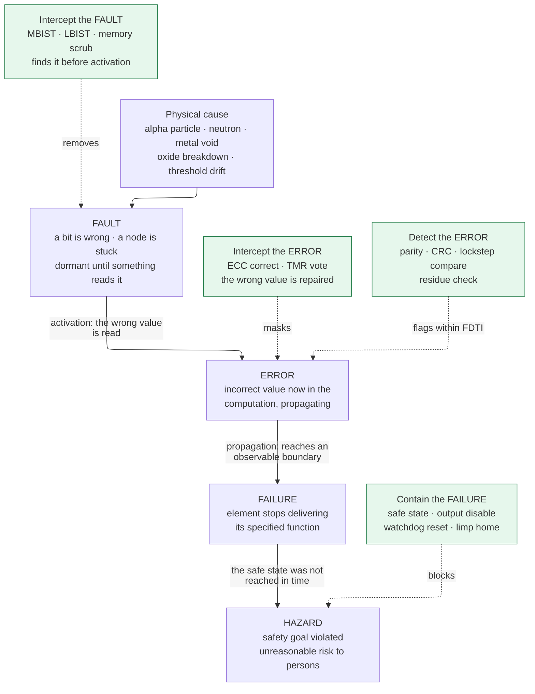
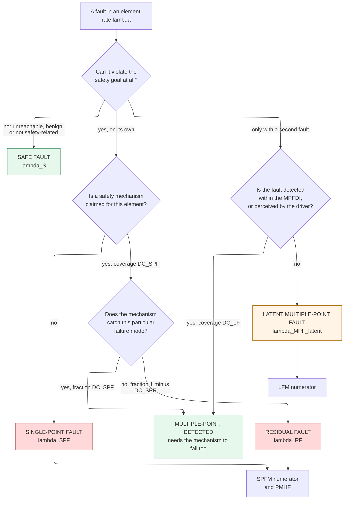
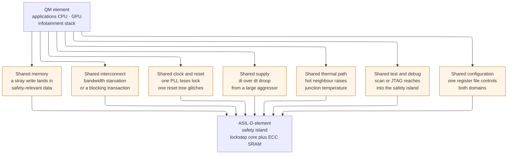

# Functional Safety and Reliability Engineering — designing hardware that fails in a survivable way

> **Prerequisites:** [Memory_Circuits_and_Technologies](../00_Fundamentals/06_Memory_Circuits_and_Technologies.md) (the 6T SRAM cell, its storage node capacitance, and the ECC/interleaving machinery this page budgets against — never re-derived here), [Signal_Integrity_Reliability](../05_Backend_Physical_Design/02_Signal_Integrity_Reliability.md) (the *physics* of BTI, HCI, TDDB, and electromigration; this page converts that physics into a lifetime budget and a signoff derate).
> **Hands off to:** [Design_Methodology_and_EDA_Infrastructure](03_Design_Methodology_and_EDA_Infrastructure.md) (owns the flow automation, tool qualification, and regression infrastructure that a safety program's traceability and fault-injection campaigns actually run on), [IP_Reuse_Integration_and_Register_Automation](04_IP_Reuse_Integration_and_Register_Automation.md) (packages the safety manual and assumptions-of-use of §9.5 as an IP deliverable).

---

## 0. Why this page exists

Every other page in this notebook assumes the chip works. Timing closure asks whether a path meets setup at the slow corner; verification asks whether the RTL implements the specification; physical verification asks whether the layout is manufacturable. All three questions share a hidden premise: that once the part passes, it *stays* correct. It does not. A neutron from a cosmic-ray shower flips a bit in your register file. A metal void that took nine years to grow finally opens a via. A gate oxide breaks down. None of this is a design bug — the design is exactly what you taped out — and none of it is caught by anything in folders 03 through 06.

For a phone, the answer is a reboot. For a brake controller, a flight-control actuator, or a robot arm, there is no reboot: an undetected wrong output at the wrong moment injures somebody. **Functional safety** is the engineering discipline that assumes faults will happen at a computable rate and asks a different question: *when a fault happens, does the system end up somewhere survivable?* That reframing is the whole subject. You are not trying to build a chip that never fails. You are trying to build a chip whose failures are (a) rare enough, and (b) overwhelmingly of the kind that get *detected* and steered into a defined safe state rather than silently corrupting an output.

This is a **cross-cutting** track, and that is why it lives in folder 08 rather than in the linear spec-to-silicon spine. Folder 02 (power) is cross-cutting in the same way: power is not a stage you pass through once, it is a constraint that reshapes architecture, RTL, synthesis, floorplan, and signoff simultaneously. Safety behaves identically, and so do its siblings in this folder — [hardware security](01_Hardware_Security_Architecture.md), [design methodology](03_Design_Methodology_and_EDA_Infrastructure.md), and [IP reuse](04_IP_Reuse_Integration_and_Register_Automation.md). A safety requirement written in the concept phase lands as a redundant channel in RTL, a `dont_touch` in the synthesis script, a keep-out region in the floorplan, an aging-derated corner in STA, a pattern-count increase in ATPG, and a telemetry field in the field-diagnostics protocol. Skip the page and you will discover those obligations one at a time, each one late.

Afterwards you should be able to: use the standards' vocabulary precisely (a *fault* is not a *failure* and a *residual* fault is not a *latent* one); build a FIT (failures in time) budget for a die from area and technology data; read and construct an FMEDA (failure modes, effects, and diagnostic analysis) and compute SPFM, LFM, and PMHF from it; pick safety mechanisms against a required diagnostic coverage and price them in area, power, and latency; derive when triple redundancy is *worse* than no redundancy; recognize the synthesis optimization that quietly deletes your safety mechanism; and turn a 15-year automotive mission profile into a number a timing tool will accept.

---

## 1. The vocabulary, defined precisely

The standards are pedantic about words because the arithmetic depends on them. Two engineers who use "failure" loosely will produce two FMEDAs that differ by a factor of ten. Learn these before anything else.

### 1.1 Fault, error, failure

- A **fault** is an abnormal physical condition: a bit holding the wrong value, a node stuck at ground, a transistor whose threshold has drifted past specification. A fault is a *state*, and it can sit there indefinitely doing nothing.
- An **error** is a wrong value in the system's state that resulted from a fault being *activated* — something read the flipped bit and computed with it. A fault that is never read produces no error.
- A **failure** is the termination of an element's ability to deliver its specified function, observed at that element's boundary. An error that never propagates to a boundary produces no failure.
- A **hazard** is a system-level condition that can cause harm. A failure only matters to safety if it can violate a **safety goal**.

Each arrow in that chain is a probability less than one, and every one of those probabilities is a *derating factor* you are allowed to claim in your budget (§3.4). That is not bookkeeping pedantry: it is the difference between a chip that reports 300 FIT of soft errors and the same chip reporting 4 FIT.



**Contract of the figure.** Every safety mechanism attaches to exactly one arrow, and which arrow it attaches to determines what it can and cannot do. Trace one event: a neutron strikes an SRAM cell in a data cache at $t_0$ (physical cause), inverting the cell (fault). If the scrubber sweeps that address at $t_0 + 20$ ms and the CPU does not read it until $t_0 + 30$ ms, the fault is removed before activation and *nothing else in the chain happens* — the scrubber intercepted at the leftmost arrow, which is why it is worth its bandwidth. If instead the CPU loads that word at $t_0 + 1\,\mu$s, an error exists; SEC-DED (single-error-correcting, double-error-detecting) ECC masks it and again nothing propagates. Remove the ECC and the error propagates to a torque command (failure); only then does the FTTI budget of §1.5 and the safe-state logic decide whether it becomes a hazard.

**The trade-off it illustrates.** Mechanisms on the left arrows are cheap and slow (a scrubber costs a fraction of a percent of memory bandwidth but takes milliseconds); mechanisms on the right are expensive and fast (lockstep costs 100% of the core area and flags in one to three cycles). You need both, because the left-hand ones cannot meet a millisecond FTTI and the right-hand ones cannot find a fault that nothing has read yet — which is exactly the *latent* fault problem of §1.4.

### 1.2 Permanent, transient, intermittent

| Class | Mechanism | Persists after? | Typical rate | Detected how |
|---|---|---|---|---|
| **Permanent (hard)** | metal void, oxide breakdown, gate short, latent process defect that finally opens | Yes — forever | ~1–5 FIT/mm² of digital logic in the useful-life region (§2.5) | LBIST/MBIST at key-on, online periodic test, or by a continuous mechanism once activated |
| **Transient (soft)** | alpha or neutron strike flipping a storage node; a coupled glitch that gets latched | No — the next write restores it | 1–10 FIT/Mbit SRAM at 16 nm FinFET, sea level, ~3 typical (§3.3) | ECC, parity, lockstep compare, CRC — must be *continuous*, since the fault is gone before any test runs |
| **Intermittent** | marginal via, marginal timing path that fails only hot, a partially broken solder joint | Sometimes — recurs, correlated with condition | Not separately modeled; folded into permanent FIT with a duty factor | Same mechanisms as permanent, but diagnosis is much harder because it passes on the bench |

The reason this taxonomy earns its place is that it selects the mechanism *class*. A transient cannot be caught by a periodic self-test — by the time the test runs, the evidence is gone — so transients force you into always-on encoding or replication. A permanent fault *can* be caught by a periodic test, which is dramatically cheaper, and that is why key-on BIST exists at all. Intermittents are the ones that get returned from the field with "no trouble found", and they are the reason §11.4's failure-analysis loop is a real cost center.

### 1.3 Systematic versus random hardware failure

This is the single most important distinction in the standards, and the one most often blurred.

- A **random hardware failure** occurs unpredictably during the lifetime of a hardware element, follows a probability distribution, and *has a rate you can measure and budget*. Everything in §2 and §3 is about random failures.
- A **systematic failure** is deterministically caused by an error in the specification, design, manufacturing process, or documentation. Its "rate" is meaningless: the bug is either there or not, and every part has it. An RTL bug, a wrong SDC exception, a misread datasheet, a synthesis directive that deleted a comparator (§9.2) — all systematic.

The consequence: **you cannot buy off a systematic failure with redundancy.** Two identical channels running identical buggy RTL produce identical wrong answers and the comparator stays silent forever. So the standards attack the two classes with two entirely different weapons. Random failures are attacked with *architecture and arithmetic* — FMEDA, metrics, safety mechanisms. Systematic failures are attacked with *process* — requirements traceability, reviews, verification rigor, configuration management, tool qualification. When a certification body reads your safety case, roughly 20% of it is the numbers of §5 and 80% is evidence that the process of §9 was followed. Software has *only* systematic failures, which is why ISO 26262 Part 6 has no FIT arithmetic in it at all.

### 1.4 The four fault classes that the metrics count

Given a safety goal and a set of safety mechanisms, every fault in a safety-related element falls into exactly one bucket. These four names are the entire content of §5.

| Class | Definition | Does it violate the safety goal? | Counts against |
|---|---|---|---|
| **Safe fault** | Its occurrence does not significantly increase the probability of violating the safety goal — it is unreachable, functionally irrelevant, or its effect is benign | No, alone or in combination | Nothing. It only enlarges the denominator |
| **Single-point fault (SPF)** | A fault in an element that has **no safety mechanism at all**, which alone leads to violating the safety goal | Yes, alone | SPFM numerator, PMHF |
| **Residual fault (RF)** | The *uncovered portion* of a fault in an element that **does** have a safety mechanism — the mechanism exists but misses this fault | Yes, alone | SPFM numerator, PMHF |
| **Multiple-point fault (MPF)** | Only violates the safety goal in combination with one or more other independent faults. Sub-classified as **detected**, **perceived** (the driver notices), or **latent** | Only in combination | Latent MPFs count against LFM |

The distinction between SPF and RF is purely about *whether a mechanism was claimed*. It matters because it tells you what to fix: an SPF says "you have no diagnostic here at all"; an RF says "you have one and it is not good enough". They land in the same numerator, so the metric does not care, but your engineering response is completely different.

**The latent fault is the subtle one, and the reason LFM exists.** Suppose your SRAM has SEC-DED ECC and the ECC decoder's own comparison logic breaks. Nothing goes wrong — the memory still returns correct data, because the decoder is only exercised when there is an error to correct. The system runs for two years in that state. Then a neutron flips a bit, the broken decoder fails to correct or flag it, and the safety goal is violated by *two* faults, neither of which alone did anything. The first fault sat there **latent**: undetected, unperceived, and silently disarming the protection. This is why safety mechanisms must themselves be tested (§6.11) and why LFM is a separate metric from SPFM.

### 1.5 Safety goal, requirement, mechanism, FTTI, and freedom from interference

- A **safety goal** is a top-level requirement produced by the hazard analysis and risk assessment (HARA), stated in the vehicle's terms with no reference to technology: "unintended steering torque above 3 N·m shall not be applied for longer than 50 ms." Each safety goal carries an ASIL (§4.1).
- Safety goals are decomposed into **functional safety requirements** (what the system must do), then **technical safety requirements** (how the architecture does it), then **hardware safety requirements** (what a specific block must implement). Each link in that chain must be traceable in both directions (§9.1).
- A **safety mechanism** is a technical solution implemented by hardware or software to detect faults, control failures, and achieve or maintain a safe state. Note the definition includes *achieving the safe state*, not just detecting: a parity checker that flags an error into a register nobody reads is not a safety mechanism.
- The **fault-tolerant time interval (FTTI)** is the time span from the occurrence of a fault to the occurrence of the hazard, if no safety mechanism acts. It is a system property derived from physics — how long can an electric power steering motor apply the wrong torque before the vehicle leaves the lane — and it is the hard budget every mechanism must fit inside.

$$\text{FTTI} \;\ge\; \text{FDTI} + \text{FRTI}$$

where **FDTI** is the fault detection time interval (fault occurrence to error flag) and **FRTI** is the fault reaction time interval (error flag to safe state reached). A periodic diagnostic with test interval $T_{\text{diag}}$ contributes $\text{FDTI} \le T_{\text{diag}} + t_{\text{exec}}$ in the worst case, because the fault may occur just after a test completes.

```wavedrom
{ "signal": [
  {"name": "fault present",   "wave": "0..1........", "node": "...a........"},
  {"name": "diagnostic tick", "wave": "0.10.10.10.1", "node": "............"},
  {"name": "error flag",      "wave": "0....1......", "node": ".....c......"},
  {"name": "safe state",      "wave": "0......1....", "node": ".......d...."},
  {"name": "hazard if idle",  "wave": "0..........1", "node": "...........e"}
 ],
 "edge": ["a~>c FDTI", "c~>d FRTI", "a~>e FTTI"],
 "head": {"text": "FTTI budget: the fault lands just after a diagnostic tick, so detection costs a full test interval"}
}
```

**Contract of the figure.** The diagnostic runs on a fixed period. The fault is drawn arriving immediately *after* a tick, which is the worst case and therefore the case you must budget. Trace it with real numbers: FTTI = 100 ms for a steering safety goal; reaching the safe state means disabling the inverter gate drivers, which takes FRTI = 10 ms including the software handler and the gate-driver discharge. That leaves FDTI ≤ 90 ms. A windowed watchdog with a 25 ms window that trips on two consecutive misses gives FDTI ≤ 50 ms — it fits. A software self-test library scheduled once per second gives FDTI ≈ 1000 ms — it does not fit, no matter how high its diagnostic coverage is. **A mechanism's coverage is worthless if its latency exceeds FDTI**, and this is the check most often missed by engineers who treat the FMEDA as a spreadsheet exercise.

A second, much longer interval governs latent faults: the **multiple-point fault detection interval (MPFDI)**, typically one driving cycle (key-on to key-off) or a small number of hours. That is why LBIST and MBIST at key-on are acceptable latent-fault mechanisms even though they take 50 ms and cannot run continuously.

Finally, **freedom from interference (FFI)** is the absence of cascading failures between two elements that could lead to violating a safety requirement. It is what lets you put a QM (quality-managed, no ASIL) infotainment stack and an ASIL-D safety island on the same die. It is *not* automatic — it must be argued, element pair by element pair, in a dependent-failure analysis (§8).

---

## 2. The reliability math

### 2.1 FIT and the exponential model

**Baseline.** Assume a component's instantaneous failure rate — the **hazard rate** $\lambda(t)$, the conditional probability density of failing in the next instant given survival so far — is a constant $\lambda$. Then the reliability function, the probability of surviving to time $t$, is

$$R(t) = e^{-\lambda t}, \qquad F(t) = 1 - e^{-\lambda t}, \qquad \text{MTTF} = \int_0^\infty R(t)\,dt = \frac{1}{\lambda}.$$

The unit of $\lambda$ in this industry is the **FIT (failure in time): one failure per $10^9$ device-hours.**

$$1\ \text{FIT} = 10^{-9}\,\text{h}^{-1}, \qquad \text{MTTF [h]} = \frac{10^9}{\lambda\,[\text{FIT}]}.$$

**Terminology, precisely.** MTBF (mean time *between* failures) applies to repairable systems and includes repair time; MTTF (mean time *to* failure) applies to non-repairable items like a die. The industry says "MTBF" for both. For a constant-hazard non-repairable part the arithmetic is identical, so the sloppiness is harmless — but if an assessor asks, the die has an MTTF.

**Trace.** A die at $\lambda = 50$ FIT has MTTF $= 10^9/50 = 2\times10^7$ h $= 2{,}283$ years. That number is spectacularly misleading and is the single most common misreading of reliability data. MTTF is *not* how long a part lasts; it is the reciprocal of a rate. What matters is the expected number of failures in a *fleet* over a *mission*:

$$N_{\text{fail}} = N_{\text{units}} \times t_{\text{mission}} \times \lambda.$$

For 10 million vehicles operating 12,000 hours each: $N = 10^7 \times 1.2\times10^4 \times 5\times10^{-8} = 6{,}000$ failures. A 2,283-year MTTF still means six thousand field returns. That is why §11's failure-analysis loop exists and why the safety-relevant fraction of $\lambda$ must be pushed three orders of magnitude below the total.

**Why the exponential applies here.** It applies *only in the flat middle of the bathtub curve*, and that flatness is something you buy, not something you get.

| Region | Hazard rate | Physical cause | Weibull shape $\beta$ | How it is removed from the model |
|---|---|---|---|---|
| **Infant mortality** | decreasing | latent manufacturing defects — marginal vias, particle-induced thin oxide, weak contacts | $\beta < 1$ | burn-in and outlier screening at test (§11.2) consume this region before shipment |
| **Useful life** | constant $\lambda$ | random external events and randomly distributed weak spots | $\beta = 1$ (exponential) | this is the region the whole FIT model describes |
| **Wear-out** | increasing | BTI, HCI, TDDB, electromigration accumulating deterministically | $\beta > 1$ | pushed beyond end-of-mission by the lifetime derate of §10 |

So the constant-$\lambda$ assumption is a *contract with two other disciplines*: production test promises that infant mortality has been screened out, and reliability-physics signoff promises that wear-out starts after the mission ends. If either promise breaks, every FIT number on this page is wrong. This is why §10 and §11 are on this page and not in some appendix.

### 2.2 Series systems and why FIT simply adds

For $n$ elements in *reliability series* — the system fails if any one fails — independence gives

$$R_{\text{sys}}(t) = \prod_{i=1}^{n} e^{-\lambda_i t} = e^{-\left(\sum_i \lambda_i\right) t} \quad\Longrightarrow\quad \lambda_{\text{sys}} = \sum_i \lambda_i.$$

FIT rates add. This is the reason a FIT budget is a spreadsheet and not a simulation, and it is also the reason **the largest block is not necessarily the problem**: a 2 FIT block with no diagnostic can dominate the safety metric over a 40 FIT block with 99% coverage (§5.4 shows exactly this).

Note the independence premise. It is exactly the premise that common-cause failures (§7.4) and interference (§8) violate, and the reason those two sections are not optional.

### 2.3 Building a die FIT budget from area and technology

The foundry or the reliability group supplies a base rate, typically in the form

$$\lambda_{\text{perm}} = \lambda_0 \cdot \frac{A}{A_0} \cdot \pi_T \cdot \pi_V$$

where $\lambda_0$ is a reference permanent-fault rate for a reference die area $A_0$ at a reference temperature and voltage, $\pi_T$ is the temperature acceleration factor from the mission profile (computed in §10.4), and $\pi_V$ a voltage factor. Standard sources for $\lambda_0$ are Siemens SN 29500 and IEC TR 62380; foundries at advanced nodes supply their own qualified numbers. Area is the right first-order scaler because both random defect density and wear-out-site count scale with area.

**Worked die budget.** A 25 mm² automotive SoC at a 16 nm FinFET node, 2 MB of SRAM, 3.0 M flip-flops, mission profile 12,000 operating hours over 15 years.

| Block | Area (mm²) | $\lambda_{\text{perm}}$ rate (FIT/mm²) | $\lambda_{\text{perm}}$ (FIT) | Why this rate |
|---|---|---|---|---|
| CPU cluster, 2 cores in lockstep | 6.0 | 2.0 | 12.0 | baseline random logic |
| SRAM arrays, 2 MB | 8.0 | 1.2 | 9.6 | regular structure, redundancy-repaired at test, lower defect sensitivity per area |
| NPU / DSP | 4.0 | 2.0 | 8.0 | baseline random logic |
| Interconnect and peripherals | 3.5 | 2.0 | 7.0 | baseline random logic |
| Analog, PLL, IO | 2.5 | 6.0 | 15.0 | thick-oxide devices, high-voltage IO, ESD structures, bond pads — historically the worst offenders |
| Test, debug, misc | 1.0 | 2.0 | 2.0 | baseline random logic |
| **Total permanent** | **25.0** | — | **53.6** | series sum, §2.2 |

Now the transient contribution, computed per storage element rather than per area, using the sea-level 16 nm figures derived in §3.3:

| Source | Count | Raw SER rate | Raw $\lambda_{\text{trans}}$ (FIT) |
|---|---|---|---|
| SRAM bits | 2 MB = 16 Mbit | 3 FIT/Mbit | 48 |
| Flip-flops | 3.0 M | $2\times10^{-5}$ FIT/flop | 60 |
| Combinational logic (SETs latched) | — | ~15% of flop SER after derating | 9 |
| **Total raw transient** | | | **117** |

**The headline result: raw transient FIT is 2.2× the permanent FIT, and the flops contribute more of it than the SRAM does.** For an unprotected consumer chip that is the entire story of its silent-data-corruption rate. The engineering response is that transients, unlike permanents, are *cheap to cover* with encoding:

| Source | Raw FIT | Mechanism | Residual FIT |
|---|---|---|---|
| SRAM | 48 | SEC-DED, 4-way bit interleaving, background scrub | 0.24 |
| CPU flops (1.0 M) | 20 | dual-core lockstep, compare every cycle | 0.02 |
| Other flops (2.0 M) | 40 | parity on state machines and config, unprotected datapath | 2.4 |
| Combinational | 9 | covered incidentally by the flop mechanisms downstream | 0.5 |
| **Total residual transient** | **117** | | **≈ 3.2** |

Read the residual column before moving on: the 48 FIT of SRAM, which is the part everybody worries about, ends up contributing 0.24 FIT because it is the one structure with a real code on it, while the 40 FIT of ordinary flops contributes 2.4 FIT — **75% of the residual transient budget sits in the flops nobody protected.** That inversion is the whole reason §3.3 spends time on flop SER.

Die total after protection: $\lambda \approx 53.6 + 3.2 \approx 57$ FIT. That is the number the FMEDA of §5 then decomposes into safe, single-point, residual, and latent.

**Where the budget comes from, top-down.** Do not derive the target from the die — derive it from the vehicle. An ASIL-D safety goal demands PMHF $< 10^{-8}\,\text{h}^{-1} = 10$ FIT for the whole *item* (§4.2). The item is sensor + ECU + actuator, so the system engineer allocates, say: sensors 3 FIT, actuator and power stage 3 FIT, ECU discretes and supply 2 FIT, **SoC 2 FIT**. That 2 FIT is the budget for the SoC's single-point plus residual faults — not for its total FIT of 57. The design job is therefore to get from 57 FIT of raw failure rate to under 2 FIT of *safety-goal-violating* failure rate, which requires an average diagnostic coverage above 96.5% across the safety-related portion. §5 does exactly this and lands at 0.936 FIT.

### 2.4 Permanent FIT versus transient FIT: two different data sources

They are not the same kind of number and must never be added before both are derated, because they come from different measurements and behave differently:

| | Permanent | Transient (soft error) |
|---|---|---|
| Source of the number | qualification stress testing (HTOL, temperature cycling), SN 29500 / IEC 62380 models, foundry data | accelerated beam testing per JEDEC JESD89 — neutron beam at a spallation source, alpha foil for package emissivity |
| Scales with | die area, via count, gate-oxide area, mission temperature | bit count and node capacitance, *altitude and latitude*, package material purity |
| Temperature dependence | strong, Arrhenius, $E_a \approx 0.3$–0.9 eV | essentially none for the strike rate itself |
| Repeatable on the bench? | yes, once the part has degraded | no — the part tests good afterward |
| Effect of a repair | needs silicon or a spare | corrected by rewriting the location |

A consequence that catches people out: **soft error rate does not improve with a better process or a cooler package, and it gets 3–5× worse in Denver and ~300× worse at cruise altitude.** No amount of thermal design helps. Only encoding and replication help. That is §3.

### 2.5 Reading a FIT number correctly

Three qualifiers must accompany every FIT figure or it is uninterpretable, and this is the most common defect in a vendor datasheet:

1. **At what temperature and voltage?** A number quoted at 55 °C junction is roughly 5–10× smaller than the same part's number at 125 °C for an $E_a = 0.7$ eV mechanism (§10.4). Automotive FMEDAs are quoted at the mission-profile-weighted equivalent, not at room temperature.
2. **Permanent only, or including transient?** Vendors who quote "12 FIT" almost always mean permanent only. The soft-error number is separate and usually much larger.
3. **Whole die, or safety-relevant portion?** After the FMEDA, three numbers exist for the same die — total $\lambda$, safety-related $\lambda$, and the SPF-plus-RF sum — and they can differ by 100×. Ask which one you are being sold.

---

## 3. Soft error rate in depth

### 3.1 The two radiation mechanisms

**Alpha particles** come from inside the package. Trace impurities of uranium and thorium in mold compound, solder bumps, underfill, and lead frames decay and emit alphas of 4–9 MeV. An alpha travelling in silicon deposits energy continuously, creating one electron-hole pair per ~3.6 eV; a 5 MeV alpha therefore liberates on the order of $1.4\times10^6$ pairs over a range of roughly 25 μm, with the deposition peaking near the end of the track (the Bragg peak) at roughly 16 fC/μm. The controllable variable is *material purity*: package emissivity is specified in $\alpha/\text{cm}^2\!\cdot\!\text{h}$, with standard materials around 0.01–0.1 and ultra-low-alpha (ULA) materials below 0.002. Buying ULA mold compound and solder is a straight, purchasable 10–50× reduction in the alpha component, and it is the first thing to check when a chip's measured SER is above model.

**Neutrons** come from outside and cannot be shielded at any practical thickness. Cosmic-ray primaries strike the upper atmosphere and produce a cascade; the surviving high-energy neutrons reach ground level at a reference flux of about **13 neutrons/cm²/h above 10 MeV at sea level in New York City** — the JESD89 reference condition against which all quoted SER numbers are normalized. A neutron is uncharged and does nothing by itself; it must undergo a nuclear reaction with a silicon or oxygen nucleus, producing recoiling charged fragments that then deposit charge exactly as an alpha does. The reaction probability is low, but the secondary fragments can be far more ionizing than an alpha.

The flux scales strongly with altitude and weakly with geomagnetic latitude:

| Location | Approximate flux relative to NYC sea level |
|---|---|
| Sea level, New York | 1.0 (the reference) |
| Denver, 1,600 m | ~4× |
| Mexico City, 2,240 m | ~6× |
| La Paz, 3,600 m | ~13× |
| Commercial cruise, 11 km | ~300× |

An avionics box therefore sees a soft-error rate two to three orders of magnitude above the same silicon in a car, which is why DO-254 systems lean hard on TMR and on continuous scrubbing, and why a "good enough for automotive" memory subsystem is not automatically good enough for airborne use.

### 3.2 Critical charge, and why it fell

A storage node holds its value on a capacitance $C_{\text{node}}$ at $V_{DD}$, restored by the drive of the feedback inverter (in an SRAM cell) or the keeper (in a latch). A strike injects a current pulse into the node. The node flips if the *collected* charge exceeds the charge the restoring device can replace during the pulse. Define the **critical charge**:

$$Q_{\text{crit}} \approx C_{\text{node}}\, V_{DD} + I_{\text{restore}}\, t_{\text{pulse}}$$

with the first term dominant for fast strikes. This is the circuit-level figure of merit, and it fell hard with scaling because *both* factors shrank:

```tikz
\begin{document}
\begin{circuitikz}[scale=1.0]
  \draw (0,0) node[not port](INV){};
  \draw (INV.out) -- (2.4,0);
  \draw (2.4,0) node[circle,fill,inner sep=1.5pt]{};
  \draw (2.4,0.4) node{$Q$};
  \draw (2.4,0) to[C=$C_{node}$] (2.4,-2.2) node[ground]{};
  \draw (2.4,0) -- (4.4,0);
  \draw (4.4,0) to[I=$i_{strike}$] (4.4,-2.2) node[ground]{};
  \draw (INV.in) -- (-1.6,0);
  \draw (-1.6,0.4) node{$\overline{Q}$};
\end{circuitikz}
\end{document}
```

**Contract of the figure.** This is the struck node reduced to what matters: a capacitance holding the state, a restoring device trying to hold it, and a current source representing the collected charge from the ionizing track. Trace it at 130 nm: $C_{\text{node}} \approx 2$ fF, $V_{DD} = 1.2$ V, so $Q_{\text{crit}} \approx 2.4$ fC. At 16 nm FinFET: $C_{\text{node}} \approx 0.5$ fF, $V_{DD} = 0.8$ V, so $Q_{\text{crit}} \approx 0.4$ fC — a 6× reduction. A single alpha depositing tens of fC along its track now exceeds $Q_{\text{crit}}$ by more than an order of magnitude, so *every strike that collects meaningful charge flips the cell*.

**The failure the figure predicts, and why it did not happen.** Naively, a 6× lower $Q_{\text{crit}}$ plus 2× more bits per generation should have produced a soft-error catastrophe. It did not, and the reason is the *other* term: **charge collection volume**. A planar bulk device collects charge from a deep funnel in the substrate; a FinFET's channel is a thin fin sitting above the bulk, with a much smaller volume in which deposited charge can be collected before it recombines or diffuses away. Collected charge fell faster than $Q_{\text{crit}}$ did. The empirical result is that **per-bit SRAM SER fell by more than two orders of magnitude from planar 65 nm to 16 nm FinFET** — roughly one of those orders at the planar-to-FinFET step itself (§3.3's table: ~700 to ~3 FIT/Mbit), the rest accumulated across the planar shrinks before it. Per-*chip* SER fell far less than per-bit SER did, because bit counts grew by more than an order of magnitude over the same span, which is why the SRAM line in §2.3's budget is still tens of FIT rather than a rounding error. FD-SOI does the same thing more aggressively — the buried oxide truncates collection almost completely, giving another large reduction, which is one of the reasons that process family survives in aerospace and automotive niches.

### 3.3 Representative numbers, and the derating chain

These are order-of-magnitude figures at sea-level reference conditions; the real ones are node- and vendor-specific and come from beam-test reports. Treat them as the shape of the answer, not the answer.

| Element | Raw SER, planar 65 nm | Raw SER, 16 nm FinFET | Note |
|---|---|---|---|
| SRAM bit cell | ~700 FIT/Mbit | ~3 FIT/Mbit (honest range 1–10) | the reference number everyone quotes; matches [Memory_Circuits_and_Technologies §8.2](../00_Fundamentals/06_Memory_Circuits_and_Technologies.md) |
| Standard flip-flop | ~$5\times10^{-5}$ FIT/flop | ~$2\times10^{-5}$ FIT/flop | larger nodes than an SRAM cell, so higher $Q_{\text{crit}}$, but far less aggressive hardening |
| Hardened (DICE) flip-flop | — | ~$2\times10^{-6}$ FIT/flop | ~10× better for ~1.8–2× area and ~1.5× power |
| Latch in a latch-based pipeline | — | comparable to a flop | often forgotten in the budget |
| Combinational gate (SET generation) | — | ~$10^{-6}$ FIT/gate raw | almost entirely derated away, see below |

Notice what this table does to a mental model built on "memory is the SER problem". At 16 nm, 16 Mbit of SRAM contributes 48 FIT while 3 M flops contribute 60 FIT — the flops are already **more than half the raw budget**, and, critically, **flops usually have no ECC**, so after protection the flop contribution does not merely compete with the SRAM's, it dominates it by an order of magnitude (§2.3: 2.4 FIT against 0.24 FIT). The mental model is a generation out of date: it was formed when SRAM was hundreds of FIT per megabit, and the FinFET transition of §3.2 took that term away without touching the flops.

**The derating chain for combinational logic.** A single-event transient (SET) generated in a combinational gate must survive three independent filters before it becomes a fault:

1. **Electrical masking.** The pulse must survive propagation through subsequent gates. Each stage's finite bandwidth attenuates a narrow pulse; a 40 ps pulse into a chain of typical inverters is often gone within three stages. Derate: often 0.1–0.5, and it *worsens* with scaling because gates get faster and attenuate less.
2. **Logical masking.** The pulse must reach a flop through a sensitized path: an AND gate with a 0 on the other input blocks it entirely. For random logic with typical controllability this is a derate of roughly 0.2–0.5.
3. **Temporal (latching-window) masking.** The pulse must arrive at a flop's data input inside the setup-plus-hold aperture. If the pulse width is $t_p$, the aperture is $t_{\text{sh}}$, and the clock period is $T$, the probability is roughly $(t_p + t_{\text{sh}})/T$. This is the one that scales *badly*: at $T = 10$ ns with $t_p + t_{\text{sh}} = 100$ ps the derate is 0.01; at $T = 0.5$ ns it is 0.2, a 20× increase. **Combinational SER grows linearly with clock frequency** while SRAM SER does not, which is why logic SER became a first-class concern only at multi-GHz clocks.

Combined, a raw SET rate is derated by roughly $0.3 \times 0.35 \times 0.1 \approx 0.01$ at 1 GHz — one percent survives — which is how a 900 FIT raw SET generation rate becomes the 9 FIT line in §2.3's table.

The architectural generalization of all three is the **architectural vulnerability factor (AVF)**: the fraction of bits in a structure that, if flipped, actually affect committed program output. A branch predictor's AVF is near zero — a corrupted prediction produces a mispredict, not a wrong answer — while an architectural register file's AVF approaches one. Claiming AVF in a safety FMEDA is legitimate and lucrative, but it must be *justified with analysis*, not asserted; formal fault-propagation proofs (§9.4) are the accepted evidence.

### 3.4 Multi-cell upsets, and the mechanism that defeats them

**Baseline.** SEC-DED ECC over a 64-bit word corrects one bit error and detects two. It assumes at most one error per word.

**Failure.** A single particle's ionization track is not a point. At 65 nm the track's charge cloud is small compared to the cell pitch and multi-cell upsets (MCU) are 1–5% of events. At 16 nm the cells are so tightly packed that one track's collection region spans several of them, and **30–50% of upset events flip two or more physically adjacent cells**. If those adjacent cells belong to the same ECC word, SEC-DED cannot correct them — and a triple upset is not even *detected*, which turns a benign correction into a silent data corruption. The nominal 48 → 0.24 FIT improvement of §2.3 evaporates.

**Derived repair.** Break the correspondence between physical adjacency and logical word membership. **Bit interleaving** (also called column multiplexing) lays the array out so that bits $0, 1, 2, \dots$ of one logical word are separated by $N-1$ cells belonging to *other* words. With $N = 4$, a track that flips four adjacent cells produces four single-bit errors in four different words, each of which SEC-DED corrects. The physical layout, sense-amplifier sharing, and column decode of this arrangement are the memory designer's problem and are covered in [Memory_Circuits_and_Technologies](../00_Fundamentals/06_Memory_Circuits_and_Technologies.md); what matters here is that **the interleaving degree is a safety parameter you must specify and verify**, not a memory-compiler default to accept silently.

**Cost.** Interleaving lengthens the bitlines seen per logical access and complicates the column mux, costing a few percent of array area and a small access-time penalty. It also interacts badly with fine-grained write masking. Its selection boundary: for a small register file with 32-bit words and no adjacency, plain parity plus a rewrite is cheaper and adequate; for a multi-megabit cache in a safety part at an advanced node, interleaving is mandatory and its degree should be at least 4.

**The second half of the repair is scrubbing.** Interleaving stops one particle from creating a double error. It does nothing about *two particles over two years* hitting the same word — accumulation. A background **scrubber** walks the array reading and rewriting every location on a period $T_{\text{scrub}}$, converting a would-be accumulation into two independent, individually correctable events. Choosing $T_{\text{scrub}}$ is a real calculation: with $\lambda_{\text{bit}}$ per bit and $W$ bits per word, the double-error rate **per word** is proportional to $\lambda_{\text{bit}}^2 W^2 T_{\text{scrub}}$ — the first upset can land on any of $W$ bits, and a second must land on one of the remaining $W-1$ before the scrubber arrives — which is $\lambda_{\text{bit}}^2 W T_{\text{scrub}}$ once normalised **per bit** of array. Either way the scaling in time is linear, so halving the scrub period halves the double-error rate. Typical values are one full sweep per second to per minute, costing well under 1% of memory bandwidth. In FMEDA terms, scrubbing is the mechanism that converts latent multi-point faults into detected ones — it is an **LFM** mechanism, not an SPFM mechanism.

---

## 4. The standards, at the level a designer needs

### 4.1 ISO 26262 and the ASIL

ISO 26262 (*Road vehicles — Functional safety*, 2018 edition, twelve parts) governs electrical and electronic systems in production road vehicles. Its central classification is the **ASIL (Automotive Safety Integrity Level)**, assigned per *hazard*, not per component, by combining three factors during the HARA:

- **Severity (S0–S3):** S0 no injuries, S3 life-threatening or fatal.
- **Exposure (E0–E4):** how much of operating time the vehicle is in the situation where the hazard applies. E4 is "high probability", such as driving on a highway.
- **Controllability (C0–C3):** can the driver or other road users avoid harm. C3 is "difficult to control or uncontrollable".

The combination maps to QM (quality managed — no ASIL requirements), or ASIL A, B, C, or D. Only the worst combination, S3 + E4 + C3, yields ASIL D. Loss of steering assist at highway speed is the canonical ASIL D hazard; a failed rear-view camera is typically QM or ASIL A.

The ASIL then propagates *down* to hardware as three quantitative targets, in ISO 26262-5:

| Metric | ASIL A | ASIL B | ASIL C | ASIL D | What it constrains |
|---|---|---|---|---|---|
| **SPFM** — single-point fault metric | not required | ≥ 90% | ≥ 97% | ≥ 99% | robustness against faults that *alone* violate the safety goal |
| **LFM** — latent fault metric | not required | ≥ 60% | ≥ 80% | ≥ 90% | robustness against faults that silently disarm a mechanism |
| **PMHF** — probabilistic metric for random hardware failures | not required | $<10^{-7}\,\text{h}^{-1}$ (100 FIT) | $<10^{-7}\,\text{h}^{-1}$ (100 FIT) | $<10^{-8}\,\text{h}^{-1}$ (10 FIT) | the absolute residual risk of the whole item |

Two observations that matter more than the numbers. First, **ASIL A has no hardware architectural metric targets at all** — it is essentially a process requirement. Second, SPFM and LFM are *ratios* while PMHF is an *absolute rate*: a very small, simple part can pass PMHF trivially and still fail SPFM, and a huge part with excellent coverage can pass SPFM and blow PMHF. You must check all three.

**ASIL decomposition** (ISO 26262-9) is the escape hatch that makes big systems tractable. A safety goal at ASIL D may be allocated to two *sufficiently independent* elements at lower levels: ASIL D $\to$ ASIL B(D) + ASIL B(D), or ASIL C(D) + ASIL A(D), or ASIL D(D) + QM(D). The parenthesis records the original ASIL and never disappears. The entire validity of a decomposition rests on the independence claim, which must be demonstrated by dependent-failure analysis (§8). Decomposition is where safety programs most often deceive themselves: two "independent" channels sharing one PLL and one power rail are not independent, and an assessor will say so.

ISO 26262-11:2018 is the part written specifically for semiconductors, and it is the one to read: it covers digital, analog, memory, and IP-level FMEDA, base failure rate estimation, dependent-failure initiators for on-die elements, and the treatment of an IP block delivered with a safety manual.

### 4.2 IEC 61508 and the SIL

IEC 61508 is the parent standard for programmable safety systems in industrial process, machinery, and general E/E/PE applications; ISO 26262 is its automotive derivative. Its levels are **SIL 1 through SIL 4** and its quantitative target depends on the operating mode:

| Level | High-demand / continuous mode: PFH ($\text{h}^{-1}$) | Low-demand mode: $\text{PFD}_{\text{avg}}$ |
|---|---|---|
| SIL 1 | $10^{-6}$ to $10^{-5}$ | $10^{-2}$ to $10^{-1}$ |
| SIL 2 | $10^{-7}$ to $10^{-6}$ | $10^{-3}$ to $10^{-2}$ |
| SIL 3 | $10^{-8}$ to $10^{-7}$ | $10^{-4}$ to $10^{-3}$ |
| SIL 4 | $10^{-9}$ to $10^{-8}$ | $10^{-5}$ to $10^{-4}$ |

The mode distinction is the conceptual contribution to take away. A brake controller is queried continuously, so what matters is the failure rate per hour (PFH) — analogous to PMHF. An emergency shutdown system that sits idle for years and must work once is *low demand*, and what matters is the probability that it is already broken when called upon ($\text{PFD}_{\text{avg}}$), which is dominated by the **proof-test interval** rather than by the failure rate. A latent fault in a low-demand system is not a secondary concern; it *is* the failure mode.

IEC 61508 also imposes **architectural constraints** independent of the probability calculation, using the **safe failure fraction (SFF)** — the fraction of failures that are either safe or detected — and the **hardware fault tolerance (HFT)** — how many faults the architecture can tolerate and still function ($\text{HFT} = 0$ for simplex, 1 for duplex or 1oo2). Elements are classified **Type A** (simple, all failure modes well-defined, e.g. a relay) or **Type B** (complex, incompletely characterized — every integrated circuit with a microcontroller in it). For Type B:

| SFF | Max SIL at HFT = 0 | Max SIL at HFT = 1 | Max SIL at HFT = 2 |
|---|---|---|---|
| < 60% | not allowed | SIL 1 | SIL 2 |
| 60% – < 90% | SIL 1 | SIL 2 | SIL 3 |
| 90% – < 99% | SIL 2 | SIL 3 | SIL 4 |
| ≥ 99% | SIL 3 | SIL 4 | SIL 4 |

Read the top-left cell carefully: **a complex integrated circuit with under 60% diagnostic coverage and no redundancy cannot be used at any SIL, regardless of how good its FIT number is.** This is a structural veto that has no equivalent in ISO 26262, and it is the reason industrial safety controllers are so often physically dual-channel where an automotive part would use one core in lockstep.

### 4.3 DO-254 and design assurance levels

RTCA DO-254 / EUROCAE ED-80 governs airborne electronic hardware. Its levels, **DAL A through E** (design assurance level), come from the system safety assessment process of ARP4754A and ARP4761, which classify each failure condition and assign a probability target at the aircraft level:

| Failure condition | DAL | Aircraft-level target (per flight hour) |
|---|---|---|
| Catastrophic | A | $\le 10^{-9}$ |
| Hazardous / severe-major | B | $\le 10^{-7}$ |
| Major | C | $\le 10^{-5}$ |
| Minor | D | no numerical target |
| No safety effect | E | none |

**The critical structural difference from ISO 26262: DO-254 is almost entirely about systematic failures.** It is a lifecycle assurance standard — requirements capture, conceptual and detailed design, implementation, verification, validation, configuration management, process assurance — and it contains no SPFM/LFM arithmetic. The random-failure numbers live in the ARP4761 safety assessment (fault tree analysis, FMEA, common-cause analysis) at the aircraft and system level, not in the hardware assurance document. Confusing the two is a common error when engineers move between domains.

For Level A and B functions, guidance material (FAA AC 20-152A, EASA CM-SWCEH-001) requires **advanced verification methods** beyond requirements-based testing: *elemental analysis* (a structural-coverage measure on the hardware description, the analog of code coverage — demonstrating that requirements-based tests exercised every element), *safety-specific analysis* (showing that the identified failure modes were addressed by design), and *formal methods*. This is where formal property verification earns its keep in aerospace long before it became routine elsewhere.

### 4.4 What each standard demands as *evidence*

The label is not the deliverable; the evidence package is. This table is the one to internalize, because it determines your schedule.

| | ISO 26262 (ASIL C/D) | IEC 61508 (SIL 3) | DO-254 (DAL A/B) |
|---|---|---|---|
| Planning artifact | Safety plan, DIA (development interface agreement) between customer and supplier | Functional safety management plan | PHAC — plan for hardware aspects of certification |
| Hazard/requirement origin | HARA $\to$ safety goals $\to$ FSR $\to$ TSR $\to$ HSR, bidirectionally traceable | Hazard and risk analysis $\to$ safety requirements specification | ARP4761 FHA/PSSA $\to$ hardware requirements |
| Quantitative analysis | FMEDA with SPFM, LFM, PMHF; quantitative FTA where required | FMEDA with SFF, PFH/PFD; architectural constraint check | ARP4761 FTA/FMEA at system level; none in DO-254 itself |
| Qualitative analysis | DFA — dependent failure analysis, per element pair | Common-cause failure analysis, $\beta$-factor | CCA — common cause analysis: PRA, ZSA, CMA |
| Verification evidence | requirements-based tests, fault injection campaigns with classification, formal proofs of safe faults, FTTI timing verification | techniques and measures tables of Part 2 Annex A/B with HR/R ratings met | requirements-based test, elemental analysis, safety-specific analysis, formal methods |
| Tool trust | Tool confidence level TCL1–3 from tool impact and tool error detection; qualification of TCL2/3 tools | Tool classification T1/T2/T3, offline support tool requirements | Tool assessment and qualification per DO-254 Appendix B |
| Independence of review | Confirmation reviews; functional safety audit; independent functional safety assessment for ASIL C/D | Independent person / department / organization, scaling with SIL | DER / certification-authority involvement, stage-of-involvement reviews |
| Shipped with the part | **Safety manual** with assumptions of use, the FMEDA, and the DFA results | Safety manual for compliant items, with SFF and diagnostic assumptions | Hardware accomplishment summary, HCI/HCD data package |

The row that surprises hardware engineers is *tool trust*. Under ISO 26262-8 clause 11 you must classify every EDA tool by **tool impact (TI)** — can a malfunction introduce or fail to detect an error in the safety-related item — and **tool error detection (TD)** — how likely is such a malfunction to be caught by other means. The combination yields TCL1 (no action), TCL2, or TCL3 (full qualification, with a validation suite and a documented error list). Your synthesis tool, your equivalence checker, and your fault simulator all land in this net, which is why safety programs pin tool versions with the rigor of §9.1 and why [Design_Methodology_and_EDA_Infrastructure](03_Design_Methodology_and_EDA_Infrastructure.md) is a prerequisite of a real safety program rather than a nicety.

---

## 5. FMEDA as the central artifact

### 5.1 What it is

The **FMEDA (failure modes, effects, and diagnostic analysis)** is a spreadsheet-shaped analysis that takes every element of a design, splits its failure rate into failure modes, decides for each mode whether it can violate the safety goal, applies the diagnostic coverage of whatever safety mechanism watches it, and sums the results into SPFM, LFM, and PMHF. It is the deliverable that a certification assessor spends the most time on, it is the document that drives architecture decisions, and it is a *living* artifact — you build the first version from the block diagram before RTL exists, and you refine it after synthesis when gate counts and fault-injection coverage numbers are real.

The essential move is that **diagnostic coverage is not a property of a mechanism; it is a property of a mechanism against a specific failure-mode distribution.** A single parity bit has near-100% coverage of single-bit soft errors and roughly 50% coverage of arbitrary multi-bit errors. Quoting "parity = 60% DC" without saying against what is meaningless. Every DC number in a defensible FMEDA traces to either a published standard table (IEC 61508-2 Annex A, ISO 26262-5 Annex D give indicative values of low ≈ 60%, medium ≈ 90%, high ≈ 99%) or, far better, to a measured fault-injection campaign (§9.3).



**Contract of the figure.** Every fault takes exactly one path from top to bottom; the classes partition the failure rate with no overlap and no gap, so the row arithmetic must satisfy $\lambda = \lambda_S + \lambda_{\text{SPF}} + \lambda_{\text{RF}} + \lambda_{\text{MPF,d}} + \lambda_{\text{MPF,latent}}$. Trace a fault in the ECC decoder of §1.4: it cannot violate the safety goal alone (the memory returns correct data), so it takes the right branch into Q4; if a key-on error-injection self-test exercises the decoder, it lands in MPF-detected, otherwise it lands in latent and hurts LFM. Now trace a stuck-at fault on a bit of the PWM duty register: it *can* violate the goal alone, a dual-channel compare is claimed, so it lands in MPF-detected with probability $\text{DC}_{\text{SPF}}$ and in residual with probability $1 - \text{DC}_{\text{SPF}}$.

**The trade-off it illustrates.** The two ways to shrink the SPFM numerator are to move rate leftward into "safe" (by *proving* faults unreachable — the job of formal analysis in §9.4) or downward into MPF-detected (by raising DC — the job of §6's mechanisms, paid for in area and power). The first is free at tape-out but expensive in engineering time; the second is expensive in silicon forever. Real programs use both, and the balance shifts toward formal as the design matures.

### 5.2 The metric formulas

$$\text{SPFM} \;=\; 1 - \frac{\sum \left(\lambda_{\text{SPF}} + \lambda_{\text{RF}}\right)}{\sum \lambda_{\text{total}}}$$

$$\text{LFM} \;=\; 1 - \frac{\sum \lambda_{\text{MPF,latent}}}{\sum \left(\lambda_{\text{total}} - \lambda_{\text{SPF}} - \lambda_{\text{RF}}\right)}$$

$$\text{PMHF} \;\approx\; \sum \lambda_{\text{SPF}} + \sum \lambda_{\text{RF}} \;+\; \underbrace{\sum_{\text{pairs}} \lambda_{i}\,\lambda_{j}\,T_{\text{lifetime}}}_{\text{dual-point term}}$$

Three things to notice immediately. **(1) Safe faults inflate SPFM.** They sit in the denominator only, so adding a big pile of provably-safe logic makes your SPFM *better* without improving anything. Assessors know this, and an FMEDA claiming a 70% safe fraction with no justification will be rejected. **(2) LFM is systematically easier to pass than SPFM, and the reason is the numerator, not the denominator.** Both metrics divide by essentially the whole failure rate — LFM's denominator removes only the SPF and RF terms, which are small by construction in any design that passes SPFM. What differs is what goes on top: SPFM's numerator collects every uncovered fault in every *functional* element, while LFM's collects only the undetected faults *inside the safety mechanisms themselves*, a far smaller population. Hence the lower targets. **(3) The dual-point term in PMHF is almost always negligible**, as §5.5 demonstrates numerically; PMHF is in practice just the SPF-plus-RF sum, which is why passing SPFM and passing PMHF are nearly the same check.

### 5.3 A worked FMEDA

**The design.** An ASIL-D brake-pressure control subsystem on a die: a lockstepped CPU pair, protected data SRAM, an AXI interconnect carrying the safety-relevant traffic, a PWM output timer driving the valve stage, the clock and reset infrastructure, configuration registers, and a small block of debug and test glue that sits in the safety-relevant path. Three blocks are pure safety mechanisms. Total allocated $\lambda = 100$ FIT for this subsystem's safety-related portion, built as in §2.3 — permanent faults plus the *post-protection* transient residual, on a die larger than that section's 25 mm² example. Note that the rates below are dominated by permanent faults, so nothing in this section moves when the SRAM soft-error figure of §3.3 is revised.

Column meanings: $f_S$ is the fraction of the element's failure rate judged **safe**; $\text{DC}_{\text{SPF}}$ is the mechanism's coverage against single-point/residual faults; $\text{DC}_{\text{LF}}$ is the coverage of the *latent-fault* mechanism watching a safety mechanism. The convention used here — the one used by every commercial FMEDA tool — is: for a functional element, $\lambda_{\text{RF}} = \lambda(1-f_S)(1-\text{DC}_{\text{SPF}})$ and the covered remainder becomes MPF-detected; for a safety-mechanism element, none of its faults violate the goal alone, so $\lambda_{\text{MPF,latent}} = \lambda(1-f_S)(1-\text{DC}_{\text{LF}})$.

**Functional elements:**

| # | Element | $\lambda$ (FIT) | $f_S$ | Safety mechanism | $\text{DC}_{\text{SPF}}$ | $\lambda_S$ | $\lambda_{\text{SPF}}$ | $\lambda_{\text{RF}}$ | $\lambda_{\text{MPF,d}}$ |
|---|---|---|---|---|---|---|---|---|---|
| A | CPU pair, replicated logic | 38 | 0.10 | DCLS compare every cycle | 0.99 | 3.80 | — | **0.342** | 33.858 |
| B | Data SRAM, permanent faults | 18 | 0.15 | SEC-DED + interleave + scrub | 0.99 | 2.70 | — | **0.153** | 15.147 |
| C | AXI interconnect | 10 | 0.30 | end-to-end CRC + ID and parity check | 0.97 | 3.00 | — | **0.210** | 6.790 |
| D | PWM output timer | 8 | 0.20 | dual compare channel + output readback | 0.95 | 1.60 | — | **0.320** | 6.080 |
| E | Clock, reset, PLL | 6 | 0.05 | frequency and window monitor | 0.90 | 0.30 | — | **0.570** | 5.130 |
| F | Configuration registers | 4 | 0.25 | parity + periodic CRC of shadow copy | 0.95 | 1.00 | — | **0.150** | 2.850 |
| J | Debug and test glue | 2 | 0.60 | **none** | — | 1.20 | **0.800** | — | — |
| | *functional subtotal* | *86* | | | | *13.60* | *0.800* | *1.745* | *69.855* |

**Safety-mechanism elements:**

| # | Element | $\lambda$ (FIT) | $f_S$ | Latent-fault mechanism | $\text{DC}_{\text{LF}}$ | $\lambda_S$ | $\lambda_{\text{MPF,latent}}$ | $\lambda_{\text{MPF,d}}$ |
|---|---|---|---|---|---|---|---|---|
| G | DCLS comparator + error collector | 6 | 0.20 | LBIST + comparator error injection at key-on | 0.90 | 1.20 | **0.480** | 4.320 |
| H | ECC encoder/decoder + scrubber | 4 | 0.20 | ECC error-injection self-test at key-on | 0.90 | 0.80 | **0.320** | 2.880 |
| I | Windowed watchdog + safety controller | 4 | 0.10 | question-answer watchdog self-test at key-on | 0.85 | 0.40 | **0.540** | 3.060 |
| | *mechanism subtotal* | *14* | | | | *2.40* | *1.340* | *10.260* |

**Row arithmetic, spelled out for row A.** $\lambda = 38$ FIT. Safe: $38 \times 0.10 = 3.80$ FIT. Non-safe remainder: $38 \times 0.90 = 34.20$ FIT. Residual: $34.20 \times (1 - 0.99) = 0.342$ FIT. Detected: $34.20 \times 0.99 = 33.858$ FIT. Check: $3.80 + 0.342 + 33.858 = 38.00$ ✓.

**Row E, the one that matters.** $\lambda = 6$ FIT, only 5% safe, and the clock monitor is credited with only 90% coverage. Residual: $6 \times 0.95 \times 0.10 = 0.570$ FIT.

### 5.4 Computing the metrics, and failing

$$\sum \lambda_{\text{SPF}} = 0.800,\qquad \sum \lambda_{\text{RF}} = 0.342+0.153+0.210+0.320+0.570+0.150 = 1.745$$

$$\text{SPFM} = 1 - \frac{0.800 + 1.745}{100} = 1 - 0.02545 = \mathbf{97.46\%}$$

**This fails ASIL D**, which needs ≥ 99%. Now read the contributions and notice the shape of the answer:

| Contributor | FIT into the numerator | Share of the 2.545 | Its share of total $\lambda$ |
|---|---|---|---|
| J — debug glue, 2 FIT, no mechanism | 0.800 | 31.4% | 2% |
| E — clock/reset, 6 FIT, DC 90% | 0.570 | 22.4% | 6% |
| A — CPU pair, 38 FIT, DC 99% | 0.342 | 13.4% | 38% |
| D — PWM, 8 FIT, DC 95% | 0.320 | 12.6% | 8% |
| C — interconnect, 10 FIT, DC 97% | 0.210 | 8.3% | 10% |
| B — SRAM, 18 FIT, DC 99% | 0.153 | 6.0% | 18% |
| F — config regs, 4 FIT, DC 95% | 0.150 | 5.9% | 4% |

**The 38 FIT CPU — 38% of the entire failure rate — contributes less to the metric than the 2 FIT of unprotected debug glue.** The metric is driven by *coverage gaps*, not by failure rate. This inverts the instinct that says "optimize the biggest block first", and it is the single most useful thing an FMEDA teaches. Four fixes, in order of return per unit of engineering:

1. **Element J: make the fault safe rather than covered.** The debug and test glue has no business being active in mission mode. Add a lifecycle-state lock that disables the debug fabric and holds its outputs inactive outside of manufacturing mode, and gate its taps out of the safety path (this is the same lock the [security architecture](01_Hardware_Security_Architecture.md) page needs for a different reason, so it is free). $f_S$ rises from 0.60 to 0.95: $\lambda_{\text{SPF}} = 2 \times 0.05 = 0.100$ FIT. **Saves 0.700 FIT for a few hundred gates.**
2. **Element E: raise DC from 90% to 99%.** A single clock monitor comparing the system clock against one reference cannot distinguish "system clock wrong" from "reference wrong". Add a second, independent on-die oscillator and a window comparator that votes, plus a reset-sequence checker. $\lambda_{\text{RF}} = 6 \times 0.95 \times 0.01 = 0.057$ FIT. **Saves 0.513 FIT.**
3. **Element D: raise DC from 95% to 99%** by adding a readback path that samples the actual pad output and compares it against the intended duty, closing the loop past the output driver rather than stopping at the register. $\lambda_{\text{RF}} = 8 \times 0.80 \times 0.01 = 0.064$ FIT. **Saves 0.256 FIT.**
4. **Element C: raise DC from 97% to 99%** by extending the CRC end-to-end through the target's write path instead of terminating it at the interconnect boundary, and by adding address and ID checking at the endpoint (§8.3). $\lambda_{\text{RF}} = 10 \times 0.70 \times 0.01 = 0.070$ FIT. **Saves 0.140 FIT.**

New numerator: $0.100 + 0.342 + 0.153 + 0.070 + 0.064 + 0.057 + 0.150 = 0.936$ FIT.

$$\text{SPFM} = 1 - \frac{0.936}{100} = \mathbf{99.06\%} \;\ge\; 99\% \quad\checkmark$$

Note that **all four fixes were required** — any three of them leave the metric short. That is characteristic: SPFM at ASIL D has no single lever, and the last half-percent is bought from four different blocks. Note also that the fix for J was not a safety mechanism at all; it was a *scope reduction*, and scope reduction is usually the cheapest FIT you will ever buy.

**Latent fault metric:**

$$\text{LFM} = 1 - \frac{\sum \lambda_{\text{MPF,latent}}}{\sum \lambda_{\text{total}} - \sum \lambda_{\text{SPF}} - \sum \lambda_{\text{RF}}} = 1 - \frac{1.340}{100 - 0.936} = 1 - \frac{1.340}{99.064} = \mathbf{98.65\%}$$

which clears the ASIL D target of 90% with room to spare. That comfort is typical, and per §5.2 it comes from the numerator: only the three mechanism blocks (14 FIT of the 100) can contribute latent faults at all, and 90% of that is covered. The way to *fail* LFM is to have no latent-fault mechanism at all — drop the key-on LBIST and the error-injection self-tests, so $\text{DC}_{\text{LF}} = 0$ for G, H, and I, and $\sum \lambda_{\text{MPF,latent}} = 4.8 + 3.2 + 3.6 = 11.6$ FIT, giving $\text{LFM} = 1 - 11.6/99.064 = 88.3\%$ — **a failure at ASIL D, whose target is 90%, though still clear of ASIL C's 80% with margin.** That single comparison is the entire economic argument for building self-test into the safety mechanisms at the top ASIL, and it is why "who tests the tester" is a mandatory design review question. It also shows where the LFM cliff is: the metric is forgiving until the last ASIL step, and then it is not.

### 5.5 PMHF, and why the dual-point term is negligible

First-order: $\text{PMHF} \approx \sum(\lambda_{\text{SPF}} + \lambda_{\text{RF}}) = 0.936$ FIT $= 9.36\times10^{-10}\,\text{h}^{-1}$, comfortably under the ASIL D limit of $10^{-8}\,\text{h}^{-1}$ with more than a 10× margin — and comfortably inside the 2 FIT allocated to the SoC by the item-level budget of §2.3.

The dual-point term: take the worst pair, a latent fault in the DCLS comparator (G, $\lambda = 0.480$ FIT latent) combining with a covered fault in the CPU it watches (A, $\lambda = 33.858$ FIT detected). With an exposure time equal to the operating lifetime, $T = 12{,}000$ h:

$$\lambda_{\text{DPF}} \approx \lambda_G \,\lambda_A\, T = (0.480\times10^{-9})(33.858\times10^{-9})(1.2\times10^{4}) = 1.95\times10^{-13}\,\text{h}^{-1} = 1.95\times10^{-4}\ \text{FIT}.$$

That is **4,800× smaller** than the single-point term. The general reason is structural: a dual-point rate is a product of two rates in the $10^{-9}$ range multiplied by a time in the $10^4$ range, so it lands near $10^{-14}$–$10^{-13}$, four to five orders below anything single-point. **PMHF is therefore dominated by SPF and RF in essentially every real design**, and the practical control on latent faults is LFM — a *ratio* target — not PMHF. Engineers who spend weeks refining dual-point pair enumeration are optimizing a term that cannot change the answer; the time is better spent measuring $\text{DC}_{\text{SPF}}$ honestly.

---

## 6. The catalogue of safety mechanisms

Every entry below answers three questions: **what fault class does it detect**, **what diagnostic coverage can you claim**, and **what does it cost**. The coverage ranges are the defensible ranges from the standards' indicative tables and from typical measured campaigns; your own number must come from §9.3.

### 6.1 Parity — the cheapest thing that works

Append one bit per word such that the total number of ones is even (or odd). **Detects** any odd-weight error, therefore all single-bit errors — which is essentially all soft errors in a non-interleaved array, and a large fraction of stuck-at faults in the array and its addressing. **Misses** all even-weight errors, so its coverage against arbitrary multi-bit corruption is ~50%. Cannot correct. **DC 60–90%** depending on the failure-mode mix; claim 90% only for a single-bit-dominated distribution. **Cost:** $1/W$ extra bits ($1.6\%$ for $W=64$), an XOR tree of depth $\lceil \log_2 W\rceil$ — 6 levels of 2-input XOR for $W = 64$, or 3 levels if the library offers 4-input XORs, usually absorbable in the array access — and negligible power. **Selection boundary:** parity is right for register banks, configuration registers, small FIFOs, and anywhere a detected error can be handled by re-fetching or by entering the safe state. It is *wrong* for a write-back cache holding the only copy of dirty data, where detection without correction means unrecoverable data loss.

### 6.2 SEC-DED and stronger ECC

SEC-DED Hamming with an overall parity bit corrects one error and detects two. For $W = 64$ data bits it needs 8 check bits (**12.5% array overhead**), an encoder of a few XOR levels on write and a syndrome decode plus correction mux on read — typically one extra pipeline stage, which is why ECC'd SRAM often has one more cycle of latency than unprotected SRAM. **DC 90–99%** against the array's fault modes. The mechanics, code construction, and layout implications are covered in [Memory_Circuits_and_Technologies](../00_Fundamentals/06_Memory_Circuits_and_Technologies.md); the safety-specific points are:

- **A detected-uncorrectable error (DUE) is not the same as a silent data corruption (SDC).** SEC-DED turns a would-be SDC into a DUE, which is a *detected* failure and can be steered to the safe state. From an availability standpoint a DUE is still a failure; from a safety standpoint it is a success. Confusing the two is why an availability engineer and a safety engineer will argue about the same ECC scheme.
- **Interleaving degree and scrub period are safety parameters** (§3.4), and both belong in the safety manual as assumptions of use.
- Stronger codes exist when the failure mode is bursty or device-granular: DEC-TED (double-error-correcting, triple-error-detecting) for ~20–25% overhead and two-plus cycles, and symbol-based Reed–Solomon or chipkill-style codes for external DRAM where an entire device can fail. **DC > 99%.** Their selection boundary is set by whether your dominant multi-bit mechanism is spatially clustered — if interleaving already scatters it, DEC-TED buys little for its cost.

### 6.3 CRC on buses and memories

A cyclic redundancy check appends $n$ check bits computed as the remainder of a polynomial division. **Detects** all burst errors up to $n$ bits, all odd-weight errors if the polynomial has an $(x+1)$ factor, and a fraction $1 - 2^{-n}$ of random corruptions — so CRC-32 misses about one random corruption in $4\times10^9$. Its unique value on a bus is that it is applied **end-to-end**: the producer computes it, the consumer checks it, and *everything in between* — arbiters, buffers, clock-domain crossings, retiming flops, NoC routers — is covered by one mechanism without any of it needing its own diagnostic. **DC 99–99.9%** for the transport path. **Cost:** an LFSR-style generator and checker at each endpoint (a few hundred gates), $n$ extra wires or a tail beat on the payload, and one to two cycles of latency at each end.

The subtlety on a transaction protocol like AXI is that **data integrity is not enough**: the mechanism must also cover *address* corruption and *routing* corruption. A transaction whose payload is intact but whose address was corrupted lands in the wrong place with a perfectly valid CRC. So an end-to-end scheme must cover the address in the CRC, and independently check the transaction ID and the source ID at the endpoint. See [AHB_AXI_APB](../01_Architecture_and_PPA/04_SoC_and_Chiplet_Architecture/03_Transaction_Protocols/01_AHB_AXI_APB.md) for the channel structure this rides on; the safety extension is to protect all five channels, not just the write-data channel, and to add a timeout on every outstanding transaction so that a lost response becomes a detected error rather than a hang.

### 6.4 Residue and AN codes for datapaths

Encoding does not naturally survive arithmetic — you cannot ECC the output of a multiplier from the ECC of its inputs. **Residue codes** exploit the fact that residues are homomorphic under addition and multiplication: carry $r_A = A \bmod m$ alongside $A$, and check that $(A \times B) \bmod m = (r_A \, r_B) \bmod m$. The check is a small mod-$m$ unit rather than a duplicate multiplier.

**Coverage:** an error $e$ escapes detection exactly when $e \equiv 0 \pmod m$, so for random errors $\text{DC} \approx 1 - 1/m$. Mod-3 gives ~67%, mod-15 gives ~93%, mod-31 gives ~97%. **Cost:** a mod-3 checker on a 32×32 multiplier is roughly 5–10% of the multiplier area; mod-15 is 10–15%. **Selection boundary:** residue checking is the right answer for a large regular arithmetic unit where duplication would be prohibitive (a big MAC array, an FFT datapath). It is the wrong answer where $\text{DC} \ge 99\%$ is required by ASIL D, because reaching that needs $m \ge 101$ and the checker stops being cheap — at that point duplicate-and-compare is both simpler and better. Note also that residue codes do not cover shifts, logical operations, or comparisons, so a general ALU needs a mixed scheme and the FMEDA must reflect the per-operation coverage.

### 6.5 Duplicate-and-compare, lockstep, and why the delay exists

**Baseline.** Instantiate the module twice with the same inputs, compare the outputs every cycle, and raise an error on mismatch. This is **DCLS (dual-core lockstep)** when the module is a CPU. **Detects** essentially every random fault inside the replicated logic that changes any output, including transients, permanents, and timing failures. **DC 99–99.9%** — the classic "high" number, and the reason DCLS is the default for an ASIL-D CPU. **Cost:** +100% area and dynamic power for the replicated channel, plus the comparator, and *zero* performance cost — the checker core's outputs are never used, so it is not in any timing path except the comparator's.

**Failure of the naive version.** Two identical cores, placed adjacently, on the same clock and the same supply, in the same cycle state. A supply droop from a large neighbouring block's di/dt event pushes both cores past their setup margin *at the same instant, in the same pipeline stage*, and both produce the same wrong result. The comparator is silent. Same story for a clock glitch, a coupled noise event, or a wide ionizing track spanning both cores' flops. The replication has covered independent faults and left the correlated ones — which is exactly the common-cause failure of §7.4.

**Derived repair: delayed (temporal) lockstep.** Run the checker core $N$ cycles behind the master (typically 1–3, most commonly 2). Delay the checker's inputs by $N$ cycles through shift registers, and delay the master's outputs by $N$ so the comparison is aligned. Now a disturbance arriving at time $t$ finds the two cores in *different* pipeline states executing *different* instructions, so it cannot produce identical corruption. Combine with **spatial diversity** — physical separation on the floorplan, a different placement orientation, independent clock-tree leaves — and often **encoding diversity**, where the checker's inputs and outputs are inverted so that the two channels store complementary values and a common-mode disturbance pushes them in opposite logical directions.

```wavedrom
{ "signal": [
  {"name": "clk",            "wave": "p........."},
  {"name": "core A out",     "wave": "x23456x...", "data": ["d0","d1","BAD","d3","d4"], "node": "...a......"},
  {"name": "A delayed by 2", "wave": "x..23456x.", "data": ["d0","d1","BAD","d3","d4"]},
  {"name": "core B out",     "wave": "x..23456x.", "data": ["d0","d1","d2","d3","d4"]},
  {"name": "mismatch",       "wave": "0....1.0..", "node": ".....b...."},
  {"name": "error sticky",   "wave": "0.....1..."}
 ],
 "edge": ["a~>b two-cycle skew plus compare latency"],
 "head": {"text": "Delayed lockstep: the checker runs 2 cycles behind, so a disturbance cannot corrupt both channels identically"}
}
```

**Contract of the figure.** Core A is the master and its results are used by the system; core B is the checker, running two cycles behind on delayed inputs, and its results go only to the comparator. Trace the fault: a particle flips a flop in core A during the cycle producing `d2`, so A emits `BAD` at slot 3. That value is *already committed to the system* — DCLS does not prevent the error, it detects it. Two cycles later the delayed A stream presents `BAD` to the comparator while B presents the correct `d2`, the mismatch fires at slot 5, and the sticky error output asserts at slot 6.

**The trade-off it illustrates.** The detection latency is $N + 1$ cycles minimum, and during those cycles the wrong value has propagated downstream. So DCLS must be paired with a downstream containment mechanism — write buffers held until the compare clears, or an output stage that can be disabled inside FRTI — and the total must still fit inside FTTI (§1.5). The cost of the delay is a shift register per compared signal: for a core with 200 compared outputs at $N=2$, that is 400 flops plus the input-side delays, typically 2–5% of the checker core. That is a small price for removing the dominant common-cause mode, which is why every commercial safety CPU ships with it.

### 6.6 Triple modular redundancy and voting

Three channels, a bit-wise majority voter. **Detects and *masks*** any single-channel fault — the output stays correct with no interruption, which is the crucial difference from DCLS: duplex detects and must then stop, TMR corrects and keeps running. **DC > 99%.** **Cost:** +200% area and power, plus the voter *in the datapath*, which adds a gate delay or two to every path it sits on and therefore costs frequency — unlike the DCLS comparator, which is off the critical path. **Selection boundary:** TMR is right where a safe state is unavailable or unacceptable — a spacecraft with a two-hour communication delay, a fly-by-wire surface with no mechanical reversion, a fault-tolerant server that must not drop a transaction. It is wrong in a car, where a defined safe state exists (disable the actuator, hand control back to the driver) and duplex reaches it at one-third less silicon. §7 does the arithmetic that makes this concrete, including the cases where TMR is actively *worse* than a single channel.

At finer granularity, TMR appears as **flop-level triplication with a voter per flop**, used for hardening state machines in radiation environments, and as **partial TMR** where only the control state is triplicated and the datapath is left simplex. Partial TMR is the pragmatic point on the curve: control-state corruption sends a machine into an undefined state permanently, while datapath corruption produces one wrong result, so triplicating the FSM buys most of the benefit for a few percent of area.

### 6.7 Watchdogs

**Simple watchdog:** software must write a register before a timer expires; if it does not, the watchdog resets the system. **Detects** hangs, infinite loops, deadlocks, and total loss of control flow. **Fails** to detect a program that has gone haywire but is still cheerfully kicking the watchdog from a timer interrupt — the most common real failure mode. **DC 60–90%** at the system level. **Cost:** a few hundred gates.

**Windowed watchdog:** the service must arrive *inside* a window — not too late and **not too early**. This catches the runaway-loop case where a corrupted program services the watchdog far more often than intended, and it catches a clock that has sped up. **DC 80–95%.** Same trivial area.

**Question-answer watchdog:** the watchdog poses a challenge (a seed into a checksum or a small computation), and the CPU must return the correct response within the window. Now the CPU must have executed a specific code sequence *and* computed correctly to survive, so the watchdog is also a coarse ALU and control-flow check. **DC 90–99%** at the system level. **Cost:** the same tiny hardware plus a real software burden, and it is usually placed in an *external* companion device so that a die-wide failure — supply, clock, reset — cannot silence it. That externality is the point: a watchdog integrated on the die it is watching shares every common-cause initiator with its subject, and its independence claim under §8 is weak.

The watchdog's latency is coarse — window periods are milliseconds — so it is an FTTI-limited mechanism. Always check $2 \times T_{\text{window}} + \text{FRTI} \le \text{FTTI}$ before crediting it.

### 6.8 Control-flow monitoring

Assign each basic block a signature; at block entry, update a running signature register with a compile-time constant such that the correct predecessor produces the expected value; check at block exit. **Detects** wrong branches, corrupted program counters, illegal jumps into the middle of a routine, and skipped blocks — a fault class that no data-encoding mechanism sees at all, because the data is uncorrupted, it is merely the wrong data. **DC 80–95%** of illegal control-flow transitions. **Cost:** in software, 5–15% code size and a similar runtime penalty; in hardware, a signature unit alongside the fetch stage plus compiler support. The important limitation: signature schemes detect *inter-block* errors well and *intra-block* errors (a branch that goes the wrong way but to a legal successor) poorly, so they are complementary to, not a replacement for, data checking.

### 6.9 Memory protection and bus firewalls

An MPU (memory protection unit) or MMU checks every access from a master against a region table with read/write/execute permissions. A **bus firewall** or peripheral protection unit does the same check at the *target*, using the master ID that arrives with the transaction. **Detects** a QM master writing into ASIL-D memory, a rogue DMA descriptor, a peripheral programmed with a wrong address, and software that jumped somewhere it should not have. **DC 90–99% for that fault class** and near-zero for anything else — this is a *freedom-from-interference* mechanism, not a random-fault mechanism, and its role in the FMEDA is to justify treating a QM element's faults as safe. **Cost:** small area, plus a substantial configuration and verification burden, plus the risk that the protection is itself misconfigured (a systematic failure — see §8.3). Target-side checking is strictly stronger than master-side, because it survives a compromised or faulty master; a program aiming at ASIL D should have both.

### 6.10 BIST at startup and at runtime

**MBIST (memory BIST)** runs March-family algorithms against every array to find stuck-at, coupling, and address-decode faults; **LBIST (logic BIST)** uses an on-chip LFSR to generate pseudo-random patterns into the scan chains and a MISR to compact responses, finding stuck-at faults in random logic. Both are covered in [DFT_and_ATPG](../06_Signoff/02_DFT_and_ATPG.md) as production-test features; the safety use is different and is what justifies their extra cost.

**Detects** permanent faults — including the *latent* ones sitting in safety mechanisms. **DC 80–95% (LBIST, stuck-at)** and **90–99% (MBIST)**. **Cost:** the BIST controllers and collar logic (1–3% of area), and, crucially, **key-on time**. A vehicle must be drivable within a few hundred milliseconds of the ignition, so the safety part's power-on self-test budget is typically 10–100 ms total for all arrays and logic. That budget, not coverage, is usually the binding constraint, and it is met by running MBIST on arrays in parallel and by partitioning LBIST into slices that run across several key-on cycles or in the background.

**Runtime BIST** is the harder variant: run LBIST on one core while the other carries the load, then swap. It needs state save/restore, isolation of the block under test from the live bus, and careful power management because LBIST's pseudo-random patterns have far higher switching activity than functional traffic — a real IR-drop hazard that must be planned in the power grid ([Floorplanning_and_Power_Planning](../05_Backend_Physical_Design/03_Floorplanning_and_Power_Planning.md)).

**Software test libraries (STL)** are the software analogue: vendor-supplied instruction sequences that exercise the core's datapath, register file, and control logic and compare against golden signatures. **DC 60–90%** of the core's permanent faults, running as a periodic task at 1–10% CPU utilization. They exist because they need no hardware at all, and they lose to LBIST on coverage per unit cost whenever you control the silicon.

### 6.11 Testing the safety mechanisms themselves

Everything in §5.4's LFM calculation depends on this, and it is the most commonly under-designed part of a safety architecture. Each mechanism needs a way to prove it is still alive:

| Mechanism | How its own health is proven |
|---|---|
| DCLS comparator | fault-injection input that forces a mismatch on command; the error output must assert |
| ECC decoder | error-injection register that corrupts a codeword on write; the decoder must correct and report |
| CRC checker | inject a known-bad frame and confirm the flag |
| Watchdog | deliberately miss a service window at key-on and confirm the reset request, before the safe-state action is armed |
| Clock monitor | switch the reference to a deliberately wrong divider and confirm the alarm |
| Parity on registers | write a value with inverted parity through a test-only path |

The pattern is always the same: a test-only path that *makes the mechanism see a real error*, exercised at key-on inside the MPFDI, with the result latched into a status register that software must read before enabling the safety function. The cost is a mux and a register per mechanism — under 1% of area — in exchange for the difference between LFM 88% and LFM 99% computed in §5.4.

### 6.12 The catalogue as one table

| Mechanism | Fault class detected | Typical DC | Latency | Area / power cost |
|---|---|---|---|---|
| Parity | single-bit, odd-weight | 60–90% | same cycle | $1/W$ bits, ~0 |
| SEC-DED ECC | single corrected, double detected | 90–99% | +1 cycle | +12.5% array, encoder/decoder power |
| DEC-TED / symbol ECC | multi-bit, clustered, device-level | > 99% | +2 cycles | +20–25% array |
| Scrubbing | accumulation, latent array faults | LFM mechanism | scrub period | < 1% bandwidth |
| CRC end-to-end | burst and random transport errors | 99–99.9% | 1–2 cycles/end | ~1% of the port |
| Residue mod-$m$ | arithmetic errors | $1 - 1/m$ | 1 cycle | 5–15% of the unit |
| DCLS / delayed lockstep | all random faults in the channel | 99–99.9% | $N{+}1$ cycles | +100% area/power |
| TMR + voter | as DCLS, and masks | > 99% | 0 (masking) | +200% area, voter in path |
| Windowed watchdog | hang, runaway, clock fault | 80–95% | ms | negligible |
| Question-answer watchdog | as above plus compute sanity | 90–99% | ms | negligible + software |
| Control-flow signatures | illegal control transfer | 80–95% | block granularity | 5–15% code/runtime |
| MPU / bus firewall | interference, wrong master | 90–99% *for that class* | same cycle | small + config burden |
| MBIST at key-on | permanent array faults, latent | 90–99% | 10–100 ms, at key-on | 1–2% area |
| LBIST at key-on | permanent logic faults, latent | 80–95% | 10–100 ms, at key-on | 1–3% area |
| Software test library | permanent core faults | 60–90% | periodic, 10 ms–1 s | 1–10% CPU |
| Mechanism self-test | latent faults in mechanisms | 80–99% (LFM) | at key-on | < 1% area |

---

## 7. The redundancy math

### 7.1 Simplex, duplex, and triplex

Let one channel have reliability $R = e^{-\lambda t}$ and write $q = 1 - R \approx \lambda t$ for $\lambda t \ll 1$.

**Simplex.** $R_1 = R$. Probability of an undetected wrong output: $q$ — every failure is silent.

**Duplex with comparison (1oo2 with diagnostics).** The system produces a *trusted* output only when both channels agree. Ignoring the comparator:

$$R_{\text{duplex, operational}} = R^2 \approx 1 - 2q$$

**Duplex is worse than simplex for availability** — twice the hardware, twice the failure rate for continued operation. What it buys is that the *undetected-wrong-output* probability collapses from $q$ to the probability that both channels fail in the same cycle with the same wrong value, plus the probability that the comparator itself is broken. That is the entire trade: **duplex converts silent failures into detected failures at the cost of availability.** For a system with a safe state that is exactly the right trade, and for a system without one it is a disaster.

**TMR (2oo3 with a majority voter).** The system is correct if at least two channels are correct:

$$R_{\text{TMR}} = R^3 + 3R^2(1-R) = 3R^2 - 2R^3$$

Substituting $R = 1-q$: $3(1-q)^2 - 2(1-q)^3 = 1 - 3q^2 + 2q^3 \approx 1 - 3q^2$. The failure probability is **quadratic** in $q$ rather than linear — that is the whole point of TMR.

### 7.2 Where TMR is worse than simplex

$$3R^2 - 2R^3 > R \;\Longleftrightarrow\; 3R - 2R^2 > 1 \;\Longleftrightarrow\; 2R^2 - 3R + 1 < 0 \;\Longleftrightarrow\; (2R-1)(R-1) < 0$$

which holds only for $0.5 < R < 1$. So:

$$\boxed{\text{TMR beats simplex only while } R > 0.5, \text{ i.e. } t < \frac{\ln 2}{\lambda} \approx 0.693\,\text{MTTF}.}$$

Past that point, having three things that can each fail is worse than having one. For a $\lambda = 100$ FIT module the crossover is at $6.93\times10^6$ h — 790 years — so for automotive this is a curiosity. For a deep-space mission with a high-radiation $\lambda$, no repair, and a 15-year cruise, it is a real design point: unmaintained TMR eventually becomes worse than simplex, which is why spacecraft TMR is paired with **scrubbing** that restores failed channels and resets $R$ toward 1.

### 7.3 The voter, with numbers

Add a voter of reliability $R_v = e^{-\lambda_v t}$, in series with the voted core:

$$R_{\text{TMR}} = (3R^2 - 2R^3)\,R_v \approx (1 - 3q^2)(1 - q_v) \approx 1 - 3q^2 - q_v.$$

Take an automotive point: $\lambda = 100$ FIT, $t = 12{,}000$ h, so $q = \lambda t = 1.2\times10^{-3}$. Voter $\lambda_v = 5$ FIT, so $q_v = 6.0\times10^{-5}$.

| Architecture | Failure probability over the mission | vs simplex |
|---|---|---|
| Simplex | $q = 1.2\times10^{-3}$ | 1× |
| TMR, ideal voter | $3q^2 = 4.32\times10^{-6}$ | 278× better |
| TMR, real voter | $3q^2 + q_v = 6.43\times10^{-5}$ | **19× better** |
| TMR, real voter, $\beta = 2\%$ common cause | $3q^2 + q_v + \beta q = 8.83\times10^{-5}$ | **13.6× better** |

Read the second and third rows together. **The voter, at 5% of a module's failure rate, contributes 14× more to the system failure probability than the entire triplicated core does.** TMR's quadratic term is so small at automotive exposure that the architecture's limit is set entirely by whatever remains simplex — the voter, the input distribution network, the power supply, the clock. This is the general law of redundant design: *once you replicate, the answer is governed by what you did not replicate.* The condition for TMR to beat simplex at all is $3q^2 + q_v < q$, i.e. $\lambda_v < \lambda(1 - 3\lambda t)$ — the voter can be almost as large as one module and TMR still wins, which tells you the voter's *size* was never the real issue.

### 7.4 Common-cause failure, the term that actually binds

The fourth row above introduces the term that dominates every redundant architecture in practice. The standard model is the **$\beta$-factor**: a fraction $\beta$ of a channel's failure rate is *common* to all channels because a single root cause hits them together.

$$\lambda_{\text{channel}} = \underbrace{(1-\beta)\,\lambda_{\text{channel}}}_{\lambda_{\text{independent}}} \;+\; \underbrace{\beta\,\lambda_{\text{channel}}}_{\lambda_{\text{common}}}$$

There is **one** rate here, $\lambda_{\text{channel}}$, split into two parts — not two independent rates being averaged. The independent part $\lambda_{\text{independent}}=(1-\beta)\lambda_{\text{channel}}$ is what replication attacks; the common part $\lambda_{\text{common}}=\beta\lambda_{\text{channel}}$ is what it cannot touch, because by definition that failure appears in every channel at once.

With $\beta = 2\%$ — a typical figure for identical, co-located channels on the same die, same supply, same clock — the common term contributes $\beta q = 2.4\times10^{-5}$, which is **5.6× larger than the entire independent-TMR term** $3q^2$. Redundancy multiplies the independent failure probability by $q$ and does *nothing at all* to the common part. So:

$$\text{Effective improvement factor} \;\approx\; \frac{1}{\beta} \quad\text{once } \beta q \gg 3q^2, \text{ i.e. } \beta \gg 3q.$$

**A $\beta$ of 2% caps your improvement at 50×, no matter how many channels you build.** That single inequality is why §8 exists, why delayed lockstep exists, and why an ASIL decomposition claim without a dependent-failure analysis is worthless. The levers that reduce $\beta$ are all physical or structural, and none of them is "add another channel":

| Lever | What it removes from $\beta$ | Cost |
|---|---|---|
| Physical separation on the floorplan | a single particle track, a local supply droop, a local hot spot, a single routing-layer defect | area, and longer compare paths |
| Independent clock trees / independent PLL or reference | a clock glitch or loss of lock hitting both channels | duplicated clocking, plus CDC between channels if truly asynchronous |
| Independent supply rails and separate decap | a di/dt droop from a shared aggressor | more pads, more grid, more area |
| Temporal diversity (delayed lockstep) | an instantaneous disturbance corrupting identical state | shift registers, $N$ cycles of detection latency |
| Encoding diversity (inverted checker channel) | a common-mode shift pushing both channels the same logical way | inverters, some layout asymmetry |
| Design diversity (different RTL, different team) | **systematic** failures — the only mechanism that does | very large: two designs, two verification efforts |
| Diverse technology (an external companion MCU) | a die-wide or process-wide initiator | BOM cost, board area, an inter-device protocol |

Note the row on design diversity. It is the only entry that touches systematic failures, and its cost is why almost nobody does it inside one die: automotive practice is a single lockstepped core (covering random faults) plus an *external* companion watchdog device from a different vendor (covering the die-wide and systematic modes at the coarse level a question-answer protocol can reach).

### 7.5 What coverage does ASIL D actually demand?

Turn the SPFM formula around. For a homogeneous block of rate $\lambda$ with a safe fraction $f_S$ and a mechanism of coverage $\text{DC}$, the numerator contribution is $\lambda(1-f_S)(1-\text{DC})$, and the requirement $\text{SPFM} \ge M$ over the whole design (where the block is the whole design, the worst case) gives

$$(1-f_S)(1-\text{DC}) \le 1 - M \quad\Longrightarrow\quad \boxed{\ \text{DC} \;\ge\; 1 - \frac{1-M}{1-f_S}\ }$$

| Target | $f_S = 0$ | $f_S = 0.2$ | $f_S = 0.5$ | $f_S = 0.8$ |
|---|---|---|---|---|
| ASIL B, SPFM ≥ 90% | DC ≥ 90.0% | ≥ 87.5% | ≥ 80.0% | ≥ 50.0% |
| ASIL C, SPFM ≥ 97% | DC ≥ 97.0% | ≥ 96.3% | ≥ 94.0% | ≥ 85.0% |
| ASIL D, SPFM ≥ 99% | DC ≥ 99.0% | ≥ 98.8% | ≥ 98.0% | ≥ 95.0% |

Three conclusions fall straight out. **(1) ASIL D essentially forces DC ≥ 98%** unless you can justify a very large safe fraction — and that puts you in the DCLS / strong-ECC / end-to-end-CRC tier of §6.12 and rules out parity, residue mod-3, and plain watchdogs as primary mechanisms. **(2) ASIL B is comfortably reachable with 90%-class mechanisms** — parity, a windowed watchdog, mod-15 residue — which is exactly why an ASIL-B part looks so much cheaper than an ASIL-D part. **(3) The safe fraction is worth real money**: moving $f_S$ from 0 to 0.5 at ASIL D relaxes the required DC from 99.0% to 98.0%, which can be the difference between needing lockstep and not. That is the economic reason formal safe-fault analysis (§9.4) is funded.

---

## 8. Freedom from interference and dependent-failure analysis

### 8.1 The problem

You have an ASIL-D safety island and a QM applications processor on one die, sharing DRAM, an interconnect, a clock generator, a power delivery network, and a package. The safety metrics of §5 assumed the safety island's elements fail independently and that the QM logic's failures are *safe*. Both assumptions are claims about interference, and neither is free.



**Contract of the figure.** Each middle node is a **coupling channel** — a physical or logical resource through which a fault in the left element can produce a failure in the right one. DFA is the systematic enumeration of these channels for every relevant element pair, and it is *qualitative*: the deliverable is an argument plus a countermeasure, not a number. Trace one: the GPU begins a large texture fetch, its di/dt collapses the shared rail by 8%, the safety island's critical path misses setup, and the lockstep comparator fires — a *detected* failure, but one whose rate is not in any FMEDA because the FMEDA modeled random faults, not interference. If instead the droop is smaller and hits a path that is marginal but not compared, it becomes a silent corruption in the safety domain, caused entirely by QM logic.

**The trade-off it illustrates.** Every countermeasure below is a de-sharing, and de-sharing costs exactly what sharing saved: area, pins, power, and integration effort. That is why FFI arguments are contentious in floorplan reviews — they convert an abstract safety claim into physical die area that somebody must give up.

### 8.2 The analysis method

DFA (ISO 26262-9 clause 7; ISO 26262-11 gives the semiconductor-specific initiator lists) proceeds as:

1. **Identify the element pairs that need independence or freedom from interference.** Independence is needed between redundant channels and between the elements of an ASIL decomposition. FFI is needed between elements of different ASILs sharing resources.
2. **Enumerate dependent-failure initiators** for each pair from a checklist: shared resources (memory, bus, clock, reset, supply, sensors), physical proximity, common manufacturing process step, common design (identical RTL, same IP), common environment (temperature, EMI, vibration), and shared development or configuration data.
3. **For each initiator, ask the failure question**: can this initiator cause a failure in both elements, or cause element X to make element Y fail?
4. **Record either a countermeasure or a rationale.** A rationale must be evidence-backed ("the two clock domains are driven by separate PLLs from separate references, verified by the clock-structure report") not assertion-backed ("the design team confirms independence").
5. **Verify the countermeasures.** An MPU configuration is only a countermeasure if there is a test proving that a wrong-master access is actually blocked, and a floorplan separation is only a countermeasure if the final DEF confirms it.

The output is a DFA report that an assessor reads alongside the FMEDA. A common and fatal shortcut is to write the DFA after the floorplan is frozen, at which point every countermeasure that costs area gets argued away.

### 8.3 The countermeasures

| Coupling channel | Countermeasure | Where it lands in the flow |
|---|---|---|
| Shared memory | MPU at every master **and** a target-side firewall keyed on master ID; ECC that is address-covering so a mis-addressed write fails the check at the victim | RTL + system architecture |
| Shared interconnect — data corruption | end-to-end CRC covering address and control, endpoint ID checking (§6.3) | RTL, [AHB_AXI_APB](../01_Architecture_and_PPA/04_SoC_and_Chiplet_Architecture/03_Transaction_Protocols/01_AHB_AXI_APB.md) |
| Shared interconnect — *timing* interference | QoS classes and bandwidth regulators giving the safety path a guaranteed minimum, plus a bounded-latency argument; a timeout on every outstanding transaction | architecture; this is the failure mode most often missed, because the data is perfect and only the deadline is violated |
| Shared clock | separate PLL and separate reference for the safety domain; a frequency monitor per domain; if truly asynchronous, proper CDC synchronizers with their own metastability budget | [Clock_Tree_Synthesis](../05_Backend_Physical_Design/05_Clock_Tree_Synthesis.md), [Async_Design_and_CDC](../03_Frontend_RTL_and_Verification/06_Async_Design_and_CDC.md) |
| Shared reset | separate reset trees, a reset-sequence checker, and no path by which QM software can assert the safety domain's reset | RTL + PD |
| Shared supply | separate rail or at minimum a separate grid region with its own decap and a dedicated on-die voltage monitor with a fast comparator; margin the droop analysis with the aggressor at worst-case activity | [Floorplanning_and_Power_Planning](../05_Backend_Physical_Design/03_Floorplanning_and_Power_Planning.md), [Power_Analysis_and_Signoff](../02_Power_and_Low_Power/06_Power_Analysis_and_Signoff.md) |
| Shared thermal path | thermal placement that keeps the safety island away from the hottest block; a temperature sensor inside the island; the aging derate of §10 computed at the *island's* local temperature, not the die average | floorplan + signoff |
| Shared test/debug | lifecycle-state lock that disables scan and JTAG outside manufacturing mode; **separate scan chains per redundant channel**; no shared test-mode control between channels | DFT + [Hardware_Security_Architecture](01_Hardware_Security_Architecture.md) |
| Shared configuration | separate register blocks per domain, safety-critical registers write-protected by a key sequence and read back and checked by the safety software |RTL + register automation |
| Physical proximity | keep-out spacing between redundant channels — a single particle track, a single mask defect, or a single metal short cannot reach both; separate power straps; different routing regions | floorplan, enforced with placement bounds and verified in the final DEF |

The row worth dwelling on is **timing interference on the interconnect**. Data-integrity mechanisms are blind to it: a safety transaction that arrives correct but 200 μs late has violated an FTTI just as surely as a corrupted one. The only defenses are architectural — guaranteed bandwidth, bounded outstanding transactions from QM masters, and a timeout that converts a missed deadline into a detected error. Design that timeout in from the start; retrofitting it into a fabric that can block indefinitely is close to impossible.

---

## 9. Safety in the implementation flow

### 9.1 Traceability

The chain is: **safety goal → functional safety requirement → technical safety requirement → hardware safety requirement → design element → verification result.** Every link must be navigable in both directions, and the backward direction is the one assessors test: pick a module at random and ask which requirement it implements; pick a requirement and ask which test closed it. Requirements with no implementation and implementation with no requirement are both findings — the second because unrequested logic in a safety element is unanalyzed logic.

In practice this means a requirements database with unique IDs, RTL and testbench annotated with those IDs, and a report that computes the coverage of the requirement set. It also means **configuration management with real rigor**: the exact RTL revision, the exact library version, the exact tool version, the exact constraint files, and the exact FMEDA revision that together produced the signed-off metrics must be reproducible years later, because a field failure will demand it. This is the same discipline that [Synthesis_Flow_and_QoR_Closure](../04_Synthesis/04_Synthesis_Flow_and_QoR_Closure.md) argues for on QoR-reproducibility grounds; safety turns it from good practice into an audited requirement, and the infrastructure to do it is the subject of [Design_Methodology_and_EDA_Infrastructure](03_Design_Methodology_and_EDA_Infrastructure.md).

### 9.2 Safety-aware synthesis: the optimizer is your adversary

This is the subtlest hazard in the entire flow, and it catches experienced engineers.

**Baseline.** Write two identical channels and a comparator:

```systemverilog
// WRONG at the top level of a safety block: this invites the optimizer in.
module unsafe_dup (
    input  logic        clk, rst_n,
    input  logic [31:0] a, b,
    output logic [31:0] y,
    output logic        err
);
    logic [31:0] y_main, y_check;

    always_ff @(posedge clk or negedge rst_n) begin
        if (!rst_n) y_main <= '0;
        else        y_main <= a + b;      // channel 1
    end

    always_ff @(posedge clk or negedge rst_n) begin
        if (!rst_n) y_check <= '0;
        else        y_check <= a + b;     // channel 2, identical expression
    end

    assign y   = y_main;
    assign err = (y_main != y_check);
endmodule
```

**Failure.** Synthesis is a global optimizer over a Boolean network, and structural hashing plus common-subexpression elimination will discover that `y_main` and `y_check` are the same function of the same inputs. Three things then happen, any one of which is fatal:

1. The two adders are **merged into one**, and both registers are driven from it. A fault in that adder corrupts both channels identically; `err` never asserts. Your DCLS coverage silently becomes zero and nothing in the flow tells you.
2. Even if the adders survive, register-level optimization may **merge the two registers** (they hold provably identical values), leaving a single flop feeding both the output and the comparator.
3. The comparator itself is optimized. If the tool proves `y_main` and `y_check` are equal, `err` simplifies to **constant 0** — and constant propagation then deletes the entire error-reporting path downstream, possibly all the way to the pin. This is the classic "redundant logic removal removed the safety mechanism" bug, and the resulting netlist is *logically equivalent to the RTL*, so LEC passes.

The same class of problem appears in less obvious guises: sequential optimization or retiming moving logic across the channel boundary; datapath extraction merging two multipliers into one shared unit; **a single integrated clock-gating cell driving both channels' registers**, so one ICG fault stops both; and scan stitching that chains both channels together and adds shared test-mode control, creating a coupling path that exists only in the gate netlist.

**Derived repair — four layers, all of them necessary.**

1. **Structure the RTL so the boundary is real.** Put each channel in its own module, instantiate two *uniquified* copies (`core_ch0`, `core_ch1`), and never let the comparator's two inputs be provably equal expressions within a single elaborated scope. Uniquification must be explicit, not left to the tool's automatic naming.
2. **Constrain the tool.** The essential directives (Design Compiler syntax; the equivalents exist in every tool):

```tcl
# Keep the two channels physically distinct through synthesis.
set_dont_touch    [get_cells {u_core_ch0 u_core_ch1}]
set_dont_touch    [get_cells u_compare]
# Block cross-boundary structural sharing and ungrouping.
set_ungroup       [get_cells {u_core_ch0 u_core_ch1 u_compare}] false
set_boundary_optimization [get_cells {u_core_ch0 u_core_ch1}] false
set_resource_allocation none
# Separate clock gating: no shared ICG between channels.
set_clock_gating_style -sequential_cell latch -positive_edge_logic {and} \
                       -control_point before -max_fanout 16
set_dont_touch_network [get_nets u_core_ch1/clk]
# Separate scan chains, no cross-channel stitching.
set_scan_configuration -chain_count 2 -clock_mixing no_mix
set_scan_path CH0 -include_elements [get_cells u_core_ch0/*] 
set_scan_path CH1 -include_elements [get_cells u_core_ch1/*]
```

3. **Verify the netlist structurally, because the constraints can silently fail.** The check that actually proves the property is a *cone-of-influence intersection*: extract the combinational fan-in cone of every output of channel 0 and of channel 1, and assert that the intersection contains only primary inputs and no internal cells. Any shared internal cell is a single point of failure across both channels. Run this after synthesis, after every place-and-route optimization pass, and after **every ECO** — an ECO that adds a buffer shared by both channels reintroduces the fault, and this is a real and recurring finding.
4. **Constrain physical implementation too.** Placement bounds keep the channels apart, separate power straps and separate clock-tree branches remove the shared-resource initiators of §8, and routing between the two regions is restricted so a single mask defect or a single particle track cannot reach both.

**Cost.** Hierarchical, `dont_touch`-heavy synthesis gives up cross-boundary optimization and typically costs 3–8% area and some timing headroom versus a flat aggressive compile. That is the price of the DCLS coverage claim, and it is small next to the +100% of the replicated channel itself. **Selection boundary:** apply this only to the genuinely redundant blocks. Applying `dont_touch` across the whole chip because "it is a safety part" is a common overreaction that costs real QoR and buys nothing.

### 9.3 Fault-injection simulation

Every DC number in the FMEDA is a claim that must be measured. The measurement is a **fault-injection campaign**:

1. **Build the fault list** from the gate-level netlist: stuck-at-0 and stuck-at-1 on every pin for permanent faults; single-event-upset (bit flip) on every flop and single-event-transient on internal nodes for transients. A 500 k-gate block yields on the order of $10^6$ fault sites.
2. **Sample** — exhaustive injection is impossible, so draw a statistically valid sample. For a coverage estimate $p$ with confidence interval $\pm\varepsilon$ at 95% confidence, $n \approx 1.96^2 p(1-p)/\varepsilon^2$; measuring 99% coverage to $\pm 0.5\%$ needs about 1,520 injections *per fault class per stimulus*, and campaigns of $10^4$–$10^6$ injections are normal.
3. **Inject and classify.** For each fault: run the safety-relevant stimulus, inject at a randomized time, and observe. The classification maps directly onto §5.1: **not activated** (the fault never propagated → safe), **detected** (a safety mechanism flagged it within FDTI → covered), **not detected but no effect on the safety-relevant outputs** (safe), **not detected and the safety-relevant output was wrong** (residual — the number that hurts).
4. **Compute** $\text{DC} = \text{detected} / (\text{detected} + \text{residual})$ and feed it back into the FMEDA.

The observation window matters as much as the injection: a fault "detected" 200 ms after injection is not detected if FDTI is 90 ms. Campaigns must therefore check *latency*, not just occurrence, and this is where assertion-based checkers ([Assertions_and_Coverage](../03_Frontend_RTL_and_Verification/09_Assertions_and_Coverage.md)) earn their place — an SVA property of the form "if a fault is injected, `err` rises within $N$ cycles" is the right checker.

The cost is the reason emulation exists. A single gate-level simulation of a safety scenario may take minutes; $10^5$ injections is months of CPU. Concurrent fault simulation (many faults propagated in one pass), fault collapsing, and hardware emulation with fault-injection instrumentation are the standard accelerations — see [Gate_Level_Sim_and_Emulation](../03_Frontend_RTL_and_Verification/13_Gate_Level_Sim_and_Emulation.md).

### 9.4 Formal fault-propagation analysis

Simulation can only show that a fault *was* detected under the stimulus you ran. Formal can prove that a fault *can never* propagate, under any stimulus — which is a categorically stronger statement and the only rigorous way to establish the **safe fault** set.

The construction: for a candidate fault site $n$, build two copies of the design, one with $n$ free (driven by an unconstrained variable) and one faultless, tie their primary inputs together, and ask the model checker to prove that the safety-relevant outputs are always equal, or that the error flag rises within $K$ cycles whenever they differ. Three verdicts follow:

- **Proven unreachable / non-propagating** → the fault is **safe**. This directly increases $f_S$ in the FMEDA, which §7.5 showed is worth real coverage relief.
- **Proven detected within $K$ cycles** → the fault is **covered**, with a proof rather than a sample. This is the strongest possible DC evidence and it comes with the FDTI bound attached.
- **Counterexample found** → the fault is **residual**, and you get a concrete waveform showing how it escapes, which is far more actionable than a statistical miss.

The practical division of labour: **formal classifies the safe and the provably-covered faults exhaustively; simulation measures coverage on whatever formal could not decide**, which is usually the deep sequential logic where the model checker runs out of capacity. Between them they cover the fault list with evidence an assessor accepts. The technique, its capacity limits, and how to set up the miter and the bound are covered in [Formal_Verification](../03_Frontend_RTL_and_Verification/12_Formal_Verification.md); the safety-specific point is that the *safe fault* proof is where most of the value is, because it shrinks the denominator problem instead of forcing more silicon.

### 9.5 The safety manual

An IP block shipped into a safety program is not a netlist; it is a netlist plus a **safety manual**, and the manual is where the metric claims actually live. It contains:

- **Assumptions of use (AoU)** — the conditions under which the FMEDA numbers hold, stated as obligations on the integrator: "ECC shall be enabled on all instances of the data memory"; "MBIST shall be executed at every power-on within 100 ms"; "the `err` output shall be connected to a device that reaches the safe state within the declared FRTI"; "software shall service the question-answer watchdog every 20 ms ± 5 ms"; "the debug interface shall be disabled in mission mode." **An ignored AoU voids the metric**, and the most common integration failure is an integrator who leaves an error pin unconnected and believes they have bought ASIL D.
- **The FMEDA itself**, in a form the integrator can re-run against their own mission profile and their own usage — because failure rates depend on temperature, and coverage depends on which modes are enabled.
- **The DFA results and the assumed independence**, so the integrator knows which resources must not be shared.
- **The safe states supported**, the FTTI/FDTI/FRTI the IP can meet, and the error-reporting interface's semantics.
- **The list of faults the IP does not cover**, honestly stated, so the integrator can cover them at the system level.

This is the deliverable that [IP_Reuse_Integration_and_Register_Automation](04_IP_Reuse_Integration_and_Register_Automation.md) packages, and the integrator's corresponding job is to produce a document showing that every AoU has been met, with evidence.

---

## 10. Reliability physics as a lifetime budget

[Signal_Integrity_Reliability](../05_Backend_Physical_Design/02_Signal_Integrity_Reliability.md) derives the device and interconnect physics of the four wear-out mechanisms. This section does the different job the safety program needs: treating them as a **budget that a mission profile spends**, and converting that into a number a timing tool will accept.

### 10.1 The four mechanisms as budget consumers

| Mechanism | What wears | Acceleration | Typical activation energy | Recovers? |
|---|---|---|---|---|
| **BTI** (bias temperature instability): NBTI on pMOS, PBTI on nMOS with high-k | $V_{th}$ drifts, so the cell gets slower | $\Delta V_{th} \propto t^{n}\,e^{\gamma V_{gs}}e^{-E_a/kT}$, $n \approx 0.16$–0.25 | $E_a \approx 0.05$–0.15 eV | **Yes, partially** — recovers when the stress bias is removed, which is why static logic held at one state ages worse than switching logic |
| **HCI** (hot carrier injection) | interface traps near the drain; $V_{th}$ and mobility degrade | worsens with switching activity and $V_{ds}$; lifetime $\propto e^{B/V_{ds}}$ | weak, sometimes *negative* temperature dependence | No |
| **TDDB** (time-dependent dielectric breakdown) | gate oxide finally conducts — a hard failure, not a slowdown | $t_{BD} \propto V^{-n}$ with $n \approx 38$–45 for thin oxides, or $e^{-\gamma E_{ox}}$ | $E_a \approx 0.6$–0.9 eV | No |
| **EM** (electromigration) | metal atoms transported by momentum exchange; voids open, hillocks short | Black: $\text{MTTF} = A J^{-m} e^{E_a/kT}$, $m \approx 1$–2 | $E_a \approx 0.7$–0.9 eV for Cu | No |

Two structural facts drive the engineering. **BTI and HCI are *parametric* — they make the chip slower, so they are consumed as timing margin.** **TDDB and EM are *catastrophic* — they produce hard failures, so they are consumed as FIT.** A parametric budget is spent in STA; a catastrophic budget is spent in the FIT budget of §2 and in current-density and via rules during routing.

A third fact catches people out: **TDDB is area-scaled**. Oxide breakdown follows Weibull statistics with shape $\beta < 1$ for thin oxides, and the time to a given failure fraction scales as $t \propto (A_{\text{ref}}/A)^{1/\beta}$. With $\beta = 0.5$, doubling the gate-oxide area *quarters* the time to the same failure percentile. A big die is therefore intrinsically less reliable per part than a small one at the same technology and voltage — one more reason a safety island is kept small and, where possible, on a thicker-oxide or lower-voltage option.

### 10.2 Voltage is the sharpest lever

The TDDB voltage exponent of $n \approx 40$ deserves its own sentence. Overdriving a rail by 10% multiplies the breakdown rate by $1.1^{40} \approx 45$. This is why a "small" voltage bump for timing closure on an automotive part is not a small decision, why DVFS overdrive states must be *duty-cycle limited* in the mission profile rather than merely allowed, and why the reliability group must sign off any change to the maximum operating voltage. The BTI voltage dependence is exponential too, though gentler. Compare with the temperature dependence: an $E_a = 0.7$ eV mechanism going from 85 °C to 125 °C accelerates by about 10× (computed below) — significant, but a 10% voltage overdrive on TDDB is 4.5× worse than that.

### 10.3 The mission profile

An automotive mission profile is a contractual statement of the environment: lifetime in years, operating hours, and a **temperature histogram**. A typical passenger-car under-hood profile:

| Junction temperature | Fraction of operating time | Hours over 12,000 h |
|---|---|---|
| 40 °C | 30% | 3,600 |
| 85 °C | 40% | 4,800 |
| 110 °C | 20% | 2,400 |
| 125 °C | 8% | 960 |
| 150 °C | 2% | 240 |

Fifteen calendar years, 12,000 operating hours. Note that operating hours are only 9% of calendar hours — a car is parked most of its life — which is why "15 years" and "12,000 hours" are both quoted and why using calendar hours in a FIT calculation overstates the wear by 11×. (Storage-condition mechanisms, and any always-on domain, are budgeted separately at their own duty cycle.)

### 10.4 Turning the profile into one number

The Arrhenius acceleration factor between a use temperature $T_u$ and a reference $T_r$ is

$$\text{AF} = \exp\!\left[\frac{E_a}{k}\left(\frac{1}{T_r} - \frac{1}{T_u}\right)\right], \qquad k = 8.617\times10^{-5}\ \text{eV/K}.$$

Take $E_a = 0.7$ eV, so $E_a/k = 8{,}123.5$ K, and a reference of 125 °C = 398.15 K. For each histogram bin, convert the hours into **equivalent hours at 125 °C**:

| $T_j$ | $T$ (K) | $1/398.15 - 1/T$ (K⁻¹) | AF | Hours | Equivalent hours at 125 °C | Share of the wear |
|---|---|---|---|---|---|---|
| 40 °C | 313.15 | $-6.823\times10^{-4}$ | 0.0039 | 3,600 | 14.1 | 0.4% |
| 85 °C | 358.15 | $-2.807\times10^{-4}$ | 0.1022 | 4,800 | 490.6 | 14.7% |
| 110 °C | 383.15 | $-9.84\times10^{-5}$ | 0.4496 | 2,400 | 1,079.0 | 32.3% |
| 125 °C | 398.15 | 0 | 1.000 | 960 | 960.0 | 28.7% |
| 150 °C | 423.15 | $+1.485\times10^{-4}$ | 3.341 | 240 | 801.8 | 24.0% |
| | | | | **12,000** | **3,345** | 100% |

**The whole 12,000-hour mission is equivalent to 3,345 hours of continuous stress at 125 °C.** Two conclusions worth memorizing:

1. **The hot tail dominates.** The top 2% of operating time (150 °C) contributes 24% of the wear — more than the 125 °C bin, which has four times as many hours. The bottom 30% (40 °C) contributes 0.4%, essentially nothing. **Wear-out is a property of the tail of the temperature distribution, not its mean.** Anyone who signs off on the average junction temperature has signed off on the wrong number, and this is the argument for a temperature sensor *inside* the safety island rather than a die-average estimate (§8.3).
2. **Design margin buys enormous life at the top of the histogram.** Shaving 10 °C off the 150 °C bin through floorplan or thermal design drops that bin's acceleration factor from 3.34 to 2.10, taking it from 802 to 503 equivalent hours and removing **8.9%** of the total accumulated wear — a better return than most circuit-level fixes, from 2% of the operating time.

The equivalent stress then feeds the vendor's aging model to produce a $\Delta V_{th}$, which becomes a delay degradation. In STA this appears either as an **aged `.lib`** characterized at the end-of-life $V_{th}$ shift, or as a global `set_timing_derate` of typically **5–10% on cell delay** for an automotive lifetime — larger for a static, high-duty-cycle always-on block than for a lightly switching one, since BTI partially recovers. The details of applying it belong to [STA](../06_Signoff/01_STA.md); the safety-specific point is that **the derate is derived from the mission profile, not chosen**, and its derivation is a work product an assessor will ask to see.

### 10.5 Burn-in, and its own cost

The exponential model of §2.1 assumed infant mortality had already been screened out. **Burn-in** does that screening: operate the parts at elevated temperature and voltage (typically 125–150 °C and $V_{DD}$ +20–40%) for 12–48 hours, so that the weak population fails on the burn-in board instead of in a vehicle. Using the acceleration factors above, 24 h at 150 °C and +30% voltage can be worth thousands of equivalent field hours — exactly the front of the bathtub.

But the same acceleration that kills the weak parts also **consumes the good parts' wear-out budget**. Burn-in aggressive enough to screen effectively can spend an appreciable fraction of the TDDB and BTI life of every shipped part, and that consumption must be added to the mission profile's equivalent hours before the aging derate is computed. Burn-in also costs real money — boards, sockets, oven capacity, handling, and yield loss from burn-in-induced damage — on the order of tens of cents to a dollar per part.

Modern practice therefore trends away from blanket burn-in toward **defect-oriented and statistical screening**: cell-aware ATPG, IDDQ, very-low-voltage and very-high-voltage test points, and part average testing (§11.2). These find the same weak population from parametric outliers rather than by wearing every part. Burn-in survives where the target is under 1 DPPM and the alternative screens are not yet proven for a given process, which in practice means the highest-ASIL automotive and aerospace parts.

---

## 11. Production and field

### 11.1 Test coverage and DPPM

The escape model is $\text{DL} = 1 - Y^{1-T}$ for yield $Y$ and fault coverage $T$, derived in [DFT_and_ATPG](../06_Signoff/02_DFT_and_ATPG.md) and not repeated here. The safety-relevant consequence is the target table:

| Part class | Coverage target | DPPM target | What it takes |
|---|---|---|---|
| Consumer SoC | ~99% stuck-at + at-speed transition | 100–1,000 | standard ATPG plus compression |
| Industrial / ASIL-B | > 99% stuck-at, > 95% transition | ~10 | add cell-aware ATPG, IDDQ |
| **ASIL-D automotive** | **> 99.9% across stuck-at, transition, and cell-aware** | **< 1** | all of the above plus PAT, burn-in or a qualified alternative, and 100% MBIST with repair |

Each additional nine of coverage cuts escapes roughly 10× and costs disproportionately more pattern count, test time, and engineering. The relationship to safety is direct: **a test escape is a part that ships already broken**, and a part that ships broken has consumed its safety margin before the first mile. Escapes also corrupt the FMEDA, because the FMEDA assumed the part started in a good state.

### 11.2 Part average testing

**Baseline.** Test every parameter against a fixed specification limit; anything inside passes.

**Failure.** Consider a die whose IDDQ is 40× the lot median but still inside the datasheet limit. It passes. It is also, statistically, far more likely than its neighbours to contain a latent defect that will manifest as an early-life failure in the field. Fixed limits cannot see this, because the information is not in the absolute value — it is in the *deviation from the population*.

**Derived repair: PAT (part average testing)**, required by AEC-Q100 for automotive parts and specified in AEC-Q001. Compute the distribution of a parametric test over a reference population and reject **outliers** beyond roughly $\pm 6$ robust standard deviations from the robust mean, even though they pass the spec limit.

- **Static PAT** fixes the limits from a historical reference population and applies them to every lot.
- **Dynamic PAT** recomputes the limits per wafer or per lot, so it tracks process drift and stays sensitive when a lot happens to be well-centered.
- **GDBN (good die, bad neighborhood)** extends the idea spatially: a passing die surrounded by failing dies sits in a defect cluster and is scrapped regardless of its own results.

**Cost.** PAT throws away good parts — typically 0.1–1% yield loss — and requires statistical infrastructure in the test program and the data pipeline. **Selection boundary:** it is mandatory for automotive, valuable at ASIL-B and above, and generally not worth the yield for consumer parts where 100 DPPM is acceptable.

### 11.3 In-field diagnostics and silicon lifecycle management

A safety part must be able to say something about its own health for fifteen years:

- **Key-on self-test**: MBIST and LBIST inside the startup budget (§6.10), with results latched and checked before the safety function is armed.
- **Continuous mechanisms**: ECC error counters (a rising correctable-error rate on one array is an early warning of a developing hard fault, and it is one of the few *predictive* signals available), lockstep error counters, CRC error counters, timeout counters.
- **Periodic mechanisms**: STL execution, scrub completion, mechanism self-tests inside the MPFDI.
- **On-die monitors**: process, voltage, and temperature sensors, plus ring oscillators whose frequency is logged over the part's life. A ring oscillator that has slowed 4% since key-on number one is reporting accumulated BTI directly, which turns §10's model into a *measurement*.
- **Reporting**: errors aggregated into a fault-status block and surfaced through a diagnostic protocol (UDS over CAN in automotive) as diagnostic trouble codes with freeze-frame context.

**SLM (silicon lifecycle management)** is the practice of collecting this telemetry across a fleet and using it to predict wear-out, spot a bad lot before it fails in the field, and feed the next design. The value is that it closes the loop on §2's assumptions: you finally learn whether the 2 FIT/mm² you budgeted was right.

### 11.4 The return and failure-analysis loop

A field return is the only unambiguous evidence you will ever get. The loop:

1. **Triage** from telemetry: which DTC, which counters, which mission conditions. Distinguish a **0-km failure** (fails at the assembly plant — points at test escape or handling) from a **field failure** at 60,000 km (points at wear-out or a marginal design).
2. **Electrical characterization**: does it still fail, and how — parametric shift, hard open, intermittent under temperature.
3. **Fault isolation** without destroying the part: thermal emission microscopy to find a hot spot, OBIRCH or laser stimulation to find resistive opens, time-resolved emission to catch a switching node.
4. **Physical analysis**: decapsulate, FIB cross-section at the isolated site, SEM or TEM imaging to identify the mechanism — a void in a via, a filament through an oxide, a particle.
5. **Root cause and corrective action**, documented in an 8D report: is it a design margin problem (fix the netlist or the rules), a process excursion (fab corrective action), or a test escape (add the test that would have caught it, and re-screen inventory).
6. **Feed back into the FMEDA and the mission profile.** If the observed failure rate exceeds the budgeted $\lambda$, the safety case is invalid and must be re-argued — ISO 26262-7 makes field monitoring an explicit obligation, not a courtesy.

The connection to bringup is direct: the same instrumentation, the same isolation equipment, and often the same engineers as [Tapeout_and_Post_Silicon_Bringup](../07_Manufacturing_and_Bringup/03_Tapeout_and_Post_Silicon_Bringup.md), applied to one part instead of a first-silicon lot.

---

## 12. What changes in your day job

The honest summary of the whole page: here is what is actually different between shipping a consumer SoC and shipping an ASIL-D part, stage by stage.

| Stage | Consumer chip | ASIL-D chip | Why |
|---|---|---|---|
| **Concept** | feature list, PPA targets | HARA → safety goals → FSR → TSR → HSR, safety plan, DIA with the customer, item-level FIT allocation before any RTL | the SoC's 2 FIT budget (§2.3) must exist before architecture, or the architecture cannot be sized |
| **Architecture** | partition for performance and power | partition for *independence*: safety island boundary, which blocks are QM, where the decomposition sits, FTTI budget per goal | §7.4 caps improvement at $1/\beta$; independence is an architectural property, not a late fix |
| **RTL** | one channel, ECC where convenient | redundant channels with real module boundaries, ECC or parity on every array and every state machine, error aggregation to a single reporting block, an explicit safe-state FSM, mechanism self-test hooks | §5.4: the metric is driven by uncovered corners, so every block needs a mechanism |
| **Verification** | functional coverage closure | + fault-injection campaigns with statistically valid sample sizes, formal safe-fault proofs, FTTI/FDTI latency checking, verification of the mechanisms *with injected errors* | §9.3–9.4: every DC number is a claim needing evidence |
| **Synthesis** | flat, aggressive, `compile_ultra` | hierarchical, uniquified channels, `dont_touch` on redundant logic and comparators, no resource sharing across channels, separate ICGs, cone-intersection structural check after every ECO | §9.2: the optimizer will merge your channels and constant-fold your comparator |
| **DFT** | maximize coverage per pattern | + MBIST/LBIST architected for *field* reuse inside a 100 ms key-on budget, separate scan chains per channel, test-mode lockout in mission mode, > 99.9% multi-model coverage | §6.10, §8.3, §11.1 |
| **Physical design** | density and timing | + placement bounds separating channels, separate clock trees and reset trees, independent power straps and decap for the safety island, thermal placement away from hot aggressors, EM signed off against the mission profile | §8.3 countermeasures are physical, and must be verified in the final DEF |
| **STA** | PVT corners plus a margin | + aging-derated libraries or an explicit 5–10% lifetime derate derived from the mission profile, corners at the *island's* local temperature, no assumption of a shared clock between channels | §10.4: the derate is derived, not chosen |
| **Signoff** | DRC, LVS, IR, EM, timing | + FMEDA closure with SPFM/LFM/PMHF versus target, DFA report with a countermeasure per initiator, requirements traceability report, tool confidence assessment, safety manual, independent assessment | §4.4: the evidence package, not the label |
| **Production test** | ~99% coverage, 100–1000 DPPM | > 99.9%, PAT and GDBN, burn-in or a qualified alternative, < 1 DPPM, 100% MBIST with repair | §11.1–11.2: an escape ships a part that has already spent its margin |
| **Field** | RMA and warranty | telemetry, key-on self-test, SLM, mandated field monitoring, 8D failure analysis feeding back into the FMEDA | §11.4: ISO 26262-7 makes the loop an obligation |

The pattern across every row is the same: **the safety part does not do different engineering, it does the same engineering with an evidence obligation attached.** That obligation is roughly a 20–40% schedule adder and a 10–30% silicon adder for ASIL D, and it is why safety parts lag consumer parts by a process node or two — the cost of the evidence is easier to bear on a mature, well-characterized technology.

---

## Numbers to memorize

| Quantity | Value | Why it matters |
|---|---|---|
| 1 FIT | $10^{-9}$ failures per hour | the unit everything is quoted in; MTTF [h] $= 10^9/\lambda$[FIT] (§2.1) |
| ASIL D SPFM / LFM / PMHF | ≥ 99% / ≥ 90% / < 10 FIT | the three targets that define an ASIL-D hardware design (§4.1) |
| ASIL B SPFM / LFM / PMHF | ≥ 90% / ≥ 60% / < 100 FIT | the gap to ASIL D is why a B part costs so much less (§4.1) |
| DC forced by ASIL D | ≥ 98% with a 50% safe fraction; ≥ 99% with none | rules out parity and mod-3 residue as primary mechanisms (§7.5) |
| Neutron flux, sea level NYC | ~13 n/cm²/h above 10 MeV | the JESD89 reference all SER numbers normalize to (§3.1) |
| Altitude scaling of neutron flux | ~4× at 1,600 m, ~300× at 11 km | why avionics and automotive SER budgets differ by orders of magnitude (§3.1) |
| SRAM SER, 16 nm FinFET | ~3 FIT/Mbit at sea level, honest range 1–10 | 2 MB of SRAM = 48 FIT raw — comparable to a whole die's permanent FIT, not dominant over it (§2.3, §3.3) |
| Flop SER, 16 nm | ~$2\times10^{-5}$ FIT/flop | 3 M flops = 60 FIT, and flops usually have no ECC (§3.3) |
| $Q_{\text{crit}}$, 130 nm → 16 nm | ~2.4 fC → ~0.4 fC | fell 6×, but collection volume fell faster, so per-bit SER improved (§3.2) |
| MCU fraction at 16 nm | 30–50% of upset events flip ≥ 2 adjacent cells | forces bit interleaving of degree ≥ 4 before SEC-DED means anything (§3.4) |
| SET derating chain | electrical ×0.1–0.5, logical ×0.2–0.5, temporal ×$(t_p{+}t_{sh})/T$ | ~1% survives at 1 GHz; temporal masking worsens linearly with frequency (§3.3) |
| Residue mod-$m$ coverage | $1 - 1/m$: 67% at $m{=}3$, 93% at $m{=}15$ | why residue codes top out around ASIL B as a primary mechanism (§6.4) |
| DCLS diagnostic coverage / cost | 99–99.9% for +100% area, 0% performance | the default ASIL-D CPU architecture (§6.5) |
| Lockstep delay | 1–3 cycles, most often 2 | temporal diversity; without it a common disturbance corrupts both channels identically (§6.5) |
| TMR beats simplex only while | $R > 0.5$, i.e. $t < 0.693\,\text{MTTF}$ | past that, three things that can fail beat one (§7.2) |
| Common-cause $\beta$ | ~2% for identical co-located channels | caps *any* redundancy's improvement at $1/\beta \approx 50\times$ (§7.4) |
| TDDB voltage exponent | $n \approx 38$–45 | a 10% overdrive multiplies breakdown rate by ~45× (§10.2) |
| Arrhenius, $E_a = 0.7$ eV | 85 °C → 125 °C is ~10× acceleration | the factor that turns a mission profile into equivalent stress hours (§10.4) |
| Automotive mission profile | 15 years, ~12,000 operating hours ≈ 3,345 h-equivalent at 125 °C | operating hours are only 9% of calendar hours (§10.3–10.4) |
| Aging derate for automotive STA | 5–10% cell delay over life | derived from the mission profile, never chosen by taste (§10.4) |
| ASIL-D production test | > 99.9% multi-model coverage, < 1 DPPM | plus PAT and burn-in or a qualified alternative (§11.1) |
| Key-on self-test budget | 10–100 ms for all MBIST plus LBIST | usually binds before coverage does (§6.10) |

---

## Worked problems

**1 — A complete FMEDA for an ASIL-B sensor acquisition chain.**

*Problem.* A pressure-sensor front end on a die is allocated 40 FIT. Its elements, with the safe fraction $f_S$ judged from the failure-mode analysis and the diagnostic coverage of each mechanism measured by fault injection, are:

| Element | $\lambda$ (FIT) | $f_S$ | Mechanism | $\text{DC}_{\text{SPF}}$ |
|---|---|---|---|---|
| A — ADC and analog front end | 14 | 0.20 | reference-channel injection + range/plausibility check | 0.85 |
| B — digital filter datapath | 8 | 0.35 | residue mod-15 check | 0.93 |
| C — result buffer SRAM | 6 | 0.15 | parity + rewrite on error | 0.90 |
| D — SPI link to the host | 5 | 0.10 | CRC-8 + sequence counter + timeout | 0.96 |
| E — configuration and trim registers | 2 | 0.30 | **none** | — |
| F — range checker + injection logic *(mechanism)* | 3 | 0.25 | key-on self-test, $\text{DC}_{\text{LF}} = 0.60$ | — |
| G — CRC and timeout logic *(mechanism)* | 2 | 0.25 | key-on self-test, $\text{DC}_{\text{LF}} = 0.60$ | — |

Compute SPFM, LFM, and PMHF, check against ASIL B, and fix any failure.

*Solution.* Row by row, $\lambda_{\text{RF}} = \lambda(1-f_S)(1-\text{DC})$:

- A: non-safe $= 14 \times 0.80 = 11.2$; $\lambda_{\text{RF}} = 11.2 \times 0.15 = 1.680$
- B: non-safe $= 8 \times 0.65 = 5.2$; $\lambda_{\text{RF}} = 5.2 \times 0.07 = 0.364$
- C: non-safe $= 6 \times 0.85 = 5.1$; $\lambda_{\text{RF}} = 5.1 \times 0.10 = 0.510$
- D: non-safe $= 5 \times 0.90 = 4.5$; $\lambda_{\text{RF}} = 4.5 \times 0.04 = 0.180$
- E: no mechanism, so the whole non-safe part is single-point: $\lambda_{\text{SPF}} = 2 \times 0.70 = 1.400$

$$\text{SPFM} = 1 - \frac{1.400 + (1.680+0.364+0.510+0.180)}{40} = 1 - \frac{4.134}{40} = 89.67\%$$

**This fails ASIL B by 0.33 percentage points** — a hair, which is exactly how these come out in practice. Look at where it is coming from: element E is 5% of the failure rate and 34% of the numerator, purely because it has nothing watching it. Add parity plus a periodic readback-and-compare of the trim registers against a shadow copy — a few hundred gates and one software task — for $\text{DC} = 0.90$:

$$\lambda_{\text{RF,E}} = 1.400 \times 0.10 = 0.140, \qquad \text{numerator} = 4.134 - 1.400 + 0.140 = 2.874$$

$$\text{SPFM} = 1 - \frac{2.874}{40} = \mathbf{92.82\%} \ \checkmark$$

Latent faults come only from the two mechanism blocks: F gives $3 \times 0.75 \times 0.40 = 0.900$ FIT and G gives $2 \times 0.75 \times 0.40 = 0.600$ FIT, so $\sum\lambda_{\text{MPF,latent}} = 1.500$ FIT.

$$\text{LFM} = 1 - \frac{1.500}{40 - 2.874} = 1 - \frac{1.500}{37.126} = \mathbf{95.96\%} \ \ge 60\% \ \checkmark$$

$$\text{PMHF} \approx 2.874\ \text{FIT} = 2.87\times10^{-9}\,\text{h}^{-1} \;<\; 10^{-7}\,\text{h}^{-1} \ \checkmark \ \text{(35× margin)}$$

*The lesson.* At ASIL B, PMHF passes with 35× margin and LFM with 36 points to spare, while SPFM fails by a third of a point. **The ratio metric binds; the absolute metric does not.** Engineers who budget by FIT alone and never compute SPFM will discover this at the assessment, when it is expensive.

---

**2 — Allocating a FIT budget across blocks from an item-level target.**

*Problem.* An ASIL-D item has a PMHF target of 10 FIT. System allocation gives sensors 3 FIT, the actuator and power stage 3 FIT, ECU discretes and supply 2 FIT, and **the SoC 2 FIT**. The SoC's safety-related blocks are:

| Block | $\lambda$ (FIT) | $f_S$ | non-safe $\lambda$ |
|---|---|---|---|
| Lockstep CPU pair + comparator | 20 | 0.10 | 18.00 |
| Safety SRAM | 10 | 0.15 | 8.50 |
| Safety peripherals — PWM, ADC interface | 8 | 0.20 | 6.40 |
| Island clock, reset, PMU | 5 | 0.05 | 4.75 |
| Fabric segment in the safety path | 2 | 0.30 | 1.40 |
| **Total** | **45** | | **39.05** |

What average diagnostic coverage is required, and which blocks need which mechanisms?

*Solution.* Two constraints apply and they are not the same.

**PMHF constraint:** $\sum(\lambda_{\text{SPF}}+\lambda_{\text{RF}}) \le 2.0$ FIT, giving an average $\text{DC} \ge 1 - 2.0/39.05 = 94.88\%$.

**SPFM constraint:** $\sum(\lambda_{\text{SPF}}+\lambda_{\text{RF}}) \le 0.01 \times 45 = 0.45$ FIT, giving $\text{DC} \ge 1 - 0.45/39.05 = \mathbf{98.85\%}$.

**The SPFM constraint is 4.4× tighter.** This is the general case at ASIL D and the reason §4.1 insists you check all three metrics: a design sized only against the PMHF allocation will pass PMHF and fail SPFM outright.

Now allocate the 0.45 FIT non-uniformly, because coverage is not equally cheap everywhere. Assign the best mechanism each block can carry:

| Block | non-safe $\lambda$ | Mechanism | DC | $\lambda_{\text{RF}}$ | Share of numerator |
|---|---|---|---|---|---|
| CPU pair | 18.00 | delayed DCLS + comparator self-test | 0.995 | 0.0900 | 29% |
| Safety SRAM | 8.50 | SEC-DED + interleave-4 + scrub | 0.995 | 0.0425 | 14% |
| Safety peripherals | 6.40 | dual compare channel + pad readback | 0.990 | 0.0640 | 21% |
| Island clock/reset/PMU | 4.75 | dual-reference window monitor + reset checker | 0.980 | 0.0950 | **31%** |
| Fabric segment | 1.40 | end-to-end CRC + ID check | 0.990 | 0.0140 | 5% |
| **Total** | **39.05** | | | **0.3055** | |

$$\text{SPFM} = 1 - \frac{0.3055}{45} = \mathbf{99.32\%} \ \checkmark, \qquad \text{PMHF} = 0.31\ \text{FIT} \ \ll 2\ \text{FIT} \ \checkmark$$

*The lesson.* The clock, reset, and PMU block is 11% of the failure rate and **31% of the numerator**, because it is the block where 98% is the best coverage anyone knows how to build — you cannot lockstep a PLL. The budget's binding element is always the one with the worst *achievable* coverage, not the one with the largest area, and that is where architectural effort (an external reference, an independent monitor die, a companion device) belongs.

---

**3 — TMR versus duplex, decided on the right metric.**

*Problem.* A control module has $\lambda = 120$ FIT over a 12,000-hour mission. A comparator or voter costs 6 FIT. Common-cause $\beta = 1.5\%$. Compare simplex, duplex-with-comparison, and TMR on (a) probability of an undetected wrong output, and (b) probability the system cannot continue.

*Solution.* Basic quantities: $q = \lambda t = 120\times10^{-9} \times 1.2\times10^{4} = 1.44\times10^{-3}$; $q_v = 6\times10^{-9}\times1.2\times10^{4} = 7.20\times10^{-5}$; $\beta q = 0.015 \times 1.44\times10^{-3} = 2.16\times10^{-5}$; $3q^2 = 3(1.44\times10^{-3})^2 = 6.22\times10^{-6}$.

| Architecture | (a) Undetected wrong output | (b) Cannot continue | Area |
|---|---|---|---|
| Simplex | $q = 1.44\times10^{-3}$ | $q = 1.44\times10^{-3}$ | 1.0× |
| Duplex + compare | $\beta q + \tfrac{1}{2}q_v = 2.16\times10^{-5} + 3.6\times10^{-5} = \mathbf{5.76\times10^{-5}}$ | $2q + q_v = 2.95\times10^{-3}$ | 2.0× + comparator |
| TMR + voter | $3q^2 + q_v + \beta q = 6.22\times10^{-6} + 7.2\times10^{-5} + 2.16\times10^{-5} = \mathbf{9.98\times10^{-5}}$ | $9.98\times10^{-5}$ | 3.0× + voter |

Reading the table:

- **On safety (column a), duplex beats TMR** — $5.76\times10^{-5}$ versus $9.98\times10^{-5}$, a factor of 1.7 — at two-thirds of the silicon. Both architectures are limited by the same common-cause term and by their checker; TMR additionally pays a full voter that sits in the datapath, while duplex's comparator only has to fail *silently* (roughly half its failure modes) to hurt.
- **On availability (column b), TMR beats everything** — 30× better than duplex and 14× better than simplex — and duplex is 2× *worse than simplex*, because twice the hardware means twice the rate of stopping.
- The independent-TMR term $3q^2 = 6.22\times10^{-6}$ is the smallest number in the table. Triplication's celebrated quadratic benefit is only 6% of TMR's actual failure probability; the voter and the common cause are the other 94%.
- The classical crossover where TMR falls below simplex is at $t = \ln 2/\lambda = 0.693/(1.2\times10^{-7}) = 5.8\times10^{6}$ h $\approx 660$ years — irrelevant here, and a reminder that the textbook crossover is not the real constraint.

*The lesson.* **TMR buys availability, not safety.** If a safe state exists and can be reached inside FTTI — as it does in a car, where you disable the actuator and return control to the driver — duplex is both the safer and the cheaper architecture. TMR earns its 3× only where stopping is not an option: an aircraft control surface with no mechanical reversion, a spacecraft with no operator, a fault-tolerant server that must not drop the transaction. Choosing TMR "because it is more redundant" is choosing the wrong metric.

---

**4 — Deriving the diagnostic-coverage requirement for one block.**

*Problem.* A design's safety-related failure rate totals 80 FIT. Everything except block X is already implemented and contributes a fixed 0.55 FIT of single-point plus residual faults. Block X has $\lambda = 25$ FIT and $f_S = 0.20$. (a) What DC must X achieve for ASIL D? (b) What if formal analysis raises $f_S$ to 0.45? (c) What if the target were ASIL B? (d) Could improving the other blocks let X get away with a 95% mechanism at ASIL D?

*Solution.*

**(a)** ASIL D needs $\text{SPFM} \ge 0.99$, so the whole numerator must satisfy $\sum \le 0.01 \times 80 = 0.80$ FIT. X's allowance is $0.80 - 0.55 = 0.25$ FIT. X's non-safe rate is $25 \times 0.80 = 20.0$ FIT, so

$$20.0\,(1 - \text{DC}) \le 0.25 \;\Longrightarrow\; 1-\text{DC} \le 0.0125 \;\Longrightarrow\; \mathbf{\text{DC} \ge 98.75\%.}$$

From §6.12 that means delayed lockstep, SEC-DED with interleaving and scrub, or end-to-end CRC. Parity (60–90%), a windowed watchdog (80–95%), and residue mod-15 (93%) are all excluded as the *primary* mechanism.

**(b)** With $f_S = 0.45$, X's non-safe rate falls to $25 \times 0.55 = 13.75$ FIT. The budget is unchanged — safe faults stay in the denominator, so the 0.80 FIT allowance does not move:

$$13.75\,(1-\text{DC}) \le 0.25 \;\Longrightarrow\; \mathbf{\text{DC} \ge 98.18\%.}$$

A 0.57-point relaxation for a substantial formal-analysis effort. Worth it if it moves you across a mechanism boundary; here it does not — you still need a 98%-class mechanism — which is the honest answer about when to fund safe-fault proofs: **check first whether the relaxation crosses a mechanism boundary, because if it does not, the analysis buys nothing.**

**(c)** At ASIL B the numerator budget is $0.10 \times 80 = 8.0$ FIT, so X's allowance is $8.0 - 0.55 = 7.45$ FIT and

$$20.0\,(1-\text{DC}) \le 7.45 \;\Longrightarrow\; \mathbf{\text{DC} \ge 62.75\%.}$$

Parity plus a rewrite meets this. The same block, the same silicon, and a two-ASIL-level difference turns a lockstep requirement into a parity requirement — this single comparison explains most of the cost delta between a B part and a D part.

**(d)** With a 95% mechanism, X alone contributes $20.0 \times 0.05 = 1.00$ FIT, which already exceeds the entire 0.80 FIT budget. The other blocks would have to contribute $-0.20$ FIT. **No improvement anywhere else can rescue it.**

*The lesson.* Once a block is large and mostly non-safe, its mechanism class is determined by the ASIL and is not negotiable against effort elsewhere. Make that determination in the architecture phase, when choosing lockstep is a block-diagram decision, rather than after RTL freeze, when it is a redesign.

---

## Cross-references

- **Down the stack (what this consumes):** [Memory_Circuits_and_Technologies](../00_Fundamentals/06_Memory_Circuits_and_Technologies.md) (the SRAM cell, $Q_{\text{crit}}$, ECC codes, interleaving, and BIST/repair machinery that §3 and §6.2 budget against), [Signal_Integrity_Reliability](../05_Backend_Physical_Design/02_Signal_Integrity_Reliability.md) (the BTI/HCI/TDDB/EM physics that §10 converts into a mission-profile derate), [CMOS_Fundamentals](../00_Fundamentals/01_CMOS_Fundamentals.md) (node capacitance and drive, behind $Q_{\text{crit}} \approx C V$), [Fabrication_Process](../07_Manufacturing_and_Bringup/01_Fabrication_Process.md) (defect density and yield, the origin of the infant-mortality region of the bathtub curve).
- **Adjacent (cross-cutting siblings):** [Hardware_Security_Architecture](01_Hardware_Security_Architecture.md) (shares the debug-lockout, lifecycle-state, and isolation machinery of §8.3 for a different threat model — a fault the attacker *causes* rather than one nature causes), [Design_Methodology_and_EDA_Infrastructure](03_Design_Methodology_and_EDA_Infrastructure.md) (the configuration management, tool qualification, and regression capacity that §9.1 and §9.3 require), [IP_Reuse_Integration_and_Register_Automation](04_IP_Reuse_Integration_and_Register_Automation.md) (packages the safety manual and assumptions of use of §9.5).
- **Up the stack (what consumes this):** [Synthesis_Flow_and_QoR_Closure](../04_Synthesis/04_Synthesis_Flow_and_QoR_Closure.md) (must honor the `dont_touch` and no-sharing constraints of §9.2 and run the cone-intersection check), [Floorplanning_and_Power_Planning](../05_Backend_Physical_Design/03_Floorplanning_and_Power_Planning.md) (implements the physical separation, independent straps, and thermal placement of §8.3), [Clock_Tree_Synthesis](../05_Backend_Physical_Design/05_Clock_Tree_Synthesis.md) (builds the independent clock trees the independence claim rests on), [STA](../06_Signoff/01_STA.md) (applies the aging derate of §10.4), [DFT_and_ATPG](../06_Signoff/02_DFT_and_ATPG.md) (delivers the > 99.9% coverage, the field-reusable BIST of §6.10, and the DPPM of §11.1), [Formal_Verification](../03_Frontend_RTL_and_Verification/12_Formal_Verification.md) (proves the safe-fault set of §9.4), [Gate_Level_Sim_and_Emulation](../03_Frontend_RTL_and_Verification/13_Gate_Level_Sim_and_Emulation.md) (hosts the fault-injection campaigns of §9.3), [Tapeout_and_Post_Silicon_Bringup](../07_Manufacturing_and_Bringup/03_Tapeout_and_Post_Silicon_Bringup.md) (the instrumentation and isolation techniques the field-return loop of §11.4 reuses).
- **Section index:** [00_Index](00_Index.md). **Glossary:** [Glossary](../Glossary.md).

---

## References

1. ISO 26262:2018, *Road vehicles — Functional safety*, Parts 1–12. Part 5 defines SPFM, LFM, and PMHF and their targets; Part 9 covers ASIL decomposition and dependent-failure analysis; Part 11 is the semiconductor-specific guideline used throughout §4, §5, and §8.
2. IEC 61508:2010, *Functional safety of electrical/electronic/programmable electronic safety-related systems*, Parts 1–7. Source of the SIL targets, the safe-failure-fraction and hardware-fault-tolerance architectural constraints, and the indicative diagnostic-coverage tables of §4.2 and §6.
3. RTCA DO-254 / EUROCAE ED-80, *Design Assurance Guidance for Airborne Electronic Hardware*, 2000, read together with SAE ARP4754A and ARP4761. The design-assurance-level framework and the systematic-versus-random split of §4.3.
4. JEDEC JESD89 (and JESD89A/B), *Measurement and Reporting of Alpha Particle and Terrestrial Cosmic Ray-Induced Soft Errors in Semiconductor Devices*. The sea-level neutron flux reference and the accelerated-test methodology behind every SER number in §3.
5. JEDEC JEP122, *Failure Mechanisms and Models for Semiconductor Devices*. The BTI, HCI, TDDB, and electromigration acceleration models and activation energies tabulated in §10.1.
6. Baumann, R.C., "Radiation-Induced Soft Errors in Advanced Semiconductor Technologies," *IEEE Transactions on Device and Materials Reliability*, 5(3), 2005. The alpha and neutron mechanisms, critical charge, and collection-volume scaling of §3.1–3.2.
7. Mukherjee, S.S., *Architecture Design for Soft Errors*, Morgan Kaufmann, 2008. Architectural vulnerability factor, derating, and the SDC-versus-DUE distinction used in §3.3 and §6.2.
8. Mukherjee, S.S., Weaver, C., Emer, J., Reinhardt, S.K., and Austin, T., "A Systematic Methodology to Compute the Architectural Vulnerability Factor for a High-Performance Microprocessor," *MICRO-36*, 2003. The AVF methodology referenced in §3.3.
9. Siewiorek, D.P. and Swarz, R.S., *Reliable Computer Systems: Design and Evaluation*, 3rd edition, A K Peters, 1998. The TMR, duplex, and Markov reliability models of §7, including the $R > 0.5$ crossover.
10. Koren, I. and Krishna, C.M., *Fault-Tolerant Systems*, 2nd edition, Morgan Kaufmann, 2020. Coding for fault tolerance, residue and AN codes, and the redundancy taxonomy of §6.
11. Black, J.R., "Electromigration — A Brief Survey and Some Recent Results," *IEEE Transactions on Electron Devices*, ED-16(4), 1969. Black's equation, used as a lifetime-budget consumer in §10.1.
12. AEC-Q100 (*Failure Mechanism Based Stress Test Qualification for Integrated Circuits*) and AEC-Q001 (*Guidelines for Part Average Testing*), Automotive Electronics Council. The qualification stresses and the outlier-screening method of §11.2.
13. Siemens SN 29500 and IEC TR 62380. Component base-failure-rate data and the temperature and voltage stress models used to build the die budget of §2.3.

---

⬅ prev [01 · Hardware Security Architecture](01_Hardware_Security_Architecture.md) · [Section Index](00_Index.md) · [Root Index](../Index.md) · next ➡ [03 · Design Methodology and EDA Infrastructure](03_Design_Methodology_and_EDA_Infrastructure.md)
