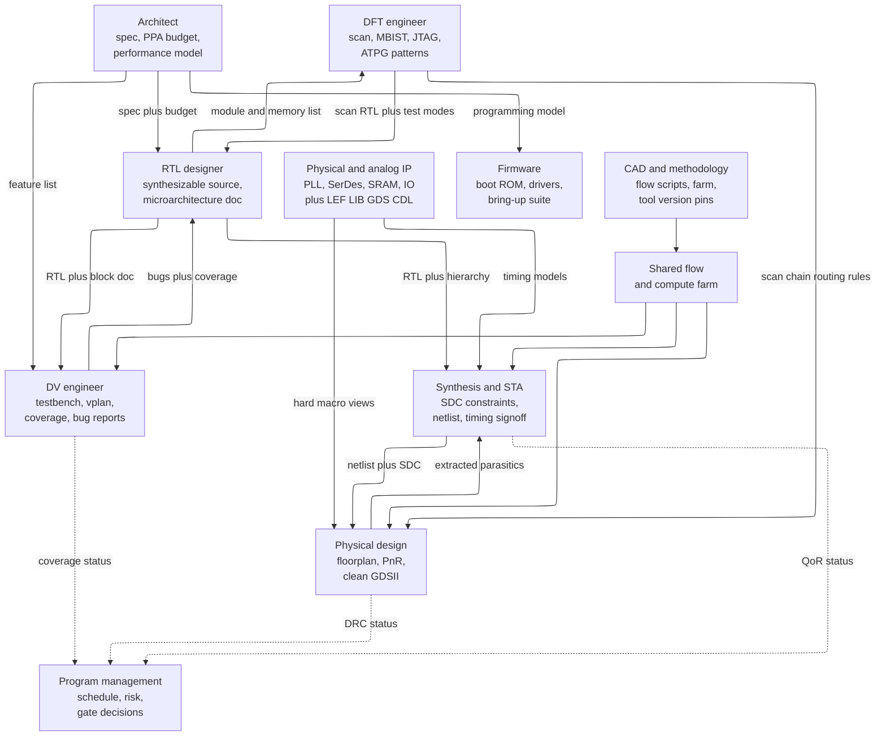
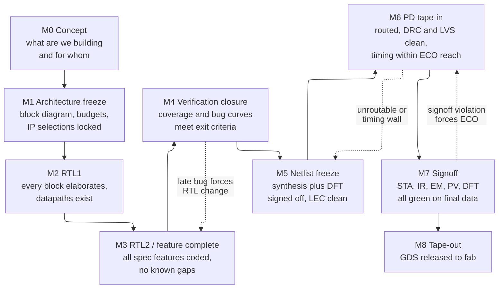
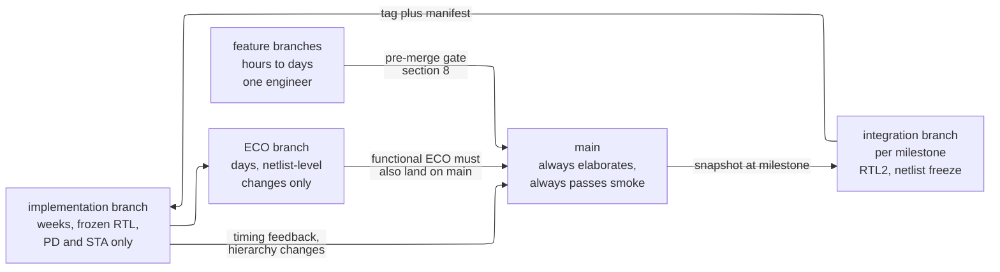
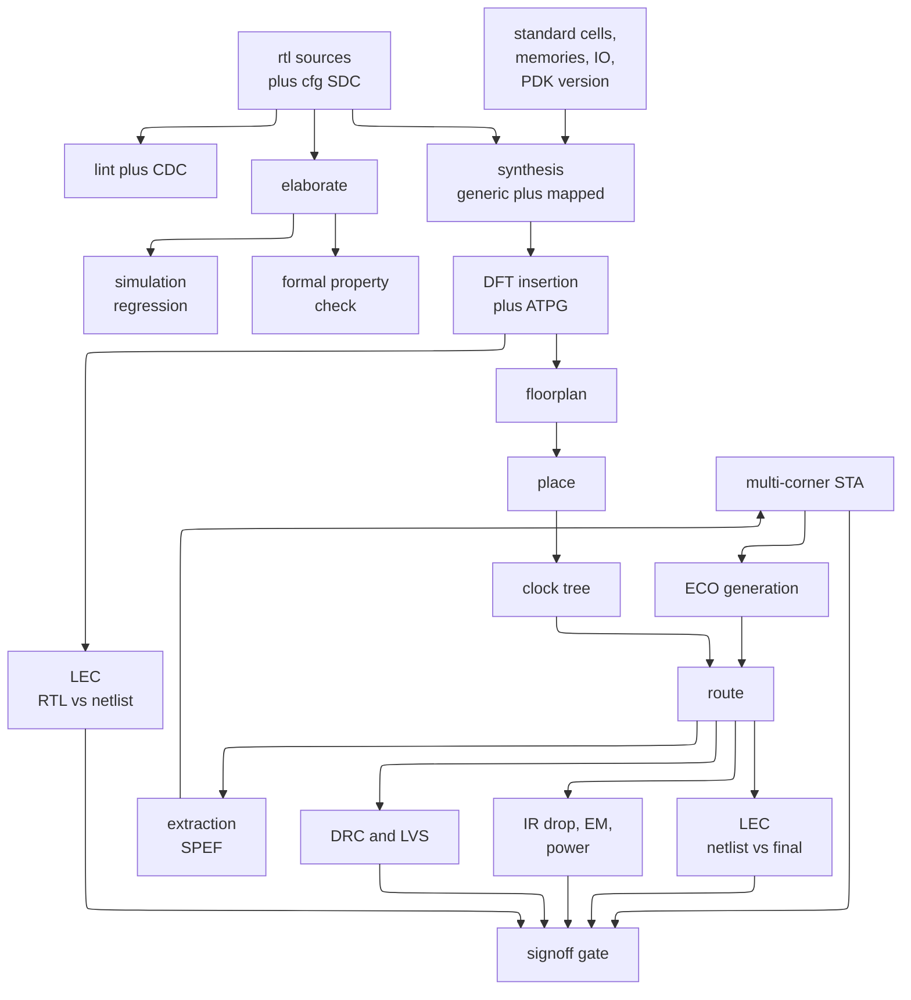
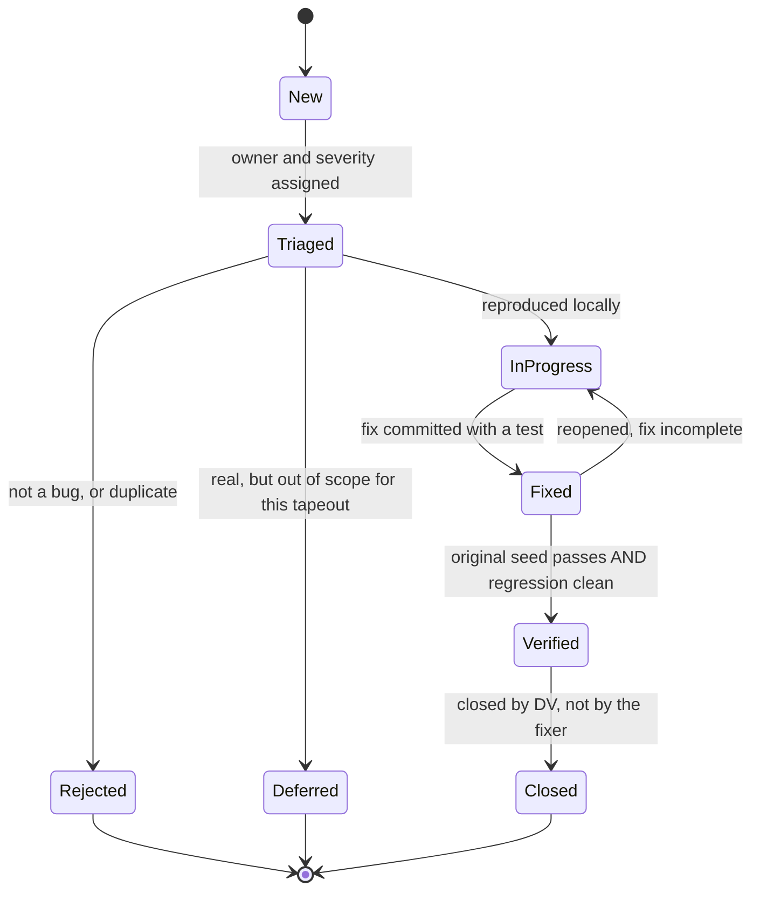
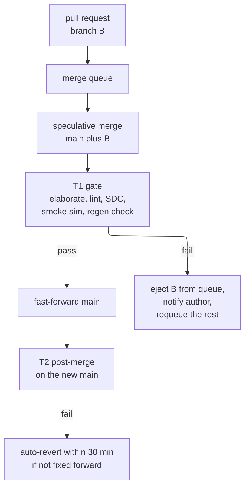

# Design Methodology and EDA Infrastructure — the machinery that makes a chip project reproducible

> **Prerequisites:** [Synthesis_Flow_and_QoR_Closure](../04_Synthesis/04_Synthesis_Flow_and_QoR_Closure.md) (what a synthesis run consumes and emits, and what "QoR" — quality of results — means as a set of scraped numbers), [Verification_Planning_and_Coverage_Closure](../03_Frontend_RTL_and_Verification/11_Verification_Planning_and_Coverage_Closure.md) (the verification plan, coverage models, and what "closure" means; this page builds the machine that *runs* those tests thousands of times a night).
> **Hands off to:** [IP_Reuse_Integration_and_Register_Automation](04_IP_Reuse_Integration_and_Register_Automation.md) (takes the repository, versioning, and generation discipline here and applies it to the specific problem of packaging and re-integrating IP and register maps).

---

## 0. Why this page exists

Folder 08 is a **cross-cutting track**, the same way folder 02 (power) is: it is not a stage in the spec-to-silicon pipeline but a concern that runs *through* every stage. [Power and Low Power](../02_Power_and_Low_Power/00_Index.md) cuts across architecture, RTL, synthesis, place-and-route, and signoff because every one of those stages can spend or save watts. This folder cuts across the same stages because every one of them can spend or save *engineering credibility* — security (page 01), safety (page 02), methodology and infrastructure (this page), and reuse (page 04) are all properties of the whole project, not of one tool invocation.

Here is the specific gap this page fills. A student who has taken one digital design course has written Verilog, opened a simulator, and maybe pushed a bitstream to an FPGA. Every one of those actions was a *single command producing a single result on a single machine*, and the "project" was one directory with six files. A real chip is 300 to 3,000 source files, twelve to forty tool invocations per block, eighteen to forty physical blocks, six to twenty timing corners, twenty thousand simulation tests, a compute farm of a thousand cores, and thirty to a hundred and fifty engineers across six disciplines, running for eighteen to thirty-six months. The intellectual content of the design does not change — a mux is still a mux — but the *dominant failure mode* changes completely. On a class project you fail because your FSM has a missing state. On a chip project you fail because two engineers were compiling against different versions of the same memory model and nobody noticed for five weeks.

That is the problem this page owns: **making a many-person, many-tool, many-month project produce a result that is reproducible, attributable, and continuously known to be good.** Reproducible means you can re-run any result from any point in the past and get the same answer. Attributable means when a number changes you can say which change caused it. Continuously known to be good means you find out that something broke in hours, not at the next milestone review. An engineer who skips this material writes correct RTL and still ships defects downstream, because a correct file that was never actually the file the tool read is worth nothing. The tape-out that goes out with a stale `.lib` file, the timing signoff run against constraints that were fixed in a branch nobody merged, the regression that has been silently passing because the testbench stopped driving stimulus in week 14 — these are not exotic. They are the normal way chip projects fail, and they are all infrastructure failures.

After this page you will be able to: lay out a chip repository and say what does and does not go in version control and why; read and write the TCL that drives every EDA tool you will ever touch; build a Makefile-driven flow with run directories, incremental rebuild, and QoR scraping; size a compute farm from first principles and explain why memory and licenses, not cores, are the binding constraints; design a tiered continuous-integration gate for a stated team; run a regression system with seed management, triage, and coverage merging; pick the five numbers that actually run a project and explain how each one is gamed; and — the part that matters most if you have no license to a commercial tool — install a fully open-source flow and take a design from SystemVerilog to GDSII on your own laptop.

---

## 1. The project as a machine: who owes what to whom

### 1.1 The roles, and the artifact each one owns

A chip team is not organized by "seniority" or by "who is good at Verilog." It is organized by **which artifact you are accountable for**, because the artifacts form a dependency graph and the graph is what actually schedules the project. If you know who owns each artifact, you know who to ask when it is wrong, and you know what is blocked when it is late.

| Role | Owns | Owes to others | Blocked by |
|---|---|---|---|
| **Architect** | the specification, the performance model, the power/area/performance (PPA) budget split per block | a spec precise enough that RTL and DV can be written *independently* from it and agree | workload data, silicon feedback from the previous generation |
| **RTL designer** | synthesizable source, the microarchitecture document, block-level lint/CDC cleanliness | RTL that elaborates, meets its area/timing budget in a trial synthesis, and matches the spec | spec, IP deliverables, DFT requirements |
| **DV (design verification) engineer** | testbench, verification plan, coverage model, the bug reports | evidence — coverage and passing tests — that the RTL implements the spec | spec (not RTL: writing the testbench *from* the RTL is the classic methodological sin), RTL that elaborates |
| **DFT (design for test) engineer** | scan insertion, memory BIST (built-in self-test), JTAG/IEEE 1149.1 boundary scan, ATPG (automatic test pattern generation) patterns, test coverage number | a test strategy the RTL must accommodate and PD must route | RTL hierarchy, memory list, package pinout |
| **Synthesis / STA / CAD** | timing constraints (SDC), the gate-level netlist, the static timing analysis (STA) signoff, and — for CAD specifically — the flow itself | a netlist that is functionally equivalent to RTL and closes timing at every corner; a flow anyone can run | RTL, libraries, floorplan feedback |
| **Physical design (PD)** | floorplan, power grid, placement, clock tree, routing, DRC/LVS-clean GDSII | a physical implementation that meets timing with *real* parasitics, not estimates | netlist, constraints, macro deliverables, PDK |
| **Physical / analog IP** | PLL, SerDes, SRAM compilers, IO cells, and every *model* of them — LEF (abstract), Liberty `.lib` (timing/power), GDS (layout), CDL (netlist), behavioral Verilog | a self-consistent set of views: the behavioral model must match the `.lib` must match the GDS | process maturity, characterization compute |
| **Firmware / software** | boot ROM, drivers, the bring-up test suite, the register header files | early feedback that the programming model is usable, before it is frozen in silicon | register spec, an emulation or FPGA platform |
| **Program management** | the schedule, the risk register, and the *gate decisions* | an honest, current picture of where the project is, and a decision when one is needed | truthful metrics from everyone above |

The column that matters most is **"Owes to others."** Every one of those obligations is a *contract*, and every contract is a place a project silently breaks. The architect owes a spec precise enough that RTL and DV can be written independently — if it is not, DV writes its checker by reading the RTL, and the whole verification effort degenerates into proving that the RTL equals itself. The IP team owes *self-consistent views* — if the behavioral Verilog model of a memory ignores a wait state that the `.lib` timing arc requires, simulation passes and silicon fails. These are not process bureaucracy; they are the actual mechanisms by which correct individual work sums to an incorrect chip.

### 1.2 The ownership graph



**Contract of the figure:** solid arrows are *deliverables* — an artifact one role produces that another cannot start without. Dotted arrows are *status* — information that flows to program management but blocks nobody. The distinction is the whole point: you escalate on a late solid arrow and you merely note a bad dotted arrow.

**One concrete trace.** The IP team releases version 2.3 of a 4 KB single-port SRAM compiler instance. That release contains five views. PD consumes the LEF for the macro outline and pin locations and the GDS for the final stream-out. Synthesis and STA consume the Liberty `.lib` for setup/hold arcs and output slew tables. DV consumes the behavioral Verilog model. Now suppose 2.3 fixed a hold-time arc in the `.lib` but the behavioral model was not respun. Simulation continues to pass because the behavioral model has no timing. STA, using the new `.lib`, correctly reports a hold violation that PD fixes with buffers. Everything looks fine. Then someone runs gate-level simulation with SDF (standard delay format) back-annotation, and it fails — because the behavioral model's implicit timing disagrees with the `.lib`. The bug was created by a violated *consistency* contract on a single edge of this graph, and it cost three weeks because nothing in the flow was checking that edge.

**The trade-off the figure illustrates:** the `PD -> SYN` back-edge is a *cycle*. Synthesis needs a netlist to hand to PD, but the netlist's timing is only trustworthy once PD has produced real parasitics — which requires the netlist. Every real chip flow contains this loop, and the entire discipline of "physical synthesis" and "timing convergence" exists to make the loop converge in three or four iterations instead of diverging. See [Physical_Synthesis_and_Design_Planning](../04_Synthesis/05_Physical_Synthesis_and_Design_Planning.md) for how the loop is shortened.

### 1.3 The milestone ladder

Milestones exist for exactly one reason: **to make a large irreversible investment conditional on a small amount of evidence.** Starting physical design costs hundreds of thousands of core-hours and months of PD engineer time. You want to spend that only on RTL that will not change underneath you. A milestone is the checkpoint where you decide whether the evidence justifies the next investment.



The dotted back-edges are the ones that destroy schedules. Notice they get *more* expensive as you go right: an RTL2 slip costs weeks, an M5 respin costs a month of re-synthesis and re-verification, and an M7 finding costs an engineering change order (ECO) cycle on a netlist that is already placed and routed — see [Signoff_Orchestration_ECO_and_Tapeout_Readiness](../06_Signoff/04_Signoff_Orchestration_ECO_and_Tapeout_Readiness.md). Every exit criterion below is designed to make one of those back-edges less likely.

| Milestone | Exit criteria — what must be *demonstrated*, not asserted | Typical duration | Cumulative month |
|---|---|---|---|
| **M0 Concept** | market/workload requirement written down; rough PPA target; a performance model that predicts the headline number within ~20 % | 2–4 mo | 3 |
| **M1 Architecture freeze** | block diagram with interfaces named; per-block area, power, and frequency budgets summing to the chip target with ≥ 15 % margin; IP vendor selections signed; process node and PDK version chosen | 2–3 mo | 6 |
| **M2 RTL1** | every block elaborates and passes lint; top level connects and simulates a "hello world" boot; trial synthesis on the two largest blocks returns area within 1.3× budget | 3–4 mo | 10 |
| **M3 RTL2 / feature complete** | every feature in the spec is coded; the verification plan is fully written and every item is *assigned*; CDC (clock-domain crossing) and lint are clean at the waiver-reviewed level; no known unimplemented features | 3–4 mo | 14 |
| **M4 Verification closure** | code coverage ≥ 98 %, functional coverage ≥ 100 % of the plan or waived with rationale; bug discovery rate declining for ≥ 6 consecutive weeks; zero open severity-1/2 bugs; regression pass rate ≥ 99.5 % over 3 consecutive nights | 4–6 mo | 19 |
| **M5 Netlist freeze** | synthesis meets timing at all corners with positive margin against the PD budget; DFT coverage ≥ 99 % stuck-at and ≥ 90 % transition; logic equivalence check (LEC) RTL-vs-netlist passes with zero unproven points; power estimate within budget | 1–2 mo | 21 |
| **M6 PD tape-in** | fully routed; DRC/LVS clean; worst negative slack (WNS) recoverable by ECO, typically ≥ −50 ps; IR drop within budget; no open antenna or EM violations | 2–3 mo | 23 |
| **M7 Signoff** | multi-corner multi-mode STA clean; physical verification clean on the final database including fill and DFM checks; power and EM/IR signed off; DFT patterns simulated and passing; every waiver reviewed and recorded | 3–6 wk | 24 |
| **M8 Tape-out** | GDS checksummed and transmitted; the reproducibility manifest of §3.5 archived; mask order placed | 1 wk | 24 |

Two honest observations about this table. First, the durations overlap heavily in practice — DV work continues through M5 and M6, and PD trial runs start well before M5 on a snapshot netlist. The table shows the *critical path*, not exclusive occupancy. Second, the M4 exit criterion "bug discovery rate declining for six consecutive weeks" is doing more work than every other row: it is the only criterion that is a statement about a *derivative*, and §9.2 explains why a derivative is the only honest way to answer "are we done finding bugs?"

---

## 2. Repository and file organization

### 2.1 Baseline, and what breaks it

The baseline a student brings from class is: one directory, `design.v` and `tb.v`, run `iverilog *.v`. It works because there is one tool, one configuration, and one output. It breaks the moment any of those becomes plural, and on a chip project all three become plural at once.

The specific failures, in the order you hit them:

1. **Generated files get committed.** Someone commits `netlist.v` because "it's needed." Now the netlist and the RTL drift, and nobody can tell which is authoritative.
2. **Configuration is embedded in scripts.** The clock period is hard-coded in three TCL files and two of them get updated.
3. **Runs overwrite each other.** Two engineers run synthesis in the same directory. The log is a mixture. Neither result is trustworthy.
4. **The "it works on my machine" failure.** A run depends on an environment variable, a file in someone's home directory, or a tool version that happens to be first in `$PATH`.

The repair is a directory structure whose shape *encodes* the separation between four categories of thing: **source** (hand-written, versioned, the truth), **configuration** (hand-written, versioned, the knobs), **scripts** (hand-written, versioned, the recipe), and **results** (generated, never versioned, disposable).

### 2.2 A concrete tree

```text
chip/
├── Makefile                  # the single entry point; "make block=core stage=pnr"
├── cfg/                      # ALL configuration -- versioned, no logic
│   ├── tools.mk              # tool version pins (see section 11)
│   ├── project.tcl           # process node, PDK version, default corners
│   ├── corners.tcl           # named PVT + RC corner definitions
│   ├── blocks.yaml           # block list: owner, clock, area budget, hierarchy
│   └── core/
│       ├── constraints.sdc   # block SDC -- hand-written or generated, see 4.4
│       ├── floorplan.tcl     # block dimensions, macro placement, pin sides
│       └── upf/core.upf      # power intent -- see the 02 folder
├── rtl/                      # synthesizable source ONLY. Nothing else.
│   ├── core/  ├── noc/  ├── dma/  ├── periph/
│   └── common/               # shared primitives: sync, fifo, arbiters
├── tb/                       # testbench infrastructure, agents, models
│   ├── uvm/                  # agents, sequences, env, scoreboards
│   ├── models/               # reference models, memory models, bus functional models
│   └── top/                  # top-level testbench harnesses
├── dv/                       # verification content and control
│   ├── vplan/                # the verification plan, machine-readable
│   ├── tests/                # test programs and sequences
│   ├── regress/              # regression lists: smoke.list, nightly.list, weekly.list
│   └── cov/                  # coverage models, exclusions, waivers (with rationale)
├── dft/                      # scan config, MBIST config, ATPG setup, pattern lists
├── syn/scripts/              # synthesis TCL: read, compile, report, write
├── pd/scripts/               # floorplan, place, CTS, route, optimize
├── sta/scripts/              # timing signoff setup, corner loops, ECO generation
├── pv/                       # physical verification: DRC/LVS decks, waivers
├── sw/                       # firmware: boot ROM, drivers, bring-up tests
│   └── include/              # GENERATED register headers -- see page 04
├── ip/                       # third-party and internal IP, one dir per IP
│   ├── manifest.yaml         # IP name -> version -> checksum -> license terms
│   └── pll_28g/ -> (submodule or fetched artifact, NOT vendored source)
├── scripts/                  # cross-cutting automation
│   ├── flow/                 # the flow driver (python or tcl)
│   ├── qor/                  # log scrapers, QoR database loaders
│   └── ci/                   # CI gate definitions
├── docs/                     # specs, microarchitecture, integration guide
└── runs/                     # GENERATED. gitignored. Never edited by hand.
    └── core/
        └── 20260614T0312Z_a4f19c2/
            ├── syn/   ├── pnr/   ├── sta/
            ├── logs/  ├── reports/  ├── status/
            └── MANIFEST.yaml      # exactly what this run consumed -- section 3.5
```

**What must be in version control:** everything under `rtl/`, `tb/`, `dv/`, `dft/`, `cfg/`, `syn/`, `pd/`, `sta/`, `pv/`, `sw/`, `scripts/`, `docs/`, and the *manifests* under `ip/`. The rule is: **if a human typed it, it is versioned; if a tool produced it, it is not.**

**What must not be in version control, and why each one hurts:**

| Never commit | Why |
|---|---|
| Netlists, GDS, SPEF, SDF, reports, logs | Generated. Committing them creates a second source of truth that will diverge from the first. Archive them as *artifacts* (§3.4) instead. |
| Tool databases — `.ddc`, Innovus `*.enc.dat`, Milkyway/NDM libraries, OpenAccess libs | Binary, huge, opaque, tool-version-specific, and undiffable (§3.3). A single PD database is 5–80 GB. |
| The PDK and standard-cell libraries | Almost always license-restricted — you are contractually forbidden to redistribute them, and a repository clone is redistribution. They also have their own release cadence. Reference them by *version* from a shared read-only mount. |
| Vendor IP source | Same license problem, plus IP has its own version stream. Reference it (§2.4). |
| Anything with a person's name or home directory in the path | It will not exist for anyone else. |
| Waiver files with no rationale field | A waiver without a reason is an unlogged bug. Commit waivers, but enforce a mandatory rationale field. |

### 2.3 The "one command rebuilds everything" invariant

The single most valuable property of a chip repository is:

> From a clean clone on a clean machine with only the tool mount and the PDK mount available, one command reproduces any result.

This sounds like convenience. It is actually the *definition of reproducibility*, and it has hard consequences that shape the whole structure:

- **No step may depend on the state of a previous interactive session.** If synthesis only works after you have "sourced the setup file and run `read_lib` by hand," the flow is not a flow.
- **No absolute paths outside the two mounts.** Everything is relative to the repository root or to `$TOOL_ROOT` / `$PDK_ROOT`.
- **Every generated file must be regenerable.** If a file cannot be regenerated, it is a source file and belongs in version control; there is no third category.
- **The environment is part of the recipe.** Tool versions live in `cfg/tools.mk`, not in the user's shell profile (§11).

The test is cheap and you should run it weekly in CI (§8): clone into a scratch directory, unset every project-related environment variable, and run `make smoke`. The first time you run this test on an existing project it will fail, and the reasons it fails are a complete list of your reproducibility bugs.

### 2.4 IP and submodule versioning

Third-party IP and internally-shared IP present the same problem: the IP has its own release stream, and the chip must pin one release of it. Three mechanisms, with a real trade:

- **Vendoring** — copy the IP source into your repo. *Pro:* one clone, one version, obviously reproducible. *Con:* you have forked; upstream fixes require a manual merge, and for licensed IP it may be legally prohibited.
- **Git submodules** — the parent repo stores a commit hash pointing into the IP repo. *Pro:* a hash is an exact pin and the history stays with the IP. *Con:* submodules are famously easy to leave un-updated (`git submodule update --init --recursive` forgotten equals a silent stale IP), and they require the IP to be in git, which vendor IP usually is not.
- **Artifact fetch by version + checksum** — `ip/manifest.yaml` names a version and a hash; a fetch step pulls the release tarball from an artifact store into a gitignored directory. *Pro:* works for binary and licensed IP, works for anything the vendor ships, and the checksum makes tampering and truncation detectable. *Con:* requires an artifact store and a fetch step that must run before anything else.

Most production projects use the third for vendor IP and the second for internal IP. Whichever you pick, the invariant is the same: **the version of every IP that a run consumed must appear in that run's manifest** (§3.5), because "which version of the PLL model was that?" is a question you will be asked at 2 a.m. during bring-up.

---

## 3. Version control for hardware, and how it differs from software

### 3.1 Why the software playbook does not transfer unchanged

Git was designed for a workload with three properties: files are text, merges are frequent and cheap, and the unit of release is one tree of source. Hardware violates all three.

- **Half the artifacts are binary and enormous.** A placed-and-routed database is 5–80 GB of tool-internal binary. Git stores a new full object for every version of a binary file (delta compression works poorly on compressed binary formats), so ten checkpoints of one PD database is half a terabyte of `.git`. Clone time goes from seconds to hours, and every developer pays it.
- **A "release" is not one tree.** A timing signoff result depends on RTL *and* SDC constraints *and* the Liberty libraries *and* the PDK tech file *and* the tool version *and* the extraction deck. Four of those six live outside your repository. Tagging the repository captures a third of the truth.
- **Merges can be semantically catastrophic in ways textual merge cannot see.** Two engineers edit different lines of the same `always_ff` block; git merges cleanly; the result has a latch, or a race, or an inferred priority the author never intended. Textual non-conflict is not semantic non-conflict.
- **The long pole is a run, not a build.** A software feature branch rebases against main cheaply. A physical-implementation branch has three weeks of PD work invested in a specific netlist; "just rebase onto the new RTL" means redoing three weeks.

### 3.2 A branch strategy that survives a long physical tail

The structural fact is that **RTL churns fast and physical implementation churns slow**, and forcing them onto one branch makes one of them intolerable. The working shape:



**Contract:** `main` is never broken — the pre-merge gate of §8 guarantees it elaborates and passes a smoke test. Implementation branches are *cut, not merged forward continuously*: PD works against a frozen snapshot and the RTL team keeps moving on `main`. The cost is that PD's timing feedback arrives against RTL that is already three weeks stale.

**One concrete trace of the failure this prevents and the failure it creates.** Without the split: PD is placing `core`, an RTL engineer merges a fix that adds 400 gates to a critical path, PD's incremental run now fails to close and the PD engineer spends a day discovering that the design changed underneath them. With the split: that does not happen, but three weeks later PD reports that a path through the fetch unit needs a pipeline stage, and by then the fetch unit has been rewritten on `main` — so the fix must be re-derived. The second failure is much cheaper than the first, which is why the split wins, but it is not free.

**The rule that makes the ECO branch safe:** any *functional* ECO — a netlist change that alters behavior — must be mirrored back to RTL on `main` and re-verified. A functional ECO that exists only in the netlist means your RTL is no longer the source of truth for the chip you taped out, which invalidates every future derivative product. Metal-only timing ECOs (buffer insertion, sizing) do not need this because they do not change function; logic equivalence checking (LEC) is what proves that claim.

### 3.3 Why binary databases break git, and what to use instead

Consider the arithmetic. A mid-size block's placed-and-routed Innovus database is roughly 12 GB. A PD engineer checkpoints after floorplan, place, CTS, route, and post-route optimization — five checkpoints per iteration, four iterations before tape-in, twenty checkpoints. Because the format is internally compressed, git's zlib and delta compression recover almost nothing; assume a 0.9 packing ratio.

$$20 \times 12\ \text{GB} \times 0.9 \approx 216\ \text{GB in } \texttt{.git}$$

Every clone transfers all of it, because git clones full history by default. With ten PD engineers and a 1 Gb/s link, that is $216\ \text{GB} \times 8\ \text{bits} / 1\ \text{Gb/s} \approx 1730\ \text{s} \approx 29$ minutes per clone, *per engineer*, and the repository is now unusable for the RTL team who only wanted 40 MB of text.

Three mechanisms, in increasing order of correctness for this problem:

- **Git LFS (Large File Storage).** Replaces the file content in the repo with a pointer file containing a SHA-256; the content lives on an LFS server and is fetched lazily. Fixes clone time for people who do not need the binaries. Does not fix storage cost, and adds a second server whose backup policy is now part of your tape-out risk.
- **An artifact store** — Artifactory, S3, or a plain versioned NFS tree with immutable directories. Generated binaries are *published*, not committed: `runs/.../pnr/core.enc.dat` gets copied to `artifacts/core/2026-06-14T03:12Z_a4f19c2/` and referenced by URL and checksum. This is the right answer, because it matches the semantics: these objects are *outputs identified by the inputs that produced them*, not *sources with a history*.
- **Content-addressed caching.** Go further: key the artifact by the hash of all its inputs. If someone requests a synthesis of the same RTL with the same constraints, libraries, and tool version, the flow returns the cached result. This is what makes a "rebuild everything" command finish in minutes rather than days, and it is only possible if you already compute the manifest of §3.5.

The one legitimate use of LFS in a hardware repository is for *small, rarely-changing, genuinely-source* binaries: a handful of encrypted IP models, a compiled reference model, a golden waveform for a checker. Everything large and generated belongs in the artifact store.

### 3.4 Tagging a release that spans more than the repository

A tag on the repository is necessary and insufficient. What you actually need to reproduce a result is the closure of everything the run read. In practice a release tag is *accompanied by* a manifest, and the tag is only the pointer into it:

```text
git tag -a rel/core_M5_netlist_v3 -m "core netlist freeze, LEC clean, all corners +12ps"
```

and the tag's annotation, or a file committed alongside it, names the manifest. The convention that works is: **tag name encodes block + milestone + attempt; manifest encodes everything else.**

### 3.5 The release manifest

The manifest is the exact list of file versions and tool versions a run consumed, with checksums. It is written *by the flow, at run time*, from what the tool actually opened — not hand-maintained, because a hand-maintained manifest is a wish, not a record.

```yaml
# runs/core/20260614T0312Z_a4f19c2/MANIFEST.yaml   -- written by the flow, read-only
run:
  id:            core_pnr_20260614T0312Z_a4f19c2
  block:         core
  stage:         route_opt
  started_utc:   2026-06-14T03:12:07Z
  wall_seconds:  41820
  host:          farm-r12n47
  submitted_by:  jlin
  exit_status:   PASS

repo:
  url:           git@git.internal:soc/chip.git
  commit:        a4f19c2e6b0d5f3719c8a2d40e5b7c1f9a3e8d62
  branch:        impl/core_M5
  dirty:         false          # a dirty tree in a signoff run is a hard error

tools:
  synthesis:     dc_shell   V-2023.12-SP5
  place_route:   innovus    22.14-s103
  sta:           pt_shell   V-2023.12-SP3
  extraction:    starrc     V-2023.12
  drc_lvs:       calibre    2023.4_18.11

pdk:
  name:          cmos5ff
  version:       1.4_PRODUCTION
  techfile_sha:  9f2c1a...  (sha256, cmos5ff_1p13m.tf)
  extraction_deck: starrc_cmos5ff_1.4_nominal.nxtgrd  sha256 4b81e0...

libraries:
  - name: sc9mcpp84_base_lvt      version: 1.9.2   sha256: 71ca3f...
  - name: sc9mcpp84_base_svt      version: 1.9.2   sha256: 0d94b8...
  - name: sram_sp_4096x64         version: 2.3.0   sha256: c5e102...   # NOTE: was 2.2.1 in the previous run
  - name: io_lvcmos_1v8           version: 3.0.1   sha256: 8ab774...

inputs:
  netlist:       artifacts/core/syn_20260610T2140Z_71b3e9d/core.mapped.v   sha256: e30f7c...
  sdc:           cfg/core/constraints.sdc                                  sha256: 12d8b4...
  upf:           cfg/core/upf/core.upf                                     sha256: aa5719...
  floorplan:     cfg/core/floorplan.tcl                                    sha256: 6c1f03...
  corners:       cfg/corners.tcl                                           sha256: 5e77aa...

outputs:
  db:            artifacts/core/pnr_20260614T0312Z_a4f19c2/core.enc.dat    sha256: 3fd8c1...
  netlist:       artifacts/core/pnr_20260614T0312Z_a4f19c2/core.route.v    sha256: bd0a45...
  spef:          artifacts/core/pnr_20260614T0312Z_a4f19c2/core.cworst.spef sha256: 77e2b9...

qor:
  wns_ps:        -18
  tns_ps:        -412
  violating:     37
  area_um2:      1842660
  utilization:   0.712
  drc_violations: 0
  total_power_mw: 486.3
```

Three properties make this document worth the trouble. **It is complete** — every external dependency has a version and a hash, so nothing that mattered is missing. **It is machine-comparable** — two manifests diff to a list of changed inputs, which is the single most useful debugging operation on a chip project (Worked Problem 3). **It records the QoR alongside the inputs**, so the manifest archive *is* the QoR database of §5.6: every historical run is one row keyed by its inputs.

Note the comment on the SRAM line. That is the entire value proposition: when last night's timing regressed by 40 ps and nothing in the RTL changed, the manifest diff says the memory `.lib` moved from 2.2.1 to 2.3.0, and you are done in ninety seconds instead of two days.

---

## 4. TCL as the lingua franca

### 4.1 Why every EDA tool speaks the same language

TCL — Tool Command Language, pronounced "tickle" — is not in EDA tools because it is a beautiful language. It is there because of an engineering property John Ousterhout designed into it in 1988: **TCL ships as a C library that an application embeds, and the application registers its own commands into the interpreter.** A tool vendor writing a place-and-route engine in C++ links `libtcl`, calls `Tcl_CreateCommand("place_design", ...)`, and instantly has a complete scripting language — variables, loops, procedures, file I/O, string handling — wrapped around their engine, for a few days of work. Writing a bespoke scripting language would have cost person-years and produced something worse.

The consequence for you is enormous and slightly absurd: **Synopsys Design Compiler, PrimeTime, IC Compiler, Cadence Genus, Innovus, Tempus, Siemens Calibre, Xilinx Vivado, OpenROAD, and OpenSTA all take TCL.** One language, learned once, drives your entire career's worth of tools. This is the single highest-leverage non-hardware skill in the field, and it is usually taught to nobody.

The syntax follows from the embedding decision. TCL has essentially one rule: **everything is a command, and a command is a list of words; the first word is the command name and the rest are arguments, all of which are strings.** There are no statements, no operators at the language level, and no types. `if` is a command that takes a condition string and a body string. `expr` is a command that parses an arithmetic mini-language out of its arguments. This uniformity is why it embeds so cleanly, and it is also the source of every trap in §4.5.

### 4.2 The constructs you actually need

Ninety percent of production EDA TCL uses this much of the language:

```tcl
# --- variables and substitution ---------------------------------------
set period 0.800                      ;# no types; 0.800 is the string "0.800"
set clk_name "clk_core"
puts "period of $clk_name is $period ns"

# --- arithmetic: ALWAYS brace the expression -------------------------
set half [expr {$period / 2.0}]       ;# braces = compiled once, no re-substitution
set setup_margin [expr {$period - $data_path - $clk_skew - $setup_time}]

# --- lists: the fundamental composite type ---------------------------
set corners [list ss_0p675_125c ff_0p825_m40c tt_0p750_025c]
lappend corners ss_0p675_m40c
foreach c $corners { puts "corner: $c" }
puts "count = [llength $corners], first = [lindex $corners 0]"
set sorted [lsort -real $slacks]      ;# -real / -integer, NOT the ASCII default

# --- dicts (Tcl 8.5+): the workhorse for flow data -------------------
set budget [dict create core 1.85 noc 0.42 dma 0.31]
dict set budget periph 0.18
dict for {blk area} $budget { puts [format "%-8s %6.2f mm2" $blk $area] }
if {[dict exists $budget core]} { set a [dict get $budget core] }

# --- arrays: older, still everywhere in vendor scripts ---------------
set lib(ss)  "sc9_ss_0p675v_125c.db"
set lib(ff)  "sc9_ff_0p825v_m40c.db"
foreach k [array names lib] { puts "$k -> $lib($k)" }

# --- regexp: how you get numbers out of tool reports -----------------
if {[regexp {slack \(VIOLATED\)\s+(-?[0-9.]+)} $line -> slack]} {
    lappend violations $slack
}
# regsub for rewriting: strip a hierarchical prefix from an instance name
regsub {^u_core/} $inst "" leaf

# --- procs: the unit of reuse ----------------------------------------
proc ns_to_ps {t} { return [expr {$t * 1000.0}] }
proc report_or_die {cmd file} {
    if {[catch {eval $cmd} out]} { error "command failed: $out" }
    set fh [open $file w]; puts $fh $out; close $fh
}

# --- file I/O --------------------------------------------------------
set fh [open reports/timing.rpt r]
while {[gets $fh line] >= 0} { ... }        ;# gets returns -1 at EOF
close $fh
if {[file exists $path] && [file size $path] > 0} { ... }
file mkdir runs/$block/$stamp

# --- error handling: catch returns 0 on success ----------------------
if {[catch {read_verilog $f} msg opts]} {
    puts "ERROR reading $f: $msg"
    puts [dict get $opts -errorinfo]        ;# full stack, Tcl 8.5+
    exit 1
}
```

Two things in that block are worth naming explicitly because they are the difference between amateur and production scripts. First, `expr {...}` with braces — always, without exception (§4.5). Second, `catch` with the *options dictionary* third argument, which gives you `-errorinfo` (the stack trace) and `-errorcode`. A `catch` that discards the message is worse than no `catch`, because it converts a loud failure into a silent wrong answer.

### 4.3 Tool-command access versus tool-attribute access

Beyond base TCL, every tool exposes its design database, and this is where dialects diverge. There are two access patterns and you must know which one you are in.

**Pattern A — collections and attributes (Synopsys: DC, PrimeTime, ICC2).** Query commands return an opaque *collection* handle, not a list. You read fields with `get_attribute`.

```tcl
set ffs [get_cells -hierarchical -filter "is_sequential == true"]
puts "flop count = [sizeof_collection $ffs]"        ;# NOT llength
foreach_in_collection c $ffs {                       ;# NOT foreach
    set ref [get_attribute $c ref_name]
    set a   [get_attribute $c area]
}
```

The trap is that a collection *looks* like a list when you `puts` it, so `llength $ffs` returns 1 and `foreach` iterates once. Both silently produce wrong answers rather than errors. `sizeof_collection` and `foreach_in_collection` exist precisely because collections are lazily-evaluated database handles that may reference a million objects — materializing them as a TCL list would exhaust memory.

**Pattern B — database path queries (Cadence: Genus, Innovus, Tempus).** The database is addressed like a filesystem, and one command walks it.

```tcl
set ffs [get_db insts -if {.base_cell.is_sequential == true}]
puts "flop count = [llength $ffs]"                   ;# get_db returns a real list
foreach c $ffs { set a [get_db $c .area] }
set wns [get_db [get_db timing_paths -max_paths 1] .slack]
```

Here `get_db` returns ordinary TCL lists, so `llength` and `foreach` are correct — the exact opposite of Pattern A. Guessing wrong is a common source of scripts that "work" but process one object.

**Discovery is the skill, not memorization.** Every tool has an introspection command: `list_attributes -application` and `report_attribute` in Synopsys tools, `get_db -h` and `help get_db` in Cadence tools, `help *pattern*` everywhere. You are never expected to know the attribute name; you are expected to know how to find it in thirty seconds.

### 4.4 Four utilities worth writing once

**Utility 1 — worst N paths grouped by capture clock.** The default `report_timing` gives you the worst paths in the design, which is almost never what you want: if one clock domain is badly broken it consumes the entire report and hides a second, independent problem. Grouping by capture clock turns one number into a diagnosis.

```tcl
# PrimeTime / DC dialect (Pattern A). Cadence equivalents noted inline.
proc worst_by_clock {{n 5}} {
    set buckets [dict create]                    ;# clock name -> {endpoint slack} pairs

    set paths [get_timing_paths -delay_type max -slack_lesser_than 0 \
                                -max_paths 20000 -nworst 1]

    foreach_in_collection p $paths {
        set slack [get_attribute $p slack]
        set ep    [get_object_name [get_attribute $p endpoint]]
        set clkc  [get_attribute $p endpoint_clock]
        if {$clkc eq ""} { set clk "unclocked" } else { set clk [get_object_name $clkc] }
        dict lappend buckets $clk [list $ep $slack]
    }

    foreach clk [lsort [dict keys $buckets]] {
        set rows [lsort -real -index 1 [dict get $buckets $clk]]   ;# worst first
        set nviol [llength $rows]
        set wns   [lindex [lindex $rows 0] 1]
        set tns   0.0
        foreach r $rows { set tns [expr {$tns + [lindex $r 1]}] }
        puts [format "clock %-18s viol %5d  WNS %8.3f  TNS %10.2f" \
                     $clk $nviol $wns $tns]
        foreach r [lrange $rows 0 [expr {$n - 1}]] {
            puts [format "      %-64s %8.3f" [lindex $r 0] [lindex $r 1]]
        }
    }
    return $buckets
}
```

Sample output, and why it changes what you do next:

```text
clock clk_core           viol   312  WNS   -0.184  TNS    -18.42
      u_core/u_exec/alu_result_reg_31_/D                        -0.184
      u_core/u_exec/alu_result_reg_30_/D                        -0.181
clock clk_ddr_2x         viol     4  WNS   -0.061  TNS     -0.19
      u_ddr/u_phy/dqs_dly_reg_3_/D                              -0.061
clock unclocked          viol    17  WNS   -9.999  TNS    -99.99
```

Three separate problems, and the third is the important one. Without grouping, `report_timing` would have shown ten `clk_core` paths and you would have spent the day on the ALU. The `unclocked` bucket with implausible slack is a *constraint bug*, not a timing bug — those endpoints have no clock reaching them, meaning a generated clock is undefined or a clock-gating cell is unconstrained. That is a five-minute fix worth more than a week of ALU retiming, and it is invisible in an ungrouped report. Constraint provenance is covered in [Constraints_SDC](../04_Synthesis/02_Constraints_SDC.md).

**Utility 2 — diff two report files.** After every flow change you need to answer "what moved?" A generic scraper plus a diff answers it for any report with `key : value` lines.

```tcl
proc scrape_kv {file} {
    set d [dict create]
    if {![file exists $file]} { error "scrape_kv: no such file: $file" }
    set fh [open $file r]
    while {[gets $fh line] >= 0} {
        # match "  Total cell area :   1842660.31"  -> key, numeric value
        if {[regexp {^\s*([A-Za-z][^:]*?)\s*:\s*(-?[0-9]+\.?[0-9]*)\s*$} $line -> k v]} {
            dict set d [string trim $k] $v
        }
    }
    close $fh
    return $d
}

proc diff_kv {fa fb {tol 0.0}} {
    set a [scrape_kv $fa]
    set b [scrape_kv $fb]
    set keys [lsort -unique [concat [dict keys $a] [dict keys $b]]]
    set nchanged 0
    foreach k $keys {
        if {![dict exists $a $k]} { puts [format "%-34s %14s %14.4f  ADDED"   $k "-" [dict get $b $k]]; continue }
        if {![dict exists $b $k]} { puts [format "%-34s %14.4f %14s  REMOVED" $k [dict get $a $k] "-"]; continue }
        set va [dict get $a $k]
        set vb [dict get $b $k]
        set delta [expr {$vb - $va}]
        if {abs($delta) <= $tol} { continue }
        if {$va != 0} { set pct [expr {100.0 * $delta / abs($va)}] } else { set pct 0.0 }
        puts [format "%-34s %14.4f %14.4f %+12.4f %+8.2f%%" $k $va $vb $delta $pct]
        incr nchanged
    }
    return $nchanged
}
```

Note the explicit `dict exists` guards instead of a ternary with `dict get` inside `expr` — the ternary form is a genuine hazard because whether the untaken branch is evaluated depends on how the expression compiles. Note also that ADDED and REMOVED keys are reported rather than skipped: a report line *disappearing* usually means the tool stopped performing that analysis, which is exactly the failure you most want to catch.

**Utility 3 — generating constraints instead of typing them.** Hand-written SDC is the largest source of silent signoff error in the industry, and the reason is that a wildcard that matches nothing is not an error in any EDA tool — `set_input_delay ... [get_ports data_i*]` on a design where the port is named `data_in*` constrains zero ports and reports success. Generating constraints from a machine-readable spec, with an existence assertion, removes the entire class.

```tcl
# ports.csv lines:   port_pattern, max_pct_of_period, min_pct_of_period
proc gen_input_delays {clk_name period spec_file} {
    set clk [get_clocks $clk_name]
    if {[sizeof_collection $clk] == 0} { error "gen_input_delays: no clock '$clk_name'" }

    set fh [open $spec_file r]
    set nports 0
    while {[gets $fh line] >= 0} {
        set line [string trim $line]
        if {$line eq "" || [string index $line 0] eq "#"} { continue }
        lassign [split $line ","] pat pct_max pct_min

        set ports [get_ports [string trim $pat] -quiet]
        if {[sizeof_collection $ports] == 0} {
            error "gen_input_delays: pattern '[string trim $pat]' matched NO ports"
        }
        set dmax [expr {$period * $pct_max / 100.0}]
        set dmin [expr {$period * $pct_min / 100.0}]
        set_input_delay -clock $clk -max $dmax $ports
        set_input_delay -clock $clk -min $dmin $ports
        incr nports [sizeof_collection $ports]
    }
    close $fh
    puts "gen_input_delays: constrained $nports ports against $clk_name"
    return $nports
}
```

The single line that earns this proc its existence is the `error` on a zero-match pattern. Everything else is convenience.

**Utility 4 — a step wrapper that makes failures machine-readable.** Flow steps must leave a breadcrumb the build system and the dashboard can read without parsing a 400 MB log.

```tcl
proc run_step {name body} {
    file mkdir status
    set t0 [clock seconds]
    puts "==== BEGIN $name  [clock format $t0 -format %Y-%m-%dT%H:%M:%SZ -gmt 1] ===="
    set code [catch {uplevel 1 $body} result opts]
    set dt [expr {[clock seconds] - $t0}]
    if {$code != 0} {
        puts "==== FAIL  $name  after ${dt}s ===="
        puts "  message: $result"
        puts "  trace  : [dict get $opts -errorinfo]"
        set fh [open status/$name.FAIL w]
        puts $fh "seconds=$dt"
        puts $fh "message=$result"
        close $fh
        return -code error "step $name failed"
    }
    puts "==== PASS  $name  in ${dt}s ===="
    set fh [open status/$name.PASS w]; puts $fh "seconds=$dt"; close $fh
    return $result
}

# usage
run_step read_design   { source scripts/read_design.tcl }
run_step place         { place_opt }
run_step cts           { clock_opt }
```

`uplevel 1 $body` runs the body in the *caller's* scope, so variables set inside a step remain visible afterwards — without it, every step would execute in the proc's local scope and silently lose its results. That one word is the difference between a wrapper that works and one that mysteriously loses state.

### 4.5 The classic TCL traps

These are not stylistic preferences. Each one has shipped a wrong chip somewhere.

**Trap 1 — unbraced `expr`.** `expr $a + $b` substitutes `$a` and `$b` into a string and then *parses that string as an expression*. Two failures follow. Performance: the expression is re-parsed every iteration, making loops 10–30× slower. Correctness: substituted content is re-interpreted, so if `$a` holds `1+2` and `$b` holds `3`, then `expr $a * $b` computes $1 + 2 \times 3 = 7$, not $3 \times 3 = 9$. Braced, `expr {$a * $b}` treats the values as operands and errors on non-numeric input, which is what you want.

**Trap 2 — leading zeros are octal.** A slack scraped from a report as `08` or a corner named `0755` will fail with `expected integer but got "08"`, because a leading zero means octal in `expr`. This bites when parsing timestamps, dates, and zero-padded indices. The fix is `scan $s %d n` or `expr {$s + 0.0}` only after forcing a decimal interpretation.

**Trap 3 — string comparison versus numeric comparison.** In `expr`, `==` compares *numerically if both sides look numeric*, otherwise as strings. So `expr {"1.0" == "1.00"}` is 1, while `string equal "1.0" "1.00"` is 0. And `expr {"abc" == "abd"}` is a string compare that quietly succeeds, while `expr {$slack < 0}` with `$slack` equal to `N/A` throws. Rule: use `eq` and `ne` for strings, `==` and `<` for numbers, and *validate* before comparing anything scraped from a report.

**Trap 4 — `lsort` defaults to ASCII.** `lsort {10 9 100}` returns `{10 100 9}`. Sorting slacks, areas, or corner indices without `-real` or `-integer` produces a ranked list that is wrong in a way that looks plausible. There is no warning.

**Trap 5 — global tool state.** An EDA tool is one enormous mutable global. `current_design`, `current_instance`, the active scenario, the loaded link library, and every `set_*` command mutate it. A proc that calls `current_design core` and does not restore it changes the meaning of every subsequent command in the script. Discipline: procs save and restore any global they touch, or take the object explicitly.

```tcl
proc area_of {design} {
    set saved [current_design]              ;# save
    current_design $design
    set a [get_attribute [current_design] area]
    current_design $saved                    ;# restore, even on the error path
    return $a
}
```

**Trap 6 — `catch` used as a mute button.** `catch {read_verilog $f}` with no message check turns a missing file into a silent empty design that synthesizes to nothing and reports zero timing violations. Always inspect the result, and prefer failing loudly.

**Trap 7 — quoting and `eval`.** `eval set_false_path $args` re-parses `$args` as a command, so any brace or bracket in a path name detonates. Since Tcl 8.5, use expansion: `set_false_path {*}$args`. Every `eval` in a modern flow script is a latent bug.

**Trap 8 — the tool's TCL is not the newest TCL.** Production EDA tools commonly embed Tcl 8.4, 8.5, or 8.6. `dict` requires 8.5; `{*}` requires 8.5; `dict getwithdefault` and `lremove` require 8.7 and will not exist. Check with `puts [info patchlevel]` before using anything modern, and keep flow scripts to the lowest version any tool in your flow embeds.

---

## 5. Build systems and flow automation

### 5.1 The baseline and its three failures

The baseline is a shell script: `run.sh` calls the tools in order. It works for one block, one corner, one engineer. It fails in three ways.

1. **No incrementality.** Changing one RTL file re-runs place-and-route from scratch — 30 hours instead of 20 minutes.
2. **No parameterization.** Eighteen blocks × twelve corners means the script is copied 216 times, and 214 copies drift.
3. **No dependency truth.** Nothing knows that synthesis must re-run when the SDC changes. Engineers remember, until they do not.

A build system fixes all three by describing the flow as a **directed acyclic graph (DAG) of targets, each with declared inputs**, and then deriving execution order and incrementality from the graph rather than from a human's memory.

### 5.2 The flow DAG



**Contract:** an edge means "the target cannot be correct until the source is current." The `ECO -> ROUTE` back-edge is the one cycle, and it is broken in practice by bounding the iteration count and by requiring each ECO pass to strictly reduce total negative slack.

**Concrete trace:** an RTL engineer fixes a bug in `dma.sv`. The DAG says `dma.sv` feeds `elaborate`, `lint`, and `synthesis`. Everything downstream of synthesis for the `dma` block is now stale; everything for `core` and `noc` is untouched. A correct build system re-runs six targets, not two hundred. A shell script re-runs everything or, worse, nothing.

### 5.3 Make versus a Python driver versus a flow framework

| | Make | Python driver | Flow framework |
|---|---|---|---|
| Dependency model | file timestamps, declarative | whatever you write | declarative, tool-aware |
| Incrementality | free and correct for files | must be built | built in, often content-hashed |
| Parallelism | `-j`, local only | explicit, farm-aware | farm-aware, license-aware |
| Parameterizing over 18 blocks × 12 corners | pattern rules, gets ugly fast | trivial | trivial |
| Readability at 5,000 lines | poor | good | good, if you learn the framework |
| Debuggability when it misbehaves | excellent — it is 40 lines of rules | good | poor — it is someone else's abstraction |
| Right when | small-to-mid project, one team | mid-to-large, custom needs | large org with a CAD team to own it |

The honest recommendation for a project below roughly ten blocks is **Make for the DAG, Python for anything that needs logic**, with Make shelling out to Python for job submission and QoR scraping. Make's timestamp model is genuinely correct for file-to-file dependencies and costs nothing to learn. Above ten blocks and multiple corners, the parameterization gets unwieldy and a Python driver that *emits* the job graph is cleaner. Commercial and open flow frameworks pay off when you have a dedicated CAD engineer and the license-aware scheduling matters more than transparency.

### 5.4 Timestamps lie: content hashing and the run directory

Make's core assumption — "a target is stale if any prerequisite is newer" — breaks on EDA workloads for three reasons:

- **Touching without changing.** `git checkout` of a branch and back rewrites mtimes on unchanged files, invalidating a 30-hour PnR run for nothing.
- **NFS clock skew.** A farm node's clock 4 seconds ahead of the file server makes freshly-written outputs appear older than their inputs, so targets rebuild forever or never.
- **Dependencies that are not files.** The tool version, the PDK version, and the value of `CORNER` are all real inputs that no timestamp represents.

The repair is **content hashing**: compute a hash over the *content* of every declared input plus the tool version plus the parameter set, and store it in a stamp file. A target is stale if its recorded input hash differs from the current one. This is what makes the content-addressed cache of §3.3 possible: two runs with identical input hashes must produce identical outputs, so the second can be a symlink to the first.

The companion rule is **never edit in place**. Every run gets a fresh directory named by timestamp plus repository commit — `runs/core/20260614T0312Z_a4f19c2/` — and is *read-only after completion*. The reasons are unglamorous and decisive:

- Two engineers running the same block do not corrupt each other's logs.
- A failed run's directory survives for post-mortem instead of being overwritten by the retry.
- "Which run produced this netlist?" is answerable from the path alone.
- Re-running is always safe, so nobody hesitates.

The cost is disk (§6.5) and a `latest` symlink to keep paths convenient. That is a trade you take every time.

### 5.5 A Makefile that does the real work

```makefile
# ---------------- configuration (no logic lives here) ----------------
BLOCK    ?= core
CORNERS  ?= ss_0p675v_125c ff_0p825v_m40c tt_0p750v_025c
JOBS     ?= 8
include cfg/tools.mk                       # pins dc_shell, innovus, pt_shell (section 11)

ROOT     := $(shell git rev-parse --show-toplevel)
SHA      := $(shell git rev-parse --short=7 HEAD)
DIRTY    := $(shell git diff --quiet || echo -dirty)
STAMP    := $(shell date -u +%Y%m%dT%H%M%SZ)
RUN      := runs/$(BLOCK)/$(STAMP)_$(SHA)$(DIRTY)
ART      := artifacts/$(BLOCK)

RTL_SRCS := $(shell cat cfg/$(BLOCK)/filelist.f)
SDC      := cfg/$(BLOCK)/constraints.sdc
FP       := cfg/$(BLOCK)/floorplan.tcl

# submit wrapper: adds farm resource + license requests (section 6)
SUBMIT   = scripts/flow/submit.py --block $(BLOCK) --run $(RUN)

.PHONY: all smoke syn pnr sta clean
all: sta

$(RUN)/.dir:
	@mkdir -p $(RUN)/{logs,reports,status} && touch $@

# ---------------- synthesis ----------------
$(RUN)/syn/$(BLOCK).mapped.v: $(RTL_SRCS) $(SDC) cfg/libs.tcl cfg/tools.mk | $(RUN)/.dir
	@mkdir -p $(@D)
	$(SUBMIT) --stage syn --mem 32G --cores $(JOBS) --lic dc_shell:1 -- \
	  $(DC_SHELL) -f $(ROOT)/syn/scripts/run.tcl \
	    -x "set BLOCK $(BLOCK); set OUT $(@D); set NJOBS $(JOBS)" \
	  > $(RUN)/logs/syn.log 2>&1
	scripts/qor/scrape.py --stage syn --run $(RUN) --emit $(RUN)/qor.json
	scripts/flow/manifest.py --run $(RUN) --stage syn      # writes MANIFEST.yaml

syn: $(RUN)/syn/$(BLOCK).mapped.v

# ---------------- place and route ----------------
$(RUN)/pnr/$(BLOCK).route.v: $(RUN)/syn/$(BLOCK).mapped.v $(FP) cfg/tools.mk
	@mkdir -p $(@D)
	$(SUBMIT) --stage pnr --mem 192G --cores 16 --lic innovus:1 -- \
	  $(INNOVUS) -no_gui -files $(ROOT)/pd/scripts/run.tcl \
	  > $(RUN)/logs/pnr.log 2>&1
	scripts/qor/scrape.py --stage pnr --run $(RUN) --emit $(RUN)/qor.json

pnr: $(RUN)/pnr/$(BLOCK).route.v

# ---------------- STA: one job per corner, fanned out in parallel ----
STA_STAMPS := $(foreach c,$(CORNERS),$(RUN)/sta/$(c).done)

$(RUN)/sta/%.done: $(RUN)/pnr/$(BLOCK).route.v
	@mkdir -p $(@D)
	$(SUBMIT) --stage sta --mem 96G --cores 4 --lic pt_shell:1 -- \
	  $(PT_SHELL) -f $(ROOT)/sta/scripts/run.tcl \
	    -x "set CORNER $*; set RUN $(RUN)" \
	  > $(RUN)/logs/sta_$*.log 2>&1
	scripts/qor/scrape.py --stage sta --corner $* --run $(RUN) --emit $(RUN)/qor.json
	@touch $@

sta: $(STA_STAMPS)
	scripts/qor/load_db.py --run $(RUN)          # one row into the QoR database
	@ln -sfn $(STAMP)_$(SHA)$(DIRTY) runs/$(BLOCK)/latest

# ---------------- CI entry points ----------------
smoke:
	$(MAKE) -j4 lint elab sim-smoke
```

Five details in that fragment are the actual content. The **`|` order-only prerequisite** on `$(RUN)/.dir` creates the directory without making every target depend on its mtime. The **`-x` option** injects TCL variables at tool startup so scripts contain zero hard-coded paths. **Every recipe scrapes QoR immediately**, so a failed downstream step never loses the upstream numbers. **The manifest is written by the flow** (§3.5), not by a human. And the **`%` pattern rule with `$*`** turns twelve corners into one rule that `make -j12` fans out across the farm.

### 5.6 The scraping layer: turning a run into a row

The last mile is turning gigabytes of log into one database row, because you cannot plot a log file. A scraper is a small collection of regexes plus a schema:

```python
PATTERNS = {
    "wns_ns":     (r"^\s*slack \(VIOLATED\)\s+(-[\d.]+)", float, "min"),
    "tns_ns":     (r"Total Negative Slack:\s+(-?[\d.]+)", float, "sum"),
    "n_viol":     (r"Violating Paths:\s+(\d+)",           int,   "sum"),
    "area_um2":   (r"Total cell area:\s+([\d.]+)",        float, "last"),
    "leak_mw":    (r"Total Leakage Power\s*=\s*([\d.e+-]+)", float, "last"),
    "drc_count":  (r"Total Violations\s*:\s*(\d+)",       int,   "last"),
    "runtime_s":  (r"^==== PASS \S+ in (\d+)s",           int,   "sum"),
}
```

Two non-obvious requirements. First, **the aggregator matters**: WNS across corners is a `min`, TNS is a `sum`, area is a `last`. Getting this wrong produces a dashboard that is confidently wrong. Second, **a missing match must be an error, not a default of zero**, because "the tool crashed before printing the area" and "the area is zero" must not look the same. A QoR row with silent zeros is how a project convinces itself it is passing.

The resulting table is what people actually look at:

```text
run_id                        blk    stage  corner            WNS    TNS  viol      area  util  DRC   pwr   hrs
20260614T0312Z_a4f19c2        core   route  ss_0p675v_125c  -0.018  -0.41   37  1842660 0.712    0  486  11.6
20260614T0312Z_a4f19c2        core   route  ff_0p825v_m40c   0.104   0.00    0  1842660 0.712    0  512  11.6
20260613T0244Z_71b3e9d        core   route  ss_0p675v_125c  -0.006  -0.09    9  1839120 0.711    0  484  11.1
20260612T0301Z_5c9a1f2        core   route  ss_0p675v_125c  -0.061  -2.84  188  1841003 0.712   14  483  12.9
20260614T0335Z_a4f19c2        noc    route  ss_0p675v_125c   0.031   0.00    0   412885 0.688    0   94   4.2
20260614T0341Z_a4f19c2        dma    route  ss_0p675v_125c  -0.112  -1.03   61   318740 0.734    3  61.2  3.8
```

Read the first and third rows together: between the 13th and the 14th, `core` lost 12 ps of WNS and gained 28 violating paths while area grew by 3,540 µm². Something was added. The manifest diff of §3.5 tells you what, in under a minute. That two-step — *scrape to a row, diff the manifest* — is the core debugging loop of a chip project, and it is the reason both mechanisms exist.

---

## 6. Compute infrastructure

### 6.1 Why there is a scheduler at all

An EDA workload is a few thousand jobs, each wanting 4–32 cores and 8–512 GB of memory for 20 minutes to 40 hours, competing for a few hundred floating licenses. Running them by hand on named machines fails immediately: a 400 GB PnR job lands on a 256 GB machine and dies at hour nine, two jobs on one node thrash swap and both take 4× longer, and 300 idle cores sit next to a 40-deep queue.

A **batch scheduler** — IBM LSF, Sun/Altair Grid Engine (SGE), Slurm, or Altair PBS — fixes this by making resources *declared* and *enforced*. You state what a job needs; the scheduler finds a node that has it, reserves it, and queues you when it does not.

```bash
# LSF: 16 cores on one host, 192 GB, a PnR license, 48-hour limit
bsub -J core_pnr -q pd -n 16 -R "span[hosts=1] rusage[mem=196608]" \
     -R "rusage[lic_innovus=1:duration=2880]" -M 196608 -W 48:00 \
     -o logs/pnr.%J.log  innovus -no_gui -files pd/scripts/run.tcl

# Slurm equivalent
sbatch --job-name=core_pnr --partition=pd --nodes=1 --cpus-per-task=16 \
       --mem=192G --time=48:00:00 --licenses=innovus:1 \
       --output=logs/pnr.%j.log  run_pnr.sh
```

The three flags that matter are `-n` (cores), `mem` (memory *reservation*, not just a limit), and the license resource. Omitting the memory reservation is the most common infrastructure mistake in the industry: LSF will happily pack eight jobs onto a node if none of them declared memory, and all eight will die together.

### 6.2 Memory, not cores, is the binding constraint

This is the counterintuitive fact that shapes every farm. Consider a node with 128 cores and 1 TB of RAM — a generous, expensive machine.

| Workload | Cores/job | Memory/job | Jobs limited by cores | Jobs limited by memory | Actual |
|---|---|---|---|---|---|
| RTL simulation | 1 | 4 GB | 128 | 256 | **128** — core-limited |
| Synthesis, 15 M gates | 8 | 48 GB | 16 | 21 | **16** — core-limited |
| Full-block PnR, 5 M inst | 16 | 190 GB | 8 | 5 | **5** — memory-limited |
| Full-chip STA, 12 corners | 4 | 380 GB | 32 | 2 | **2** — memory-limited |
| Full-chip DRC | 32 | 300 GB | 4 | 3 | **3** — memory-limited |

Work the PnR row. Five jobs × 16 cores = 80 cores used, so **48 of 128 cores sit idle and cannot be used**, because any additional job would exceed 1 TB and trigger the out-of-memory killer — usually at hour 20 of a 30-hour run, destroying a day. This is *memory stranding*, and it is why EDA farms are specified in GB-per-core (typically 8–16 GB/core, versus 2–4 for general compute) and why a heterogeneous farm with a few very-large-memory nodes reserved for STA and DRC beats a uniform one.

The design response: **partition the farm into queues by memory class** (`sim` at 4 GB/slot, `syn` at 64 GB, `pd` at 256 GB, `bigmem` at 1.5 TB), and enforce that jobs declare truthfully. A single mis-declared job on a `bigmem` node blocks a signoff run for a day.

### 6.3 Licenses, and why license starvation dominates the schedule

EDA licenses are floating tokens served by a license manager (FlexNet/FlexLM or Cadence's LM), checked out at tool start and returned at exit. They are also, by a wide margin, the most expensive line item in the project — a single place-and-route or signoff-STA license runs into six figures per year, so you buy few and they are always the bottleneck.

The arithmetic that decides your schedule:

$$\text{license-hours available per week} = N_{\text{lic}} \times 168\ \text{h} \times u$$

where $u \approx 0.75$–$0.85$ is realistic utilization (queue gaps, failed jobs, checkout latency). With 3 PnR licenses: $3 \times 168 \times 0.8 = 403$ license-hours per week. A full PD trial of 18 blocks at 30 hours each needs $18 \times 30 = 540$ license-hours. **You cannot complete one trial per week.** Either you buy a fourth and fifth license, or you accept a 9.4-day trial cadence, and that single number sets your entire M6 schedule.

Three practices follow directly:

- **License-aware scheduling.** Submit with a license resource request (`rusage[lic_innovus=1:duration=...]`) so the scheduler holds the job until a token is genuinely free. Without it, jobs start, fail to check out, and die after burning a node slot — the worst outcome, because you consumed the resource and produced nothing.
- **Monitor, do not guess.** `lmstat -a` shows checkouts by user and host. Publish a license-utilization time series (§9). The two pathologies it exposes are *idle checkouts* — a tool sitting at an interactive prompt overnight holding a signoff license — and *checkout thrash*.
- **Match license class to work.** Vendors sell tiered licenses; running an exploratory floorplan on a full signoff license is throwing money away. Interactive sessions should use a small dedicated pool so they never starve the batch queue.

### 6.4 Farm sizing from first principles

Work an entire mid-size SoC. Design: 18 physical blocks plus a top level, 12 signoff corner-modes, a 20,000-test nightly regression.

**Step 1 — implementation demand per full trial.**

$$\text{PnR} = 18 \times 30\ \text{h} \times 16\ \text{cores} = 8{,}640\ \text{core-h};\quad \text{top} = 1 \times 60 \times 32 = 1{,}920\ \text{core-h}$$
$$\text{STA} = 18 \times 12 \times 3\ \text{h} \times 4 = 2{,}592\ \text{core-h};\quad \text{top STA} = 12 \times 14 \times 8 = 1{,}344\ \text{core-h}$$
$$\text{PV (DRC/LVS)} = 18 \times 6 \times 32 = 3{,}456\ \text{core-h};\quad \text{top PV} = 30 \times 64 = 1{,}920\ \text{core-h}$$

Trial total: $8{,}640 + 1{,}920 + 2{,}592 + 1{,}344 + 3{,}456 + 1{,}920 = 19{,}872$ core-hours. At one trial per week that is **19,872 core-h/week**.

**Step 2 — verification demand.** 20,000 tests at a mean 45 minutes on 1 core:

$$20{,}000 \times 0.75\ \text{h} = 15{,}000\ \text{core-h per nightly} \times 7 = 105{,}000\ \text{core-h/week}$$

**Step 3 — total and headline core count.**

$$105{,}000 + 19{,}872 \approx 125{,}000\ \text{core-h/week} \;\Rightarrow\; \frac{125{,}000}{168} \approx 744\ \text{cores at 100\% utilization}$$

No farm runs at 100 %. With memory stranding, license gaps, failed jobs, and queue drain, achievable utilization is 60–70 %:

$$\frac{744}{0.65} \approx 1{,}145\ \text{cores}$$

**Step 4 — the peak-versus-average trap.** The average says 1,145 cores. But the nightly regression must *finish before morning*: 15,000 core-hours in a 10-hour window needs

$$\frac{15{,}000}{10} = 1{,}500\ \text{cores concurrently}$$

Peak demand exceeds average demand by 30 %, and it is concentrated in ten hours. You have four options, and every project picks a mix: buy to peak (expensive, idle by day); accept a 13-hour regression that finishes at 09:00 (results arrive after standup — corrosive); shrink the nightly by test grading (§7.3) — usually the best answer, since a well-ranked 8,000-test regression retains 99 % of the coverage; or run the weekly PD trial as *preemptible* low-priority work that yields to the nightly and backfills the daytime trough.

That last option is why the daily rhythm looks like this:

```wavedrom
{ "signal": [
  {"name": "developer commits",  "wave": "0.......1...............0.......", "node": "........a......................."},
  {"name": "on-commit CI",       "wave": "0.......1...............0......."},
  {"name": "nightly regression", "wave": "1.......0...............1.......", "node": "........................b......."},
  {},
  {"name": "sim license usage",  "wave": "3.......4...............3.......", "data": ["95%","55%","95%"]},
  {"name": "PD trial backfill",  "wave": "0.......5...............0.......", "data": ["preemptible"]}
 ],
 "edge": ["a~>b work queued during the day is cut into the 20:00 regression"],
 "head": {"text": "one UTC day on a chip-project farm, hour 0 at left, 32 slots of 45 min"}
}
```

**Contract of the figure:** each slot is 45 minutes of one UTC day. The nightly regression owns the farm from 20:00 to 08:00 and drives simulation-license usage to 95 %; during working hours, on-commit CI takes priority but uses far less capacity, leaving a trough. The trace to follow is `a` to `b`: a commit landing at 09:00 is validated within the hour by the CI tier of §8, but its full regression evidence does not exist until the 20:00 cut, so **the feedback latency on a real bug is up to 23 hours** even though the commit gate is fast. The trade-off illustrated: filling the daytime trough with preemptible PD trial work raises utilization from roughly 45 % to 70 % and pays for itself, but every preemption throws away partial PnR progress, so only *checkpointable* work belongs in the backfill.

### 6.5 Disk and scratch

The numbers are large enough to be a design problem in their own right. One PnR run produces 40–150 GB of intermediate databases; one gate-level simulation with full waveform dumping produces 5–200 GB; one nightly regression with waves on failures only produces 0.5–3 TB.

$$\text{steady state} \approx 3\ \text{TB/night} \times 14\ \text{nights retained} + 150\ \text{GB} \times 200\ \text{live PD runs} \approx 42 + 30 = 72\ \text{TB}$$

Three-tier strategy, and the reason for each tier:

- **Node-local NVMe scratch** for tool temporary files. EDA tools do heavy small random I/O on temp files; putting that on NFS turns a 30-hour PnR into a 50-hour PnR and takes the file server down with it. Set `TMPDIR` per job to the local disk. Non-negotiable.
- **Shared fast scratch (parallel filesystem)** for run directories, purged automatically. The purge policy *is* the design: 14 days for regression output, 30 for PD runs, with a "keep" marker file that exempts a run.
- **Archive (object store or tape)** for artifacts named in manifests. Only manifest-referenced outputs — netlists, GDS, SPEF, reports, coverage databases — are archived, and they are immutable. This is what you will need for a field failure analysis three years after tape-out, and it is a tiny fraction of the total bytes.

The rule that keeps it sustainable: **waveforms are off by default and enabled on replay.** A regression that dumps waves for every passing test generates 50× the data for zero value, because the deterministic seed (§7.2) lets you regenerate the waveform for the one test that failed.

---

## 7. The verification regression system

The verification *content* — what to test, which coverage models, what closure means — belongs to [Verification_Planning_and_Coverage_Closure](../03_Frontend_RTL_and_Verification/11_Verification_Planning_and_Coverage_Closure.md). This section owns the *machine that runs it twenty thousand times a night and tells you what happened*.

### 7.1 Three cadences, three purposes

| Cadence | Trigger | Size | Wall-clock | Question it answers |
|---|---|---|---|---|
| **On-commit** | every push to a branch | 20–200 tests, directed smoke | < 20 min | "Did this change break something obvious?" |
| **Nightly** | 20:00 cut of `main` | 5,000–50,000 tests, constrained-random with fresh seeds | 8–12 h | "Is the design converging, and did we find new bugs?" |
| **Weekly** | Friday cut | full regression plus long tests, gate-level sim, emulation | 48–60 h | "Does it work in configurations we cannot afford nightly?" |

The reason all three exist is a latency-versus-coverage trade. On-commit must be fast enough that a developer waits for it, which bounds it to a few hundred tests — it cannot find deep bugs and is not meant to. Nightly is where constrained-random actually earns its keep, because **fresh seeds every night mean the same test explores new state**, and cumulative coverage rises even with a static test list. Weekly absorbs everything too slow for nightly: gate-level simulation with SDF annotation ([Gate_Level_Sim_and_Emulation](../03_Frontend_RTL_and_Verification/13_Gate_Level_Sim_and_Emulation.md)), power-aware simulation with UPF, and multi-hour system boots.

A fourth cadence, **continuous**, runs regressions back-to-back on idle farm capacity to burn seeds. It is a pure coverage-accumulation engine and it is the cheapest coverage you will ever buy, because it uses capacity that would otherwise be idle.

### 7.2 Seed management and reproducibility

A constrained-random test is a function of the RTL, the testbench, and one integer: the random seed. That fact is the foundation of the entire methodology, and it imposes two hard requirements.

**Every run must record its seed.** The regression launcher picks a seed, passes it to the simulator (`+ntb_random_seed=1846302957`), and writes it into the result record *before* the test runs — not after, because a test that hangs never gets to write anything.

**A recorded seed must reproduce the failure exactly.** This is a real engineering constraint on the testbench, not a freebie, and it is violated by:

- **Wall-clock time or process ID** used anywhere — a timestamp in a filename that feeds a `$random` call, a hostname in a hash.
- **Filesystem enumeration order.** `glob` returns directory order, which varies by machine. Sort it.
- **Thread or process scheduling nondeterminism** in a co-simulated C model or a multi-threaded simulator; two-state parallel simulation can reorder events.
- **Simulator version changes**, which legitimately change the random stream. This is why a reproduction attempt must use the manifest's tool version (§11).

The payoff is the workflow that makes random verification tractable: a nightly failure record contains `test=axi_burst_stress seed=1846302957 tool=vcs/2023.12-SP2 commit=a4f19c2`, and one command replays it locally *with waveform dumping enabled* — the dump that was correctly suppressed for the other 19,999 tests (§6.5). Without exact reproducibility, a random failure is unfixable, and teams respond by disabling randomization, which forfeits the entire method.

### 7.3 Test grading and rank

By month twelve you have 40,000 tests and no time to run them. The question "which subset preserves the coverage?" is answered by **grading**: run everything once with coverage collection, then greedily select the test that adds the most *new* coverage, mark that coverage as covered, and repeat.

Formally, with test $t_i$ contributing coverage set $C_i$ at cost (runtime) $r_i$, greedily maximize marginal coverage per unit runtime:

$$\text{next} = \arg\max_i \frac{|C_i \setminus C_{\text{covered}}|}{r_i}$$

This is the classic greedy set-cover heuristic; it is not optimal (set cover is NP-hard) but it is within a $\ln n$ factor and takes seconds. The empirical result on real projects is dramatic and consistent: **the top 15–25 % of tests by rank deliver 98–99 % of the coverage**, because constrained-random suites are enormously redundant by construction.

| Regression tier | Tests | Coverage retained | Runtime |
|---|---|---|---|
| Full suite | 40,000 | 100 % | 30,000 core-h |
| Ranked, 99 % target | 7,400 | 99.0 % | 5,600 core-h |
| Ranked, 95 % target | 2,100 | 95.0 % | 1,500 core-h |
| Smoke (hand-picked plus ranked) | 180 | 61 % | 90 core-h |

The trap: **ranking measures the coverage a test hit on the seeds it ran, not the coverage it could hit.** A random test dropped from the ranked list because it was redundant *last month* may be the only test capable of reaching a corner you have not yet written a cover point for. The discipline is to run the ranked list nightly and the full list weekly, and to re-rank monthly — never to delete the unranked tests.

### 7.4 Failure triage by signature

A nightly with 20,000 tests and a 0.7 % failure rate produces 140 failures. Reading 140 logs is a day of work, and it is almost entirely wasted, because those 140 failures are typically 6–10 distinct bugs. Automated triage converts the log into a **signature** and buckets identical signatures.

A workable signature is a hash of the *normalized* first error:

```python
def signature(log_path):
    line = first_error_line(log_path)              # first UVM_ERROR / UVM_FATAL / assertion fail
    n = re.sub(r'\b\d+\b',        'N',   line)     # cycle numbers, addresses, IDs
    n = re.sub(r'\b0x[0-9a-f]+\b','HEX', n)
    n = re.sub(r'@\s*[\d.]+\s*(ns|ps)', '@T', n)   # simulation timestamps
    n = re.sub(r'\[\w+_agent\[\d+\]\]', '[AGENT]', n)
    return hashlib.sha1((test_file(log_path) + '|' + n).encode()).hexdigest()[:12]
```

The normalization is the whole design problem. Too little and every failure is unique — cycle numbers and addresses differ per seed, so an unnormalized signature buckets nothing. Too much and distinct bugs collapse into one bucket, so a fix appears not to work. Start by normalizing numbers, hex, timestamps, and instance indices; then add rules only when you observe over- or under-splitting.

Triage output that is actually useful:

```text
sig          count  first_seen  status      example
7f3a91c0e28d    61  2026-06-11  NEW         axi_burst_stress  seed=1846302957
b204ee19aa73    38  2026-05-29  BUG-4417    dma_desc_chain    seed=  92771043
0c8815bd4e6f    22  2026-06-14  NEW         core_smp_boot     seed=1774300951
9ad6c3f10b55     9  2026-06-02  BUG-4390    l2_evict_race     seed=1033847266
41ee7b2c9018     7  2026-06-14  INFRA       any               (license checkout timeout)
3b90c7ff2a41     3  2026-04-18  WAIVED      cdc_meta_inject   (known model limitation)
```

Now the 140 failures are six decisions, three of which are already tracked. The `INFRA` bucket is worth its own category and its own owner: infrastructure failures — license timeouts, full disks, dead nodes, NFS stalls — routinely account for 5–20 % of regression failures, and if they are not separated, they poison the pass-rate metric (§9.6) and train the team to ignore red.

### 7.5 The bug database workflow



Four rules make this a mechanism rather than paperwork. **A bug is not closed by the person who fixed it** — DV closes it, because the fixer has a documented bias toward believing the fix worked. **A fix must include a test that fails before and passes after**, otherwise there is nothing preventing regression. **Severity is assigned at triage and drives the gate**, not later: severity-1 means "blocks tape-out," and the M4 exit criterion in §1.3 is stated in those terms. And **`Deferred` must be visible in the tape-out review** — deferred bugs are known silicon defects, and someone must consciously accept each one.

Required fields, because their absence is what makes a bug database useless six months later: the failing signature (§7.4), the seed, the tool version, the commit, the manifest path, the *root cause class* (spec ambiguity, RTL coding error, integration/connectivity, testbench error, constraint error), and the milestone it was found in. The root-cause class is the field nobody wants to fill in and the only one that lets you improve the process — if 40 % of your bugs are "spec ambiguity," the fix is not more simulation.

### 7.6 Coverage merging across runs

Every simulation writes a coverage database; the project's real coverage is their union. Merging is not addition — it is a set union over a shared coverage model, and that "shared model" requirement is where it breaks.

```bash
# vendor-neutral shape of the operation
merge_coverage -out cov/nightly_20260614.db  cov/run_*/test.db
report_coverage -in cov/nightly_20260614.db -exclusions dv/cov/waivers.el -html cov/html
```

Three mechanisms you must understand:

- **The model must match.** If the RTL changed — a signal renamed, a state added to an FSM, a module reparameterized — the coverage bins changed, and merging old with new either fails or, worse, silently drops the bins that no longer exist. The rule: **coverage merges only within a compatible RTL window**, and any change to the coverage model resets the merge window. Reporting "97 % coverage" from a database that accumulated across four months of RTL churn is one of the most common forms of self-deception in verification.
- **Exclusions and waivers are part of the result.** An exclusion file removes unreachable bins (a tied-off mode, a parameter combination not instantiated). Every exclusion needs a rationale and an owner and must be reviewed, because the fastest way to 100 % coverage is to exclude everything.
- **Merge is expensive and must be incremental.** Merging 20,000 databases in one pass takes hours and enormous memory. Merge hierarchically — 100 batches of 200, then merge the 100 — which turns one giant serial job into a parallel tree.

The cross-cadence rule: keep a *rolling* merged database for the current RTL window and a *frozen* merged database at each milestone. The rolling one answers "are we converging?"; the frozen one is the evidence attached to the M4 gate.

---

## 8. Continuous integration for hardware

### 8.1 What is actually possible in ten minutes

Software CI works because compiling and unit-testing a service takes minutes. Hardware's equivalent operations span seven orders of magnitude in runtime — elaboration is seconds, full physical implementation is days. So hardware CI is necessarily **tiered**: each tier runs at the highest frequency its runtime permits.

The selection principle is a simple expected-cost argument. A check belongs in the on-commit tier when

$$T_{\text{check}} \times f_{\text{commit}} \ll T_{\text{debug}} \times P_{\text{escape}}$$

that is, when the cost of running it on every commit is far less than the cost of finding the same problem later times the probability it escapes. Elaboration takes 3 minutes and 40 commits a day is 2 core-hours; a broken elaboration discovered by twelve engineers the next morning costs an entire day of a dozen people. The inequality is not close, which is why elaboration is the canonical gate.

### 8.2 The tiered gate table

| Tier | Trigger | Checks | Wall-clock | Cores | Blocking |
|---|---|---|---|---|---|
| **T0 pre-commit** (developer machine, hook) | `git commit` | file formatting, tabs/trailing whitespace, filelist syntax, SDC and YAML parse, spell-check of comments and constraint files | < 10 s | 1 | advisory |
| **T1 pre-merge gate** | pull request, merge queue | full-design **elaboration** of every affected top; lint clean at error severity; SDC reads without warnings in a null-design check; register YAML regenerates identically (page 04); 30-test smoke sim; one bounded formal proof on changed modules | 12–20 min | 40–80 | **blocking — cannot merge** |
| **T2 post-merge** | every merge to `main` | 300-test directed regression; CDC/RDC structural check; incremental synthesis of the changed block for area/timing delta | 45–90 min | 200 | non-blocking, alerts owner |
| **T3 nightly** | 20:00 cut | full ranked regression 5k–20k tests with fresh seeds; synthesis dry run on all blocks; coverage merge; full lint/CDC signoff run | 8–12 h | 1,200 peak | non-blocking, gates the morning report |
| **T4 weekly** | Friday cut | full unranked regression; gate-level simulation; power-aware sim; **full PD trial** on all blocks through route + STA + DRC/LVS; QoR trend update | 48–60 h | 400 sustained, preemptible | non-blocking, feeds the weekly review |

Two details in T1 are load-bearing and usually missing. **"SDC reads without warnings"** catches the wildcard-matched-nothing bug of §4.4 before it reaches signoff, and it costs seconds. **"Register YAML regenerates identically"** catches the single most common integration break on any SoC: someone hand-edits a generated header or a generated RTL file, and the generator's next run silently reverts it — see [IP_Reuse_Integration_and_Register_Automation](04_IP_Reuse_Integration_and_Register_Automation.md).

### 8.3 "No commit may break elaboration," and how it is enforced

The rule is absolute because the cost is asymmetric: a broken `main` blocks *everyone*, and the number of people blocked grows with team size while the cost of the check does not.

Stating the rule is not enforcing it. A pre-merge check that tests your branch in isolation does not prove `main` stays green, because two branches can each pass alone and break when combined — engineer A renames a port, engineer B adds an instantiation using the old name; each branch elaborates, the merge does not. The enforcement mechanism is a **merge queue**: the gate tests the *prospective merge result*, and merges are serialized.



Three supporting policies make it work in practice. **Batching** — test four queued PRs together and only bisect if the batch fails — keeps queue throughput acceptable at high commit rates; testing every PR individually at 40 commits/day and 15 minutes per gate saturates a serial queue. **A revert policy with a clock**: if `main` breaks at T2, the change is reverted within 30 minutes unless a fix is already in the queue; arguing about the fix while `main` is red is how a two-hour outage becomes two days. **No emergency bypass without a recorded waiver** — every project eventually has a "we must merge this now" moment, and the only sustainable answer is to allow it while making it visible and auditable.

Two facts about scope. Elaboration, not simulation, is the gate, because elaboration is 100–1000× faster and catches the overwhelming majority of "you broke everyone" errors — missing files, port mismatches, undeclared identifiers, parameter errors, duplicate module names. And **the gate must elaborate every top that includes the changed file**, not just one: a change to a shared FIFO in `rtl/common/` affects nine tops, and elaborating only the first is how the rule quietly stops working.

---

## 9. Metrics and dashboards

A chip project generates millions of numbers and is run by about seven. The seven below are the ones that change decisions. Every one of them can be gamed, and knowing *how* is the difference between a dashboard and a decision-support system — because a metric that can be improved without improving the chip will be, not through malice but through the ordinary human tendency to optimize what is measured.

### 9.1 Coverage percentage

**What it is:** the fraction of the coverage model — code coverage (line, toggle, branch, FSM state and transition) and functional coverage (cover points and crosses from the verification plan) — that has been hit. **Healthy trend:** a rising S-curve that flattens near the target, with functional coverage lagging code coverage by 10–20 points for most of the project.

**How it is gamed:** by editing the model. Excluding "unreachable" bins without review, removing a cross that is hard to hit, or writing cover points that are trivially satisfied all raise the number without improving the evidence. The counter is that **exclusions are reviewed artifacts with owners and rationale** (§7.6) and that the *denominator* — the number of bins — is plotted alongside the percentage. A coverage percentage rising while the bin count falls is a fake.

**Projecting it honestly.** Coverage does not close linearly; it approaches its asymptote, because each new test finds a smaller share of what is left. Model it as

$$C(t) = C_\infty\left(1 - e^{-t/\tau}\right)$$

Suppose functional coverage was 71.0 % at week 16 and 84.0 % at week 22, and the target is 99 %. Assume $C_\infty = 100$:

$$1 - 0.710 = e^{-16/\tau} \Rightarrow \tau = \frac{-16}{\ln 0.290} = \frac{16}{1.238} = 12.93\ \text{wk}$$

Check against week 22: $C(22) = 100(1 - e^{-22/12.93}) = 100(1 - e^{-1.702}) = 81.8\ \%$ — close to the observed 84 %, so refit on the second point: $\tau = -22/\ln(0.16) = 22/1.833 = 12.00$ wk. Time to 99 %:

$$t_{99} = -\tau \ln(0.01) = 12.00 \times 4.605 = 55.3\ \text{weeks}$$

That is the whole lesson. **Linear extrapolation from 84 % at week 22 with a 2.2 pt/week slope predicts closure at week 29. The exponential fit predicts week 55.** Linear extrapolation of a saturating curve is the single most common way chip schedules are wrong, and it is always wrong in the optimistic direction. The engineering response is not to argue with the model — it is to *change the constant*: add coverage-directed test generation, add formal for the unreachable-looking bins ([Formal_Verification](../03_Frontend_RTL_and_Verification/12_Formal_Verification.md)), or reduce $C_\infty$ by reviewing and waiving bins with rationale.

### 9.2 Bug open/close rate and its derivative

**What it is:** bugs found per week, bugs closed per week, and the open backlog. **Healthy trend:** find-rate rises, peaks, then decays; close-rate tracks find-rate with a lag; backlog peaks and shrinks. The *find-rate derivative* is the actual maturity signal — a design is converging only when you are finding fewer bugs per unit of verification effort.

The critical normalization: **bugs per unit of verification effort, not per week.** If the find-rate halved because the farm was down for three days, nothing improved. Normalize by core-hours simulated or by cumulative coverage gained.

**Estimating what is left.** If the find-rate decays as $r(t) = r_0 e^{-t/\tau_b}$, the bugs remaining is the integral of the tail:

$$N_{\text{remaining}}(t) = \int_t^{\infty} r_0 e^{-t'/\tau_b}\,dt' = r(t)\,\tau_b$$

With 22 bugs/week at week 18 and 14 bugs/week at week 24:

$$\tau_b = \frac{24-18}{\ln(22/14)} = \frac{6}{0.4520} = 13.3\ \text{wk} \Rightarrow N_{\text{remaining}} = 14 \times 13.3 \approx 186\ \text{bugs}$$

186 bugs still in the design at week 24 — a number nobody wants to hear and everybody needs. At a close rate of 18/week the backlog work alone is ten weeks, and that assumes finding them is free. This is a form of the software reliability growth model, and its value is not precision but *order of magnitude*: it distinguishes "we are nearly done" from "we are one-third done."

**How it is gamed:** by not filing bugs. A debug conversation that ends "oh, that's just the testbench" with no ticket makes the curve look beautiful. Also by reclassifying severity downward near a gate, and by bulk-closing stale bugs as "cannot reproduce." Counter: plot filed-versus-closed with the backlog age distribution, and audit a random sample of `Rejected` closures.

### 9.3 WNS and TNS trend

**What it is:** worst negative slack (the single worst path) and total negative slack (the sum over all violating endpoints), per block, per corner, per run. **Healthy trend:** TNS falling monotonically toward zero as PD iterations proceed; WNS improving more slowly and in steps.

TNS matters more than WNS and is more often ignored. WNS = −50 ps with TNS = −0.2 ns is one path — an ECO. WNS = −50 ps with TNS = −40 ns is thousands of paths — an architectural or floorplan problem that no ECO will fix. **Always plot both, and plot the violating-path count as the third series.**

**How it is gamed:** with constraints. Adding a `set_false_path`, widening a multicycle, relaxing a clock uncertainty, or dropping a corner from the reported set all improve WNS instantly and improve the chip not at all — the path is still slow, you have merely stopped looking. Counter: **version the SDC and diff it alongside the QoR** (§3.5, §5.6). A WNS improvement in the same run as an SDC change is guilty until proven innocent, and every exception needs a documented justification.

### 9.4 Area and power against budget

**What it is:** per-block area and power as a fraction of the budget set at M1 (§1.3). **Healthy trend:** area creeping up 5–15 % from M1 to M5 — that is normal, because early estimates omit DFT logic, ECO spares, and physical-only cells — then flat.

**How it is gamed:** by moving the budget. If the budget is a live spreadsheet that engineers edit, the ratio is meaningless. Counter: the budget is *frozen at M1* and changes only through a recorded re-budget decision with a named approver. Also gamed by measuring the wrong thing — pre-DFT area, or utilization instead of absolute area while the block outline quietly grows.

### 9.5 DRC violation count

**What it is:** design rule check violations from physical verification ([Physical_Verification_DRC_LVS](../06_Signoff/03_Physical_Verification_DRC_LVS.md)). **Healthy trend:** a large number early, dropping by orders of magnitude, hitting zero and *staying* zero.

The important property is that the target is exactly zero, not "low" — this is one of the few binary metrics on the project, and treating it as a trend to be managed rather than a gate to be passed is how a tape-out slips at the last minute.

**How it is gamed:** by waiver, and by not running the full deck. A DRC run with half the rule set enabled is fast and clean and worthless. Counter: report the *deck version and rule count* alongside the violation count, exactly as §3.5 records the PDK version.

### 9.6 Regression pass rate

**What it is:** passing tests divided by tests run, per night. **Healthy trend:** 99.5 %+ during closure; anything below 95 % means the team is spending its time on triage rather than verification.

**How it is gamed, and this one is nearly universal:** by counting infrastructure failures as passes, by excluding known-failing tests from the list instead of marking them expected-fail, and by rerunning until green. Counters: separate the `INFRA` bucket explicitly (§7.4) and report it as its own number; keep known-failing tests *in* the regression with an expected-fail annotation tied to a bug ID, so removing the annotation is what closes the bug; and report first-attempt pass rate, not post-rerun.

### 9.7 License utilization

**What it is:** fraction of each license pool checked out over time, plus queue wait time. **Healthy trend:** 70–85 % sustained. Below 50 % you overbought; above 95 % the pool is the schedule (§6.3) and queue time is now on your critical path.

**How it is gamed:** by reporting the average across the whole day, which hides a pool that is 100 % saturated for the twelve hours anyone is working. Counter: report the 95th percentile and the queue-wait distribution, not the mean.

### 9.8 What a dashboard is for

The failure mode of dashboards is that they display everything and decide nothing. A useful project dashboard has one screen with the seven series above, each with its target line and its projection, and answers exactly three questions: *what changed since yesterday, what is off its projection, and who owns it.* Everything else belongs in a drill-down. If a number on the front page has never caused a decision, delete it.

---

## 10. Design reviews as a mechanism

### 10.1 Why reviews exist, mechanically

A review is not a status meeting. It is an attempt to move defect detection *earlier*, and it is justified by the same asymmetry that justifies CI: the cost of finding a defect grows by roughly an order of magnitude per stage it survives.

| Found at | Cost to fix |
|---|---|
| RTL review | 1 hour |
| Block simulation | 1 day |
| SoC integration | 1 week |
| Post-netlist-freeze | 1 month, plus re-verification |
| Silicon | 3 months, plus a mask set: **$1.5–2 M at 28 nm, $8–12 M at 7 nm, $10–40 M for a full leading-node set** ([Signoff Orchestration §4.5](../06_Signoff/04_Signoff_Orchestration_ECO_and_Tapeout_Readiness.md)) |

A two-hour review with five engineers costs 10 engineer-hours. It pays for itself if it catches one defect that would otherwise have reached SoC integration. It does not need to be efficient; it needs to be *early*.

| Review | When | Who must be there | Decides |
|---|---|---|---|
| **Architecture** | before M1 | architect, RTL leads, PD lead, DV lead, firmware | Is the partitioning implementable and verifiable? Are budgets credible? |
| **RTL** | per block, before it enters the nightly regression | author, one peer, DV owner of that block, DFT | Is this code correct, synthesizable, testable, and maintainable? |
| **DV plan** | before M3 | DV owner, architect, RTL owner | Does the plan cover the spec? Is every feature mapped to a check *and* a coverage point? |
| **DFT** | before M2 | DFT lead, RTL leads, PD lead | Can we reach the coverage target, and can PD physically route it? |
| **Floorplan** | before M5 | PD lead, architect, RTL leads, power lead | Do the block shapes, macro placement, and pin sides make timing achievable? |
| **Signoff** | before M8 | every discipline lead, program management | Is every check green or consciously waived, and by whom? |

### 10.2 Useful review versus theatre

The distinguishing property is whether the reviewers **did work before the meeting**. A review where material is presented for the first time on a slide is theatre: nobody can analyze 800 lines of RTL in real time, so the questions will be superficial and the outcome will be "looks good."

| Useful | Theatre |
|---|---|
| Material circulated 48+ hours ahead; reviewers arrive with written comments | Material shown for the first time in the meeting |
| Reviewers are the people who will be hurt if it is wrong — the DV owner, the PD engineer who must route it | Reviewers are whoever was free |
| A checklist that has been *updated from past escapes* | A checklist unchanged since 2019 |
| Output is a numbered action list with owners and dates, tracked to closure | Output is "approved" |
| Author presents the *risks and the parts they are unsure about* | Author presents the parts that work |
| Time-boxed to one topic, 90 minutes maximum | Three hours covering four blocks |
| Disagreement is escalated and recorded | Disagreement is smoothed over |

The single highest-leverage practice: **the author states, up front, the three things they are least confident about.** This inverts the incentive from defending the work to getting help with it, and it directs scarce reviewer attention at the highest-probability defect sites.

The second: **feed escapes back into the checklist.** Every bug found after the review that the review could have caught becomes a checklist line. That is what makes a checklist an instrument rather than a ritual.

### 10.3 A concrete RTL review checklist

Reviewed against the code, before the block joins the nightly regression. See [RTL_Design_Methodology](../03_Frontend_RTL_and_Verification/01_RTL_Design_Methodology.md) and [RTL_Design_Patterns](../03_Frontend_RTL_and_Verification/14_RTL_Design_Patterns.md) for the underlying practice.

**Specification conformance**
1. Every feature in the block spec is implemented, or explicitly listed as not implemented with an owner.
2. Every register matches the register spec bit-for-bit, and the RTL is *generated* from it, not hand-written (page 04).
3. Reset values in RTL match the register spec for every field.
4. Interface protocol compliance is asserted, not assumed — AXI/AHB/APB rules are checked by an assertion or a protocol checker ([AHB_AXI_APB](../01_Architecture_and_PPA/04_SoC_and_Chiplet_Architecture/03_Transaction_Protocols/01_AHB_AXI_APB.md)).

**Synthesizability and coding**
5. `always_ff` uses non-blocking `<=`; `always_comb` uses blocking `=`; no mixing within a block.
6. No inferred latches — every `always_comb` output is assigned on every path, or defaults are assigned first.
7. Every flop has an explicit reset strategy, and the choice of async versus sync reset matches the project standard.
8. No initial blocks, no delays, no `real`, no unbounded loops in synthesizable code.
9. Case statements are `unique`/`priority` where intended, with a `default`, and the intent matches the hardware.
10. No combinational loops; no clock or reset used as data; no gated clock built from ordinary logic.
11. Parameter and localparam usage is consistent, and no magic numbers appear in more than one place.

**Clocking, reset, and CDC**
12. Every clock domain crossing uses an approved synchronizer, and the source is stable for the required duration ([Async_Design_and_CDC](../03_Frontend_RTL_and_Verification/06_Async_Design_and_CDC.md)).
13. Multi-bit CDC uses a gray code, a handshake, or an async FIFO — never independent per-bit synchronizers.
14. Reset assertion is asynchronous where required and release is synchronized to each domain.
15. Lint and CDC are clean, and every waiver has a written rationale reviewed by someone other than the author.

**Timing and physical awareness**
16. Estimated critical path is credible; the author can name it and has run a trial synthesis.
17. Combinational logic does not cross a block boundary without registers at the interface, or the exception is documented.
18. Fanout of control signals is bounded, and any broadcast signal has a plan for buffering.
19. Memories are instantiated through the approved wrapper, with the correct pipeline depth for the chosen compiler instance.

**Testability and safety**
20. All memories are MBIST-accessible and all flops are scannable; no unscannable logic without a documented exception.
21. Clock gating is implemented with library ICG cells, which are scan-controllable in test mode.
22. Where required, safety mechanisms (ECC, parity, lockstep) are present and their error signals reach the fault handler ([Functional_Safety_and_Reliability_Engineering](02_Functional_Safety_and_Reliability_Engineering.md)).
23. Security-relevant state honors lifecycle and debug-lockout rules ([Hardware_Security_Architecture](01_Hardware_Security_Architecture.md)).

**Verification and maintainability**
24. Assertions exist for every interface contract and every "this cannot happen" assumption in the author's head.
25. X-propagation is handled: no X-optimism from unassigned defaults on control paths.
26. Every parameterization the block claims to support is actually instantiated somewhere in the regression.
27. The microarchitecture document matches the code, and both name the same signals.

Twenty-seven items is a working checklist. Note what is absent: nothing about brace style or naming conventions, because those belong in an automated linter that runs in T0 (§8.2). **Reviewers are an expensive resource; never spend them on something a tool can check.**

---

## 11. Tool and PDK management

### 11.1 What a "version" actually is here

Four independent version streams feed every run, and all four can move without you noticing:

- **The PDK (process design kit).** Foundry-supplied: technology file, design rules, DRC/LVS decks, extraction decks, device models. Versions like `1.2_PRELIM`, `1.4_PRODUCTION`. Early-node PDKs revise frequently, and a revision can change extracted capacitance by several percent — which moves timing everywhere at once.
- **Library releases.** Standard cells, memory compilers, IO, and analog IP, each characterized against a specific PDK version. A library release includes `.lib` at every corner, LEF, GDS, CDL, and behavioral models — and the §1.2 consistency contract applies across all of them.
- **Tool versions.** `dc_shell V-2023.12-SP5`, `innovus 22.14-s103`. Service packs change optimization heuristics, default settings, and occasionally results.
- **Flow scripts.** Your own code, versioned in the repository — the only one of the four that git alone captures.

The combination is what defines a result, which is exactly why the manifest of §3.5 records all four. A run is reproducible only if every one of them is pinned.

### 11.2 Pinning

Pinning means a run gets its tool version from a versioned file, never from `$PATH`:

```makefile
# cfg/tools.mk -- the single source of truth for tool versions.
# Changing anything here is a reviewed commit, and invalidates the QoR baseline.
TOOL_ROOT   ?= /tools
DC_SHELL     = $(TOOL_ROOT)/synopsys/syn/V-2023.12-SP5/bin/dc_shell
PT_SHELL     = $(TOOL_ROOT)/synopsys/pts/V-2023.12-SP3/bin/pt_shell
INNOVUS      = $(TOOL_ROOT)/cadence/INNOVUS221/22.14-s103/bin/innovus
CALIBRE      = $(TOOL_ROOT)/siemens/calibre/2023.4_18.11/bin/calibre
VCS          = $(TOOL_ROOT)/synopsys/vcs/V-2023.12-SP2/bin/vcs
PDK_ROOT    ?= /pdk/cmos5ff
PDK_VERSION  = 1.4_PRODUCTION
STDCELL_VER  = 1.9.2
```

The organizational rule is that **`cfg/tools.mk` is owned by CAD and changed only by a reviewed commit**, because that one file changes every number on the project. Sourcing tool setup from a personal `.cshrc` — still common — makes results depend on who ran them, which is the precise negation of reproducibility.

### 11.3 Qualifying a new tool version

A new tool version is not an upgrade; it is a *proposed change to every result you have*. Qualification is a controlled experiment:

1. **Pick golden blocks** — two or three that span the design space: one large and timing-critical, one memory-dominated, one with unusual structures (custom clocking, analog interfaces).
2. **Re-run the identical flow** with only the tool version changed. Same RTL commit, same SDC, same libraries, same PDK, same seeds. The manifest makes "only one thing changed" verifiable rather than believed.
3. **Diff the QoR** with the utility of §4.4: WNS, TNS, area, power, cell count, runtime, memory high-water mark, violation counts.
4. **Diff the functional result.** For synthesis, LEC must still pass. For simulation, the pass/fail set must be identical, and if the random stream changed, re-rank rather than declaring victory on a different set of seeds.
5. **Set acceptance criteria before you look.** For example: area within ±2 %, WNS not worse by more than 10 ps, runtime not worse by more than 20 %, zero new functional differences. Deciding the threshold after seeing the data is how a regression gets accepted.
6. **Check the release notes for behavior changes**, especially changed defaults — the most dangerous kind, because they are silent.
7. **Roll out on a branch**, not on `main`, and keep the old version installed and usable for at least one full milestone.

Typical qualification effort for a major version is two to six engineer-weeks plus several thousand core-hours. That is the real cost of "just upgrading," and it is why projects skip versions.

### 11.4 Never change tool version mid-closure

The rule: **once a block enters timing closure, its tool and PDK versions are frozen until the block signs off.** The reasoning is mechanical, not superstitious. Closure is an iterative search — you fix the worst path, re-run, fix the next. Convergence depends on the results being *comparable between iterations*. Change the optimizer mid-search and the whole path list reshuffles: paths you fixed reappear, paths you never saw become critical, and your last ten iterations of accumulated ECO knowledge is worthless. Worse, a signoff run mixing corners analyzed under different tool versions is not a valid signoff, because the corners are no longer being compared on equal terms.

The corollary that people find harder to accept: **this applies even when the new version is better.** If version B closes timing 15 ps better, you still do not switch three weeks before tape-out — you take the risk of the known-bad-but-characterized version over the unknown of a fresh one, because the failure mode of a mid-closure switch is a schedule slip and the upside is margin you can also get from an ECO.

The two legitimate exceptions: a tool bug that produces *incorrect* results (not merely worse ones), and a PDK update mandated by the foundry. Both are handled the same way — treat the change as a new closure cycle, re-baseline everything, re-run every signoff check from scratch, and update the manifest. There is no partial adoption.

This ties directly back to §3.5: the manifest is what lets you *prove* the freeze held. At tape-out you diff the manifests of every signoff run across every block and corner, and every tool and PDK field must be identical. If they are not, you have not signed off — you have signed off on a chip that does not exist.

---

## 12. Documentation that is actually maintained

Documentation rots because it is written once and never re-read by anyone with the power to notice it is wrong. The only documents that stay current are the ones with a **reader who depends on them and complains**, or the ones **generated from the same source as the design**. Everything else decays, and pretending otherwise wastes effort that could have gone into the documents that matter.

| Document | Written by | Read by, and when | Rots when | Kept alive by |
|---|---|---|---|---|
| **Architecture / microarchitecture spec** | architect, RTL lead | RTL and DV, heavily during M1–M3; almost nobody after M4 | immediately after RTL2, because RTL changes stop flowing back | requiring that any RTL change altering an interface or a state machine updates the doc in the same commit |
| **Interface and register spec** | architect with firmware | firmware constantly, DV for register tests, validation forever | never, if generated | **generating** RTL, headers, UVM register model, and HTML from one machine-readable source — see [IP_Reuse_Integration_and_Register_Automation](04_IP_Reuse_Integration_and_Register_Automation.md) |
| **Verification plan** | DV owner | DV daily, program management weekly, the M4 gate | when coverage is tracked in a tool and the plan becomes a stale copy | making the vplan *the* coverage database key, so the plan and the report are one object ([Verification_Planning_and_Coverage_Closure](../03_Frontend_RTL_and_Verification/11_Verification_Planning_and_Coverage_Closure.md)) |
| **Integration guide** | block owner | the SoC integrator, once per integration — then never again until the next project | between projects; nobody notices for 18 months | reuse: it is re-read on the derivative chip, and its errors surface loudly then |
| **Safety manual** | safety engineer | the customer's safety assessor and the certification body | when a safety mechanism changes and the assumptions of use are not updated | external audit — the one reader who *checks* rather than reads ([Functional_Safety_and_Reliability_Engineering](02_Functional_Safety_and_Reliability_Engineering.md)) |
| **Bring-up guide** | validation lead with RTL and firmware | the bring-up team in the lab, at 3 a.m., three days after silicon arrives | it is written too late — during the frantic month before silicon | writing it *during* verification, because every debug hook, test mode, and boot sequence in it is exercised in simulation first ([Tapeout_and_Post_Silicon_Bringup](../07_Manufacturing_and_Bringup/03_Tapeout_and_Post_Silicon_Bringup.md)) |

Three rules fall out of that table.

**Generate what you can.** The register spec is the proof of concept: one YAML/IP-XACT source produces RTL, C headers, the UVM register model, documentation, and the firmware's memory map, and they cannot disagree because they have one origin. Any document that can be generated should be, and the CI check of §8.2 — regenerate and diff — is what enforces it.

**Give every non-generated document a reader with leverage.** The bring-up guide stays current because the bring-up team will be blocked without it and they know who to call. A document whose only reader is a process auditor will be written to satisfy the auditor.

**Version the document with the design.** A microarchitecture spec in a wiki is disconnected from the RTL commit that invalidated it. In the repository under `docs/`, reviewed in the same pull request as the change, it at least has a chance.

The honest position: for a document that is neither generated nor has a demanding reader, the right amount of documentation is a short, accurate README next to the code, not a 90-page specification that will be wrong within a month. A wrong document is worse than no document, because it is trusted.

---

## 13. Open-source practice: a flow you can actually run

Everything above assumes tools that cost more per seat than a car. If you are a student, you have none of them, and the standard advice — "get an internship" — is not a learning plan. This section is the one that gets you hands-on, because a complete open-source RTL-to-GDSII flow exists, is free, runs on a laptop, and teaches every concept on this page for real rather than by description.

### 13.1 The toolchain

| Role | Tool | What it is | Install |
|---|---|---|---|
| Simulation, fast | **Verilator** | compiles SystemVerilog to C++; cycle-based, 2-state; the fastest free simulator by a wide margin | `apt install verilator`, or build from source for a recent version |
| Simulation, event-driven | **Icarus Verilog** | true event-driven 4-state simulator; slower, but models X and Z and supports more of the timing semantics | `apt install iverilog` |
| Testbenches in Python | **cocotb** | coroutine-based testbench framework that drives any of the above; write stimulus and checkers in Python | `pip install cocotb cocotb-bus` |
| Synthesis | **Yosys** | RTL synthesis to a generic netlist, then technology mapping via ABC | `apt install yosys`, or OSS CAD Suite |
| Formal | **SymbiYosys (sby)** | front-end driving Yosys plus SMT solvers for bounded and unbounded property proofs | part of OSS CAD Suite |
| Equivalence | **eqy** / **mcy** | equivalence checking and mutation coverage on top of Yosys | OSS CAD Suite |
| Place and route | **OpenROAD**, driven by **OpenLane 2** or **ORFS** | floorplan, power grid, placement, CTS, routing, fill, GDS stream-out | `pip install openlane` plus a container runtime, or build ORFS |
| Static timing | **OpenSTA** | full STA engine with SDC support; also embedded inside OpenROAD | built with OpenROAD |
| Layout viewing and DRC | **KLayout** | GDS viewer and editor with a scripted DRC/LVS engine | `apt install klayout` |
| PDK | **SkyWater SKY130**, **GF180MCU**, **IHP SG13G2** | genuinely open process design kits — real design rules, real characterized standard cells, real foundry shuttles | `volare` or the `open_pdks` build |

The fastest path to all of it is the **OSS CAD Suite** nightly tarball (Yosys, sby, Icarus, Verilator, OpenSTA and more, prebuilt) plus `pip install openlane` for the physical flow. Budget an afternoon, not a week.

### 13.2 A worked end-to-end flow

Take a small synchronous FIFO — the design from [Flow_Control_and_FIFOs](../03_Frontend_RTL_and_Verification/15_Flow_Control_and_FIFOs.md) is exactly the right size — and push it all the way to GDS.

**Step 1 — simulate.** Verilator's `--binary` mode compiles and links in one command:

```bash
verilator --binary --timing -Wall -Wno-fatal \
          --top-module tb_fifo rtl/fifo.sv tb/tb_fifo.sv -o sim_fifo
obj_dir/sim_fifo +verilator+rand+reset+2      # randomize uninitialized state
```

The `+verilator+rand+reset+2` flag is worth understanding: it randomizes signals that would be X in a 4-state simulator, which is Verilator's substitute for X-propagation. Run it with several different `+verilator+seed+N` values and a design that depends on an un-reset flop will fail on some seeds — the same reproducible-seed discipline as §7.2, at student scale.

**Step 2 — a real testbench in cocotb.** This is where you learn the constrained-random and scoreboard concepts of [UVM_Methodology](../03_Frontend_RTL_and_Verification/10_UVM_Methodology.md) without SystemVerilog's ceremony:

```python
# test_fifo.py
import random, cocotb
from cocotb.clock import Clock
from cocotb.triggers import RisingEdge

@cocotb.test()
async def random_push_pop(dut):
    cocotb.start_soon(Clock(dut.clk, 10, units="ns").start())
    dut.rst_n.value = 0
    for _ in range(3): await RisingEdge(dut.clk)
    dut.rst_n.value = 1

    model = []                                   # the reference model: a Python list
    seed = int(cocotb.plusargs.get("seed", 1))
    rnd = random.Random(seed)                    # reproducible: seed comes from outside

    for _ in range(5000):
        await RisingEdge(dut.clk)
        push = rnd.random() < 0.55 and not dut.full.value
        pop  = rnd.random() < 0.50 and not dut.empty.value
        dut.wr_en.value, dut.rd_en.value = int(push), int(pop)
        if push:
            d = rnd.randrange(1 << 32); dut.wr_data.value = d; model.append(d)
        if pop:
            exp = model.pop(0)
            await RisingEdge(dut.clk)            # account for read latency
            assert dut.rd_data.value == exp, f"seed={seed} exp={exp:#x} got={int(dut.rd_data.value):#x}"
```

```bash
make SIM=verilator TOPLEVEL=fifo MODULE=test_fifo PLUSARGS="+seed=1846302957"
```

Run it in a loop over 200 seeds from a shell script and you have built, in twenty lines, the essential machine of §7: a random test, an external seed, a reference model, a scoreboard check, and a reproducible failure.

**Step 3 — prove a property formally.** SymbiYosys turns an assertion into a proof rather than a sample:

```systemverilog
// bind or inline in the FIFO
default clocking @(posedge clk); endclocking
default disable iff (!rst_n);
a_no_overflow:  assert property (!(full  && wr_en && !rd_en));
a_no_underflow: assert property (!(empty && rd_en));
a_count_bound:  assert property (count <= DEPTH);
```

```ini
# fifo.sby
[options]
mode prove
depth 30
[engines]
smtbmc z3
[script]
read -formal -sv rtl/fifo.sv
prep -top fifo
[files]
rtl/fifo.sv
```

```bash
sby -f fifo.sby
```

`mode prove` attempts unbounded proof by k-induction; `mode bmc` only checks up to `depth` cycles. When it fails it emits a counterexample VCD — a minimal trace to the violation, which is the thing that makes formal worth learning. See [Formal_Verification](../03_Frontend_RTL_and_Verification/12_Formal_Verification.md).

**Step 4 — synthesize.**

```bash
yosys -p "
  read_verilog -sv rtl/fifo.sv
  hierarchy -top fifo
  synth -top fifo
  dfflibmap -liberty \$PDK/sky130_fd_sc_hd__tt_025C_1v80.lib
  abc        -liberty \$PDK/sky130_fd_sc_hd__tt_025C_1v80.lib
  opt_clean -purge
  stat       -liberty \$PDK/sky130_fd_sc_hd__tt_025C_1v80.lib
  write_verilog -noattr netlist/fifo.mapped.v
"
```

`stat` prints cell counts and area — your first real QoR number, and the input to the scraping exercise of §5.6. Change the FIFO depth and watch area scale; that is the PPA feedback loop of the whole notebook, on your laptop.

**Step 5 — static timing.**

```tcl
# sta.tcl
read_liberty $env(PDK)/sky130_fd_sc_hd__tt_025C_1v80.lib
read_verilog netlist/fifo.mapped.v
link_design fifo
create_clock -name clk -period 10 [get_ports clk]
set_input_delay  -clock clk 2.0 [remove_from_collection [all_inputs] [get_ports clk]]
set_output_delay -clock clk 2.0 [all_outputs]
report_checks -path_delay max -group_count 5 -digits 3
report_wns
report_tns
```

```bash
sta -exit sta.tcl
```

That script is real SDC and real TCL — the same commands, in the same language, as §4. Reduce the period until WNS goes negative and you have measured your design's maximum frequency, which is the number [Synthesis_Flow_and_QoR_Closure](../04_Synthesis/04_Synthesis_Flow_and_QoR_Closure.md) is about.

**Step 6 — place and route to GDS.**

```json
// config.json for OpenLane 2
{
  "DESIGN_NAME": "fifo",
  "VERILOG_FILES": ["dir::rtl/fifo.sv"],
  "CLOCK_PORT": "clk",
  "CLOCK_PERIOD": 10.0,
  "FP_CORE_UTIL": 40,
  "PL_TARGET_DENSITY": 0.45,
  "pdk::sky130A": { "FP_ASPECT_RATIO": 1 }
}
```

```bash
openlane config.json          # floorplan -> PDN -> place -> CTS -> route -> fill -> GDS
klayout runs/RUN_*/final/gds/fifo.gds
```

You now have a GDSII file of a circuit you designed, produced by the same sequence of steps as a commercial chip, with real design rules from a real 130 nm process. Open it in KLayout and zoom in until you can see individual standard cells and the metal layers of the clock tree. This is the moment the rest of the notebook stops being abstract.

**Step 7 — wrap it in the infrastructure of this page.** Put steps 1–6 in the Makefile of §5.5, add run directories, scrape `stat` and `report_wns` into a QoR row, write a manifest recording the Yosys and OpenROAD versions and the PDK commit, and add a GitHub Actions workflow running steps 1, 3, and 4 on every push. That is a complete, honest, small-scale instance of everything on this page, and it is a better portfolio artifact than any coursework.

### 13.3 Honest limitations

The open flow is genuinely real and genuinely limited. Knowing the boundary matters, because interviews probe it.

- **The process nodes are old.** SKY130 is 130 nm, GF180 is 180 nm, IHP SG13G2 is 130 nm BiCMOS. Every intuition about density, leakage, wire-dominated delay, multi-patterning, and FinFET/GAA-specific effects comes from advanced nodes and *will not* be built here. You learn the flow, not the node.
- **Verilator is 2-state and cycle-based.** No X-propagation, no `#delay` timing semantics in the classic sense, no SDF back-annotation, no gate-level simulation with real timing. Use Icarus for 4-state behavior; accept that timing-annotated GLS ([Gate_Level_Sim_and_Emulation](../03_Frontend_RTL_and_Verification/13_Gate_Level_Sim_and_Emulation.md)) is not available.
- **SystemVerilog support is partial.** Yosys and Verilator cover the synthesizable subset well; full UVM, class-based randomization with `randc` and complex constraints, and much of the assertion language are not supported. cocotb is the practical substitute for the testbench half, and it teaches the same concepts.
- **No commercial-grade signoff.** OpenSTA is a genuine STA engine, but there is no signoff-quality parasitic extraction, no OCV/AOCV/POCV derating methodology tuned to a node, no crosstalk-aware delay calculation, no IR-drop signoff, and no foundry-qualified DRC/LVS sign-off deck. KLayout DRC on the open PDKs is real but is not what a foundry accepts from a commercial customer.
- **No advanced DFT.** No scan compression, no ATPG, no MBIST insertion. You can insert scan chains manually and learn the concept, but not the tooling.
- **Limited corner coverage.** The open PDKs ship a handful of characterized corners, not the twenty-plus a modern project signs off on.
- **No analog or high-speed IP.** No PLL you can trust, no SerDes, no DDR PHY. SKY130 does ship an open PLL and SRAM macros usable for learning.
- **Scale.** The open flow handles thousands to a few hundred thousand instances comfortably. Multi-million-instance blocks with hierarchical implementation are out of reach.

Two things make it worth doing anyway. First, **every concept transfers**: SDC is SDC, a placement density target is a placement density target, TCL is TCL, and a manifest is a manifest. An engineer who has closed timing on a 130 nm FIFO understands what closing timing *is*, and that is most of the battle. Second, **you can get real silicon**: Tiny Tapeout and the Efabless/Google shuttle program have put thousands of student and hobbyist designs onto actual wafers on SKY130 and GF180 for a few hundred dollars or less. A student who has taped out anything, however small, has done something the overwhelming majority of applicants have not.

---

## Numbers to memorize

| Quantity | Value | Why it matters |
|---|---|---|
| Concept to tape-out, mid-size SoC | 18–36 months, ~24 typical | the schedule every milestone budget divides up (§1.3) |
| Tail after RTL2 (feature complete) | 9–11 months | half the project happens after the RTL is "done" (§1.3) |
| Defect cost escalation per stage survived | ~10× | the entire justification for reviews and CI (§8.1, §10.1) |
| EDA memory per core | 8–16 GB/core, vs 2–4 for general compute | memory, not cores, sizes the farm (§6.2) |
| Full-block PnR job | 12–32 cores, 100–400 GB, 20–40 h | the unit of implementation demand (§6.2, §6.4) |
| STA job, one corner | 2–4 cores, 100–400 GB, 2.5–4 h | multiplied by 8–20 corners per block (§6.4) |
| License-hours per license per week | $168 \times 0.75$–$0.85 \approx 126$–$143$ | divide implementation demand by this to get trial cadence (§6.3) |
| Achievable farm utilization | 60–70 % | divide ideal core count by this to get the real one (§6.4) |
| Nightly regression window | 8–12 h; peak/average core demand 1.3–2× | why the average-sized farm misses the morning (§6.4) |
| Test ranking efficiency | top 15–25 % of tests retain 98–99 % of coverage | the cheapest capacity you will ever recover (§7.3) |
| Regression pass-rate target in closure | ≥ 99.5 % first-attempt | below 95 % the team does triage, not verification (§9.6) |
| Infrastructure share of regression failures | 5–20 % | must be bucketed separately or it poisons every metric (§7.4) |
| Failures per distinct bug | 100–150 failures ≈ 6–10 signatures | why triage is automated, not read (§7.4) |
| Pre-merge gate budget | < 20 min, blocking; elaboration is the gate | a developer will not wait longer, and elaboration catches most breakage (§8.2, §8.3) |
| Coverage closure time constant | $\tau \approx 10$–15 weeks; $t_{99} = 4.6\tau$ | linear extrapolation of a saturating curve is always optimistic (§9.1) |
| Bugs remaining from find-rate decay | $N \approx r(t)\cdot\tau_b$ | the only quantitative answer to "are we done?" (§9.2) |
| Area growth M1 to M5 | 5–15 % is normal; more means a budget problem | DFT, spares, and physical-only cells are not in the M1 estimate (§9.4) |
| Tool version qualification cost | 2–6 engineer-weeks plus thousands of core-hours | why projects skip versions, and never switch mid-closure (§11.3, §11.4) |
| Disk per run | PnR 40–150 GB; nightly regression 0.5–3 TB | drives a 3-tier scratch strategy and a purge policy (§6.5) |
| Binary databases in git | 20 PD checkpoints × 12 GB ≈ 216 GB of `.git` | the arithmetic that forces an artifact store (§3.3) |
| WNS versus TNS reading | WNS −50 ps with TNS −0.2 ns is an ECO; with TNS −40 ns it is architectural | always plot both plus the violating-path count (§9.3) |
| Open PDK reality check | SKY130 = 130 nm; open flow comfortable to ~$10^5$ instances | the flow transfers, the node intuition does not (§13.3) |

---

## Worked problems

**1 — Farm and license sizing for a closure phase.**

*Problem.* A 12-block design enters timing closure. Each block's place-and-route takes 22 hours on 12 cores and needs one PnR license for the whole run. Each block is signed off at 8 corner-modes; one STA job is 2.5 hours on 4 cores and holds one STA license. Physical verification is 5 hours on 24 cores per block and needs no scarce license. You expect 4 full closure iterations before tape-in. Separately, a nightly regression of 12,000 tests at a mean 35 minutes on 1 core runs every night on the same farm. The farm has 900 cores at 65 % achievable utilization. You own 4 PnR licenses and 6 STA licenses, each with 80 % effective availability. How long does closure take, what is the binding constraint, and is buying two more PnR licenses justified if a loaded engineer-day is \$1,200 and a PnR license is \$200 k/year?

*Solution.*

Per-iteration core-hour demand:

$$\text{PnR} = 12 \times 22 \times 12 = 3{,}168\ \text{core-h}$$
$$\text{STA} = 12 \times 8 \times 2.5 \times 4 = 960\ \text{core-h}$$
$$\text{PV} = 12 \times 5 \times 24 = 1{,}440\ \text{core-h}$$
$$\text{total per iteration} = 5{,}568\ \text{core-h};\quad \text{4 iterations} = 22{,}272\ \text{core-h}$$

Regression load, expressed as a continuous core draw:

$$12{,}000 \times \tfrac{35}{60} = 7{,}000\ \text{core-h/night} \Rightarrow \frac{7{,}000}{24} = 292\ \text{cores continuously}$$

Farm capacity and what is left for implementation:

$$900 \times 0.65 = 585\ \text{effective cores};\quad 585 - 292 = 293\ \text{cores for implementation}$$

If cores were the constraint, closure would take $22{,}272 / 293 = 76$ h $= 3.2$ days. Now check licenses. PnR license-hours per iteration:

$$12\ \text{blocks} \times 22\ \text{h} = 264\ \text{license-h};\quad \text{concurrency} = 4 \times 0.8 = 3.2$$
$$t_{\text{PnR}} = \frac{264}{3.2} = 82.5\ \text{h} = 3.44\ \text{days per iteration}$$

Compare the core footprint of that concurrency: $3.2 \times 12 = 38$ cores. **The farm offers 293 cores to implementation and licenses permit 38 to be used.** Cores are not the constraint by nearly an order of magnitude; licenses are.

STA is not binding: $12 \times 8 \times 2.5 = 240$ license-h at $6 \times 0.8 = 4.8$ concurrency is $50$ h, and it pipelines behind PnR block by block, contributing only a tail. The tail is the last block's 8 corners at 6-wide (2 waves × 2.5 h = 5 h) plus its PV (5 h) $\approx 0.42$ day.

$$T_{\text{closure}} = 4 \times (3.44 + 0.42) = 15.4\ \text{days}$$

With 6 PnR licenses: concurrency $6 \times 0.8 = 4.8$, so $264/4.8 = 55$ h $= 2.29$ days per iteration.

$$T'_{\text{closure}} = 4 \times (2.29 + 0.42) = 10.8\ \text{days};\quad \Delta T = 4.6\ \text{days}$$

Core footprint check: $4.8 \times 12 = 58$ cores, still far inside the 293 available. The purchase is not blocked by compute.

Cost. Two licenses for the 3-month closure phase, amortized: $2 \times \$200{,}000 \times \tfrac{3}{12} = \$100{,}000$. Value of 4.6 days on a 60-person program: $4.6 \times 60 \times \$1{,}200 = \$331{,}200$.

**Buy the licenses — a 3.3× return**, and note that the compute farm was never the problem. This is the general shape of EDA infrastructure economics: cores are cheap, licenses are not, and a farm sized on core-hours alone will be idle and late simultaneously.

---

**2 — Regression triage.**

*Problem.* Last night's regression ran 12,400 tests; 11,986 passed. Automated triage buckets the 414 failures:

| Signature | Count | First seen | Status | Note |
|---|---|---|---|---|
| A `9c14e0b7` | 186 | tonight | NEW | across the whole `axi_*` family |
| B `4471aa2d` | 94 | 12 days ago | BUG-5102 open | `l2_evict_race` |
| C `e0b3f1a8` | 61 | tonight | INFRA | license checkout timeout |
| D `77c2b590` | 38 | tonight | NEW | `dma_desc_chain`, many seeds |
| E `12ff0d64` | 22 | 9 days ago | WAIVED | known model limitation |
| F `aa90e153` | 13 | tonight | NEW | one test, one seed family |

The M4 exit criterion is ≥ 99.5 % pass rate. (a) What is the honest pass rate? (b) How many distinct problems are there? (c) In what order do you attack them, and why? (d) Which single bug gates the milestone?

*Solution.*

**(a)** The naive number is $11{,}986 / 12{,}400 = 96.66\ \%$. But the 61 INFRA failures produced no verdict — the simulation never started — so they belong in neither numerator nor denominator:

$$\text{true pass rate} = \frac{11{,}986}{12{,}400 - 61} = \frac{11{,}986}{12{,}339} = 97.14\ \%$$

The 22 waived failures are expected fails against a recorded rationale, so the number that drives action is the actionable failure rate:

$$\frac{414 - 61 - 22}{12{,}339} = \frac{331}{12{,}339} = 2.68\ \%$$

**(b)** Six signatures, but not six problems: C is infrastructure (CAD, not DV), E is already waived, B is already owned. **Three new design problems (A, D, F) and one open one (B).** 414 failures collapse to four decisions — the entire value of signature bucketing.

**(c)** Order by *failures per unit of expected effort*, with a strong prior on newness:

1. **A, immediately.** 186 failures = 45 % of the total, appeared tonight, spans a whole test family. A blast radius that shape is almost always one commit. Do not debug it — *bisect* it. With ~40 merges since the previous cut batched 4-wide, that is 10 candidate batches, so $\lceil \log_2 10 \rceil = 4$ gate re-runs at ~7 minutes each finds the batch in half an hour. Revert first, debug after.
2. **C, in parallel, to CAD.** It costs the DV team nothing and it is corrupting the headline metric. Left unfixed for a week, the team learns to ignore red.
3. **D.** 38 failures, one test family, many seeds — a real design bug with good reproducibility. Assign an owner with a specific seed.
4. **F.** 13 failures, one test, one seed family — likely a narrow corner case or a testbench bug. Lowest priority tonight, but *file it*: unfiled failures are how the §9.2 curve gets falsified.
5. **B** already has an owner; the only question for the morning report is whether it is on track.

**(d)** Project the pass rate as each is closed:

$$\text{fix A: } \frac{11{,}986 + 186}{12{,}339} = 98.65\ \%$$
$$\text{plus D and F: } \frac{12{,}172 + 38 + 13}{12{,}339} = \frac{12{,}223}{12{,}339} = 99.06\ \%$$
$$\text{plus B: } \frac{12{,}223 + 94}{12{,}339} = \frac{12{,}317}{12{,}339} = 99.82\ \%$$

Fixing all three *new* bugs still leaves you at 99.06 %, short of the 99.5 % gate. **BUG-5102 is the milestone gate**, and it has been open for twelve days. That is the finding to escalate at standup — not the 186-failure fire, which will be reverted before lunch.

---

**3 — Release-manifest reconstruction.**

*Problem.* The `core` block signed off Tuesday night with WNS $= +8$ ps. Wednesday night's run reports WNS $= -34$ ps. The RTL commit hash is identical in both manifests. Diffing the two `MANIFEST.yaml` files yields exactly three differing fields:

```text
                          Tuesday (PASS)              Wednesday (FAIL)
libraries.sram_sp_4096x64 2.2.1                       2.3.0
inputs.sdc sha256         12d8b4...                   77a091...
tools.sta                 pt_shell V-2023.12-SP3      pt_shell V-2023.12-SP4
```

The failing report's worst 40 endpoints are all of the form `u_l2/u_tag_ram_*/D`. Identify the likely cause, design the minimum experiment that proves it, and state what else is wrong here independent of the outcome.

*Solution.*

**Narrow with evidence before running anything.** Three candidate causes, and one piece of free evidence: every failing endpoint is a data input of a tag RAM instance. That pattern is consistent with a memory *setup time* increasing, and inconsistent with a global effect. A tool service pack or a broad SDC change would move paths across the whole block, not exclusively at memory pins. So the SRAM library bump is the leading hypothesis, and $\Delta = 8 - (-34) = 42$ ps is exactly the size of a plausible characterization correction on a setup arc.

**The minimum experiment.** Naively there are 3 variables, so up to 3 controlled runs. Ordering by prior probability makes it 1:

- Run 1: Wednesday's configuration with `sram_sp_4096x64` reverted to 2.2.1, everything else unchanged. Cost: one STA job, ~3 hours.
- If WNS returns to $\approx +8$ ps, the memory library is confirmed and you are done in one run.
- If it does not, run 2 reverts the SDC and run 3 reverts the tool, still one variable at a time from the *failing* configuration.

Confirm the mechanism rather than stopping at correlation: open both `.lib` files and compare the setup arc on the tag RAM's data pin at the failing corner. If 2.2.1 says 210 ps and 2.3.0 says 252 ps, the 42 ps is fully explained and the "regression" is not a regression at all — **it is Tuesday's signoff that was wrong**, because it was run against a library the vendor has since corrected. The fix is a real ECO, not a revert.

**What is wrong independent of the answer.** Three process failures, each larger than the timing miss:

1. **The STA tool version changed during closure**, violating §11.4. Even if it did not cause this, it invalidates iteration-to-iteration comparability and must be reverted or re-baselined.
2. **The SDC changed with no recorded justification and no QoR re-baseline.** Per §9.3, an SDC change concurrent with a timing change is guilty until proven innocent — and here nobody noticed it at all.
3. **Three inputs moved in one night.** Had they landed one per night, the diff would have been unambiguous and this problem would not exist. The rule that prevents it: *library, PDK, and tool updates land alone, on their own night, with a golden-block QoR comparison attached* (§11.3).

The meta-lesson is the point of §3.5. Without manifests you would be diffing RTL that did not change, and the actual cause — a file outside the repository entirely — would be invisible. With manifests it is a ninety-second diff and one confirming run.

---

**4 — Designing a CI gate for a stated team.**

*Problem.* Team: 16 RTL designers, 11 DV engineers, 5 PD/STA, 1 DFT, 2 CAD. Roughly 35 merges to `main` per working day. Measured costs: full-design elaboration 4 min on 8 cores; lint 6 min on 4 cores; 30-test smoke simulation 3 min wall on 30 cores; SDC parse check 40 s; register-regeneration diff 20 s. CI has a 300-core allocation. Empirically 8 % of merge attempts fail the gate. Design the tiers, size the queue, and justify the cost.

*Solution.*

**Tier assignment.** Everything measured above is minutes, so it all belongs in the blocking pre-merge tier. Run the independent checks concurrently:

$$T_{\text{gate}} = \max(4, 6, 3, 0.67, 0.33) + 1\ \text{min overhead} = 7\ \text{min}$$
$$C_{\text{gate}} = 8 + 4 + 30 + 1 + 1 = 44\ \text{cores}$$

**Queue capacity, serial merge queue** (required by §8.3, since the gate must test the prospective merge result):

$$\text{throughput} = \frac{60}{7} = 8.6\ \text{merges/h} \Rightarrow 86\ \text{merges per 10-h working day}$$

Demand is 35/day plus 8 % retries: $35 \times 1.08 = 37.8$ gate runs, or

$$37.8 \times 7 = 265\ \text{min} = 4.4\ \text{h of a 10-h day} \Rightarrow 44\ \% \text{ queue occupancy}$$

**A serial, unbatched queue is sufficient**, with 2.3× headroom for bursts. Batching is not free — a failed batch of $k$ costs $\lceil \log_2 k\rceil$ bisection runs — so do not adopt it before you need it. The crossover:

$$m \times 1.08 \times 7 > 600\ \text{min} \Rightarrow m > 79\ \text{merges/day}$$

**Adopt batch-of-4 above ~80 merges/day.** For reference, at that point batching costs $\text{batches} \times (1 + P_{\text{fail}} \times 2)$ runs, with $P_{\text{fail}} = 1 - 0.92^4 = 28.4\ \%$, i.e. $20 \times 1.568 = 31$ runs instead of 86 — a 2.8× throughput gain.

**Core cost.** $37.8 \times 44\ \text{cores} \times \tfrac{7}{60}\ \text{h} = 194$ core-h/day. Against a nightly regression of several thousand core-hours, the blocking gate costs 2–3 % of the verification farm. Only 44 of the 300 allocated cores are busy at any instant, so the remainder backs the T2 post-merge tier.

**Justification.** Without the gate, a broken `main` blocks the 16 RTL and 11 DV engineers who need it to elaborate. One occurrence costing 2 hours of 27 people is 54 engineer-hours. At 8 % of 35 merges, roughly 2.8 breakages per day would reach `main`. The gate spends 194 core-hours to avoid ~150 engineer-hours per day. The inequality of §8.1 is not close.

**Tiers for this team:**

| Tier | Content | Budget | Blocking |
|---|---|---|---|
| T1 pre-merge | elaboration, lint, smoke sim, SDC parse, regen diff | 7 min, 44 cores | yes |
| T2 post-merge | 300-test directed regression, CDC check, incremental synthesis of the changed block | 60 min, 200 cores | no; alerts the author, auto-revert after 30 min |
| T3 nightly | ranked regression, synthesis dry run all blocks, coverage merge, full lint/CDC | 10 h | no; gates the morning report |
| T4 weekly | unranked regression, gate-level sim, full PD trial through DRC/LVS | 50 h, preemptible | no; feeds the weekly review |

With 2 CAD engineers owning this, the sustainable scope is T1–T3 fully automated and T4 semi-automated. Note the one thing to resist: adding "just one more check" to T1. Every minute added to a blocking gate is multiplied by 37.8 runs a day and by the attention of everyone waiting — the gate's job is to catch the *cheap, universal* breakage, and everything else belongs in T2.

---

## Cross-references

- **Down the stack (what this consumes):** [Synthesis_Flow_and_QoR_Closure](../04_Synthesis/04_Synthesis_Flow_and_QoR_Closure.md) (the run whose QoR §5.6 scrapes and §9.3 trends), [Verification_Planning_and_Coverage_Closure](../03_Frontend_RTL_and_Verification/11_Verification_Planning_and_Coverage_Closure.md) (the plan and coverage model that §7 executes and merges), [Constraints_SDC](../04_Synthesis/02_Constraints_SDC.md) (the constraints §4.4 generates and §9.3 warns you not to game), [Standard_Cell_Libraries_and_Characterization](../04_Synthesis/03_Standard_Cell_Libraries_and_Characterization.md) (the library releases §11.1 versions and §3.5 records), [RTL_Design_Methodology](../03_Frontend_RTL_and_Verification/01_RTL_Design_Methodology.md) (the practice the §10.3 checklist audits), [Chip_Design_Flow_Overview](../Chip_Design_Flow_Overview.md) (the stage sequence the §5.2 DAG automates).
- **Up the stack (what consumes this):** [IP_Reuse_Integration_and_Register_Automation](04_IP_Reuse_Integration_and_Register_Automation.md) (applies §2's repository discipline and §8's regenerate-and-diff gate to register maps and packaged IP), [Signoff_Orchestration_ECO_and_Tapeout_Readiness](../06_Signoff/04_Signoff_Orchestration_ECO_and_Tapeout_Readiness.md) (the tape-out gate that consumes the manifests of §3.5 and the frozen tool versions of §11.4), [Physical_Design](../05_Backend_Physical_Design/01_Physical_Design.md) and [Floorplanning_and_Power_Planning](../05_Backend_Physical_Design/03_Floorplanning_and_Power_Planning.md) (the runs the §6 farm and §5 flow exist to execute), [STA](../06_Signoff/01_STA.md) (the corner fan-out of §5.5 and the memory footprint of §6.2), [Tapeout_and_Post_Silicon_Bringup](../07_Manufacturing_and_Bringup/03_Tapeout_and_Post_Silicon_Bringup.md) (consumes the bring-up guide of §12 and the archived artifacts of §6.5).
- **Adjacent (cross-cutting siblings):** [Hardware_Security_Architecture](01_Hardware_Security_Architecture.md) (its lifecycle and key-provisioning claims depend on the configuration control of §3 and §11), [Functional_Safety_and_Reliability_Engineering](02_Functional_Safety_and_Reliability_Engineering.md) (its traceability, tool confidence, and fault-injection campaigns are literally the mechanisms of §3.5, §11.3, and §7), [Power_and_Low_Power](../02_Power_and_Low_Power/00_Index.md) (the other cross-cutting track, and the source of the power numbers §9.4 trends).
- **Section index:** [00_Index](00_Index.md). **Glossary:** [Glossary](../Glossary.md). **Learning path:** [Start_Here_Learning_Path](../Start_Here_Learning_Path.md).

---

## References

1. Ousterhout, J.K. and Jones, K., *Tcl and the Tk Toolkit*, 2nd edition, Addison-Wesley, 2009. The authoritative account of TCL's embedding model and evaluation rules — the substitution semantics behind every trap in §4.5.
2. Welch, B.B., Jones, K., and Hobbs, J., *Practical Programming in Tcl and Tk*, 4th edition, Prentice Hall, 2003. The practical reference for lists, dicts, `regexp`, file I/O, and error handling used in §4.2 and §4.4.
3. Feldman, S.I., "Make — A Program for Maintaining Computer Programs," *Software: Practice and Experience*, 9(4), 1979. The original statement of the timestamp-based dependency model, and by implication its limits (§5.4).
4. Chacon, S. and Straub, B., *Pro Git*, 2nd edition, Apress, 2014. Object storage, packing, LFS, and submodules — the mechanics behind the repository arithmetic of §3.3 and the IP pinning options of §2.4.
5. Humble, J. and Farley, D., *Continuous Delivery: Reliable Software Releases through Build, Test, and Deployment Automation*, Addison-Wesley, 2010. Deployment pipelines, tiered gates, and the "keep the mainline green" discipline adapted for hardware in §8.
6. Brooks, F.P. Jr., *The Mythical Man-Month: Essays on Software Engineering*, anniversary edition, Addison-Wesley, 1995. Communication cost versus team size, and the "ninety percent done" pathology that §9.1 and §9.2 quantify.
7. Fagan, M.E., "Design and Code Inspections to Reduce Errors in Program Development," *IBM Systems Journal*, 15(3), 1976. The original quantified case for formal inspections, and the source of the defect-cost-escalation argument in §10.1.
8. Piziali, A., *Functional Verification Coverage Measurement and Analysis*, Springer, 2004. Coverage models, merging semantics, and the exclusion discipline of §7.6 and §9.1.
9. Bergeron, J., *Writing Testbenches: Functional Verification of HDL Models*, 2nd edition, Kluwer Academic, 2003. Regression management, seed handling, and reproducibility requirements behind §7.2.
10. Accellera Systems Initiative, *Unified Coverage Interoperability Standard (UCIS)*, version 1.0, 2012. The interchange format that makes cross-tool coverage merging in §7.6 possible at all.
11. IEEE Std 1800-2023, *IEEE Standard for SystemVerilog — Unified Hardware Design, Specification, and Verification Language*. The language definition underlying the elaboration gate of §8.3 and the coding rules of §10.3.
12. Goel, A.L. and Okumoto, K., "Time-Dependent Error-Detection Rate Model for Software Reliability and Other Performance Measures," *IEEE Transactions on Reliability*, R-28(3), 1979. The exponential defect-discovery model used to estimate remaining bugs in §9.2.
13. Bhasker, J. and Chadha, R., *Static Timing Analysis for Nanometer Designs: A Practical Approach*, Springer, 2009. Corner and mode enumeration, and the report structures the TCL utilities of §4.4 parse.
14. Kahng, A.B., Lienig, J., Markov, I.L., and Hu, J., *VLSI Physical Design: From Graph Partitioning to Timing Closure*, Springer, 2011. The implementation stages that make up the flow DAG of §5.2 and the runtimes assumed in §6.4.
15. Ajayi, T., et al., "Toward an Open-Source Digital Flow: First Learnings from the OpenROAD Project," *Design Automation Conference (DAC)*, 2019. The architecture and goals of the open RTL-to-GDSII flow used in §13.
16. YosysHQ, *Yosys Open SYnthesis Suite Manual*, and the SymbiYosys documentation. The synthesis and formal commands of §13.2.
17. Google and SkyWater Technology, *SKY130 PDK Documentation*, skywater-pdk.readthedocs.io. The open process design kit, its standard-cell libraries, and its characterized corners referenced in §13.1 and §13.3.

---

⬅ prev [02 · Functional Safety and Reliability Engineering](02_Functional_Safety_and_Reliability_Engineering.md) · [Section Index](00_Index.md) · [Root Index](../Index.md) · next ➡ [04 · IP Reuse, Integration, and Register Automation](04_IP_Reuse_Integration_and_Register_Automation.md)
