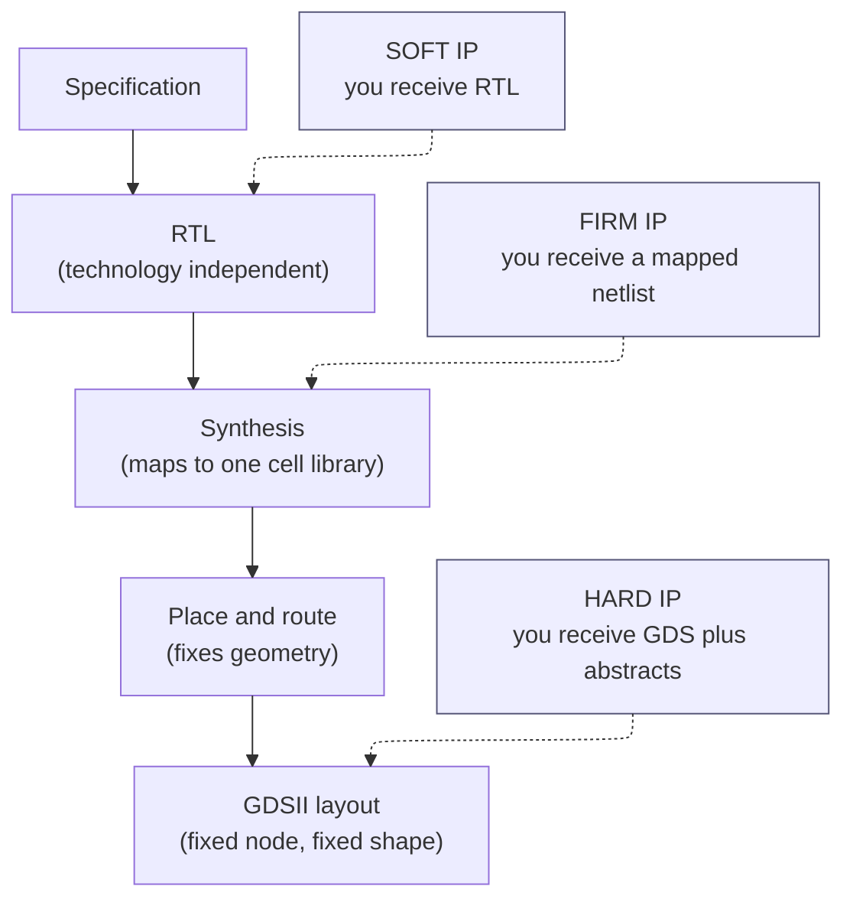
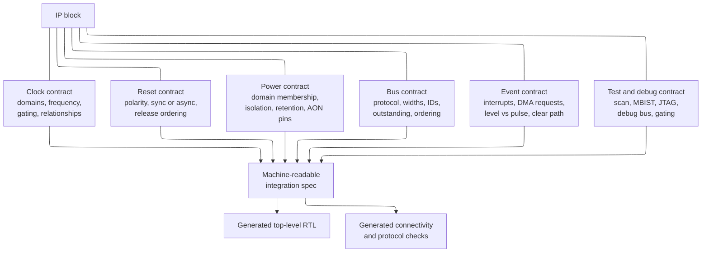
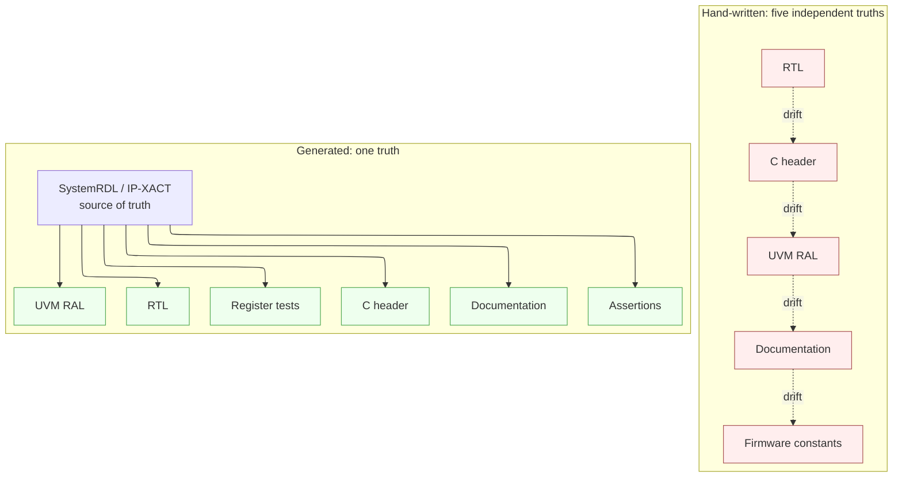
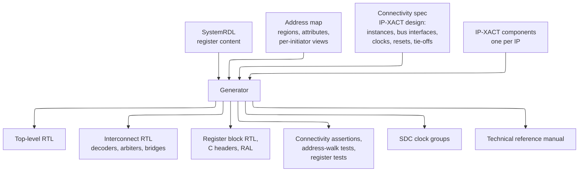
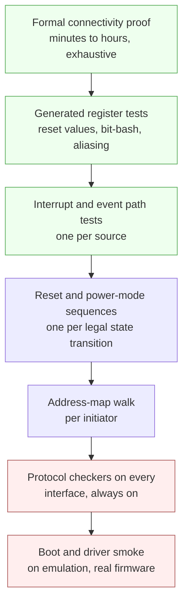

# IP Reuse, Integration, and Register Automation — a modern chip is assembled, not written

> **Prerequisites:** [AHB_AXI_APB](../01_Architecture_and_PPA/04_SoC_and_Chiplet_Architecture/03_Transaction_Protocols/01_AHB_AXI_APB.md) (the handshake, burst, byte-strobe, ID, and response semantics of the buses every IP block is bolted onto — this page assumes you can read an AXI or APB port list and know what each signal promises), [Arithmetic_and_Memory_RTL](../03_Frontend_RTL_and_Verification/16_Arithmetic_and_Memory_RTL.md) (the mechanics of a control/status register file behind a bus port — this page assumes you can already write one by hand, and then argues that you should stop).
> **Hands off to:** [Address_Map_Protocols_and_Memory_Integration_Blueprint](../01_Architecture_and_PPA/04_SoC_and_Chiplet_Architecture/08_Implementation_Blueprints/01_Address_Map_Protocols_and_Memory_Integration_Blueprint.md) (takes the address map, decode logic, and register source-of-truth developed here and builds the full memory-and-protocol integration of a real SoC).

---

## 0. Why this page exists

Count the gates on a modern system-on-chip (SoC) and sort them by who wrote them. On a mid-range application processor, the standard-cell library came from the foundry, every SRAM came out of a memory compiler, the CPU cluster came from Arm or a RISC-V vendor, the DDR (double data rate) memory controller and its PHY (physical layer) came from a third party, the USB, PCIe (Peripheral Component Interconnect Express), MIPI (Mobile Industry Processor Interface), and Ethernet controllers and their PHYs came from three more, the interconnect fabric was generated by a tool, and the phase-locked loops (PLLs), input/output (IO) pads, electrostatic-discharge (ESD) cells, and electronic fuses came from the foundry's IP (intellectual property) partners. **Typically 70–90% of the gates on the die were designed by someone who is not on your team.** On a large SoC the residual — the part your company actually designed — is often a handful of accelerators, some glue, and the top level.

That inverts what a digital-design course teaches. The course teaches you to *write* a block: an FSM (finite-state machine), a FIFO (first-in first-out buffer), an arbiter, a multiplier. Those skills remain necessary — you cannot integrate what you cannot read — but they are no longer the bottleneck. The bottleneck is **integration**: taking 40 to 200 blocks you did not write, each with its own clocking assumptions, reset expectations, power-domain membership, bus parameterization, interrupt semantics, test hookup, and register map, and wiring them together so that the composition is correct. Nobody grades a FIFO at tape-out. What kills schedules is the reset that was connected with the wrong polarity, the byte strobe that the slave ignored, the interrupt that was a pulse when the controller expected a level, the address decode that was off by one, and the C header that no longer matches the RTL (register-transfer level) because a field moved and only three of the five downstream artifacts were regenerated.

This page owns that skill. It is a **cross-cutting** track, which is why it lives in folder 08 rather than in the linear spec-to-silicon spine of folders 00 through 07. Folder 02 (power) is cross-cutting in exactly the same sense: power is not a stage you pass through once, it is a constraint that reshapes architecture, RTL, synthesis, floorplan, and signoff simultaneously. IP reuse behaves identically. A decision to license a USB controller in the concept phase lands as a set of RTL parameters, an address-map region, a clock and reset domain, a power-domain membership with isolation obligations, a set of lint and clock-domain-crossing (CDC) waivers, a hard macro keep-out in the floorplan, an extra scan chain and a memory built-in self-test (MBIST) hookup, a set of timing models that must exist at every corner, a royalty line in the bill of materials, and a support contract. Skip the page and you discover those obligations one at a time, each one late, each one on the critical path.

Afterwards you should be able to: build a defensible make-versus-buy cost model including the costs nobody puts in the spreadsheet; tell hard, soft, and firm IP apart and price the porting cost of each; audit an incoming IP delivery against an acceptance checklist and say precisely what breaks when an item is missing; write an integration contract that a tool can check rather than a document a human hopes is read; define an SoC address map and generate its decoder; write a register block in SystemRDL and read every artifact a generator produces from it; recognize the ten register design patterns that separate a working control interface from a defect factory; construct an integration verification plan that catches the bugs block-level verification structurally cannot; and hand your own block to someone else in a form they can actually integrate.

---

## 1. Make, buy, or reuse: the decision and its real cost model

### 1.1 The five sources of a block

Every block on a die comes from exactly one of five places, and the five differ in what you control, what you pay, and what you are exposed to.

| Source | Examples | What you control | What you pay | Principal risk |
|---|---|---|---|---|
| **Foundry IP** | standard cells, SRAM/register-file compilers, IO pads, ESD cells, PLLs, eFuse, analog primitives | almost nothing — you pick from a menu | bundled in the process design kit (PDK) or a modest fee | none available at another foundry; a node change re-opens every choice |
| **Third-party hard IP** | USB/PCIe/DDR/MIPI/Ethernet PHYs, SerDes, ADCs, high-density SRAM, temperature sensors | configuration only; the layout is fixed | large license, often per-node; sometimes royalty | it is a black box in your floorplan and you cannot fix it |
| **Third-party soft IP** | CPU cores, interconnect fabrics, protocol controllers (USB/PCIe link layer), codecs, DSP blocks | parameters, and in principle the RTL | license + royalty; source access costs more | you inherit its bugs and its verification debt |
| **Internal reuse** | last generation's blocks from your own company | everything | engineering time to re-qualify | "reuse" silently becomes a fork, and now you maintain two |
| **New design** | the block that is the product | everything | the full design + verification + support cost | schedule, and the opportunity cost of not building the differentiator |

The organizing principle is blunt: **build what differentiates, buy what standardizes.** If a block implements a public standard with a published compliance suite, if a customer cannot tell whose implementation is inside, and if failing compliance is a product-killing event, you are looking at a commodity and you should buy it. If the block *is* the reason the customer chose your part — the neural accelerator's dataflow, the camera pipeline's noise model, the security root of trust's threat model — building it is the entire point.

### 1.2 The cost model

Write the total cost of a block over the product's life as

$$C_{\text{total}} \;=\; \underbrace{C_e\!\left(M_{\text{des}} + M_{\text{ver}}\right)}_{\text{engineering}} \;+\; \underbrace{L}_{\text{license}} \;+\; \underbrace{N \cdot r}_{\text{royalty}} \;+\; \underbrace{C_e\!\left(M_{\text{int}} + M_{\text{intver}} + M_{\text{flow}} + M_{\text{sup}}\right)}_{\text{integration and ownership}} \;+\; \underbrace{p_{\text{fail}} \cdot C_{\text{respin}}}_{\text{risk}} \;-\; \underbrace{\Delta T \cdot \dot{\Pi}}_{\text{schedule value}}$$

where $C_e$ is the fully loaded cost of one engineer-month (EM), $M_\bullet$ are effort terms in engineer-months, $L$ is the license fee, $N$ the lifetime unit volume, $r$ the per-unit royalty, $p_{\text{fail}}$ the probability that this block causes a respin, and $\Delta T \cdot \dot{\Pi}$ the gross profit captured by shipping $\Delta T$ months earlier at a profit rate $\dot{\Pi}$.

Two calibration numbers you should carry:

- **$C_e \approx \$20{,}000$–$\$30{,}000$ per engineer-month** in a high-cost design center. That is not salary — it is salary plus benefits, plus the EDA (electronic design automation) tool seat (a full digital implementation and verification toolchain runs $100$k–$500$k per seat-year), plus compute, plus facilities, plus management overhead. Use $\$25$k/EM as a working number.
- **Verification effort is 1.5× to 3× design effort** for anything implementing a standardized protocol with a compliance suite. Students consistently budget the design and forget the verification, which is the larger number.

### 1.3 The hidden costs

The headline license price is the number that appears in the procurement email. It is typically **30–60% of the true three-year cost**. Here is what the other 40–70% is:

| Hidden cost | Typical magnitude | Why it is missed |
|---|---|---|
| **Integration engineering** ($M_{\text{int}}$) | 0.5–2 EM per IP; 3–8 EM for a CPU cluster or DDR subsystem | "it is just wiring" — see §4 for how much wiring |
| **Integration verification** ($M_{\text{intver}}$) | 1–3 EM per IP | the vendor's block-level regression already passed; that regression proves nothing about your top level (§9) |
| **Flow bring-up** ($M_{\text{flow}}$) | 0.5–1 EM per IP | lint and CDC waiver review, missing `.lib` corners, a UPF (Unified Power Format) model that does not match your domains, a synthesis script that assumes another vendor's tool |
| **Backend closure of a hard macro** | 1–3 EM | keep-out regions, pin-access blockages, feedthrough routing, macro-to-macro timing — invisible from RTL ([Floorplanning](../05_Backend_Physical_Design/03_Floorplanning_and_Power_Planning.md)) |
| **Firmware and driver** | 2–6 EM | booked to a different team's budget, but the block does not ship without it |
| **Support latency** | 2–8 weeks per blocking issue | you are one of a vendor's fifty licensees and your escalation is queued |
| **Errata and version churn** | 1–2 re-integrations per year | the IP is not frozen; a security or compliance fix forces a version bump mid-project |
| **Legal, export control, escrow** | 0.2–0.5 EM of engineering time plus legal | cryptographic IP has export-control obligations; source escrow needs a custodian |
| **Node port / re-characterization** | 1–6 EM (soft), full redesign (hard) | see §2 |
| **Royalty at volume** | can exceed the license by 3–10× | only the license price is visible at decision time |

### 1.4 A worked decision: the USB 2.0 High-Speed device interface

**Setup.** A consumer SoC needs a USB 2.0 High-Speed (480 Mbit/s) device port. Lifetime volume $N = 5{,}000{,}000$ units, average selling price $\$8$, gross margin 40% (so gross profit $\$3.20$/unit), product window 30 months. Use $C_e = \$25$k/EM.

**Step 0 — split the problem.** A USB 2.0 HS port is two blocks: a **UTMI+ PHY** (USB 2.0 Transceiver Macrocell Interface, the analog transceiver with its 480 MHz serializer, squelch detector, HS current driver, and on-chip termination) and a **digital device controller** (the link layer: packet framing, CRC-5/CRC-16, NRZI encoding, bit stuffing, endpoint state machines, DMA to system memory).

The PHY is mixed-signal, foundry-specific, and takes a specialist team 40–60 EM plus at least one test chip. Almost no digital SoC team can build one, and the decision is not a decision: **buy the PHY.** This is worth internalizing — a large fraction of make-versus-buy questions collapse the moment you notice that half of the block is analog. The genuine decision is about the digital controller.

**Step 1 — cost the build.**

| Item | Effort | Cost |
|---|---|---|
| Controller RTL design | 10 EM | \$250,000 |
| Verification (protocol suite, ~60 scenario classes, coverage closure) | 20 EM | \$500,000 |
| Compliance preparation and USB-IF certification support | 3 EM | \$75,000 |
| Compliance lab and certification fees | — | \$60,000 |
| **Build subtotal** | **33 EM** | **\$885,000** |

Schedule: design and verification overlap, but the critical path to "RTL good enough to freeze" is about **14 months**. Risk: this is a first implementation of a protocol with a hostile compliance suite. Put $p_{\text{fail}} = 0.25$ for "a compliance corner escapes and forces a metal ECO (engineering change order) or a respin", with $C_{\text{respin}} = \$400$k of mask and turn cost. Expected risk cost $= 0.25 \times 400\text{k} = \$100$k, plus an expected 0.75 months of slip.

**Step 2 — cost the buy.**

| Item | Effort | Cost |
|---|---|---|
| Single-project license for a silicon-proven controller | — | \$350,000 |
| Integration (§4: clock, reset, power, bus, interrupt, DFT) | 2 EM | \$50,000 |
| Integration verification using the vendor's verification IP (VIP) | 3 EM | \$75,000 |
| Flow bring-up (lint/CDC waivers, timing model corners, UPF) | 1 EM | \$25,000 |
| Royalty $5{,}000{,}000 \times \$0.08$ | — | \$400,000 |
| **Buy subtotal** | **6 EM** | **\$900,000** |

Schedule to "integrated and passing": about **5 months**. Risk is much lower — the IP is silicon-proven and ships with a USB-IF Test ID, so $p_{\text{fail}} \approx 0.05$, expected risk $\$20$k.

**Step 3 — compare.** Build $= \$885\text{k} + \$100\text{k} = \$985$k. Buy $= \$900\text{k} + \$20\text{k} = \$920$k. **The cash numbers are within 7% of each other.** This is the normal outcome, and it is why arguing about the license price is usually arguing about the wrong term.

**Step 4 — the term that actually decides it.** $\Delta T = 14 - 5 = 9$ months. A 30-month product window is not flat: the ramp is roughly trapezoidal, and nine months earlier entry captures perhaps 20% of lifetime volume that would otherwise be lost to a competitor or to the window closing. That is $0.20 \times 5\text{M} \times \$3.20 = \$3{,}200{,}000$ of gross profit. Against the $\$65$k cash difference of Step 3, the schedule term is **49× larger**. Buy.

**Step 5 — the break-even, so you know when the answer flips.** On cash alone, build costs a fixed $\$885$k; buy costs $\$500$k fixed plus $\$0.08N$. Equal when

$$885{,}000 = 500{,}000 + 0.08N \quad\Longrightarrow\quad N^{\ast} = \frac{385{,}000}{0.08} = 4{,}812{,}500 \text{ units.}$$

Below 4.81 M units buy is cheaper even ignoring schedule. Above it, build is cheaper on cash — but you must still pay the nine months, so the crossover in *value* sits far higher, near $N \approx 50$ M where the royalty reaches $\$4$M. And even there the correct move is usually not "build" but "negotiate": a **royalty buy-out** typically prices at 8–15× the single-project license fee, which at $\$350$k license means $\$2.8$M–$\$5.3$M — competitive with a $\$4$M royalty bill and with none of the schedule or compliance risk.

**The selection boundary.** Build the controller only if (a) volume is very large *and* a buy-out is refused, (b) you need a feature the standard does not contain and no vendor will add, or (c) the block is your differentiation. USB is none of these. It is a commodity with a compliance suite, which is the definition of "buy".

---

## 2. Hard IP, soft IP, firm IP: what you receive and what you may change

The three flavors differ in **how far through the flow the IP has already been pushed before it reaches you.** Everything else — what you can change, what portability you have, what PPA (power, performance, area) you get, what the vendor can hide — follows from that one fact.



The dashed arrows mark the **hand-off point**: the stage at which the vendor stops and you start. Everything upstream of the hand-off is frozen and invisible; everything downstream is your problem. Soft IP hands off before synthesis, so you own synthesis, place-and-route, and every PPA outcome — and you can retarget it to any node. Hard IP hands off after layout, so the vendor owns PPA and you own nothing except placing the rectangle — and the rectangle exists for exactly one process at one metal stack.

| | **Soft IP** | **Firm IP** | **Hard IP** |
|---|---|---|---|
| **What you receive** | synthesizable RTL, testbench, synthesis and constraint scripts, integration guide | a gate-level netlist mapped to a named cell library, sometimes with relative placement (a "DEF-lite" or a hardened block with soft edges) | GDSII layout, LEF (Library Exchange Format) abstract, `.lib` timing/power models per corner, a simulation model, CDL (Circuit Description Language) netlist for LVS (layout versus schematic), antenna and DRC (design-rule check) data |
| **What you can change** | anything — parameters, and the source itself if you have it | nothing functional; you can re-place and re-route if the delivery permits | nothing at all; only where you put it and how you connect it |
| **Node portability** | full — re-synthesize anywhere | none in practice — the netlist names cells from one library | none — it is geometry in one process |
| **PPA** | whatever *your* flow achieves | predictable, close to the vendor's characterization | best possible; hand-tuned, often full-custom |
| **Vendor's IP protection** | weakest (you can read it), unless delivered encrypted (IEEE 1735) | good — a flattened netlist is legible but painful to reverse | strongest — geometry only |
| **What the vendor must guarantee** | that it synthesizes and closes in *your* unknown flow — so they guarantee little | timing at the characterized corners | full timing, power, and physical signoff |
| **Typical use** | interconnect, protocol controllers, CPU cores, DSP | rare in modern flows; occasionally a timing-critical subblock | PHYs, SerDes, PLLs, memory instances, IO cells, analog |

### 2.1 The PPA-versus-portability trade, quantified

Take a 128-bit AES engine. As hard IP hand-optimized in one node it might close at 1.2 GHz in 0.012 mm² with custom datapath layout. The same function as soft IP, synthesized by your flow into the same node's standard cells, typically lands at 700–900 MHz in 0.020–0.030 mm². The rule of thumb across many block types is that **hardening buys roughly 1.5–3× area and 1.3–2× frequency** over a generic synthesis flow, because the hard version gets custom cells, hand-placed critical paths, and datapath-aware routing that no synthesis tool will find.

You pay for that with total loss of portability. When the SoC moves from a 7 nm to a 5 nm node:

- **Soft IP** costs 1–6 EM: re-synthesize, re-close timing, re-run lint and CDC because the new library has different cell types, re-validate any technology-dependent assumptions (a hard-coded synchronizer depth, a memory-compiler instance name, a clock-gating cell). Real but bounded.
- **Hard IP** costs a **redesign**. A USB 3.x or PCIe SerDes port is 12–24 months and a dedicated mixed-signal team, because the transistors, the passives, the ESD structures, the on-chip termination trim, and the equalizer topology are all node-specific. This is why PHY vendors exist and why a PHY license is quoted per node.

**Selection boundary.** Choose soft IP by default: portability is worth more than PPA for anything that is not on a critical loop. Choose hard IP when the function is analog or near-analog (any PHY, PLL, or ADC), when the block is an SRAM (memory compilers are hard-IP generators and there is no alternative), or when the block is on a frequency path your synthesis flow demonstrably cannot close.

### 2.2 Where firm IP survives

Firm IP is uncommon because it combines soft IP's obligation on you (you still place and route it) with hard IP's loss of portability (it names cells from one library). It survives in two niches: a vendor who will not release source but whose block must sit inside your power domain and share your clock tree, and an internal reuse case where a block's synthesis result is frozen deliberately so that its timing is reproducible across projects. If someone offers you firm IP, ask what problem it solves that encrypted RTL (IEEE 1735 encryption, which every major simulator and synthesis tool honors) does not solve better.

---

## 3. The IP delivery package: an acceptance checklist

An IP delivery is not "the RTL". It is a package of roughly thirty artifacts, and a missing artifact does not announce itself — it surfaces three months later as a tool that cannot run, a corner that cannot be signed off, or a test that cannot be written. Treat the table below as an **acceptance checklist**: on the day the delivery lands, walk it row by row, and refuse the delivery for anything in the "blocking" tier that is absent.

| # | Artifact | What it is | What breaks without it | Tier |
|---|---|---|---|---|
| 1 | **Synthesizable RTL** (soft) or **GDSII** (hard) | the design itself | nothing works | blocking |
| 2 | **Simulation model** | for hard IP, a behavioral Verilog/SystemVerilog or real-number model | you cannot simulate the SoC at all; the macro is a hole in the testbench | blocking |
| 3 | **LEF abstract** (hard) | cell outline, pin locations/layers, routing blockages, obstruction shapes | place-and-route cannot place or route around it | blocking |
| 4 | **`.lib` timing/power models, one per PVT corner** | Liberty format: setup/hold, cell delays, output slews, internal/leakage power, per process-voltage-temperature corner | STA (static timing analysis) cannot sign off; you are missing exactly the corner that fails ([STA](../06_Signoff/01_STA.md)) | blocking |
| 5 | **Corner list matching your MMMC setup** | which corners were characterized, at what voltages | your slow-slow 0.72 V corner may not exist in the delivery; you cannot sign off a mode you must ship | blocking |
| 6 | **CDL / SPICE netlist** (hard) | transistor-level connectivity | LVS fails; you cannot tape out ([DRC/LVS](../06_Signoff/03_Physical_Verification_DRC_LVS.md)) | blocking |
| 7 | **GDS-level DRC/antenna data** (hard) | which DRC decks the macro is clean against, antenna ratios of its pins | physical verification cannot separate your violations from the vendor's | blocking |
| 8 | **Datasheet** | function, latency, throughput, frequency limits, port list, electrical requirements | you guess, and you guess wrong | blocking |
| 9 | **Register specification** — machine-readable (§6) | SystemRDL or IP-XACT, not a PDF | firmware, RTL, RAL model, and documentation drift apart from day one | blocking |
| 10 | **Integration guide** | the "connect this to that" contract (§4): clocks, resets, power pins, tie-offs, ordering | every one of the bugs in §10 becomes possible | blocking |
| 11 | **SDC constraints** | clock definitions, input/output delays, false paths, multicycle paths, clock groups | synthesis and STA either over-constrain (area/power waste) or under-constrain (silicon fails) ([SDC](../04_Synthesis/02_Constraints_SDC.md)) | blocking |
| 12 | **UPF/CPF power model** | supply ports, isolation and retention expectations, legal power states | power-aware simulation and P&R cannot honor the block's boundary rules ([UPF](../02_Power_and_Low_Power/05_UPF_and_CPF_Power_Intent.md)) | blocking if power-gated |
| 13 | **Power model for analysis** | activity-annotated or state-dependent power, or a `.lib` with adequate internal-power arcs | your power budget is fiction; the block is a hole in the estimate | high |
| 14 | **Verification collateral: testbench** | the block-level environment as delivered | you cannot reproduce the vendor's claim or debug a suspected IP bug | high |
| 15 | **Verification IP / UVM agent** | a driver-monitor-scoreboard agent for the block's external protocol | you must write a protocol checker yourself, at 2–5 EM | high |
| 16 | **Coverage model and closure report** | functional coverage definition plus achieved numbers | you cannot judge what was actually verified versus what was claimed | high |
| 17 | **Assertion set (SVA)** | protocol and internal assertions that travel with the RTL | integration violations of the block's assumptions are silent ([Assertions](../03_Frontend_RTL_and_Verification/09_Assertions_and_Coverage.md)) | high |
| 18 | **RAL model** or the generator that makes it | UVM register abstraction layer | register tests must be hand-written and go stale (§6) | high |
| 19 | **Scan/DFT model** | how the block is put in test mode, scan chain count and order, or a hard macro's IEEE 1500 wrapper | the block is untestable; either you lose test coverage or you black-box it and lose fault coverage ([DFT](../06_Signoff/02_DFT_and_ATPG.md)) | blocking |
| 20 | **ATPG patterns** (hard) | pre-generated test patterns for the macro, in a format your tester flow accepts | the macro ships untested; defective parts reach customers | blocking for hard IP |
| 21 | **MBIST hookup spec** | which memories are inside, their addressing, how to reach them from your MBIST controller | embedded memories are untested and unrepairable | blocking if it contains RAM |
| 22 | **Boundary/JTAG description (BSDL, IEEE 1149.1/1500)** | test access port behavior | board-level and die-level test access fails | high |
| 23 | **Lint waiver file** | the vendor's justified exceptions to a named rule set | your lint report has 4,000 violations you cannot triage, so you stop reading it — which is how the one real violation ships ([Lint/CDC](../03_Frontend_RTL_and_Verification/07_Lint_CDC_RDC_Signoff.md)) | high |
| 24 | **CDC/RDC report and waivers** | which crossings exist, which are handled internally, which you must handle | you either re-derive the vendor's CDC analysis or waive blindly | high |
| 25 | **Clock and reset domain declaration** | every clock the block consumes, their relationships, every reset and its polarity/synchronicity | §10 bugs 1, 2, 8, and 15 | blocking |
| 26 | **Safety manual and assumptions of use** | for ISO 26262 / IEC 61508 use: FIT rate, diagnostic coverage, what the *integrator* must do | you cannot compute the system safety metrics; the block cannot be used in a safety element ([Functional Safety](02_Functional_Safety_and_Reliability_Engineering.md)) | blocking if safety-relevant |
| 27 | **Security documentation** | threat model, key handling, debug-access gating, side-channel claims | you inherit an unexamined attack surface ([Hardware Security](01_Hardware_Security_Architecture.md)) | blocking if security-relevant |
| 28 | **Errata list** | known bugs, their conditions, and the software or hardware workaround | you debug a known bug for three weeks | blocking |
| 29 | **Version, changelog, and release notes** | a version string embedded in an ID register (§6) and a diff against the last release | you cannot tell which version is in your tree, or in the silicon on the bench | high |
| 30 | **License terms, royalty schedule, escrow, export classification** | the legal envelope | you ship a part you are not licensed to ship, or cannot ship to a market | blocking |

Three notes on using this table.

**The version string must be in silicon, not only in a file.** Row 29's "ID register" is the discipline of §6: an IP that reports its vendor, product, and revision in a read-only register lets a firmware engineer on a bench, holding an unlabeled board, determine in one read what is actually inside. Without it, post-silicon debug begins with an argument about which RTL was taped out.

**Absence of an artifact is a schedule risk, not a technical one.** Everything in the table can be reconstructed by you — you can characterize your own `.lib` by running the vendor's netlist through a characterization tool, write your own VIP, derive your own CDC analysis. The point is that reconstructing costs engineer-months that were not in the plan, at the moment when there is no slack. This is $M_{\text{flow}}$ in §1.2 and it is why the acceptance review happens on delivery day, not at integration time.

**Rows 9, 18, 25, and 29 are the ones this page is about.** They are the artifacts that must be *generated from one source* rather than written and maintained in parallel — the subject of §6.

---

## 4. The integration contract

An IP block's port list is only half of its interface. The other half is a set of obligations that no port list expresses: which clock, at what frequency, running when; which reset, of what polarity, released in what order relative to what else; which power domain, with what isolation and retention behavior; what the bus parameters must be; whether the interrupt is a level or a pulse; how test mode is entered. That set of obligations is the **integration contract**, and integration bugs are, without exception, violations of a clause in it — usually a clause that was written in prose in section 7.3 of a PDF and never checked by any tool.



The contract has six surfaces and one rule: **each surface must be written in a form a tool can check, and the same source must generate both the wiring and the check.** If the spec generates the RTL but not the checks, a spec error becomes an unverified RTL error. If it generates the checks but not the RTL, hand-written RTL will diverge from the spec at the first schedule crunch. Generating both from one source makes the two consistent by construction and reduces the question to "is the spec right?", which is a review a human can actually perform.

### 4.1 Clock

For every clock port on the IP the contract must state: the source, the frequency range the block is characterized for, the duty-cycle requirement, whether the clock may be gated and by whom, and the **relationship to every other clock the block touches**. That last item is the one that gets skipped and the one that costs silicon.

The relationship is a three-valued property: *synchronous* (same source, integer ratio, known phase — timing is analyzed normally), *asynchronous* (unrelated sources — every crossing needs a synchronizer and the paths must be excluded from timing), or *mesochronous/ratio-synchronous* (same source, different divide, phase relationship known only within a bound — the dangerous middle case, because designers assume it is synchronous and the tool times paths that are not actually safe). Build a **clock relationship matrix** — an $N \times N$ table over every clock in the SoC, each cell filled with one of the three values plus the owner who asserted it — and require a signature on it. Then generate the `set_clock_groups` statements from that matrix rather than writing them by hand. See [Async Design and CDC](../03_Frontend_RTL_and_Verification/06_Async_Design_and_CDC.md) for the synchronizer mechanics and [SDC](../04_Synthesis/02_Constraints_SDC.md) for how the matrix becomes constraints.

### 4.2 Reset

The reset contract has four clauses:

1. **Polarity.** Active-high or active-low. Nothing catches a polarity error except a naming convention (`_n` suffix is mandatory for active-low) plus a lint rule that flags an `_n` port driven by a non-`_n` net, plus a formal connectivity check.
2. **Assertion style.** Almost always **asynchronous assert, synchronous deassert**: the reset must take effect even with no clock running, but must release on a clock edge so that all flops in the domain leave reset in the same cycle. A purely synchronous reset requires a running clock to take effect, which fails during power-up.
3. **Ordering.** Which resets must be asserted or released before which others. A master must not be released before the slave it will immediately address; a bridge must not be released after the master that will drive it.
4. **Clock-before-reset.** The domain's clock must be running and stable before its synchronous-deassert reset releases, or the deassertion never propagates.

```wavedrom
{ "signal": [
  { "name": "ref_clk",      "wave": "p........." },
  { "name": "por_n",        "wave": "01........" },
  { "name": "pll_lock",     "wave": "0..1......" },
  { "name": "blk_clk",      "wave": "0...p....." },
  { "name": "rst_n_sync",   "wave": "0.....1...", "node": ".....a...." },
  { "name": "cfg_write",    "wave": "0......10.", "node": ".......b.." },
  { "name": "first_bus_req","wave": "0........1" }
 ],
 "edge": ["a~>b registers writable only after synchronous reset release"],
 "head": {"text": "Reset release ordering: power-on reset, then PLL lock, then clock, then sync deassert, then first access"}
}
```

Read the waveform as a contract. `por_n` (power-on reset) asserts asynchronously the instant supplies come up — no clock is required, which is the whole point of asynchronous assertion. The PLL then locks; `blk_clk` only begins toggling after `pll_lock`, because feeding a domain a clock that is sweeping in frequency during lock produces setup violations on every path. Only once the clock is clean does the reset synchronizer deassert `rst_n_sync` on a clock edge, so every flop in the domain leaves reset in the same cycle. The first configuration write comes after that. **The failure this ordering prevents:** if `cfg_write` occurs at the position of node `a` — one cycle before `rst_n_sync` rises — the write lands in a flop that is still held in reset, is silently discarded, and firmware proceeds believing the block is configured. The symptom on silicon is a block that works when the boot code is slow and fails when it is fast, which is among the worst classes of bug to debug.

### 4.3 Power

The block's power contract is developed in full on the [UPF and CPF](../02_Power_and_Low_Power/05_UPF_and_CPF_Power_Intent.md) page; the integration obligation is to answer four questions per IP and record the answers in the UPF, not in prose:

- **Domain membership.** Which power domain does the block belong to? A hard macro often has its own — it may have an internal always-on section.
- **Always-on pins.** Which of the block's ports must remain powered when the domain is off — typically an isolation enable, a retention control, a power-acknowledge output, and any wake-up input. These must be routed on the always-on supply and must not be optimized into the switchable domain.
- **Isolation.** Every output that leaves a switchable domain toward a domain that stays on needs an isolation cell with a defined clamp value. "Clamp to 0" is not automatic — a ready/valid output clamped to the wrong constant can look like a permanently-asserted request.
- **Retention.** Which state must survive power-down. Retention flops cost roughly 30–50% area over a plain flop, so this is a per-register decision, not a per-block one.

### 4.4 Bus

For each bus port the contract fixes the protocol and every parameter of it: data width, address width, ID width, the number of outstanding transactions the block issues and accepts, burst types supported, whether exclusive access is supported, ordering guarantees, and whether the port is a manager or a subordinate. See [AHB/AXI/APB](../01_Architecture_and_PPA/04_SoC_and_Chiplet_Architecture/03_Transaction_Protocols/01_AHB_AXI_APB.md) for what each of those means. The two clauses that most often go unchecked, because they are properties of a *pair* of blocks rather than of either one:

- **ID width.** An interconnect that fans $M$ managers into one subordinate must widen the transaction ID by $\lceil \log_2 M \rceil$ bits to keep responses routable. If the subordinate's ID width is too narrow, the interconnect truncates, two managers' outstanding transactions collide on one ID, and responses are delivered to the wrong manager — which presents as a deadlock, not as corrupted data (§10, bug 13).
- **Outstanding capability.** If a manager issues more outstanding transactions than the subordinate can absorb, and the subordinate's back-pressure is not honored or its internal response buffer is undersized, the system hangs at high load only (§10, bug 14).

### 4.5 Events: interrupts and requests

The event contract states, for each output event: **level or pulse**; active polarity; the exact condition that asserts it; the exact action that deasserts it; and the latency between the deassert action and the pin going low. The last item is the one that bites: firmware clears the interrupt status register, returns from the interrupt service routine, and the interrupt fires again because the write had not yet propagated through a bridge and an interrupt-controller synchronizer. The repair is a documented, enforced rule — the ISR (interrupt service routine) must read back the status register after clearing it, which orders the write ahead of the return — plus the datasheet clause that says so.

Level is almost always the right choice for an SoC interrupt, because a level survives an interrupt controller that was momentarily masked, a clock-gated path, and a synchronizer, while a one-cycle pulse can be lost by any of the three. The exception is a fast event path where the receiving controller is edge-configured; then the pulse width must be specified in the *receiver's* clock domain, which for a slow peripheral clock feeding a fast controller means the pulse must be stretched.

### 4.6 Test and debug

The DFT hookup is a first-class part of the contract: scan enable, scan mode, scan clock or clock-mux control, test reset, scan chain ports and their required order, the IEEE 1500 wrapper controls for a hard macro, the MBIST interface, and the JTAG/debug port. Two rules that are almost always in the contract and almost always violated once: **`scan_en` must be forced inactive in functional mode** (a synthesis or connectivity error that leaves it high turns every flop into a shift register), and **`test_rst_n` must bypass the reset synchronizer** so that ATPG can put the design in a known state in one cycle rather than waiting for a synchronizer to flush. See [DFT and ATPG](../06_Signoff/02_DFT_and_ATPG.md).

Debug access must be **gated**: a debug bus that can read internal state is also an attack surface, so it is enabled by a fuse or an authenticated debug certificate rather than being permanently live ([Hardware Security](01_Hardware_Security_Architecture.md)).

### 4.7 The pin-level connection table

The contract's concrete form is a table with one row per port. Prose is not acceptable, because prose cannot be diffed, cannot be checked, and cannot generate anything.

| IP port | Dir | Connect to | Rule enforced |
|---|---|---|---|
| `pclk` | in | `clk_apb` (50 MHz, gated by `cg_apb_en`) | must be toggling before `presetn` deasserts (§4.2) |
| `presetn` | in | `rst_apb_n` | active **low**; async assert, sync deassert to `pclk` |
| `psel`,`penable`,`pwrite`,`paddr[11:0]`,`pwdata[31:0]`,`pstrb[3:0]` | in | APB bridge subordinate port 3 | `paddr` is a **byte** address; bits [1:0] must be zero for word access |
| `prdata[31:0]`,`pready`,`pslverr` | out | APB bridge subordinate port 3 | `pready` must be connected; the bridge must not assume 1 |
| `o_irq` | out | `gic_spi[37]` | **LEVEL**, active high, held until software writes 1-to-clear |
| `o_dma_req[3:0]` | out | `dmac_req[19:16]` | level, handshaked with `i_dma_ack` |
| `scan_en` | in | `dft_scan_en` | must be 0 in functional mode; formal-checked |
| `scan_mode` | in | `dft_scan_mode` | selects the internal clock mux |
| `test_rst_n` | in | `dft_rst_n` | bypasses the reset synchronizer |
| `mbist_*` | in/out | MBIST controller port 4 | per the MBIST hookup spec (§3, row 21) |
| `iso_en` | in | `pmu_iso_en_pd_periph` | **always-on** net; asserts before power-down |
| `ret_n` | in | `pmu_ret_n_pd_periph` | **always-on** net |
| `pwr_ack` | out | `pmu_ack_pd_periph` | **always-on** output; must not sit in the switched domain |
| `dbg_apb_*` | in/out | debug APB | qualified by `dbg_en_fuse` |
| `i_cfg_static[7:0]` | in | tie to `8'h00` | tie-off is **permitted**; documented as reserved |
| `i_axuser[3:0]` | in | `axuser_from_smmu[3:0]` | tie-off is **forbidden**; carries the stream ID |

The last two rows show the pattern that makes the table checkable: every input is explicitly classified as *tie-off permitted* or *tie-off forbidden*. A connectivity checker can then prove that no forbidden input is driven by a constant — which catches §10's bug 6 mechanically instead of by inspection.

---

## 5. The address map as a first-class artifact

The address map is the single document that the architecture team, the RTL team, the firmware team, the verification team, the security team, and the operating-system porting team all read. It is therefore the single document most likely to exist in six mutually inconsistent copies. Treat it the way §6 treats registers: **one machine-readable source, everything else generated.**

### 5.1 A realistic map

| Base | Size | Region | Target | Attributes |
|---|---|---|---|---|
| `0x0000_0000` | 64 KiB | Boot ROM | `rom` | read-only, cacheable, **secure only** |
| `0x0001_0000` | 192 KiB | *hole* | error subordinate | decode error |
| `0x0004_0000` | 256 KiB | On-chip SRAM | `sram` | read/write, cacheable |
| `0x0008_0000` | 1 MiB – 512 KiB | *hole* | error subordinate | decode error |
| `0x4000_0000` | 4 KiB | UART0 | `apb[0]` | device, non-cacheable |
| `0x4000_1000` | 4 KiB | UART1 | `apb[1]` | device, non-cacheable |
| `0x4000_2000` | 4 KiB | Timer | `apb[2]` | device, non-cacheable |
| `0x4001_0000` | 4 KiB | DMA controller | `apb[3]` | device, non-cacheable |
| `0x5000_0000` | 64 KiB | Crypto engine | `crypto` | device, **secure only** |
| `0x6000_0000` | 64 KiB | Interrupt controller | `gic` | device, per-register security |
| `0x8000_0000` | 1 GiB | DDR | `ddr` | read/write, cacheable |
| `0xC000_0000` | 512 MiB | PCIe outbound window | `pcie` | device, posted writes |

Three structural properties of this table matter more than its contents.

**Every region's base is aligned to its size.** `0x0004_0000` is $256\,\text{KiB} \times 1$, so $\text{base} \bmod \text{size} = 0$. This is not cosmetic. Base-and-mask decoding — the only decode form that costs one comparator per region instead of two — requires it, as §5.2 derives.

**Holes are explicit and they are targets.** A hole is not "nothing there"; it routes to an **error subordinate** (often called a default subordinate) that returns `DECERR` on AXI or `pslverr` on APB. Without one, an access to an unmapped address is answered by nobody, the manager waits forever for a response it will never get, and the chip appears dead with no diagnostic. Every SoC must have exactly one error subordinate and every unmapped address must reach it.

**Attributes are part of the map.** Cacheability, device-versus-normal memory type, and security are properties of the *region*, not of the target, and they must be programmed consistently into the CPU's page tables, the system memory-management unit (SMMU/IOMMU), and any bus filter. A region marked "device, non-cacheable" in the map but mapped as normal cacheable memory in the page tables produces a peripheral whose register writes sit in a write buffer and arrive out of order — a bug that reproduces once in ten thousand boots.

### 5.2 From map to decoder

Baseline: compare each address against a range.

```systemverilog
assign hit[i] = (addr >= BASE[i]) && (addr < BASE[i] + SIZE[i]);
```

This works and it is what a student writes first. Trace the cost: each `hit[i]` is two 32-bit magnitude comparators, roughly 2 × 32 = 64 comparator stages, and a magnitude comparator's delay grows as $\log_2 W$. For 12 regions that is 24 magnitude comparators in the critical path of the address phase, and at 1 GHz with a 1 ns budget you have lost a large fraction of the cycle before any arbitration happens.

The repair follows from the alignment property. If every region's size is a power of two and its base is size-aligned, then membership in the region is decided entirely by the **upper** address bits, and a magnitude comparison collapses into an equality comparison under a mask:

$$\text{hit}_i \;=\; \bigl[(\text{addr} \;\&\; \text{MASK}_i) = \text{BASE}_i\bigr], \qquad \text{MASK}_i = \sim(\text{SIZE}_i - 1).$$

An equality comparator is a wide XNOR-reduce: one gate level per bit pair plus a balanced AND tree of depth $\lceil \log_2 W \rceil = 5$, versus a magnitude comparator's carry-chain structure. The generated decoder becomes:

```systemverilog
// GENERATED from soc_addrmap.yaml -- DO NOT EDIT.
module soc_decode #(parameter int AW = 32, parameter int NREG = 12) (
    input  logic [AW-1:0]     addr,
    output logic [NREG-1:0]   hit,
    output logic              dec_err
);
  localparam logic [AW-1:0] BASE [NREG] = '{
      32'h0000_0000, 32'h0004_0000, 32'h4000_0000, 32'h4000_1000,
      32'h4000_2000, 32'h4001_0000, 32'h5000_0000, 32'h6000_0000,
      32'h8000_0000, 32'hC000_0000, 32'hE000_0000, 32'hF000_0000 };
  localparam logic [AW-1:0] MASK [NREG] = '{
      32'hFFFF_0000, 32'hFFFC_0000, 32'hFFFF_F000, 32'hFFFF_F000,
      32'hFFFF_F000, 32'hFFFF_F000, 32'hFFFF_0000, 32'hFFFF_0000,
      32'hC000_0000, 32'hE000_0000, 32'hF000_0000, 32'hF000_0000 };

  for (genvar i = 0; i < NREG; i++) begin : g_hit
    assign hit[i] = ((addr & MASK[i]) == BASE[i]);
  end
  assign dec_err = ~(|hit);          // no region claimed it -> error subordinate

  // GENERATED CHECK: the map must be non-overlapping. If two regions claim the
  // same address the routing is ambiguous and silicon behavior depends on the
  // arbitration order the synthesis tool happened to build.
  `ifndef SYNTHESIS
  always_comb assert ($onehot0(hit))
      else $error("address map overlap at addr=%h hit=%b", addr, hit);
  `endif
endmodule
```

Note what the generator emitted alongside the logic: an assertion that the map is non-overlapping. **This is the pattern the whole page argues for.** The decoder and its correctness property come from the same source, so they cannot disagree; what remains is to review the source, which is a twelve-row table a human can read.

Verify the mask arithmetic on one row. The 256 KiB SRAM: $\text{SIZE} = 2^{18} = \texttt{0x0004\_0000}$, so $\text{SIZE} - 1 = \texttt{0x0003\_FFFF}$ and $\text{MASK} = \sim\texttt{0x0003\_FFFF} = \texttt{0xFFFC\_0000}$. Address `0x0007_FFFF` (the last SRAM byte) gives `0x0007_FFFF & 0xFFFC_0000 = 0x0004_0000` = BASE. Correct. Address `0x0008_0000` (one past the end) gives `0x0008_0000 & 0xFFFC_0000 = 0x0008_0000` ≠ BASE. Correct — it falls into the hole and reaches the error subordinate.

### 5.3 Aliasing: the trap that hides inside a correct decoder

The decoder above is right. The **system** can still alias, because decoding happens twice: once in the fabric to select a target, and once inside the target to select a register. If the target decodes fewer address bits than the region allocates, the region's contents repeat.

Concrete case. The UART is allocated a 4 KiB region at `0x4000_0000`, so the fabric passes `paddr[11:0]` to it. The UART has 8 registers of 4 bytes each, occupying 32 bytes, and its internal decode is written as `case (paddr[4:2])`. Bits `paddr[11:5]` are simply ignored. The 4 KiB window therefore contains

$$\frac{4096\ \text{bytes}}{32\ \text{bytes}} = 128 \text{ copies of the register file.}$$

`0x4000_0000`, `0x4000_0020`, `0x4000_0040`, … `0x4000_0FE0` are all the same eight registers. Three consequences, in increasing order of severity:

1. **A "reserved space reads as zero" test passes falsely.** The natural check — read `0x4000_0100`, expect 0 — instead reads a live register and gets whatever it holds, which on a fresh reset is often 0. The test appears to pass and the aliasing is never found.
2. **Firmware bugs become invisible.** A driver with an off-by-0x20 pointer error works perfectly, and continues to work until a later silicon revision adds a ninth register and the alias moves.
3. **A security filter is bypassed.** If a bus filter protects `0x4000_0000`–`0x4000_00FF` because that is where the datasheet says the registers are, an attacker reads the same registers at `0x4000_0800` and the filter never sees the access. This is a real class of vulnerability, not a hypothetical.

Two repairs, and you want both. In the target: decode the **full** width the region allocates and return an error (or a hard zero) for addresses outside the implemented set — `if (|paddr[11:5]) pslverr <= 1'b1;`. In the map: size the region to what is actually implemented, or accept the alias explicitly and document it. The check that catches it is an **address-map walk test** (§9.6) that reads every register at its nominal address *and* at nominal + region_size/2, and asserts that the second access errors.

### 5.4 Secure and non-secure views

A single physical address can have two different meanings depending on the transaction's security attribute. On AXI this is `AxPROT[1]` (0 = secure, 1 = non-secure); on an Arm system it originates in the CPU's security state and is checked by a filter such as a TrustZone address-space controller. The map therefore has a *security column*, and each region takes one of four positions:

| Position | Secure access | Non-secure access | Example |
|---|---|---|---|
| Secure-only | permitted | `DECERR` or read-as-zero/write-ignore | key store, boot ROM, crypto engine |
| Non-secure-only | permitted (usually) | permitted | ordinary peripherals |
| Split by address | permitted | permitted below a programmable boundary | DDR partitioned into secure and non-secure halves |
| Split by register | permitted for all registers | permitted for a subset | interrupt controller: each interrupt's routing is owned by one world |

The mechanism worth stating precisely: **a secure-only region must produce an error for a non-secure access, not a hang and not silent success.** Silent success is a vulnerability. A hang is a denial of service that a non-secure caller can trigger deliberately. Read-as-zero/write-ignore is sometimes chosen over `DECERR` because a fault can itself leak information (an attacker learns a region exists by observing whether it faults) — that trade-off belongs to [Hardware Security](01_Hardware_Security_Architecture.md).

### 5.5 One map per initiator

The final structural point: **there is no single address map.** There is one map per initiator, and they differ.

- The **CPU** sees the full map above, filtered by its page tables and its security state.
- The **DMA controller** sees DDR and the peripherals it services, but must not see the interrupt controller's secure registers or the CPU's private control registers. Its view is enforced by an SMMU/IOMMU that translates and checks each transaction.
- A **PCIe endpoint** performing a DMA write sees *host* addresses, which an inbound address translation unit maps into SoC addresses — often with a non-identity offset, so the same DDR byte has two different addresses in two different views.
- A **debug access port** may see a superset (including regions the CPU cannot reach) when debug is authenticated, and a subset when it is not.

This is exactly what IP-XACT models with separate `addressSpace` elements (an initiator's view) and `memoryMap` elements (a target's layout), joined by bridges that express the translation between them. The practical discipline: the map source file is a set of tables indexed by initiator, the decoders and the SMMU/filter configurations are generated per initiator, and the *address-map walk test* of §9.6 is generated and run **from each initiator separately**. Running it only from the CPU is the standard mistake, and it is why "the DMA can reach the crypto key registers" is a bug found after tape-out with depressing regularity.

---

## 6. Register automation

This is the section the page exists for.

### 6.1 The failure of the hand-written register block

Take a modest control block: 20 registers, 60 fields. A student, and a large number of professionals, implement it by writing the RTL. Then someone writes the C header so firmware can use it. Then someone writes the UVM RAL (register abstraction layer) model so the testbench can access registers by name. Then someone writes the documentation. Then the firmware team writes their own constants file because the C header was not ready when they needed it. **There are now five descriptions of the same 60 fields, in five files, owned by four people.**



Now move one field by one bit — a perfectly ordinary late change, say widening a burst-length field from 2 bits to 3. The RTL is updated. Four other files must change identically, and there is no mechanism that fails if they do not. The failure modes are individually mundane and collectively fatal:

- **RTL vs C header out of step** → the driver writes a mode value into the neighboring field. On silicon this presents as a peripheral that works in some modes and not others.
- **RTL vs RAL out of step** → the UVM register tests still pass, because they compare the DUT against the *stale model* and the stale model is what generated the expected value. **A drifted RAL model does not fail; it lies.** This is the single most dangerous item on the list.
- **RTL vs documentation out of step** → the customer's software engineer, six months later, in a different company, writes a driver against the PDF. You will hear about it as a field failure.
- **Two firmware constant files out of step** → the bootloader and the operating-system driver disagree about a bit position, and the bug reproduces only on the transition between them.

Quantify the exposure. At 60 fields and five artifacts, a change touches 5 places; over a project with (conservatively) 200 register changes, that is 1,000 edit opportunities. At even a 0.5% human error rate, five defects, each of which costs days to root-cause because the symptom appears in firmware and the cause is in a header. Generation drives the error rate on four of the five artifacts to zero by construction.

### 6.2 The two standards

**SystemRDL** (Accellera, version 2.0, 2018) is a small domain-specific language whose only job is describing registers. Its type system is `field` → `reg` → `regfile` → `addrmap`, it is parameterizable, and its field properties encode *behavior* — software access, hardware access, what a write does, what a read does, counters, interrupts — not just bit positions. It is compact enough that a designer writes it directly, and the free reference toolchain (**PeakRDL**) turns it into RTL, C headers, UVM RAL, HTML documentation, and JSON. Use SystemRDL for the register content.

**IP-XACT** (IEEE 1685, current revision 2022) is a much larger XML schema for describing an entire IP block for tool interchange: ports, bus interfaces and their protocol bindings, parameters, memory maps and address spaces, file sets, views, and a generator chain that lets tools transform the description. It is verbose enough that nobody writes it by hand — it is produced and consumed by tools. Use IP-XACT for the *packaging and assembly* layer: what the block's ports are, which bus interface each port group belongs to, where the block sits in the address space, and how the top level is stitched (§8).

The two are complementary, not competing, and the standard industrial arrangement is: **SystemRDL is the source for register content; the register block's memory map is exported into the IP-XACT component; IP-XACT drives assembly.** SystemRDL 2.0 explicitly anticipates this and IP-XACT can carry a register description in its `memoryMap` element.

### 6.3 A realistic SystemRDL description

A four-channel DMA controller with an APB3 programming interface. Read it as a specification, not as code — every line below is a statement about behavior that some generated artifact will enforce.

```systemrdl
// dma_ctrl.rdl -- the single source of truth for this register block.
addrmap dma_ctrl #( longint unsigned NUM_CH = 4 ) {
    name = "DMA Controller";
    desc = "Four-channel scatter-gather DMA with an APB3 programming interface.";
    default regwidth    = 32;     // each register occupies 32 bits
    default accesswidth = 32;     // the bus can access all 32 bits at once

    //---------------------------------------------------------------- 0x000
    reg {
        name = "Identification";
        field { sw = r; hw = na; } VENDOR  [31:16] = 16'h1A2B;
        field { sw = r; hw = na; } PRODUCT [15:8]  =  8'h07;
        field { sw = r; hw = na; } REVISION[7:0]   =  8'h03;
    } ID @ 0x000;

    //---------------------------------------------------------------- 0x004
    reg {
        name = "Global control";
        field { sw = rw; hw = r; }  ENABLE[0:0] = 1'b0;
        field { sw = rw; hw = r;
                desc = "Burst length in beats = 2^BURST_LEN.";
              } BURST_LEN[6:4] = 3'h2;
        field { sw = w;  hw = r; singlepulse;
                desc = "Writing 1 emits a one-cycle soft-reset request.
                        Always reads as 0.";
              } SOFT_RESET[31:31] = 1'b0;
    } CTRL @ 0x004;

    //---------------------------------------------------------------- 0x010
    reg irq_status_t {
        name = "Interrupt status (write 1 to clear)";
        field { sw = rw; hw = w; stickybit; onwrite = woclr;
                level intr; precedence = hw;
                desc = "One bit per channel; set when that channel's
                        descriptor list completes.";
              } CH_DONE[3:0] = 4'h0;
        field { sw = rw; hw = w; stickybit; onwrite = woclr;
                level intr; precedence = hw;
              } BUS_ERR[4:4] = 1'b0;
        field { sw = rw; hw = w; stickybit; onwrite = woclr;
                level intr; precedence = hw;
              } DESC_ERR[5:5] = 1'b0;
    };
    irq_status_t IRQ_STATUS @ 0x010;

    //---------------------------------------------------------------- 0x014
    reg {
        name = "Interrupt enable";
        field { sw = rw; hw = r; } CH_DONE_EN [3:0] = 4'h0;
        field { sw = rw; hw = r; } BUS_ERR_EN [4:4] = 1'b0;
        field { sw = rw; hw = r; } DESC_ERR_EN[5:5] = 1'b0;
    } IRQ_ENABLE @ 0x014;

    // Bind each status field to its enable. The generator now knows how to
    // build the interrupt output; nobody writes that expression by hand.
    IRQ_STATUS.CH_DONE ->enable = IRQ_ENABLE.CH_DONE_EN;
    IRQ_STATUS.BUS_ERR ->enable = IRQ_ENABLE.BUS_ERR_EN;
    IRQ_STATUS.DESC_ERR->enable = IRQ_ENABLE.DESC_ERR_EN;

    //---------------------------------------------------------------- 0x020
    reg {
        name = "Descriptor-fetch error counter";
        field { sw = r; onread = rclr; hw = na;
                counter; incrsaturate;
                desc = "Increments once per descriptor-fetch error.
                        Saturates at 0xFFFF. Reading clears it to 0.";
              } ERR_CNT[15:0] = 16'h0000;
    } ERR_COUNT @ 0x020;

    //-------------------------------------------- 0x100 + n*0x10 (array)
    reg chan_cfg_t {
        name = "Channel configuration";
        field { sw = rw; hw = r; } SRC_INCR [0:0]   = 1'b1;
        field { sw = rw; hw = r; } DST_INCR [1:1]   = 1'b1;
        field { sw = rw; hw = r; } PRIORITY [5:4]   = 2'h0;
        field { sw = rw; hw = r; } XFER_SIZE[31:16] = 16'h0;
    };
    reg chan_addr_t {
        field { sw = rw; hw = r; } ADDR[31:0] = 32'h0000_0000;
    };

    chan_cfg_t  CH_CFG[NUM_CH] @ 0x100 += 0x010;   // 0x100, 0x110, 0x120, 0x130
    chan_addr_t CH_SRC[NUM_CH] @ 0x104 += 0x010;   // 0x104, 0x114, 0x124, 0x134
    chan_addr_t CH_DST[NUM_CH] @ 0x108 += 0x010;   // 0x108, 0x118, 0x128, 0x138
};
```

Six things in that file carry behavior that a bit-position table cannot express:

- **`sw` and `hw` access are independent.** `sw = r; hw = na;` on `VENDOR` says software reads it and hardware never touches it, so the generator emits a constant, not a flop — 0 gates instead of 32. `sw = rw; hw = r;` on `ENABLE` says software owns it and hardware only observes it, so the generator emits a flop with a software write port and an output. `sw = rw; hw = w;` on `CH_DONE` says both write it, which immediately raises the question `precedence` answers.
- **`precedence = hw`** resolves the collision when software's clear and hardware's set land in the same cycle. SystemRDL's default is `sw`, which for a status bit means a hardware event that arrives during the clearing write is **silently lost** — an interrupt that never fires and a transfer that never completes. For any sticky status bit you must write `precedence = hw` explicitly. This one property is worth the entire section.
- **`stickybit`** makes each bit of a multi-bit field independently latching: `CH_DONE[2]` staying set does not depend on `CH_DONE[0]`.
- **`onwrite = woclr`** is write-one-to-clear (W1C), so clearing channel 2's flag is a single store of `0x4` with no read, hence no read-modify-write race (§7.6).
- **`singlepulse`** on `SOFT_RESET` says the field is not storage at all: it is a one-cycle strobe. The generator emits a flop that self-clears, and the assertion generator emits a property proving the pulse is exactly one cycle wide.
- **`counter; incrsaturate;` with `onread = rclr`** gives a hardware-incremented, software-read-and-clear, saturating counter — a specification that would take a paragraph of English and would still leave the increment-during-read race undefined. The generator defines it (§6.4).

### 6.4 Generated artifact 1 — SystemVerilog RTL

```systemverilog
// GENERATED by rdl2sv from dma_ctrl.rdl (source sha256 4f9c1e...) -- DO NOT EDIT.
module dma_ctrl_regs #(parameter int NUM_CH = 4) (
    input  logic        pclk,
    input  logic        presetn,
    // ---- APB3 subordinate ----
    input  logic        psel,
    input  logic        penable,
    input  logic        pwrite,
    input  logic [11:0] paddr,
    input  logic [31:0] pwdata,
    input  logic [3:0]  pstrb,
    output logic [31:0] prdata,
    output logic        pready,
    output logic        pslverr,
    // ---- hardware-facing ports, one per sw/hw-visible field ----
    output logic        o_ctrl_enable,
    output logic [2:0]  o_ctrl_burst_len,
    output logic        o_ctrl_soft_reset,      // one-cycle strobe
    input  logic [3:0]  i_ch_done_set,
    input  logic        i_bus_err_set,
    input  logic        i_desc_err_set,
    input  logic        i_err_cnt_incr,
    output logic [31:0] o_ch_cfg   [NUM_CH],
    output logic [31:0] o_ch_src   [NUM_CH],
    output logic [31:0] o_ch_dst   [NUM_CH],
    output logic        o_irq                   // level, active high
);
  // ---------------- bus phase decode ----------------
  logic acc, wr_en, rd_en;
  assign acc   = psel & penable;              // APB3 access phase
  assign wr_en = acc &  pwrite;
  assign rd_en = acc & ~pwrite;

  // Byte strobes expanded to a bit-granular write mask. Ignoring pstrb is
  // integration bug #3 in the catalogue; the generator cannot forget it.
  logic [31:0] wmask;
  always_comb
    for (int b = 0; b < 4; b++) wmask[8*b +: 8] = {8{pstrb[b]}};

  logic wr_ctrl, wr_irq_status, wr_irq_enable, rd_err_count;
  assign wr_ctrl       = wr_en && (paddr == 12'h004);
  assign wr_irq_status = wr_en && (paddr == 12'h010);
  assign wr_irq_enable = wr_en && (paddr == 12'h014);
  assign rd_err_count  = rd_en && (paddr == 12'h020);

  // ---------------- CTRL.ENABLE : sw=rw, hw=r ----------------
  logic ctrl_enable_q;
  always_ff @(posedge pclk or negedge presetn)
    if (!presetn)     ctrl_enable_q <= 1'b0;
    else if (wr_ctrl) ctrl_enable_q <= (pwdata[0] & wmask[0]) |
                                       (ctrl_enable_q & ~wmask[0]);
  assign o_ctrl_enable = ctrl_enable_q;

  // ---------------- CTRL.BURST_LEN : sw=rw, hw=r ----------------
  logic [2:0] ctrl_burst_len_q;
  always_ff @(posedge pclk or negedge presetn)
    if (!presetn)     ctrl_burst_len_q <= 3'h2;              // reset value
    else if (wr_ctrl) ctrl_burst_len_q <= (pwdata[6:4] & wmask[6:4]) |
                                          (ctrl_burst_len_q & ~wmask[6:4]);
  assign o_ctrl_burst_len = ctrl_burst_len_q;

  // ---------------- CTRL.SOFT_RESET : sw=w, singlepulse ----------------
  // Not storage: a strobe that is high for exactly one pclk cycle.
  logic ctrl_soft_reset_q;
  always_ff @(posedge pclk or negedge presetn)
    if (!presetn) ctrl_soft_reset_q <= 1'b0;
    else          ctrl_soft_reset_q <= wr_ctrl & pwdata[31] & wmask[31];
  assign o_ctrl_soft_reset = ctrl_soft_reset_q;

  // ------- IRQ_STATUS.CH_DONE[i] : stickybit, W1C, hw set, precedence=hw ----
  logic [3:0] irq_ch_done_q;
  for (genvar i = 0; i < 4; i++) begin : g_ch_done
    always_ff @(posedge pclk or negedge presetn)
      if (!presetn)                                       irq_ch_done_q[i] <= 1'b0;
      else if (i_ch_done_set[i])                          irq_ch_done_q[i] <= 1'b1;
      else if (wr_irq_status && wmask[i] && pwdata[i])    irq_ch_done_q[i] <= 1'b0;
  end
  // The ordering of those two branches IS precedence = hw. Swap them and a
  // completion that coincides with the clearing write is lost forever.

  logic irq_bus_err_q, irq_desc_err_q;
  always_ff @(posedge pclk or negedge presetn)
    if (!presetn)                                          irq_bus_err_q <= 1'b0;
    else if (i_bus_err_set)                                irq_bus_err_q <= 1'b1;
    else if (wr_irq_status && wmask[4] && pwdata[4])       irq_bus_err_q <= 1'b0;

  always_ff @(posedge pclk or negedge presetn)
    if (!presetn)                                          irq_desc_err_q <= 1'b0;
    else if (i_desc_err_set)                               irq_desc_err_q <= 1'b1;
    else if (wr_irq_status && wmask[5] && pwdata[5])       irq_desc_err_q <= 1'b0;

  // ---------------- IRQ_ENABLE ----------------
  logic [5:0] irq_en_q;
  always_ff @(posedge pclk or negedge presetn)
    if (!presetn)           irq_en_q <= 6'h0;
    else if (wr_irq_enable) irq_en_q <= (pwdata[5:0] & wmask[5:0]) |
                                        (irq_en_q & ~wmask[5:0]);

  // ---------------- interrupt output, from the ->enable bindings ----------
  assign o_irq = |(irq_ch_done_q & irq_en_q[3:0])
               |  (irq_bus_err_q  & irq_en_q[4])
               |  (irq_desc_err_q & irq_en_q[5]);

  // ------- ERR_COUNT.ERR_CNT : saturating counter, read-to-clear ----------
  // The read-during-increment race is resolved explicitly: an increment that
  // lands in the same cycle as the clearing read is preserved as a count of 1,
  // not discarded. Leaving this undefined loses errors at exactly the rate
  // firmware polls, which is the rate at which errors matter.
  logic [15:0] err_cnt_q;
  always_ff @(posedge pclk or negedge presetn)
    if (!presetn)                                err_cnt_q <= 16'h0000;
    else if (rd_err_count && !i_err_cnt_incr)    err_cnt_q <= 16'h0000;
    else if (i_err_cnt_incr)                     err_cnt_q <= rd_err_count ? 16'h0001
                                                 : (err_cnt_q == 16'hFFFF) ? 16'hFFFF
                                                 : err_cnt_q + 16'h0001;

  // ---------------- per-channel register array ----------------
  logic [31:0] ch_cfg_q [NUM_CH], ch_src_q [NUM_CH], ch_dst_q [NUM_CH];
  for (genvar c = 0; c < NUM_CH; c++) begin : g_chan
    localparam logic [11:0] A_CFG = 12'h100 + c*12'h010;
    localparam logic [11:0] A_SRC = 12'h104 + c*12'h010;
    localparam logic [11:0] A_DST = 12'h108 + c*12'h010;
    always_ff @(posedge pclk or negedge presetn)
      if (!presetn) begin
        ch_cfg_q[c] <= 32'h0000_0003;   // SRC_INCR=1, DST_INCR=1
        ch_src_q[c] <= 32'h0;
        ch_dst_q[c] <= 32'h0;
      end else begin
        if (wr_en && paddr == A_CFG)
          ch_cfg_q[c] <= (pwdata & wmask & 32'hFFFF_0033) |
                         (ch_cfg_q[c] & ~(wmask & 32'hFFFF_0033));
        if (wr_en && paddr == A_SRC)
          ch_src_q[c] <= (pwdata & wmask) | (ch_src_q[c] & ~wmask);
        if (wr_en && paddr == A_DST)
          ch_dst_q[c] <= (pwdata & wmask) | (ch_dst_q[c] & ~wmask);
      end
    assign o_ch_cfg[c] = ch_cfg_q[c];
    assign o_ch_src[c] = ch_src_q[c];
    assign o_ch_dst[c] = ch_dst_q[c];
  end

  // ---------------- read mux ----------------
  // Unimplemented bits read 0; unimplemented addresses raise pslverr rather
  // than returning stale or X data.
  logic dec_hit;
  always_comb begin
    prdata  = 32'h0000_0000;
    dec_hit = 1'b1;
    case (paddr)
      12'h000: prdata = {16'h1A2B, 8'h07, 8'h03};
      12'h004: begin prdata[0]     = ctrl_enable_q;
                     prdata[6:4]   = ctrl_burst_len_q; end  // SOFT_RESET reads 0
      12'h010: begin prdata[3:0]   = irq_ch_done_q;
                     prdata[4]     = irq_bus_err_q;
                     prdata[5]     = irq_desc_err_q;  end
      12'h014:       prdata[5:0]   = irq_en_q;
      12'h020:       prdata[15:0]  = err_cnt_q;
      default: begin
        dec_hit = 1'b0;
        for (int c = 0; c < NUM_CH; c++) begin
          if (paddr == 12'h100 + c*12'h010) begin prdata = ch_cfg_q[c]; dec_hit = 1'b1; end
          if (paddr == 12'h104 + c*12'h010) begin prdata = ch_src_q[c]; dec_hit = 1'b1; end
          if (paddr == 12'h108 + c*12'h010) begin prdata = ch_dst_q[c]; dec_hit = 1'b1; end
        end
      end
    endcase
  end

  assign pready  = 1'b1;               // single-cycle access
  assign pslverr = acc & ~dec_hit;     // undecoded address -> error, never a hang
endmodule
```

The point of printing the whole module is that **nobody wrote it.** Every line is a mechanical consequence of a property in §6.3, including the four things hand-written register blocks reliably get wrong: byte-strobe handling, `precedence = hw`, reserved bits reading as zero, and an error response for undecoded addresses.

### 6.5 Generated artifact 2 — the C header

```c
/* GENERATED by rdl2c from dma_ctrl.rdl (source sha256 4f9c1e...) -- DO NOT EDIT. */
#ifndef DMA_CTRL_H
#define DMA_CTRL_H
#include <stdint.h>
#include <stddef.h>

/* One channel's 16-byte slot, so software can index rather than compute. */
typedef struct {
    volatile uint32_t CFG;      /* +0x00 */
    volatile uint32_t SRC;      /* +0x04 */
    volatile uint32_t DST;      /* +0x08 */
    volatile uint32_t RSVD0;    /* +0x0C */
} dma_ctrl_chan_t;

typedef struct {
    volatile const uint32_t ID;          /* 0x000 RO   */
    volatile       uint32_t CTRL;        /* 0x004 RW   */
    volatile const uint32_t RSVD0[2];    /* 0x008      */
    volatile       uint32_t IRQ_STATUS;  /* 0x010 W1C  */
    volatile       uint32_t IRQ_ENABLE;  /* 0x014 RW   */
    volatile const uint32_t RSVD1[2];    /* 0x018      */
    volatile const uint32_t ERR_COUNT;   /* 0x020 RC   <-- READ HAS A SIDE EFFECT */
    volatile const uint32_t RSVD2[55];   /* 0x024      */
    dma_ctrl_chan_t        CH[4];        /* 0x100      */
} dma_ctrl_t;

/* Layout drift becomes a compile error, not a silicon bug. */
_Static_assert(offsetof(dma_ctrl_t, IRQ_STATUS) == 0x010, "IRQ_STATUS moved");
_Static_assert(offsetof(dma_ctrl_t, ERR_COUNT)  == 0x020, "ERR_COUNT moved");
_Static_assert(offsetof(dma_ctrl_t, CH)         == 0x100, "CH array moved");
_Static_assert(sizeof(dma_ctrl_chan_t)          == 0x010, "channel stride wrong");

/* ---- ID ---- */
#define DMA_ID_VENDOR_Pos              16u
#define DMA_ID_VENDOR_Msk              (0xFFFFu << DMA_ID_VENDOR_Pos)
#define DMA_ID_RESET                   0x1A2B0703u

/* ---- CTRL ---- */
#define DMA_CTRL_ENABLE_Pos            0u
#define DMA_CTRL_ENABLE_Msk            (0x1u << DMA_CTRL_ENABLE_Pos)
#define DMA_CTRL_BURST_LEN_Pos         4u
#define DMA_CTRL_BURST_LEN_Msk         (0x7u << DMA_CTRL_BURST_LEN_Pos)
#define DMA_CTRL_BURST_LEN_Set(v)      (((uint32_t)(v) << 4) & DMA_CTRL_BURST_LEN_Msk)
#define DMA_CTRL_BURST_LEN_Get(r)      (((r) & DMA_CTRL_BURST_LEN_Msk) >> 4)
#define DMA_CTRL_SOFT_RESET_Msk        (0x1u << 31)   /* write-only, reads 0 */
#define DMA_CTRL_RESET                 0x00000020u    /* BURST_LEN = 2 */

/* ---- IRQ_STATUS : write 1 to clear. Do NOT read-modify-write. ---- */
#define DMA_IRQ_CH_DONE_Msk            (0xFu << 0)
#define DMA_IRQ_CH_DONE(n)             (0x1u << (n))
#define DMA_IRQ_BUS_ERR_Msk            (0x1u << 4)
#define DMA_IRQ_DESC_ERR_Msk           (0x1u << 5)
#define DMA_IRQ_ALL_Msk                0x0000003Fu

#define DMA0 ((dma_ctrl_t *)0x40010000u)
#endif /* DMA_CTRL_H */
```

Verify the two reset constants by hand, because the generator's arithmetic is exactly the arithmetic a human gets wrong. `ID`: `VENDOR = 0x1A2B` at bit 16, `PRODUCT = 0x07` at bit 8, `REVISION = 0x03` at bit 0, so the reset value is `0x1A2B_0703`. `CTRL`: `ENABLE = 0` at bit 0 and `BURST_LEN = 2` at bit 4, so $2 \times 2^4 = 32 = \texttt{0x20}$, giving `0x0000_0020`. Both match the RTL's reset assignments in §6.4 because both came from the same line of the RDL.

Two generated features that hand-written headers never have. The `_Static_assert` block turns a layout change into a **compile error in the firmware build** — the fastest possible feedback loop, running on every firmware compile with no simulation required. And the comment `RC <-- READ HAS A SIDE EFFECT` is emitted automatically for any field with `onread = rclr`, because the generator knows, whereas a human writing the header six weeks later does not (§7.5).

### 6.6 Generated artifact 3 — the UVM RAL model

```systemverilog
// GENERATED by rdl2ral from dma_ctrl.rdl (source sha256 4f9c1e...) -- DO NOT EDIT.
class dma_ctrl_IRQ_STATUS extends uvm_reg;
  `uvm_object_utils(dma_ctrl_IRQ_STATUS)
  rand uvm_reg_field CH_DONE, BUS_ERR, DESC_ERR;

  function new(string name = "dma_ctrl_IRQ_STATUS");
    super.new(name, 32, UVM_NO_COVERAGE);
  endfunction

  virtual function void build();
    CH_DONE  = uvm_reg_field::type_id::create("CH_DONE");
    BUS_ERR  = uvm_reg_field::type_id::create("BUS_ERR");
    DESC_ERR = uvm_reg_field::type_id::create("DESC_ERR");
    //         parent size lsb access volatile reset has_rst is_rand indiv_acc
    CH_DONE .configure(this, 4, 0, "W1C", 1, 4'h0, 1, 0, 1);
    BUS_ERR .configure(this, 1, 4, "W1C", 1, 1'h0, 1, 0, 1);
    DESC_ERR.configure(this, 1, 5, "W1C", 1, 1'h0, 1, 0, 1);
  endfunction
endclass

class dma_ctrl_ERR_COUNT extends uvm_reg;
  `uvm_object_utils(dma_ctrl_ERR_COUNT)
  rand uvm_reg_field ERR_CNT;
  function new(string name = "dma_ctrl_ERR_COUNT");
    super.new(name, 32, UVM_NO_COVERAGE);
  endfunction
  virtual function void build();
    ERR_CNT = uvm_reg_field::type_id::create("ERR_CNT");
    ERR_CNT.configure(this, 16, 0, "RC", 1, 16'h0, 1, 0, 1);   // read clears
  endfunction
endclass

class dma_ctrl_reg_block extends uvm_reg_block;
  `uvm_object_utils(dma_ctrl_reg_block)
  rand dma_ctrl_ID          ID;
  rand dma_ctrl_CTRL        CTRL;
  rand dma_ctrl_IRQ_STATUS  IRQ_STATUS;
  rand dma_ctrl_IRQ_ENABLE  IRQ_ENABLE;
  rand dma_ctrl_ERR_COUNT   ERR_COUNT;
  rand dma_ctrl_CH_CFG      CH_CFG[4];

  function new(string name = "dma_ctrl_reg_block");
    super.new(name, UVM_NO_COVERAGE);
  endfunction

  virtual function void build();
    default_map = create_map("default_map", 'h0, 4, UVM_LITTLE_ENDIAN, 1);

    IRQ_STATUS = dma_ctrl_IRQ_STATUS::type_id::create("IRQ_STATUS");
    IRQ_STATUS.configure(this, null, "u_regs.irq_ch_done_q");
    IRQ_STATUS.build();
    default_map.add_reg(IRQ_STATUS, 'h010, "RW");

    ERR_COUNT = dma_ctrl_ERR_COUNT::type_id::create("ERR_COUNT");
    ERR_COUNT.configure(this, null, "u_regs.err_cnt_q");
    ERR_COUNT.build();
    default_map.add_reg(ERR_COUNT, 'h020, "RO");

    foreach (CH_CFG[i]) begin
      CH_CFG[i] = dma_ctrl_CH_CFG::type_id::create($sformatf("CH_CFG_%0d", i));
      CH_CFG[i].configure(this, null, $sformatf("u_regs.g_chan[%0d].ch_cfg_q", i));
      CH_CFG[i].build();
      default_map.add_reg(CH_CFG[i], 'h100 + i*'h10, "RW");
    end

    // Generated exclusions: these registers must not be visited by the
    // built-in access sequences, because reading or writing them has an
    // effect the generic sequence does not model.
    uvm_resource_db#(bit)::set({"REG::", ERR_COUNT.get_full_name()},
                               "NO_REG_ACCESS_TEST", 1, this);
    uvm_resource_db#(bit)::set({"REG::", get_full_name(), ".CTRL"},
                               "NO_REG_BIT_BASH_TEST", 1, this);  // SOFT_RESET
    lock_model();
  endfunction
endclass
```

Three details that matter and that hand-written RAL models get wrong. **`volatile = 1`** tells UVM that hardware can change the field behind software's back, which suppresses false mismatches when the model's mirrored value and the DUT disagree because a real hardware event occurred. **The access string must be `"W1C"`, not `"RW"`** — with `"RW"` the model believes a write of `0x0F` leaves `0x0F` in the register, so `uvm_reg_access_seq` reports a failure on correct RTL, an engineer investigates for a day, concludes the model is wrong, and disables the test. **The generated exclusions** stop the built-in sequences from bit-bashing a `singlepulse` field (which would fire a soft reset in the middle of a register test) or reading a read-to-clear counter (which destroys the state the test is about to check). Every one of these is derivable from the RDL and none of them is derivable from a bit-position table.

The deeper point about RAL: **a hand-maintained RAL model cannot fail a test, it can only pass one incorrectly.** The register test compares the DUT to the model. If both are wrong in the same way — because the model was edited to match the RTL when the test failed — the test is a tautology. Generation from a source that also generates the RTL is what makes the comparison mean something, and the meaning is precise: it checks that the *implementation* matches the *specification*, which is the only comparison worth running.

### 6.7 Generated artifact 4 — documentation

```markdown
### 0x010 — IRQ_STATUS — Interrupt status (write 1 to clear)

Reset value: `0x0000_0000`

| Bits | Name | Access | HW | Reset | Description |
|---|---|---|---|---|---|
| 31:6 | — | RES0 | — | 0 | Reserved. Reads as 0, writes ignored. |
| 5 | `DESC_ERR` | W1C | set | 0 | Descriptor fetch returned an error response. Sticky. |
| 4 | `BUS_ERR` | W1C | set | 0 | Data transfer returned a bus error. Sticky. |
| 3:0 | `CH_DONE` | W1C | set | 0 | One bit per channel; set when that channel's descriptor list completes. Sticky, per bit. |

**Note:** hardware set takes precedence over a coincident software clear
(`precedence = hw`), so an event arriving during the clearing write is retained.
```

Trivial to produce, and it is the artifact that stays correct for the customer's software engineer six months and one company away. The same generator emits HTML with cross-links and an anchor per field, which is what actually ships in a technical reference manual.

### 6.8 Generated artifact 5 — the assertion set

```systemverilog
// GENERATED by rdl2sva from dma_ctrl.rdl -- DO NOT EDIT. Bound to dma_ctrl_regs.
// (1) CTRL's reserved bits read as zero. Readable mask = bit0 | bits6:4 = 0x71.
property p_ctrl_reserved_read_zero;
  @(posedge pclk) disable iff (!presetn)
  (acc && !pwrite && paddr == 12'h004) |-> ((prdata & ~32'h0000_0071) == 32'h0);
endproperty
a_ctrl_reserved_read_zero: assert property (p_ctrl_reserved_read_zero);

// (2) W1C semantics: a status bit that is set and is NOT written with 1 stays set.
property p_ch_done_w1c_hold(int i);
  @(posedge pclk) disable iff (!presetn)
  (irq_ch_done_q[i] && !i_ch_done_set[i] && !(wr_irq_status && pwdata[i] && wmask[i]))
    |=> irq_ch_done_q[i];
endproperty
generate for (genvar i = 0; i < 4; i++)
  a_w1c_hold: assert property (p_ch_done_w1c_hold(i));
endgenerate

// (3) precedence = hw : a hardware set coinciding with a software clear wins.
property p_ch_done_hw_precedence(int i);
  @(posedge pclk) disable iff (!presetn)
  (i_ch_done_set[i] && wr_irq_status && pwdata[i] && wmask[i]) |=> irq_ch_done_q[i];
endproperty
generate for (genvar i = 0; i < 4; i++)
  a_hw_precedence: assert property (p_ch_done_hw_precedence(i));
endgenerate

// (4) singlepulse is exactly one cycle wide.
a_soft_reset_pulse: assert property (@(posedge pclk) disable iff (!presetn)
  o_ctrl_soft_reset |=> !o_ctrl_soft_reset);

// (5) An undecoded address is answered with an error, never silently accepted.
a_dec_err: assert property (@(posedge pclk) disable iff (!presetn)
  (acc && !dec_hit) |-> pslverr);

// (6) The counter saturates rather than wrapping.
a_err_cnt_sat: assert property (@(posedge pclk) disable iff (!presetn)
  (err_cnt_q == 16'hFFFF && i_err_cnt_incr && !rd_err_count) |=> (err_cnt_q == 16'hFFFF));

// (7) Byte strobes are honored: a byte lane with pstrb=0 does not change.
a_pstrb_honored: assert property (@(posedge pclk) disable iff (!presetn)
  (wr_ctrl && !pstrb[0]) |=> $stable(ctrl_enable_q));
```

These are not decorative. Assertion (3) is a formal-provable statement of the property that §6.3 called the most valuable line in the file, and assertion (7) proves the byte-strobe handling that is integration bug 3 in §10. Because both the RTL and the assertions come from the RDL, a formal tool proving them is proving *implementation against specification* rather than proving the RTL against a restatement of the RTL — the same argument as §6.6, now mechanized ([Formal Verification](../03_Frontend_RTL_and_Verification/12_Formal_Verification.md)).

### 6.9 The precedence race, cycle by cycle

```wavedrom
{ "signal": [
  { "name": "pclk",          "wave": "p......" },
  { "name": "psel",          "wave": "01...0." },
  { "name": "penable",       "wave": "0.1..0." },
  { "name": "pwrite",        "wave": "01...0." },
  { "name": "pwdata[0]",     "wave": "x1...x.", "data": ["clear ch0"] },
  { "name": "i_ch_done_set0","wave": "0..10..", "node": "...a..." },
  { "name": "irq_ch_done_q0","wave": "0...1..", "node": "....b.." },
  { "name": "o_irq",         "wave": "0...1.." }
 ],
 "edge": ["a~>b hardware set wins: precedence = hw"],
 "head": {"text": "Software W1C and a hardware completion collide in the same cycle"}
}
```

Trace it. Software has decided channel 0's earlier interrupt is handled and issues an APB write of `0x1` to `IRQ_STATUS`; the access phase (`psel & penable`) is high in the marked cycle. In exactly that cycle, channel 0 finishes a *new* descriptor list and asserts `i_ch_done_set[0]`. With `precedence = hw` — the `else if` ordering in §6.4 — the flop takes the set, `irq_ch_done_q[0]` rises, and `o_irq` stays asserted, so the interrupt handler is re-entered and the new completion is serviced. With SystemRDL's *default* `precedence = sw`, the clear wins: the bit goes to 0, `o_irq` drops, and the completion is lost. The DMA has finished a transfer that firmware will never learn about, so the buffer is never freed and the driver hangs after a random number of transfers under load. It reproduces roughly once per $10^6$ transfers, only when the interrupt rate is high enough for a collision to be likely — that is, only in the customer's production workload, never in your regression.

---

## 7. Register design patterns done right

The generator emits whatever you specify. Specifying the wrong behavior produces a correct implementation of a broken interface, so the patterns below are design decisions, not coding decisions. [Arithmetic and Memory RTL](../03_Frontend_RTL_and_Verification/16_Arithmetic_and_Memory_RTL.md) covers the mechanics of a control-status register (CSR) file behind a bus port; this section is about which behavior to choose.

### 7.1 The basic access types

| Type | Software | Hardware | Cost | Use when |
|---|---|---|---|---|
| **RO** | read | drives the value | 0 flops if constant | identification, capability, live status |
| **RW** | read and write | reads | 1 flop/bit | configuration owned entirely by software |
| **WO** | write | reads | 1 flop/bit (reads as 0) | write-only key or command port |
| **W1C** | write 1 to clear a bit | sets bits | 1 flop/bit | **any status or error flag** |
| **W1S** | write 1 to set a bit | reads | 1 flop/bit + alias address | atomic bit-set without a read |
| **RC** | read clears | sets | 1 flop/bit | counters read by exactly one consumer |
| **RW1C** | read gives status, write-1 clears | sets, with `precedence = hw` | 1 flop/bit | the interrupt status idiom (§7.2) |

The default that costs nothing and prevents a whole bug class: **use W1C for every status bit, never RW.** A W1C clear is a single store instruction with no read, so there is no window in which hardware can set a bit that software's stale copy is about to overwrite (§7.6).

### 7.2 The interrupt trio: status, enable, and the masked view

The canonical structure is three registers, and each exists for a distinct reason.

- **RAW status** (`IRQ_STATUS`, W1C, sticky, `precedence = hw`) — records that the event happened, regardless of whether anyone wants to be interrupted by it. It must latch even when disabled, so that software polling a disabled source still sees the event, and so that enabling a source does not lose events that occurred while it was disabled.
- **ENABLE** (`IRQ_ENABLE`, RW) — selects which raw bits contribute to the output pin.
- **MASKED status** (read-only, $= \text{status} \wedge \text{enable}$) — what the interrupt service routine reads. Without it, the ISR must read two registers and AND them itself, which is three instructions and one more chance to get it wrong; with it, the ISR reads one register and dispatches on the bits.

Two distinctions that trip people. **Enable is not mask.** In SystemRDL, `enable` includes a source when the bit is 1; `mask` excludes it when the bit is 1. Pick one convention per project and put it in the naming (`_EN` versus `_MSK`), because a register named `IRQ_MASK` whose bits mean "enabled" has caused more than one driver to have every interrupt inverted. And **masking must not suppress latching.** If a masked event fails to set the raw status bit, then a driver that masks an interrupt to do a critical section loses every event that occurs inside it.

Level versus edge at the source: prefer a **level** interrupt held until W1C. A level survives a masked interrupt controller, a clock-gated path, and a synchronizer; a one-cycle pulse can be swallowed by any of the three (§10, bug 5).

### 7.3 Shadow (double-buffered) registers with a commit bit

**Baseline.** Configuration registers drive hardware directly. A video scaler has `WIDTH`, `HEIGHT`, and `SCALE_FACTOR`; software writes all three.

**Failure.** Software writes `WIDTH = 1920` at cycle $t$ and `HEIGHT = 1080` at cycle $t+40$. Between them, a frame starts. That frame is processed with the new width and the old height — a geometry that never existed in any valid configuration. If the block computes buffer addresses from width × height, it writes outside the allocated buffer.

**Derived repair.** Split each configuration register into a *shadow* copy that software writes freely and an *active* copy that hardware uses, with an atomic transfer:

```systemverilog
// Double-buffered configuration with an explicit commit and a safe commit point.
logic [31:0] cfg_shadow_q [NCFG];
logic [31:0] cfg_active_q [NCFG];
logic        commit_req_q;

always_ff @(posedge clk or negedge rst_n) begin
  if (!rst_n) begin
    for (int i = 0; i < NCFG; i++) begin
      cfg_shadow_q[i] <= CFG_RESET[i];
      cfg_active_q[i] <= CFG_RESET[i];
    end
    commit_req_q <= 1'b0;
  end else begin
    if (wr_cfg)                    cfg_shadow_q[wr_idx] <= wdata;   // free-running
    if (commit_wr && wdata[0])     commit_req_q <= 1'b1;            // arm
    if (commit_req_q && frame_start) begin                          // atomic swap
      for (int i = 0; i < NCFG; i++) cfg_active_q[i] <= cfg_shadow_q[i];
      commit_req_q <= 1'b0;                                         // auto-clear
    end
  end
end
```

The commit is deferred to `frame_start`, a point at which the hardware is guaranteed not to be mid-use of the configuration. Software polls `commit_req_q` through a read-only `COMMIT_PENDING` bit to know when the new configuration took effect. **Cost:** the register file doubles in flops (for a 20-register configuration block, +640 flops ≈ +3,000 gate-equivalents) plus one $N$-wide mux layer. **Selection boundary:** shadowing is unnecessary for a register whose value hardware samples only once at the start of an operation it is not currently performing — a DMA channel's source address, read once at descriptor start, does not need it because the channel is disabled while software programs it.

### 7.4 Wide registers over a narrow bus: atomicity

**Baseline.** A 64-bit free-running performance counter exposed as `COUNT_LO` at `+0x00` and `COUNT_HI` at `+0x04` on a 32-bit bus.

**Failure — trace it.** The counter holds `0x0000_0000_FFFF_FFFF`. Software reads `COUNT_LO` → `0xFFFF_FFFF`. Before the next bus access, the counter increments to `0x0000_0001_0000_0000`. Software reads `COUNT_HI` → `0x0000_0001`. Software assembles `0x0000_0001_FFFF_FFFF`. **That value is $2^{32} - 1 \approx 4.29 \times 10^9$ counts higher than the truth** and it is a value the counter never held. If the counter is a nanosecond timestamp, software just observed time jumping forward by 4.3 seconds.

**Derived repair — the read shadow.** Reading the low half atomically snapshots the high half:

```systemverilog
// Reading COUNT_LO latches COUNT_HI. Software contract: read LO, then HI.
logic [63:0] count_q;
logic [31:0] hi_shadow_q;

always_ff @(posedge clk or negedge rst_n) begin
  if (!rst_n) begin
    count_q     <= 64'h0;
    hi_shadow_q <= 32'h0;
  end else begin
    if (count_incr)  count_q <= count_q + 64'h1;
    if (rd_count_lo) hi_shadow_q <= count_q[63:32];   // snapshot at LO read
  end
end
assign rd_data_lo = count_q[31:0];
assign rd_data_hi = hi_shadow_q;
```

Re-trace: read LO → `0xFFFF_FFFF`, and in the same cycle `hi_shadow_q` captures `0x0000_0000`. The counter increments. Read HI → `0x0000_0000` (the shadow, not the live value). Software assembles `0x0000_0000_FFFF_FFFF` — the exact value at the instant of the LO read. Correct.

**The write direction needs the mirror image.** Writing a 64-bit value LO-then-HI must not let hardware see the half-updated value: buffer the LO write and commit both halves when HI is written. Note that this forces an ordering convention (**read LO first, write HI last**) that must be in the datasheet and in the generated C accessor, because a driver that reads HI first gets an unshadowed stale value and never finds out.

**Cost:** 32 extra flops and a documented ordering contract. **Selection boundary:** unnecessary if `accesswidth = regwidth` — that is, if the bus can move the whole register in one transfer. This is exactly what SystemRDL's `accesswidth` property declares, and a generator with `regwidth = 64; accesswidth = 32;` emits the shadow automatically.

### 7.5 Read-to-clear hazards

`onread = rclr` makes a **read** have a side effect, and a large amount of software and tooling assumes reads are free of side effects. The ways this breaks:

- A **debugger** with a memory-window view refreshes the display every 500 ms and clears the counter each time. The user watches a counter that reads 0 forever and concludes the hardware is broken.
- A **CPU** may speculatively read a mapped location, or execute the load twice on a pipeline replay, if the region is not marked strongly-ordered device memory. Any read-to-clear region must be mapped as device-nGnRnE (non-gathering, non-reordering, no early write acknowledgement) or the equivalent for your architecture.
- `printf("%u %u", *R, *R)` in C has **unspecified argument evaluation order**, and with `rclr` the two reads return different values. The bug moves when the compiler version changes.
- A **UVM register access sequence** reads every register to check it, destroying the state a later check depends on — which is why §6.6's generated exclusions exist.
- A **scan dump or a formal cone extraction** looks like a read to a poorly written model.

**Selection boundary.** Prefer W1C. Use `rclr` only when the register has exactly one consumer, the consumption must be atomic (a counter that must not miss increments between the read and a separate clear), and the region's memory type is under your control. When you do use it, the datasheet must say so in the register's first line, and the generator must emit the warning comment §6.5 shows.

### 7.6 The read-modify-write race between firmware and hardware

**Baseline.** A GPIO output register `GPIO_OUT`, access RW. Firmware sets bit 3 with `GPIO_OUT |= (1u << 3);`, which compiles to load, OR, store.

**Failure.** Between the load and the store, a hardware event or another CPU sets bit 5. The store writes back a value derived from the stale copy, in which bit 5 is 0, and **bit 5 is cleared by a write that never mentioned it.** The window is only a few cycles wide, but on a peripheral bus behind two bridges a register access is 12–16 cycles (§8.4), so the window is not small in wall-clock terms.

**Three repairs, in order of preference.**

1. **Alias addresses for set and clear.** Expose the same physical register at three addresses:

```text
0x30  GPIO_OUT       RW    read/write the whole value
0x34  GPIO_OUT_SET   W1S   write 1 -> set that bit;   write 0 -> no effect
0x38  GPIO_OUT_CLR   W1C   write 1 -> clear that bit; write 0 -> no effect
```

Now `set bit 3` is a **single store** of `0x8` to `0x34`. There is no read, hence no window, hence no race — and it is also faster, because the read that dominated the cost is gone. Cost: two extra decoded addresses and a small amount of write logic; zero extra flops, since all three addresses target the same storage.

2. **`precedence = hw`** so a hardware update in the window survives. This is the right answer for status bits, where hardware is the writer of record.

3. **A software lock** around the read-modify-write. Correct but expensive, and it does not help against a *hardware* writer at all — only against another CPU.

### 7.7 Sticky error bits with first-error capture

A block that can produce several error types should report the *first* one, not the last, because the first error is the cause and the rest are consequences. The pattern is a first-error capture register plus an overflow bit:

```systemverilog
// Sticky first-error capture. Hardware set wins over a coincident software
// clear, and a clear in the same cycle as a new error re-arms rather than
// swallowing it.
logic       err_valid_q, err_ovf_q;
logic [3:0] err_code_q;

always_ff @(posedge clk or negedge rst_n) begin
  if (!rst_n) begin
    err_valid_q <= 1'b0;
    err_ovf_q   <= 1'b0;
    err_code_q  <= 4'h0;
  end else begin
    if (w1c_err) begin                       // software acknowledges
      err_valid_q <= 1'b0;
      err_ovf_q   <= 1'b0;
    end
    if (err_event) begin                     // later assignment wins -> hw precedence
      if (!err_valid_q || w1c_err) begin     // free, or freed in this same cycle
        err_valid_q <= 1'b1;
        err_code_q  <= err_code_in;          // FIRST error is captured
      end else begin
        err_ovf_q   <= 1'b1;                 // a second error was not recorded
      end
    end
  end
end
```

The `|| w1c_err` term is the subtle part: without it, an error arriving in the same cycle as the acknowledging write would be classified as an overflow of a slot that is about to be freed, so the code would be lost and the overflow bit set — reporting "errors were dropped" when in fact one specific error was dropped and could have been recorded. **The overflow bit is not optional.** Without it, software that sees one error has no way to know whether it was the only one, and a diagnostic that silently under-reports is worse than no diagnostic.

### 7.8 The debug-visibility register

The single highest-value register in any block is the one nobody specifies: a read-only observation port that muxes internal state — FSM states, FIFO occupancies, credit counters, the last address issued, the last response code — into a readable word under a selector.

```systemverilog
// DBG_SEL at +0x3C (RW), DBG_DATA at +0x40 (RO).
always_comb begin
  dbg_data = 32'h0;
  case (dbg_sel_q)
    5'd0: dbg_data = {27'h0, main_fsm_state};
    5'd1: dbg_data = {16'h0, rx_fifo_level, tx_fifo_level};
    5'd2: dbg_data = last_addr_q;
    5'd3: dbg_data = {24'h0, outstanding_cnt_q, last_resp_q};
    default: dbg_data = 32'hDEAD_0000 | {16'h0, 11'h0, dbg_sel_q};
  endcase
end
```

**Why it is worth the gates.** Post-silicon, a hang has no waveform. Either the state is readable over the debug bus or you are reduced to inference from external behavior, and the difference between those two situations is routinely the difference between a two-hour debug and a two-week one — on a schedule where every week costs the project more than the block cost to design ([Post-Silicon Bringup](../07_Manufacturing_and_Bringup/03_Tapeout_and_Post_Silicon_Bringup.md)).

**Costs and constraints.** The mux is a few hundred gates for a 32-way selector, negligible against any real block. Two real constraints: synthesis must not optimize away the observed signals, so the observation points need a `keep`/`dont_touch` or, better, a structural reason to exist; and the register must be **gated by a debug-enable fuse**, because a port that reads internal state is also a port that leaks it ([Hardware Security](01_Hardware_Security_Architecture.md)). The `default` arm returning a recognizable pattern rather than zero is deliberate — it tells a bench engineer immediately that the selector value is unimplemented rather than that the state is zero.

---

## 8. Generating the interconnect and the top level

### 8.1 Why hand-written top levels rot

A mid-size SoC top level instantiates 60 blocks. A block with an AXI manager port, an AXI subordinate port, a clock, three resets, a dozen power and test pins, and an interrupt has on the order of 300 scalar connections; 60 such blocks is roughly **18,000 connections** in one file. Three properties make that file unmaintainable by hand:

- **Nothing fails when it is wrong.** Verilog will happily connect a 4-bit net to an 8-bit port (zero-extending silently), leave an input unconnected (floating to `z`, resolving to `x`), or connect the wrong same-width net. Using `.*` or `.name` implicit connections makes this worse, not better: a rename in the IP silently disconnects a port that used to be matched by name.
- **Every parameter change is a distributed edit.** Widening the AXI data bus from 64 to 128 bits touches every net declaration, every width converter's parameterization, and every downstream port.
- **It is the file that every engineer edits.** The top level is the merge-conflict epicenter, and merge conflicts in an 18,000-connection file are resolved under time pressure by people who did not write either side.

The repair is to stop treating the top level as source. **The connectivity is data; the top level is a build product.** Express the data as IP-XACT `component` and `design` documents, or as a project-local YAML with the same content, and generate the Verilog. Then a rename in an IP is a validation error at generation time rather than a floating net at simulation time, a width change is one number in one file, and the merge conflicts move to a small structured document where they are legible.



The contract of this figure: **every arrow out of the generator is a derived artifact and none of them may be edited.** The trace that makes it concrete — a designer widens an AXI port from 64 to 128 bits in one IP-XACT component. Regeneration produces a top level with the wider net, an interconnect with a newly inserted 128-to-64 downsizer on the path to the narrow subordinate, a connectivity assertion that checks the new net, and an updated SDC. The trade-off it illustrates: everything downstream of `GEN` is now unreadable-by-design generated code, which backend and DFT engineers must debug through — the price of generation is that the artifact a human debugs is not the artifact a human wrote.

### 8.2 Generating the fabric from the map

Given (a) the address map of §5, (b) the list of managers and subordinates with their protocols, widths, and clocks, and (c) a **connectivity matrix** saying which manager may reach which subordinate, the fabric is fully determined. The generator emits a decoder per manager port (§5.2), an arbiter per subordinate port, the routing, and the response-return path.

The connectivity matrix is where the money is. A full crossbar with $M$ managers and $S$ subordinates carries $M \times S$ internal paths. Size one: AXI4 with 40-bit addresses, 128-bit data, 4-bit IDs carries roughly

| Channel | Width (bits) |
|---|---|
| AW: ID 4 + ADDR 40 + LEN 8 + SIZE 3 + BURST 2 + LOCK 1 + CACHE 4 + PROT 3 + QOS 4 + valid/ready 2 | 71 |
| W: DATA 128 + STRB 16 + LAST 1 + valid/ready 2 | 147 |
| B: ID 4 + RESP 2 + valid/ready 2 | 8 |
| AR: as AW | 71 |
| R: ID 4 + DATA 128 + RESP 2 + LAST 1 + valid/ready 2 | 137 |
| **Total per manager-subordinate path** | **434** |

With $M = 8$ and $S = 16$, a full crossbar carries $8 \times 16 \times 434 \approx 55{,}600$ wires through the fabric region. At a 7 nm metal pitch of roughly 40 nm on the intermediate layers with a realistic 50% utilization, 55,600 wires need about $55{,}600 \times 80\,\text{nm} \approx 4.4$ mm of routing width per layer — which does not fit through the middle of a die, on any number of layers you are willing to pay for. **This is the derivation of why full crossbars stop at small $M \times S$**, and why beyond that you use a network-on-chip that shares links ([NoC](../01_Architecture_and_PPA/04_SoC_and_Chiplet_Architecture/04_On_Chip_Networks/01_Network_on_Chip.md)).

The intermediate repair, and the reason the connectivity matrix exists, is **sparsity**. In a real SoC the display controller never addresses the crypto engine's registers and the audio DMA never addresses the PCIe outbound window; typically only 30–40% of the $M \times S$ pairs are legal. Pruning 128 paths to 45 cuts fabric wiring and area by roughly $128/45 \approx 2.8\times$. A generator does this from a matrix; a hand-written fabric does not, because nobody wants to hand-edit 83 deletions.

### 8.3 Bridge insertion is a consequence, not a decision

Once the generator knows every port's clock, width, protocol, and outstanding capability, it knows exactly where a converter is needed. Each converter is inserted automatically and each costs latency:

| Mismatch | Inserted | Latency cost | Additional cost |
|---|---|---|---|
| Different clocks | asynchronous CDC bridge (2-flop synchronizers plus a gray-coded FIFO) | 2–3 cycles each direction | area; and it must appear in the CDC report as a *known* crossing |
| Different data widths | upsizer or downsizer | 1–2 cycles; a downsizer serializes, cutting bandwidth by the width ratio | can turn one burst into $n$ bursts, multiplying outstanding transactions |
| Different protocols (AXI to APB) | protocol bridge | 2+ cycles; APB has no bursts, so a burst is decomposed into individual accesses | throughput collapse on any bursty access |
| Physical distance | pipeline register slice | +1 cycle each | needed for timing closure; a floorplan consequence surfacing in RTL |

### 8.4 What that costs a firmware polling loop

Compose the table for a CPU reading a register in a peripheral behind an AXI-to-APB bridge in a different clock domain: 1 cycle register slice out, 2–3 cycles CDC into the APB clock, 2 cycles of APB setup and access phases, 2–3 cycles CDC back, 1 cycle register slice in, plus arbitration — roughly **12–16 peripheral-clock cycles** round trip. At a 50 MHz APB clock that is 240–320 ns per register read, and the CPU is stalled for all of it if the load is not marked non-blocking.

The consequence is a boot-time result nobody predicted from RTL. Boot code that polls a status bit $10^6$ times to wait for a PLL, a link training sequence, or a flash erase spends $10^6 \times 300\,\text{ns} = 0.3$ seconds *doing nothing but polling*. This is a routine finding on first bringup, and the repair — poll less often, or use an interrupt — belongs in the driver, which means it belongs in the datasheet's latency section, which means the generator should emit the number.

### 8.5 Generators, honestly

Three approaches coexist and each is right somewhere.

**IP-XACT-driven assembly.** Tools consume IP-XACT `component` files (one per IP, describing ports, bus interfaces, parameters, memory maps) and a `design` file (instances and interconnections) and emit the top level. Commercial implementations exist inside every large SoC company's methodology; open implementations include **Kactus2**. Strengths: it is a standard, so IP vendors ship it, and connections are made between *bus interfaces* rather than between individual wires, which is where the abstraction pays. Weaknesses: XML nobody hand-edits, a schema large enough that tools implement different subsets, and interoperability that is better in principle than in practice.

**Generator HDLs** — Chisel/FIRRTL, SpinalHDL, Amaranth, PyMTL, and the RTL-generating side of high-level synthesis. Strengths that are real: elaboration-time programmability in a general-purpose language, type-safe interfaces (a Chisel `Bundle` connected with `<>` cannot be mis-wired by width or direction), and genuine parameterized generation of families of designs rather than one design. Costs that are equally real: the artifact your backend, DFT, and formal engineers debug is machine-generated Verilog with synthesized names; the toolchain (Scala, sbt, a specific compiler version) becomes a project dependency for a decade; hiring is harder; and IP vendors deliver Verilog, so you have a language boundary at every IP anyway.

**Verilog plus a Python template generator.** The pragmatic middle that most SoC teams actually run: a Python script with Jinja or Mako templates generates the mechanical parts — register blocks, address decoders, the top-level netlist, the pad ring, the clock and reset tree, the SDC — from YAML/IP-XACT/SystemRDL sources, while datapath and control RTL is hand-written SystemVerilog. Strengths: the generated output is ordinary readable Verilog, the dependency is a Python interpreter, and every engineer can read the generator. Weakness: the templates are project-specific, they are software that nobody tests, and they accrete until they are a small unmaintained compiler.

**Selection boundary.** Generate what is mechanical and repetitive: registers, decoders, top-level wiring, bridges, pad rings, and the tests for all of them. Write by hand what is a design decision: the datapath, the arbitration policy, the FSM. The failure mode of over-generation is a project where nobody can explain what the RTL does; the failure mode of under-generation is §6.1.

---

## 9. Verifying an integration, not a block

### 9.1 Why block-level verification structurally cannot find integration bugs

A block-level UVM environment proves a statement of the form

$$\text{IP} \;\models\; \bigl(A_{\text{IP}} \Rightarrow G_{\text{IP}}\bigr)$$

— "under assumptions $A_{\text{IP}}$, the block delivers guarantees $G_{\text{IP}}$." Every element of $A_{\text{IP}}$ is supplied by the block's own testbench: its own protocol-correct agent, its own clock, its own reset, its own tie-offs, its own address decode. **Integration bugs are precisely the cases where the real environment fails to satisfy $A_{\text{IP}}$**, and the block testbench cannot observe that, because in the block testbench $A_{\text{IP}}$ is true by construction.

Two structural consequences follow, and they are worth stating because they explain why "the IP passed 100% coverage" is not evidence about your SoC:

1. **The block testbench instantiates the DUT itself.** The top-level typo `.presetn(rst)` therefore cannot exist inside it. No amount of block-level coverage reaches a wire that the block-level environment creates correctly by definition.
2. **Composition is where assumptions meet.** Block A guarantees "I never issue more than 8 outstanding transactions." Block B assumes "I receive at most 4." Both blocks are correct; the composition is not. Neither testbench contains the other's specification.

This gives the disciplined definition of an integration test plan, and it is different from a feature list: **one test per assumption, per IP.** Enumerate $A_{\text{IP}}$ from each block's datasheet and integration guide, and write a check that the actual environment discharges it. Any assumption you cannot discharge is either a bug or a documented waiver with a name on it. ([Verification Planning](../03_Frontend_RTL_and_Verification/11_Verification_Planning_and_Coverage_Closure.md) develops the planning machinery; this is its integration-level instance.)



The ordering is by **cost per bug found**, cheapest first, and it should be read as a schedule, not a menu. Formal connectivity runs on a netlist with no testbench at all and proves thousands of properties exhaustively; boot-on-emulation needs the whole system, real firmware, and an emulator that costs millions and runs at $10^{-4}$ of real time. Every bug you push down to the top of this list is found weeks earlier and orders of magnitude cheaper. The trade-off the figure illustrates: the checks at the top are exhaustive but shallow (they prove wires, not behavior), and the checks at the bottom are deep but sampled (they exercise real sequences but only the ones the firmware happens to execute).

### 9.2 Formal connectivity proof

The highest-value integration check, and the one most often skipped. You supply a list of tuples — source, destination, optional enabling condition, optional inversion — and a formal tool proves each one on the netlist ([Formal Verification](../03_Frontend_RTL_and_Verification/12_Formal_Verification.md)):

```tcl
# GENERATED from the integration spec of §4.7.
check_connectivity -from {u_pmu/iso_en_pd_periph} -to {u_dma/iso_en}
check_connectivity -from {dft_scan_en}            -to {u_dma/scan_en}
check_connectivity -from {u_dma/o_irq}            -to {u_gic/spi_in[37]}
check_connectivity -from {rst_apb_n}              -to {u_dma/presetn}  -polarity same
check_connectivity -from {u_smmu/stream_id[3:0]}  -to {u_dma/i_axuser[3:0]}
# Negative properties: forbidden tie-offs must NOT be constant.
check_not_constant  {u_dma/i_axuser[3:0]}
check_constant      {u_dma/scan_en} -value 0 -when {!dft_scan_mode}
```

Why it dominates simulation for this job: it is **exhaustive over all inputs and all time**, it needs no stimulus, it runs on the netlist before any testbench exists, and it scales — $10^4$ to $10^5$ connectivity properties on a full SoC complete in hours because each property's cone of influence is tiny. It catches bugs 1, 6, 7, and 11 of §10 outright. It cannot catch anything about *timing* or *sequence*, which is why it is the first item on the list and not the only one.

### 9.3 Register tests generated from the same source

From the SystemRDL of §6.3, generate (and run through the RAL model):

- **Reset-value check** (`uvm_reg_hw_reset_seq`): read every register after reset, compare to the specified reset value. This one test catches a wrong-polarity reset, a missing reset connection, an address decode error, a stale RAL model, and a byte-lane swap — five of §10's bugs from one generated sequence.
- **Bit-bash** (`uvm_reg_bit_bash_seq`): write and read each bit individually to confirm the access type. Confirms that RO bits do not change, W1C bits clear on 1 and not on 0, and reserved bits read 0.
- **Byte-granular access**: write each byte lane separately and confirm the others are untouched — the check for bug 3.
- **Aliasing detection** (`uvm_reg_mem_shared_access_seq` and an explicit alias probe): write a unique value to each register, then read every register, and confirm no two addresses returned the same storage (§5.3).

The generated exclusions of §6.6 are as important as the tests: a generic sequence that bit-bashes a `singlepulse` field triggers a soft reset mid-test, and the resulting failure is blamed on the sequence rather than understood.

### 9.4 Interrupt path tests

For each interrupt source $i$, five checks, all generated from the register description plus the interrupt connectivity table:

1. Force the source condition; the raw status bit sets.
2. With the enable clear, the CPU-visible line stays low **and the raw status still latched**.
3. With the enable set, the CPU-visible line asserts at the right interrupt-controller input index.
4. Writing 1 to the status bit clears both the bit and the line, within the documented number of cycles.
5. A second event during the clearing write is retained (§6.9).

At 40 interrupt sources that is 200 checks — tedious to write, trivial to generate. Check 3 is where the interrupt that is wired to the wrong controller index is found, and it is found nowhere else, because every other check passes with a wrong index.

### 9.5 Reset, clock-gating, and power-mode tests

- **Reset**: assert reset in every phase of an active transaction (during an address phase, during a data beat, while a response is outstanding), release it, and check that (a) all registers read their reset values, (b) no interface is left mid-transaction, and (c) the block accepts a new transaction. The classic finding is a bridge left with a dangling `valid` that deadlocks the fabric after reset.
- **Reset ordering**: for each documented ordering constraint of §4.2, build the *violating* order deliberately and confirm the check fires. A constraint nobody has tested by violating it is a constraint nobody knows is enforced.
- **Clock gating**: for every gate, enter and exit the gated state under traffic and confirm no transaction is lost. The finding here is the block that is gated while it still owes a response.
- **Power modes**: walk every legal transition of the power state table, confirming isolation clamps at the right value, retained state survives, and non-retained state is re-initialized ([UPF](../02_Power_and_Low_Power/05_UPF_and_CPF_Power_Intent.md), [Low-Power Architecture](../02_Power_and_Low_Power/03_Low_Power_Architecture_and_Domain_Partitioning.md)).

### 9.6 The address-map walk, and its honest limitation

Generated from the map, per initiator (§5.5): for each region, access `base`, `base + size - 1`, `base - 1`, and `base + size`, plus a mid-region alias probe at `base + size/2`. Confirm that the first two hit the intended target, the last two produce a decode error, and the alias probe errors rather than aliasing.

**The limitation is important and often glossed over.** If the decoder and the test are both generated from the same map, the test proves the RTL matches the map. It cannot prove the map is *right*. An architect who wrote a 512 KiB region where the block implements 256 KiB produces a decoder and a test that agree perfectly and are both wrong. The map itself must be reviewed by a human against the architecture specification and the block datasheets, and that review is a scheduled, signed activity — the one place in this whole methodology where a person reading a document is the actual control.

### 9.7 Protocol checkers and boot smoke

**Protocol checkers on every interface, always on.** Bind an assertion-based checker (vendor VIP or an open protocol assertion library) to every AXI, AHB, and APB interface in the top-level simulation, not only to the ones under test. They cost simulation performance (typically 10–25%) and they find handshake, ordering, and outstanding-transaction violations at the moment the violating cycle occurs, rather than at the point where the corrupted data is eventually observed — which is usually thousands of cycles and one block later.

**Boot and driver smoke on emulation.** Run the real boot ROM, the real device drivers, and a real operating-system boot on an emulator or FPGA prototype ([Gate-Level Sim and Emulation](../03_Frontend_RTL_and_Verification/13_Gate_Level_Sim_and_Emulation.md)). This is the only check that exercises the actual initialization *ordering* and the actual latencies, and it therefore finds a bug class nothing else does: the driver that polls a bit before the clock is enabled, the initialization that depends on an undocumented ordering, and the §8.4 boot-time surprise. It is slow and expensive, which is why it is last — but a design that has not booted real firmware before tape-out has not been integrated, only assembled.

---

## 10. The classic integration bug catalogue

Fifteen bugs. Each is real, each has been found in silicon, and each has a mechanical check that would have caught it earlier.

| # | Bug | Mechanism | Symptom | Check that catches it |
|---|---|---|---|---|
| 1 | **Reset polarity inverted** | `.presetn(rst)` where `rst` is active high; the block is held in reset during operation, or never reset | block is dead, or its registers hold random power-up values | naming lint (`_n` port driven by non-`_n` net) + formal connectivity with `-polarity` + reset-value read (§9.3) |
| 2 | **Missing synchronizer on a control bit** | a level or pulse crosses clock domains through combinational logic; the receiving flop goes metastable | intermittent, temperature- and voltage-dependent; MTBF measured in hours to months | CDC analysis with a correct clock-relationship matrix (§4.1); simulation will not find it ([CDC](../03_Frontend_RTL_and_Verification/06_Async_Design_and_CDC.md)) |
| 3 | **Byte enables ignored** | subordinate writes all 32 bits regardless of `pstrb`/`wstrb` | a `uint8_t` store to a packed register clobbers three neighbors | generated byte-granular register test (§9.3) + generated assertion (§6.8 item 7) |
| 4 | **Address decode off by one** | region end computed as `base + size` instead of `base + size - 1`; last word of region $n$ and first of $n{+}1$ both match | writes to one peripheral appear in another; usually at exactly one address | `$onehot0(hit)` in the generated decoder (§5.2) + address-map walk at every boundary ±1 (§9.6) |
| 5 | **Interrupt level/pulse mismatch** | IP emits a one-cycle pulse; the interrupt controller is configured for level (or the reverse) | interrupts are missed under load, or fire continuously and hang the CPU in the ISR | interrupt-path test check 3 (§9.4) + a pulse-width assertion in the receiving domain |
| 6 | **Required input tied off** | `.pready(1'b1)` on a subordinate that needs wait states, or `.i_axuser(4'h0)` where it carries a stream ID | data corruption at speed, or an SMMU that permits everything | `check_not_constant` on every tie-off-forbidden input (§4.7, §9.2) |
| 7 | **Unconnected input / silent width mismatch** | an input left open floats to `z` and reads `x`; `.*` matches a renamed net of a different width and zero-extends silently | `x` propagation in simulation, unpredictable constant in silicon | elaboration warnings escalated to errors; lint rules on unconnected inputs and implicit width change; connectivity proof |
| 8 | **Clocks assumed synchronous** | two clocks from one PLL with different dividers and no defined phase; timed as synchronous, or waived as asynchronous without a synchronizer | fails at one corner or one frequency ratio only | signed clock-relationship matrix (§4.1) driving generated `set_clock_groups` |
| 9 | **Back-pressure ignored** | a manager asserts `valid` and assumes `ready`; data is dropped when the subordinate stalls | corruption only under congestion, so never in a directed test | always-on protocol checkers (§9.7) + stress with randomized `ready` de-assertion |
| 10 | **Endianness mismatch** | a byte-swapping bridge on one path and not on the return path, or a big-endian IP in a little-endian system | ASCII strings appear byte-reversed; 32-bit values are fine, 16-bit are not | byte-lane-marked pattern walk: write `0x03020100`, read each byte and check it equals its lane index |
| 11 | **Missing isolation at a power boundary** | an output from a switchable domain reaches an always-on domain with no isolation cell | when the domain powers down, the always-on logic sees `x` in simulation and an indeterminate level in silicon | UPF static check + power-aware simulation with domain corruption ([UPF](../02_Power_and_Low_Power/05_UPF_and_CPF_Power_Intent.md)) |
| 12 | **RAL model out of date** | RTL gained a field; the hand-maintained RAL did not | register tests **pass** while comparing the DUT to a stale model | generate RAL and RTL from one source; a CI job that regenerates and diffs, failing on any difference (§6.6) |
| 13 | **AXI ID width too narrow** | interconnect appends $\lceil \log_2 M \rceil$ bits to route responses; the subordinate's ID width truncates them; two managers' transactions share an ID | responses delivered to the wrong manager → **deadlock**, not corruption | parameter-consistency check generated from the connectivity spec + an ID-mapping protocol checker |
| 14 | **Outstanding-transaction overflow** | manager issues 16 outstanding; subordinate buffers 4 and does not back-pressure correctly | hang at high load only; the last response is never returned | outstanding-count assertion at each port, configured from the datasheet; stress at maximum outstanding |
| 15 | **Reset released out of order** | a bridge released after the manager it serves, so the first transaction is issued into a block still in reset | first access after boot is lost; works when boot code is slow | reset-sequence test (§9.5) + assertion "no transaction accepted before reset release + $N$ cycles" |

Two meta-observations about this table. **Eleven of the fifteen are caught by something generated** — a connectivity proof, a register test, a decoder assertion, a parameter check — and none of the eleven requires a clever testbench. **Bug 12 is the worst on the list**, not because it is the hardest to fix but because it is the only one whose symptom is a *passing test*. Every other bug eventually announces itself; a drifted RAL model actively conceals.

---

## 11. Configurability and the verification explosion it creates

### 11.1 Parameters, generate, and generators

Three mechanisms for configurability, in increasing order of power and cost:

- **Parameters** — `parameter int DATA_W = 64`. Elaboration-time constants that size buses and counters. Cheap, universally supported, checkable by an `initial` assertion or a lint rule. Limited to what an expression can express.
- **`generate` blocks** — structural variation: instantiate 4 channels or 16, include a width converter or not. Still plain SystemVerilog, still readable, but a design with 12 interacting `generate` conditions has $2^{12}$ structural variants and only a handful are ever elaborated.
- **External generators** — the design is a program that emits RTL (§8.5). Unlimited power; the RTL becomes a build product and every downstream engineer debugs generated code.

**Selection boundary.** Use parameters until a parameter would have to change *structure*; use `generate` until the conditions start interacting; move to a generator only when the family of designs is large enough that the toolchain cost amortizes. Do not use a generator to produce one design.

### 11.2 The combinatorial problem

A configurable AXI interconnect IP might expose:

| Parameter | Values | Count |
|---|---|---|
| Data width | 32, 64, 128, 256, 512 | 5 |
| Address width | 32, 40, 48 | 3 |
| ID width | 4, 5, 6, 7, 8 | 5 |
| Managers | 1–8 | 8 |
| Subordinates | 1–16 | 16 |
| Max outstanding | 1, 2, 4, 8, 16 | 5 |
| CDC / width conversion / QoS / REGION / exclusive access / low-power interface | on, off (each) | $2^6 = 64$ |

The cross-product is

$$5 \times 3 \times 5 \times 8 \times 16 \times 5 \times 64 = 3{,}072{,}000 \text{ configurations.}$$

At 4 CPU-hours of regression per configuration that is $1.23 \times 10^7$ CPU-hours — about 1,400 CPU-years. On a 2,000-core farm running nothing else, 6,144 hours — 256 days, about 8.4 months — of wall-clock for **one** regression pass. It is not a resource problem you can spend your way out of; the cross-product is not verifiable.

### 11.3 A defensible configuration matrix

Four layers, in order:

1. **Structural independence arguments.** Many parameters are provably non-interacting. The QoS field's width cannot affect the width converter's correctness because they share no logic — establish that by construction (separate modules, no shared signals) and the cross-product factors into a product of much smaller sets. This is the highest-leverage step and it is a *design* activity, not a verification one: architect the IP so that the independence argument is available.
2. **Pairwise (2-way) covering array.** Cover every *pair* of parameter values in at least one configuration. A covering array $CA(N; 2, k, v)$ needs at least $N \ge \max_{i \ne j}(v_i \cdot v_j)$ rows; here the largest pair product is $16 \times 8 = 128$, and practical generators produce on the order of **130–160 configurations** for this parameter set. That is $3.07\times10^6 \to \approx 150$, a reduction of $2\times10^4$, and it runs in 600 CPU-hours — overnight on a modest farm.
3. **Mandatory corner configurations**, added on top of the array: minimum everything, maximum everything, every configuration any customer has actually licensed, and — non-negotiably — **the exact configuration you are taping out**, verified at full regression depth.
4. **Formal for parameter-independent properties.** Prove protocol conformance and deadlock freedom on a symbolic or small-width instance; many such proofs generalize, and for those that do not, proving widths 1, 2, and 3 plus an induction argument is far stronger evidence than sampling widths 32 and 512.

**Why pairwise is defensible rather than arbitrary.** The empirical result from the NIST fault-interaction studies is that roughly 70% of software faults are triggered by a single parameter or a single pair, and roughly 90% by three or fewer. Hardware configuration bugs behave similarly, because the mechanism is the same: an interaction that no one considered. Pairwise is therefore not "some tests" — it is the coverage level at which the marginal bug-per-test curve visibly bends. What it does *not* do is bound the residual, which is why layers 3 and 4 exist: the taped-out configuration is verified exhaustively because it is the only one that will ever be manufactured.

---

## 12. Delivering IP to someone else

Every argument in this page runs in reverse the moment you are the supplier — and you are the supplier more often than you expect, because the team two floors up integrating your accelerator is a licensee in every respect except the contract.

**Produce the whole package.** §3's table is your deliverable list, not just your acceptance list. The items internal teams most often skip, in order of the pain they cause: the machine-readable register description (row 9), the integration guide (row 10), the SDC constraints (row 11), the CDC report and waivers (row 24), and the errata list (row 28). "The RTL is in the repository" is not a delivery.

**Write the integration guide as a checkable contract.** It contains the pin-level connection table of §4.7 with every input classified tie-off-permitted or tie-off-forbidden; the clock table with frequency ranges and relationships; the reset table with polarity, style, and ordering; the power table with always-on pins and isolation clamp values; the bus parameter table with widths, ID width, and outstanding limits; the interrupt table with level/pulse and clear semantics; the DFT hookup; and — the section everyone omits — **the assumptions the block makes about its environment**, stated as properties. If your block assumes it never receives more than 8 outstanding reads, that is not a footnote, it is an assertion you ship with the RTL so that the integrator's simulation fails loudly the first time it is violated.

**Ship the checks, not just the claims.** Shipping the assertion set, the protocol checker configuration, and the generated register tests converts your documentation into something that fails in the integrator's regression rather than in your support queue. This is the highest-return item in the entire delivery, because it moves the discovery of a contract violation from month six to day two.

**Budget the support burden.** A widely used IP costs roughly **15–25% of its original engineering effort per year** in support: answering integration questions, reproducing licensee failures in your environment, back-porting fixes to the three releases still in use, and re-validating on new tool versions and new nodes. A 30 EM block therefore carries 4–8 EM/year of ongoing cost. Two structural decisions bound it: **version discipline** — a version register in silicon (§3, row 29), semantic version numbers, and a changelog that names the affected registers — and **a reproducer requirement** — support begins when the licensee supplies a failing case in your delivered testbench, which both filters integration errors from IP bugs and gives you a regression test for free.

**Assume your block will outlive the team that wrote it.** The strongest signal of a well-delivered IP is that a stranger can integrate it correctly without contacting you. Everything above is in service of that one test.

---

## 13. Chiplets: the same contract, made physical

A chiplet is IP reuse taken to its limit: the block arrives not as RTL or GDS but as **silicon**, already fabricated, possibly in a different process at a different foundry, and it is integrated by placing it on a substrate or interposer and connecting it through thousands of micro-bumps. Every clause of §4's integration contract survives, and each acquires a physical and protocol dimension that a same-die integration never had.

| §4 contract surface | On-die form | Chiplet form |
|---|---|---|
| Clock | shared tree from one PLL | independent PLLs per die; the link is plesiochronous or source-synchronous, with elastic buffers absorbing frequency offset |
| Reset | one reset tree, ordered | per-die power-on reset plus a **link training and initialization sequence** that must converge before any transaction crosses |
| Power | shared rails, UPF domains | separate rails per die, cross-die sequencing, and a thermal contract — one die's power density heats its neighbor |
| Bus | AXI/CHI wires | a layered stack: physical (UCIe, Bunch-of-Wires), link (flit framing, CRC, retry), and protocol (CXL, streaming, or tunneled AXI/CHI) |
| Events | interrupt wires | messages in the link protocol, with the ordering and latency guarantees now being *protocol* guarantees |
| Test | scan chains, MBIST | **known-good-die** testing before assembly, plus a die-to-die test access architecture (IEEE 1838); a bad die found after assembly discards every die in the package |
| Errors | error status registers | link CRC, retry, lane degradation, and a defined behavior when a lane fails permanently |

The economics change too, in a way that has no on-die analogue: **assembly yield multiplies.** A package of $n$ dies each with assembly-and-test yield $y$ ships at $y^n$; at $y = 0.98$ and $n = 6$ that is $0.98^6 = 0.886$, an 11% loss on top of every die's own yield — and the loss consumes dies that were already known good and already paid for. That is why known-good-die test is not optional and why the commercial contract must say who owns a die scrapped at assembly.

The mechanics of the die-to-die link, the protocol stack, the packaging technologies, and the partitioning trade-offs are developed in [Chiplets, CXL, and Die-to-Die](../01_Architecture_and_PPA/04_SoC_and_Chiplet_Architecture/05_IO_and_Chiplets/02_Chiplets_CXL_and_Die_to_Die.md), with the packaging substrate itself in [IC Packaging](../07_Manufacturing_and_Bringup/02_IC_Packaging.md). The point to carry from this page is structural: a chiplet integration fails for exactly the reasons a block integration fails — an unstated assumption, an unchecked contract clause, a specification that lived in a PDF — with the difference that the fix requires a new mask set or a new package, not an RTL edit.

---

## Numbers to memorize

| Quantity | Value | Why it matters |
|---|---|---|
| Externally sourced gates on an SoC | **70–90%** | integration, not block design, is the dominant skill (§0) |
| Fully loaded engineer cost | **$20k–$30k per engineer-month**; use $25k | every make-versus-buy number is built on this (§1.2) |
| Verification effort vs design effort | **1.5×–3×** for a standardized protocol block | the term students omit and the larger of the two (§1.2) |
| Integration cost per IP | **0.5–2 EM**; 3–8 EM for a CPU or DDR subsystem | "just wiring" is 6 contract surfaces (§1.3, §4) |
| Integration verification per IP | **1–3 EM** | block-level coverage says nothing about your top level (§1.3, §9.1) |
| License price as a fraction of true 3-year cost | **30–60%** | the other half is the hidden-cost table (§1.3) |
| Hardening gain over generic synthesis | **1.5–3× area, 1.3–2× frequency** | what hard IP buys and portability pays for (§2.1) |
| Node port cost | soft IP **1–6 EM**; hard IP a **12–24 month redesign** | why PHY licenses are quoted per node (§2.1) |
| Retention flop overhead | **+30–50% area** over a plain flop | retention is a per-register decision (§4.3) |
| Base/mask decode precondition | $\text{base} \bmod \text{size} = 0$, size a power of two | violate it and the region is unreachable or overlaps (§5.2, WP4) |
| Region mask | $\text{MASK} = \sim(\text{SIZE}-1)$ | one equality comparator per region instead of two magnitude comparators (§5.2) |
| Map non-overlap check | `$onehot0(hit)` | generated with the decoder from the same source (§5.2) |
| Alias multiplicity | $\text{region size} \div \text{decoded size}$; 4 KiB over 32 B = **128 copies** | how a security filter is bypassed (§5.3) |
| Artifacts per hand-written register block | **5** (RTL, C header, RAL, docs, firmware constants) | five truths that drift; generation makes one (§6.1) |
| SystemRDL default `precedence` | **`sw`** — you must write `precedence = hw` on status bits | the default silently loses interrupts (§6.3, §6.9) |
| Peripheral register access latency | **12–16 cycles** through a CDC + AXI-to-APB bridge; ~300 ns at 50 MHz | $10^6$ poll iterations = 0.3 s of boot time (§8.4) |
| AXI ID width at an interconnect | subordinate ID width $=$ manager ID width $+\ \lceil \log_2 M \rceil$ | too narrow causes deadlock, not corruption (§4.4, §10 bug 13) |
| Full AXI4 path width (40b addr, 128b data) | **≈ 434 wires** per manager-subordinate pair | $8\times16$ full crossbar ≈ 55,600 wires — unroutable (§8.2) |
| Connectivity-matrix sparsity | **30–40%** of $M\times S$ pairs are legal | pruning 128 paths to 45 cuts fabric area ~2.8× (§8.2) |
| Configuration cross-product | 3,072,000 configs → **~150** with a pairwise covering array | reduction of $2\times10^4$; the only tractable approach (§11.2–11.3) |
| Fault-interaction empirical result | ~**70%** of faults from ≤2 factors, ~**90%** from ≤3 | why pairwise is defensible rather than arbitrary (§11.3) |
| IP support burden | **15–25% of original engineering effort per year** | a 30 EM block costs 4–8 EM/year forever (§12) |
| Chiplet assembly yield | $y^n$; at $y=0.98$, $n=6$ → **0.886** | 11% loss on already-good dies; why known-good-die test exists (§13) |

---

## Worked problems

### 1 — Make versus buy for an AES-256-GCM engine, and the point where the answer flips

**Problem.** A consumer SoC needs an AES-256-GCM (Galois/Counter Mode) engine for storage encryption. Lifetime volume $N = 20{,}000{,}000$ units. A vendor offers a silicon-proven, side-channel-hardened engine for a $\$200{,}000$ single-project license plus $\$0.05$ per unit royalty; integration is estimated at 3 EM. Building it in house is estimated at 6 EM of RTL design, 8 EM of verification, and 6 EM of side-channel hardening and analysis. Use $C_e = \$25$k/EM. (a) Which is cheaper? (b) At what royalty rate does buying become cheaper? (c) What changes the answer?

**(a) Cash comparison.**

Build: $(6 + 8 + 6)\ \text{EM} = 20\ \text{EM}$, so $20 \times \$25{,}000 = \$500{,}000$.

Buy: license $\$200{,}000$ + integration $3 \times \$25{,}000 = \$75{,}000$ + royalty $20{,}000{,}000 \times \$0.05 = \$1{,}000{,}000$, total $\$1{,}275{,}000$.

**Build is cheaper by $\$775{,}000$** — the opposite of the USB conclusion in §1.4, and for a specific reason worth naming. Two things differ from USB. The **royalty dominates**: at 20 M units the royalty alone is twice the entire build cost, whereas at 5 M units in §1.4 it was under half. And the **verification is cheap**: AES has a public golden model and NIST's CAVP (Cryptographic Algorithm Validation Program) publishes exhaustive known-answer vectors, so functional verification is a differential test against a 30-line reference implementation rather than a protocol compliance campaign. Verification at 8 EM against design at 6 EM is a ratio of 1.3, at the very bottom of §1.2's 1.5–3× band, and that is what makes building viable.

**(b) Royalty break-even.** Buy is cheaper when

$$200{,}000 + 75{,}000 + 20{,}000{,}000\,r \;<\; 500{,}000 \quad\Longrightarrow\quad r \;<\; \frac{225{,}000}{20{,}000{,}000} = \$0.01125\text{/unit}.$$

The vendor would have to cut the royalty from 5.0 cents to **under 1.1 cents**, a 78% reduction. Alternatively, hold the royalty and ask for a **buy-out**: any buy-out priced below $\$500{,}000 - \$200{,}000 - \$75{,}000 = \$225{,}000$ makes buying cheaper, which is roughly 1.1× the license fee — far below the 8–15× such deals normally command, so a buy-out will not close either. On cash alone, build.

**(c) What flips it.** Three things, and each is worth more than the $\$775$k.

- **Certification.** If the product must ship with FIPS 140-3 validation or a Common Criteria certificate, a pre-certified engine carries a lab-validated design and its evidence package. Certifying your own implementation costs a specialist lab engagement plus **9–18 months** of calendar time. Against a 30-month product window that is decisive, and §1.2's schedule term $\Delta T\cdot\dot\Pi$ swamps the cash difference exactly as it did in §1.4.
- **Side-channel competence.** The 6 EM estimate for differential power analysis (DPA) hardening is the least reliable number in the problem. Masking, hiding, and randomized rounds are a specialist discipline, and an unhardened AES engine is not a cheaper AES engine — it is a security hole with an AES-shaped API. If the team has never built one, multiply that line by 2–3× and add the risk that it is still not resistant.
- **Support and errata.** Building means owning it for the product's life at §12's 15–25%/year: $20\ \text{EM} \times 0.20 = 4\ \text{EM/year} = \$100$k/year, which over five years is $\$500$k and erases most of the advantage.

**Answer.** Build if you have in-house side-channel competence and no formal certification requirement; buy otherwise, and the reason is never the license price.

### 2 — Write the SystemRDL for a stated specification, then derive the RTL

**Problem.** A timer block, APB3, 32-bit registers at a 4 KiB base, is specified as:

- `0x00 CTRL` — `EN` bit 0, read/write, reset 0, read by hardware. `MODE` bits 2:1, read/write, reset 0 (0 = one-shot, 1 = periodic, 2 = PWM). `START` bit 31, write-only, one-cycle strobe, always reads 0.
- `0x04 RELOAD` — 32-bit read/write, reset `0xFFFF_FFFF`, read by hardware.
- `0x08 VALUE` — 32-bit read-only, driven live by the hardware down-counter.
- `0x0C IRQ` — `EXPIRE` bit 0, sticky, set by hardware when the counter reaches zero, write-1-to-clear, level interrupt, hardware set takes precedence. `OVERRUN` bit 1, sticky, set when the counter expires while `EXPIRE` is already set, write-1-to-clear, not itself an interrupt source.
- `0x10 IRQ_EN` — `EXPIRE_EN` bit 0, read/write, reset 0.
- `0x14 ERR_COUNT` — `CNT` bits 15:0, hardware-incremented saturating counter, read clears it.

Write the SystemRDL, then derive the generated RTL for `VALUE`, for `IRQ.OVERRUN`, and for `ERR_COUNT.CNT`.

**Solution — the SystemRDL.**

```systemrdl
addrmap timer {
    name = "General-purpose timer";
    default regwidth = 32;
    default accesswidth = 32;

    reg {
        field { sw = rw; hw = r; } EN[0:0]   = 1'b0;
        field { sw = rw; hw = r;
                desc = "0 = one-shot, 1 = periodic, 2 = PWM."; } MODE[2:1] = 2'h0;
        field { sw = w;  hw = r; singlepulse; } START[31:31] = 1'b0;
    } CTRL @ 0x00;

    reg {
        field { sw = rw; hw = r; } RELOAD[31:0] = 32'hFFFF_FFFF;
    } RELOAD @ 0x04;

    reg {
        // No storage in the register block: hardware owns the value and the
        // register file is a read port onto it.
        field { sw = r; hw = w; } VALUE[31:0] = 32'h0000_0000;
    } VALUE @ 0x08;

    reg {
        field { sw = rw; hw = w; stickybit; onwrite = woclr;
                level intr; precedence = hw; } EXPIRE[0:0]  = 1'b0;
        field { sw = rw; hw = w; stickybit; onwrite = woclr;
                precedence = hw; } OVERRUN[1:1] = 1'b0;   // no `intr` -> not an interrupt source
    } IRQ @ 0x0C;

    reg {
        field { sw = rw; hw = r; } EXPIRE_EN[0:0] = 1'b0;
    } IRQ_EN @ 0x10;

    IRQ.EXPIRE->enable = IRQ_EN.EXPIRE_EN;

    reg {
        field { sw = r; onread = rclr; hw = na;
                counter; incrsaturate; } CNT[15:0] = 16'h0000;
    } ERR_COUNT @ 0x14;
};
```

Three specification decisions are visible in the property choices, and each answers a question the English text left open. `VALUE` is `sw = r; hw = w;` **with no `volatile` storage in the register block** — hardware owns the counter, so the generator emits a read path, not a flop, and `sizeof` the register block drops by 32 bits. `OVERRUN` carries `stickybit` and `precedence = hw` but **not** `level intr`, which is exactly what "not itself an interrupt source" means in a machine-checkable form: it latches and it is readable, but it never contributes to the output pin. And `START` is `singlepulse`, so the generator knows to emit a self-clearing strobe and to exclude the register from bit-bash sequences (§6.6).

**Solution — the derived RTL.**

`VALUE` reduces to a read-mux arm and nothing else:

```systemverilog
// VALUE : sw=r, hw=w -> zero flops in the register block.
// i_counter_value comes from the timer datapath.
// (in the read mux)   32'h008: prdata = i_counter_value;
```

`IRQ.OVERRUN` needs the qualified set condition. The specification says "set when the counter expires while `EXPIRE` is already set", so the set term is `i_expire_pulse & irq_expire_q`, and the order of the branches encodes `precedence = hw`:

```systemverilog
// IRQ.EXPIRE : stickybit, W1C, hw set, precedence = hw
logic irq_expire_q, irq_overrun_q;
always_ff @(posedge pclk or negedge presetn)
  if (!presetn)                                        irq_expire_q <= 1'b0;
  else if (i_expire_pulse)                             irq_expire_q <= 1'b1;
  else if (wr_irq && wmask[0] && pwdata[0])            irq_expire_q <= 1'b0;

// IRQ.OVERRUN : set only when an expiry arrives with EXPIRE already pending.
always_ff @(posedge pclk or negedge presetn)
  if (!presetn)                                        irq_overrun_q <= 1'b0;
  else if (i_expire_pulse && irq_expire_q)             irq_overrun_q <= 1'b1;
  else if (wr_irq && wmask[1] && pwdata[1])            irq_overrun_q <= 1'b0;

assign o_irq = irq_expire_q & irq_en_expire_q;   // OVERRUN is NOT in this term
```

Check the corner the specification does not mention and the RTL must decide: an expiry arriving in the same cycle as the write that clears `EXPIRE`. With the branch order above, `irq_expire_q` is 1 in that cycle, so `i_expire_pulse && irq_expire_q` is true and `OVERRUN` sets — the design reports an overrun even though software was in the act of servicing the first expiry. That is the conservative choice (it never under-reports) and it is defensible, but it must be *documented*, because the alternative reading — that a clear in flight should re-arm rather than overrun — is equally reasonable and produces different firmware. This is the value of writing the RDL: the generator forces the question to be answered once, in one place.

`ERR_COUNT.CNT` is the increment-during-read race of §6.4, with saturation:

```systemverilog
logic [15:0] err_cnt_q;
logic        rd_err_count;
assign rd_err_count = rd_en && (paddr == 12'h014);

always_ff @(posedge pclk or negedge presetn)
  if (!presetn)                              err_cnt_q <= 16'h0000;
  else if (rd_err_count && !i_err_incr)      err_cnt_q <= 16'h0000;   // plain clear
  else if (i_err_incr)                       err_cnt_q <= rd_err_count ? 16'h0001
                                              : (err_cnt_q == 16'hFFFF) ? 16'hFFFF
                                              : err_cnt_q + 16'h0001;
```

Trace the three cases. Read with no increment: cleared to 0. Increment with no read at 5: goes to 6. Increment **and** read in the same cycle at 5: software receives 5 (the read mux samples `err_cnt_q` before the edge) and the register becomes 1, retaining the increment that arrived during the read. Increment at `0xFFFF` with no read: stays at `0xFFFF`, saturating instead of wrapping to 0 — which matters because a wrapped counter reading 3 is indistinguishable from a genuine count of 3, whereas a saturated `0xFFFF` unambiguously says "at least 65,535, stop trusting the exact number."

### 3 — Find the bugs in this integration

**Problem.** A peripheral is integrated as follows. The DMA block's datasheet states: `presetn` is active low; `pstrb` must be driven; `pready` must be observed; `paddr` is a byte address; `o_irq` is an active-high **level** held until software writes 1-to-clear; `i_axuser[3:0]` carries the SMMU stream ID and must not be tied off; `pwr_ack` is an always-on output. Find every bug and give the check that catches each.

```systemverilog
module soc_top (input logic clk_sys, clk_periph, por_n, ...);
  logic rst;
  assign rst = ~por_n;

  dma_ctrl #(.NUM_CH(4)) u_dma (
      .pclk     (clk_periph),
      .presetn  (rst),
      .psel     (apb_sel[3]),
      .penable  (apb_enable),
      .pwrite   (apb_write),
      .paddr    (apb_addr[13:2]),
      .pwdata   (apb_wdata),
      .pstrb    (4'hF),
      .prdata   (apb_rdata_3),
      .pready   (),
      .pslverr  (),
      .i_axuser (4'h0),
      .pwr_ack  (pmu_ack_periph),
      .o_irq    (dma_irq)
  );

  // status bit consumed in the system clock domain
  always_ff @(posedge clk_sys or negedge por_n)
    if (!por_n) dma_busy_s <= 1'b0;
    else        dma_busy_s <= u_dma.dma_busy_internal;

  assign gic_spi[37] = dma_irq;         // GIC config table: SPI 37 = EDGE triggered
  axi_xbar #(.ID_WIDTH(4)) u_xbar (...); // 5 AXI managers on this crossbar
```

```tcl
create_clock -name clk_sys    -period 2.0  [get_ports clk_sys]
create_clock -name clk_periph -period 20.0 [get_ports clk_periph]
set_clock_groups -asynchronous -group {clk_sys} -group {clk_periph}
```

**Solution — eight bugs.**

| # | Bug | Mechanism and consequence | Check |
|---|---|---|---|
| 1 | `.presetn(rst)` where `rst = ~por_n` | active-low port driven by an active-high net. The block is held in reset whenever the system is running and released only while the system is in reset — it never operates | naming lint (`_n` port driven by non-`_n` net); formal connectivity with `-polarity same` against `rst_apb_n`; the reset-value read test fails on the first register |
| 2 | `.paddr(apb_addr[13:2])` | the block expects a **byte** address; it is handed a word address. Register $n$ now appears at byte offset $4n$ in the bus's view but at $16n$ in the block's, so only every fourth register is reachable and the rest alias | address-map walk (§9.6) — the first read of `ID` at `0x4001_0000` returns the wrong register; also caught by the generated reset-value test |
| 3 | `.pstrb(4'hF)` | byte enables forced to "all bytes". A `uint8_t` store from firmware writes all four bytes, clobbering three neighboring fields | `check_not_constant` on `i_pstrb` (§9.2); generated byte-granular register test (§9.3) |
| 4 | `.pready()` unconnected | the block's `pready` is discarded and the bridge uses its own assumption. Legal here because this block is single-cycle, but it removes the only signal that would report a future wait state — a latent bug that activates on the next IP revision | connectivity spec marks `pready` "must be connected"; lint rule on unconnected outputs of protocol interfaces |
| 5 | `.i_axuser(4'h0)` | the SMMU stream ID is tied to zero, so every DMA transaction presents as stream 0 and is translated and permission-checked against the wrong context. **This is a security bug**, not a functional one, and the system works perfectly in every functional test | `check_not_constant {u_dma/i_axuser[3:0]}` — the tie-off-forbidden classification of §4.7 exists exactly for this |
| 6 | Single-flop CDC on `dma_busy_internal` | a signal from `clk_periph` (50 MHz) sampled by one flop in `clk_sys` (500 MHz) with no synchronizer. Metastability propagates into the system domain. Also a hierarchical reference into the instance, which no lint rule should permit | CDC analysis; the `set_clock_groups -asynchronous` line makes it worse by removing the timing check without adding a synchronizer |
| 7 | Level source into an edge-configured interrupt input | the block holds `o_irq` high until W1C. The GIC sees one rising edge. A second event occurring while the line is still high produces **no new edge**, so the second event is never delivered and the DMA stalls | interrupt-path test check 3 and check 5 (§9.4); a cross-check of the interrupt connectivity table against the GIC configuration table, generated from one source |
| 8 | `ID_WIDTH(4)` with 5 managers | the crossbar must widen IDs by $\lceil\log_2 5\rceil = 3$ bits, so subordinate-side IDs need 7 bits. At 4 they truncate, two managers' outstanding transactions collide on one ID, and responses are returned to the wrong manager → **deadlock under concurrent traffic** | parameter-consistency check generated from the connectivity spec (§4.4); AXI protocol checker on ID mapping; stress test with all 5 managers active |

Note the pattern: bugs 1, 3, 5, and 8 are caught by *static* checks that need no stimulus at all, bug 2 by a generated test, bug 6 by a static CDC tool, and only bug 7 requires a behavioral test. Also note that bug 5 and bug 7 both pass every functional test in a normal regression — one because it is a security property nothing checks, and one because a single-event test never produces a second edge.

### 4 — Address-map decode with an aliasing trap

**Problem.** An architect proposes:

| Region | Base | Size |
|---|---|---|
| Boot ROM | `0x0000_0000` | 64 KiB |
| On-chip SRAM | `0x0004_0000` | 512 KiB |
| UART0 | `0x4000_0000` | 4 KiB |
| DMA | `0x4001_0000` | 4 KiB |

The UART implements 8 registers of 4 bytes and decodes them with `case (paddr[4:2])`. (a) Derive `BASE` and `MASK` for a base/mask decoder. (b) Find the structural error and both of its possible failure modes. (c) Compute the UART's alias multiplicity and state the security consequence. (d) Give the fixes and the tests.

**(a) Masks.** $\text{MASK} = \sim(\text{SIZE}-1)$:

| Region | Size | $\text{SIZE}-1$ | MASK | BASE |
|---|---|---|---|---|
| ROM | `0x0001_0000` | `0x0000_FFFF` | `0xFFFF_0000` | `0x0000_0000` |
| SRAM | `0x0008_0000` | `0x0007_FFFF` | `0xFFF8_0000` | `0x0004_0000` |
| UART0 | `0x0000_1000` | `0x0000_0FFF` | `0xFFFF_F000` | `0x4000_0000` |
| DMA | `0x0000_1000` | `0x0000_0FFF` | `0xFFFF_F000` | `0x4001_0000` |

**(b) The structural error: the SRAM base is not size-aligned.** Base/mask decoding requires $\text{base} \bmod \text{size} = 0$. Check each:

- ROM: $\texttt{0x0} \bmod \texttt{0x10000} = 0$. Fine.
- SRAM: $\texttt{0x40000} \bmod \texttt{0x80000} = \texttt{0x40000} \ne 0$. **Violated.** 256 KiB is not a multiple of 512 KiB.
- UART0: $\texttt{0x40000000} \bmod \texttt{0x1000} = 0$. Fine. DMA: likewise.

The violation produces one of two failures depending on what the decoder generator does with the base, and both are severe:

1. **If BASE is used verbatim**, $\text{hit} = \bigl[(\text{addr} \,\&\, \texttt{0xFFF8\_0000}) = \texttt{0x0004\_0000}\bigr]$. But masking any address with `0xFFF8_0000` clears bits [18:0], and `0x0004_0000` has bit 18 set — so the right-hand side is a value the left-hand side can never produce. **`hit` is identically false: the SRAM is unreachable at every address.** Every access to it goes to the error subordinate, and the chip cannot boot past the point where it uses SRAM.
2. **If the generator "helpfully" normalizes** with `BASE &= MASK`, the base becomes `0x0000_0000` and the SRAM claims `0x0000_0000`–`0x0007_FFFF`. That range **completely contains the boot ROM**, so two regions claim `0x0000_0000`–`0x0000_FFFF`, `$onehot0(hit)` fires, and in silicon the boot fetch is answered by whichever target the synthesized priority happened to favor.

**Fix:** move the SRAM to a 512 KiB-aligned base — `0x0008_0000` ($\texttt{0x80000} \bmod \texttt{0x80000} = 0$) or `0x0010_0000` — or split it into two 256 KiB regions at `0x0004_0000` and `0x0008_0000`, each of which is correctly aligned to its own size. The first is preferable; two regions cost an extra comparator and an extra chance for the map to rot.

**(c) UART aliasing.** The region grants 4 KiB, so the fabric passes `paddr[11:0]`. The UART decodes `paddr[4:2]` — 3 bits selecting 8 words, covering $8 \times 4 = 32$ bytes. Bits `paddr[11:5]` are ignored, so the register file repeats

$$\frac{4096\ \text{B}}{32\ \text{B}} = 128 \text{ times},$$

at `0x4000_0000`, `0x4000_0020`, `0x4000_0040`, …, `0x4000_0FE0`.

**Security consequence.** A bus filter or an MPU/SMMU region protecting only `0x4000_0000`–`0x4000_001F` — the range the datasheet lists — leaves **127 unprotected aliases** of the same registers. Non-privileged code that is denied access at the documented address reaches the identical registers at `0x4000_0020` and the filter never sees the transaction. The filter's configuration is correct with respect to the datasheet and wrong with respect to the silicon.

**(d) Fixes and tests.**

- **In the target:** decode the full width the region grants. Add `if (|paddr[11:5]) begin pslverr <= 1'b1; end` so that any access above the implemented 32 bytes returns an error instead of aliasing.
- **In the map:** size the region to what is implemented, or state the aliasing explicitly as a documented property with the filter granularity chosen accordingly.
- **Tests:** the address-map walk of §9.6 must probe `base + size/2` (here `0x4000_0800`) for every region and assert a decode error, not a successful access. The generated decoder's `$onehot0(hit)` assertion (§5.2) catches failure mode 2 of part (b) the first time address `0x0000_0000` is fetched — which is the very first cycle after reset, so it is essentially free to find. Failure mode 1 is caught by the reset-value read of the first SRAM location or by a static map-lint rule asserting $\text{base} \bmod \text{size} = 0$ for every region, which is three lines of Python and should run on every commit to the map.

---

## Cross-references

- **Down the stack (what this consumes):** [AHB_AXI_APB](../01_Architecture_and_PPA/04_SoC_and_Chiplet_Architecture/03_Transaction_Protocols/01_AHB_AXI_APB.md) — the handshake, byte-strobe, ID, outstanding, and response semantics that §4.4, §5.2, §6.4, and §10 all depend on. [Arithmetic_and_Memory_RTL](../03_Frontend_RTL_and_Verification/16_Arithmetic_and_Memory_RTL.md) — the hand-written CSR file that §6 replaces with a generated one. [Async_Design_and_CDC](../03_Frontend_RTL_and_Verification/06_Async_Design_and_CDC.md) — the synchronizer mechanics behind §4.1's clock-relationship matrix and §10's bugs 2 and 8. [Flow_Control_and_FIFOs](../03_Frontend_RTL_and_Verification/15_Flow_Control_and_FIFOs.md) — the back-pressure discipline §10's bug 9 violates. [Standard_Cell_Libraries_and_Characterization](../04_Synthesis/03_Standard_Cell_Libraries_and_Characterization.md) — what a `.lib` in §3's rows 4 and 5 actually contains.
- **Up the stack (what consumes this):** [Address_Map_Protocols_and_Memory_Integration_Blueprint](../01_Architecture_and_PPA/04_SoC_and_Chiplet_Architecture/08_Implementation_Blueprints/01_Address_Map_Protocols_and_Memory_Integration_Blueprint.md) — builds the full memory and protocol integration on the map and decode of §5. [Full_Chip_Integration_Verification_and_Bringup_Blueprint](../01_Architecture_and_PPA/04_SoC_and_Chiplet_Architecture/08_Implementation_Blueprints/03_Full_Chip_Integration_Verification_and_Bringup_Blueprint.md) — the full-chip instance of §9's verification ladder. [Tapeout_and_Post_Silicon_Bringup](../07_Manufacturing_and_Bringup/03_Tapeout_and_Post_Silicon_Bringup.md) — where §7.8's debug register and §3's version register earn their gates. [Formal_Verification](../03_Frontend_RTL_and_Verification/12_Formal_Verification.md) — the engine behind §9.2's connectivity proof and §6.8's generated assertions.
- **Adjacent cross-cutting tracks (folder 08):** [Hardware_Security_Architecture](01_Hardware_Security_Architecture.md) — the secure/non-secure address views of §5.4, the debug gating of §7.8, and the stream-ID tie-off of Worked Problem 3. [Functional_Safety_and_Reliability_Engineering](02_Functional_Safety_and_Reliability_Engineering.md) — the safety manual and assumptions-of-use that §3 row 26 and §12 require from an IP delivery. [Design_Methodology_and_EDA_Infrastructure](03_Design_Methodology_and_EDA_Infrastructure.md) — the regression, continuous-integration, and release infrastructure that §6's "regenerate and diff" job and §11's configuration matrix actually run on.
- **Power and implementation:** [UPF_and_CPF_Power_Intent](../02_Power_and_Low_Power/05_UPF_and_CPF_Power_Intent.md) — the boundary obligations of §4.3 and §10's bug 11. [Low_Power_Architecture_and_Domain_Partitioning](../02_Power_and_Low_Power/03_Low_Power_Architecture_and_Domain_Partitioning.md) — how an IP's domain membership is decided in the first place. [Floorplanning_and_Power_Planning](../05_Backend_Physical_Design/03_Floorplanning_and_Power_Planning.md) — what a hard macro costs once it is a rectangle on the die. [DFT_and_ATPG](../06_Signoff/02_DFT_and_ATPG.md) — the test collateral of §3 rows 19–22 and the hookup contract of §4.6.
- **Section index:** [00_Index](00_Index.md). **Orientation:** [Chip_Design_Flow_Overview](../Chip_Design_Flow_Overview.md), [Glossary](../Glossary.md).

---

## References

1. Keating, M. and Bricaud, P., *Reuse Methodology Manual for System-on-a-Chip Designs*, 3rd edition, Kluwer Academic Publishers / Springer, 2002. The canonical treatment of IP reuse, delivery packaging, and integration discipline; the source of the "design for reuse" framing behind §3 and §12.
2. Accellera Systems Initiative, *SystemRDL 2.0 Register Description Language*, 2018. The language of §6.3: field access properties, `onwrite`/`onread` modifiers, `precedence`, `stickybit`, `singlepulse`, counters, interrupt modifiers, and register arrays.
3. IEEE, *IEEE Standard for IP-XACT, Standard Structure for Packaging, Integrating, and Reusing IP within Tool Flows*, IEEE 1685-2022. The component/design/generator model, address spaces and memory maps, and bus-interface abstraction used in §6.2 and §8.
4. Arm Limited, *AMBA AXI Protocol Specification* (ARM IHI 0022) and *AMBA APB Protocol Specification* (ARM IHI 0024). Transaction IDs, byte strobes, outstanding transactions, and response types underlying §4.4, §6.4, §8.2, and the bus bugs of §10.
5. IEEE, *IEEE Standard for Universal Verification Methodology Language Reference Manual*, IEEE 1800.2-2020. `uvm_reg`, `uvm_reg_field::configure`, register maps, and the built-in register sequences used in §6.6 and §9.3.
6. IEEE, *IEEE Standard for SystemVerilog — Unified Hardware Design, Specification, and Verification Language*, IEEE 1800-2023. The RTL and SystemVerilog Assertion constructs used throughout §5–§7.
7. IEEE, *IEEE Standard for Design and Verification of Low-Power, Energy-Aware Electronic Systems*, IEEE 1801 (UPF). The isolation, retention, and always-on obligations an IP carries across a power boundary (§4.3, §10 bug 11).
8. Kuhn, D.R., Wallace, D.R., and Gallo, A.M., "Software Fault Interactions and Implications for Software Testing," *IEEE Transactions on Software Engineering*, vol. 30, no. 6, 2004. The empirical fault-interaction distribution that justifies pairwise configuration testing in §11.3.
9. Kuhn, D.R., Kacker, R.N., and Lei, Y., *Practical Combinatorial Testing*, NIST Special Publication 800-142, 2010. Covering-array construction and sizing, used for the $3.07\times10^6 \to \approx 150$ reduction of §11.3.
10. IEEE, *IEEE Standard Testability Method for Embedded Core-based Integrated Circuits*, IEEE 1500-2005. The core test wrapper referenced in §3 row 19 and §4.6.
11. IEEE, *IEEE Standard for Test Access Architecture for Three-Dimensional Stacked Integrated Circuits*, IEEE 1838-2019. Die-to-die test access for the chiplet contract of §13.
12. Wile, B., Goss, J.C., and Roesner, W., *Comprehensive Functional Verification: The Complete Industry Cycle*, Morgan Kaufmann, 2005. System- and integration-level verification planning, and the assume/guarantee framing of §9.1.
13. UCIe Consortium, *Universal Chiplet Interconnect Express (UCIe) Specification*. The physical, link, and protocol layering that §13's chiplet integration contract is written against.
14. Mykyta, A., *PeakRDL* — an open-source SystemRDL 2.0 compiler with generators for SystemVerilog RTL, C headers, UVM RAL models, and HTML documentation. https://peakrdl.readthedocs.io — a concrete, inspectable implementation of every generator in §6.
15. Tampere University, *Kactus2* — an open-source IP-XACT design environment for component packaging and top-level assembly, referenced in §8.5 as a readable implementation of IP-XACT-driven integration.

---

⬅ prev [03 · Design Methodology and EDA Infrastructure](03_Design_Methodology_and_EDA_Infrastructure.md) · [Section Index](00_Index.md) · [Root Index](../Index.md) · next ➡ [Interview Prep](../interview_prep/00_Index.md)
