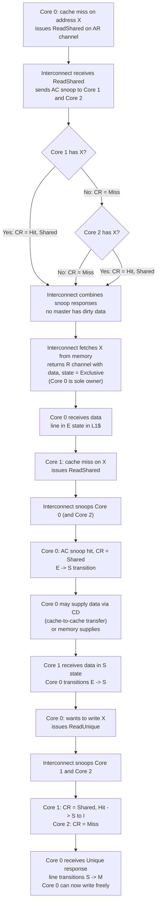
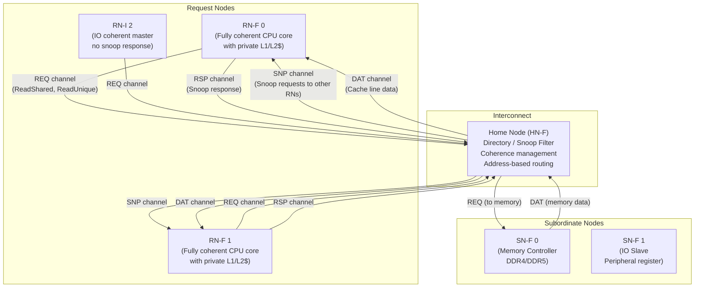
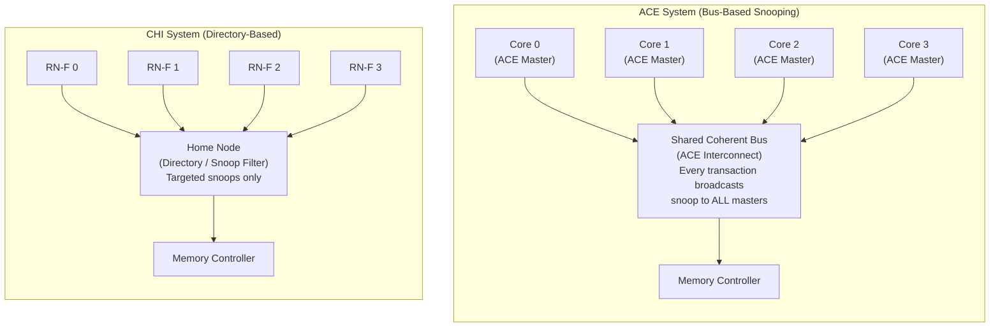

# ACE and CHI -- AMBA Coherence Extensions Beyond AXI

> **Prerequisites:** [AHB_AXI_APB.md](./AHB_AXI_APB.md) (AXI4 channels and handshake rules),
> [CPU_Architecture.md](./CPU_Architecture.md) (MESI protocol, cache hierarchy),
> [Memory.md](./Memory.md) (SRAM/DRAM timing)
>
> **Hands-off to:** SoC interconnect design, ARM Neoverse subsystem, NoC topology

---

## 0. Why This Page Exists

AXI4 gives you five independent channels, outstanding transactions, out-of-order
completion, and burst support. What it does **not** give you is any mechanism for
keeping caches coherent across multiple masters. When two CPU cores both cache
address `0x8000_1000` and one of them writes to it, AXI4 has no built-in way to
invalidate or update the other copy.

This page covers two AMBA extensions that solve that problem:

- **ACE** (AXI Coherence Extensions, AMBA 4) -- adds snoop channels on top of
  AXI4 for bus-based snooping coherence. Targets 2--8 core mobile SoCs
  (Cortex-A55/A78 clusters).
- **CHI** (Coherent Hub Interface, AMBA 5) -- a clean-sheet packet-based
  coherent interconnect with directory-based coherence. Targets 8--128+ core
  server SoCs (Neoverse N1/V1/V2, Graviton).

Understanding both is essential for system-level interview questions and for
reading ARM reference manuals.

---

## 1. The Coherence Problem in Multi-Core SoCs

```
Without hardware coherence:

  Core 0 L1$        Core 1 L1$        Main Memory
  +---------+       +---------+       +---------+
  | X = 42  |       | X = 42  |       | X = 42  |
  +---------+       +---------+       +---------+
       |                                  |
  Core 0 writes X=99                 Stale! Core 1
  (write-back, cached locally)       still reads 42

Solutions:
  1. Software: cache maintenance instructions (clean, invalidate) -- slow,
     error-prone, not scalable.
  2. Hardware: snooping protocol on the interconnect -- transparent to
     software, the whole point of ACE/CHI.
```

---

## 2. ACE (AXI Coherence Extensions)

### 2.1 What ACE Adds to AXI4

ACE retains all five AXI4 channels (AW, W, B, AR, R) and adds three snoop
channels plus two acknowledgment signals:

| Channel | Full Name            | Direction              | Purpose                                        |
|---------|----------------------|------------------------|------------------------------------------------|
| AC      | Snoop Address        | Interconnect -> Master | Address to snoop in the master's cache          |
| CR      | Snoop Response       | Master -> Interconnect | Response: Hit, Miss, Data, Shared, Clean, etc.  |
| CD      | Snoop Data           | Master -> Interconnect | Cache line data returned on a snoop hit         |
| RACK    | Read Acknowledge     | Master -> Interconnect | Confirms master has consumed read data           |
| WACK    | Write Acknowledge    | Master -> Interconnect | Confirms master has consumed write response      |

```
ACE Master (e.g., CPU core with L1$)

  AW, W, B  -->  (write channels, same as AXI4)
  AR, R     -->  (read channels, same as AXI4)
  AC        <--  (interconnect snoops this master)
  CR, CD    -->  (master responds to snoop)
  RACK      -->  (acknowledge read data received)
  WACK      -->  (acknowledge write response received)

The interconnect acts as a snoop filter and coherence manager.
It forwards AC snoops to all (or a subset of) ACE masters when
any master issues a coherence transaction.
```

### 2.2 ACE-Lite (IO Coherence)

ACE-Lite provides one-way coherence: an IO master (DMA, GPU) can participate
in coherence **without** being snooped. It has no AC/CR/CD channels.

```
ACE-Lite master indicates shareability on each transaction:
  ARCACHE/AWCACHE encode cacheability and shareability attributes.
  The interconnect performs snooping of full ACE masters on behalf of
  the ACE-Lite master, ensuring the IO device sees coherent data.

Use cases:
  - DMA engine reading/writing shared memory
  - GPU reading textures that the CPU may have modified
  - Network processor accessing shared packet buffers

ACE-Lite master requirements:
  - No cache of its own (or cache that does not need snooping)
  - Correctly marks shareability domain on every transaction
```

### 2.3 Shareability Domains

ACE defines four shareability domains, carried in AxCACHE and AxDOMAIN:

| Domain           | AxDOMAIN | Meaning                                                      |
|------------------|----------|--------------------------------------------------------------|
| Non-shareable    | 00       | Only this master accesses this address. No snooping needed.  |
| Inner Shareable  | 10       | Shared within an inner domain (e.g., CPU cluster).           |
| Outer Shareable  | 11       | Shared across inner and outer domains (e.g., multiple clusters). |
| System           | (N/A)    | Shared across the entire system.                             |

```
Typical ARM big.LITTLE SoC:

  +---------------------------+    +---------------------------+
  | Cluster 0 (Inner Domain)  |    | Cluster 1 (Inner Domain)  |
  |  A78 x 4  (ACE masters)   |    |  A55 x 4  (ACE masters)   |
  +---------------------------+    +---------------------------+
  |                                                              |
  +----------- Coherent Interconnect (CCI/CMN) -----------------+
                    |
              DDR Controller

  Inner Shareable: data only coherent within one cluster
  Outer Shareable: data coherent across both clusters
  Non-shareable: private to one core (e.g., stack, TLB)
```

### 2.4 Barrier Transactions

ACE carries barrier semantics as first-class transactions:

| Barrier | Full Name                  | Effect                                                   |
|---------|----------------------------|----------------------------------------------------------|
| DMB     | Data Memory Barrier        | All explicit memory accesses before DMB complete before any after |
| DSB     | Data Synchronization Barrier | Like DMB, but also waits for cache maintenance and TLB ops |
| Read/Write Barrier | Per-transaction | AxBAR signals indicate barrier ordering requirements |

```
Why barriers on the bus?

  CPU executes:  STR [X], DMB, STR [Y]
  Without barrier: writes may be reordered by the interconnect
    -> another core sees [Y] updated but [X] stale
  With DMB: the interconnect ensures STR [X] reaches its
    destination before STR [Y] is issued
  This is the hardware mechanism behind ARM's DMB/DSB instructions.
```

---

## 3. ACE Transactions -- Detailed

### 3.1 Transaction Types and Cache State Model

ACE uses MOESI-style coherence states. Each transaction type maps to a
specific MESI state transition:

| Transaction   | Purpose                                               | MESI Transition       |
|---------------|-------------------------------------------------------|-----------------------|
| ReadShared    | Read a line, willing to share with others             | I -> S or I -> E      |
| ReadClean     | Read a line, will not modify (need clean copy)        | I -> S                |
| ReadUnique    | Read a line exclusively, will modify                  | I -> M, others S->I   |
| ReadOnce      | One-time read, no caching                            | I -> I (no allocation)|
| MakeUnique    | Get exclusive ownership without data (full-line write)| others S/E->I         |
| CleanUnique   | Get exclusive ownership, dirty data written back      | others S/E/M->I       |
| CleanShared   | Ensure other copies are cleaned (written back)        | others M->S, E->S     |
| CleanInvalid  | Ensure other copies are invalidated                   | others S/E/M->I       |
| Evict         | Write back and invalidate a local line                | M -> I (writeback)    |

### 3.2 ReadShared Transaction Flow

```
When a core misses on a read and intends to hold the line read-only:

  Core 0 L1$          Interconnect          Core 1 L1$          Memory
      |                     |                     |                  |
      |  AR (ReadShared X)  |                     |                  |
      |-------------------->|                     |                  |
      |                     |  AC (Snoop X)       |                  |
      |                     |-------------------->|                  |
      |                     |  CR (Shared, Hit)   |                  |
      |                     |<--------------------| Core 1 has copy  |
      |                     |                     |  (E->S or S->S)  |
      |                     |  CD (data from      |                  |
      |                     |   Core 1 cache)     |                  |
      |                     |<--------------------|                  |
      |  R (data, Shared)   |                     |                  |
      |<--------------------|                     |                  |
      |  RACK               |                     |                  |
      |-------------------->|                     |                  |

If no other master has the line, Core 0 gets Exclusive (E) state
and the interconnect fetches data from memory instead.
```

### 3.3 ReadUnique Transaction Flow (Before Write)

```
When a core wants to write to a line it does not own exclusively:

  Core 0 L1$          Interconnect          Core 1 L1$          Memory
      |                     |                     |                  |
      |  AR (ReadUnique X)  |                     |                  |
      |-------------------->|                     |                  |
      |                     |  AC (Snoop X)       |                  |
      |                     |-------------------->|                  |
      |                     |  CR (Data, Dirty)   |                  |
      |                     |<--------------------| Core 1 had M     |
      |                     |  CD (cache line)    |  copy: M->I      |
      |                     |<--------------------|                  |
      |  R (data, Unique)   |                     |                  |
      |<--------------------|                     |                  |
      |  RACK               |                     |                  |
      |-------------------->|                     |                  |
      |                     |                     |                  |
  Core 0 now has Unique/Modified state.
  Core 1's copy was invalidated.
  If Core 1 had dirty data, it was passed via CD (cache-to-cache).
```

### 3.4 MakeUnique and CleanUnique

```
MakeUnique (full-line write -- core will overwrite all bytes):
  Core 0 sends MakeUnique -> Interconnect sends AC to all other masters
  Other masters invalidate their copies (CR = PassDirty if they had M)
  No data transfer needed (core will overwrite everything)
  Core 0 gets Unique/Modified state

CleanUnique (partial write -- core needs current data before modifying):
  Core 0 sends CleanUnique -> Interconnect sends AC to all other masters
  If another master has dirty data: CD returns the dirty line
  Other masters transition to Invalid
  Core 0 gets the data + Unique/Modified state

Why two variants?
  MakeUnique saves bandwidth: no need to fetch the current line contents
  if the core will overwrite every byte. Common for memset/memcpy.
  CleanUnique is needed for RMW: core modifies some bytes, needs rest.
```

---

## 4. ACE Coherence Protocol -- Complete Trace Example

### 4.1 Three-Core Trace: ReadShared, ReadShared, ReadUnique



### 4.2 Channel Activity Timing Diagram

```
Cycle:    1     2     3     4     5     6     7     8     9    10    11

--- ReadShared X (Core 0) ---
AR(C0):  |RS X |
              |AC X |      to C1
              |AC X |      to C2
                        |CR Miss|   from C1
                        |CR Miss|   from C2
                              |R data S|    from memory
                                     |RACK|

--- ReadShared X (Core 1) ---           (Core 0 has E -> will share)
                                     |AR RS X|  from C1
                                          |AC X| to C0
                                               |CR Hit S| from C0
                                               |CD data | from C0
                                                  |R data S| to C1
                                                         |RACK|

--- ReadUnique X (Core 0) ---
                                                         |AR RU X|
                                                            |AC X| to C1
                                                            |AC X| to C2
                                                                 |CR Hit| C1
                                                                 |CR Miss|C2
                                                                   |R data U|
                                                                        |RACK|
```

---

## 5. CHI (AMBA 5 Coherent Hub Interface)

### 5.1 Why CHI Replaces ACE for Large Systems

```
ACE limitation: bus-based snooping.
  Every coherence transaction broadcasts an AC snoop to ALL masters.
  With N masters, snoop bandwidth = O(N) per transaction.
  Total snoop bandwidth = O(N * traffic_per_master) = O(N^2).
  Practical limit: ~4-8 ACE masters before snoop traffic saturates the bus.

CHI solution: packet-based, directory-assisted coherence.
  A Home Node (HN) maintains a directory (or snoop filter) tracking
  which Request Nodes (RN) hold each cache line.
  On a coherence request, HN sends targeted snoops only to nodes that
  may have the line. Unnecessary snoops are eliminated.
  Snoop bandwidth = O(K) where K = number of actual sharers (typically 1-3).
  Scales to 64-128+ cores.
```

### 5.2 CHI Component Model



| Component | Full Name           | Role                                                     |
|-----------|---------------------|----------------------------------------------------------|
| RN-F      | Request Node, Full  | Fully coherent master (CPU core with cache). Can be snooped. |
| RN-I      | Request Node, IO    | IO-coherent master (DMA, GPU). No cache, cannot be snooped. |
| HN-F      | Home Node, Full     | Coherence manager. Holds directory/snoop filter. Routes requests. |
| HN-I      | Home Node, IO       | Non-coherent home for IO transactions.                   |
| SN-F      | Subordinate Node    | Memory controller or downstream slave.                    |
| SF        | Snoop Filter        | Tracks which RNs hold each line. Reduces unnecessary snoops. |

### 5.3 CHI Channels

CHI uses four logical channels, each with dedicated REQ/ACK signaling:

| Channel | Direction         | Purpose                                          | Key Fields                       |
|---------|-------------------|--------------------------------------------------|----------------------------------|
| REQ     | RN -> HN          | Coherence request (read, write, evict)           | SrcID, TgtID, Opcode, Addr, Size |
| SNP     | HN -> RN          | Snoop request to other caches                    | SrcID, TgtID, Opcode, Addr       |
| RSP     | RN -> HN, HN -> RN | Responses (acknowledgments, snoop responses)    | SrcID, TgtID, Opcode, Resp       |
| DAT     | SN -> HN, HN -> RN | Data transfer (cache lines, write data)          | SrcID, TgtID, Data, BE, CC       |

```
Each channel uses a valid/ready handshake (similar to AXI):
  TXREQFLITV / TXREQFLITREADY  -- REQ channel valid/ready
  TXSNPFLITV / TXSNPFLITREADY  -- SNP channel valid/ready
  TXRSPFLITV / TXRSPFLITREADY  -- RSP channel valid/ready
  TXDATFLITV / TXDATFLITREADY  -- DAT channel valid/ready

A "flit" (flow control unit) is one packet on a channel.
CHI packets are wider than AXI signals (typically 128-256 bits per flit)
and carry all fields in a single cycle (single-flit packets for most ops).
```

### 5.4 CHI Transaction Types

| Opcode           | Type    | Meaning                                              |
|------------------|---------|------------------------------------------------------|
| ReadShared       | Request | Read line, shared state (like ACE ReadShared)        |
| ReadUnique       | Request | Read line, exclusive for writing                     |
| ReadOnce         | Request | One-time read, no allocation in requestor's cache    |
| CleanUnique      | Request | Get exclusive ownership, need current data           |
| MakeUnique       | Request | Get exclusive ownership, no data needed              |
| Evict            | Request | Write back and invalidate a line from cache          |
| WriteBack        | Request | Write dirty data back to memory/home                 |
| WriteEvictFull   | Request | Write + evict (combined writeback and invalidate)    |
| SnpShared        | Snoop   | Snoop for shared state, requestor wants to share     |
| SnpUnique        | Snoop   | Snoop for unique state, requestor wants exclusive    |
| SnpInv           | Snoop   | Invalidate: just invalidate, no data return needed   |
| SnpData          | Snoop   | Return data if cached (for cache-to-cache transfer)  |

### 5.5 CHI Transaction Flow -- ReadShared

```
  RN0                  HN-F                    RN1                 SN (Memory)
   |                     |                      |                      |
   |  REQ: ReadShared X  |                      |                      |
   |-------------------->|                      |                      |
   |                     |  Check directory:    |                      |
   |                     |  RN1 has X in S/E/M  |                      |
   |                     |                      |                      |
   |                     |  SNP: SnpShared X    |                      |
   |                     |--------------------->|                      |
   |                     |                      | RN1: S -> S          |
   |                     |  RSP: SnpResp (Hit,  | (if M, writeback     |
   |                     |        Shared)        |  via DAT first)      |
   |                     |<---------------------|                      |
   |                     |                      |                      |
   |                     |  (if RN1 had dirty data: DAT from RN1)       |
   |                     |                      |                      |
   |                     |  (if no cached copy: fetch from memory)       |
   |                     |  REQ: Read X          |                      |
   |                     |--------------------------------------->|      |
   |                     |  DAT: data from memory                      |
   |                     |<---------------------------------------|      |
   |                     |                      |                      |
   |  DAT: data (Shared) |                      |                      |
   |<--------------------|                      |                      |
   |  RSP: CompAck       |                      |                      |
   |-------------------->|  (directory updated) |                      |
```

### 5.6 CHI Transaction Flow -- ReadUnique (Write Miss)

```
  RN0                  HN-F                    RN1                 SN (Memory)
   |                     |                      |                      |
   |  REQ: ReadUnique X  |                      |                      |
   |-------------------->|                      |                      |
   |                     |  Directory: X shared |                      |
   |                     |  in RN1 (S state)    |                      |
   |                     |                      |                      |
   |                     |  SNP: SnpUnique X    |                      |
   |                     |--------------------->|                      |
   |                     |                      | RN1: S -> I          |
   |                     |  RSP: SnpResp (I)    | (invalidate local    |
   |                     |<---------------------|  copy)               |
   |                     |                      |                      |
   |                     |  No dirty data (S state, not M)              |
   |                     |  Fetch from memory:   |                      |
   |                     |  REQ: Read X          |                      |
   |                     |--------------------------------------->|      |
   |                     |  DAT: data            |                      |
   |                     |<---------------------------------------|      |
   |                     |                      |                      |
   |  DAT: data (Unique) |                      |                      |
   |<--------------------|  Directory: RN0=Unique                      |
   |  RSP: CompAck       |                      |                      |
   |-------------------->|                      |                      |

If RN1 had M state instead of S:
  RN1 returns dirty data via DAT channel (cache-to-cache transfer)
  HN-F forwards data to RN0 and writes back to memory
  No separate memory read needed -- saves latency and bandwidth.
```

---

## 6. ACE vs CHI -- Architecture Comparison



| Property              | ACE                              | CHI                                 |
|-----------------------|----------------------------------|-------------------------------------|
| AMBA version          | AMBA 4                           | AMBA 5                              |
| Coherence method      | Bus-based broadcast snoop        | Directory + targeted snoop          |
| Interface style       | Channel-based (like AXI4)        | Packet-based (flits)                |
| Additional channels   | AC, CR, CD (3 snoop) + RACK/WACK | REQ, SNP, RSP, DAT (4 channels)    |
| Snoop scope           | All masters, every transaction   | Only sharers identified by directory|
| Scalability (cores)   | 2--8 (practical limit ~8)        | 8--128+                             |
| Bandwidth scaling     | O(N) per transaction (snoop all) | O(K) per transaction (K = sharers)  |
| Typical topology      | Shared bus / crossbar            | Ring, mesh, NoC                     |
| Latency (typical)     | 2--4 cycles snoop round-trip     | 3--6 hops (depends on topology)     |
| Area / complexity     | Lower (simpler interconnect)     | Higher (directory storage, routing) |
| Typical silicon       | Cortex-A78/A55 cluster           | Neoverse N1/V1/V2, Graviton        |
| SoC examples          | Snapdragon 8 Gen 3, Dimensity    | Altra, Graviton3, Cobalt-100        |

---

## 7. TrustZone in AXI/ACE

### 7.1 Security Attributes on the Bus

ARM TrustZone partitions the system into Secure and Non-secure worlds.
The security attribute is carried on the bus:

```
AxPROT[1] (NS bit):
  0 = Secure access
  1 = Non-secure access

Write path:  AWPROT[1] = NS attribute for write address
Read path:   ARPROT[1] = NS attribute for read address
```

### 7.2 TrustZone Controller (TZC)

```
                    +---------+
  CPU (Secure) ---->|         |
                    |   TZC   |----> Secure DRAM (0x0000_0000 - 0x0FFF_FFFF)
  CPU (Non-sec) --> |  (Addr  |
                    |  Filter)|----> Non-secure DRAM (0x1000_0000 - 0x1FFF_FFFF)
  DMA (Non-sec) --> |         |
                    +---------+

TZC rules:
  1. Secure master (AWPROT[1]=0): can access ALL memory regions
  2. Non-secure master (AWPROT[1]=1): can only access Non-secure regions
  3. Non-secure access to Secure region: TZC returns SLVERR (access denied)
  4. TZC-400: up to 9 regions, each configurable as Secure or Non-secure

Signal path for a DMA read of Secure memory:
  DMA engine -> ARPROT[1] = 1 (Non-secure) -> Interconnect -> TZC
  TZC checks address against region map -> falls in Secure region
  TZC blocks access -> returns DECERR to DMA -> DMA gets bus error
```

### 7.3 TrustZone Across ACE/CHI

```
In ACE:
  AC snoop carries AxPROT. A Non-secure snoop cannot interrogate
  Secure cache lines. The interconnect filters based on security domain.

In CHI:
  Each flit carries an NS (Non-secure) bit in the opcode fields.
  The Home Node checks security attributes before responding.
  A Non-secure RN cannot receive data belonging to a Secure address range.
  The HN-F enforces isolation -- no software involvement needed.
```

---

## 8. AXI ATOP (Atomic Operations, AXI5)

### 8.1 Motivation

```
Without ATOP: atomic increment at address X
  1. CPU reads X (AR channel)
  2. CPU computes X + 1
  3. CPU writes X + 1 (AW + W + B channels)
  Total: 2 round-trips, ~4-8 bus transactions
  Problem: between step 1 and step 3, another master might modify X

With ATOP: atomic increment at address X
  1. CPU sends AtomicStore with ADD opcode on AW channel + W channel
  2. Slave reads X, computes X + 1, writes back, returns old value (optional)
  Total: 1 round-trip, atomicity guaranteed by the slave
```

### 8.2 ATOP Operations

| Category      | Operations                                         | Return Data? |
|---------------|----------------------------------------------------|--------------|
| AtomicLoad    | ADD, CLR, EOR, SET, SMAX, SMIN, UMAX, UMIN        | Yes (old value) |
| AtomicStore   | ADD, CLR, EOR, SET, SMAX, SMIN, UMAX, UMIN        | No           |
| AtomicSwap    | SWAP (write new value, return old)                 | Yes          |
| AtomicCompare | CAS (compare and swap: match -> swap, else return) | Yes          |

```
AxATOP signal (2 bits on AW channel):
  00 = Normal (non-atomic) transaction
  01 = AtomicStore (no data returned on R channel)
  10 = AtomicLoad (data returned on R channel)
  11 = AtomicCompare (data returned on R channel)

Key constraint: ATOP transactions must be to Device or Normal Non-cacheable
memory, OR the interconnect must handle them coherently.

Use cases:
  - Lock-free queues: atomic increment of head/tail pointer
  - Reference counting: atomic increment/decrement
  - Compare-and-swap: lock acquisition, mutex implementation
  - Statistics counters: atomic increment in network processors
```

### 8.3 ATOP vs Exclusive Access

```
Exclusive Access (LDREX/STREX, AXI4):
  Two separate transactions. Software manages the retry loop.
  Works with any AXI4 slave.
  Latency: 2 round-trips (read + write).
  Failure mode: STREX fails (BRESP=OKAY), software retries.

ATOP (AXI5):
  Single transaction. Hardware manages atomicity at the slave.
  Requires ATOP-capable slave.
  Latency: 1 round-trip.
  Failure mode: none (always succeeds, atomicity in hardware).

For SoC design:
  Use ATOP when the slave supports it (faster, simpler).
  Fall back to exclusive access for legacy AXI4 slaves.
  ARMv8.1-A mandates LSE (Large System Extensions) atomics which map to ATOP.
```

---

## 9. Numbers to Memorize

| Parameter                                  | Value                           | Notes                                  |
|--------------------------------------------|---------------------------------|----------------------------------------|
| ACE additional channels                    | 3 (AC, CR, CD) + 2 (RACK, WACK)| On top of AXI4's 5 channels            |
| ACE max practical core count               | ~8                              | Snoop bandwidth scales O(N^2)          |
| ACE snoop latency (typical)                | 2--4 cycles                     | AC -> CR/CD round-trip                  |
| ACE cache line size (typical)              | 64 bytes                        | Matches ARM L1$ line size              |
| CHI channels                               | 4 (REQ, SNP, RSP, DAT)         | Each with valid/ready handshake        |
| CHI max core count                         | 64--128+                        | Directory scales better than snoop     |
| CHI flit width (typical)                   | 128--256 bits                   | Wider than AXI signal groups           |
| CHI hop latency (mesh, typical)            | 2--3 cycles per hop             | Depends on topology and router depth   |
| Directory entry size (per line, 64-core)   | ~72 bits                        | 64-bit sharer vector + state + tag     |
| Snoop filter entry size (4-core)           | ~24 bits                        | 4-bit sharer + 20-bit tag (partial)    |
| TrustZone TZC-400 max regions              | 9                               | Configurable Secure/Non-secure         |
| ATOP operation count                       | 16                              | 8 AtomicLoad + 8 AtomicStore variants  |
| AXI5 AxATOP width                          | 2 bits                          | 00=Normal, 01=Store, 10=Load, 11=CAS   |
| DMB/DSB barrier cost (typical)             | 10--50 cycles                   | Depends on outstanding traffic         |

---

## 10. Worked Interview Problems

### Problem 1: ACE Transaction Sequence

**Question:** Draw the ACE transaction sequence for: Core 0 ReadShared X, Core 1 ReadShared X, Core 0 ReadUnique X. Show all channel activity.

**Answer:**

```
Initial state: address X not cached anywhere.

--- Phase 1: Core 0 ReadShared X ---
  Core 0: AR channel -> ReadShared, Addr=X
  Interconnect: AC channel -> snoop Core 1 (and Core 2, Core 3, ...)
  Core 1: CR channel -> Miss (does not have X)
  Core 2: CR channel -> Miss (does not have X)
  Interconnect: fetches X from memory
  Interconnect: R channel -> data, state=Exclusive (no other master has X)
  Core 0: RACK -> acknowledges receipt
  State after: Core 0 has X in E state

--- Phase 2: Core 1 ReadShared X ---
  Core 1: AR channel -> ReadShared, Addr=X
  Interconnect: AC channel -> snoop Core 0 (has X in E)
  Core 0: CR channel -> Hit, Shared (E -> S transition)
  Core 0: CD channel -> supplies cache line data (cache-to-cache)
  Interconnect: R channel -> data to Core 1, state=Shared
  Core 1: RACK -> acknowledges receipt
  State after: Core 0 has X in S, Core 1 has X in S

--- Phase 3: Core 0 ReadUnique X ---
  Core 0: AR channel -> ReadUnique, Addr=X
  Interconnect: AC channel -> snoop Core 1 (has X in S)
  Core 1: CR channel -> Hit, Shared (S -> I transition, invalidation)
  No CD needed (Core 1 had clean data, Core 0 already has a copy in S)
  Interconnect: R channel -> data to Core 0, state=Unique/Modified
  Core 0: RACK -> acknowledges receipt
  State after: Core 0 has X in M, Core 1 has X invalidated

Key observations:
  - ReadShared from E state: no memory access, cache-to-cache transfer
  - ReadUnique: invalidation without data transfer if line was clean
  - Total bus transactions: 3 reads + 3 snoops + 3 responses = 9 ops
```

### Problem 2: Snoop Filter Design for 4-Core ACE System

**Question:** Design a simple snoop filter for a 4-core ACE system: 64-byte cache line size, 4 MB shared L3. How many snoop filter entries? What is the storage overhead?

**Answer:**

```
Given:
  Cache line size: 64 bytes
  Shared L3 size: 4 MB = 4 * 1024 * 1024 = 4,194,304 bytes
  Number of cores: 4

Step 1: How many L3 cache lines?
  L3 lines = L3_size / line_size = 4,194,304 / 64 = 65,536 lines

Step 2: How many L1 + L2 lines total (upper bound on concurrent sharers)?
  Assume each core has:
    L1 I$: 64 KB, 64B line -> 1024 lines
    L1 D$: 64 KB, 64B line -> 1024 lines
    L2$:   512 KB, 64B line -> 8192 lines
  Per core: 1024 + 1024 + 8192 = 10,240 lines
  Total across 4 cores: 40,960 lines (upper bound)

  But L1 + L2 lines are a subset of L3 lines (inclusive cache).
  Maximum unique addresses cached across all private caches <= 65,536.

Step 3: Snoop filter tracks L3 address space.
  Entries needed: 65,536 (one per L3 line)

  Each entry:
    Valid bit: 1 bit
    Sharer vector: 4 bits (one per core)
    Tag: need to identify the address. If indexed by L3 set + way,
         we need ~17 bits for the physical address tag.
    State: 2 bits (Invalid, Shared, Exclusive/Modified)
    Total per entry: 1 + 4 + 17 + 2 = 24 bits = 3 bytes

Step 4: Storage overhead:
  Total storage = 65,536 * 24 bits = 1,572,864 bits = 192 KB

  As fraction of L3: 192 KB / 4 MB = 4.7%

  Optimization: track only lines that are actually cached.
  If average private cache utilization is 50%, only ~20,000 entries
  are active. Use a set-associative structure with fewer entries
  and tags for further savings.

Answer: 65,536 entries, ~24 bits each, ~192 KB storage (4.7% of L3 size).
```

### Problem 3: CHI ReadUnique with Dirty and Clean Sharers

**Question:** RN0 sends ReadUnique to HN. HN sends SNP to RN1 and RN2. RN1 has dirty data, RN2 has clean. Show the complete message flow.

**Answer:**

```
Initial state:
  RN0: does not cache address X
  RN1: X in Modified state (dirty, sole valid copy, memory stale)
  RN2: X in Shared state (clean, read-only copy)
  HN directory: X is shared in RN1 (tracked as Exclusive/Modified)
                  and RN2 (tracked as Shared)

--- Message Flow ---

1. RN0 -> HN:  REQ {Opcode=ReadUnique, Addr=X, SrcID=RN0}
   "I want exclusive ownership of X to write it"

2. HN checks directory:
   Sharers of X = {RN1, RN2}
   HN must invalidate both and get dirty data from RN1.

3. HN -> RN1:  SNP {Opcode=SnpUnique, Addr=X, TgtID=RN1}
   "Give up X exclusively, return data if dirty"

4. HN -> RN2:  SNP {Opcode=SnpInv, Addr=X, TgtID=RN2}
   "Invalidate your copy of X, no data needed" (clean, no writeback)

5. RN2 -> HN:  RSP {Opcode=SnpResp_I, SrcID=RN2}
   "Invalidated. I had a clean Shared copy, now Invalid."
   No DAT from RN2 (clean data, no writeback needed).

6. RN1 -> HN:  DAT {Opcode=SnpRespData, SrcID=RN1, Data=X_cache_line}
   "Here is the dirty data. My copy is now Invalid."
   RN1: M -> I transition. Dirty cache line written back.

7. HN processes responses:
   - Received data from RN1 (dirty, authoritative copy)
   - RN2 confirmed invalidation
   - HN writes RN1's dirty data to memory (optional, can defer)
   - HN updates directory: X is now Exclusive in RN0

8. HN -> RN0:  DAT {Opcode=Data, Data=X_cache_line, Resp=Unique}
   "Here is the data. You have exclusive ownership."

9. HN -> RN0:  RSP {Opcode=CompAck (implicit in data response)}
   Combined with data in some implementations.

10. RN0 -> HN: RSP {Opcode=CompAck, SrcID=RN0}
    "I acknowledge receipt of the data."

Final state:
  RN0: X in Modified state (can write freely)
  RN1: X invalidated
  RN2: X invalidated
  Memory: will be updated when RN0 eventually writes back

Key observations:
  - RN1 returns dirty data via DAT (cache-to-cache, avoids memory read)
  - RN2 only needs a simple invalidation response (no data transfer)
  - HN uses different SNP opcodes based on directory state:
    SnpUnique for the dirty owner, SnpInv for clean sharers
  - This targeted approach is why CHI scales: only 2 snoops, not N
```

### Problem 4: TrustZone Preventing Non-Secure DMA Access

**Question:** Explain how TrustZone prevents a Non-secure DMA master from reading Secure memory. Show the signal path.

**Answer:**

```
Scenario: A Non-secure DMA engine attempts to read address 0x0000_1000,
which is configured as Secure memory by the TZC.

Signal path:

  DMA Engine                AXI Interconnect              TZC-400            DRAM
     |                           |                         |                  |
     | ARADDR = 0x0000_1000      |                         |                  |
     | ARPROT[1] = 1 (Non-sec)   |                         |                  |
     | ARVALID = 1               |                         |                  |
     |-------------------------->|                         |                  |
     |                           | Route to TZC based on   |                  |
     |                           | address map             |                  |
     |                           |                         |                  |
     |                           | ARADDR = 0x0000_1000    |                  |
     |                           | ARPROT[1] = 1           |                  |
     |                           |------------------------>|                  |
     |                           |                         |                  |
     |                           |                         | Check region:    |
     |                           |                         | 0x0000_0000-     |
     |                           |                         | 0x0FFF_FFFF =    |
     |                           |                         | Secure region    |
     |                           |                         |                  |
     |                           |                         | NS=1 but region  |
     |                           |                         | is Secure:       |
     |                           |                         | DENY!            |
     |                           |                         |                  |
     |                           | RRESP = DECERR (11)     |                  |
     |                           |<------------------------|                  |
     |                           |                         |                  |
     | RRESP = DECERR            |                         |                  |
     |<--------------------------|                         |                  |
     |                           |                         |                  |
  DMA receives bus error. No data from Secure memory was returned.
  The Secure data never left the DRAM. No information leaked.

How the TZC decides:

  Input: Address + ARPROT[1] (or AWPROT[1] for writes)
  TZC Region Config:
    Region 0: 0x0000_0000 - 0x0FFF_FFFF, Secure only
    Region 1: 0x1000_0000 - 0x1FFF_FFFF, Non-secure OK
    Region 2: 0x2000_0000 - 0x2FFF_FFFF, Non-secure OK

  Rule:
    if (ARPROT[1] == 0)  // Secure master
      -> Allow all regions (Secure can access everything)
    else if (ARPROT[1] == 1)  // Non-secure master
      -> Allow only Non-secure regions
      -> Region 0 access -> DECERR

  This is enforced in hardware. No software is involved in the
  permission check. It is impossible for a Non-secure master to
  bypass the TZC by software means.

  Additional protection layers:
  1. Interconnect filtering: the AXI interconnect may also check
     AxPROT and refuse to route Non-secure transactions to Secure
     slaves (e.g., Secure debug port, Secure peripherals).
  2. In ACE/CHI: snoop responses are also tagged with security.
     A Non-secure master's snoop cannot interrogate Secure cache lines.
  3. SMMU (System MMU): provides per-device memory translation and
     permission checking, complementary to TrustZone.
```

---

## 11. References

1. ARM IHI 0022E -- AMBA AXI and ACE Protocol Specification (AXI3, AXI4, ACE, ACE-Lite)
2. ARM IHI 0050C -- AMBA 5 CHI Architecture Specification (Issue C)
3. ARM DDI 0595 -- Cortex-A78 Technical Reference Manual (ACE master interface)
4. ARM DDI 0600 -- Neoverse N1 Technical Reference Manual (CHI RN-F interface)
5. ARM DDI 0491 -- CoreLink CCI-500 Coherent Interconnect (ACE interconnect)
6. ARM DDI 0606 -- CoreLink CMN-600 Coherent Mesh Network (CHI interconnect)
7. ARM ARMv8-A Architecture Reference Manual -- DMB, DSB, cache maintenance
8. Hennessy & Patterson, "Computer Architecture: A Quantitative Approach," 6th ed., Chapter 5 (Memory Consistency)

---

## 12. Navigation

| Direction       | Link                                                    |
|-----------------|---------------------------------------------------------|
| Prerequisite    | [AHB_AXI_APB.md](./AHB_AXI_APB.md)                     |
| Prerequisite    | [CPU_Architecture.md](./CPU_Architecture.md)            |
| Prerequisite    | [Memory.md](./Memory.md)                                |
| Related         | [../Implementation/STA.md](../Implementation/STA.md)    |
| Back to Index   | [../Index.md](../Index.md)                              |
