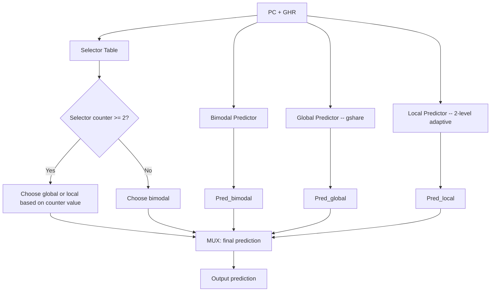

# Branch Prediction -- Deep Dive for CPU Designers

> **Prerequisites**: [CPU_Architecture.md](./CPU_Architecture.md) (pipeline basics, hazards),
> [OoO_Execution.md](./OoO_Execution.md) (speculative execution, reorder buffer)
>
> **Hands-off to**: [Memory.md](./Memory.md) (I-cache design, TLB),
> [Front_End_Design.md](./Front_End_Design.md) (fetch-directed prefetch, decode bandwidth)

---

## Section 0 -- Why This Page Exists

Branch instructions appear every 4--7 instructions in typical integer code. A
15-stage pipeline that resolves branches in stage 10 would squash 9
instructions on every misprediction -- at best a 15-cycle bubble, at worst a
full pipeline flush. The difference between a 95% accurate predictor and a
99% accurate predictor is the difference between wasting 5% versus 1% of all
cycles, which translates directly into 4--8% overall performance on SPEC
int2006.

Interview candidates at Apple, AMD, ARM, Google, Meta, NVIDIA, and RISC-V
startups are regularly asked to:

- Explain the BTB / BHT split and why they are separate structures.
- Walk through gshare indexing and compute a prediction by hand.
- Describe TAGE lookup, provider selection, and allocation policy.
- Design a speculative Return Address Stack with misprediction repair.
- Compute mispredict penalty given pipeline depth and resolution stage.

This page covers all of the above at the depth expected in a CPU design
interview, with worked problems that mirror actual interview questions.

---

## 1. Branch Target Buffer (BTB)

### 1.1 Purpose

The BTB answers one question: **given a branch PC, what is the target PC?**
Without a BTB, the fetch unit cannot know where to redirect until the branch
is decoded and its offset computed -- a delay of 1--3 stages.

### 1.2 Set-Associative Structure

```
BTB Entry Format (typical 28--36 bits):
+----------+-----------+----------+--------+
| Tag      | Target PC | BrType   | Valid  |
| [17:0]   | [31:0]    | [2:0]    | [0]    |
+----------+-----------+----------+--------+

BrType encoding:
  000 = conditional branch
  001 = unconditional jump
  010 = CALL (push to RAS)
  011 = RETURN (pop from RAS)
  100 = indirect jump (target may vary)
```

**Indexing**: `PC[11:2]` provides a 10-bit index into 1024 sets. The tag is
`PC[31:12]` (upper 20 bits). A hit requires both tag match and valid bit set.

**Lookup timing**: BTB access completes in the same cycle as I-cache fetch
(F1 stage). The predicted target is available for the next fetch (F2 stage),
introducing zero extra latency when the prediction is correct.

### 1.3 Multi-Level BTB

Modern cores use a two-level BTB hierarchy, analogous to L1/L2 caches:

| Level | Entries | Latency | Coverage |
|-------|---------|---------|----------|
| L1 BTB | 64--128 | 1 cycle (fetch stage) | hot branches only |
| L2 BTB | 2K--8K | 2--3 cycles (pre-decode) | cold branches, large code |

**L1 BTB**: Accessed every cycle in parallel with the I-cache. Small enough to
stay fast; holds only the most recently used branches.

**L2 BTB**: Accessed in parallel but arrives 1--2 cycles later. On an L1 miss,
the fetch unit continues sequentially. If the L2 hits, a redirect is issued at
that point, costing a 1--2 cycle bubble instead of waiting for decode.

**BTB miss penalty**: If both levels miss, the branch is not recognized until
decode (stage 3--5). The pipeline must then flush the instructions fetched after
the branch and redirect to the computed target. Typical penalty: 3--5 cycles
for a BTB miss that is caught at decode.

### 1.4 BTB Update Policy

When a branch is resolved (execute stage):

1. If the branch was not in the BTB, allocate a new entry (LRU replacement).
2. If the target changed (indirect branch), update the stored target.
3. If the branch is no longer taken after N consecutive not-takens, some
   designs evict the BTB entry to save space for active branches.

---

## 2. Branch History Table (BHT) and gshare

### 2.1 Two-Bit Saturating Counter

The simplest dynamic predictor: each branch maps to a 2-bit saturating counter
that tracks recent behavior.

```
State Machine:

         mispredict          mispredict
   +---> Strongly Taken (11) -------> Weakly Taken (10) ---+
   |          ^                              |              |
   |      correct                        correct           |
   |          |                              v              |
   |    Weakly Taken (10) <--- Strongly Taken (11)          |
   |                                                          |
   |          mispredict          mispredict                 |
   |    Weakly Not-Taken (01) <--- Strongly Not-Taken (00) <-+
   |          ^                              |
   |      correct                        correct
   |          |                              v
   +--- Strongly Not-Taken (00) <--- Weakly Not-Taken (01)

Prediction rule:
  Counter >= 2 (10 or 11) --> predict Taken
  Counter <= 1 (00 or 01) --> predict Not Taken
```

The 2-bit counter requires two consecutive mispredictions before changing the
prediction direction. This provides hysteresis against noisy branches (e.g.,
loop branches that are taken $N-1$ times and not-taken once).

### 2.2 Global History Register (GHR)

The GHR is an $N$-bit shift register recording the outcomes of the most recent
$N$ branches. Convention: bit 0 is the most recent outcome; 1 = taken, 0 =
not-taken.

```
GHR (8-bit example):
  GHR[7:0] = 1 0 1 1 0 1 0 0
              |             |
              oldest      newest

On each branch resolution:
  GHR = { GHR[N-2:0], actual_outcome }   (shift left, insert at LSB)
```

Typical GHR sizes: 8--16 bits for gshare; up to 500+ bits for TAGE components.

### 2.3 gshare Predictor

gshare XORs the GHR with the PC to produce the BHT index. This combines global
history with the branch address to reduce aliasing.

```
Index computation:
  index = PC[11:2] XOR GHR[9:0]     (for a 10-bit index, 1024-entry BHT)

  Example: PC = 0x0040_1A3C, GHR = 0x2A5
    PC[11:2]  = 0b01_1010_0011_11 = 0x68F
    GHR[9:0]  = 0b10_1010_0101    = 0x2A5
    XOR       = 0b00_0000_0110_10 = 0x0EA  (index into BHT)
```

**Why XOR helps**: A plain PC-indexed BHT maps different branches to fixed
counters. Two branches with different PCs but the same PC[11:2] alias. A plain
GHR-indexed BHT maps different history patterns to fixed counters. Two branches
with the same GHR alias. XOR decorrelates: two branches with the same index
but different GHR values hash to different entries, reducing destructive
aliasing by roughly 30% over pure PC-indexing on SPEC.

### 2.4 BHT Sizing

| Parameter | Typical Value | Storage |
|-----------|--------------|---------|
| Entries | 4096 | -- |
| Counter width | 2 bits | 8192 bits = 1 KB |
| Tag (if tagged) | 0 (untagged) | 0 |
| Total | 4096 x 2b | 1 KB (untagged) |

In practice, the BHT is often untagged (pure gshare). Aliasing is tolerated
because the 2-bit counters self-correct. Tagged variants (e.g., tagged
components in TAGE) add per-entry tags at higher storage cost.

---

## 3. TAGE (TAgged GEometric) Predictor -- State of the Art

TAGE is the dominant predictor in academic and industrial designs since 2014.
It won the CBP (Championship Branch Prediction) competitions and is used in
chips ranging from the SiFive P870 to the Xiangshan Nanhu (open-source RISC-V).

### 3.1 Structure

TAGE consists of one **base predictor** (bimodal) and $M$ **tagged components**
with geometrically increasing history lengths.

```
Component layout (M = 4 example):

  Base (bimodal):  history length = 0,    1024 entries, no tag
  T1:              history length = 4,     128  entries, 8-bit tag
  T2:              history length = 16,    128  entries, 8-bit tag
  T3:              history length = 64,    128  entries, 8-bit tag
  T4:              history length = 256,   128  entries, 8-bit tag

History length geometric ratio: alpha = 2  (each is ~2x the previous)
```

Each tagged component entry stores:

```
+------+--------+---------+--------+
| Tag  | Counter| Useful  | Pred   |
| [7:0]| [2:0]  | [1:0]   | [0]    |
+------+--------+---------+--------+
  Tag:     partial tag for matching (not full PC)
  Counter: 3-bit saturating counter for prediction direction
  Useful:  2-bit counter tracking how often this entry provided a
           correct prediction (confidence)
  Pred:    stored prediction (redundant with counter sign, some
           implementations omit this)
```

### 3.2 Lookup


**Provider**: The tagged component with the longest history length that has a
tag hit. If no tagged component hits, the base bimodal predictor provides the
prediction.

**Alternate (alt)**: The second-longest matching tagged component, or the base
predictor if only one tagged component hits.

**Confidence gating**: If the provider's useful counter is zero (low
confidence), the predictor falls back to the alternate. This prevents a newly
allocated but poorly trained entry from degrading accuracy.

### 3.3 Update Policy

After a branch resolves with actual outcome:

1. **Update the provider counter**: increment if taken, decrement if not-taken
   (3-bit saturating).
2. **If correct and provider != base**: increment the provider's useful counter.
3. **If mispredicted and provider != base**:
   - Decrement the provider's useful counter.
   - **Allocate** a new entry in 1--3 tagged components that did not match
     (chosen randomly or by longest-empty). The new entry gets the tag, a
     fresh counter initialized to weakly-taken or weakly-not-taken, and a
     useful counter of zero.
4. **Periodic useful decay**: Every $2^{18}$ predictions, halve all useful
   counters to allow eviction of stale entries.

### 3.4 TAGE-SC (Statistical Corrector)

The Xiangshan Nanhu processor extends TAGE with a Statistical Corrector (SC):

- A perceptron-like component that takes the predictions and partial tags from
  all TAGE components as input features.
- Trained on TAGE's mispredictions only.
- Overrides the TAGE prediction when SC's confidence exceeds a threshold.
- Improves accuracy by ~0.2--0.4 percentage points on SPEC CPU2006.

### 3.5 Accuracy

| Benchmark Suite | TAGE (8 components) | TAGE-SC-L (Xiangshan) |
|-----------------|---------------------|------------------------|
| SPEC INT 2006 | 3.0 MPKI (mispredicts per 1000 instructions) | 2.4 MPKI |
| SPEC INT 2017 | 4.2 MPKI | 3.5 MPKI |
| Accuracy (INT 2006) | ~99.0% | ~99.2% |

---

## 4. Perceptron Predictor

### 4.1 Mechanism

The perceptron predictor treats branch prediction as a binary classification
problem. For each branch (indexed by PC), a set of $N$ weights is maintained,
where $N$ equals the GHR length.

```
Prediction:
  GHR = {b_1, b_2, ..., b_N}  where b_i in {-1, +1}
  W_j = {w_1, w_2, ..., w_N}  weights for branch j

  y_out = w_0 + SUM(i=1..N) w_i * b_i

  Predict TAKEN     if y_out >= 0
  Predict NOT-TAKEN if y_out <  0

Training (on mispredict or low confidence):
  t = +1 if actual was Taken, -1 if Not-Taken
  if sign(y_out) != sign(t):
    for i = 0 to N:
      w_i = w_i + t * b_i      (perceptron learning rule, clamped to [-256, 255])
```

**Bias weight** ($w_0$): Always has $b_0 = +1$. Captures the branch's base
direction (taken-biased or not-taken-biased).

### 4.2 Properties

- **Captures long correlations**: A perceptron with $N = 32$ can learn
  correlations spanning 32 branches back. Linearly separable patterns are
  learned perfectly.
- **Cannot learn XOR**: A single-layer perceptron cannot represent non-linearly
  separable functions (e.g., XOR of two history bits). This limits accuracy on
  pathological patterns.
- **Storage**: 4096 branches x 33 weights x 8 bits = 132 KB -- much larger
  than gshare's 1 KB. This is the primary reason perceptrons are not used in
  L1 predictors in commercial silicon.
- **Accuracy**: ~97% on SPEC INT (2-bit saturating counter) to ~97.5% with
  8-bit weights.

### 4.3 Piecewise Linear / Multiperceptron

An extension that maintains separate weight tables per partial history pattern,
achieving ~98.5% accuracy. Used in some CBP competition entries but considered
too expensive for production hardware.

---

## 5. Tournament Predictor

### 5.1 Architecture

The tournament predictor (Alpha 21264, 1996) maintains three sub-predictors and
a per-branch selector that chooses which predictor to trust.



**Sub-predictors**:

1. **Bimodal**: PC-indexed 2-bit counter table (1024 entries). Good for
   strongly biased branches.
2. **Global (gshare)**: GHR XOR PC index into 2-bit counter table (4096
   entries). Good for correlated branches.
3. **Local (2-level adaptive)**: First level: PC-indexed into a 10-bit local
   history register (LHR) per branch. Second level: LHR indexes a 2-bit
   counter table (1024 entries). Good for repeating patterns like
   T,T,T,NT.

**Selector**: A 2-bit saturating counter per branch (PC-indexed, 4096 entries).
Encoding:
- 00, 01: choose bimodal
- 10: choose global
- 11: choose local

### 5.2 Alpha 21264 Parameters

| Component | Entries | Bits/Entry | Total Storage |
|-----------|---------|------------|---------------|
| Bimodal | 1024 | 2 | 256 B |
| Global counter table | 4096 | 2 | 1 KB |
| GHR | 1 | 12 | 12 bits |
| Local history table | 1024 | 10 | 1.25 KB |
| Local counter table | 1024 | 2 | 256 B |
| Selector | 4096 | 2 | 1 KB |
| **Total** | -- | -- | **~4 KB** |

### 5.3 Accuracy

~96.5% on SPEC INT95, ~97% on SPEC INT2000. Surpassed by TAGE after 2006 but
remains a reference design taught in every architecture course.

---

## 6. Return Address Stack (RAS)

### 6.1 Purpose

CALL instructions push the return address; RETURN instructions pop it. Without
a RAS, the BTB must predict the target of every return, but returns have a
different target each time (the instruction after the corresponding CALL). The
RAS provides a single-cycle, cycle-accurate prediction for returns.

### 6.2 Basic Operation

```
RAS: circular buffer of 32--64 entries, Top pointer (5--6 bits)

On CALL (decoded or predicted):
  RAS[Top] = PC + 4 (or PC + 2 for compressed ISAs)
  Top = (Top + 1) mod DEPTH

On RETURN (decoded or predicted):
  Top = (Top - 1) mod DEPTH
  predicted_target = RAS[Top]
```

### 6.3 Speculative RAS with Misprediction Repair

The fetch unit pushes and pops the RAS speculatively before branches are
resolved. On a misprediction, the RAS state must be restored.

**Checkpoint approach**: On every branch that modifies the RAS (CALL/RETURN),
save the current Top pointer in the reorder buffer (ROB) entry. On a pipeline
flush, walk the ROB or use the checkpoint from the mispredicted branch to
restore Top.

```
Example: 32-entry RAS, speculative depth = 3

Initial state:  Top = 4, RAS = {_, _, _, _, 0x8000, ...}

CALL foo      --> push 0x4008, Top = 5
  Checkpoint: save Top=4 in ROB entry
CALL bar      --> push 0x5004, Top = 6
  Checkpoint: save Top=5 in ROB entry
RET           --> pop, Top = 5, predict target = 0x5004
  Checkpoint: save Top=6 in ROB entry

Misprediction detected at the second CALL (bar):
  Restore Top from ROB checkpoint = 5
  RAS state: {_, _, _, _, 0x8000, 0x4008, ...}
  The incorrect push of 0x5004 is effectively discarded.
```

### 6.4 Overflow and Underflow

- **Overflow**: When Top wraps around and overwrites an old entry. The oldest
  return address is lost. Mitigation: increase RAS depth (32--64 is typical),
  or add a secondary overflow buffer in L2.
- **Underflow**: When a RETURN is encountered with Top = 0. The RAS is empty;
  fall back to BTB prediction. Rare in practice (indicates unbalanced CALL/RET).

---

## 7. Indirect Branch Prediction

### 7.1 The Problem

Indirect branches (jump to register, virtual function dispatch, switch
statements compiled to jump tables) have targets that vary at runtime. The BTB
stores only one target per PC, so it frequently mispredicts indirect branches
that have multiple targets.

### 7.2 Indirect Target Cache

A small fully-associative or set-associative cache that stores multiple
targets per branch PC. Indexed by PC + partial history.

```
Indirect Target Cache Entry:
+----------+------+-----------+--------+
| Tag      | Hist | Target PC | Valid  |
| [15:0]   | [3:0]| [31:0]    | [0]    |
+----------+------+-----------+--------+

Lookup:  match on (Tag == PC[31:16]) AND (Hist == recent_target_history)
```

A 2-bit history of recent targets (which of 4 possible targets was used last)
helps disambiguate. Accuracy for indirect branches: ~85--92% with this scheme.

### 7.3 ITTAGE

ITTAGE extends TAGE from direction prediction to target prediction. The same
tagged-geometric structure is used, but each entry stores a target PC instead
of a direction counter.

- **Used in Xiangshan Nanhu**: ITTAGE with 4 tagged components.
- **Accuracy**: ~95% for indirect branches on SPEC INT, up from ~85% with a
  simple BTB.
- **Cost**: Each entry stores a 32-bit target + tag + useful bits = ~50 bits
  per entry. 4 components x 256 entries = ~6.4 KB.

---

## 8. Fetch Unit Architecture

### 8.1 Fetch-Directed Prefetch

The branch predictor provides the next-PC *before* the I-cache is accessed.
This allows the fetch unit to prefetch the target cache line in parallel with
the current fetch.

```
Cycle 0: Fetch PC=0x1000.  BTB hit: target=0x2000.
          I-cache access for 0x1000.
          Issue prefetch for I-cache line containing 0x2000.

Cycle 1: Fetch PC=0x1004.  I-cache returns line for 0x1000.
          Prefetch for 0x2000 arrives in line-fill buffer.

Cycle 2: Branch taken confirmed. Fetch PC=0x2000.
          I-cache hit (prefetched). Zero bubble on taken branch.
```

### 8.2 Dual Fetch Path

High-performance cores fetch from two addresses per cycle:

1. **Sequential path**: PC + 16 (next sequential cache line).
2. **Predicted target path**: BTB target.

Both accesses issue to the I-cache in parallel (dual-ported or banked I-cache).
If the branch is predicted taken, the target-path result is selected. If
not-taken, the sequential-path result is selected. This hides the I-cache
latency for correctly predicted branches.

### 8.3 I-Cache Miss Handling

On an I-cache miss:

1. The line-fill buffer allocates an entry and issues a request to L2.
2. **Critical-word-first**: The cache line sector containing the requested PC
   is returned first and forwarded to the fetch unit immediately.
3. The remaining sectors of the cache line arrive in subsequent cycles.
4. Typical L1 I-cache miss penalty: 8--15 cycles (L2 hit), 40--100 cycles
   (L2 miss, DRAM access).

### 8.4 Fetch Bandwidth

| Design | Fetch Width | Instructions/Cycle | Alignment |
|--------|------------|-------------------|-----------|
| In-order single-issue | 4 bytes | 1 | N/A |
| 4-wide superscalar | 16 bytes | 4 | Align from I-cache line boundary |
| 6--8 wide OoO | 32 bytes | 6--8 | Multi-line fetch, branch prediction boundary |

The fetch unit must handle branches that fall mid-cache-line. On a predicted
taken branch at byte offset +8, the fetch unit extracts only the 2 instructions
before the branch and redirects to the target for the next cycle.

---

## 9. Prediction Accuracy Comparison

### 9.1 Across Predictor Types

| Predictor | Storage | SPEC INT 2006 MPKI | Accuracy (%) | Complexity |
|-----------|---------|---------------------|--------------|------------|
| Static (always not-taken) | 0 | 20--25 | 75--80 | None |
| Bimodal (2-bit) | 1 KB | 12--15 | 85--88 | Trivial |
| gshare (12-bit GHR) | 2 KB | 8--11 | 89--92 | Low |
| Perceptron (N=32) | 132 KB | 5--7 | 93--95 | Medium |
| Tournament (Alpha 21264) | 4 KB | 6--9 | 91--94 | Medium |
| TAGE (4 components) | 8 KB | 3--4 | 96--97 | Medium-High |
| TAGE (8 components) | 16 KB | 2.5--3.5 | 97--99 | High |
| TAGE-SC-L | 32 KB | 2--3 | 98.5--99.2 | Very High |

### 9.2 Across Benchmark Categories

| Category | Branch Frequency | TAGE MPKI | Hardest Branch Type |
|----------|-----------------|-----------|---------------------|
| SPEC INT 2006 (mcf) | 1 per 4 inst | 5.2 | Data-dependent indirect |
| SPEC INT 2006 (gcc) | 1 per 5 inst | 3.8 | Virtual dispatch |
| SPEC INT 2006 (perlbench) | 1 per 6 inst | 2.9 | Interpreter switch |
| SPEC FP 2006 | 1 per 20 inst | 0.3 | Loop exit branches |
| Server (web) | 1 per 7 inst | 4.1 | Function pointers |
| Mobile (UI) | 1 per 6 inst | 3.5 | Event dispatch |

---

## 10. Numbers to Memorize

| Parameter | Value | Notes |
|-----------|-------|-------|
| Branch frequency (INT) | 1 per 4--7 instructions | 15--25% of all instructions |
| Branch frequency (FP) | 1 per 15--25 instructions | Much lower |
| L1 BTB entries | 64--128 | 1-cycle latency |
| L2 BTB entries | 2K--8K | 2--3 cycle latency |
| BHT entries (gshare) | 4K | 1 KB (untagged) |
| 2-bit counter range | 0--3 | Threshold = 2 |
| GHR length (gshare) | 8--16 bits | gshare typical |
| GHR length (TAGE max) | 500+ bits | Longest component |
| TAGE components | 4--8 | Geometric history lengths |
| TAGE tagged entries per component | 128--256 | Partial tag (8--10 bits) |
| RAS depth | 32--64 entries | Checkpointed on speculation |
| Mispredict penalty (10-stage pipe) | 5--8 cycles | Resolve in stage 7--8 |
| Mispredict penalty (15-stage pipe) | 8--12 cycles | Resolve in stage 9--11 |
| Mispredict penalty (20-stage pipe) | 12--18 cycles | Resolve in stage 14--16 |
| gshare accuracy | 89--92% | SPEC INT 2006 |
| Tournament accuracy | 91--94% | SPEC INT 2006 |
| Perceptron accuracy | 93--97% | SPEC INT, large storage |
| TAGE accuracy | 97--99% | SPEC INT 2006 |
| TAGE-SC accuracy | 98.5--99.2% | SPEC INT 2006 |
| BTB miss penalty | 3--5 cycles | Caught at decode |
| Indirect branch accuracy (BTB only) | 75--85% | Single target per PC |
| Indirect branch accuracy (ITTAGE) | 92--95% | Multi-target |
| Fetch bandwidth (modern OoO) | 4--8 inst/cycle | 16--32 bytes/cycle |

---

## 11. Worked Interview Problems

### Problem 1: gshare Index Computation and Prediction

**Given**:
- 10-bit GHR = `1011010011`
- PC = `0x0040_1A3C`
- BHT has 1024 entries (10-bit index), each with a 2-bit counter
- Index = `PC[11:2] XOR GHR[9:0]`
- After indexing, the counter value at that BHT entry is `2` (binary: `10`)

**Question**: Compute the BHT index and predict the branch outcome.

**Solution**:

```
Step 1: Extract PC[11:2]
  PC = 0x0040_1A3C = 0000_0000_0100_0000_0001_1010_0011_1100
  PC[11:2] = 01_1010_0011 = 0x1A3

Step 2: GHR[9:0]
  GHR = 1011010011

Step 3: XOR
  PC[11:2]  = 01_1010_0011
  GHR[9:0]  = 10_1101_0011
  XOR       = 11_0111_0000  = 0x370

Step 4: Lookup
  BHT index = 0x370 (decimal 880)
  Counter value = 2 (binary 10)

Step 5: Predict
  Counter = 2 >= 2 --> predict TAKEN
```

If the actual outcome is Not-Taken:
```
Update: counter = max(counter - 1, 0) = max(2 - 1, 0) = 1 (binary 01)
GHR update: shift left, insert 0 at bit 0
  New GHR = 0110100110
```

---

### Problem 2: TAGE Provider Selection

**Given**:
- TAGE with base bimodal + 3 tagged components (T1, T2, T3)
- History lengths: T1 = 4, T2 = 16, T3 = 64
- GHR (64 bits): `...1101_0011_1010_1111_0000_1010_0101_1100`
- Branch PC = `0x0040_2000`
- Lookup results:

| Component | Tag Hit? | Counter | Useful |
|-----------|----------|---------|--------|
| Base | N/A | 5 (taken) | N/A |
| T1 (hist=4) | Yes | 6 (taken) | 3 |
| T2 (hist=16) | No | -- | -- |
| T3 (hist=64) | Yes | 2 (weakly taken) | 0 |

**Question**: Which component is the provider? What is the final prediction?

**Solution**:

```
Step 1: Identify all tag hits
  T1: tag hit (history length 4)
  T2: tag miss
  T3: tag hit (history length 64)

Step 2: Select provider = longest history with tag hit
  T3 (history length 64) > T1 (history length 4)
  Provider = T3

Step 3: Select alternate = second longest hit (or base)
  Second longest hit = T1
  Alternate = T1

Step 4: Check provider confidence
  T3 useful = 0 (low confidence)

Step 5: Final prediction
  Provider (T3) useful < 1 --> fall back to alternate (T1)
  T1 counter = 6 >= 4 (3-bit counter, threshold = 4) --> TAKEN

  Final prediction: TAKEN
```

If the branch is actually Not-Taken (mispredict):

```
Step 6: Update
  - T3 counter: decrement, 6-bit counter 2 -> 1 (still weakly taken)
  - T3 useful: already 0, no decrement below 0
  - Allocate new entry in T2 (only component without a hit):
    * T2[tag] = partial_tag(PC)
    * T2[counter] = 4 (weakly not-taken, initialized to weak opposite)
    * T2[useful] = 0
```

---

### Problem 3: Speculative RAS with Misprediction

**Given**:
- 32-entry RAS, circular buffer, Top pointer (5 bits)
- Initial state: Top = 0x04, RAS[4] = 0x8000

**Sequence**:
1. `CALL func1` (return address = 0x4008)
2. `CALL func2` (return address = 0x500C)
3. `CALL func3` (return address = 0x6010)
4. Misprediction detected: the third CALL was speculatively executed on a
   wrong path. Restore RAS to state before step 3.

**Question**: Show the RAS state before and after each operation and after
misprediction repair.

**Solution**:

```
Initial state:
  Top = 4
  RAS[4] = 0x8000
  ROB checkpoints: (none)

After CALL func1 (push 0x4008):
  RAS[5] = 0x4008
  Top = 5
  ROB entry for CALL func1: checkpoint_top = 4

After CALL func2 (push 0x500C):
  RAS[6] = 0x500C
  Top = 6
  ROB entry for CALL func2: checkpoint_top = 5

After CALL func3 (push 0x6010):
  RAS[7] = 0x6010
  Top = 7
  ROB entry for CALL func3: checkpoint_top = 6

Misprediction repair (restore to before CALL func3):
  Restore Top from ROB checkpoint = 6
  Top = 6
  RAS[7] = 0x6010  (stale data, but Top=6 means it is ignored)

Final repaired state:
  Top = 6
  RAS[4] = 0x8000
  RAS[5] = 0x4008
  RAS[6] = 0x500C
```

The key insight: the RAS itself is not cleared on misprediction. Only the Top
pointer is restored. Stale entries beyond Top are harmless because they will be
overwritten by future CALLs.

---

### Problem 4: Mispredict Penalty Calculation

**Given**:
- 15-stage pipeline: F1, F2, F3, F4, D1, D2, D3, R1, R2, EX, A1, A2, WB1, WB2, RET
- Branches resolve in stage EX (stage 10)
- Fetch width = 4 instructions/cycle
- The branch is in the EX stage when the misprediction is detected

**Question**: How many instructions are squashed? What is the mispredict penalty
in cycles?

**Solution**:

```
Stage timeline (cycle by cycle for the mispredicted branch):

Cycle 0: Branch enters F1
Cycle 1: Branch enters F2
Cycle 2: Branch enters F3
Cycle 3: Branch enters F4
Cycle 4: Branch enters D1
Cycle 5: Branch enters D2
Cycle 6: Branch enters D3
Cycle 7: Branch enters R1 (register rename)
Cycle 8: Branch enters R2
Cycle 9: Branch enters EX -- misprediction detected!

Instructions in pipeline at cycle 9 (behind the branch):
  Stage   Instructions
  F1      4 instructions (fetched cycle 9)
  F2      4 instructions (fetched cycle 8)
  F3      4 instructions (fetched cycle 7)
  F4      4 instructions (fetched cycle 6)
  D1      4 instructions (fetched cycle 5)
  D2      4 instructions (fetched cycle 4)
  D3      4 instructions (fetched cycle 3)
  R1      4 instructions (fetched cycle 2)
  R2      4 instructions (fetched cycle 1)

Stages behind branch: F1 through R2 = 9 stages
Instructions squashed = 9 stages * 4 inst/cycle = 36 instructions

Mispredict penalty in cycles:
  - Cycle 9: misprediction detected
  - Cycle 10: redirect sent to F1 with correct target
  - Cycle 11: first correct instruction enters F1
  - Cycles lost = 9 (cycles 1--9 produced wrong-path instructions)
  - Penalty = 9 cycles (bubble before correct path resumes at EX throughput)
```

**Cost analysis**:

If branch frequency = 1 per 5 instructions and mispredict rate = 2%:

$$
\text{Wasted cycles per 1000 instructions} =
\frac{1000}{5} \times 0.02 \times 9 = 36 \text{ cycles}
$$

$$
\text{Performance loss} = \frac{36}{1000 + 36} \approx 3.5\%
$$

Reducing the mispredict rate from 2% to 1% cuts the loss to ~1.7%, a
significant improvement.

---

### Problem 5: Predictor Comparison on a Repeating Pattern

**Given**: A loop branch with the repeating pattern T, T, T, NT (4-iteration
loop).

**Question**: Show step-by-step predictions for bimodal, gshare, and TAGE.
How many mispredictions occur per 12 iterations (3 full pattern repetitions)?

**Solution**:

**Part A: Bimodal (2-bit counter, initial = 0 "strongly not-taken")**

```
Pattern iteration 1:  T T T NT
  Step 1: Counter=0, predict NT, actual=T  --> MISPREDICT. Counter -> 1
  Step 2: Counter=1, predict NT, actual=T  --> MISPREDICT. Counter -> 2
  Step 3: Counter=2, predict T,  actual=T  --> correct.   Counter -> 3
  Step 4: Counter=3, predict T,  actual=NT --> MISPREDICT. Counter -> 2

Pattern iteration 2:  T T T NT
  Step 5: Counter=2, predict T,  actual=T  --> correct.   Counter -> 3
  Step 6: Counter=3, predict T,  actual=T  --> correct.   Counter -> 3
  Step 7: Counter=3, predict T,  actual=T  --> correct.   Counter -> 3
  Step 8: Counter=3, predict T,  actual=NT --> MISPREDICT. Counter -> 2

Pattern iteration 3:  T T T NT
  Step 9:  Counter=2, predict T, actual=T  --> correct.   Counter -> 3
  Step 10: Counter=3, predict T, actual=T  --> correct.   Counter -> 3
  Step 11: Counter=3, predict T, actual=T  --> correct.   Counter -> 3
  Step 12: Counter=3, predict T, actual=NT --> MISPREDICT. Counter -> 2

Bimodal result: 1 mispredict per 4 branches (steady state) = 3 in 12
Accuracy = 9/12 = 75%
```

**Part B: gshare (assumes other branches create GHR pattern that doesn't alias)**

gshare behaves identically to bimodal for a single branch in isolation because
the GHR contribution only matters when aliasing with other branches. For this
isolated loop branch, gshare accuracy = bimodal accuracy = 75%.

The advantage of gshare appears when *other* branches' outcomes correlate with
this branch -- which is not the case here.

**Part C: TAGE (base + T1 with history length 4)**

```
After warmup, T1 (history length 4) learns the pattern T,T,T,NT:

  When GHR ends in ...,T,T,T  --> predict T   (counter high)
  When GHR ends in ...,T,T,T,T --> predict NT  (counter low, learned the exit)

Pattern iteration 1 (assuming warm):
  Step 1: GHR recent=...,NT,T,T,T  (after 3 prior T's) --> T1 hits, predicts T  --> correct
  Step 2: GHR recent=...,T,T,T,T   --> T1 hits, predicts T  --> correct
  Step 3: GHR recent=...,T,T,T,T   --> T1 hits, predicts T  --> correct
  Step 4: GHR recent=...,T,T,T,T   --> T1 hits, predicts NT --> correct
  (T1 has history length 4, so it sees the full 4-bit pattern and learns it)

All subsequent iterations: 0 mispredictions.

TAGE result: 0 mispredictions per 12 branches (after warmup)
Accuracy = 12/12 = 100%
```

**Summary**:

| Predictor | Mispredicts (12 branches) | Accuracy | Key Insight |
|-----------|--------------------------|----------|-------------|
| Bimodal | 3 (one per loop exit) | 75% | Cannot learn the NT position |
| gshare | 3 (same as bimodal in isolation) | 75% | No benefit without correlation |
| TAGE | 0 (after warmup) | 100% | History length 4 captures full pattern |

This illustrates why TAGE dominates: its geometric history lengths can capture
periodic patterns of any period that fits within the longest component's
history window.

---

## 12. References

1. Seznec, A. and Michaud, P. (2006). "A Case for (Partially) Tagged Geometric
   History Length Branch Prediction." *Journal of Instruction-Level Parallelism*.
   -- The original TAGE paper.

2. Jimenez, D.A. and Lin, C. (2001). "Dynamic Branch Prediction with
   Perceptrons." *HPCA-7*. -- The perceptron predictor.

3. McFarling, S. (1993). "Combining Branch Predictors." *DEC WRL Technical
   Note TN-36*. -- Tournament predictor.

4. Kessler, R.E., McLellan, E.J., and Webb, D.A. (1998). "The Alpha 21264
   Microprocessor." *IEEE Micro*. -- Alpha 21264 tournament predictor details.

5. Xiangshan Team (2022). "Xiangshan Nanhu Microarchitecture Manual."
   -- TAGE-SC-L and ITTAGE implementation in open-source RISC-V.

6. Juan, T., Sanz, I., and Navarro, J. (1998). "Dynamic Branch Prediction
   with Global and Local History." -- 2-level adaptive predictor.

7. Sprangle, E., Chrysos, G., and Carmean, D. (2002). "The Intel Pentium 4
   Processor -- 90nm Technology." -- BTB design in Pentium 4.

8. Lee, C.-C., Chen, I.-C.K., and Mudge, T.N. (1997). "The Bi-Mode Branch
   Predictor." *MICRO-30*. -- Bi-mode predictor (related to tournament).

---

## 13. Navigation

- **Previous**: [CPU_Architecture.md](./CPU_Architecture.md) -- Pipeline basics,
  forwarding, hazards
- **Next**: [OoO_Execution.md](./OoO_Execution.md) -- Speculative execution,
  reorder buffer, memory disambiguation
- **See also**: [Memory.md](./Memory.md) -- I-cache design, cache hierarchy
- **See also**: [Front_End_Design.md](./Front_End_Design.md) -- Fetch unit
  integration, decode bandwidth, micro-op cache

---

*Last updated: 2026-05-06. Feedback and corrections welcome.*
