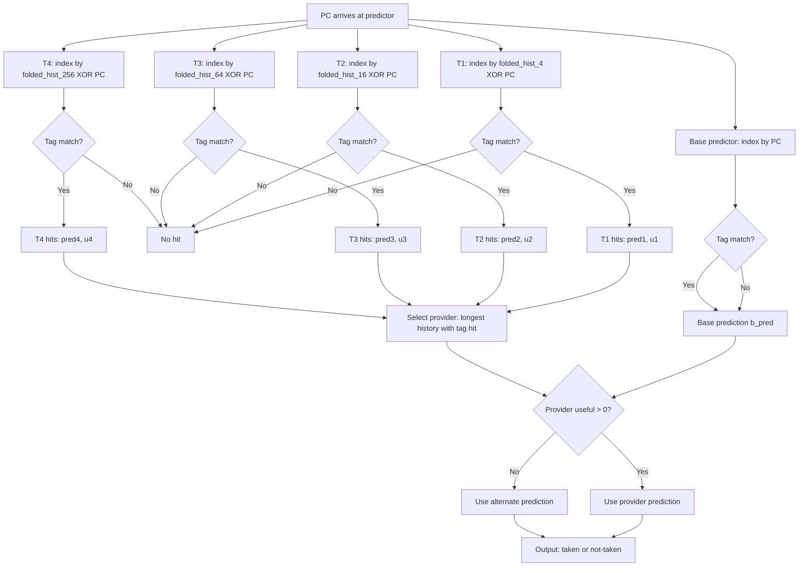

# Branch Prediction -- Deep Dive for CPU Designers

> **Prerequisites**: [CPU_Architecture.md](./CPU_Architecture.md) (pipeline basics, hazards),
> [OoO_Execution.md](./OoO_Execution.md) (speculative execution, reorder buffer)
>
> **Hands-off to**: [Memory.md](./Memory.md) (I-cache design, TLB),
> [Front_End_Design.md](./Front_End_Design.md) (fetch-directed prefetch, decode bandwidth)

---

## Section 0 -- Why This Page Exists

Branch instructions appear every 4--7 instructions in typical integer code. A
15-stage pipeline that resolves branches in stage 10 would squash 9
instructions on every misprediction -- at best a 15-cycle bubble, at worst a
full pipeline flush. The difference between a 95% accurate predictor and a
99% accurate predictor is the difference between wasting 5% versus 1% of all
cycles, which translates directly into 4--8% overall performance on SPEC
int2006.

Interview candidates at Apple, AMD, ARM, Google, Meta, NVIDIA, and RISC-V
startups are regularly asked to:

- Explain the BTB / BHT split and why they are separate structures.
- Walk through gshare indexing and compute a prediction by hand.
- Describe TAGE lookup, provider selection, and allocation policy.
- Design a speculative Return Address Stack with misprediction repair.
- Compute mispredict penalty given pipeline depth and resolution stage.

This page covers all of the above at the depth expected in a CPU design
interview, with worked problems that mirror actual interview questions.

---

## 1. Branch Target Buffer (BTB)

### 1.1 Purpose

The BTB answers one question: **given a branch PC, what is the target PC?**
Without a BTB, the fetch unit cannot know where to redirect until the branch
is decoded and its offset computed -- a delay of 1--3 stages.

### 1.2 Set-Associative Structure

```
BTB Entry Format (typical 28--36 bits):
+----------+-----------+----------+--------+
| Tag      | Target PC | BrType   | Valid  |
| [17:0]   | [31:0]    | [2:0]    | [0]    |
+----------+-----------+----------+--------+

BrType encoding:
  000 = conditional branch
  001 = unconditional jump
  010 = CALL (push to RAS)
  011 = RETURN (pop from RAS)
  100 = indirect jump (target may vary)
```

**Indexing**: `PC[11:2]` provides a 10-bit index into 1024 sets. The tag is
`PC[31:12]` (upper 20 bits). A hit requires both tag match and valid bit set.

**Lookup timing**: BTB access completes in the same cycle as I-cache fetch
(F1 stage). The predicted target is available for the next fetch (F2 stage),
introducing zero extra latency when the prediction is correct.

### 1.3 Multi-Level BTB

Modern cores use a two-level BTB hierarchy, analogous to L1/L2 caches:

| Level | Entries | Latency | Coverage |
|-------|---------|---------|----------|
| L1 BTB | 64--128 | 1 cycle (fetch stage) | hot branches only |
| L2 BTB | 2K--8K | 2--3 cycles (pre-decode) | cold branches, large code |

**L1 BTB**: Accessed every cycle in parallel with the I-cache. Small enough to
stay fast; holds only the most recently used branches.

**L2 BTB**: Accessed in parallel but arrives 1--2 cycles later. On an L1 miss,
the fetch unit continues sequentially. If the L2 hits, a redirect is issued at
that point, costing a 1--2 cycle bubble instead of waiting for decode.

**BTB miss penalty**: If both levels miss, the branch is not recognized until
decode (stage 3--5). The pipeline must then flush the instructions fetched after
the branch and redirect to the computed target. Typical penalty: 3--5 cycles
for a BTB miss that is caught at decode.

### 1.4 BTB Update Policy

When a branch is resolved (execute stage):

1. If the branch was not in the BTB, allocate a new entry (LRU replacement).
2. If the target changed (indirect branch), update the stored target.
3. If the branch is no longer taken after N consecutive not-takens, some
   designs evict the BTB entry to save space for active branches.

---

## 2. Branch History Table (BHT) and gshare

### 2.1 Two-Bit Saturating Counter

The simplest dynamic predictor: each branch maps to a 2-bit saturating counter
that tracks recent behavior.

```
State Machine:

         mispredict          mispredict
   +---> Strongly Taken (11) -------> Weakly Taken (10) ---+
   |          ^                              |              |
   |      correct                        correct           |
   |          |                              v              |
   |    Weakly Taken (10) <--- Strongly Taken (11)          |
   |                                                          |
   |          mispredict          mispredict                 |
   |    Weakly Not-Taken (01) <--- Strongly Not-Taken (00) <-+
   |          ^                              |
   |      correct                        correct
   |          |                              v
   +--- Strongly Not-Taken (00) <--- Weakly Not-Taken (01)

Prediction rule:
  Counter >= 2 (10 or 11) --> predict Taken
  Counter <= 1 (00 or 01) --> predict Not Taken
```

The 2-bit counter requires two consecutive mispredictions before changing the
prediction direction. This provides hysteresis against noisy branches (e.g.,
loop branches that are taken $N-1$ times and not-taken once).

### 2.2 Global History Register (GHR)

The GHR is an $N$-bit shift register recording the outcomes of the most recent
$N$ branches. Convention: bit 0 is the most recent outcome; 1 = taken, 0 =
not-taken.

```
GHR (8-bit example):
  GHR[7:0] = 1 0 1 1 0 1 0 0
              |             |
              oldest      newest

On each branch resolution:
  GHR = { GHR[N-2:0], actual_outcome }   (shift left, insert at LSB)
```

Typical GHR sizes: 8--16 bits for gshare; up to 500+ bits for TAGE components.

### 2.3 gshare Predictor

gshare XORs the GHR with the PC to produce the BHT index. This combines global
history with the branch address to reduce aliasing.

```
Index computation:
  index = PC[11:2] XOR GHR[9:0]     (for a 10-bit index, 1024-entry BHT)

  Example: PC = 0x0040_1A3C, GHR = 0x2A5
    PC[11:2]  = 0b10_1000_1111    = 0x28F
    GHR[9:0]  = 0b10_1010_0101    = 0x2A5
    XOR       = 0b00_0010_1010    = 0x02A  (index into BHT)
```

**Why XOR helps**: A plain PC-indexed BHT maps different branches to fixed
counters. Two branches with different PCs but the same PC[11:2] alias. A plain
GHR-indexed BHT maps different history patterns to fixed counters. Two branches
with the same GHR alias. XOR decorrelates: two branches with the same index
but different GHR values hash to different entries, reducing destructive
aliasing by roughly 30% over pure PC-indexing on SPEC.

### 2.4 BHT Sizing

| Parameter | Typical Value | Storage |
|-----------|--------------|---------|
| Entries | 4096 | -- |
| Counter width | 2 bits | 8192 bits = 1 KB |
| Tag (if tagged) | 0 (untagged) | 0 |
| Total | 4096 x 2b | 1 KB (untagged) |

In practice, the BHT is often untagged (pure gshare). Aliasing is tolerated
because the 2-bit counters self-correct. Tagged variants (e.g., tagged
components in TAGE) add per-entry tags at higher storage cost.

---

## 3. TAGE (TAgged GEometric) Predictor -- State of the Art

TAGE is the dominant predictor in academic and industrial designs since 2014.
It won the CBP (Championship Branch Prediction) competitions and is used in
chips ranging from the SiFive P870 to the Xiangshan Nanhu (open-source RISC-V).

### 3.1 Structure

TAGE consists of one **base predictor** (bimodal) and $M$ **tagged components**
with geometrically increasing history lengths.

```
Component layout (M = 4 example):

  Base (bimodal):  history length = 0,    1024 entries, no tag
  T1:              history length = 4,     128  entries, 8-bit tag
  T2:              history length = 16,    128  entries, 8-bit tag
  T3:              history length = 64,    128  entries, 8-bit tag
  T4:              history length = 256,   128  entries, 8-bit tag

History length geometric ratio: alpha = 2  (each is ~2x the previous)
```

Each tagged component entry stores:

```
+------+--------+---------+--------+
| Tag  | Counter| Useful  | Pred   |
| [7:0]| [2:0]  | [1:0]   | [0]    |
+------+--------+---------+--------+
  Tag:     partial tag for matching (not full PC)
  Counter: 3-bit saturating counter for prediction direction
  Useful:  2-bit counter tracking how often this entry provided a
           correct prediction (confidence)
  Pred:    stored prediction (redundant with counter sign, some
           implementations omit this)
```

### 3.2 Detailed Algorithm Walkthrough

**How multiple base predictors are indexed:**

Each component $T_i$ uses a different geometric history length $L_i$. The index
for component $T_i$ is computed by folding the branch history to the table width
and XORing with the PC:

```
Index computation for component T_i:
  1. Take the global history register (GHR), which is a shift register of
     recent branch outcomes (1 = taken, 0 = not-taken)
  2. For component T_i with history length L_i, use only the most recent L_i bits
     of the GHR
  3. Fold the L_i-bit history to the table index width (log2(N_entries) bits):
        folded_hash = 0
        for j = 0 to L_i-1:
          if GHR[j] == 1:
            folded_hash ^= (PC ^ j) >> (log2(N_entries) * (j / log2(N_entries)))
        Simplified: hash_i = fold(GHR[L_i-1:0], log2(N_entries)) XOR PC[index_bits-1:0]

  4. Tag computation:
        tag_i = fold(GHR[L_i-1:0], tag_width) XOR PC[tag_bits+index_bits-1:index_bits]

  The "folding" is a series of XOR operations that compress a long history into
  a short index/tag. For example, folding a 256-bit history into a 7-bit index:
    index = GHR[6:0] XOR GHR[13:7] XOR GHR[20:14] XOR ... XOR GHR[255:249]
```

**How the "useful" counter works (periodic decay):**

The 2-bit useful counter ($u$) per entry tracks whether the entry is providing
value. Its semantics:

```
  u = 0: entry is newly allocated or has not been useful recently
  u = 1: entry has been useful at least once
  u = 2: entry has been useful multiple times recently
  u = 3: entry is highly useful (most recently, it was the provider and correct)

Update rules (only when provider's prediction differs from alternate):
  - On correct prediction where this component was the provider AND
    the provider's prediction differed from the alternate's:
      u = min(u + 1, 3)
  - On misprediction where this component was the provider AND
    the provider's prediction differed from the alternate's:
      u = max(u - 1, 0)
  - If provider and alternate agreed (same prediction):
      u is unchanged (the provider did not add unique value)

Periodic decay (every 2^18 predictions, ~256K):
  For all entries in all tagged components:
    u = u >> 1   (right-shift by 1)
  This halves all useful counters: 3->1, 2->1, 1->0, 0->0

  Purpose: prevents "sticky" entries that were useful long ago but are now stale.
  Without decay, a useful=3 entry would never be evicted even if the branch
  pattern changed completely. The periodic half-life ensures eventual eviction.

  Why 2^18? Tuned empirically. Too frequent (2^12) -> thrashes good entries.
  Too infrequent (2^24) -> stale entries persist too long, reducing accuracy.
```

**Provider selection (longest matching history):**

```
Given: M tagged components T_1..T_M with history lengths L_1 < L_2 < ... < L_M

Lookup result for each component:
  T_i "hits" if its tag matches and valid=1

Provider = the hitting component with the LARGEST L_i (longest history)
  If no component hits: provider = base bimodal

Alternate (alt) = the hitting component with the second-largest L_i
  If only one component hits: alt = base bimodal
  If no component hits: alt = base bimodal (same as provider)

Final prediction:
  if provider.useful > 0:
    return provider.prediction
  else:
    return alt.prediction   // fall back to less specific but more trusted

Why "longest matching history"? Longer histories capture more context.
A component with L=256 can distinguish 2^256 different branch contexts,
while L=4 can only distinguish 16. The longest matching history provides
the most specific prediction -- but only if it has been trained enough
(useful > 0 checks this).
```

**Allocation on misprediction (which entries to replace):**

When a misprediction occurs and the provider is not the base:

```
Allocation policy:
  1. Identify the components that did NOT hit (no tag match): set Miss = {T_i : tag miss}
  2. From Miss, select up to 3 components for allocation (random selection or
     round-robin across a "allocation pointer" that cycles through components)
  3. For each selected component T_i:
     a. Find an entry to replace in T_i:
        - First choice: entry with u == 0 (not useful, safe to evict)
        - If all entries have u > 0: decrement u of 3 "victim" entries
          (selected by a separate pseudo-random pointer), then pick one
          with u == 0 on the next attempt. This is "u-bit demotion."
     b. Write the new entry:
        tag = partial_tag(PC, GHR_folded)
        counter = weakly_taken (4) if alt predicted taken, or weakly_not-taken
                  (3) if alt predicted not-taken
                  (initialize to WEAKLY AGREE with the alternate's prediction)
        useful = 0  (no confidence yet)

  Why initialize counter to agree with alt? The new entry's useful counter
  is 0, so TAGE will fall back to alt regardless of the counter value.
  Initializing to agree with alt ensures that if the entry's useful counter
  is later incremented (proving its value), the counter direction is neutral
  rather than biased against the known-good alternate prediction. The entry
  will be trained by subsequent branch outcomes to converge on the correct
  prediction for its specific history context.
```

### 3.3 TAGE-SC (Statistical Corrector)

The Xiangshan Nanhu processor extends TAGE with a Statistical Corrector (SC):

- A perceptron-like component that takes the predictions and partial tags from
  all TAGE components as input features.
- Trained on every branch outcome: weight updates push SC's output toward
  correcting TAGE when TAGE was wrong, and toward zero when TAGE was right.
- Overrides the TAGE prediction when SC's confidence exceeds a threshold.
- Improves accuracy by ~0.2--0.4 percentage points on SPEC CPU2006.

**TAGE-SC mechanism in detail:**

```
SC input features (one set per TAGE component):
  - Provider prediction (1 bit: taken/not-taken)
  - Provider useful counter value (2 bits)
  - Partial tag of provider (hash of GHR, ~4 bits)
  - Provider counter value (3 bits, sign indicates direction)

SC computes:
  y = SUM(weights[feature_j]) + bias

  If |y| > threshold AND sign(y) != TAGE_prediction:
    Override: output = sign(y)
  Else:
    Keep TAGE prediction

Threshold tuning: starts at ~20 and adapts based on override accuracy.
If SC overrides are correct > 90% of the time: threshold decreases (more aggressive)
If SC overrides are correct < 60% of the time: threshold increases (more conservative)

Why it works: TAGE occasionally mispredicts branches where the counter values
across components show a pattern (e.g., 3 components say "taken" with low
confidence, 1 says "not-taken" with high confidence, TAGE picks "taken" but
the correct answer is "not-taken"). SC learns these multi-component patterns
that a single provider/alt selection cannot capture.
```

### 3.4 TAGE Index Computation -- Worked Example

**Setup:** TAGE with base bimodal (1024 entries, 10-bit index) + 3 tagged components:
- T1: 128 entries, history length $L_1 = 4$
- T2: 128 entries, history length $L_2 = 16$
- T3: 128 entries, history length $L_3 = 64$

Each tagged component has 128 entries, requiring 7 index bits and 8 tag bits.

```
Branch PC = 0x0040_2000
GHR (64 bits) = 0xB59A_3F0C_7D12_E481 (binary shown LSB-first for history):
  bit 0 (newest) = 1, bit 1 = 0, bit 2 = 0, bit 3 = 0, ...
  In compact form: GHR[3:0] = 0001, GHR[15:0] = 0xC3F0, etc.

Step 1: Base bimodal index
  index_base = PC[11:2] = 0x0040_2000 >> 2 = 0x0010_0800, low 10 bits = 0x000
  (Since 128-entry tables use 7 bits, and base uses 10 bits)

Step 2: T1 index (history length 4)
  Fold GHR[3:0] = 0001 into 7 bits (table index width):
    folded_1 = GHR[3:0] = 0b0001 (already fits in 7 bits, no folding needed)
  index_T1 = folded_1 XOR PC[8:2] = 0b0000001 XOR 0b0000000 = 0b0000001
  tag_T1 = fold(GHR[3:0], 8) XOR PC[16:9] = 0b00000001 XOR ...

Step 3: T2 index (history length 16)
  Fold GHR[15:0] into 7 bits:
    GHR[15:0] = 16 bits, fold: GHR[6:0] XOR GHR[13:7] = 7-bit result
    Example: if GHR[6:0] = 0b1110000 and GHR[13:7] = 0b0101010
    folded_2 = 0b1110000 XOR 0b0101010 = 0b1011010
  index_T2 = folded_2 XOR PC[8:2]

Step 4: T3 index (history length 64)
  Fold GHR[63:0] into 7 bits (requires 9 XOR operations):
    folded_3 = GHR[6:0] XOR GHR[13:7] XOR GHR[20:14] XOR GHR[27:21]
             XOR GHR[34:28] XOR GHR[41:35] XOR GHR[48:42]
             XOR GHR[55:49] XOR GHR[62:56]
    (9 chunks of 7 bits, XOR-reduced to 7 bits)
  index_T3 = folded_3 XOR PC[8:2]

Step 5: Tag computation for each component
  tag_Ti uses a DIFFERENT folding of the GHR than the index, plus
  additional PC bits that are NOT used in the index:
    tag_Ti = fold(GHR[Li-1:0], tag_width) XOR PC[tag_bits+index_bits-1 : index_bits]

Hardware implementation of the folding:
  The folded hash is computed by a tree of XOR gates.
  For T3 (64-bit history -> 7-bit index):
    9 chunks of 7 bits -> 8 XOR gates in a tree (3 levels deep)
    Delay: ~2-3 FO4 total (each XOR gate is ~0.5 FO4 in dynamic logic)
  This folding happens in the same cycle as the table lookup (combinational
  path before the SRAM address decoder).
```

### 3.5 Lookup


flowchart TD
    A[PC arrives at predictor] --> B[Base predictor: index by PC]
    A --> C[T1: index by folded_hist_4 XOR PC]
    A --> D[T2: index by folded_hist_16 XOR PC]
    A --> E[T3: index by folded_hist_64 XOR PC]
    A --> F[T4: index by folded_hist_256 XOR PC]
    B --> G{Tag match?}
    C --> H{Tag match?}
    D --> I{Tag match?}
    E --> J{Tag match?}
    F --> K{Tag match?}
    G -->|No| L[Base prediction b_pred]
    G -->|Yes| L
    H -->|No| M[No hit]
    H -->|Yes| N[T1 hits: pred1, u1]
    I -->|No| M
    I -->|Yes| O[T2 hits: pred2, u2]
    J -->|No| M
    J -->|Yes| P[T3 hits: pred3, u3]
    K -->|No| M
    K -->|Yes| Q[T4 hits: pred4, u4]
    N --> R[Select provider: longest history with tag hit]
    O --> R
    P --> R
    Q --> R
    L --> S{Provider useful > 0?}
    R --> S
    S -->|Yes| T[Use provider prediction]
    S -->|No| U[Use alternate prediction]
    T --> V[Output: taken or not-taken]
    U --> V
```

**Provider**: The tagged component with the longest history length that has a
tag hit. If no tagged component hits, the base bimodal predictor provides the
prediction.

**Alternate (alt)**: The second-longest matching tagged component, or the base
predictor if only one tagged component hits.

**Confidence gating**: If the provider's useful counter is zero (low
confidence), the predictor falls back to the alternate. This prevents a newly
allocated but poorly trained entry from degrading accuracy.

### 3.6 Update Policy

After a branch resolves with actual outcome:

1. **Update the provider counter**: increment if taken, decrement if not-taken
   (3-bit saturating).
2. **Update useful counter**: The useful counter tracks whether the provider's
   contribution actually mattered (i.e., the provider and alternate disagreed):
   - If provider != base AND provider's prediction differed from alternate's:
     - If provider was correct: `u = min(u + 1, 3)`
     - If provider was wrong (misprediction): `u = max(u - 1, 0)`
   - If provider and alternate agreed: no useful update (the provider's entry
     was not the deciding factor, so its usefulness is unchanged).
3. **If mispredicted**: **Allocate** a new entry in 1--3 tagged components that
   did not match (chosen randomly or by longest-empty). The new entry gets the
   tag, a fresh counter initialized to weakly-taken or weakly-not-taken (the
   opposite of the alternate's prediction), and a useful counter of zero.
4. **Periodic useful decay**: Every $2^{18}$ predictions, halve all useful
   counters to allow eviction of stale entries.

### 3.7 Accuracy

| Benchmark Suite | TAGE (8 components) | TAGE-SC-L (Xiangshan) |
|-----------------|---------------------|------------------------|
| SPEC INT 2006 | 3.0 MPKI (mispredicts per 1000 instructions) | 2.4 MPKI |
| SPEC INT 2017 | 4.2 MPKI | 3.5 MPKI |
| Accuracy (INT 2006) | ~99.0% | ~99.2% |

---

## 4. Perceptron Predictor

### 4.1 Mechanism

The perceptron predictor treats branch prediction as a binary classification
problem. For each branch (indexed by PC), a set of $N$ weights is maintained,
where $N$ equals the GHR length.

```
Prediction:
  GHR = {b_1, b_2, ..., b_N}  where b_i in {-1, +1}
  W_j = {w_1, w_2, ..., w_N}  weights for branch j

  y_out = w_0 + SUM(i=1..N) w_i * b_i

  Predict TAKEN     if y_out >= 0
  Predict NOT-TAKEN if y_out <  0

Training (on mispredict or low confidence):
  t = +1 if actual was Taken, -1 if Not-Taken
  if sign(y_out) != sign(t):
    for i = 0 to N:
      w_i = w_i + t * b_i      (perceptron learning rule, clamped to [-256, 255])
```

**Bias weight** ($w_0$): Always has $b_0 = +1$. Captures the branch's base
direction (taken-biased or not-taken-biased).

### 4.2 Properties

- **Captures long correlations**: A perceptron with $N = 32$ can learn
  correlations spanning 32 branches back. Linearly separable patterns are
  learned perfectly.
- **Cannot learn XOR**: A single-layer perceptron cannot represent non-linearly
  separable functions (e.g., XOR of two history bits). This limits accuracy on
  pathological patterns.
- **Storage**: 4096 branches x 33 weights x 8 bits = 132 KB -- much larger
  than gshare's 1 KB. This is the primary reason perceptrons are not used in
  L1 predictors in commercial silicon.
- **Accuracy**: ~97% on SPEC INT (2-bit saturating counter) to ~97.5% with
  8-bit weights.

### 4.3 Perceptron Worked Example -- Full Weight Matrix and Computation

**Setup:**

Consider a perceptron predictor with $N = 4$ history bits (for clarity; real
designs use $N = 16$--$64$). Weights are 8-bit signed integers ($-128$ to $+127$).
A branch at PC = `0x4000` has the following weight vector (trained over many
iterations):

```
Weight table for branch at PC=0x4000:
  w_0 (bias) = +18
  w_1        = -30
  w_2        = +45
  w_3        = -12
  w_4        = +25

GHR (4 bits): b1 b2 b3 b4 = +1  -1  +1  +1
  (Recent history: T, NT, T, T)
```

**Dot product computation:**

$$
y_{out} = w_0 \cdot (+1) + \sum_{i=1}^{4} w_i \cdot b_i
$$

```
  y_out = w_0 * (+1) + w_1 * b_1 + w_2 * b_2 + w_3 * b_3 + w_4 * b_4
        = (+18)*(+1) + (-30)*(+1) + (+45)*(-1) + (-12)*(+1) + (+25)*(+1)
        =    18       +   (-30)     +   (-45)     +   (-12)     +   25
        = 18 - 30 - 45 - 12 + 25
        = -44
```

**Threshold comparison:**

$$
\text{threshold} = \lfloor 1.93 \cdot N + 14 \rfloor = \lfloor 1.93 \cdot 4 + 14 \rfloor = 21
$$

```
  y_out = -44
  |y_out| = 44 > threshold = 21  -> high confidence prediction
  y_out < 0 -> predict NOT TAKEN
```

**Actual outcome: Suppose the branch is actually TAKEN (misprediction).**

**Weight update rule (perceptron learning):**

$$
w_i \leftarrow w_i + t \cdot b_i \quad \text{(clamped to [-128, 127])}
$$

where $t = +1$ if actual was taken, $t = -1$ if not-taken. Note: update only
when mispredicted OR when $|y_{out}| \leq \text{threshold}$ (low confidence).

```
  t = +1  (actual was taken)

  w_0 = 18  + (+1)*(+1) = 19
  w_1 = -30 + (+1)*(+1) = -29
  w_2 = 45  + (+1)*(-1) = 44
  w_3 = -12 + (+1)*(+1) = -11
  w_4 = 25  + (+1)*(+1) = 26

  Updated weights: [19, -29, 44, -11, 26]
```

**Next occurrence of the same branch, same GHR pattern:**

```
  y_out = 19*(+1) + (-29)*(+1) + 44*(-1) + (-11)*(+1) + 26*(+1)
        = 19 - 29 - 44 - 11 + 26
        = -39

  |y_out| = 39 > 21  -> still predicts NOT TAKEN
  Still wrong! The weights need more updates to flip the sign.
```

**After several more corrections (same GHR pattern, actual always TAKEN):**

```
  After 5 updates total for this pattern:

  Weights converge toward positive y_out:
  w_0 = 23,  w_1 = -25,  w_2 = 39,  w_3 = -7,  w_4 = 30

  y_out = 23 - 25 - 39 - 7 + 30 = -18

  After 10 total updates:
  w_0 = 28,  w_1 = -20,  w_2 = 34,  w_3 = -2,  w_4 = 35

  y_out = 28 - 20 - 34 - 2 + 35 = +7

  y_out > 0 -> predict TAKEN  (now correct!)
  |y_out| = 7 < threshold = 21  -> low confidence, still eligible for updates
```

**Key observations from this worked example:**

1. The perceptron is essentially a weighted vote of each history bit. Positive
   weights mean "this history bit being taken supports taken," negative weights
   mean the opposite.
2. The bias weight $w_0$ captures the branch's overall bias (taken vs not-taken
   regardless of history).
3. Convergence requires multiple mispredictions for the same pattern -- this is
   the perceptron's weakness compared to TAGE, which allocates a correct entry
   on the first misprediction.
4. The threshold mechanism prevents over-training: high-confidence predictions
   are not updated, even if wrong occasionally.

### 4.4 Perceptron Worked Example -- Multi-Branch Correlated Prediction

This example shows how the perceptron captures **cross-branch correlations** through
the shared GHR. Two branches at different PCs have different weight vectors but read
from the same history.

**Setup:** N = 3 history bits, 8-bit signed weights, threshold = 21.

```
Initial state (all weights zero):
  Branch A (PC=0x1000): w0=0, w1=0, w2=0, w3=0
  Branch B (PC=0x2000): w0=0, w1=0, w2=0, w3=0
  GHR = [0, 0, 0] (cold start)
```

**Execution sequence (showing correlation learning):**

```
Step 1: Branch A at PC=0x1000, GHR = [0, 0, 0]
  y_A = 0*1 + 0*(-1) + 0*(-1) + 0*(-1) = 0
  |y_A| = 0 <= threshold -> low confidence, eligible for update
  Predict: y_A >= 0 -> TAKEN (tie-break)
  Actual: NOT-TAKEN (mispredict, t = -1)

  Update Branch A weights:
    w0 = 0 + (-1)*(+1) = -1
    w1 = 0 + (-1)*(-1) = +1   (GHR bit b1 = 0 -> b1_in{-1,+1} = -1)
    w2 = 0 + (-1)*(-1) = +1
    w3 = 0 + (-1)*(-1) = +1
  GHR = [0, 0, 0] -> shift in actual=0 -> GHR = [0, 0, 0] (unchanged for this example)

Step 2: Branch B at PC=0x2000, GHR = [0, 0, 0]
  y_B = 0*1 + 0*(-1) + 0*(-1) + 0*(-1) = 0
  Predict: TAKEN (tie-break)
  Actual: TAKEN (correct!)
  GHR = [0, 0, 1] (shift in actual=1)

Step 3: Branch A at PC=0x1000, GHR = [0, 0, 1]  -> b = [-1, -1, +1]
  y_A = (-1)*(+1) + (+1)*(-1) + (+1)*(-1) + (+1)*(+1)
      = -1 + (-1) + (-1) + 1 = -2
  |y_A| = 2 <= 21 -> low confidence
  Predict: y_A < 0 -> NOT-TAKEN
  Actual: NOT-TAKEN (correct!)
  No weight update (correct prediction, low confidence -> still update)
  GHR = [0, 1, 0] (shift in actual=0)

Step 4: Branch B at PC=0x2000, GHR = [0, 1, 0]  -> b = [-1, +1, -1]
  y_B = 0*(+1) + 0*(-1) + 0*(+1) + 0*(-1) = 0
  Predict: TAKEN (tie-break)
  Actual: NOT-TAKEN (mispredict, t = -1)

  Update Branch B weights:
    w0 = 0 + (-1)*(+1) = -1
    w1 = 0 + (-1)*(-1) = +1
    w2 = 0 + (-1)*(+1) = -1
    w3 = 0 + (-1)*(-1) = +1
  GHR = [1, 0, 0] (shift in actual=0)

Step 5: Branch A at PC=0x1000, GHR = [1, 0, 0]  -> b = [+1, -1, -1]
  y_A = (-1)*(+1) + (+1)*(+1) + (+1)*(-1) + (+1)*(-1)
      = -1 + 1 + (-1) + (-1) = -2
  |y_A| = 2 <= 21 -> low confidence
  Predict: NOT-TAKEN
  Actual: NOT-TAKEN (correct!)
  GHR = [0, 0, 0] (shift in actual=0)

... (after many more iterations, weights converge)

After 50 encounters:
  Branch A weights: w0=-8, w1=+12, w2=-5, w3=+3
    Meaning: Branch A tends to be NOT-TAKEN (negative bias w0=-8)
    but is TAKEN when the 2nd-most-recent branch was TAKEN (w1=+12)

  Branch B weights: w0=+6, w1=-3, w2=+10, w3=-2
    Meaning: Branch B tends to be TAKEN (positive bias w0=+6)
    and is especially TAKEN when the 3rd-most-recent branch was TAKEN (w2=+10)
```

The perceptron learns the *joint correlation* between branches A and B through
the shared GHR: Branch A's outcome depends on what Branch B did recently (and
vice versa), encoded in the per-PC weight vectors. A bimodal predictor or
2-bit counter cannot capture this cross-branch correlation at all -- it would
track each branch independently.

### 4.5 Piecewise Linear / Multiperceptron

An extension that maintains separate weight tables per partial history pattern,
achieving ~98.5% accuracy. Used in some CBP competition entries but considered
too expensive for production hardware.

---

## 5. Tournament Predictor

### 5.1 Architecture

The tournament predictor (Alpha 21264, 1996) maintains three sub-predictors and
a per-branch selector that chooses which predictor to trust.

```mermaid
flowchart TD
    A[PC + GHR] --> B[Bimodal Predictor]
    A --> C[Global Predictor -- gshare]
    A --> D[Local Predictor -- 2-level adaptive]
    A --> E[Selector Table]
    B --> F[Pred_bimodal]
    C --> G[Pred_global]
    D --> H[Pred_local]
    E --> I{Selector counter >= 2?}
    I -->|Yes| J[Choose global or local based on counter value]
    I -->|No| K[Choose bimodal]
    J --> L[MUX: final prediction]
    K --> L
    F --> L
    G --> L
    H --> L
    L --> M[Output prediction]
```



**Sub-predictors**:

1. **Bimodal**: PC-indexed 2-bit counter table (1024 entries). Good for
   strongly biased branches.
2. **Global (gshare)**: GHR XOR PC index into 2-bit counter table (4096
   entries). Good for correlated branches.
3. **Local (2-level adaptive)**: First level: PC-indexed into a 10-bit local
   history register (LHR) per branch. Second level: LHR indexes a 2-bit
   counter table (1024 entries). Good for repeating patterns like
   T,T,T,NT.

**Selector**: A 2-bit saturating counter per branch (PC-indexed, 4096 entries).
Encoding:
- 00, 01: choose bimodal
- 10: choose global
- 11: choose local

### 5.2 Alpha 21264 Parameters

| Component | Entries | Bits/Entry | Total Storage |
|-----------|---------|------------|---------------|
| Bimodal | 1024 | 2 | 256 B |
| Global counter table | 4096 | 2 | 1 KB |
| GHR | 1 | 12 | 12 bits |
| Local history table | 1024 | 10 | 1.25 KB |
| Local counter table | 1024 | 2 | 256 B |
| Selector | 4096 | 2 | 1 KB |
| **Total** | -- | -- | **~4 KB** |

### 5.3 Accuracy

~96.5% on SPEC INT95, ~97% on SPEC INT2000. Surpassed by TAGE after 2006 but
remains a reference design taught in every architecture course.

---

## 6. Return Address Stack (RAS)

### 6.1 Purpose

CALL instructions push the return address; RETURN instructions pop it. Without
a RAS, the BTB must predict the target of every return, but returns have a
different target each time (the instruction after the corresponding CALL). The
RAS provides a single-cycle, cycle-accurate prediction for returns.

### 6.2 Circular Buffer Implementation

```
RAS: circular buffer of 16--32 entries (most common: 16 for mobile, 32 for
     desktop/server). Top pointer (4--5 bits).

Data structure (32-entry example):
  ┌──────────┬──────────┬──────────┬──────────┐
  │ RAS[0]   │ RAS[1]   │  ...     │ RAS[31]  │
  │ addr[63] │ addr[63] │          │ addr[63] │
  └──────────┴──────────┴──────────┴──────────┘
                    ^
                    |
                   Top (5-bit pointer)

  Each entry: 64-bit return address (RV64) or 32-bit (RV32)

On CALL (decoded or predicted):
  RAS[Top] = PC + 4 (or PC + 2 for compressed ISAs like RVC)
  Top = (Top + 1) mod 32

On RETURN (decoded or predicted):
  Top = (Top - 1) mod 32
  predicted_target = RAS[Top]

Hardware:
  - SRAM array: 32 entries x 64 bits = 256 bytes
  - 1 write port (push) and 1 read port (pop) -- single-ported SRAM sufficient
  - Top pointer: 5-bit register with increment/decrement logic
  - Total timing: 1 cycle for push/pop + target read
```

**Why 16-32 entries?**

Typical call depth in software:
- C/C++: 5-15 levels deep (main -> function -> helper -> utility -> leaf)
- JavaScript/Python: 8-20 levels (interpreter dispatch + recursive calls)
- OS kernel: 10-25 levels (syscall -> VFS -> filesystem -> block driver)

A 16-entry RAS covers >95% of call depths in SPEC benchmarks. A 32-entry RAS
covers >99.9%. Going beyond 32 has diminishing returns and increases access
latency (larger SRAM).

### 6.3 Speculative RAS with Misprediction Repair

The fetch unit pushes and pops the RAS speculatively before branches are
resolved. On a misprediction, the RAS state must be restored.

**Checkpoint approach**: On every branch that modifies the RAS (CALL/RETURN),
save the current Top pointer in the reorder buffer (ROB) entry. On a pipeline
flush, walk the ROB or use the checkpoint from the mispredicted branch to
restore Top.

```
Example: 32-entry RAS, speculative depth = 3

Initial state:  Top = 4, RAS = {_, _, _, _, 0x8000, ...}

CALL foo      --> push 0x4008, Top = 5
  Checkpoint: save Top=4 in ROB entry
CALL bar      --> push 0x5004, Top = 6
  Checkpoint: save Top=5 in ROB entry
RET           --> pop, Top = 5, predict target = 0x5004
  Checkpoint: save Top=6 in ROB entry

Misprediction detected at the second CALL (bar):
  Restore Top from ROB checkpoint = 5
  RAS state: {_, _, _, _, 0x8000, 0x4008, ...}
  The incorrect push of 0x5004 is effectively discarded.
```

**Full speculative RAS design:**

There are two approaches to making the RAS speculative:

```
Approach 1: Top-pointer checkpoint only (most common, used in ARM and RISC-V cores)

  - Save only the Top pointer in the ROB on each CALL/RETURN
  - On misprediction: restore Top from checkpoint
  - Data in RAS entries is NOT restored (stale data left in popped entries)
  - Correct because: stale entries are beyond Top and will be overwritten

  Storage: 5 bits per ROB entry (for 32-entry RAS) = negligible
  Latency: 1 cycle to restore (just load Top register)

  Limitation: if a mispredicted path pushes N values and then pops them,
  the stale pushed values remain in the RAS. If the correct path pushes
  new values, they overwrite the stale ones. But if the stale entries
  happen to be between valid entries, a future pop on the correct path
  might read a stale value. This is called "RAS corruption."

  Mitigation: also save the RAS data for each CALL (not just Top) in a
  checkpoint buffer. On restore, write back the saved data. More expensive
  but eliminates corruption.

Approach 2: Free checkpoint RAS (used in Intel P-cores)

  - Maintain a separate "shadow RAS" for speculative state
  - On branch prediction: save the entire RAS + Top into a checkpoint buffer
  - Number of checkpoints: 4-8 (one per outstanding branch prediction)
  - On misprediction: restore entire RAS from checkpoint (all 32 entries)
  - Eliminates RAS corruption completely

  Storage: 4-8 checkpoints x (32 entries x 64 bits + 5-bit Top) = ~8 KB
  Latency: 1 cycle to restore (mux the checkpoint into the active RAS)
```

### 6.4 RAS Overflow and Underflow

- **Overflow**: When Top wraps around and overwrites an old entry. The oldest
  return address is lost. Mitigation: increase RAS depth (32--64 is typical),
  or add a secondary overflow buffer in L2.

```
Overflow detection and handling:

  On push: Top_new = (Top + 1) mod DEPTH
    if Top_new == Bottom:  // RAS is full, oldest entry will be overwritten
      Bottom = (Bottom + 1) mod DEPTH  // advance bottom, lose oldest entry
    RAS[Top] = return_addr
    Top = Top_new

  Some designs track an "overflow count" and use it to restore on pop:
    if overflow_count > 0:
      // we lost some entries, the next pop might be wrong
      // fall back to BTB prediction instead of RAS
      overflow_count -= 1

  Intel's implementation: RAS overflow sets a "poison" flag. All subsequent
  RAS predictions are treated as low-confidence. The flag clears when enough
  returns have been processed to drain the overflowed entries.
```

- **Underflow**: When a RETURN is encountered with Top = 0. The RAS is empty;
  fall back to BTB prediction. Rare in practice (indicates unbalanced CALL/RET).

```
Underflow handling:

  On pop: Top_new = (Top - 1) mod DEPTH
    if Top == Bottom:  // RAS is empty
      predicted_target = BTB_target  // fall back
      // Do NOT decrement Top (would wrap to 31, reading garbage)
    else:
      Top = Top_new
      predicted_target = RAS[Top]

  Underflow typically indicates:
    - Exception handler return without matching call
    - Longjmp / setjmp (non-local goto)
    - Corrupted RAS from speculative execution bug

  On underflow: some designs increment a counter and suppress further pops
  until a matching push arrives (CALL).
```

**RAS misprediction rate:**

| RAS Size | Overflow Rate (SPEC INT) | Misprediction Rate |
|----------|--------------------------|-------------------|
| 8 entries | 2-5% | 1-3% of all returns |
| 16 entries | 0.1-1% | 0.1-0.5% |
| 32 entries | <0.01% | <0.05% |
| 64 entries | ~0% | ~0% |

Returns account for ~15% of all branches, so RAS mispredictions contribute
<0.1% to overall branch misprediction rate with a 32-entry RAS.

### 6.5 RAS Interaction with Branch Predictor Checkpoints

In a deeply speculative processor with 16+ outstanding branch predictions, the
RAS must be rolled back on any misprediction among the 16. The interaction between
RAS checkpointing and the branch predictor's checkpoint mechanism is as follows:

```
Checkpoint structure (per branch prediction):
  branch_checkpoint[k] = {
    RAT_snapshot,           // register alias table
    freelist_head,          // free list pointer
    RAS_top,                // RAS Top pointer (5 bits)
    RAS_top_entry,          // RAS[Top] data (64 bits, for CALL repair)
    FTQ_tail,               // fetch target queue pointer
    GHR_snapshot            // global history register
  }

On CALL prediction:
  1. Save RAS_top and RAS[RAS_top] into the current branch checkpoint
  2. RAS[RAS_top] = PC + 4 (return address)
  3. RAS_top = (RAS_top + 1) % DEPTH

On RETURN prediction:
  1. Save RAS_top into the current branch checkpoint
  2. RAS_top = (RAS_top - 1) % DEPTH
  3. Predicted target = RAS[RAS_top]

On misprediction recovery (branch checkpoint k is invalid):
  1. Restore RAS_top from checkpoint[k].RAS_top
  2. Restore RAS[RAS_top] from checkpoint[k].RAS_top_entry
     (only needed if a CALL in the wrong path wrote to this entry)
  3. Invalidate all checkpoints younger than k
  4. All RAS entries at indices >= restored RAS_top are stale (ignored)

Storage cost per checkpoint:
  RAS_top: 5 bits
  RAS_top_entry: 64 bits
  Total RAS-related: 69 bits per checkpoint
  For 16 checkpoints: 16 * 69 = 1104 bits = ~140 bytes (negligible)

Why save RAS_top_entry:
  Without saving the data, a mispredicted CALL that pushed a wrong return
  address would leave stale data in the RAS. On restore, the Top pointer
  points to the entry that was overwritten. Restoring the data ensures
  the entry contains the correct return address from before the misprediction.
  Without this, a subsequent RETURN on the correct path would pop the
  wrong address -> RAS misprediction -> pipeline flush -> performance loss.
  This is the "RAS corruption" problem mentioned in Approach 1 above.
```

**Alternative: unified shadow RAS with checkpoint index stacking:**

Some designs (notably ARM Cortex-X series) use a "shadow RAS" approach where
each checkpoint stores a complete copy of the RAS rather than just the Top
pointer. This eliminates corruption entirely but costs:

```
16 checkpoints x (32 entries x 64 bits + 5-bit Top) = ~4 KB
vs. pointer-only: 16 x 69 bits = ~140 bytes
```

The 28x area increase is justified only in cores with very deep speculation
(20+ outstanding branches) where RAS corruption from pointer-only repair would
cause measurable performance loss. For most designs, pointer-only repair with
data save at the checkpoint entry achieves the same accuracy at far lower cost.

---

## 7. Indirect Branch Prediction

### 7.1 The Problem

Indirect branches (jump to register, virtual function dispatch, switch
statements compiled to jump tables) have targets that vary at runtime. The BTB
stores only one target per PC, so it frequently mispredicts indirect branches
that have multiple targets.

### 7.2 Indirect Target Cache

A small fully-associative or set-associative cache that stores multiple
targets per branch PC. Indexed by PC + partial history.

```
Indirect Target Cache Entry:
+----------+------+-----------+--------+
| Tag      | Hist | Target PC | Valid  |
| [15:0]   | [3:0]| [31:0]    | [0]    |
+----------+------+-----------+--------+

Lookup:  match on (Tag == PC[31:16]) AND (Hist == recent_target_history)
```

A 2-bit history of recent targets (which of 4 possible targets was used last)
helps disambiguate. Accuracy for indirect branches: ~85--92% with this scheme.

### 7.3 ITTAGE

ITTAGE extends TAGE from direction prediction to target prediction. The same
tagged-geometric structure is used, but each entry stores a target PC instead
of a direction counter.

- **Used in Xiangshan Nanhu**: ITTAGE with 4 tagged components.
- **Accuracy**: ~95% for indirect branches on SPEC INT, up from ~85% with a
  simple BTB.
- **Cost**: Each entry stores a 32-bit target + tag + useful bits = ~50 bits
  per entry. 4 components x 256 entries = ~6.4 KB.

---

## 8. Fetch Unit Architecture

### 8.1 How BTB, Direction Predictor, RAS, and Target Buffer Interact Per Cycle

The fetch unit is a pipeline of prediction structures that must all produce
results in a single cycle (or be carefully pipelined). Here is the per-cycle
interaction:

```
Fetch cycle timing:

  Clock edge: PC register updated

  Phase 1 (combinational, ~200ps):
    - PC sent to:  BTB (L1), Direction predictor (BHT/TAGE), RAS, I-cache
    - All lookups happen in PARALLEL (same cycle)

  Phase 2 (BTB result available, ~400ps):
    - BTB returns: {hit, target, branch_type}
    - If BTB hit AND branch_type == RETURN:
        RAS pop -> predicted_target = RAS[Top]
        RAS speculatively updates: Top = Top - 1
    - If BTB hit AND branch_type == CALL:
        RAS push: RAS[Top] = PC+4; Top = Top + 1

  Phase 3 (direction predictor result available, ~600ps):
    - TAGE/BHT returns: {taken/not-taken, confidence}
    - Combine with BTB:
        if BTB.hit AND direction == taken:
          next_PC = BTB.target (or RAS target for returns)
        elif BTB.hit AND direction == not-taken:
          next_PC = PC + fetch_width
        elif !BTB.hit:
          next_PC = PC + fetch_width  (sequential, no branch here)

  Phase 4 (I-cache result available, ~800ps):
    - I-cache returns instruction bytes for current PC
    - Pre-decoder scans for branches within the fetch block
    - If a branch is found that was NOT predicted by the BTB (BTB miss):
        - Compute target from immediate field
        - This is a "late" redirect: 1-2 cycle bubble

  End of cycle:
    - PC register loaded with next_PC
    - RAS speculatively updated for any CALL/RETURN in this fetch block
    - FTQ entry pushed with prediction metadata
```

**Sequential fetch vs taken-path redirect:**

```
Sequential fetch (no branch or not-taken prediction):
  Cycle 0: PC=0x1000, fetch 4 instructions, next_PC=0x1010
  Cycle 1: PC=0x1010, fetch 4 instructions, next_PC=0x1020
  Cycle 2: PC=0x1020, fetch 4 instructions, next_PC=0x1030
  Throughput: 4 instructions/cycle (full bandwidth)

Taken-path redirect (branch predicted taken):
  Cycle 0: PC=0x1000, BTB hit: branch at 0x1004 targets 0x2000
           Fetch instructions at 0x1000..0x1003 (before branch)
           Direction predictor says TAKEN
           next_PC = 0x2000 (redirect)
  Cycle 1: PC=0x2000, fetch 4 instructions from new target
  Throughput: 4 instructions at 0x1000-1003, then 4 at 0x2000-2003
              Only the instructions BEFORE the branch in the fetch block are useful
              (e.g., 1 instruction if branch is at offset +4)

Taken-path redirect with RAS (CALL instruction):
  Cycle 0: PC=0x1000, BTB hit: CALL at 0x1000 targets 0x3000
           RAS push: RAS[Top] = 0x1004 (return address)
           next_PC = 0x3000
  Cycle 1: PC=0x3000, fetch from callee
  ...
  Later: RETURN at 0x3050
           BTB hit: RETURN type
           RAS pop: predicted_target = 0x1004
           next_PC = 0x1004 (back to caller)
```

### 8.2 Fetch Bandwidth and Multiple Branches Per Fetch Block

**Fetch bandwidth:** Modern OoO cores fetch 4-8 instructions per cycle (16-32
bytes for fixed-length ISAs, variable for x86). The fetch block may contain
multiple branches.

**Handling multiple branches per fetch block:**

When a 32-byte fetch block (8 instructions) contains 2 or more branches, the
fetch unit must resolve them in priority order:

```
Fetch block at PC=0x1000 (8 instructions):

  0x1000: ADD  ...       (not a branch)
  0x1004: BEQ  x1,x2,A  (branch 1, target 0x2000)
  0x1008: LW   ...       (not a branch)
  0x100C: JAL  x1,B      (branch 2, target 0x3000, unconditional)
  0x1010: SUB  ...
  0x1014: BNE  x3,x4,C  (branch 3, target 0x4000)
  0x1018: ADD  ...
  0x101C: ADD  ...

Rules:
  1. BTB reports all branch hits in the fetch block (up to 2-3 per cycle)
  2. Direction predictor provides taken/not-taken for each
  3. First taken branch (lowest address) truncates the fetch block:
     - Branch 1 at 0x1004 is predicted TAKEN
     - Only instructions 0x1000-0x1004 are valid (2 instructions)
     - Branch 2 at 0x100C is NOT reached this cycle
     - next_PC = 0x2000

  4. If branch 1 is predicted NOT-TAKEN:
     - Branch 2 at 0x100C is unconditional (always taken)
     - Instructions 0x1000-0x100C are valid (4 instructions)
     - next_PC = 0x3000

  5. If neither branch is taken:
     - Branch 3 at 0x1014 predicted NOT-TAKEN
     - All 8 instructions are valid
     - next_PC = 0x1020 (sequential)
```

**Hardware support for multi-branch fetch:**

| Design | Branches Per Fetch Block | Mechanism |
|--------|--------------------------|-----------|
| Simple (1 branch/cycle) | 1 | BTB returns only the lowest-address branch; others deferred to next cycle |
| Moderate (2 branches/cycle) | 2 | BTB has 2 read ports or returns top-2 hits; predictor evaluates both |
| Advanced (unlimited) | All | Pre-decoder identifies all branches; predictor evaluates in priority order. Used in Apple M-series and Intel Golden Cove |

The "1 branch per cycle" design is simplest but wastes fetch bandwidth when the
first branch in the block is not-taken (the second branch's taken redirect is
only discovered in the next cycle, costing a 1-cycle bubble).

**Multiple branches per cycle and RAS interaction:**

When a fetch block contains both a CALL and a RETURN (or multiple CALLs), the
RAS must be updated multiple times in a single cycle. This creates a sequencing
problem: the CALL pushes a return address, and a subsequent RETURN pops it, but
both happen in the same fetch cycle.

```
Fetch block (8 instructions):
  0x1000: CALL foo   <- push 0x1004
  0x1004: CALL bar   <- push 0x1008
  0x1008: ...        <- first instruction of bar

Processing:
  1. BTB reports two CALL instructions at offsets 0x1000 and 0x1004
  2. Both are unconditional (always taken)
  3. First taken branch (0x1000) truncates the fetch block
  4. Only the CALL at 0x1000 is processed this cycle
  5. RAS push: RAS[Top] = 0x1004, Top++
  6. next_PC = foo's target (from BTB)

  The CALL at 0x1004 is NOT reached this cycle (it is after the first taken
  branch in the fetch block). It will be fetched in a subsequent cycle when
  execution reaches 0x1004 (if it ever does -- in this example it does not,
  because the first CALL redirects to foo).

Corner case: CALL immediately followed by RETURN in the same fetch block:
  0x1000: CALL foo   <- push 0x1004
  0x1004: RET        <- pop 0x1004

  If the CALL is predicted taken: next_PC = foo. RET is not processed.
  If the CALL is predicted not-taken (unusual): RET at 0x1004 is processed.
    RAS push (CALL) then RAS pop (RET) -> net effect: RAS unchanged.
    Hardware must apply these operations in program order within the cycle.

Advanced design (Apple M-series, 2 branches per cycle):
  The BTB has 2 read ports, returning the 2 lowest-address branch hits.
  The direction predictor evaluates both. If the first is not-taken, the
  second is evaluated. RAS updates are serialized:
    1. Process branch 1 (push/pop RAS if CALL/RET)
    2. Process branch 2 using updated RAS state from step 1
  This requires the RAS to support 2 operations per cycle with read-after-
  write forwarding within the same cycle (the second operation sees the
  result of the first). Implementation: the RAS uses a register file with
  2 write ports and combinational bypass from write port 1 to read port 2.
```

### 8.3 Fetch-Directed Prefetch

The branch predictor provides the next-PC *before* the I-cache is accessed.
This allows the fetch unit to prefetch the target cache line in parallel with
the current fetch.

```
Cycle 0: Fetch PC=0x1000.  BTB hit: target=0x2000.
          I-cache access for 0x1000.
          Issue prefetch for I-cache line containing 0x2000.

Cycle 1: Fetch PC=0x1004.  I-cache returns line for 0x1000.
          Prefetch for 0x2000 arrives in line-fill buffer.

Cycle 2: Branch taken confirmed. Fetch PC=0x2000.
          I-cache hit (prefetched). Zero bubble on taken branch.
```

### 8.4 Dual Fetch Path

High-performance cores fetch from two addresses per cycle:

1. **Sequential path**: PC + 16 (next sequential cache line).
2. **Predicted target path**: BTB target.

Both accesses issue to the I-cache in parallel (dual-ported or banked I-cache).
If the branch is predicted taken, the target-path result is selected. If
not-taken, the sequential-path result is selected. This hides the I-cache
latency for correctly predicted branches.

### 8.5 I-Cache Miss Handling

On an I-cache miss:

1. The line-fill buffer allocates an entry and issues a request to L2.
2. **Critical-word-first**: The cache line sector containing the requested PC
   is returned first and forwarded to the fetch unit immediately.
3. The remaining sectors of the cache line arrive in subsequent cycles.
4. Typical L1 I-cache miss penalty: 8--15 cycles (L2 hit), 40--100 cycles
   (L2 miss, DRAM access).

### 8.6 Fetch Bandwidth

| Design | Fetch Width | Instructions/Cycle | Alignment |
|--------|------------|-------------------|-----------|
| In-order single-issue | 4 bytes | 1 | N/A |
| 4-wide superscalar | 16 bytes | 4 | Align from I-cache line boundary |
| 6--8 wide OoO | 32 bytes | 6--8 | Multi-line fetch, branch prediction boundary |

The fetch unit must handle branches that fall mid-cache-line. On a predicted
taken branch at byte offset +8, the fetch unit extracts only the 2 instructions
before the branch and redirects to the target for the next cycle.

---

## 9. Prediction Accuracy Comparison

### 9.1 Across Predictor Types

| Predictor | Storage | SPEC INT 2006 MPKI | Accuracy (%) | Complexity |
|-----------|---------|---------------------|--------------|------------|
| Static (always not-taken) | 0 | 20--25 | 75--80 | None |
| Bimodal (2-bit) | 1 KB | 12--15 | 85--88 | Trivial |
| gshare (12-bit GHR) | 2 KB | 8--11 | 89--92 | Low |
| Perceptron (N=32) | 132 KB | 5--7 | 93--95 | Medium |
| Tournament (Alpha 21264) | 4 KB | 6--9 | 91--94 | Medium |
| TAGE (4 components) | 8 KB | 3--4 | 96--97 | Medium-High |
| TAGE (8 components) | 16 KB | 2.5--3.5 | 97--99 | High |
| TAGE-SC-L | 32 KB | 2--3 | 98.5--99.2 | Very High |

### 9.2 Across Benchmark Categories

| Category | Branch Frequency | TAGE MPKI | Hardest Branch Type |
|----------|-----------------|-----------|---------------------|
| SPEC INT 2006 (mcf) | 1 per 4 inst | 5.2 | Data-dependent indirect |
| SPEC INT 2006 (gcc) | 1 per 5 inst | 3.8 | Virtual dispatch |
| SPEC INT 2006 (perlbench) | 1 per 6 inst | 2.9 | Interpreter switch |
| SPEC FP 2006 | 1 per 20 inst | 0.3 | Loop exit branches |
| Server (web) | 1 per 7 inst | 4.1 | Function pointers |
| Mobile (UI) | 1 per 6 inst | 3.5 | Event dispatch |

---

## 10. Numbers to Memorize

| Parameter | Value | Notes |
|-----------|-------|-------|
| Branch frequency (INT) | 1 per 4--7 instructions | 15--25% of all instructions |
| Branch frequency (FP) | 1 per 15--25 instructions | Much lower |
| L1 BTB entries | 64--128 | 1-cycle latency |
| L2 BTB entries | 2K--8K | 2--3 cycle latency |
| BHT entries (gshare) | 4K | 1 KB (untagged) |
| 2-bit counter range | 0--3 | Threshold = 2 |
| GHR length (gshare) | 8--16 bits | gshare typical |
| GHR length (TAGE max) | 500+ bits | Longest component |
| TAGE components | 4--8 | Geometric history lengths |
| TAGE tagged entries per component | 128--256 | Partial tag (8--10 bits) |
| RAS depth | 32--64 entries | Checkpointed on speculation |
| Mispredict penalty (10-stage pipe) | 5--8 cycles | Resolve in stage 7--8 |
| Mispredict penalty (15-stage pipe) | 8--12 cycles | Resolve in stage 9--11 |
| Mispredict penalty (20-stage pipe) | 12--18 cycles | Resolve in stage 14--16 |
| gshare accuracy | 89--92% | SPEC INT 2006 |
| Tournament accuracy | 91--94% | SPEC INT 2006 |
| Perceptron accuracy | 93--97% | SPEC INT, large storage |
| TAGE accuracy | 97--99% | SPEC INT 2006 |
| TAGE-SC accuracy | 98.5--99.2% | SPEC INT 2006 |
| BTB miss penalty | 3--5 cycles | Caught at decode |
| Indirect branch accuracy (BTB only) | 75--85% | Single target per PC |
| Indirect branch accuracy (ITTAGE) | 92--95% | Multi-target |
| Fetch bandwidth (modern OoO) | 4--8 inst/cycle | 16--32 bytes/cycle |

---

## 11. Worked Interview Problems

### Problem 1: gshare Index Computation and Prediction

**Given**:
- 10-bit GHR = `1011010011`
- PC = `0x0040_1A3C`
- BHT has 1024 entries (10-bit index), each with a 2-bit counter
- Index = `PC[11:2] XOR GHR[9:0]`
- After indexing, the counter value at that BHT entry is `2` (binary: `10`)

**Question**: Compute the BHT index and predict the branch outcome.

**Solution**:

```
Step 1: Extract PC[11:2]
  PC = 0x0040_1A3C = 0000_0000_0100_0000_0001_1010_0011_1100
  Bits 11..2:  10_1000_1111 = 0x28F
  (Equivalently: PC >> 2 = 0x0010_068F, low 10 bits = 0x068F & 0x3FF = 0x28F)

Step 2: GHR[9:0]
  GHR = 1011010011

Step 3: XOR
  PC[11:2]  = 10_1000_1111
  GHR[9:0]  = 10_1101_0011
  XOR       = 00_0101_1100 = 0x05C

Step 4: Lookup
  BHT index = 0x05C (decimal 92)
  Counter value = 2 (binary 10)

Step 5: Predict
  Counter = 2 >= 2 --> predict TAKEN
```

If the actual outcome is Not-Taken:
```
Update: counter = max(counter - 1, 0) = max(2 - 1, 0) = 1 (binary 01)
GHR update: shift left, insert 0 at bit 0
  New GHR = 0110100110
```

---

### Problem 2: TAGE Provider Selection

**Given**:
- TAGE with base bimodal + 3 tagged components (T1, T2, T3)
- History lengths: T1 = 4, T2 = 16, T3 = 64
- GHR (64 bits): `...1101_0011_1010_1111_0000_1010_0101_1100`
- Branch PC = `0x0040_2000`
- Lookup results:

| Component | Tag Hit? | Counter | Useful |
|-----------|----------|---------|--------|
| Base | N/A | 5 (taken) | N/A |
| T1 (hist=4) | Yes | 6 (taken) | 3 |
| T2 (hist=16) | No | -- | -- |
| T3 (hist=64) | Yes | 2 (weakly taken) | 0 |

**Question**: Which component is the provider? What is the final prediction?

**Solution**:

```
Step 1: Identify all tag hits
  T1: tag hit (history length 4)
  T2: tag miss
  T3: tag hit (history length 64)

Step 2: Select provider = longest history with tag hit
  T3 (history length 64) > T1 (history length 4)
  Provider = T3

Step 3: Select alternate = second longest hit (or base)
  Second longest hit = T1
  Alternate = T1

Step 4: Check provider confidence
  T3 useful = 0 (low confidence)

Step 5: Final prediction
  Provider (T3) useful < 1 --> fall back to alternate (T1)
  T1 counter = 6 >= 4 (3-bit counter, threshold = 4) --> TAKEN

  Final prediction: TAKEN
```

If the branch is actually Not-Taken (mispredict):

```
Step 6: Update
  - T3 counter: decrement, 3-bit counter 2 -> 1 (still weakly taken)
  - T3 useful: already 0, no decrement below 0
  - Allocate new entry in T2 (only component without a hit):
    * T2[tag] = partial_tag(PC)
    * T2[counter] = 3 (weakly not-taken, initialized to opposite of alt's
      "taken" prediction; 3-bit counter threshold is 4, so 3 = weakly NT)
    * T2[useful] = 0
```

---

### Problem 3: Speculative RAS with Misprediction

**Given**:
- 32-entry RAS, circular buffer, Top pointer (5 bits)
- Initial state: Top = 0x04, RAS[4] = 0x8000

**Sequence**:
1. `CALL func1` (return address = 0x4008)
2. `CALL func2` (return address = 0x500C)
3. `CALL func3` (return address = 0x6010)
4. Misprediction detected: the third CALL was speculatively executed on a
   wrong path. Restore RAS to state before step 3.

**Question**: Show the RAS state before and after each operation and after
misprediction repair.

**Solution**:

```
Initial state:
  Top = 4
  RAS[4] = 0x8000
  ROB checkpoints: (none)

After CALL func1 (push 0x4008):
  RAS[5] = 0x4008
  Top = 5
  ROB entry for CALL func1: checkpoint_top = 4

After CALL func2 (push 0x500C):
  RAS[6] = 0x500C
  Top = 6
  ROB entry for CALL func2: checkpoint_top = 5

After CALL func3 (push 0x6010):
  RAS[7] = 0x6010
  Top = 7
  ROB entry for CALL func3: checkpoint_top = 6

Misprediction repair (restore to before CALL func3):
  Restore Top from ROB checkpoint = 6
  Top = 6
  RAS[7] = 0x6010  (stale data, but Top=6 means it is ignored)

Final repaired state:
  Top = 6
  RAS[4] = 0x8000
  RAS[5] = 0x4008
  RAS[6] = 0x500C
```

The key insight: the RAS itself is not cleared on misprediction. Only the Top
pointer is restored. Stale entries beyond Top are harmless because they will be
overwritten by future CALLs.

---

### Problem 4: Mispredict Penalty Calculation

**Given**:
- 15-stage pipeline: F1, F2, F3, F4, D1, D2, D3, R1, R2, EX, A1, A2, WB1, WB2, RET
- Branches resolve in stage EX (stage 10)
- Fetch width = 4 instructions/cycle
- The branch is in the EX stage when the misprediction is detected

**Question**: How many instructions are squashed? What is the mispredict penalty
in cycles?

**Solution**:

```
Stage timeline (cycle by cycle for the mispredicted branch):

Cycle 0: Branch enters F1
Cycle 1: Branch enters F2
Cycle 2: Branch enters F3
Cycle 3: Branch enters F4
Cycle 4: Branch enters D1
Cycle 5: Branch enters D2
Cycle 6: Branch enters D3
Cycle 7: Branch enters R1 (register rename)
Cycle 8: Branch enters R2
Cycle 9: Branch enters EX -- misprediction detected!

Instructions in pipeline at cycle 9 (behind the branch):
  Stage   Instructions
  F1      4 instructions (fetched cycle 9)
  F2      4 instructions (fetched cycle 8)
  F3      4 instructions (fetched cycle 7)
  F4      4 instructions (fetched cycle 6)
  D1      4 instructions (fetched cycle 5)
  D2      4 instructions (fetched cycle 4)
  D3      4 instructions (fetched cycle 3)
  R1      4 instructions (fetched cycle 2)
  R2      4 instructions (fetched cycle 1)

Stages behind branch: F1 through R2 = 9 stages
Instructions squashed = 9 stages * 4 inst/cycle = 36 instructions

Mispredict penalty in cycles:
  - Cycle 9: misprediction detected
  - Cycle 10: redirect sent to F1 with correct target
  - Cycle 11: first correct instruction enters F1
  - Cycles lost = 9 (cycles 1--9 produced wrong-path instructions)
  - Penalty = 9 cycles (bubble before correct path resumes at EX throughput)
```

**Cost analysis**:

If branch frequency = 1 per 5 instructions and mispredict rate = 2%:

$$
\text{Wasted cycles per 1000 instructions} =
\frac{1000}{5} \times 0.02 \times 9 = 36 \text{ cycles}
$$

$$
\text{Performance loss} = \frac{36}{1000 + 36} \approx 3.5\%
$$

Reducing the mispredict rate from 2% to 1% cuts the loss to ~1.7%, a
significant improvement.

---

### Problem 5: Predictor Comparison on a Repeating Pattern

**Given**: A loop branch with the repeating pattern T, T, T, NT (4-iteration
loop).

**Question**: Show step-by-step predictions for bimodal, gshare, and TAGE.
How many mispredictions occur per 12 iterations (3 full pattern repetitions)?

**Solution**:

**Part A: Bimodal (2-bit counter, initial = 0 "strongly not-taken")**

```
Pattern iteration 1:  T T T NT
  Step 1: Counter=0, predict NT, actual=T  --> MISPREDICT. Counter -> 1
  Step 2: Counter=1, predict NT, actual=T  --> MISPREDICT. Counter -> 2
  Step 3: Counter=2, predict T,  actual=T  --> correct.   Counter -> 3
  Step 4: Counter=3, predict T,  actual=NT --> MISPREDICT. Counter -> 2

Pattern iteration 2:  T T T NT
  Step 5: Counter=2, predict T,  actual=T  --> correct.   Counter -> 3
  Step 6: Counter=3, predict T,  actual=T  --> correct.   Counter -> 3
  Step 7: Counter=3, predict T,  actual=T  --> correct.   Counter -> 3
  Step 8: Counter=3, predict T,  actual=NT --> MISPREDICT. Counter -> 2

Pattern iteration 3:  T T T NT
  Step 9:  Counter=2, predict T, actual=T  --> correct.   Counter -> 3
  Step 10: Counter=3, predict T, actual=T  --> correct.   Counter -> 3
  Step 11: Counter=3, predict T, actual=T  --> correct.   Counter -> 3
  Step 12: Counter=3, predict T, actual=NT --> MISPREDICT. Counter -> 2

Bimodal result: 5 mispredictions in 12 branches
  Pattern 1 (cold start): 3 mispredicts (steps 1, 2, 4)
  Pattern 2 (steady state): 1 mispredict (step 8)
  Pattern 3 (steady state): 1 mispredict (step 12)
  Steady-state rate: 1 mispredict per 4 branches (always the loop exit)
  Overall accuracy = 7/12 = 58% (dragged down by cold start)
  Steady-state accuracy = 3/4 = 75%
```

**Part B: gshare (assumes other branches create GHR pattern that doesn't alias)**

gshare behaves identically to bimodal for a single branch in isolation because
the GHR contribution only matters when aliasing with other branches. For this
isolated loop branch, gshare accuracy = bimodal accuracy = 75%.

The advantage of gshare appears when *other* branches' outcomes correlate with
this branch -- which is not the case here.

**Part C: TAGE (base + T1 with history length 4 + T2 with history length 8)**

```
Consider why a single component with history length 4 is NOT sufficient:

  With history length 4, the GHR for each step of the T,T,T,NT pattern is:
    Step 1: last 4 bits = [?, ?, ?, ?] -> depends on prior iteration
    Step 2: last 4 bits = [T, T, T, T]  (1 T from step 1, plus 3 from before)
    Step 3: last 4 bits = [T, T, T, T]  (2 T's from steps 1-2, plus 2 from before)
    Step 4: last 4 bits = [T, T, T, T]  (3 T's from steps 1-3, plus 1 from before)

  Steps 2, 3, and 4 all see "TTTT" -- they ALIAS with history length 4!
  T1 cannot distinguish the 3rd T from the NT.

With history length 8 (covering 2 full loop iterations), each step IS unique:
  Step 1: last 8 = ...NT,T,T,T,NT,T,T,T  (two iterations ending in NT visible)
    -> pattern: the 4th-from-last is NT, this is position 1 -> predict T
  Step 2: last 8 = ...T,NT,T,T,T,NT,T,T   (shifted by one T)
    -> different from step 1 -> predict T
  Step 3: last 8 = ...T,T,NT,T,T,T,NT,T    -> predict T
  Step 4: last 8 = ...T,T,T,NT,T,T,T,NT    -> predict NT (the NT at position -4
    and position -8 reveal this is the loop exit)

After warmup, T2 (history length 8) learns all 4 positions correctly:

Pattern iteration 1 (assuming warm):
  Step 1: T2 hits with unique 8-bit pattern -> predicts T  --> correct
  Step 2: T2 hits with different 8-bit pattern -> predicts T  --> correct
  Step 3: T2 hits with yet another pattern -> predicts T  --> correct
  Step 4: T2 hits with the "exit" pattern -> predicts NT --> correct

All subsequent iterations: 0 mispredictions.

TAGE result: 0 mispredictions per 12 branches (after warmup)
Accuracy = 12/12 = 100%
```

**Summary**:

| Predictor | Mispredicts (12 branches) | Steady-State Accuracy | Key Insight |
|-----------|--------------------------|----------|-------------|
| Bimodal | 5 (cold start: 3, then 1 per loop exit) | 75% (1 miss per loop) | Cannot learn the NT position |
| gshare | 5 (same as bimodal in isolation) | 75% | No benefit without correlation |
| TAGE | 0 (after warmup) | 100% | History length 8 (>= 2x period) captures full pattern |

This illustrates why TAGE dominates: its geometric history lengths can capture
periodic patterns of any period that fits within the longest component's
history window.

---

## 12. References

1. Seznec, A. and Michaud, P. (2006). "A Case for (Partially) Tagged Geometric
   History Length Branch Prediction." *Journal of Instruction-Level Parallelism*.
   -- The original TAGE paper.

2. Jimenez, D.A. and Lin, C. (2001). "Dynamic Branch Prediction with
   Perceptrons." *HPCA-7*. -- The perceptron predictor.

3. McFarling, S. (1993). "Combining Branch Predictors." *DEC WRL Technical
   Note TN-36*. -- Tournament predictor.

4. Kessler, R.E., McLellan, E.J., and Webb, D.A. (1998). "The Alpha 21264
   Microprocessor." *IEEE Micro*. -- Alpha 21264 tournament predictor details.

5. Xiangshan Team (2022). "Xiangshan Nanhu Microarchitecture Manual."
   -- TAGE-SC-L and ITTAGE implementation in open-source RISC-V.

6. Juan, T., Sanz, I., and Navarro, J. (1998). "Dynamic Branch Prediction
   with Global and Local History." -- 2-level adaptive predictor.

7. Sprangle, E., Chrysos, G., and Carmean, D. (2002). "The Intel Pentium 4
   Processor -- 90nm Technology." -- BTB design in Pentium 4.

8. Lee, C.-C., Chen, I.-C.K., and Mudge, T.N. (1997). "The Bi-Mode Branch
   Predictor." *MICRO-30*. -- Bi-mode predictor (related to tournament).

---

## 13. Navigation

- **Previous**: [CPU_Architecture.md](./CPU_Architecture.md) -- Pipeline basics,
  forwarding, hazards
- **Next**: [OoO_Execution.md](./OoO_Execution.md) -- Speculative execution,
  reorder buffer, memory disambiguation
- **See also**: [Memory.md](./Memory.md) -- I-cache design, cache hierarchy
- **See also**: [Front_End_Design.md](./Front_End_Design.md) -- Fetch unit
  integration, decode bandwidth, micro-op cache

---

*Last updated: 2026-05-06. Feedback and corrections welcome.*
