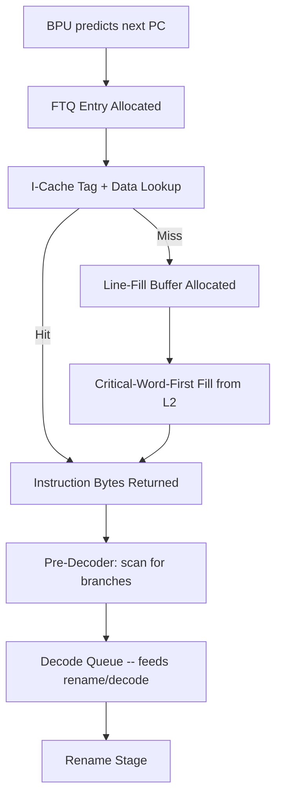
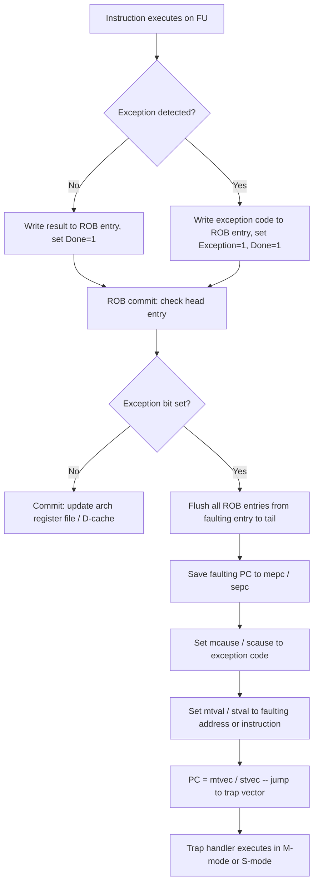

# CPU Architecture -- The Complete Interview Bible

## Table of Contents
1. Five-Stage Pipeline -- Detailed Microarchitecture
2. Pipeline Hazards with Instruction-Level Examples
3. Forwarding (Bypassing) -- Complete MUX Diagrams
4. Branch Prediction -- Deep Dive
5. Tomasulo's Algorithm -- Step-by-Step Execution
6. Superscalar and Register Renaming
7. Memory Hierarchy -- AMAT and Cache Design
8. Cache Coherence -- MESI with All Transitions
9. Virtual Memory and TLB
10. Performance Analysis
11. Interview Q&A (20+ Questions)

---

## 1. Five-Stage Pipeline -- Detailed Microarchitecture

### 1.1 Stage 1: Instruction Fetch (IF)

```
Inputs:  PC (Program Counter), Branch prediction signals
Outputs: Instruction bits, PC+4, predicted branch target

Components:
  - PC register (updated every cycle)
  - PC MUX: selects between:
    * PC + 4 (sequential)
    * Branch target (from branch predictor or resolved branch)
    * Exception/interrupt vector
  - Instruction Memory / I-Cache
  - Branch Target Buffer (BTB) lookup (parallel with I-Cache)
  - Next-PC logic

Operation:
  1. Send PC to I-Cache
  2. Simultaneously look up PC in BTB
  3. If BTB hit and BHT predicts taken: next PC = BTB target
  4. If BTB miss or not taken: next PC = PC + 4
  5. Fetch instruction from I-Cache (1 cycle for cache hit)
  6. On I-Cache miss: pipeline stalls, fill from L2 (10-20 cycles)

Pipeline register IF/ID:
  {instruction[31:0], PC+4, predicted_target, prediction_direction}
```

### 1.2 Stage 2: Instruction Decode / Register Read (ID)

```
Inputs:  Instruction from IF/ID register
Outputs: Control signals, register values, immediate, decoded opcode

Components:
  - Instruction decoder (opcode -> control signals)
  - Register file (read ports: rs1, rs2; write port from WB stage)
  - Immediate generator (sign-extend, shift for different formats)
  - Hazard detection unit (detects RAW hazards, generates stalls)
  - Branch comparator (for branch-in-ID optimization)
  - Control signal generation:
    * ALUSrc (register or immediate)
    * ALUOp (add, sub, and, or, slt, etc.)
    * MemRead, MemWrite
    * RegWrite
    * MemtoReg (ALU result or memory data)
    * Branch type

Operation:
  1. Decode instruction opcode and function fields
  2. Read rs1 and rs2 from register file
  3. Generate immediate value
  4. Check for data hazards (compare rs1/rs2 with EX/MEM/WB destinations)
  5. If load-use hazard detected: insert pipeline bubble (stall IF, ID)

Pipeline register ID/EX:
  {rs1_data, rs2_data, immediate, rd, ALUOp, control_signals, PC+4}
```

### 1.3 Stage 3: Execute (EX)

```
Inputs:  Operands from ID/EX register, forwarded values
Outputs: ALU result, branch decision, target address

Components:
  - ALU (arithmetic, logic, comparison)
  - Forwarding MUX on each ALU input (select: ID/EX, EX/MEM forward, MEM/WB forward)
  - Branch target adder (PC + immediate)
  - Branch resolution (compare register values)
  - Address calculation (for loads/stores: base + offset)

Operation:
  1. Select ALU operands (from register file or forwarded values)
  2. Execute ALU operation
  3. For branches: compare operands, determine taken/not-taken
  4. If branch misprediction: flush IF and ID stages, correct PC
  5. For loads/stores: compute effective address = rs1 + immediate

Pipeline register EX/MEM:
  {ALU_result, rs2_data (for store), rd, control_signals, branch_taken, target}
```

### 1.4 Stage 4: Memory Access (MEM)

```
Inputs:  ALU result (address), store data from EX/MEM register
Outputs: Memory read data or ALU pass-through

Components:
  - Data Memory / D-Cache
  - Memory read/write control
  - Write buffer (for store buffering)

Operation:
  1. For loads: send address to D-Cache, receive data (1 cycle if hit)
  2. For stores: write data to D-Cache (or write buffer)
  3. For ALU instructions: pass ALU result through (no memory access)
  4. On D-Cache miss: pipeline stalls, fill from L2

Pipeline register MEM/WB:
  {ALU_result, mem_read_data, rd, control_signals}
```

### 1.5 Stage 5: Write Back (WB)

```
Inputs:  MEM/WB register
Outputs: Write to register file

Components:
  - Result MUX: select between ALU result and memory data
  - Register file write port

Operation:
  1. Select result (MemtoReg: memory data or ALU result)
  2. Write to destination register rd (if RegWrite is asserted)
  3. Write occurs on the first half of the clock cycle (allows
     same-cycle read in ID stage -- "write-first" register file)
```

---

## 2. Pipeline Hazards with Instruction-Level Examples

### 2.1 RAW (Read After Write) -- True Data Dependency

```
Instruction sequence (MIPS):
  I1: ADD  $1, $2, $3      # Writes $1 in WB (cycle 5)
  I2: SUB  $4, $1, $5      # Reads $1 in ID (cycle 3) -- $1 not yet written!
  I3: AND  $6, $1, $7      # Reads $1 in ID (cycle 4) -- $1 not yet written!
  I4: OR   $8, $1, $9      # Reads $1 in ID (cycle 5) -- $1 written this cycle (OK with write-first RF)

Pipeline without forwarding:
  Cycle:  1    2    3    4    5    6    7    8
  I1:    IF   ID   EX  MEM  WB
  I2:         IF   ID  stall stall EX  MEM  WB   <- 2-cycle stall for $1
  I3:              IF  stall stall ID   EX  MEM  WB
  I4:                   stall stall IF   ID   EX  MEM  WB

With forwarding (see Section 3):
  Cycle:  1    2    3    4    5    6    7    8
  I1:    IF   ID   EX  MEM  WB
  I2:         IF   ID   EX  MEM  WB     <- Forward from EX/MEM
  I3:              IF   ID   EX  MEM  WB  <- Forward from MEM/WB
  I4:                   IF   ID   EX  MEM  WB  <- Normal read (WB to ID same cycle)

  No stalls! Forwarding eliminates 2 stall cycles.
```

### 2.2 Load-Use Hazard (Forwarding Can't Solve It)

```
  I1: LW   $1, 0($2)       # Load: data available END of MEM (cycle 4)
  I2: ADD  $4, $1, $5      # Needs $1 at BEGINNING of EX (cycle 3)

Pipeline:
  Cycle:  1    2    3    4    5    6    7
  I1:    IF   ID   EX  MEM  WB
  I2:         IF   ID  stall EX  MEM  WB    <- 1 stall UNAVOIDABLE
  I3:              IF  stall ID   EX  MEM  WB

Why forwarding can't help:
  I1 produces data at end of MEM (cycle 4 clock edge).
  I2 needs data at beginning of EX (cycle 3 clock edge).
  Data isn't ready yet! Must wait 1 cycle.

  After the stall: I2's EX is in cycle 4, and I1's MEM result is
  available at the end of cycle 4 -> can forward from MEM/WB to EX.

Compiler optimization (load delay slot scheduling):
  I1: LW   $1, 0($2)
  I3: AND  $6, $7, $8      <- Independent instruction moved here
  I2: ADD  $4, $1, $5      <- Now 1 cycle later, no stall needed
```

### 2.3 Control Hazards (Branch Penalty)

```
  I1: BEQ  $1, $2, target  # Branch resolved in EX (cycle 3)
  I2: ADD  $3, $4, $5      # Fetched speculatively (may be wrong)
  I3: SUB  $6, $7, $8      # Fetched speculatively (may be wrong)

If branch is taken (mispredicted as not-taken):
  Cycle:  1    2    3    4    5
  I1:    IF   ID   EX  MEM  WB
  I2:         IF   ID  flush              <- Wrong path, flushed
  I3:              IF  flush              <- Wrong path, flushed
  target:               IF   ID   EX ...  <- Correct path starts

Branch penalty = 2 cycles (for branch resolved in EX)

If branch resolved in ID (some implementations):
  Penalty = 1 cycle

If branch resolved in MEM (deeply pipelined):
  Penalty = 3 cycles
```

### 2.4 WAR and WAW (Out-of-Order Only)

```
WAR (Write After Read) - anti-dependency:
  I1: ADD  $1, $2, $3      # Reads $2 in cycle 2
  I2: SUB  $2, $4, $5      # Writes $2 in cycle 6

In-order pipeline: No hazard (I1 reads $2 before I2 writes it).
Out-of-order: I2 might execute before I1 if I2's operands are ready first.
  If I2 writes $2 before I1 reads it -> I1 gets wrong value.
Solution: Register renaming. I2 writes to physical reg P47 (renamed),
  I1 still reads from P12 (old mapping of $2). No conflict.

WAW (Write After Write):
  I1: ADD  $1, $2, $3      # Writes $1
  I2: SUB  $1, $4, $5      # Also writes $1

In-order: No hazard (I1 writes before I2, final value is from I2).
Out-of-order: I1 might write after I2, leaving $1 with I1's value (wrong!).
Solution: Register renaming. I1 writes P47, I2 writes P63 (different physical regs).
  Architectural register $1 maps to P63 after I2. P47 is freed later.
```

---

## 3. Forwarding (Bypassing) -- Complete MUX Diagrams

### 3.1 Forwarding Paths

```
                    ┌──────────────────────────────────────────────┐
                    │                                              │
  ID/EX.rs1_data ──┤                                              │
                    │    ┌─────┐                                   │
  EX/MEM.ALU_result┼──>│ MUX ├──> ALU Input A                    │
                    │    │  A  │                                   │
  MEM/WB.result ───┼──>│     │                                   │
                    │    └──┬──┘                                   │
                    │       │                                      │
  Forward_A ctrl ───┘       │                                      │
                            │                                      │
  ID/EX.rs2_data ──┐       │                                      │
                    │    ┌──┴──┐                                   │
  EX/MEM.ALU_result┼──>│ MUX ├──> ALU Input B                    │
                    │    │  B  │                                   │
  MEM/WB.result ───┼──>│     │                                   │
                    │    └──┬──┘                                   │
  Forward_B ctrl ───┘       │                                      │
                                                                   │
  Each MUX has 3 inputs:                                           │
    00: Normal (from register file via ID/EX)                      │
    01: Forward from EX/MEM (1-cycle forward, ALU->ALU)            │
    10: Forward from MEM/WB (2-cycle forward, ALU->ALU or MEM->ALU)│
                                                                   │
  Load-to-use: Forward from MEM/WB to EX (after 1 stall cycle)    │
```

### 3.2 Forwarding Control Logic

```verilog
// Forward A (ALU input 1)
always @(*) begin
    if (EX_MEM_RegWrite && (EX_MEM_Rd != 0) && (EX_MEM_Rd == ID_EX_Rs1))
        ForwardA = 2'b01;  // Forward from EX/MEM
    else if (MEM_WB_RegWrite && (MEM_WB_Rd != 0) && (MEM_WB_Rd == ID_EX_Rs1))
        ForwardA = 2'b10;  // Forward from MEM/WB
    else
        ForwardA = 2'b00;  // No forwarding
end

// Forward B (ALU input 2) -- same logic with Rs2
always @(*) begin
    if (EX_MEM_RegWrite && (EX_MEM_Rd != 0) && (EX_MEM_Rd == ID_EX_Rs2))
        ForwardB = 2'b01;
    else if (MEM_WB_RegWrite && (MEM_WB_Rd != 0) && (MEM_WB_Rd == ID_EX_Rs2))
        ForwardB = 2'b10;
    else
        ForwardB = 2'b00;
end

// Priority: EX/MEM forward takes priority over MEM/WB forward
// (EX/MEM has the most recent value)
```

### 3.3 Hazard Detection Unit (for Load-Use Stall)

```verilog
// Detect load-use hazard: current ID stage reads what EX stage is loading
wire load_use_hazard = ID_EX_MemRead &&
                       ((ID_EX_Rd == IF_ID_Rs1) || (ID_EX_Rd == IF_ID_Rs2));

// When hazard detected:
//   1. Insert NOP into ID/EX register (bubble)
//   2. Stall IF and ID stages (don't advance PC, don't update IF/ID register)
//   3. After 1 cycle, the load result is available for forwarding from MEM/WB
```

---

## 4. Branch Prediction -- Deep Dive

### 4.1 CPI Impact of Branches

```
CPI = CPI_base + Branch_Frequency * Misprediction_Rate * Penalty

Example:
  CPI_base = 1 (ideal pipeline)
  Branch_Frequency = 20% (1 in 5 instructions is a branch)
  Penalty = 2 cycles (branch resolved in EX)

  With always-not-taken prediction (50% accuracy for conditional branches):
    CPI = 1 + 0.2 * 0.5 * 2 = 1.2  (20% performance loss)

  With 2-bit predictor (90% accuracy):
    CPI = 1 + 0.2 * 0.1 * 2 = 1.04  (4% loss)

  With tournament predictor (97% accuracy):
    CPI = 1 + 0.2 * 0.03 * 2 = 1.012  (1.2% loss)

  With deep pipeline (20 stages, penalty = 15 cycles):
    At 97% accuracy: CPI = 1 + 0.2 * 0.03 * 15 = 1.09  (9% loss!)
    Even excellent prediction hurts with deep pipelines.
```

### 4.2 Two-Bit Saturating Counter -- FSM with Transitions

```
                    ┌──────────────┐
          Taken     │              │     Not Taken
    ┌──────────────>│  Strongly    │<──────────────┐
    │               │  Taken (11)  │               │
    │               │ Predict: T   │               │
    │               └──────┬───────┘               │
    │                      │ Not Taken              │
    │               ┌──────v───────┐               │
    │     Taken     │              │    Not Taken   │
    │ ┌────────────>│  Weakly      │──────────────>│
    │ │             │  Taken (10)  │               │
    │ │             │ Predict: T   │               │
    │ │             └──────┬───────┘               │
    │ │                    │ Not Taken              │
    │ │             ┌──────v───────┐               │
    │ │   Taken     │              │    Not Taken   │
    │ │<────────────│  Weakly      │──────────────>│
    │               │  Not Taken   │               │
    │               │  (01)        │               │
    │               │ Predict: NT  │               │
    │               └──────┬───────┘               │
    │                      │ Not Taken              │
    │               ┌──────v───────┐               │
    │     Taken     │              │               │
    └──────────────│  Strongly    │───────────────┘
                    │  Not Taken   │     Not Taken
                    │  (00)        │
                    │ Predict: NT  │
                    └──────────────┘

Prediction rule: MSB = 1 -> predict Taken; MSB = 0 -> predict Not Taken

For a loop that executes 100 times:
  1-bit predictor: 2 mispredictions (first entry: NT, last exit: T)
  2-bit predictor: 1 misprediction (only at exit, the "weakly taken" absorbs
                   the first exit prediction but stays taken for re-entry)
```

### 4.3 Branch History Table (BHT) Organization

```
         PC
          |
    [Lower bits]
          |
          v
  ┌───────────────┐
  │  BHT Entry 0  │  2-bit counter
  │  BHT Entry 1  │  2-bit counter
  │  BHT Entry 2  │  2-bit counter
  │     ...        │
  │  BHT Entry N-1│  2-bit counter
  └───────────────┘
          |
          v
      Prediction (Taken/Not Taken)

BHT size: typically 1K-16K entries
Index: PC[11:2] for 1K entries (ignore byte offset, align to instruction)

Problem: Aliasing -- different branches map to the same entry
  (collision rate depends on table size and branch frequency)
```

### 4.4 BTB (Branch Target Buffer) Structure

```
  PC ──> [BTB Tag RAM]  ──> Tag Match?
                              │
                    ┌─────────┴───────────┐
                   Yes                    No
                    │                      │
              [BTB Data RAM]         Predict Not Taken
                    │                (or use BHT separately)
                    v
            Target Address
            (next PC if taken)

BTB entries:
  {tag (upper PC bits), target_address, valid, branch_type}

Typical size: 256-4K entries, 2-4 way set-associative

BTB answers: "WHERE to fetch if taken?"
BHT answers: "WHETHER to fetch from target (taken) or PC+4 (not taken)?"
Both are needed for full prediction.
```

### 4.5 Gshare Predictor

```
  PC ─────────┐
              XOR──> [Index] ──> PHT (Pattern History Table)
  GHR ────────┘                        |
  (Global History                  2-bit counter
   Register)                           |
                                   Prediction

GHR: N-bit shift register holding outcomes of last N branches
  Taken:     shift in 1
  Not Taken: shift in 0

Index = PC[N-1:0] XOR GHR[N-1:0]

Why XOR? It creates a unique index for each (PC, history) combination.
This captures correlations: "if the last 2 branches were Taken, this
branch is usually Not Taken."

Typical accuracy: 93-95% on SPEC benchmarks
GHR width: 10-18 bits
PHT size: 2^10 to 2^18 entries (each 2-bit counter)
```

### 4.6 Tournament Predictor

```
                         ┌── Local Predictor ───┐
  PC ──> Chooser (Meta) ─┤                       ├──> Final Prediction
                         └── Global Predictor ──┘

  Chooser: 2-bit counter per entry, similar to BHT
    If chooser says "local": use local predictor's output
    If chooser says "global": use global predictor's output

  Update: On a branch outcome, compare both predictors:
    If local was right and global wrong: increment chooser toward local
    If global was right and local wrong: increment chooser toward global
    If both right or both wrong: no change to chooser

  Local predictor: Per-branch history (each branch has its own shift register)
    Good for branches with patterns tied to their own history (loops)

  Global predictor: Gshare-style (shared history)
    Good for correlated branches (if-else chains)

  Tournament accuracy: 95-97% on SPEC benchmarks (Alpha 21264 used this)
```

### 4.7 Prediction Accuracy Comparison

```
| Predictor           | Accuracy (SPEC) | Hardware Cost   | Used In           |
|---------------------|-----------------|-----------------|-------------------|
| Always Not Taken    | 30-40%          | None            | -                 |
| Always Taken        | 60-70%          | None            | -                 |
| BTFNT               | 65-75%          | Minimal         | Simple embedded   |
| 1-bit BHT (1K)      | 80-85%          | 1KB             | -                 |
| 2-bit BHT (4K)      | 85-90%          | 8KB             | Early RISC        |
| Gshare (14-bit)     | 93-95%          | 32KB            | AMD K6            |
| Tournament           | 95-97%          | 64KB            | Alpha 21264       |
| TAGE                 | 97-99%          | 64-256KB        | Intel Haswell+    |
| Perceptron           | 95-97%          | 64KB            | AMD Zen           |
```

---

## 5. Tomasulo's Algorithm -- Step-by-Step Execution

### 5.1 Architecture Recap

```
  Instruction Queue
        |
     Issue (in-order)
    /        \
  ┌────┐    ┌────┐
  │ RS │    │ RS │   Reservation Stations
  │Add1│    │Mul1│
  │Add2│    │Mul2│
  │Add3│    │Mul3│
  └──┬─┘    └──┬─┘
     |          |
  [Adder]   [Multiplier]   Functional Units (out-of-order execution)
     |          |
     └────┬─────┘
          |
    Common Data Bus (CDB)
          |
    Register File + ROB
```

### 5.2 Step-by-Step Example

**Code sequence:**

```
I1: LD    F6, 34(R2)      # Load F6 from memory[R2+34]
I2: LD    F2, 45(R3)      # Load F2 from memory[R3+45]
I3: MULTD F0, F2, F4      # F0 = F2 * F4 (depends on I2)
I4: SUBD  F8, F6, F2      # F8 = F6 - F2 (depends on I1, I2)
I5: DIVD  F10, F0, F6     # F10 = F0 / F6 (depends on I3, I1)
I6: ADDD  F6, F8, F2      # F6 = F8 + F2 (depends on I4, I2)
```

**Execution trace (cycle by cycle):**

```
Cycle 1: Issue I1 (LD F6, 34(R2))
  Load1 RS: Op=LD, Addr=R2+34, Dest=F6
  Register status: F6 -> Load1

Cycle 2: Issue I2 (LD F2, 45(R3))
  Load2 RS: Op=LD, Addr=R3+45, Dest=F2
  Register status: F2 -> Load2

Cycle 3: Issue I3 (MULTD F0, F2, F4)
  Mul1 RS: Op=MULT, Vj=?, Qj=Load2 (F2 not ready), Vk=F4 value, Qk=0
  Register status: F0 -> Mul1
  I1 executes (LD completes, CDB broadcasts: Load1 -> F6 value)
  Load1 result written to F6 in register file

Cycle 4: Issue I4 (SUBD F8, F6, F2)
  Add1 RS: Op=SUB, Vj=F6 value (now available from I1), Qj=0,
           Vk=?, Qk=Load2 (F2 still loading)
  Register status: F8 -> Add1
  I2 may execute this cycle

Cycle 5: Issue I5 (DIVD F10, F0, F6)
  Mul2 RS: Op=DIV, Vj=?, Qj=Mul1 (F0 not ready), Vk=F6 value, Qk=0
  Register status: F10 -> Mul2
  I2 completes (CDB broadcasts: Load2 -> F2 value)
  Mul1 captures F2 value (Qj=Load2 matches, now Vj=F2 value, Qj=0)
  Add1 captures F2 value (Qk=Load2 matches, now Vk=F2 value, Qk=0)

Cycle 6: Issue I6 (ADDD F6, F8, F2)
  Add2 RS: Op=ADD, Vj=?, Qj=Add1 (F8 not ready), Vk=F2 value, Qk=0
  Register status: F6 -> Add2  (overwrite! WAW with I1 resolved by renaming)
  I3 begins execution (Mul1 has both operands)
  I4 begins execution (Add1 has both operands)

Cycle 7:
  I4 completes (Add1 result on CDB: F8 = F6 - F2)
  Add2 captures (Qj=Add1 matches, now Vj=F8 value)

Cycle 8:
  I6 begins execution (Add2 has both operands)

Cycle 9:
  I6 completes (Add2 result on CDB: F6 = F8 + F2)

Cycle 10 (or later, multiplier takes multiple cycles):
  I3 completes (Mul1 result on CDB: F0 = F2 * F4)
  Mul2 captures (Qj=Mul1 matches, now Vj=F0 value)

Cycle 11+:
  I5 begins execution (Mul2 has both operands, division is slow)

Cycle 40+ (division takes ~30 cycles):
  I5 completes (Mul2 result on CDB: F10 = F0 / F6)
```

### 5.3 How RAW, WAR, WAW Are Handled

```
RAW (I3 depends on I2 for F2):
  I3 issues with Qj=Load2 (tag, not value). When I2 completes and broadcasts
  on CDB, Mul1 snoops and captures the value. True data flow respected.

WAR (I6 writes F6, which I5 reads):
  At issue time of I5, F6's value is already captured into Mul2's Vk.
  When I6 later writes F6 (updating the register file), Mul2 already has
  the old value. No conflict.

WAW (I1 writes F6, I6 also writes F6):
  At I6's issue time, register status for F6 is updated from "Load1" to "Add2".
  I1's result was already consumed. I6's result becomes the final F6 value.
  Even if I1 completed after I6 (impossible in this example, but in general
  with ROB), the ROB ensures in-order commit.
```

---

## 6. Superscalar and Register Renaming

### 6.1 Superscalar Pipeline

```
2-wide superscalar: Issue up to 2 instructions per cycle

  Fetch:  [I0, I1]  [I2, I3]  [I4, I5]  ...  (fetch 2 per cycle)
  Decode: [I0, I1]  [I2, I3]  [I4, I5]  ...  (decode 2 per cycle)
  Rename: [I0->P5, I1->P6]  [I2->P7, I3->P8]  ... (rename 2 per cycle)
  Issue:  Check dependencies, issue to reservation stations
  Execute: Multiple FUs (2 ALUs, 1 FPU, 1 Load, 1 Store)
  Commit: ROB retires 2 per cycle (in program order)

Challenges:
  - Dependency checking: O(W^2) comparisons for W-wide issue
  - Register renaming: need W rename ports per cycle
  - Multiple FUs: 2+ ALUs, 1+ FPU, 1+ load/store unit
  - Branch prediction accuracy must be very high (deep speculation)
```

### 6.2 Register Renaming with Physical Register File

```
Architectural registers: R0-R31 (ISA visible, 32 registers)
Physical registers: P0-P127 (128 physical registers, not ISA visible)

Register Alias Table (RAT):
  R0 -> P0 (R0 is always 0, hardwired)
  R1 -> P15
  R2 -> P42
  R3 -> P7
  ...

Free list: {P48, P51, P63, P72, ...}  (available physical registers)

Instruction: ADD R1, R2, R3

Rename process:
  1. Read source mappings: R2 -> P42, R3 -> P7 (from RAT)
  2. Allocate destination: R1 gets P48 (from free list)
  3. Update RAT: R1 -> P48 (old mapping P15 saved in ROB)
  4. Issue: ADD P48, P42, P7 (no architectural registers, all physical)

On commit:
  Free the OLD physical register (P15, the previous mapping of R1)
  P15 returns to the free list

On flush (misprediction):
  Restore RAT to committed state (from ROB snapshots)
  Free all speculative physical registers
```

### 6.3 Reorder Buffer (ROB) Management

```
ROB is a circular buffer:

  Head: points to oldest instruction (next to commit)
  Tail: points to newest instruction (most recently issued)

  ┌────┬────────┬──────┬───────┬───────┬──────────┐
  │ # │ Instr  │ Dest │ Value │ Done? │ Exception│
  ├────┼────────┼──────┼───────┼───────┼──────────┤
  │ 0 │ ADD    │ P48  │ 42    │ Yes   │ No       │ <- Head (ready to commit)
  │ 1 │ LW     │ P51  │ 100   │ Yes   │ No       │
  │ 2 │ BEQ    │ -    │ -     │ Yes   │ No       │ <- Branch: check prediction
  │ 3 │ MUL    │ P63  │ -     │ No    │ -        │ <- Not done yet
  │ 4 │ ADD    │ P72  │ -     │ No    │ -        │ <- Tail
  └────┴────────┴──────┴───────┴───────┴──────────┘

Commit rules:
  1. Check head entry
  2. If Done=Yes and No Exception: commit (write to arch state, free old Preg)
  3. If Done=Yes and Exception: flush all entries from this one to tail
  4. If Done=No: wait (even if later entries are done, cannot commit OoO)
  5. Advance head

Commit width: Typically 2-8 per cycle (matches issue width)
```

---

## 7. Memory Hierarchy -- AMAT and Cache Design

### 7.1 AMAT (Average Memory Access Time)

```
AMAT = Hit_Time + Miss_Rate * Miss_Penalty

For multi-level cache:
AMAT = L1_Hit_Time + L1_Miss_Rate * (L2_Hit_Time + L2_Miss_Rate * (L3_Hit_Time + L3_Miss_Rate * Mem_Latency))

Typical modern values:
  L1 I-Cache: 32-64 KB, 4-way, 1-4 cycles hit, ~5% miss rate
  L1 D-Cache: 32-64 KB, 8-way, 1-4 cycles hit, ~10% miss rate
  L2 Cache:   256KB-1MB, 8-way, 10-20 cycles hit, ~2% miss rate (of L1 misses)
  L3 Cache:   4-32 MB, 16-way, 30-50 cycles hit, ~20% miss rate (of L2 misses)
  Main Memory (DDR4): 100-300 cycles

Numerical AMAT example:
  AMAT = 4 + 0.10 * (15 + 0.02 * (40 + 0.20 * 200))
       = 4 + 0.10 * (15 + 0.02 * (40 + 40))
       = 4 + 0.10 * (15 + 0.02 * 80)
       = 4 + 0.10 * (15 + 1.6)
       = 4 + 0.10 * 16.6
       = 4 + 1.66
       = 5.66 cycles

  Without L2/L3:
  AMAT = 4 + 0.10 * 200 = 24 cycles  (4.2x worse!)
```

### 7.2 Cache Organization

```
Cache parameters:
  Cache size:    S = 32 KB
  Block size:    B = 64 bytes (cache line size)
  Associativity: A = 8-way set-associative
  Number of sets: N = S / (B * A) = 32768 / (64 * 8) = 64 sets

Address breakdown (32-bit address, 64B block, 64 sets):
  [Tag (20 bits) | Set Index (6 bits) | Block Offset (6 bits)]

  Block Offset: log2(64) = 6 bits (byte within cache line)
  Set Index:    log2(64) = 6 bits (which set)
  Tag:          32 - 6 - 6 = 20 bits (unique identifier)
```

### 7.3 Cache Line Size Trade-offs

```
Larger cache lines (e.g., 128B vs 64B):
  Pros:
    - Better spatial locality (more nearby data prefetched)
    - Fewer tag bits per byte (less overhead)
    - Higher bandwidth utilization per DDR burst
  Cons:
    - Higher miss penalty (more bytes to transfer per miss)
    - More wasted bandwidth on partial-line usage
    - Fewer total cache lines for same cache size (worse temporal locality)
    - False sharing in multi-core (larger granularity of coherence)

Typical cache line sizes:
  L1: 64 bytes (most common in x86, ARM)
  L2/L3: 64-128 bytes
  Memory bus: optimized for 64B bursts (matches L1 line size)
```

### 7.4 Write Policies

```
Write-Through:
  Every write updates BOTH cache AND main memory
  Simple, memory always consistent
  High memory traffic (every store goes to memory)
  Often used with write buffer to reduce stalls

Write-Back:
  Writes only update cache, mark line "dirty"
  Dirty lines written to memory only on eviction
  Lower memory traffic (most writes stay in cache)
  More complex (dirty bit, write-back on eviction)
  Used in all modern high-performance caches

Write-Allocate (fetch on write miss):
  On write miss: fetch the block, then write into it
  Usually paired with write-back

No-Write-Allocate (write-around):
  On write miss: write directly to memory, don't fetch block
  Usually paired with write-through
```

### 7.5 Miss Types (3 C's)

```
Compulsory (Cold): First access to a block. Unavoidable (except with prefetching).
Capacity: Cache is too small to hold all needed blocks. Reduce by increasing cache size.
Conflict: Two blocks map to the same set. Reduce by increasing associativity.

+ Coherence misses (4th C): Invalidation by another core in multi-core.

Reducing each:
  Compulsory: Prefetching (hardware or software)
  Capacity:   Larger cache, better replacement policy
  Conflict:   Higher associativity, victim cache
  Coherence:  Better data placement, private vs shared data separation
```

---

## 8. Cache Coherence -- MESI with All Transitions

### 8.1 MESI States

| State     | Valid | Dirty | Exclusive | Meaning                                    |
|-----------|-------|-------|-----------|--------------------------------------------|
| Modified  | Yes   | Yes   | Yes       | Only copy, modified. Must write back.      |
| Exclusive | Yes   | No    | Yes       | Only copy, clean. Can modify silently.     |
| Shared    | Yes   | No    | No        | May be in other caches. Read-only.         |
| Invalid   | No    | -     | -         | Not valid. Must fetch on access.           |

### 8.2 All State Transitions (Processor Events and Bus Events)

```
Processor Events (local CPU actions):
  PrRd:  Processor read
  PrWr:  Processor write

Bus Events (snooped from other CPUs):
  BusRd:    Another CPU reads this address (bus read)
  BusRdX:   Another CPU writes this address (bus read exclusive / invalidate)
  BusUpgr:  Another CPU upgrades from Shared to Modified (bus upgrade)

Transitions from INVALID (I):
  PrRd  -> fetch from memory
           If no other cache has it: I -> E (Exclusive)
           If another cache has it:  I -> S (Shared)
  PrWr  -> fetch from memory with invalidation
           I -> M (Modified), invalidate all other copies
           Bus transaction: BusRdX

Transitions from EXCLUSIVE (E):
  PrRd  -> E -> E (hit, no bus transaction)
  PrWr  -> E -> M (silent upgrade, no bus transaction! This is the E state advantage)
  BusRd -> E -> S (another CPU reads, must share; supply data)
  BusRdX-> E -> I (another CPU writes, must invalidate; supply data)

Transitions from SHARED (S):
  PrRd  -> S -> S (hit, no bus transaction)
  PrWr  -> S -> M (must invalidate other copies)
           Bus transaction: BusUpgr (invalidation, no data transfer needed)
  BusRd -> S -> S (another CPU reads, still shared)
  BusRdX-> S -> I (another CPU writes, must invalidate our copy)
  BusUpgr-> S -> I (another CPU upgrading, must invalidate)

Transitions from MODIFIED (M):
  PrRd  -> M -> M (hit, no bus transaction)
  PrWr  -> M -> M (hit, no bus transaction)
  BusRd -> M -> S (another CPU reads; must write back to memory, then share)
           This is the expensive transition: writeback + state change
  BusRdX-> M -> I (another CPU writes; must write back, then invalidate)
```

### 8.3 Snooping Example with 4 Cores

```
Initial: Address X is not in any cache.

Step 1: Core 0 reads X
  Cache 0: I -> E (exclusive, fetched from memory)
  Bus: BusRd, memory responds, no other cache has it

Step 2: Core 1 reads X
  Core 1: I -> S
  Core 0: E -> S (snoops BusRd, supplies data or memory does)
  Bus: BusRd, Core 0 snoops and transitions

Step 3: Core 2 reads X
  Core 2: I -> S
  Cores 0,1: S -> S (no change needed)
  Bus: BusRd

Step 4: Core 0 writes X
  Core 0: S -> M
  Cores 1,2: S -> I (invalidated by BusUpgr)
  Bus: BusUpgr (no data transfer, just invalidation)

Step 5: Core 3 reads X
  Core 3: I -> S (needs data)
  Core 0: M -> S (must write back dirty data first!)
  Bus: BusRd from Core 3, Core 0 snoops, intervenes:
    Core 0 writes back X to memory
    Core 0: M -> S
    Core 3 gets data: I -> S

Step 6: Core 1 writes X
  Core 1: I -> M (was invalidated in Step 4, must fetch)
  Cores 0,3: S -> I
  Bus: BusRdX (fetch for write + invalidate)
```

### 8.4 Scalability Problem and Directory-Based Coherence

```
Snooping problem: Every bus transaction is broadcast to ALL caches.
  With N cores: bus bandwidth = O(N * traffic_per_core)
  Beyond 8-16 cores: bus becomes the bottleneck

Directory-based protocol:
  A directory (in memory controller or distributed) tracks which caches
  hold each cache line.

  Directory entry for address X:
    State: {Uncached, Shared, Exclusive/Modified}
    Sharers: bit vector [Core0, Core1, Core2, ..., CoreN]

  On a read miss:
    Core sends request to directory
    Directory checks sharers list
    If exclusive in another core: forward request to owner, owner supplies data
    If shared: memory supplies data
    Directory updates sharers list

  No broadcast! Point-to-point messages.
  Scales to 100+ cores (AMD EPYC, ARM CMN-700, Intel Xeon SP)

  Trade-off: Higher latency per request (directory lookup + forwarding)
             vs scalable bandwidth
```

### 8.5 MOESI Protocol Extension

```
Adds the Owned (O) state:

  O = line is dirty (modified from memory), but other caches have Shared copies.
      Owner is responsible for supplying data on snoop requests.

MESI problem:
  When M transitions to S (on BusRd), it must write back to memory.
  This consumes memory bandwidth even though only a cache-to-cache transfer is needed.

MOESI solution:
  M + BusRd -> O (Owner), requester gets S
  Data goes directly from owner to requester (cache-to-cache transfer)
  NO memory write-back! Saves memory bandwidth.
  Memory is "stale" -- owner will write back on eviction.

AMD Zen uses MOESI (modified version called MOESI-F with F=Forward state).
```

---

## 9. Virtual Memory and TLB

### 9.1 Four-Level Page Table Walk (x86-64, 48-bit VA)

```
48-bit Virtual Address:
  [PML4 (9)] [PDPT (9)] [PD (9)] [PT (9)] [Offset (12)]
  bits 47:39  bits 38:30  bits 29:21  bits 20:12  bits 11:0

CR3 register holds physical address of PML4 table

Walk:
  Step 1: PML4_entry = Memory[CR3 + VA[47:39] * 8]
  Step 2: PDPT_entry = Memory[PML4_entry.addr + VA[38:30] * 8]
  Step 3: PD_entry   = Memory[PDPT_entry.addr + VA[29:21] * 8]
  Step 4: PT_entry   = Memory[PD_entry.addr + VA[20:12] * 8]
  Step 5: PA = PT_entry.PFN || VA[11:0]

  Each step is a memory access -> 4 memory accesses per translation!
  Without TLB: every load/store takes 5 memory accesses (4 walk + 1 data)
  With TLB: 1 cycle (TLB hit) + 1 data access = 2 cycles

Page Table Entry (PTE) format (simplified):
  [PFN (physical frame number)] [Flags]
  Flags: Present, Read/Write, User/Supervisor, Accessed, Dirty, PAT, Global
```

### 9.2 TLB Design

```
Typical TLB hierarchy:
  L1 ITLB: 64 entries, fully associative, 1-cycle lookup
  L1 DTLB: 64 entries, fully associative, 1-cycle lookup
  L2 STLB: 512-2048 entries, 8-12 way, 6-8 cycle lookup

TLB entry:
  {VPN (virtual page number), ASID, PFN, permissions, valid}

Fully associative: Compare incoming VPN against ALL entries simultaneously.
  Cost: parallel comparators for all entries.
  Benefit: No conflict misses, best hit rate.

Set-associative: L2 TLB often 8-way for larger capacity.
```

### 9.3 TLB Miss Penalty

```
TLB miss -> page table walk:
  Best case (page walk cache hits): 10-30 cycles
  Typical: 30-60 cycles (page walk entries in L2/L3 cache)
  Worst case (page walk entries in memory): 200-400 cycles
  Page fault (page not in physical memory): 1-10 MILLION cycles (disk I/O)

TLB miss rate depends heavily on working set size:
  Working set < TLB coverage: ~0% miss rate
  Working set > TLB coverage: miss rate increases
  
  TLB coverage = entries * page_size
  L1 DTLB: 64 * 4KB = 256 KB (small!)
  L2 STLB: 2048 * 4KB = 8 MB
  With 2MB huge pages: 64 * 2MB = 128 MB (L1 DTLB alone)
```

### 9.4 Huge Pages

```
4KB pages: 12-bit offset, 9 bits per level -> 4-level walk
2MB pages: 21-bit offset, skip PT level -> 3-level walk
1GB pages: 30-bit offset, skip PT and PD -> 2-level walk

Benefits of huge pages:
  1. Larger TLB coverage (64 entries * 2MB = 128MB vs 256KB)
  2. Fewer page table walk steps (3 vs 4)
  3. Fewer TLB misses for large working sets
  4. Less page table memory (fewer PTE entries)

Drawbacks:
  1. Internal fragmentation (allocating 2MB for a 4KB need)
  2. Memory allocation difficulty (need contiguous 2MB physical pages)
  3. Longer page fault handling (must zero 2MB, not 4KB)
```

### 9.5 VIPT (Virtually Indexed, Physically Tagged) Cache

```
The problem:
  Cache lookup needs the physical address (tag comparison).
  TLB provides physical address, but takes 1 cycle.
  If cache uses physical index too, we need PA before indexing.
  Total: 1 cycle (TLB) + 1 cycle (cache) = 2 cycles minimum.

VIPT solution:
  INDEX the cache with virtual address bits (available immediately)
  TAG the cache with physical address bits (from TLB)
  TLB lookup and cache index happen IN PARALLEL -> 1 cycle total!

Constraint:
  The virtual index bits must equal the physical index bits.
  For a 32KB, 8-way cache with 64B lines:
    Sets = 32768 / (8 * 64) = 64 sets
    Index = 6 bits (log2(64)) = bits [11:6]
    Offset = 6 bits = bits [5:0]
    Total bits used for index+offset = 12 bits

  For 4KB pages: page offset = 12 bits [11:0]
  Index bits [11:6] are WITHIN the page offset -> same in VA and PA!
  VIPT works without aliasing! (as long as index+offset <= page_offset_bits)

  If cache is too large: index bits extend beyond page offset
    -> VIPT becomes problematic (aliasing)
    -> Solutions: page coloring, or increase associativity
```

---

## 10. Performance Analysis

### 10.1 Performance Equations

```
CPU Time = Instruction_Count * CPI * Clock_Period

CPI = CPI_ideal + Stall_cycles_per_instruction

Stall_cycles = Memory_stalls + Branch_stalls + Structural_stalls

Memory_stalls = Memory_accesses_per_instr * Miss_rate * Miss_penalty

Branch_stalls = Branch_frequency * Misprediction_rate * Penalty

IPC = 1 / CPI (Instructions Per Cycle)

Throughput = IPC * Frequency
```

### 10.2 Amdahl's Law

```
Speedup = 1 / ((1 - f) + f/S)

where:
  f = fraction of execution time that is improved
  S = speedup of the improved portion

Example:
  If 80% of execution is parallelizable and you have 8 cores:
  Speedup = 1 / ((1-0.8) + 0.8/8) = 1 / (0.2 + 0.1) = 1 / 0.3 = 3.33x

  Maximum speedup with infinite cores:
  Speedup_max = 1 / (1 - 0.8) = 5x

  Even with infinite parallelism, the serial 20% limits you to 5x!
```

### 10.3 Numerical Performance Example

```
Processor A: 2 GHz, CPI = 1.5
Processor B: 3 GHz, CPI = 2.5

For a program with 10 billion instructions:
  Time_A = 10e9 * 1.5 / 2e9 = 7.5 seconds
  Time_B = 10e9 * 2.5 / 3e9 = 8.33 seconds

Processor A is faster despite lower frequency!
  IPC_A = 1/1.5 = 0.67
  IPC_B = 1/2.5 = 0.40
  Throughput_A = 0.67 * 2G = 1.33 GIPS
  Throughput_B = 0.40 * 3G = 1.20 GIPS
```

---

## 11. Interview Questions & Answers

### Q1: Describe the 5 pipeline stages in detail. What happens at each stage?

**A:** **IF**: Send PC to I-cache, fetch instruction, predict next PC (BTB+BHT). **ID**: Decode opcode, read register file (rs1, rs2), generate immediate, detect hazards (load-use stall). **EX**: Execute ALU operation, compute branch target, resolve branch direction, compute load/store address. Forwarding MUXes select between register values and forwarded results. **MEM**: Access D-cache for loads/stores. Loads read data, stores write data. Cache misses stall the pipeline. **WB**: Write result (ALU or memory data) back to register file. Write-first design allows same-cycle read in ID.

### Q2: Show a detailed RAW hazard example with forwarding paths.

**A:** Sequence: `ADD $1,$2,$3` followed by `SUB $4,$1,$5`. ADD writes $1 in WB (cycle 5). SUB needs $1 in EX (cycle 4). Without forwarding: 2-cycle stall. With forwarding: ADD's ALU result is available at the EX/MEM register (end of cycle 3). The forwarding MUX routes EX/MEM.ALU_result to SUB's ALU input A. Control: EX/MEM.Rd=$1 matches ID/EX.Rs1=$1 and EX/MEM.RegWrite=1, so ForwardA=01 (EX/MEM forward). Zero stall cycles. For a 2-stage distance (e.g., `ADD` then `NOP` then `AND $6,$1,$7`), the MEM/WB register provides the value through the ForwardA=10 path.

### Q3: Explain the load-use hazard. Why can't forwarding solve it completely?

**A:** After `LW $1, 0($2)`, if the next instruction is `ADD $4, $1, $5`, there's a fundamental timing conflict. LW produces data at the END of MEM (cycle 4). ADD needs data at the BEGINNING of EX (cycle 3). The data doesn't exist yet when ADD needs it. Even with forwarding, we need a 1-cycle stall. After the stall, ADD's EX is in cycle 4, and LW's MEM result is available at MEM/WB for forwarding. The compiler can help by scheduling an independent instruction in the delay slot (load delay slot scheduling), converting the stall into useful work.

### Q4: Derive the CPI impact of branch misprediction. Why do deep pipelines suffer more?

**A:** CPI = 1 + branch_freq * mispredict_rate * penalty. For a 5-stage pipeline (penalty=2, branch in EX): with 20% branches and 5% misprediction: CPI = 1 + 0.2*0.05*2 = 1.02. For a 20-stage pipeline (penalty=15): CPI = 1 + 0.2*0.05*15 = 1.15 (15% slower). Deep pipelines have more stages between fetch and branch resolution, so more instructions are fetched speculatively and wasted on misprediction. This is why Intel Pentium 4 (31 stages, penalty=20) needed very aggressive branch prediction (trace cache, sophisticated predictors) to be competitive, and ultimately lost to shorter-pipeline designs.

### Q5: Explain gshare prediction. How does XOR improve accuracy?

**A:** Gshare indexes the Pattern History Table (PHT) with PC XOR Global History Register (GHR). The GHR is a shift register of the last N branch outcomes. XOR creates a unique index for each (PC, history) pair, capturing correlations between branches. Example: two branches at different PCs but with the same history pattern would collide in a simple PC-indexed table but get different PHT entries with XOR. This captures "if branches A,B were taken, branch C is usually not taken." Gshare achieves 93-95% accuracy on SPEC benchmarks with a 14-16 bit GHR and 16K-64K entry PHT. The main weakness is aliasing (different PC+history pairs mapping to the same entry), which can be reduced with larger tables or anti-aliasing techniques.

### Q6: Walk through Tomasulo's algorithm for a 3-instruction sequence.

**A:** Consider: `MUL F0,F2,F4` / `ADD F2,F0,F6` / `ADD F4,F0,F2`. Cycle 1: MUL issues to Mul1 RS {Op=MUL, Vj=F2, Vk=F4, Dest=F0}. Register status: F0->Mul1. Cycle 2: ADD issues to Add1 RS {Op=ADD, Vj=?, Qj=Mul1 (F0 not ready), Vk=F6}. F2->Add1. Cycle 3: Second ADD issues to Add2 RS {Op=ADD, Vj=?, Qj=Mul1 (F0), Vk=?, Qk=Add1 (F2)}. F4->Add2. Note: WAR on F2 (MUL reads F2, second ADD needs F2 from first ADD) is handled because MUL captured F2's value at issue time. WAW on F4 (original F4 vs Add2's new F4) is handled because Add2's tag replaces F4's register status.

### Q7: What is the purpose of the Reorder Buffer? How does it enable precise exceptions?

**A:** The ROB ensures instructions commit in program order, even though they execute out of order. Each issued instruction allocates an ROB entry at the tail. When execution completes, the result is written to the ROB entry (not to architectural state). Commit happens at the head: if the head entry is complete and has no exception, it commits (updates the register file/memory). If it has an exception, ALL entries from that point to the tail are flushed. This ensures: (1) Precise exceptions: at the exception point, all prior instructions have committed and all later ones haven't; (2) Speculative execution: on branch misprediction, flush ROB entries after the branch, restoring the RAT to the committed state. (3) In-order completion visible to software, despite out-of-order execution.

### Q8: Explain MESI with all state transitions. Why does the E state exist?

**A:** MESI has 4 states per cache line. Key transitions: I->E on read miss (sole copy, clean), I->M on write miss (invalidate others), E->M on write (silent upgrade, no bus traffic -- this is why E exists), E->S on snoop read (share), S->M on write (bus upgrade to invalidate others), M->S on snoop read (write back + share), M->I on snoop write (write back + invalidate). The E state's purpose: when a cache has the only copy, a subsequent write can transition E->M without any bus transaction (no invalidation needed since no other cache has it). Without E (like MSI), every write from S requires a bus invalidation even if no other cache has the line. E saves bus bandwidth for private data patterns, which are very common.

### Q9: Calculate AMAT for a 3-level cache hierarchy. What dominates?

**A:** Given L1: 4-cycle hit, 8% miss rate; L2: 15-cycle hit, 3% local miss rate; L3: 40-cycle hit, 25% local miss rate; Memory: 200 cycles. AMAT = 4 + 0.08*(15 + 0.03*(40 + 0.25*200)) = 4 + 0.08*(15 + 0.03*(40+50)) = 4 + 0.08*(15 + 2.7) = 4 + 0.08*17.7 = 4 + 1.416 = 5.42 cycles. L1 hit time dominates (4 out of 5.42). Reducing L1 hit time from 4 to 3 saves 1 cycle = 18% improvement. Reducing L3 miss rate from 25% to 20% saves 0.08*0.03*0.05*200 = 0.024 cycles = 0.4% improvement. Lesson: L1 hit time is by far the most important parameter.

### Q10: Explain VIPT caches. Why do they enable parallel TLB/cache access?

**A:** VIPT uses virtual address bits for the cache set index and physical address bits for the tag. Since the index comes from the virtual address (available immediately), and the tag comes from the TLB translation (takes 1 cycle), both lookups happen in parallel. When both complete (same cycle), the tag from TLB is compared against the tag stored in the indexed cache set. Key constraint: the index bits must be within the page offset (same in VA and PA). For 4KB pages, bits [11:0] are identical in VA and PA. A 32KB, 8-way cache has 64 sets, using bits [11:6] for index -- all within page offset. If the cache were direct-mapped 32KB (512 sets, 9-bit index using bits [14:6]), bits [14:12] differ between VA and PA, causing aliasing problems.

### Q11: Compare snooping and directory-based coherence. When do you use each?

**A:** Snooping broadcasts every coherence transaction on a shared bus. Every cache snoops and acts if it holds the address. Pros: low latency (one bus cycle), simple. Cons: bus bandwidth scales as O(N), practical limit 8-16 cores. Directory-based: a directory (in memory controller or distributed across nodes) tracks which caches hold each line. Coherence messages are point-to-point. Pros: scales to 100+ cores, no broadcast. Cons: 3-hop latency for interventions (requestor -> directory -> owner -> requestor), directory storage overhead. Modern systems: Intel Xeon uses a mix (snooping within a socket, directory across sockets). AMD EPYC uses directory-based (Infinity Fabric). ARM CMN-700 (used in server chips) is fully directory-based.

### Q12: Explain virtual memory page table walk for x86-64. How many memory accesses?

**A:** x86-64 uses 4-level page tables for 48-bit virtual addresses. CR3 holds the physical address of the PML4 table. Walk: (1) Read PML4 entry at CR3 + VA[47:39]*8; (2) Read PDPT entry at PML4.addr + VA[38:30]*8; (3) Read PD entry at PDPT.addr + VA[29:21]*8; (4) Read PT entry at PD.addr + VA[20:12]*8; (5) Physical address = PT.PFN concatenated with VA[11:0]. That's 4 sequential memory reads for one translation. Without TLB, every load/store becomes 5 memory accesses. With TLB hit rate of 99%, average = 0.99*1 + 0.01*5 = 1.05 accesses. Modern hardware has page walk caches that cache intermediate page table entries, reducing most walks to 1-2 memory accesses.

### Q13: What is register renaming? How does it eliminate WAR and WAW?

**A:** Register renaming maps architectural registers (R0-R31) to a larger physical register file (P0-P127) via a Register Alias Table (RAT). Each instruction's destination gets a fresh physical register from the free list. WAR example: I1 reads R2 (mapped to P12), I2 writes R2 (mapped to P47, new allocation). I2 can write P47 anytime without affecting I1 (which reads P12). WAW example: I1 writes R1 (P48), I2 writes R1 (P63). Both write to different physical registers. The RAT is updated to point R1->P63 after I2. When I1 commits, its old mapping (before I1) is freed. The physical register file must have enough entries to support all in-flight instructions simultaneously (typically 128-256 entries for a 4-wide OoO machine).

### Q14: How does a tournament predictor work? Why is it better than gshare alone?

**A:** A tournament predictor runs two predictors in parallel (typically a local per-branch predictor and a global correlating predictor) plus a meta-predictor (chooser) that selects which one to trust. The chooser is a 2-bit counter per entry. When the local predictor is correct and global is wrong, the chooser shifts toward local. When global is correct and local is wrong, it shifts toward global. This captures the best of both: local predictor excels at branches with self-correlated patterns (loops), global excels at branches correlated with other branches (if-else chains). Tournament achieves 95-97% accuracy vs gshare's 93-95%. The Alpha 21264 was the first commercial implementation. Modern TAGE (TAgged GEometric) predictors extend this idea with multiple tables of different history lengths, achieving 97-99%.

### Q15: Explain Amdahl's Law with a numerical example. What are the implications for multi-core?

**A:** Amdahl's Law: Speedup = 1/((1-f) + f/S). If 90% of a workload is parallelizable (f=0.9) with 16 cores (S=16): Speedup = 1/(0.1 + 0.9/16) = 1/(0.1 + 0.05625) = 6.4x. With 64 cores: 1/(0.1 + 0.9/64) = 8.77x. With infinite cores: 1/0.1 = 10x maximum. The 10% serial portion limits total speedup to 10x regardless of core count. Implications: (1) Reducing the serial fraction matters more than adding cores; (2) Diminishing returns set in quickly (16 cores gives 6.4x, 4x more cores gives only 1.37x more); (3) Heterogeneous multi-core makes sense: use a big core for serial portions and many small cores for parallel portions (big.LITTLE, Intel P/E cores).

### Q16: What is the difference between write-back and write-through caches?

**A:** Write-through: every store writes to both cache and memory immediately. Memory is always up-to-date. Simple but generates high memory traffic (every store becomes a memory write). Typically uses a write buffer to hide latency. Write-back: stores only update the cache, marking the line dirty. Memory is updated only when the dirty line is evicted. Much lower memory traffic (most stores stay in cache; only evictions trigger memory writes). More complex (dirty bit tracking, writeback on eviction, coherence implications). All modern L1/L2/L3 caches use write-back. Write-through is sometimes used for specialized buffers or I/O regions where memory must be immediately consistent.

### Q17: What are the 3 C's of cache misses? How do you reduce each?

**A:** Compulsory (first access ever to a block): reduce with hardware/software prefetching. Capacity (working set exceeds cache size): reduce by increasing cache size, improving data locality in software, or using cache-friendly algorithms. Conflict (multiple addresses map to the same set): reduce by increasing associativity (8-way eliminates most conflict misses), using victim caches (small fully-associative cache for recently evicted lines), or using randomized indexing (skewed-associative caches). A 4th C is Coherence misses in multi-core (invalidations by other cores): reduce by minimizing shared mutable data, using proper synchronization granularity, and padding to avoid false sharing.

### Q18: Explain the TLB and ASID. What happens during a context switch?

**A:** The TLB caches virtual-to-physical translations. Without ASID, a context switch requires flushing the entire TLB (all entries belong to the old process). After the switch, every access TLB-misses until the new process's translations populate the TLB (cold start penalty). With ASID (Address Space ID), each TLB entry is tagged with the process's ASID. On a context switch, the OS sets the new ASID. Old entries remain in the TLB but won't match (wrong ASID). New entries are added naturally. If the old process resumes, its entries may still be in the TLB. This eliminates the flush penalty. Typical ASID: 8-16 bits (256-65536 processes). When ASIDs wrap around, a global TLB flush is needed.

### Q19: How does superscalar differ from VLIW? Give examples of each.

**A:** Superscalar issues multiple instructions per cycle from a sequential instruction stream. Hardware dynamically detects dependencies, performs register renaming, and schedules out-of-order. Examples: Intel Core, AMD Zen (4-6 wide), ARM Cortex-A78 (4-wide). VLIW: the compiler statically schedules multiple operations into a single wide instruction word. Hardware is simple (no dynamic scheduling, no renaming). The compiler must find independent operations to fill all slots (NOP if not found). Examples: TI C6000 DSP (8-wide), Intel Itanium/IA-64 (6-wide, called EPIC). Superscalar advantages: binary compatibility across microarchitecture generations, adapts to runtime behavior. VLIW advantages: simpler hardware (lower power), deterministic timing (good for real-time DSP). Superscalar dominates general-purpose computing; VLIW is used in specialized DSPs.

### Q20: Design considerations for a 4-wide superscalar processor. What are the bottlenecks?

**A:** Key bottlenecks: (1) **Fetch bandwidth**: need I-cache with 4+ instruction fetch per cycle, must handle branches within the fetch group (branch in position 2 means positions 3-4 are potentially wrong-path). (2) **Decode**: 4 decoders in parallel, each handling different instruction formats. x86 is particularly complex (variable-length instructions). (3) **Rename**: 4 rename operations per cycle, each reading 2 source mappings and writing 1 destination mapping to the RAT. Need 8-read, 4-write port RAT. (4) **Issue**: check 4 new instructions against all in-flight instructions for dependencies (O(4*N) comparisons where N is the issue queue depth). (5) **Execution**: need multiple FUs (2-4 ALUs, 1-2 FPU, 2 load/store). (6) **Commit**: 4 entries from ROB head per cycle. Register file needs many ports: practical limit is 6-8 wide issue before the register file becomes the area/power bottleneck.

---

## 12. Fetch Unit Microarchitecture

### 12.1 Fetch Target Queue (FTQ)

The FTQ is a small FIFO structure sitting between the branch predictor and the
I-cache. It decouples prediction throughput from cache latency so the predictor
can run ahead of the cache without stalling.

```
FTQ entry fields:
  { predicted_PC,          -- next fetch address (from BPU)
    fall_through_PC,       -- PC + fetch_width (sequential fallback)
    btb_hit,               -- was there a BTB hit for this prediction?
    bht_direction,         -- taken / not-taken from the 2-bit counter
    cond_branch_mask,      -- which instruction positions contain branches
    pred_target            -- predicted branch target address
  }
```

Each cycle the BPU pushes one FTQ entry; the I-cache pops entries at its own
rate. On a misprediction the FTQ is flushed and refilled from the corrected PC.

### 12.2 Fetch Pipeline Stages

The fetch pipeline typically spans 3--5 stages in a modern out-of-order core.
The key dataflow is:



Stage-by-stage breakdown:

| Stage | Latency | Action |
|-------|---------|--------|
| BPU + FTQ | 1 cycle | Generate predicted PC, enqueue in FTQ |
| I-cache lookup | 1--4 cycles | Tag compare + data RAM read in parallel |
| I-cache miss | 10--20 cycles | Line-fill from L2, stall fetch pipe |
| Pre-decode | 1 cycle | Identify branches, compute targets |
| Decode queue | buffer | Decouple fetch from rename bandwidth |

### 12.3 I-Cache Miss Handling

When the I-cache misses the fetch unit must wait for the line to arrive from
the next cache level. The key mechanisms are:

1. **Line-fill buffer** -- holds the incoming cache line while it is being
   written into the I-cache data array. One or two fill buffers allow
   overlapping misses (one being filled while another waits for L2).

2. **Critical-word-first** -- the first 16--32 bytes that contain the
   requested PC are forwarded to the pre-decoder immediately; the rest of the
   line arrives over subsequent bus beats. This reduces the visible stall by
   roughly $\lceil B/w \rceil - 1$ cycles, where $B$ is the cache-line size
   and $w$ is the bus width per beat.

3. **Fetch stall + FTQ drain** -- the FTQ continues to drain entries that hit
   in the I-cache, but no new FTQ entries are pushed until the miss resolves.
   In practice the BPU also stalls to avoid polluting the FTQ with
   predictions for addresses that cannot yet be fetched.

4. **Streaming / prefetch** -- some designs (e.g., Apple M-series) employ a
   next-line prefetcher that initiates an L2 request for the sequential line
   in parallel with the current I-cache access, hiding most of the miss
   penalty for straight-line code.

### 12.4 Fetch Bandwidth Constraints

Fetch bandwidth is measured in instructions per cycle (IPC$_{\text{fetch}}$):

$$
\text{IPC}_{\text{fetch}} = \min\!\left(\frac{\text{I-cache line size}}{\text{avg instruction width}},\;\text{decode width}\right)
$$

For a fixed-length ISA (RISC-V, ARM):
- I-cache line = 64 bytes, instruction = 4 bytes $\Rightarrow$ up to 16
  instructions per line.
- Practical fetch width limited to 4--8 instructions per cycle by the
  pre-decoder and branch-prediction check within the fetch group.

For a variable-length ISA (x86):
- Instructions range from 1--15 bytes.
- Pre-decode must find instruction boundaries, so 4--6 instructions per cycle
  is typical; Intel calls this the "MOP cache" problem and uses a decoded
  instruction cache (DSB / MOP cache) to bypass the pre-decoder.

Alignment penalty: if the fetch PC is not aligned to the start of a cache line,
only the remaining bytes in the line are usable. The fetch unit issues a second
I-cache access in the next cycle for the remainder, costing one cycle.

### 12.5 Pre-Decode

The pre-decoder scans raw instruction bytes for lightweight hints that are
used by later pipeline stages:

- **Branch detection** -- identify conditional and unconditional branch opcodes
  so the BTB and BHT can be updated early.
- **Branch target computation** -- for direct branches the target is encoded
  in the immediate field; the pre-decoder extracts it in parallel with decode.
- **Instruction length** -- for variable-length ISAs the pre-decoder marks byte
  boundaries, enabling the decoder to slice the fetch group into individual
  instructions.
- **Call/return identification** -- mark CALL and RET instructions so the
  Return Address Stack (RAS) can be updated speculatively at fetch time.

Pre-decode results are stored alongside each instruction in the decode queue
and forwarded to the BPU update path on commit, completing the prediction
feedback loop.

---

## 13. RISC-V Instruction Examples

### 13.1 RV64I Base Instruction Formats

RISC-V uses six base encoding formats, all fixed at 32 bits. The opcode always
occupies bits [6:0], which makes early decode straightforward.

| Format | Fields (bit ranges) |
|--------|---------------------|
| R-type | funct7[31:25] rs2[24:20] rs1[19:15] funct3[14:12] rd[11:7] opcode[6:0] |
| I-type | imm[31:20] rs1[19:15] funct3[14:12] rd[11:7] opcode[6:0] |
| S-type | imm[31:25] rs2[24:20] rs1[19:15] funct3[14:12] imm[4:0][11:7] opcode[6:0] |
| B-type | imm[12\|10:5] rs2[24:20] rs1[19:15] funct3[14:12] imm[4:1\|11][11:7] opcode[6:0] |
| U-type | imm[31:12] rd[11:7] opcode[6:0] |
| J-type | imm[20\|10:1\|11\|19:12] rd[11:7] opcode[6:0] |

### 13.2 R-Type Example: ADD x5, x6, x7

```
ADD x5, x6, x7
  funct7 = 0000000
  rs2    = 00111   (x7)
  rs1    = 00110   (x6)
  funct3 = 000
  rd     = 00101   (x5)
  opcode = 0110011 (OP)

Machine code: 0000000_00111_00110_000_00101_0110011
Hex: 0x007302B3
```

### 13.3 I-Type Example: ADDI x5, x6, -1

```
ADDI x5, x6, -1
  imm    = 111111111111  (-1, sign-extended 12-bit = 0xFFF)
  rs1    = 00110   (x6)
  funct3 = 000
  rd     = 00101   (x5)
  opcode = 0010011 (OP-IMM)

Machine code: 111111111111_00110_000_00101_0010011
Hex: 0xFFF30293
```

### 13.4 Load Example: LD x5, 8(x6)

```
LD x5, 8(x6)
  imm    = 000000001000  (8)
  rs1    = 00110   (x6)
  funct3 = 011     (doubleword = 64-bit load)
  rd     = 00101   (x5)
  opcode = 0000011 (LOAD)

Machine code: 000000001000_00110_011_00101_0000011
Hex: 0x00831283
```

### 13.5 Store Example: SD x5, 8(x6)

```
SD x5, 8(x6)
  imm[11:5] = 0000000   (upper immediate bits)
  rs2       = 00101     (x5, data to store)
  rs1       = 00110     (x6, base address)
  funct3    = 011       (doubleword = 64-bit store)
  imm[4:0]  = 01000     (lower immediate bits = 8)
  opcode    = 0100011   (STORE)

Machine code: 0000000_00101_00110_011_01000_0100011
Hex: 0x00531423
```

### 13.6 Branch Example: BEQ x5, x6, offset

The B-type immediate is the most complex encoding in RISC-V. For a branch
offset of +4 (i.e., skip one instruction forward), the immediate is 4:

```
offset = +4 decimal = 0x004 = 0000000000100 binary (13-bit signed)

B-type immediate layout (scattered):
  imm[12]    = bit 31    = 0
  imm[10:5]  = bits 30:25 = 000000
  imm[4:1]   = bits 11:8  = 0010
  imm[11]    = bit 7      = 0

BEQ x5, x6, +4
  imm[12|10:5] = 0_000000
  rs2          = 00101  (x5)
  rs1          = 00110  (x6)
  funct3       = 000    (BEQ)
  imm[4:1|11]  = 0010_0
  opcode       = 1100011 (BRANCH)

Machine code: 0_000000_00101_00110_000_0010_0_1100011
Hex: 0x00531463
```

The scattered immediate was an intentional design choice: it keeps the
rs1/rs2/opcode fields in the same bit positions as other formats, simplifying
decode hardware. The reassembly logic is:

$$
\text{offset} = \text{sign-ext}\!\left(\text{imm}[12] \,\|\, \text{imm}[11] \,\|\, \text{imm}[10{:}5] \,\|\, \text{imm}[4{:}1] \,\|\, 0\right)
$$

### 13.7 MIPS vs. RISC-V Quick Comparison

| Feature | MIPS (MIPS32/64) | RISC-V (RV64I) |
|---------|-------------------|-----------------|
| Register naming | $0--$31 (dollar prefix) | x0--x31 (or abi names: zero, ra, sp, ...) |
| x0 / $0 | Always zero | Always zero |
| Instruction count (base ISA) | ~150 (MIPS32r5) | ~40 (RV64I) |
| Encoding length | Fixed 32-bit | Fixed 32-bit (base); RVC extension adds 16-bit |
| Immediate encoding | Contiguous bit field | Scattered in B/J-types (for decode regularity) |
| Branch delay slot | Yes (1 slot, mandatory) | No (speculative execution preferred) |
| Conditional move | MOVZ/MOVN (separate) | Not in base ISA; added via Zicond or Zicsr |
| Multiply / divide | Optional DSP or MSA | M extension (standardized) |
| Privilege levels | Kernel / User (2) | M / S / U (3 levels, matches modern OS needs) |
| Page table format | Fixed 2-level | Sv39 / Sv48 / Sv57 (configurable) |
| CSR access | CP0 registers (coproc 0) | Dedicated CSR instructions (CSRRW, CSRRS, CSRRC) |
| Atomic operations | LL/SC (load-linked / store-conditional) | LR/SC + AMO (load-reserved / store-conditional + atomic memory ops) |
| Endianness | Big-endian (original) / bi-endian | Little-endian (base), bi-endian extension available |
| Commercial license | Proprietary (was MIPS Technologies) | Open (no license fee, governed by RISC-V International) |

Key design philosophy difference: MIPS accumulated instructions over decades
(backward-compatible additions), while RISC-V was designed with a small
frozen base ISA and modular extensions (M, A, F, D, C, V, ...) to keep
hardware minimal.

---

## 14. SMT Resource Partitioning

### 14.1 Simultaneous Multithreading Overview

Simultaneous Multithreading (SMT), commercially known as Intel Hyper-Threading,
allows two (or more) hardware threads to share a single out-of-order core.
Each thread has its own architectural state but competes for the same physical
resources. The goal is to improve utilization: when one thread stalls on a
long-latency event (cache miss, branch misprediction), the other thread can
consume the otherwise-idle execution units.

SMT throughput is typically:

$$
\text{SMT}_{\text{speedup}} = 1 + \alpha \cdot (n - 1)
$$

where $n$ is the number of threads and $\alpha$ is the per-thread resource
overlap factor ($\alpha \approx 0.2$--$0.4$ in practice). A 2-thread SMT core
delivers 1.2--1.4x the throughput of a single-threaded core, not 2x.

### 14.2 Resource Partitioning Table

The table below classifies every major microarchitectural structure by its
sharing policy in a typical 2-thread SMT design:

| Structure | Policy | Rationale |
|-----------|--------|-----------|
| L1 I-Cache | Fully shared | Code often shares libraries; capacity benefits both threads |
| L1 D-Cache | Fully shared | Data working sets overlap less, but L1 is fast enough to interleave |
| L2 Cache | Fully shared | Large enough for two working sets; partitioning would waste capacity |
| ROB | Dynamically partitioned | Each thread gets a guaranteed minimum (e.g., 50/50 split of 224 entries) but can borrow unused slots |
| Issue Queue (IQ) | Dynamically partitioned | Thread ID tagged on each entry; partitions rebalance each cycle |
| Physical Register File (PRF) | Dynamically partitioned | Free-list reserves floor per thread; excess distributed on demand |
| Load/Store Queue (LSQ) | Dynamically partitioned | Each thread's addresses are independent; partition prevents one thread from monopolizing entries |
| Common Data Bus (CDB) | Fully shared, arbitrated | Both threads' results multiplex onto the bus; priority alternates to ensure fairness |
| Front-end (fetch unit) | Time-multiplexed | Fetch alternates between threads each cycle (round-robin) or fetches from the thread with fewer in-flight instructions |
| Register Alias Table (RAT) | Replicated (one per thread) | Each thread has its own mapping of arch regs to physical regs |
| Program Counter (PC) | Replicated | Independent fetch PCs |
| Return Address Stack (RAS) | Replicated | Call/return prediction is per-thread |
| Branch Predictor (BHT / BTB) | Shared or partitioned BHT | BTB is shared (tag includes thread ID); BHT may be statically partitioned to reduce cross-thread interference |
| Next-Page Predictor / ITLB | Shared | ASID tagging distinguishes threads |
| Reorder Buffer commit port | Shared, round-robin | Alternate which thread's head entry commits each cycle |

### 14.3 Partitioning Policies in Detail

**Statically partitioned** (fixed split):
- Each thread is guaranteed a fixed number of entries (e.g., 112 ROB entries
  each in a 224-entry ROB).
- Advantage: predictable per-thread performance; no starvation.
- Disadvantage: if one thread is stalled, its unused entries cannot be
  reallocated to the other thread, leaving resources idle.

**Dynamically shared** (competitive):
- Both threads draw from a common pool up to a per-thread cap.
- Example: ROB has 224 entries, each thread can use up to 180, but combined
  cannot exceed 224. When Thread A has only 44 entries in use, Thread B can
  consume the remaining 180.
- Advantage: higher aggregate throughput when one thread is bottleneck-bound.
- Disadvantage: one aggressive thread can starve the other; requires fairness
  counters.

**Flush-and-reallocate policy**:
- On a long-latency event (L2 miss, TLB miss) detected for Thread A, the core
  reduces Thread A's resource cap to its minimum and grants the excess to
  Thread B. When Thread A's miss returns, the caps are rebalanced.
- This is analogous to a "resource loan" and is used in Intel's microarchitectures
  since Skylake.

### 14.4 SMT Interaction with the Memory Hierarchy

When both threads generate cache misses simultaneously:

1. **L1 D-cache contention** -- each thread competes for MSHRs (Miss Status
   Holding Registers). A typical core has 10--16 MSHRs; with two threads the
   effective per-thread miss bandwidth is halved.

2. **L2 / L3 bandwidth** -- the prefetcher may service both threads' streams,
   potentially interfering. Some designs implement per-thread prefetcher state.

3. **Memory-level parallelism (MLP)** -- SMT can actually *improve* MLP because
   two threads' misses are naturally independent and can be serviced concurrently
   by the memory controller's open-page policy.

4. **Store forwarding** -- each thread's stores only forward to its own loads
   (checked via thread ID tag on the store queue), so no cross-thread
   forwarding hazards exist.

---

## 15. Exception Pipeline in Out-of-Order Execution

### 15.1 Precise Exception Guarantee

A precise exception means that when an exception is delivered to the handler,
the architectural state (register file, PC, memory) reflects exactly the state
as if all instructions before the faulting instruction had completed and no
instruction after it has modified state.

In an out-of-order core the ROB enforces this by committing results in program
order. Even though instruction execution may complete out of order, no
architectural state is updated until the instruction reaches the ROB head and
is committed.

$$
\text{Architectural State}_{\text{at exception}} = \text{State after committing ROB}[0..i-1] \;\;\text{where } i \text{ is the faulting instruction}
$$

### 15.2 Exception Flow in the OoO Pipeline



Step-by-step walk of the flow:

1. **Execute stage** -- the functional unit detects the exception (e.g., page
   fault on a load address). Instead of writing a normal result, it writes an
   exception code (e.g., `CAUSE_LOAD_PAGE_FAULT = 0xD`) into the ROB entry's
   exception field and sets the exception bit.

2. **ROB commit** -- the commit logic examines the head entry every cycle. If
   the head entry has `Done=1` and `Exception=1`, the core raises the
   exception. No instruction after the faulting one has committed because the
   ROB is in-order, so architectural state is already precise.

3. **Pipeline flush** -- all ROB entries from the faulting instruction to the
   tail are discarded. The RAT is restored to the committed state (using ROB
   snapshots or a checkpoint RAT). The issue queue, load/store queue, and
   reservation stations are cleared.

4. **Trap vector delivery** -- the PC is set to the trap vector base address
   (stored in `mtvec` for machine mode or `stvec` for supervisor mode). The
   hardware sets:
   - `mepc` / `sepc` = PC of the faulting instruction
   - `mcause` / `scause` = exception code identifying the cause
   - `mtval` / `stval` = auxiliary information (faulting virtual address for
     page faults, or the faulting instruction encoding for illegal instruction)

5. **Return from handler** -- the software handler executes `MRET` or `SRET`,
   which restores PC from `mepc`/`sepc` and resumes execution.

### 15.3 Synchronous Exceptions

Synchronous exceptions are caused directly by an instruction and are detected
during the execute or memory stage:

| Exception | Cause | Detection Point |
|-----------|-------|-----------------|
| ECALL | Environment call (system call) | Execute (recognized by opcode) |
| EBREAK | Software breakpoint | Execute (recognized by opcode) |
| Load page fault | Load accesses unmapped or protected page | Memory stage (after TLB / page table walk) |
| Store page fault | Store accesses unmapped or protected page | Memory stage |
| Load access fault | Misaligned load or device access error | Memory stage |
| Store access fault | Misaligned store or device access error | Memory stage |
| Illegal instruction | Opcode or encoding not supported | Decode stage (can be detected early, written to ROB) |
| Instruction page fault | Fetch from unmapped page | Fetch stage (handled before entering the OoO pipeline) |
| Instruction access fault | Misaligned fetch or fetch from I/O region | Fetch stage |
| Breakpoint | Trigger match (hardware breakpoint) | Execute stage |

Synchronous exceptions are *precise* in an OoO core because they are always
attributed to a specific instruction and the ROB ensures that instruction
appears to execute in program order.

### 15.4 Asynchronous Exceptions (Interrupts)

Asynchronous exceptions (interrupts) originate from external events and are not
tied to a specific instruction. They are **checked at commit boundaries**, not
at execute:

| Interrupt | Source | Timing |
|-----------|--------|--------|
| Timer interrupt |_mtime_ register exceeds _mtimecmp_ | Checked at commit boundary |
| External interrupt | Platform-level interrupt controller (PLIC) | Checked at commit boundary |
| Software interrupt | Inter-processor interrupt (IPI) via CLINT | Checked at commit boundary |
| Performance counter overflow | Hardware performance monitor | Checked at commit boundary |

**Why check at commit, not at execute?** Consider this scenario:

```
I1: ADD  x5, x6, x7     -- committed
I2: LD   x8, 0(x9)      -- executing, L2 miss in flight
I3: ADD  x10, x11, x12   -- executed out of order, result ready
IRQ --> arrives during cycle when I3 finishes
```

If the interrupt were taken immediately (at I3's completion), the handler
would see a state where I1 has committed but I2 and I3 have not. This is
correct. However, if I3 were *before* I2 in program order, the handler
must see a state where I2 has NOT committed (I2 is older). The ROB ensures
this by only servicing interrupts at the commit boundary, when the
architectural state is unambiguous.

### 15.5 Interrupt vs. Exception Timing Diagram

```
Cycle:         1    2    3    4    5    6    7    8    9    10
I1 (ADD)      IF   ID   EX  MEM  WB(commit)                  <- commits at cycle 5
I2 (LD)            IF   ID   EX  MEM  MEM  MEM  MEM  MEM  WB <- L2 miss, 10-cycle MEM
I3 (ADD)                IF   ID   EX  MEM  WB(done)          <- finishes early (OoO)
I4 (SUB)                     IF   ID   EX  MEM  WB(done)     <- finishes early (OoO)

Scenario A: I2 causes a load page fault (synchronous exception)
  - Detected at cycle 6 (MEM stage of I2)
  - Exception code written to I2's ROB entry
  - I3 and I4 cannot commit until I2 commits (ROB is in-order)
  - At I2's commit (cycle 10): exception bit checked -> flush pipeline
  - Handler sees state as if only I1 executed

Scenario B: Timer interrupt arrives at cycle 7 (asynchronous)
  - Not serviced immediately -- checked only at commit boundary
  - I1 already committed; I2 is next to commit (but not done)
  - Interrupt is pending, waits for I2 to reach commit
  - If I2 finishes at cycle 10: interrupt is taken BEFORE I2 commits
  - Handler sees state where only I1 has committed
  - After handler returns, I2 re-executes (it was flushed)
```

### 15.6 Exception Priority and Delegation

When multiple exceptions are pending simultaneously, hardware resolves them
in a defined priority order (RISC-V privileged spec):

| Priority | Exception / Interrupt |
|----------|----------------------|
| 1 (highest) | Instruction access fault |
| 2 | Instruction page fault (fetch) |
| 3 | Illegal instruction |
| 4 | Breakpoint |
| 5 | Load access fault |
| 6 | Load page fault |
| 7 | Store access fault |
| 8 | Store page fault |
| 9 | ECALL from U-mode |
| 10 | ECALL from S-mode |
| 11 | ECALL from M-mode |
| 12 | -- (reserved) |
| 13 | Timer interrupt |
| 14 | External interrupt (PLIC) |

In RISC-V, exceptions can be *delegated* from M-mode to S-mode using the
`medeleg` and `mideleg` CSRs. For example, setting bit 13 in `mideleg` causes
timer interrupts to be delivered to the S-mode trap vector (`stvec`) instead of
the M-mode vector (`mtvec`). This allows the OS (running in S-mode) to handle
common exceptions without trapping into the firmware/hypervisor (M-mode),
reducing trap latency.

The delegation model is a key difference from MIPS, where all exceptions go to
a single exception level and the OS must determine the cause from the
exception code. RISC-V's separate trap vectors for M-mode and S-mode reduce
the number of privilege transitions on a typical syscall or page fault.
