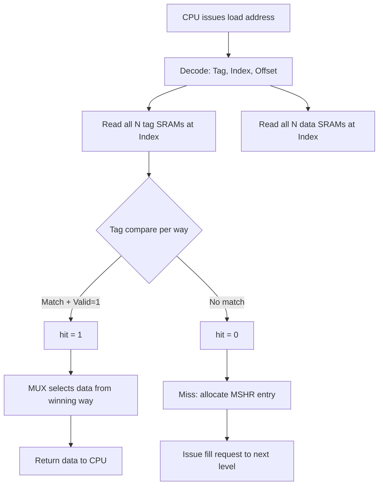
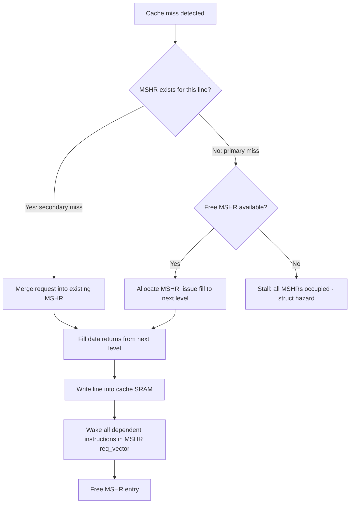

# Cache Microarchitecture — Controller Design and Performance

> **Prerequisites:** [CPU_Architecture.md](./CPU_Architecture.md) (pipeline basics, memory hierarchy),
> [Memory.md](./Memory.md) (SRAM cell design, DRAM organization)
>
> **Hands off to:** [../Systems/Coherence_Protocols.md](../Systems/Coherence_Protocols.md),
> [../Systems/Memory_Controller.md](../Systems/Memory_Controller.md)

---

## Section 0 — Why This Page Exists

Cache design is the single topic that bridges processor microarchitecture and memory
system performance. Every high-performance core depends on its cache hierarchy to hide
the 100--300 cycle DRAM latency, and the cache controller is the logic that makes this
possible. This page covers the internals of that controller: the tag-compare datapath,
miss-handling state machines, write policies, refill optimizations, replacement
policies, prefetch engines, coherence protocols, and the power-reduction techniques
that modern designs employ.

This material appears in virtually every CPU design interview at companies that build
cores -- Apple, Arm, Qualcomm, AMD, Intel, Google, and the GPU/accelerator vendors.
The goal is to move beyond "caches store frequently used data" and reach the level
where you can whiteboard a four-way set-associative L1 data cache controller with
MSHR miss handling and MESI coherence.

---

## 1. Cache Pipeline

### 1.1 The One-Cycle Hit Path

A cache that can return data in a single cycle must perform tag lookup and data lookup
in parallel. The address from the CPU is decomposed into three fields:

$$
\text{Address} = [\,\underbrace{\text{Tag}}_{\text{upper bits}}\,|\,\underbrace{\text{Index}}_{\text{middle bits}}\,|\,\underbrace{\text{Block Offset}}_{\text{lower bits}}\,]
$$

In cycle 0, the index drives the word lines of all $N$ tag SRAMs and all $N$ data
SRAMs simultaneously. The tag bits from each way are compared against the CPU-provided
tag using $N$ parallel equality comparators. The comparator outputs are OR-reduced into
a single `hit` signal. A multiplexer steered by the winning way selects the correct
data word.

```
CPU Address
  |
  +---> Index ---> +------+
  |                | Tag   |--- tag_way_0 --+
  |                | SRAM 0|                |
  |                +------+                +--> Comparator 0 --+
  |                                                            |
  +---> Index ---> +------+                                   |
  |                | Tag   |--- tag_way_1 --+                  |
  |                | SRAM 1|                +--> Comparator 1 --+--> OR ---> hit/miss
  |                +------+                                   |
  |                                                            |
  |                +------+                                   |
  +---> Index ---> | Data  |--- data_way_0 --+                |
                   | SRAM 0|                 +---> MUX <------+
                   +------+       ...         (steered by winning way)
```

**Timing constraint:** The tag SRAM read, comparator logic, and data MUX must all
complete within one clock period. At 4 GHz this is 250 ps, which is tight. The tag
SRAM is much smaller than the data SRAM, so its access time is shorter; designers
exploit this asymmetry to close timing.

### 1.2 The Two-Cycle Hit (Power-Optimized)

Reading all $N$ data SRAMs in parallel wastes power when only one way contains the
requested data. A two-cycle pipeline splits the operation:

| Cycle | Operation |
|-------|-----------|
| 1     | Read tag SRAMs for all ways; compare tags; determine winning way |
| 2     | Read only the winning way's data SRAM; return data to CPU |

This saves approximately $(N-1)/N$ of the data SRAM read energy at the cost of one
cycle of additional load-to-use latency. Most L2 and L3 caches use this scheme.
L1 caches that can afford the power may also use it when clock frequency is very high
(e.g., Apple Firestorm P-core L1D at 3.2 GHz uses a two-cycle path).

### 1.3 Tag/Data SRAM Partitioning

An $N$-way set-associative cache physically contains:

- $N$ tag SRAM arrays (each stores tag bits + valid bit + dirty bit per line)
- $N$ data SRAM arrays (each stores the data payload per line)

For a 4-way 32 KB cache with 64 B lines:

$$
\text{Sets} = \frac{32\,\text{KB}}{4 \times 64\,\text{B}} = 128\,\text{sets}
$$

Each tag SRAM has 128 entries, each holding:
- Tag bits = $32 - \lceil\log_2 128\rceil - \lceil\log_2 64\rceil = 32 - 7 - 6 = 19$ bits
- 1 valid bit
- 1 dirty bit (write-back caches)
- Total per entry: 21 bits per way, 84 bits per set across 4 ways

Each data SRAM has 128 entries of 64 B = 512 bits.

### 1.4 Hit/Miss Resolution

The hit/miss logic is a simple comparator tree:

$$
\text{hit} = \bigvee_{i=0}^{N-1} (\text{tag}_{\text{CPU}} == \text{tag}_i) \wedge \text{valid}_i
$$

On a hit, the winning way index drives the data MUX select. On a miss, the cache
controller asserts `miss` to the MSHR subsystem. The entire resolution takes one
multiplexer delay plus one OR gate delay after the tag SRAM outputs stabilize.



---

## 2. Non-Blocking Cache and MSHR

### 2.1 Motivation

A blocking cache stalls the entire pipeline on every miss. If the L1 miss rate is 5%
and each miss costs 100 cycles, the CPI penalty is $0.05 \times 100 = 5.0$ -- half of
all cycles are wasted. A non-blocking cache allows the processor to continue executing
independent instructions while the miss is serviced.

### 2.2 MSHR Structure

The **Miss Status Holding Register (MSHR)** tracks every outstanding cache miss. Each
entry contains:

| Field | Purpose |
|-------|---------|
| `valid` | Entry is active |
| `line_addr` | Cache line address (tag + index) of the missed line |
| `req_vector` | Bit mask: which words within the line have been requested |
| `dest_reg[]` | Physical register destinations for each requesting instruction |
| `state` | Current state of the miss (issued, fill pending, etc.) |
| `way` | Allocated way in the cache set for this line |

When a new miss arrives, the controller checks whether an MSHR already exists for
that line address. If so, the new request is a **secondary miss** and its destination
register is appended to the existing MSHR entry. If not, a free MSHR is allocated and
the fill request is issued to the next cache level or memory controller.



### 2.3 MSHR Count

| Cache Level | Typical MSHR Entries | Rationale |
|-------------|---------------------|-----------|
| L1 I-cache  | 4--8                | Few simultaneous I-fetch streams |
| L1 D-cache  | 8--16               | Multiple outstanding loads from OoO execution |
| L2          | 32--64              | Must track misses from all L1 MSHRs |
| L3          | 64--128+            | Aggregation from multiple cores |

The total number of outstanding misses that can be tracked simultaneously equals the
MSHR count. Intel Skylake L1D has 10 load-buffer entries (functionally similar to
MSHRs) plus 6 fill-buffer entries; Apple M1 L1D has 14.

### 2.4 Hit-Under-Miss

The key property of a non-blocking cache is **hit-under-miss**: while an MSHR is
tracking an outstanding miss, the cache can still service hits to other lines. The
pipeline only stalls when:
1. A new miss occurs and no MSHR is free (structural hazard).
2. An instruction depends on the data from a pending miss (data hazard).

### 2.5 Split-Transaction Bus

In a **split-transaction** (or split-phase) bus, the request and response are
decoupled. The cache issues a fill request with a transaction ID and continues
processing other accesses. When the response arrives (potentially many cycles later),
the transaction ID is used to match it to the correct MSHR. This is essential for
bandwidth utilization -- a single miss does not lock the bus for its entire latency.

---

## 3. Write Policy

### 3.1 Write-Allocate vs. No-Write-Allocate

| Policy | On Write Miss | Used By |
|--------|---------------|---------|
| Write-allocate | Fetch the line into cache, then write the word | Most D-caches (L1, L2, L3) |
| No-write-allocate | Write directly to next level; line not fetched | Some I-caches, write-through L1s |

Write-allocate is dominant because most programs exhibit spatial locality on writes
(e.g., zeroing a buffer, copying a struct). Fetching the line amortizes the miss cost
over multiple subsequent writes to adjacent words.

### 3.2 Write-Through vs. Write-Back

**Write-through:** Every store writes to both the cache (if the line is present) and
the next level immediately.

- Advantage: coherence is simple -- the next level always has up-to-date data.
- Disadvantage: high write bandwidth consumption.

**Write-back:** A store modifies only the cache line. The dirty bit is set. The line
is written to the next level only upon eviction.

- Advantage: multiple writes to the same line are coalesced; write bandwidth is
  reduced by the ratio of writes-per-line to 1.
- Disadvantage: coherence complexity -- other caches may hold stale copies.

Modern high-performance designs overwhelmingly use write-back at every level. ARM
Neoverse N2, Apple M-series, AMD Zen 4, and Intel Golden Cove all use write-back L1D.
Write-through is found in simpler embedded cores and in some L1 designs where
coherence simplicity is valued over bandwidth.

### 3.3 Write Buffer

A **write buffer** (or writeback buffer) sits between the cache and the next level,
decoupling the CPU from the next-level write latency:

- On a write-through: the CPU writes to the cache and the write buffer simultaneously.
  The CPU continues as soon as the write buffer accepts the entry.
- On a write-back eviction: the dirty line is placed in the writeback buffer, and the
  new line is fetched immediately. The writeback buffer drains to the next level in
  the background.

**Write buffer merging:** If the buffer contains a pending write to line $L$ and a
new write to $L$ arrives, the two are merged into a single entry. This can reduce
traffic by 2--8x for sequential write patterns.

Typical write buffer depth: 4--16 entries (L1), 16--32 entries (L2).

---

## 4. Refill Optimization

### 4.1 Critical-Word-First (CWF)

When a cache line fill begins, the memory system returns the **requested word first**,
before the rest of the line. The CPU can resume execution as soon as the critical word
arrives, without waiting for the full 64 B transfer.

Example: CPU accesses address 0x1004 (word at offset +4 in a 64 B line starting at
0x1000). The memory controller returns bytes [0x1004..0x1007] first, then fills
[0x1000..0x1003] and [0x1008..0x103F].

Savings: up to $(B/4 - 1) \times T_{\text{bus-width}}$ cycles, where $B$ is the line
size. For a 64 B line on a 16-byte-wide bus, a full line transfer takes 4 beats; CWF
saves up to 3 cycles of stall time.

### 4.2 Early Restart

A simpler variant: the fill proceeds in order from the base of the line, but as soon
as the requested word arrives (wherever it falls in the beat order), the CPU is
un-stalled. This avoids the need to reorder the memory bus but provides less savings
if the requested word is near the end of the line.

### 4.3 Line Fill Buffer

A **line fill buffer** holds the incoming cache line as it arrives beat by beat. The
cache SRAM is written only after the entire line is received. This serves two purposes:

1. The SRAM write port is not tied up during the multi-cycle fill.
2. If the CPU re-accesses the filling line (secondary miss to same MSHR), the fill
   buffer can supply the data directly if the requested word has already arrived.

---

## 5. Prefetch Engines

### 5.1 Stream Prefetcher

Detects sequential (stride = +1 cache line) access patterns and prefetches the next
$D$ lines, where $D$ is the **prefetch degree** (typically 1--4).

- Detection: maintain a small table of recent access addresses per page or per
  stride-tracking entry. If consecutive accesses hit adjacent line addresses,
  a stream is detected.
- Action: prefetch lines $+1, +2, \ldots, +D$ ahead of the current access.
- Limitation: only handles unit-stride patterns. Pointer-chasing, strided, or
  irregular patterns are missed.

### 5.2 Stride Prefetcher

Generalizes the stream prefetcher by tracking arbitrary constant strides. Each entry
records a base address and the last observed stride $\Delta$. On a new access:

1. Compute the new stride: $\Delta_{\text{new}} = A_{\text{new}} - A_{\text{prev}}$.
2. If $\Delta_{\text{new}} == \Delta_{\text{prev}}$ for two consecutive observations,
   the pattern is confirmed.
3. Prefetch address $= A_{\text{new}} + \Delta$.

Handles both forward and backward strides. Common in L1 D-cache prefetchers.
Intel calls this the "stride prefetcher"; ARM Neoverse uses it in the L1.

### 5.3 Correlation Prefetcher

Records sequences of cache miss addresses (or page + offset pairs) in a history table.
When a miss occurs, the table is consulted to predict future misses based on past
sequences.

- Markov prefetcher: a table maps $(A_i \to \{A_j, A_k, \ldots\})$, where the set
  contains addresses observed to follow $A_i$ in the past.
- Good for pointer-chasing (linked lists, trees) where strides are irregular.
- Disadvantage: large storage requirement; less practical for L1 due to area/power.

### 5.4 Prefetch Metrics

$$
\text{Accuracy} = \frac{\text{Useful Prefetches}}{\text{Total Prefetches Issued}}
$$

$$
\text{Coverage} = \frac{\text{Useful Prefetches}}{\text{Total Cache Misses}}
$$

$$
\text{Prefetch Overhead} = \frac{\text{Useless Prefetches} \times \text{BW per Prefetch}}{\text{Total Available Bandwidth}}
$$

Design target for L1 prefetchers: accuracy > 90% (to avoid polluting the small
cache). L2 prefetchers can tolerate lower accuracy (70--80%) because the L2 is larger
and pollution is less catastrophic.

### 5.5 Prefetch Degree and Timeliness

The **prefetch degree** $D$ controls how many lines ahead to prefetch. Higher $D$
increases coverage for sequential patterns but risks:
- **Pollution:** evicting useful lines from the cache.
- **Bandwidth saturation:** consuming memory bandwidth needed by demand accesses.

**Timeliness** means the prefetched line should arrive before it is demanded but not
so early that it gets evicted again. Late prefetches waste bandwidth; early prefetches
waste cache capacity. The ideal prefetch distance (in cycles) is:

$$
\text{Prefetch Distance} = \frac{\text{Miss Latency}}{\text{Cycles Between Accesses}}
$$

### 5.6 L1 vs. L2 Prefetching

| Attribute | L1 Prefetcher | L2 Prefetcher |
|-----------|---------------|---------------|
| Accuracy target | > 90% | 70--85% |
| Types | Stride, next-line | Stream, stride, correlation |
| Degree | 1--2 | 2--8 |
| Pollution cost | High (small cache) | Moderate (large cache) |
| Coverage target | 20--40% of L1 misses | 50--80% of L2 misses |

---

## 6. Cache Hierarchy Design

### 6.1 Typical Parameters

| Parameter | L1 I\$ | L1 D\$ | L2 | L3 |
|-----------|--------|--------|-----|-----|
| Size | 32--64 KB | 32--64 KB | 256 KB--1 MB | 2--64 MB |
| Associativity | 4--8 way | 4--8 way | 8--16 way | 12--16 way |
| Line size | 64 B | 64 B | 64--128 B | 64--128 B |
| Hit latency | 3--4 cyc | 3--4 cyc | 8--14 cyc | 30--50 cyc |
| MSHR count | 4--8 | 8--16 | 16--64 | 64--128+ |
| Ports | 1--2R | 2R+1W or 2RW | 1R+1W | 1R+1W |
| Private/Shared | Private | Private | Private or shared | Shared |

### 6.2 Cache Sizing Math

The total number of sets in an $N$-way set-associative cache with line size $L$ and
total capacity $C$ is:

$$
\text{Sets} = \frac{C}{N \times L}
$$

The number of index bits is $\lceil\log_2(\text{Sets})\rceil$. The number of block
offset bits is $\lceil\log_2 L\rceil$. The tag size is:

$$
\text{Tag bits} = \text{Address bits} - \text{Index bits} - \text{Offset bits}
$$

Total SRAM bits (data + tag overhead) for one way:

$$
\text{Data SRAM per way} = \text{Sets} \times L \times 8 \text{ bits}
$$

$$
\text{Tag SRAM per way} = \text{Sets} \times (\text{Tag bits} + 1_{\text{valid}} + 1_{\text{dirty}})
$$

### 6.3 Inclusive vs. Exclusive Hierarchies

**Inclusive:** All data in L1/L2 is also present in L3.

- Advantage: snooping for coherence only needs to check L3. If L3 does not contain a
  line, no private cache does. This simplifies directory and snoop logic.
- Disadvantage: wastes capacity. L3 must be at least as large as the sum of all
  private caches (otherwise back-invalidation is needed).
- Used by: Intel (most generations), IBM Power.

**Exclusive:** L3 contains only lines evicted from L2 (no duplication).

- Advantage: effective capacity = L2 capacity + L3 capacity (no duplication waste).
- Disadvantage: on a coherence check, all private caches must be probed in parallel.
  Victim allocation: evicted L2 lines are placed into L3 rather than discarded.
- Used by: AMD Zen, some ARM designs.

**Non-inclusive / non-exclusive (NINE):** No strict relationship. Lines may be
allocated independently at any level. Flexible but complex coherence.

### 6.4 Victim Cache

A small (4--16 entry) fully-associative cache that captures lines recently evicted
from L1. On an L1 miss, the victim cache is probed in parallel with L2. If the line
is found, it is swapped back into L1 (and the evicted line goes into the victim cache).
Effective at reducing conflict misses in low-associativity L1 caches. Originally
proposed by Jouppi (1990).

---

## 7. Replacement Policies

### 7.1 LRU (Least Recently Used)

Exact LRU maintains a total ordering of all $N$ ways within a set. On an access, the
accessed way moves to the "most recently used" position. On eviction, the "least
recently used" way is chosen.

Storage cost: $\lceil\log_2(N!)\rceil$ bits per set. For $N=4$, this is
$\lceil\log_2(24)\rceil = 5$ bits. For $N=16$, it is $\lceil\log_2(16!)\rceil = 45$
bits. This grows quickly and makes exact LRU impractical for high associativity.

### 7.2 PLRU (Pseudo-LRU)

Tree-based approximation using $N-1$ bits per set. Organize the $N$ ways as leaves of
a binary tree. Each internal node stores 1 bit indicating which subtree was accessed
more recently. On access, the bits along the path from root to the accessed leaf are
updated to point away from that leaf. On eviction, follow the bits from root to leaf
to find the least-recently-used candidate.

For $N=4$: 3 bits per set.

```
        b0
       /  \
     b1    b2
    / \   / \
   W0  W1 W2  W3

b0=0: left subtree (W0/W1) was more recently used --> evict from right (W2/W3)
b0=1: right subtree (W2/W3) was more recently used --> evict from left (W0/W1)
b1, b2 work similarly within their subtrees.
```

### 7.3 RRIP (Re-Reference Interval Prediction)

Each cache line has an $M$-bit **RRPV** (Re-Reference Interval Prediction) counter.
RRPV values:
- $2^M - 1$: distant re-reference (evict first)
- $2^M - 2$: long re-reference
- $0$: near-immediate re-reference

On access: set the line's RRPV to 0 (will be reused soon).
On eviction: choose the line with RRPV = $2^M - 1$. If no such line exists, increment
all RRPVs until one reaches $2^M - 1$.

With $M=2$ (2-bit RRIP), this is called **SRRIP** (Static RRIP). Lines are inserted
with RRPV = $2^M - 2$ (long re-reference), giving new lines one chance to prove
useful before being evicted. This avoids the "scan thrash" problem of LRU where a
sequential scan through a working set larger than the cache evicts all useful data.

### 7.4 SHiP (Shared-access-aware HiSTory-based Prefetching-aware Replacement)

Extends RRIP with a signature-based predictor. Shared lines (accessed by multiple
cores) and lines brought in by prefetch are given different insertion RRPV values
based on a small history table indexed by a signature (e.g., PC of the accessing
instruction). Lines whose signatures predict "low reuse" are inserted at RRPV =
$2^M - 1$ (likely to be evicted soon). Lines with "high reuse" signatures are
inserted at RRPV = 0.

### 7.5 Worked Example: 4-Way Set, Access Sequence A B C D A E

Initial state: all ways empty (Invalid).

**LRU trace:**

| Access | Way Assignment | MRU order (newest...oldest) | Eviction |
|--------|---------------|------------------------------|----------|
| A | Way 0 | A | -- |
| B | Way 1 | B, A | -- |
| C | Way 2 | C, B, A | -- |
| D | Way 3 | D, C, B, A | -- |
| A | Way 0 (hit) | A, D, C, B | -- |
| E | Way 1 (evicts B, LRU) | E, A, D, C | B evicted |

**PLRU trace (3 bits: b0, b1, b2):** Initial state b0=b1=b2=0.

| Access | Action | Bits after | Way hit/assigned |
|--------|--------|------------|------------------|
| A | Assign Way 0, set path to point left | b0=0, b1=0, b2=0 | Way 0 |
| B | Assign Way 1, b1=1 | b0=0, b1=1, b2=0 | Way 1 |
| C | Assign Way 2, b2=0, b0=1 | b0=1, b1=1, b2=0 | Way 2 |
| D | Assign Way 3, b2=1, b0=1 | b0=1, b1=1, b2=1 | Way 3 |
| A | Hit Way 0, b1=0, b0=0 | b0=0, b1=0, b2=1 | Way 0 |
| E | Follow bits: b0=0 --> right, b2=1 --> left, evict Way 2 | | Way 2 evicted |

LRU evicts **B**; PLRU evicts **C** (or **B** depending on bit encoding -- the
point is they may differ). For the access sequence A A B C D E A F G, PLRU will
differ from LRU in the later evictions, demonstrating the approximation gap.

**RRIP trace (2-bit SRRIP, insert at RRPV=2):**

| Access | Way 0 | Way 1 | Way 2 | Way 3 | Action |
|--------|-------|-------|-------|-------|--------|
| A | 2 | -- | -- | -- | Insert A at RRPV=2 |
| B | 2 | 2 | -- | -- | Insert B |
| C | 2 | 2 | 2 | -- | Insert C |
| D | 2 | 2 | 2 | 2 | Insert D |
| A | 0 | 2 | 2 | 2 | Hit A, set RRPV=0 |
| E | 2 | 3 | 2 | 2 | Evict B (highest RRPV was tied, age-order breaks tie), insert E at 2 |

RRIP evicts **B** (same as LRU in this case, but the mechanism differs).

---

## 8. Cache Power Optimization

### 8.1 Way Prediction

Predict which way will hit before reading any data SRAM. A small **way predictor**
(typically a tag-hash table indexed by PC or address) produces a predicted way. Only
the predicted way's data SRAM is read in the first cycle.

- If prediction is correct: single-cycle access with $1/N$ of the data SRAM energy.
- If prediction is wrong: the remaining ways are read in the second cycle (two-cycle
  total). Misprediction rate is typically 5--15%.

Used in: ARM Cortex-A series L1D, Intel L1I (way-prediction for instruction fetch).

### 8.2 Sequential (Tag-First) Access

As described in Section 1.2, reading tags first and only reading the winning way's
data SRAM saves $(N-1)/N$ of data SRAM read energy. This is the most common power
optimization for L2 and L3 caches. The trade-off is one additional cycle of latency.

### 8.3 Drowsy Caches

Reduce the supply voltage of cache lines that have not been accessed recently. The
line's data is retained (not lost) but cannot be read at full speed. When accessed,
the line is "woken up" to full voltage (typically 1--2 cycles). Can reduce L2 cache
leakage power by 40--60% with < 1% performance loss.

### 8.4 Cache Way Gating

Disable entire ways when the working set is small. A control register or hardware
monitor disables ways by preventing their word lines from firing. Effective for L3
caches in low-load situations. Modern Intel processors dynamically enable/disable L3
ways based on demand (e.g., RAPL power management).

---

## 9. Cache Coherence

### 9.1 The Coherence Problem

In a multicore system, each core has private L1 (and possibly L2) caches. When Core 0
writes to address X, Core 1's copy of X (if cached) becomes stale. A coherence
protocol ensures that all cores observe a consistent order of writes and never read
stale data.

**Coherence invariant (single-writer, multi-reader):** For any memory address, at any
time, either (a) exactly one cache has the line in Modified state (can write), or
(b) zero or more caches have the line in Shared state (can read), but never both (a)
and (b) simultaneously.

### 9.2 MESI Protocol

Four states per cache line:

| State | Meaning | Can Read? | Can Write? | Dirty? | In Other Caches? |
|-------|---------|-----------|------------|--------|-------------------|
| **M**odified | Line is dirty; this cache has the only valid copy | Yes | Yes | Yes | No |
| **E**xclusive | Line is clean; this cache has the only copy | Yes | No | No | No |
| **S**hared | Line is clean; other caches may also have it | Yes | No | No | Possibly |
| **I**nvalid | Line is not valid | No | No | -- | -- |

Bus transactions:

| Transaction | Meaning |
|-------------|---------|
| BusRd | Request a shared copy of a line |
| BusRdX | Request an exclusive (writable) copy |
| BusUpgr | Announce upgrade from S to M (already have the line) |
| Flush | Write back modified data to memory |

### 9.3 MESI State Transition Table

Actions are formatted as: **received signal / action taken**.

| Current State | Processor Read | Processor Write | BusRd (from other core) | BusRdX / BusUpgr |
|---------------|---------------|-----------------|-------------------------|-------------------|
| **I** | BusRd --> S or E | BusRdX --> M | -- | -- |
| **S** | Hit: stay S | BusUpgr --> M | Stay S | --> I |
| **E** | Hit: stay E | --> M (silent) | Flush --> S | --> I |
| **M** | Hit: stay M | Hit: stay M | Flush --> S | Flush --> I |

Key transitions explained:

- **I to S or E on BusRd:** If no other cache responds (no shared assert), the line
  arrives in E (exclusive). If another cache asserts shared, the line arrives in S.
- **E to M on write:** No bus transaction needed. The core already has the only copy.
  This is the "silent upgrade" and is a major advantage of the E state.
- **M to S on BusRd:** The modified cache must flush the data to memory (or supply it
  directly to the requester via a write-back). Both caches end in S.

### 9.4 MOESI Protocol

Extends MESI with an **O** (Owned) state:

| State | Meaning |
|-------|---------|
| **O**wned | Dirty but shared. This cache is responsible for supplying the line to other requesters (avoids memory read). |

When a modified line is read by another core via BusRd, instead of writing back to
memory and transitioning both to S, the original holder transitions to O and the
requester enters S. The owner supplies data on subsequent BusRd events without
touching memory. Only when the owner evicts the line does it write back to memory.

Advantage: reduces memory bandwidth for shared-read data that was recently written.
Used by: AMD (all modern designs), ARM (optionally).

### 9.5 Directory-Based Coherence

For systems with many cores (16+), snooping every cache on every bus transaction
becomes impractical. A **directory** maintains coherence metadata per cache line:

| Directory Entry Field | Meaning |
|-----------------------|---------|
| State | Uncached, Shared, Modified |
| Sharer vector | Bit vector: bit $i$ = 1 if core $i$ has a copy |
| Owner | Which core has the line in Modified state |

Protocol (simplified):

1. **Core $i$ reads line $L$ (miss):** Directory checks state.
   - Uncached: supply from memory, set state=Shared, set bit $i$.
   - Shared: supply from memory (or owner), set bit $i$.
   - Modified: send fetch request to owner; owner downgrades to Shared and sends
     data to core $i$; directory sets state=Shared, sets bit $i$.

2. **Core $i$ writes line $L$:** Directory checks state.
   - Uncached: supply from memory, set state=Modified, owner=$i$.
   - Shared: send invalidate to all sharers (bits set in sharer vector); wait for
     acknowledgments; set state=Modified, owner=$i$, clear all other bits.
   - Modified by other core $j$: send fetch-invalidate to $j$; $j$ sends data to $i$
     and transitions to I; directory sets owner=$i$.

**Coherence traffic calculation:** If a line is shared by $K$ cores and one core writes
to it, the directory must send $K-1$ invalidate messages and receive $K-1$
acknowledgments. Total messages: $2(K-1)$. For a 64-core system with a hot shared
variable, a single write can generate 126 messages.

### 9.6 Coherence Scope Example

Consider a 4-core system with MESI. Line X is initially in memory only (all caches I).

```
Step 1: Core 0 reads X (miss)
  BusRd issued. No other cache responds.
  Core 0: I --> E
  Bus transactions: 1 BusRd, memory supplies data

Step 2: Core 1 reads X (miss)
  BusRd issued. Core 0 sees BusRd, asserts Shared, flushes.
  Core 0: E --> S (flush)
  Core 1: I --> S
  Bus transactions: 1 BusRd, 1 Flush from Core 0

Step 3: Core 0 writes X
  Core 0 in S, needs exclusive. Issues BusUpgr.
  Core 1 sees BusUpgr: S --> I
  Core 0: S --> M
  Bus transactions: 1 BusUpgr, Core 1 invalidates silently

Step 4: Core 1 reads X (miss)
  BusRd issued. Core 0 sees BusRd, has M, must flush.
  Core 0: M --> S (flush to memory + supply to Core 1)
  Core 1: I --> S
  Bus transactions: 1 BusRd, 1 Flush from Core 0
```

---

## 10. Numbers to Memorize

| Parameter | L1 I\$ | L1 D\$ | L2 | L3 | DRAM |
|-----------|--------|--------|-----|-----|------|
| Size | 32--64 KB | 32--64 KB | 256 KB--1 MB | 2--64 MB | 8--128 GB |
| Associativity | 4--8 | 4--8 | 8--16 | 12--16 | -- |
| Line size | 64 B | 64 B | 64--128 B | 64--128 B | 64 B row window |
| Hit latency | 3--4 cyc | 3--4 cyc | 8--14 cyc | 30--50 cyc | 100--300 cyc |
| Miss rate (SPEC) | 1--3% | 5--10% | 0.5--2% | < 0.5% | -- |
| MSHR count | 4--8 | 8--16 | 16--64 | 64--128 | -- |
| Bandwidth | 64--256 GB/s | 64--256 GB/s | 128--512 GB/s | 64--256 GB/s | 25--50 GB/s |
| Write policy | -- | Write-back | Write-back | Write-back | -- |
| Allocation | -- | Write-alloc | Write-alloc | Write-alloc | -- |

Additional key numbers:

| Quantity | Value |
|----------|-------|
| Typical L1D AMAT | 1.5--3.0 cycles |
| Typical full-hierarchy AMAT | 5--15 cycles |
| MESI state bits per line | 2 (M, E, S, I encoded as 2 bits) |
| MOESI state bits per line | 3 |
| LRU bits for 4-way set | 5 |
| PLRU bits for 4-way set | 3 |
| PLRU bits for 8-way set | 7 |
| PLRU bits for N-way set | $N - 1$ |
| Write buffer entries (L1) | 4--16 |
| Prefetch accuracy target (L1) | > 90% |
| Prefetch accuracy target (L2) | 70--85% |
| DDR4-3200 peak bandwidth | 25.6 GB/s (single channel) |
| DDR5-5600 peak bandwidth | 44.8 GB/s (single channel) |

---

## 11. Worked Interview Problems

### Problem 1: Design a 4-Way 32 KB L1 D-Cache

**Given:** 32-bit byte addresses, 64 B line size, 4-way set associative, 32 KB total.

**Find:** Index bits, tag bits, total SRAM size (data + tag).

**Solution:**

$$
\text{Sets} = \frac{32 \times 1024}{4 \times 64} = \frac{32768}{256} = 128
$$

$$
\text{Index bits} = \lceil\log_2 128\rceil = 7
$$

$$
\text{Offset bits} = \lceil\log_2 64\rceil = 6
$$

$$
\text{Tag bits} = 32 - 7 - 6 = 19
$$

**Data SRAM per way:**
$$
128 \text{ sets} \times 64 \text{ B} = 8192 \text{ B} = 8 \text{ KB per way}
$$

Total data SRAM: $4 \times 8\text{ KB} = 32\text{ KB}$. (This is the cache capacity by definition.)

**Tag SRAM per way:**
$$
128 \text{ sets} \times (19 \text{ tag} + 1 \text{ valid} + 1 \text{ dirty}) = 128 \times 21 = 2688 \text{ bits}
$$

Total tag SRAM: $4 \times 2688 = 10752 \text{ bits} = 1344 \text{ B} \approx 1.3 \text{ KB}$.

**Total SRAM = 32 KB (data) + 1.3 KB (tag) = 33.3 KB** (about 4% overhead).

---

### Problem 2: MSHR Contention

**Given:** L1 D-cache with 4 MSHRs. The following misses occur in order: addresses
A, B, C, D, E (all to different cache lines). Assume each miss takes 20 cycles to
resolve and one new miss arrives every 5 cycles.

**Find:** What happens on the 5th miss? Show the timing.

**Solution:**

| Cycle | Event | MSHR State |
|-------|-------|------------|
| 0 | Miss to A | MSHR[0] = A (allocated) |
| 5 | Miss to B | MSHR[1] = B (allocated) |
| 10 | Miss to C | MSHR[2] = C (allocated) |
| 15 | Miss to D | MSHR[3] = D (allocated) |
| 20 | Miss to E, A returns (MSHR[0] freed) | E allocated to MSHR[0] -- **just in time** |

In this case, the 5th miss at cycle 20 coincides with the first miss completing.
If the miss latency were 25 cycles instead of 20, or the miss arrival rate were 4
cycles instead of 5:

| Cycle | Event | MSHR State |
|-------|-------|------------|
| 0 | Miss A | MSHR[0]=A |
| 4 | Miss B | MSHR[1]=B |
| 8 | Miss C | MSHR[2]=C |
| 12 | Miss D | MSHR[3]=D |
| 16 | Miss E | **No free MSHR** --> pipeline stalls |

The CPU must stall at cycle 16 until an MSHR is freed (at cycle 25 when the first
miss completes). **Stall duration = 25 - 16 = 9 cycles.**

**Key insight:** MSHR count determines how many misses can be overlapped. With $M$
MSHRs and average miss latency $L$ cycles, the maximum sustainable miss rate before
stalling is:

$$
\text{Max miss rate} = \frac{M}{L} \text{ misses per cycle}
$$

With $M=4$ and $L=20$: max = 0.2 misses/cycle = 1 miss every 5 cycles. Exceeding
this rate causes structural stalls.

---

### Problem 3: LRU vs. PLRU Eviction Comparison

**Given:** 4-way set-associative cache, access sequence: **A A B C D E A F G**

Assume the set starts empty. Track which line is evicted for each compulsory miss
and for the conflict miss(es).

**LRU Solution:**

| Access | MRU --> LRU Order | Action |
|--------|-------------------|--------|
| A | A _ _ _ | Compulsory miss, load into Way 0 |
| A | A _ _ _ | Hit A |
| B | B A _ _ | Compulsory miss, load |
| C | C B A _ | Compulsory miss, load |
| D | D C B A | Compulsory miss, load (set full) |
| E | E D C B | Evict **A** (LRU), load E |
| A | A E D C | Evict **B** (LRU), load A |
| F | F A E D | Evict **C** (LRU), load F |
| G | G F A E | Evict **D** (LRU), load G |

Evictions under LRU: A, B, C, D.

**PLRU Solution (3 bits, initial 000):**

| Access | b0 b1 b2 | Assignment | Notes |
|--------|----------|------------|-------|
| A | 0 0 0 | Way 0 | Follow tree: all 0, go left-left = Way 0. Update b1=1. |
| A | 0 1 0 | Way 0 (hit) | Update b1=1 (already). |
| B | 0 1 0 | Way 1 | b1=1, go right within left subtree = Way 1. Update b1=0. |
| C | 1 0 0 | Way 2 | b0=0, go right subtree. b2=0, go left = Way 2. Update b2=1. |
| D | 1 0 1 | Way 3 | b0=0, go right. b2=1, go right = Way 3. Update b0=1. |
| E | 1 0 1 | Evict Way 2 | b0=1, go left. b1=0, go left = Way 0 has A. But Way 0 was recently used... |

The precise PLRU eviction depends on the bit-update convention, but the key point is:
**PLRU may evict a different line than LRU**, and for some pathological sequences,
PLRU can thrash (evicting a line that will be needed soon) while LRU does not.

---

### Problem 4: Cache Bandwidth Calculation

**Given:** 64 B cache line, 4 GHz clock, 1 access per cycle.

**(a) Peak cache bandwidth:**
$$
\text{Bandwidth} = 64\text{ B} \times 4 \times 10^9 \text{ cyc/s} = 256 \times 10^9 \text{ B/s} = 256 \text{ GB/s}
$$

**(b) How many cache fills per second can DDR4-3200 sustain?**

DDR4-3200 dual-channel peak bandwidth:
$$
\text{DDR4-3200 single channel} = 3200 \times 10^6 \times 8 \text{ B} = 25.6 \text{ GB/s}
$$
$$
\text{Dual channel} = 51.2 \text{ GB/s}
$$

Each cache fill transfers 64 B, so:
$$
\text{Fills/s} = \frac{51.2 \times 10^9}{64} = 800 \times 10^6 = 800\text{M fills/s}
$$

**(c) What miss rate saturates the DDR4 bandwidth at 256 GB/s cache bandwidth?**

Let $r$ be the miss rate. Cache bandwidth $= 256$ GB/s. Miss traffic $= r \times 256$ GB/s.
This must not exceed DDR4 bandwidth (51.2 GB/s dual-channel):

$$
r \times 256 = 51.2 \implies r = \frac{51.2}{256} = 0.2 = 20\%
$$

A 20% L1 miss rate would saturate the memory system. Typical L1D miss rates are
5--10%, so DDR4-3200 dual-channel can support a single core with some headroom. But
8 cores all streaming at 10% miss rate would require $8 \times 0.1 \times 256 = 204.8$
GB/s, far exceeding the 51.2 GB/s available. This is why multi-core scaling is
limited by memory bandwidth.

---

### Problem 5: MESI Protocol Trace

**Given:** 4-core system with MESI, shared bus. Line X initially not cached anywhere.

**Trace:**

| Step | Event | Core 0 State | Core 1 State | Core 2 State | Core 3 State | Bus Transaction |
|------|-------|-------------|-------------|-------------|-------------|-----------------|
| 0 | Initial | I | I | I | I | -- |
| 1 | Core 0 reads X (miss) | **E** | I | I | I | BusRd. Memory supplies. No other cache has X, so E (exclusive). |
| 2 | Core 1 reads X (miss) | **S** | **S** | I | I | BusRd. Core 0 sees it, asserts Shared, flushes. Both now S. |
| 3 | Core 0 writes X | **M** | **I** | I | I | BusUpgr. Core 1 sees it, invalidates (S-->I). Core 0 silently upgrades S-->M. |
| 4 | Core 1 reads X (miss) | **S** | **S** | I | I | BusRd. Core 0 has M, must flush. Core 0: M-->S. Core 1: I-->S. Memory updated via flush. |
| 5 | Core 2 reads X (miss) | **S** | **S** | **S** | I | BusRd. Cores 0,1 have S, assert Shared. Core 2 gets S. Memory can also supply (data was flushed in step 4). |
| 6 | Core 3 writes X | **I** | **I** | **I** | **M** | BusRdX. Cores 0,1,2 all have S, all invalidate (S-->I). Core 3: I-->M. |

**Total bus transactions:** 6 (3 BusRd + 1 BusUpgr + 1 BusRd + 1 BusRdX).
**Total invalidations:** 1 (step 3) + 3 (step 6) = 4 invalidation actions.
**Total flushes:** 2 (step 2: Core 0 flushes M-data-to-be-S; step 4: Core 0 flushes M).

---

## References

1. Hennessy, J. L. and Patterson, D. A., *Computer Architecture: A Quantitative
   Approach*, 6th ed., Morgan Kaufmann, 2019. Chapters 2 and 5.
2. Jouppi, N. P., "Improving Direct-Mapped Cache Performance by the Addition of a
   Small Fully-Associative Cache and Prefetch Buffers," *ISCA*, 1990.
3. Kharbutli, M. and Solihin, Y., "Counter-Based Cache Replacement and Bypassing
   Algorithms," *IEEE Transactions on Computers*, 2008. (RRIP/SHiP origins.)
4. Jaleel, A. et al., "High Performance Cache Replacement Using Re-Reference Interval
   Prediction (RRIP)," *ISCA*, 2010.
5. Culler, D. E. and Singh, J. P., *Parallel Computer Architecture: A
   Hardware/Software Approach*, Morgan Kaufmann, 1999. (Directory coherence.)
6. Sorin, D. J., Hill, M. D., and Wood, D. A., *A Primer on Memory Consistency and
   Cache Coherence*, 2nd ed., Morgan & Claypool, 2020.
7. ARM Ltd., "Arm Cortex-A78 Core Technical Reference Manual," ARM DDI 0414.
8. Intel Corp., "Intel 64 and IA-32 Architectures Optimization Reference Manual,"
   Order 248966.

---

[Prev: CPU Architecture](./CPU_Architecture.md) | [Up: Architecture](./Architecture.md) | [Next: Memory Design](./Memory.md)
