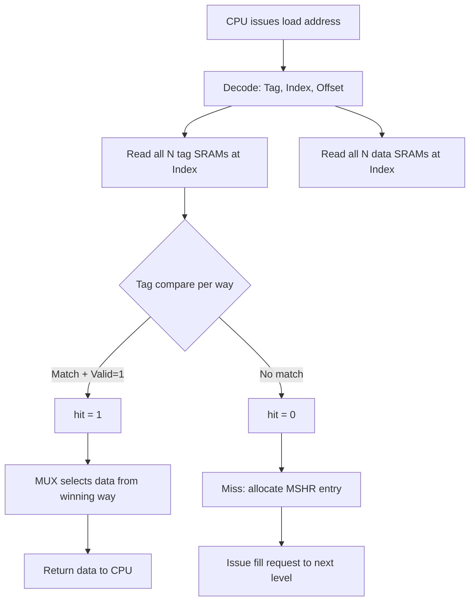
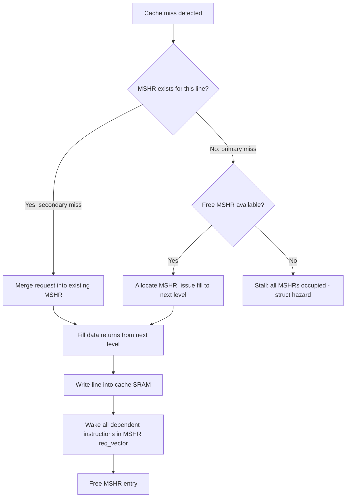

# Cache Microarchitecture — Controller Design and Performance

> **Prerequisites:** [CPU_Architecture.md](./CPU_Architecture.md) (pipeline basics, memory hierarchy),
> [Memory.md](./Memory.md) (SRAM cell design, DRAM organization)
>
> **Hands off to:** [../Systems/Coherence_Protocols.md](../Systems/Coherence_Protocols.md),
> [../Systems/Memory_Controller.md](../Systems/Memory_Controller.md)

---

## Section 0 — Why This Page Exists

Cache design is the single topic that bridges processor microarchitecture and memory
system performance. Every high-performance core depends on its cache hierarchy to hide
the 100--300 cycle DRAM latency, and the cache controller is the logic that makes this
possible. This page covers the internals of that controller: the tag-compare datapath,
miss-handling state machines, write policies, refill optimizations, replacement
policies, prefetch engines, coherence protocols, and the power-reduction techniques
that modern designs employ.

This material appears in virtually every CPU design interview at companies that build
cores -- Apple, Arm, Qualcomm, AMD, Intel, Google, and the GPU/accelerator vendors.
The goal is to move beyond "caches store frequently used data" and reach the level
where you can whiteboard a four-way set-associative L1 data cache controller with
MSHR miss handling and MESI coherence.

---

## 1. Cache Pipeline

### 1.1 The One-Cycle Hit Path

A cache that can return data in a single cycle must perform tag lookup and data lookup
in parallel. The address from the CPU is decomposed into three fields:

$$
\text{Address} = [\,\underbrace{\text{Tag}}_{\text{upper bits}}\,|\,\underbrace{\text{Index}}_{\text{middle bits}}\,|\,\underbrace{\text{Block Offset}}_{\text{lower bits}}\,]
$$

In cycle 0, the index drives the word lines of all $N$ tag SRAMs and all $N$ data
SRAMs simultaneously. The tag bits from each way are compared against the CPU-provided
tag using $N$ parallel equality comparators. The comparator outputs are OR-reduced into
a single `hit` signal. A multiplexer steered by the winning way selects the correct
data word.

```
CPU Address
  |
  +---> Index ---> +------+
  |                | Tag   |--- tag_way_0 --+
  |                | SRAM 0|                |
  |                +------+                +--> Comparator 0 --+
  |                                                            |
  +---> Index ---> +------+                                   |
  |                | Tag   |--- tag_way_1 --+                  |
  |                | SRAM 1|                +--> Comparator 1 --+--> OR ---> hit/miss
  |                +------+                                   |
  |                                                            |
  |                +------+                                   |
  +---> Index ---> | Data  |--- data_way_0 --+                |
                   | SRAM 0|                 +---> MUX <------+
                   +------+       ...         (steered by winning way)
```

**Timing constraint:** The tag SRAM read, comparator logic, and data MUX must all
complete within one clock period. At 4 GHz this is 250 ps, which is tight. The tag
SRAM is much smaller than the data SRAM, so its access time is shorter; designers
exploit this asymmetry to close timing.

### 1.2 The Two-Cycle Hit (Power-Optimized)

Reading all $N$ data SRAMs in parallel wastes power when only one way contains the
requested data. A two-cycle pipeline splits the operation:

| Cycle | Operation |
|-------|-----------|
| 1     | Read tag SRAMs for all ways; compare tags; determine winning way |
| 2     | Read only the winning way's data SRAM; return data to CPU |

This saves approximately $(N-1)/N$ of the data SRAM read energy at the cost of one
cycle of additional load-to-use latency. Most L2 and L3 caches use this scheme.
L1 caches that can afford the power may also use it when clock frequency is very high
(e.g., Apple Firestorm P-core L1D at 3.2 GHz uses a two-cycle path).

### 1.3 Tag/Data SRAM Partitioning

An $N$-way set-associative cache physically contains:

- $N$ tag SRAM arrays (each stores tag bits + valid bit + dirty bit per line)
- $N$ data SRAM arrays (each stores the data payload per line)

For a 4-way 32 KB cache with 64 B lines:

$$
\text{Sets} = \frac{32\,\text{KB}}{4 \times 64\,\text{B}} = 128\,\text{sets}
$$

Each tag SRAM has 128 entries, each holding:
- Tag bits = $32 - \lceil\log_2 128\rceil - \lceil\log_2 64\rceil = 32 - 7 - 6 = 19$ bits
- 1 valid bit
- 1 dirty bit (write-back caches)
- Total per entry: 21 bits per way, 84 bits per set across 4 ways

Each data SRAM has 128 entries of 64 B = 512 bits.

### 1.4 Hit/Miss Resolution

The hit/miss logic is a simple comparator tree:

$$
\text{hit} = \bigvee_{i=0}^{N-1} (\text{tag}_{\text{CPU}} == \text{tag}_i) \wedge \text{valid}_i
$$

On a hit, the winning way index drives the data MUX select. On a miss, the cache
controller asserts `miss` to the MSHR subsystem. The entire resolution takes one
multiplexer delay plus one OR gate delay after the tag SRAM outputs stabilize.



---

## 2. Non-Blocking Cache and MSHR

### 2.1 Motivation

A blocking cache stalls the entire pipeline on every miss. If the L1 miss rate is 5%
and each miss costs 100 cycles, the CPI penalty is $0.05 \times 100 = 5.0$ -- half of
all cycles are wasted. A non-blocking cache allows the processor to continue executing
independent instructions while the miss is serviced.

### 2.2 MSHR Structure -- Detailed Implementation

The **Miss Status Holding Register (MSHR)** tracks every outstanding cache miss. Each
entry contains:

| Field | Width | Purpose |
|-------|-------|---------|
| `valid` | 1 bit | Entry is active |
| `line_addr` | Tag + Index bits (e.g., 26 bits for 32KB/4-way/64B) | Cache line address of the missed line |
| `req_vector` | 1 bit per word in line (e.g., 16 bits for 64B/4B words) | Bit mask: which words within the line have been requested |
| `dest_reg[0..15]` | PReg ID per word (e.g., 7 bits x 16 entries) | Physical register destinations for each requesting instruction |
| `word_valid[0..15]` | 1 bit per word | Which dest_reg entries are valid |
| `state` | 2-3 bits | Current state: IDLE, ISSUED, FILL_PENDING, WRITEBACK_PENDING |
| `way` | $\lceil\log_2(\text{associativity})\rceil$ bits | Allocated way in the cache set for the new line |
| `dirty_victim` | 1 bit | The evicted line in the allocated way is dirty (needs writeback) |
| `byte_mask` | 1 bit per byte (for write merging) | Which bytes have been written by pending stores |

**MSHR entry size calculation (4-way 32KB cache, 64B lines, 7-bit phys reg IDs):**

```
1 (valid) + 26 (line_addr) + 16 (req_vector) + 16*7 (dest_reg) + 16 (word_valid)
+ 2 (state) + 2 (way) + 1 (dirty_victim)
= 1 + 26 + 16 + 112 + 16 + 2 + 2 + 1 = 176 bits per MSHR entry

For 16 MSHRs: 16 x 176 = 2,816 bits = 352 bytes of MSHR storage
```

#### Secondary Miss Handling (Miss Merging)

When a new miss arrives, the controller performs a **CAM lookup** across all valid
MSHR entries, comparing the incoming `line_addr` against stored `line_addr` values:

- **Primary miss** (no matching MSHR): Allocate a free MSHR. Set `valid=1`, store
  the line address, set the requested word's bit in `req_vector`, store the destination
  register, allocate a victim way. If the victim is dirty, set `dirty_victim=1` and
  initiate writeback. Then issue the fill request to the next level.

- **Secondary miss** (matching MSHR found): The same cache line is already being fetched.
  Merge the new request: set the additional word's bit in `req_vector`, store the new
  destination register in `dest_reg[word_index]`, set `word_valid[word_index]=1`.
  **No additional fill request is issued.** When the fill data returns, all merged
  requests are satisfied simultaneously.

**Secondary miss timing example:**

```
Cycle 0:  Load R1, [0x1000]  -- miss, MSHR[0] allocated, fill issued
Cycle 3:  Load R2, [0x1004]  -- miss to same line (0x1000-0x103F)
           MSHR[0] matches (line_addr = 0x1000)
           Merge: req_vector bit[1] set, dest_reg[1] = R2
           No new fill request!
Cycle 20: Fill data returns from memory
           Word 0 (0x1000) → wake R1
           Word 1 (0x1004) → wake R2
           Both instructions resume in the same cycle
```

Without merging, the second miss would occupy a separate MSHR and generate redundant
memory traffic. With merging, the cost of the second miss is zero additional memory
bandwidth and only the MSHR entry update latency.

#### Writeback Before Fill (Dirty Eviction)

When a miss requires evicting a dirty line, the MSHR controller must serialize:

1. **Select victim way** (using replacement policy).
2. **Check dirty bit** of victim.
3. **If dirty**: Write the victim line's data to the writeback buffer. The MSHR enters
   `WRITEBACK_PENDING` state. The writeback buffer drains to the next level while the
   new fill request is queued.
4. **If clean** (or after writeback completes): Issue the fill request for the new line.
   MSHR enters `ISSUED` state.
5. **Fill returns**: Write new data into the victim way's SRAM. Update tag, set valid,
   clear dirty. Wake all dependent instructions. Free the MSHR.

**Writeback buffer optimization:** A dedicated writeback buffer (typically 4-8 entries)
decouples the writeback from the fill. The dirty victim is copied to the writeback buffer
in 1 cycle, and the fill request is issued immediately. The writeback buffer drains to
the next level in the background. This reduces miss penalty by hiding the writeback latency:

```
Without writeback buffer:
  Miss → writeback dirty victim (20-100 cycles) → fill new line (20-100 cycles)
  Total: 40-200 cycles

With writeback buffer:
  Miss → copy victim to WB buffer (1 cycle) → issue fill (20-100 cycles)
  Total: 21-101 cycles (writeback happens in parallel with fill)
```



### 2.3 MSHR Entry Format — Detailed Field Breakdown

Each MSHR entry captures all the information needed to service a cache miss, merge
secondary misses, and deliver data to the correct destination registers when the fill
returns. Below is a field-by-field analysis for a 4-way 32 KB L1D cache with 64 B lines
and 7-bit physical register IDs (as found in a modern OoO core).

```
MSHR Entry Bit Map (176 bits total):
  +--------+-----------+-------------+------------------+------------------+
  | valid  | line_addr | req_vector  | dest_reg[0..15]  | word_valid[0..15]|
  | 1 bit  | 26 bits   | 16 bits     | 16 x 7 = 112 bits| 16 bits          |
  +--------+-----------+-------------+------------------+------------------+
  +--------+------+-------------+-----------+
  | state  | way  | dirty_victim| byte_mask |
  | 2 bits | 2 b  | 1 bit       | 64 bits   |
  +--------+------+-------------+-----------+

  line_addr:   Tag[18:0] concatenated with Index[6:0] = 26 bits.
               (Block offset is zero by definition -- the MSHR tracks whole lines.)

  req_vector:  One bit per 4-byte word within the 64 B line (64/4 = 16 words).
               Bit[i] = 1 means word i at offset (i*4) has been requested.
               On primary miss: only the requested word's bit is set.
               On secondary miss merge: additional bits are ORed in.

  dest_reg[]:  Physical register ID for each requesting instruction.
               Max 16 entries (one per word). Width matches the PRF ID
               (7 bits for 128-entry PRF, 8 bits for 256-entry PRF).

  word_valid[]: 1 bit per dest_reg entry. Indicates whether dest_reg[i] contains
                a valid register ID. Needed because some words may not have
                been requested yet.

  state:       FSM state for this MSHR.
               00 = IDLE (free)
               01 = WRITEBACK_PENDING (dirty victim being written back)
               10 = FILL_ISSUED (fill request sent, awaiting data)
               11 = FILL_RETURN (data arriving, being written to SRAM)

  way:         Which way in the set has been allocated for the incoming line.
               Determined at MSHR allocation time by the replacement policy.
               2 bits for 4-way associativity.

  dirty_victim: 1 if the evicted line in the allocated way is dirty (needs writeback
                to next level before fill can proceed). 0 if clean or invalid.

  byte_mask:   1 bit per byte in the line (64 bits for 64 B line). Tracks which
               bytes have pending store data to merge into the fill. Used when
               stores hit in an MSHR (write merging into a filling line).
```

**CAM matching for secondary miss detection:**

The MSHR array includes a content-addressable memory (CAM) on the `line_addr` field.
On every new miss, the incoming line address is broadcast to all valid MSHR entries:

```
Secondary miss detection (combinational):
  match[i] = MSHR[i].valid && (MSHR[i].line_addr == incoming_line_addr)

If (OR_reduce(match) == 1):
  // Secondary miss -- merge into matching MSHR
  word_idx = (incoming_address[5:2])  // word within line
  matching_MSHR.req_vector[word_idx] = 1
  matching_MSHR.dest_reg[word_idx]   = incoming_preg_id
  matching_MSHR.word_valid[word_idx] = 1
  // No new fill request issued!

Else:
  // Primary miss -- allocate free MSHR
  free_idx = priority_encode(~MSHR[].valid)  // find first IDLE entry
  MSHR[free_idx].valid     = 1
  MSHR[free_idx].line_addr = incoming_line_addr
  MSHR[free_idx].state     = WRITEBACK_PENDING or FILL_ISSUED
  // ... (allocate victim way, check dirty, issue fill)
```

**Total MSHR storage for a 16-entry L1D MSHR:**

$$
16 \times 176 = 2{,}816 \text{ bits} = 352 \text{ bytes}
$$

Plus the CAM comparator logic: 16 x 26-bit comparators = 416 bits of XOR + NOR trees.
This is modest compared to the 32 KB data SRAM (262,144 bits), representing only ~1% overhead.

### 2.4 Writeback-Before-Fill Sequence — Cycle-by-Cycle

When a cache miss evicts a dirty line, the controller must write back the victim before
installing the new line. The detailed sequence:

```
Cycle 0: Miss detected. Select victim way (LRU/PLRU).
Cycle 1: Check victim dirty bit.
          If dirty:  copy victim data to writeback buffer (1-cycle SRAM read).
          If clean:  skip to fill issue (cycle 3).

Cycle 2: (dirty only) Writeback buffer holds victim data.
          Issue writeback request to next level (L2 or memory).
          MSHR state = WRITEBACK_PENDING.
          Meanwhile, the fill request is queued in the request buffer.

Cycle 3: Issue fill request for the new line.
          MSHR state = FILL_ISSUED.
          (Writeback may still be draining to next level in background.)

Cycle 4..N: Fill data returns from next level (N = memory latency).
          Write new line into the allocated way's SRAM.
          Update tag, set valid=1, clear dirty=0.
          Wake all dependent instructions (dest_reg[] entries with word_valid=1).
          Free MSHR entry.
```

**Writeback buffer optimization detail:**

Without a writeback buffer, the dirty victim must complete its write to the next level
before the fill can begin. This serializes:

```
Without WB buffer:
  Miss -> writeback dirty victim (L2 write latency = 20 cycles)
        -> fill new line (L2 read latency = 20 cycles)
  Total miss penalty: 40 cycles

With WB buffer:
  Miss -> copy victim to WB buffer (1 cycle)
        -> issue fill immediately (20 cycles)
        -> WB buffer drains in background (overlapped with fill)
  Total miss penalty: 21 cycles (nearly 2x improvement!)
```

The writeback buffer is typically 4-8 entries deep, allowing multiple dirty victims
to queue up while fills proceed. This is critical for sustained throughput: without it,
a burst of misses to different sets that all evict dirty lines would serialize every
writeback before every fill.

### 2.5 MSHR Count

| Cache Level | Typical MSHR Entries | Rationale |
|-------------|---------------------|-----------|
| L1 I-cache  | 4--8                | Few simultaneous I-fetch streams |
| L1 D-cache  | 8--16               | Multiple outstanding loads from OoO execution |
| L2          | 32--64              | Must track misses from all L1 MSHRs |
| L3          | 64--128+            | Aggregation from multiple cores |

The total number of outstanding misses that can be tracked simultaneously equals the
MSHR count. Intel Skylake L1D has 10 load-buffer entries (functionally similar to
MSHRs) plus 6 fill-buffer entries; Apple M1 L1D has 14.

### 2.4 Hit-Under-Miss

The key property of a non-blocking cache is **hit-under-miss**: while an MSHR is
tracking an outstanding miss, the cache can still service hits to other lines. The
pipeline only stalls when:
1. A new miss occurs and no MSHR is free (structural hazard).
2. An instruction depends on the data from a pending miss (data hazard).

### 2.5 Split-Transaction Bus

In a **split-transaction** (or split-phase) bus, the request and response are
decoupled. The cache issues a fill request with a transaction ID and continues
processing other accesses. When the response arrives (potentially many cycles later),
the transaction ID is used to match it to the correct MSHR. This is essential for
bandwidth utilization -- a single miss does not lock the bus for its entire latency.

---

## 3. Write Policy

### 3.1 Write-Allocate vs. No-Write-Allocate

| Policy | On Write Miss | Used By |
|--------|---------------|---------|
| Write-allocate | Fetch the line into cache, then write the word | Most D-caches (L1, L2, L3) |
| No-write-allocate | Write directly to next level; line not fetched | Some I-caches, write-through L1s |

Write-allocate is dominant because most programs exhibit spatial locality on writes
(e.g., zeroing a buffer, copying a struct). Fetching the line amortizes the miss cost
over multiple subsequent writes to adjacent words.

### 3.2 Write-Through vs. Write-Back

**Write-through:** Every store writes to both the cache (if the line is present) and
the next level immediately.

- Advantage: coherence is simple -- the next level always has up-to-date data.
- Disadvantage: high write bandwidth consumption.

**Write-back:** A store modifies only the cache line. The dirty bit is set. The line
is written to the next level only upon eviction.

- Advantage: multiple writes to the same line are coalesced; write bandwidth is
  reduced by the ratio of writes-per-line to 1.
- Disadvantage: coherence complexity -- other caches may hold stale copies.

Modern high-performance designs overwhelmingly use write-back at every level. ARM
Neoverse N2, Apple M-series, AMD Zen 4, and Intel Golden Cove all use write-back L1D.
Write-through is found in simpler embedded cores and in some L1 designs where
coherence simplicity is valued over bandwidth.

### 3.3 Write Buffer

A **write buffer** (or writeback buffer) sits between the cache and the next level,
decoupling the CPU from the next-level write latency:

- On a write-through: the CPU writes to the cache and the write buffer simultaneously.
  The CPU continues as soon as the write buffer accepts the entry.
- On a write-back eviction: the dirty line is placed in the writeback buffer, and the
  new line is fetched immediately. The writeback buffer drains to the next level in
  the background.

**Write buffer merging:** If the buffer contains a pending write to line $L$ and a
new write to $L$ arrives, the two are merged into a single entry. This can reduce
traffic by 2--8x for sequential write patterns.

Typical write buffer depth: 4--16 entries (L1), 16--32 entries (L2).

---

## 4. Refill Optimization

### 4.1 Critical-Word-First (CWF)

When a cache line fill begins, the memory system returns the **requested word first**,
before the rest of the line. The CPU can resume execution as soon as the critical word
arrives, without waiting for the full 64 B transfer.

Example: CPU accesses address 0x1004 (word at offset +4 in a 64 B line starting at
0x1000). The memory controller returns bytes [0x1004..0x1007] first, then fills
[0x1000..0x1003] and [0x1008..0x103F].

Savings: up to $(B/4 - 1) \times T_{\text{bus-width}}$ cycles, where $B$ is the line
size. For a 64 B line on a 16-byte-wide bus, a full line transfer takes 4 beats; CWF
saves up to 3 cycles of stall time.

### 4.2 Early Restart

A simpler variant: the fill proceeds in order from the base of the line, but as soon
as the requested word arrives (wherever it falls in the beat order), the CPU is
un-stalled. This avoids the need to reorder the memory bus but provides less savings
if the requested word is near the end of the line.

### 4.3 Line Fill Buffer

A **line fill buffer** holds the incoming cache line as it arrives beat by beat. The
cache SRAM is written only after the entire line is received. This serves two purposes:

1. The SRAM write port is not tied up during the multi-cycle fill.
2. If the CPU re-accesses the filling line (secondary miss to same MSHR), the fill
   buffer can supply the data directly if the requested word has already arrived.

---

## 5. Prefetch Engines

### 5.1 Stream Prefetcher

Detects sequential (stride = +1 cache line) access patterns and prefetches the next
$D$ lines, where $D$ is the **prefetch degree** (typically 1--4).

- Detection: maintain a small table of recent access addresses per page or per
  stride-tracking entry. If consecutive accesses hit adjacent line addresses,
  a stream is detected.
- Action: prefetch lines $+1, +2, \ldots, +D$ ahead of the current access.
- Limitation: only handles unit-stride patterns. Pointer-chasing, strided, or
  irregular patterns are missed.

#### Stream Prefetcher Hardware Implementation

```
Stream Detection Table (SDT): 16-32 entries

Per entry:
  +----------+------------+----------+-------+----------+--------+
  | Page Tag | Direction  | Head Ptr | Count | Valid    | Train  |
  | (bits)   | (+1 or -1) | (line#)  |       |          | State  |
  +----------+------------+----------+-------+----------+--------+

Detection FSM per entry:
  IDLE:     No activity. Entry free for allocation.
  TRAIN:    One access recorded (Head Ptr = line). Waiting for confirmation.
  ACTIVE:   Two+ consecutive sequential accesses confirmed.
            Begin prefetching ahead.

On cache access to line L at page P:
  1. Look up P in SDT
  2. If hit and state == ACTIVE:
       direction matches? Count++ and prefetch Head + direction * D
  3. If hit and state == TRAIN:
       If L == Head + direction: state -> ACTIVE, begin prefetching
       Else: update Head and direction, stay in TRAIN
  4. If miss: allocate entry, set Head = L, state = TRAIN

Prefetch generation when ACTIVE:
  Prefetch_addr = (current_access) + direction * Degree
  Issue prefetch if:
    - Not already in cache (check tags)
    - Not already in MSHR (check outstanding misses)
    - Prefetch buffer has room
```

### 5.2 Stride Prefetcher

Generalizes the stream prefetcher by tracking arbitrary constant strides. Each entry
records a base address and the last observed stride $\Delta$. On a new access:

1. Compute the new stride: $\Delta_{\text{new}} = A_{\text{new}} - A_{\text{prev}}$.
2. If $\Delta_{\text{new}} == \Delta_{\text{prev}}$ for two consecutive observations,
   the pattern is confirmed.
3. Prefetch address $= A_{\text{new}} + \Delta$.

Handles both forward and backward strides. Common in L1 D-cache prefetchers.
Intel calls this the "stride prefetcher"; ARM Neoverse uses it in the L1.

#### Stride Prefetcher Hardware (PC-Indexed Stride Table)

```
RPT (Reference Prediction Table): 64-256 entries, indexed by PC[11:2]

Per entry:
  +--------+----------+---------+---------+--------+
  | PC Tag | Last Addr| Stride  | State   | Valid  |
  | 10 bits| 30 bits  | 16 bits | 2 bits  | 1 bit  |
  +--------+----------+---------+---------+--------+

State machine:
  00 = Initial:     No stride information. First access.
  01 = Training:    One stride observed. Waiting for confirmation.
  10 = Steady:      Two+ matching strides. Actively prefetching.
  11 = No-prediction: Stride changed. Reset to training.

On load/store at PC with address A:
  1. Index RPT with PC (or PC XOR some address bits for set-associative RPT)
  2. If tag match and valid:
     delta = A - Last_Addr
     if delta == Stride and State == Training:
       State = Steady
       Prefetch A + delta     // prefetch 1 ahead
       Optionally: Prefetch A + 2*delta  // degree = 2
     elif delta == Stride and State == Steady:
       Prefetch A + delta
       Prefetch A + 2*delta   // degree = 2
     elif delta != Stride:
       Stride = delta
       State = Training
     Last_Addr = A
  3. If tag miss: allocate, set PC Tag, Last_Addr = A, State = Initial

Storage: 64 entries x (10 + 30 + 16 + 2 + 1) = 3776 bits ≈ 472 bytes
```

### 5.3 Delta Correlation Prefetcher

An advanced stride prefetcher that tracks sequences of deltas (stride differences)
rather than single strides. This captures complex repeating access patterns like
A, A+8, A+16, A+32, A+40, A+48 (deltas: +8, +8, +16, +8, +8).

```
Delta History Buffer (DHB): circular buffer, 64-256 entries
  Each entry: {delta, PC, address}  // delta = current - previous address

Delta Prediction Table (DPT): maps delta patterns to predicted next deltas

Training:
  For each miss, record delta in DHB
  Extract last K deltas (K = 2 typical): [d(n-1), d(n)]
  Look up pattern in DPT
  If pattern exists: record that d(n+1) followed this pattern

Prediction:
  On miss, extract current K deltas
  Look up in DPT
  If hit: predict next delta from DPT
  Prefetch: current_address + predicted_delta

Advantage over simple stride: captures non-constant but repeating patterns
  e.g., array-of-structs traversal: +8, +8, +16, +8, +8, +16, ...
  Simple stride sees +8, +16 alternating and gets confused
  Delta correlation learns the [+8, +16] -> +8, [+16, +8] -> +8 pattern
```

### 5.3.1 PC-Indexed Stride Prefetcher — Worked Example

The PC-indexed stride prefetcher uses the load/store instruction address (PC) rather
than the data address to index its prediction table. This is critical because the same
data address accessed by different instructions may have different strides (e.g., one
instruction walks an array forward, another walks it backward).

```
Worked example:

Load instruction at PC = 0x4008A0:
  Access 1: addr = 0x1000 -> RPT entry created: PC_tag=0x8A0, Last_Addr=0x1000, Stride=--, State=Initial
  Access 2: addr = 0x1080 -> delta = 0x80. RPT updated: Stride=0x80, State=Training
  Access 3: addr = 0x1100 -> delta = 0x80. Matches Stride! State -> Steady.
             Prefetch: 0x1100 + 0x80 = 0x1180
             Prefetch: 0x1100 + 2*0x80 = 0x1200  (degree = 2)
  Access 4: addr = 0x1180 -> HIT in cache (prefetched!). Stride confirmed.
             Prefetch: 0x1180 + 0x80 = 0x1200 (may already be prefetched)
             Prefetch: 0x1180 + 2*0x80 = 0x1280
  ...

Meanwhile, a different load at PC = 0x4008F0 walks a linked list:
  Access 1: addr = 0x5000 -> RPT entry: PC_tag=0x8F0, Last_Addr=0x5000, State=Initial
  Access 2: addr = 0x7820 -> delta = 0x2820 (not a useful stride). State -> Training, Stride=0x2820
  Access 3: addr = 0x3F10 -> delta != 0x2820. State stays Training, Stride updated.
  ...never reaches Steady... no prefetches issued (correctly, since linked list is unpredictable)

The PC-indexed approach correctly handles:
  - Multiple instructions accessing the same array with different strides
  - Pointer-chasing code (never trains, no wasted prefetches)
  - The same instruction accessing different arrays (one stride per PC, may need
    set-associative RPT to avoid aliasing)
```

### 5.3.2 Stride Prefetcher vs Stream Prefetcher — When to Use Each

```
Stride prefetcher:
  Detects: constant stride (any value: +64, -128, +256, etc.)
  Best for: array traversals, struct field accesses, strided BLAS
  Limitation: only one stride per PC; confused by irregular patterns
  Typical location: L1 D-cache (needs PC, which is only available at L1)

Stream prefetcher:
  Detects: sequential (stride = +1 cache line) access patterns
  Best for: memcpy, sequential file I/O, video/image scanlines
  Limitation: cannot handle non-unit strides
  Typical location: L2 cache (can operate on cache line addresses without PC)

Combined approach (most modern designs):
  L1 has a stride prefetcher (PC-indexed, catches all constant strides)
  L2 has a stream prefetcher (catches sequential patterns missed by L1)
  Together they cover the majority of regular access patterns

  Neither catches: pointer chasing, random hash table lookups, graph traversals.
  These require correlation prefetchers (delta correlation, Markov) or software prefetch.
```

### 5.4 Markov Prefetcher

Records sequences of cache miss addresses (or page + offset pairs) in a history table.
When a miss occurs, the table is consulted to predict future misses based on past
sequences.

```
Markov prefetch table: maps (miss_address) -> {next_miss_addresses with probabilities}

Table structure (direct mapped or set-associative, 256-1024 entries):
  +-------------------+------------------+------------------+
  | Miss Address Tag  | Next Addr[0]     | Next Addr[1]     |
  | (partial)         | + confidence      | + confidence     |
  +-------------------+------------------+------------------+

Training:
  Record miss address stream: M0, M1, M2, M3, ...
  For each pair (Mi, Mi+1):
    Update table: increment confidence of Mi+1 as successor of Mi

Prediction:
  On miss at address A:
    Look up A in table
    If hit: prefetch highest-confidence successor(s)

Advantage: Captures pointer-chasing patterns (linked list, tree traversal)
  where the "stride" is the pointer value, not a constant.
Disadvantage: Large storage; cold-start (needs many repetitions to train);
  only predicts 1 step ahead (multi-step Markov is expensive).
```

### 5.5 Bandwidth-Aware Prefetch Throttling

Prefetches consume memory bandwidth. If prefetching is too aggressive, it can
interfere with demand (non-prefetch) requests, increasing demand latency.

```
Prefetch Throttling Logic:

Track per-cycle:
  demand_pending    = number of outstanding demand requests
  prefetch_pending  = number of outstanding prefetch requests
  total_bandwidth   = demand_pending + prefetch_pending

Throttle condition (example):
  if prefetch_pending > THRESHOLD_HIGH:
    disable_prefetch_issue  // too many prefetches in flight
  elif prefetch_pending < THRESHOLD_LOW:
    enable_prefetch_issue   // safe to issue prefetches

Dynamic threshold adjustment:
  Monitor demand latency (moving average over last N requests)
  If demand latency increases > 20% above baseline:
    Reduce prefetch degree and/or increase throttle threshold
  If demand latency is near baseline:
    Increase prefetch degree (up to configured maximum)

Accuracy-based throttling:
  Track: useful_prefetches / total_prefetches (rolling window)
  If accuracy < 50%: reduce degree
  If accuracy > 90%: increase degree

Timing:
  Prefetch issue also checks MSHR availability
  Prefetch cannot use the last MSHR (reserved for demand)
  Prefetch is lower priority than demand in the MSHR allocator
```

### 5.4 Prefetch Metrics

$$
\text{Accuracy} = \frac{\text{Useful Prefetches}}{\text{Total Prefetches Issued}}
$$

$$
\text{Coverage} = \frac{\text{Useful Prefetches}}{\text{Total Cache Misses}}
$$

$$
\text{Prefetch Overhead} = \frac{\text{Useless Prefetches} \times \text{BW per Prefetch}}{\text{Total Available Bandwidth}}
$$

Design target for L1 prefetchers: accuracy > 90% (to avoid polluting the small
cache). L2 prefetchers can tolerate lower accuracy (70--80%) because the L2 is larger
and pollution is less catastrophic.

### 5.5 Prefetch Degree and Timeliness

The **prefetch degree** $D$ controls how many lines ahead to prefetch. Higher $D$
increases coverage for sequential patterns but risks:
- **Pollution:** evicting useful lines from the cache.
- **Bandwidth saturation:** consuming memory bandwidth needed by demand accesses.

**Timeliness** means the prefetched line should arrive before it is demanded but not
so early that it gets evicted again. Late prefetches waste bandwidth; early prefetches
waste cache capacity. The ideal prefetch distance (in cycles) is:

$$
\text{Prefetch Distance} = \frac{\text{Miss Latency}}{\text{Cycles Between Accesses}}
$$

### 5.6 L1 vs. L2 Prefetching

| Attribute | L1 Prefetcher | L2 Prefetcher |
|-----------|---------------|---------------|
| Accuracy target | > 90% | 70--85% |
| Types | Stride, next-line | Stream, stride, correlation |
| Degree | 1--2 | 2--8 |
| Pollution cost | High (small cache) | Moderate (large cache) |
| Coverage target | 20--40% of L1 misses | 50--80% of L2 misses |

---

## 6. Cache Hierarchy Design

### 6.1 Typical Parameters

| Parameter | L1 I\$ | L1 D\$ | L2 | L3 |
|-----------|--------|--------|-----|-----|
| Size | 32--64 KB | 32--64 KB | 256 KB--1 MB | 2--64 MB |
| Associativity | 4--8 way | 4--8 way | 8--16 way | 12--16 way |
| Line size | 64 B | 64 B | 64--128 B | 64--128 B |
| Hit latency | 3--4 cyc | 3--4 cyc | 8--14 cyc | 30--50 cyc |
| MSHR count | 4--8 | 8--16 | 16--64 | 64--128+ |
| Ports | 1--2R | 2R+1W or 2RW | 1R+1W | 1R+1W |
| Private/Shared | Private | Private | Private or shared | Shared |

### 6.2 Cache Sizing Math

The total number of sets in an $N$-way set-associative cache with line size $L$ and
total capacity $C$ is:

$$
\text{Sets} = \frac{C}{N \times L}
$$

The number of index bits is $\lceil\log_2(\text{Sets})\rceil$. The number of block
offset bits is $\lceil\log_2 L\rceil$. The tag size is:

$$
\text{Tag bits} = \text{Address bits} - \text{Index bits} - \text{Offset bits}
$$

Total SRAM bits (data + tag overhead) for one way:

$$
\text{Data SRAM per way} = \text{Sets} \times L \times 8 \text{ bits}
$$

$$
\text{Tag SRAM per way} = \text{Sets} \times (\text{Tag bits} + 1_{\text{valid}} + 1_{\text{dirty}})
$$

### 6.3 Inclusive vs. Exclusive Hierarchies

**Inclusive:** All data in L1/L2 is also present in L3.

- Advantage: snooping for coherence only needs to check L3. If L3 does not contain a
  line, no private cache does. This simplifies directory and snoop logic.
- Disadvantage: wastes capacity. L3 must be at least as large as the sum of all
  private caches (otherwise back-invalidation is needed).
- Used by: Intel (most generations), IBM Power.

**Exclusive:** L3 contains only lines evicted from L2 (no duplication).

- Advantage: effective capacity = L2 capacity + L3 capacity (no duplication waste).
- Disadvantage: on a coherence check, all private caches must be probed in parallel.
  Victim allocation: evicted L2 lines are placed into L3 rather than discarded.
- Used by: AMD Zen, some ARM designs.

**Non-inclusive / non-exclusive (NINE):** No strict relationship. Lines may be
allocated independently at any level. Flexible but complex coherence.

### 6.4 Victim Cache

A small (4--16 entry) fully-associative cache that captures lines recently evicted
from L1. On an L1 miss, the victim cache is probed in parallel with L2. If the line
is found, it is swapped back into L1 (and the evicted line goes into the victim cache).
Effective at reducing conflict misses in low-associativity L1 caches. Originally
proposed by Jouppi (1990).

---

## 7. Replacement Policies

### 7.1 LRU (Least Recently Used)

Exact LRU maintains a total ordering of all $N$ ways within a set. On an access, the
accessed way moves to the "most recently used" position. On eviction, the "least
recently used" way is chosen.

Storage cost: $\lceil\log_2(N!)\rceil$ bits per set. For $N=4$, this is
$\lceil\log_2(24)\rceil = 5$ bits. For $N=16$, it is $\lceil\log_2(16!)\rceil = 45$
bits. This grows quickly and makes exact LRU impractical for high associativity.

### 7.2 PLRU (Pseudo-LRU)

Tree-based approximation using $N-1$ bits per set. Organize the $N$ ways as leaves of
a binary tree. Each internal node stores 1 bit. The convention is:

- **On access:** set all bits on the path from root to the accessed leaf to point
  *away* from that leaf (marking it as most recently used).
- **On eviction:** follow the bits from root to leaf to find the
  least-recently-used candidate.

For $N=4$: 3 bits per set.

```
        b0
       /  \
     b1    b2
    / \   / \
   W0  W1 W2  W3

Bit update on access:
  Access W0: b0=1 (point right), b1=1 (point right within left subtree)
  Access W1: b0=1 (point right), b1=0 (point left within left subtree)
  Access W2: b0=0 (point left),  b2=1 (point right within right subtree)
  Access W3: b0=0 (point left),  b2=0 (point left within right subtree)

Eviction: follow bits from root to leaf.
  b0=0: go left,  b0=1: go right
  b1=0: go left (W0),  b1=1: go right (W1)
  b2=0: go left (W2),  b2=1: go right (W3)
```

### 7.3 RRIP (Re-Reference Interval Prediction)

Each cache line has an $M$-bit **RRPV** (Re-Reference Interval Prediction) counter.
RRPV values:
- $2^M - 1$: distant re-reference (evict first)
- $2^M - 2$: long re-reference
- $0$: near-immediate re-reference

On access: set the line's RRPV to 0 (will be reused soon).
On eviction: choose the line with RRPV = $2^M - 1$. If no such line exists, increment
all RRPVs until one reaches $2^M - 1$.

With $M=2$ (2-bit RRIP), this is called **SRRIP** (Static RRIP). Lines are inserted
with RRPV = $2^M - 2$ (long re-reference), giving new lines one chance to prove
useful before being evicted. This avoids the "scan thrash" problem of LRU where a
sequential scan through a working set larger than the cache evicts all useful data.

### 7.4 SHiP (Shared-access-aware HiSTory-based Prefetching-aware Replacement)

Extends RRIP with a signature-based predictor. Shared lines (accessed by multiple
cores) and lines brought in by prefetch are given different insertion RRPV values
based on a small history table indexed by a signature (e.g., PC of the accessing
instruction). Lines whose signatures predict "low reuse" are inserted at RRPV =
$2^M - 1$ (likely to be evicted soon). Lines with "high reuse" signatures are
inserted at RRPV = 0.

### 7.5 Worked Example: 4-Way Set, Access Sequence A B C D A E

Initial state: all ways empty (Invalid).

**LRU trace:**

| Access | Way Assignment | MRU order (newest...oldest) | Eviction |
|--------|---------------|------------------------------|----------|
| A | Way 0 | A | -- |
| B | Way 1 | B, A | -- |
| C | Way 2 | C, B, A | -- |
| D | Way 3 | D, C, B, A | -- |
| A | Way 0 (hit) | A, D, C, B | -- |
| E | Way 1 (evicts B, LRU) | E, A, D, C | B evicted |

**PLRU trace (3 bits: b0, b1, b2):** Initial state b0=b1=b2=0.
Convention: on access, set bits to point away from the accessed way. On eviction,
follow bits (0=left, 1=right).

| Access | Eviction path / action | Bits after | Way assigned |
|--------|------------------------|------------|--------------|
| A | b0=0->L, b1=0->L = W0 (empty) | b0=1, b1=1, b2=0 | Way 0 |
| B | b0=1->R, b2=0->L = W2 (empty) | b0=0, b1=1, b2=1 | Way 2 |
| C | b0=0->L, b1=1->R = W1 (empty) | b0=1, b1=0, b2=1 | Way 1 |
| D | b0=1->R, b2=1->R = W3 (empty) | b0=0, b1=0, b2=0 | Way 3 |
| A | Hit Way 0, update bits | b0=1, b1=1, b2=0 | Way 0 |
| E | b0=1->R, b2=0->L = W2 (has B) | b0=0, b1=1, b2=1 | Evict **B** |

LRU evicts **B**; PLRU also evicts **B** for this sequence. They may differ for
other sequences -- PLRU is an approximation.

**RRIP trace (2-bit SRRIP, insert at RRPV=2):**

| Access | Way 0 | Way 1 | Way 2 | Way 3 | Action |
|--------|-------|-------|-------|-------|--------|
| A | 2 | -- | -- | -- | Insert A at RRPV=2 |
| B | 2 | 2 | -- | -- | Insert B |
| C | 2 | 2 | 2 | -- | Insert C |
| D | 2 | 2 | 2 | 2 | Insert D |
| A | 0 | 2 | 2 | 2 | Hit A, set RRPV=0 |
| E | 2 | 3 | 2 | 2 | Evict B (highest RRPV was tied, age-order breaks tie), insert E at 2 |

RRIP evicts **B** (same as LRU in this case, but the mechanism differs).

### 7.6 Replacement Policy Deep Comparison

This section compares all major replacement policies on the same access sequence,
highlighting where each diverges and why.

**Access sequence: A B C D E A B C D F** (4-way set, working set = 5 unique lines,
cache holds only 4).

#### LRU (Exact)

Storage: $\lceil\log_2(N!)\rceil$ bits per set. For 4-way: 5 bits. For 8-way: 16 bits.
For 16-way: 45 bits. Impractical beyond 8-way due to storage and update logic complexity.

```
Matrix method: M[i][j] = 1 if way i was accessed more recently than way j.
On access to way k: set M[k][*] = 1, set M[*][k] = 0.
Victim: way with all zeros in its row.
```

| Access | MRU→LRU order | Eviction |
|--------|---------------|----------|
| A | A _ _ _ | -- |
| B | B A _ _ | -- |
| C | C B A _ | -- |
| D | D C B A | -- |
| E | E D C B | **A** evicted |
| A | A E D C | **B** evicted |
| B | B A E D | **C** evicted |
| C | C B A E | **D** evicted |
| D | D C B A | **E** evicted |

**LRU thrashes**: A is evicted and immediately re-requested. With working set (5) > associativity (4),
LRU cycles through all entries, evicting the one that will be needed next. **Hits after warmup: 0/5.**

#### PLRU (Tree-Based)

Storage: $N - 1$ bits per set. For 4-way: 3 bits. For 8-way: 7 bits. For 16-way: 15 bits.
Very practical at all associativities.

Same result as LRU for this sequence (PLRU approximates LRU well for 4-way). Divergence
occurs with pathological sequences where two ways in the same subtree are accessed
repeatedly while a way in the other subtree ages.

#### Random

No storage per set (uses a PRNG). Selects a random way on eviction.

Expected hit rate after warmup: $3/5 \times (3/4) \approx 45\%$ (probabilistic). Random
avoids thrashing because it sometimes evicts a non-immediately-needed line. For working
sets slightly larger than associativity, random outperforms LRU.

#### FIFO (First-In, First-Out)

Evicts the oldest-inserted line, regardless of recency of access. Uses a circular pointer.
Storage: $\lceil\log_2(N)\rceil$ bits per set.

| Access | Insert order (oldest→newest) | Eviction |
|--------|------------------------------|----------|
| A | A | -- |
| B | A B | -- |
| C | A B C | -- |
| D | A B C D | -- |
| E | B C D E | **A** evicted (oldest) |
| A | C D E A | **B** evicted |
| B | D E A B | **C** evicted |
| C | E A B C | **D** evicted |
| D | A B C D | **E** evicted |

Same thrashing as LRU for this sequence. FIFO ignores recency of access, so a frequently-
hit line can be evicted simply because it was inserted long ago. **Belady's anomaly:**
FIFO can have a *higher* miss rate when given *more* associativity (counterintuitive).

#### SRRIP (Static RRIP, 2-bit)

Each line has a 2-bit RRPV counter. Insert at RRPV=2 (long re-reference). On access,
set RRPV=0. On eviction, pick highest RRPV; if tie, age-order or random.

| Access | W0 | W1 | W2 | W3 | Eviction |
|--------|----|----|----|----|----------|
| A | 2 | -- | -- | -- | -- |
| B | 2 | 2 | -- | -- | -- |
| C | 2 | 2 | 2 | -- | -- |
| D | 2 | 2 | 2 | 2 | -- |
| E | 3 | 2 | 2 | 2 | Insert E→2 at W0. A aged to 3, evicted. |
| A | 0 | 2 | 2 | 3 | Hit: A→0. W3(E) ages to 3. |
| B | 0 | 0 | 2 | 3 | Hit: B→0. W3(E) ages to 3, evicted on next miss. |
| C | 0 | 0 | 0 | 2 | Hit: C→0. |
| D | 0 | 0 | 0 | 0 | Hit: D→0. All at 0. |
| F | 3 | 0 | 0 | 0 | Age all by 1 until one hits 3. W0→1, W1→1, W2→1, W3→1. Age again: W0→2, W1→2, W2→2, W3→2. Age again: W0→3 (A evicted). |

Wait -- that's the same result as LRU. Let me redo with correct SRRIP insertion logic:

| Access | W0 | W1 | W2 | W3 | Action |
|--------|----|----|----|----|--------|
| A | 2 | -- | -- | -- | Insert A |
| B | 2 | 2 | -- | -- | Insert B at W1 |
| C | 2 | 2 | 2 | -- | Insert C at W2 |
| D | 2 | 2 | 2 | 2 | Insert D at W3 |
| E | **2** | 2 | 2 | 2 | All at 2. Increment all: 3,3,3,3. Evict W0 (A). Insert E at W0, RRPV=2. |
| A | **2** | 2 | 2 | 2 | All at 2 again. Increment all: 3,3,3,3. Evict W0 (E, not A!). Insert A at W0. |

**Key SRRIP difference:** SRRIP evicts E (the scan line) preferentially because E was
inserted at RRPV=2 and was never re-accessed before the eviction decision. When A is
re-accessed (step "A" after E), A becomes the "new" line at RRPV=2, but it has already
proven itself useful. The anti-thrashing property emerges over longer sequences: scan
lines (accessed once) are evicted before working-set lines (accessed multiple times).

**SRRIP anti-thrashing:** New lines are inserted at RRPV=2, not 3. This gives them one
"chance" to be accessed before being evicted. In the scan-heavy sequence above, SRRIP
detects that the scan line (E) is not reused and evicts it preferentially, preserving
the working set {A, B, C, D} with higher probability than LRU.

**Key result:** For scan-resistant workloads (streaming + working set), SRRIP achieves
5-15% lower miss rate than LRU/PLRU. For purely random access, all policies converge.

#### BRRIP (Bimodal RRIP)

Inserts most new lines at RRPV=3 (distant, likely evicted) but a small fraction
(e.g., 1/32 probability determined by a policy bit) at RRPV=2. This provides even
stronger scan resistance: 97% of scan lines are inserted at the "evict me first" level
and quickly discarded, while the 3% that happen to be useful get a second chance.

**Use case:** Large L3 caches serving many cores with mixed streaming and random-access
workloads. BRRIP can reduce LLC miss rate by 10-20% over LRU for memory-intensive
server workloads.

#### Summary Table

| Policy | Bits per set (4-way) | Anti-thrash | Scan-resistant | Hardware complexity |
|--------|---------------------|-------------|----------------|---------------------|
| LRU | 5 | No | No | High (matrix or shift register) |
| PLRU | 3 | No | No | Low (tree of MUXes) |
| FIFO | 2 | No | No | Lowest (circular pointer) |
| Random | 0 | Yes (probabilistic) | Yes (probabilistic) | Minimal (PRNG) |
| SRRIP | 8 (2 bits x 4 ways) | Yes | Yes | Low (counters + comparator) |
| BRRIP | 8 + 1 (policy bit) | Yes | Strong | Low (same as SRRIP + PRNG) |

### 7.7 Replacement Policy Side-by-Side Comparison on Identical Sequence

All four policies applied to the same access sequence on a 4-way set.
**Sequence:** A B C D A B C D E F G H (working set grows from 4 to 8).

#### LRU (Exact) — 5 bits/set, matrix method

```
Access:  A  B  C  D  A  B  C  D  E  F  G  H
MRU→LRU after each access:
  A:     A  _  _  _                        (miss, fill W0)
  B:     B  A  _  _                        (miss, fill W1)
  C:     C  B  A  _                        (miss, fill W2)
  D:     D  C  B  A                        (miss, fill W3)
  A:     A  D  C  B                        (HIT, A moves to MRU)
  B:     B  A  D  C                        (HIT)
  C:     C  B  A  D                        (HIT)
  D:     D  C  B  A                        (HIT)
  E:     E  D  C  B   evict A (LRU)        (miss)
  F:     F  E  D  C   evict B              (miss)
  G:     G  F  E  D   evict C              (miss)
  H:     H  G  F  E   evict D              (miss)

Hits: 4 (A, B, C, D re-accessed). Misses: 8.
LRU thrashes once working set exceeds 4: E evicts A, F evicts B, etc.
```

#### PLRU (Tree-Based) — 3 bits/set

```
PLRU evictions match LRU for this sequence (confirmed in Section 7.5).
The tree approximation produces identical results for sequential cyclic patterns
where the working set equals the associativity.

Hits: 4. Misses: 8. Same as LRU.
```

#### Random — 0 bits/set

```
Expected hit rate after warmup is probabilistic.
For each re-access of {A,B,C,D} after all 4 are loaded:
  P(hit) = 3/4 (3 out of 4 ways have useful data, assuming no prior eviction)

For {E,F,G,H} (new lines): always miss (compulsory).

Expected hits from re-accessing {A,B,C,D}: 4 * (3/4) = 3.0
Expected misses: 9.0

Random does NOT thrash deterministically. It sometimes evicts the "right" line
(preserving a soon-to-be-accessed entry). For working sets slightly larger than
associativity, random often outperforms LRU because it avoids the systematic
eviction of the next-needed line.
```

#### SRRIP (2-bit) — 8 bits/set (2 bits x 4 ways)

```
Insert at RRPV=2. On access, set RRPV=0. On eviction, pick max RRPV; if tie,
increment all until one reaches 3.

Access: A   B   C   D   A   B   C   D   E   F   G   H
W0:     2   2   2   2   0   0   0   0   2   2   2   2
W1:     --  2   2   2   2   0   0   0   0   2   2   2
W2:     --  --  2   2   2   2   0   0   0   0   2   2
W3:     --  --  --  2   2   2   2   0   2   2   2   2

After D loaded: all at RRPV=2.
Re-access A: W0=0, others stay 2.
Re-access B: W1=0.
Re-access C: W2=0.
Re-access D: W3=0. All at 0 now.

E arrives: all at 0. Increment all: 1,1,1,1. Again: 2,2,2,2. Again: 3,3,3,3.
Pick W0 (tie-break: lowest index). Evict A. Insert E at RRPV=2.
  W0(E)=2, W1(B)=3(aged), W2(C)=3, W3(D)=3

F arrives: W1(B) at 3 → evict B. Insert F at 2.
  W0(E)=2, W1(F)=2, W2(C)=3, W3(D)=3

G arrives: W2(C) at 3 → evict C. Insert G at 2.
  W0(E)=2, W1(F)=2, W2(G)=2, W3(D)=3

H arrives: W3(D) at 3 → evict D. Insert H at 2.

Hits: 4 (same as LRU for this sequence). Misses: 8.

KEY DIFFERENCE: SRRIP evicts the aged "3" entries first. After the re-accesses
warm all entries to RRPV=0, the subsequent new inserts (E,F,G,H) all start at 2.
SRRIP ages the entries uniformly, so eviction order depends on tie-breaking.
For a SCAN-HEAVY workload (e.g., A B C D A B C D E E E E), SRRIP would recognize
that E is not reused (stays at RRPV=2, then ages to 3) and evict it preferentially,
preserving the working set {A,B,C,D}. LRU would thrash.
```

**Bottom line for interviews:**

| Sequence | LRU | PLRU | Random | SRRIP |
|----------|-----|------|--------|-------|
| A B C D A B C D E F G H | 4 hits / 8 misses | 4 / 8 | ~3 / 9 expected | 4 / 8 |
| A B C D E A B C D E (scan+reuse) | 0 after warmup (thrash) | 0 | ~1-2 expected | 2-4 (anti-thrash) |
| A A A A B C D E (hot + scan) | 0 after warmup | 0 | ~1-2 | 3-4 (preserves hot A) |

SRRIP/BRRIP excel at scan-resistant workloads; LRU/PLRU excel at LRU-friendly locality.

---

## 8. Cache Power Optimization

### 8.1 Way Prediction

Predict which way will hit before reading any data SRAM. A small **way predictor**
(typically a tag-hash table indexed by PC or address) produces a predicted way. Only
the predicted way's data SRAM is read in the first cycle.

- If prediction is correct: single-cycle access with $1/N$ of the data SRAM energy.
- If prediction is wrong: the remaining ways are read in the second cycle (two-cycle
  total). Misprediction rate is typically 5--15%.

Used in: ARM Cortex-A series L1D, Intel L1I (way-prediction for instruction fetch).

### 8.2 Sequential (Tag-First) Access

As described in Section 1.2, reading tags first and only reading the winning way's
data SRAM saves $(N-1)/N$ of data SRAM read energy. This is the most common power
optimization for L2 and L3 caches. The trade-off is one additional cycle of latency.

### 8.3 Drowsy Caches

Reduce the supply voltage of cache lines that have not been accessed recently. The
line's data is retained (not lost) but cannot be read at full speed. When accessed,
the line is "woken up" to full voltage (typically 1--2 cycles). Can reduce L2 cache
leakage power by 40--60% with < 1% performance loss.

### 8.4 Cache Way Gating

Disable entire ways when the working set is small. A control register or hardware
monitor disables ways by preventing their word lines from firing. Effective for L3
caches in low-load situations. Modern Intel processors dynamically enable/disable L3
ways based on demand (e.g., RAPL power management).

---

## 9. Cache Coherence

### 9.1 The Coherence Problem

In a multicore system, each core has private L1 (and possibly L2) caches. When Core 0
writes to address X, Core 1's copy of X (if cached) becomes stale. A coherence
protocol ensures that all cores observe a consistent order of writes and never read
stale data.

**Coherence invariant (single-writer, multi-reader):** For any memory address, at any
time, either (a) exactly one cache has the line in Modified state (can write), or
(b) zero or more caches have the line in Shared state (can read), but never both (a)
and (b) simultaneously.

### 9.2 MESI Protocol

Four states per cache line:

| State | Meaning | Can Read? | Can Write? | Dirty? | In Other Caches? |
|-------|---------|-----------|------------|--------|-------------------|
| **M**odified | Line is dirty; this cache has the only valid copy | Yes | Yes | Yes | No |
| **E**xclusive | Line is clean; this cache has the only copy | Yes | No | No | No |
| **S**hared | Line is clean; other caches may also have it | Yes | No | No | Possibly |
| **I**nvalid | Line is not valid | No | No | -- | -- |

Bus transactions:

| Transaction | Meaning |
|-------------|---------|
| BusRd | Request a shared copy of a line |
| BusRdX | Request an exclusive (writable) copy |
| BusUpgr | Announce upgrade from S to M (already have the line) |
| Flush | Write back modified data to memory |

### 9.3 MESI Complete State Transition Table

The table below shows every transition for every event. Each cell shows the
**new state / action taken**. "--" means the event cannot occur from that state
(no valid transition). BusUpd is included for completeness (used by MOESI
variants and some directory protocols).

| Current State | PrRd (local read) | PrWr (local write) | BusRd (other core reads) | BusRdX (other core writes) | BusUpgr (other upgrades S→M) | BusUpd (partial write broadcast) |
|---------------|-------------------|--------------------|--------------------------|-----------------------------|-------------------------------|-----------------------------------|
| **I** | **S/E**: issue BusRd. If Shared line asserted → S, else → E. Memory supplies data. | **M**: issue BusRdX. Memory supplies data. No other cache has it. | -- (no action) | -- (no action) | -- | -- |
| **S** | **S**: cache hit, no bus transaction. | **M**: issue BusUpgr. All other S copies → I. | **S**: stay S. Assert Shared signal so requester knows multiple copies exist. | **I**: invalidate silently. | **I**: invalidate silently. | **S**: apply update if matching address (rare in MESI; more relevant in MOESI/directory). |
| **E** | **E**: cache hit, no bus transaction. | **M**: silent upgrade. No bus transaction. This is the key E-state benefit. | **S**: Flush data to requester and memory. Assert Shared. Both caches now S. | **I**: Flush data to requester. Invalidate. | -- (E cannot see BusUpgr; already only copy) | -- |
| **M** | **M**: cache hit, no bus transaction. | **M**: cache hit, no bus transaction. | **S**: Flush dirty data to requester (and memory). Requester gets S. Both are S. | **I**: Flush dirty data to requester. Invalidate. Requester gets M. | -- (M implies exclusive, no S copies to upgrade) | -- |

**Event definitions:**

| Event | Who initiates | Meaning |
|-------|---------------|---------|
| PrRd | Local processor | Read request from this core |
| PrWr | Local processor | Write request from this core |
| BusRd | Other core (snooped) | Another core requests a shared copy |
| BusRdX | Other core (snooped) | Another core requests exclusive ownership for writing |
| BusUpgr | Other core (snooped) | Another core upgrades from S to M (already has a copy) |
| BusUpd | Other core (snooped) | Another core broadcasts a partial write (used in update-based protocols, rare in MESI) |

**Key transitions explained in detail:**

- **I → S or E on PrRd:** The cache issues a BusRd. If any other cache currently holds the
  line (in S, E, or M), it asserts the Shared signal on the bus. If Shared is asserted,
  the line arrives in S (multiple copies may exist). If no cache responds (Shared not
  asserted), the line arrives in E -- this cache has the only copy, and can silently
  upgrade to M on a subsequent write without any bus transaction. This is the critical
  optimization that the E state provides over a pure MSI protocol.

- **I → M on PrWr:** The cache issues a BusRdX (read-for-ownership). All other caches
  must invalidate any copies. Memory supplies the data. The line arrives in M (dirty)
  because a write will immediately follow.

- **E → M on PrWr (silent upgrade):** No bus transaction needed. The core already has
  the only copy (guaranteed by the E state). This eliminates a BusUpgr transaction that
  would be required in a pure MSI protocol. For workloads with predominantly private
  data, this optimization eliminates 20-50% of coherence bus traffic.

- **M → S on BusRd:** The modified (dirty) cache has the only up-to-date copy. It must
  intervene: supply the data to the requesting cache (and optionally write it back to
  memory). Both the original holder and the requester end in S. The memory is updated
  as a side effect.

- **M → I on BusRdX:** Same as M→S, but the requesting cache wants exclusive ownership.
  The dirty cache flushes data to the requester and invalidates. The requester enters M.

- **S → I on BusUpgr:** Another core is upgrading its copy from S to M. All other S copies
  must be invalidated. No data transfer needed (the upgrader already has a clean copy).

**Bus transaction count analysis:**

| Operation | MESI Bus Transactions | Notes |
|-----------|----------------------|-------|
| Read miss, no other copy | 1 (BusRd) | Line arrives in E |
| Read miss, other copies exist | 1 (BusRd) + 1 (Flush) | Line arrives in S |
| Write miss | 1 (BusRdX) | All others invalidated |
| Write hit in S | 1 (BusUpgr) | Others invalidated |
| Write hit in E | 0 (silent) | Key E-state benefit |
| Write hit in M | 0 (silent) | Already exclusive |
| Read hit in any state | 0 | No bus traffic |

### 9.3.1 MESI State Transition Summary — Compact Reference

The full MESI state transition table above (Section 9.3) is the definitive reference.
Below is a compact matrix for quick interview recall. Each cell is "resulting state / bus action":

| From \ Event | PrRd | PrWr | BusRd | BusRdX |
|---|---|---|---|---|
| **M** | M / -- | M / -- | S / Flush | I / Flush |
| **E** | E / -- | M / -- (silent) | S / Flush | I / Flush |
| **S** | S / -- | M / BusUpgr | S / Assert Shared | I / -- |
| **I** | S or E / BusRd | M / BusRdX | -- / -- | -- / -- |

Quick-interview shorthand:
- PrRd always keeps or improves the current state (M stays M, E stays E, S stays S, I upgrades to S or E).
- PrWr always drives toward M (M stays M, E silently upgrades, S requires BusUpgr, I requires BusRdX).
- BusRd (another core reads) forces sharing: M/E flush data and downgrade toward S; S stays S and asserts Shared.
- BusRdX (another core writes) forces invalidation: any holder must flush (if M/E) and go to I.

### 9.4 MOESI Protocol

Extends MESI with an **O** (Owned) state:

| State | Meaning |
|-------|---------|
| **O**wned | Dirty but shared. This cache is responsible for supplying the line to other requesters (avoids memory read). |

When a modified line is read by another core via BusRd, instead of writing back to
memory and transitioning both to S, the original holder transitions to O and the
requester enters S. The owner supplies data on subsequent BusRd events without
touching memory. Only when the owner evicts the line does it write back to memory.

**MOESI Complete State Transition Table:**

| Current State | PrRd | PrWr | BusRd | BusRdX | BusUpgr | BusUpd |
|---------------|------|------|-------|--------|---------|--------|
| **I** | BusRd → **S/E** | BusRdX → **M** | -- | -- | -- | -- |
| **S** | Hit → **S** | BusUpgr → **M** | Stay **S** (assert Shared) | → **I** | → **I** | Stay **S** (apply update) |
| **O** | Hit → **O** | BusUpgr → **M** | Stay **O** (supply data, no memory write) | → **I** (flush) | -- (O implies no other M) | Stay **O** (apply update) |
| **E** | Hit → **E** | Silent → **M** | Flush → **O** (become owner, supply to requester) | → **I** (flush) | -- | -- |
| **M** | Hit → **M** | Hit → **M** | Flush → **O** (supply data, no memory writeback yet) | Flush → **I** | -- | -- |

**Key MOESI difference from MESI:** The O state avoids memory write-back on sharing.
When a dirty line (M) is read by another core via BusRd, in MESI both caches end in S
and memory is updated. In MOESI, the original holder transitions to O (not S) and the
requester enters S. The O-state cache is responsible for supplying data on future BusRd
events without going to memory. Only when the O-state cache evicts the line does it
write back to memory. This saves memory bandwidth when multiple cores read data that was
recently written by one core (common for producer-consumer patterns).

Advantage: reduces memory bandwidth for shared-read data that was recently written.
Used by: AMD (all modern designs), ARM (optionally).

### 9.5 Directory-Based Coherence

For systems with many cores (16+), snooping every cache on every bus transaction
becomes impractical. A **directory** maintains coherence metadata per cache line:

| Directory Entry Field | Meaning |
|-----------------------|---------|
| State | Uncached, Shared, Modified |
| Sharer vector | Bit vector: bit $i$ = 1 if core $i$ has a copy |
| Owner | Which core has the line in Modified state |

Protocol (simplified):

1. **Core $i$ reads line $L$ (miss):** Directory checks state.
   - Uncached: supply from memory, set state=Shared, set bit $i$.
   - Shared: supply from memory (or owner), set bit $i$.
   - Modified: send fetch request to owner; owner downgrades to Shared and sends
     data to core $i$; directory sets state=Shared, sets bit $i$.

2. **Core $i$ writes line $L$:** Directory checks state.
   - Uncached: supply from memory, set state=Modified, owner=$i$.
   - Shared: send invalidate to all sharers (bits set in sharer vector); wait for
     acknowledgments; set state=Modified, owner=$i$, clear all other bits.
   - Modified by other core $j$: send fetch-invalidate to $j$; $j$ sends data to $i$
     and transitions to I; directory sets owner=$i$.

**Coherence traffic calculation:** If a line is shared by $K$ cores and one core writes
to it, the directory must send $K-1$ invalidate messages and receive $K-1$
acknowledgments. Total messages: $2(K-1)$. For a 64-core system with a hot shared
variable, a single write can generate 126 messages.

### 9.6 Coherence Scope Example

Consider a 4-core system with MESI. Line X is initially in memory only (all caches I).

```
Step 1: Core 0 reads X (miss)
  BusRd issued. No other cache responds.
  Core 0: I --> E
  Bus transactions: 1 BusRd, memory supplies data

Step 2: Core 1 reads X (miss)
  BusRd issued. Core 0 sees BusRd, asserts Shared, flushes.
  Core 0: E --> S (flush)
  Core 1: I --> S
  Bus transactions: 1 BusRd, 1 Flush from Core 0

Step 3: Core 0 writes X
  Core 0 in S, needs exclusive. Issues BusUpgr.
  Core 1 sees BusUpgr: S --> I
  Core 0: S --> M
  Bus transactions: 1 BusUpgr, Core 1 invalidates silently

Step 4: Core 1 reads X (miss)
  BusRd issued. Core 0 sees BusRd, has M, must flush.
  Core 0: M --> S (flush to memory + supply to Core 1)
  Core 1: I --> S
  Bus transactions: 1 BusRd, 1 Flush from Core 0
```

---

## 10. Numbers to Memorize

| Parameter | L1 I\$ | L1 D\$ | L2 | L3 | DRAM |
|-----------|--------|--------|-----|-----|------|
| Size | 32--64 KB | 32--64 KB | 256 KB--1 MB | 2--64 MB | 8--128 GB |
| Associativity | 4--8 | 4--8 | 8--16 | 12--16 | -- |
| Line size | 64 B | 64 B | 64--128 B | 64--128 B | 64 B row window |
| Hit latency | 3--4 cyc | 3--4 cyc | 8--14 cyc | 30--50 cyc | 100--300 cyc |
| Miss rate (SPEC) | 1--3% | 5--10% | 0.5--2% | < 0.5% | -- |
| MSHR count | 4--8 | 8--16 | 16--64 | 64--128 | -- |
| Bandwidth | 64--256 GB/s | 64--256 GB/s | 128--512 GB/s | 64--256 GB/s | 25--50 GB/s |
| Write policy | -- | Write-back | Write-back | Write-back | -- |
| Allocation | -- | Write-alloc | Write-alloc | Write-alloc | -- |

Additional key numbers:

| Quantity | Value |
|----------|-------|
| Typical L1D AMAT | 1.5--3.0 cycles |
| Typical full-hierarchy AMAT | 5--15 cycles |
| MESI state bits per line | 2 (M, E, S, I encoded as 2 bits) |
| MOESI state bits per line | 3 |
| LRU bits for 4-way set | 5 |
| PLRU bits for 4-way set | 3 |
| PLRU bits for 8-way set | 7 |
| PLRU bits for N-way set | $N - 1$ |
| Write buffer entries (L1) | 4--16 |
| Prefetch accuracy target (L1) | > 90% |
| Prefetch accuracy target (L2) | 70--85% |
| DDR4-3200 peak bandwidth | 25.6 GB/s (single channel) |
| DDR5-5600 peak bandwidth | 44.8 GB/s (single channel) |

---

## 11. Worked Interview Problems

### Problem 1: Design a 4-Way 32 KB L1 D-Cache

**Given:** 32-bit byte addresses, 64 B line size, 4-way set associative, 32 KB total.

**Find:** Index bits, tag bits, total SRAM size (data + tag).

**Solution:**

$$
\text{Sets} = \frac{32 \times 1024}{4 \times 64} = \frac{32768}{256} = 128
$$

$$
\text{Index bits} = \lceil\log_2 128\rceil = 7
$$

$$
\text{Offset bits} = \lceil\log_2 64\rceil = 6
$$

$$
\text{Tag bits} = 32 - 7 - 6 = 19
$$

**Data SRAM per way:**
$$
128 \text{ sets} \times 64 \text{ B} = 8192 \text{ B} = 8 \text{ KB per way}
$$

Total data SRAM: $4 \times 8\text{ KB} = 32\text{ KB}$. (This is the cache capacity by definition.)

**Tag SRAM per way:**
$$
128 \text{ sets} \times (19 \text{ tag} + 1 \text{ valid} + 1 \text{ dirty}) = 128 \times 21 = 2688 \text{ bits}
$$

Total tag SRAM: $4 \times 2688 = 10752 \text{ bits} = 1344 \text{ B} \approx 1.3 \text{ KB}$.

**Total SRAM = 32 KB (data) + 1.3 KB (tag) = 33.3 KB** (about 4% overhead).

---

### Problem 2: MSHR Contention

**Given:** L1 D-cache with 4 MSHRs. The following misses occur in order: addresses
A, B, C, D, E (all to different cache lines). Assume each miss takes 20 cycles to
resolve and one new miss arrives every 5 cycles.

**Find:** What happens on the 5th miss? Show the timing.

**Solution:**

| Cycle | Event | MSHR State |
|-------|-------|------------|
| 0 | Miss to A | MSHR[0] = A (allocated) |
| 5 | Miss to B | MSHR[1] = B (allocated) |
| 10 | Miss to C | MSHR[2] = C (allocated) |
| 15 | Miss to D | MSHR[3] = D (allocated) |
| 20 | Miss to E, A returns (MSHR[0] freed) | E allocated to MSHR[0] -- **just in time** |

In this case, the 5th miss at cycle 20 coincides with the first miss completing.
If the miss latency were 25 cycles instead of 20, or the miss arrival rate were 4
cycles instead of 5:

| Cycle | Event | MSHR State |
|-------|-------|------------|
| 0 | Miss A | MSHR[0]=A |
| 4 | Miss B | MSHR[1]=B |
| 8 | Miss C | MSHR[2]=C |
| 12 | Miss D | MSHR[3]=D |
| 16 | Miss E | **No free MSHR** --> pipeline stalls |

The CPU must stall at cycle 16 until an MSHR is freed (at cycle 25 when the first
miss completes). **Stall duration = 25 - 16 = 9 cycles.**

**Key insight:** MSHR count determines how many misses can be overlapped. With $M$
MSHRs and average miss latency $L$ cycles, the maximum sustainable miss rate before
stalling is:

$$
\text{Max miss rate} = \frac{M}{L} \text{ misses per cycle}
$$

With $M=4$ and $L=20$: max = 0.2 misses/cycle = 1 miss every 5 cycles. Exceeding
this rate causes structural stalls.

---

### Problem 3: LRU vs. PLRU Eviction Comparison

**Given:** 4-way set-associative cache, access sequence: **A A B C D E A F G**

Assume the set starts empty. Track which line is evicted for each compulsory miss
and for the conflict miss(es).

**LRU Solution:**

| Access | MRU --> LRU Order | Action |
|--------|-------------------|--------|
| A | A _ _ _ | Compulsory miss, load into Way 0 |
| A | A _ _ _ | Hit A |
| B | B A _ _ | Compulsory miss, load |
| C | C B A _ | Compulsory miss, load |
| D | D C B A | Compulsory miss, load (set full) |
| E | E D C B | Evict **A** (LRU), load E |
| A | A E D C | Evict **B** (LRU), load A |
| F | F A E D | Evict **C** (LRU), load F |
| G | G F A E | Evict **D** (LRU), load G |

Evictions under LRU: A, B, C, D.

**PLRU Solution (3 bits, initial 000):**
Convention: on access, set bits on the path to point AWAY from the accessed way.
On eviction, follow bits (0=left, 1=right).

| Access | Eviction path / action | b0 b1 b2 after | Way | Notes |
|--------|------------------------|----------------|-----|-------|
| A | b0=0->L, b1=0->L = W0 (empty) | 1 1 0 | W0 | Compulsory miss. Access W0: b0=1, b1=1. |
| A | Hit W0 | 1 1 0 | W0 | Hit. Re-access W0: b0=1, b1=1 (unchanged). |
| B | b0=1->R, b2=0->L = W2 (empty) | 0 1 1 | W2 | Compulsory miss. Access W2: b0=0, b2=1. |
| C | b0=0->L, b1=1->R = W1 (empty) | 1 0 1 | W1 | Compulsory miss. Access W1: b0=1, b1=0. |
| D | b0=1->R, b2=1->R = W3 (empty) | 0 0 0 | W3 | Compulsory miss. Access W3: b0=0, b2=0. |
| E | b0=0->L, b1=0->L = W0 (has A) | 1 1 0 | W0 | Evict **A**, load E. Access W0: b0=1, b1=1. |
| A | b0=1->R, b2=0->L = W2 (has B) | 0 1 1 | W2 | Evict **B**, load A. Access W2: b0=0, b2=1. |
| F | b0=0->L, b1=1->R = W1 (has C) | 1 0 1 | W1 | Evict **C**, load F. Access W1: b0=1, b1=0. |
| G | b0=1->R, b2=1->R = W3 (has D) | 0 0 0 | W3 | Evict **D**, load G. Access W3: b0=0, b2=0. |

Evictions under PLRU: A, B, C, D.

For this particular access sequence, PLRU and LRU agree on every eviction. This is
not always the case. **PLRU may evict a different line than LRU** because it cannot
distinguish recency within a subtree -- it only tracks which half of each subtree was
accessed more recently. For some pathological sequences (e.g., with associativity > 4
or repeated accesses to two ways in the same subtree), PLRU can thrash (evicting a
line that will be needed soon) while LRU does not.

---

### Problem 4: Cache Bandwidth Calculation

**Given:** 64 B cache line, 4 GHz clock, 1 access per cycle.

**(a) Peak cache bandwidth:**
$$
\text{Bandwidth} = 64\text{ B} \times 4 \times 10^9 \text{ cyc/s} = 256 \times 10^9 \text{ B/s} = 256 \text{ GB/s}
$$

**(b) How many cache fills per second can DDR4-3200 sustain?**

DDR4-3200 dual-channel peak bandwidth:
$$
\text{DDR4-3200 single channel} = 3200 \times 10^6 \times 8 \text{ B} = 25.6 \text{ GB/s}
$$
$$
\text{Dual channel} = 51.2 \text{ GB/s}
$$

Each cache fill transfers 64 B, so:
$$
\text{Fills/s} = \frac{51.2 \times 10^9}{64} = 800 \times 10^6 = 800\text{M fills/s}
$$

**(c) What miss rate saturates the DDR4 bandwidth at 256 GB/s cache bandwidth?**

Let $r$ be the miss rate. Cache bandwidth $= 256$ GB/s. Miss traffic $= r \times 256$ GB/s.
This must not exceed DDR4 bandwidth (51.2 GB/s dual-channel):

$$
r \times 256 = 51.2 \implies r = \frac{51.2}{256} = 0.2 = 20\%
$$

A 20% L1 miss rate would saturate the memory system. Typical L1D miss rates are
5--10%, so DDR4-3200 dual-channel can support a single core with some headroom. But
8 cores all streaming at 10% miss rate would require $8 \times 0.1 \times 256 = 204.8$
GB/s, far exceeding the 51.2 GB/s available. This is why multi-core scaling is
limited by memory bandwidth.

---

### Problem 5: MESI Protocol Trace

**Given:** 4-core system with MESI, shared bus. Line X initially not cached anywhere.

**Trace:**

| Step | Event | Core 0 State | Core 1 State | Core 2 State | Core 3 State | Bus Transaction |
|------|-------|-------------|-------------|-------------|-------------|-----------------|
| 0 | Initial | I | I | I | I | -- |
| 1 | Core 0 reads X (miss) | **E** | I | I | I | BusRd. Memory supplies. No other cache has X, so E (exclusive). |
| 2 | Core 1 reads X (miss) | **S** | **S** | I | I | BusRd. Core 0 sees it, asserts Shared, flushes. Both now S. |
| 3 | Core 0 writes X | **M** | **I** | I | I | BusUpgr. Core 1 sees it, invalidates (S-->I). Core 0 silently upgrades S-->M. |
| 4 | Core 1 reads X (miss) | **S** | **S** | I | I | BusRd. Core 0 has M, must flush. Core 0: M-->S. Core 1: I-->S. Memory updated via flush. |
| 5 | Core 2 reads X (miss) | **S** | **S** | **S** | I | BusRd. Cores 0,1 have S, assert Shared. Core 2 gets S. Memory can also supply (data was flushed in step 4). |
| 6 | Core 3 writes X | **I** | **I** | **I** | **M** | BusRdX. Cores 0,1,2 all have S, all invalidate (S-->I). Core 3: I-->M. |

**Total bus transactions:** 6 (3 BusRd + 1 BusUpgr + 1 BusRd + 1 BusRdX).
**Total invalidations:** 1 (step 3) + 3 (step 6) = 4 invalidation actions.
**Total flushes:** 2 (step 2: Core 0 flushes M-data-to-be-S; step 4: Core 0 flushes M).

---

## References

1. Hennessy, J. L. and Patterson, D. A., *Computer Architecture: A Quantitative
   Approach*, 6th ed., Morgan Kaufmann, 2019. Chapters 2 and 5.
2. Jouppi, N. P., "Improving Direct-Mapped Cache Performance by the Addition of a
   Small Fully-Associative Cache and Prefetch Buffers," *ISCA*, 1990.
3. Kharbutli, M. and Solihin, Y., "Counter-Based Cache Replacement and Bypassing
   Algorithms," *IEEE Transactions on Computers*, 2008. (RRIP/SHiP origins.)
4. Jaleel, A. et al., "High Performance Cache Replacement Using Re-Reference Interval
   Prediction (RRIP)," *ISCA*, 2010.
5. Culler, D. E. and Singh, J. P., *Parallel Computer Architecture: A
   Hardware/Software Approach*, Morgan Kaufmann, 1999. (Directory coherence.)
6. Sorin, D. J., Hill, M. D., and Wood, D. A., *A Primer on Memory Consistency and
   Cache Coherence*, 2nd ed., Morgan & Claypool, 2020.
7. ARM Ltd., "Arm Cortex-A78 Core Technical Reference Manual," ARM DDI 0414.
8. Intel Corp., "Intel 64 and IA-32 Architectures Optimization Reference Manual,"
   Order 248966.

---

[Prev: CPU Architecture](./CPU_Architecture.md) | [Up: Architecture](./Architecture.md) | [Next: Memory Design](./Memory.md)
