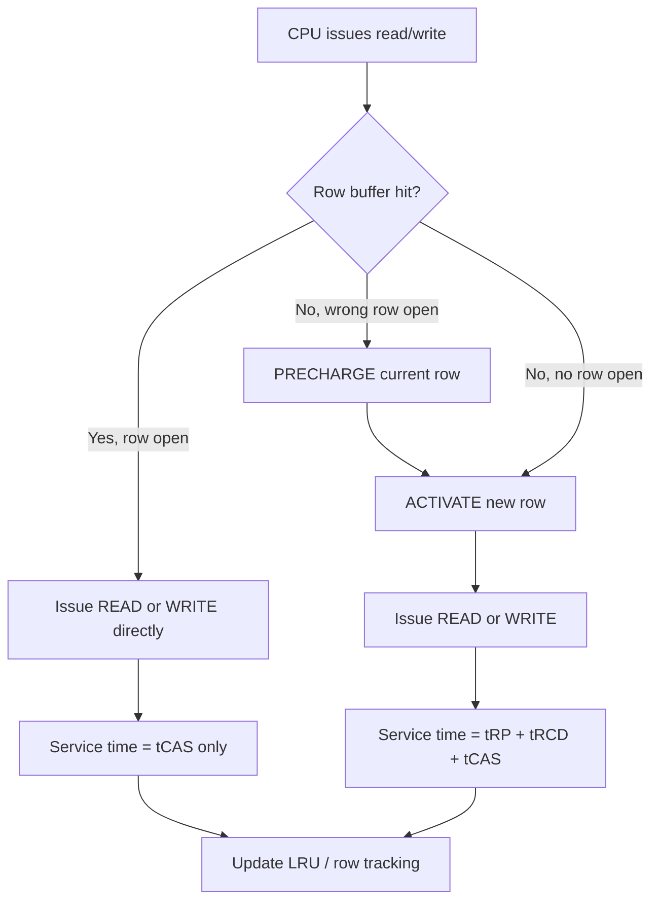
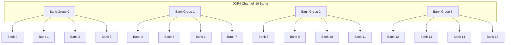
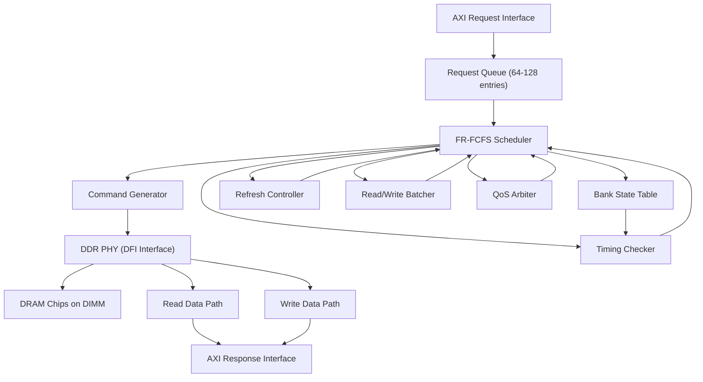

# DDR Memory Controller -- From Protocol to Scheduler

> **Prerequisites:** [Memory.md](Memory.md) (DRAM cell, sense amplifiers, refresh),
> [../Fundamentals/CMOS_Fundamentals.md](../Fundamentals/CMOS_Fundamentals.md) (signal integrity, timing),
> Cache_Microarchitecture.md (understanding of row buffer as cache analogy)
>
> **Hands-off to:** [AHB_AXI_APB.md](AHB_AXI_APB.md) (AXI bus that connects to the controller),
> [CPU_Architecture.md](CPU_Architecture.md) (memory stalls, OoO interaction)

---

## 0. Why This Page Exists

A DDR memory controller is the bridge between the processor's cache hierarchy (which speaks
AXI or a similar bus protocol) and the DDR DRAM chips on the DIMM. Every read miss that
leaves L3 cache must traverse this controller. Understanding the controller is essential
because:

- DDR timing constraints (tRCD, tRP, tRAS) are the dominant source of memory latency.
- The scheduler inside the controller determines whether a request hits an open row (fast)
  or must open a new one (slow), directly affecting effective bandwidth.
- Refresh overhead grows with density; at 16 Gb and above, refresh steals 5-8% of all
  bandwidth and introduces unpredictable latency spikes.
- DDR5 introduces dual subchannels and same-bank refresh, fundamentally changing how
  controllers must be architected.

This page walks through the DDR interface, timing parameters, scheduling algorithms, and
ends with worked interview problems of the kind asked at NVIDIA, AMD, Google, and Apple
for memory subsystem and DDR controller design roles.

---

## 1. DDR Interface Signals

### 1.1 Command and Address Bus

DDR uses a shared command/address bus that is sampled on both edges of the clock.
Commands are encoded by the combination of several control pins:

| Signal | Direction | Function |
|--------|-----------|----------|
| CS_n   | Controller -> DRAM | Chip Select (active low). Must be asserted for any command. |
| RAS_n  | Controller -> DRAM | Row Address Strobe (active low). Low for ACTIVATE. |
| CAS_n  | Controller -> DRAM | Column Address Strobe (active low). Low for READ/WRITE. |
| WE_n   | Controller -> DRAM | Write Enable (active low). Low for WRITE. |
| CKE    | Controller -> DRAM | Clock Enable. High for normal operation, controls power-down. |
| ACT_n  | Controller -> DRAM | DDR4/5 ACTIVATE pin (separate encoding to distinguish ACT from MRS). |

**Command encoding by pin combination (DDR4):**

```
CS_n  ACT_n  RAS_n  CAS_n  WE_n  | Command
---------------------------------------------
 0      0      X      X      X   | ACTIVATE
 0      1      0      0      1   | READ
 0      1      0      1      0   | WRITE
 0      1      0      1      1   | PRECHARGE (all or single bank)
 0      1      1      0      0   | REFRESH (all bank)
 0      1      1      0      1   | MODE REGISTER SET (MRS)
 0      1      1      1      0   | ZQ calibration
 0      1      1      1      1   | NOP
 1      X      X      X      X   | DESELECT (no operation)
```

The address bus A[17:0] (or A[13:0] on smaller densities) carries the row address during
ACTIVATE and the column address during READ/WRITE. Bank address bits BA[1:0] and bank
group bits BG[1:0] select the target bank.

### 1.2 Data Bus

| Signal | Width | Direction | Function |
|--------|-------|-----------|----------|
| DQ     | 8 per byte lane | Bidirectional | Data bus. 64-bit DIMM = 8 byte lanes = 64 DQ lines. |
| DQS    | 1 per byte lane | Bidirectional | Data Strobe. Source-synchronous clock for data capture. |
| DM     | 1 per byte lane | Write only | Data Mask. DM=1 means do not write that byte. |
| TDQS_n | 1 per byte lane | Optional | Termination Data Strobe (DDR3/4, for signal integrity). |

**DQS is the critical signal.** During writes, the controller drives DQS edge-aligned with
DQ. During reads, the DRAM drives DQS edge-aligned with DQ, and the controller uses a
delay-locked loop (DLL) to center the capture clock within the data eye.

**Per-byte-lane structure (x8 device):**

```
DQ[7:0]   ---- data bits for byte lane 0
DQS_t     ---- differential strobe positive
DQS_c     ---- differential strobe negative
DM_n      ---- data mask for byte lane 0

A 72-bit DIMM (64 data + 8 ECC):
  9 x8 devices, each contributing 8 DQ + 1 DQS pair + 1 DM
  = 72 DQ + 9 DQS pairs + 9 DM signals
```

### 1.3 Clock and Training

| Signal | Function |
|--------|----------|
| CK/CK_n | Differential clock. All commands sampled on rising edge of CK. |
| RESET_n | Asynchronous reset (DDR4/5 only; DDR3 uses ODT for some functions). |
| ODT | On-Die Termination. DRAM enables internal termination resistor. |
| ZQ | Calibration pin for output driver and ODT impedance. |

**Read leveling:** The controller adjusts per-byte-lane delay to center DQS within the DQ
eye during reads. Because each byte lane can have different flight time from the DRAM to
the controller (due to trace length mismatch on the PCB), each lane needs independent
delay calibration.

**Write leveling:** The controller adjusts the DQS launch time relative to CK so that DQS
arrives at the DRAM aligned with the clock, meeting setup/hold at the DRAM's receiver.

```
DDR4-3200 data eye (per byte lane):
  UI (Unit Interval) = 1/3200 MHz = 312.5 ps
  Total eye width    ~250 ps (after jitter and ISI)
  Setup time         ~80 ps
  Hold time          ~80 ps
  Margin             ~90 ps on each side

Training aligns DQS capture to the center of this 250 ps eye.
At DDR5-6400, UI = 156 ps -- margin shrinks to ~40 ps.
```

### 1.4 DDR4 vs DDR5 Interface Comparison

| Feature | DDR4 | DDR5 |
|---------|------|------|
| Data bus per DIMM | 72-bit (64+8 ECC) single channel | 2 x 40-bit (32+8 ECC) subchannels |
| Subchannel independence | N/A | Each subchannel operates independently |
| Max data rate | 3200 MT/s (JEDEC), 4000+ (OC) | 6400 MT/s (JEDEC), 8000+ (OC) |
| Bank groups | 4 | 8 (4 per subchannel) |
| Banks per group | 4 | 4 |
| Burst length | 8 (BL8) or 4 (OTF) | 8 (BL8) or 16 (BL16) |
| Refresh modes | All-bank, per-bank | All-bank, same-bank (SBR) |
| Power management | PMIC on motherboard | PMIC on DIMM |
| Command/address bus width | 20-bit (A[17:0] + BA + BG) | Increased for more banks |
| DFE | No | Yes (Decision Feedback Equalization) |

**DDR5 dual subchannel is the biggest architectural change.** A single DDR5 DIMM presents
two independent 32-bit data paths to the controller. This doubles the number of banks
available for parallel scheduling without increasing the per-channel data bus width. The
controller can issue commands to both subchannels simultaneously (subject to C/A bus
contention, since they share the command bus on most DIMM configurations).

---

## 2. DDR Commands in Detail

### 2.1 ACTIVATE (ACT)

Opens a row in a specific bank. The row address is provided on the address bus.

```
Cycle 0:  CS_n=0, ACT_n=0, A[17:0]=row_addr, BA[1:0]=bank, BG[1:0]=bank_group

After ACTIVATE:
  - The wordline for the selected row goes high
  - All bitlines in that bank develop differential voltage (charge sharing)
  - Sense amplifiers latch the row data
  - The row is now "open" and columns can be read/written
  - The bank must wait tRCD before accepting a READ or WRITE command
```

### 2.2 READ

Reads one or more columns from the currently open row.

```
Cycle 0:  CS_n=0, ACT_n=1, RAS_n=0, CAS_n=0, WE_n=1
          A[17:0]=column_addr (lower bits), BA=bank, BG=bank_group
          A10=0 (don't auto-precharge) or A10=1 (auto-precharge after read)

Data appears on DQ after CAS Latency (CL) clock cycles:
  DDR4-3200 CL22: data appears 22 clock cycles after READ command
  At 1600 MHz clock: 22 * 0.625 ns = 13.75 ns from READ to first data

Burst length 8 (BL8): 8 data transfers on both clock edges = 4 clock cycles
  Total data: 8 transfers * 8 bytes = 64 bytes per READ command
```

### 2.3 WRITE

Writes data to one or more columns in the currently open row.

```
Cycle 0:  CS_n=0, ACT_n=1, RAS_n=0, CAS_n=1, WE_n=0
          A[17:0]=column_addr, BA=bank, BG=bank_group

Write latency is typically CL-1 or CWL (CAS Write Latency).
  DDR4-3200 CWL16: data must be driven 16 clock cycles after WRITE command

The DQS strobe must be driven by the controller edge-aligned with DQ.
DM_n per byte lane: DM_n=1 masks that byte (not written).
```

### 2.4 PRECHARGE (PRE)

Closes the open row in a bank, preparing it for a new ACTIVATE.

```
Cycle 0:  CS_n=0, ACT_n=1, RAS_n=0, CAS_n=1, WE_n=1
          A10=0, BA=bank (single bank precharge)
          A10=1 (precharge ALL banks)

After PRECHARGE:
  - Bitlines are equalized back to VDD/2
  - Sense amplifiers are turned off
  - The row is closed (data is destroyed unless restored by sense amp write-back)
  - Must wait tRP before next ACTIVATE to the same bank
```

### 2.5 REFRESH (REF)

Refreshes charge in DRAM cells to prevent data loss from leakage.

```
All-bank refresh:
  CS_n=0, ACT_n=1, RAS_n=1, CAS_n=0, WE_n=0, A10=1
  All banks must be precharged (idle) before REFRESH
  Duration: tRFC (typically 350 ns for 8 Gb, 550 ns for 16 Gb DDR4)
  During tRFC, NO commands can be issued to any bank

Per-bank refresh (DDR4 only):
  A10=0, BA=bank
  Only the specified bank is unavailable; other banks can serve requests

Refresh rate: 8192 refresh commands per tREFW (64 ms)
  tREFI = 64 ms / 8192 = 7.8 us average interval between refreshes
```

### 2.6 Mode Register Set (MRS)

Configures DRAM operating parameters: CAS latency, burst length, write recovery,
read/write training modes, DLL settings, and more. DDR4 has 7 mode registers (MR0-MR6),
DDR5 extends to MR0-MR7 plus additional control registers.

---

## 3. Timing Parameters with Derivations

### 3.1 Core Timing Parameters

**tRCD (RAS-to-CAS Delay):** Time from ACTIVATE to when the bank can accept a READ or
WRITE. This is the time for the wordline to fully assert, charge sharing to occur on
all bitlines, and the sense amplifiers to fully latch the row data.

```
tRCD = t_wordline_assert + t_charge_sharing + t_sense_amp_latch

Typical: 12-18 ns (DDR4-3200: ~13.75 ns = 22 tCK at 1600 MHz)
```

**tRP (Row Precharge Time):** Time from PRECHARGE to when the bank can accept a new
ACTIVATE. This is the time to equalize bitlines and de-assert the wordline.

```
tRP = t_bitline_equalize + t_wordline_deassert

Typical: 12-18 ns (same ballpark as tRCD)
```

**tRAS (Row Active Time):** Minimum time a row must remain active (from ACTIVATE to
PRECHARGE). Ensures sense amplifiers have enough time to fully restore cell charge.

```
tRAS > t_sense_restore_min

Typical: 28-40 ns
```

**tRC (Row Cycle Time):** Minimum time between two ACTIVATE commands to the SAME bank.

```
tRC = tRAS + tRP

Derivation: ACT(row A) -> wait tRAS -> PRE(row A) -> wait tRP -> ACT(row B)
Total time from first ACT to second ACT on the same bank: tRAS + tRP = tRC

Typical: 45-55 ns
```

### 3.2 Refresh Timing

**tRFC (Refresh Cycle Time):** Duration of an all-bank refresh operation.

```
tRFC scales with DRAM density (more rows = more time to refresh):

| Density | tRFC (ns) | tREFI (us) | Refresh overhead |
|---------|-----------|------------|------------------|
| 4 Gb    | 260       | 7.8        | 260/7800 = 3.3%  |
| 8 Gb    | 350       | 7.8        | 350/7800 = 4.5%  |
| 16 Gb   | 550       | 7.8        | 550/7800 = 7.1%  |
| 24 Gb   | 650       | 7.8        | 650/7800 = 8.3%  |

tREFI = 64 ms / 8192 = 7.8125 us (average interval between refresh commands)
```

The refresh overhead is calculated as: a refresh command must be issued every 7.8 us
on average, and each refresh blocks all banks for tRFC. So the fraction of time the
DRAM is unavailable is tRFC / tREFI.

### 3.3 Bank-Level Timing Constraints

**tRRD (Row-to-Row Delay):** Minimum time between ACTIVATE commands to DIFFERENT banks.

```
tRRD_L (same bank group, DDR4): ~6 ns  (Long, more restrictive)
tRRD_S (diff bank group, DDR4): ~4 ns  (Short, less restrictive)

Purpose: limit current spikes. Each ACTIVATE draws a surge of current
to charge all bitlines. Staggering ACTIVATEs spreads the current draw.
```

**tFAW (Four Activate Window):** No more than 4 ACTIVATE commands may be issued within
any window of tFAW duration.

```
tFAW typical: 16-40 ns (scales with density and data rate)

This is a sliding window constraint:
  If ACT_0, ACT_1, ACT_2, ACT_3 are issued at times t0, t1, t2, t3,
  then ACT_4 cannot be issued until t0 + tFAW.

Purpose: limits peak current draw from the power supply.
4 simultaneous ACTIVATEs could draw > 1A peak on the VDD supply.
```

### 3.4 Timing Diagram: Interleaved Bank Access

```
Timing: ACT bank0 row5 -> READ bank0 col10 -> ACT bank1 row3 -> READ bank1 col20

                |<-- tRCD -->|            |<-- tRCD -->|
Cycle:  0   5   10  13.75  15  16  17   22  25.75  28  30
        |    |    |       |   |   |    |   |      |   |
CMD:    ACT  ---  READ    --- |   ACT  --- READ   --- ---
        B0,R5      B0,C10     |   B1,R3     B1,C20
                              |
                        tRRD_S >= 4ns (ACT_B0 to ACT_B1)
                        Check: |16 - 0| = 16ns > tRRD_S (OK)

DQ:     ---- ----------<D0,D0,D0,D0>----<D1,D1,D1,D1>
                       ^                   ^
                  CL=22 cycles        CL=22 cycles
                  after READ_B0       after READ_B1

Key constraints satisfied:
  tRCD:  ACT_B0 at t=0, READ_B0 at t=13.75ns (13.75 > tRCD=13.75) OK
  tRRD_S: ACT_B0 at t=0, ACT_B1 at t=16ns (16 > tRRD_S=4ns) OK
  tFAW:  Only 2 activates in any tFAW window (4 max) OK
  Data bus: READ_B0 data ends before READ_B1 data begins (no collision)
```

---

## 4. Row Buffer Management

### 4.1 The Row Buffer as a Cache

Each DRAM bank has a single row buffer (the sense amplifier array) that holds the
currently open row. This is analogous to a fully-associative cache with exactly one entry
per bank.



### 4.2 Row Buffer Policies

**Open-page policy:** Keep the row open after an access, hoping subsequent accesses
hit the same row (spatial locality within the row, which is typically 8 KB).

```
Advantages:
  - Row hits have zero extra latency (just tCAS)
  - Great for sequential/streaming access patterns
  - Simple implementation: don't issue PRECHARGE after every access

Disadvantages:
  - If next access is to a DIFFERENT row in the same bank, must
    pay tRP (precharge) + tRCD (activate) = ~30 ns penalty
  - Wastes energy keeping the row buffer powered
  - Worse for random access patterns

Typical row buffer hit rate: 40-60% for server workloads
                            30-40% for random client workloads
```

**Close-page policy:** Automatically precharge the row after each access.

```
Advantages:
  - Every access starts from a clean state (no row open)
  - Predictable latency: always tRCD + tCAS (no tRP wait, bank is pre-precharged)
  - Better for random access patterns

Disadvantages:
  - Even consecutive accesses to the same row pay tRCD every time
  - Higher energy per access (repeated sense amp activation)
  - Reduced throughput for streaming workloads
```

**Adaptive policy (most modern controllers):**

```
Track per-bank access history:
  - If the last N accesses to a bank all hit the same row -> keep open
  - If the last access was a miss -> precharge after a timeout

Timeout-based:
  - After serving a request, start a timer
  - If no new request to the same bank/row arrives within timeout -> PRECHARGE
  - If a request arrives -> serve it (hit) and reset timer

Threshold-based:
  - Count consecutive row hits in the current open row
  - If count > threshold: high locality detected, keep open
  - If count == 0 (miss): precharge immediately (close-page behavior)
```

---

## 5. Bank-Level Parallelism

### 5.1 Bank and Bank Group Structure



**Why bank groups exist:** Starting with DDR4, the internal DRAM core cannot keep up with
the external data rate. Bank groups allow the controller to issue commands to banks in
different groups with shorter timing (tCCD_S) than banks within the same group (tCCD_L).

```
tCCD_S (short, different bank group): ~4 clock cycles between column commands
tCCD_L (long, same bank group):       ~8 clock cycles between column commands

This means back-to-back READs to different bank groups can pipeline more tightly
than reads within the same bank group.
```

### 5.2 Interleaving

Cache-line interleaving maps consecutive cache lines to different banks (and bank groups)
so that multiple requests can be served in parallel.

```
Address mapping (example for DDR4, 64-byte cache lines, 16 banks):

  Physical Address bits:
  [63:28] Channel select (for multi-channel)
  [27:24] Rank select
  [23:20] Bank Group [1:0] + Bank [1:0]  <- interleaved at cache line granularity
  [19:6]  Row address
  [5:3]   Column address (within row, 64B line = 8 column addresses at BL8)
  [2:0]   Byte offset within cache line

For sequential accesses to addresses 0x0000, 0x0040, 0x0080, 0x00C0, ...:
  Each consecutive cache line goes to a different bank
  All 16 banks can be active simultaneously
  Controller can pipeline ACTIVATEs and READs across banks
  Peak bandwidth requires all banks to be kept busy
```

### 5.3 DDR5 Subchannel Architecture

```
DDR5 DIMM (single-rank, x8 devices):

Subchannel A (40-bit):                Subchannel B (40-bit):
  BG[0:3] x 4 banks each              BG[0:3] x 4 banks each
  = 16 banks total                     = 16 banks total
  Data: DQ[31:0] + ECC[7:0]           Data: DQ[31:0] + ECC[7:0]

Total per DIMM: 32 banks (2x16), 64 data bits + 16 ECC bits

Advantage over DDR4 single channel:
  - 2x more banks available for scheduling
  - Independent command streams (controller can issue to both subchannels)
  - Higher scheduling flexibility for FR-FCFS

Constraint: C/A bus is shared between subchannels on standard DIMMs.
  Only one command per clock cycle, so the controller must alternate
  between subchannel A and B on the shared command bus.
  Some designs use dual-C/A DIMMs to eliminate this bottleneck.
```

---

## 6. Refresh Scheduling

### 6.1 Refresh Timing Model

```
Refresh parameters:
  tREFW = 64 ms       (refresh window)
  8192 refresh commands must be issued within tREFW
  tREFI = 64ms / 8192 = 7.8125 us (average interval)
  tRFC = 350 ns (8 Gb DDR4) or 550 ns (16 Gb DDR4)

Refresh overhead = tRFC / tREFI

For 8 Gb DDR4:
  Overhead = 350 ns / 7812.5 ns = 4.48%
  During each tRFC, ALL banks are idle -> 350 ns of dead time

For 16 Gb DDR4:
  Overhead = 550 ns / 7812.5 ns = 7.04%
  Getting worse with each generation!
```

### 6.2 Refresh Scheduling Strategies

**Postponed refresh:** The controller can delay a refresh by up to 8x tREFI (for DDR4)
to serve pending requests. The delayed refreshes must be made up later.

```
Normal schedule: REF at t=7.8, 15.6, 23.4, ... us
Postponed:       REF delayed to serve pending reads
                 Accumulated debt: up to 8 REF commands can be postponed
                 Must issue them before tREFW expires

Risk: If too many refreshes are postponed, a "refresh storm" occurs near
the end of the 64 ms window, causing a burst of long latency spikes.
```

**Sneak refresh:** When the request queue is empty, issue a refresh early (ahead of
schedule). This fills idle time and reduces the chance of refresh storms later.

```
if (request_queue_empty && refresh_pending_within_window) {
    issue_refresh();
    // No performance impact: no requests are delayed
}
```

**Per-bank refresh (DDR4):** Refresh one bank at a time instead of all banks.

```
All-bank refresh:
  All 16 banks blocked for tRFC = 350 ns
  Other requests must wait

Per-bank refresh:
  Bank 0 refreshed: only bank 0 blocked for tRFC_pb (~140 ns)
  Banks 1-15 can still serve requests!
  16 per-bank refreshes needed to cover all banks
  tREFI_pb = 7.8 us / 16 = 488 ns

Per-bank refresh overhead: 140 ns / 488 ns = 28.7% for the single bank,
but other 15 banks are free -> system-level overhead is much lower.
```

**Same-bank refresh (DDR5):** Refresh the same bank number across all bank groups
simultaneously.

```
Same-bank refresh (SBR):
  Refresh bank 0 of BG0, BG1, BG2, BG3 simultaneously
  Other banks (1, 2, 3) in each BG can still serve requests
  Fewer total refresh commands needed vs per-bank
  tRFC_sb ~ 200-300 ns (shorter than all-bank tRFC)
```

---

## 7. Scheduling Algorithm

### 7.1 FR-FCFS (First Ready, First Come First Served)

FR-FCFS is the standard DDR scheduling algorithm used in virtually all modern controllers.

**Priority ordering:**

```
1. REFRESH (highest priority, if refresh is due)
2. WRITE (if write buffer exceeds threshold, drain writes)
3. ROW HIT (read or write to the currently open row in a bank)
4. OLDEST ready request (first come, first served among ready commands)

Why row hits are prioritized:
  Row hit latency:  ~13.75 ns (tCAS only)
  Row miss latency: ~44 ns    (tRP + tRCD + tCAS)
  A row hit is 3x faster -> prioritize to maximize throughput
```

### 7.2 Read-Write Batching

Switching between reads and writes on the data bus incurs a turnaround penalty
(bus reversal, DLL re-sync). The controller batches reads and writes to minimize
switches.

```
Read-to-write turnaround:  tRTW = ~7.5 ns (CL + CWL + burst_time + margin)
Write-to-read turnaround:  tWTR = ~10 ns

Strategy:
  - Accumulate writes in a write buffer (typically 32-64 entries)
  - When write buffer fill level exceeds threshold (e.g., 75%) -> drain writes
  - During write draining, reads are queued (starved temporarily)
  - After write buffer drains below low threshold -> switch back to reads
  - This minimizes read-write switches to ~1 per batch

Batch scheduling:
  Time:  |<-- reads -->|<-- writes -->|<-- reads -->|
         R R R R R R R  W W W W W W W  R R R R R R R
         ^                               ^
         |--- one switch per batch ------|
```

### 7.3 Quality of Service (QoS)

In a system with multiple requestors (CPU, GPU, DMA, display controller), the scheduler
must ensure critical traffic is not starved.

```
QoS levels (typical):
  QoS 3 (Critical):  Display controller, real-time DMA
    -> Guaranteed bandwidth, max latency bound
    -> Can preempt lower-QoS requests

  QoS 2 (High):      CPU data cache misses
    -> High priority in FR-FCFS, but not real-time guaranteed

  QoS 1 (Medium):    GPU texture fetches
    -> Best-effort with bandwidth allocation

  QoS 0 (Low):       Background DMA, prefetch
    -> Lowest priority, can be preempted

Implementation:
  - Each request carries a QoS tag (from AXI AxQOS or internal priority)
  - Scheduler selects highest-QoS ready request first
  - Bandwidth regulator: track per-QoS bandwidth consumed, throttle
    low-QoS traffic if it exceeds allocation
  - Latency regulator: if a QoS 3 request waits > threshold, force-schedule it
```

### 7.4 Controller Microarchitecture Block Diagram



---

## 8. Bandwidth Calculation

### 8.1 Peak Bandwidth

```
Peak bandwidth per channel = Data_Rate (MT/s) x Bus_Width (bytes)

DDR4-3200: 3200 MT/s x 8 bytes = 25,600 MB/s = 25.6 GB/s
DDR5-5600: 5600 MT/s x 8 bytes = 44,800 MB/s = 44.8 GB/s

Note: DDR5 has 2 subchannels of 4 bytes each, so:
  DDR5-5600: 5600 MT/s x (4 + 4) bytes = 44.8 GB/s (same total)
```

### 8.2 Effective Bandwidth

```
Effective BW = Peak BW
             x (1 - refresh_overhead)
             x (1 - tFAW_overhead)
             x row_buffer_hit_rate
             x (1 - read_write_switch_overhead)

Numerical example: DDR4-3200 single channel
  Peak:                  25.6 GB/s
  Refresh overhead:      4.5%  -> 0.955
  tFAW overhead:         ~3%   -> 0.97
  Row buffer hit rate:   50% of accesses hit, 50% miss
    Hit time:  tCAS = 13.75 ns  (transfer 64 bytes)
    Miss time: tRP + tRCD + tCAS = 13.75 + 13.75 + 13.75 = 41.25 ns
    Average access time = 0.5*13.75 + 0.5*41.25 = 27.5 ns
    Ideal hit-only time = 13.75 ns
    Row buffer efficiency = 13.75 / 27.5 = 0.50
  Read/write switch:     ~2%   -> 0.98

Effective BW = 25.6 x 0.955 x 0.97 x 0.50 x 0.98
             = 25.6 x 0.453
             = 11.6 GB/s (about 45% efficiency)

Typical real-world efficiency: 40-60% of peak
```

### 8.3 DDR5 Bandwidth Implications

```
DDR5-5600 dual-channel system:
  Peak per channel: 44.8 GB/s
  Dual channel:     89.6 GB/s peak

  But with 2 subchannels per DIMM, the controller has 32 banks
  (vs 16 for DDR4) to schedule across. More banks -> better
  bank-level parallelism -> higher effective utilization.

  DDR5 BL16 mode: 16 transfers per READ = 128 bytes per command
  (vs DDR4 BL8: 64 bytes per command)
  Fewer commands needed for the same data -> less command bus overhead.
```

---

## 9. ECC in DRAM

### 9.1 SECDED ECC (Industry Standard)

SECDED = Single Error Correction, Double Error Detection.

```
Hamming code for 64-bit data:
  Data bits:       64
  Check bits:       8  (log2(72) rounded up, with overall parity)
  Total code word: 72 bits per 64-bit word

  Syndrome decoding:
    Syndrome = 0:           no error
    Syndrome = power of 2:  single-bit error in check bit (correctable)
    Syndrome = other:       single-bit error in data bit (correctable)
    Overall parity error + Syndrome = 0: double-bit error (detectable, NOT correctable)

ECC DIMM: 72-bit bus (64 data + 8 ECC) implemented as 9 x8 devices
```

### 9.2 Chipkill

SECDED can correct 1-bit errors within a 72-bit word. But if an entire DRAM chip fails
(a "chip kill"), every word has 8 bit errors -- far beyond SECDED's capability.

```
Chipkill solution: spread each ECC code word across multiple chips
  so that a single chip failure affects at most 1 bit per code word.

Implementation (AMD, IBM, Intel variants):
  - Use 36 x4 chips instead of 9 x8 chips
  - Each x4 chip contributes 4 bits to a 144-bit wide code word
  - One chip failure -> 4 bits corrupted in 4 different 72-bit code words
  - Each code word has at most 1 corrupted bit -> SECDED can correct

  Or: use Reed-Solomon coding across x4 chips
  - Correct up to 4 symbols (4 nibbles = 16 bits) per code word
  - Tolerates complete failure of up to 4 x4 chips
```

### 9.3 On-Die ECC (DDR5)

DDR5 adds internal ECC within each DRAM chip, independent of the system-level ECC
on the controller side.

```
On-die ECC purpose:
  - Protect against single-bit errors caused by radiation, charge leakage,
    or manufacturing defects WITHIN the DRAM chip
  - Each 128-bit internal word has 8 bits of on-die ECC
  - Error correction happens transparently before data leaves the chip

Why both on-die AND system-level ECC?
  - On-die ECC: corrects internal single-bit errors before they propagate
  - System ECC: corrects errors on the bus, multi-bit chip failures
  - They are independent layers; neither makes the other redundant

  Analogy: on-die ECC is like CRC on an Ethernet cable (corrects bit errors
  on the link). System ECC is like TCP checksum (end-to-end protection).
```

---

## 10. DDR5 Changes in Detail

### 10.1 Dual Independent Subchannels

```
DDR4 DIMM:
  1x 72-bit channel (64 data + 8 ECC)
  Controller sees one 72-bit port

DDR5 DIMM:
  2x 40-bit subchannels (32 data + 8 ECC each)
  Controller sees two independent 40-bit ports
  Each subchannel has its own:
    - Bank state machine (16 banks)
    - Row buffer per bank
    - Timing constraints
    - Refresh scheduling

Impact on controller design:
  - Must track 2x the bank states (32 total per DIMM)
  - Scheduler has 2x the banks to exploit for parallelism
  - C/A bus arbitration between subchannels (if shared C/A)
  - Separate read/write data paths for each subchannel
```

### 10.2 Decision Feedback Equalization (DFE)

```
At DDR5 speeds (4400-6400+ MT/s), the data eye is extremely narrow.
Traditional CTLE (Continuous-Time Linear Equalization) is insufficient.

DFE adds a feedback path that subtracts the effect of previously received bits:

  y[n] = x[n] - sum(a[k] * y[n-k], k=1..N)

where:
  x[n] = received signal (with ISI distortion)
  y[n] = equalized output
  a[k] = DFE tap coefficients (trained during calibration)

DFE is implemented in the DDR5 PHY (receiver side).
Requires per-lane training (DDR5 read/write training is more complex than DDR4).
```

### 10.3 PMIC on DIMM

```
DDR4: PMIC on motherboard, shared across all DIMMs
  - Power delivery must be routed from motherboard VRM to each DIMM slot
  - Limited per-DIMM power management granularity

DDR5: PMIC (Power Management IC) on each DIMM
  - 12V input from motherboard
  - PMIC generates VDD (1.1V) and VPP (1.8V) locally on the DIMM
  - Per-DIMM power management: throttle, power-down per rank
  - Simplifies motherboard design (one 12V rail instead of 1.1V precision rail)
  - Enables finer-grained power states for energy-efficient operation
```

### 10.4 Higher Density Chips

```
DDR5 supports 16 Gb and 24 Gb chips (vs DDR4 max 16 Gb):

  16 Gb, x8: 2 GB per chip, 16 GB per rank (8 chips x 2 GB)
  24 Gb, x8: 3 GB per chip, 24 GB per rank

  Dual-rank DDR5 DIMM with 24 Gb chips: 48 GB per DIMM
  Quad-rank (3DS) DDR5: 96+ GB per DIMM

Impact on refresh:
  24 Gb chip has more rows -> tRFC increases
  tRFC(24Gb) ~ 700 ns -> refresh overhead = 700/7812.5 = 8.96%
  Almost 9% of bandwidth lost to refresh!
  Same-bank refresh (SBR) becomes critical to maintain usable bandwidth.
```

---

## Numbers to Memorize

| Parameter | DDR4-3200 | DDR5-5600 | Notes |
|-----------|-----------|-----------|-------|
| Data rate (MT/s) | 3200 | 5600 | Transfers per second per pin |
| Clock frequency (MHz) | 1600 | 2800 | MT/s / 2 (DDR = both edges) |
| Peak BW per channel (GB/s) | 25.6 | 44.8 | MT/s x bus_width_bytes |
| Bus width (bits) | 72 (64+8 ECC) | 2x40 (2x(32+8 ECC)) | DDR5 splits into 2 subchannels |
| Banks total | 16 | 32 (16 per subchannel) | DDR5 has 2x more banks |
| Bank groups | 4 | 8 (4 per subchannel) | |
| tRCD (ns) | 13.75 | 12.86 | ACT to READ/WRITE |
| tRP (ns) | 13.75 | 12.86 | PRE to ACT |
| tRAS (ns) | 35 | 32 | ACT to PRE minimum |
| tRC (ns) | 48.75 | 45.71 | tRAS + tRP |
| tRFC 8Gb (ns) | 350 | 290 | Refresh cycle time |
| tRFC 16Gb (ns) | 550 | 450 | Scales with density |
| tREFI (us) | 7.8125 | 7.8125 | 64ms / 8192 |
| tFAW (ns) | 30 | 21 | 4-activate window |
| tRRD_S (ns) | 4 | 3 | ACT to ACT, different BG |
| tRRD_L (ns) | 6 | 5 | ACT to ACT, same BG |
| tCCD_S (tCK) | 4 | 4 | Col to col, different BG |
| tCCD_L (tCK) | 8 | 8 | Col to col, same BG |
| CAS Latency (CL) | 22 | 30 | In clock cycles |
| CAS Latency (ns) | 13.75 | 10.71 | Absolute time |
| Burst length | 8 | 8 or 16 | DDR5 adds BL16 |
| Refresh overhead (8Gb) | 4.5% | 3.7% | tRFC / tREFI |
| Typical row buffer hit rate | 30-60% | 30-60% | Workload dependent |

---

## 11. Worked Interview Problems

### Problem 1: Peak and Effective Bandwidth

**Question:** Calculate the peak and effective bandwidth for a DDR4-3200 dual-channel
system. Assume 4% refresh overhead, 50% row buffer hit rate, tCAS = 13.75 ns,
tRCD = 13.75 ns, tRP = 13.75 ns, and 2% read-write switch overhead.

**Solution:**

```
Peak bandwidth:
  Single channel: 3200 MT/s x 8 bytes = 25.6 GB/s
  Dual channel:   25.6 x 2 = 51.2 GB/s

Row buffer efficiency:
  Hit time:  tCAS = 13.75 ns (serves 64 bytes = 1 cache line)
  Miss time: tRP + tRCD + tCAS = 13.75 + 13.75 + 13.75 = 41.25 ns

  Average access time = 0.5 x 13.75 + 0.5 x 41.25 = 27.5 ns

  Row buffer efficiency = tCAS / average_time = 13.75 / 27.5 = 0.50

Effective bandwidth:
  = Peak x (1 - refresh_overhead) x row_buffer_eff x (1 - rw_switch_overhead)
  = 51.2 x (1 - 0.04) x 0.50 x (1 - 0.02)
  = 51.2 x 0.96 x 0.50 x 0.98
  = 51.2 x 0.4704
  = 24.1 GB/s

Efficiency = 24.1 / 51.2 = 47.1%
```

### Problem 2: Timing Diagram Construction

**Question:** Draw the timing for the following command sequence on a DDR4-3200
channel. Label all timing constraints.

- ACT bank 0, row 5
- READ bank 0, col 10
- ACT bank 1, row 3
- READ bank 1, col 20

Given: tRCD = 13.75 ns, tCAS = 13.75 ns (CL = 22 tCK), tRRD_S = 4 ns,
burst length = 8, tCK = 0.625 ns.

**Solution:**

```
Time (ns):   0       13.75    16      27.5    29.75   41.25   43.5
             |         |       |        |        |       |       |
CMD:         ACT_B0    READ_B0  ACT_B1   --       READ_B1  --      --
             R5        C10      R3                        C20

Constraints:
  1. ACT_B0 to READ_B0: 13.75 ns >= tRCD = 13.75 ns  [OK]
  2. ACT_B0 to ACT_B1:  16 ns   >= tRRD_S = 4 ns     [OK]
  3. ACT_B1 to READ_B1: 29.75 - 16 = 13.75 ns >= tRCD [OK]
  4. tFAW: only 2 activates in window, max is 4         [OK]

Data bus timing:
  READ_B0 issued at t=13.75 ns
  Data appears at t = 13.75 + CL*tCK = 13.75 + 22*0.625 = 13.75 + 13.75 = 27.5 ns
  Burst duration = BL8 / (2 edges/clock) = 4 tCK = 4 * 0.625 = 2.5 ns
  Data_B0 occupies bus from 27.5 ns to 30.0 ns

  READ_B1 issued at t=29.75 ns
  Data appears at t = 29.75 + 13.75 = 43.5 ns
  Data_B1 occupies bus from 43.5 ns to 46.0 ns

  No data bus collision: 30.0 ns < 43.5 ns  [OK]

Total time: 46.0 ns for 2 cache lines = 128 bytes
Effective BW = 128 / 46 ns = 2.78 GB/s (per bank pair)

With 8 bank groups x 2 banks = 16 banks, fully interleaved:
  Peak BW ~ 2.78 x 8 = 22.3 GB/s (not quite peak due to tFAW limitations)
```

### Problem 3: Row Hit vs Miss Service Time

**Question:** A DDR4-3200 controller receives 100 read requests. 40 are row hits,
60 are row misses. Compute the total service time. Given: tCAS = 13.75 ns,
tRCD = 13.75 ns, tRP = 13.75 ns, burst length = 8, data bus width = 8 bytes,
tCCD_S = 4 tCK = 2.5 ns (minimum gap between column commands).

**Solution:**

```
Per-request service time:
  Row hit:  tCAS = 13.75 ns  (data appears after CAS latency)
  Row miss: tRP + tRCD + tCAS = 13.75 + 13.75 + 13.75 = 41.25 ns

  Each READ returns BL8 x 8 bytes = 64 bytes

  Data transfer time per request: BL8 / 2 = 4 clocks = 2.5 ns
    (but overlapped with next request's CAS latency in pipelined operation)

Naive total (no pipelining):
  Total time = 40 x 13.75 + 60 x 41.25
             = 550 + 2475
             = 3025 ns

  Data transferred = 100 x 64 bytes = 6400 bytes
  Average BW = 6400 / 3025 ns = 2.12 GB/s

With bank pipelining (assuming requests go to different banks):
  The limiting factor is the data bus utilization.
  Each READ occupies the data bus for 2.5 ns (4 tCK).
  Minimum gap between column commands: tCCD_S = 2.5 ns.

  But sequential READs must be separated by at least tCCD_S = 2.5 ns:
    Effective throughput = 64 bytes / 2.5 ns = 25.6 GB/s (matches peak!)

  Total data bus time = 100 x 2.5 ns = 250 ns
  But row activations and precharges take time OFF the data bus.
  The row management time is hidden by bank-level parallelism.

  For 60 row misses: need 60 x (tRP + tRCD) = 60 x 27.5 = 1650 ns of
  row management, but this can be overlapped with data transfers to
  other banks. With 16 banks, the row management overhead is largely hidden.

  Realistic total time for a well-scheduled controller:
    ~250 ns (data bus time) + ~500 ns (row management overhead not fully hidden)
    = ~750 ns
    Effective BW = 6400 / 750 = 8.5 GB/s (about 33% of peak)
```

### Problem 4: FR-FCFS Scheduler Walkthrough

**Question:** Given 8 pending requests in the controller queue, determine the scheduling
order using FR-FCFS. Assume 4 banks (B0-B3), open-page policy, and the following state:

```
Currently open rows: B0=row5, B1=row2, B2=no row, B3=row8

Pending requests (in arrival order):
  R0: READ  B0, row5, col20   (age=7)
  R1: WRITE B0, row3, col10   (age=6)
  R2: READ  B1, row2, col15   (age=5)
  R3: READ  B3, row8, col30   (age=4)
  R4: WRITE B1, row7, col25   (age=3)
  R5: READ  B2, row1, col5    (age=2)
  R6: WRITE B0, row5, col40   (age=1)
  R7: READ  B3, row4, col50   (age=0)

Write buffer threshold not reached, so reads and writes can be interleaved.
```

**Solution:**

```
Step 1: Classify each request

  R0: READ B0 row5 - Row HIT (B0 has row5 open)
  R1: WRITE B0 row3 - Row MISS (B0 has row5, need row3)
  R2: READ B1 row2 - Row HIT (B1 has row2 open)
  R3: READ B3 row8 - Row HIT (B3 has row8 open)
  R4: WRITE B1 row7 - Row MISS (B1 has row2, need row7)
  R5: READ B2 row1 - Row MISS (B2 has no row open)
  R6: WRITE B0 row5 - Row HIT (B0 has row5 open)
  R7: READ B3 row4 - Row MISS (B3 has row8, need row4)

Step 2: Apply FR-FCFS priority

  Highest priority: Row hits (in arrival order)
    R0 (age=7, READ B0 hit)
    R2 (age=5, READ B1 hit)
    R3 (age=4, READ B3 hit)
    R6 (age=1, WRITE B0 hit)

  Next priority: Row misses (oldest first)
    R1 (age=6, WRITE B0 miss)
    R4 (age=3, WRITE B1 miss)
    R5 (age=2, READ B2 miss)
    R7 (age=0, READ B3 miss)

Step 3: Schedule accounting for bank conflicts

  The scheduler cannot issue two commands to the same bank simultaneously.
  It must respect timing constraints.

  Schedule:
  Slot 1: R0 - READ B0 (hit, tCAS only)       B0 busy for tCAS
  Slot 2: R2 - READ B1 (hit, tCAS only)       B1 busy for tCAS (different bank)
  Slot 3: R3 - READ B3 (hit, tCAS only)       B3 busy for tCAS (different bank)
  Slot 4: R6 - WRITE B0 (hit, tCAS)           B0 done from R0, hit

  After all row hits are served, handle misses:
  Slot 5: R1 - PRE B0, ACT B0 row3, WRITE B0  (miss: tRP + tRCD + CWL)
  Slot 6: R4 - PRE B1, ACT B1 row7, WRITE B1  (miss, B1 done from R2)
  Slot 7: R5 - ACT B2 row1, READ B2           (miss, B2 had no row, skip PRE)
  Slot 8: R7 - PRE B3, ACT B3 row4, READ B3   (miss, B3 done from R3)

  Note: Slots 5-8 can partially overlap because they target different banks.
  The row management (PRE/ACT) for each bank can proceed in parallel.
  The data bus transfers must be serialized (one at a time).

  Optimized data bus order (accounting for parallel bank work):
    Data from R0 -> Data from R2 -> Data from R3 -> Data from R6
    (all hits, back-to-back with tCCD_S gaps)

    Then: Data from R5 (B2 had no precharge, fastest miss)
          Data from R1 (B0 miss)
          Data from R4 (B1 miss)
          Data from R7 (B3 miss)

  Reasoning for miss order:
    R5 targets B2 which has no open row (no PRE needed, saves tRP = 13.75 ns)
    R1, R4, R7 all need full PRE+ACT, but their bank management can overlap.
    Within the misses, R1 is oldest (age=6), so it goes first among equal-cost misses.

  Final scheduling order: R0, R2, R3, R6, R5, R1, R4, R7
```

---

## 12. References

1. **JEDEC Standard JESD79-4B** -- DDR4 SDRAM Specification (2017)
2. **JEDEC Standard JESD79-5** -- DDR5 SDRAM Specification (2020)
3. **DFI 4.0 Specification** -- DDR PHY Interface protocol between controller and PHY
4. Kim et al., "FR-FCFS: A DRAM Scheduling Policy for Improving Row Buffer Hit Rate"
   (ISPASS 2010) -- foundational FR-FCFS paper
5. Mukundan et al., "Understanding and Improving Latency in DRAM Devices"
   (ISCA 2013) -- comprehensive timing analysis
6. Liu et al., "RAIDR: Retention-Aware Intelligent DRAM Refresh" (ISCA 2012) --
   refresh optimization
7. JEDEC Standard JESD79-5A -- DDR5 SDRAM Specification with SBR and DFE details
8. Ghosh and Lee, "Smart Refresh: An Enhanced Memory Controller Design for Reducing
   Energy in Conventional and 3D Die-Stacked DRAMs" (MICRO 2007)

---

## Navigation

- **Previous:** [Memory.md](Memory.md) -- DRAM cell design, sense amplifiers, SRAM
- **Next:** [AHB_AXI_APB.md](AHB_AXI_APB.md) -- AXI bus protocol connecting to the DDR controller
- **Up:** [../Fundamentals/CMOS_Fundamentals.md](../Fundamentals/CMOS_Fundamentals.md) -- transistor-level foundations
- **Related:** [CPU_Architecture.md](CPU_Architecture.md) -- how memory latency affects CPU pipeline performance
