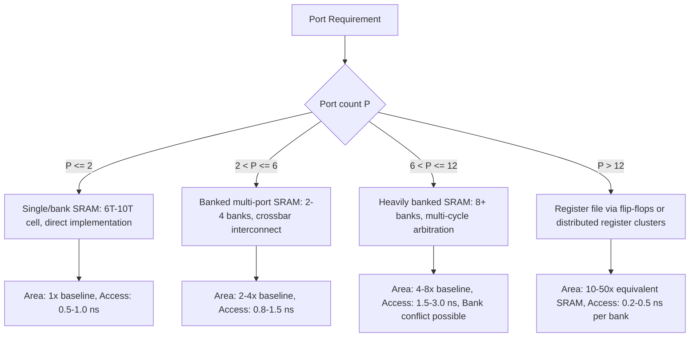
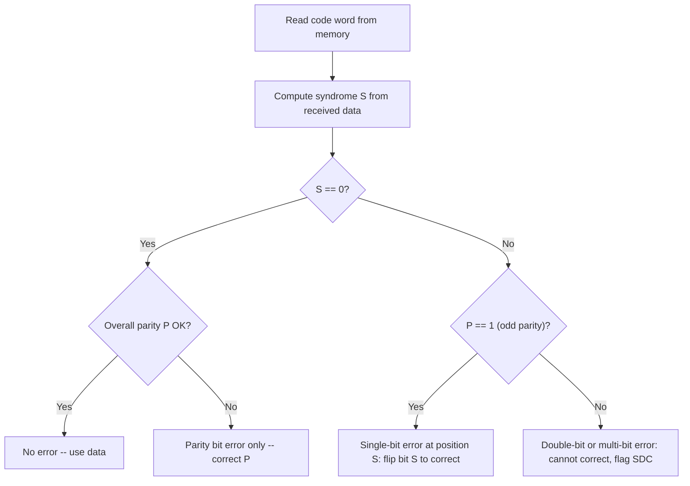
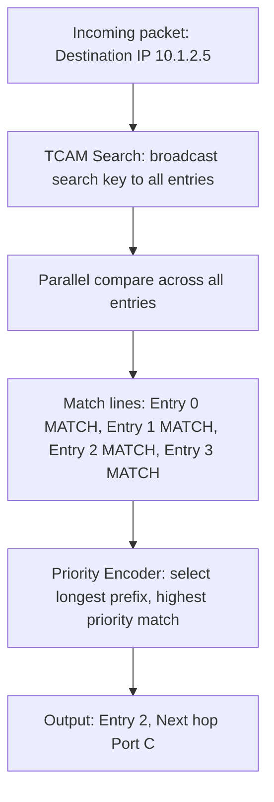

# Memory Architecture and Design — Senior Engineer Level

> **Prerequisites:** [CMOS_Fundamentals](../Fundamentals/CMOS_Fundamentals.md) (transistor physics, 6T SRAM cell)
> **See also:** [Cache_Microarchitecture](Cache_Microarchitecture.md), [DDR_Controller](DDR_Controller.md), [Floating_Point](../Fundamentals/Floating_Point.md) (ECC)

## 6T SRAM Cell — Transistor-Level Deep Dive

### 6T SRAM Bitcell — M1 through M6 Transistor Roles

The 6T SRAM cell uses six transistors organized as two cross-coupled CMOS inverters
(storage) plus two access transistors (read/write port):

```
Transistor | Type  | Role
-----------|-------|--------------------------------------------------
M1         | NMOS  | Pull-down for INV1. Holds Q=0 when Q_bar=1.
           |       | Sized STRONG (W/L=2/1) for read stability (high CR).
M2         | NMOS  | Pull-down for INV2. Holds Q_bar=0 when Q=1.
           |       | Same sizing as M1.
M3         | PMOS  | Pull-up for INV1. Drives Q_bar to VDD when Q=0.
           |       | Sized WEAK (W/L=1/1) to allow write to overpower it (high PR).
M4         | PMOS  | Pull-up for INV2. Drives Q to VDD when Q_bar=0.
           |       | Same sizing as M3.
M5         | NMOS  | Access transistor for BL (connects BL to Q). Gate = WL.
           |       | Sized INTERMEDIATE (W/L=1.5/1). Must be weaker than M1 (CR > 1)
           |       | but stronger than M3 (PR > 1).
M6         | NMOS  | Access transistor for BL_bar (connects BL_bar to Q_bar). Gate = WL.
           |       | Same sizing as M5.
```

**Sizing ratio constraints (the "6T triangle"):**

```
Cell Ratio (CR) = (W/L)_pulldown / (W/L)_access = 2.0 / 1.5 = 1.33
  CR > 1 required for read stability (M1 must overpower M5 during read)
  Typical: CR = 1.2 - 2.0

Pull-up Ratio (PR) = (W/L)_access / (W/L)_pullup = 1.5 / 1.0 = 1.5
  PR > 1 required for write-ability (M5 must overpower M3 during write)
  Typical: PR = 1.2 - 2.0

Fundamental tension:
  Increasing access transistor strength (M5/M6) → improves PR (write)
                                           → degrades CR (read)
  Must find a sizing that gives adequate margin for BOTH simultaneously.
  This becomes harder at low VDD where transistor I-V curves compress.
```

### Read Operation Sequence (Step-by-Step Timing)

Reading a 6T SRAM cell follows this precise sequence. We read from a cell storing Q=0, Q_bar=1:

```
Step 1: PRECHARGE (t_precharge ~200-500 ps)
  - Precharge circuit drives both BL and BL_bar to VDD
  - Equalize transistor (between BL and BL_bar) ensures BL = BL_bar = VDD
  - WL remains LOW (M5, M6 off)

Step 2: WORD LINE ASSERTION (t_WL_rise ~50-100 ps)
  - WL goes HIGH, turning on access transistors M5 and M6
  - BL connects to Q through M5; BL_bar connects to Q_bar through M6

Step 3: BITLINE DEVELOPMENT (t_develop ~100-300 ps)
  - Cell has Q=0: BL (at VDD) begins to discharge through M5 and M1 toward GND
  - Cell has Q_bar=1: BL_bar (at VDD) stays near VDD (M6 connects to Q_bar=VDD,
    so no discharge path)
  - Differential voltage develops: BL drops, BL_bar stays high
  - Delta_V grows to ~100-200 mV (enough for sense amplifier)

Step 4: SENSE AMPLIFIER FIRING (t_sense ~100-200 ps)
  - Sense amplifier enable signal goes HIGH
  - Cross-coupled latch amplifies the small differential to full rail:
    BL → 0 (GND), BL_bar → VDD
  - Positive feedback completes in ~100 ps

Step 5: DATA OUTPUT and WRITE-BACK
  - Sense amplifier output (BL_bar) is the read data (logic "1" = cell stored Q_bar)
  - Full-rail voltage on BL/BL_bar is also driven back through M5/M6, reinforcing
    the cell's stored value (non-destructive read -- cell was already at Q=0)
  - Column mux selects this bitline pair for output to the read data bus

Step 6: WORD LINE DE-ASSERTION
  - WL goes LOW, disconnecting cell from bitlines
  - Precharge circuit re-asserts, preparing for next read

Total read access time: t_precharge + t_WL_rise + t_develop + t_sense ≈ 0.5-1.5 ns
```

**Critical observation:** The read is non-destructive (unlike DRAM). The cell's cross-coupled
inverters fight the bitline discharge and maintain their state. But the cell voltage does
dip slightly during Step 3, which is the source of read-disturb risk at low VDD.

### Write Operation Sequence (Step-by-Step Timing)

Writing a 6T SRAM cell requires overpowering the feedback loop. We write Q=0 to a cell
currently storing Q=1:

```
Step 1: DRIVE BITLINES (write driver activation ~50-100 ps)
  - Write driver forces BL = 0 (GND) for writing "0" to Q
  - Write driver forces BL_bar = VDD (reinforcing Q_bar = 1)
  - BL and BL_bar are driven STRONGLY by the write driver (much larger transistors
    than the cell's pull-up/pull-down)

Step 2: WORD LINE ASSERTION
  - WL goes HIGH, connecting BL to Q (through M5) and BL_bar to Q_bar (through M6)

Step 3: FLIP Q NODE (t_write ~200-500 ps)
  - BL = 0 pulls Q down through M5 (access transistor)
  - M3 (PMOS pull-up, gate = Q_bar = 0 initially, so M3 is ON) fights back,
    trying to keep Q at VDD
  - M5 must overpower M3: requires PR = (W/L)_access / (W/L)_pullup > threshold
  - With PR = 1.5, M5 wins: Q drops below the switching threshold of INV1 (Q_bar inverter)
  - INV1 input (Q) drops → INV1 output (Q_bar) rises → M3 gate goes HIGH → M3 turns OFF
  - Feedback is broken: Q continues to drop to 0, Q_bar rises to VDD
  - Cell has flipped: Q=0, Q_bar=1

Step 4: STABILIZATION
  - Cross-coupled inverters reinforce the new state
  - Q_bar = VDD keeps M1 (pull-down) ON, holding Q = 0
  - Q = 0 keeps M4 (pull-up) ON, holding Q_bar = VDD

Step 5: WORD LINE DE-ASSERTION
  - WL goes LOW, disconnecting cell from bitlines
  - Cell retains new state

Total write time: t_drive + t_WL + t_flip ≈ 0.5-2.0 ns
  (longer than read because of the feedback fight)
```

**Write margin:** The worst case is writing the opposite state (flipping the cell). If VDD
is too low, M3 may overpower M5, preventing the flip. Write margin is defined as the
minimum VDD at which the write succeeds. Typical write margin: 0.5-0.6V (below nominal
VDD of 0.7-1.0V). Write-assist techniques (boosting WL voltage above VDD, or collapsing
the cell's VDD during write) can improve this margin.

**Read stability (formal):** During read, the "0" storage node forms a voltage divider
between M5 (access, in saturation) and M1 (pull-down, in linear region). The node voltage
rises to:

$$
V_Q \approx \frac{1}{2 \cdot CR} \cdot (V_{DD} - V_{th})
$$

For the cell to remain stable, $V_Q$ must be below the switching threshold of the
feedback inverter ($V_m \approx 0.4 \cdot V_{DD}$). With our sizing:

$$
V_Q = \frac{1}{2 \times 1.33} \times (1.0 - 0.3) = 0.263\,\text{V} < 0.4\,\text{V} \quad \checkmark
$$

Read margin $= V_m - V_Q = 0.4 - 0.263 = 0.137\,\text{V}$. At 3-sigma process corner
(worst-case mismatch), this margin can shrink to 20-50 mV. Below VDD = 0.7V, the margin
vanishes for the 6T cell, motivating the switch to 8T.

**Write margin (formal):** During write, M5 (access) must overpower M3 (PMOS pull-up)
to pull the storage node below the inverter switching threshold:

$$
V_Q = V_{DD} \cdot \frac{R_{M5}}{R_{M5} + R_{M3}}
$$

For write success: $V_Q < V_m$. This requires $R_{M3} > R_{M5} \cdot \frac{V_{DD} - V_m}{V_m}$,
which translates to PR > 1. With PR = 1.5, write margin is adequate at nominal VDD.
Write margin degrades at low VDD because PMOS on-resistance increases faster than
NMOS as VDD approaches Vth.

### Transistor Schematic with Sizing

```
                   VDD                    VDD
                    |                      |
               ┌────┴────┐           ┌────┴────┐
               │ M3 PMOS │           │ M4 PMOS │
               │ W/L=1/1 │           │ W/L=1/1 │
               └────┬────┘           └────┬────┘
                    │                      │
          Q ────────┼──────────────────────┼──────── Q_bar
                    │         ┌────┐       │
                    ├─────────┤INV2├───────┤
                    │         └────┘       │
                    │         ┌────┐       │
                    ├─────────┤INV1├───────┤
                    │         └────┘       │
               ┌────┴────┐           ┌────┴────┐
               │ M1 NMOS │           │ M2 NMOS │
               │ W/L=2/1 │           │ W/L=2/1 │
               └────┬────┘           └────┬────┘
                    │                      │
                   GND                    GND
                    
       BL                                     BL_bar
        │                                       │
   ┌────┴────┐                             ┌────┴────┐
   │ M5 NMOS │                             │ M6 NMOS │
   │ W/L=1.5/1│                            │ W/L=1.5/1│
   └────┬────┘                             └────┬────┘
        │                                       │
        └───────────── Q         Q_bar ─────────┘
                    
   WL ──── gates of M5 and M6

   INV1: M3 (PMOS pull-up) + M1 (NMOS pull-down), output = Q_bar, input = Q
   INV2: M4 (PMOS pull-up) + M2 (NMOS pull-down), output = Q, input = Q_bar
```

**Typical sizing ratios (65nm reference):**
```
Pull-down NMOS (M1, M2):  W/L = 2/1    (strongest, for read stability)
Access NMOS (M5, M6):     W/L = 1.5/1  (intermediate)
Pull-up PMOS (M3, M4):    W/L = 1/1    (weakest, for write-ability)

Cell Ratio (CR) = (W/L)_pulldown / (W/L)_access = 2/1.5 = 1.33
Pull-Up Ratio (PR) = (W/L)_access / (W/L)_pullup = 1.5/1 = 1.5
```

### Read Stability — Voltage Divider Derivation

**Setup:** Cell stores Q=0 (M1 on, M3 off), Q_bar=1 (M2 off, M4 on). BL and BL_bar pre-charged to VDD. WL asserted.

**The problem:** BL is at VDD, Q is at 0V. When M5 turns on, BL (at VDD) connects to Q (at 0V) through M5. But Q is also held at 0V by M1 (pull-down NMOS, which is ON because Q_bar = VDD = gate of M1).

**Voltage divider between M5 (access) and M1 (pull-down):**

```
                BL (VDD)
                  │
             ┌────┴────┐
             │ M5 NMOS │  R_access = VDD / (Kn_access * (VDD - Vth)^2 / 2)
             │ (access) │     (in saturation initially)
             └────┬────┘
                  │
            Q node  ← this voltage rises during read
                  │
             ┌────┴────┐
             │ M1 NMOS │  R_pulldown = similar but with different W/L
             │(pulldown)│
             └────┬────┘
                  │
                 GND
```

**Simplified DC analysis (both in linear region for small V_Q):**

```
I_M5 = Kn_access * [(VDD - Vth) * V_Q - V_Q^2/2]
I_M1 = Kn_pulldown * [(VDD - Vth) * V_Q - V_Q^2/2]
```

Wait — M1's gate is at Q_bar = VDD (assuming Q_bar hasn't changed), and M1's source is GND, drain is Q.
M5's gate is at VDD (WL=VDD), source is Q (lower voltage), drain is BL (VDD).

For M5 (in saturation if VDD - V_Q > VDD - Vth, i.e., V_Q < Vth... initially yes):
```
I_M5 ≈ (Kn_access/2) * (VDD - Vth)^2   (in saturation)
```

For M1 (in linear region since V_GS = VDD and V_DS = V_Q ≈ 0):
```
I_M1 ≈ Kn_pulldown * [(VDD - Vth) * V_Q - V_Q^2/2]
```

At equilibrium, I_M5 = I_M1:
```
(Kn_access/2) * (VDD - Vth)^2 = Kn_pulldown * (VDD - Vth) * V_Q

V_Q = (Kn_access / (2 * Kn_pulldown)) * (VDD - Vth)
    = (1 / (2 * CR)) * (VDD - Vth)
```

**Numerical example with 65nm parameters:**
```
VDD = 1.0V, Vth = 0.3V, CR = 1.33

V_Q = (1 / (2 * 1.33)) * (1.0 - 0.3) = 0.375 * 0.7 = 0.263V
```

**Is this safe?** For the cell to flip, V_Q must exceed the switching threshold of INV2 (which has Q as its input). The switching threshold of INV2 ≈ VDD * sqrt(Kn_pd/Kp_pu) / (1 + sqrt(Kn_pd/Kp_pu)). For our sizing with pull-down 2x stronger than pull-up, Vm_inv ≈ 0.4V.

V_Q = 0.263V < Vm_inv = 0.4V → **SAFE** (with margin of 0.137V).

**When does the cell flip?** If CR is reduced:
```
CR = 1.0: V_Q = 0.5 * 0.7 = 0.35V  (margin = 0.05V — dangerously close!)
CR = 0.8: V_Q = 0.625 * 0.7 = 0.44V > 0.4V → CELL FLIPS! Read-disturb failure!
```

**This is why CR > 1 is essential.** Typical designs use CR = 1.2-2.0 for adequate read margin.

### Write-Ability — Pull-Up vs Access Transistor Fight

**Setup:** Cell stores Q=1, Q_bar=0. We want to write Q=0. Drive BL=0 (strong driver), BL_bar=1. Assert WL.

**The fight:** M5 (access, WL=VDD) tries to pull Q from VDD to 0 through BL=0. But M3 (PMOS pull-up, gate=Q_bar=0, so M3 is ON) tries to keep Q at VDD.

```
                VDD
                 │
            ┌────┴────┐
            │ M3 PMOS │  gate = Q_bar = 0 → M3 is ON
            │ (pull-up)│  R_pullup
            └────┬────┘
                 │
           Q node ← being pulled down
                 │
            ┌────┴────┐
            │ M5 NMOS │  gate = WL = VDD, drain = Q, source = BL = 0
            │ (access) │  R_access
            └────┬────┘
                 │
              BL = 0 (driven by write driver)
```

For write to succeed: M5 must overpower M3, pulling Q below the switching threshold of INV1.

**Voltage divider:**
```
V_Q = VDD * R_access / (R_access + R_pullup)

For V_Q < Vm_inv (must pull Q below switching threshold):
R_access / (R_access + R_pullup) < Vm_inv / VDD
R_pullup > R_access * (VDD - Vm_inv) / Vm_inv
```

This translates to: `(W/L)_access / (W/L)_pullup > some threshold`, which is the Pull-Up Ratio (PR).

**Numerical:** With PR = 1.5 (our sizing), M5 is 1.5x stronger than M3. The access transistor wins, pulling Q low enough to trip INV1, which then drives Q_bar high, which turns off M3 (breaking the fight), and the cell flips. Write succeeds.

**If PR < 1 (weak access, strong pull-up):** M3 wins, Q stays high, write fails.

### The Fundamental 6T Trade-Off

```
Read stability wants: Strong pull-down, WEAK access → HIGH CR
Write-ability wants:  Strong access, WEAK pull-up   → HIGH PR

But increasing access transistor strength IMPROVES PR and DEGRADES CR!
```

**This is THE fundamental tension in 6T SRAM design.** In advanced nodes (7nm, 5nm) with VDD scaling, both margins shrink, and balancing them becomes extremely challenging. This is why 8T cells are increasingly used.

### Butterfly Curve and Static Noise Margin (SNM)

The butterfly curve is constructed by plotting the voltage transfer characteristics (VTC) of the two cross-coupled inverters:

```
INV1: V_Qbar = f(V_Q)      (input Q, output Q_bar)
INV2: V_Q = g(V_Qbar)      (input Q_bar, output Q)

Plot both on the same axes: V_Q (x-axis) vs V_Qbar (y-axis)
  INV1: V_Qbar = f(V_Q)     → plot normally
  INV2: V_Q = g(V_Qbar)     → plot as V_Qbar vs V_Q (mirror)
```

The two curves intersect at three points: two stable states (Q=0, Qbar=VDD) and (Q=VDD, Qbar=0), and one metastable point (both ≈ VDD/2).

**SNM = side of the largest square that fits inside either "eye" of the butterfly curve.**

```
                V_Qbar
                  |
            VDD --+              /--------+
                  |            /          |
                  |          /  ← largest |
                  |        /    square    |
                  |      /   ┌─────┐     |  ← SNM
                  |    /     │     │     |
                  |  /       └─────┘     |
                  |/                      |
                  +--------+------ VDD → V_Q
                  |       /
                 ...     ...
```

**SNM values across operating conditions:**

| Condition      | VDD  | Temperature | SNM (mV) | Notes                    |
|---------------|------|-------------|----------|--------------------------|
| Hold (WL off)  | 1.0V | 25°C       | ~280     | Best case, cell isolated  |
| Read (WL on)   | 1.0V | 25°C       | ~180     | Worst operating case      |
| Read (WL on)   | 0.8V | 125°C      | ~90      | Marginal — risk of failure|
| Read (WL on)   | 0.6V | 125°C      | ~20      | Essentially zero margin   |

**This is why low-VDD SRAM is so hard.** At 0.6V, the read SNM nearly vanishes. Solutions: 8T cell, read-assist (wordline voltage reduction), or write-assist (supply boosting during write).

---

## 8T and 10T SRAM Cells

### 8T SRAM Cell — Read-Decoupled Port

```
Standard 6T write port (same as above):
  M1-M6 as before, with WL_write controlling M5, M6

Additional 2T read port:
                    Read BL (RBL)
                        │
                   ┌────┴────┐
                   │ M8 NMOS │  gate = Read WL (RWL)
                   └────┬────┘
                        │
                   ┌────┴────┐
                   │ M7 NMOS │  gate = Q_bar (stored complement)
                   └────┬────┘
                        │
                       GND
```

**Read operation:**
1. Pre-charge RBL to VDD
2. Assert RWL (M8 turns on)
3. If Q_bar = 1 (i.e., Q = 0): M7 is ON → RBL discharges to GND through M8+M7 → read "0"
4. If Q_bar = 0 (i.e., Q = 1): M7 is OFF → RBL stays at VDD → read "1"

**Key advantage:** The read path (M7, M8) is completely separated from the storage nodes (Q, Q_bar). Reading does NOT disturb the cell content. The read SNM equals the hold SNM (much higher than 6T read SNM).

**Write operation:** Same as 6T — uses the original access transistors M5, M6.

**Why 8T is preferred for low-VDD:**
```
6T at VDD = 0.6V: Read SNM ≈ 20 mV (essentially zero)
8T at VDD = 0.6V: Read SNM ≈ 250 mV (same as hold SNM, very robust)
```

**Disadvantage:** ~30% larger area. The two extra transistors plus the separate read bitline increase cell size from ~0.05 um^2 to ~0.065 um^2 (in 7nm).

### 10T SRAM Cell

Adds a differential read port (2 extra transistors on top of 8T, using both Q and Q_bar for read). This provides faster read (differential sensing) with the same read-decoupled advantage. Used in register files where speed is critical.

### SRAM Yield and Repair

Manufacturing defects in SRAM arrays are the primary yield limiter for large SoCs. Because SRAM bitcells use the smallest feature sizes (minimum metal pitch, minimum gate length), they are disproportionately susceptible to random defects.

**Redundancy strategy:** Add spare rows (typically 2--4 per bank) and spare columns (2--8). At wafer test, defective rows/columns are replaced by fusing the address remapping.

- **Laser fuse:** permanent, blown during wafer test. High reliability, no post-fuse modification.
- **eFUSE:** electrically programmable. Can be done at package test or even in-field (for late-life repair). Smaller area but slightly less reliable than laser.

**Yield model for SRAM with repair:**

$$Y_{\text{repaired}} = \sum_{k=0}^{R} \frac{(D \times A)^k}{k!} \times e^{-D \times A}$$

where $R$ is the number of spares, $D$ is defect density, and $A$ is array area.

**Example:** 1 Mb SRAM at N5, $D = 0.3/\text{cm}^2$, cell area $= 0.05\;\mu\text{m}^2$, array area $\approx 0.05\;\text{mm}^2$. Without repair: $Y = e^{-0.3 \times 0.05} = 98.5\%$. But a large 64 MB L3 cache with 64 banks has much lower yield per bank; aggregate yield without repair can be $< 50\%$. With 4 spare rows per bank, yield recovers to $> 90\%$.

### SRAM Retention Voltage

The retention voltage ($V_{\text{retain}}$) is the minimum VDD at which the 6T cell retains data. Below this voltage, the cross-coupled inverter noise margin collapses and the stored bit can flip.

- **Typical retention voltage:** $0.4$--$0.5 \times V_{\text{DD,nominal}}$ (e.g., 0.3 V for N5 at nominal 0.7 V).
- **Trade-off:** lower retention voltage reduces leakage but increases susceptibility to soft errors and SNM degradation at high temperature.
- **Power-gating sequence:** flush pending writes $\to$ assert retention signal $\to$ lower VDD to $V_{\text{retain}}$ $\to$ ... $\to$ raise VDD $\to$ deassert retention $\to$ resume operation. The transition takes 5--50 $\mu$s.

### eDRAM (Embedded DRAM)

The 1T1C cell (one transistor + one capacitor) is much smaller than a 6T SRAM cell: $\sim 0.02\;\mu\text{m}^2$ at N5, roughly 3--4x denser. The trade-off is the need for periodic refresh (every 2--8 ms), consuming bandwidth and power.

| Attribute | SRAM (6T) | eDRAM (1T1C) |
|-----------|-----------|--------------|
| Cell area (N5) | ~0.05 $\mu\text{m}^2$ | ~0.02 $\mu\text{m}^2$ |
| Access latency | 1--3 ns | 5--10 ns |
| Refresh required | No | Every 2--8 ms |

**Use cases:** IBM POWER L4 caches, Intel server processor eDRAM L4 (Crystalwell). eDRAM is attractive as a last-level cache where density matters more than latency. The access latency is 2--4x slower than SRAM (access + restore cycle), but the much larger capacity per unit area makes it viable for large shared caches.

### HBM (High Bandwidth Memory) and GDDR

**HBM:** 3D-stacked DRAM with a wide interface (1024-bit per stack), 3--8 stacks per GPU. HBM3E delivers 960 GB/s per stack with 36 GB capacity. Connected via TSV interposer. Used in AI accelerators (H100, B200).

**GDDR6X:** 384-bit interface per GPU, 24 Gbps per pin, $\sim$1.15 TB/s. Used in gaming/graphics GPUs (RTX 4090). Much cheaper than HBM but lower bandwidth.

**Key difference:** HBM trades pin count for per-pin speed (wide + slow vs. narrow + fast). HBM per-pin speed: $\sim$6 Gbps. GDDR6X: $\sim$24 Gbps.

### SRAM Soft Error Rate (SER)

Cosmic rays (neutrons) and alpha particles (from packaging materials) can flip SRAM bits. SER $\approx$ 100--1000 FIT/Mb at terrestrial altitude (1 FIT = 1 failure per $10^9$ device-hours).

**Mitigation strategies:**

- **ECC:** SECDED corrects 1-bit, detects 2-bit errors. Overhead: 7+1=8 bits per 64-bit word (12.5% for SECDED). For a 1 MB cache: 128 KB of ECC storage.
- **Parity with scrubbing:** periodic read-check-correct cycle. Prevents accumulation of single-bit errors that could exceed ECC correction capability.
- **Physical shielding:** overburden concrete for data centers reduces neutron flux by 2--10x depending on depth.

---

## DRAM — Detailed Design

### 1T1C Cell — Charge Sharing Equation

```
    BL (precharged to VDD/2)
     │
  ┌──┴──┐
  │NMOS │  gate = WL
  └──┬──┘
     │
    [C_s]  storage capacitor (Cs ≈ 20-30 fF)
     │
    V_plate (= VDD/2, cell plate common to all cells)
```

**Read — charge sharing:**

Before WL assert: V_BL = VDD/2, V_Cs = VDD (stored "1") or 0 (stored "0").

After WL assert, charge sharing between Cs and C_BL (bitline parasitic, ~200-400 fF):
```
Q_total = C_s * V_Cs + C_BL * V_BL(precharge)

V_BL_final = Q_total / (C_s + C_BL)
           = (C_s * V_Cs + C_BL * VDD/2) / (C_s + C_BL)
```

**For stored "1" (V_Cs = VDD):**
```
V_BL_final = (C_s * VDD + C_BL * VDD/2) / (C_s + C_BL)
           = VDD/2 + (C_s / (C_s + C_BL)) * VDD/2
           = VDD/2 + delta_V

delta_V = C_s / (C_s + C_BL) * VDD/2
```

**For stored "0" (V_Cs = 0):**
```
V_BL_final = (C_s * 0 + C_BL * VDD/2) / (C_s + C_BL)
           = VDD/2 - (C_s / (C_s + C_BL)) * VDD/2
           = VDD/2 - delta_V
```

**Numerical example:**
```
Cs = 25 fF, C_BL = 250 fF, VDD = 1.0V

delta_V = 25/(25+250) * 0.5 = 25/275 * 0.5 ≈ 45.5 mV
```

Only ~45 mV of signal! This is why DRAM needs sensitive sense amplifiers.

### Sense Amplifier — Cross-Coupled Latch

```
          VDD
           │
      ┌────┴────┐     ┌────┴────┐
      │ MP1 PMOS│     │ MP2 PMOS│
      └────┬────┘     └────┬────┘
           │               │
    BL ────┼───────────────┼──── BL_bar
           │               │
      ┌────┴────┐     ┌────┴────┐
      │ MN1 NMOS│     │ MN2 NMOS│
      └────┬────┘     └────┬────┘
           │               │
          GND (via enable switch)
```

**Operation:**
1. BL and BL_bar develop a small differential (±45 mV)
2. Enable the sense amp (connect to VDD and GND)
3. Positive feedback amplifies the differential:
   - If BL > BL_bar: MN1 conducts more → BL_bar pulled down → MP1 gate goes low → MP1 conducts more → BL pulled up → reinforces
4. Within ~1 ns, BL → VDD and BL_bar → 0 (or vice versa)

**This is a destructive read:** The original charge on Cs is disturbed by charge sharing. The sense amplifier must write the amplified value back to the cell (**restore operation**).

### Sense Amplifier Design -- Voltage-Mode vs Current-Mode

#### Voltage-Mode Sensing (Most Common)

The standard cross-coupled latch sense amplifier described above operates in **voltage
mode**. It detects the voltage difference between BL and BL_bar after charge sharing.

**Bitline swing time calculation:**

```
The sense amplifier detects when delta_V >= V_sense_threshold (~10-20 mV).

Bitline development time (voltage-mode):
  t_dev = C_BL * V_sense_threshold / I_cell

where:
  C_BL = total bitline capacitance (~200-400 fF for 256-512 rows)
  I_cell = cell read current through access transistor (~20-50 uA in 7nm)
  V_sense_threshold = minimum detectable voltage (~15 mV)

t_dev = 300 fF * 15 mV / 30 uA = 150 ps

But this is only the detection time. Full rail-to-rail amplification:
  t_amp = C_BL * VDD / I_sense_amp

  I_sense_amp = ~100-200 uA (sense amp transistor drive)
  t_amp = 300 fF * 1.0V / 150 uA = 2.0 ns

Total sense time = t_dev + t_amp ≈ 150 ps + 2.0 ns ≈ 2.2 ns
```

**Why differential sensing rejects common-mode noise:**

BL and BL_bar are routed as a tightly-coupled differential pair on the same metal layer,
with matched parasitic capacitance and resistance. Any external noise source (power
supply ripple, capacitive coupling from adjacent bitlines, substrate noise) couples
equally into both BL and BL_bar, appearing as a common-mode shift. The sense amplifier
responds only to the **difference** between BL and BL_bar, rejecting the common-mode
component. This is why DRAM can detect a ~45 mV signal in a noisy array environment:

```
BL signal:      VDD/2 + 45 mV + noise
BL_bar signal:  VDD/2 - 45 mV + noise
Difference:     90 mV (noise cancels!)

Common-mode rejection ratio (CMRR) of cross-coupled sense amp:
  CMRR ≈ gm * R_load ≈ 30-40 dB (voltage ratio of 30-100x)
  A 100 mV common-mode noise appears as only 1-3 mV differential error
```

#### Current-Mode Sensing

An alternative that detects current flow rather than voltage swing:

```
Instead of waiting for bitline voltage to develop:
  Current-mode sense amp measures the difference in discharge current
  between BL and BL_bar.

  I_BL  (stored "1") = C_s * VDD / (C_s + C_BL) * (discharge rate)
  I_BL_bar (stored "0") ≈ 0

  The current difference appears in ~50-100 ps (much faster than voltage-mode).

Advantages:
  - Faster detection: 50-100 ps vs 150+ ps for voltage-mode
  - Less bitline swing required (lower power)

Disadvantages:
  - More complex circuit (requires matched current mirrors)
  - Higher offset sensitivity (transistor mismatch affects current more)
  - Typically used only in fast SRAM (register files) not DRAM

Most DRAM uses voltage-mode due to simplicity and robustness.
Fast SRAM register files may use current-mode for sub-ns read latency.
```

### Multi-Port Register File Design -- Detailed Implementation

#### How Multiple Read Ports Are Implemented

Each additional read port requires a **separate pair of bitlines** (or a separate 2T
read stack) for every bitcell in the array. The bitcell physically grows to accommodate
the additional bitline routing and access transistors.

**1R1W register file (6T cell):**

```
                   VDD
                ┌──┴──┐
        BL ──── M5    M6 ──── BL_bar
                │  ╳  │     (cross-coupled inverters M1-M4)
                └──┬──┘
               GND (via pull-down)
        WL ──── gates of M5, M6

1 read port (shared with write via BL/BL_bar)
1 write port (same access transistors)
6 transistors, 1 wordline, 1 bitline pair
```

**3R2W register file (16T cell):**

```
Write ports: 2 independent write paths
  Write Port A: WLA, BLA/BLA_bar (access transistors M5a, M6a)
  Write Port B: WLB, BLB/BLB_bar (access transistors M5b, M6b)

Read ports: 3 independent read-only paths (8T-style read-decoupled)
  Read Port 0: RWL0, RBL0 (transistors M7a, M8a -- gated by Q_bar)
  Read Port 1: RWL1, RBL1 (transistors M7b, M8b -- gated by Q_bar)
  Read Port 2: RWL2, RBL2 (transistors M7c, M8c -- gated by Q_bar)

Total transistors: 6 (storage) + 2x2 (write ports) + 3x2 (read ports) = 16T
Total wordlines: 2 write + 3 read = 5
Total bitlines: 2 write pairs + 3 read singles = 7

Area per cell ≈ 16T/6T * 0.05 um^2 ≈ 0.13 um^2 (in 7nm)
```

#### Write Conflict Resolution

When two write ports target the same address simultaneously, the result is undefined
without arbitration. A multi-port register file controller must implement:

```
Write conflict detection:
  For all pairs of write ports (i, j):
    if (W_addr[i] == W_addr[j]) && W_enable[i] && W_enable[j]:
      // CONFLICT! Resolve by priority
      if (W_priority[i] > W_priority[j]):
        W_enable[j] = 0   // suppress port j
      else:
        W_enable[i] = 0   // suppress port i

In an OoO processor:
  Port priorities are assigned by the scheduler (e.g., older instruction wins)
  The scheduler knows both write addresses before issue, so conflicts are
  resolved before the write reaches the register file

Alternative: some designs allow simultaneous writes to the same address
  only if they write non-overlapping byte lanes (checked via WSTRB comparison)
```

#### Area Scaling With Ports

```
Cell area scales approximately as O(Ports^2):
  Each port adds 1 wordline (horizontal) + 1-2 bitlines (vertical)
  Cell must grow in BOTH dimensions to route the additional wires

  A(P) ≈ A_6T * (1 + k * P)^2  where k ≈ 0.1-0.15

  P=1 (1R1W):  A ≈ 0.05 um^2 (6T)
  P=2 (1R1W):  A ≈ 0.07 um^2 (8T)
  P=3 (2R1W):  A ≈ 0.10 um^2 (10T)
  P=5 (3R2W):  A ≈ 0.13 um^2 (16T)
  P=6 (4R2W):  A ≈ 0.18 um^2 (18T)
  P=8 (6R2W):  A ≈ 0.25 um^2 (22T)
  P=12 (8R4W): A ≈ 0.40 um^2 (30T) -- extremely large

Access time also scales poorly with ports:
  Each additional bitline adds capacitance to the sense node
  Each additional wordline adds gate loading to the decoder
  P=2:  ~0.5 ns access
  P=6:  ~0.8 ns access
  P=12: ~1.5 ns access (often multi-cycle)

Typical OoO CPU configurations:
  ARM Cortex-A78:  128-entry x 64b, 4R2W (banked 2x2R1W)
  Apple M1:       ~350-entry x 64b, estimated 6R3W (banked)
  AMD Zen 4:      ~180-entry x 64b, estimated 4R2W (banked)
  Intel Golden Cove: ~280-entry x 64b, estimated 6R4W (banked)
```

### DRAM Read and Write Operation Sequences

#### DRAM Read Sequence (Step-by-Step)

```
Step 1: PRECHARGE (tRP ~13.75 ns for DDR4-3200)
  - Bitlines BL and BL_bar are equalized to VDD/2 by precharge circuit
  - All sense amplifiers in the bank are reset

Step 2: ACTIVATE (wordline assertion)
  - Controller issues ACT command with row address
  - Wordline for the selected row goes HIGH
  - All access transistors in the row turn on simultaneously
  - Charge sharing begins between each cell capacitor (Cs) and its bitline (C_BL)
  - For a stored "1": BL rises above VDD/2 by delta_V ≈ 45 mV
  - For a stored "0": BL drops below VDD/2 by delta_V ≈ 45 mV
  - Sense amplifier detects the differential: BL vs BL_bar diverge

Step 3: SENSE AND RESTORE (tRCD includes this)
  - Sense amplifier fires, amplifying the ~45 mV signal to full rail
  - Full-rail voltage is driven back through the access transistor into the cell
    capacitor, RESTORING the charge (destructive read requires restore)
  - The entire row is now latched in the sense amplifier array (row buffer)

Step 4: COLUMN READ (tCL ~13.75 ns)
  - Controller issues READ command with column address
  - Column decoder selects the appropriate sense amplifier output
  - Selected data is driven onto the DQ pins through the I/O gating and output driver
  - Burst of 8 data transfers (BL8) on both clock edges over 4 clock cycles

Step 5: PRECHARGE (if closing the row)
  - Controller issues PRECHARGE command
  - Wordline goes LOW, disconnecting cells
  - Bitlines equalized back to VDD/2
  - Row buffer data is lost (cells have been restored in Step 3)

Total read latency (row miss): tRP + tRCD + tCL = ~41 ns (DDR4-3200)
Total read latency (row hit):  tCL only = ~13.75 ns
```

#### DRAM Write Sequence (Step-by-Step)

```
Step 1: ACTIVATE (same as read)
  - Open the row, sense amplifiers latch row data

Step 2: COLUMN WRITE (tCWL ~12 ns)
  - Controller issues WRITE command with column address
  - Write driver forces the selected bitline pair to the new data value
  - The sense amplifier for the selected column is overridden by the write driver
  - The cell capacitor is charged/discharged to the new value through the access transistor

Step 3: WRITE RECOVERY (tWR ~15 ns)
  - After the write burst completes, the written cell needs time to fully charge
    the capacitor to the correct voltage level
  - The sense amplifier must hold the written value during this time
  - The row must remain open for tWR before precharge

Step 4: PRECHARGE
  - After tWR has elapsed, controller can issue PRECHARGE
  - Row buffer data (with the updated column) is written back to all cells in the row

Total write latency (row miss): tRP + tRCD + tCWL + tWR = ~54 ns
```

### DRAM Refresh -- Detailed Mechanism

#### Charge Leakage

A DRAM cell stores a bit as charge on a capacitor (Cs ≈ 25-30 fF). This charge leaks
away through several paths:

```
Leakage current sources:
  1. Subthreshold leakage through the access transistor (NMOS gate = off, but
     small Ids flows): I_sub ≈ 1-10 fA per cell (temperature dependent)

  2. Gate leakage through the access transistor dielectric: I_gate ≈ 0.1-1 fA
     (reduced in high-k metal gate processes)

  3. Junction leakage at the drain of the access transistor: I_junc ≈ 0.5-5 fA

  4. Capacitor dielectric leakage (tunneling through the capacitor dielectric):
     I_cap ≈ 0.1-2 fA (worse with thinner dielectrics for higher density)

Total leakage: I_total ≈ 2-20 fA per cell (at 85°C)

Time to lose 50% of charge (from VDD to VDD/2):
  t_leak = Cs * (VDD/2) / I_total
         = 25 fF * 0.5V / 10 fA
         = 12.5 fC / 10 fA
         = 1.25 seconds (at room temperature)

But the sense amplifier threshold is much tighter than 50%:
  The cell must retain enough charge for the sense amplifier to distinguish
  "1" from "0" reliably. If delta_V < V_sense_min (~15 mV), the cell is "lost."

  Effective retention time: ~64 ms at 85°C (JEDEC standard)
  At 45°C: retention time is ~2-4x longer (lower leakage)
  At 105°C: retention time is ~2-4x shorter (higher leakage)
```

#### Refresh Commands

```
1. All-Bank Refresh (RAS-only refresh):
   Command: CS_n=0, RAS_n=0, CAS_n=0, WE_n=0, A10=1
   All banks must be precharged (idle) before refresh
   Duration: tRFC (all-bank refresh cycle time)
   During tRFC: NO commands can be issued to ANY bank

   tRFC values by density:
   | Density | tRFC (ns) | Rows refreshed per command |
   |---------|-----------|---------------------------|
   | 4 Gb    | 260       | ~8                        |
   | 8 Gb    | 350       | ~8                        |
   | 16 Gb   | 550       | ~8                        |
   | 24 Gb   | 650       | ~8                        |

2. Per-Bank Refresh (DDR4 optional):
   Only one bank is refreshed at a time
   Other 15 banks remain available for read/write
   tRFC_pb ≈ 140 ns (much shorter than all-bank)
   16 per-bank refreshes needed to cover all banks

3. Auto-Refresh:
   Controller issues REFRESH command, DRAM internally manages row counter
   Row counter increments automatically after each refresh
   8192 refresh commands per tREFW (64 ms)
   tREFI = 64 ms / 8192 = 7.8125 us average interval

4. Self-Refresh:
   DRAM enters low-power mode, internal oscillator generates refreshes
   No controller involvement needed
   Used in sleep/standby modes
   tCKE must be low for at least tCKESR before self-refresh is entered
   Exit latency: tXSR (self-refresh exit time, ~100-200 ns)

5. Fine Granularity Refresh (FGR, DDR4):
   1x mode: 8192 commands per 64 ms (standard, tREFI = 7.8 us)
   2x mode: 16384 commands per 64 ms (tREFI = 3.9 us, more frequent)
   4x mode: 32768 commands per 64 ms (tREFI = 1.95 us, even more frequent)
   Higher modes reduce tRFC (fewer rows per command) but increase total
   refresh overhead. Used at high temperature to prevent data loss.
```

#### Refresh Overhead at Different Densities

```
Refresh overhead = tRFC / tREFI (fraction of time DRAM is unavailable)

| Density | tRFC (ns) | tREFI (us) | Overhead | Bandwidth Lost |
|---------|-----------|------------|----------|----------------|
| 4 Gb    | 260       | 7.8125     | 3.3%     | ~0.85 GB/s per 25.6 GB/s channel |
| 8 Gb    | 350       | 7.8125     | 4.5%     | ~1.15 GB/s |
| 16 Gb   | 550       | 7.8125     | 7.0%     | ~1.80 GB/s |
| 24 Gb   | 650       | 7.8125     | 8.3%     | ~2.13 GB/s |
| 32 Gb*  | 800       | 7.8125     | 10.2%    | ~2.62 GB/s |

* Projected for future DDR5 densities

At 16 Gb density, 7% of total bandwidth is consumed by refresh.
For a DDR5-5600 channel (44.8 GB/s peak):
  Refresh overhead = 44.8 * 0.07 = 3.14 GB/s lost to refresh
  That's equivalent to ~49,000 cache line misses per second that cannot be served

Same-bank refresh (DDR5) mitigates this:
  Refresh bank 0 of all bank groups simultaneously
  Banks 1-3 in each bank group remain available
  Effective overhead: tRFC_sb / tREFI ≈ 200ns / 7.8us ≈ 2.6% (much lower)
```

### Refresh Requirements and Power Impact

```
Retention time: time for Cs to leak enough charge for the sense amp to misread
  Typical: 64 ms (DDR4), 32 ms (LPDDR5 at high temperature)

Refresh cycle: each row must be read and restored within the retention time
  For a 16 Gb DRAM with 128K rows:
    Refresh all rows in 64 ms → 1 row every 64ms / 128K ≈ 488 ns
    Each refresh takes ~50 ns (tRC)

Refresh bandwidth overhead:
  50 ns / 488 ns ≈ 10.2% of total bandwidth consumed by refresh
```

**Power impact:** In mobile DRAM (LPDDR), refresh power can be 30-40% of total DRAM power during idle (self-refresh). Techniques to reduce:
- **Per-bank refresh:** Only one bank is being refreshed at a time; other banks can be accessed
- **Targeted refresh:** Only refresh rows near a frequently-accessed row (rowhammer defense)
- **Temperature-compensated refresh:** Reduce refresh rate at low temperature (retention time is longer)

#### DRAM Refresh Bandwidth Overhead — Worked Calculation

```
For DDR4-3200 single channel (25.6 GB/s peak) with 16 Gb chips:

Refresh parameters:
  tREFW = 64 ms (refresh window)
  8192 refresh commands required per tREFW
  tRFC = 550 ns (16 Gb, all-bank refresh)
  tREFI = 7.8125 us (average interval)

Time spent in refresh per 64 ms window:
  Total refresh time = 8192 * 550 ns = 4,505,600 ns = 4.506 ms
  Overhead = 4.506 / 64.0 = 7.04%

Bandwidth lost to refresh:
  25.6 GB/s * 0.0704 = 1.80 GB/s lost

  In terms of cache lines (64 B) not served:
    1.80 GB/s / 64 B = 28.1 million cache lines per second that cannot be served

For DDR5-5600 (44.8 GB/s peak) with 24 Gb chips:
  tRFC = ~700 ns (projected for 24 Gb)
  Overhead = 8192 * 700 ns / 64 ms = 8.96%
  Bandwidth lost: 44.8 * 0.0896 = 4.01 GB/s

With same-bank refresh (DDR5 SBR):
  tRFC_sb = ~250 ns
  Only 4 bank numbers x tRFC_sb per refresh round (not all banks)
  Banks 1-3 remain available during each SBR
  Effective overhead: ~2.5-3% (much better than all-bank 8.96%)
```

#### Auto-Refresh vs Self-Refresh — Detailed Comparison

```
Auto-refresh (controller-managed):
  Controller issues REFRESH command every tREFI (7.8 us average).
  DRAM internally increments a row counter and refreshes the next set of rows.
  Controller must track timing: can postpone up to 8x tREFI, but must catch up.
  DRAM is fully operational between refreshes (commands to other banks allowed).

  Pros: Controller controls when refresh happens (can schedule during idle).
  Cons: Controller complexity; must guarantee all refreshes within tREFW.

Self-refresh (DRAM-managed):
  Controller asserts CKE low and issues SELFREF command.
  DRAM enters low-power mode with internal oscillator.
  Internal refresh counter generates refreshes autonomously.
  No controller involvement; all I/O pins are quiescent (maximum power savings).
  Exit latency: tXSR = 100-200 ns (must complete any in-progress refresh before exit).

  Pros: Maximum power saving; no controller overhead during sleep.
  Cons: Long exit latency; no external access during self-refresh.

Power comparison:
  Active idle (CKE high, no commands):  ~80 mW per x8 device (DDR4-3200)
  Auto-refresh (periodic REF):          ~65 mW average (refresh spikes to ~200 mW)
  Self-refresh (CKE low):               ~15-30 mW (DRAM handles refresh internally)
  Power-down (CKE low, no refresh):     ~5 mW (data lost! Only for deep sleep)

Typical mobile use:
  Active → auto-refresh during normal operation
  Screen off → enter self-refresh (DRAM retains data, minimal power)
  Deep sleep → power-down (DRAM data lost, restore from flash on wake)
```

---

## Asynchronous FIFO — Complete RTL with All Signals

### Architecture Overview

```
         Write Clock Domain          │         Read Clock Domain
                                     │
  wdata ──► ┌─────────────────┐      │     ┌─────────────────┐ ──► rdata
  wen   ──► │  Write Logic    │      │     │  Read Logic      │ ◄── ren
  wrst_n──► │                 │      │     │                  │ ◄── rrst_n
            │  wr_ptr_bin     │      │     │  rd_ptr_bin      │
            │  wr_ptr_gray ───┼──sync──►   │  rd_ptr_gray ────┼──sync──►
            │                 │    │ ◄──sync┼──                │       │
            │  rd_ptr_gray_s2 │◄───┼────   │  wr_ptr_gray_s2  │◄──────┘
            │                 │    │       │                   │
  full  ◄── │  Full Logic     │    │       │  Empty Logic      │ ──► empty
  afull ◄── │  Almost Full    │    │       │  Almost Empty     │ ──► aempty
            └────────┬────────┘    │       └────────┬─────────┘
                     │             │                │
                     ▼             │                ▼
              ┌──────────────────────────────────────┐
              │      Dual-Port RAM (2^ADDR_W deep)    │
              │      Write Port A    Read Port B       │
              └──────────────────────────────────────┘
```

### Complete Synthesizable Verilog

```verilog
module async_fifo #(
    parameter DATA_W    = 8,
    parameter ADDR_W    = 4,     // Depth = 2^ADDR_W = 16
    parameter AFULL_TH  = 2,     // Almost-full threshold (full - AFULL_TH)
    parameter AEMPTY_TH = 2      // Almost-empty threshold (empty + AEMPTY_TH)
) (
    // Write interface
    input                   wclk,
    input                   wrst_n,
    input                   wen,
    input  [DATA_W-1:0]     wdata,
    output                  full,
    output                  almost_full,

    // Read interface
    input                   rclk,
    input                   rrst_n,
    input                   ren,
    output [DATA_W-1:0]     rdata,
    output                  empty,
    output                  almost_empty
);

    localparam DEPTH = 1 << ADDR_W;
    localparam PTR_W = ADDR_W + 1;  // Extra MSB for wrap-around detection

    // =========================================================
    // Dual-port RAM
    // =========================================================
    reg [DATA_W-1:0] mem [0:DEPTH-1];

    // Write port
    always @(posedge wclk) begin
        if (wen && !full)
            mem[wr_bin[ADDR_W-1:0]] <= wdata;
    end

    // Read port (asynchronous read for FIFO — or registered for timing)
    assign rdata = mem[rd_bin[ADDR_W-1:0]];

    // =========================================================
    // Write pointer (binary and Gray)
    // =========================================================
    reg [PTR_W-1:0] wr_bin;
    wire [PTR_W-1:0] wr_bin_next;
    wire [PTR_W-1:0] wr_gray, wr_gray_next;

    assign wr_bin_next  = wr_bin + (wen & ~full);
    assign wr_gray      = wr_bin ^ (wr_bin >> 1);
    assign wr_gray_next = wr_bin_next ^ (wr_bin_next >> 1);

    always @(posedge wclk or negedge wrst_n) begin
        if (!wrst_n)
            wr_bin <= {PTR_W{1'b0}};
        else
            wr_bin <= wr_bin_next;
    end

    // Register the Gray code (for clean CDC)
    reg [PTR_W-1:0] wr_gray_reg;
    always @(posedge wclk or negedge wrst_n) begin
        if (!wrst_n)
            wr_gray_reg <= {PTR_W{1'b0}};
        else
            wr_gray_reg <= wr_gray_next;
    end

    // =========================================================
    // Read pointer (binary and Gray)
    // =========================================================
    reg [PTR_W-1:0] rd_bin;
    wire [PTR_W-1:0] rd_bin_next;
    wire [PTR_W-1:0] rd_gray, rd_gray_next;

    assign rd_bin_next  = rd_bin + (ren & ~empty);
    assign rd_gray      = rd_bin ^ (rd_bin >> 1);
    assign rd_gray_next = rd_bin_next ^ (rd_bin_next >> 1);

    always @(posedge rclk or negedge rrst_n) begin
        if (!rrst_n)
            rd_bin <= {PTR_W{1'b0}};
        else
            rd_bin <= rd_bin_next;
    end

    reg [PTR_W-1:0] rd_gray_reg;
    always @(posedge rclk or negedge rrst_n) begin
        if (!rrst_n)
            rd_gray_reg <= {PTR_W{1'b0}};
        else
            rd_gray_reg <= rd_gray_next;
    end

    // =========================================================
    // Synchronizers: Write Gray pointer → Read domain
    // =========================================================
    reg [PTR_W-1:0] wr_gray_sync1, wr_gray_sync2;

    always @(posedge rclk or negedge rrst_n) begin
        if (!rrst_n) begin
            wr_gray_sync1 <= {PTR_W{1'b0}};
            wr_gray_sync2 <= {PTR_W{1'b0}};
        end else begin
            wr_gray_sync1 <= wr_gray_reg;
            wr_gray_sync2 <= wr_gray_sync1;
        end
    end

    // =========================================================
    // Synchronizers: Read Gray pointer → Write domain
    // =========================================================
    reg [PTR_W-1:0] rd_gray_sync1, rd_gray_sync2;

    always @(posedge wclk or negedge wrst_n) begin
        if (!wrst_n) begin
            rd_gray_sync1 <= {PTR_W{1'b0}};
            rd_gray_sync2 <= {PTR_W{1'b0}};
        end else begin
            rd_gray_sync1 <= rd_gray_reg;
            rd_gray_sync2 <= rd_gray_sync1;
        end
    end

    // =========================================================
    // Empty detection (in read clock domain)
    // =========================================================
    // FIFO is empty when read Gray pointer == synchronized write Gray pointer
    assign empty = (rd_gray_next == wr_gray_sync2);

    // =========================================================
    // Full detection (in write clock domain)
    // =========================================================
    // FIFO is full when write Gray pointer matches read Gray pointer
    // with the top TWO MSBs inverted (indicating one full wrap-around apart)
    assign full = (wr_gray_next == {~rd_gray_sync2[PTR_W-1:PTR_W-2],
                                      rd_gray_sync2[PTR_W-3:0]});

    // =========================================================
    // Almost full / almost empty (using binary pointers)
    // =========================================================
    // Convert synchronized Gray pointers back to binary for arithmetic
    // (Gray-to-binary conversion)
    wire [PTR_W-1:0] rd_bin_sync;
    wire [PTR_W-1:0] wr_bin_sync;

    // Gray to binary for synchronized read pointer (in write domain)
    assign rd_bin_sync[PTR_W-1] = rd_gray_sync2[PTR_W-1];
    genvar i;
    generate
        for (i = PTR_W-2; i >= 0; i = i - 1) begin : g2b_rd
            assign rd_bin_sync[i] = rd_bin_sync[i+1] ^ rd_gray_sync2[i];
        end
    endgenerate

    // Gray to binary for synchronized write pointer (in read domain)
    assign wr_bin_sync[PTR_W-1] = wr_gray_sync2[PTR_W-1];
    generate
        for (i = PTR_W-2; i >= 0; i = i - 1) begin : g2b_wr
            assign wr_bin_sync[i] = wr_bin_sync[i+1] ^ wr_gray_sync2[i];
        end
    endgenerate

    // Fill level in write domain (for almost_full)
    wire [PTR_W-1:0] fill_level_w = wr_bin - rd_bin_sync;
    assign almost_full = (fill_level_w >= DEPTH - AFULL_TH);

    // Fill level in read domain (for almost_empty)
    wire [PTR_W-1:0] fill_level_r = wr_bin_sync - rd_bin;
    assign almost_empty = (fill_level_r <= AEMPTY_TH);

endmodule
```

### Gray Code Pointer Crossing — Metastability Scenario

**Timing diagram showing what happens when the write pointer changes during read-domain sampling:**

```
Write domain (wclk):
  wr_gray_reg:   0100 ──────► 0110  (single bit change: bit[1] 0→1)
                           ↑
                    write happens here

Read domain (rclk):
  Synchronizer FF1 samples wr_gray_reg:
  
  Case A: FF1 samples BEFORE the write pointer changes
    FF1 captures 0100 → FF2 gets 0100 (old value, conservative)
    Empty logic sees fewer entries → reports empty or almost-empty
    SAFE: FIFO under-reports fullness (conservative)

  Case B: FF1 samples AFTER the write pointer changes
    FF1 captures 0110 → FF2 gets 0110 (new value)
    Empty logic sees actual fill level
    SAFE: correct

  Case C: FF1 samples DURING the transition (metastability!)
    Only bit[1] is changing (Gray code guarantees single-bit transition)
    FF1 either resolves to 0100 or 0110 (both valid)
    If 0100: same as Case A (conservative but safe)
    If 0110: same as Case B (correct)
    SAFE in either case!
```

**Key insight:** Because Gray code ensures only ONE bit changes, the synchronizer can only resolve to the old or new value — never to a bogus intermediate. Binary counter: if multiple bits change (e.g., 0111 → 1000, all 4 bits flip), the synchronizer could capture any of 16 intermediate values (like 1111, 0000, 1010...), most of which are completely wrong.

### Proof of Full/Empty Detection Correctness

**Empty detection (read domain): rd_gray == wr_gray_sync2**

**Why this works:** If wr_gray_sync2 shows the same value as rd_gray, then the read pointer has caught up to the write pointer. Because synchronization can only show an OLD write pointer (never newer), if wr_gray_sync2 == rd_gray, it means the write pointer was AT LEAST at rd_gray some time ago, and may have advanced further. So the FIFO has at most 0 entries (empty) or possibly more (if writes happened since the last sync). Reporting empty when there might be data is PESSIMISTIC but SAFE — the reader won't read garbage, it just waits one more cycle.

**Full detection (write domain): wr_gray == {~rd_gray_sync2[MSB:MSB-1], rd_gray_sync2[rest]}**

**Why the top-2-bit inversion?** In binary, full means wr_ptr - rd_ptr = DEPTH (wr has wrapped around exactly once more). In binary, this means the MSBs differ and the rest are equal. In Gray code:

```
Binary wr_ptr = rd_ptr + DEPTH
If rd_ptr = 0000, wr_ptr = 10000 (5-bit for depth-16)
Gray(0000) = 0000
Gray(10000) = 11000  (note: top two bits are inverted, rest same!)
```

This pattern holds for all pointer values because of how Gray code reflects at the MSB boundary. The top two MSBs of Gray code encode the "quadrant" of the binary counter, and being one full wrap apart means being in the diametrically opposite quadrant, which differs in exactly the top 2 Gray bits.

**Safety:** Since rd_gray_sync2 is a possibly-old read pointer, the FIFO may report full when the reader has actually advanced (pessimistic). This is SAFE — the writer waits unnecessarily but never overflows.

---

## Memory Compiler and Library Files

### What You Specify to a Memory Compiler

Memory compilers (e.g., ARM Artisan, Synopsys, TSMC Memory Compiler) take these inputs:

```
- Word count (depth): e.g., 1024
- Word width (bits): e.g., 32
- Number of ports: 1 (single-port), 2 (dual-port), 1R/1W
- Mux factor: column muxing ratio (4, 8, 16) — trades width for height
- Bit write enable: byte-enable or full-word only
- Power mode: high-speed, high-density, low-leakage
- Redundancy: spare rows/columns for repair
- Corner: process corners to generate .lib files for (SS, TT, FF, etc.)
```

### What You Get Back

```
1. .lib (Liberty): Timing models for STA
   - Setup/hold times for address, data, write-enable relative to clock
   - Clock-to-Q (access time) for read data output
   - Leakage power per state (all zeros, all ones, average)
   - Dynamic energy per read/write operation

2. .lef (Library Exchange Format): Physical abstract for P&R
   - Cell outline (width, height)
   - Pin locations (metal layer, coordinates)
   - Blockage layers

3. .v (Verilog model): Behavioral model for simulation
   - Functional model with timing annotation
   - X-propagation on timing violations
   - Usually includes backdoor read/write for verification

4. .gds (GDSII): Full layout for manufacturing

5. .sdf (Standard Delay Format): Back-annotated timing for gate-level sim

6. .spice: Transistor-level netlist for analog simulation (optional)
```

### How to Read a Memory .lib File

```
Key parameters in a .lib timing group:

cell (SRAM_1024x32) {
  area : 25000;  // in um^2
  
  pin (CLK) {
    clock : true;
    capacitance : 0.05;  // pF
  }
  
  pin (Q[31:0]) {
    timing () {
      related_pin : "CLK";
      timing_type : rising_edge;
      cell_rise (lookup_table) { ... }
      cell_fall (lookup_table) { ... }
      // Access time: typically 0.8-2.0 ns for embedded SRAM in 28nm
    }
  }
  
  pin (D[31:0]) {
    timing () {
      related_pin : "CLK";
      timing_type : setup_rising;
      rise_constraint (lookup_table) {
        // Setup time: typically 0.1-0.3 ns
      }
      fall_constraint (lookup_table) {
        // Setup time
      }
    }
    timing () {
      related_pin : "CLK";
      timing_type : hold_rising;
      rise_constraint (lookup_table) {
        // Hold time: typically 0.05-0.15 ns
      }
    }
  }
  
  leakage_power () {
    value : 150;  // uW (typical for 1K x 32 in 28nm)
  }
}
```

**Practical reading tips:**
- Access time is the clock-to-Q delay of the output pins — this sets the memory read latency in your pipeline.
- Setup and hold on address pins are usually tighter than data pins (address decode is on the critical path).
- The "mux factor" affects aspect ratio: higher mux = shorter, wider memory (better for layout but slower).
- Always check worst-case corner (SS, 0.9V, 125°C) for timing, best-case (FF, 1.1V, -40°C) for hold.

---

## Memory BIST — March C- Algorithm Detailed Analysis

### Fault Models

| Fault         | Abbr | Description                                | How to Detect            |
|---------------|------|--------------------------------------------|--------------------------|
| Stuck-At 0    | SA0  | Cell permanently reads 0                   | Write 1, read 1          |
| Stuck-At 1    | SA1  | Cell permanently reads 1                   | Write 0, read 0          |
| Transition 0→1| TF↑  | Cell cannot transition from 0 to 1         | Write 0, write 1, read 1 |
| Transition 1→0| TF↓  | Cell cannot transition from 1 to 0         | Write 1, write 0, read 0 |
| Coupling (inv)| CFin | Writing cell j inverts cell i              | Write j, read i          |
| Coupling (st) | CFst | Writing cell j sets cell i to fixed value  | Write j, read i          |
| Address fault | AF   | Address decoder maps two addresses to same cell | Write A, read B → should differ |

### March C- Algorithm: Step by Step

Notation: ↑ = ascending address, ↓ = descending address, (r0) = read expecting 0, (w1) = write 1.

```
Step 0: ↑↓(w0)         — Write 0 to all addresses (any order)
Step 1: ↑(r0, w1)      — Ascending: read 0 (verify), write 1
Step 2: ↑(r1, w0)      — Ascending: read 1 (verify), write 0
Step 3: ↓(r0, w1)      — Descending: read 0 (verify), write 1
Step 4: ↓(r1, w0)      — Descending: read 1 (verify), write 0
Step 5: ↑↓(r0)         — Read 0 from all addresses (final check)
```

**Complexity:** 10N operations (N = number of addresses). For 1MB SRAM: 10M operations.

### Fault Coverage Proof

**SAF detection:**
- SA0: Step 1 writes 1, Step 2 reads 1 → if SA0, read returns 0 → DETECTED
- SA1: Step 0 writes 0, Step 1 reads 0 → if SA1, read returns 1 → DETECTED

**Transition fault detection:**
- TF↑ (can't go 0→1): Step 1 writes 1 after 0, Step 2 reads 1 → fails → DETECTED
- TF↓ (can't go 1→0): Step 2 writes 0 after 1, Step 3 reads 0 → fails → DETECTED

**Coupling fault (inversion) detection:**

Consider cells i and j where writing j inverts i (CFin):
- Steps 1-2 are ascending. If j < i: j is written (step 1 or 2) before i is read (later in same step or next step). If writing j inverts i, the subsequent read of i detects the corruption.
- Steps 3-4 are descending: catches the case where j > i (j is visited first in descending order, so its write corrupts i which is visited later).
- Together, ascending + descending covers all (i, j) pairs regardless of relative ordering.

**Coupling fault (static) detection:**

CFst: writing j forces i to a fixed value (e.g., 0). Step 1 ascending writes all to 1, then step 2 reads all as 1 in ascending order. If CFst forced some cell to 0 during step 1, step 2 detects it. Descending steps similarly cover the reverse-ordered pairs.

**Address fault detection:**

If addresses A and B map to the same physical cell: writing 1 to A then 0 to B overwrites the cell. Reading A returns 0 (wrong). Steps 1-4 exercise this: write 1 ascending, then read/write patterns that would expose aliased addresses.

---

## Cache — Detailed Set-Associative Design

### Worked Example: 32KB, 4-Way, 64B Lines

**Given:**
- Total cache size: 32 KB = 32,768 bytes
- Associativity: 4-way set-associative
- Line size: 64 bytes

**Derived parameters:**
```
Number of lines = 32768 / 64 = 512 lines total
Number of sets = 512 / 4 = 128 sets
```

**Address breakdown for 32-bit address:**
```
Offset bits = log2(64) = 6 bits  (byte within a line)
Index bits  = log2(128) = 7 bits  (selects the set)
Tag bits    = 32 - 6 - 7 = 19 bits

Address: [31:13 tag | 12:6 index | 5:0 offset]
```

**Hardware structure per set:**
```
Set k:
  Way 0: [Valid][Dirty][Tag (19b)][Data (64B = 512b)]
  Way 1: [Valid][Dirty][Tag (19b)][Data (64B = 512b)]
  Way 2: [Valid][Dirty][Tag (19b)][Data (64B = 512b)]
  Way 3: [Valid][Dirty][Tag (19b)][Data (64B = 512b)]
  LRU state: 3 bits (for pseudo-LRU) or 5 bits (for true LRU)
```

**Total storage:**
```
Data:  512 lines × 64 bytes = 32 KB (the actual cache data)
Tags:  512 lines × 19 bits = 9728 bits = 1.19 KB
Valid: 512 bits
Dirty: 512 bits
LRU:   128 sets × 3 bits = 384 bits (pseudo-LRU)

Total overhead: ~1.2 KB for 32 KB cache = ~3.7% overhead
```

**Read operation (hit path):**
```
1. Extract index [12:6], tag [31:13], offset [5:0] from address
2. Use index to read all 4 ways simultaneously:
   - 4 tag comparisons (19-bit each): tag == stored_tag[way_i] AND valid[way_i]
   - 4 data reads (512 bits each, but typically only read the requested word)
3. Hit detection: one-hot vector of 4 compare results
4. MUX: select the data from the matching way
5. Use offset to extract the requested byte/word from the 64B line

Latency: Tag read + comparator + MUX ≈ 2-4 cycles for L1 cache
```

### LRU Implementation

**True LRU for 4-way:**

Track the full ordering of 4 ways. There are 4! = 24 possible orderings → need 5 bits (ceil(log2(24)) = 5).

In practice, use a 4×4 matrix:

```
Matrix M[i][j] = 1 if way i was accessed more recently than way j

On access to way k:
  Set M[k][*] = 1  (row k, all columns)
  Set M[*][k] = 0  (column k, all rows)

LRU victim = way with all 0s in its row (accessed least recently)
```

Storage: 4×4 matrix, but diagonal is unused and matrix is antisymmetric → 4*3/2 = 6 bits per set.

For 8-way: 8*7/2 = 28 bits per set — expensive!

**Pseudo-LRU (Tree PLRU) for 4-way:**

Use a binary tree with 3 bits:
```
          bit[0]
         /      \
      bit[1]   bit[2]
      /  \      /  \
    W0   W1   W2   W3
```

Each bit points toward the "less recently used" subtree:
- bit[0] = 0: left subtree is LRU, = 1: right subtree is LRU
- bit[1] = 0: W0 is LRU of left pair, = 1: W1 is LRU
- bit[2] = 0: W2 is LRU of right pair, = 1: W3 is LRU

**On access to way k:** Set tree bits to point AWAY from k.
**On eviction:** Follow tree bits to find the LRU victim.

**Storage: only N-1 = 3 bits for 4-way** (vs 6 for true LRU).

For 8-way: 7 bits (vs 28 for true LRU). This is why PLRU is universally used for associativity ≥ 4.

**PLRU vs true LRU miss rate comparison (SPEC benchmarks, 32KB 4-way):**
```
True LRU miss rate:   ~4.2%
Pseudo-LRU miss rate: ~4.4%
Random replacement:   ~5.1%

PLRU is within 5% of true LRU for 4-way — negligible difference.
For 8-way, the gap widens slightly but PLRU is still >90% as effective.
```

### Write-Back State Machine

```
States: IDLE → TAG_CHECK → {HIT_UPDATE | MISS_ALLOCATE} → WRITEBACK → REFILL → IDLE

IDLE:
  Wait for CPU request
  → TAG_CHECK on any read/write

TAG_CHECK:
  Read tags for the indexed set
  Compare with request tag
  → HIT_UPDATE if any way matches (hit)
  → MISS_ALLOCATE if no match (miss)

HIT_UPDATE:
  Read hit: return data, update LRU
  Write hit: update cache line, set dirty bit, update LRU
  → IDLE

MISS_ALLOCATE:
  Select victim way using LRU
  Check if victim is dirty:
  → WRITEBACK if dirty (must write victim to memory first)
  → REFILL if clean (can immediately fetch new line)

WRITEBACK:
  Send victim line to next level (L2 or main memory)
  Wait for acknowledgment
  → REFILL

REFILL:
  Send request to next level for the missing line
  Wait for data
  Install new line: update tag, set valid, clear dirty
  Supply requested word to CPU (can do "critical word first")
  → IDLE
```

### Cache Coherence — MESI Protocol

MESI (Modified, Exclusive, Shared, Invalid) handles cache coherence in multi-core systems:

```
States per cache line:
  M (Modified):  Line is dirty, only copy, owned by this cache
  E (Exclusive): Line is clean, only copy, can write without bus transaction
  S (Shared):    Line is clean, multiple copies may exist
  I (Invalid):   Line is not valid in this cache
```

**State transitions:**

```
I → E: CPU read miss, no other cache has the line
        (Bus read, memory responds, line loaded as Exclusive)

I → S: CPU read miss, another cache has the line
        (Bus read, other cache responds or shares, both become Shared)

I → M: CPU write miss, no other cache has the line
        (Bus read-exclusive / read-for-ownership)

E → M: CPU write hit (silent transition, no bus traffic!)
        (This is the key advantage of E state over S)

S → I: Another CPU writes (invalidate bus transaction)
        (Snooped write-invalidate for this line)

M → I: Another CPU reads or writes
        (Must write back dirty data, then invalidate or transition to S)

M → S: Another CPU reads
        (Write back data, transition to Shared, other cache gets copy)

E → I: Another CPU reads (transition to Shared usually, or Invalid)

E → S: Another CPU reads (share the line)
```

**Why E state exists (vs just MSI):**
Without E, a write to a clean exclusive line (only copy) would require a bus transaction to upgrade S→M. With E state, the write is silently promoted E→M with NO bus traffic. For workloads with mostly private data, this eliminates a huge fraction of coherence traffic.

---

## Interview Q&A — Senior-Level Depth

### Q1: Derive the read stability condition for a 6T SRAM cell.

**A:** During read, BL (at VDD) connects to the "0" storage node through the access transistor, while the pull-down NMOS holds it at GND. The access and pull-down NMOS form a voltage divider. If the access transistor is too strong, the "0" node voltage rises above the inverter switching threshold, flipping the cell. Approximate analysis: V_Q ≈ (VDD - Vth) / (2 * CR) where CR = (W/L)_pulldown / (W/L)_access. For stability, V_Q must be below the switching threshold of the feedback inverter (~0.4 * VDD for typical sizing). With VDD=1.0V, Vth=0.3V: V_Q = 0.7/(2*CR). For V_Q < 0.4V: CR > 0.875. In practice, CR ≥ 1.2-2.0 is used for adequate margin including process variation.

### Q2: Why is 8T SRAM preferred for low-VDD operation?

**A:** In 6T, the read SNM degrades with VDD because the voltage divider margin between the access and pull-down transistors shrinks. At 0.6V, read SNM is nearly zero. The 8T cell adds a separate read port (2 NMOS in series) that doesn't connect to the storage nodes during read. The read SNM equals the hold SNM (much higher), enabling reliable operation down to ~0.4V. The cost is ~30% area increase. Modern SoCs use 8T for memories that must operate across a wide voltage range (e.g., retention SRAM that stays powered during deep sleep at 0.5V).

### Q3: Explain the DRAM charge sharing equation and why sense amplifiers are critical.

**A:** When the access transistor opens, the storage capacitor (Cs ≈ 25 fF) shares charge with the bitline parasitic (C_BL ≈ 250 fF). The bitline voltage shifts by delta_V = Cs/(Cs + C_BL) * VDD/2 ≈ 45 mV. This tiny signal must be amplified to full-rail by a cross-coupled latch sense amplifier (positive feedback amplifier). The sense amp is enabled after the bitline develops sufficient differential. The read is destructive — the sense amp must write back the amplified value (restore). Sense amplifier offset (mismatch between the two sides) must be < delta_V, requiring careful transistor matching.

### Q4: Prove that the async FIFO full/empty detection is safe (no false negatives).

**A:** Empty is detected in the read domain using the synchronized write pointer, which is possibly stale (2-3 cycles old). If wr_gray_sync2 == rd_gray, either: (a) the FIFO truly is empty, or (b) the FIFO has entries but the synchronized pointer hasn't caught up. Case (b) means we report empty when we shouldn't — but this is corrected on the next cycle when the pointer updates. The reader simply waits, which is safe. We never report NOT-empty when the FIFO IS empty (which would cause reading garbage). Similarly, full is detected using a stale read pointer — we may report full when the reader has freed space, but never report NOT-full when truly full. Both errors are "pessimistic" and self-correcting.

### Q5: Why must async FIFO depth be power-of-2?

**A:** Gray code only guarantees single-bit transitions for the full 2^N sequence. For non-power-of-2 depth D, the counter wraps from Gray(D-1) to Gray(0), which may differ in multiple bits. Example: depth=5, Gray(4)=0110, Gray(0)=0000, 2 bits differ. When sampled across clock domains, any combination of the changing bits could be captured: 0110, 0010, 0100, 0000. Values 0010 (=Gray(3)=binary 2) and 0100 (=Gray(7)=binary 5) are completely wrong pointer values, causing the full/empty logic to malfunction catastrophically. Fix: use next power-of-2 depth and waste entries, or use more complex CDC schemes (e.g., handshake-based for non-power-of-2 depths).

### Q6: Explain the March C- algorithm and its fault coverage.

**A:** March C- has 6 elements totaling 10N operations: (1) ↑↓w0 (initialize), (2) ↑(r0,w1) (verify 0, write 1 ascending), (3) ↑(r1,w0) (verify 1, write 0 ascending), (4) ↓(r0,w1) (descending), (5) ↓(r1,w0) (descending), (6) ↑↓r0 (final check). It detects: all stuck-at faults (steps 2-5 read both values), all transition faults (steps write both transitions and verify), all inversion coupling faults (ascending catches j<i cases, descending catches j>i), and idempotent coupling faults. The ascending/descending pair is crucial — without both directions, coupling faults between cells with certain address relationships would be missed.

### Q7: Calculate tag/index/offset bits for a 64KB, 8-way, 128B-line cache with 64-bit addressing.

**A:** Lines = 64KB/128B = 512. Sets = 512/8 = 64. Offset = log2(128) = 7 bits. Index = log2(64) = 6 bits. Tag = 64 - 7 - 6 = 51 bits. This is a LOT of tag storage: 512 lines × 51 bits = 3.2 KB just for tags (5% of data size). In 64-bit systems, tag overhead becomes significant, which is one reason larger caches use larger line sizes (more data per tag entry) and why virtual-index-physical-tag (VIPT) schemes are used for L1 caches (reduces tag width by using virtual address for index).

### Q8: Compare true LRU with pseudo-LRU for 8-way cache.

**A:** True LRU for 8-way needs log2(8!) ≈ 15.3 → 16 bits per set (or 28 bits using the matrix method). Pseudo-LRU (tree) needs only 7 bits (N-1). The hardware for true LRU is complex — updating the full ordering on every access requires a priority encoder and shift register. PLRU uses a simple binary tree with 3 levels of MUXes. Miss rate difference: PLRU is within 1-5% of true LRU on most workloads, and the gap narrows with higher associativity (because the "wrong" eviction is less likely to matter when there are many ways). Random replacement is 10-20% worse. All modern high-performance caches use PLRU or NRU (not recently used).

### Q9: Explain MESI protocol and why the E state matters.

**A:** MESI adds an Exclusive state to the MSI protocol. A line in E is the only copy and is clean. The critical benefit: a write to an E-state line silently transitions to M without any bus traffic (no invalidation needed because no other cache has a copy). Without E (pure MSI), the same write would require a bus invalidation transaction even though no other cache has the line. For workloads with mostly private data (typical in many applications), E eliminates 20-50% of coherence bus traffic. The overhead is minimal: one extra state bit per line and slightly more complex state machine.

### Q10: What is a memory compiler and what parameters affect its output?

**A:** A memory compiler is a tool that generates custom SRAM/ROM instances from parameterized templates. You specify: word count, word width, port configuration, mux factor, redundancy, power mode. It outputs .lib (timing), .lef (physical), .v (simulation model), .gds (layout). Key trade-offs: (1) Mux factor: higher mux = shorter memory (better for physical design) but slower (longer internal bitlines). (2) Redundancy: spare rows/columns increase area but dramatically improve yield. (3) Power mode: high-speed uses larger transistors and more area; low-leakage uses high-Vth devices and power gating. A 256x32 SRAM in 7nm might have 0.5ns access time (high-speed) or 1.2ns (low-power), with 3x area difference.

### Q11: What is the "almost full" / "almost empty" flag and why is it useful?

**A:** Almost-full asserts when FIFO fill level exceeds (DEPTH - threshold). Almost-empty asserts when fill level falls below threshold. These are "early warning" flags that allow the producer/consumer to react before hitting the hard full/empty conditions. Use cases: (1) Flow control: when almost-full, send a backpressure signal to the upstream source so it can stop transmitting before data is lost. (2) Burst scheduling: when almost-empty, trigger a prefetch or DMA to refill the FIFO. (3) Performance: avoiding the full/empty conditions entirely keeps the pipeline flowing without stalls. Implementation challenge in async FIFOs: almost-full/empty require knowing the fill level, which means converting synchronized Gray pointers back to binary for arithmetic comparison — this adds a gray-to-binary converter on the critical path.

### Q12: Explain memory BIST architecture and why it's needed.

**A:** Memory BIST contains: (1) Controller FSM that sequences through the March algorithm, (2) Address generator (up/down counter for ascending/descending), (3) Data generator (produces the test patterns: 0s, 1s, checkerboard, etc.), (4) Comparator (compares read data with expected), (5) Fail register (stores failing address and data for diagnosis). BIST is needed because external ATE (Automatic Test Equipment) cannot access embedded memories directly — they're buried inside the SoC with no external pins. BIST generates all stimuli and evaluates all responses on-chip, reporting only pass/fail and optionally repair information via a serial scan chain. For a modern SoC with 100+ memory instances, BIST is the only practical way to achieve manufacturing test coverage.

### Q13: How does write-back cache handle a dirty eviction with a simultaneous cache miss?

**A:** This is a multi-step process handled by the cache controller state machine: (1) CPU misses in cache. (2) LRU selects a victim line. (3) If the victim is dirty, the cache must write it back to memory BEFORE the new line can be installed (the victim occupies the physical entry that the new line needs). (4) Write-back the dirty line: send address + data to the next level. (5) After write-back completes, issue the fill request for the missed line. (6) Receive the fill data, install in the now-free way. Optimization: **write-back buffer** — copy the dirty victim to a temporary buffer, immediately start the fill, and write the buffer back to memory in the background. This hides the write-back latency, reducing the miss penalty by 30-50%.

### Q14: Explain butterfly curve construction and SNM extraction.

**A:** The butterfly curve plots the voltage transfer characteristics (VTC) of the two cross-coupled inverters. INV1 maps V_Q → V_Qbar; INV2 maps V_Qbar → V_Q. Plot INV1's VTC normally (input on x-axis, output on y-axis). Plot INV2's VTC with its input/output swapped (so its input is on the y-axis and output on the x-axis). The two curves intersect at three points, forming two "eyes" (lobes). SNM is the side of the largest square that fits inside either eye. To measure: draw 45-degree lines tangent to both curves; the distance between the closest pair of tangent lines gives the SNM. In simulation: sweep V_Q from 0 to VDD while measuring V_Qbar from both inverters, with the SRAM cell and bitlines modeled. The read SNM includes the effect of the access transistors (WL on, BL precharged).

### Q15: What determines the access time of an SRAM memory macro?

**A:** Access time (clock-to-Q for read data) has these components: (1) Clock distribution to the wordline drivers and sense amplifiers (~10-15% of total). (2) Wordline driver + wordline RC delay (depends on memory width: wider memory = longer WL). (3) Bitcell access time (current through access + pull-down creating BL differential). (4) Bitline RC delay + sense amplifier input development (depends on memory depth: deeper = longer BL, smaller signal). (5) Sense amplifier detection + amplification (~20% of total). (6) Output driver + data mux (column mux, output register). For a typical 1K×32 SRAM in 28nm: total access time ≈ 1.0 ns. Doubling depth roughly adds 0.3-0.5 ns (longer bitlines). Doubling width adds less (~0.1-0.2 ns, longer wordlines). The mux factor trades depth for width: mux=4 reads 4× as many columns but only delivers one, making the memory shorter (fewer rows) but wider. This reduces BL delay but increases column MUX delay.

---

## 9. Multi-Port SRAM Design

### Port Configurations and Cell Topologies

Multi-port SRAM extends the basic 6T/8T cell by adding additional access transistors for independent read and write operations within a single cycle. The number and type of ports fundamentally determine the cell structure, area, and timing characteristics.

**1R1W (Single-Port, one read + one write, time-multiplexed):**

The simplest configuration. A standard 6T cell with a single pair of access transistors (M5, M6) and a single wordline. Read and write share the same port and cannot occur simultaneously. One complete memory access (read or write) occupies one clock cycle. The bitline pair (BL, BL_bar) is shared between read and write operations.

```
6T cell with single port:
  1 wordline (WL)
  1 bitline pair (BL, BL_bar)
  6 transistors total
  Area: ~0.05 um^2 (7nm reference)
```

**2R1W (Two independent reads + one write):**

Requires separate read and write access paths. The write port uses the standard M5/M6 access transistors with WL_write. The two read ports each add a dedicated 2T read stack (similar to the 8T read port), with independent read wordlines (RWL0, RWL1) and read bitlines (RBL0, RBL1).

```
2R1W cell topology:
  Write: M5, M6 + WL_write, BL/BL_bar (from 6T core)
  Read port 0: M7, M8 + RWL0, RBL0
  Read port 1: M9, M10 + RWL1, RBL1
  Total: 10 transistors
  Area: ~0.08 um^2 (7nm)
```

The read ports are read-decoupled: they do not disturb the storage nodes Q and Q_bar, so read stability equals the hold SNM regardless of how many read ports are active simultaneously.

**2R2W (Full dual-port):**

Two completely independent ports, each capable of reading or writing. This requires two full write paths and two full read paths. The cell has two write wordlines (WL_A, WL_B) and two write bitline pairs (BLA/BLA_bar, BLB/BLB_bar), plus two read wordlines and two read bitlines if read-decoupled ports are used.

```
Full dual-port (8T cell variant):
  Port A write: WL_A, BLA, BLA_bar (M5, M6)
  Port B write: WL_B, BLB, BLB_bar (M5b, M6b)
  Read port A: RWL_A, RBL_A (2T)
  Read port B: RWL_B, RBL_B (2T)
  Total: 10-12 transistors
  Area: ~0.10 um^2 (7nm)
```

Concurrent write conflict: if both ports write to the same address in the same cycle, the result is indeterminate. A multi-port SRAM controller must implement write-conflict detection (compare addresses of both write ports) and arbitration logic.

### Port Scaling Analysis

Area scales quadratically with the number of ports. Each port adds one wordline (horizontal wire spanning the full row width) and one or two bitlines (vertical wires spanning the full column height). The transistor count per cell increases linearly, but the routing congestion for the additional wordlines and bitlines forces the cell to grow in both dimensions.

$$A_{cell}(P) \approx A_{6T} \cdot \left(1 + \alpha \cdot P^2\right)$$

where $P$ is the total port count and $\alpha \approx 0.05$--$0.10$ depends on the process node and layout style. The quadratic term arises because each new port requires both a new horizontal wire (wordline) and vertical wires (bitlines), and these must route through the cell without overlapping existing metal traces.

**Practical limits:** Beyond 8--12 ports, the cell area and wire delay become prohibitive. A 16-port SRAM cell in 7nm would be approximately 8--10x the area of a single-port cell, and the resistive-capacitive (RC) delay on the long wordlines and heavily loaded bitlines would push access time beyond 2--3 ns, negating the benefit of parallel access.



### Column Multiplexing

Column multiplexing reduces the number of sense amplifiers by sharing one sense amplifier across multiple adjacent columns. A column mux ratio of $M$ means $M$ cells in a row share a single sense amplifier.

```
Column mux = 4:
  Physical columns: 128 (128 bitcells per row)
  Logical words: 32 bits (128 / 4 = 32 words per row, each 32 bits wide)
  Sense amplifiers: 128 / 4 = 32

  Read: WL asserted, all 128 bitlines develop differential,
        4:1 MUX selects one of every 4 bitlines for each sense amplifier

  Address: extra 2 bits (log2(4)) in column address select which
           of the 4 bitlines routes to the sense amplifier
```

Column multiplexing trades sense amplifier area for taller memory (more rows for the same capacity). Common mux ratios: 2, 4, 8, 16. Higher mux ratios produce physically narrower and taller memories, which can improve floorplan fit in some SoC layouts but increase bitline length and access time.

### GPU Register File Application

GPU shader cores require register files with very high port counts. A typical GPU thread in a warp/wavefront issues multiple operands per cycle, requiring simultaneous reads of several source registers.

```
Example: 4-wide GPU SIMD lane, 3-source instruction format
  Per-cycle register access: 4 threads x 3 sources = 12 reads
  Plus results: 4 threads x 1 result = 4 writes
  Total: 12R + 4W = 16 ports (if implemented as monolithic SRAM)
```

This is far beyond practical SRAM port limits. The solution is **banking**: divide the register file into $B$ banks, each with $P/B$ ports. A 16-bank register file with 1R1W per bank can service up to 16 reads and 16 writes per cycle, provided no two accesses target the same bank (bank conflict). The compiler or hardware scheduler inserts bank-conflict avoidance by assigning registers to banks in a round-robin or conflict-free pattern.

---

## 10. Register File Design

### Multi-Port Register File for Superscalar CPUs

A superscalar processor with issue width $W$ needs to read $W$ source operands and write back up to $W/2$ results per cycle (assuming roughly half the instructions produce results). The architectural register file therefore requires at least $W$ read ports and $W/2$ write ports.

```
Port count derivation for a 4-wide out-of-order machine:
  Instructions per cycle: up to 4 (integer + FP mix)
  Source operands per instruction: 2 (typical RISC: src1, src2)
  Total read ports: 4 instructions x 2 sources = 8R
  Result ports: up to 4 results = 4W (some instructions do not write back)
  Total: 8R + 4W = 12 ports on the architectural register file
```

For a physical register file with register renaming (typical in modern OoO cores), the file is larger because all committed and in-flight destination registers occupy physical entries.

```
Physical register file parameters (example: ARM Cortex-A78 class):
  Entry count: 128-160 physical registers (32 arch + 96-128 rename buffers)
  Data width: 64 bits per entry
  Read ports: 8-10 (for 4-5 issue width, 2 sources each)
  Write ports: 4-6 (for execution unit writebacks)
  Total ports: 12-16
```

### Register File Banking

To avoid the area and delay explosion of a monolithic 12+ port SRAM, the register file is split into multiple banks with fewer ports each. The key trade-off is port count reduction versus bank-conflict stalls.

```
Monolithic: 128 entries x 8R4W, 12 ports
  Area (7nm): ~0.015 mm^2
  Access time: ~1.5 ns (heavily loaded bitlines)

2-bank: 2 x 64 entries x 4R2W, 6 ports per bank
  Area (7nm): ~0.010 mm^2 total (2 banks x 0.005)
  Access time: ~0.9 ns
  Bank conflict rate: ~15% (requires both sources in same bank)

4-bank: 4 x 32 entries x 2R1W, 3 ports per bank
  Area (7nm): ~0.008 mm^2 total
  Access time: ~0.6 ns
  Bank conflict rate: ~35% (higher because fewer banks to distribute across)
```

The optimal banking factor balances area savings against the performance loss from bank conflicts. Most out-of-order cores use 2--4 banks for the integer register file and 2 banks for the floating-point/SIMD register file.

### Read Port Optimization: Bypass (Forwarding)

When a write and a read target the same register in the same cycle, the read does not need to wait for the write to complete and propagate through the SRAM. Instead, a **bypass network** (also called forwarding or write-through) compares the read address against all pending write addresses. If a match is found, the write data is forwarded directly to the read port, saving one cycle of latency.

```
Bypass logic per read port:
  For each read address R_addr[i]:
    For each write port j (0 to W-1):
      if (R_addr[i] == W_addr[j]) && W_enable[j]:
        R_data[i] = W_data[j]    // bypass: use write data directly
      else:
        R_data[i] = SRAM_read[i]  // normal: read from register file

  Hardware: W comparators per read port, W:1 MUX
  Total for 8R4W: 8 x 4 = 32 comparators + 8 four-input MUXes
```

Bypass reduces the effective read latency from 2 cycles (1 write + 1 read) to 1 cycle, which is critical for back-to-back dependent instruction execution in pipelines.

### SRAM vs Flip-Flop Register File

The choice between SRAM-based and flip-flop-based register files depends on the entry count and target frequency.

| Parameter | Flip-Flop RF (32 entries) | SRAM RF (128+ entries) |
|-----------|--------------------------|------------------------|
| Read latency | 1 gate delay (~50 ps) | 1-2 clock cycles (~500 ps - 1 ns) |
| Write latency | 1 gate delay | 1 cycle (setup to clock edge) |
| Area per bit (7nm) | ~0.5 um^2 | ~0.05 um^2 (100x denser) |
| Total area (8R4W) | ~0.15 mm^2 (32x64b) | ~0.015 mm^2 (128x64b) |
| Power (active) | Very high (clocked FFs) | Lower (only accessed rows consume) |
| Multi-port | Easy (just wire to all FF outputs) | Expensive (adds ports to SRAM cell) |

Small register files (16--32 entries) with high port counts are almost always implemented as flip-flop arrays because the read latency advantage outweighs the area penalty. Large register files (64+ entries) use SRAM because the area and power of flip-flops scale linearly with entry count while SRAM scales much more favorably.

**Area calculation example: 32-entry 8R4W register file in 7nm**

```
Flip-flop approach:
  32 entries x 64 bits = 2048 flip-flops
  Each DFF in 7nm: ~0.25 um^2 (with clock gating)
  8 read ports: 8 x 64-bit 32:1 MUX per port = 8 x 64 x 32 x ~0.01 um^2
  4 write ports: 4 x 64-bit decoder + enable logic
  Total estimate: ~0.01-0.02 mm^2

SRAM approach (for comparison):
  32-entry x 64-bit x 12-port (8R4W) custom SRAM
  Cell area: ~0.3 um^2 per bit (12-port cell is very large)
  Total cell array: 32 x 64 x 0.3 = 614 um^2
  Plus periphery (decoders, sense amps, MUXes): ~3x cell area
  Total estimate: ~0.002 mm^2 (smaller but much slower than FF)
```

---

## 11. Error Correction Codes for Memory

### SECDED -- Hamming Code

Single Error Correction, Double Error Detection (SECDED) is the most common ECC scheme for SRAM caches and register files. It is built on Hamming codes with an additional overall parity bit.

**Hamming(72,64): 8 check bits for 64 data bits**

The code word structure places check bits at power-of-2 positions ($2^0, 2^1, 2^2, \ldots, 2^7$) within a 72-bit code word. Data bits fill the remaining 64 positions.

```
Bit positions (1-indexed):
  Check bits:  1,  2,  4,  8, 16, 32, 64  (7 Hamming check bits)
  Parity bit:  0 (overall parity, position 0 or appended at MSB)
  Data bits:   all other positions (3,5,6,7,9,10,11,12,13,...)

  Total: 64 data + 7 Hamming check + 1 overall parity = 72 bits
```

**Syndrome computation:**

Each check bit $C_i$ covers all data bit positions whose binary representation has a 1 in bit position $i$. On read, the syndrome is computed by XORing the received check bits against the check bits recomputed from the received data.

$$S = C_{received} \oplus C_{computed}$$

The syndrome $S$ is a 7-bit value (8-bit if including overall parity $P$):

- $S = 0$, $P = 0$: No error detected
- $S \neq 0$, $P = 1$: Single-bit error. $S$ gives the bit position; flip that bit to correct
- $S \neq 0$, $P = 0$: Double-bit error detected. Cannot correct; must flag as uncorrectable error
- $S = 0$, $P = 1$: Error in the overall parity bit only; correct by flipping $P$

**Single-bit error correction example:**

```
Stored code word (64 data + 8 check/parity):
  [P C1 C2 D3 C4 D5 D6 D7 C8 D9 D10 ... D64]

Suppose bit 13 (data bit) flips during storage.

Readback:
  Syndrome S = 13 in binary = 0001101
  Overall parity P = 1 (parity changed by the single-bit flip)

  Interpretation: S = 13 != 0, P = 1 => single-bit error at position 13
  Correction: flip bit 13
```



### ECC Overhead in SRAM Caches

For a 64-bit data path with SECDED, 8 check bits are stored alongside each 64-bit word. This represents a 12.5% storage overhead.

```
L1 data cache (32KB, 64B lines):
  Per line: 64 bytes = 512 bits data
  ECC: 512/64 x 8 = 64 check bits = 8 bytes per line
  Total storage per line: 72 bytes (12.5% overhead)
  Total cache: 32KB x 1.125 = 36 KB physical SRAM

  Note: L1 caches sometimes omit ECC for latency reasons,
  relying on parity (1-bit error detect only) for speed.

L2 cache (256KB, 64B lines):
  Same 12.5% ECC overhead
  256KB x 1.125 = 288 KB physical SRAM

  Some L2/L3 caches use longer code words (e.g., 128+8 or 256+9)
  to reduce the overhead percentage at the cost of more complex decode.
```

### BCH Codes for Multi-Bit Correction

Bose--Chaudhuri--Hocquenghem (BCH) codes generalize Hamming codes to correct $t$ bit errors, where $t > 1$. The number of check bits grows as $m \cdot t$ where $m = \lceil \log_2(n) \rceil$ and $n$ is the code word length.

```
BCH(511, 484) for t=2 (double-bit correction):
  Data bits: 484
  Check bits: 511 - 484 = 27
  Overhead: 27/511 = 5.3%

BCH(511, 457) for t=3 (triple-bit correction):
  Data bits: 457
  Check bits: 511 - 457 = 54
  Overhead: 54/511 = 10.6%
```

BCH codes are used in NAND flash memory (where multi-bit errors are common due to program/erase cycling and retention loss) and in large server-class SRAM caches where silent data corruption from multi-bit soft errors is unacceptable. The decode latency is significantly higher than Hamming (requires solving a polynomial equation over a Galois field), typically 3--10 cycles.

### Scrubbing

Soft errors (caused by alpha particles, cosmic rays, or neutron strikes) can flip bits in SRAM. If left uncorrected, multiple single-bit errors can accumulate in the same code word, eventually exceeding the correction capability of the ECC.

**Scrubbing** periodically reads every memory location, checks the ECC, and corrects any single-bit errors before a second error can accumulate in the same code word.

```
Scrubbing rate calculation:
  Soft error rate (SER): 100 FIT per Mb (Failures In Time = errors per 10^9 device-hours)

  For a 32 MB L3 cache:
    Total bits: 32 x 10^6 x 8 = 256 Mbits (data)
    With ECC: 256 x 1.125 = 288 Mbits (total)

    Expected errors: 288 Mbits x 100 FIT / 10^9 = 0.0288 errors/hour
                     = 1 error every ~34.7 hours

  For SECDED to work, we need to scrub fast enough that the
  probability of TWO errors in the same 72-bit word between
  scrubs is negligibly small.

  With full scrub every 24 hours:
    Mean errors between scrubs: 0.0288 x 24 = 0.69 errors (across ALL 4M words)
    Probability of any double error: ~10^-7 per scrub cycle (very safe)
```

Hardware scrubbers walk through the cache or SRAM array during idle cycles, reading each line, checking the syndrome, and writing back corrected data if a single-bit error is found. This is transparent to software and has no performance impact if scheduled during idle periods.

### Silent Data Corruption (SDC)

When the ECC detects an error but cannot correct it (multi-bit error exceeding the correction capability), the system must decide how to respond. The worst outcome is **silent data corruption**: the error is not detected at all, and corrupted data propagates to the processor and potentially to persistent storage.

```
SDC scenarios:
  No ECC: any single or multi-bit error is SDC
  Parity only: single-bit error detected, multi-bit may be SDC (even number of flips)
  SECDED: single-bit corrected, double-bit detected (CE), triple+ may be SDC
  BCH(t=3): up to 3-bit corrected, 4-bit detected, 5+ may be SDC

  SDC rate target for server processors: < 1 SDC per 10^17 device-hours
  (roughly 1 SDC per 10 million server-years)
```

Mitigation strategies for SDC include: chipkill (distributing each memory word across multiple DRAM chips so a single-chip failure causes at most 1 bit per code word), end-to-end data integrity (CRC/ECC checked at every transfer point from DRAM to cache to register file), and lockstep execution (two cores execute the same code and compare results).

---

## 12. Content-Addressable Memory (CAM/TCAM)

### CAM Cell Design

A CAM cell stores a data bit and compares it against an input search bit in parallel across all entries. The basic binary CAM cell is built from a standard 6T SRAM cell with an additional 4T comparison circuit.

```
10T CAM cell (6T SRAM core + 4T compare):

  Storage: M1-M6 (standard 6T cross-coupled inverters + access)
           Stores bit value Q and Q_bar

  Compare circuit:
           Search line SL ---- gate of M9 (NMOS)
           Search line_bar SL_bar ---- gate of M10 (NMOS)

           M9 drain ---- M7 (NMOS, gate = Q_bar) ---- Match line (ML)
           M10 drain -- M8 (NMOS, gate = Q) ----------- Match line (ML)

           M7, M9 series: conducts when Q_bar=1 AND SL=1 (mismatch)
           M8, M10 series: conducts when Q=1 AND SL_bar=1 (mismatch)

  Match line (ML): precharged to VDD
    If stored bit == search bit: neither path conducts, ML stays HIGH (match)
    If stored bit != search bit: one path conducts, ML discharges (mismatch)
```

For an $N$-entry CAM, the match line spans all $N$ entries. If ANY entry has a mismatch, its discharge path pulls the shared match line LOW. Only if ALL bits in ALL positions of an entry match does the match line remain HIGH.

### Binary CAM vs Ternary CAM

**Binary CAM:** Each cell stores 0 or 1 and matches only the exact same value. Used for exact-match lookups: MAC address tables, ARP caches, TLB tag comparisons.

**Ternary CAM (TCAM):** Each cell stores one of three states -- 0, 1, or X (don't care). The X state matches any input value. TCAM is implemented with two storage bits per cell, encoding the three states.

```
TCAM cell encoding (2 storage bits per cell):
  Stored value  | Bit_A | Bit_B | Matches
  ------------- | ----- | ----- | ----------
  0             |   0   |   1   | search = 0 only
  1             |   1   |   0   | search = 1 only
  X (don't care)|   0   |   0   | search = 0 or 1 (always match)
  (invalid)     |   1   |   1   | not used

TCAM cell: 12T-16T (two SRAM storage cells + compare logic)
  Area: ~2x binary CAM cell
```

### TCAM Application: IP Routing (Longest Prefix Match)

IP routing tables store destination prefixes of varying lengths. A prefix 192.168.0.0/16 means "match the first 16 bits exactly, ignore the last 16 bits." This maps directly to TCAM: the first 16 bits are stored as 0/1 values, and the remaining 16 bits are stored as X (don't care).

```
Routing table example:
  Entry 0: 10.0.0.0/8     -> Port A  (8-bit prefix, 24 X's)
  Entry 1: 10.1.0.0/16    -> Port B  (16-bit prefix, 16 X's)
  Entry 2: 10.1.2.0/24    -> Port C  (24-bit prefix, 8 X's)
  Entry 3: 0.0.0.0/0      -> Port D  (0-bit prefix, 32 X's = default route)

Search for 10.1.2.5:
  Entry 0 matches (10.x.x.x matches 10.0.0.0/8)
  Entry 1 matches (10.1.x.x matches 10.1.0.0/16)
  Entry 2 matches (10.1.2.x matches 10.1.2.0/24)  <- longest prefix
  Entry 3 matches (default route)

  Result: Entry 2 wins (longest prefix = most specific match)
  Priority encoder selects the highest-priority (lowest-index) matching entry
  where entries are ordered by prefix length (longest prefix = highest priority)
```



### TCAM Power Consumption

TCAM is extremely power-hungry because every entry compares its stored value against the search key simultaneously. All match lines are precharged every cycle, and mismatching entries discharge their match lines through the comparison transistors.

```
Power comparison (per bit, same process node):
  SRAM read (1 port):  1x (reference)
  Binary CAM search:   5-8x
  TCAM search:         10-20x

Reason for high TCAM power:
  1. All N entries are active every search cycle (SRAM activates 1 row)
  2. Match line precharge: N x C_ML x VDD^2 per search
  3. Search line capacitance: each SL drives N gates per column
  4. Comparison transistors: switching activity in mismatching entries
```

**Power reduction techniques:**

- **Selective precharge:** Only precharge entries in a subset of the TCAM bank per cycle, trading throughput for power. Common in low-power networking chips (2--4 searches per routing decision instead of 1).
- **Partitioned TCAM:** Divide the TCAM into blocks by prefix length. Only search the relevant block(s) based on the first few bits of the key. Reduces active entries by 50--80%.
- **Search line gating:** Disable search lines for columns that are "don't care" in all entries of a block, reducing switching capacitance.

### TCAM Sizing in Networking Chips

```
Typical TCAM allocations in a datacenter switch ASIC (2024 generation):
  IPv4 routing table:     128K entries x 32-bit key = 4 Mb
  IPv6 routing table:     32K entries x 128-bit key = 4 Mb
  ACL rules:              64K entries x 144-bit key (with metadata) = 9 Mb
  QoS classification:     16K entries x 80-bit key = 1.3 Mb
  Total TCAM:             ~18 Mb

  At 10-20x SRAM power per bit:
  18 Mb TCAM power at 1 GHz search rate = 5-15 W (significant portion of chip TDP)

  Physical area (7nm): ~18 Mb x 0.2 um^2/bit = ~3.6 mm^2 (TCAM cell area)
  With periphery: ~8-10 mm^2 total
```

### Alternative: Hash-Based Lookup in SRAM

For applications where exact match suffices (or where multiple hash probes are acceptable), SRAM with hash-based lookup offers much lower power at the cost of variable lookup latency.

```
Hash lookup vs TCAM comparison:

  TCAM:
    Latency: 1 cycle (deterministic, parallel compare)
    Power: very high (all entries active)
    Area: 2-3x SRAM per bit
    Supports prefix match: yes (via don't-care bits)

  SRAM hash table:
    Latency: 2-5 cycles (hash compute + SRAM read + chain/probe)
    Power: low (only accessed SRAM rows consume energy)
    Area: standard SRAM density
    Supports prefix match: no (exact match only, or limited via multiple tables)

  Hybrid approach:
    Use TCAM for prefix matching (routing, ACLs)
    Use SRAM hash for exact match (MAC tables, flow caches)
    Typical split in switch ASICs: 30% TCAM, 70% SRAM hash tables
```

### Interview-Style Questions

**Q: Why does CAM cell area scale poorly with port count compared to SRAM?**

**A:** SRAM ports add wordlines and bitlines, which increase cell area quadratically. CAM adds search lines (analogous to bitlines for comparison) and match lines (analogous to wordlines for output). Each additional search dimension requires its own comparison transistor stack per cell, and each additional match dimension requires another match line. Since CAM is already 10T-16T per cell (versus 6T for SRAM), adding multi-search capability quickly makes the cell impractically large. This is why TCAM is almost always single-search (one lookup per cycle per bank) whereas SRAM supports multi-port access.

**Q: Calculate the storage overhead for protecting a 64-byte cache line with SECDED ECC.**

**A:** A 64-byte line contains 512 data bits. With Hamming-based SECDED, the number of check bits $r$ satisfies $2^r \geq 512 + r + 1$. For $r = 10$: $2^{10} = 1024 \geq 523$. So 10 check bits per 512-bit code word. In practice, the line is divided into eight 64-bit sub-words, each protected by its own Hamming(72,64) code: $8 \times 8 = 64$ check bits = 8 bytes per 64-byte line. Overhead: 8/64 = 12.5%. Each sub-word is independently correctable, so up to 8 single-bit errors per line can be corrected (one per sub-word).

**Q: Why does a 4-wide OoO processor need 8 read ports on the physical register file even though it only has 4 source operands per cycle?**

**A:** The physical register file serves both the rename stage (which reads architectural register mappings) and the issue stage (which reads source operand values). In many designs, the wakeup/select logic reads the register file speculatively. Additionally, some instructions (like conditional moves or fused multiply-add) read 3 source operands. Accounting for these cases: 4 instructions x 2--3 sources = 8--12 read ports. Conservative designs allocate 8R for a 4-wide machine. Some processors reduce this by using operand caching (cache recently-read values at the issue queue) to avoid re-reading the register file for dependent instructions.
