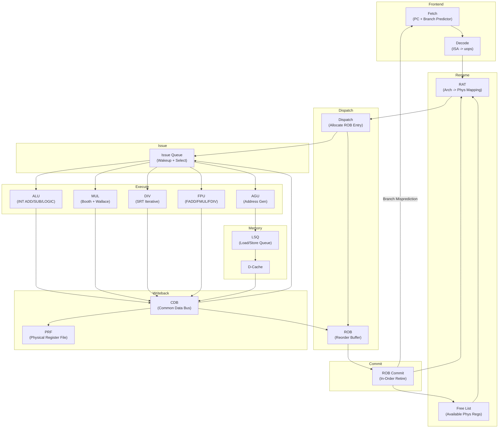
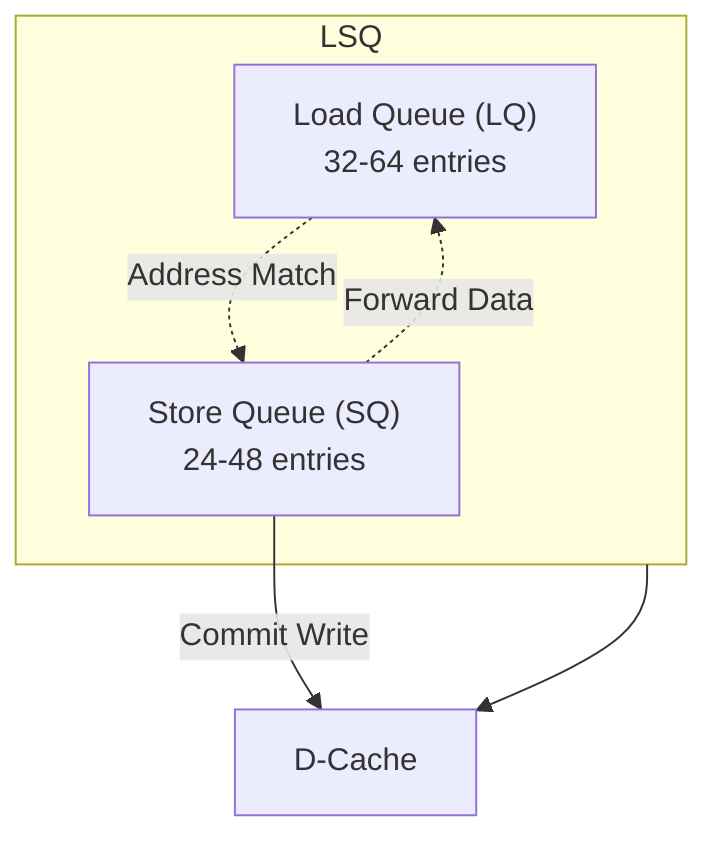
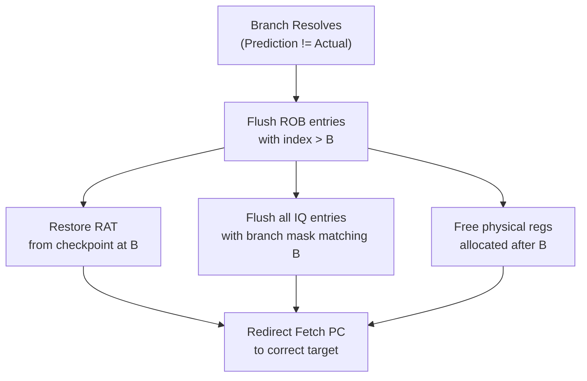
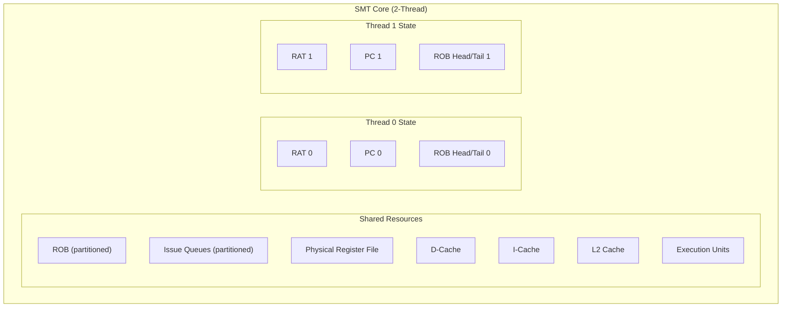

# Out-of-Order Execution — Datapath Design Deep Dive

> **Prerequisites:** [CPU_Architecture](CPU_Architecture.md), [../Fundamentals/Adders](../Fundamentals/Adders.md), [RISC_V_ISA](RISC_V_ISA.md).
> **Hands off to:** [Branch_Prediction_Deep_Dive](Branch_Prediction_Deep_Dive.md), [Cache_Microarchitecture](Cache_Microarchitecture.md), [Xiangshan_CPU_Design](Xiangshan_CPU_Design.md).

---

## 0. Why this page exists

Every modern high-performance CPU uses out-of-order (OoO) execution to extract instruction-level parallelism (ILP) beyond what the compiler can statically schedule. The core insight is simple: instructions need not retire in the order the program wrote them, as long as the *architectural state* updates as if they did. The machinery that makes this possible -- register renaming, reorder buffers, issue queues, load-store queues, and common data buses -- is the subject of this page.

By the end you should be able to sketch a complete OoO datapath from fetch to commit, explain every data structure, trace a misprediction recovery sequence, and reason about the area/power/performance tradeoffs that real designers face.

---

## 1. The OoO Pipeline — Full Block Diagram

The diagram below shows a canonical 4-wide out-of-order pipeline. Data flows left to right; control feedback (branch redirects, CDB wakeup) flows right to left.



**Key feedback paths:**

| Path | Purpose |
|------|---------|
| CDB -> IQ | Wakeup: mark source operands as ready |
| CDB -> ROB | Mark instruction as completed |
| COMMIT -> RAT | Retire: arch register now points to phys register |
| COMMIT -> FREELIST | Free old physical register that was overwritten |
| COMMIT -> FETCH | Redirect PC on branch misprediction |

**Pipeline stages and typical latency (cycles):**

| Stage | Cycles | Notes |
|-------|--------|-------|
| Fetch | 1-2 | I-cache hit; branch predictor in critical path |
| Decode | 1 | ISA instructions to micro-ops |
| Rename | 1 | RAT lookup + free list allocation |
| Dispatch | 1 | ROB + IQ allocation |
| Issue (wait) | 0-N | Until all operands ready |
| Execute | 1-40 | Depends on operation type |
| Writeback | 1 | CDB broadcast |
| Commit | 1 | 4-8 instructions per cycle |

---

## 2. Register Renaming

### 2.1 The Problem Renaming Solves

A RISC-V processor has 32 architectural registers ($x_0$--$x_{31}$). When two instructions write the same arch register but to independent values, the second write creates a **Write-After-Write (WAW)** hazard that forces the second instruction to wait. Similarly, a **Write-After-Read (WAR)** hazard occurs when a later instruction wants to write a register that an earlier instruction has not yet read. Both are *false* (name) dependencies -- they arise from the scarcity of arch register names, not from any true data flow.

Renaming eliminates WAW and WAR by giving every new destination a fresh physical register tag. Only **Read-After-Write (RAW)** -- the true data dependency -- remains.

### 2.2 Register Alias Table (RAT)

The RAT is a lookup table with one entry per architectural register. Each entry holds the physical register tag currently mapped to that arch register.

```
RAT layout (32 entries, one per arch reg):
  arch_reg | phys_tag
  ---------+----------
  x0       | p0       (x0 is hardwired to p0 = 0)
  x1       | p47
  x2       | p12
  ...
  x31      | p103
```

**Rename operation per instruction:**

1. Read RAT entries for source operands: $src_a \leftarrow \text{RAT}[rs1]$, $src_b \leftarrow \text{RAT}[rs2]$.
2. Allocate a free physical register for the destination: $dst_{phys} \leftarrow \text{FreeList.pop()}$.
3. Record the *old* mapping: $dst_{old} \leftarrow \text{RAT}[rd]$.
4. Update RAT: $\text{RAT}[rd] \leftarrow dst_{phys}$.
5. Pass $\{opcode,\ src_a,\ src_b,\ dst_{phys},\ dst_{old}\}$ downstream to dispatch.

When the instruction commits (in-order), $dst_{old}$ is returned to the free list because the arch register no longer references it.

### 2.3 Physical Register File (PRF)

The PRF holds the actual 64-bit values. A typical design uses 128 physical registers for a machine with 32 arch registers and a 128-entry ROB. The PRF has:

- **Read ports:** $2W$ read ports for $W$-wide issue (each instruction reads up to 2 sources).
- **Write ports:** $W$ write ports (one per executing instruction per cycle).
- **Bypass:** The CDB feeds write ports directly; read ports may also source from the bypass network for zero-latency forwarding.

Area scales as $O(W^2 \times N_{phys})$ for a crossbar-connected PRF. This is one reason issue width rarely exceeds 6.

### 2.4 Free List

The free list tracks which physical registers are available for allocation. Implementation options:

| Style | Mechanism | Recovery |
|-------|-----------|----------|
| Bitmap | 128-bit vector, 1 = free | Clear bits on alloc, set bits on free |
| Head/tail FIFO | Circular queue of tags | Move head on alloc, tail on free |
| Stack | LIFO push/pop | Pop on alloc, push on free |

A bitmap is most common because it supports $O(1)$ allocation (priority encoder finds lowest free bit) and $O(1)$ deallocation (set bit).

### 2.5 Checkpoint-Based RAT for Branch Recovery

When a branch is renamed, the processor takes a **snapshot** of the RAT (a *checkpoint*). If the branch later mispredicts, the RAT is restored from the checkpoint in one cycle.

**Copy-on-write shadow RAT:** Each checkpoint stores only the entries that changed since the last snapshot. On a 4-wide machine with 2 branches per cycle, a typical design keeps 8-16 checkpoints, each requiring ~32 x 7 bits = 224 bits of storage.

**ROB-walk recovery:** An alternative that walks the ROB backwards from tail to the branch, undoing each rename. This avoids checkpoint storage but takes $O(N_{ROB})$ cycles. Used in area-constrained designs.

### 2.6 Rename Bandwidth

A 4-wide machine must rename 4 instructions per cycle. This requires:

- 8 RAT read ports (2 sources per instruction) or a multi-cycle RAT.
- 4 free-list allocations per cycle.
- 4 RAT write ports for destinations.
- Handling of intra-group dependencies: if instruction $i+1$ reads a register that instruction $i$ writes, the rename logic must forward $dst_{phys}$ of instruction $i$ directly as the source of instruction $i+1$ (bypass within the rename group).

Typical rename bandwidth: 4-6 instructions per cycle in modern designs (2020s).

---

## 3. Reorder Buffer (ROB)

The ROB is the data structure that enforces in-order retirement while allowing out-of-order execution. It is a circular buffer with two pointers:

- **Tail pointer:** Points to the next free slot. Increments when instructions are dispatched.
- **Head pointer:** Points to the oldest uncommitted instruction. Increments when instructions retire.

### 3.1 ROB Entry Fields

Each ROB entry contains:

| Field | Width | Purpose |
|-------|-------|---------|
| `valid` | 1 bit | Entry is occupied |
| `completed` | 1 bit | Execution finished, result written to PRF |
| `pc` | 39-64 bits | Program counter of this instruction |
| `arch_dst` | 5 bits | Architectural destination register |
| `phys_dst` | 7 bits | Physical destination register tag |
| `phys_dst_old` | 7 bits | Previous physical register for this arch reg |
| `exception` | 8-16 bits | Exception code (0 = none) |
| `branch_mask` | 8-16 bits | Which checkpoints are active for this entry |
| `is_branch` | 1 bit | Entry is a branch |
| `is_store` | 1 bit | Entry is a store (triggers SQ commit) |
| `store_data` | 64 bits | Store data (or pointer to SQ entry) |
| `ldst_addr` | 64 bits | Load/store virtual address |

Total per entry: approximately 200-250 bits. A 128-entry ROB therefore occupies 3-4 KB of SRAM.

### 3.2 ROB Operations

**Allocate (dispatch):**
1. Write instruction metadata into ROB[tail].
2. Set `valid = 1`, `completed = 0`.
3. `tail = (tail + 1) % N_ROB`.
4. If `tail == head`, the ROB is full and dispatch must stall.

**Complete (writeback via CDB):**
1. CDB broadcasts `phys_tag` of completed instruction.
2. ROB entry with matching `phys_dst` sets `completed = 1`.
3. Exception code is recorded if the instruction faulted.

**Commit (retire):**
1. Check ROB[head]. If `completed == 1` and `exception == 0`:
   - Update arch RAT: `arch_RAT[arch_dst] = phys_dst`.
   - Free old mapping: add `phys_dst_old` to free list.
   - If `is_store == 1`: commit store to D-cache.
   - `head = (head + 1) % N_ROB`.
2. Repeat for up to `commit_width` (4-8) entries per cycle.
3. If `exception != 0`: trigger precise exception, flush pipeline.

### 3.3 ROB Sizing Tradeoffs

| ROB Size | IPC Impact | Area (128-bit entries) | Typical Use |
|----------|-----------|----------------------|-------------|
| 32 | Low (frequent stalls) | ~1 KB | Embedded, low-power |
| 64 | Moderate | ~2 KB | Mid-range mobile |
| 128 | Good ILP extraction | ~4 KB | High-performance desktop |
| 256 | Diminishing returns | ~8 KB | Server / HPC |
| 512 | Marginal gain | ~16 KB | Research, extreme ILP |

The sweet spot for most 2020s cores is 128-256 entries. Beyond 256, diminishing returns set in because the program's inherent ILP window is limited by branch mispredictions and cache misses.

---

## 4. Issue Queue (IQ)

The issue queue (also called the reservation station in some texts) holds instructions that have been renamed and dispatched but are waiting for source operands to become ready. Once all operands are ready, the issue queue selects the instruction for execution.

### 4.1 Issue Queue Entry

| Field | Width | Purpose |
|-------|-------|---------|
| `valid` | 1 bit | Entry is occupied |
| `opcode` | 6-10 bits | Operation to perform |
| `src_tag_0` | 7 bits | Physical register tag for source 1 |
| `src_tag_1` | 7 bits | Physical register tag for source 2 |
| `src_rdy_0` | 1 bit | Source 1 data ready |
| `src_rdy_1` | 1 bit | Source 2 data ready |
| `dst_tag` | 7 bits | Physical register tag for result |
| `imm` | 12-20 bits | Immediate value |
| `age` | 7 bits | Age counter for oldest-first selection |
| `rob_idx` | 7 bits | ROB index for result writeback |

### 4.2 Wakeup

Wakeup is the process of marking source operands as ready when a producing instruction writes its result onto the Common Data Bus (CDB).

**Mechanism:**
1. Each CDB line carries the `phys_tag` of the completed instruction.
2. Every IQ entry compares `src_tag_0` and `src_tag_1` against all CDB tags using Content-Addressable Memory (CAM).
3. On a match, the corresponding `src_rdy` bit is set to 1.

**Timing constraint:** Wakeup + Select must complete in one cycle for back-to-back scheduling. This means:
- CAM comparison: $\sim$300-500 ps in a 4 GHz design.
- Selection logic: $\sim$200-300 ps.
- Total: fits within a single clock period only for moderate queue sizes (32-64 entries).

**Speculative wakeup:** When a branch is predicted taken and instructions after it wake up and issue speculatively, those instructions may later need to be flushed. If the branch was mispredicted, all IQ entries with a branch mask matching the mispredicted branch are invalidated. Operands that were speculatively marked ready may need to re-check their producers.

### 4.3 Selection (Oldest-Ready Arbitration)

When multiple instructions are ready, the selection logic picks which ones to issue. The most common policy is **oldest-first** (age-based), which maximizes IPC by prioritizing instructions that have been waiting longest.

**Age-ordered tree:** Entries are sorted by age (time in the queue). A priority encoder scans from oldest to youngest and selects up to $W$ (issue width) ready entries.

Alternative policies:
- **Round-robin:** Simpler but lower IPC.
- **Critical-path-aware:** Prioritize instructions on the critical dependency chain.
- **Resource-aware:** Consider execution unit availability.

### 4.4 Unified vs. Distributed Issue Queues

| Design | Description | Pros | Cons |
|--------|-------------|------|------|
| Unified | Single IQ for all instruction types | Better ILP extraction (any ready instruction can issue) | Large CAM, high power, long wires |
| Distributed | Separate IQs for INT, FP, MEM | Smaller CAMs, lower power, shorter wakeup | Load balancing challenges, fragmentation |

Most high-performance designs use distributed queues (e.g., separate integer, floating-point, and memory issue queues) but may share a unified queue within each domain.

### 4.5 IQ Sizing and Power

The issue queue is one of the most power-hungry structures in an OoO core because every entry performs a CAM comparison against every CDB line every cycle.

$$P_{IQ} \propto N_{entries} \times N_{CDB} \times f_{clock}$$

For a 64-entry IQ with 4 CDB lines at 4 GHz:
$$P_{IQ} \approx 64 \times 4 \times 4 \times 10^9 \times E_{CAM\_compare}$$

Where $E_{CAM\_compare}$ is the energy per CAM cell comparison (~1-5 fJ in 7 nm). This yields roughly 1-5 W just for the IQ CAM -- a significant fraction of a core's power budget.

Techniques to reduce IQ power:
- **Sleep entries:** Disable CAM matching for entries whose operands are already ready.
- **Compaction:** Remove invalid entries to reduce CAM comparisons.
- **Banking:** Split the IQ into banks, only wake up the relevant bank.

---

## 5. Load-Store Queue (LSQ)

The LSQ enforces memory ordering -- it ensures that loads and stores appear to execute in program order with respect to their addresses, even though they may execute out of order internally.

### 5.1 Structure

The LSQ is split into two sub-queues:



**Load Queue (LQ) entry:**

| Field | Width | Purpose |
|-------|-------|---------|
| `valid` | 1 bit | Entry is occupied |
| `addr` | 64 bits | Virtual address of load |
| `data` | 64 bits | Loaded data |
| `rob_idx` | 7 bits | Link to ROB entry |
| `completed` | 1 bit | Load has returned data |

**Store Queue (SQ) entry:**

| Field | Width | Purpose |
|-------|-------|---------|
| `valid` | 1 bit | Entry is occupied |
| `addr` | 64 bits | Virtual address of store |
| `data` | 64 bits | Data to store |
| `rob_idx` | 7 bits | Link to ROB entry |
| `committed` | 1 bit | Store has written to D-cache |

### 5.2 Store Forwarding

When a load executes and its address matches an older (by program order) uncommitted store in the SQ, the load can receive the store's data directly without accessing the D-cache. This is called **store forwarding**.

**Forwarding logic:**
1. Load computes its address via AGU.
2. Compare load address against all SQ entries that are older (lower SQ index) and have valid addresses.
3. If exactly one match: forward SQ data to the load.
4. If multiple matches: forward from the *most recent* (youngest older) store.
5. If no match: access D-cache normally.

**Partial overlap:** If the store writes 4 bytes at address $A$ and the load reads 8 bytes starting at $A-4$, the load needs bytes from both the SQ entry and the D-cache. This is called a partial overlap and requires a merge operation. Some designs simply stall the load until the store commits.

### 5.3 Load Bypassing

A load may execute *before* an older store if their addresses are guaranteed to be different. This is **load bypassing** and is critical for ILP -- without it, every load would have to wait for all prior stores to compute their addresses.

**Conservative approach:** Stall the load until all prior stores have computed their addresses. Safe but limits ILP.

**Aggressive approach:** Allow the load to execute speculatively. If a later store writes to the same address, the load was incorrect and must be re-executed (squash and replay).

### 5.4 Memory Disambiguation

Memory disambiguation predicts whether a load and an older store alias (access the same address). The most common mechanism is the **store-set predictor**:

1. Each load instruction has an associated "store set" -- a set of stores it has previously conflicted with.
2. When a load is issued, if any store in its store set is still in the SQ without a known address, the load is stalled.
3. If no stores in the set are pending, the load issues speculatively.
4. On a misprediction (load got wrong data), the store set is updated and the load pipeline is flushed.

Store-set predictors achieve >95% accuracy on typical workloads and are used in Intel Core, AMD Zen, and ARM Cortex designs.

### 5.5 Store Commit

Stores never write to the D-cache until they reach the head of the ROB and commit. This ensures precise exceptions: if an instruction between the store and the head raises an exception, the store has not yet modified memory and the machine state can be rolled back cleanly.

**Commit sequence:**
1. ROB head entry has `is_store = 1` and `completed = 1`.
2. SQ entry is marked `committed`.
3. Store data and address are written to the D-cache.
4. SQ entry is freed.
5. ROB head advances.

If the D-cache misses, the store buffer holds the data until the cache line is filled. Store buffers are typically 8-16 entries deep.

---

## 6. Branch Misprediction Recovery

Branch mispredictions are the single largest performance limiter in an OoO processor. Every misprediction wastes all work done on the wrong path and incurs a recovery penalty.

### 6.1 Detection

A branch instruction is resolved in the Execute stage when its condition (taken/not-taken) and target address are computed. The resolved outcome is compared against the prediction made during Fetch:

- **Correct prediction:** No action needed. The branch entry in the ROB is marked completed.
- **Misprediction:** Trigger recovery.

### 6.2 Recovery Sequence

When a misprediction is detected at ROB index $B$:



**Detailed steps:**

1. **Flush ROB:** Set `valid = 0` for all entries from `B+1` to `tail`. Set `tail = B + 1` (modulo $N_{ROB}$).
2. **Restore RAT:** Copy the checkpointed RAT (taken at branch rename time) back to the active RAT. With copy-on-write, this means activating the shadow RAT for checkpoint $B$.
3. **Free speculative physical registers:** All physical registers allocated after the branch are returned to the free list. This can be done by walking the freed ROB entries and collecting their `phys_dst` tags, or by maintaining a separate "speculative free list" that is rolled back.
4. **Flush IQ:** Invalidate all IQ entries whose branch mask includes the mispredicted branch.
5. **Flush LSQ:** Invalidate all LQ and SQ entries allocated after the branch.
6. **Redirect fetch:** Set the PC to the correct target address (taken target or PC+4 for not-taken).

### 6.3 Penalty

The misprediction penalty is the number of cycles between the branch entering the pipeline and the recovery being complete. This depends on where in the pipeline the branch resolves.

| Resolution Point | Typical Penalty | Example |
|-----------------|-----------------|---------|
| Execute (ALU) | 8-15 cycles | Integer conditional branch |
| Memory (L1 hit) | 15-25 cycles | Indirect branch via memory |
| Memory (L2 miss) | 25-100+ cycles | Unpredictable indirect branch |

**Mitigation strategies:**
- **Earlier resolution:** Move branch condition evaluation earlier in the pipeline (e.g., into the Issue stage).
- **Branch order prediction:** Predict which branch will resolve first and prioritize it.
- **Fast redirect:** Dedicated bypass path from Execute to Fetch that avoids going through the ROB.

The effective IPC impact of mispredictions is:

$$\text{IPC}_{eff} = \frac{\text{IPC}_{ideal}}{1 + \text{MPKI} \times \text{Penalty} / 1000}$$

Where MPKI = Mispredictions Per Kilo Instructions. A typical high-performance core with MPKI = 10 and a 15-cycle penalty loses roughly 13% of its ideal IPC.

---

## 7. Execution Units

### 7.1 Integer ALU

The ALU handles all integer arithmetic and logic operations: ADD, SUB, AND, OR, XOR, SLT, SLTU, shifts.

- **Latency:** 1 cycle.
- **Throughput:** 1 result per cycle per ALU.
- **Implementation:** Carry-lookahead adder (CLA) or Kogge-Stone adder for 64-bit addition in a single cycle. See [../Fundamentals/Adders](../Fundamentals/Adders.md) for adder design details.
- **Count:** 2-4 ALUs in a typical 4-wide core to handle the mix of ALU operations and address generation.

### 7.2 Integer Multiplier

- **Algorithm:** Modified Booth encoding (radix-4) + Wallace tree compressor + CPA (carry-propagate adder).
- **Encoding:** Radix-4 Booth recoding reduces the number of partial products from 32 to 17 for a 64x64-bit multiply.
- **Compressor tree:** Wallace or Dadda tree reduces 17 partial products to 2 vectors (sum and carry) in $\lceil \log_{1.5}(17) \rceil = 6$ stages.
- **Latency:** 3-5 cycles.
- **Throughput:** Pipelined; can accept a new multiply every 1-2 cycles.
- **RISC-V M extension:** Produces both `mul` (lower 64 bits) and `mulh` (upper 64 bits) results.

### 7.3 Integer Divider

- **Algorithm:** SRT (Sweeney-Robertson-Tocher) iterative division, radix-4 or radix-8.
- **Latency:** 10-40 cycles depending on operand size and algorithm radix.
- **Throughput:** Not pipelined (blocking). Only one division in flight at a time.
- **Optimization:** Newton-Raphson reciprocal approximation can reduce latency for floating-point division but is rarely used for integer division due to precision requirements.
- **Implementation note:** Division is rare (~1% of dynamic instructions), so optimizing it has minimal IPC impact. Most designs use a minimal iterative divider.

### 7.4 Floating-Point Unit (FPU)

| Operation | Latency | Throughput | Notes |
|-----------|---------|------------|-------|
| FADD/FSUB | 3 cycles | 1/cycle | Multi-path adder with leading-zero anticipation |
| FMUL | 4-5 cycles | 1/cycle | Booth + Wallace, similar to integer but with normalization |
| FDIV/FSQRT | 12-24 cycles | 1 per 12-24 cycles | SRT or Goldschmidt iterative |
| FMA (fused multiply-add) | 5-6 cycles | 1/cycle | Combined multiply-add without intermediate rounding |
| FCVT (convert) | 2-3 cycles | 1/cycle | INT<->FP conversion |

The FPU typically has its own dedicated issue queue and register file (32 physical FP registers, renamed separately from integer registers in RISC-V since F registers are a separate architectural namespace).

### 7.5 Address Generation Unit (AGU)

The AGU computes effective addresses for loads and stores:

$$\text{addr} = \text{base} + \text{offset}$$

or

$$\text{addr} = \text{base} + \text{index} \times \text{scale} + \text{displacement}$$

- **Latency:** 1 cycle (a simple adder, often shared with an ALU).
- **Throughput:** 2 per cycle (to support 2 memory operations per cycle).
- **Virtual vs. physical:** The AGU produces a virtual address. Translation to a physical address (via TLB) happens in parallel with or after AGU computation.

### 7.6 Latency / Throughput Summary for a 4-Wide Core

| Unit | Count | Latency | Throughput | Pipelined |
|------|-------|---------|------------|-----------|
| ALU | 3-4 | 1 | 1/each/cycle | Yes |
| MUL | 1-2 | 3-5 | 1/1-2 cycles | Yes |
| DIV | 1 | 10-40 | 1/N cycles | No |
| FPU (FMA) | 1-2 | 5-6 | 1/cycle | Yes |
| FDIV | 1 | 12-24 | 1/N cycles | No |
| AGU | 2 | 1 | 2/cycle | Yes |

**Total execution resource bandwidth:** A 4-wide core can issue up to 4-6 micro-ops per cycle across all units. The dispatch/issue logic must respect resource availability when selecting ready instructions.

---

## 8. Simultaneous Multithreading (SMT)

SMT (called Hyper-Threading by Intel) allows a single OoO core to execute instructions from multiple threads simultaneously, sharing most datapath resources while maintaining separate architectural state for each thread.

### 8.1 What is Shared vs. Replicated



| Resource | Sharing Model | Rationale |
|----------|--------------|-----------|
| ROB | Partitioned (half per thread) | Each thread needs its own in-order retirement |
| IQ | Shared or partitioned | Shared gives better utilization but requires thread ID per entry |
| PRF | Shared | Registers are already tagged; thread ID distinguishes them |
| RAT | Replicated | Each thread has independent arch-to-phys mappings |
| PC / Fetch state | Replicated | Independent fetch streams |
| Execution units | Shared | Issued instructions from either thread use available units |
| Branch predictor | Shared | Predictions tagged by thread ID or global history per thread |
| L1/L2 caches | Shared | Thread data coexists in cache sets |

### 8.2 SMT Performance

SMT improves throughput by filling issue slots that would otherwise be idle when one thread stalls (cache miss, branch misprediction, dependency chain).

$$\text{Speedup}_{SMT} = \frac{\text{IPC}_{T0} + \text{IPC}_{T1}}{\text{IPC}_{single}}$$

Typical speedup ranges:
- **2-thread SMT:** 1.3x - 1.7x throughput over single-thread.
- **4-thread SMT:** 1.5x - 2.2x throughput (diminishing returns due to resource contention).
- **8-thread SMT:** 1.6x - 2.5x throughput (rare in practice; used in some IBM POWER designs).

The speedup is limited because both threads compete for the same execution resources, cache space, and memory bandwidth.

### 8.3 Thread Scheduling Policies

| Policy | Mechanism | Pros | Cons |
|--------|-----------|------|------|
| Round-robin | Alternate fetch/issue between threads each cycle | Fair, simple | Does not prioritize the thread with higher ILP |
| I-count | Favor the thread with fewer instructions in the pipeline | Reduces resource pressure, improves fairness | More complex hardware |
| Speculation-aware | Deprioritize thread after misprediction | Higher throughput by focusing on the "good" thread | Starvation risk |

Most implementations use a combination: round-robin at fetch with I-count gated issue (a thread that fills its IQ partition is temporarily deprioritized).

---

## 9. Exception and Interrupt Handling

### 9.1 Precise Exceptions via the ROB

The ROB guarantees **precise exceptions**: when an exception occurs, the architectural state reflects exactly the state as if all instructions before the excepting instruction had completed and none after had executed.

**Mechanism:**
1. An instruction detects an exception during execution (e.g., divide by zero, page fault, invalid opcode).
2. The exception code is recorded in the ROB entry (field `exception`).
3. The instruction is marked `completed = 1` (the exception *result* is known, even if the instruction did not produce a value).
4. The instruction waits in the ROB until it reaches the head.
5. At commit time, the ROB sees `exception != 0` and triggers the exception handler instead of normal retirement.
6. All ROB entries after the excepting instruction are flushed.
7. The architectural RAT is already correct because only instructions before the exception have committed.

This design means exceptions are handled *lazily* -- they are detected early but acted upon late (at commit). The advantage is simplicity: no special fast-flush logic is needed for exceptions; the normal commit path handles them.

### 9.2 Synchronous vs. Asynchronous Exceptions

| Type | Examples | Timing | Detection |
|------|----------|--------|-----------|
| Synchronous (trap) | ECALL, EBREAK, invalid opcode, page fault, misaligned access | Caused by a specific instruction | Recorded in ROB at execute |
| Asynchronous (interrupt) | Timer interrupt, external I/O interrupt, inter-processor interrupt | Can occur between any two instructions | Sampled between commits |

**Handling asynchronous interrupts:** The processor samples the interrupt line between ROB commits. If an interrupt is pending and the pipeline is not in a critical section, the next instruction to commit is treated as if it raised a synchronous exception. Some designs insert a "trampoline" instruction at the head of the ROB.

### 9.3 RISC-V Exception Handling

When an exception is taken in RISC-V:

1. **Save PC:** $\text{mepc}$ (or $\text{sepc}$ for S-mode) $\leftarrow$ PC of excepting instruction.
2. **Save cause:** $\text{mcause}$ (or $\text{scause}$) $\leftarrow$ exception code.
3. **Save value:** $\text{mtval}$ (or $\text{stval}$) $\leftarrow$ faulting address or instruction.
4. **Set mode:** Change privilege to M-mode (or S-mode).
5. **Disable interrupts:** $\text{mstatus.MIE} \leftarrow 0$.
6. **Jump to handler:** $\text{PC} \leftarrow \text{mtvec}$ (or $\text{stvec}$).

**Return from handler:** Execute `MRET` (or `SRET`):
1. $\text{PC} \leftarrow \text{mepc}$.
2. Restore privilege mode.
3. $\text{mstatus.MIE} \leftarrow \text{mstatus.MPIE}$.

The OoO datapath handles this by flushing the entire pipeline (same mechanism as a branch misprediction, but initiated from the commit stage) and redirecting fetch to the trap vector.

---

## 10. Numbers to Memorize

These are the typical parameters for a modern high-performance 4-wide OoO core (circa 2020s):

| Parameter | Typical Value | Range |
|-----------|--------------|-------|
| ROB entries | 128 | 64 - 256 |
| Issue queue (total, all queues) | 64 | 32 - 128 |
| Physical registers (INT) | 128 | 80 - 160 |
| Physical registers (FP) | 96 | 64 - 128 |
| Load queue entries | 48 | 32 - 64 |
| Store queue entries | 32 | 24 - 48 |
| Rename width | 4 | 4 - 6 |
| Dispatch width | 4 | 4 - 6 |
| Issue width | 4-6 | 4 - 8 |
| Commit width | 4-8 | 4 - 8 |
| Branch misprediction penalty | 12 cycles | 8 - 20 |
| L1 D-cache load-use latency | 4 cycles | 3 - 5 |
| Branch predictor accuracy | 97% | 95% - 99.5% |
| Checkpoint depth | 8-16 | 4 - 32 |
| Pipeline depth (frontend to commit) | 15 stages | 10 - 20 |
| Clock frequency | 3-5 GHz | 2 - 6 |
| Core die area | 5-15 mm^2 | 3 - 25 |
| Core power (TDP) | 15-50 W | 5 - 100 |

**Memory bandwidth hierarchy:**

| Level | Latency | Bandwidth |
|-------|---------|-----------|
| PRF read | 1 cycle (bypass) | Unlimited (port-limited) |
| L1 D-cache | 3-4 cycles | 2 loads/cycle |
| L2 cache | 10-15 cycles | 1 load/cycle |
| L3 cache | 30-50 cycles | Shared across cores |
| DRAM | 100-300 cycles | 50-100 GB/s |

---

## 11. Worked Problems

### Problem 1: Rename + Wakeup Trace

**Trace the following instruction sequence through rename and issue queue wakeup. Assume RAT starts with x1=p1, x2=p2, x3=p3, x4=p4, x5=p5, x6=p6, x7=p7, x8=p8. Free list = {p9, p10, p11, p12, ...}.**

```
I1: ADD  x1, x2, x3    // x1 = x2 + x3
I2: MUL  x4, x1, x5    // x4 = x1 * x5
I3: ADD  x6, x7, x8    // x6 = x7 + x8
I4: SW   x4, 0(x6)     // mem[x6] = x4
```

**Rename (all 4 in one cycle):**

| Instr | rd | rs1 | rs2 | phys_dst | phys_src1 | phys_src2 | phys_dst_old | Ready? |
|-------|----|-----|-----|----------|-----------|-----------|-------------|--------|
| I1 | x1 | x2 | x3 | p9 | p2 | p3 | p1 | srcs ready |
| I2 | x4 | x1 | x5 | p10 | **p9** (bypassed from I1) | p5 | p4 | src1 NOT ready (waits for p9) |
| I3 | x6 | x7 | x8 | p11 | p7 | p8 | p6 | srcs ready |
| I4 | -- | x4 | x6 | -- | **p10** (bypassed from I2) | **p11** (bypassed from I3) | -- | srcs NOT ready (waits for p10, p11) |

Note: Intra-group bypassing in the rename stage forwards the new physical destination of I1 (p9) as the source for I2's x1, and similarly p10 for I4's x4, p11 for I4's x6.

**Issue Queue state after dispatch:**

| Entry | Opcode | src1 | rdy1 | src2 | rdy2 | dst |
|-------|--------|------|------|------|------|-----|
| 0 | ADD | p2 | 1 | p3 | 1 | p9 |
| 1 | MUL | p9 | 0 | p5 | 1 | p10 |
| 2 | ADD | p7 | 1 | p8 | 1 | p11 |
| 3 | SW | p10 | 0 | p11 | 0 | -- |

**Cycle-by-cycle execution:**

| Cycle | Event |
|-------|-------|
| 1 | IQ entries 0 and 2 are fully ready. Select oldest: issue I1 (ADD) and I3 (ADD) to ALUs. |
| 2 | I1 completes: CDB broadcasts p9. IQ entry 1: src1=p9 matches, rdy1 := 1. I3 completes: CDB broadcasts p11. IQ entry 3: src2=p11 matches, rdy2 := 1. |
| 3 | IQ entry 1 (MUL) now fully ready. Issue to multiplier. Entry 3 still waits for p10. |
| 3+4+5 | MUL executes (3-cycle latency). |
| 6 | I2 (MUL) completes: CDB broadcasts p10. IQ entry 3: src1=p10 matches, rdy1 := 1. Now fully ready. |
| 7 | Issue I4 (SW). AGU computes address, SQ entry is activated. |

**Total cycles from dispatch to SW issue: 7.** If the MUL were 1 cycle (like an ADD), it would be only 3 cycles -- showing how long-latency operations create bottlenecks on dependent chains.

---

### Problem 2: ROB Circular Buffer Arithmetic

**Given a 128-entry ROB. After some execution, head = 45, tail = 100. How many entries are occupied?**

The number of occupied entries in a circular buffer:

$$N_{occupied} = (tail - head) \mod N_{ROB} = (100 - 45) \mod 128 = 55$$

**If 8 instructions commit in one cycle and 4 new instructions are dispatched, what are the new head and tail?**

$$head_{new} = (head + commit\_width) \mod N_{ROB} = (45 + 8) \mod 128 = 53$$
$$tail_{new} = (tail + dispatch\_width) \mod N_{ROB} = (100 + 4) \mod 128 = 104$$

$$N_{occupied,new} = (104 - 53) \mod 128 = 51$$

**Is the ROB full?** The ROB is full when $(tail + 1) \mod N_{ROB} == head$. Here $(104 + 1) \mod 128 = 105 \neq 53$, so no.

**What is the maximum number of instructions that can commit without dispatching?**

$$N_{max\_commit} = N_{occupied} = 51$$

(but limited by commit width per cycle, so it takes $\lceil 51 / 8 \rceil = 7$ cycles).

---

### Problem 3: Misprediction Recovery

**A branch at ROB index 10 mispredicts. Current tail = 25. ROB has 64 entries. Checkpoint at index 10 saved: RAT[x5] = p20, RAT[x7] = p35 (only these changed since the branch). Free list currently has: {p50, p51, ...}. Physical registers allocated for ROB entries 11-25 are: p100 through p114.**

**Step 1: Flush ROB entries 11-25.**
- Set valid = 0 for entries 11, 12, ..., 25 (15 entries).
- New tail = 11 (= branch index + 1).

**Step 2: Restore RAT from checkpoint.**
- The checkpoint recorded that only x5 and x7 changed since the branch.
- Restore: RAT[x5] = p20, RAT[x7] = p35.
- All other RAT entries are already correct (they were not overwritten after the branch, or the overwriting instructions have already been flushed and their mappings undone).

**Step 3: Free speculative physical registers.**
- Physical registers p100 through p114 (15 registers) were allocated for the wrong-path instructions.
- Add all of them back to the free list: FreeList = {p100, p101, ..., p114, p50, p51, ...}.

**Step 4: Flush IQ.**
- All IQ entries tagged with the branch mask corresponding to ROB index 10 are invalidated.

**Step 5: Redirect fetch.**
- Set PC to the correct branch target (e.g., if the branch was predicted taken but is actually not-taken, PC = branch_PC + 4).

**Cycles for recovery:** Approximately 2-3 cycles for the flush and RAT restore, then the fetch pipeline must refill (8-15 cycles depending on pipeline depth). Total penalty: ~10-18 cycles.

---

### Problem 4: LSQ Store Forwarding

**Given the following memory operations in program order:**

```
I1: SW   x5, 100(x0)    // store WORD at addr 100, data = x5 = 0xDEADBEEF
I2: SW   x6, 104(x0)    // store WORD at addr 104, data = x6 = 0xCAFEBABE
I3: LW   x7, 100(x0)    // load WORD from addr 100
I4: LH   x8, 102(x0)    // load HALF from addr 102
I5: LW   x9, 104(x0)    // load WORD from addr 104
```

**SQ state after I1 and I2 execute (addresses and data known):**

| SQ Entry | Addr | Size | Data | Committed |
|----------|------|------|------|-----------|
| 0 (I1) | 100 | WORD | 0xDEADBEEF | No |
| 1 (I2) | 104 | WORD | 0xCAFEBABE | No |

**I3 (LW from addr 100):**
- Search SQ for older entries matching addr 100.
- SQ[0] matches (addr = 100, WORD). Forward data to load: x7 = 0xDEADBEEF.

**I4 (LH from addr 102):**
- Search SQ for older entries matching addr 102.
- SQ[0] covers bytes 100-103. SQ[1] covers bytes 104-107.
- The load reads bytes 102-103, which are part of SQ[0]'s store (WORD at 100 covers bytes 100, 101, 102, 103).
- Bytes 102-103 of 0xDEADBEEF: 0xBEEF (big-endian) or 0xDEAD (little-endian). For a little-endian machine: the WORD at addr 100 is stored as EF BE AD DE, so bytes 102-103 are AD DE. The half-word at addr 102 is 0xDEAD.
- Forward from SQ[0], extract the relevant bytes: x8 = 0xDEAD.

**I5 (LW from addr 104):**
- Search SQ for older entries matching addr 104.
- SQ[1] matches (addr = 104, WORD). Forward data: x9 = 0xCAFEBABE.
- SQ[0] does not overlap (addr 100, WORD covers 100-103, no overlap with 104-107).

**Key insight:** Store forwarding must handle sub-word and partial overlaps correctly. The address comparison must be range-based, not just equality.

---

### Problem 5: Issue Queue Wakeup-Select for 4-Entry IQ

**Design a 4-entry IQ with wakeup and select logic. Show the state after each cycle.**

**Initial state (all 4 instructions dispatched this cycle):**

| Entry | Opcode | src1 | rdy1 | src2 | rdy2 | dst | Age (0=oldest) |
|-------|--------|------|------|------|------|-----|-----------------|
| 0 | ADD | p5 | 1 | p6 | 1 | p20 | 0 |
| 1 | MUL | p20 | 0 | p7 | 1 | p21 | 1 |
| 2 | ADD | p8 | 1 | p9 | 1 | p22 | 2 |
| 3 | SUB | p22 | 0 | p5 | 1 | p23 | 3 |

**Assumptions:** 2-wide issue. ALU = 1 cycle. MUL = 3 cycles. One ALU, one multiplier.

**Cycle 0 (select):**

Ready instructions: Entry 0 (ADD, both srcs ready, age 0) and Entry 2 (ADD, both srcs ready, age 2).

Select oldest 2 ready: Issue Entry 0 to ALU and Entry 2 to ALU. But we only have 1 ALU. So issue Entry 0 to ALU. Entry 2 is also ready but there is no second ALU. However, assume we have 2 ALUs for this example.

Issue: Entry 0 (ADD -> ALU0) and Entry 2 (ADD -> ALU1).

**Cycle 1 (wakeup):**

ALU0 produces p20. ALU1 produces p22.

CAM match: Entry 1 src1=p20 -> rdy1 := 1. Entry 3 src1=p22 -> rdy1 := 1.

| Entry | Opcode | src1 | rdy1 | src2 | rdy2 | dst | Age |
|-------|--------|------|------|------|------|-----|-----|
| 1 | MUL | p20 | **1** | p7 | 1 | p21 | 1 |
| 3 | SUB | p22 | **1** | p5 | 1 | p23 | 3 |

Both entries are now fully ready. Select oldest: Entry 1 (age 1) to multiplier, Entry 3 (age 3) to ALU.

Issue: Entry 1 (MUL) and Entry 3 (SUB).

**Cycle 2 (wakeup):**

ALU produces p23 (from SUB). No one in IQ is waiting for p23. MUL is still executing (needs 3 cycles total, 2 remaining).

IQ is now empty. MUL will complete at Cycle 4.

**Cycle 4 (MUL completes):**

CDB broadcasts p21. No IQ entries to wake up. The result is written to the PRF and the ROB entry for the MUL is marked completed.

**Total execution span: 5 cycles** (dispatch at cycle 0, last result at cycle 4) for 4 instructions with a data dependency chain (I0 -> I1 -> I2 -> I3 partially, but I3 only depends on I2, not I1).

---

## References

1. Hennessy, J.L. and Patterson, D.A., *Computer Architecture: A Quantitative Approach*, 6th Edition, Morgan Kaufmann, 2017. Chapters 2-3 cover ILP and OoO execution in depth.
2. Sima, D., "The Design Space of Register Renaming Techniques," *IEEE Micro*, Vol. 20, No. 5, 2000.
3. Kessler, R.E., "The Alpha 21264 Microprocessor," *IEEE Micro*, Vol. 19, No. 2, 1999. A classic description of a high-frequency OoO design with distributed issue queues.
4. Sohi, G.S. and Vajapeyam, S., "Instruction Issue Logic for High-Performance, Interruptible Pipelined Processors," *ISCA*, 1987. Foundational paper on ROB-based OoO design.
5. Chrysos, G.Z. and Emer, J.S., "Memory Dependence Prediction Using Store Sets," *ISCA*, 1998. The store-set predictor paper.
6. Tullsen, D.M., Eggers, S.J., and Levy, H.M., "Simultaneous Multithreading: A Hardware and Software Model," *ISCA*, 1995. Original SMT paper.
7. RISC-V International, *The RISC-V Instruction Set Manual*, Volume I: Unprivileged Architecture, Document Version 20240411, 2024.

---

## Navigation

**Up:** [../Index.md](../Index.md) | **Next:** [Branch_Prediction_Deep_Dive](Branch_Prediction_Deep_Dive.md) | **See also:** [CPU_Architecture](CPU_Architecture.md), [Cache_Microarchitecture](Cache_Microarchitecture.md), [Xiangshan_CPU_Design](Xiangshan_CPU_Design.md)
