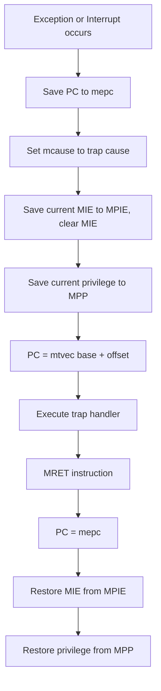
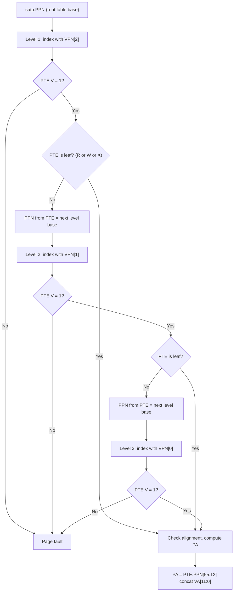
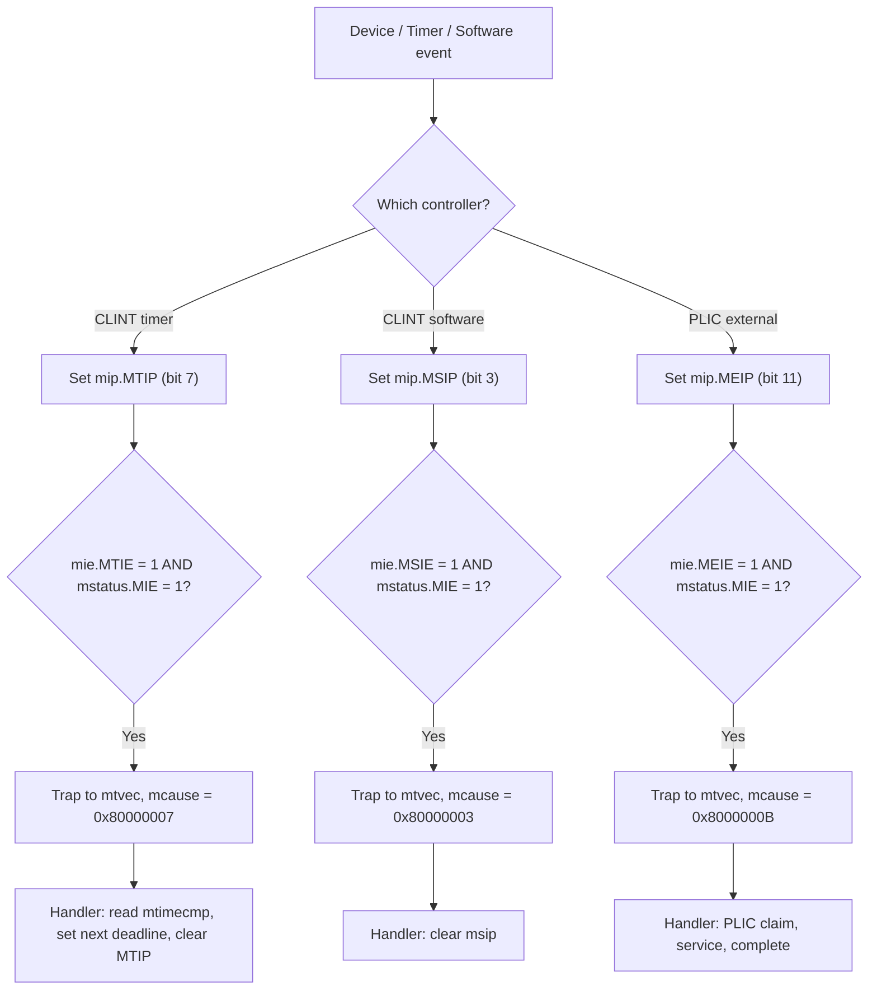

# RISC-V ISA — RV64G Complete Reference

> Prerequisites: [CPU_Architecture](CPU_Architecture.md), [../Fundamentals/Basic_Knowledge](../Fundamentals/Basic_Knowledge.md).
> Hands off to: [OoO_Execution](OoO_Execution.md), [Xiangshan_CPU_Design](Xiangshan_CPU_Design.md).

---

## 0. Why this page exists

RISC-V is the dominant open instruction set architecture. Every serious CPU design project
in academia and most new commercial SoCs now target RV64G as their ISA. Unlike ARM or x86,
RISC-V has no license fee and no hidden microarchitectural contract, which means a hardware
engineer must understand the full RV64G specification at the bit level to build a compliant
processor. This page covers the base integer ISA (RV64I), the M/A/F/D extensions, compressed
instructions, privilege modes, and virtual memory, with enough encoding detail to debug a
processor by reading hex dumps from an instruction trace.

---

## 1. RV64I Base Integer ISA

### 1.1 Register File

RV64I provides 32 general-purpose registers, each 64 bits wide. Register `x0` is hardwired
to zero; writes to `x0` are silently discarded.

| Register | ABI Name | Description              |
|----------|----------|--------------------------|
| x0       | zero     | Hardwired zero           |
| x1       | ra       | Return address           |
| x2       | sp       | Stack pointer            |
| x3       | gp       | Global pointer           |
| x4       | tp       | Thread pointer           |
| x5       | t0       | Temporary / alternate link |
| x6-x7    | t1-t2    | Temporaries              |
| x8       | s0/fp    | Saved register / frame ptr |
| x9       | s1       | Saved register           |
| x10-x11  | a0-a1    | Function args / return vals |
| x12-x17  | a2-a7    | Function arguments       |
| x18-x27  | s2-s11   | Saved registers          |
| x28-x31  | t3-t6    | Temporaries              |

There is no dedicated flags or condition-code register. Compare-and-branch instructions
test registers directly.

### 1.2 Instruction Encoding Formats

Every RV64I instruction is 32 bits wide (unless compressed, see Section 5). The ISA uses
six encoding formats. The bit-field layout for each is shown below.

**R-type (Register-register ALU)**

```
[31:25]  [24:20]  [19:15]  [14:12]  [11:7]   [6:0]
funct7    rs2       rs1     funct3     rd     opcode
```

**I-type (Immediate ALU / Load / JALR)**

```
[31:20]       [19:15]  [14:12]  [11:7]   [6:0]
imm[11:0]      rs1     funct3     rd     opcode
```

**S-type (Store)**

```
[31:25]        [24:20]  [19:15]  [14:12]  [11:7]        [6:0]
imm[11:5]       rs2       rs1     funct3   imm[4:0]     opcode
```

**B-type (Branch)**

```
[31]   [30:25]     [24:20]  [19:15]  [14:12]  [11:8]      [7]     [6:0]
imm[12] imm[10:5]   rs2       rs1     funct3   imm[4:1]  imm[11]  opcode
```

The B-type immediate encodes a signed 13-bit offset (multiplied by 2) with bits
scattered: `imm[12|10:5|4:1|11]`.

**U-type (Upper immediate)**

```
[31:12]           [11:7]   [6:0]
imm[31:12]         rd      opcode
```

The 20-bit upper immediate is placed into bits 31:12 of a 32-bit value; the
low 12 bits are zero. Used by LUI and AUIPC.

**J-type (Jump)**

```
[31]    [30:21]       [20]     [19:12]      [11:7]   [6:0]
imm[20] imm[10:1]    imm[11]   imm[19:12]    rd      opcode
```

The J-type immediate encodes a signed 21-bit offset (multiplied by 2). Bits are
reordered: `imm[20|10:1|11|19:12]`.

All immediates are sign-extended from their highest bit within the instruction word
(bit 31 for I/S/B/U/J types). R-type instructions have no immediate field -- bits
31:25 are occupied by funct7 instead.

### 1.3 Arithmetic and Logical Instructions

**Register-register operations (R-type):**

| Instruction | funct7 | funct3 | Operation                           |
|-------------|--------|--------|-------------------------------------|
| ADD         | 0x00   | 0x0    | rd = rs1 + rs2                      |
| SUB         | 0x20   | 0x0    | rd = rs1 - rs2                      |
| SLL         | 0x00   | 0x1    | rd = rs1 << rs2[5:0]               |
| SLT         | 0x00   | 0x2    | rd = (rs1 < rs2) ? 1 : 0 (signed)  |
| SLTU        | 0x00   | 0x3    | rd = (rs1 < rs2) ? 1 : 0 (unsigned)|
| XOR         | 0x00   | 0x4    | rd = rs1 ^ rs2                      |
| SRL         | 0x00   | 0x5    | rd = rs1 >> rs2[5:0] (logical)     |
| SRA         | 0x20   | 0x5    | rd = rs1 >> rs2[5:0] (arithmetic)  |
| OR          | 0x00   | 0x6    | rd = rs1 OR rs2                     |
| AND         | 0x00   | 0x7    | rd = rs1 AND rs2                    |

**Immediate operations (I-type):**

| Instruction | funct3 | Operation                                 |
|-------------|--------|-------------------------------------------|
| ADDI        | 0x0    | rd = rs1 + imm (12-bit signed)            |
| SLTI        | 0x2    | rd = (rs1 < imm) ? 1 : 0 (signed)        |
| SLTIU       | 0x3    | rd = (rs1 < imm) ? 1 : 0 (unsigned, imm sign-ext) |
| XORI        | 0x4    | rd = rs1 ^ imm                            |
| ORI         | 0x6    | rd = rs1 OR imm                           |
| ANDI        | 0x7    | rd = rs1 AND imm                          |
| SLLI        | 0x1    | rd = rs1 << shamt (imm[5:0], imm[11:6]=0) |
| SRLI        | 0x5    | rd = rs1 >> shamt (logical, imm[11:6]=0)  |
| SRAI        | 0x5    | rd = rs1 >> shamt (arith, imm[11:6]=0x10) |

The shift amount `shamt` occupies `imm[5:0]` (bits 24:20 of the instruction).
For RV64, `shamt` is 6 bits (shifts 0-63).

### 1.4 Upper Immediate Instructions

**LUI (Load Upper Immediate):** `rd = imm << 12`
Places the 20-bit U-type immediate into the upper 20 bits of `rd`, clearing the
lower 12 bits. Opcode: `0110111`.

**AUIPC (Add Upper Immediate to PC):** `rd = PC + (imm << 12)`
Computes PC-relative address with a 20-bit upper immediate. Essential for building
large offsets when combined with a subsequent ADDI or JALR. Opcode: `0010111`.

### 1.5 Jump Instructions

**JAL (Jump and Link):** `rd = PC + 4; PC = PC + offset`
J-type encoding. The default `rd = x1` (ra) stores the return address. The offset
is a signed 21-bit value (in units of 2 bytes), giving a range of $\pm 1\text{MiB}$.

**JALR (Jump and Link Register):** `rd = PC + 4; PC = (rs1 + imm) & ~1`
I-type encoding. The target address is computed from a base register plus a 12-bit
signed immediate, with the least significant bit cleared. Used for returns (`jalr x0, 0(ra)`)
and indirect calls.

### 1.6 Conditional Branches

All branch instructions use B-type encoding. The offset is a signed 13-bit value
(in units of 2 bytes), giving a range of $\pm 4\text{KiB}$. No branch writes to a register.

| Instruction | funct3 | Condition (signed/unsigned)       |
|-------------|--------|------------------------------------|
| BEQ         | 0x0    | branch if rs1 == rs2               |
| BNE         | 0x1    | branch if rs1 != rs2               |
| BLT         | 0x4    | branch if rs1 < rs2   (signed)     |
| BGE         | 0x5    | branch if rs1 >= rs2  (signed)     |
| BLTU        | 0x6    | branch if rs1 < rs2   (unsigned)   |
| BGEU        | 0x7    | branch if rs1 >= rs2  (unsigned)   |

### 1.7 Load and Store Instructions

RV64I supports byte, halfword, word, and doubleword memory accesses. All use
little-endian byte order.

**Loads (I-type):**

| Instruction | funct3 | Width    | Sign extend |
|-------------|--------|----------|-------------|
| LB          | 0x0    | 8 bit    | Yes         |
| LH          | 0x1    | 16 bit   | Yes         |
| LW          | 0x2    | 32 bit   | Yes         |
| LD          | 0x3    | 64 bit   | N/A         |
| LBU         | 0x4    | 8 bit    | No (zero)   |
| LHU         | 0x5    | 16 bit   | No (zero)   |
| LWU         | 0x6    | 32 bit   | No (zero)   |

**Stores (S-type):**

| Instruction | funct3 | Width    |
|-------------|--------|----------|
| SB          | 0x0    | 8 bit    |
| SH          | 0x1    | 16 bit   |
| SW          | 0x2    | 32 bit   |
| SD          | 0x3    | 64 bit   |

Effective address = `rs1 + imm` (sign-extended 12-bit immediate for loads,
split immediate for stores). All memory addresses must be naturally aligned in
the base ISA; misaligned access support is optional.

### 1.8 RV64-specific Word Operations

RV64I adds "W" suffix variants that perform 32-bit arithmetic on the lower word
of the register and sign-extend the result to 64 bits.

| Instruction | Operation                                |
|-------------|------------------------------------------|
| ADDW        | rd = sign_ext((rs1 + rs2)[31:0])         |
| SUBW        | rd = sign_ext((rs1 - rs2)[31:0])         |
| SLLW        | rd = sign_ext(rs1[31:0] << rs2[4:0])    |
| SRLW        | rd = sign_ext(rs1[31:0] >> rs2[4:0]) (logical) |
| SRAW        | rd = sign_ext(rs1[31:0] >>a rs2[4:0])   |
| ADDIW       | rd = sign_ext((rs1 + imm)[31:0])         |
| SLLIW       | rd = sign_ext(rs1[31:0] << shamt[4:0])  |
| SRLIW       | rd = sign_ext(rs1[31:0] >> shamt[4:0]) (logical) |
| SRAIW       | rd = sign_ext(rs1[31:0] >>a shamt[4:0]) |

The W variants use a 5-bit shift amount (not 6), since only the low 32 bits
participate. These instructions exist because many programs use 32-bit values
(INT in C), and without them every 32-bit operation would require explicit
sign-extension instructions.

---

## 2. RV64M Extension (Multiply/Divide)

The M extension provides integer multiplication and division. It uses R-type
encoding with opcode `0111011` (for the 64-bit variants) and `0111011` with
funct7 fields to distinguish operations.

### 2.1 Multiplication

| Instruction | funct7 | Operation                                         |
|-------------|--------|---------------------------------------------------|
| MUL         | 0x01   | rd = (rs1 * rs2)[63:0] (lower 64 bits)            |
| MULH        | 0x01   | rd = (rs1 * rs2)[127:64] (signed * signed)        |
| MULHU       | 0x01   | rd = (rs1 * rsu)[127:64] (unsigned * unsigned)    |
| MULHSU      | 0x01   | rd = (rs1 * rsu)[127:64] (signed * unsigned)      |

The product of two 64-bit numbers is 128 bits wide. `MUL` returns the lower
64 bits; `MULH`/`MULHU`/`MULHSU` return the upper 64 bits, differing only
in whether operands are treated as signed or unsigned.

`MULHSU` is the signed-times-unsigned variant, useful for implementing
64-bit division by a constant via multiply-high.

**32-bit variant:**

| Instruction | Operation                                  |
|-------------|--------------------------------------------|
| MULW        | rd = sign_ext((rs1 * rs2)[31:0])           |

MULW uses opcode `0111011` with a funct7 that marks it as a word-size multiply.

### 2.2 Division

| Instruction | funct7 | Operation                                  |
|-------------|--------|--------------------------------------------|
| DIV         | 0x01   | rd = rs1 / rs2  (signed, truncate to zero) |
| DIVU        | 0x01   | rd = rs1 / rs2  (unsigned)                 |
| REM         | 0x01   | rd = rs1 % rs2  (signed remainder)         |
| REMU        | 0x01   | rd = rs1 % rs2  (unsigned remainder)       |

**32-bit variants:** DIVW, DIVUW, REMW, REMUW operate on lower 32 bits and
sign-extend the result.

### 2.3 Special Cases

Division by zero:
- `DIV(U)`: quotient = all 1s (i.e., $2^{64}-1$ for 64-bit, $2^{32}-1$ for W variants)
- `REM(U)`: remainder = dividend (rs1)

Signed overflow (only `DIV`): $-2^{63} / -1$ produces $-2^{63}$ (the quotient
would be $+2^{63}$ which is not representable in signed 64-bit).

These definitions avoid trapping on division edge cases, simplifying
microarchitectural implementation.

---

## 3. RV64A Extension (Atomic)

The A extension provides two mechanisms for synchronization: load-reserved /
store-conditional (LR/SC) and atomic memory operations (AMO). All A-extension
instructions use opcode `0101111`.

### 3.1 Load Reserved / Store Conditional

**LR.W / LR.D (Load Reserved):**
```
lr.{w,d} rd, (rs1)
```
Loads a word (32-bit) or doubleword (64-bit) from the address in `rs1` and
places it in `rd`. Simultaneously creates a **reservation set** that tracks
whether the loaded memory location is modified before a subsequent SC.

Encoding: I-type sub-format. `rs2 = 0`, `funct3 = 010` (W) or `011` (D),
`funct7 = 00010{aq}{rl}` where aq and rl are single-bit ordering hints.

**SC.W / SC.D (Store Conditional):**
```
sc.{w,d} rd, rs2, (rs1)
```
Attempts to store `rs2` to the address in `rs1`. If the reservation is still
valid (no other hart wrote to the reservation set), the store succeeds and
`rd` is set to 0. If the reservation was invalidated, the store fails and
`rd` is set to a nonzero value.

Encoding: R-type. `funct7 = 00011{aq}{rl}`, `funct3 = 010` (W) or `011` (D).

### 3.2 Atomic Memory Operations (AMO)

Each AMO instruction atomically loads a value from memory, performs an
operation with a register operand, stores the result back, and places the
original loaded value in `rd`.

| Instruction | funct7 | Operation: rd = *addr; *addr = rd op rs2 |
|-------------|--------|------------------------------------------|
| AMOSWAP     | 00001  | Swap: *addr = rs2                         |
| AMOADD      | 00000  | *addr = *addr + rs2                       |
| AMOXOR      | 00100  | *addr = *addr XOR rs2                     |
| AMOOR       | 01000  | *addr = *addr OR rs2                      |
| AMOAND      | 01100  | *addr = *addr AND rs2                     |
| AMOMIN      | 10000  | *addr = min(*addr, rs2) (signed)          |
| AMOMAX      | 10100  | *addr = max(*addr, rs2) (signed)          |
| AMOMINU     | 11000  | *addr = min(*addr, rs2) (unsigned)        |
| AMOMAXU     | 11100  | *addr = max(*addr, rs2) (unsigned)        |

Each has `.W` (funct3=010) and `.D` (funct3=011) variants for RV64.

### 3.3 Memory Ordering: aq and rl Bits

Every A-extension instruction carries two single-bit ordering hints in the
instruction encoding (bits 26 and 25 of the instruction, within funct7):

- **aq (acquire):** Ensures subsequent memory operations in program order
  cannot be reordered before this AMO/LR.
- **rl (release):** Ensures prior memory operations in program order cannot
  be reordered after this AMO/SC.

| aq  | rl  | Semantics                                  |
|-----|-----|---------------------------------------------|
| 0   | 0   | No ordering guarantee (relaxed)             |
| 0   | 1   | Release: prior ops visible before this one   |
| 1   | 0   | Acquire: this op visible before subsequent   |
| 1   | 1   | Sequentially consistent: full fence          |

A sequentially consistent AMO (`aq=1, rl=1`) is equivalent to a full memory
barrier for that address.

### 3.4 Reservation Set Semantics

A **reservation set** is a set of bytes that a hart is monitoring. The spec
does not mandate a particular granularity; implementations may track a cache
line, a page, or the entire address space. The only guarantee is:

1. An LR creates a reservation.
2. If another hart writes to any byte in the reservation set between LR and SC,
   the SC must fail (rd != 0).
3. A forward-progress guarantee: at least one hart in a tight LR/SC loop must
   eventually succeed (no livelock).

In practice, most implementations track at cache-line granularity (64 bytes
on most modern processors). This means a false failure can occur if an
unrelated store hits the same cache line.

---

## 4. RV64F/D Extensions (Float/Double)

The F extension adds single-precision (32-bit IEEE 754) floating-point. The D
extension adds double-precision (64-bit IEEE 754). Together they are required
for the G extension group (IMA + F + D).

### 4.1 Floating-Point Register File

The F/D extensions add a separate register file `f0`-`f31`, each 64 bits wide
(even when only F is present, the registers are 64 bits to support double).
There is also a control/status register `fcsr` that holds the rounding mode
and accrued exception flags.

| Field    | Bits | Description                                    |
|----------|------|------------------------------------------------|
| frm      | 7:5  | Rounding mode                                  |
| fflags   | 4:0  | Accrued exception flags (NX, UF, OF, DZ, NV)   |

The `fcsr` can be accessed as a single CSR or as two separate CSRs
(`frm` at CSR 0x002, `fflags` at CSR 0x001).

### 4.2 Floating-Point Load and Store

| Instruction | funct3 | Operation                          |
|-------------|--------|------------------------------------|
| FLW         | 010    | f[rd] = sign_ext(M[rs1+imm][31:0]) (F) |
| FLD         | 011    | f[rd] = M[rs1+imm][63:0] (D)       |
| FSW         | 010    | M[rs1+imm] = f[rs2][31:0] (F)      |
| FSD         | 011    | M[rs1+imm] = f[rs2][63:0] (D)      |

FLW and FLD use I-type encoding; FSW and FSD use S-type encoding. The opcode
is `0000111` for loads and `0100111` for stores.

### 4.3 Floating-Point Arithmetic

**Basic operations (.S = single, .D = double):**

| Instruction | Operation           |
|-------------|---------------------|
| FADD.S / FADD.D   | f[rd] = f[rs1] + f[rs2]  |
| FSUB.S / FSUB.D   | f[rd] = f[rs1] - f[rs2]  |
| FMUL.S / FMUL.D   | f[rd] = f[rs1] * f[rs2]  |
| FDIV.S / FDIV.D   | f[rd] = f[rs1] / f[rs2]  |
| FSQRT.S / FSQRT.D | f[rd] = sqrt(f[rs1])     |

**Fused multiply-add operations:**

| Instruction  | Operation                                |
|--------------|------------------------------------------|
| FMADD.S / FMADD.D   | f[rd] = f[rs1] * f[rs2] + f[rs3]  |
| FMSUB.S / FMSUB.D   | f[rd] = f[rs1] * f[rs2] - f[rs3]  |
| FNMSUB.S / FNMSUB.D | f[rd] = -(f[rs1] * f[rs2]) + f[rs3] |
| FNMADD.S / FNMADD.D | f[rd] = -(f[rs1] * f[rs2]) - f[rs3] |

These use a special R4-type encoding with an additional `rs3` field in bits
31:27. The fused operations compute a single rounding at the end, avoiding
the double-rounding error of separate multiply then add.

### 4.4 Conversion Instructions

| Instruction   | Operation                                   |
|---------------|---------------------------------------------|
| FCVT.S.D      | f[rd] = (float)f[rs1]   (double to single)  |
| FCVT.D.S      | f[rd] = (double)f[rs1]  (single to double)  |
| FCVT.S.W      | f[rd] = (float)x[rs1]   (int32 to single)   |
| FCVT.S.WU     | f[rd] = (float)x[rs1]   (uint32 to single)  |
| FCVT.S.L      | f[rd] = (float)x[rs1]   (int64 to single)   |
| FCVT.S.LU     | f[rd] = (float)x[rs1]   (uint64 to single)  |
| FCVT.D.W      | f[rd] = (double)x[rs1]  (int32 to double)   |
| FCVT.D.WU     | f[rd] = (double)x[rs1]  (uint32 to double)  |
| FCVT.D.L      | f[rd] = (double)x[rs1]  (int64 to double)   |
| FCVT.D.LU     | f[rd] = (double)x[rs1]  (uint64 to double)  |
| FCVT.W.S      | x[rd] = (int32)f[rs1]   (single to int32)   |
| FCVT.WU.S     | x[rd] = (uint32)f[rs1]  (single to uint32)  |
| FCVT.L.S      | x[rd] = (int64)f[rs1]   (single to int64)   |
| FCVT.LU.S     | x[rd] = (uint64)f[rs1]  (single to uint64)  |
| FCVT.W.D      | x[rd] = (int32)f[rs1]   (double to int32)   |
| FCVT.WU.D     | x[rd] = (uint32)f[rs1]  (double to uint32)  |
| FCVT.L.D      | x[rd] = (int64)f[rs1]   (double to int64)   |
| FCVT.LU.D     | x[rd] = (uint64)f[rs1]  (double to uint64)  |

Out-of-range conversions produce the nearest representable integer. The
`fflags` field records overflow (OF) and invalid (NV) exceptions.

### 4.5 Floating-Point Compare

| Instruction    | Operation                              |
|----------------|----------------------------------------|
| FEQ.S / FEQ.D  | x[rd] = (f[rs1] == f[rs2]) ? 1 : 0    |
| FLT.S / FLT.D  | x[rd] = (f[rs1] < f[rs2])  ? 1 : 0    |
| FLE.S / FLE.D  | x[rd] = (f[rs1] <= f[rs2]) ? 1 : 0    |

The result is written to an **integer** register `x[rd]`, not an FP register.
FEQ never raises an invalid exception for NaN operands; FLT and FLE do.

### 4.6 Sign Injection

| Instruction        | Operation                               |
|--------------------|-----------------------------------------|
| FSGNJ.S / FSGNJ.D  | f[rd] = |f[rs1]| with sign of f[rs2]    |
| FSGNJN.S / FSGNJN.D| f[rd] = |f[rs1]| with neg sign of f[rs2]|
| FSGNJX.S / FSGNJX.D| f[rd] = f[rs1] with sign bit XOR f[rs2] sign |

These are the only FP-to-FP operations that operate on the sign bit without
raising any exceptions, even for NaN operands. FSGNJ is used for `fabs()`,
FSGNJN for `fneg()`, and FSGNJX for `fabs()` conditional negation.

### 4.7 FMIN and FMAX

| Instruction        | Operation                                |
|--------------------|------------------------------------------|
| FMIN.S / FMIN.D   | f[rd] = min(f[rs1], f[rs2])              |
| FMAX.S / FMAX.D   | f[rd] = max(f[rs1], f[rs2])              |

These write the minimum or maximum of two FP operands to `f[rd]`. For NaN
inputs, the result is the non-NaN operand; if both are NaN, the result is
the canonical NaN. FMIN/FMAX raise the invalid operation exception (NV) only
when either operand is a signaling NaN, not for quiet NaN. In IEEE 754
terminology, these implement the `minimumNumber` and `maximumNumber`
operations (not the non-quiet `minNum`/`maxNum`).

### 4.8 FCLASS — Classify Floating-Point Number

```
FCLASS.S / FCLASS.D  x[rd] = classify(f[rs1])
```

Returns a 10-bit one-hot mask in `x[rd]` indicating the class of the
floating-point value:

| Bit | Class                            |
|-----|----------------------------------|
| 0   | $-\infty$                        |
| 1   | Negative normal number           |
| 2   | Negative subnormal number        |
| 3   | $-0$                             |
| 4   | $+0$                             |
| 5   | Positive subnormal number        |
| 6   | Positive normal number           |
| 7   | $+\infty$                        |
| 8   | Signaling NaN                    |
| 9   | Quiet NaN                        |

Exactly one bit is set. This instruction is used for software implementations
of `isnan()`, `isinf()`, `isnormal()`, and similar classification functions.

### 4.9 Rounding Modes

The rounding mode is specified either in the `frm` field of `fcsr` (when the
instruction's `rm` field is `111` = DYN) or directly in the instruction's
3-bit `rm` field (bits 14:12 for some FP encodings).

| rm  | Mnemonic | Description                          |
|-----|----------|--------------------------------------|
| 000 | RNE      | Round to Nearest, ties to Even       |
| 001 | RTZ      | Round toward Zero (truncate)         |
| 010 | RDN      | Round Down (toward $-\infty$)        |
| 011 | RUP      | Round Up (toward $+\infty$)          |
| 100 | RMM      | Round to Nearest, ties to Max Magnitude |
| 101 | --       | Reserved                             |
| 110 | --       | Reserved                             |
| 111 | DYN      | Dynamic: use frm field in fcsr       |

In most production software, DYN is the default, and the language runtime
sets `frm` to RNE at program start.

---

## 5. RVC (Compressed Instructions)

The C extension defines 16-bit encodings for the most frequently used
instructions. Any RVC instruction expands to a unique 32-bit instruction;
the two encoding spaces are orthogonal. A processor can treat RVC as a
fetch-time decompression stage and execute only 32-bit micro-ops internally.

### 5.1 RVC Encoding Formats

RVC defines eight encoding formats, identified by the two-bit `op` field
(bits 1:0 of the 16-bit instruction):

| Format | op[1:0] | Description                           |
|--------|---------|---------------------------------------|
| CR     | 10      | Register-register (2 reg operands)    |
| CI     | 01, 10  | Register-immediate                    |
| CSS    | 10      | Store with stack-pointer relative off |
| CIW    | 00      | Wide immediate, register destination  |
| CL     | 00      | Load (register + immediate address)   |
| CS     | 00      | Store (register + immediate address)  |
| CB     | 01      | Branch (register + offset)            |
| CJ     | 01      | Jump (offset only)                    |

The `op` field alone does not uniquely determine the format; bits 15:13 and
bit 2 provide further discrimination.

### 5.2 Key Compressed Instructions

**Stack-pointer based:**

| C Instruction | Expansion                | Notes                        |
|---------------|--------------------------|------------------------------|
| C.ADDI4SPN    | addi rd', x2, nzuimm    | 0-immediate illegal          |
| C.ADDI16SP    | addi x2, x2, nzimm      | Stack pointer adjust         |
| C.LWSP        | lw rd, x2, offset        | Load from stack              |
| C.LDSP        | ld rd, x2, offset        | Load from stack (RV64)       |
| C.SWSP         | sw rs2, x2, offset       | Store to stack               |
| C.SDSP         | sd rs2, x2, offset       | Store to stack (RV64)        |

**Register-immediate:**

| C Instruction | Expansion               | Notes                        |
|---------------|-------------------------|------------------------------|
| C.NOP         | addi x0, x0, 0          | No operation                 |
| C.ADDI        | addi rd, rd, imm        | Short immediate add          |
| C.LI          | addi rd, x0, imm        | Load immediate               |
| C.LUI         | lui rd, imm             | Upper immediate (rd != x2)   |
| C.SLLI        | slli rd, rd, shamt      | Shift left logical           |
| C.SRLI        | srli rd', rd', shamt    | Shift right logical          |
| C.SRAI        | srai rd', rd', shamt    | Shift right arithmetic       |
| C.ANDI        | andi rd', rd', imm      | AND immediate                |

**Register-register:**

| C Instruction | Expansion               | Notes                        |
|---------------|-------------------------|------------------------------|
| C.MV          | add rd, x0, rs2         | Register move (rd != x0)     |
| C.ADD         | add rd, rd, rs2         | Add (rd != x0)               |
| C.SUB         | sub rd', rd', rs2'      | Subtract                     |
| C.AND         | and rd', rd', rs2'      | AND                          |
| C.OR          | or rd', rd', rs2'       | OR                           |
| C.XOR         | xor rd', rd', rs2'      | XOR                          |

Note: `rd'` and `rs2'` denote the compressed register set `x8-x15` (8 registers),
encoded in 3 bits rather than 5.

**Load/store (register+offset):**

| C Instruction | Expansion               |
|---------------|-------------------------|
| C.LW          | lw rd', offset(rs1')    |
| C.LD          | ld rd', offset(rs1')    |
| C.SW          | sw rs2', offset(rs1')   |
| C.SD          | sd rs2', offset(rs1')   |

**Control flow:**

| C Instruction | Expansion               | Notes                  |
|---------------|-------------------------|------------------------|
| C.J           | jal x0, offset          | Unconditional jump     |
| C.JAL         | jal x1, offset          | Jump and link (RV32)   |
| C.JR          | jalr x0, rs1, 0         | Register jump          |
| C.JALR        | jalr x1, rs1, 0         | Register jump and link |
| C.BEQZ        | beq rs1', x0, offset    | Branch if zero         |
| C.BNEZ        | bne rs1', x0, offset    | Branch if not zero     |

### 5.3 Code Density

RVC typically reduces static code size by 25-30% compared to RV64I alone.
The improvement is not 50% because:

1. Not every instruction has a compressed mapping (e.g., no C.SLT).
2. The compressed register file (`x8-x15`) limits which operands can be used.
3. Immediate fields are narrower (5-6 bits instead of 12).

For instruction-fetch bandwidth, RVC is a significant win: a 32-byte cache
line holds 8 compressed instructions instead of 4 uncompressed instructions,
effectively doubling the icache coverage.

---

## 6. Privilege Architecture

RISC-V defines three privilege levels. Each level has its own set of
control and status registers (CSRs) and trap-handling mechanisms.

### 6.1 Privilege Modes

| Level | Encoding | Name        | Description                       |
|-------|----------|-------------|-----------------------------------|
| 0     | 00       | U (User)    | Application code                  |
| 1     | 01       | S (Supervisor) | OS kernel, virtual memory      |
| 3     | 11       | M (Machine) | Highest privilege, firmware/BIOS   |

Level 2 (H, Hypervisor) is defined in the hypervisor extension but is not
part of the base specification. Code running at a given privilege level can
only access CSRs at that level or lower.

### 6.2 Trap Handling

A **trap** is an exceptional condition (exception or interrupt) that transfers
control to a trap handler at a higher privilege level. The trap sequence for
a machine-mode trap:



For supervisor-mode traps, the same sequence uses `sepc`, `scause`, `stvec`,
and `sstatus` (with SIE/SPIE/SPP fields).

**mtvec (Machine Trap-Vector):**

| Field    | Bits  | Description                             |
|----------|-------|-----------------------------------------|
| BASE     | 63:2  | Base address (must be 4-byte aligned)   |
| MODE     | 1:0   | 0 = Direct, 1 = Vectored                |

In Direct mode, all traps set `PC = BASE`. In Vectored mode, synchronous
exceptions set `PC = BASE`, but interrupts set `PC = BASE + 4 * cause`.

### 6.3 mstatus Register

The `mstatus` register (CSR 0x300) controls interrupt enable bits and tracks
the pre-trap state:

| Field  | Bits   | Description                                      |
|--------|--------|--------------------------------------------------|
| SIE    | 1      | Supervisor Interrupt Enable                       |
| MIE    | 3      | Machine Interrupt Enable                          |
| SPIE   | 5      | Saved SIE (Supervisor Previous Interrupt Enable)  |
| MPIE   | 7      | Saved MIE (Machine Previous Interrupt Enable)     |
| SPP    | 8      | Saved Supervisor Previous Privilege (0=U, 1=S)    |
| MPP    | 12:11  | Saved Machine Previous Privilege (00=U,01=S,11=M) |
| MPRV   | 17     | Memory Privilege override for loads/stores        |
| SUM    | 18     | Supervisor User Memory access                     |
| MXR    | 19     | Make eXecutable Readable                          |
| TVM    | 20     | Trap Virtual Memory (prevent S-mode satp access)  |
| TW     | 21     | Timeout Wait (WFI traps to M-mode)                |
| TSR    | 22     | Trap SRET                                         |
| SD     | 63     | Summary bit: 1 if any FS/XS/VS field is dirty     |

**sstatus** (CSR 0x100) is a restricted view of `mstatus` with only the
S-relevant fields visible.

### 6.4 Key Machine-Mode CSRs

| CSR     | Address | Description                            |
|---------|---------|----------------------------------------|
| mstatus | 0x300   | Machine status register                 |
| mepc    | 0x341   | Machine exception PC                    |
| mcause  | 0x342   | Machine trap cause                      |
| mtvec   | 0x305   | Machine trap-vector base-address        |
| mtval   | 0x343   | Machine trap value (bad addr/instr)     |
| medeleg | 0x302   | Machine exception delegation            |
| mideleg | 0x303   | Machine interrupt delegation            |
| mie     | 0x304   | Machine interrupt-enable                |
| mip     | 0x344   | Machine interrupt-pending               |

**mcause encoding:**

| Interrupt | Exception Code | Description             |
|-----------|---------------|-------------------------|
| 0         | 0             | Instruction address misaligned |
| 0         | 1             | Instruction access fault       |
| 0         | 2             | Illegal instruction            |
| 0         | 3             | Breakpoint                     |
| 0         | 4             | Load address misaligned        |
| 0         | 5             | Load access fault              |
| 0         | 6             | Store address misaligned       |
| 0         | 7             | Store access fault             |
| 0         | 8             | ecall from U-mode              |
| 0         | 9             | ecall from S-mode              |
| 0         | 11            | ecall from M-mode              |
| 0         | 12            | Instruction page fault         |
| 0         | 13            | Load page fault                |
| 0         | 15            | Store page fault               |
| 1         | N             | Interrupt number N             |

Bit 63 of `mcause` distinguishes interrupts (1) from exceptions (0). The
lower bits encode the specific cause.

### 6.5 Supervisor-Mode CSRs

| CSR     | Address | Description                            |
|---------|---------|----------------------------------------|
| sstatus | 0x100   | Supervisor status (view of mstatus)     |
| sepc    | 0x141   | Supervisor exception PC                 |
| scause  | 0x142   | Supervisor trap cause                   |
| stvec   | 0x105   | Supervisor trap-vector base-address     |
| stval   | 0x143   | Supervisor trap value                   |
| satp    | 0x180   | Supervisor address translation and protection |
| senvcfg | 0x10A   | Supervisor environment configuration    |

### 6.6 Delegation

The `medeleg` and `mideleg` registers allow M-mode to delegate specific
exceptions and interrupts to S-mode. When a bit is set in `medeleg`, the
corresponding exception is handled by S-mode instead of M-mode (the trap
is taken in S-mode with `sepc`, `scause`, etc.).

For example, setting bit 8 in `medeleg` delegates `ecall-from-U-mode` to
S-mode, which is how a standard OS handles system calls: the U-mode `ecall`
traps directly to the kernel.

### 6.7 satp — Supervisor Address Translation

The `satp` register controls virtual memory for S-mode:

| Field  | Bits    | Description                             |
|--------|---------|-----------------------------------------|
| MODE   | 63:60   | 0=Off, 8=Sv39, 9=Sv48, 10=Sv57          |
| ASID   | 59:44   | Address Space Identifier (16 bits)       |
| PPN    | 43:0    | Physical Page Number of root PT          |

Writing `satp` with MODE=0 disables address translation (bare mode). The ASID
is used for TLB tagging; on a context switch, the OS writes a new ASID so the
TLB does not need a full flush.

---

## 7. Virtual Memory — Sv39 and Sv48

### 7.1 Sv39 Page Table Walk

Sv39 maps 39-bit virtual addresses to 56-bit physical addresses. The virtual
address is decomposed as:

$$\text{VA}[63:0] \rightarrow \underbrace{\text{VA}[38:30]}_{\text{VPN}[2]} \underbrace{\text{VA}[29:21]}_{\text{VPN}[1]} \underbrace{\text{VA}[20:12]}_{\text{VPN}[0]} \underbrace{\text{VA}[11:0]}_{\text{page offset}}$$

Bits 63:39 must equal bit 38 (sign extension of the 39-bit address), otherwise
a page fault occurs. The translation proceeds through three levels:



Each page table has 512 entries ($2^9$ entries indexed by 9-bit VPN slices)
of 8 bytes each, totaling 4 KB per page table (exactly one page).

### 7.2 Page Table Entry (PTE) Format

A 64-bit PTE has the following fields:

| Field | Bits   | Description                                    |
|-------|--------|------------------------------------------------|
| V     | 0      | Valid                                          |
| R     | 1      | Readable                                       |
| W     | 2      | Writable                                       |
| X     | 3      | Executable                                     |
| U     | 4      | User-mode accessible                           |
| G     | 5      | Global (ignore ASID in TLB)                    |
| A     | 6      | Accessed (set by hardware on first access)     |
| D     | 7      | Dirty (set by hardware on first write)         |
| RSW   | 11:8   | Reserved for Software (OS can use freely)      |
| PPN   | 53:10  | Physical Page Number                           |
| Reserved | 63:54 | Must be zero                                   |

**Leaf vs. non-leaf PTE:** If R, W, or X is set, the PTE is a leaf (maps to a
physical page). If R=W=X=0, the PTE is a non-leaf pointer to the next-level
page table.

**Permission rules:**
- W implies R: a writable page must also be readable.
- X implies R: an executable page must also be readable.
- A page with R=0, W=0, X=0 is a non-leaf pointer (unless V=0, which is invalid).

**Accessed and Dirty bits:** Hardware sets A on any access (load, store, fetch)
and D on any store. Software can clear these bits for page-replacement
algorithms; if software clears A, the hardware will set it again on the next
access (providing an access-notification mechanism).

### 7.3 Sv48

Sv48 extends Sv39 by adding a fourth level of page table, supporting 48-bit
virtual addresses:

$$\text{VA}[47:0] \rightarrow \underbrace{\text{VA}[47:39]}_{\text{VPN}[3]} \underbrace{\text{VA}[38:30]}_{\text{VPN}[2]} \underbrace{\text{VA}[29:21]}_{\text{VPN}[1]} \underbrace{\text{VA}[20:12]}_{\text{VPN}[0]} \underbrace{\text{VA}[11:0]}_{\text{offset}}$$

The walk starts by indexing the root table with VPN[3], then proceeds identically
to Sv39 for the remaining three levels. Sv48 is backward-compatible: an OS can
use Sv39 by setting `satp.MODE = 8` even on hardware that supports Sv48.

### 7.4 Superpages

A superpage is a leaf PTE encountered at a level above the last level. The
PPN bits below the leaf level are concatenated with the corresponding VPN
bits from the virtual address to form the physical address.

| Level of leaf | Page size  | Physical address computation             |
|---------------|------------|------------------------------------------|
| L3 (last)     | 4 KB       | PA = PTE.PPN[55:12] : VA[11:0]           |
| L2            | 2 MB       | PA = PTE.PPN[55:21] : VA[20:0]           |
| L1            | 1 GB       | PA = PTE.PPN[55:30] : VA[29:0]           |

For a superpage to be valid, the PPN bits that "should not exist" at that
level must be zero. For example, a 2 MB superpage (leaf at L2) requires
PTE.PPN[11:0] = 0, ensuring the physical address is 2 MB-aligned.

### 7.5 Page Table Size

Each page table page contains $512 \times 8 = 4096$ bytes (exactly one 4 KB
page). For a process with $N$ pages of virtual memory:

- Worst case (no superpages): 3 page tables at L1 + up to 512 at L2 + up to
  $512 \times 512$ at L3. The L3 tables alone cover $512 \times 512 \times 4\text{KB}$
  = 1 GiB of virtual address space.

- In practice, sparse address spaces use far fewer page tables. The kernel text,
  heap, stack, and shared libraries might require only 4-10 page table pages total.

---

## 8. V Extension (Vector)

The V extension adds variable-length vector processing to RISC-V. Unlike fixed-width
SIMD (ARM NEON, x86 AVX), RISC-V vectors are length-agnostic: the same binary runs
on hardware with different vector register lengths. This is critical for AI
accelerators and DSP workloads where the implementer chooses the hardware parallelism.

### 8.1 Core Parameters

| Parameter | Meaning | Typical Values |
|-----------|---------|---------------|
| VLEN | Vector register width in bits | 128, 256, 512, 1024+ |
| ELEN | Maximum element width in bits | 32 (int/fp), 64 (double) |
| SLEN | Strip width (must equal VLEN in v1.0) | = VLEN |
| LMUL | Vector register group multiplier | 1, 2, 4, 8, fractional: 1/2, 1/4, 1/8 |
| VTA | Vector tail agnostic policy | 0 = undisturbed, 1 = agnostic |
| VMA | Vector mask agnostic policy | 0 = undisturbed, 1 = agnostic |

**LMUL** controls how many vector registers are grouped into a single operand. `LMUL=4`
with `VLEN=256` gives an effective vector length of 1024 bits per operand, using 4
consecutive vector registers (e.g., v2-v5). Fractional LMUL (`LMUL=1/4`) lets a
128-bit VLEN machine process elements as if VLEN were 16, reducing active lanes.

### 8.2 Vector Registers

The V extension adds 32 vector registers **v0-v31**, each VLEN bits wide. These are
separate from both the integer register file (x0-x31) and the FP register file
(f0-f31). Key points:

- **v0 is special:** it serves as the mask register when masking is enabled. Only
  v0 can be used as a mask operand.
- When `LMUL > 1`, registers are grouped: `v2` with `LMUL=2` means the operand spans
  `v2` and `v3`. Software must avoid overlapping source and destination groups.
- The `vtype` CSR (set by `vsetvli` / `vsetvl`) controls the current SEW (selected
  element width), LMUL, and tail/mask policies.
- Vector FP operations use the same rounding mode and exception flags as the scalar
  F/D extensions.

### 8.3 Configuration CSRs

| CSR | Address | Purpose |
|-----|---------|---------|
| vstart | 0x008 | Element index to resume after a trap (hardware sets, software clears) |
| vtype | 0x0C7 | VILL, SEW, LMUL, VTA, VMA (written only by vsetvli/vsetvl) |
| vl | 0xC20 | Actual vector length returned by vsetvli (<= VLMAX) |
| vlenb | 0xC22 | VLEN in bytes (read-only, for software discovery) |

### 8.4 Key Instruction Categories

**Element width (SEW) is implicit from vtype, not encoded in the instruction name.**
The assembler suffixes `.v`, `.vv`, `.vx`, `.vf`, `.wv`, etc. indicate operand types.

**Load/Store (unit-stride, strided, indexed):**

| Instruction | Pattern | Description |
|-------------|---------|-------------|
| vle8.v / vle16.v / vle32.v / vle64.v | vleSEW.v vd, (rs1) | Unit-stride load (contiguous) |
| vse8.v / vse16.v / vse32.v / vse64.v | vseSEW.v vs3, (rs1) | Unit-stride store |
| vlse32.v | Strided: vd, (rs1), rs2 | Load with byte stride in rs2 |
| vsse32.v | Strided: vs3, (rs1), rs2 | Store with byte stride in rs2 |
| vluxei32.v | Indexed: vd, (rs1), vs2 | Gather-load (unordered) |
| vsoxei32.v | Indexed: vs3, (rs1), vs2 | Scatter-store (unordered) |

**Arithmetic (OPIVV / OPIVX / OPIVI):**

| Instruction | Operation | Notes |
|-------------|-----------|-------|
| vadd.vv | vd = vs1 + vs2 | Vector-vector add |
| vadd.vx | vd = vs1 + x[rs1] | Vector-scalar add |
| vsub.vv | vd = vs2 - vs1 | Vector-vector subtract |
| vmul.vv | vd = vs2 * vs1 | Integer multiply (lower half) |
| vmulh.vv | vd = (vs2 * vs1) >> SEW | Signed multiply high |
| vdiv.vv | vd = vs2 / vs1 | Integer divide |
| vmerge.vvm | vd = v0 ? vs1 : vs2 | Merge under mask (if-else per element) |
| vand.vv / vor.vv / vxor.vv | Bitwise logic | AND, OR, XOR |
| vsll.vv / vsrl.vv / vsra.vv | Shifts | Left, right logical, right arithmetic |

**Reduction:**

| Instruction | Operation | Notes |
|-------------|-----------|-------|
| vredsum.vs | vd[0] = sum(vs1[0..vl-1]) + vs2[0] | Sum reduction |
| vredmax.vs | vd[0] = max(vs1[0..vl-1], vs2[0]) | Max reduction |
| vredmin.vs | vd[0] = min(vs1[0..vl-1], vs2[0]) | Min reduction |
| vredand.vs | vd[0] = AND of all elements | AND reduction |

The result of a reduction is placed in element 0 of `vd`; remaining elements are
set according to the tail policy (undisturbed or agnostic).

**Masking:**

Most vector instructions accept an optional mask operand (always v0). A masked
instruction operates only on elements where the corresponding bit in v0 is 1:

```
vadd.vv v2, v4, v6, v0.t    # add only where v0[i] = 1
```

The `.t` suffix is the default (true-mask). The inverse (`.f`) does not exist as
a separate encoding -- use `vmnot` to invert the mask first.

### 8.5 Stripmining Loop Pattern

The fundamental software pattern for processing arrays longer than VLMAX is
**stripmining**: each iteration processes `vl` elements, where `vl` is set by
`vsetvli`.

```asm
# a0 = element count, a1 = src pointer, a2 = dst pointer
loop:
    vsetvli  t0, a0, e32, m1    # SEW=32, LMUL=1, t0 = min(a0, VLMAX)
    vle32.v  v1, (a1)           # load vl elements
    vadd.vv  v2, v1, v1         # double each element
    vse32.v  v2, (a2)           # store vl elements
    sub      a0, a0, t0         # remaining -= vl
    slli     t0, t0, 2          # byte offset = vl * 4
    add      a1, a1, t0         # advance src pointer
    add      a2, a2, t0         # advance dst pointer
    bnez     a0, loop           # loop if elements remain
```

**Key invariant:** `vsetvli` returns `vl = min(requested_avl, VLMAX)`. When
`requested_avl <= VLMAX`, the entire operation completes in one iteration. When
`requested_avl > VLMAX`, the loop processes VLMAX elements per iteration.

### 8.6 Why V Matters for AI Accelerators

**Vectorized matrix multiply (GEMM):** The inner product of a row-column pair is a
multiply-accumulate across a vector dimension. With SEW=32 and LMUL=8, a single
`vfmacc.vf` instruction multiplies 8 FP32 elements by a scalar and accumulates --
the core of a weight-stationary dataflow.

**SoftMax:** The three phases (exp, sum-reduce, divide) map directly to vector
operations:
1. `vfsub.vv` to subtract the max (numerical stability).
2. `vexp.v` (if available) or a polynomial approximation with `vfmul.vv` + `vfadd.vv`.
3. `vredsum.vs` for the denominator.
4. `vfdiv.vf` to normalize.

**Attention score computation (Q * K^T):** Each query vector is broadcast with
`vfmul.vv` against a key vector, reduced with `vredsum.vs`. The V extension's
masking enables variable-length sequence handling without padding.

The length-agnostic design means a model compiled for VLEN=256 runs unchanged on
VLEN=4096 (the `vsetvli` auto-negotiates vl). This eliminates the ISA re-encode
pain that x86/ARM face when moving from SSE to AVX-256 to AVX-512.

---

## 9. B Extension (Bitmanip)

The B extension accelerates bit-level operations that are pervasive in cryptography,
hash tables, error-correcting codes, and bioinformatics. It is divided into
sub-extensions that can be implemented independently.

### 9.1 Sub-Extensions

| Sub-extension | Name | Scope |
|---------------|------|-------|
| Zba | Bitmanip address generation | Accelerates address computation (shift + add) |
| Zbb | Basic bit manipulation | Count, reverse, OR-combine, boolean ops |
| Zbc | Carry-less multiply | Galois-field multiplication (CRC, GCM) |
| Zbs | Single-bit operations | Set/clear/toggle/extract individual bits |

Most implementations provide Zba+Zbb+Zbs; Zbc is optional and primarily targets
crypto workloads.

### 9.2 Key Instructions

**Zbb -- Basic bit manipulation:**

| Instruction | Operation | Why it matters |
|-------------|-----------|---------------|
| clz rd, rs | Count leading zeros | Priority encoding, finding MSB, normalization |
| ctz rd, rs | Count trailing zeros | De Bruijn sequences, finding LSB, ffs() |
| cpop rd, rs | Population count (hamming weight) | Hamming distance, bloom filters, parity |
| rol rd, rs1, rs2 | Rotate left | Cryptographic rounds (SHA, AES key schedule) |
| ror rd, rs1, rs2 | Rotate right | Same, complement direction |
| rori rd, rs1, imm | Rotate right by immediate | Constant rotations in crypto |
| rev8 rd, rs | Byte-reverse | Endianness conversion (big/little endian) |
| orc.b rd, rs | OR-combine bytes: each byte = OR of its bits | String length, strlen() acceleration |
| sext.b / sext.h | Sign-extend byte/halfword | Replaces shift-left + shift-right-arithmetic pair |
| min / max | Signed minimum/maximum | Branch-free min/max (compare + select) |
| minu / maxu | Unsigned minimum/maximum | Same for unsigned |

**Example -- population count without B extension vs. with:**

Without B:
```asm
# Classic Hamming weight: shift-xor-tree, ~15 instructions
li    a1, 0x5555555555555555
and   a2, a0, a1
srli  a3, a0, 1
and   a3, a3, a1
add   a0, a2, a3
# ... 4 more rounds of parallel prefix ...
```

With B:
```asm
cpop  a0, a0     # 1 instruction, 1 cycle on most implementations
```

**Zba -- Address generation:**

| Instruction | Operation | Use case |
|-------------|-----------|----------|
| sh1add rd, rs1, rs2 | rd = rs1 << 1 + rs2 | Array indexing (2-byte elements) |
| sh2add rd, rs1, rs2 | rd = rs1 << 2 + rs2 | Array indexing (4-byte elements: int/float) |
| sh3add rd, rs1, rs2 | rd = rs1 << 3 + rs2 | Array indexing (8-byte elements: double/pointer) |

These replace the common `slli + add` pattern in indexed array access. On a
single-ALU machine they save one instruction; on a superscalar machine they
consume one fewer issue slot and reduce register pressure.

**Zbc -- Carry-less multiply:**

| Instruction | Operation | Use case |
|-------------|-----------|----------|
| clmul rd, rs1, rs2 | Carry-less multiply (low 64 bits) | CRC-32, GCM/GHASH, Reed-Solomon |
| clmulh rd, rs1, rs2 | Carry-less multiply (high 64 bits) | Same, upper product |
| clmulr rd, rs1, rs2 | Carry-less multiply (middle 64 bits) | CRC with bit reversal |

Carry-less multiplication operates in GF(2) -- there is no carry propagation
between bit positions. This is the core primitive for CRC computation: a CRC-32
over a 64-bit word is `clmul(data, polynomial)` followed by a 32-bit XOR reduction.
Without Zbc, CRC-32 requires a table lookup per byte (~8 loads + 8 XORs per word).

**Zbs -- Single-bit operations:**

| Instruction | Operation | Use case |
|-------------|-----------|----------|
| bext rd, rs1, rs2 | Extract single bit: rd = (rs1 >> rs2) & 1 | Bit-field extraction |
| bdep rd, rs1, rs2 | Deposit single bit: rd[rs2] = rs1[0] | Bit-field insertion |
| bset rd, rs1, rs2 | Set single bit: rd = rs1 OR (1 << rs2) | Bitmask construction |
| bclr rd, rs1, rs2 | Clear single bit: rd = rs1 AND ~(1 << rs2) | Flag manipulation |
| binv rd, rs1, rs2 | Invert single bit: rd = rs1 XOR (1 << rs2) | Toggle flags |

All have immediate variants (bseti, bclri, binvi, bexti).

### 9.3 Why Bitmanip Matters

**Cryptography:** AES mixcolumns, SHA rotate-xor rounds, CRC integrity checks,
and GCM authentication all decompose into the instructions above. A 10x speedup
on CRC via clmul is typical.

**Hash tables:** `cpop` + `ror` implement Fibonacci hashing; `clmul` gives
universal hash functions. Hash table throughput is often limited by the hash
function, not the lookup.

**Bioinformatics:** DNA sequence alignment operates on 2-bit encoded bases.
Population count, bit extraction, and carry-less XOR are the hot inner-loop
operations in seed-and-extend aligners (BWA-MEM2, minimap2).

**Compilers:** GCC and LLVM automatically emit B-extension instructions when
targeting a B-capable core. No source changes required -- the existing `__builtin_clz`,
`__builtin_popcount`, and `std::rotl` intrinsics map 1:1.

---

## 10. PLIC and CLINT

A RISC-V SoC needs two interrupt controllers: the **CLINT** (Core Local Interruptor)
for timer and software interrupts, and the **PLIC** (Platform-Level Interrupt
Controller) for external device interrupts. Both are memory-mapped devices, not
CSR-based.

### 10.1 CLINT (Core Local Interruptor)

The CLINT generates two types of interrupts per hart:

| Interrupt | mcause | Trigger | Use |
|-----------|--------|---------|-----|
| Machine Software Interrupt (MSI) | 3 | Write to msip[hart] | Inter-processor interrupt (IPI) |
| Machine Timer Interrupt (MTI) | 7 | mtime >= mtimecmp[hart] | Timer, scheduler tick |

**Memory map (typical, QEMU / SiFive):**

| Address | Width | Register |
|---------|-------|----------|
| 0x0200_0000 | 4 bytes | msip (bit 0 = SW interrupt for hart 0) |
| 0x0200_0004 | 4 bytes | msip for hart 1 (if present) |
| ... | ... | ... |
| 0x0200_4000 | 8 bytes | mtimecmp for hart 0 |
| 0x0200_4008 | 8 bytes | mtimecmp for hart 1 |
| ... | ... | ... |
| 0x0200_BFF8 | 8 bytes | mtime (shared counter, all harts read same value) |

**Timer interrupt generation:**

```
mtime increments at a fixed frequency (e.g., 10 MHz on SiFive, ~1 GHz on fast SoCs).
When mtime >= mtimecmp[hart], the timer interrupt pending bit is set in mip.MTIP (bit 7).
The interrupt fires if mie.MTIE (bit 7) = 1 and mstatus.MIE = 1.
```

To schedule a timer interrupt 1 ms from now on a 10 MHz clock:

```c
uint64_t delta = 10000; // 10 MHz * 0.001 s
*(uint64_t*)MTIMECMP = *(uint64_t*)MTIME + delta;
```

The timer interrupt is level-triggered: it remains pending until software writes a
new `mtimecmp` value that is strictly greater than `mtime`. Forgetting to update
`mtimecmp` in the handler causes an interrupt storm.

**Software interrupt (IPI):**

Writing 1 to `msip[hart]` sets `mip.MSIP` (bit 3) for that hart. The handler must
clear the interrupt by writing 0 to `msip`. Used for:
- Booting secondary harts (SBI sends IPI to wake them).
- TLB shootdown: hart 0 sends IPI to hart 1 to flush its TLB.

### 10.2 PLIC (Platform-Level Interrupt Controller)

The PLIC manages external interrupts from devices (UART, disk, network, GPIO, etc.)
and routes them to harts. It supports up to 1023 interrupt sources (source 0 is
reserved), each with configurable priority.

**Memory map (typical SiFive-style PLIC):**

| Address Range | Register | Description |
|---------------|----------|-------------|
| 0x0C00_0000 - 0x0C00_0FFC | Priority[n] | 1 word per source: priority 0-7 (0 = disabled) |
| 0x0C00_1000 - 0x0C00_107F | Pending[n] | 1 bit per source: 1 = interrupt pending |
| 0x0C00_2000 - 0x0C00_207F | Enable[ctx][n] | Per-context enable bits (ctx = hart * modes) |
| 0x0C20_0000 + ctx*0x1000 | Threshold[ctx] | Per-context priority threshold |
| 0x0C20_0004 + ctx*0x1000 | Claim/Complete[ctx] | Read = claim, Write = complete |

**Context numbering:** On a 2-hart system with M-mode and S-mode:
- Context 0 = Hart 0, M-mode
- Context 1 = Hart 0, S-mode
- Context 2 = Hart 1, M-mode
- Context 3 = Hart 1, S-mode

**Interrupt processing flow:**

```
1. Device asserts interrupt source N.
2. PLIC sets Pending[N] = 1.
3. If Enable[ctx][N] = 1 and Priority[N] > Threshold[ctx],
   PLIC signals the hart via the external interrupt line.
4. Hart traps to mtvec/stvec. mcause = 11 (MEI) or scause = 9 (SEI).
5. Handler reads Claim[ctx]: returns the highest-priority pending source ID.
   Side effect: PLIC clears Pending[ID] for that source.
6. Handler services the device (read UART data, acknowledge DMA, etc.).
7. Handler writes the source ID back to Complete[ctx].
8. PLIC can now re-signal the same source.
```

**Priority arbitration:** When multiple sources are pending and enabled, the PLIC
presents the one with the highest priority. Ties are broken by the lowest source ID.
Only one interrupt per context is serviced at a time; the handler must claim-complete
in a loop until claim returns 0 (no more pending interrupts).

**Threshold filtering:** If `Threshold[ctx] = 5`, only interrupts with priority > 5
reach the hart. Setting threshold to 7 effectively disables all PLIC interrupts for
that context (since max priority is 7). Setting threshold to 0 allows all enabled
interrupts.

### 10.3 PLIC/CLINT and the Trap Handling Flow

The interrupt path through the CSR state machine:



If interrupts are delegated via `mideleg`, MEI and SEI trap to S-mode instead:
- `mideleg` bit 11 = 1: external interrupts go to S-mode (scause = 9, SEI).
- `mideleg` bit 7 = 1: timer interrupts go to S-mode (scause = 5, STI).
- `mideleg` bit 3 = 1: software interrupts go to S-mode (scause = 1, SSI).

**mcause interrupt values (bit 63 = 1 for interrupts):**

| Source | M-mode mcause | S-mode scause |
|--------|--------------|---------------|
| Software (MSI/SSI) | 0x8000_0003 | 0x8000_0001 |
| Timer (MTI/STI) | 0x8000_0007 | 0x8000_0005 |
| External (MEI/SEI) | 0x8000_000B | 0x8000_0009 |

**mie / sip layout (same bit positions for both):**

| Bit | Name | Description |
|-----|------|-------------|
| 3 | MSIE / SSIE | Software interrupt enable / pending |
| 7 | MTIE / STIE | Timer interrupt enable / pending |
| 11 | MEIE / SEIE | External interrupt enable / pending |

### 10.4 Typical Initialization Sequence

```c
// 1. Set up trap vector
mtvec = (uint64_t)trap_handler;     // direct mode

// 2. Configure CLINT timer
mtimecmp = mtime + TICK_INTERVAL;

// 3. Configure PLIC
for (int i = 1; i <= MAX_SRC; i++)
    plic_priority[i] = 0;           // disable all priorities
for (int i = 0; i < NCONTEXTS; i++)
    plic_threshold[i] = 7;          // block all interrupts

plic_priority[UART_IRQ] = 5;        // UART = priority 5
plic_enable[MY_CTX][UART_IRQ / 32] |= (1 << (UART_IRQ % 32));
plic_threshold[MY_CTX] = 0;         // allow all priorities

// 4. Enable interrupts in CSRs
mie = (1 << 7) | (1 << 11);         // MTIE | MEIE
mstatus |= (1 << 3);                // MIE = 1
```

---

## 11. Instruction Encoding Reference Table

The table below shows the complete 32-bit encoding for representative
instructions across all major extensions. Fields are listed from most
significant bit to least significant bit.

| Instruction  | funct7[31:25] | rs2[24:20] | rs1[19:15] | funct3[14:12] | rd[11:7] | opcode[6:0] | Hex (example)      |
|--------------|---------------|------------|------------|---------------|----------|-------------|---------------------|
| ADD          | 0000000       | rs2        | rs1        | 000           | rd       | 0110011     | varies              |
| SUB          | 0100000       | rs2        | rs1        | 000           | rd       | 0110011     | varies              |
| ADDI         | ----------- imm[11:0] ------- | rs1        | 000           | rd       | 0010011     | varies              |
| AND          | 0000000       | rs2        | rs1        | 111           | rd       | 0110011     | varies              |
| OR           | 0000000       | rs2        | rs1        | 110           | rd       | 0110011     | varies              |
| XOR          | 0000000       | rs2        | rs1        | 100           | rd       | 0110011     | varies              |
| SLL          | 0000000       | rs2        | rs1        | 001           | rd       | 0110011     | varies              |
| SRL          | 0000000       | rs2        | rs1        | 101           | rd       | 0110011     | varies              |
| SRA          | 0100000       | rs2        | rs1        | 101           | rd       | 0110011     | varies              |
| LW           | ---- imm[11:0] ---------    | rs1        | 010           | rd       | 0000011     | varies              |
| LD           | ---- imm[11:0] ---------    | rs1        | 011           | rd       | 0000011     | varies              |
| SW           | imm[11:5]     | rs2        | rs1        | 010           | imm[4:0] | 0100011     | varies              |
| SD           | imm[11:5]     | rs2        | rs1        | 011           | imm[4:0] | 0100011     | varies              |
| BEQ          | imm[12|10:5]  | rs2        | rs1        | 000           | imm[4:1|11] | 1100011  | varies              |
| JAL          | imm[20|10:1|11|19:12]       | ---        | ---           | rd       | 1101111     | varies              |
| LUI          | -------- imm[31:12] --------| ---        | ---           | rd       | 0110111     | varies              |
| MUL          | 0000001       | rs2        | rs1        | 000           | rd       | 0110011     | varies              |
| DIV          | 0000001       | rs2        | rs1        | 100           | rd       | 0110011     | varies              |
| LR.W         | 00010{aq}{rl} | 00000      | rs1        | 010           | rd       | 0101111     | varies              |
| SC.W         | 00011{aq}{rl} | rs2        | rs1        | 010           | rd       | 0101111     | varies              |
| FLW          | ---- imm[11:0] ---------    | rs1        | 010           | rd       | 0000111     | varies              |
| FLD          | ---- imm[11:0] ---------    | rs1        | 011           | rd       | 0000111     | varies              |
| FMADD.S      | rs3[31:27]    | 00         | rs1        | rm            | rd       | 1000011     | varies              |

**Fixed opcode values to memorize:**

| Opcode (hex) | Opcode (bin) | Category                   |
|---------------|--------------|----------------------------|
| 0x37          | 0110111      | LUI                        |
| 0x17          | 0010111      | AUIPC                      |
| 0x6F          | 1101111      | JAL                        |
| 0x67          | 1100111      | JALR                       |
| 0x63          | 1100011      | Branch (BEQ/BNE/BLT/...)   |
| 0x03          | 0000011      | Load (LB/LH/LW/LD/...)     |
| 0x23          | 0100011      | Store (SB/SH/SW/SD)        |
| 0x33          | 0110011      | OP (ADD/SUB/SLL/... + M)   |
| 0x13          | 0010011      | OP-IMM (ADDI/ANDI/SLLI/...)|
| 0x1B          | 0111011      | OP-32 (ADDW/SUBW/MULW/...) |
| 0x2F          | 0101111      | AMO (LR/SC/AMOSWAP/...)    |
| 0x07          | 0000111      | FP Load (FLW/FLD)          |
| 0x27          | 0100111      | FP Store (FSW/FSD)         |
| 0x53          | 1010011      | FP OP (FADD/FSUB/...)      |
| 0x43          | 1000011      | FMADD                      |
| 0x47          | 1000111      | FMSUB                      |
| 0x4B          | 1001011      | FNMSUB                     |
| 0x4F          | 1001111      | FNMADD                     |

---

## 12. Numbers to Memorize

| Quantity                              | Value                   |
|---------------------------------------|-------------------------|
| Integer registers (x)                 | 32                      |
| FP registers (f)                      | 32                      |
| Vector registers (v)                  | 32                      |
| Register width (RV64)                 | 64 bits                 |
| Privilege levels                      | 3 standard: U=0, S=1, M=3; HS=2 in hypervisor extension |
| Privilege encodings (binary)          | U=00, S=01, M=11        |
| Default XLEN (RV32)                   | 32 bits                 |
| Default XLEN (RV64)                   | 64 bits                 |
| Default XLEN (RV128)                  | 128 bits                |
| Base instruction length               | 32 bits                 |
| Compressed instruction length (C ext) | 16 bits                 |
| Extended instruction length (proposed)| 48 bits                 |
| Page size (base)                      | 4 KB                    |
| Superpage sizes                       | 2 MB, 1 GB              |
| Sv39 virtual address width            | 39 bits                 |
| Sv39 physical address width           | 56 bits                 |
| Sv39 page table levels                | 3                       |
| Sv48 virtual address width            | 48 bits                 |
| Sv48 page table levels                | 4                       |
| PTE size                              | 8 bytes (64 bits)       |
| Page table entries per page           | 512                     |
| VPN bits per level                    | 9                       |
| Page offset bits                      | 12                      |
| ASID width (satp)                     | 16 bits                 |
| CSR address space                     | 12 bits (0x000 - 0xFFF) |
| CSR range: User                       | 0x000 - 0x0FF           |
| CSR range: Supervisor                 | 0x100 - 0x1FF           |
| CSR range: Hypervisor                 | 0x200 - 0x2FF           |
| CSR range: Machine                    | 0x300 - 0x3FF           |
| CSR range: Debug/Custom               | 0x7C0 - 0x7FF, 0xFC0 - 0xFFF |
| B-type branch range                   | +/- 4 KiB               |
| J-type jump range                     | +/- 1 MiB               |
| I-type immediate width                | 12 bits (sign-extended) |
| U-type immediate width                | 20 bits (upper)         |
| mstatus CSR address                   | 0x300                   |
| mepc CSR address                      | 0x341                   |
| mcause CSR address                    | 0x342                   |
| mtvec CSR address                     | 0x305                   |
| mtval CSR address                     | 0x343                   |
| medeleg CSR address                   | 0x302                   |
| mideleg CSR address                   | 0x303                   |
| mie CSR address                       | 0x304                   |
| mip CSR address                       | 0x344                   |
| sstatus CSR address                   | 0x100                   |
| sepc CSR address                      | 0x141                   |
| scause CSR address                    | 0x142                   |
| stvec CSR address                     | 0x105                   |
| stval CSR address                     | 0x143                   |
| satp CSR address                      | 0x180                   |
| fcsr CSR address                      | 0x003                   |
| fflags CSR address                    | 0x001                   |
| frm CSR address                       | 0x002                   |
| vstart CSR address                    | 0x008                   |
| vtype CSR address                     | 0x0C7                   |
| vl CSR address                        | 0xC20                   |
| vlenb CSR address                     | 0xC22                   |
| CLINT base (typical)                  | 0x0200_0000             |
| PLIC base (typical)                   | 0x0C00_0000             |
| PLIC max interrupt sources            | 1023 (source 0 reserved)|
| PLIC priority levels                  | 0-7 (0 = disabled)      |
| MEI mcause (M-mode)                   | 0x8000_000B (bit63 + 11)|
| MTI mcause (M-mode)                   | 0x8000_0007 (bit63 + 7) |
| MSI mcause (M-mode)                   | 0x8000_0003 (bit63 + 3) |

---

## 13. Worked Problems

### Problem 1: Decode Instruction 0x005100B3

**Task:** Identify the format, instruction, and all operand fields.

**Solution:**

Convert to binary:
```
0000000 00101 00010 000 00101 0110011
funct7  rs2   rs1   f3  rd    opcode
```

- opcode = 0110011 = 0x33, which is the OP (register-register) category.
- funct3 = 000, funct7 = 0000000. This combination is **ADD**.
- rd = 00101 = x5 (t0)
- rs1 = 00010 = x2 (sp)
- rs2 = 00101 = x5 (t0)

The instruction is `ADD x5, x2, x5`, which computes `t0 = sp + t0`.

### Problem 2: Encode ADDI x5, x10, -1

**Task:** Produce the 32-bit hex encoding.

**Solution:**

ADDI uses I-type format: `imm[11:0] rs1 funct3 rd opcode`

- imm = -1 = 0xFFF (12-bit sign-extended, all 1s)
- rs1 = x10 = 01010
- funct3 = 000
- rd = x5 = 00101
- opcode = 0010011

Assemble:
```
111111111111 01010 000 00101 0010011
```

Group into 4-bit nibbles from MSB:
```
1111 1111 1111 0101 0000 0010 1001 0011
   F    F    F    5    0    2    9    3
```

The encoding is **0xFFF50293**.

### Problem 3: Sv39 Translation Walk

**Given:**
- satp = 0x8000000000001000 (MODE=8, ASID=0, PPN=0x1000)
- Virtual address = 0x00000000ABCDEF80

**Task:** Compute the physical address step by step.

**Solution:**

Step 1: Decompose the virtual address.

VA = 0x00000000ABCDEF80

In binary: `0000...0000 1010 1011 1100 1101 1110 1111 1000 0000`

Bits 63:39 are all zero, matching bit 38 (which is 0). No sign-extension fault.

```
VA[38:30] = VPN[2] = 0x0A = 10
VA[29:21] = VPN[1] = 0x5E = 94
VA[20:12] = VPN[0] = 0x0F = 15
VA[11:0]  = offset  = 0xF80
```

Step 2: Level 1 lookup (index with VPN[2] = 10).

Root PT physical address = PPN * page_size = 0x1000 * 4096 = 0x1000000.

PTE address at level 1 = 0x1000000 + 10 * 8 = 0x1000000 + 0x50 = 0x1000050.

Suppose PTE at 0x1000050 = `0x200040C1`:
- V = 1, R = 0, W = 0, X = 0 (non-leaf pointer)
- PPN = 0x200040 (from bits 53:10)

Step 3: Level 2 lookup (index with VPN[1] = 94).

L2 PT base = 0x200040 * 4096 = 0x200040000.

PTE address = 0x200040000 + 94 * 8 = 0x200040000 + 0x2F0 = 0x2000402F0.

Suppose PTE at 0x2000402F0 = `0x000CB0CF`:
- V = 1, R = 1, W = 1, X = 1 (leaf PTE)
- PPN = 0x000CB (from bits 53:10)

Step 4: Compute physical address.

PA = PPN * 4096 + offset = 0x000CB * 0x1000 + 0xF80 = 0x000CB000 + 0xF80 = **0x000CBF80**.

Note: Since this is a leaf at L2 (not L3), the PPN bits [11:0] must be zero
for a valid superpage, or if a regular page is expected, the next level must
be walked. In this example, PPN[11:0] = 0 is satisfied.

### Problem 4: LR/SC Implementation in a Cache

**Task:** Describe how LR/SC is implemented in a data cache with reservation
sets. Explain the forward-progress guarantee.

**Solution:**

An LR/SC implementation tracks reservations at cache-line granularity (64 bytes
on a typical system):

**LR.W rd, (rs1):**
1. Perform a normal cache read at address `addr = rs1 + 0`.
2. Record the reservation: store `{hart_id, addr_tag}` in a reservation
   register inside the cache controller. The tag matches the cache line
   containing the loaded address.
3. Return the loaded word in `rd`.

**SC.W rd, rs2, (rs1):**
1. Check whether the reservation for this hart is still valid:
   - The reservation must match the cache line containing `addr = rs1 + 0`.
   - No other hart must have written to (or evicted) that cache line since
     the LR.
2. If valid:
   - Write `rs2` to memory at `addr`.
   - Set `rd = 0` (success).
   - Clear the reservation.
3. If invalid:
   - Do NOT write to memory.
   - Set `rd = nonzero` (failure, typically 1).
   - Clear the reservation.

**Reservation invalidation events:**
- Another hart's store (or AMO) hits the same cache line.
- A cache eviction or replacement removes the line.
- Another LR on the same hart (replaces the old reservation).
- Certain fence instructions may also clear reservations.

**Forward-progress guarantee:** The RISC-V spec requires that under no
circumstances shall a sequence of LR/SC pairs on the same hart with the same
address be prevented from making forward progress indefinitely. In practice
this means the cache controller must ensure that if two harts are competing
for the same line, at least one must succeed within a bounded number of
attempts. Implementations typically guarantee success when the LR/SC pair
is inside a tight loop with no intervening memory operations to the same line.

**Microarchitectural note:** In a non-blocking cache, the reservation check
during SC requires that the cache line is present and in an exclusive or
modified state (MESI E or M). If the line is shared, the SC must issue a
bus upgrade transaction before checking the reservation.

### Problem 5: U-mode ecall to S-mode and sret

**Task:** Trace the CSR state changes when a user-mode program executes
`ecall`, the S-mode handler processes it, and then executes `sret`.

**Initial state:**
- Privilege = U (User mode)
- sstatus.SPP = 0
- sstatus.SIE = 1 (interrupts enabled in S-mode)
- sstatus.SPIE = 0
- sepc = 0x80001000
- stvec = 0x80200000

**Step 1: User executes `ecall` at PC = 0x00001000.**

`ecall` from U-mode (with bit 8 delegated in medeleg) traps to S-mode:

| CSR      | Before         | After          | Reason                              |
|----------|----------------|----------------|--------------------------------------|
| sepc     | 0x80001000     | 0x00001000     | Set to PC of ecall                   |
| scause   | --             | 8              | Exception code 8 = ecall from U-mode |
| sstatus.SPP | 0           | 0              | Previous privilege was U (SPP = 0)   |
| sstatus.SIE | 1           | 0              | Interrupts disabled in handler       |
| sstatus.SPIE| 0           | 1              | Saved old SIE                        |
| PC       | 0x00001000     | 0x80200000     | Set to stvec (direct mode)           |

The CPU transitions from U-mode to S-mode. The kernel handler at
0x80200000 reads `scause` to identify the ecall, reads `sepc` to find
the faulting PC, and reads `a7` (x17) to determine the syscall number.

**Step 2: Kernel processes the system call.**

The kernel handler saves remaining user registers, performs the requested
service, places the return value in `a0` (x10), and may adjust `sepc` by
+4 so that `sret` resumes at the instruction after the ecall (if the OS
chooses to advance past the ecall):

`sepc = sepc + 4 = 0x00001004`

**Step 3: Kernel executes `sret`.**

`sret` restores the supervisor state:

| CSR         | Before     | After      | Reason                              |
|-------------|------------|------------|--------------------------------------|
| sstatus.SIE | 0          | 1          | Restored from SPIE                   |
| sstatus.SPIE| 1          | 1          | Set to 1 (spec requires SPIE=1 after sret) |
| sstatus.SPP | 0          | 0          | Not changed directly, but used to set privilege |
| PC          | 0x8020XXXX | 0x00001004 | Set to sepc                         |

The privilege is restored to U-mode (because SPP was 0). The processor
resumes executing user code at 0x00001004 with interrupts re-enabled
at the S-level (so the next S-mode trap can be taken).

---

## References

- RISC-V ISA Specification (Volume 1, Ratified 20191213-draft)
- RISC-V Privileged Architecture Specification (20211203)
- Patterson, David A. and Andrew S. Waterman, *The RISC-V Reader: An
  Open Architecture Atlas*, First Edition, Strawberry Canyon, 2017.
- RISC-V International, "RISC-V Instruction Set Manual," available at
  https://riscv.org/technical/specifications/

---

## Navigation

**Up:** [../Index](../Index.md)
**Next:** [OoO_Execution](OoO_Execution.md)
**See also:** [CPU_Architecture](CPU_Architecture.md), [Xiangshan_CPU_Design](Xiangshan_CPU_Design.md)
