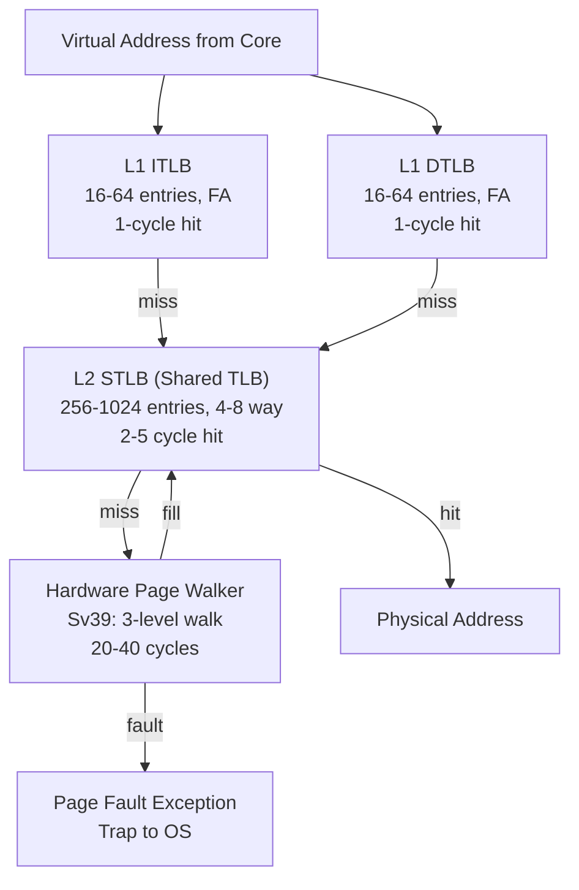
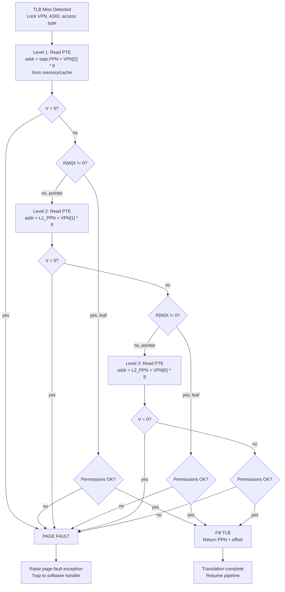

# TLB and Virtual Memory -- Hardware Microarchitecture

> **Prerequisites:**
> - [CPU_Architecture.md](./CPU_Architecture.md) -- pipeline fundamentals, memory hierarchy
> - [Memory.md](./Memory.md) -- SRAM cell design, cache organization
> - RISC-V ISA reference -- Sv39 page table format, satp CSR, SFENCE.VMA
> - Cache_Microarchitecture.md -- set-associative indexing, tag comparison, VIPT concept
>
> **Hands-off to:**
> - [AHB_AXI_APB.md](./AHB_AXI_APB.md) -- bus transactions that carry physical addresses
> - Operating Systems texts -- page replacement algorithms, swap management

---

## Section 0 -- Why This Page Exists

Every memory instruction a core issues uses a virtual address. The translation to a
physical address must complete before the cache tag comparison can succeed, and it must
complete fast -- ideally in the same cycle as the cache access. The Translation Lookaside
Buffer (TLB) is the small, fast structure that makes this possible. When the TLB misses,
a hardware page-table walker must traverse a multi-level radix tree in main memory,
stall the pipeline for tens of cycles, and refill the TLB before execution can resume.

Understanding TLB microarchitecture is essential for:

- **Processor design interviews:** TLB sizing, set-associative organization, VIPT
  constraints, and page-walk state machines are standard questions.
- **Performance analysis:** TLB miss rates dominate the effective memory latency for
  workloads with large working sets (databases, ML training, graph processing).
- **OS-hardware co-design:** page-table format, ASIDs, shootdown mechanisms, and
  superpage support all require tight coupling between hardware and software.

This page covers the complete path from a 64-bit virtual address to a physical address:
TLB entry formats, multi-level TLB hierarchies, hardware page-table walking for RISC-V
Sv39, software- versus hardware-managed TLBs, VIPT cache constraints, TLB shootdown
protocols, and large-page support. Every concept is grounded in numbers you can use in
an interview.

---

## 1. TLB Entry Format

### 1.1 Fields in a Single Entry

A TLB is a small, associative memory that maps a **Virtual Page Number (VPN)** to a
**Physical Page Number (PPN)** along with permission metadata. Each entry contains the
following fields:

| Field              | Width (Sv39) | Description |
|--------------------|--------------|-------------|
| VPN (tag)          | 27 bits      | Virtual Page Number -- bits [38:12] of the virtual address |
| PPN (data)         | 44 bits      | Physical Page Number -- bits [55:12] of the physical address |
| ASID               | 16 bits      | Address Space ID -- distinguishes address spaces without flush |
| R, W, X            | 3 bits       | Read / Write / Execute permissions |
| U                  | 1 bit        | User-mode accessible |
| G                  | 1 bit        | Global mapping (shared across address spaces, ASID ignored) |
| A                  | 1 bit        | Accessed -- set by hardware on any access to this page |
| D                  | 1 bit        | Dirty -- set by hardware on any write to this page |
| V                  | 1 bit        | Valid entry |

### 1.2 Entry Size Calculation

For RISC-V Sv39:

$$
\text{Entry size} = \underbrace{27}_{\text{VPN}} + \underbrace{44}_{\text{PPN}} + \underbrace{16}_{\text{ASID}} + \underbrace{8}_{\text{R/W/X/U/G/A/D/V}} = 95 \text{ bits}
$$

In practice, entries are padded to 96 or 128 bits for SRAM alignment. A 64-entry,
fully-associative TLB thus requires roughly $64 \times 96 = 6{,}144$ bits (768 bytes)
of storage, plus the tag comparison logic that makes it associative.

### 1.3 ASID -- Avoiding TLB Flushes on Context Switch

Without an ASID, every context switch requires a full TLB flush because the same VPN
maps to different PPNs in different processes. Flushing a 64-entry TLB and refilling it
from scratch costs hundreds of cycles.

The ASID solves this: each process is assigned a 16-bit identifier. The current ASID
is stored in the `satp` CSR. On a TLB lookup, the hardware compares **both** the VPN
and the ASID against each entry. Only entries whose ASID matches the current ASID (or
that are marked Global) are considered hits.

$$
\text{TLB hit condition: } (\text{Entry.VPN} = \text{VA.VPN}) \;\wedge\; (\text{Entry.ASID} = \text{satp.ASID} \;\vee\; \text{Entry.G} = 1) \;\wedge\; (\text{Entry.V} = 1)
$$

With 16 ASID bits, up to 65,536 processes can share the TLB simultaneously before the
OS must recycle an ASID and flush stale entries.

---

## 2. TLB Organization

### 2.1 Fully-Associative (CAM-Based)

In a fully-associative TLB, the incoming VPN is broadcast to every entry simultaneously.
Each entry contains a comparator, and the matching entry (if any) drives the output PPN
onto a shared result bus.

```
                    VPN (27 bits)
                        |
          +-------------+-------------+--------- ... ----+
          |             |             |                  |
       [Entry 0]     [Entry 1]     [Entry 2]         [Entry N]
        VPN==?        VPN==?        VPN==?            VPN==?
          |             |             |                  |
        hit_0        hit_1         hit_2             hit_N
          |             |             |                  |
          +------ Priority Encoder (one-hot select) ----+
                              |
                         PPN out (44 bits)
```

- **Pros:** Zero conflict misses; optimal hit rate for a given capacity.
- **Cons:** $O(N)$ comparators; power scales linearly with entries; impractical above
  ~64 entries due to routing and fan-out.
- **Use case:** L1 ITLB and L1 DTLB (16--64 entries, 1-cycle hit).

### 2.2 Set-Associative

For larger TLBs, the VPN is partitioned into a **tag** and an **index**. The index
selects a set, and only the entries within that set are compared -- reducing the
comparator count from $N$ to $\text{ways}$.

$$
\text{Index bits} = \log_2\!\left(\frac{\text{total entries}}{\text{ways}}\right)
$$

Example: a 256-entry, 4-way TLB has $256 / 4 = 64$ sets, requiring 6 index bits from
the VPN. Each set holds 4 entries; only 4 comparators fire per lookup.

- **Pros:** Scales to large capacities (512--2048 entries) with bounded comparator count.
- **Cons:** Conflict misses possible; replacement policy (LRU, PLRU) adds overhead.
- **Use case:** L2 STLB (shared TLB), 256--1024 entries, 2--5 cycle hit.

### 2.3 Multi-Level TLB Hierarchy

Modern high-performance cores use a two-level TLB hierarchy that mirrors the cache
hierarchy:



| Level | Entries | Associativity | Hit Latency | Miss Penalty |
|-------|---------|---------------|-------------|--------------|
| L1 ITLB | 16--64 | Fully associative | 1 cycle | L2 STLB lookup |
| L1 DTLB | 16--64 | Fully associative | 1 cycle | L2 STLB lookup |
| L2 STLB | 256--1024 | 4--8 way | 2--5 cycles | Page walk (20--40 cycles) |
| Page walk | N/A | N/A | 20--40 cycles | Page fault (millions of cycles) |

The effective access time for address translation:

$$
t_{\text{eff}} = t_{L1} + \text{MR}_{L1} \times t_{L2} + \text{MR}_{L1} \times \text{MR}_{L2} \times t_{\text{walk}}
$$

where $\text{MR}$ denotes miss rate and $t$ denotes latency.

---

## 3. Hardware Page-Table Walker

### 3.1 Sv39 Page-Table Format

RISC-V Sv39 uses a 3-level radix tree to translate 39-bit virtual addresses into
56-bit physical addresses. The virtual address is partitioned as:

$$
\underbrace{\text{VPN}[2]}_{9 \text{ bits}} \; \underbrace{\text{VPN}[1]}_{9 \text{ bits}} \; \underbrace{\text{VPN}[0]}_{9 \text{ bits}} \; \underbrace{\text{offset}}_{12 \text{ bits}}
$$

Each Page Table Entry (PTE) is 64 bits (8 bytes):

```
  63     54 53  10 9 8 7 6 5 4 3 2 1 0
  +-------+------+--+-+-+-+-+-+-+-+---+
  | PPN[2:0]     |RSV|D|A|G|U|X|W|R|V |
  | (44 bits)     |   | | | | | | | | |
  +-------+------+--+-+-+-+-+-+-+-+---+
```

- **V (bit 0):** Valid. If 0, the PTE is invalid; any access causes a page fault.
- **R, W, X (bits 1--3):** Permissions. R=0, W=0, X=0 at a non-leaf means "pointer to
  next level." At a leaf, they encode read/write/execute.
- **U (bit 4):** User-mode accessible.
- **G (bit 5):** Global mapping.
- **A (bit 6):** Accessed bit.
- **D (bit 7):** Dirty bit.
- **PPN (bits 53--10):** Physical Page Number of next-level table or of the final page.

The page-table base is stored in the `satp` CSR:

```
  63       60 59        44 43                    0
  +----------+-----------+-----------------------+
  | Mode (4) | ASID (16) | PPN of root table(44) |
  +----------+-----------+-----------------------+
  Mode = 8 for Sv39
```

### 3.2 Walk State Machine

The hardware page walker is a small FSM that performs the following sequence:



Step-by-step for a 4 KB base page:

1. **Level 1:** The root page table is at physical address `satp.PPN << 12`. Index with
   $\text{VPN}[2]$ (bits 38--30 of the VA): read PTE at
   $(\text{satp.PPN} \ll 12) + \text{VPN}[2] \times 8$.
2. **Level 2:** If the L1 PTE is a non-leaf (R=W=X=0), its PPN field points to the
   next-level table. Index with $\text{VPN}[1]$ (bits 29--21): read PTE at
   $(\text{PTE}_1.\text{PPN} \ll 12) + \text{VPN}[1] \times 8$.
3. **Level 3:** If the L2 PTE is also a non-leaf, index with $\text{VPN}[0]$
   (bits 20--12): read PTE at
   $(\text{PTE}_2.\text{PPN} \ll 12) + \text{VPN}[0] \times 8$.
4. **Leaf found:** The L3 PTE must be a leaf (at least one of R, W, X is set). The
   final physical address is $(\text{PTE}_3.\text{PPN} \ll 12) \;|\; \text{VA}[11:0]$.

### 3.3 Page-Fault Conditions

A page fault is raised if any of the following is true at any level:

- PTE has V = 0 (entry not valid).
- PTE has V = 1 but R = W = X = 0 **and** PPN fields are all zero (reserved encoding).
- A leaf PTE is found but the access type violates permissions (e.g., a store to a
  read-only page, or a user-mode access to a supervisor-only page).
- A non-leaf PTE is found at the last (third) level (malformed page table).

### 3.4 Page-Walk Cache

The upper-level page-table entries (non-leaf PTEs) are accessed far more frequently
than leaf PTEs because every translation in the same region of virtual address space
shares the same L1 and L2 PTEs. A **page-walk cache** (sometimes called a PTE cache)
caches these upper-level entries:

- Caches non-leaf PTEs (level 1 and level 2 entries).
- Does NOT cache leaf PTEs (those are the TLB's job).
- A walk that hits in the page-walk cache at every level skips the memory accesses for
  those levels, reducing a 3-level walk from 3 memory accesses to 1.

Typical sizes: 16--64 entries, organized as a small fully-associative or 4-way
set-associative structure.

### 3.5 Multi-Level Page Table Structure -- Why Hierarchy Saves Memory

#### Flat Page Table vs. Hierarchical Page Table

A **flat page table** maps every virtual page directly. For a 39-bit virtual address
with 4 KB pages (27-bit VPN), the flat table has $2^{27} = 128\text{M}$ entries, each
8 bytes = **1 GB of memory** just for the page table -- clearly impractical.

A **hierarchical (radix tree) page table** exploits the fact that most virtual address
spaces are sparse: a process typically uses only a tiny fraction of its virtual address
space. The radix tree allocates page table pages only for regions that are actually
mapped.

#### Sv39: 3-Level Radix Tree

```
Virtual Address (39 bits):
  [38:30] VPN[2] (9 bits) ── Level 1 index (root table)
  [29:21] VPN[1] (9 bits) ── Level 2 index
  [20:12] VPN[0] (9 bits) ── Level 3 index (leaf table)
  [11:0]  offset  (12 bits)

Each page table page: 4 KB = 512 entries x 8 bytes/entry
Each entry (PTE): 8 bytes, maps one 4 KB page (at leaf level)

Memory cost per level:
  Level 1 (root): always present = 1 page = 4 KB
  Level 2: one page per 512 mapped regions of 1 GB each
  Level 3: one page per 512 mapped 4 KB pages = 4 KB per 2 MB of mapped memory

For a process using 100 MB of virtual memory (contiguous):
  Level 1: 1 page = 4 KB
  Level 2: 1 page = 4 KB (only one 1 GB region is used)
  Level 3: 100 MB / (512 x 4 KB) = 100 MB / 2 MB = 50 pages = 200 KB
  Total page table: 4 + 4 + 200 = 208 KB

  Flat table would need: 100 MB / 4 KB x 8 B = 200 MB
  Savings: 208 KB vs 200 MB = ~1000x reduction!
```

#### Sv48: 4-Level Radix Tree (RISC-V)

```
Virtual Address (48 bits):
  [47:39] VPN[3] (9 bits) ── Level 1 (root)
  [38:30] VPN[2] (9 bits) ── Level 2
  [29:21] VPN[1] (9 bits) ── Level 3
  [20:12] VPN[0] (9 bits) ── Level 4 (leaf)
  [11:0]  offset  (12 bits)

Adds one more level to support 256 TB virtual address space.
Page walk depth: 4 memory accesses (3 non-leaf + 1 leaf) for 4 KB pages.
2 MB superpages found at Level 3 (saves 1 memory access).
1 GB superpages found at Level 2 (saves 2 memory accesses).
```

#### Sv57: 5-Level Radix Tree (RISC-V)

```
Virtual Address (57 bits):
  [56:48] VPN[4] (9 bits) ── Level 1 (root)
  [47:39] VPN[3] (9 bits) ── Level 2
  [38:30] VPN[2] (9 bits) ── Level 3
  [29:21] VPN[1] (9 bits) ── Level 4
  [20:12] VPN[0] (9 bits) ── Level 5 (leaf)
  [11:0]  offset  (12 bits)

Supports 128 PB virtual address space.
Page walk depth: 5 memory accesses for 4 KB pages.
Used for extremely sparse address spaces (e.g., memory-mapped files, sandboxes).
```

#### Memory Cost Comparison Across VA Widths

| VA Scheme | Levels | VA Width | Max VA Space | Walk Depth | PTE Size | Root Table Size |
|-----------|--------|----------|-------------|------------|----------|-----------------|
| Sv39 | 3 | 39 bits | 512 GB | 3 | 8 B | 4 KB |
| Sv48 | 4 | 48 bits | 256 TB | 4 | 8 B | 4 KB |
| Sv57 | 5 | 57 bits | 128 PB | 5 | 8 B | 4 KB |
| x86-64 (4-level) | 4 | 48 bits | 256 TB | 4 | 8 B | 4 KB |
| x86-64 (5-level) | 5 | 57 bits | 128 PB | 5 | 8 B | 4 KB |
| ARMv8 (4KB granule) | 3-4 | 48-52 bits | 256 TB-4 PB | 3-4 | 8 B | 4 KB |

**Key insight:** Each additional level adds 1 memory access to the page walk (increasing
TLB miss penalty by 20-40 cycles) but supports a 512x larger address space. The page
walk cache mitigates this by caching upper-level PTEs, reducing the average walk depth
to 1-2 memory accesses for hot regions.

---

## 4. Software vs. Hardware TLB Miss Handler

### 4.1 Software-Managed TLB (MIPS Style)

In a software-managed TLB, a TLB miss triggers a precise exception. The pipeline is
flushed, and control transfers to a software exception handler. The handler manually
walks the page table in software, constructs a TLB entry, and writes it using a
dedicated instruction (e.g., `TLBWR` on MIPS).

```
  TLB miss
    -> exception (pipeline flush, ~5 cycle overhead to enter handler)
    -> software handler reads page table (10-50 cycles depending on cache state)
    -> writes entry with TLBWR
    -> return from exception (ERET, ~3 cycle overhead to resume)
  Total: ~20-60 cycles per miss
```

**Advantages:**
- Complete flexibility: the OS can implement any page-table format (hash tables,
  inverted page tables, clustered page tables).
- No dedicated hardware page-walker needed -- smaller core, easier to verify.
- The handler can implement custom replacement policies or prefetching.

**Disadvantages:**
- Slower: every miss pays the exception entry/exit overhead plus the software walk.
- Pollutes the data cache and register file with page-table data.
- Difficult to handle L2 TLB misses in software without nested exceptions.

### 4.2 Hardware-Managed TLB (RISC-V, ARM, x86 Style)

A hardware page walker is a dedicated FSM inside the MMU. On a TLB miss, the walker
automatically reads page-table entries from the cache/memory hierarchy, traverses the
radix tree, and fills the TLB without software intervention.

```
  TLB miss
    -> hardware walker FSM activated (0 cycle software overhead)
    -> walker issues cache/memory reads for PTEs (20-40 cycles typical)
    -> walker fills TLB entry
    -> pipeline resumes
  Total: ~20-40 cycles per miss
```

**Advantages:**
- Faster: no exception overhead, no register save/restore, no I-cache pollution.
- Walker can overlap with other pipeline activity (out-of-order cores can continue
  executing independent instructions).
- Walker can maintain its own small page-walk cache for upper-level PTEs.

**Disadvantages:**
- Fixed page-table format: the hardware must know the radix-tree structure.
- Less flexible: custom page-table schemes are impossible without hardware support.
- Additional hardware complexity: walker FSM, page-walk cache, interaction with
  cache-coherence protocol.

### 4.3 Comparison Table

| Attribute | Software-Managed | Hardware-Managed |
|-----------|-----------------|-----------------|
| Miss latency | 20--60 cycles | 20--40 cycles |
| Page-table format | Arbitrary (OS chooses) | Fixed by ISA (e.g., Sv39 radix tree) |
| Hardware cost | Minimal | Walker FSM + page-walk cache |
| Exception overhead | Full trap/return per miss | None (hardware handles it) |
| Replacement policy | OS controls via TLBWR | Hardware LRU/PLRU/random |
| Example ISAs | MIPS, early SPARC | RISC-V, ARMv8-A, x86-64 |

---

## 5. VIPT -- Virtually-Indexed, Physically-Tagged Caches

### 5.1 The Problem VIPT Solves

A physically-tagged cache requires the physical address for tag comparison. But the
physical address is not available until the TLB completes its translation. If the cache
index also requires the physical address, the access is serialized:

$$
\text{TLB translate (1 cycle)} \;\rightarrow\; \text{Cache access (1 cycle)} = 2 \text{ cycles total}
$$

### 5.2 The VIPT Insight

The key observation: the **page offset** (bottom 12 bits for 4 KB pages) is identical
in both the virtual and physical addresses. Translation changes the page number but not
the offset. Therefore, any cache index that falls entirely within the page offset can be
computed from the virtual address **before** translation completes.

$$
\text{Cache index bits} \subseteq \text{Page offset bits}
$$

The TLB translation and cache index lookup proceed in parallel. The physical tag arrives
from the TLB just in time to compare against the tags read from the cache way.

```
  Virtual Address
       |
       +--------+----------+
       |                   |
  TLB Translate       Cache Index
  (1 cycle)           (1 cycle, parallel)
       |                   |
  Physical Tag        Cache Data/Tags
       |                   |
       +--- Compare -------+
                |
         Hit / Miss
```

### 5.3 VIPT Worked Example — Why the Index Must Come from Page Offset

The VIPT technique relies on a single fact: the page offset (bottom 12 bits for 4 KB
pages) is identical in both virtual and physical addresses. Translation only changes the
page number. Therefore, if all bits used for the cache **index** fall within the page
offset, the index can be computed from the virtual address before the TLB finishes.

**Constraint derivation (formal):**

The cache index selects a set. For a cache with capacity $C$, associativity $W$, and
line size $L$:

$$
\text{Number of sets} = \frac{C}{W \times L}
$$

$$
\text{Index bits} = \log_2\!\left(\frac{C}{W \times L}\right)
$$

These index bits occupy address positions $[\lceil\log_2 L\rceil + \text{index\_bits} - 1 \,:\, \lceil\log_2 L\rceil]$.

For VIPT, the highest index bit position must not exceed the highest page offset bit:

$$
\lceil\log_2 L\rceil + \log_2\!\left(\frac{C}{W \times L}\right) - 1 \;\leq\; \lceil\log_2 P\rceil - 1
$$

Simplifying (all values are powers of 2):

$$
\log_2 L + \log_2 C - \log_2 W - \log_2 L \;\leq\; \log_2 P
$$

$$
\boxed{\log_2 C - \log_2 W \;\leq\; \log_2 P \quad\iff\quad C \;\leq\; W \times P}
$$

**Worked example: L1D cache sizing under VIPT.**

Given: page size $P = 4096$ (12-bit offset), line size $L = 64$ (6-bit block offset).

| Target | Associativity | Max sets = $P/L = 64$ | Max capacity = $W \times P$ | Index bits | Highest index bit | VIPT safe? |
|--------|:---:|---|---|---|---|---|
| L1D small | 4-way | 64 | 16 KB | 6 | 6+6-1 = 11 | Yes (11 <= 11) |
| L1D standard | 4-way | 128 | 32 KB | 7 | 6+7-1 = 11 | Yes (11 <= 11) |
| L1D large | 8-way | 128 | 64 KB | 7 | 6+7-1 = 11 | Yes (11 <= 11) |
| L1D too big | 2-way | 512 | 64 KB | 9 | 6+9-1 = 14 | No (14 > 11) |

**Why a 32 KB / 4-way cache works with 4 KB pages:**

The 7 index bits occupy positions [11:5], which are entirely within the page offset [11:0].
The TLB translates bits [31:12] (the tag) in parallel with the cache indexing. The physical
tag arrives from the TLB just in time for comparison with the tags read from the SRAM ways.

**Why a 64 KB / 2-way cache fails with 4 KB pages:**

The 9 index bits occupy positions [14:6]. Bits [14:12] are VPN bits that change during
translation. Two virtual addresses mapping to the same physical page could have different
bits [14:12], causing the same physical line to be looked up in different cache sets --
the **synonym problem**.

**Production examples:**

| Processor | L1D Size | Associativity | Line Size | Page Size | VIPT safe? |
|-----------|----------|:---:|---|---|---|
| ARM Cortex-A78 | 64 KB | 4-way | 64 B | 4 KB | No (needs 16 KB pages or page coloring) |
| Apple M1 Firestorm | 128 KB | 8-way | 64 B | 16 KB | Yes (16 KB pages give 14-bit offset) |
| Intel Golden Cove | 48 KB | 12-way | 64 B | 4 KB | Yes (high associativity keeps index in offset) |
| RISC-V Boom v3 | 32 KB | 8-way | 64 B | 4 KB | Yes (index bits [11:5] fit in offset) |

Apple's choice of 16 KB pages is directly motivated by VIPT: a 128 KB L1D with 8-way
associativity needs 8 index bits (positions [13:6]), which fits within a 14-bit page
offset (16 KB pages) but not a 12-bit offset (4 KB pages).

### 5.4 The VIPT Constraint -- Derivation

For a cache with associativity $W$, line size $L$ bytes, total capacity $C$ bytes,
and page size $P$ bytes:

The address is decomposed as:

$$
\text{Address} = [\text{Tag} \mid \text{Index} \mid \text{Block Offset}]
$$

where Block Offset $= \lceil\log_2 L\rceil$ bits and Index $= \lceil\log_2(C / (W \times L))\rceil$ bits.

The cache index is extracted from address bits $[\lceil\log_2 L\rceil + \text{index\_bits} - 1 : \lceil\log_2 L\rceil]$.

For VIPT to work, all index bits must fall within the page offset (bottom $\lceil\log_2 P\rceil$ bits):

$$
\lceil\log_2 L\rceil + \text{index\_bits} - 1 \leq \lceil\log_2 P\rceil - 1
$$

$$
\text{index\_bits} \leq \lceil\log_2 P\rceil - \lceil\log_2 L\rceil
$$

Substituting:

$$
\log_2\!\left(\frac{C}{W \times L}\right) \leq \log_2(P) - \log_2(L)
$$

$$
\log_2\!\left(\frac{C}{W \times L}\right) \leq \log_2\!\left(\frac{P}{L}\right)
$$

$$
\boxed{\frac{C}{W \times L} \leq \frac{P}{L} \implies C \leq W \times P}
$$

**This is the VIPT constraint: the total cache capacity must not exceed the associativity
times the page size.** If violated, the index extends into the VPN, which differs between
virtual and physical addresses, causing the same physical line to be looked up in
different sets depending on which virtual address is used (the synonym/alias problem).

### 5.4 Worked Examples -- VIPT Constraint Verification

**Example 1: 4-way, 32 KB, 64 B lines, 4 KB pages (typical L1D).**

$$
\text{Sets} = \frac{32{,}768}{4 \times 64} = 128 \implies 7 \text{ index bits}
$$

```
Address decomposition:
  Block offset = log2(64) = 6 bits  -> bits [5:0]
  Index        = log2(128) = 7 bits -> bits [11:5]
  Tag          = 32 - 7 - 6 = 19 bits -> bits [31:12]

Index occupies bits [11:5]. All within page offset [11:0].

Precise check: highest index bit = offset_bits + index_bits - 1
             = 6 + 7 - 1 = 11
  Page offset top bit = 11
  11 <= 11 -- fits exactly.
```

$$
\text{VIPT constraint: } \lceil\log_2 L\rceil + \lceil\log_2(\text{Sets})\rceil - 1 \leq \lceil\log_2 P\rceil - 1
$$

$$
6 + 7 - 1 = 11 \leq 11 \quad \checkmark
$$

**This is why real L1D caches at 32KB/4-way/64B/4KB-pages use VIPT successfully.**
The 7 index bits all fall within the 12-bit page offset. The TLB translates the tag
bits (which are VPN bits) in parallel with the cache index lookup.

Note the common confusion: $C = 32\text{ KB} > W \times P = 4 \times 4\text{ KB} = 16\text{ KB}$,
which seems to violate the simplified constraint $C \leq W \times P$. But the simplified
constraint is sufficient, not necessary. What actually matters is the bit positions of
the index, and here all 7 index bits fit within [11:0].

**Example 2: 2-way, 64 KB, 64 B lines, 4 KB pages.**

$$
\text{Sets} = \frac{65{,}536}{2 \times 64} = 512 \implies 9 \text{ index bits}
$$

```
Index occupies bits [14:6]. Bits 14, 13, 12 are ABOVE the page offset boundary (bit 11).

Precise check: highest index bit = 6 + 9 - 1 = 14
  Page offset top bit = 11
  14 > 11 -- VIOLATED by 3 bits.
```

**VIPT fails.** The index extends 3 bits into the VPN. These bits may differ between
virtual and physical addresses, causing synonyms. The OS must use page coloring to
ensure that bits [14:12] of the physical frame number match the corresponding virtual bits.

**Example 3: 8-way, 64 KB, 64 B lines, 4 KB pages.**

$$
\text{Sets} = \frac{65{,}536}{8 \times 64} = 128 \implies 7 \text{ index bits}
$$

$$
\text{highest index bit} = 6 + 7 - 1 = 12 > 11 \quad \times
$$

**Still fails by 1 bit!** Even doubling the associativity to 8-way does not save a
64KB cache with 4KB pages. The fundamental constraint is that 64KB needs at least
$64\text{KB}/64\text{B} = 1024$ total entries, and the page offset provides only
$4096/64 = 64$ entries worth of index bits. With 8 ways: $1024/8 = 128$ sets needing
7 index bits, but the page offset provides only $\log_2(64) = 6$ bits beyond the block
offset. You need 1 more bit than the page offset can provide.

**Example 4: 4-way, 16 KB, 64 B lines, 4 KB pages.**

$$
\text{Sets} = \frac{16{,}384}{4 \times 64} = 64 \implies 6 \text{ index bits}
$$

$$
\text{highest index bit} = 6 + 6 - 1 = 11 \leq 11 \quad \checkmark
$$

**Fits exactly.** This is the maximum VIPT-safe L1D with 4-way associativity and
64 B lines under 4 KB pages.

**Example 5: Maximum VIPT-safe cache size formula.**

Given page size $P$, line size $L$, associativity $W$:

$$
\text{Max } C = W \times \frac{P}{L} \times L = W \times P
$$

But this is only correct when index bits exactly fill the page offset beyond the block
offset. More precisely:

$$
\text{Max sets} = \frac{P}{L} = 2^{\log_2 P - \log_2 L}
$$

$$
\text{Max } C = W \times \text{Max sets} \times L = W \times P
$$

For 4 KB pages, 64 B lines, 4-way: Max $C = 4 \times 4096 = 16$ KB. But Example 1
showed that 32 KB also works! The discrepancy is because the formula counts sets
as $P/L = 64$, but the actual index bits are 7 (for 128 sets), still fitting in the
page offset. The correct formula: max sets $= 2^{(\log_2 P - \log_2 L)} = 2^6 = 64$
if we strictly use only page offset bits. But the 32 KB cache has 128 sets, using
7 bits, and all 7 fit in [11:0] because the block offset is only 6 bits, leaving
bits [11:6] = 6 bits... plus bit 5? No: bits [11:5] = 7 bits, but [11:5] spans
from bit 5 to bit 11, which is within [11:0]. The subtlety is that the index starts
immediately above the block offset: the first index bit is bit $\lceil\log_2 L\rceil$,
and the last index bit is $\lceil\log_2 L\rceil + \lceil\log_2(\text{Sets})\rceil - 1$.
This last bit must be $\leq \lceil\log_2 P\rceil - 1$.

**Quick reference table (4 KB pages, 64 B lines):**

| Associativity | Sets | Index bits | Highest index bit | VIPT safe? |
|:---:|:---:|:---:|:---:|:---:|
| 1 | 512 (32 KB) | 9 | 14 | No |
| 2 | 256 (32 KB) | 8 | 13 | No |
| 4 | 128 (32 KB) | 7 | 11 | **Yes** (exact) |
| 8 | 64 (32 KB) | 6 | 11 | **Yes** (exact) |
| 4 | 256 (64 KB) | 8 | 13 | No |
| 8 | 128 (64 KB) | 7 | 12 | No |
| 16 | 64 (64 KB) | 6 | 11 | **Yes** |
| 4 | 64 (16 KB) | 6 | 11 | **Yes** (exact) |

### 5.5 Synonym Problem and Page Coloring

When two different virtual addresses map to the same physical address (shared memory,
mmap with MAP_SHARED), and the VIPT constraint is violated, the two virtual addresses
may index into different cache sets. The same physical data resides in two different
cache locations -- this is a **synonym** (also called an alias).

**The synonym problem:** Core 0 writes to VA1 (maps to PA, cached in set 5). Core 1
reads VA2 (also maps to PA, but indexes set 9). Core 1 gets stale data (or misses
entirely) because the write went to a different cache set.

**Page coloring** is the OS-level solution: restrict physical page frame allocation so
that the bits of the physical frame number that overlap the cache index are identical to
the corresponding virtual bits. Effectively, the OS guarantees that all virtual aliases
map to the same cache set.

```
Number of colors = 2^(index_bits - page_offset_bits_per_index)
For Example 2 (2-way 64KB): colors = 2^(14-12) = 4 colors
Physical pages are partitioned into 4 color classes:
  Color 0: PFN[13:12] = 00
  Color 1: PFN[13:12] = 01
  Color 2: PFN[13:12] = 10
  Color 3: PFN[13:12] = 11

The OS allocates a physical page whose color matches the virtual page's color bits.
This wastes some physical pages (can't use all frames for every allocation) but
guarantees VIPT correctness.
```

---

## 6. TLB Shootdown

### 6.1 The Coherence Problem

TLBs are per-core structures with no hardware coherence. When the OS modifies a
page-table entry (e.g., changing permissions, migrating a page, or unmapping a region),
stale entries may reside in the TLBs of other cores. These stale entries must be
invalidated -- a process called **TLB shootdown**.

**When shootdown is needed:**

| Event | Why shootdown is needed |
|-------|------------------------|
| `munmap` / `mprotect` | Unmaps or changes permissions; stale TLB entries could allow illegal access |
| Page migration (NUMA) | Physical page changes; old PPN is wrong |
| `fork()` (copy-on-write) | Parent's writable entries must be demoted to read-only in child |
| `madvise(MADV_DONTNEED)` | Pages are discarded; stale entries would point to freed frames |
| KSM (kernel same-page merging) | Two pages merged into one; one mapping's PPN changes |
| Process exit | All TLB entries for the process should be flushed (or left to ASID recycle) |
| Context switch (without ASID) | Entire TLB must be flushed to prevent process A from using process B's translations |

### 6.2 IPI-Based Shootdown -- Detailed Sequence

The standard mechanism used in Linux and most OS kernels:

```
Step-by-step shootdown on a 4-core system:

Initiator (Core 0)                           Targets (Cores 1, 2, 3)
========================                      ========================

1. Acquire mmap_lock (read or write)
2. Modify the page table entry in memory
   (PTE = new value, flush from data cache)

3. Record the virtual address range
   [start, end) that needs invalidation

4. Set shootdown IPI vector
   with the range parameters

5. Send IPI to Cores 1, 2, 3               ──IPI──>  6. Each target receives IPI
                                                       Interrupts current execution
                                                       (saves user context)

                                              7. Target enters shootdown handler:
                                                 for (addr = start; addr < end; addr += PAGE_SIZE)
                                                     SFENCE.VMA addr, asid  (or flush all)
                                                 // Also flush L1 TLB and L2 STLB
                                                 // entries matching the range

                                              8. Target sends ACK
                                                   <──ACK──

9. Wait for all ACKs from Cores 1, 2, 3
   (spin on a shared atomic counter)

10. All ACKs received
    Resume the operation that triggered shootdown

11. Release mmap_lock
```

**Timing breakdown (8-core system):**

```
Phase                           Cycles     Notes
────────────────────────────── ───────── ───────────────────────
IPI send latency               50-200     Depends on interconnect
Interrupt entry overhead       20-50      Pipeline flush, save context
TLB flush (full, 64 entries)   10-50      SFENCE.VMA execution
Interrupt exit overhead        10-30      Restore context
ACK send                       20-50      Atomic write to shared memory
Initiator spin wait            varies     Until all N-1 cores respond
────────────────────────────── ─────────
Total per shootdown            200-1000   On an 8-core system

On a 64-core system:
  IPI fanout: 63 targets
  Synchronization: all 63 must respond before initiator resumes
  Total: 2,000-10,000+ cycles
  During this time, ALL cores are stalled in the shootdown handler
```

**Scalability problem:** TLB shootdown cost scales linearly (or worse) with core count.
On large systems (64-128 cores), shootdowns become a major performance bottleneck for
workloads with frequent mmap/munmap (databases, JVMs with GC, fork-heavy workloads).

#### TLB Shootdown Scalability — Quantitative Analysis

```
Shootdown cost model:
  T_shootdown(N_cores) = T_IPI_send + (N-1) * max(T_flush_per_core) + T_sync

Where:
  T_IPI_send      = latency to send N-1 inter-processor interrupts (~100-500 ns)
  T_flush_per_core = local TLB flush cost (~10-50 cycles = 5-25 ns at 2 GHz)
  T_sync          = barrier synchronization cost (~50-200 ns for atomic ops)

Numerical (2 GHz core, ARM-like TLB):
  4 cores:   T ≈ 200 + 3*25 + 100 =   475 ns   (~950 cycles)
  16 cores:  T ≈ 500 + 15*25 + 300 =  1,175 ns  (~2,350 cycles)
  64 cores:  T ≈ 2000 + 63*25 + 800 = 4,375 ns  (~8,750 cycles)
  128 cores: T ≈ 5000 + 127*25 + 1500 = 9,675 ns (~19,350 cycles)

During the shootdown, ALL cores are stalled in the interrupt handler.
Total wasted core-cycles = T_shootdown * N_cores:
  4 cores:    3,800 cycles wasted
  64 cores:  560,000 cycles wasted
  128 cores: 1,237,000 cycles wasted

For a database doing 10,000 munmaps/second on a 64-core machine:
  Cycles wasted/second = 10,000 * 560,000 = 5.6 * 10^9 cycles
  At 2 GHz total capacity = 128 * 2 * 10^9 = 256 * 10^9 cycles/second
  Overhead = 5.6/256 = 2.2% of ALL core cycles wasted on TLB shootdowns

This is why large-scale systems need alternatives to broadcast IPI shootdowns.
```

#### Alternative Shootdown Mechanisms

```
1. Directed shootdown (TLB invalidation instruction with target core list):
   Instead of broadcasting to all N-1 cores, the OS sends invalidate only to
   cores that might have the stale mapping (tracked by a per-page "likely cached" bit).
   Cost: O(K) instead of O(N), where K = cores that actually cached the PTE.

2. Deferred shootdown (batch invalidation):
   Collect a batch of addresses to invalidate, then send a single IPI with the
   entire batch. The target flushes all of them in one interrupt.
   Cost: amortized O(1) per address instead of O(N) per address.

3. Hardware-managed TLB (MIPS-style):
   No shootdown needed -- all TLB entries are tagged with an ASID.
   When the OS changes a page table, it changes the ASID of the affected process.
   Old TLB entries with the stale ASID are ignored on lookup.
   Cost: 0 for shootdown, but ASID space pressure (16-bit ASID = 64K processes max).

4. ASID avoidance (primary Linux optimization):
   Each process gets a unique ASID. On context switch, the OS writes the new ASID
   to satp (RISC-V) or TTBR0 (ARM). TLB entries are tagged with the ASID; the
   hardware only matches entries whose ASID matches the current register.
   No flush needed on context switch!

   Shootdown is still needed when:
     - A page table entry changes (munmap, mprotect) for a RUNNING process
     - The OS must invalidate stale entries on cores that might cache them
   But context switches are free (just update the ASID register).
```

#### Lazy TLB Switching for Kernel Threads — Detail

```
When switching from User Process A to a Kernel Thread:
  1. The kernel thread has no userspace mappings (it uses the kernel address space).
  2. Instead of flushing User A's TLB entries, the OS leaves them in place.
  3. The kernel thread runs with User A's ASID still in satp/TTBR0.
  4. Any userspace TLB entries from User A are harmless -- the kernel thread
     only accesses kernel addresses (which use global TLB entries or a separate
     kernel page table).
  5. When switching back to User A (or to User B):
     If back to User A: TLB entries are still valid (ASID matches), no flush.
     If to User B: update ASID to B's ASID. User A's entries are ignored.

This optimization eliminates TLB flushes for ALL kernel thread switches.
On a typical Linux system, context switches to kernel threads (idle, kworker,
softirq) account for 30-60% of all context switches. Saving the TLB flush
for each of these is a significant performance win.
```

### 6.3 Lazy TLB Switching Optimization

When a context switch occurs, the old process's TLB entries are potentially stale.
Instead of flushing the entire TLB immediately, a lazy approach defers the flush:

**ASID-based avoidance (primary optimization):**

```
Without ASID:
  Every context switch: full TLB flush (10-50 cycles) + refill (hundreds of cycles)
  Cost for 1000 switches/second: ~50,000-50,000,000 cycles/second

With ASID:
  Context switch: update satp.ASID to new process's ASID (0 cycles flush)
  TLB entries are tagged with ASID; only matching entries are considered
  No flush needed for context switch at all!
  Only flush when ASID space exhausted (65,536 switches without recycle)
```

**Lazy shootdown for kernel threads:**

When switching to a kernel thread (which has no userspace mappings), the old process's
userspace TLB entries are left in place. The kernel thread uses a special "lazy" ASID.
When switching back to a userspace process, the TLB entries from the previous userspace
process are still valid (if the ASID matches). This avoids flushing on kernel thread
switches entirely.

**Generation counter optimization:**

```
Shared structure:
  struct tlb_gen {
      uint64_t generation;  // monotonically increasing
      uint64_t reserved;    // reserved ranges
  } per-mm_struct;

Each core records:
  uint64_t last_tlb_gen;  // last generation this core has seen

On TLB miss:
  if (mm->tlb_gen.gen > core->last_tlb_gen)
      flush_stale_entries();  // only flush what's needed
  core->last_tlb_gen = mm->tlb_gen.gen;

This avoids IPIs entirely for many cases:
  - If a core hasn't accessed the stale address since the shootdown,
    it never needs to flush (the stale entry won't be used).
  - Only cores that actually hit a stale entry need to do work.
```

### 6.4 RISC-V SFENCE.VMA

RISC-V provides the `SFENCE.VMA` instruction for TLB maintenance:

- `SFENCE.VMA` -- flush all TLB entries (full shootdown).
- `SFENCE.VMA rs1, x0` -- flush entries matching VPN = rs1 (selective flush).
- `SFENCE.VMA x0, rs2` -- flush entries matching ASID = rs2.
- `SFENCE.VMA rs1, rs2` -- flush entries matching both VPN and ASID.

`SFENCE.VMA` is a local instruction -- it only affects the issuing core's TLB. For
multi-core shootdown, the OS must issue IPIs and have each core execute its own
`SFENCE.VMA`.

### 6.5 Shootdown Overhead

| Method | Latency | Core Impact |
|--------|---------|-------------|
| Full flush (SFENCE.VMA) | 10--50 cycles | All entries lost, refills needed |
| Selective flush (VPN+ASID) | 5--20 cycles | Only matching entries removed |
| IPI shootdown (64 cores) | 500--5000 cycles | All cores stall |
| Lazy shootdown | 0 immediate cost | Deferred to next miss |

---

## 7. Large Pages (Superpages)

### 7.1 Sv39 Superpage Support

Sv39 supports three page sizes. A PTE at any level can be a leaf (at least one of R, W,
X is set), which determines the page size:

| Level | Page Size | VPN Bits Used | Offset Bits |
|-------|-----------|---------------|-------------|
| 1 (root) | 1 GB | VPN[2] (9 bits) | 30 bits |
| 2 | 2 MB | VPN[2:1] (18 bits) | 21 bits |
| 3 (leaf) | 4 KB | VPN[2:0] (27 bits) | 12 bits |

A 1 GB superpage is found at Level 1: the walker reads the L1 PTE, finds R|W|X != 0,
and stops. The physical address is:

$$
\text{PA} = (\text{PTE}.\text{PPN}[2:0] \ll 30) \;|\; \text{VA}[29:0]
$$

A 2 MB superpage is found at Level 2: the walker reads L1 (non-leaf), then L2 (leaf).

$$
\text{PA} = (\text{PTE}.\text{PPN}[1:0] \ll 21) \;|\; \text{VA}[20:0]
$$

For superpages, the PPN bits below the page offset must be zero (alignment requirement).

### 7.2 TLB Coverage with Superpages

$$
\text{TLB coverage} = \sum_{\text{entries}} \text{page size of each entry}
$$

| Configuration | L1 DTLB Coverage |
|---------------|-----------------|
| 64 entries x 4 KB | 256 KB |
| 64 entries x 2 MB | 128 MB |
| 64 entries x 1 GB | 64 GB |

A workload that touches 500 MB of memory would thrash a 4 KB-only DTLB (256 KB
coverage) but fit comfortably with 2 MB pages.

### 7.3 Benefits and Costs

**Benefits:**
1. Fewer TLB entries cover more memory -- reduces TLB miss rate for large working sets.
2. Fewer page-walk levels -- 1 GB superpages need only 1 memory access vs. 3 for 4 KB.
3. Less page-table memory -- a 1 GB region needs 1 PTE instead of $256\text{K}$ PTEs.
4. Reduced page-walk cache pressure.

**Costs:**
1. Internal fragmentation -- allocating 2 MB for a process that needs 100 KB wastes
   ~1.9 MB.
2. Physical contiguity -- the OS must find $2\text{ MB}$ or $1\text{ GB}$ of
   physically contiguous, aligned memory, which becomes difficult under fragmentation.
3. Longer page-fault handling -- zeroing 2 MB takes ~1 ms vs. ~2 us for 4 KB.
4. Larger page tables for small allocations -- if 4 KB pages are mixed in, the page
   table structure is more complex.

### 7.4 Transparent Huge Pages (THP)

Modern OSes (Linux, Windows) support **transparent huge pages**: the OS automatically
promotes a sequence of contiguous 4 KB pages to a single 2 MB huge page when it detects
that the pages are contiguous and fully populated. This is done in the background by
a kernel thread (khugepaged on Linux) without application modification.

THP gives most of the TLB benefit of explicit huge pages while keeping the 4 KB
allocation granularity for small or sparse mappings.

---

## 8. Numbers to Memorize

| Parameter | Value | Note |
|-----------|-------|------|
| L1 ITLB / DTLB entries | 16--64 | Fully associative, 1-cycle hit |
| L2 STLB entries | 256--1024 | 4--8 way set-associative, 2--5 cycle hit |
| L1 TLB hit latency | 1 cycle | Parallel with L1 cache index (VIPT) |
| L2 TLB hit latency | 2--5 cycles | Sequential after L1 miss |
| Page walk latency (cached PTEs) | 20--40 cycles | 3 memory accesses for Sv39, cached in L2/L3 |
| Page walk latency (uncached PTEs) | 100--300 cycles | PTEs in DRAM, ~100 ns per access |
| Page fault latency | $10^6$--$10^7$ cycles | Disk/SSD I/O, context switches |
| Base page size | 4 KB | 12-bit offset |
| Superpage sizes (Sv39) | 2 MB, 1 GB | 21-bit, 30-bit offset |
| PTE size (Sv39) | 8 bytes (64 bits) | 44-bit PPN + permission flags |
| ASID width | 16 bits (typical) | $2^{16} = 65{,}536$ concurrent address spaces |
| VPN bits (Sv39) | 27 bits | VA[38:12] |
| PPN bits (Sv39) | 44 bits | PA[55:12] |
| Virtual address (Sv39) | 39 bits | Sign-extended to 64 bits |
| Physical address (Sv39) | 56 bits | Up to 64 PB physical memory |
| Page-walk cache size | 16--64 entries | Caches non-leaf PTEs only |
| VIPT constraint | $\text{index bits} \leq \log_2(P)$ | Index must fit in page offset |
| SFENCE.VMA latency | 10--50 cycles | Local TLB flush |

---

## 9. Worked Interview Problems

### Problem 1: Design a 64-Entry 4-Way DTLB for RV64 Sv39

**Question:** Design a 64-entry, 4-way set-associative DTLB for RISC-V Sv39. Compute
the number of tag bits, index bits, and the total SRAM size in bits.

**Solution:**

**Step 1: Index bits.**

$$
\text{Sets} = \frac{64}{4} = 16 \implies \text{index bits} = \log_2(16) = 4
$$

**Step 2: Tag bits.**

The VPN is 27 bits for Sv39. Of these, 4 are used for the index:

$$
\text{Tag} = \text{VPN} - \text{index} = 27 - 4 = 23 \text{ bits}
$$

**Step 3: Data stored per entry (PPN + metadata).**

$$
\underbrace{44}_{\text{PPN}} + \underbrace{16}_{\text{ASID}} + \underbrace{3}_{\text{R/W/X}} + \underbrace{1}_{\text{U}} + \underbrace{1}_{\text{G}} + \underbrace{1}_{\text{A}} + \underbrace{1}_{\text{D}} + \underbrace{1}_{\text{V}} = 68 \text{ bits}
$$

**Step 4: Total storage per entry.**

The tag is stored alongside the data in each way:

$$
23 \text{ (tag)} + 68 \text{ (data)} = 91 \text{ bits per entry}
$$

**Step 5: Total SRAM.**

$$
64 \text{ entries} \times 91 \text{ bits} = 5{,}824 \text{ bits} = 728 \text{ bytes}
$$

Note: the ASID is stored per entry (not per set) because different entries in the same
set may belong to different address spaces. In some implementations, the ASID is moved
to the tag to save storage, giving a tag of $23 + 16 = 39$ bits and data of 51 bits.

Padding to a power of 2 is common: 96 bits per entry yields $64 \times 96 = 6{,}144$
bits (768 bytes), or 128 bits per entry yields $64 \times 128 = 8{,}192$ bits (1 KB).

---

### Problem 2: Sv39 Page Table Walk

**Question.** A RISC-V Sv39 system has `satp.PPN = 0x80000` (root page table at physical
address `0x80000000`). A process accesses virtual address `0x0000000080801000`. Each PTE is
8 bytes. Given the PTE values below, walk all three levels and compute the physical address.

**PTE values (given by the examiner):**

| Level | Index | PTE value | Flags (decoded) | Type |
|-------|-------|-----------|-----------------|------|
| L2 (root) | VPN[2] = 2 | `0x0800_0001` | V=1, R=0, W=0, X=0 | Non-leaf pointer |
| L1 | VPN[1] = 4 | `0x0800_4001` | V=1, R=0, W=0, X=0 | Non-leaf pointer |
| L0 | VPN[0] = 1 | `0x0800_80CF` | V=1, R=1, W=1, X=1, A=1, D=1 | Leaf |

**Solution.**

**Step 0: Verify VA validity.**

```
VA = 0x0000000080801000
```

Sv39 uses 39-bit virtual addresses. Bits [63:39] must equal bit [38] (sign extension).
VA = `0x80801000` < 2^38, so bit[38] = 0 and bits[63:39] are all 0. **Valid.**

**Step 1: Decompose the virtual address.**

```
VA = 0x80801000

VPN[2] = VA[38:30] = VA >> 30           = 0x002 = 2
VPN[1] = VA[29:21] = (VA >> 21) & 0x1FF = 0x004 = 4
VPN[0] = VA[20:12] = (VA >> 12) & 0x1FF = 0x001 = 1
offset = VA[11:0]  = VA & 0xFFF         = 0x000
```

Verification: `(2 << 30) | (4 << 21) | (1 << 12) | 0 = 0x80000000 + 0x800000 + 0x1000 = 0x80801000`.

**Step 2: Level 2 (root) walk.**

```
PTE address = (satp.PPN << 12) + VPN[2] * 8
            = 0x80000000 + 2 * 8
            = 0x80000000 + 0x10
            = 0x80000010
```

Read PTE `0x08000001` from `0x80000010`:
- PPN = `0x08000001 >> 10` = `0x20000`
- V = 1, R = W = X = 0 --> non-leaf (pointer to L1 table)

**Step 3: Level 1 walk.**

```
PTE address = (L2_PPN << 12) + VPN[1] * 8
            = (0x20000 << 12) + 4 * 8
            = 0x20000000 + 0x20
            = 0x20000020
```

Read PTE `0x08004001` from `0x20000020`:
- PPN = `0x08004001 >> 10` = `0x20010`
- V = 1, R = W = X = 0 --> non-leaf (pointer to L0 table)

**Step 4: Level 0 walk.**

```
PTE address = (L1_PPN << 12) + VPN[0] * 8
            = (0x20010 << 12) + 1 * 8
            = 0x20010000 + 0x08
            = 0x20010008
```

Read PTE `0x080080CF` from `0x20010008`:
- PPN = `0x080080CF >> 10` = `0x20020`
- V = 1, R = 1, W = 1, X = 1, A = 1, D = 1 --> **leaf** (readable, writable, executable)

**Step 5: Compute the physical address.**

```
PA = (leaf_PPN << 12) | offset
   = (0x20020 << 12) | 0x000
   = 0x20020000
```

$$\boxed{PA = \texttt{0x0000000020020000}}$$

**Summary of the walk:**

| Step | Operation | Address Accessed | PTE Read | PPN Extracted |
|------|-----------|-----------------|----------|---------------|
| L2 | `0x80000000 + 2*8` | `0x80000010` | `0x08000001` | `0x20000` |
| L1 | `0x20000000 + 4*8` | `0x20000020` | `0x08004001` | `0x20010` |
| L0 | `0x20010000 + 1*8` | `0x20010008` | `0x080080CF` | `0x20020` |
| Final | `(0x20020 << 12) \| 0x000` | -- | -- | `PA = 0x20020000` |

---

### Problem 3: VIPT Size Constraint Verification

**Question:** Show that a 4-way, 32 KB cache with 64 B lines and 4 KB pages satisfies
the VIPT constraint. What about a 2-way, 64 KB cache with the same line and page sizes?

**Solution:**

**Part A: 4-way, 32 KB, 64 B lines, 4 KB pages.**

$$
\text{Number of sets} = \frac{32{,}768}{4 \times 64} = 128
$$

$$
\text{Index bits} = \log_2(128) = 7
$$

$$
\text{Block offset bits} = \log_2(64) = 6
$$

$$
\text{Highest index bit} = 6 + 7 - 1 = 11
$$

$$
\text{Page offset top bit} = \log_2(4096) - 1 = 11
$$

$$
11 \leq 11 \quad \checkmark \text{ -- VIPT is safe (exact fit).}
$$

The index uses bits VA[11:5] (7 bits), all within the 12-bit page offset VA[11:0].
The TLB translates the VPN bits (VA[31:12]) in parallel with cache index lookup.

**Part B: 2-way, 64 KB, 64 B lines, 4 KB pages.**

$$
\text{Number of sets} = \frac{65{,}536}{2 \times 64} = 512 \implies 9 \text{ index bits}
$$

$$
\text{Highest index bit} = 6 + 9 - 1 = 14 > 11 \quad \times
$$

**VIPT is violated.** The index spans VA[14:6], but bits VA[14:12] are VPN bits that
may differ between virtual and physical addresses. Two virtual pages mapping to the same
physical page could index into different cache sets (synonym/alias problem).

**Resolution:** The OS must use page coloring to ensure that bits [14:12] of the
physical frame number match the corresponding bits of the VPN, or the cache must be
made physically indexed (losing the parallel TLB lookup advantage).

**Common interview mistake:** Comparing only the index bit *count* to the page offset
bit count (9 vs 12) and concluding VIPT is safe. The correct check is the *position*
of the highest index bit relative to the page offset boundary.

---

### Problem 4: TLB Miss Penalty Impact

**Question:** If the L1 DTLB miss rate is 1%, the L2 STLB hit rate on L1 misses is
95%, the L2 STLB hit latency is 4 cycles, and a full page walk takes 30 cycles, what
is the average TLB access time? What is the overhead added to every memory instruction
assuming the base CPI (without TLB misses) is 1.0 and 30% of instructions are memory
operations?

**Solution:**

**Step 1: Compute average TLB access time.**

$$
t_{\text{TLB}} = t_{L1} + \text{MR}_{L1} \times \left[ t_{L2} + (1 - \text{HR}_{L2}) \times t_{\text{walk}} \right]
$$

Where:
- $t_{L1} = 1$ cycle (L1 DTLB hit latency)
- $\text{MR}_{L1} = 0.01$ (1% L1 miss rate)
- $t_{L2} = 4$ cycles (L2 STLB hit latency)
- $\text{HR}_{L2} = 0.95$ (95% of L1 misses hit in L2)
- $t_{\text{walk}} = 30$ cycles (full page walk latency)

$$
t_{\text{TLB}} = 1 + 0.01 \times \left[ 4 + (1 - 0.95) \times 30 \right]
$$

$$
= 1 + 0.01 \times \left[ 4 + 0.05 \times 30 \right]
$$

$$
= 1 + 0.01 \times \left[ 4 + 1.5 \right]
$$

$$
= 1 + 0.01 \times 5.5
$$

$$
= 1 + 0.055 = 1.055 \text{ cycles}
$$

The average TLB access adds 0.055 cycles per memory instruction compared to a perfect
TLB (1 cycle always).

**Step 2: Compute the per-instruction overhead.**

The extra cycles from TLB misses per memory instruction:

$$
\text{Overhead per memory instruction} = t_{\text{TLB}} - t_{L1} = 1.055 - 1.0 = 0.055 \text{ cycles}
$$

Since 30% of instructions are memory operations:

$$
\text{Overhead per instruction} = 0.30 \times 0.055 = 0.0165 \text{ cycles}
$$

**Step 3: Compute the effective CPI.**

$$
\text{CPI}_{\text{effective}} = \text{CPI}_{\text{base}} + \text{overhead} = 1.0 + 0.0165 = 1.0165
$$

This represents a 1.65% performance degradation from TLB misses alone. In workloads
with larger working sets (e.g., databases with miss rates of 5--10%), the impact can be
5--15%.

**Step 4: Sensitivity analysis.**

If the L1 DTLB miss rate doubles to 2%:

$$
t_{\text{TLB}} = 1 + 0.02 \times 5.5 = 1.11 \text{ cycles}
$$

$$
\text{Overhead per instruction} = 0.30 \times 0.11 = 0.033
$$

$$
\text{CPI}_{\text{effective}} = 1.033 \quad (3.3\% \text{ degradation})
$$

If the L2 STLB hit rate drops to 80% (more page walks):

$$
t_{\text{TLB}} = 1 + 0.01 \times [4 + 0.20 \times 30] = 1 + 0.01 \times 10 = 1.10
$$

$$
\text{CPI}_{\text{effective}} = 1 + 0.30 \times 0.10 = 1.03 \quad (3.0\% \text{ degradation})
$$

This illustrates why large working sets with poor TLB coverage can degrade performance
significantly -- and why superpages are critical for data-intensive workloads.

---

## 10. Five-Level Paging

### 10.1 Motivation

4-level paging in x86-64 (PML4 -> PDPT -> PD -> PT) supports 48-bit virtual
addresses, giving 256 TiB of virtual address space per process. This was
sufficient until workloads such as in-memory databases, persistent memory
(DIMM-based NVRAM), and multi-terabyte ML training sets pushed beyond the
limit. 5-level paging extends the virtual address width to 57 bits (128 PiB).

### 10.2 x86-64 LA57 (5-Level Paging, Intel)

LA57 adds a fifth level (PML5) above PML4:

```
57-bit Virtual Address:
  [PML5 (9)] [PML4 (9)] [PDPT (9)] [PD (9)] [PT (9)] [Offset (12)]
  bits 56:48  bits 47:39  bits 38:30  bits 29:21  bits 20:12  bits 11:0

CR3 register holds physical address of PML5 table (new root).

Walk:
  Step 0: PML5_entry = Memory[CR3 + VA[56:48] * 8]        (NEW)
  Step 1: PML4_entry = Memory[PML5_entry.addr + VA[47:39] * 8]
  Step 2: PDPT_entry = Memory[PML4_entry.addr + VA[38:30] * 8]
  Step 3: PD_entry   = Memory[PDPT_entry.addr + VA[29:21] * 8]
  Step 4: PT_entry   = Memory[PD_entry.addr + VA[20:12] * 8]
  Step 5: PA = PT_entry.PFN || VA[11:0]

Total: 5 memory accesses per translation (without TLB or page-walk cache).
```

**Support status:**
- Intel: Supported since Ice Lake (2019). Enabled via CR4.LA57 bit.
- AMD: Supported since Zen 4 / Genoa (2023).
- Linux: Supported since kernel 4.14 (2017). Requires CONFIG_X86_5LEVEL=y.

**TLB impact:** LA57 does not change the TLB entry format -- each entry still
maps one 4 KB page. However, the page-walk latency increases by 1 level.
With a page-walk cache that caches PML5 and PML4 entries, the effective
overhead is minimal (most walks still hit in 2--3 cycles).

### 10.3 ARM LPA2 (Large Physical Addressing v2)

ARMv9.2-A introduces LPA2, extending the physical address width from 48 bits
to 52 bits and the virtual address width from 48 to 52 bits:

| Parameter | ARMv8 (LPA) | ARMv9 (LPA2) |
|-----------|-------------|---------------|
| Virtual address width | 48 bits | 52 bits |
| Physical address width | 48 bits | 52 bits |
| Page table levels | 4 (TTBR0 + TTBR1) | 4 or 5 |
| Addressable physical memory | 256 TiB | 4 PiB |

LPA2 reclaims 4 bits from the PTE's "ignored" fields (bits 51:48 and 47:44)
by using a larger PTE format. The walk is similar to ARMv8 but with wider
PPN fields in each PTE.

**Why ARM stayed at 4 levels:** ARM uses separate translation tables for user
(TTBR0) and kernel (TTBR1) address spaces. With a 52-bit VA split (e.g., 49
bits user / 49 bits kernel), 4 levels suffice because each half of the address
space uses its own root table. This avoids the extra walk level that x86
requires.

### 10.4 RISC-V Sv57

RISC-V Sv57 adds a 5th level to Sv48, supporting 57-bit virtual addresses:

$$
\text{VA}[56:0] \rightarrow \underbrace{\text{VPN}[4]}_{9} \underbrace{\text{VPN}[3]}_{9} \underbrace{\text{VPN}[2]}_{9} \underbrace{\text{VPN}[1]}_{9} \underbrace{\text{VPN}[0]}_{9} \underbrace{\text{offset}}_{12}
$$

`satp.MODE = 10` selects Sv57. The walk is 5 levels, same format as Sv39/Sv48.
Superpages: 128 TiB (leaf at L1), 256 GiB (L2), 1 GiB (L3), 2 MiB (L4), 4 KiB (L5).

---

## 11. CXL Memory and Virtual Memory: NUMA-Aware Page Tables

### 11.1 Compute Express Link (CXL) Overview

CXL (Compute Express Link) is a cache-coherent interconnect built on PCIe
physical layers. It allows a CPU to access memory attached to a different
device (another CPU, a memory expander, or a smart NIC) as if it were local
memory -- but with higher latency.

| CXL Version | Bandwidth (x16) | Latency (typical) | Key Feature |
|-------------|------------------|---------------------|-------------|
| CXL 1.1 | 32 GT/s (~64 GB/s) | 100--200 ns | Cache-coherent memory access |
| CXL 2.0 | 32 GT/s (~64 GB/s) | 80--150 ns | Switching, multi-head devices |
| CXL 3.0 | 64 GT/s (~128 GB/s) | 50--100 ns | Fabric, peer-to-peer |

CXL-attached memory appears in the physical address map as a separate NUMA
node with higher latency and lower bandwidth than DDR-attached memory.

### 11.2 NUMA-Aware Page Tables

When a system has both local DDR and remote CXL memory, the OS page table
must track where each page is physically located. The virtual memory system
must be NUMA-aware:

1. **Page placement:** The OS allocates pages for latency-sensitive data on
   the local DDR node and throughput-sensitive (bulk) data on the CXL node.
   Linux uses `mbind()` and the `numactl` tool for this.

2. **Page migration:** If a page allocated on the CXL node is accessed
   frequently by the local CPU, the OS may migrate it to the local DDR node.
   Linux `kpageidle` and `migratepages` support this. Page migration copies
   the page to the new node, updates the page table PTE atomically, and
   flushes the old TLB entries (TLB shootdown).

3. **TLB implications:** CXL memory accesses have higher latency, so TLB
   misses are more expensive when the page-walk cache entries for CXL-backed
   PTEs are cold. The page-walk itself may need to traverse the CXL link to
   read page-table entries stored in remote memory, adding 50--100 ns per
   access.

4. **Page table placement:** The OS should allocate page-table pages on the
   same NUMA node as the data they describe. If the page table for a process
   running on CPU 0 is stored in CXL memory attached to CPU 1, every TLB miss
   crosses the CXL link twice (once for the page walk, once for the data).

### 11.3 Hardware Support for NUMA-Aware VM

- **NUMA-aware page walkers:** Some modern CPUs (Intel Sapphire Rapids, AMD
  Genoa) allow the page walker to be configured with a NUMA preference, so
  page-walk cache refills target the nearest memory controller.

- **CXL Type 3 (memory expanders):** A CXL memory expander is a headless
  device that provides DDR channels accessible via the CXL link. The OS treats
  it as a separate NUMA node. The page table format is unchanged; only the
  physical address mapping differs.

- **Tiered memory systems:** Future designs (projected 2025--2027) use CXL
  memory as a tier between DRAM and SSD. The OS's virtual memory system
  manages three tiers: hot pages in DDR, warm pages in CXL, cold pages on
  SSD. Page promotion/demotion between tiers is guided by hardware access
  counters (Intel MAT, ARM MPAM).

---

## 12. Secure Memory: Encrypted Memory

### 12.1 The Threat Model

In cloud environments, a malicious hypervisor (or a physical attacker with
access to DRAM DIMMs) can:
1. Read the guest's memory contents (via DMA or DIMM snooping).
2. Modify the guest's memory (via DMA or bus interception).
3. Roll back memory to a previous state (replay attacks).

Encrypted memory protects against these threats by ensuring that all data
stored in DRAM is encrypted, with the encryption keys managed by hardware that
the hypervisor cannot access.

### 12.2 AMD SME (Secure Memory Encryption)

AMD SME (introduced in EPYC Naples, 2017) uses a hardware memory encryption
engine between the memory controller and the DRAM:

```
CPU Core
  |
  MMU (VA -> PA translation)
  |
  [Encryption Engine (AES-128/256 XTS)]
  |
  DRAM (stores ciphertext)

Encryption key: generated by the AMD Secure Processor (on-die ARM core)
at boot. The key is never visible to the host OS or hypervisor.
```

**Page table interaction:**
- A bit in the page table entry (C-bit in AMD's case, bit 51 of the PTE)
  indicates whether the page is encrypted.
- The OS sets the C-bit when allocating encrypted pages. The hardware checks
  the C-bit on every memory access and routes the request through the
  encryption engine.
- Encrypted and unencrypted pages can coexist: the hypervisor runs with
  unencrypted memory while the guest runs with encrypted memory (in SEV mode).

**Performance impact:** The encryption engine adds ~6--10 cycles of latency to
every memory access that goes to DRAM (cache hits are not affected because
data is decrypted before entering the cache). For workloads with high cache
miss rates, this translates to 5--15% performance overhead.

### 12.3 AMD SEV / SEV-SNP (Secure Encrypted Virtualization)

SEV extends SME to virtual machines:

- **SEV (v1):** Each VM is assigned a unique encryption key by the AMD Secure
  Processor. The hypervisor cannot read the guest's memory in plaintext.
  Limitation: the hypervisor can still replay or corrupt guest memory.

- **SEV-ES (Encrypted State, v2):** All CPU register state is encrypted when
  saved to memory (on VM exit). The hypervisor cannot inspect or modify
  guest registers.

- **SEV-SNP (Secure Nested Paging, v3):** Adds integrity protection. The
  hardware maintains a reverse-map table (RMP) that tracks which VM owns
  each physical page. The hypervisor cannot map a guest page into its own
  address space or into another guest's address space (prevents aliasing
  attacks). This also prevents replay attacks because the RMP is checked
  on every access.

**Page table changes for SEV-SNP:**
- The guest's page tables are unchanged (the guest runs a standard OS).
- The hypervisor's nested page tables (Stage-2) are augmented with
  SEV-SNP metadata in the RMP, not in the page table itself.
- The hardware walker checks the RMP in parallel with the nested page walk.

### 12.4 Intel TDX (Trust Domain Extensions)

Intel TDX (introduced in Sapphire Rapids, 2023) is Intel's equivalent of
SEV-SNP:

- Creates **Trust Domains (TDs)** -- isolated VMs whose memory and register
  state are encrypted and integrity-protected.
- Uses **MKTME (Multi-Key Total Memory Encryption):** up to 64 encryption
  keys, one per TD.
- The **TDX Module** (a secure monitor running at the highest privilege)
  manages TD lifecycle, key allocation, and entry/exit.
- Page table integrity: a **Secure EPT (Extended Page Table)** maps guest
  physical to host physical with integrity checks (Merkle-tree-based MACs
  on EPT entries).

**Key difference from SEV-SNP:** TDX uses a Merkle tree for integrity
(trades storage for verification speed), while SEV-SNP uses a flat RMP table
(simpler but requires more memory for large systems).

### 12.5 ARM CCA (Confidential Compute Architecture)

ARM CCA (introduced in ARMv9.4-A) adds **Realms** -- isolated execution
environments protected from the hypervisor and the OS:

- **Realm Management Monitor (RMM):** A firmware component at EL2.5 (between
  the hypervisor and the secure monitor) that manages realm page tables.
- **Realm page tables:** Separate Stage-2 page tables managed by the RMM. The
  hypervisor cannot modify realm page tables.
- **Granule Protection Checks (GPC):** Hardware checks on every memory access
  that verify the page's protection state (realm vs. normal vs. secure) before
  allowing the access.
- Encryption: Realm memory is encrypted by hardware using keys managed by the
  RMM.

### 12.6 Comparison

| Feature | AMD SEV-SNP | Intel TDX | ARM CCA |
|---------|-------------|-----------|---------|
| Encryption | AES-128/256 XTS | AES-256 XTS (MKTME) | Hardware-dependent |
| Integrity | RMP table | Merkle tree | GPC + RMM |
| Max keys | 509 (SEV guests) | 64 (MKTME keys) | Per-realm |
| Page table isolation | Nested paging + RMP | Secure EPT | Realm Stage-2 |
| Register encryption | Yes (SEV-ES) | Yes (TDX) | Yes (Realm) |
| Deployed | EPYC Milan+, 2021 | Xeon Sapphire+, 2023 | Neoverse V3, 2025+ |

### 12.7 TLB Impact of Encrypted Memory

Encrypted memory does not change the TLB format or lookup path. The encryption
engine sits **below** the cache, so the TLB translates virtual to physical
addresses as usual. However:

1. **C-bit / encryption attribute in TLB:** Some implementations store an
   encryption attribute in the TLB entry (e.g., AMD's C-bit is stored in the
   PTE and cached in the TLB). This ensures the encryption engine is engaged
   on cache misses for encrypted pages.

2. **Page walk through encrypted memory:** In SEV, the guest page tables
   are encrypted. The hardware page walker must decrypt PTEs during a page
   walk, adding latency. SEV-SNP mitigates this by caching decrypted PTEs
   in the page-walk cache.

3. **TLB shootdown for secure VMs:** When the hypervisor modifies the nested
   page tables (Stage-2) for a TD or SEV guest, it must issue TLB shootdowns
   via IPI. The secure VM is paused during the shootdown to prevent it from
   observing stale translations.

---

## 13. References

1. **RISC-V Privileged Architecture Specification v1.12** -- Chapter 4.3 (Sv39), Sv48,
   Sv57 page-table formats, `satp` CSR, `SFENCE.VMA` instruction semantics.
2. **Hennessy & Patterson, Computer Architecture: A Quantitative Approach, 6th ed.**
   -- Chapter B.4 (Virtual Memory), B.5 (Protection), TLB hierarchy design.
3. **Patterson & Hennessy, Computer Organization and Design: RISC-V Edition, 2nd ed.**
   -- Chapter 5.7 (Virtual Memory), TLB organization, page-table walking.
4. **Talluri et al., "Tradeoffs in Supporting Two Page Sizes," ISCA 1992** --
   foundational analysis of superpage TLB tradeoffs.
5. **Barr et al., "Persisting TLB Entries across Context Switches," ASPLOS 2010** --
   ASID design and TLB shootdown optimization.
6. **Pham et al., "A Large-Scale Study of Page Usage in the Linux Kernel," ATC 2020**
   -- empirical TLB miss rate data for production workloads.
7. **ARM Architecture Reference Manual (ARMv8-A)** -- Section D5 (Memory Management),
   TLB maintenance instructions (TLBI), VIPT constraints.
8. **Intel 64 and IA-32 Architectures Software Developer's Manual, Vol. 3A** --
   Chapter 4 (Paging), 4-level and 5-level paging, INVLPG, PCID.
9. **Intel Corp., "5-Level Paging and LA57," Intel 64 and IA-32 Architectures
   Software Developer's Manual, Vol. 3A, Section 4.5.**
10. **ARM Architecture Reference Manual (ARMv9-A)** -- LPA2, CCA, Realm
    Management.
11. **CXL Consortium, "Compute Express Link Specification, Rev 3.0," 2022.**
12. **AMD, "SEV-SNP: Strengthening VM Isolation with Integrity and More,"
    AMD Developer Documentation, 2021.**
13. **Intel, "TDX Architecture Overview," Intel Developer Manual, 2023.**

---

## Navigation

- **Previous:** [Memory.md](./Memory.md) -- SRAM cells, cache organization
- **Next:** [AHB_AXI_APB.md](./AHB_AXI_APB.md) -- Bus protocols carrying physical addresses
- **Up:** [CPU_Architecture.md](./CPU_Architecture.md) -- Full processor microarchitecture
- **Index:** [../README.md](../README.md)
