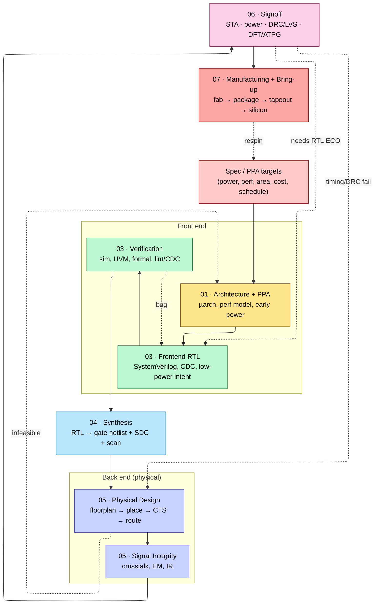

# Chip Design Flow — The Full RTL-to-GDSII-to-Silicon Pipeline

> **Read this first.** This page is the spine of this notebook. The folders are numbered in **flow order** (00 → 07); this page explains what each stage consumes, produces, and hands off, where the loops are, and which page covers each step.
> **Prerequisites:** none — this is the map. **Hands off to:** every stage page linked below.

---

## 0. Why this page exists

A chip is not built in one pass. It is built as a sequence of **abstraction lowerings** — spec → architecture → RTL → gates → transistors/polygons → mask → silicon — where each lowering is verified against the level above it, and almost every stage can throw the design back to an earlier one. An engineer who only knows their own stage ("I write RTL (register-transfer level)", "I do place-and-route") repeatedly ships problems downstream that cost weeks. The value of seeing the whole flow is knowing **what your stage owes the next one** and **what assumption you're allowed to make about the previous one**.

This page gives the end-to-end flow, the hand-off contract at each boundary, the iteration loops, and a single mental model for "where am I and what can break here."

---

## 1. The flow at a glance



Two cross-cutting concerns ride alongside every stage and therefore live in their own track:

- **[02 · Power & Low-Power](02_Power_and_Low_Power/01_Power_Fundamentals.md)** — power is *specified* at architecture, *intended* in RTL (UPF — Unified Power Format), *implemented* at synthesis/backend, and *signed off* at the end. The track is kept together so you can see the whole story.
- **[00 · Fundamentals](00_Fundamentals/01_CMOS_Fundamentals.md)** — device physics, logic, and arithmetic the other stages assume.

---

## 2. The hand-off contract at each boundary

The flow is a chain of **producer → artifact → consumer** contracts. Knowing the artifact is knowing the interface.

| Boundary | Artifact handed off | What the consumer is allowed to assume | Classic violation |
|---|---|---|---|
| Spec → Architecture | PPA budget, workload traces | the numbers are real, not aspirational | perf target needs a cache the area budget can't fit |
| Architecture → RTL | µarch spec, block diagram, interface defs | pipeline depth, latencies, bus widths are fixed | RTL "improves" a structure and breaks the perf model |
| RTL → Synthesis | RTL + **SDC constraints** + UPF | RTL is lint-clean, CDC-clean, synthesizable | latch inferred from an incomplete `case`; combinational loop |
| Synthesis → Backend | gate netlist + SDC + **scan-inserted** DFT | netlist is logically equal to RTL; constraints are real | missing false-path → backend chases an impossible path |
| Backend → Signoff | placed-and-routed DB + parasitics (SPEF) | legal placement, routed, CTS built | unconstrained clock-gating check fails at signoff |
| Signoff → Manufacturing | **GDSII** + signoff reports | timing/power/DRC/LVS clean, test patterns exist | antenna/DRC waiver that the fab rejects |

The single most useful habit: **every stage writes down what it guarantees to the next stage, and verifies it before hand-off.** That is what "signoff" means at each level, not just the final one.

---

## 3. Where the iteration loops are (and why they hurt)

Loops get more expensive the further back they reach — the "cost of a late change" curve:

```ascii-graph
 Stage a bug is found at →   relative cost to fix
 RTL sim                     1×      (edit RTL, re-sim)
 Gate sim / formal           ~3×     (re-synthesize)
 Post-route STA              ~10×     (ECO place+route+re-signoff)
 Post-silicon                ~1000×  (mask respin: $$$ + months)
```

- **RTL ↔ Verification** — the tight inner loop; you want *all* functional bugs caught here because it's the cheapest. (Stage 03.)
- **Backend ↔ Signoff** — timing/IR/DRC failures trigger ECOs (Engineering Change Orders): a *functional ECO* edits the netlist (needs spare cells), a *timing ECO* resizes/buffers without changing logic. (Stages 05–06.)
- **Backend → Architecture** — the painful one: if the floorplan can't close timing or the power grid can't carry the current, the architecture itself was wrong (too-deep a path, too-hot a block). Caught late, this is a re-spin of the plan.
- **Silicon → Spec** — a functional bug or yield problem found in the lab forces a metal-layer ECO (cheap-ish) or a full respin (expensive). Post-silicon bring-up exists to find these fast. (Stage 07.)

---

## 4. The notebook, stage by stage

| Stage (folder) | What you do | Key pages |
|---|---|---|
| **00 · Fundamentals** | the physics/logic everything assumes | [CMOS](00_Fundamentals/01_CMOS_Fundamentals.md), [Logic blocks](00_Fundamentals/02_Logic_Building_Blocks.md), [Adders_and_Multipliers](00_Fundamentals/03_Adders_and_Multipliers.md), [Floating point](00_Fundamentals/04_Floating_Point.md) |
| **01 · Architecture + PPA** | explore µarch; model performance; budget power/area | [Performance Modeling & DSE](01_Architecture_and_PPA/01_Modeling/01_Performance_Modeling_and_DSE.md), [CPU Architecture](01_Architecture_and_PPA/02_CPU/01_CPU_Architecture.md), [OoO](01_Architecture_and_PPA/02_CPU/03_OoO_Execution.md), [Cache](01_Architecture_and_PPA/03_Memory/01_Cache_Microarchitecture.md), [Coherence](01_Architecture_and_PPA/03_Memory/05_Cache_Coherence.md), [NoC](01_Architecture_and_PPA/04_Interconnect/03_Network_on_Chip.md), [DDR](01_Architecture_and_PPA/03_Memory/04_DDR_Controller.md) |
| **02 · Power & Low-Power** | the cross-cutting power track | [Power Fundamentals](02_Power_and_Low_Power/01_Power_Fundamentals.md), [Reduction Techniques](02_Power_and_Low_Power/03_Power_Reduction_Techniques.md), [UPF Intent](02_Power_and_Low_Power/04_UPF_Power_Intent.md), [Power Signoff](02_Power_and_Low_Power/05_Power_Analysis_and_Signoff.md) |
| **03 · Frontend RTL + Verification** | write synthesizable RTL; verify it | [RTL Design Methodology](03_Frontend_RTL_and_Verification/01_RTL_Design_Methodology.md), [Data types](03_Frontend_RTL_and_Verification/02_Data_Types_and_Basics.md), [Async/CDC](03_Frontend_RTL_and_Verification/06_Async_Design_and_CDC.md), [UVM](03_Frontend_RTL_and_Verification/10_UVM_Methodology.md), [Lint/CDC/RDC signoff](03_Frontend_RTL_and_Verification/07_Lint_CDC_RDC_Signoff.md), [GLS & Emulation](03_Frontend_RTL_and_Verification/13_Gate_Level_Sim_and_Emulation.md), [Verification Planning](03_Frontend_RTL_and_Verification/11_Verification_Planning_and_Coverage_Closure.md), [Formal](03_Frontend_RTL_and_Verification/12_Formal_Verification.md) |
| **04 · Synthesis** | RTL → gates under constraints | [Synthesis & Optimization](04_Synthesis/01_Synthesis_and_Optimization.md), [SDC Constraints](04_Synthesis/02_Constraints_SDC.md) |
| **05 · Backend (Physical Design)** | gates → layout | [Physical Design](05_Backend_Physical_Design/01_Physical_Design.md), [Signal Integrity](05_Backend_Physical_Design/02_Signal_Integrity_Reliability.md) |
| **06 · Signoff** | prove it's correct before tapeout | [STA](06_Signoff/01_STA.md), [DFT & ATPG](06_Signoff/02_DFT_and_ATPG.md), [Physical Verification (DRC/LVS)](06_Signoff/03_Physical_Verification_DRC_LVS.md) |
| **07 · Manufacturing + Bring-up** | fab, package, tapeout, first silicon | [Fabrication](07_Manufacturing_and_Bringup/01_Fabrication_Process.md), [Packaging](07_Manufacturing_and_Bringup/02_IC_Packaging.md), [Tapeout & Post-Silicon Bring-up](07_Manufacturing_and_Bringup/03_Tapeout_and_Post_Silicon_Bringup.md) |

---

## 5. Numbers to memorize

| Quantity | Value | Why |
|---|---|---|
| Cost curve of a late fix | 1× (RTL) → ~10× (post-route) → ~1000× (respin) | shift-left everything |
| Mask-set cost (leading node) | ~$10–40M (3nm-class) | why first silicon must work |
| Tapeout-to-first-silicon | ~8–14 weeks | the fab turnaround |
| Two ECO kinds | functional (spare cells) vs timing (resize/buffer) | what backend can fix without RTL |
| Hand-off artifacts | RTL+SDC+UPF → netlist → GDSII | the three lowerings |
| Signoff corners | × PVT × RC × mode (MCMM) | combinatorial blow-up of checks |

---

## 6. Interview-style framing

- **"Walk me through the flow from spec to silicon."** → spec/PPA → architecture+perf-model → RTL+verification → synthesis (+SDC+scan) → place-and-route → signoff (STA/power/DRC/LVS/ATPG) → tapeout → fab/package → bring-up. Name the artifact at each hand-off.
- **"Where would you catch a setup violation cheapest?"** → in synthesis/early-STA with realistic SDC, long before route; the later it's found, the more ECO churn.
- **"A path fails timing after route. Options?"** → timing ECO (resize/buffer/useful-skew) → restructure RTL (pipeline) if it's logic-deep → as a last resort revisit µarch. Tie each to its stage.

---

## Cross-references
- Power as a cross-cutting track: [02 · Power & Low-Power](02_Power_and_Low_Power/01_Power_Fundamentals.md).
- The systems analogue (the AI-datacenter "flow") lives in the companion AI-infra notebook.
