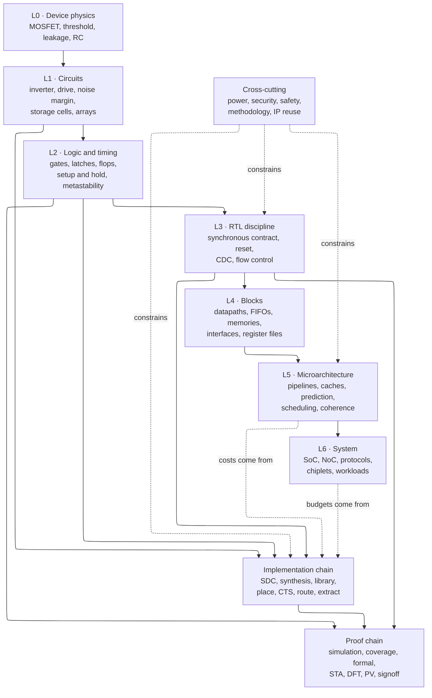

# Concept Dependency Map — what every idea in this notebook requires first

> **Prerequisites:** none. This page is a lookup tool, not a lesson.
> **Use it when:** you open a page and it assumes something you do not know, or you want to check that a reading order is actually legal.
> **Companions:** [Start Here — Learning Path](Start_Here_Learning_Path.md) (the ordered curriculum), [Glossary](Glossary.md) (what a term means), [Chip Design Flow Overview](Chip_Design_Flow_Overview.md) (the flow the concepts live in).

---

## 0. Why this page exists

A technical notebook has two structures at once. The **presentation order** is the chip-design flow — folders `00 → 08`, spec to silicon — because that is how the work happens and how it is talked about. The **dependency order** is different, and it is a directed graph rather than a line: static timing analysis needs the flip-flop's internal race *and* the standard-cell library's characterization criterion *and* the clock tree's insertion delay, three things that live in three separate folders. Read in flow order alone and you will repeatedly meet a mechanism whose motivation is two folders away.

This page makes the dependency graph explicit. It exists for one specific moment: **you are on a page, a sentence assumes something, and you need to know exactly which page owns that assumption.** Section 4 is a table you can search. Sections 2 and 3 are the shape of the graph, so that you can see *why* a dependency exists rather than just obeying it. Section 5 is a diagnostic list keyed to the symptoms people actually report. Section 6 covers the second kind of dependency — not "which idea needs which idea" but "which *file* is produced by which stage and consumed by which" — because in practice much of the confusion in chip design is about artifacts, not concepts.

A note on how to use this well. A dependency here means "the downstream idea is not derivable without the upstream one", not "you must read 400 pages before starting." Most dependencies are one or two sections deep, and the table's third column points at the section, not the whole page. Following a dependency should cost you twenty minutes, not a week.

---

## 1. The three ways to use this page

| Situation | What to do |
|---|---|
| "This page assumes something I don't know." | Search §4 for the concept. The **Requires** column tells you what it sits on; the **Derived in** column is where to go. |
| "I want to design my own reading order." | Read §2 and §3 for the layer structure, then check any order you invent against the rule in §3.6: never read a concept before everything in its **Requires** column. |
| "I keep bouncing off a whole topic." | Go to §5. The stuck points listed there are the ones that actually recur, and each names the specific upstream section that unblocks it. |

---

## 2. The graph at the top level

Three things in this figure are worth stating in words, because they are the source of most reading-order mistakes.

**The abstraction ladder (L0 → L6) is a real dependency, but it is not the only one.** The implementation chain hangs off L1 and L2, not off L6. This is why a physical-design engineer needs the transistor and the flip-flop but not the branch predictor, and why an architect who never learned L1 cannot price their own proposals.

**The dotted arrows point backwards on purpose.** Microarchitecture depends on implementation for its *costs*: you cannot claim a structure is worth building without knowing what it costs in area, delay, and power, and those numbers come from the implementation chain. This is the loop that makes chip design hard to learn linearly, and §7 gives the way to break it.

**The cross-cutting track constrains everything and is derived from nothing.** Power, security, safety, methodology, and IP-reuse are not a later stage; they are constraints applied at every level. That is why folders 02 and 08 are tracks rather than steps.

---

## 3. The layers, concretely

### 3.1 L0 — Device physics

Owned by [CMOS Fundamentals](00_Fundamentals/01_CMOS_Fundamentals.md) §1 (the MOSFET and where it stops being a switch), §8 (FinFET and gate-all-around), §9 (variation), and §13 (leakage), together with [Power Fundamentals](02_Power_and_Low_Power/01_Power_Fundamentals.md) §§2–4, with the manufacturing side in [Fabrication Process](07_Manufacturing_and_Bringup/01_Fabrication_Process.md).

The MOSFET as a voltage-controlled resistance; threshold voltage and its temperature and body dependence; drain-induced barrier lowering and short-channel effects; subthreshold conduction and the 60 mV/decade limit; gate and junction leakage; the RC of a wire; FinFET and gate-all-around geometry. **Everything numeric in the notebook bottoms out here.** A delay is an RC; a power is a $CV^2f$ or an $I_{leak}V$; a corner is a statement about threshold voltage and mobility.

### 3.2 L1 — Circuits

Owned by [CMOS Fundamentals](00_Fundamentals/01_CMOS_Fundamentals.md) §§2–7 (inverter, noise margin, delay, logic families, latch-up, ESD) and §§10–12 (wire delay, logical effort, the 6T bitcell), together with [Memory Circuits and Technologies](00_Fundamentals/06_Memory_Circuits_and_Technologies.md).

The complementary inverter and its voltage-transfer curve; noise margin as the reason digital abstraction works at all; drive strength and fan-out; logical effort; pass-transistor and transmission-gate structures; latch-up and electrostatic discharge; the 6T SRAM cell's read-disturb/write-margin conflict; sense amplifiers; the 1T1C DRAM cell and its destructive read. This layer is where "a gate" becomes "a circuit with a cost."

### 3.3 L2 — Logic and timing

Owned by [Logic Building Blocks](00_Fundamentals/02_Logic_Building_Blocks.md), with the arithmetic structures in [Adders and Multipliers](00_Fundamentals/03_Adders_and_Multipliers.md), [Floating Point](00_Fundamentals/04_Floating_Point.md), and [DSP and Fixed-Point Hardware](00_Fundamentals/07_DSP_and_Fixed_Point_Hardware.md).

Boolean networks and Shannon expansion; multiplexers, decoders, priority encoders; bistable feedback; SR and D latches; the master-slave flip-flop; **setup and hold as a race between the data path and the internal feedback path**; metastability and mean-time-between-failures; hazards and glitches; carry-propagation structures; rounding and quantization. If you can only deeply learn one page in the whole notebook before the rest, it is this layer's main page.

### 3.4 L3–L4 — RTL discipline and blocks

Owned by folder [03 · Frontend RTL and Verification](03_Frontend_RTL_and_Verification/00_Index.md).

The synchronous contract; reset architecture and reset-domain crossing; the event-region scheduler that makes blocking vs non-blocking a theorem rather than a rule of thumb; clock-domain crossing and the synchronizer's exact guarantee; valid/ready and credit-based flow control; skid buffers; FIFOs synchronous and asynchronous; fixed-point datapaths; memory inference; control/status registers.

### 3.5 L5–L6 — Microarchitecture and system

Owned by folder [01 · Architecture and PPA](01_Architecture_and_PPA/00_Index.md), organized as four self-contained books.

Pipelines and hazards; branch prediction; out-of-order issue, wakeup, and recovery; cache organization and coherence; virtual memory and translation; SIMT and systolic dataflows; transaction protocols; networks-on-chip; memory controllers; chiplets. Every one of these is a *structure chosen against a workload under a cost*, which is why L5 and L6 depend on the implementation chain for their numbers.

### 3.6 The rule

**Never read a concept before everything in its Requires column.** That is the whole rule. Its practical form: if a page's opening paragraph uses three terms you cannot define, do not push through — look them up in §4 or the [Glossary](Glossary.md), read the owning section, and come back. Pushing through produces recognition without derivation, which is the failure mode this notebook is built to avoid.

---

## 4. The dependency table

Read a row as: *this concept* cannot be derived without *these*, and it is derived *here*; skipping the prerequisite produces *this specific confusion*.

### 4.1 Devices, circuits, and storage

| Concept | Requires | Derived in | What breaks if you skip the prerequisite |
|---|---|---|---|
| MOSFET as a switch | — | [CMOS §1](00_Fundamentals/01_CMOS_Fundamentals.md) | Every later cost number is a memorized fact instead of a derivation |
| Threshold voltage, $V_t$ flavors | MOSFET | [CMOS §1, §13](00_Fundamentals/01_CMOS_Fundamentals.md), [Libraries §7](04_Synthesis/03_Standard_Cell_Libraries_and_Characterization.md) | "LVT is faster" without knowing the leakage exchange rate |
| Inverter VTC, noise margin | MOSFET, series/parallel conduction | [CMOS §2–3](00_Fundamentals/01_CMOS_Fundamentals.md) | No account of why digital logic is noise-immune at all |
| RC delay, drive strength, fan-out | Inverter, wire RC | [CMOS §4, §10](00_Fundamentals/01_CMOS_Fundamentals.md) | Cannot explain why delay depends on load or on input slew |
| Logical effort | Drive strength, fan-out | [Logic §1](00_Fundamentals/02_Logic_Building_Blocks.md) | No hand method for sizing or for path-delay estimation |
| Dynamic, short-circuit, leakage power | MOSFET, RC, activity | [Power Fundamentals §2](02_Power_and_Low_Power/01_Power_Fundamentals.md) | Power reduction techniques become a list to memorize |
| Subthreshold swing, DIBL | Device physics | [CMOS §1, §13](00_Fundamentals/01_CMOS_Fundamentals.md), [Power §4](02_Power_and_Low_Power/01_Power_Fundamentals.md) | Cannot explain why supply voltage stopped scaling |
| GIDL, gate and junction leakage | Device physics, band bending | [CMOS §13](00_Fundamentals/01_CMOS_Fundamentals.md), [Power Fundamentals §4.3](02_Power_and_Low_Power/01_Power_Fundamentals.md) | "Leakage" means subthreshold only, so a standby budget cannot be attributed to a mechanism or attacked by one |
| Stack effect | Subthreshold conduction, series devices | [Power Fundamentals §4.4](02_Power_and_Low_Power/01_Power_Fundamentals.md) | No account of why a sleep transistor works as well as it does, or why NAND leaks less than the equivalent NOR |
| EDP and $ED^2$ | Energy per op, delay, the $V$–$f$ curve | [Power Fundamentals §3.3](02_Power_and_Low_Power/01_Power_Fundamentals.md) | Two designs get compared on energy alone, which always favours the slowest one |
| 6T SRAM cell, read disturb, write margin | Inverter, bistability, sizing | [Memory §2](00_Fundamentals/06_Memory_Circuits_and_Technologies.md) | Memory macros are black boxes with unexplained constraints |
| Sense amplifier, bitline development | SRAM cell, RC, differential pairs | [Memory §3–4](00_Fundamentals/06_Memory_Circuits_and_Technologies.md) | No account of why array access time scales as it does |
| 1T1C DRAM cell, destructive read | Capacitance, charge sharing | [Memory §10](00_Fundamentals/06_Memory_Circuits_and_Technologies.md) | Every DDR timing parameter is an arbitrary number |
| ECC, SEC-DED | Hamming distance, memory arrays | [Memory §8](00_Fundamentals/06_Memory_Circuits_and_Technologies.md) | Cannot size a protection scheme or argue a FIT target |
| Latch-up, ESD, antenna | Device structure, process | [CMOS §6–7](00_Fundamentals/01_CMOS_Fundamentals.md), [PV](06_Signoff/03_Physical_Verification_DRC_LVS.md) | Physical-verification rule failures look arbitrary |

### 4.2 Logic and timing

| Concept | Requires | Derived in | What breaks if you skip the prerequisite |
|---|---|---|---|
| Bistable feedback, SR/D latch | Inverter, gain > 1 | [Logic §4](00_Fundamentals/02_Logic_Building_Blocks.md) | The flip-flop stays an atom and timing stays folklore |
| Master-slave flip-flop | D latch, clock phases | [Logic §4](00_Fundamentals/02_Logic_Building_Blocks.md) | Cannot explain why setup and hold exist |
| Setup and hold time | Flip-flop internals | [Logic §4](00_Fundamentals/02_Logic_Building_Blocks.md), [STA §3](06_Signoff/01_STA.md) | Timing inequalities become formulas to memorize |
| Metastability, MTBF | Bistability, resolution time constant | [Logic §4](00_Fundamentals/02_Logic_Building_Blocks.md), [CDC §2](03_Frontend_RTL_and_Verification/06_Async_Design_and_CDC.md) | Synchronizers are cargo cult; cannot size a chain |
| Hazards and glitches | Boolean networks, unequal path delays | [Logic §8](00_Fundamentals/02_Logic_Building_Blocks.md) | Clock gating and glitch power are inexplicable |
| Gray code | Hamming distance, multi-bit sampling | [Logic §7](00_Fundamentals/02_Logic_Building_Blocks.md) | Async FIFO pointer crossing looks like a trick |
| Carry propagation, prefix adders | Full adder, associativity | [Adders §1–5](00_Fundamentals/03_Adders_and_Multipliers.md) | No feel for the area/delay trade in any datapath |
| Carry-save, Booth, Wallace | Carry propagation | [Adders §6–7](00_Fundamentals/03_Adders_and_Multipliers.md) | Multiplier and MAC costs are unanalyzable |
| Rounding, ULP, guard/round/sticky | Binary fractions, error model | [Floating Point §2, §4](00_Fundamentals/04_Floating_Point.md) | Fixed-point and FP verification have no error bound |
| Q-format, saturation, guard bits | Two's complement, quantization noise | [Arithmetic RTL](03_Frontend_RTL_and_Verification/16_Arithmetic_and_Memory_RTL.md), [DSP §1–4](00_Fundamentals/07_DSP_and_Fixed_Point_Hardware.md) | Quantized datapaths overflow silently |

### 4.3 RTL and verification

| Concept | Requires | Derived in | What breaks if you skip the prerequisite |
|---|---|---|---|
| Synchronous discipline | Setup/hold, clocking | [RTL Methodology §1–2](03_Frontend_RTL_and_Verification/01_RTL_Design_Methodology.md) | Intermittent, un-debuggable silicon |
| Reset architecture | Flip-flop reset pins, recovery/removal | [RTL Methodology §5](03_Frontend_RTL_and_Verification/01_RTL_Design_Methodology.md) | Reset de-assertion metastability across a domain |
| Blocking vs non-blocking | Event-region scheduler | [Procedural §2–3](03_Frontend_RTL_and_Verification/03_Procedural_Processes_and_IPC.md) | Simulation/synthesis mismatch, race conditions |
| X-optimism and X-pessimism | 4-state values, gate semantics | [Data Types §3](03_Frontend_RTL_and_Verification/02_Data_Types_and_Basics.md) | Bugs hidden in RTL sim that appear in GLS |
| Latch inference | Incomplete assignment, sensitivity | [RTL Methodology](03_Frontend_RTL_and_Verification/01_RTL_Design_Methodology.md), [Synthesis Flow §3](04_Synthesis/04_Synthesis_Flow_and_QoR_Closure.md) | Unexpected latches, untimed paths |
| CDC and synchronizers | Metastability, gray code | [CDC §1–4](03_Frontend_RTL_and_Verification/06_Async_Design_and_CDC.md) | Multi-bit crossings corrupted; MTBF unknown |
| Async FIFO | CDC, gray code, FIFO depth | [CDC §7](03_Frontend_RTL_and_Verification/06_Async_Design_and_CDC.md) | Full/empty flags wrong under crossing latency |
| valid/ready, back-pressure | Handshake, buffering | [Flow Control §1, §6](03_Frontend_RTL_and_Verification/15_Flow_Control_and_FIFOs.md) | Deadlock, dropped data, throughput collapse |
| Skid buffer | valid/ready, registered outputs | [Flow Control §2](03_Frontend_RTL_and_Verification/15_Flow_Control_and_FIFOs.md) | Combinational loop through ready, or lost throughput |
| Pipelining and retiming | Setup inequality, register cost | [Design Patterns §1](03_Frontend_RTL_and_Verification/14_RTL_Design_Patterns.md), [Synthesis §6](04_Synthesis/01_Synthesis_and_Optimization.md) | "Add a pipeline stage" without knowing the latency/verification cost |
| SVA concurrent assertions | Clocking, temporal logic | [Assertions §1–3](03_Frontend_RTL_and_Verification/09_Assertions_and_Coverage.md) | Assertions that pass vacuously |
| Functional coverage | Verification plan, sampling | [Assertions §4](03_Frontend_RTL_and_Verification/09_Assertions_and_Coverage.md), [Planning §2](03_Frontend_RTL_and_Verification/11_Verification_Planning_and_Coverage_Closure.md) | Coverage that measures the testbench, not the design |
| Constrained randomization | OOP, solver semantics | [OOP and Randomization §2–3](03_Frontend_RTL_and_Verification/08_OOP_and_Randomization.md) | Random noise with no closure argument |
| UVM phasing, factory, RAL | OOP, TLM, config | [UVM](03_Frontend_RTL_and_Verification/10_UVM_Methodology.md) | Copy-paste testbenches that cannot be reused |
| Formal: BMC, k-induction, IC3 | Boolean satisfiability, state space | [Formal §1–4](03_Frontend_RTL_and_Verification/12_Formal_Verification.md) | Cannot tell a bounded proof from a full one |
| Logic equivalence checking | Synthesis transforms, key points | [Formal §5](03_Frontend_RTL_and_Verification/12_Formal_Verification.md), [Synthesis Flow §10](04_Synthesis/04_Synthesis_Flow_and_QoR_Closure.md) | Retiming and ungrouping silently break the proof |
| Gate-level simulation, SDF | Netlist, timing annotation, X semantics | [GLS §1–3](03_Frontend_RTL_and_Verification/13_Gate_Level_Sim_and_Emulation.md) | Reset and initialization bugs escape to silicon |

### 4.4 The implementation chain

| Concept | Requires | Derived in | What breaks if you skip the prerequisite |
|---|---|---|---|
| Clock definition, generated clocks | Clock sources, dividers | [SDC §2](04_Synthesis/02_Constraints_SDC.md) | Unconstrained or double-counted paths |
| I/O delay | Neighbor timing model | [SDC §3](04_Synthesis/02_Constraints_SDC.md) | Blocks close standalone and fail at integration |
| Timing exceptions | Path semantics, precedence | [SDC §4](04_Synthesis/02_Constraints_SDC.md) | Real violations masked by a wrong false path |
| Standard cell, tracks, unit drive | Circuits, layout rules | [Libraries §1](04_Synthesis/03_Standard_Cell_Libraries_and_Characterization.md) | Area and density numbers are meaningless |
| `.lib`, LEF, GDS, and their invariant | Cell, layout, timing model | [Libraries §2](04_Synthesis/03_Standard_Cell_Libraries_and_Characterization.md) | Tool-to-tool mismatch bugs are un-diagnosable |
| NLDM, CCS, ECSM | RC, slew, characterization | [Libraries §3–4](04_Synthesis/03_Standard_Cell_Libraries_and_Characterization.md) | Cannot explain where any delay number comes from |
| PVT corners, derating | Device variation, temperature inversion | [Libraries §6](04_Synthesis/03_Standard_Cell_Libraries_and_Characterization.md), [STA §5](06_Signoff/01_STA.md) | "Sign off at the slow corner" without knowing which is slow |
| Technology mapping | Boolean network, cell library | [Synthesis §4](04_Synthesis/01_Synthesis_and_Optimization.md) | Synthesis is a black box |
| Retiming | Setup inequality, register semantics | [Synthesis §6](04_Synthesis/01_Synthesis_and_Optimization.md) | Free speedup expected; LEC failures unexplained |
| Timing budgeting across partitions | Path decomposition, interface models | [Physical Synthesis §6](04_Synthesis/05_Physical_Synthesis_and_Design_Planning.md) | Every block closes and the top does not |
| Wireload models and their death | RC, statistical estimation | [Physical Synthesis §1](04_Synthesis/05_Physical_Synthesis_and_Design_Planning.md) | Synthesis-to-PnR correlation gap is a mystery |
| Utilization, routability | Cell area, routing resource | [Floorplanning §2](05_Backend_Physical_Design/03_Floorplanning_and_Power_Planning.md) | Designs that place fine and cannot route |
| Power grid sizing | Current from power, sheet resistance | [Floorplanning §7–9](05_Backend_Physical_Design/03_Floorplanning_and_Power_Planning.md) | IR-drop failures found after route |
| HPWL, analytical placement | Wirelength proxy, optimization | [Physical Design §3](05_Backend_Physical_Design/01_Physical_Design.md), [Placement §2](05_Backend_Physical_Design/04_Placement_Legalization_and_Optimization.md) | Placement quality is unexplainable |
| Legalization, displacement | Rows, sites, power-rail alignment | [Placement §3](05_Backend_Physical_Design/04_Placement_Legalization_and_Optimization.md) | Timing that collapses between global and detailed placement |
| Buffer insertion, optimal segment | Wire RC, buffer delay model | [Placement §6](05_Backend_Physical_Design/04_Placement_Legalization_and_Optimization.md) | Long nets fixed by guesswork |
| Insertion delay, skew, CPPR | Clock tree structure, OCV | [CTS §1, §8](05_Backend_Physical_Design/05_Clock_Tree_Synthesis.md), [STA §4](06_Signoff/01_STA.md) | Cannot explain why a deep tree costs margin |
| Useful skew, CCD | Setup/hold system of inequalities | [CTS §7](05_Backend_Physical_Design/05_Clock_Tree_Synthesis.md) | Time borrowing looks like a free lunch |
| Post-CTS hold fixing | Propagated clock, min-delay paths | [CTS §9](05_Backend_Physical_Design/05_Clock_Tree_Synthesis.md) | Hold fixed too early, then re-broken |
| Metal stack tiers, NDR | Wire RC, $L^2$ delay | [Routing §1, §5](05_Backend_Physical_Design/06_Routing_and_Parasitic_Extraction.md) | Layer assignment appears arbitrary |
| Extraction, SPEF, RC corners | Capacitance physics, coupling | [Routing §8–11](05_Backend_Physical_Design/06_Routing_and_Parasitic_Extraction.md) | Timing signed off against the wrong parasitics |
| Elmore delay | RC ladder | [Routing §10](05_Backend_Physical_Design/06_Routing_and_Parasitic_Extraction.md) | No first-order sanity check on a net |
| Crosstalk delta delay and noise | Coupling capacitance, aggressor timing | [SI §1](05_Backend_Physical_Design/02_Signal_Integrity_Reliability.md) | SI-timing surprises after route |
| Electromigration | Current density, metal physics | [SI §3](05_Backend_Physical_Design/02_Signal_Integrity_Reliability.md) | Grid and via sizing failures at signoff |

### 4.5 Proof, test, and manufacturing

| Concept | Requires | Derived in | What breaks if you skip the prerequisite |
|---|---|---|---|
| The timing graph | Netlist, arcs, unateness | [STA §2](06_Signoff/01_STA.md) | Path enumeration seems intractable |
| Setup/hold slack with real clocks | Flip-flop timing, skew, jitter, derate | [STA §3–5](06_Signoff/01_STA.md) | Cannot debug a violation report |
| OCV, AOCV, POCV | Variation statistics, path depth | [STA §5](06_Signoff/01_STA.md) | Over-margined or under-margined signoff |
| MMMC scenarios | Modes, corners, RC corners | [Signoff Orchestration §2](06_Signoff/04_Signoff_Orchestration_ECO_and_Tapeout_Readiness.md) | Compute cost and coverage both unmanaged |
| Scan, stuck-at, ATPG | Combinational test, controllability | [DFT §2–4](06_Signoff/02_DFT_and_ATPG.md) | Untestable silicon; coverage claims unfounded |
| At-speed test, LOS/LOC | Scan, clock control | [DFT §5](06_Signoff/02_DFT_and_ATPG.md) | Delay defects escape to the field |
| MBIST, BISR | Memory arrays, redundancy | [DFT §6](06_Signoff/02_DFT_and_ATPG.md), [Memory §7](00_Fundamentals/06_Memory_Circuits_and_Technologies.md) | Large arrays cannot be tested or repaired |
| DRC, LVS | Layout rules, netlist comparison | [PV §2–3](06_Signoff/03_Physical_Verification_DRC_LVS.md) | Masks rejected; layout is not the circuit |
| ECO taxonomy, spare cells | Netlist edit, mask layers | [Signoff Orchestration §4–6](06_Signoff/04_Signoff_Orchestration_ECO_and_Tapeout_Readiness.md) | Late fixes cost a full mask set unnecessarily |
| Lithography, OPC, EUV | Optics, process | [Fabrication §2–3](07_Manufacturing_and_Bringup/01_Fabrication_Process.md) | Design rules and DFM look arbitrary |
| Yield, D0, redundancy | Defect statistics | [Fabrication §5](07_Manufacturing_and_Bringup/01_Fabrication_Process.md) | Die-size and chiplet economics unanalyzable |
| Package parasitics, SSO | IO circuits, inductance | [Packaging](07_Manufacturing_and_Bringup/02_IC_Packaging.md) | IO timing and noise budgets wrong |
| Bring-up, shmoo, respin economics | Whole flow | [Tape-out and Bring-up](07_Manufacturing_and_Bringup/03_Tapeout_and_Post_Silicon_Bringup.md) | No sense of what a late bug actually costs |

### 4.6 Architecture and system

| Concept | Requires | Derived in | What breaks if you skip the prerequisite |
|---|---|---|---|
| Pipelining, hazards, forwarding | Sequential logic, setup inequality | [CPU Architecture](01_Architecture_and_PPA/01_CPU_Architecture/01_Core_Foundations/01_CPU_Architecture.md) | Depth chosen without a frequency or penalty argument |
| Branch prediction | Pipelines, speculation cost | [Branch Prediction](01_Architecture_and_PPA/01_CPU_Architecture/02_Frontend_and_Prediction/01_Branch_Prediction_Deep_Dive.md) | Predictor sizing with no misprediction-cost model |
| Out-of-order issue, wakeup/select | Register renaming, scheduling, timing | [OoO Execution](01_Architecture_and_PPA/01_CPU_Architecture/03_Out_of_Order_Backend/01_OoO_Execution.md) | Structures proposed without a cycle-time cost |
| Precise state, recovery | ROB, speculation | [Retirement and Recovery](01_Architecture_and_PPA/01_CPU_Architecture/03_Out_of_Order_Backend/03_Retirement_Recovery_and_Precise_State.md) | Exceptions and mispredicts unimplementable |
| Cache organization, MSHRs | SRAM arrays, associativity, latency | [Cache Microarchitecture](01_Architecture_and_PPA/01_CPU_Architecture/04_Cache_Hierarchy/01_Cache_Microarchitecture.md) | Hit-rate reasoning with no access-time or port cost |
| Virtual memory, TLB, page walk | Address translation, caches | [TLB and Virtual Memory](01_Architecture_and_PPA/01_CPU_Architecture/05_Virtual_Memory/01_TLB_and_Virtual_Memory.md) | Translation latency invisible in the model |
| Coherence protocols | Caches, transactions, races | [Cache Coherence](01_Architecture_and_PPA/01_CPU_Architecture/06_Coherence_and_Consistency/01_Cache_Coherence.md) | Protocol deadlock and livelock unanticipated |
| Memory consistency, barriers | Coherence, reordering | [Memory Consistency](01_Architecture_and_PPA/01_CPU_Architecture/06_Coherence_and_Consistency/02_Memory_Consistency_and_Atomics.md) | Software-visible ordering bugs |
| Atomic read-modify-write, CAS, LR/SC | Coherence, consistency, the serialization point | [Atomic Operations §1–§6](01_Architecture_and_PPA/01_CPU_Architecture/06_Coherence_and_Consistency/04_Atomic_Operations.md) | ABA taken for a working algorithm; an LR/SC loop that never succeeds and looks like a hang |
| Contended-lock scaling, HTM and lock elision | Atomics, cache-line transfer cost | [Atomic Operations §11, §12](01_Architecture_and_PPA/01_CPU_Architecture/06_Coherence_and_Consistency/04_Atomic_Operations.md) | A lock that is fine on two cores and collapses on sixteen, with no arithmetic to have predicted it |
| SIMT, warps, occupancy | Threads, latency hiding, register files | [GPU Architecture](01_Architecture_and_PPA/02_GPU_Architecture/01_Core_Architecture/01_GPU_Architecture.md) | Occupancy tuning as superstition |
| GPU atomics, scopes, warp aggregation | SIMT execution, shared-memory banks, scoped consistency | [GPU Atomics and Synchronization §2–§5, §7](01_Architecture_and_PPA/02_GPU_Architecture/02_Memory_System/03_GPU_Atomics_and_Synchronization.md) | A histogram that replays 32 times per warp; a spin lock that deadlocks the warp holding it |
| Systolic arrays, dataflows | MAC arrays, data reuse | [Systolic and Spatial Dataflows](01_Architecture_and_PPA/03_NPU_Architecture/01_Compute_Dataflows/02_Systolic_Spatial_and_Vector_Dataflows.md) | Dataflow choice with no energy model |
| Quantization for AI | Fixed-point, error analysis | [DSP §1–4, §11](00_Fundamentals/07_DSP_and_Fixed_Point_Hardware.md), [Sparsity and Quantization](01_Architecture_and_PPA/03_NPU_Architecture/02_Mapping_and_Memory/02_Sparsity_Quantization_and_Compression.md) | Accumulator widths and scales chosen by trial |
| AXI/AHB/APB | Handshakes, flow control, ordering | [AHB AXI APB](01_Architecture_and_PPA/04_SoC_and_Chiplet_Architecture/03_Transaction_Protocols/01_AHB_AXI_APB.md) | Integration deadlocks and ID-width bugs |
| `AxCACHE`, `AxPROT`, memory attributes | AXI channels, caches, privilege | [AMBA Family §2](01_Architecture_and_PPA/04_SoC_and_Chiplet_Architecture/03_Transaction_Protocols/02_AMBA_Family_Signals_and_Low_Power_Interfaces.md) | A master that is coherent on paper and stale in silicon; a security filter that filters nothing |
| Exclusive access, the exclusive monitor | Atomics, ordering, fabric transport | [System Atomics §3–§6](01_Architecture_and_PPA/04_SoC_and_Chiplet_Architecture/02_Shared_Memory/04_System_Atomics_and_Exclusive_Access.md), encodings in [AMBA Family §3](01_Architecture_and_PPA/04_SoC_and_Chiplet_Architecture/03_Transaction_Protocols/02_AMBA_Family_Signals_and_Low_Power_Interfaces.md) | Locks that fail spuriously forever, and no way to tell that from a bug |
| Far atomics, and where the serialization point sits | Coherence, home node, fabric latency | [System Atomics §7, §8](01_Architecture_and_PPA/04_SoC_and_Chiplet_Architecture/02_Shared_Memory/04_System_Atomics_and_Exclusive_Access.md) | A line ping-ponging between requesters because the operation was never sent to the data |
| Atomics across IO and die boundaries | PCIe/CXL transactions, coherence bias, non-coherent masters | [System Atomics §11–§13](01_Architecture_and_PPA/04_SoC_and_Chiplet_Architecture/02_Shared_Memory/04_System_Atomics_and_Exclusive_Access.md) | An accelerator or DMA master that participates in a lock it cannot actually honour |
| AXI ordering, ID reuse, interleaving | Per-ID ordering rules, outstanding transactions | [AMBA Family §5](01_Architecture_and_PPA/04_SoC_and_Chiplet_Architecture/03_Transaction_Protocols/02_AMBA_Family_Signals_and_Low_Power_Interfaces.md) | The ID-reuse deadlock, found at integration and blamed on the fabric |
| Q-Channel, P-Channel handshakes | Power domains, handshakes, deny semantics | [AMBA Family §8, §9](01_Architecture_and_PPA/04_SoC_and_Chiplet_Architecture/03_Transaction_Protocols/02_AMBA_Family_Signals_and_Low_Power_Interfaces.md) | A domain gated while it is still busy; no path from power intent to RTL |
| Snoop coherence vs a home node | Coherence protocol, fabric topology | [ACE and CHI §2, §4](01_Architecture_and_PPA/01_CPU_Architecture/06_Coherence_and_Consistency/03_ACE_and_CHI.md) | Broadcast assumed to scale; the directory's storage and indirection cost unbudgeted |
| Router pipeline, allocators, crossbar | Arbiters, buffers, credit flow control | [Router Microarchitecture §2, §6, §8](01_Architecture_and_PPA/04_SoC_and_Chiplet_Architecture/04_On_Chip_Networks/03_Router_Microarchitecture.md) | Fabric proposed with no frequency or area cost attached |
| Channel load and ideal throughput | Topology parameters, traffic patterns | [Topology Selection §3](01_Architecture_and_PPA/04_SoC_and_Chiplet_Architecture/04_On_Chip_Networks/04_Topology_Selection_and_Performance_Analysis.md) | Throughput claims that only a simulation can check, and nothing to check it against |
| High-radix topologies | Bisection cost, routing, deadlock | [Topology Selection §7](01_Architecture_and_PPA/04_SoC_and_Chiplet_Architecture/04_On_Chip_Networks/04_Topology_Selection_and_Performance_Analysis.md) | Mesh assumed to be the only answer at every scale |
| Bisection as a metal-stack constraint | Wire pitch, layer budget, floorplan | [Topology Selection §2](01_Architecture_and_PPA/04_SoC_and_Chiplet_Architecture/04_On_Chip_Networks/04_Topology_Selection_and_Performance_Analysis.md), [Routing §1](05_Backend_Physical_Design/06_Routing_and_Parasitic_Extraction.md) | A topology that is unbuildable rather than merely expensive, discovered after RTL |
| Router pipeline frequency and area | Allocators, crossbar, buffer sizing | [Router Microarchitecture §11, §3](01_Architecture_and_PPA/04_SoC_and_Chiplet_Architecture/04_On_Chip_Networks/03_Router_Microarchitecture.md) | A fabric proposal with no frequency it can actually close at |
| NoC routing, flow control, deadlock | Buffering, virtual channels | [Routing, Flow Control, Deadlock](01_Architecture_and_PPA/04_SoC_and_Chiplet_Architecture/04_On_Chip_Networks/02_Routing_Flow_Control_and_Deadlock.md) | Topologies proposed that deadlock |
| DDR timing and scheduling | DRAM device physics | [DDR Controller](01_Architecture_and_PPA/04_SoC_and_Chiplet_Architecture/02_Shared_Memory/01_DDR_Controller.md), [Memory §10](00_Fundamentals/06_Memory_Circuits_and_Technologies.md) | Bandwidth models that ignore row-buffer behavior |
| DRAM command truth table, mode registers | 1T1C cell, bank and bank-group structure | [DRAM Device Protocol §2, §5](01_Architecture_and_PPA/04_SoC_and_Chiplet_Architecture/02_Shared_Memory/02_DRAM_Device_Protocol_and_Training.md) | A controller written against a timing table nobody in the room can justify |
| Write levelling, read training, ZQ and ODT | Signal integrity, timing budgets, PHY | [DRAM Device Protocol §7, §8](01_Architecture_and_PPA/04_SoC_and_Chiplet_Architecture/02_Shared_Memory/02_DRAM_Device_Protocol_and_Training.md) | A memory bus that passes at one corner and fails in the field |
| The DFI controller/PHY boundary | Command timing, PHY latency | [DRAM Device Protocol §13](01_Architecture_and_PPA/04_SoC_and_Chiplet_Architecture/02_Shared_Memory/02_DRAM_Device_Protocol_and_Training.md) | The controller/PHY line drawn in the wrong place, discovered at integration |
| FR-FCFS, row-buffer policy, read/write turnaround | DRAM timing, queueing | [Memory Scheduling §2, §3](01_Architecture_and_PPA/04_SoC_and_Chiplet_Architecture/02_Shared_Memory/03_Memory_Scheduling_and_Address_Mapping.md) | Efficiency numbers with no turnaround term, so they never reproduce |
| Physical-to-DRAM address mapping | DRAM organization, workload locality | [Memory Scheduling §7](01_Architecture_and_PPA/04_SoC_and_Chiplet_Architecture/02_Shared_Memory/03_Memory_Scheduling_and_Address_Mapping.md) | Bank conflicts blamed on the scheduler and never fixed |
| Memory QoS, fairness, deadline scheduling | Scheduling, multicore interference | [Memory Scheduling §5, §6](01_Architecture_and_PPA/04_SoC_and_Chiplet_Architecture/02_Shared_Memory/03_Memory_Scheduling_and_Address_Mapping.md) | A latency-sensitive master starved by a bandwidth-hungry one |
| DRAM simulator fidelity and its limits | DRAM protocol, queueing, trace validity | [DRAM Simulators §1, §8](01_Architecture_and_PPA/04_SoC_and_Chiplet_Architecture/06_Simulation/01_DRAM_Simulators.md) | A bandwidth number with no validity argument behind it |
| TLP structure and PCIe credit flow control | Packet layering, credit-based flow control | [PCIe §5, §7](01_Architecture_and_PPA/04_SoC_and_Chiplet_Architecture/05_IO_and_Chiplets/04_PCIe_Protocol_Deep_Dive.md) | Bandwidth claims that ignore header overhead and credit-return latency |
| PCIe ordering and completion rules | Posted/non-posted semantics, deadlock | [PCIe §8](01_Architecture_and_PPA/04_SoC_and_Chiplet_Architecture/05_IO_and_Chiplets/04_PCIe_Protocol_Deep_Dive.md) | Producer–consumer ordering bugs, and deadlock through the root complex |
| Link training and the LTSSM | SerDes, equalization, CDR | [PCIe §9](01_Architecture_and_PPA/04_SoC_and_Chiplet_Architecture/05_IO_and_Chiplets/04_PCIe_Protocol_Deep_Dive.md) | A link that will not come up, and no vocabulary to describe where it stopped |
| Privilege levels, CSRs, trap delivery | Precise state, the ISA contract | [Privileged Architecture §3, §6](01_Architecture_and_PPA/01_CPU_Architecture/01_Core_Foundations/04_Privileged_Architecture_CSRs_and_Traps.md) | Exception behaviour treated as magic; a register spec that cannot be written |
| WARL/WLRL/WPRI field semantics | CSR access rules | [Privileged Architecture §4](01_Architecture_and_PPA/01_CPU_Architecture/01_Core_Foundations/04_Privileged_Architecture_CSRs_and_Traps.md) | A register map that cannot be verified against its own specification |
| Interrupt delivery, priority, preemption | Level/edge detection, fabric ordering | [Interrupt Architecture §2, §5, §8](01_Architecture_and_PPA/04_SoC_and_Chiplet_Architecture/05_IO_and_Chiplets/05_Interrupt_Architecture.md) | Latency budgets guessed; storms and lost edges unanticipated |
| TLB hierarchy, coalescing, context IDs | TLB basics, page walk | [TLB and Virtual Memory §9, §10](01_Architecture_and_PPA/01_CPU_Architecture/05_Virtual_Memory/01_TLB_and_Virtual_Memory.md) | Reach and multi-page-size cost invisible; ASID rollover unhandled |
| UPF simstate and simulation semantics | Power domains, isolation, retention | [UPF and CPF §11](02_Power_and_Low_Power/05_UPF_and_CPF_Power_Intent.md) | An X in simulation cannot be traced back to the missing strategy |
| SerDes, equalization, CDR | Channel loss, sampling, PLLs | [High-Speed I/O §2–3](01_Architecture_and_PPA/04_SoC_and_Chiplet_Architecture/05_IO_and_Chiplets/03_High_Speed_IO_and_Peripheral_Protocols.md) | Link budgets and BER claims unfounded |
| Chiplets, D2D, UCIe | Packaging, IO, yield economics | [Chiplets, CXL, D2D](01_Architecture_and_PPA/04_SoC_and_Chiplet_Architecture/05_IO_and_Chiplets/02_Chiplets_CXL_and_Die_to_Die.md) | Partitioning decided without the yield/cost model |
| Roofline, arithmetic intensity | Bandwidth, compute throughput | The design-methodology sub-book of each architecture | Bottleneck misattributed |
| Discrete-event and TLM modeling | Concurrency semantics | [SystemC and TLM](00_Fundamentals/05_SystemC_and_TLM.md) | Simulator results with no validity argument |

### 4.7 Cross-cutting

| Concept | Requires | Derived in | What breaks if you skip the prerequisite |
|---|---|---|---|
| Clock gating | Glitches, ICG cell, activity | [Power Reduction §2](02_Power_and_Low_Power/04_Power_Reduction_Techniques.md) | Gating inserted with no break-even analysis |
| Power gating, retention | Domains, isolation, wake energy | [Power Reduction §4](02_Power_and_Low_Power/04_Power_Reduction_Techniques.md) for the lever, [Power Gating](02_Power_and_Low_Power/07_Power_Gating_Retention_and_Wake_Sequencing.md) for the circuit and the sequence | Wake energy exceeds the sleep saving |
| Power switch, virtual rail | MOSFET on-resistance, IR drop, power domains | [Power Gating §§2–3](02_Power_and_Low_Power/07_Power_Gating_Retention_and_Wake_Sequencing.md) | Gating stays a block-diagram idea with no frequency cost and no droop budget attached to it |
| Retention versus reboot | Power gating, wake energy, break-even residency | [Power Gating §7, §8](02_Power_and_Low_Power/07_Power_Gating_Retention_and_Wake_Sequencing.md) | Everything is retained "to be safe", so the retention area is paid and the sleep saving is not |
| Isolation clamp policy | Isolation cells, receiver semantics | [UPF and CPF §3](02_Power_and_Low_Power/05_UPF_and_CPF_Power_Intent.md), [Power Gating §10](02_Power_and_Low_Power/07_Power_Gating_Retention_and_Wake_Sequencing.md) | Clamp values are defaulted rather than chosen, and the value that is safe at one receiver is a spurious request at another |
| DVFS | Delay-vs-voltage, power-vs-voltage | [Power Reduction §3](02_Power_and_Low_Power/04_Power_Reduction_Techniques.md) | Operating points chosen without a $V$–$f$ curve |
| Quiescence handshake, Q-/P-Channel | Outstanding transactions, power domains | [Runtime Power Management §4](02_Power_and_Low_Power/08_Runtime_Power_Management_and_Adaptive_Voltage_Frequency.md), [AMBA Family §§8–10](01_Architecture_and_PPA/04_SoC_and_Chiplet_Architecture/03_Transaction_Protocols/02_AMBA_Family_Signals_and_Low_Power_Interfaces.md) | A domain is shut down while a master is still issuing to it, because nothing in the protocol was allowed to refuse |
| Race to idle versus crawl to deadline | Leakage fraction, the $V$–$f$ curve, wake energy | [Runtime Power Management §8](02_Power_and_Low_Power/08_Runtime_Power_Management_and_Adaptive_Voltage_Frequency.md) | "Finish fast and sleep" and "slow down to save power" are both asserted as folklore, and neither is computed |
| AVS and guardband recovery | DVFS, process/temperature margin, delay monitors | [Runtime Power Management §9](02_Power_and_Low_Power/08_Runtime_Power_Management_and_Adaptive_Voltage_Frequency.md) | Margin left for worst-case silicon is paid by every die, and nobody can say how many millivolts of it there are |
| Thermal throttling | Power density, thermal RC model, sensors | [Power Analysis and Signoff §11](02_Power_and_Low_Power/06_Power_Analysis_and_Signoff.md), [Runtime Power Management §11](02_Power_and_Low_Power/08_Runtime_Power_Management_and_Adaptive_Voltage_Frequency.md) | A part inside its power budget throttles anyway, and the behaviour is mistaken for a defect |
| Power domains, isolation, level shifting | Multi-voltage circuits | [Domain Partitioning](02_Power_and_Low_Power/03_Low_Power_Architecture_and_Domain_Partitioning.md) | Corrupted signals across a gated boundary |
| UPF/CPF power intent | Domains, strategies, states | [UPF and CPF](02_Power_and_Low_Power/05_UPF_and_CPF_Power_Intent.md) | Power architecture that does not survive the flow |
| Activity annotation, SAIF/VCD | Simulation, toggle counting | [Block Activity and Power](02_Power_and_Low_Power/02_Block_Activity_and_Power.md) | Power numbers with no workload behind them |
| Threat model, root of trust | Assets, adversary tiers, boot | [Security §1–2](08_Cross_Cutting_Engineering/01_Hardware_Security_Architecture.md) | Countermeasures chosen with no attacker defined |
| Side-channel resistance | Switching power, statistics | [Security §5–6](08_Cross_Cutting_Engineering/01_Hardware_Security_Architecture.md) | Constant-time claims that leak in power |
| Debug and lifecycle gating | Scan, JTAG, fuses | [Security §9](08_Cross_Cutting_Engineering/01_Hardware_Security_Architecture.md), [DFT](06_Signoff/02_DFT_and_ATPG.md) | Test access left as a production backdoor |
| FIT, FMEDA, SPFM/LFM | Reliability statistics, fault classes | [Safety §2, §5](08_Cross_Cutting_Engineering/02_Functional_Safety_and_Reliability_Engineering.md) | Safety claims with no metric behind them |
| Lockstep, TMR, diagnostic coverage | Redundancy math, common-cause failure | [Safety §6–7](08_Cross_Cutting_Engineering/02_Functional_Safety_and_Reliability_Engineering.md) | Redundancy that does not improve reliability |
| Aging as lifetime budget | BTI/HCI/TDDB, mission profile | [Safety §10](08_Cross_Cutting_Engineering/02_Functional_Safety_and_Reliability_Engineering.md), [SI §4](05_Backend_Physical_Design/02_Signal_Integrity_Reliability.md) | End-of-life timing failures |
| Regression, CI, reproducibility | Version control, tool pinning | [Methodology §3, §7–8](08_Cross_Cutting_Engineering/03_Design_Methodology_and_EDA_Infrastructure.md) | Results that cannot be reproduced or trusted |
| Make vs buy, IP delivery | Cost model, integration burden | [IP Reuse §1–3](08_Cross_Cutting_Engineering/04_IP_Reuse_Integration_and_Register_Automation.md) | Schedule blown by integration nobody costed |
| Register automation, SystemRDL | CSR semantics, generation | [IP Reuse §6–7](08_Cross_Cutting_Engineering/04_IP_Reuse_Integration_and_Register_Automation.md) | RTL, firmware, docs, and RAL drift apart |
| Address maps and decode | Transaction routing, aliasing | [IP Reuse §5](08_Cross_Cutting_Engineering/04_IP_Reuse_Integration_and_Register_Automation.md) | Aliasing holes that become security holes |

---

## 5. Diagnostic — the stuck points that actually recur

| Symptom | Real cause | Read this |
|---|---|---|
| "The timing equations look arbitrary." | You are treating a flip-flop as an atom. | [Logic §4](00_Fundamentals/02_Logic_Building_Blocks.md), then [STA §3](06_Signoff/01_STA.md) |
| "I don't see why hold violations exist at all." | You have not separated the launch race from the capture requirement. | [STA §3](06_Signoff/01_STA.md), then [CTS §1](05_Backend_Physical_Design/05_Clock_Tree_Synthesis.md) |
| "Synthesis feels like a black box." | Missing the compiler frame and the cell library as its instruction set. | [Synthesis §1–4](04_Synthesis/01_Synthesis_and_Optimization.md), [Libraries §1–3](04_Synthesis/03_Standard_Cell_Libraries_and_Characterization.md) |
| "Where do delay numbers come from?" | You have never seen a `.lib` table interpolated. | [Libraries §3](04_Synthesis/03_Standard_Cell_Libraries_and_Characterization.md) |
| "Corners and derates are noise to me." | Missing the variation argument and temperature inversion. | [Libraries §6](04_Synthesis/03_Standard_Cell_Libraries_and_Characterization.md), [STA §5](06_Signoff/01_STA.md) |
| "Physical design is just tool commands." | Missing the optimization formulations underneath. | [Physical Design §1–5](05_Backend_Physical_Design/01_Physical_Design.md), then the four stage pages |
| "CDC rules feel like superstition." | Missing the MTBF derivation and the multi-bit argument. | [Logic §4](00_Fundamentals/02_Logic_Building_Blocks.md), [CDC §1–4](03_Frontend_RTL_and_Verification/06_Async_Design_and_CDC.md) |
| "I can build a UVM env but not argue closure." | Missing the plan-and-coverage framing. | [Verification Planning](03_Frontend_RTL_and_Verification/11_Verification_Planning_and_Coverage_Closure.md) |
| "Architecture papers feel like hand-waving." | Missing the cost side; a structure with no area/power/timing price is not a proposal. | Stage 2 of the [learning path](Start_Here_Learning_Path.md), then the design-methodology sub-book |
| "Power sections read as a list of tricks." | Missing the physics that makes each trick pay. | [Power Fundamentals §2–4](02_Power_and_Low_Power/01_Power_Fundamentals.md) |
| "DFT seems like someone else's problem." | Missing the observability/controllability argument. | [DFT §1–2](06_Signoff/02_DFT_and_ATPG.md) |
| "I can't follow the AI-hardware chapters." | Missing quantization and the memory-bandwidth framing. | [DSP §1–4, §11](00_Fundamentals/07_DSP_and_Fixed_Point_Hardware.md), [Memory §10](00_Fundamentals/06_Memory_Circuits_and_Technologies.md) |
| "Interrupt latency budgets feel arbitrary." | You have never walked the delivery path hop by hop, so the budget has no terms for it to be made of — it is a number someone else asserted. | [Interrupt Architecture §2](01_Architecture_and_PPA/04_SoC_and_Chiplet_Architecture/05_IO_and_Chiplets/05_Interrupt_Architecture.md), then [§9](01_Architecture_and_PPA/04_SoC_and_Chiplet_Architecture/05_IO_and_Chiplets/05_Interrupt_Architecture.md); the core's half of the budget is [Privileged Architecture §9.3](01_Architecture_and_PPA/01_CPU_Architecture/01_Core_Foundations/04_Privileged_Architecture_CSRs_and_Traps.md) |
| "I can't read a UPF file." | You met isolation, retention, and level shifting as concepts with names, never as commands with arguments — so the file looks like syntax rather than like the intent you already understand. | [UPF and CPF §§2–5](02_Power_and_Low_Power/05_UPF_and_CPF_Power_Intent.md) for the four strategies, then [§10](02_Power_and_Low_Power/05_UPF_and_CPF_Power_Intent.md), which is the language as a working file |
| "We power-gated the block, so it saves power." | A gated block saves nothing until it stays off longer than turning it off and back on costs, and there are *two* break-even numbers — an energy one and a latency one — which are not close to each other. Until both are computed, "we gated it" is a decision with no evidence behind it. | [Power Gating §7](02_Power_and_Low_Power/07_Power_Gating_Retention_and_Wake_Sequencing.md), then [§12](02_Power_and_Low_Power/07_Power_Gating_Retention_and_Wake_Sequencing.md) for where the wake latency in that arithmetic actually comes from |
| "The chip is inside its power budget, so it will not throttle." | Power is a rate and temperature is an accumulation. A workload that averages under budget still heats one block through a thermal path with its own time constant, and the controller reacts to the sensor rather than to your average. Throttling is the loop working, not a defect. | [Runtime Power Management §11](02_Power_and_Low_Power/08_Runtime_Power_Management_and_Adaptive_Voltage_Frequency.md), with [Power Analysis and Signoff §11](02_Power_and_Low_Power/06_Power_Analysis_and_Signoff.md) for the thermal model underneath it |
| "AXI signal groups are a mystery." | You learned the five channels and stopped. The channels carry the data; the attribute sidebands tell the fabric what it is *permitted* to do with it, and nothing about a real integration is explicable without them. | [AHB AXI APB §3, §9](01_Architecture_and_PPA/04_SoC_and_Chiplet_Architecture/03_Transaction_Protocols/01_AHB_AXI_APB.md), then [AMBA Family §2 and §5](01_Architecture_and_PPA/04_SoC_and_Chiplet_Architecture/03_Transaction_Protocols/02_AMBA_Family_Signals_and_Low_Power_Interfaces.md) |
| "DDR timing parameters are a table I am supposed to memorize." | You have the cell but not the device: each parameter is a consequence of a physical recovery or a shared resource, and the device protocol is where that link is made. | [Memory §10](00_Fundamentals/06_Memory_Circuits_and_Technologies.md), then [DRAM Device Protocol §2 and §4](01_Architecture_and_PPA/04_SoC_and_Chiplet_Architecture/02_Shared_Memory/02_DRAM_Device_Protocol_and_Training.md) |
| "A register specification reads like legalese." | It *is* a legal document, and it has exactly three field types. Once WPRI, WLRL, and WARL are separated, the rest is bookkeeping. | [Privileged Architecture §4](01_Architecture_and_PPA/01_CPU_Architecture/01_Core_Foundations/04_Privileged_Architecture_CSRs_and_Traps.md) |
| "An atomic instruction is just an instruction that cannot be interrupted." | Indivisibility is a property of a *serialization point*, not of an opcode. Something in the machine has to order that access against every other agent, and which agent you put in that job — the core, the shared cache, the home node — is the whole design decision and the whole cost. | [Atomic Operations §1 and §2](01_Architecture_and_PPA/01_CPU_Architecture/06_Coherence_and_Consistency/04_Atomic_Operations.md), then [System Atomics §1](01_Architecture_and_PPA/04_SoC_and_Chiplet_Architecture/02_Shared_Memory/04_System_Atomics_and_Exclusive_Access.md) once the agents are not all cores |
| "My exclusive store keeps failing and I cannot find the bug." | There may not be one: the architecture *permits* spurious failure, because the monitor watches a granule rather than an address and gives up on events that have nothing to do with your data. Until you know what the monitor is allowed to do, you cannot separate a legal failure from a defect. | [System Atomics §3–§5](01_Architecture_and_PPA/04_SoC_and_Chiplet_Architecture/02_Shared_Memory/04_System_Atomics_and_Exclusive_Access.md), then [Atomic Operations §6](01_Architecture_and_PPA/01_CPU_Architecture/06_Coherence_and_Consistency/04_Atomic_Operations.md) for the monitor's insides |
| "Every fabric proposal is a mesh and I cannot tell whether that is right." | Missing the cost constraint and the analytical throughput method, so there is nothing to compare candidates *with* except a simulation you have not run. | [Topology Selection §2 and §3](01_Architecture_and_PPA/04_SoC_and_Chiplet_Architecture/04_On_Chip_Networks/04_Topology_Selection_and_Performance_Analysis.md) |

---

## 6. The other dependency graph: artifacts

Concepts are one dependency structure. **Files** are the other, and in practice a great deal of confusion is really about which artifact carries which fact. Each row is produced by one stage and consumed by others; if it is wrong, everything downstream is wrong in a way that is hard to trace back.

| Artifact | Produced by | Consumed by | The fact it carries |
|---|---|---|---|
| Microarchitecture spec | Architecture | RTL, verification, DFT | Structure, latencies, interfaces, and the performance claim |
| RTL | Design | Simulation, lint/CDC, synthesis, formal | The functional intent |
| Verification plan | Verification | Regression, coverage closure, signoff | What must be proved and when you may stop |
| SDC | Design + implementation | Synthesis, PnR, STA | Timing intent — clocks, I/O, exceptions |
| UPF/CPF | Power architecture | Synthesis, PnR, verification, signoff | Power intent — domains, isolation, retention, states |
| `.lib` / LEF / GDS / CDL | Library vendor or foundry | Synthesis, PnR, STA, PV, GLS | What a cell costs and what it looks like |
| Gate netlist | Synthesis | PnR, LEC, GLS, ATPG | The structural implementation |
| Scan DEF / scan config | DFT | PnR, ATPG | Chain order and test structure |
| Floorplan DEF | Design planning | PnR | Die, rows, macros, blockages, grid |
| SPEF | Extraction | STA, SI, power | The parasitics that make timing real |
| SDF | STA or PnR | Gate-level simulation | Back-annotated delays |
| ATPG patterns | ATPG | Tester, GLS | The test program and its coverage |
| Signoff reports | Signoff | The tape-out decision | The evidence that each check passed |
| GDSII / OASIS | PnR + fill | Mask shop | The geometry that becomes silicon |

The general rule this table teaches: **every stage should be able to name the artifact it consumes, the artifact it produces, and the check that proves its output is legal.** An engineer who can do that for their own stage is competent; one who can do it for the two stages on either side is senior. That claim is developed in [Chip Design Flow Overview §2](Chip_Design_Flow_Overview.md).

---

## 7. Cycles, and how to break them

Some dependencies genuinely point both ways. These are not errors in the graph; they are the reason chip design is iterative, and each has a standard way to break the deadlock for learning purposes.

| The cycle | Why it is a cycle | How to break it |
|---|---|---|
| Architecture ↔ implementation cost | You cannot choose a structure without its cost, and the cost depends on the structure. | Learn implementation first at the level of *magnitudes* (Stage 2 of the [learning path](Start_Here_Learning_Path.md)), then return. Order-of-magnitude cost intuition is enough to make architectural choices. |
| RTL ↔ constraints | RTL is written against a target frequency, which is expressed in SDC, which is written against the RTL's structure. | Write the SDC skeleton (clocks and I/O) *before* the RTL, refine after. [SDC §2–3](04_Synthesis/02_Constraints_SDC.md). |
| Synthesis ↔ floorplan | Synthesis needs wire estimates that only a floorplan gives; the floorplan needs an area estimate that only synthesis gives. | Run an unconstrained-area synthesis to get a first area, floorplan from it, then re-synthesize physically. [Physical Synthesis §1–4](04_Synthesis/05_Physical_Synthesis_and_Design_Planning.md). |
| Timing ↔ clock tree | Timing needs the tree's skew; the tree is built to meet a timing target. | Use ideal-clock timing with an uncertainty budget pre-CTS, then propagated timing after. [CTS §1](05_Backend_Physical_Design/05_Clock_Tree_Synthesis.md). |
| Verification ↔ design | The verification plan needs the design's features; the design's features are settled by what verification finds. | Write the plan from the *specification*, not the RTL — that independence is the point. [Verification Planning §1](03_Frontend_RTL_and_Verification/11_Verification_Planning_and_Coverage_Closure.md). |
| Power ↔ activity | Power depends on switching activity, which depends on a workload running on hardware that does not exist yet. | Estimate from a model, refine from RTL simulation, confirm from emulation. [Block Activity and Power](02_Power_and_Low_Power/02_Block_Activity_and_Power.md). |

Each of these is the same pattern: **estimate, commit provisionally, measure, revise.** That pattern is the actual method of the field, and it is why the flow overview draws loops rather than a line.

---

## Cross-references

- **The ordered curriculum built on this graph:** [Start Here — Learning Path](Start_Here_Learning_Path.md).
- **What a term means, in one to three sentences:** [Glossary](Glossary.md).
- **The flow the concepts are arranged along:** [Chip Design Flow Overview](Chip_Design_Flow_Overview.md).
- **The full page-by-page index:** [Index](Index.md).
- **The standard each page is written to:** [Research-Depth and Evidence Standard](Research_Depth_and_Evidence_Standard.md).

---

[Root Index](Index.md) · [Start Here — Learning Path](Start_Here_Learning_Path.md) · [Glossary](Glossary.md) · [Chip Design Flow Overview](Chip_Design_Flow_Overview.md)
