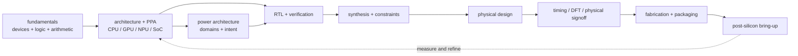

# Hardware Design — Index (chip-design-flow order)

> A research-depth technical notebook for digital IC design, CPU/GPU/NPU and AI-system architecture, and verification.
> Target roles: architecture research, RTL design, physical design, STA/signoff, DFT, verification, and performance modeling.
> Style: newcomer-accessible definitions + deep theory + implementation-reconstructable detail + measurable evidence + worked research reasoning.
>
> **Organized by the chip design flow.** The folders are numbered `00 → 07` in flow order — early PPA/architecture, frontend RTL + verification, synthesis, backend, signoff, manufacturing. Power is kept together as a cross-cutting track (02). Pages inside each folder are numbered in reading order, and every folder has its own `00_Index`. **Start with the [Chip Design Flow Overview](Chip_Design_Flow_Overview.md)** — it maps every stage, hand-off, and iteration loop.
>
> **127 flow pages** (+10 interview-prep banks).

---

## ▶ [Chip Design Flow Overview](Chip_Design_Flow_Overview.md) — read this first

The spine: spec → architecture → RTL → synthesis → backend → signoff → silicon, with the hand-off contract and cost-of-late-change at each boundary.

Use the [Research-Depth and Evidence Standard](Research_Depth_and_Evidence_Standard.md) when studying, extending, or auditing any chapter. It defines the notebook-wide requirements for terminology, causal mechanisms, derivations, counter/trace evidence, simulation validity, reproducibility, open research questions, and reconstruction of an implementable block/state/interface/verification specification.

---

## [00 · Fundamentals](00_Fundamentals/00_Index.md)
*Device physics, logic, and arithmetic the rest of the flow assumes.*

| Page | Coverage |
|------|----------|
| [01 · CMOS Fundamentals](00_Fundamentals/01_CMOS_Fundamentals.md) | MOSFET, inverter VTC, noise margins, delay, logic families, I/O signaling standards (LVCMOS/SSTL/POD/LVDS/CML), latch-up, ESD, FinFET, 6T SRAM, leakage |
| [02 · Logic Building Blocks](00_Fundamentals/02_Logic_Building_Blocks.md) | MUX, Shannon expansion, encoders/decoders, latch vs FF (transistor-level), metastability, FSMs, gray code, hazards, FIFO depth |
| [03 · Adders and Multipliers](00_Fundamentals/03_Adders_and_Multipliers.md) | half/full adder → CLA, carry-select, carry-skip, prefix (Kogge-Stone), CSA, Booth, Wallace/Dadda |
| [04 · Floating Point](00_Fundamentals/04_Floating_Point.md) | IEEE-754, add/mul pipelines, GRS + rounding modes, SRT/Newton-Raphson/Goldschmidt division, FMA microarchitecture, AI formats (BF16/FP8/MX) |
| [05 · SystemC and TLM](00_Fundamentals/05_SystemC_and_TLM.md) | SystemC discrete-event kernel (evaluate–update, delta cycles, notification phases), modules/processes/channels, bit-accurate types; TLM-2.0 generic payload, sockets, blocking/non-blocking 4-phase transport, DMI, LT/AT coding styles + temporal decoupling |

---

## [01 · Architecture and PPA](01_Architecture_and_PPA/00_Index.md)
*Explore each chip architecture as a coherent book, including its own workload, AI-serving and AI-stack implementation, performance, physical-design, PPA, simulation methods, and hardware implementation blueprints before register-transfer level (RTL) implementation. The section contains **93 chapters in 34 focused subdomains**.*

New readers should enter through the method chapter for the architecture they want to study. Each one introduces its concepts and abbreviations before applying them: [CPU methods](01_Architecture_and_PPA/01_CPU_Architecture/00_Design_Methodology/00_Index.md), [GPU methods](01_Architecture_and_PPA/02_GPU_Architecture/00_Design_Methodology/00_Index.md), [NPU methods](01_Architecture_and_PPA/03_NPU_Architecture/00_Design_Methodology/00_Index.md), or [SoC/chiplet methods](01_Architecture_and_PPA/04_SoC_and_Chiplet_Architecture/00_Design_Methodology/00_Index.md).

| Architecture book | Subdomains and ownership |
|---|---|
| [CPU Architecture](01_Architecture_and_PPA/01_CPU_Architecture/00_Index.md) | [CPU workload, DSE, PPA, and simulation methods](01_Architecture_and_PPA/01_CPU_Architecture/00_Design_Methodology/00_Index.md) → [core foundations](01_Architecture_and_PPA/01_CPU_Architecture/01_Core_Foundations/00_Index.md) → [frontend, prediction, and speculation](01_Architecture_and_PPA/01_CPU_Architecture/02_Frontend_and_Prediction/00_Index.md) → [out-of-order scheduling, wakeup, and replay](01_Architecture_and_PPA/01_CPU_Architecture/03_Out_of_Order_Backend/00_Index.md) → [cache hierarchy](01_Architecture_and_PPA/01_CPU_Architecture/04_Cache_Hierarchy/00_Index.md) → [virtual memory](01_Architecture_and_PPA/01_CPU_Architecture/05_Virtual_Memory/00_Index.md) → [coherence and consistency](01_Architecture_and_PPA/01_CPU_Architecture/06_Coherence_and_Consistency/00_Index.md) → [current core case studies](01_Architecture_and_PPA/01_CPU_Architecture/07_Core_Case_Studies/00_Index.md) → [simulation](01_Architecture_and_PPA/01_CPU_Architecture/08_Simulation/00_Index.md) → [AI workloads, serving, and CPU AI-stack implementation](01_Architecture_and_PPA/01_CPU_Architecture/09_AI_Workloads_and_Serving/00_Index.md) → [hardware implementation blueprints](01_Architecture_and_PPA/01_CPU_Architecture/10_Implementation_Blueprints/00_Index.md). Cache coherence belongs here because CPU cores create and enforce the shared-memory contract. |
| [GPU Architecture](01_Architecture_and_PPA/02_GPU_Architecture/00_Index.md) | [GPU workload, DSE, PPA, and simulation methods](01_Architecture_and_PPA/02_GPU_Architecture/00_Design_Methodology/00_Index.md) → [core architecture, operand delivery, independent-thread scheduling, and asynchronous pipelines](01_Architecture_and_PPA/02_GPU_Architecture/01_Core_Architecture/00_Index.md) → [GPU memory and high-bandwidth memory](01_Architecture_and_PPA/02_GPU_Architecture/02_Memory_System/00_Index.md) → [multi-GPU scale-up](01_Architecture_and_PPA/02_GPU_Architecture/03_Scale_Up/00_Index.md) → [GPU simulation](01_Architecture_and_PPA/02_GPU_Architecture/04_Simulation/00_Index.md) → [AI workloads, serving, and GPU AI-stack implementation](01_Architecture_and_PPA/02_GPU_Architecture/05_AI_Workloads_and_Serving/00_Index.md) → [hardware implementation blueprints](01_Architecture_and_PPA/02_GPU_Architecture/06_Implementation_Blueprints/00_Index.md). |
| [NPU Architecture](01_Architecture_and_PPA/03_NPU_Architecture/00_Index.md) | [NPU graph, mapping, DSE, PPA, and simulation methods](01_Architecture_and_PPA/03_NPU_Architecture/00_Design_Methodology/00_Index.md) → [dense, Transformer, attention, sparsity, and mixture-of-experts dataflows](01_Architecture_and_PPA/03_NPU_Architecture/01_Compute_Dataflows/00_Index.md) → [tiling, compression, decoupled access/execute, and scratchpad scheduling](01_Architecture_and_PPA/03_NPU_Architecture/02_Mapping_and_Memory/00_Index.md) → [host integration](01_Architecture_and_PPA/03_NPU_Architecture/03_System_Integration/00_Index.md) → [accelerator simulation](01_Architecture_and_PPA/03_NPU_Architecture/04_Simulation/00_Index.md) → [AI graph mapping, serving, and NPU AI-stack implementation](01_Architecture_and_PPA/03_NPU_Architecture/05_AI_Workloads_and_Serving/00_Index.md) → [hardware implementation blueprints](01_Architecture_and_PPA/03_NPU_Architecture/06_Implementation_Blueprints/00_Index.md). |
| [SoC and Chiplet Architecture](01_Architecture_and_PPA/04_SoC_and_Chiplet_Architecture/00_Index.md) | [SoC/chiplet use-case, DSE, PPA, and simulation methods](01_Architecture_and_PPA/04_SoC_and_Chiplet_Architecture/00_Design_Methodology/00_Index.md) → [full-chip modeling](01_Architecture_and_PPA/04_SoC_and_Chiplet_Architecture/01_System_Modeling/00_Index.md) → [shared DDR memory](01_Architecture_and_PPA/04_SoC_and_Chiplet_Architecture/02_Shared_Memory/00_Index.md) → [transaction protocols](01_Architecture_and_PPA/04_SoC_and_Chiplet_Architecture/03_Transaction_Protocols/00_Index.md) → [on-chip networks](01_Architecture_and_PPA/04_SoC_and_Chiplet_Architecture/04_On_Chip_Networks/00_Index.md) → [I/O and chiplets](01_Architecture_and_PPA/04_SoC_and_Chiplet_Architecture/05_IO_and_Chiplets/00_Index.md) → [DRAM simulation](01_Architecture_and_PPA/04_SoC_and_Chiplet_Architecture/06_Simulation/00_Index.md) → [heterogeneous AI workloads, serving, and platform-stack implementation](01_Architecture_and_PPA/04_SoC_and_Chiplet_Architecture/07_AI_Workloads_and_Serving/00_Index.md) → [hardware implementation blueprints](01_Architecture_and_PPA/04_SoC_and_Chiplet_Architecture/08_Implementation_Blueprints/00_Index.md). These are whole-chip composition decisions rather than detached “interconnect” topics. |

---

## [02 · Power and Low-Power](02_Power_and_Low_Power/00_Index.md)
*Cross-cutting track: power is budgeted from workloads, partitioned at architecture, captured as power intent, implemented in synthesis/backend, and verified through signoff.*

| Page | Coverage |
|------|----------|
| [01 · Power Fundamentals](02_Power_and_Low_Power/01_Power_Fundamentals.md) | switching/short-circuit/leakage physics, leakage-by-node breakdown, scaling/Dennard, sub-threshold swing |
| [02 · Block Activity and Power](02_Power_and_Low_Power/02_Block_Activity_and_Power.md) | per-block/per-mode modeling, RTL power, glitch, emulation power, on-die telemetry |
| [03 · Low-Power Architecture and Domain Partitioning](02_Power_and_Low_Power/03_Low_Power_Architecture_and_Domain_Partitioning.md) | power/voltage/clock/reset-domain strategy, AON design, boundary composition, architecture handoff |
| [04 · Power Reduction Techniques](02_Power_and_Low_Power/04_Power_Reduction_Techniques.md) | clock gating, DVFS, power gating + retention, multi-$V_t$, body biasing, operand isolation |
| [05 · UPF/CPF Power-Intent Flow](02_Power_and_Low_Power/05_UPF_and_CPF_Power_Intent.md) | IEEE 1801 and CPF, supplies, isolation, level shifting, retention, PST, RTL-to-signoff flow |
| [06 · Power Analysis and Signoff](02_Power_and_Low_Power/06_Power_Analysis_and_Signoff.md) | PrimeTime PX/Voltus flows, activity annotation, IR/EM, glitch, peak/di-dt, thermal, backside power |

---

## [03 · Frontend RTL and Verification](03_Frontend_RTL_and_Verification/00_Index.md)
*Write synthesizable RTL; prove it correct (dynamic + static).*

| Page | Coverage |
|------|----------|
| [01 · RTL Design Methodology](03_Frontend_RTL_and_Verification/01_RTL_Design_Methodology.md) | synchronous discipline, reset architecture, clocking, datapath/control split, synthesis-safe coding |
| [02 · Data Types and Basics](03_Frontend_RTL_and_Verification/02_Data_Types_and_Basics.md) | 2/4-state, arrays, structs, enums, casting |
| [03 · Procedural, Processes, and IPC](03_Frontend_RTL_and_Verification/03_Procedural_Processes_and_IPC.md) | event regions, always blocks, fork/join, scheduling, mailbox/semaphore/events |
| [04 · Clock Division and Switching](03_Frontend_RTL_and_Verification/04_Clock_Division_and_Switching.md) | even/odd/fractional dividers, div-3 FSM, programmable divider RTL, glitch-free switching, clock MUX |
| [05 · PLL, DLL, and Clock Distribution](03_Frontend_RTL_and_Verification/05_PLL_DLL_and_Clock_Distribution.md) | PFD/charge pump/VCO, lock, jitter, DLL vs PLL, H-tree/mesh distribution |
| [06 · Async Design and CDC](03_Frontend_RTL_and_Verification/06_Async_Design_and_CDC.md) | metastability/MTBF, synchronizers, async FIFO, handshakes, CDC |
| [07 · Lint, CDC & RDC Signoff](03_Frontend_RTL_and_Verification/07_Lint_CDC_RDC_Signoff.md) | static lint, structural+functional CDC, reset-domain crossing |
| [08 · OOP and Randomization](03_Frontend_RTL_and_Verification/08_OOP_and_Randomization.md) | classes, polymorphism, constraint randomization |
| [09 · Assertions and Coverage](03_Frontend_RTL_and_Verification/09_Assertions_and_Coverage.md) | immediate/concurrent SVA, functional coverage mechanics, code coverage |
| [10 · UVM Methodology](03_Frontend_RTL_and_Verification/10_UVM_Methodology.md) | components, phasing, sequences, factory, config_db, TLM, RAL, complete AXI4-Lite testbench |
| [11 · Verification Planning & Coverage Closure](03_Frontend_RTL_and_Verification/11_Verification_Planning_and_Coverage_Closure.md) | vplan, coverage taxonomy, CDV cycle, closure loop, sign-off criteria |
| [12 · Formal Verification](03_Frontend_RTL_and_Verification/12_Formal_Verification.md) | SAT/BDD, LEC, model checking, CDC formal, connectivity |
| [13 · Gate-Level Sim & Emulation](03_Frontend_RTL_and_Verification/13_Gate_Level_Sim_and_Emulation.md) | GLS (zero-delay/SDF, X-prop), emulation, FPGA prototyping |

---

## [04 · Synthesis](04_Synthesis/00_Index.md)
*RTL → gate netlist under constraints.*

| Page | Coverage |
|------|----------|
| [01 · Synthesis and Optimization](04_Synthesis/01_Synthesis_and_Optimization.md) | RTL-to-gates, technology mapping, timing closure, area/power optimization |
| [02 · Constraints (SDC)](04_Synthesis/02_Constraints_SDC.md) | clocks, generated clocks, I/O delay, the four exceptions, DRV, complete worked SDC, MCMM discipline |

---

## [05 · Backend (Physical Design)](05_Backend_Physical_Design/00_Index.md)
*Gate netlist → layout.*

| Page | Coverage |
|------|----------|
| [01 · Physical Design (PnR)](05_Backend_Physical_Design/01_Physical_Design.md) | floorplan, placement, CTS, routing, ECO, advanced nodes; hand-off to PV/SI signoff |
| [02 · Signal Integrity and Reliability](05_Backend_Physical_Design/02_Signal_Integrity_Reliability.md) | crosstalk, EM, IR drop + grid models, power grid design, thermal, aging, antenna |

---

## [06 · Signoff](06_Signoff/00_Index.md)
*Prove it's correct before tape-out.*

| Page | Coverage |
|------|----------|
| [01 · Static Timing Analysis](06_Signoff/01_STA.md) | cell delay, setup/hold, CRPR, OCV/AOCV/POCV, clock-gating checks, SDC walkthrough |
| [02 · DFT and ATPG](06_Signoff/02_DFT_and_ATPG.md) | scan, fault models, ATPG, at-speed, compression, memory BIST + March, AI-accelerator DFT |
| [03 · Physical Verification (DRC/LVS)](06_Signoff/03_Physical_Verification_DRC_LVS.md) | DRC, LVS graph-compare, ERC, antenna, density/fill, DFM |

---

## [07 · Manufacturing and Bring-up](07_Manufacturing_and_Bringup/00_Index.md)
*Fab, package, tape-out, first silicon.*

| Page | Coverage |
|------|----------|
| [01 · Fabrication Process](07_Manufacturing_and_Bringup/01_Fabrication_Process.md) | wafer→litho (DUV/EUV)→etch→implant→CMP→FinFET/GAA→BEOL, yield/DFM |
| [02 · IC Packaging](07_Manufacturing_and_Bringup/02_IC_Packaging.md) | wire bond, flip chip, WLP, 2.5D/3D, chiplets, HBM, UCIe, Foveros/SoIC |
| [03 · Tapeout & Post-Silicon Bring-up](07_Manufacturing_and_Bringup/03_Tapeout_and_Post_Silicon_Bringup.md) | GDSII hand-off, mask/OPC, respin economics, bring-up, shmoo, debug, yield ramp |

---

## [Interview Prep](interview_prep/00_Index.md)

Per-folder Q&A consolidated out of the topic pages above, plus two cross-cutting banks.

| Page | Coverage |
|------|----------|
| [00 — Fundamentals Questions](interview_prep/00_Fundamentals_Questions.md) | CMOS/logic/adders/FP interview Q&A moved out of 00_Fundamentals/ |
| [01 — Architecture and PPA Questions](interview_prep/01_Architecture_and_PPA_Questions.md) | CPU/cache/memory/NoC/bus interview Q&A moved out of 01_Architecture_and_PPA/ |
| [02 — Power and Low-Power Questions](interview_prep/02_Power_and_Low_Power_Questions.md) | domain partitioning, reduction, UPF/CPF, DVFS, and signoff interview drills |
| [03 — Frontend RTL and Verification Questions](interview_prep/03_Frontend_RTL_and_Verification_Questions.md) | RTL/UVM/CDC/formal interview Q&A moved out of 03_Frontend_RTL_and_Verification/ |
| [04 — Synthesis Questions](interview_prep/04_Synthesis_Questions.md) | synthesis/SDC interview Q&A moved out of 04_Synthesis/ |
| [05 — Backend Physical Design Questions](interview_prep/05_Backend_Physical_Design_Questions.md) | PnR/SI interview Q&A moved out of 05_Backend_Physical_Design/ |
| [06 — Signoff Questions](interview_prep/06_Signoff_Questions.md) | STA/DFT interview Q&A moved out of 06_Signoff/ |
| [07 — Manufacturing and Bring-up Questions](interview_prep/07_Manufacturing_and_Bringup_Questions.md) | fab/packaging/bring-up interview Q&A moved out of 07_Manufacturing_and_Bringup/ |
| [RTL Coding Questions](interview_prep/08_RTL_Coding_Questions.md) | whiteboard canon with full SystemVerilog solutions |
| [Hardware Interview Questions](interview_prep/09_Hardware_Interview_Questions.md) | worked numeric problems + snap answers per domain |
