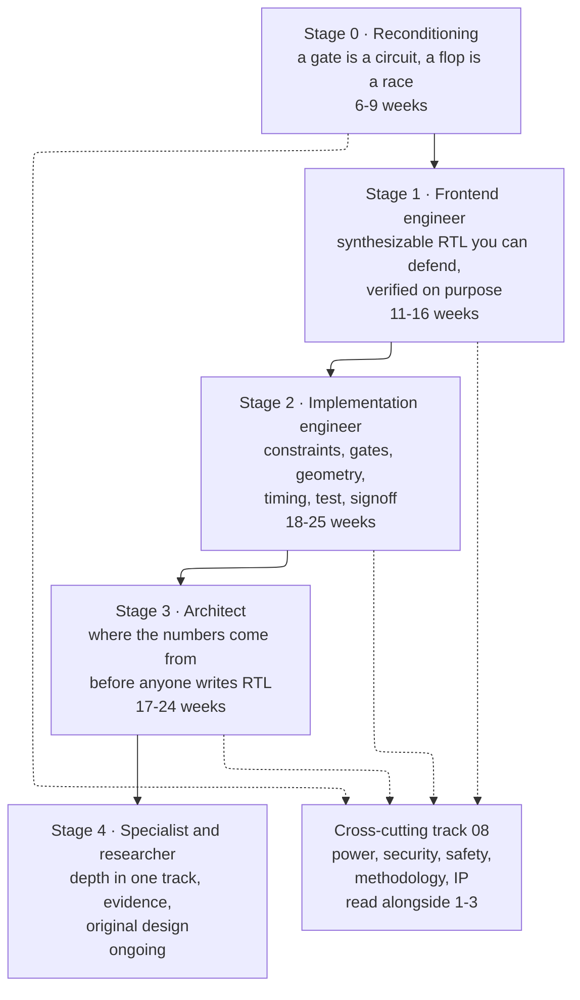

# Start Here — the Learning Path from a Digital-Design Course to Chip Design

> **Prerequisites:** one undergraduate digital-design course. Concretely: Boolean algebra, Karnaugh maps, combinational and sequential logic, finite-state machines (FSMs), and enough Verilog or VHDL to have simulated a counter. Nothing else.
> **Hands off to:** every other page. This one tells you which order to read them in, what to build after each block of reading, and how to know you actually learned it.
> **Companions:** [Concept Dependency Map](Concept_Dependency_Map.md) (which idea requires which), [Glossary](Glossary.md) (every acronym, defined once), [Chip Design Flow Overview](Chip_Design_Flow_Overview.md) (the flow this path walks).

---

## 0. Why this page exists

This notebook contains roughly two hundred pages written at the depth a working engineer or a researcher needs. That depth is the point, and it is also a wall. A reader who opens [Out-of-Order Execution](01_Architecture_and_PPA/01_CPU_Architecture/03_Out_of_Order_Backend/01_OoO_Execution.md) first will meet a register alias table, a physical register file, and a reorder buffer in the first two paragraphs and conclude — wrongly — that the material is beyond them. It is not beyond them. It is *downstream* of about six things they have not read yet.

The gap between "I passed digital logic" and "I can design digital hardware" is not a gap in intelligence or in effort. It is a gap in **which constraints you have been allowed to ignore.** A digital-design course hands you a world where gates are free, wires are instantaneous, clocks are perfect, area is unbounded, power does not exist, manufacturing always works, and the only question is whether the truth table is right. Every one of those is false in silicon, and each falsehood generates an entire discipline: timing analysis, physical design, power architecture, design-for-test, signoff, reliability. **The whole of chip design is the systematic removal of the simplifications your first course made.**

So this page is not a table of contents. It is a **sequence of constraint removals**, ordered so that each one is motivated by a failure you can already understand at the time you meet it. Each stage below states what you must already be able to do, what constraint it removes, exactly which pages to read in which order, what to build with your hands, and a set of questions you must be able to answer without looking. If you cannot answer the exit questions, the next stage will not stick — that is not a moral judgment, it is how the dependency graph works.

Two honest warnings before you start. First, **the time estimates are for deliberate study, not for reading.** A page in this notebook takes two to four hours to actually absorb — meaning you re-derive its equations on paper and work its problems — versus twenty minutes to skim. Skimming produces the feeling of learning and none of it. Second, **nobody becomes expert in all of this.** The field has specialized into frontend design, verification, physical implementation, and architecture, and a strong engineer is deep in one and literate in the rest. The path below builds the literacy for everyone and then forks (§8). Expert means deep in one track *plus* able to reason about what your decisions cost the others — that second half is what this notebook exists for.

---

## 1. What your course taught you, and the six lies it let you keep

Every item in the left column is a true and useful abstraction. Every item in the right column is the reason a discipline exists. This table is the syllabus of the entire notebook, compressed.

| What the course said | What silicon says | The discipline that resolves it | Where it is removed |
|---|---|---|---|
| A gate is a Boolean function. | A gate is a network of transistors with finite drive, input capacitance, threshold voltage, leakage, and a delay that depends on its load and on how fast its input arrived. | Circuit-level design and library characterization | [CMOS Fundamentals](00_Fundamentals/01_CMOS_Fundamentals.md), [Standard-Cell Libraries](04_Synthesis/03_Standard_Cell_Libraries_and_Characterization.md) — Stage 0 |
| Wires connect things. | Wires have resistance and capacitance, couple to their neighbors, dominate delay at advanced nodes, consume the routing resource that limits how dense your design can be, and fail by electromigration. | Physical design, signal integrity, extraction | [Physical Design](05_Backend_Physical_Design/01_Physical_Design.md), [Routing and Extraction](05_Backend_Physical_Design/06_Routing_and_Parasitic_Extraction.md) — Stage 2 |
| The clock arrives everywhere at once. | The clock is a physical network with insertion delay, skew, jitter, and a power bill that is 20–35% of the chip's dynamic power for the network alone, and 35–50% once each flop's internal clock inverters are counted. Two flops in the same design see different clock edges. | Clock tree synthesis, static timing analysis | [Clock Tree Synthesis](05_Backend_Physical_Design/05_Clock_Tree_Synthesis.md), [STA](06_Signoff/01_STA.md) — Stage 1–2 |
| The design either works or it doesn't. | The design works at some voltages, temperatures, and process outcomes and not others; correctness is a claim over a space of corners, and it is *proved* by analysis rather than observed by simulation. | Corners, derating, signoff | [STA](06_Signoff/01_STA.md), [Signoff Orchestration](06_Signoff/04_Signoff_Orchestration_ECO_and_Tapeout_Readiness.md) — Stage 2 |
| Area is a number in a report. | Area is money, and power is a thermal and battery constraint that is often *the* binding one; both are budgeted before a line of RTL is written. | PPA, power architecture | [Power Fundamentals](02_Power_and_Low_Power/01_Power_Fundamentals.md), [Low-Power Architecture](02_Power_and_Low_Power/03_Low_Power_Architecture_and_Domain_Partitioning.md) — Stage 0–3 |
| If the testbench passes, you're done. | You cannot simulate your way to confidence on a design with $2^{10^6}$ states; you need coverage models, constrained randomization, assertions, formal proof, and a plan that says when you are allowed to stop. And after all that, the chip must still be *testable on a tester* after manufacture. | Verification methodology, DFT | [Verification Planning](03_Frontend_RTL_and_Verification/11_Verification_Planning_and_Coverage_Closure.md), [DFT and ATPG](06_Signoff/02_DFT_and_ATPG.md) — Stage 1–2 |

There is a seventh lie that is subtler and that catches good students hardest: **the course let you believe a design is something one person writes.** A real chip is 70–90% integrated IP, assembled by a team of dozens under a schedule, with a hand-off contract at every boundary. This one is removed in pieces rather than at a single point. [Design Methodology and EDA Infrastructure](08_Cross_Cutting_Engineering/03_Design_Methodology_and_EDA_Infrastructure.md) §13 is used from **Stage 0** onward, because it is the toolchain every build project in this page runs on; the same page's material on repositories, regressions, reviews, and release discipline becomes the point rather than the means in **Stage 3**, alongside [IP Reuse and Integration](08_Cross_Cutting_Engineering/04_IP_Reuse_Integration_and_Register_Automation.md). That staggering is deliberate: you need the tools long before you need the organisation that runs them.

---

## 2. The map

The solid arrows are hard dependencies: Stage 2's timing analysis is unintelligible without Stage 1's synchronous discipline, and Stage 3's PPA reasoning is guesswork without Stage 2's knowledge of what things actually cost. The dotted arrows are soft: the cross-cutting material in folder 08 and folder 02 should be interleaved, not deferred, because power and testability are decisions you make *while* designing, not after. The dotted arrow from Stage 0 is there because you install the open-source toolchain from [Design Methodology §13](08_Cross_Cutting_Engineering/03_Design_Methodology_and_EDA_Infrastructure.md) before the very first build project — the cross-cutting track starts on day one, it just deepens later.

**Total elapsed time to the end of Stage 3, at 10–15 focused hours per week: roughly 12 to 17 months.** That is the honest number, and it is arithmetic rather than a guess: the hour column in every table below is derived from the target page's actual length at a stated rate, and §10 shows the sum. It went *up* at the last recalibration for two reasons — nine substantial pages were added to the notebook and had to be placed, and Stage 3 is now computed by the same word-count rule as the others instead of being asserted. It is faster with a job that forces daily practice, and slower without hands-on tool access. Nothing about this is a race — a person who spends two years and can derive every result is in a far better position than one who spends four months and recognizes vocabulary.

**What "read this" means, now that there are 154 flow pages.** A path that implies you read all of them is a lie. The notebook is about 1.4 million words; at the rate in §10 that is 1,400 to 2,000 hours, and no working engineer has read their own reference cover to cover. So every reading list below is in two parts. The numbered rows are the **required core** — the material the next stage is genuinely not derivable without, and the only material the hour totals count. Each stage from 1 onward then ends with a **return when you need it** table: whole pages, or named sections of pages, that are fully part of the field and deliberately not part of the on-ramp. They carry their hours so you can see what they cost the day your work asks for them. Across the three shelves there are eighteen distinct entries totalling 388–544 hours — more than any single stage — which is simply the shape of a reference as opposed to a curriculum.

The rule for using the shelf is one sentence: **a shelf entry becomes required the moment a project, a job, or an interview makes it required, and not one day before.** Reading it early is not virtuous. It is the vocabulary-collecting failure of §11 wearing a more diligent-looking hat.

---

## 3. Stage 0 — Reconditioning: a gate is a circuit, a flop is a race

**Entry check.** You can write a synchronous counter in Verilog, draw an FSM state diagram, and minimize a four-variable function.

**The constraint being removed:** that gates and wires are free and instantaneous.

**Why this stage exists.** Almost every misconception that hurts later comes from treating a flip-flop as an atom. The moment you see that a flip-flop is two latches, that a latch is cross-coupled inverters, and that "setup time" is a statement about a *race between the data path and the internal feedback path*, the entire timing edifice becomes derivable rather than memorized. People who skip this stage spend years reciting `T ≥ t_cq + t_logic + t_setup` without being able to say why the inequality has that shape or why hold violations do not care about the clock period.

**Read in this order:**

| # | Page | What to take from it | Hours |
|---|---|---|---|
| 1 | [Chip Design Flow Overview](Chip_Design_Flow_Overview.md) | The map. Read it once now and again at the end of every stage; it means something different each time. | 2–3 |
| 2 | [CMOS Fundamentals](00_Fundamentals/01_CMOS_Fundamentals.md) | MOSFET as a switch with finite resistance; the inverter voltage-transfer curve and noise margin; RC delay and why delay depends on load; dynamic, short-circuit, and leakage power; FinFET; logical effort applied to a path; the 6T SRAM cell. | 9–13 |
| 3 | [Logic Building Blocks](00_Fundamentals/02_Logic_Building_Blocks.md) | Logical effort; multiplexers and Shannon expansion; **latch vs flip-flop at the transistor level**; metastability and mean-time-between-failures (MTBF); FSM encodings; hazards; FIFO depth. This is the most important single page in Stage 0. | 17–23 |
| 4 | [Adders and Multipliers](00_Fundamentals/03_Adders_and_Multipliers.md) | Why a ripple adder is slow, how carry-lookahead and prefix networks buy delay with area, carry-save, Booth, Wallace. The first place you *feel* an area/delay trade. | 7–10 |
| 5 | [Floating Point](00_Fundamentals/04_Floating_Point.md) — §§1–7 and §§9–10 | The exponent-vs-significand budget; ULP and machine epsilon; subnormals; round-to-nearest-even and the guard/round/sticky summary; catastrophic cancellation and why the FMA exists; why a significand multiplier costs roughly width-squared; the AI-format landscape. **§8 builds the complete unit gate by gate — skip it now and return when you need to build one.** | 5–7 |
| 6 | [Memory Circuits and Technologies](00_Fundamentals/06_Memory_Circuits_and_Technologies.md) | Why arrays are not built from flops; the SRAM read-disturb vs write-margin conflict; sense amplifiers; memory compilers; ECC; DRAM's destructive read and where every DDR timing parameter comes from. The longest page in Stage 0 and worth its length. | 23–32 |
| 7 | [Power Fundamentals](02_Power_and_Low_Power/01_Power_Fundamentals.md) | $P = \alpha C V^2 f$ derived, not quoted; short-circuit and leakage components; why Dennard scaling ended and what that did to the field. | 5–7 |

**Build this.** Install Verilator or Icarus Verilog and a waveform viewer (GTKWave or Surfer) — the toolchain section of [Design Methodology and EDA Infrastructure](08_Cross_Cutting_Engineering/03_Design_Methodology_and_EDA_Infrastructure.md) §13 lists exactly what to install and how. Then:

1. Write a parameterized ripple-carry adder and a Kogge-Stone adder. Simulate both against a random-vector checker. You are not measuring speed yet — you are proving to yourself that two structurally different circuits compute the same function.
2. Write a synchronizer chain and a testbench that deliberately violates setup on the first stage. Watch what your simulator does. Then read the metastability section again and articulate why the simulator's behavior is a *lie* about real silicon.
3. Hand-draw the transistor schematic of a 6T SRAM cell and annotate which transistor fights which during a read and during a write.

**Exit check — answer without looking:**

1. Why does a NAND gate have a smaller area than a NOR gate for the same drive strength, and what does that imply about which one a synthesis tool prefers?
2. A flip-flop's setup time is specified as 40 ps. What physical event *inside the flop* is that 40 ps measuring, and why is missing it by 1 ps not the same kind of event as missing it by 100 ps? (How the 40 ps is *characterized* — the library's clock-to-Q degradation criterion — is Stage 2, [Libraries §3](04_Synthesis/03_Standard_Cell_Libraries_and_Characterization.md); you should be able to answer this one from the flop's internals alone.)
3. Why does a hold violation not depend on the clock period?
4. You double a net's capacitance. What happens to delay, to dynamic energy per transition, and to leakage? Explain each separately.
5. Why can a 1 Mbit array not be made from flip-flops, and roughly where is the crossover?

---

## 4. Stage 1 — The frontend engineer: RTL you can defend, verified on purpose

**Entry check.** You passed Stage 0's exit questions, and you can explain a flip-flop's internals.

**The constraint being removed:** that "it simulates correctly" is the same as "it is a correct design."

**Why this stage exists.** There are two distinct skills here and they are usually taught as one. The first is **synchronous design discipline** — a set of rules about clocks, resets, and domain boundaries that exist because violating them produces hardware that fails intermittently and un-debuggably. The second is **verification as an engineering discipline with a stopping criterion**, which is the actual job of the majority of people who work on chips. Treat verification as an afterthought here and you will be permanently limited, because verification is where the industry's headcount and most of its intellectual difficulty live.

**Read in this order.** Interleave the two columns — do not do all of design then all of verification; do 1a–4a, then 1b–2b, then continue.

**Design track:**

| # | Page | What to take from it | Hours |
|---|---|---|---|
| 1a | [RTL Design Methodology](03_Frontend_RTL_and_Verification/01_RTL_Design_Methodology.md) | The synchronous contract; reset architecture (sync vs async vs async-assert/sync-deassert) and why the choice is architectural; datapath/control separation; the coding rules that make inference predictable. | 6–8 |
| 2a | [Data Types and Basics](03_Frontend_RTL_and_Verification/02_Data_Types_and_Basics.md) | 2-state vs 4-state; **X-optimism and X-pessimism** — the single most commonly misunderstood thing in RTL; nets vs variables; packed vs unpacked. | 6–8 |
| 3a | [Procedural, Processes, and IPC](03_Frontend_RTL_and_Verification/03_Procedural_Processes_and_IPC.md) | The event-region scheduler. Once you understand the active/inactive/NBA regions, the blocking-vs-nonblocking rule stops being folklore and becomes a theorem. | 5–7 |
| 4a | [RTL Design Patterns](03_Frontend_RTL_and_Verification/14_RTL_Design_Patterns.md) | Pipelining and retiming, FSMD, parameterization, the cookbook (counters, shifters, LFSRs, priority encoders, round-robin arbiters). | 4–6 |
| 5a | [Flow Control and FIFOs](03_Frontend_RTL_and_Verification/15_Flow_Control_and_FIFOs.md) | valid/ready, the skid buffer, credit-based flow control, back-pressure through a pipeline. This is the vocabulary of every real interface. | 5–7 |
| 6a | [DSP and Fixed-Point Hardware](00_Fundamentals/07_DSP_and_Fixed_Point_Hardware.md) — §§1–4 and §11 | Where a datapath's bit widths *come from*: deriving the format instead of guessing it, quantization noise as a budget, guard bits and saturation, the FIR as the canonical datapath, and the bridge to AI quantization. Read this **before** 7a — it is where 7a's Q-format material is derived. §§5–10 (CORDIC, IIR, division, FFT) are excellent and can wait until a project needs them. | 7–9 |
| 7a | [Arithmetic and Memory RTL](03_Frontend_RTL_and_Verification/16_Arithmetic_and_Memory_RTL.md) | Q-format, saturation, rounding, RAM inference and read-during-write, register files, control/status registers. | 5–7 |
| 8a | [Clock Division and Switching](03_Frontend_RTL_and_Verification/04_Clock_Division_and_Switching.md) | Dividers, glitch-free clock muxing, integrated clock gating. Where "just gate the clock with an AND" becomes visibly wrong. | 6–9 |
| 9a | [PLL, DLL and Clock Distribution](03_Frontend_RTL_and_Verification/05_PLL_DLL_and_Clock_Distribution.md) | Where the clock you have been dividing actually comes from: the PLL as a feedback loop, loop bandwidth and damping, the jitter budget and which noise the loop filters, VCO trade-offs, the DLL and when to prefer it, and distribution to millions of endpoints. The jitter number you will later subtract in every setup equation is derived here. | 6–8 |
| 10a | [Async Design and CDC](03_Frontend_RTL_and_Verification/06_Async_Design_and_CDC.md) | Metastability and MTBF quantified; two-flop synchronizers and what they do *not* solve; gray coding; handshakes; the asynchronous FIFO derived in full. | 6–9 |
| 11a | [Lint, CDC and RDC Signoff](03_Frontend_RTL_and_Verification/07_Lint_CDC_RDC_Signoff.md) | Static checking as a gate, structural vs functional CDC, reset-domain crossing. | 5–7 |
| 12a | [Privileged Architecture, CSRs, and Traps](01_Architecture_and_PPA/01_CPU_Architecture/01_Core_Foundations/04_Privileged_Architecture_CSRs_and_Traps.md) — §3, §4, and §§14–15 | The CSR address space, and why a CSR access has to be an *atomic* read-modify-write; then **WPRI, WLRL, and WARL** — the three field semantics that every real register specification is written in — with write-1-to-clear, sticky bits, side effects on read, and the reset-value contract; then how a register map is generated from one machine-readable source and what a compliance suite can and cannot see. Placed here rather than in Stage 3 because this is the specification *language* that build project 5 below is a toy version of, and because an RTL or DV engineer writes a register model against exactly these rules in their first month. Trap delivery and the rest of the privileged machinery (§§5–9) belong to Stage 3; the remainder is on the shelf. | 9–13 |

**Verification track:**

| # | Page | What to take from it | Hours |
|---|---|---|---|
| 1b | [Assertions and Coverage](03_Frontend_RTL_and_Verification/09_Assertions_and_Coverage.md) | Immediate vs concurrent SVA; assert/assume/cover as three different claims; functional vs code coverage and why 100% code coverage means very little. | 6–8 |
| 2b | [OOP and Randomization](03_Frontend_RTL_and_Verification/08_OOP_and_Randomization.md) | Classes and polymorphism in a testbench; constrained randomization; `rand` vs `randc`; why randomization without coverage is noise. | 5–7 |
| 3b | [UVM Methodology](03_Frontend_RTL_and_Verification/10_UVM_Methodology.md) | Components and phasing, sequences, factory, `config_db`, TLM, and the register abstraction layer, each derived from the reuse problem it solves. §10 then connects those pieces into an **AXI4-Lite write-agent skeleton**, traced from sequence to pins and back for a single transaction — a spine to build on, not a finished testbench. It is a compact page; the hours go into building the environment in the projects below, not into reading it. | 6–8 |
| 4b | [Verification Planning and Coverage Closure](03_Frontend_RTL_and_Verification/11_Verification_Planning_and_Coverage_Closure.md) | The verification plan as a contract; coverage taxonomy; the coverage-driven loop; **the stopping criterion**. | 5–7 |
| 5b | [Formal Verification](03_Frontend_RTL_and_Verification/12_Formal_Verification.md) | SAT/BDD, bounded model checking vs k-induction vs IC3/PDR, logic equivalence checking, where formal beats simulation and where it collapses. | 7–10 |

**Cross-cutting, read alongside:** [Block Activity and Power](02_Power_and_Low_Power/02_Block_Activity_and_Power.md) and [Power Reduction Techniques](02_Power_and_Low_Power/04_Power_Reduction_Techniques.md), so that clock gating and operand isolation enter your hands as RTL habits rather than as someone else's later problem. Also [Design Methodology and EDA Infrastructure](08_Cross_Cutting_Engineering/03_Design_Methodology_and_EDA_Infrastructure.md) §1 — who owes what to whom on a real project, and the milestone ladder your RTL will be judged against — and its §10 on design reviews, whose §10.3 is a concrete RTL review checklist. Read that checklist *before* project 1 and run it against your own code every time. Reviewing RTL is a separate skill from writing it, it is a large fraction of what a senior engineer's week actually contains, and Stage 2 asks you to do it to someone else's design.

**Return when you need it (Stage 1 shelf).** Not required to pass the exit check, and not counted in the Stage 1 total.

| Page or sections | Who needs it, and when | Hours |
|---|---|---|
| [Privileged Architecture, CSRs, and Traps](01_Architecture_and_PPA/01_CPU_Architecture/01_Core_Foundations/04_Privileged_Architecture_CSRs_and_Traps.md) — §§1–2 and §§10–13 | Why a privileged architecture exists at all and the Arm/RISC-V level comparison; then physical memory protection, performance counters as architected state, virtualization's second layer, and Arm's system-register model. Return when you verify a core rather than a block, or when you write firmware. §§5–9 are not here — they are required in Stage 3 row 7. | 15–21 |
| [Floating Point](00_Fundamentals/04_Floating_Point.md) — §8 | The complete FP unit built gate by gate. Return when you have to build one. Flagged inline at Stage 0 row 5. | 9–13 |
| [DSP and Fixed-Point Hardware](00_Fundamentals/07_DSP_and_Fixed_Point_Hardware.md) — §§5–10 | CORDIC, IIR structures, division, the FFT. Return when a project needs one of them. Flagged inline at row 6a. | 9–13 |

**Build this.** Each project should be verified with a self-checking testbench, assertions, and a coverage model — not with waveform-staring.

1. **A synchronous FIFO, then an asynchronous FIFO.** Write SVA properties for "never overflow", "never underflow", "data is FIFO-ordered". Prove the synchronous one with a formal tool (SymbiYosys) and simulate the asynchronous one. The gap between what you can prove and what you can only simulate is the lesson.
2. **A valid/ready pipeline with a skid buffer**, then break the back-pressure on purpose and write the assertion that catches it.
3. **A UART receiver with 16× oversampling** (see [High-Speed I/O and Peripheral Protocols](01_Architecture_and_PPA/04_SoC_and_Chiplet_Architecture/05_IO_and_Chiplets/03_High_Speed_IO_and_Peripheral_Protocols.md) §9 for the baud-tolerance derivation) and an SPI master. Real, small, interface-shaped.
4. **A small UVM environment** around one of the above: driver, monitor, scoreboard, sequence, coverage. Do not skip this because it feels like software — it *is* software, and it is the job.
5. **A control/status register block** with read-write, read-only, and write-1-to-clear fields, and an interrupt with separate status, enable, and mask. Then read [IP Reuse and Register Automation](08_Cross_Cutting_Engineering/04_IP_Reuse_Integration_and_Register_Automation.md) §6 and regenerate it from a machine-readable description instead.

**Exit check:**

1. Your design has an active-low asynchronous reset. What goes wrong at reset *de*-assertion, what is the fix, and why does the fix have to be per-clock-domain?
2. A two-flop synchronizer protects a single control bit. Explain precisely why it does not protect a 32-bit bus, and give two correct alternatives with their costs.
3. What does `assume` mean to a formal tool, and what is the failure mode of an over-constrained `assume`?
4. Your regression is at 100% statement coverage and 62% functional coverage. What does each number tell you, and which one may you use to argue you are done?
5. Write, from memory, an SVA property saying "every request is granted within 8 cycles, and no grant occurs without a pending request."
6. Why does gating a clock with a plain AND gate produce glitches, and what does an integrated clock-gating cell do differently?
7. A specification says a 4-bit field is WARL with legal values 0, 2, and 7. Software writes 5. State every behaviour the implementation is allowed to have, and write the check that distinguishes a legal implementation from a broken one.

---

## 5. Stage 2 — The implementation engineer: constraints, gates, geometry, and proof

**Entry check.** You can write and verify a nontrivial block, and you can explain the synchronous contract and CDC without notes.

**The constraint being removed:** that RTL is the design. It is not; it is a *specification of intent* that a chain of tools lowers to geometry, and every step of that chain can refuse.

**Why this stage exists.** This is where most self-taught engineers stop, and it is exactly the material that separates someone who writes RTL from someone who ships silicon. It is the part of the flow that is hardest to learn without a job, which is why it is the most heavily built-out part of the notebook. Read it even if you intend to be a verification engineer or an architect: a verification engineer who does not know what gate-level simulation is checking, or an architect who does not know why their proposed 8-read-port register file is physically absurd, is limited in a way that shows.

**This stage is long enough to need a midpoint.** At 18–25 weeks it is the largest block in the path by a wide margin, and reading it as one undifferentiated list is how people stall in it. It divides cleanly in two, and the division is not cosmetic — it is the netlist. **Block 2A (rows 1–6) takes RTL to a gate netlist you can defend**, and ends at a checkpoint you can state: you can write the constraints, read the synthesis reports, and say what the design costs in gates and where its critical path is. **Block 2B (rows 7–23) takes that netlist to geometry, power intent, and a signoff package.** If you need to pause, pause between them — 2A is a coherent competence on its own, and it is the half a verification engineer or an architect can stop at without being crippled. 2B is where you become someone who ships.

**Read in this order.** *Block 2A — to a netlist you can defend:*

| # | Page | What to take from it | Hours |
|---|---|---|---|
| 1 | [Timing Constraints (SDC)](04_Synthesis/02_Constraints_SDC.md) | Constraints as the formal specification of timing intent; clocks and generated clocks; I/O delay; the four exceptions; the two ways to be wrong. **Read this before synthesis**, because synthesis is meaningless without it. | 4–6 |
| 2 | [STA](06_Signoff/01_STA.md) | The exhaustiveness argument; the timing graph; setup and hold derived from first principles; skew, jitter, insertion delay, CPPR; OCV/AOCV/POCV; corners. A short, dense page that is almost all derivation — its ideas are re-used by rows 8–16, so it repays a second pass more than a slow first one. | 5–7 |
| 3 | [Standard-Cell Libraries and Characterization](04_Synthesis/03_Standard_Cell_Libraries_and_Characterization.md) | What a cell physically is; the library views and why they must agree; how a `.lib` number is made; NLDM interpolation; CCS/ECSM; arcs; the corner explosion; Vt flavors. This page is the reason the previous two have numbers in them. | 12–17 |
| 4 | [Logic Synthesis](04_Synthesis/01_Synthesis_and_Optimization.md) | Synthesis as a compiler; the four stages and why the order is forced; technology mapping as covering; retiming; the timing/area/power Pareto surface. | 4–6 |
| 5 | [Synthesis Flow and QoR Closure](04_Synthesis/04_Synthesis_Flow_and_QoR_Closure.md) | The actual run: files in, files out, a real script, elaboration warnings, compile strategy, hierarchical budgeting, DFT-aware and power-aware compile, **reading the reports**, the triage playbook, LEC as a gate. | 12–16 |
| 6 | [Physical Synthesis and Design Planning](04_Synthesis/05_Physical_Synthesis_and_Design_Planning.md) | Why the wireload model died; partitioning; die-size estimation — §4 is a full worked estimate, and estimating before you build is the professional habit this stage exists to install; budgets across partitions; congestion prediction; the hand-off package. | 10–14 |

*Checkpoint.* You can write an SDC from a specification, run synthesis, read the reports, and quote your block's area, its worst path, and what you would trade to fix it. If you cannot, 2B will be tool operation rather than engineering.

*Block 2B — to geometry, power intent, and a signoff package:*

| # | Page | What to take from it | Hours |
|---|---|---|---|
| 7 | [Physical Design](05_Backend_Physical_Design/01_Physical_Design.md) | The concept-level tour of floorplan → place → CTS → route, and why timing is fiction until there is geometry. | 5–7 |
| 8 | [Floorplanning and Power Planning](05_Backend_Physical_Design/03_Floorplanning_and_Power_Planning.md) | The least reversible decision on a chip; utilization and routability; macro placement; the power grid derived from a current budget; multi-voltage floorplanning. | 10–15 |
| 9 | [Placement, Legalization, and Optimization](05_Backend_Physical_Design/04_Placement_Legalization_and_Optimization.md) | The three phases; HPWL as a proxy; legalization; in-place optimization; buffer insertion theory; congestion; scan reordering. | 9–12 |
| 10 | [Clock Tree Synthesis](05_Backend_Physical_Design/05_Clock_Tree_Synthesis.md) | Ideal clock becomes real: what changes in the inequalities; tree structures; balancing; gating in the tree; **useful skew derived**; CTS and OCV; post-CTS hold fixing. | 10–14 |
| 11 | [Routing and Parasitic Extraction](05_Backend_Physical_Design/06_Routing_and_Parasitic_Extraction.md) | The metal stack as a resource; the routing graph; vias; advanced-node rules; antenna; extraction physics; SPEF; Elmore; RC corners. The longest page in Stage 2. | 18–25 |
| 12 | [Signal Integrity and Reliability](05_Backend_Physical_Design/02_Signal_Integrity_Reliability.md) | Crosstalk, IR drop, electromigration, aging, antenna — the ways a physically correct design still fails. | 4–6 |
| 13 | [DFT and ATPG](06_Signoff/02_DFT_and_ATPG.md) | Scan as the conversion of a sequential test problem into a combinational one; fault models; ATPG; at-speed test; compression; MBIST. | 6–8 |
| 14 | [Gate-Level Sim and Emulation](03_Frontend_RTL_and_Verification/13_Gate_Level_Sim_and_Emulation.md) | What GLS catches that RTL simulation cannot; SDF; X-propagation; emulation and FPGA prototyping. | 4–6 |
| 15 | [Physical Verification (DRC/LVS)](06_Signoff/03_Physical_Verification_DRC_LVS.md) | Two proofs, because there are two ways to be wrong. | 4–6 |
| 16 | [Signoff Orchestration, ECOs, and Tape-out Readiness](06_Signoff/04_Signoff_Orchestration_ECO_and_Tapeout_Readiness.md) | Signoff as a scheduling problem; MMMC; the ECO taxonomy; metal-only ECO mechanics; waivers; the readiness checklist. One of the two longest pages in the stage, and the one that reads most like the job. | 16–22 |
| 17 | [Interrupt Architecture](01_Architecture_and_PPA/04_SoC_and_Chiplet_Architecture/05_IO_and_Chiplets/05_Interrupt_Architecture.md) — §§2–3 and §9 | The eight-hop delivery path and where its nanoseconds actually go; level versus edge, the detectors in RTL, and why the synchronizer on an asynchronous device pin is not optional; then latency as a budget with levers you can move rather than a number you quote. Placed in this stage, not in Stage 3, because an interrupt is the one signal that crosses every boundary this stage owns — a clock domain, a power domain, and the fabric — and because §9 is the first place a reader builds a *system* latency out of the per-stage costs Stage 2 taught them. The controller architectures and the failure catalogue are on the shelf. | 5–7 |
| 18 | [AMBA Family Signals and Low-Power Interfaces](01_Architecture_and_PPA/04_SoC_and_Chiplet_Architecture/03_Transaction_Protocols/02_AMBA_Family_Signals_and_Low_Power_Interfaces.md) — §§8–10 | Q-Channel derived from the problem it solves (a controller cannot see inside a component), its four signals and complete state machine, **the deny path and why it must exist**, then P-Channel for components with more than two states, and §10's map from these handshakes onto the power state table of the row below. This is the missing mechanism between power intent and RTL: a domain does not simply stop, something has to ask it to, and it is allowed to say no. | 7–9 |
| 19 | [UPF/CPF Power Intent](02_Power_and_Low_Power/05_UPF_and_CPF_Power_Intent.md) — §§1–10 | Power intent as a specification orthogonal to function; domains and supply sets; isolation, level shifting, and retention each derived from the corruption they prevent; the power state table as the thing that collapses the state explosion into a verification contract; the end-to-end flow from architecture to signoff; and then §10, which is the UPF language itself as a working file you can read line by line. Row 18 is the handshake; this row is the contract. | 14–20 |
| 20 | [Power Analysis and Signoff](02_Power_and_Low_Power/06_Power_Analysis_and_Signoff.md) | How power is finally proved rather than estimated: vectorless versus annotated analysis, the peak-versus-average distinction, and the signoff criteria. | 5–7 |
| 21 | [Fabrication Process](07_Manufacturing_and_Bringup/01_Fabrication_Process.md) | Lithography and why it is the problem the field orbits; multi-patterning vs EUV; variation as a distribution; yield, $D_0$, and the economics that decide die size. | 6–8 |
| 22 | [IC Packaging](07_Manufacturing_and_Bringup/02_IC_Packaging.md) | The four jobs of a package; wire-bond vs flip-chip; power delivery into a hundred-amp load; the thermal stack; the reticle-and-yield inflection that produced chiplets; 2.5D and 3D. | 5–7 |
| 23 | [Tape-out and Post-Silicon Bring-up](07_Manufacturing_and_Bringup/03_Tapeout_and_Post_Silicon_Bringup.md) | What happens when the chip comes back: §4's bring-up ladder, §5 on debugging under an observability collapse, and §6's shmoo as a diagnostic — this is the notebook's account of **debugging silicon**, and it is the last constraint your course let you ignore, namely that the thing you must debug is now a physical object you cannot single-step. Short, and a map of post-silicon rather than a manual for it. | 3–4 |

**Return when you need it (Stage 2 shelf).** Not required to pass the exit check, and not counted in the Stage 2 total.

| Page or sections | Who needs it, and when | Hours |
|---|---|---|
| [UPF/CPF Power Intent](02_Power_and_Low_Power/05_UPF_and_CPF_Power_Intent.md) — §§11–13 | §11's simulation semantics, §12's successive refinement and the Liberty side, §13's CPF walkthrough and failure catalogue. Return the first time a power-aware simulation hands you an X you cannot trace to a strategy, or the first time you inherit a CPF flow. | 11–16 |
| [Interrupt Architecture](01_Architecture_and_PPA/04_SoC_and_Chiplet_Architecture/05_IO_and_Chiplets/05_Interrupt_Architecture.md) — §1, §§4–8, §§10–15 | Message-signalled interrupts, GICv3/v4 and the RISC-V PLIC/CLIC/AIA families in product depth, preemption and tail-chaining, affinity and IPIs, the failure catalogue, interrupts and power, security, and §14's design-and-verify chapter. Return when you own a controller, write a driver, or have to defend a real-time latency figure. | 31–44 |
| [AMBA Family Signals and Low-Power Interfaces](01_Architecture_and_PPA/04_SoC_and_Chiplet_Architecture/03_Transaction_Protocols/02_AMBA_Family_Signals_and_Low_Power_Interfaces.md) — §§1–7, §§11–14 | The full family map, `AxCACHE`/`AxPROT`/`AxLOCK`/`AxQOS` bit by bit, exclusive access and atomics, burst and strobe corner cases, the ordering guarantees and the ID-reuse deadlock, AXI4-Stream, the coherence signal groups, and §13's verification chapter. Required for the RTL/DV and architecture tracks in Stage 3; genuinely optional for physical design. | 27–37 |

**Build this.** Install the open-source implementation flow ([Design Methodology](08_Cross_Cutting_Engineering/03_Design_Methodology_and_EDA_Infrastructure.md) §13): Yosys, OpenSTA, OpenROAD/OpenLane, KLayout, and an open PDK.

1. **Synthesize your Stage 1 FIFO.** Write the SDC yourself. Then deliberately break it three ways — omit the clock definition, set an absurdly tight period, add a false path that is not actually false — and read what each does to the reports. Constraint bugs are the most common real-world failure and you should meet them on purpose.
2. **Run the full RTL-to-GDS flow** on a small design in OpenLane. It will fail. Debug it. This single exercise teaches more than any ten pages.
3. **Read a timing report line by line** and reconstruct the path on paper — cell delays, net delays, clock arrival at both ends, and the slack. Then find which cell to upsize and predict the improvement before rerunning.
4. **Insert scan** and run ATPG; look at the coverage number and find the untestable logic.
5. **Compute a power grid** for your block from its estimated current and check it against the IR-drop budget by hand, then compare to what the tool says. Together with project 3 and with [Physical Synthesis §4](04_Synthesis/05_Physical_Synthesis_and_Design_Planning.md)'s worked die-size estimate, this is the stage's real lesson about **estimating before building**: an engineer who only ever reads the tool's answer has no way to know when the tool is wrong.
6. **Read a real datasheet, and a real specification, end to end.** Two distinct skills, and neither is reading prose. For the datasheet, take [Standard-Cell Libraries §10](04_Synthesis/03_Standard_Cell_Libraries_and_Characterization.md) — reading a `.lib` — and then a DRAM device, whose command truth table, mode registers, and timing set are laid out in [DRAM Device Protocol and Training §§1–5](01_Architecture_and_PPA/04_SoC_and_Chiplet_Architecture/02_Shared_Memory/02_DRAM_Device_Protocol_and_Training.md); write down the six parameters that would constrain *your* controller and where each one came from. For the specification, take the ordering rules in [AMBA Family §5](01_Architecture_and_PPA/04_SoC_and_Chiplet_Architecture/03_Transaction_Protocols/02_AMBA_Family_Signals_and_Low_Power_Interfaces.md) and turn them into SVA properties, then check yourself against §13.2. A specification is a list of obligations, and the skill is extracting them as checks rather than absorbing them as prose.
7. **Review someone else's design.** Take an open-source core or an IP block you did not write and review it against the RTL checklist in [Design Methodology §10.3](08_Cross_Cutting_Engineering/03_Design_Methodology_and_EDA_Infrastructure.md), then review a floorplan against [Floorplanning §12](05_Backend_Physical_Design/03_Floorplanning_and_Power_Planning.md)'s quality metrics and review checklist. Write the review you would actually send: each finding with its evidence and its severity. You can only do this *here*, after 2A and 2B, because a review that cannot mention timing, area, power, and testability is not a review — and the ability to produce one is most of what separates a professional from a competent student.

**Exit check:**

1. Write the setup and hold inequalities including skew, jitter, and OCV derate, and say which terms help and which hurt in each.
2. Why is hold fixing deferred until after clock tree synthesis?
3. A path fails setup by 80 ps after routing. List six fixes in increasing order of cost, and state what each one risks.
4. What exactly does a `.lib` `cell_rise` table contain, and what happens if the input slew exceeds `max_transition`?
5. Explain why a functional ECO after mask base layers are frozen must be built from spare cells, and what limits what you can build.
6. Your design is 100% stuck-at coverage but fails at speed on the tester. Give three plausible causes.
7. What is the difference between what your PnR tool's timer reports and what your signoff timer reports, and why do you believe the second one?
8. A power domain must be shut down while a bus master might still be issuing to it. Describe the handshake that makes this safe, what the component is allowed to answer, and which artifact declares the resulting state legal.
9. First silicon boots but hangs after four hours under load, and the failure does not reproduce in simulation or on the tester. Name the first four measurements you would take on the bench, and say for each what result would eliminate which class of cause.

---

## 6. Stage 3 — The architect: where the numbers come from

**Entry check.** You know what things cost. You have seen a design fail timing, fail routing, and fail coverage.

**The constraint being removed:** that the microarchitecture is given to you.

**Why this stage exists.** Architecture is the discipline of choosing a structure before you can measure it, and then defending the choice with evidence. It is the most quantitative part of the field and the one most damaged by hand-waving. This notebook's architecture section is organized as four self-contained books — CPU, GPU, NPU, and SoC/chiplet — each of which owns its own workload definition, design-space exploration, PPA estimation, simulation methodology, and implementation blueprint. **Pick one book and go deep before sampling the others.** Reading all four shallowly produces vocabulary, not judgment.

**A note on the hours below.** This stage used to be the one stage whose length was asserted rather than computed, on the grounds that it depends on which book you pick. That was true and it was also an evasion, and with the notebook at its present size it had stopped being defensible. The tables below are therefore costed like every other stage, with **the CPU book as the worked example**; the other three books have parallel structures and land within a few weeks of the same number. What genuinely does vary by book is the shelf at the end, and that is where the variation is now shown.

**Read first, regardless of which book you pick:**

| # | Page | What to take from it | Hours |
|---|---|---|---|
| 1 | [Architecture and PPA — section index](01_Architecture_and_PPA/00_Index.md) | The framing and the four-book structure. | 1–2 |
| 2 | The design-methodology sub-book of your chosen architecture — [CPU](01_Architecture_and_PPA/01_CPU_Architecture/00_Design_Methodology/00_Index.md), [GPU](01_Architecture_and_PPA/02_GPU_Architecture/00_Design_Methodology/00_Index.md), [NPU](01_Architecture_and_PPA/03_NPU_Architecture/00_Design_Methodology/00_Index.md), or [SoC/chiplet](01_Architecture_and_PPA/04_SoC_and_Chiplet_Architecture/00_Design_Methodology/00_Index.md) | Workload definition, design-space exploration, PPA estimation, and what counts as evidence. Every one of these introduces its terms before using them. Each ends in a design-review checklist — [the CPU book's is §8 of its workloads-and-DSE page](01_Architecture_and_PPA/01_CPU_Architecture/00_Design_Methodology/01_CPU_Workloads_Performance_and_DSE.md) — which is the architect's counterpart to the RTL review you did in Stage 2. | 9–13 |
| 3 | [SystemC and TLM](00_Fundamentals/05_SystemC_and_TLM.md) | The modeling substrate: discrete-event simulation, delta cycles, transaction-level modeling. You cannot evaluate an architecture you cannot model. | 10–14 |
| 4 | [Research-Depth and Evidence Standard](Research_Depth_and_Evidence_Standard.md) | The rubric for what a defensible architectural claim looks like. Read it before you make one. | 3–4 |

**The book spine — the CPU as the worked example.** The other books have parallel structures. The shape of the book is [core foundations](01_Architecture_and_PPA/01_CPU_Architecture/01_Core_Foundations/00_Index.md) → [frontend and prediction](01_Architecture_and_PPA/01_CPU_Architecture/02_Frontend_and_Prediction/00_Index.md) → [out-of-order backend](01_Architecture_and_PPA/01_CPU_Architecture/03_Out_of_Order_Backend/00_Index.md) → [cache hierarchy](01_Architecture_and_PPA/01_CPU_Architecture/04_Cache_Hierarchy/00_Index.md) → [virtual memory](01_Architecture_and_PPA/01_CPU_Architecture/05_Virtual_Memory/00_Index.md) → [coherence and consistency](01_Architecture_and_PPA/01_CPU_Architecture/06_Coherence_and_Consistency/00_Index.md) → [case studies](01_Architecture_and_PPA/01_CPU_Architecture/07_Core_Case_Studies/00_Index.md) → [simulation](01_Architecture_and_PPA/01_CPU_Architecture/08_Simulation/00_Index.md) → [implementation blueprints](01_Architecture_and_PPA/01_CPU_Architecture/10_Implementation_Blueprints/00_Index.md); the last three sub-books are read *through the projects* below rather than in a chair, which is why their hours sit in the build column rather than this one.

| # | Page | What to take from it | Hours |
|---|---|---|---|
| 5 | [CPU Architecture](01_Architecture_and_PPA/01_CPU_Architecture/01_Core_Foundations/01_CPU_Architecture.md) | Pipelining priced rather than described and the question of how deep to go; the three ways overlap breaks and what each costs; forwarding as the closing of one timing gap; then §5's scalar ceiling, which is the motivation for everything else in the book. | 17–24 |
| 6 | [RISC-V ISA](01_Architecture_and_PPA/01_CPU_Architecture/01_Core_Foundations/02_RISC_V_ISA.md) | An ISA read as a set of implementation obligations rather than a table of mnemonics: encoding choices and what each one buys the decoder. | 9–12 |
| 7 | [Privileged Architecture, CSRs, and Traps](01_Architecture_and_PPA/01_CPU_Architecture/01_Core_Foundations/04_Privileged_Architecture_CSRs_and_Traps.md) — §§5–9 | The register groups in the order a trap uses them; trap delivery cycle by cycle and the atomicity requirement a partial trap breaks; exception priority as architecture rather than implementation; delegation and where its security holes actually are; and §9.3, interrupt latency budgeted from the core's side. You met the *specification language* in Stage 1 row 12a; this is the machinery it specifies, and precise state (Stage 3 row 9) is what makes it implementable. | 8–11 |
| 8 | [Branch Prediction](01_Architecture_and_PPA/01_CPU_Architecture/02_Frontend_and_Prediction/01_Branch_Prediction_Deep_Dive.md) | Predictor families derived from the aliasing failures that motivated each; sizing against a misprediction-cost model rather than against a benchmark score. | 12–16 |
| 9 | [Out-of-Order Execution](01_Architecture_and_PPA/01_CPU_Architecture/03_Out_of_Order_Backend/01_OoO_Execution.md) | Renaming, the reorder buffer, wakeup and select, and why each structure's size is a cycle-time argument before it is an area argument. | 13–18 |
| 10 | [Cache Microarchitecture](01_Architecture_and_PPA/01_CPU_Architecture/04_Cache_Hierarchy/01_Cache_Microarchitecture.md) | Organization, MSHRs, banking, and the access-time and port costs that turn a hit-rate argument into a design. | 12–17 |
| 11 | [TLB and Virtual Memory](01_Architecture_and_PPA/01_CPU_Architecture/05_Virtual_Memory/01_TLB_and_Virtual_Memory.md) — §§1–8 | Translation as a memory access before every memory access; what an entry must hold; sizing on the critical path; ASIDs; the page walk and the walk cache; VIPT; superpages; shootdown. The product-depth material this page gained (§§9–11) is on the shelf. | 7–10 |
| 12 | [Cache Coherence](01_Architecture_and_PPA/01_CPU_Architecture/06_Coherence_and_Consistency/01_Cache_Coherence.md) | The protocol as a set of races you must close, not a state diagram to memorize; where deadlock and livelock come from. | 8–11 |
| 13 | [Memory Consistency](01_Architecture_and_PPA/01_CPU_Architecture/06_Coherence_and_Consistency/02_Memory_Consistency_and_Atomics.md) | The model as a contract with software; litmus tests, barriers as parameterized ordering operations, and what a weak model buys the implementation. Short, because the read-modify-write half of the old page is now its own topic — three pages of it, all on the shelf below. | 5–7 |

**The system spine everyone needs**, whichever book you chose:

| # | Page | What to take from it | Hours |
|---|---|---|---|
| 14 | [AHB/AXI/APB](01_Architecture_and_PPA/04_SoC_and_Chiplet_Architecture/03_Transaction_Protocols/01_AHB_AXI_APB.md) | The five-channel structure, outstanding and ID-tagged transactions, the three-tier family as a PPA trade, fabric topology, and the sideband policy signals of §9. Every block you will ever specify hangs off one of these. | 22–30 |
| 15 | [DDR Controller](01_Architecture_and_PPA/04_SoC_and_Chiplet_Architecture/02_Shared_Memory/01_DDR_Controller.md) | The controller as the place a bandwidth number is either earned or lost: banks, row buffers, and the timing constraints that make DRAM efficiency a scheduling problem. | 9–13 |
| 16 | [Network on Chip](01_Architecture_and_PPA/04_SoC_and_Chiplet_Architecture/04_On_Chip_Networks/01_Network_on_Chip.md) | Why a bus stops scaling and what replaces it; topology, latency, and the fabric's share of chip power. | 9–13 |
| 17 | [Routing, Flow Control, and Deadlock](01_Architecture_and_PPA/04_SoC_and_Chiplet_Architecture/04_On_Chip_Networks/02_Routing_Flow_Control_and_Deadlock.md) | Wormhole dependency, credit-based flow control, virtual channels as separated waiting classes, and §4's channel-dependency graph — the argument that tells you whether a routing function can deadlock. Short, and the one NoC page that is required rather than optional, because a topology that deadlocks is not a topology. | 3–5 |
| 18 | [Low-Power Architecture and Domain Partitioning](02_Power_and_Low_Power/03_Low_Power_Architecture_and_Domain_Partitioning.md) | Where domain boundaries come from, and why partitioning is an architectural decision that Stage 2's UPF row merely records. | 5–8 |

**Return when you need it (Stage 3 shelf).** This is where the variation between books lives, and it is the largest shelf in the path. Nobody reads all of it; the "who" column is the whole point.

| Page or sections | Who needs it, and when | Hours |
|---|---|---|
| [Router Microarchitecture](01_Architecture_and_PPA/04_SoC_and_Chiplet_Architecture/04_On_Chip_Networks/03_Router_Microarchitecture.md) | **Required for the SoC/chiplet book.** The canonical pipeline stage by stage, buffers as the dominant area and power term, VC and switch allocation, speculation, the crossbar, credit management, §11's frequency and critical-path analysis, and §13's complete parameterized router in SystemVerilog. The page that lets you attach a frequency and an area to a fabric proposal instead of a diagram. | 29–41 |
| [Topology Selection and Performance Analysis](01_Architecture_and_PPA/04_SoC_and_Chiplet_Architecture/04_On_Chip_Networks/04_Topology_Selection_and_Performance_Analysis.md) | **Required for the SoC/chiplet book.** §2's bisection cost model and §3's analytical channel-load method — how to reject an infeasible topology *before* RTL and predict throughput before simulating it, which is the estimate-before-building discipline in its purest form — then the low- and high-radix families, chiplet topologies, and §14's decision procedure. | 26–36 |
| [DRAM Device Protocol and Training](01_Architecture_and_PPA/04_SoC_and_Chiplet_Architecture/02_Shared_Memory/02_DRAM_Device_Protocol_and_Training.md) | **Required for the SoC/chiplet book, and for anyone who owns a memory subsystem.** What the device presents at its pins, the command truth table, mode registers, initialization, the training campaign that makes a multi-gigabit bus possible at all, DDR5 and LPDDR5 in depth, and §13's DFI boundary between controller and PHY. Also the notebook's best worked example of reading a datasheet. | 28–39 |
| [Memory Scheduling and Address Mapping](01_Architecture_and_PPA/04_SoC_and_Chiplet_Architecture/02_Shared_Memory/03_Memory_Scheduling_and_Address_Mapping.md) | **Required for the SoC/chiplet book.** FR-FCFS and how each baseline fails, read/write turnaround as the efficiency term nobody teaches, multicore fairness, QoS and deadlines, address mapping as a first-class decision, RowHammer, and §13 on how a scheduler is actually evaluated. | 25–35 |
| [ACE and CHI](01_Architecture_and_PPA/01_CPU_Architecture/06_Coherence_and_Consistency/03_ACE_and_CHI.md) | **Required for the CPU book beyond a single cluster.** Snoop coherence and the $O(N^2)$ wall, the directory and its indirection cost, why CHI is layered and rides a mesh, CXL, and §16's issue history read as a sequence of problems rather than version numbers. | 29–41 |
| [Atomic Operations](01_Architecture_and_PPA/01_CPU_Architecture/06_Coherence_and_Consistency/04_Atomic_Operations.md) | **Required for the CPU book the moment your design has a lock in it**, which is every design. What indivisibility actually constrains and where the serialization point goes; fetch-and-op, compare-and-swap and ABA, load-reserved/store-conditional and the reservation monitor's insides; the three ISAs side by side; what an atomic does to an out-of-order core's ordering and its precise faults; §11's contention arithmetic, which is the part that turns "use a lock" into a number; and hardware transactional memory and lock elision. The first of three pages on this topic — this one owns the core's side. | 23–32 |
| [System Atomics and Exclusive Access](01_Architecture_and_PPA/04_SoC_and_Chiplet_Architecture/02_Shared_Memory/04_System_Atomics_and_Exclusive_Access.md) | **Required for the SoC/chiplet book, and for anyone integrating a master that is not a core.** The same problem once the serialization point leaves the core: why locking the fabric fails, local and global exclusive monitors and where each sits, why spurious failure is *permitted* rather than a bug, the legal-pair limits derived from the comparator, far atomics and §8's near/far crossover arithmetic, what the home node must implement, PCIe AtomicOps, and what a CXL or die boundary does to all of it. | 22–31 |
| [GPU Atomics and Synchronization](01_Architecture_and_PPA/02_GPU_Architecture/02_Memory_System/03_GPU_Atomics_and_Synchronization.md) | **Required for the GPU book.** Why the CPU answer does not transfer when there are millions of threads: where a GPU atomic executes, intra-warp conflict and the replay cost model, `atom` versus `red`, warp-aggregated atomics, shared-memory atomics and the privatized histogram, scopes, the SIMT spin-lock deadlock, grid-scale synchronization, and why floating-point atomics make a kernel non-deterministic. | 16–23 |
| [PCIe Protocol Deep Dive](01_Architecture_and_PPA/04_SoC_and_Chiplet_Architecture/05_IO_and_Chiplets/04_PCIe_Protocol_Deep_Dive.md) | Anyone who attaches a device to a host: accelerator, NIC, storage, or an endpoint of your own. The three layers, the TLP field by field, credit-based flow control derived, the ordering rules, the LTSSM, and §13's error triage. **Not needed by a physical-design engineer at all** — it is the clearest case on this shelf of material that is central to one track and irrelevant to another. It is also the notebook's best worked example of reading a layered protocol specification. | 33–46 |
| [High-Speed I/O and Peripheral Protocols](01_Architecture_and_PPA/04_SoC_and_Chiplet_Architecture/05_IO_and_Chiplets/03_High_Speed_IO_and_Peripheral_Protocols.md) | Anyone whose design leaves the die. SerDes, equalization, and CDR (§§2–3) are the physical layer under the page above; §9's baud-tolerance derivation is already used by Stage 1's UART project. | 26–36 |
| [TLB and Virtual Memory](01_Architecture_and_PPA/01_CPU_Architecture/05_Virtual_Memory/01_TLB_and_Virtual_Memory.md) — §§9–11 | CPU-book depth: the real multi-level TLB hierarchy as products build it, context identifiers and coalescing, and §11's cost, verification, and design-space summary. Return when you are sizing a translation path rather than understanding one. | 14–19 |
| [AMBA Family Signals and Low-Power Interfaces](01_Architecture_and_PPA/04_SoC_and_Chiplet_Architecture/03_Transaction_Protocols/02_AMBA_Family_Signals_and_Low_Power_Interfaces.md) — §§1–7, §§11–14 | *The Stage 2 shelf entry, counted once there* — but now required rather than optional if you specify SoC interfaces: memory attributes, exclusives, ordering and the ID-reuse deadlock, and §11's coherence signal groups as the handoff into the ACE/CHI page above. | — |
| [Interrupt Architecture](01_Architecture_and_PPA/04_SoC_and_Chiplet_Architecture/05_IO_and_Chiplets/05_Interrupt_Architecture.md) — §1, §§4–8, §§10–15 | *The Stage 2 shelf entry, counted once there.* For an architect the load-bearing parts are §4 on why a write beat a wire, §8's worst-case latency analysis, §10 on affinity and IPIs, and §12 on why interrupt rate is an input to the *power* architecture. | — |
| [DRAM Simulators](01_Architecture_and_PPA/04_SoC_and_Chiplet_Architecture/06_Simulation/01_DRAM_Simulators.md) | Anyone who has to defend a memory-system number. What these models include and deliberately exclude, JEDEC constraints as transition guards, §8's queueing intuition for where bandwidth and latency come from, DRAMPower's energy model, and §12's end-to-end worked experiment. The memory-side counterpart to the gem5 project below. | 15–21 |
| [Privileged Architecture](01_Architecture_and_PPA/01_CPU_Architecture/01_Core_Foundations/04_Privileged_Architecture_CSRs_and_Traps.md) — §§1–2 and §§10–13 | *The Stage 1 shelf entry, counted once there.* For an architect the load-bearing parts are §10's memory protection without translation and §12's virtualization layer. Return when you specify a core's system architecture rather than implement one. | — |

**Cross-cutting, now non-optional:** [IP Reuse, Integration, and Register Automation](08_Cross_Cutting_Engineering/04_IP_Reuse_Integration_and_Register_Automation.md) — especially §4's integration contract and §6's register automation — and [Design Methodology and EDA Infrastructure](08_Cross_Cutting_Engineering/03_Design_Methodology_and_EDA_Infrastructure.md) §1, §7, and §10. An architect who cannot reason about integration cost is proposing designs that cannot be built on schedule, and one who cannot name the regression that will prove their block is proposing designs nobody can sign off. This pair is also the answer to the last question a self-taught engineer usually cannot answer — **what it is like to work inside a team's flow** — which the seventh lie in §1 named and which is finally cashed out here.

**Build this.**

1. **Build a performance model before you build hardware.** Take a cache hierarchy, model it in Python or SystemC, drive it with a real trace, and predict a hit rate. Then implement the same cache in RTL and check whether your model told the truth. The discipline of *predicting first* is the whole of architecture.
2. **Run gem5** (or a GPU/accelerator simulator from the relevant simulation chapter), sweep one parameter, and produce a defensible plot with the confidence interval and the assumption list the [evidence standard](Research_Depth_and_Evidence_Standard.md) demands.
3. **Do a design-space exploration with a real budget:** pick a target, enumerate three microarchitectures, estimate area and power for each using the cost models from the PPA chapters, and write the one-page recommendation with its losing cases. Then present it against the design-review checklist in your book's design-methodology sub-book — for the CPU book, [CPU Workloads, Performance, and DSE §8](01_Architecture_and_PPA/01_CPU_Architecture/00_Design_Methodology/01_CPU_Workloads_Performance_and_DSE.md). A recommendation that has not survived a review is a draft.
4. **Take one implementation blueprint** from the book you chose and actually implement a piece of it in RTL, verified.
5. **Predict, then measure.** Before project 2's simulation, write down the answer you expect and the reasoning that produces it — for a fabric, [Topology Selection §3](01_Architecture_and_PPA/04_SoC_and_Chiplet_Architecture/04_On_Chip_Networks/04_Topology_Selection_and_Performance_Analysis.md)'s analytical channel-load method gives you a number without running anything; for memory, [DRAM Simulators §8](01_Architecture_and_PPA/04_SoC_and_Chiplet_Architecture/06_Simulation/01_DRAM_Simulators.md)'s queueing intuition does. Then run it. The gap between your prediction and the measurement, *explained*, is worth more than either number alone, and an architect who cannot produce the prediction has no way to notice when the simulator is lying.

**Exit check:**

1. Derive the memory-level-parallelism requirement to sustain a given bandwidth at a given latency, and say what structure supplies it.
2. You propose doubling the reorder buffer. Give the area, power, timing, and verification costs, and the workload class where it does nothing.
3. Explain why a physical register file's port count is a physical-design problem and not just an area problem.
4. Given a roofline plot and a kernel's arithmetic intensity, say what to change in the *hardware* and what to change in the *mapping*.
5. What evidence would convince a skeptical reviewer that your simulator's result is real? Name at least four independent checks.
6. Compute the bisection bandwidth a 64-node mesh needs to sustain a stated uniform-random load, convert it into a metal-track requirement, and say at what point the topology is infeasible rather than merely expensive.
7. A device raises 50,000 interrupts per second. State the effect on interrupt-handling cycles, on the deepest idle state the system can enter, and on the fabric, and name the single mechanism that fixes all three.

---

## 7. Stage 4 — Specialist and researcher

At this point the notebook stops being a curriculum and becomes a reference. Three things characterize the transition.

**You work from primary sources.** The References list at the bottom of each page is the actual next step — the ISCA/MICRO/HPCA/DAC papers, the standards, the textbooks. Use the [Research-Depth and Evidence Standard](Research_Depth_and_Evidence_Standard.md) as the rubric for reading them critically rather than credulously.

**You produce evidence, not opinions.** Every claim you make about a design gets a counter, a trace, a corner, or a proof behind it. The implementation-blueprint chapters in each architecture book exist to be *reconstructed from* — they are written so that a reader can derive an original design specification rather than recognize a description.

**You know your own boundary.** The most reliable marker of expertise in this field is a precise account of what you have not verified. Each page's "Evidence and research boundary" section models this deliberately.

Add the cross-cutting depth that your domain demands: [Hardware Security Architecture](08_Cross_Cutting_Engineering/01_Hardware_Security_Architecture.md) if you touch anything with keys or with an untrusted user, and [Functional Safety and Reliability Engineering](08_Cross_Cutting_Engineering/02_Functional_Safety_and_Reliability_Engineering.md) if you touch automotive, industrial, aerospace, or medical silicon. Both are hiring differentiators that most candidates cannot discuss at all.

---

## 8. The three tracks, and what each one reads twice

After Stage 2, the field forks. Below is the honest shape of it. The "reads twice" column is the material that people in that role are expected to have at their fingertips; the rest they must be *literate* in, which is exactly what Stages 0–2 provided.

| Track | What the job actually is | Reads twice | Common interview weakness |
|---|---|---|---|
| **RTL design** | Turning a microarchitectural spec into synthesizable, timing-closable, testable, low-power RTL, and defending its cost. | [RTL Methodology](03_Frontend_RTL_and_Verification/01_RTL_Design_Methodology.md), [Design Patterns](03_Frontend_RTL_and_Verification/14_RTL_Design_Patterns.md), [Flow Control and FIFOs](03_Frontend_RTL_and_Verification/15_Flow_Control_and_FIFOs.md), [CDC](03_Frontend_RTL_and_Verification/06_Async_Design_and_CDC.md), [SDC](04_Synthesis/02_Constraints_SDC.md), [Synthesis Flow](04_Synthesis/04_Synthesis_Flow_and_QoR_Closure.md), [Power Reduction](02_Power_and_Low_Power/04_Power_Reduction_Techniques.md), and three of the newer pages that are squarely this job: [Privileged Architecture §3, §4, §14](01_Architecture_and_PPA/01_CPU_Architecture/01_Core_Foundations/04_Privileged_Architecture_CSRs_and_Traps.md) — you will write register blocks for the rest of your career and this is the language they are specified in; [Interrupt Architecture §3, §14](01_Architecture_and_PPA/04_SoC_and_Chiplet_Architecture/05_IO_and_Chiplets/05_Interrupt_Architecture.md) for the detectors, the synchronizer rule, and a synthesizable controller; and [AMBA Family §§2–5](01_Architecture_and_PPA/04_SoC_and_Chiplet_Architecture/03_Transaction_Protocols/02_AMBA_Family_Signals_and_Low_Power_Interfaces.md) for the attribute and ordering signals that decide whether your block composes | Cannot say what their RTL costs in gates, or how a coding choice changed the critical path. |
| **Design verification** | Proving a design meets its specification, with a plan, a coverage model, and a defensible stopping criterion. Usually the largest team. | [Assertions and Coverage](03_Frontend_RTL_and_Verification/09_Assertions_and_Coverage.md), [OOP and Randomization](03_Frontend_RTL_and_Verification/08_OOP_and_Randomization.md), [UVM](03_Frontend_RTL_and_Verification/10_UVM_Methodology.md), [Verification Planning](03_Frontend_RTL_and_Verification/11_Verification_Planning_and_Coverage_Closure.md), [Formal](03_Frontend_RTL_and_Verification/12_Formal_Verification.md), [GLS and Emulation](03_Frontend_RTL_and_Verification/13_Gate_Level_Sim_and_Emulation.md), [Methodology and Infrastructure](08_Cross_Cutting_Engineering/03_Design_Methodology_and_EDA_Infrastructure.md), plus the pages that supply the specifications you will be checking *against*: [Privileged Architecture §4, §15](01_Architecture_and_PPA/01_CPU_Architecture/01_Core_Foundations/04_Privileged_Architecture_CSRs_and_Traps.md) — WARL/WLRL/WPRI are what a register model and a compliance suite are written from, and §15 states the invariants as assertions; [Interrupt Architecture §14](01_Architecture_and_PPA/04_SoC_and_Chiplet_Architecture/05_IO_and_Chiplets/05_Interrupt_Architecture.md) for the properties and coverage model of a controller; and [AMBA Family §5, §13](01_Architecture_and_PPA/04_SoC_and_Chiplet_Architecture/03_Transaction_Protocols/02_AMBA_Family_Signals_and_Low_Power_Interfaces.md), whose ordering rules and SVA set are the closest thing in the notebook to a protocol-checker specification | Can build a UVM environment but cannot argue *when verification is done*. |
| **Physical design / STA / DFT** | Turning a netlist into manufacturable geometry that closes timing, power, and test at every corner. | [STA](06_Signoff/01_STA.md), [Libraries](04_Synthesis/03_Standard_Cell_Libraries_and_Characterization.md), [Floorplanning](05_Backend_Physical_Design/03_Floorplanning_and_Power_Planning.md), [Placement](05_Backend_Physical_Design/04_Placement_Legalization_and_Optimization.md), [CTS](05_Backend_Physical_Design/05_Clock_Tree_Synthesis.md), [Routing and Extraction](05_Backend_Physical_Design/06_Routing_and_Parasitic_Extraction.md), [Signoff Orchestration](06_Signoff/04_Signoff_Orchestration_ECO_and_Tapeout_Readiness.md), [DFT](06_Signoff/02_DFT_and_ATPG.md), and — of the newer material — only [UPF/CPF §§1–10](02_Power_and_Low_Power/05_UPF_and_CPF_Power_Intent.md) and [AMBA Family §§8–10](01_Architecture_and_PPA/04_SoC_and_Chiplet_Architecture/03_Transaction_Protocols/02_AMBA_Family_Signals_and_Low_Power_Interfaces.md), because power intent and the Q-/P-Channel handshake land directly in your floorplan and your netlist. **You do not need PCIe, the NoC protocol pages, or the DRAM device protocol**, and pretending otherwise is how this list stops being useful | Knows tool commands but cannot derive setup/hold or explain a derate. |
| **Architecture / performance** | Choosing structures before they can be measured, and producing the evidence that justifies them. | The design-methodology and simulation sub-books of one architecture, [SystemC/TLM](00_Fundamentals/05_SystemC_and_TLM.md), [Evidence Standard](Research_Depth_and_Evidence_Standard.md), plus the whole of Stage 2 as cost intuition — and then the two clusters that carry most of a modern architect's numbers: the fabric pair [Router Microarchitecture](01_Architecture_and_PPA/04_SoC_and_Chiplet_Architecture/04_On_Chip_Networks/03_Router_Microarchitecture.md) and [Topology Selection](01_Architecture_and_PPA/04_SoC_and_Chiplet_Architecture/04_On_Chip_Networks/04_Topology_Selection_and_Performance_Analysis.md), and the memory trio [DRAM Device Protocol and Training](01_Architecture_and_PPA/04_SoC_and_Chiplet_Architecture/02_Shared_Memory/02_DRAM_Device_Protocol_and_Training.md), [Memory Scheduling and Address Mapping](01_Architecture_and_PPA/04_SoC_and_Chiplet_Architecture/02_Shared_Memory/03_Memory_Scheduling_and_Address_Mapping.md), and [DRAM Simulators](01_Architecture_and_PPA/04_SoC_and_Chiplet_Architecture/06_Simulation/01_DRAM_Simulators.md). Add [ACE and CHI](01_Architecture_and_PPA/01_CPU_Architecture/06_Coherence_and_Consistency/03_ACE_and_CHI.md) the moment your proposal has more than one cluster in it, and the atomics trio — [Atomic Operations](01_Architecture_and_PPA/01_CPU_Architecture/06_Coherence_and_Consistency/04_Atomic_Operations.md), [System Atomics and Exclusive Access](01_Architecture_and_PPA/04_SoC_and_Chiplet_Architecture/02_Shared_Memory/04_System_Atomics_and_Exclusive_Access.md), and [GPU Atomics and Synchronization](01_Architecture_and_PPA/02_GPU_Architecture/02_Memory_System/03_GPU_Atomics_and_Synchronization.md) — the moment it has a shared counter or a lock in it. | Proposes structures with no area, power, or timing cost attached. |

When you are ready to test yourself against questions rather than projects, the [interview-prep banks](interview_prep/00_Index.md) mirror this structure folder by folder, and [11 · Condensed Cram Sheet](interview_prep/11_Condensed_Cram_Sheet.md) is the last-48-hours artifact.

---

## 9. How to read a page in this notebook

The pages are written to a fixed contract, and knowing the contract makes them much faster to read.

Every substantive page follows the same derivation shape: **baseline → concrete trace → observed failure → derived mechanism → replay → cost → selection boundary → verification.** When you hit a mechanism you do not understand, the fix is almost always to back up to the *failure* that motivated it, because the mechanism is only meaningful as a repair. If a section reads as a list of options with no failure behind it, you have found a weak spot in the notebook — say so.

Four habits make the difference between reading and learning:

1. **Re-derive on paper.** When a page derives an inequality or an area formula, close it and reproduce the derivation. If you cannot, you did not read it; you recognized it.
2. **Work the problems before reading the solutions.** Every substantive page ends with worked problems. They are the assessment, not the illustration.
3. **Follow one cross-reference per page, immediately.** The "Cross-references" section at the bottom of every page names what is upstream and downstream of it. Following exactly one — not zero, not all of them — is what turns a set of pages into a connected graph in your head.
4. **Keep a "numbers" file.** Every page has a *Numbers to memorize* table. FO4 delay, typical skew, IR-drop budget, mask cost, FIT rates. Engineers are trusted in proportion to their ability to sanity-check a claim in their head, and that ability is entirely built from a few dozen memorized magnitudes.

The [Concept Dependency Map](Concept_Dependency_Map.md) is the tool for the specific situation "I opened a page and it assumed something I don't know" — it will tell you exactly which upstream page owns that concept.

---

## 10. Time and effort calibration

**How the hour column was computed.** Every hour figure in Stages 0–3, and every figure on the three shelves, is derived rather than assigned: **1.0–1.4 hours per 1,000 words of the target page**, rounded to whole hours. That rate — roughly 700 to 1,000 words an hour — is what deliberate study costs on material this dense: you stop at each derivation and reproduce it, and you work the problems at the end. Skimming is three to five times faster and teaches approximately nothing, which is the whole argument of §11. Three consequences worth naming. First, **a page's hours track its length, not its glamour**: STA is short and central, Routing and Extraction is long and specialised, and the table says so. Second, where a row covers only part of a page the rate is applied to those sections only — that is now most of the newer rows (Stage 0 row 5; Stage 1 rows 6a and 12a; Stage 2 rows 17, 18, and 19; Stage 3 rows 7 and 11), because several recent pages are long enough that requiring all of one would be a lie about what the on-ramp needs. Third, **Stage 3 is now computed like the rest**, using the CPU book as the worked example; it used to be asserted on the grounds that its length varies by book, which was true and was also a way of not doing the arithmetic.

The other thing this table is for is to be checkable. Nothing below is a feel: each stage's week figure is `(reading + building) ÷ 12`, the elapsed row is the sum of the four week figures, and the reading figures are the sums of the hour columns above. If you extend the notebook and do not update these, they stop being true, and a false number here is worse than no number.

| Quantity | Realistic value | Why it matters |
|---|---|---|
| Deliberate study rate | 1.0–1.4 h per 1,000 words | Re-deriving and working problems, not skimming |
| One median page (~5,700 words) | 6–8 hours | The rate applied to the typical page in this notebook |
| Stage 0 | 68–95 h reading + 8–12 h building → **6–9 weeks** at 12 h/week | Removes the free-gate, free-wire assumption |
| Stage 1 | 99–138 h reading + 35–50 h building → **11–16 weeks** | The two skills, design and verification, interleaved |
| Stage 2 | 178–249 h reading + 35–50 h building → **18–25 weeks** | The largest single block by a wide margin; also the highest-leverage. Split at the netlist into blocks 2A and 2B so that it has a usable midpoint |
| Stage 3 | 162–228 h reading + 40–60 h building → **17–24 weeks** for one architecture book | Depth in one beats breadth in four. Costed on the CPU book; the other three land within a few weeks |
| The three shelves | 388–544 h across eighteen entries, **counted in none of the rows above** | Depth on demand. Reading it early is the failure mode of §11, not diligence |
| Elapsed to end of Stage 3 | 52–74 weeks ≈ **12–17 months** at 10–15 h/week | The honest number, and it is the sum of the four stage rows above |
| First full OpenLane RTL-to-GDS run | 1–3 days including failures | The single most educational exercise in the notebook |
| Ratio of verification to design engineers on a real chip | roughly 2:1 to 3:1 | Where the jobs are |
| Fraction of an SoC's gates that are reused IP | 70–90% | Why integration is the senior skill |
| Cost of a bug found at RTL vs post-silicon | 1× vs ~1000× | Why shift-left is the organizing principle of the whole flow |

---

## 11. Common failure modes of self-study

**Collecting vocabulary instead of mechanisms.** The most common outcome of reading a reference like this without projects is a person who can use the word "metastability" in a sentence and cannot compute an MTBF. The exit checks in each stage are written to catch exactly this — they ask you to *derive*, not to define.

**Skipping Stage 0 because it looks like circuits.** The transistor-level material feels like the wrong subject to a digital person. It is the foundation of every number in the rest of the notebook. Skipping it produces an engineer who memorizes timing rules instead of deriving them, and who is helpless the first time a rule's assumption is violated.

**Reading the architecture section first because it is the most interesting.** It is the most interesting, and it is the least useful without cost intuition. An architectural proposal with no area, power, and timing cost attached is not architecture; it is a wish.

**Treating verification as beneath design.** It is the majority of the industry's effort and the source of its hardest problems. It is also, for most people, the way in.

**Never running a tool.** There is a category of understanding that only arrives when a real tool rejects your real design for a reason you did not anticipate. The open-source flow in [Design Methodology](08_Cross_Cutting_Engineering/03_Design_Methodology_and_EDA_Infrastructure.md) §13 costs nothing but disk space.

**Trying to finish.** This notebook is not finishable, and neither is the field. The goal of Stages 0–3 is to make every page in it *reachable* — after which you read what your work needs, when your work needs it.

---

## Cross-references

- **The map this path walks:** [Chip Design Flow Overview](Chip_Design_Flow_Overview.md) — every stage, hand-off, and iteration loop.
- **When a page assumes something you do not know:** [Concept Dependency Map](Concept_Dependency_Map.md).
- **When a word is unfamiliar:** [Glossary](Glossary.md) — every acronym in the notebook, with the page that derives it.
- **The full page-by-page index:** [Index](Index.md).
- **The quality rubric for reading and for writing:** [Research-Depth and Evidence Standard](Research_Depth_and_Evidence_Standard.md).
- **How the figures work:** [Diagram Authoring Standard](Diagram_Authoring_Standard.md).
- **Assessment by question rather than by project:** [Interview Prep](interview_prep/00_Index.md).

---

## References

1. Weste, N.H.E. and Harris, D.M., *CMOS VLSI Design: A Circuits and Systems Perspective*, 4th ed., Addison-Wesley, 2010. The standard companion for the Stage 0 circuit material.
2. Harris, D.M. and Harris, S.L., *Digital Design and Computer Architecture*, 2nd ed., Morgan Kaufmann, 2012. The bridge text from an undergraduate course to microarchitecture.
3. Sutherland, I., Sproull, R., and Harris, D., *Logical Effort: Designing Fast CMOS Circuits*, Morgan Kaufmann, 1999. The Stage 0 delay-estimation method.
4. Bhasker, J. and Chadha, R., *Static Timing Analysis for Nanometer Designs: A Practical Approach*, Springer, 2009. The Stage 2 timing reference.
5. Kahng, A.B., Lienig, J., Markov, I.L., and Hu, J., *VLSI Physical Design: From Graph Partitioning to Timing Closure*, 2nd ed., Springer, 2022. The Stage 2 physical reference.
6. Spear, C. and Tumbush, G., *SystemVerilog for Verification*, 3rd ed., Springer, 2012. The Stage 1 verification-language reference.
7. Hennessy, J.L. and Patterson, D.A., *Computer Architecture: A Quantitative Approach*, 6th ed., Morgan Kaufmann, 2017. The Stage 3 method — quantitative, workload-driven architecture.
8. Bushnell, M.L. and Agrawal, V.D., *Essentials of Electronic Testing for Digital, Memory and Mixed-Signal VLSI Circuits*, Springer, 2000. The Stage 2 DFT reference.
9. Keating, M. and Bricaud, P., *Reuse Methodology Manual for System-on-a-Chip Designs*, 3rd ed., Springer, 2002. The origin of the integration discipline in Stage 3.

---

[Root Index](Index.md) · [Concept Dependency Map](Concept_Dependency_Map.md) · [Glossary](Glossary.md) · [Chip Design Flow Overview](Chip_Design_Flow_Overview.md) · next ➡ [00 · Fundamentals](00_Fundamentals/00_Index.md)
