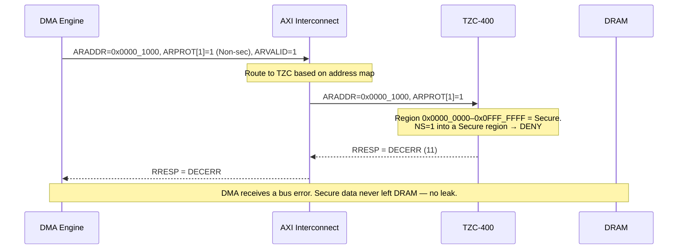

# 01 — Architecture and PPA: Interview Questions

Consolidated interview Q&A and worked problems from every page in `01_Architecture_and_PPA/`, moved here to keep topic pages focused on concepts. Each section links back to its source page for full context.

---

## ACE and CHI -- AMBA Coherence Extensions Beyond AXI

*From [ACE_and_CHI.md](../01_Architecture_and_PPA/ACE_and_CHI.md)*

### Problem 1: ACE Transaction Sequence

**Question:** Draw the ACE transaction sequence for: Core 0 ReadShared X, Core 1 ReadShared X, Core 0 ReadUnique X. Show all channel activity.

**Answer:**

```verilog
Initial state: address X not cached anywhere.

--- Phase 1: Core 0 ReadShared X ---
  Core 0: AR channel -> ReadShared, Addr=X
  Interconnect: AC channel -> snoop Core 1 (and Core 2, Core 3, ...)
  Core 1: CR channel -> Miss (does not have X)
  Core 2: CR channel -> Miss (does not have X)
  Interconnect: fetches X from memory
  Interconnect: R channel -> data, state=Exclusive (no other master has X)
  Core 0: RACK -> acknowledges receipt
  State after: Core 0 has X in E state

--- Phase 2: Core 1 ReadShared X ---
  Core 1: AR channel -> ReadShared, Addr=X
  Interconnect: AC channel -> snoop Core 0 (has X in E)
  Core 0: CR channel -> Hit, Shared (E -> S transition)
  Core 0: CD channel -> supplies cache line data (cache-to-cache)
  Interconnect: R channel -> data to Core 1, state=Shared
  Core 1: RACK -> acknowledges receipt
  State after: Core 0 has X in S, Core 1 has X in S

--- Phase 3: Core 0 ReadUnique X ---
  Core 0: AR channel -> ReadUnique, Addr=X
  Interconnect: AC channel -> snoop Core 1 (has X in S)
  Core 1: CR channel -> Hit, Shared (S -> I transition, invalidation)
  No CD needed (Core 1 had clean data, Core 0 already has a copy in S)
  Interconnect: R channel -> data to Core 0, state=Unique/Modified
  Core 0: RACK -> acknowledges receipt
  State after: Core 0 has X in M, Core 1 has X invalidated

Key observations:
  - ReadShared from E state: no memory access, cache-to-cache transfer
  - ReadUnique: invalidation without data transfer if line was clean
  - Total bus transactions: 3 reads + 3 snoops + 3 responses = 9 ops
```

### Problem 2: Snoop Filter Design for 4-Core ACE System

**Question:** Design a simple snoop filter for a 4-core ACE system: 64-byte cache line size, 4 MB shared L3. How many snoop filter entries? What is the storage overhead?

**Answer:**

```verilog
Given:
  Cache line size: 64 bytes
  Shared L3 size: 4 MB = 4 * 1024 * 1024 = 4,194,304 bytes
  Number of cores: 4

Step 1: How many L3 cache lines?
  L3 lines = L3_size / line_size = 4,194,304 / 64 = 65,536 lines

Step 2: How many L1 + L2 lines total (upper bound on concurrent sharers)?
  Assume each core has:
    L1 I$: 64 KB, 64B line -> 1024 lines
    L1 D$: 64 KB, 64B line -> 1024 lines
    L2$:   512 KB, 64B line -> 8192 lines
  Per core: 1024 + 1024 + 8192 = 10,240 lines
  Total across 4 cores: 40,960 lines (upper bound)

  But L1 + L2 lines are a subset of L3 lines (inclusive cache).
  Maximum unique addresses cached across all private caches <= 65,536.

Step 3: Snoop filter tracks L3 address space.
  Entries needed: 65,536 (one per L3 line)

  Each entry:
    Valid bit: 1 bit
    Sharer vector: 4 bits (one per core)
    Tag: need to identify the address. If indexed by L3 set + way,
         we need ~17 bits for the physical address tag.
    State: 2 bits (Invalid, Shared, Exclusive/Modified)
    Total per entry: 1 + 4 + 17 + 2 = 24 bits = 3 bytes

Step 4: Storage overhead:
  Total storage = 65,536 * 24 bits = 1,572,864 bits = 192 KB

  As fraction of L3: 192 KB / 4 MB = 4.7%

  Optimization: track only lines that are actually cached.
  If average private cache utilization is 50%, only ~20,000 entries
  are active. Use a set-associative structure with fewer entries
  and tags for further savings.

Answer: 65,536 entries, ~24 bits each, ~192 KB storage (4.7% of L3 size).
```

### Problem 3: CHI ReadUnique with Dirty and Clean Sharers

**Question:** RN0 sends ReadUnique to HN. HN sends SNP to RN1 and RN2. RN1 has dirty data, RN2 has clean. Show the complete message flow.

**Answer:**

```verilog
Initial state:
  RN0: does not cache address X
  RN1: X in Modified state (dirty, sole valid copy, memory stale)
  RN2: X in Shared state (clean, read-only copy)
  HN directory: X is shared in RN1 (tracked as Exclusive/Modified)
                  and RN2 (tracked as Shared)

--- Message Flow ---

1. RN0 -> HN:  REQ {Opcode=ReadUnique, Addr=X, SrcID=RN0}
   "I want exclusive ownership of X to write it"

2. HN checks directory:
   Sharers of X = {RN1, RN2}
   HN must invalidate both and get dirty data from RN1.

3. HN -> RN1:  SNP {Opcode=SnpUnique, Addr=X, TgtID=RN1}
   "Give up X exclusively, return data if dirty"

4. HN -> RN2:  SNP {Opcode=SnpInv, Addr=X, TgtID=RN2}
   "Invalidate your copy of X, no data needed" (clean, no writeback)

5. RN2 -> HN:  RSP {Opcode=SnpResp_I, SrcID=RN2}
   "Invalidated. I had a clean Shared copy, now Invalid."
   No DAT from RN2 (clean data, no writeback needed).

6. RN1 -> HN:  DAT {Opcode=SnpRespData, SrcID=RN1, Data=X_cache_line}
   "Here is the dirty data. My copy is now Invalid."
   RN1: M -> I transition. Dirty cache line written back.

7. HN processes responses:
   - Received data from RN1 (dirty, authoritative copy)
   - RN2 confirmed invalidation
   - HN writes RN1's dirty data to memory (optional, can defer)
   - HN updates directory: X is now Exclusive in RN0

8. HN -> RN0:  DAT {Opcode=Data, Data=X_cache_line, Resp=Unique}
   "Here is the data. You have exclusive ownership."

9. HN -> RN0:  RSP {Opcode=CompAck (implicit in data response)}
   Combined with data in some implementations.

10. RN0 -> HN: RSP {Opcode=CompAck, SrcID=RN0}
    "I acknowledge receipt of the data."

Final state:
  RN0: X in Modified state (can write freely)
  RN1: X invalidated
  RN2: X invalidated
  Memory: will be updated when RN0 eventually writes back

Key observations:
  - RN1 returns dirty data via DAT (cache-to-cache, avoids memory read)
  - RN2 only needs a simple invalidation response (no data transfer)
  - HN uses different SNP opcodes based on directory state:
    SnpUnique for the dirty owner, SnpInv for clean sharers
  - This targeted approach is why CHI scales: only 2 snoops, not N
```

### Problem 4: TrustZone Preventing Non-Secure DMA Access

**Question:** Explain how TrustZone prevents a Non-secure DMA master from reading Secure memory. Show the signal path.

**Answer:**



**How the TZC decides.** Input: address + `ARPROT[1]` (or `AWPROT[1]` for writes). Region config: Region 0 `0x0000_0000–0x0FFF_FFFF` Secure-only; Region 1 `0x1000_0000–0x1FFF_FFFF` Non-secure OK; Region 2 `0x2000_0000–0x2FFF_FFFF` Non-secure OK.

```verilog
if (ARPROT[1] == 0)        // Secure master
    -> allow all regions
else if (ARPROT[1] == 1)   // Non-secure master
    -> allow only Non-secure regions
    -> Region 0 access -> DECERR
```

Enforced in hardware, so a Non-secure master cannot bypass the TZC by software means. Additional layers: (1) the AXI interconnect may also check `AxPROT` and refuse to route Non-secure transactions to Secure slaves; (2) in ACE/CHI, snoop responses are tagged with security so a Non-secure snoop cannot interrogate Secure lines; (3) the SMMU provides per-device translation and permission checks, complementary to TrustZone.

---

## AMBA Bus Protocols: APB, AHB, and AXI -- The Complete Interview Bible

*From [AHB_AXI_APB.md](../01_Architecture_and_PPA/AHB_AXI_APB.md)*

### Q1: What are the main differences between APB, AHB, and AXI?

**A:** APB is non-pipelined, 2-cycle minimum per transfer, for low-bandwidth peripherals. AHB is address-pipelined (address phase overlaps previous data phase, achieving 1 transfer/cycle), supports bursts, and has a single shared bus. AXI4 has 5 independent channels (2 for writes, 2 for reads, 1 for write response), supporting simultaneous read+write, outstanding transactions (multiple in-flight), out-of-order completion (via IDs), and bursts up to 256 beats. Complexity and throughput increase from APB to AHB to AXI.

### Q2: Explain AXI's VALID/READY handshake rules and why they prevent deadlock.

**A:** The critical rule: VALID must NOT depend on READY (the source asserts VALID when it has data, regardless of the sink's state). READY MAY depend on VALID. This breaks the potential circular dependency: if both waited for each other, neither would assert and the bus would deadlock. Transfer occurs on the clock edge when both VALID and READY are high. Additionally, once VALID is asserted, it must remain high until the handshake completes (no dropping data). The signal payload must also remain stable while VALID is high and READY is low.

### Q3: Calculate the bandwidth of an AXI4 64-bit interface at 200MHz with burst length 16.

**A:** Peak bandwidth = 64b/8 * 200M = 1.6 GB/s. With INCR16 bursts: each burst transfers 16*8=128 bytes, taking 16 data cycles + 1 address cycle = 17 cycles. Effective BW = 128/(17*5ns) = 1.506 GB/s = 94.1% efficiency. With single-beat transfers: 8 bytes per 2 cycles (addr+data) = 800 MB/s = 50% efficiency. With 4 outstanding INCR16 reads and 40-cycle DDR latency: after pipeline fill, the data channel stays saturated at 1.6 GB/s. Outstanding transactions are essential for high-latency memories.

### Q4: Explain WRAP burst with a numerical address calculation.

**A:** WRAP bursts increment and wrap at a boundary. Formula: Wrap_Boundary = floor(Start_Addr / (burst_len * bytes_per_beat)) * burst_len * bytes_per_beat. Example: ARADDR=0x34, ARSIZE=2 (4B), ARLEN=3 (4 beats). Wrap size = 4*4 = 16B. Boundary = floor(0x34/16)*16 = 0x30. Range: 0x30-0x3F. Beats: 0x34, 0x38, 0x3C, 0x30 (wraps). Use case: cache line fill starting at the critical word (the CPU needs 0x34 immediately, then the rest of the line fills around it).

### Q5: What are outstanding transactions and how do they improve throughput?

**A:** Outstanding transactions allow the master to issue multiple addresses before receiving responses. Without outstanding: the master waits for each response before issuing the next address, leaving the bus idle during memory latency. With N outstanding: N addresses can be in flight simultaneously, hiding latency by overlapping memory access with address issue. For DDR with 40-cycle latency and 16-beat bursts: without outstanding, efficiency = 16/(16+40) = 28.6%. With 4 outstanding: data pipeline fills after initial latency, achieving near-100% data channel utilization. The max outstanding depth is a design parameter of the master and interconnect.

### Q6: How does out-of-order completion work? Give an example.

**A:** Each transaction has an ID (AxID). Transactions with DIFFERENT IDs may complete in any order. Same-ID transactions must complete in order. Example: Master issues Read A (ID=0, to slow DDR), Read B (ID=1, to fast SRAM), Read C (ID=0, to SRAM). Response order can be: B first (ID=1, fast), then A (ID=0, slow), then C (ID=0, after A -- same ID ordering preserved). The master uses the returned RID/BID to match responses to requests. This prevents fast slaves from being blocked behind slow ones, improving overall bus utilization.

### Q7: Explain AHB pipelining. Why does HREADY affect both current and next transfer?

**A:** AHB overlaps the address phase of transfer N+1 with the data phase of transfer N. When HREADY=0, the slave is not done with the current data phase, so: (1) the current data phase extends (data not ready yet); (2) the next address phase is also stalled (the slave can't accept a new address while processing the current one). The master must hold HADDR, HTRANS, and other address-phase signals stable when HREADY=0. This creates a synchronized pipeline stall. The single HREADY signal controls both phases simultaneously, which is simpler than AXI's per-channel flow control but limits concurrency.

### Q8: Why was write interleaving removed in AXI4?

**A:** AXI3's write interleaving allowed write data from different transactions (identified by WID) to interleave on the W channel. This was: (1) Extremely complex to implement in slaves (need per-ID write buffers and arbitration); (2) Rarely used in practice (most masters don't interleave writes); (3) Error-prone (mismatch between AW and W ordering causes data corruption); (4) Added significant gate count. AXI4 requires write data to follow the same order as write addresses, removes WID entirely, and dramatically simplifies slave design. For use cases that need write interleaving, the interconnect can re-order transactions externally.

### Q9: Design an AXI-to-APB bridge. What are the key challenges?

**A:** The bridge is an AXI slave and APB master. Key challenges: (1) AXI bursts vs APB single-beat: the bridge must break AXI bursts into individual APB 2-cycle transfers, tracking beat count and generating incremented addresses; (2) AXI outstanding vs APB single-outstanding: the bridge can only process one APB transfer at a time, so it must backpressure the AXI side; (3) Error accumulation: if any APB beat returns PSLVERR, the bridge must propagate error via BRESP/RRESP; (4) Clock domain crossing: if AXI and APB are on different clocks, the bridge needs synchronizers; (5) Write response: the bridge must wait for ALL APB beats to complete before sending BRESP on the B channel.

### Q10: What is AXI exclusive access and how does it implement atomic operations?

**A:** Exclusive access provides hardware support for atomic read-modify-write. The master performs an exclusive read (ARLOCK=1) to get the current value. An exclusive monitor at the slave (or interconnect) records the access. The master computes the new value and performs an exclusive write (AWLOCK=1). The monitor checks if any other master has written to the same address since the exclusive read. If not, the write succeeds (BRESP=EXOKAY). If another write occurred, the write fails (BRESP=OKAY, normal), and the master must retry the entire sequence. This implements the LL/SC (Load-Linked/Store-Conditional) primitive used for spinlocks, semaphores, and atomic operations.

### Q11: How does AXI ID width expansion work in an interconnect?

**A:** When multiple masters connect to the same slave through an interconnect, their ID spaces may overlap (e.g., both use ID=5). The interconnect prepends master-identification bits to the ID. If master 0 sends AWID=4'b0101 and master 1 sends AWID=4'b0101, the slave sees AWID=6'b00_0101 and AWID=6'b01_0101 respectively (different IDs, independent ordering). On the response path, the interconnect strips the prepended bits before routing to the master. This ensures: (1) the slave sees all transactions with unique IDs; (2) OoO completion works correctly; (3) the master's ID space is preserved. Width at slave = master_ID_width + log2(num_masters).

### Q12: Compare crossbar and shared bus interconnect architectures.

**A:** Shared bus: one transaction at a time, all masters and slaves on the same bus, arbiter selects one master per cycle. Bandwidth = 1 * data_width * freq. Simple, low area, O(M+S) wires. Crossbar: parallel paths between any master-slave pair (up to min(M,S) simultaneous transactions). Bandwidth = min(M,S) * data_width * freq. Area = O(M*S) MUXes and arbiters. A 4-master/4-slave crossbar can achieve 4x the bandwidth of a shared bus. The trade-off is area: a 16x16 crossbar has 256 crosspoints and 16 arbiters. Modern SoCs use partial crossbar (common paths share resources) or NoC (mesh routing) to balance area and bandwidth.

### Q13: What is a default slave and why is it needed?

**A:** The default slave handles accesses to unmapped address regions. Without it, if a master accesses an address that no slave recognizes, no slave drives HREADY (AHB) or asserts any response (AXI), causing the bus to hang indefinitely. The default slave always responds with an error (HRESP=ERROR on AHB, RRESP/BRESP=DECERR on AXI) and completes the transaction. It's automatically selected by the address decoder when no other slave matches. Every bus system must include one.

### Q14: Explain narrow transfers in AXI. How does WSTRB work?

**A:** A narrow transfer occurs when AWSIZE < the data bus width. For example, a 32-bit write on a 64-bit bus (AWSIZE=2, bus=64b). WSTRB has one bit per byte lane (8 bits for 64-bit bus). Only the byte lanes with WSTRB=1 are written. For a 32-bit write to address 0x1000 (lower word): WSTRB=8'b0000_1111 (low 4 bytes active). For address 0x1004 (upper word): WSTRB=8'b1111_0000 (high 4 bytes active). The slave must use WSTRB to determine which bytes to update, NOT the address alone. WSTRB also enables unaligned writes and sparse byte updates.

### Q15: How does AXI4-Stream differ from AXI4? When do you use it?

**A:** AXI4-Stream has NO address channel -- it's for unidirectional data streaming. One TVALID/TREADY data channel with TLAST (end of packet), TKEEP/TSTRB (byte qualifiers), TID (stream ID), TDEST (routing). Use it for: video pixel streams, DSP filter chains, DMA data paths, network packet processing, any point-to-point data flow where addresses are irrelevant. AXI4 is for memory-mapped access (read/write to specific addresses). AXI4-Stream can achieve 100% data channel utilization (no address overhead) making it ideal for high-throughput datapaths.

### Q16: Explain AHB split/retry. When is split better than retry?

**A:** Both handle slow slaves. RETRY: slave returns a 2-cycle error response, master immediately retries. Simple but the master keeps requesting the bus, wasting cycles polling. SPLIT: slave returns a 2-cycle error response AND tells the arbiter to remove this master from the pending list. The slave signals HSPLIT when ready, and the arbiter re-grants. Split is better when: the slave latency is long and unpredictable (external memory, interrupt-driven devices). Retry is simpler but wastes bus bandwidth with repeated failed attempts. In practice, AHB-Lite (most common variant) removes split/retry entirely.

### Q17: How do you choose between AXI4-Lite and AXI4 for an IP interface?

**A:** Use AXI4-Lite for simple register interfaces where: (1) only single-beat access is needed (no burst); (2) low bandwidth is sufficient (configuration, status); (3) no outstanding or OoO is needed; (4) gate count is a concern (AXI4-Lite slave is 50-70% smaller). Use full AXI4 when: (1) burst access is needed (DMA, memory controllers); (2) high bandwidth is required; (3) multiple outstanding transactions improve performance; (4) OoO completion is beneficial (multi-port slaves). Many SoCs use AXI4-Lite for all peripheral CSR blocks and AXI4 for memory-mapped high-performance paths, connected through an AXI4-to-AXI4-Lite bridge where needed.

### Q18: What is the AXI ordering model for reads and writes?

**A:** Within the same ID: reads are ordered, writes are ordered, but there is NO ordering between reads and writes. Cross-ID: no ordering at all. This means a read issued after a write (same address, same ID) may return STALE data if the write hasn't been committed yet. The master must explicitly wait for the write response (B channel) before issuing the read if it needs to see the updated value. At the system level, memory barriers (DMB on ARM) enforce ordering by preventing the CPU from issuing new transactions until previous ones complete.

### Q19: How does QoS work in practice? Give a real scenario.

**A:** A display controller reading frame buffer data must never stall (causes visible tearing). It has a line buffer that holds 1-2 scan lines. The display reads one line while displaying another. If the line buffer runs empty, the display shows garbage. Solution: display master sets AxQOS=0xC (high). CPU sets AxQOS=0x8. DMA sets AxQOS=0x4. When display and CPU both request DDR access, the interconnect's QoS-aware arbiter prioritizes the display. Advanced: dynamic QoS -- the display monitors its line buffer fill level. If fill < 25%, raise QoS to 0xF (urgent). If fill > 75%, lower QoS to 0x4 (not urgent, share bandwidth with others). This prevents both starvation and over-allocation.

### Q20: What signal integrity concerns exist in high-frequency AXI interfaces?

**A:** At 500MHz+ AXI: (1) The VALID-to-READY combinational path (if READY depends on VALID) creates a long timing path across the interconnect -- insert register slices to break timing. Register slices add 1 cycle latency but enable higher frequency. (2) Wide data buses (512-bit) have high capacitance and crosstalk -- careful routing with shielding. (3) ID width expansion increases wire count -- consider ID remapping to keep widths manageable. (4) AXI protocol bridges (clock/width conversion) must handle handshake timing carefully across clock domains. (5) For chiplet or die-to-die AXI (e.g., UCIe), serialization and retiming add significant complexity.

---

## Branch Prediction -- Deep Dive for CPU Designers

*From [Branch_Prediction_Deep_Dive.md](../01_Architecture_and_PPA/Branch_Prediction_Deep_Dive.md)*

### Problem 1: gshare Index Computation and Prediction

**Given**:
- 10-bit GHR = `1011010011`
- PC = `0x0040_1A3C`
- BHT has 1024 entries (10-bit index), each with a 2-bit counter
- Index = `PC[11:2] XOR GHR[9:0]`
- After indexing, the counter value at that BHT entry is `2` (binary: `10`)

**Question**: Compute the BHT index and predict the branch outcome.

**Solution**:

```ascii-graph
Step 1: Extract PC[11:2]
  PC = 0x0040_1A3C = 0000_0000_0100_0000_0001_1010_0011_1100
  Bits 11..2:  10_1000_1111 = 0x28F
  (Equivalently: PC >> 2 = 0x0010_068F, low 10 bits = 0x068F & 0x3FF = 0x28F)

Step 2: GHR[9:0]
  GHR = 1011010011

Step 3: XOR
  PC[11:2]  = 10_1000_1111
  GHR[9:0]  = 10_1101_0011
  XOR       = 00_0101_1100 = 0x05C

Step 4: Lookup
  BHT index = 0x05C (decimal 92)
  Counter value = 2 (binary 10)

Step 5: Predict
  Counter = 2 >= 2 --> predict TAKEN
```

If the actual outcome is Not-Taken:
```verilog
Update: counter = max(counter - 1, 0) = max(2 - 1, 0) = 1 (binary 01)
GHR update: shift left, insert 0 at bit 0
  New GHR = 0110100110
```

---

### Problem 2: TAGE Provider Selection

**Given**:
- TAGE with base bimodal + 3 tagged components (T1, T2, T3)
- History lengths: T1 = 4, T2 = 16, T3 = 64
- GHR (64 bits): `...1101_0011_1010_1111_0000_1010_0101_1100`
- Branch PC = `0x0040_2000`
- Lookup results:

| Component | Tag Hit? | Counter | Useful |
|-----------|----------|---------|--------|
| Base | N/A | 5 (taken) | N/A |
| T1 (hist=4) | Yes | 6 (taken) | 3 |
| T2 (hist=16) | No | -- | -- |
| T3 (hist=64) | Yes | 2 (weakly taken) | 0 |

**Question**: Which component is the provider? What is the final prediction?

**Solution**:

```ascii-graph
Step 1: Identify all tag hits
  T1: tag hit (history length 4)
  T2: tag miss
  T3: tag hit (history length 64)

Step 2: Select provider = longest history with tag hit
  T3 (history length 64) > T1 (history length 4)
  Provider = T3

Step 3: Select alternate = second longest hit (or base)
  Second longest hit = T1
  Alternate = T1

Step 4: Check provider confidence
  T3 useful = 0 (low confidence)

Step 5: Final prediction
  Provider (T3) useful < 1 --> fall back to alternate (T1)
  T1 counter = 6 >= 4 (3-bit counter, threshold = 4) --> TAKEN

  Final prediction: TAKEN
```

If the branch is actually Not-Taken (mispredict):

```verilog
Step 6: Update
  - T3 counter: decrement, 3-bit counter 2 -> 1 (still weakly taken)
  - T3 useful: already 0, no decrement below 0
  - Allocate new entry in T2 (only component without a hit):
    * T2[tag] = partial_tag(PC)
    * T2[counter] = 3 (weakly not-taken, initialized to opposite of alt's
      "taken" prediction; 3-bit counter threshold is 4, so 3 = weakly NT)
    * T2[useful] = 0
```

---

### Problem 3: Speculative RAS with Misprediction

**Given**:
- 32-entry RAS, circular buffer, Top pointer (5 bits)
- Initial state: Top = 0x04, RAS[4] = 0x8000

**Sequence**:
1. `CALL func1` (return address = 0x4008)
2. `CALL func2` (return address = 0x500C)
3. `CALL func3` (return address = 0x6010)
4. Misprediction detected: the third CALL was speculatively executed on a
   wrong path. Restore RAS to state before step 3.

**Question**: Show the RAS state before and after each operation and after
misprediction repair.

**Solution**:

```verilog
Initial state:
  Top = 4
  RAS[4] = 0x8000
  ROB checkpoints: (none)

After CALL func1 (push 0x4008):
  RAS[5] = 0x4008
  Top = 5
  ROB entry for CALL func1: checkpoint_top = 4

After CALL func2 (push 0x500C):
  RAS[6] = 0x500C
  Top = 6
  ROB entry for CALL func2: checkpoint_top = 5

After CALL func3 (push 0x6010):
  RAS[7] = 0x6010
  Top = 7
  ROB entry for CALL func3: checkpoint_top = 6

Misprediction repair (restore to before CALL func3):
  Restore Top from ROB checkpoint = 6
  Top = 6
  RAS[7] = 0x6010  (stale data, but Top=6 means it is ignored)

Final repaired state:
  Top = 6
  RAS[4] = 0x8000
  RAS[5] = 0x4008
  RAS[6] = 0x500C
```

The key insight: the RAS itself is not cleared on misprediction. Only the Top
pointer is restored. Stale entries beyond Top are harmless because they will be
overwritten by future CALLs.

---

### Problem 4: Mispredict Penalty Calculation

**Given**:
- 15-stage pipeline: F1, F2, F3, F4, D1, D2, D3, R1, R2, EX, A1, A2, WB1, WB2, RET
- Branches resolve in stage EX (stage 10)
- Fetch width = 4 instructions/cycle
- The branch is in the EX stage when the misprediction is detected

**Question**: How many instructions are squashed? What is the mispredict penalty
in cycles?

**Solution**:

```verilog
Stage timeline (cycle by cycle for the mispredicted branch):

Cycle 0: Branch enters F1
Cycle 1: Branch enters F2
Cycle 2: Branch enters F3
Cycle 3: Branch enters F4
Cycle 4: Branch enters D1
Cycle 5: Branch enters D2
Cycle 6: Branch enters D3
Cycle 7: Branch enters R1 (register rename)
Cycle 8: Branch enters R2
Cycle 9: Branch enters EX -- misprediction detected!

Instructions in pipeline at cycle 9 (behind the branch):
  Stage   Instructions
  F1      4 instructions (fetched cycle 9)
  F2      4 instructions (fetched cycle 8)
  F3      4 instructions (fetched cycle 7)
  F4      4 instructions (fetched cycle 6)
  D1      4 instructions (fetched cycle 5)
  D2      4 instructions (fetched cycle 4)
  D3      4 instructions (fetched cycle 3)
  R1      4 instructions (fetched cycle 2)
  R2      4 instructions (fetched cycle 1)

Stages behind branch: F1 through R2 = 9 stages
Instructions squashed = 9 stages * 4 inst/cycle = 36 instructions

Mispredict penalty in cycles:
  - Cycle 9: misprediction detected
  - Cycle 10: redirect sent to F1 with correct target
  - Cycle 11: first correct instruction enters F1
  - Cycles lost = 9 (cycles 1--9 produced wrong-path instructions)
  - Penalty = 9 cycles (bubble before correct path resumes at EX throughput)
```

**Cost analysis**:

If branch frequency = 1 per 5 instructions and mispredict rate = 2%:

$$
\text{Wasted cycles per 1000 instructions} =
\frac{1000}{5} \times 0.02 \times 9 = 36 \text{ cycles}
$$

$$
\text{Performance loss} = \frac{36}{1000 + 36} \approx 3.5\%
$$

Reducing the mispredict rate from 2% to 1% cuts the loss to ~1.7%, a
significant improvement.

---

### Problem 5: Predictor Comparison on a Repeating Pattern

**Given**: A loop branch with the repeating pattern T, T, T, NT (4-iteration
loop).

**Question**: Show step-by-step predictions for bimodal, gshare, and TAGE.
How many mispredictions occur per 12 iterations (3 full pattern repetitions)?

**Solution**:

**Part A: Bimodal (2-bit counter, initial = 0 "strongly not-taken")**

```ascii-graph
Pattern iteration 1:  T T T NT
  Step 1: Counter=0, predict NT, actual=T  --> MISPREDICT. Counter -> 1
  Step 2: Counter=1, predict NT, actual=T  --> MISPREDICT. Counter -> 2
  Step 3: Counter=2, predict T,  actual=T  --> correct.   Counter -> 3
  Step 4: Counter=3, predict T,  actual=NT --> MISPREDICT. Counter -> 2

Pattern iteration 2:  T T T NT
  Step 5: Counter=2, predict T,  actual=T  --> correct.   Counter -> 3
  Step 6: Counter=3, predict T,  actual=T  --> correct.   Counter -> 3
  Step 7: Counter=3, predict T,  actual=T  --> correct.   Counter -> 3
  Step 8: Counter=3, predict T,  actual=NT --> MISPREDICT. Counter -> 2

Pattern iteration 3:  T T T NT
  Step 9:  Counter=2, predict T, actual=T  --> correct.   Counter -> 3
  Step 10: Counter=3, predict T, actual=T  --> correct.   Counter -> 3
  Step 11: Counter=3, predict T, actual=T  --> correct.   Counter -> 3
  Step 12: Counter=3, predict T, actual=NT --> MISPREDICT. Counter -> 2

Bimodal result: 5 mispredictions in 12 branches
  Pattern 1 (cold start): 3 mispredicts (steps 1, 2, 4)
  Pattern 2 (steady state): 1 mispredict (step 8)
  Pattern 3 (steady state): 1 mispredict (step 12)
  Steady-state rate: 1 mispredict per 4 branches (always the loop exit)
  Overall accuracy = 7/12 = 58% (dragged down by cold start)
  Steady-state accuracy = 3/4 = 75%
```

**Part B: gshare (assumes other branches create GHR pattern that doesn't alias)**

gshare behaves identically to bimodal for a single branch in isolation because
the GHR contribution only matters when aliasing with other branches. For this
isolated loop branch, gshare accuracy = bimodal accuracy = 75%.

The advantage of gshare appears when *other* branches' outcomes correlate with
this branch -- which is not the case here.

**Part C: TAGE (base + T1 with history length 4 + T2 with history length 8)**

Consider why a single component with history length 4 is NOT sufficient:

With history length 4, the GHR for each step of the T,T,T,NT pattern is:
Step 1: last 4 bits = [?, ?, ?, ?] -> depends on prior iteration
Step 2: last 4 bits = [T, T, T, T]  (1 T from step 1, plus 3 from before)
Step 3: last 4 bits = [T, T, T, T]  (2 T's from steps 1-2, plus 2 from before)
Step 4: last 4 bits = [T, T, T, T]  (3 T's from steps 1-3, plus 1 from before)

Steps 2, 3, and 4 all see "TTTT" -- they ALIAS with history length 4!
T1 cannot distinguish the 3rd T from the NT.

With history length 8 (covering 2 full loop iterations), each step IS unique:
Step 1: last 8 = ...NT,T,T,T,NT,T,T,T  (two iterations ending in NT visible) → pattern: the 4th-from-last is NT, this is position 1 -> predict T
Step 2: last 8 = ...T,NT,T,T,T,NT,T,T   (shifted by one T) → different from step 1 -> predict T
Step 3: last 8 = ...T,T,NT,T,T,T,NT,T    -> predict T
Step 4: last 8 = ...T,T,T,NT,T,T,T,NT    -> predict NT (the NT at position -4
and position -8 reveal this is the loop exit)

After warmup, T2 (history length 8) learns all 4 positions correctly:

**Pattern iteration 1 (assuming warm):**
   - Step 1: T2 hits with unique 8-bit pattern -> predicts T  --> correct
   - Step 2: T2 hits with different 8-bit pattern -> predicts T  --> correct
   - Step 3: T2 hits with yet another pattern -> predicts T  --> correct
   - Step 4: T2 hits with the "exit" pattern -> predicts NT --> correct

All subsequent iterations: 0 mispredictions.

TAGE result: 0 mispredictions per 12 branches (after warmup)
- **Accuracy** = `12/12 = 100%`

**Summary**:

| Predictor | Mispredicts (12 branches) | Steady-State Accuracy | Key Insight |
|-----------|--------------------------|----------|-------------|
| Bimodal | 5 (cold start: 3, then 1 per loop exit) | 75% (1 miss per loop) | Cannot learn the NT position |
| gshare | 5 (same as bimodal in isolation) | 75% | No benefit without correlation |
| TAGE | 0 (after warmup) | 100% | History length 8 (>= 2x period) captures full pattern |

This illustrates why TAGE dominates: its geometric history lengths can capture
periodic patterns of any period that fits within the longest component's
history window.

---

## CPU Architecture -- The Complete Interview Bible

*From [CPU_Architecture.md](../01_Architecture_and_PPA/CPU_Architecture.md)*

### Q1: Describe the 5 pipeline stages in detail. What happens at each stage?

**A:** **IF**: Send PC to I-cache, fetch instruction, predict next PC (BTB+BHT). **ID**: Decode opcode, read register file (rs1, rs2), generate immediate, detect hazards (load-use stall). **EX**: Execute ALU operation, compute branch target, resolve branch direction, compute load/store address. Forwarding MUXes select between register values and forwarded results. **MEM**: Access D-cache for loads/stores. Loads read data, stores write data. Cache misses stall the pipeline. **WB**: Write result (ALU or memory data) back to register file. Write-first design allows same-cycle read in ID.

### Q2: Show a detailed RAW hazard example with forwarding paths.

**A:** Sequence: `ADD $1,$2,$3` followed by `SUB $4,$1,$5`. ADD writes $1 in WB (cycle 5). SUB needs $1 in EX (cycle 4). Without forwarding: 2-cycle stall. With forwarding: ADD's ALU result is available at the EX/MEM register (end of cycle 3). The forwarding MUX routes EX/MEM.ALU_result to SUB's ALU input A. Control: EX/MEM.Rd=$1 matches ID/EX.Rs1=$1 and EX/MEM.RegWrite=1, so ForwardA=01 (EX/MEM forward). Zero stall cycles. For a 2-stage distance (e.g., `ADD` then `NOP` then `AND $6,$1,$7`), the MEM/WB register provides the value through the ForwardA=10 path.

### Q3: Explain the load-use hazard. Why can't forwarding solve it completely?

**A:** After `LW $1, 0($2)`, if the next instruction is `ADD $4, $1, $5`, there's a fundamental timing conflict. LW produces data at the END of MEM (cycle 4). ADD needs data at the BEGINNING of EX (cycle 3). The data doesn't exist yet when ADD needs it. Even with forwarding, we need a 1-cycle stall. After the stall, ADD's EX is in cycle 4, and LW's MEM result is available at MEM/WB for forwarding. The compiler can help by scheduling an independent instruction in the delay slot (load delay slot scheduling), converting the stall into useful work.

### Q4: Derive the CPI impact of branch misprediction. Why do deep pipelines suffer more?

**A:** CPI = 1 + branch_freq * mispredict_rate * penalty. For a 5-stage pipeline (penalty=2, branch in EX): with 20% branches and 5% misprediction: CPI = 1 + 0.2*0.05*2 = 1.02. For a 20-stage pipeline (penalty=15): CPI = 1 + 0.2*0.05*15 = 1.15 (15% slower). Deep pipelines have more stages between fetch and branch resolution, so more instructions are fetched speculatively and wasted on misprediction. This is why Intel Pentium 4 (31 stages, penalty=20) needed very aggressive branch prediction (trace cache, sophisticated predictors) to be competitive, and ultimately lost to shorter-pipeline designs.

### Q5: Explain gshare prediction. How does XOR improve accuracy?

**A:** Gshare indexes the Pattern History Table (PHT) with PC XOR Global History Register (GHR). The GHR is a shift register of the last N branch outcomes. XOR creates a unique index for each (PC, history) pair, capturing correlations between branches. Example: two branches at different PCs but with the same history pattern would collide in a simple PC-indexed table but get different PHT entries with XOR. This captures "if branches A,B were taken, branch C is usually not taken." Gshare achieves 93-95% accuracy on SPEC benchmarks with a 14-16 bit GHR and 16K-64K entry PHT. The main weakness is aliasing (different PC+history pairs mapping to the same entry), which can be reduced with larger tables or anti-aliasing techniques.

### Q6: Walk through Tomasulo's algorithm for a 3-instruction sequence.

**A:** Consider: `MUL F0,F2,F4` / `ADD F2,F0,F6` / `ADD F4,F0,F2`. Cycle 1: MUL issues to Mul1 RS {Op=MUL, Vj=F2, Vk=F4, Dest=F0}. Register status: F0->Mul1. Cycle 2: ADD issues to Add1 RS {Op=ADD, Vj=?, Qj=Mul1 (F0 not ready), Vk=F6}. F2->Add1. Cycle 3: Second ADD issues to Add2 RS {Op=ADD, Vj=?, Qj=Mul1 (F0), Vk=?, Qk=Add1 (F2)}. F4->Add2. Note: WAR on F2 (MUL reads F2, second ADD needs F2 from first ADD) is handled because MUL captured F2's value at issue time. WAW on F4 (original F4 vs Add2's new F4) is handled because Add2's tag replaces F4's register status.

### Q7: What is the purpose of the Reorder Buffer? How does it enable precise exceptions?

**A:** The ROB ensures instructions commit in program order, even though they execute out of order. Each issued instruction allocates an ROB entry at the tail. When execution completes, the result is written to the ROB entry (not to architectural state). Commit happens at the head: if the head entry is complete and has no exception, it commits (updates the register file/memory). If it has an exception, ALL entries from that point to the tail are flushed. This ensures: (1) Precise exceptions: at the exception point, all prior instructions have committed and all later ones haven't; (2) Speculative execution: on branch misprediction, flush ROB entries after the branch, restoring the RAT to the committed state. (3) In-order completion visible to software, despite out-of-order execution.

### Q8: Explain MESI with all state transitions. Why does the E state exist?

**A:** MESI has 4 states per cache line. Key transitions: I->E on read miss (sole copy, clean), I->M on write miss (invalidate others), E->M on write (silent upgrade, no bus traffic -- this is why E exists), E->S on snoop read (share), S->M on write (bus upgrade to invalidate others), M->S on snoop read (write back + share), M->I on snoop write (write back + invalidate). The E state's purpose: when a cache has the only copy, a subsequent write can transition E->M without any bus transaction (no invalidation needed since no other cache has it). Without E (like MSI), every write from S requires a bus invalidation even if no other cache has the line. E saves bus bandwidth for private data patterns, which are very common.

### Q9: Calculate AMAT for a 3-level cache hierarchy. What dominates?

**A:** Given L1: 4-cycle hit, 8% miss rate; L2: 15-cycle hit, 3% local miss rate; L3: 40-cycle hit, 25% local miss rate; Memory: 200 cycles. AMAT = 4 + 0.08*(15 + 0.03*(40 + 0.25*200)) = 4 + 0.08*(15 + 0.03*(40+50)) = 4 + 0.08*(15 + 2.7) = 4 + 0.08*17.7 = 4 + 1.416 = 5.42 cycles. L1 hit time dominates (4 out of 5.42). Reducing L1 hit time from 4 to 3 saves 1 cycle = 18% improvement. Reducing L3 miss rate from 25% to 20% saves 0.08*0.03*0.05*200 = 0.024 cycles = 0.4% improvement. Lesson: L1 hit time is by far the most important parameter.

### Q10: Explain VIPT caches. Why do they enable parallel TLB/cache access?

**A:** VIPT uses virtual address bits for the cache set index and physical address bits for the tag. Since the index comes from the virtual address (available immediately), and the tag comes from the TLB translation (takes 1 cycle), both lookups happen in parallel. When both complete (same cycle), the tag from TLB is compared against the tag stored in the indexed cache set. Key constraint: the index bits must be within the page offset (same in VA and PA). For 4KB pages, bits [11:0] are identical in VA and PA. A 32KB, 8-way cache has 64 sets, using bits [11:6] for index -- all within page offset. If the cache were direct-mapped 32KB (512 sets, 9-bit index using bits [14:6]), bits [14:12] differ between VA and PA, causing aliasing problems.

### Q11: Compare snooping and directory-based coherence. When do you use each?

**A:** Snooping broadcasts every coherence transaction on a shared bus. Every cache snoops and acts if it holds the address. Pros: low latency (one bus cycle), simple. Cons: bus bandwidth scales as O(N), practical limit 8-16 cores. Directory-based: a directory (in memory controller or distributed across nodes) tracks which caches hold each line. Coherence messages are point-to-point. Pros: scales to 100+ cores, no broadcast. Cons: 3-hop latency for interventions (requestor -> directory -> owner -> requestor), directory storage overhead. Modern systems: Intel Xeon uses a mix (snooping within a socket, directory across sockets). AMD EPYC uses directory-based (Infinity Fabric). ARM CMN-700 (used in server chips) is fully directory-based.

### Q12: Explain virtual memory page table walk for x86-64. How many memory accesses?

**A:** x86-64 uses 4-level page tables for 48-bit virtual addresses. CR3 holds the physical address of the PML4 table. Walk: (1) Read PML4 entry at CR3 + VA[47:39]*8; (2) Read PDPT entry at PML4.addr + VA[38:30]*8; (3) Read PD entry at PDPT.addr + VA[29:21]*8; (4) Read PT entry at PD.addr + VA[20:12]*8; (5) Physical address = PT.PFN concatenated with VA[11:0]. That's 4 sequential memory reads for one translation. Without TLB, every load/store becomes 5 memory accesses. With TLB hit rate of 99%, average = 0.99*1 + 0.01*5 = 1.05 accesses. Modern hardware has page walk caches that cache intermediate page table entries, reducing most walks to 1-2 memory accesses.

### Q13: What is register renaming? How does it eliminate WAR and WAW?

**A:** Register renaming maps architectural registers (R0-R31) to a larger physical register file (P0-P127) via a Register Alias Table (RAT). Each instruction's destination gets a fresh physical register from the free list. WAR example: I1 reads R2 (mapped to P12), I2 writes R2 (mapped to P47, new allocation). I2 can write P47 anytime without affecting I1 (which reads P12). WAW example: I1 writes R1 (P48), I2 writes R1 (P63). Both write to different physical registers. The RAT is updated to point R1->P63 after I2. When I1 commits, its old mapping (before I1) is freed. The physical register file must have enough entries to support all in-flight instructions simultaneously (typically 128-256 entries for a 4-wide OoO machine).

### Q14: How does a tournament predictor work? Why is it better than gshare alone?

**A:** A tournament predictor runs two predictors in parallel (typically a local per-branch predictor and a global correlating predictor) plus a meta-predictor (chooser) that selects which one to trust. The chooser is a 2-bit counter per entry. When the local predictor is correct and global is wrong, the chooser shifts toward local. When global is correct and local is wrong, it shifts toward global. This captures the best of both: local predictor excels at branches with self-correlated patterns (loops), global excels at branches correlated with other branches (if-else chains). Tournament achieves 95-97% accuracy vs gshare's 93-95%. The Alpha 21264 was the first commercial implementation. Modern TAGE (TAgged GEometric) predictors extend this idea with multiple tables of different history lengths, achieving 97-99%.

### Q15: Explain Amdahl's Law with a numerical example. What are the implications for multi-core?

**A:** Amdahl's Law: Speedup = 1/((1-f) + f/S). If 90% of a workload is parallelizable (f=0.9) with 16 cores (S=16): Speedup = 1/(0.1 + 0.9/16) = 1/(0.1 + 0.05625) = 6.4x. With 64 cores: 1/(0.1 + 0.9/64) = 8.77x. With infinite cores: 1/0.1 = 10x maximum. The 10% serial portion limits total speedup to 10x regardless of core count. Implications: (1) Reducing the serial fraction matters more than adding cores; (2) Diminishing returns set in quickly (16 cores gives 6.4x, 4x more cores gives only 1.37x more); (3) Heterogeneous multi-core makes sense: use a big core for serial portions and many small cores for parallel portions (big.LITTLE, Intel P/E cores).

### Q16: What is the difference between write-back and write-through caches?

**A:** Write-through: every store writes to both cache and memory immediately. Memory is always up-to-date. Simple but generates high memory traffic (every store becomes a memory write). Typically uses a write buffer to hide latency. Write-back: stores only update the cache, marking the line dirty. Memory is updated only when the dirty line is evicted. Much lower memory traffic (most stores stay in cache; only evictions trigger memory writes). More complex (dirty bit tracking, writeback on eviction, coherence implications). All modern L1/L2/L3 caches use write-back. Write-through is sometimes used for specialized buffers or I/O regions where memory must be immediately consistent.

### Q17: What are the 3 C's of cache misses? How do you reduce each?

**A:** Compulsory (first access ever to a block): reduce with hardware/software prefetching. Capacity (working set exceeds cache size): reduce by increasing cache size, improving data locality in software, or using cache-friendly algorithms. Conflict (multiple addresses map to the same set): reduce by increasing associativity (8-way eliminates most conflict misses), using victim caches (small fully-associative cache for recently evicted lines), or using randomized indexing (skewed-associative caches). A 4th C is Coherence misses in multi-core (invalidations by other cores): reduce by minimizing shared mutable data, using proper synchronization granularity, and padding to avoid false sharing.

### Q18: Explain the TLB and ASID. What happens during a context switch?

**A:** The TLB caches virtual-to-physical translations. Without ASID, a context switch requires flushing the entire TLB (all entries belong to the old process). After the switch, every access TLB-misses until the new process's translations populate the TLB (cold start penalty). With ASID (Address Space ID), each TLB entry is tagged with the process's ASID. On a context switch, the OS sets the new ASID. Old entries remain in the TLB but won't match (wrong ASID). New entries are added naturally. If the old process resumes, its entries may still be in the TLB. This eliminates the flush penalty. Typical ASID: 8-16 bits (256-65536 processes). When ASIDs wrap around, a global TLB flush is needed.

### Q19: How does superscalar differ from VLIW? Give examples of each.

**A:** Superscalar issues multiple instructions per cycle from a sequential instruction stream. Hardware dynamically detects dependencies, performs register renaming, and schedules out-of-order. Examples: Intel Core, AMD Zen (4-6 wide), ARM Cortex-A78 (4-wide). VLIW: the compiler statically schedules multiple operations into a single wide instruction word. Hardware is simple (no dynamic scheduling, no renaming). The compiler must find independent operations to fill all slots (NOP if not found). Examples: TI C6000 DSP (8-wide), Intel Itanium/IA-64 (6-wide, called EPIC). Superscalar advantages: binary compatibility across microarchitecture generations, adapts to runtime behavior. VLIW advantages: simpler hardware (lower power), deterministic timing (good for real-time DSP). Superscalar dominates general-purpose computing; VLIW is used in specialized DSPs.

### Q20: Design considerations for a 4-wide superscalar processor. What are the bottlenecks?

**A:** Key bottlenecks: (1) **Fetch bandwidth**: need I-cache with 4+ instruction fetch per cycle, must handle branches within the fetch group (branch in position 2 means positions 3-4 are potentially wrong-path). (2) **Decode**: 4 decoders in parallel, each handling different instruction formats. x86 is particularly complex (variable-length instructions). (3) **Rename**: 4 rename operations per cycle, each reading 2 source mappings and writing 1 destination mapping to the RAT. Need 8-read, 4-write port RAT. (4) **Issue**: check 4 new instructions against all in-flight instructions for dependencies (O(4*N) comparisons where N is the issue queue depth). (5) **Execution**: need multiple FUs (2-4 ALUs, 1-2 FPU, 2 load/store). (6) **Commit**: 4 entries from ROB head per cycle. Register file needs many ports: practical limit is 6-8 wide issue before the register file becomes the area/power bottleneck.

---

## Cache Microarchitecture — Controller Design and Performance

*From [Cache_Microarchitecture.md](../01_Architecture_and_PPA/Cache_Microarchitecture.md)*

### Problem 1: Design a 4-Way 32 KB L1 D-Cache

**Given:** 32-bit byte addresses, 64 B line size, 4-way set associative, 32 KB total.

**Find:** Index bits, tag bits, total SRAM size (data + tag).

**Solution:**

$$
\text{Sets} = \frac{32 \times 1024}{4 \times 64} = \frac{32768}{256} = 128
$$

$$
\text{Index bits} = \lceil\log_2 128\rceil = 7
$$

$$
\text{Offset bits} = \lceil\log_2 64\rceil = 6
$$

$$
\text{Tag bits} = 32 - 7 - 6 = 19
$$

**Data SRAM per way:**
$$
128 \text{ sets} \times 64 \text{ B} = 8192 \text{ B} = 8 \text{ KB per way}
$$

Total data SRAM: $4 \times 8\text{ KB} = 32\text{ KB}$. (This is the cache capacity by definition.)

**Tag SRAM per way:**
$$
128 \text{ sets} \times (19 \text{ tag} + 1 \text{ valid} + 1 \text{ dirty}) = 128 \times 21 = 2688 \text{ bits}
$$

Total tag SRAM: $4 \times 2688 = 10752 \text{ bits} = 1344 \text{ B} \approx 1.3 \text{ KB}$.

**Total SRAM = 32 KB (data) + 1.3 KB (tag) = 33.3 KB** (about 4% overhead).

---

### Problem 2: MSHR Contention

**Given:** L1 D-cache with 4 MSHRs. The following misses occur in order: addresses
A, B, C, D, E (all to different cache lines). Assume each miss takes 20 cycles to
resolve and one new miss arrives every 5 cycles.

**Find:** What happens on the 5th miss? Show the timing.

**Solution:**

| Cycle | Event | MSHR State |
|-------|-------|------------|
| 0 | Miss to A | MSHR[0] = A (allocated) |
| 5 | Miss to B | MSHR[1] = B (allocated) |
| 10 | Miss to C | MSHR[2] = C (allocated) |
| 15 | Miss to D | MSHR[3] = D (allocated) |
| 20 | Miss to E, A returns (MSHR[0] freed) | E allocated to MSHR[0] -- **just in time** |

In this case, the 5th miss at cycle 20 coincides with the first miss completing.
If the miss latency were 25 cycles instead of 20, or the miss arrival rate were 4
cycles instead of 5:

| Cycle | Event | MSHR State |
|-------|-------|------------|
| 0 | Miss A | MSHR[0]=A |
| 4 | Miss B | MSHR[1]=B |
| 8 | Miss C | MSHR[2]=C |
| 12 | Miss D | MSHR[3]=D |
| 16 | Miss E | **No free MSHR** --> pipeline stalls |

The CPU must stall at cycle 16 until an MSHR is freed (at cycle 25 when the first
miss completes). **Stall duration = 25 - 16 = 9 cycles.**

**Key insight:** MSHR count determines how many misses can be overlapped. With $M$
MSHRs and average miss latency $L$ cycles, the maximum sustainable miss rate before
stalling is:

$$
\text{Max miss rate} = \frac{M}{L} \text{ misses per cycle}
$$

With $M=4$ and $L=20$: max = 0.2 misses/cycle = 1 miss every 5 cycles. Exceeding
this rate causes structural stalls.

---

### Problem 3: LRU vs. PLRU Eviction Comparison

**Given:** 4-way set-associative cache, access sequence: **A A B C D E A F G**

Assume the set starts empty. Track which line is evicted for each compulsory miss
and for the conflict miss(es).

**LRU Solution:**

| Access | MRU --> LRU Order | Action |
|--------|-------------------|--------|
| A | A _ _ _ | Compulsory miss, load into Way 0 |
| A | A _ _ _ | Hit A |
| B | B A _ _ | Compulsory miss, load |
| C | C B A _ | Compulsory miss, load |
| D | D C B A | Compulsory miss, load (set full) |
| E | E D C B | Evict **A** (LRU), load E |
| A | A E D C | Evict **B** (LRU), load A |
| F | F A E D | Evict **C** (LRU), load F |
| G | G F A E | Evict **D** (LRU), load G |

Evictions under LRU: A, B, C, D.

**PLRU Solution (3 bits, initial 000):**
Convention: on access, set bits on the path to point AWAY from the accessed way.
On eviction, follow bits (0=left, 1=right).

| Access | Eviction path / action | b0 b1 b2 after | Way | Notes |
|--------|------------------------|----------------|-----|-------|
| A | b0=0->L, b1=0->L = W0 (empty) | 1 1 0 | W0 | Compulsory miss. Access W0: b0=1, b1=1. |
| A | Hit W0 | 1 1 0 | W0 | Hit. Re-access W0: b0=1, b1=1 (unchanged). |
| B | b0=1->R, b2=0->L = W2 (empty) | 0 1 1 | W2 | Compulsory miss. Access W2: b0=0, b2=1. |
| C | b0=0->L, b1=1->R = W1 (empty) | 1 0 1 | W1 | Compulsory miss. Access W1: b0=1, b1=0. |
| D | b0=1->R, b2=1->R = W3 (empty) | 0 0 0 | W3 | Compulsory miss. Access W3: b0=0, b2=0. |
| E | b0=0->L, b1=0->L = W0 (has A) | 1 1 0 | W0 | Evict **A**, load E. Access W0: b0=1, b1=1. |
| A | b0=1->R, b2=0->L = W2 (has B) | 0 1 1 | W2 | Evict **B**, load A. Access W2: b0=0, b2=1. |
| F | b0=0->L, b1=1->R = W1 (has C) | 1 0 1 | W1 | Evict **C**, load F. Access W1: b0=1, b1=0. |
| G | b0=1->R, b2=1->R = W3 (has D) | 0 0 0 | W3 | Evict **D**, load G. Access W3: b0=0, b2=0. |

Evictions under PLRU: A, B, C, D.

For this particular access sequence, PLRU and LRU agree on every eviction. This is
not always the case. **PLRU may evict a different line than LRU** because it cannot
distinguish recency within a subtree -- it only tracks which half of each subtree was
accessed more recently. For some pathological sequences (e.g., with associativity > 4
or repeated accesses to two ways in the same subtree), PLRU can thrash (evicting a
line that will be needed soon) while LRU does not.

---

### Problem 4: Cache Bandwidth Calculation

**Given:** 64 B cache line, 4 GHz clock, 1 access per cycle.

**(a) Peak cache bandwidth:**
$$
\text{Bandwidth} = 64\text{ B} \times 4 \times 10^9 \text{ cyc/s} = 256 \times 10^9 \text{ B/s} = 256 \text{ GB/s}
$$

**(b) How many cache fills per second can DDR4-3200 sustain?**

DDR4-3200 dual-channel peak bandwidth:
$$
\text{DDR4-3200 single channel} = 3200 \times 10^6 \times 8 \text{ B} = 25.6 \text{ GB/s}
$$
$$
\text{Dual channel} = 51.2 \text{ GB/s}
$$

Each cache fill transfers 64 B, so:
$$
\text{Fills/s} = \frac{51.2 \times 10^9}{64} = 800 \times 10^6 = 800\text{M fills/s}
$$

**(c) What miss rate saturates the DDR4 bandwidth at 256 GB/s cache bandwidth?**

Let $r$ be the miss rate. Cache bandwidth $= 256$ GB/s. Miss traffic $= r \times 256$ GB/s.
This must not exceed DDR4 bandwidth (51.2 GB/s dual-channel):

$$
r \times 256 = 51.2 \implies r = \frac{51.2}{256} = 0.2 = 20\%
$$

A 20% L1 miss rate would saturate the memory system. Typical L1D miss rates are
5--10%, so DDR4-3200 dual-channel can support a single core with some headroom. But
8 cores all streaming at 10% miss rate would require $8 \times 0.1 \times 256 = 204.8$
GB/s, far exceeding the 51.2 GB/s available. This is why multi-core scaling is
limited by memory bandwidth.

---

### Problem 5: MESI Protocol Trace

**Given:** 4-core system with MESI, shared bus. Line X initially not cached anywhere.

**Trace:**

| Step | Event | Core 0 State | Core 1 State | Core 2 State | Core 3 State | Bus Transaction |
|------|-------|-------------|-------------|-------------|-------------|-----------------|
| 0 | Initial | I | I | I | I | -- |
| 1 | Core 0 reads X (miss) | **E** | I | I | I | BusRd. Memory supplies. No other cache has X, so E (exclusive). |
| 2 | Core 1 reads X (miss) | **S** | **S** | I | I | BusRd. Core 0 sees it, asserts Shared, flushes. Both now S. |
| 3 | Core 0 writes X | **M** | **I** | I | I | BusUpgr. Core 1 sees it, invalidates (S-->I). Core 0 silently upgrades S-->M. |
| 4 | Core 1 reads X (miss) | **S** | **S** | I | I | BusRd. Core 0 has M, must flush. Core 0: M-->S. Core 1: I-->S. Memory updated via flush. |
| 5 | Core 2 reads X (miss) | **S** | **S** | **S** | I | BusRd. Cores 0,1 have S, assert Shared. Core 2 gets S. Memory can also supply (data was flushed in step 4). |
| 6 | Core 3 writes X | **I** | **I** | **I** | **M** | BusRdX. Cores 0,1,2 all have S, all invalidate (S-->I). Core 3: I-->M. |

**Total bus transactions:** 6 (3 BusRd + 1 BusUpgr + 1 BusRd + 1 BusRdX).
**Total invalidations:** 1 (step 3) + 3 (step 6) = 4 invalidation actions.
**Total flushes:** 2 (step 2: Core 0 flushes M-data-to-be-S; step 4: Core 0 flushes M).

---

## DDR Memory Controller -- From Protocol to Scheduler

*From [DDR_Controller.md](../01_Architecture_and_PPA/DDR_Controller.md)*

### Problem 1: Peak and Effective Bandwidth

**Question:** Calculate the peak and effective bandwidth for a DDR4-3200 dual-channel
system. Assume 4% refresh overhead, 50% row buffer hit rate, tCAS = 13.75 ns,
tRCD = 13.75 ns, tRP = 13.75 ns, and 2% read-write switch overhead.

**Solution:**

```verilog
Peak bandwidth:
  Single channel: 3200 MT/s x 8 bytes = 25.6 GB/s
  Dual channel:   25.6 x 2 = 51.2 GB/s

Row buffer efficiency:
  Hit time:  tCAS = 13.75 ns (serves 64 bytes = 1 cache line)
  Miss time: tRP + tRCD + tCAS = 13.75 + 13.75 + 13.75 = 41.25 ns

  Average access time = 0.5 x 13.75 + 0.5 x 41.25 = 27.5 ns

  Row buffer efficiency = tCAS / average_time = 13.75 / 27.5 = 0.50

Effective bandwidth:
  = Peak x (1 - refresh_overhead) x row_buffer_eff x (1 - rw_switch_overhead)
  = 51.2 x (1 - 0.04) x 0.50 x (1 - 0.02)
  = 51.2 x 0.96 x 0.50 x 0.98
  = 51.2 x 0.4704
  = 24.1 GB/s

Efficiency = 24.1 / 51.2 = 47.1%
```

### Problem 2: Timing Diagram Construction

**Question:** Draw the timing for the following command sequence on a DDR4-3200
channel. Label all timing constraints.

- ACT bank 0, row 5
- READ bank 0, col 10
- ACT bank 1, row 3
- READ bank 1, col 20

Given: tRCD = 13.75 ns, tCAS = 13.75 ns (CL = 22 tCK), tRRD_S = 4 ns,
burst length = 8, tCK = 0.625 ns.

**Solution:**

```ascii-graph
Time (ns):   0       13.75    16      27.5    29.75   41.25   43.5
             |         |       |        |        |       |       |
CMD:         ACT_B0    READ_B0  ACT_B1   --       READ_B1  --      --
             R5        C10      R3                        C20

Constraints:
  1. ACT_B0 to READ_B0: 13.75 ns >= tRCD = 13.75 ns  [OK]
  2. ACT_B0 to ACT_B1:  16 ns   >= tRRD_S = 4 ns     [OK]
  3. ACT_B1 to READ_B1: 29.75 - 16 = 13.75 ns >= tRCD [OK]
  4. tFAW: only 2 activates in window, max is 4         [OK]

Data bus timing:
  READ_B0 issued at t=13.75 ns
  Data appears at t = 13.75 + CL*tCK = 13.75 + 22*0.625 = 13.75 + 13.75 = 27.5 ns
  Burst duration = BL8 / (2 edges/clock) = 4 tCK = 4 * 0.625 = 2.5 ns
  Data_B0 occupies bus from 27.5 ns to 30.0 ns

  READ_B1 issued at t=29.75 ns
  Data appears at t = 29.75 + 13.75 = 43.5 ns
  Data_B1 occupies bus from 43.5 ns to 46.0 ns

  No data bus collision: 30.0 ns < 43.5 ns  [OK]

Total time: 46.0 ns for 2 cache lines = 128 bytes
Effective BW = 128 / 46 ns = 2.78 GB/s (per bank pair)

With 8 bank groups x 2 banks = 16 banks, fully interleaved:
  Peak BW ~ 2.78 x 8 = 22.3 GB/s (not quite peak due to tFAW limitations)
```

### Problem 3: Row Hit vs Miss Service Time

**Question:** A DDR4-3200 controller receives 100 read requests. 40 are row hits,
60 are row misses. Compute the total service time. Given: tCAS = 13.75 ns,
tRCD = 13.75 ns, tRP = 13.75 ns, burst length = 8, data bus width = 8 bytes,
tCCD_S = 4 tCK = 2.5 ns (minimum gap between column commands).

**Solution:**

**Per-request service time:**
   - Row hit:  tCAS = 13.75 ns  (data appears after CAS latency)
   - Row miss: tRP + tRCD + tCAS = 13.75 + 13.75 + 13.75 = 41.25 ns

Each READ returns BL8 x 8 bytes = 64 bytes

Data transfer time per request: BL8 / 2 = 4 clocks = 2.5 ns
(but overlapped with next request's CAS latency in pipelined operation)

**Naive total (no pipelining):**
   - Total time = 40 x 13.75 + 60 x 41.25
   - = 550 + 2475
   - = 3025 ns

Data transferred = 100 x 64 bytes = 6400 bytes
Average BW = 6400 / 3025 ns = 2.12 GB/s

With bank pipelining (assuming requests go to different banks):
The limiting factor is the data bus utilization.
Each READ occupies the data bus for 2.5 ns (4 tCK).
Minimum gap between column commands: tCCD_S = 2.5 ns.

But sequential READs must be separated by at least tCCD_S = 2.5 ns:
Effective throughput = 64 bytes / 2.5 ns = 25.6 GB/s (matches peak!)

Total data bus time = 100 x 2.5 ns = 250 ns
But row activations and precharges take time OFF the data bus.
The row management time is hidden by bank-level parallelism.

For 60 row misses: need 60 x (tRP + tRCD) = 60 x 27.5 = 1650 ns of
row management, but this can be overlapped with data transfers to
other banks. With 16 banks, the row management overhead is largely hidden.

Realistic total time for a well-scheduled controller:
~250 ns (data bus time) + ~500 ns (row management overhead not fully hidden)
= ~750 ns
Effective BW = 6400 / 750 = 8.5 GB/s (about 33% of peak)

### Problem 4: FR-FCFS Scheduler Walkthrough

**Question:** Given 8 pending requests in the controller queue, determine the scheduling
order using FR-FCFS. Assume 4 banks (B0-B3), open-page policy, and the following state:

```verilog
Currently open rows: B0=row5, B1=row2, B2=no row, B3=row8

Pending requests (in arrival order):
  R0: READ  B0, row5, col20   (age=7)
  R1: WRITE B0, row3, col10   (age=6)
  R2: READ  B1, row2, col15   (age=5)
  R3: READ  B3, row8, col30   (age=4)
  R4: WRITE B1, row7, col25   (age=3)
  R5: READ  B2, row1, col5    (age=2)
  R6: WRITE B0, row5, col40   (age=1)
  R7: READ  B3, row4, col50   (age=0)

Write buffer threshold not reached, so reads and writes can be interleaved.
```

**Solution:**

```text
Step 1: Classify each request

  R0: READ B0 row5 - Row HIT (B0 has row5 open)
  R1: WRITE B0 row3 - Row MISS (B0 has row5, need row3)
  R2: READ B1 row2 - Row HIT (B1 has row2 open)
  R3: READ B3 row8 - Row HIT (B3 has row8 open)
  R4: WRITE B1 row7 - Row MISS (B1 has row2, need row7)
  R5: READ B2 row1 - Row MISS (B2 has no row open)
  R6: WRITE B0 row5 - Row HIT (B0 has row5 open)
  R7: READ B3 row4 - Row MISS (B3 has row8, need row4)

Step 2: Apply FR-FCFS priority

  Highest priority: Row hits (in arrival order)
    R0 (age=7, READ B0 hit)
    R2 (age=5, READ B1 hit)
    R3 (age=4, READ B3 hit)
    R6 (age=1, WRITE B0 hit)

  Next priority: Row misses (oldest first)
    R1 (age=6, WRITE B0 miss)
    R4 (age=3, WRITE B1 miss)
    R5 (age=2, READ B2 miss)
    R7 (age=0, READ B3 miss)

Step 3: Schedule accounting for bank conflicts

  The scheduler cannot issue two commands to the same bank simultaneously.
  It must respect timing constraints.

  Schedule:
  Slot 1: R0 - READ B0 (hit, tCAS only)       B0 busy for tCAS
  Slot 2: R2 - READ B1 (hit, tCAS only)       B1 busy for tCAS (different bank)
  Slot 3: R3 - READ B3 (hit, tCAS only)       B3 busy for tCAS (different bank)
  Slot 4: R6 - WRITE B0 (hit, tCAS)           B0 done from R0, hit

  After all row hits are served, handle misses:
  Slot 5: R1 - PRE B0, ACT B0 row3, WRITE B0  (miss: tRP + tRCD + CWL)
  Slot 6: R4 - PRE B1, ACT B1 row7, WRITE B1  (miss, B1 done from R2)
  Slot 7: R5 - ACT B2 row1, READ B2           (miss, B2 had no row, skip PRE)
  Slot 8: R7 - PRE B3, ACT B3 row4, READ B3   (miss, B3 done from R3)

  Note: Slots 5-8 can partially overlap because they target different banks.
  The row management (PRE/ACT) for each bank can proceed in parallel.
  The data bus transfers must be serialized (one at a time).

  Optimized data bus order (accounting for parallel bank work):
    Data from R0 -> Data from R2 -> Data from R3 -> Data from R6
    (all hits, back-to-back with tCCD_S gaps)

    Then: Data from R5 (B2 had no precharge, fastest miss)
          Data from R1 (B0 miss)
          Data from R4 (B1 miss)
          Data from R7 (B3 miss)

  Reasoning for miss order:
    R5 targets B2 which has no open row (no PRE needed, saves tRP = 13.75 ns)
    R1, R4, R7 all need full PRE+ACT, but their bank management can overlap.
    Within the misses, R1 is oldest (age=6), so it goes first among equal-cost misses.

  Final scheduling order: R0, R2, R3, R6, R5, R1, R4, R7
```

---

## Memory Architecture and Design — Senior Engineer Level

*From [Memory.md](../01_Architecture_and_PPA/Memory.md)*

### Q1: Derive the read stability condition for a 6T SRAM cell.

**A:** During read, BL (at VDD) connects to the "0" storage node through the access transistor, while the pull-down NMOS holds it at GND. The access and pull-down NMOS form a voltage divider. If the access transistor is too strong, the "0" node voltage rises above the inverter switching threshold, flipping the cell. Approximate analysis: V_Q ≈ (VDD - Vth) / (2 * CR) where CR = (W/L)_pulldown / (W/L)_access. For stability, V_Q must be below the switching threshold of the feedback inverter (~0.4 * VDD for typical sizing). With VDD=1.0V, Vth=0.3V: V_Q = 0.7/(2*CR). For V_Q < 0.4V: CR > 0.875. In practice, CR ≥ 1.2-2.0 is used for adequate margin including process variation.

### Q2: Why is 8T SRAM preferred for low-VDD operation?

**A:** In 6T, the read SNM degrades with VDD because the voltage divider margin between the access and pull-down transistors shrinks. At 0.6V, read SNM is nearly zero. The 8T cell adds a separate read port (2 NMOS in series) that doesn't connect to the storage nodes during read. The read SNM equals the hold SNM (much higher), enabling reliable operation down to ~0.4V. The cost is ~30% area increase. Modern SoCs use 8T for memories that must operate across a wide voltage range (e.g., retention SRAM that stays powered during deep sleep at 0.5V).

### Q3: Explain the DRAM charge sharing equation and why sense amplifiers are critical.

**A:** When the access transistor opens, the storage capacitor (Cs ≈ 25 fF) shares charge with the bitline parasitic (C_BL ≈ 250 fF). The bitline voltage shifts by delta_V = Cs/(Cs + C_BL) * VDD/2 ≈ 45 mV. This tiny signal must be amplified to full-rail by a cross-coupled latch sense amplifier (positive feedback amplifier). The sense amp is enabled after the bitline develops sufficient differential. The read is destructive — the sense amp must write back the amplified value (restore). Sense amplifier offset (mismatch between the two sides) must be < delta_V, requiring careful transistor matching.

### Q4: Prove that the async FIFO full/empty detection is safe (no false negatives).

**A:** Empty is detected in the read domain using the synchronized write pointer, which is possibly stale (2-3 cycles old). If wr_gray_sync2 == rd_gray, either: (a) the FIFO truly is empty, or (b) the FIFO has entries but the synchronized pointer hasn't caught up. Case (b) means we report empty when we shouldn't — but this is corrected on the next cycle when the pointer updates. The reader simply waits, which is safe. We never report NOT-empty when the FIFO IS empty (which would cause reading garbage). Similarly, full is detected using a stale read pointer — we may report full when the reader has freed space, but never report NOT-full when truly full. Both errors are "pessimistic" and self-correcting.

### Q5: Why must async FIFO depth be power-of-2?

**A:** Gray code only guarantees single-bit transitions for the full 2^N sequence. For non-power-of-2 depth D, the counter wraps from Gray(D-1) to Gray(0), which may differ in multiple bits. Example: depth=5, Gray(4)=0110, Gray(0)=0000, 2 bits differ. When sampled across clock domains, any combination of the changing bits could be captured: 0110, 0010, 0100, 0000. Values 0010 (=Gray(3)=binary 2) and 0100 (=Gray(7)=binary 5) are completely wrong pointer values, causing the full/empty logic to malfunction catastrophically. Fix: use next power-of-2 depth and waste entries, or use more complex CDC schemes (e.g., handshake-based for non-power-of-2 depths).

### Q6: Explain the March C- algorithm and its fault coverage.

**A:** March C- has 6 elements totaling 10N operations: (1) ↑↓w0 (initialize), (2) ↑(r0,w1) (verify 0, write 1 ascending), (3) ↑(r1,w0) (verify 1, write 0 ascending), (4) ↓(r0,w1) (descending), (5) ↓(r1,w0) (descending), (6) ↑↓r0 (final check). It detects: all stuck-at faults (steps 2-5 read both values), all transition faults (steps write both transitions and verify), all inversion coupling faults (ascending catches j<i cases, descending catches j>i), and idempotent coupling faults. The ascending/descending pair is crucial — without both directions, coupling faults between cells with certain address relationships would be missed.

### Q7: Calculate tag/index/offset bits for a 64KB, 8-way, 128B-line cache with 64-bit addressing.

**A:** Lines = 64KB/128B = 512. Sets = 512/8 = 64. Offset = log2(128) = 7 bits. Index = log2(64) = 6 bits. Tag = 64 - 7 - 6 = 51 bits. This is a LOT of tag storage: 512 lines × 51 bits = 3.2 KB just for tags (5% of data size). In 64-bit systems, tag overhead becomes significant, which is one reason larger caches use larger line sizes (more data per tag entry) and why virtual-index-physical-tag (VIPT) schemes are used for L1 caches (reduces tag width by using virtual address for index).

### Q8: Compare true LRU with pseudo-LRU for 8-way cache.

**A:** True LRU for 8-way needs log2(8!) ≈ 15.3 → 16 bits per set (or 28 bits using the matrix method). Pseudo-LRU (tree) needs only 7 bits (N-1). The hardware for true LRU is complex — updating the full ordering on every access requires a priority encoder and shift register. PLRU uses a simple binary tree with 3 levels of MUXes. Miss rate difference: PLRU is within 1-5% of true LRU on most workloads, and the gap narrows with higher associativity (because the "wrong" eviction is less likely to matter when there are many ways). Random replacement is 10-20% worse. All modern high-performance caches use PLRU or NRU (not recently used).

### Q9: Explain MESI protocol and why the E state matters.

**A:** MESI adds an Exclusive state to the MSI protocol. A line in E is the only copy and is clean. The critical benefit: a write to an E-state line silently transitions to M without any bus traffic (no invalidation needed because no other cache has a copy). Without E (pure MSI), the same write would require a bus invalidation transaction even though no other cache has the line. For workloads with mostly private data (typical in many applications), E eliminates 20-50% of coherence bus traffic. The overhead is minimal: one extra state bit per line and slightly more complex state machine.

### Q10: What is a memory compiler and what parameters affect its output?

**A:** A memory compiler is a tool that generates custom SRAM/ROM instances from parameterized templates. You specify: word count, word width, port configuration, mux factor, redundancy, power mode. It outputs .lib (timing), .lef (physical), .v (simulation model), .gds (layout). Key trade-offs: (1) Mux factor: higher mux = shorter memory (better for physical design) but slower (longer internal bitlines). (2) Redundancy: spare rows/columns increase area but dramatically improve yield. (3) Power mode: high-speed uses larger transistors and more area; low-leakage uses high-Vth devices and power gating. A 256x32 SRAM in 7nm might have 0.5ns access time (high-speed) or 1.2ns (low-power), with 3x area difference.

### Q11: What is the "almost full" / "almost empty" flag and why is it useful?

**A:** Almost-full asserts when FIFO fill level exceeds (DEPTH - threshold). Almost-empty asserts when fill level falls below threshold. These are "early warning" flags that allow the producer/consumer to react before hitting the hard full/empty conditions. Use cases: (1) Flow control: when almost-full, send a backpressure signal to the upstream source so it can stop transmitting before data is lost. (2) Burst scheduling: when almost-empty, trigger a prefetch or DMA to refill the FIFO. (3) Performance: avoiding the full/empty conditions entirely keeps the pipeline flowing without stalls. Implementation challenge in async FIFOs: almost-full/empty require knowing the fill level, which means converting synchronized Gray pointers back to binary for arithmetic comparison — this adds a gray-to-binary converter on the critical path.

### Q12: Explain memory BIST architecture and why it's needed.

**A:** Memory BIST contains: (1) Controller FSM that sequences through the March algorithm, (2) Address generator (up/down counter for ascending/descending), (3) Data generator (produces the test patterns: 0s, 1s, checkerboard, etc.), (4) Comparator (compares read data with expected), (5) Fail register (stores failing address and data for diagnosis). BIST is needed because external ATE (Automatic Test Equipment) cannot access embedded memories directly — they're buried inside the SoC with no external pins. BIST generates all stimuli and evaluates all responses on-chip, reporting only pass/fail and optionally repair information via a serial scan chain. For a modern SoC with 100+ memory instances, BIST is the only practical way to achieve manufacturing test coverage.

### Q13: How does write-back cache handle a dirty eviction with a simultaneous cache miss?

**A:** This is a multi-step process handled by the cache controller state machine: (1) CPU misses in cache. (2) LRU selects a victim line. (3) If the victim is dirty, the cache must write it back to memory BEFORE the new line can be installed (the victim occupies the physical entry that the new line needs). (4) Write-back the dirty line: send address + data to the next level. (5) After write-back completes, issue the fill request for the missed line. (6) Receive the fill data, install in the now-free way. Optimization: **write-back buffer** — copy the dirty victim to a temporary buffer, immediately start the fill, and write the buffer back to memory in the background. This hides the write-back latency, reducing the miss penalty by 30-50%.

### Q14: Explain butterfly curve construction and SNM extraction.

**A:** The butterfly curve plots the voltage transfer characteristics (VTC) of the two cross-coupled inverters. INV1 maps V_Q → V_Qbar; INV2 maps V_Qbar → V_Q. Plot INV1's VTC normally (input on x-axis, output on y-axis). Plot INV2's VTC with its input/output swapped (so its input is on the y-axis and output on the x-axis). The two curves intersect at three points, forming two "eyes" (lobes). SNM is the side of the largest square that fits inside either eye. To measure: draw 45-degree lines tangent to both curves; the distance between the closest pair of tangent lines gives the SNM. In simulation: sweep V_Q from 0 to VDD while measuring V_Qbar from both inverters, with the SRAM cell and bitlines modeled. The read SNM includes the effect of the access transistors (WL on, BL precharged).

### Q15: What determines the access time of an SRAM memory macro?

**A:** Access time (clock-to-Q for read data) has these components: (1) Clock distribution to the wordline drivers and sense amplifiers (~10-15% of total). (2) Wordline driver + wordline RC delay (depends on memory width: wider memory = longer WL). (3) Bitcell access time (current through access + pull-down creating BL differential). (4) Bitline RC delay + sense amplifier input development (depends on memory depth: deeper = longer BL, smaller signal). (5) Sense amplifier detection + amplification (~20% of total). (6) Output driver + data mux (column mux, output register). For a typical 1K×32 SRAM in 28nm: total access time ≈ 1.0 ns. Doubling depth roughly adds 0.3-0.5 ns (longer bitlines). Doubling width adds less (~0.1-0.2 ns, longer wordlines). The mux factor trades depth for width: mux=4 reads 4× as many columns but only delivers one, making the memory shorter (fewer rows) but wider. This reduces BL delay but increases column MUX delay.

---

## Network-on-Chip (NoC) — Topology, Routing, Flow Control, Router Microarchitecture

*From [Network_on_Chip.md](../01_Architecture_and_PPA/Network_on_Chip.md)*

- **"Why a NoC over a bus/crossbar?"** → bandwidth scales with bisection not constant; $O(N^2)$ crossbar area/wire-delay avoided; links are short repeatable wires that close timing; modularity (tile + DFT + CDC per hop).
- **"Wormhole vs cut-through?"** → buffer flits not packets (area), but blocked packets span routers → HoL blocking & deadlock pressure; VCs mitigate.
- **"Why is XY deadlock-free?"** → forbidden turn set ⇒ acyclic channel-dependency graph (Dally–Seitz).
- **"Why does CHI need 4 channels?"** → message-class isolation kills protocol deadlock: responses must never wait behind requests.
- **"Where do NoC cycles go?"** → VA/SA allocation; cures: lookahead RC, speculative SA, bypass for straight-through traffic.

---

## TLB and Virtual Memory -- Hardware Microarchitecture

*From [TLB_and_Virtual_Memory.md](../01_Architecture_and_PPA/TLB_and_Virtual_Memory.md)*

### Problem 1: Design a 64-Entry 4-Way DTLB for RV64 Sv39

**Question:** Design a 64-entry, 4-way set-associative DTLB for RISC-V Sv39. Compute
the number of tag bits, index bits, and the total SRAM size in bits.

**Solution:**

**Step 1: Index bits.**

$$
\text{Sets} = \frac{64}{4} = 16 \implies \text{index bits} = \log_2(16) = 4
$$

**Step 2: Tag bits.**

The VPN is 27 bits for Sv39. Of these, 4 are used for the index:

$$
\text{Tag} = \text{VPN} - \text{index} = 27 - 4 = 23 \text{ bits}
$$

**Step 3: Data stored per entry (PPN + metadata).**

$$
\underbrace{44}_{\text{PPN}} + \underbrace{16}_{\text{ASID}} + \underbrace{3}_{\text{R/W/X}} + \underbrace{1}_{\text{U}} + \underbrace{1}_{\text{G}} + \underbrace{1}_{\text{A}} + \underbrace{1}_{\text{D}} + \underbrace{1}_{\text{V}} = 68 \text{ bits}
$$

**Step 4: Total storage per entry.**

The tag is stored alongside the data in each way:

$$
23 \text{ (tag)} + 68 \text{ (data)} = 91 \text{ bits per entry}
$$

**Step 5: Total SRAM.**

$$
64 \text{ entries} \times 91 \text{ bits} = 5{,}824 \text{ bits} = 728 \text{ bytes}
$$

Note: the ASID is stored per entry (not per set) because different entries in the same
set may belong to different address spaces. In some implementations, the ASID is moved
to the tag to save storage, giving a tag of $23 + 16 = 39$ bits and data of 51 bits.

Padding to a power of 2 is common: 96 bits per entry yields $64 \times 96 = 6{,}144$
bits (768 bytes), or 128 bits per entry yields $64 \times 128 = 8{,}192$ bits (1 KB).

---

### Problem 2: Sv39 Page Table Walk

**Question.** A RISC-V Sv39 system has `satp.PPN = 0x80000` (root page table at physical
address `0x80000000`). A process accesses virtual address `0x0000000080801000`. Each PTE is
8 bytes. Given the PTE values below, walk all three levels and compute the physical address.

**PTE values (given by the examiner):**

| Level | Index | PTE value | Flags (decoded) | Type |
|-------|-------|-----------|-----------------|------|
| L2 (root) | VPN[2] = 2 | `0x0800_0001` | V=1, R=0, W=0, X=0 | Non-leaf pointer |
| L1 | VPN[1] = 4 | `0x0800_4001` | V=1, R=0, W=0, X=0 | Non-leaf pointer |
| L0 | VPN[0] = 1 | `0x0800_80CF` | V=1, R=1, W=1, X=1, A=1, D=1 | Leaf |

**Solution.**

**Step 0: Verify VA validity.**

```verilog
VA = 0x0000000080801000
```

Sv39 uses 39-bit virtual addresses. Bits [63:39] must equal bit [38] (sign extension).
VA = `0x80801000` < 2^38, so bit[38] = 0 and bits[63:39] are all 0. **Valid.**

**Step 1: Decompose the virtual address.**

```verilog
VA = 0x80801000

VPN[2] = VA[38:30] = VA >> 30           = 0x002 = 2
VPN[1] = VA[29:21] = (VA >> 21) & 0x1FF = 0x004 = 4
VPN[0] = VA[20:12] = (VA >> 12) & 0x1FF = 0x001 = 1
offset = VA[11:0]  = VA & 0xFFF         = 0x000
```

Verification: `(2 << 30) | (4 << 21) | (1 << 12) | 0 = 0x80000000 + 0x800000 + 0x1000 = 0x80801000`.

**Step 2: Level 2 (root) walk.**

```verilog
PTE address = (satp.PPN << 12) + VPN[2] * 8
            = 0x80000000 + 2 * 8
            = 0x80000000 + 0x10
            = 0x80000010
```

Read PTE `0x08000001` from `0x80000010`:
- PPN = `0x08000001 >> 10` = `0x20000`
- V = 1, R = W = X = 0 --> non-leaf (pointer to L1 table)

**Step 3: Level 1 walk.**

```verilog
PTE address = (L2_PPN << 12) + VPN[1] * 8
            = (0x20000 << 12) + 4 * 8
            = 0x20000000 + 0x20
            = 0x20000020
```

Read PTE `0x08004001` from `0x20000020`:
- PPN = `0x08004001 >> 10` = `0x20010`
- V = 1, R = W = X = 0 --> non-leaf (pointer to L0 table)

**Step 4: Level 0 walk.**

```verilog
PTE address = (L1_PPN << 12) + VPN[0] * 8
            = (0x20010 << 12) + 1 * 8
            = 0x20010000 + 0x08
            = 0x20010008
```

Read PTE `0x080080CF` from `0x20010008`:
- PPN = `0x080080CF >> 10` = `0x20020`
- V = 1, R = 1, W = 1, X = 1, A = 1, D = 1 --> **leaf** (readable, writable, executable)

**Step 5: Compute the physical address.**

```verilog
PA = (leaf_PPN << 12) | offset
   = (0x20020 << 12) | 0x000
   = 0x20020000
```

$$\boxed{PA = \texttt{0x0000000020020000}}$$

**Summary of the walk:**

| Step | Operation | Address Accessed | PTE Read | PPN Extracted |
|------|-----------|-----------------|----------|---------------|
| L2 | `0x80000000 + 2*8` | `0x80000010` | `0x08000001` | `0x20000` |
| L1 | `0x20000000 + 4*8` | `0x20000020` | `0x08004001` | `0x20010` |
| L0 | `0x20010000 + 1*8` | `0x20010008` | `0x080080CF` | `0x20020` |
| Final | `(0x20020 << 12) \| 0x000` | -- | -- | `PA = 0x20020000` |

---

### Problem 3: VIPT Size Constraint Verification

**Question:** Show that a 4-way, 32 KB cache with 64 B lines and 4 KB pages satisfies
the VIPT constraint. What about a 2-way, 64 KB cache with the same line and page sizes?

**Solution:**

**Part A: 4-way, 32 KB, 64 B lines, 4 KB pages.**

$$
\text{Number of sets} = \frac{32{,}768}{4 \times 64} = 128
$$

$$
\text{Index bits} = \log_2(128) = 7
$$

$$
\text{Block offset bits} = \log_2(64) = 6
$$

$$
\text{Highest index bit} = 6 + 7 - 1 = 11
$$

$$
\text{Page offset top bit} = \log_2(4096) - 1 = 11
$$

$$
11 \leq 11 \quad \checkmark \text{ -- VIPT is safe (exact fit).}
$$

The index uses bits VA[11:5] (7 bits), all within the 12-bit page offset VA[11:0].
The TLB translates the VPN bits (VA[31:12]) in parallel with cache index lookup.

**Part B: 2-way, 64 KB, 64 B lines, 4 KB pages.**

$$
\text{Number of sets} = \frac{65{,}536}{2 \times 64} = 512 \implies 9 \text{ index bits}
$$

$$
\text{Highest index bit} = 6 + 9 - 1 = 14 > 11 \quad \times
$$

**VIPT is violated.** The index spans VA[14:6], but bits VA[14:12] are VPN bits that
may differ between virtual and physical addresses. Two virtual pages mapping to the same
physical page could index into different cache sets (synonym/alias problem).

**Resolution:** The OS must use page coloring to ensure that bits [14:12] of the
physical frame number match the corresponding bits of the VPN, or the cache must be
made physically indexed (losing the parallel TLB lookup advantage).

**Common interview mistake:** Comparing only the index bit *count* to the page offset
bit count (9 vs 12) and concluding VIPT is safe. The correct check is the *position*
of the highest index bit relative to the page offset boundary.

---

### Problem 4: TLB Miss Penalty Impact

**Question:** If the L1 DTLB miss rate is 1%, the L2 STLB hit rate on L1 misses is
95%, the L2 STLB hit latency is 4 cycles, and a full page walk takes 30 cycles, what
is the average TLB access time? What is the overhead added to every memory instruction
assuming the base CPI (without TLB misses) is 1.0 and 30% of instructions are memory
operations?

**Solution:**

**Step 1: Compute average TLB access time.**

$$
t_{\text{TLB}} = t_{L1} + \text{MR}_{L1} \times \left[ t_{L2} + (1 - \text{HR}_{L2}) \times t_{\text{walk}} \right]
$$

Where:
- $t_{L1} = 1$ cycle (L1 DTLB hit latency)
- $\text{MR}_{L1} = 0.01$ (1% L1 miss rate)
- $t_{L2} = 4$ cycles (L2 STLB hit latency)
- $\text{HR}_{L2} = 0.95$ (95% of L1 misses hit in L2)
- $t_{\text{walk}} = 30$ cycles (full page walk latency)

$$
t_{\text{TLB}} = 1 + 0.01 \times \left[ 4 + (1 - 0.95) \times 30 \right]
$$

$$
= 1 + 0.01 \times \left[ 4 + 0.05 \times 30 \right]
$$

$$
= 1 + 0.01 \times \left[ 4 + 1.5 \right]
$$

$$
= 1 + 0.01 \times 5.5
$$

$$
= 1 + 0.055 = 1.055 \text{ cycles}
$$

The average TLB access adds 0.055 cycles per memory instruction compared to a perfect
TLB (1 cycle always).

**Step 2: Compute the per-instruction overhead.**

The extra cycles from TLB misses per memory instruction:

$$
\text{Overhead per memory instruction} = t_{\text{TLB}} - t_{L1} = 1.055 - 1.0 = 0.055 \text{ cycles}
$$

Since 30% of instructions are memory operations:

$$
\text{Overhead per instruction} = 0.30 \times 0.055 = 0.0165 \text{ cycles}
$$

**Step 3: Compute the effective CPI.**

$$
\text{CPI}_{\text{effective}} = \text{CPI}_{\text{base}} + \text{overhead} = 1.0 + 0.0165 = 1.0165
$$

This represents a 1.65% performance degradation from TLB misses alone. In workloads
with larger working sets (e.g., databases with miss rates of 5--10%), the impact can be
5--15%.

**Step 4: Sensitivity analysis.**

If the L1 DTLB miss rate doubles to 2%:

$$
t_{\text{TLB}} = 1 + 0.02 \times 5.5 = 1.11 \text{ cycles}
$$

$$
\text{Overhead per instruction} = 0.30 \times 0.11 = 0.033
$$

$$
\text{CPI}_{\text{effective}} = 1.033 \quad (3.3\% \text{ degradation})
$$

If the L2 STLB hit rate drops to 80% (more page walks):

$$
t_{\text{TLB}} = 1 + 0.01 \times [4 + 0.20 \times 30] = 1 + 0.01 \times 10 = 1.10
$$

$$
\text{CPI}_{\text{effective}} = 1 + 0.30 \times 0.10 = 1.03 \quad (3.0\% \text{ degradation})
$$

This illustrates why large working sets with poor TLB coverage can degrade performance
significantly -- and why superpages are critical for data-intensive workloads.

---

## Xiangshan (香山) — Open-Source RISC-V OoO Processor Case Study

*From [Xiangshan_CPU_Design.md](../01_Architecture_and_PPA/Xiangshan_CPU_Design.md)*

### Problem 1: Pipeline Mispredict Recovery Path

**Question:** Draw the Xiangshan pipeline showing a branch mispredict recovery
path. How many cycles are lost?

**Solution:**

Consider a conditional branch at ROB index 40 that is predicted taken but
resolves as not-taken in the execute stage.

```text
Cycle:    1    2    3    4    5    6    7    8    9    10
Branch:  IF0  IF1  DEC  REN  DSP  ISS  EX   --   --   --
           (predicted taken, target=0x2000)
                                 Wrong instructions from 0x2000 flow in:
Wrong:         IF0  IF1  DEC  REN  DSP  ISS  ...
                                 |                    Mispredict detected
                                 v                    at cycle 7 (EX stage)
Recovery:                      flush  flush  flush  redirect
                                                 BPU<-correct PC
Correct:                                     IF0  IF1  DEC  ...
```

**Cycles lost:**

1. Cycle 7: Mispredict detected in EX stage.
2. Cycle 8: Signal propagated to BPU and FTQ.
3. Cycle 9: Frontend redirected; correct PC sent to I-Cache.
4. Cycle 10: First correct instruction enters IF0.
5. Cycle 11: First correct instruction enters IF1.
6. Cycle 12: First correct instruction enters Decode.

The branch itself occupied the pipeline from cycle 1 through cycle 7 (7
cycles). The first correct instruction enters decode at cycle 12. The branch
would have been followed by the correct next instruction at cycle 5 (if no
mispredict). Therefore:

$$
\text{Cycles lost} = 12 - 5 = 7 \text{ cycles (within the 6--8 range)}
$$

The exact penalty depends on whether the correct-path instruction was already
in the fetch pipeline (sometimes 6 cycles if the redirect is fast).

---

### Problem 2: L1 D-Cache SRAM Sizing

**Question:** Size the L1 D-cache: 64 KB, 8-way set-associative, 64 B line,
16 MSHRs. Compute total SRAM including tag store, data store, and MSHR storage.

**Solution:**

**Data Store:**

$$
\text{Sets} = \frac{64 \times 1024}{8 \times 64} = 128 \text{ sets}
$$

Each data line is 64 B = 512 bits. Total data SRAM:

$$
128 \times 8 \times 512 = 524{,}288 \text{ bits} = 64 \text{ KB}
$$

**Tag Store:**

Physical address space is 56 bits (Sv39/Sv48). Offset = 6 bits. Index = 7 bits.
Tag bits per line:

$$
\text{Tag bits} = 56 - 7 - 6 = 43 \text{ bits}
$$

Add 1 valid bit + 1 dirty bit per line = 45 bits per entry. Total tag SRAM:

$$
128 \times 8 \times 45 = 46{,}080 \text{ bits} \approx 5.6 \text{ KB}
$$

**MSHR Storage:**

Each MSHR stores:
- Physical block address (tag): 43 bits
- Valid bit: 1 bit
- Owned bit: 1 bit
- 8 byte-enable bits (for partial writes): 8 bits
- Destination register / ROB index: ~10 bits
- Per-word valid bits (16 words per line): 16 bits

Total per MSHR: approximately $43 + 1 + 1 + 8 + 10 + 16 = 79$ bits, round to
~80 bits.

For 16 MSHRs:

$$
16 \times 80 = 1{,}280 \text{ bits} \approx 160 \text{ B}
$$

**PLRU State:** 7 bits per set (for 8-way PLRU):

$$
128 \times 7 = 896 \text{ bits} \approx 112 \text{ B}
$$

**Grand Total:**

$$
\text{Total SRAM} = 64 \text{ KB} + 5.6 \text{ KB} + 0.16 \text{ KB} + 0.11 \text{ KB} \approx 69.9 \text{ KB}
$$

The overhead beyond data storage is approximately $\frac{5.6 + 0.27}{64} \approx 9.2\%$.

---

### Problem 3: Store Forwarding Logic Design

**Question:** A load at LQ[8] has address `0x1000`. The store queue contains
SQ[5] = `0x1000` (4 bytes, data = `0xDEADBEEF`) and SQ[6] = `0x1004` (4 bytes,
data = `0xCAFEBABE`). Which store matches? How is data forwarded?

**Solution:**

The load searches the SQ for stores that are **older** (lower SQ index) and have
overlapping addresses. The search finds the **most recent** (highest-index)
matching store.

**Address comparison:**

- SQ[5]: addr = `0x1000`, size = 4B $\to$ range [`0x1000`, `0x1003`]
- SQ[6]: addr = `0x1004`, size = 4B $\to$ range [`0x1004`, `0x1007`]

The load is at address `0x1000` (4-byte load), covering bytes
`0x1000`--`0x1003`.

- SQ[5] covers bytes `0x1000`--`0x1003`: **MATCH** with load.
- SQ[6] covers bytes `0x1004`--`0x1007`: **NO MATCH** with load.

**Forwarding:**

SQ[5] is the most recent store matching the load's address. The load receives
data = `0xDEADBEEF` directly from SQ[5]'s data field, **without accessing the
D-cache**.

**Forwarding path (hardware):**

1. Load address broadcast to all SQ entries.
2. Each SQ entry compares: `load_addr[31:3] == sq_addr[31:3]` (for aligned
   8-byte blocks) with byte-enable masking.
3. Priority encoder selects the **highest-index matching** entry.
4. Data mux selects the matching SQ entry's data.
5. Result delivered to the load's writeback path.

**Edge case:** If no SQ entry matches, the load reads from the D-cache normally.

---

### Problem 4: Rename Table Checkpoint Overhead

**Question:** Xiangshan is 6-wide with a 192-entry ROB. There are 32
architectural integer registers and 128 physical registers. How many bits per
checkpoint? How many checkpoints can fit in 4 KB of SRAM?

**Solution:**

**Bits per checkpoint (integer RAT only):**

Each of the 32 architectural registers maps to a physical register. Each
physical register index requires:

$$
\lceil \log_2 128 \rceil = 7 \text{ bits}
$$

Total bits per checkpoint:

$$
32 \times 7 = 224 \text{ bits} = 28 \text{ bytes}
$$

**Including FP RAT (32 arch regs, 96 phys regs):**

$$
\lceil \log_2 96 \rceil = 7 \text{ bits}
$$

FP checkpoint: $32 \times 7 = 224$ bits = 28 bytes.

**Total per checkpoint:** $28 + 28 = 56$ bytes.

**Number of checkpoints in 4 KB:**

$$
\frac{4 \times 1024}{56} = \frac{4096}{56} \approx 73.1
$$

So approximately **73 checkpoints** fit in 4 KB. In practice, Xiangshan uses
32--48 checkpoints, well within this budget.

**Additional overhead:** Each checkpoint also needs metadata (valid bit, ROB
index of the branch, etc.), roughly 10--15 bits per checkpoint. This adds
negligible overhead (~130 bytes for 73 checkpoints).

---

### Problem 5: Performance Gap Analysis

**Question:** Xiangshan Nanhu achieves IPC = 2.8 at 1.2 GHz. ARM Cortex-A76
achieves IPC = 3.5 at 2.8 GHz. Both run SPEC CPU2006. What is the performance
gap in SPECscore?

**Solution:**

SPECscore is proportional to the product of IPC and frequency (assuming the same
binary can run on both, which is an approximation since they use different ISAs):

$$
\text{Score} \propto \text{IPC} \times \text{Frequency}
$$

**Nanhu performance:**

$$
P_{\text{Nanhu}} = 2.8 \times 1.2 = 3.36 \text{ (arbitrary units)}
$$

**A76 performance:**

$$
P_{\text{A76}} = 3.5 \times 2.8 = 9.8 \text{ (arbitrary units)}
$$

**Performance ratio:**

$$
\frac{P_{\text{Nanhu}}}{P_{\text{A76}}} = \frac{3.36}{9.8} \approx 0.343
$$

**Gap decomposition:**

| Factor | Contribution | Calculation |
|---|---|---|
| IPC gap | $2.8 / 3.5 = 0.80$ | 20% IPC shortfall |
| Frequency gap | $1.2 / 2.8 = 0.429$ | 57% frequency shortfall |
| Combined | $0.80 \times 0.429 = 0.343$ | 65.7% total gap |

**Analysis:** The dominant factor is the frequency gap (driven by the 28nm vs.
7nm process node). The IPC gap of 20% is attributable to:
- Less aggressive branch prediction (smaller TAGE tables)
- Smaller ROB (192 vs. A76's ~128--256, depending on configuration)
- Fewer execution units in some categories
- Less mature memory disambiguation

If Xiangshan Kunminghu achieves IPC = 3.5 at 2.0 GHz on a comparable process
node:

$$
\frac{3.5 \times 2.0}{3.5 \times 2.8} = \frac{7.0}{9.8} \approx 0.714
$$

This would close the gap to approximately 29%, making Xiangshan competitive for
many server workloads.

